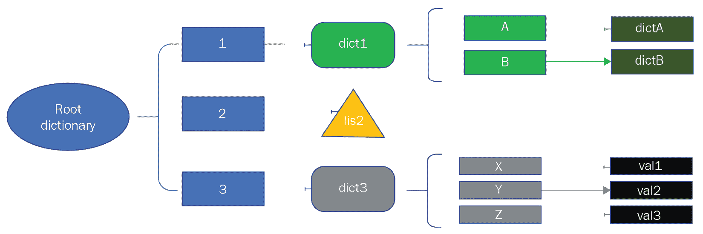
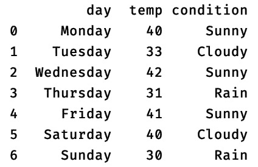
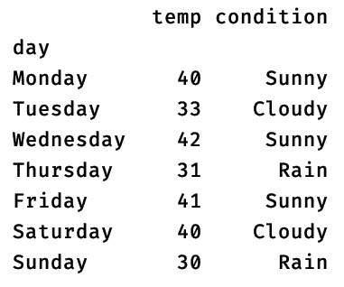
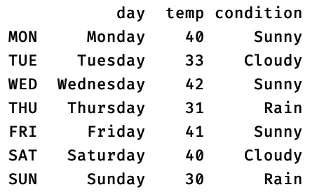

# 第六章：*第六章*：Python 的高级技巧和窍门

在本章中，我们将介绍一些高级技巧和窍门，这些技巧和窍门可以在编写 Python 代码时作为强大的编程技术使用。这包括 Python 函数的高级使用，如嵌套函数、lambda 函数以及使用函数构建装饰器。此外，我们将涵盖使用 filter、mapper 和 reducer 函数进行数据转换。接下来，我们将介绍一些与数据结构相关的技巧，例如嵌套字典和不同集合类型的理解。最后，我们将研究 pandas 库中 DataFrame 对象的先进功能。这些高级技巧和窍门不仅将展示 Python 在用更少的代码实现高级功能方面的强大能力，而且还将帮助您更快、更有效地编写代码。

本章将涵盖以下主题：

+   学习使用函数的高级技巧

+   使用数据结构理解高级概念

+   介绍使用 pandas DataFrame 的高级技巧

到本章结束时，您将了解如何使用 Python 函数实现高级功能，如数据转换和构建装饰器。此外，您还将学习如何使用包括 pandas DataFrame 在内的数据结构，用于基于分析的应用程序。

# 技术要求

本章的技术要求如下：

+   您需要在您的计算机上安装 Python 3.7 或更高版本。

+   您需要在 TestPyPI 上注册一个账户，并在您的账户下创建一个 API 令牌。

本章的示例代码可以在[`github.com/PacktPublishing/Python-for-Geeks/tree/master/Chapter06`](https://github.com/PacktPublishing/Python-for-Geeks/tree/master/Chapter06)找到。

我们将首先讨论 Python 中函数的高级概念。

# 学习使用函数的高级技巧

在 Python 和其他编程语言中使用函数对于可重用性和模块化至关重要。然而，随着现代编程语言的最新进展，函数的作用已经超越了可重用性，包括编写简单、简短和简洁的代码，而无需使用复杂的循环和条件语句。

我们将从`counter`、`zip`和`itertools`函数的使用开始，我们将在下一节中讨论这些函数。

## 介绍用于迭代任务的 counter、itertools 和 zip 函数

对于任何数据处理任务，开发者广泛使用迭代器。我们在*第四章*，*高级编程的 Python 库*中详细介绍了迭代器。在本节中，我们将学习关于下一级实用函数的内容，这些函数可以帮助您方便地处理迭代器和可迭代对象。这些包括`counter`模块、`zip`函数和`itertools`模块。我们将在以下小节中讨论这些内容。

### Counter

`Counter`类，我们将提供一个简单的代码示例，如下所示：

```py
#counter.py
from collections import Counter
#applying counter on a string object
print(Counter("people"))
#applying counter on a list object
my_counter = Counter([1,2,1,2,3,4,1,3])
print(my_counter.most_common(1))
print(list(my_counter.elements()))
#applying counter on a dict object
print(Counter({'A': 2, 'B': 2, 'C': 2, 'C': 3}))
```

在前面的代码示例中，我们使用一个`String`对象、一个列表对象和一个字典对象创建了多个`Counter`实例。`Counter`类有`most_common`和`elements`等方法。我们使用`most_common`方法并设置值为`1`，这会给我们返回`my-counter`容器中出现次数最多的元素。此外，我们还使用了`elements`方法从`Counter`实例返回原始列表。该程序的控制台输出应如下所示：

```py
Counter({'p': 2, 'e': 2, 'o': 1, 'l': 1})
[(1, 3)]
[1, 1, 1, 2, 2, 3, 3, 4]
Counter({'C': 4, 'A': 2, 'B': 2}) 
```

重要的是要注意，在字典对象的情况下，我们故意使用了重复的键，但在`Counter`实例中，我们只得到一个键值对，这是字典中的最后一个。此外，`Counter`实例中的元素根据每个元素的值进行排序。请注意，`Counter`类将字典对象转换为散列表对象。

### zip

`zip`函数用于根据两个或多个单独的迭代器创建一个聚合迭代器。当需要并行迭代多个迭代器时，`zip`函数非常有用。例如，在实现涉及插值或模式识别的数学算法时，我们可以使用`zip`函数。这也有助于数字信号处理，其中我们将多个信号（数据源）组合成一个单一信号。以下是一个使用`zip`函数的简单代码示例：

```py
#zip.py
num_list = [1, 2, 3, 4, 5]
lett_list = ['alpha', 'bravo', 'charlie']
zipped_iter = zip(num_list,lett_list)
print(next(zipped_iter))
print(next(zipped_iter))
print(list(zipped_iter))
```

在前面的代码示例中，我们通过使用`zip`函数将两个列表合并以进行迭代。请注意，从元素数量来看，一个列表比另一个列表大。该程序的输出应如下所示：

```py
(1, 'alpha')
(2, 'bravo')
[(3, 'charlie'), (4, 'delta')]
```

如预期，我们使用`next`函数获取前两个元组，这是来自每个列表对应元素的组合。最后，我们使用`list`构造函数遍历`zip`迭代器中的其余元组。这给我们提供了一个剩余元组的列表。

### itertools

Python 提供了一个名为`itertools`的模块，它提供了用于处理迭代器的有用函数。当处理大量数据时，迭代器的使用是必不可少的，这正是`itertool`模块提供的实用函数非常有帮助的地方。`itertools`模块提供了许多函数。在这里，我们将简要介绍几个关键函数：

+   `count`: 这个函数用于创建一个计数数字的迭代器。我们可以提供一个起始数字（默认为 0），并且可选地设置计数步长的尺寸。以下代码示例将返回一个提供计数数字的迭代器，例如 10、12 和 14：

    ```py
    #itertools_count.py
    import itertools
    iter = itertools.count(10, 2)
    print(next(iter))
    print(next(iter))
    ```

+   `cycle`: 这个函数允许你无限循环遍历一个迭代器。以下代码片段说明了如何使用此函数遍历字母表中的字母列表：

    ```py
    letters = {'A','B','C'}
    for letter in itertools.cycle(letters):
        print(letter)
    ```

+   `Repeat`：此函数为我们提供了一个迭代器，该迭代器会反复返回一个对象，除非设置了`times`参数。以下代码片段将重复`Python`字符串对象五次：

    ```py
    for x in itertools.repeat('Python', times=5):
        print(x)
    ```

+   `accumulate`：此函数将返回一个迭代器，该迭代器提供基于传递给此`accumulate`函数作为参数的聚合函数的累积总和或其他累积结果。以下代码示例将有助于理解该函数的使用方法：

    ```py
    #accumulate function without providing an aggregator function for any accumulated results. By default, the accumulate function will add two numbers (1 and 3) from the original list. This process is repeated for all numbers, and the results are stored inside an iterable (in our case, this is res). In the second part of this code example, we provided the mul (multiplication) function from the operator module, and this time, the accumulated results are based on the multiplication of two numbers.
    ```

+   `chain`：此函数将两个或多个可迭代对象组合起来，并返回一个组合的可迭代对象。请看以下示例代码，展示了两个可迭代对象（列表）以及`chain`函数的使用：

    ```py
    list1 = ['A','B','C']
    list2 = ['W','X','Y','Z']
    chained_iter = itertools.chain(list1, list2)
    for x in chained_iter:
        print(x)
    ```

    注意，此函数将以串行方式组合可迭代对象。这意味着`list1`中的项目将首先可用，然后是`list2`中的项目。

+   `compress`：此函数可以用来根据另一个可迭代对象过滤一个可迭代对象中的元素。在以下示例代码片段中，我们根据`selector`可迭代对象从列表中选择了字母：

    ```py
    letters = ['A','B','C']
    selector = [True, 0, 1]
    for x in selector iterable, we can use True*/*False or 1*/*0. The output of this program will be the letters A and C.
    ```

+   `groupby`：此函数识别可迭代对象中每个项目的键，并根据识别的键对项目进行分组。此函数需要一个额外的函数（称为`key_func`），用于在可迭代对象的每个元素中识别键。以下示例代码解释了该函数的使用方法以及如何实现`key_func`函数：

    ```py
    #itertools_groupby.py
    import itertools
    mylist = [("A", 100), ("A", 200), ("B", 30), \
    ("B", 10)]
    def get_key(group):
        return group[0]
    for key, grp in itertools.groupby(mylist, get_key):
        print(key + "-->", list(grp))
    ```

+   `tee`：这是另一个有用的函数，可以用来从单个迭代器中复制迭代器。以下是一个示例代码，展示了如何从一个列表可迭代对象中复制两个迭代器：

    ```py
    letters = ['A','B','C']
    iter1, iter2 = itertools.tee(letters)
    for x in iter1:
        print(x)
    for x in iter2:
        print(x)
    ```

接下来，我们将讨论另一个广泛用于数据转换的函数类别。

## 使用过滤器、映射器和归约器进行数据转换

`map`、`filter`和`reduce`是 Python 中可用的三个函数，用于简化代码并编写简洁的代码。这三个函数在单个操作中应用于可迭代对象，而不使用迭代语句。`map`和`filter`函数作为内置函数提供，而`reduce`函数则需要导入`functools`模块。这些函数被数据科学家广泛用于数据处理。`map`函数和`filter`函数用于转换或过滤数据，而`reduce`函数用于数据分析，以从大量数据集中获取有意义的成果。

在以下小节中，我们将评估每个函数及其应用和代码示例。

### 地图

Python 中的`map`函数定义如下语法：

```py
map(func, iter, ...)
```

`func`参数是要应用于`iter`对象每个项目的函数的名称。三个点表示可以传递多个可迭代对象。然而，重要的是要理解函数（`func`）的参数数量必须与可迭代对象的数量相匹配。`map`函数的输出是一个`map`对象，它是一个生成器对象。可以通过将`map`对象传递给`list`构造函数将其转换成列表。

重要提示

在 Python 2 中，`map`函数返回一个列表。这种行为在 Python 3 中已经改变。

在讨论`map`函数的使用之前，首先，我们将实现一个简单的转换函数，该函数将数字列表转换为它们的平方值。接下来的代码示例提供了：

```py
#map1.py to get square of each item in a list
mylist = [1, 2, 3, 4, 5]
new_list = []
for item in mylist:
    square = item*item
    new_list.append(square)
print(new_list)
```

在这里，代码示例使用`for`循环结构遍历列表，计算列表中每个条目的平方，并将其添加到新的列表中。这种编写代码的风格很常见，但绝对不是 Python 风格的编写代码方式。这个程序的输出如下：

```py
[1, 4, 9, 16, 25]
```

使用`map`函数，可以将此代码简化并缩短，如下所示：

```py
# map2.py to get square of each item in a list
def square(num):
    return num * num
mylist = [1, 2, 3, 4, 5]
new_list = list(map(square, mylist))
print(new_list)
```

通过使用`map`函数，我们提供了函数的名称（在这个例子中，它是`square`）和列表的引用（在这个例子中，它是`mylist`）。`map`函数返回的`map`对象通过使用`list`构造函数转换为列表对象。这个代码示例的控制台输出与之前的代码示例相同。

在下面的代码示例中，我们将为`map`函数提供两个列表作为输入：

```py
# map3.py to get product of each item in two lists
def product(num1, num2):
    return num1 * num2
mylist1 = [1, 2, 3, 4, 5]
mylist2 = [6, 7, 8, 9]
new_list = list(map(product, mylist1, mylist2))
print(new_list)
```

这次，已实现的`map`函数的目标是使用`product`函数。`product`函数从两个列表中取每个项目，并在返回之前将每个列表中对应的项相乘。

这个代码示例的控制台输出如下：

```py
[6, 14, 24, 36] 
```

对这个控制台输出的分析告诉我们，`map`函数只使用了每个列表的前四个项目。当`map`函数在任何一个可迭代对象（在我们的例子中，这些是两个列表）中运行完项目后，它会自动停止。这意味着即使我们提供了不同大小的可迭代对象，`map`函数也不会引发任何异常，但会为使用提供的函数在可迭代对象之间映射的项目数量工作。在我们的代码示例中，`mylist2`列表中的项目数量较少，是四个。这就是为什么输出列表中只有四个项目（在我们的例子中，这是`new_list`）。接下来，我们将通过一些代码示例讨论`filter`函数。

### filter

`filter`函数也作用于可迭代对象，但只作用于一个可迭代对象。正如其名称所暗示的，它为可迭代对象提供了过滤功能。过滤条件通过函数定义提供。`filter`函数的语法如下：

```py
 filter (func, iter)
```

`func` 函数提供过滤条件，并且必须返回 `True` 或 `False`。由于 `filter` 函数只能允许一个可迭代对象，因此 `func` 函数只能有一个参数。以下代码示例使用 `filter` 函数来选择值为偶数的项。为了实现选择标准，实现了 `is_even` 函数来评估传递给它的数字是否为偶数。示例代码如下：

```py
# filter1.py to get even numbers from a list
def is_even(num):
    return (num % 2 == 0)
mylist = [1, 2, 3, 4, 5,6,7,8,9]
new_list = list(filter(is_even, mylist))
print(new_list)
```

上述代码示例的控制台输出如下：

```py
[2, 4, 6, 8]
```

接下来，我们将讨论 `reduce` 函数。

### reduce

`reduce` 函数用于对序列中的每个元素应用累积处理函数，该函数作为参数传递给它。这个累积处理函数不是用于转换或过滤目的。正如其名称所暗示的，累积处理函数用于根据序列中的所有元素在最后得到一个单一的结果。使用 `reduce` 函数的语法如下：

```py
reduce (func, iter[,initial])
```

`func` 函数是一个用于对可迭代对象的每个元素应用累积处理的函数。此外，`initial` 是一个可选值，可以传递给 `func` 函数作为累积处理初始值的用途。重要的是要理解，对于 `reduce` 函数的情况，`func` 函数将始终有两个参数：第一个参数将是初始值（如果提供的话）或序列的第一个元素，第二个参数将是序列的下一个元素。

在下面的代码示例中，我们将使用一个简单的包含前五个数字的列表。我们将实现一个自定义方法来添加两个数字，然后使用 `reduce` 方法来计算列表中所有元素的总和。代码示例如下：

```py
# reduce1.py to get sum of numbers from a list
from functools import reduce
def seq_sum(num1, num2):
    return num1+num2
mylist = [1, 2, 3, 4, 5]
result = reduce(seq_sum, mylist)
print(result) 
```

该程序的输出是 `15`，这是列表中所有元素的数值总和（在我们的例子中，这被称为 `mylist`）。如果我们向 `reduce` 函数提供初始值，结果将根据初始值附加。例如，以下语句的相同程序的输出将是 `25`：

```py
result = reduce(seq_sum, mylist, 10)
```

如前所述，`reduce` 函数的结果或返回值是一个单一值，它遵循 `func` 函数。在这个例子中，它将是一个整数。

在本节中，我们讨论了 Python 中可用的 `map`、`filter` 和 `reduce` 函数。这些函数被数据科学家广泛用于数据转换和数据精炼。使用 `map` 和 `filter` 等函数的一个问题是，它们返回 `map` 或 `filter` 类型的对象，我们必须显式地将结果转换为 `list` 数据类型以进行进一步处理。列表推导式和生成器没有这样的限制，但提供类似的功能，并且相对更容易使用。这就是为什么它们比 `map`、`filter` 和 `reduce` 函数更受欢迎。我们将在 *使用数据结构理解高级概念* 部分讨论列表推导式和生成器。接下来，我们将研究 Lambda 函数的使用。

## 学习如何构建 Lambda 函数

Lambda 函数是基于单行表达式的匿名函数。正如使用 `def` 关键字来定义常规函数一样，使用 `lambda` 关键字来定义匿名函数。Lambda 函数限制在单行内。这意味着它们不能使用多个语句，也不能使用返回语句。单行表达式的评估后，返回值会自动返回。

Lambda 函数可以在常规函数可以使用的任何地方使用。Lambda 函数最简单、最方便的使用方式是与 `map`、`reduce` 和 `filter` 函数一起使用。当您希望使代码更简洁时，Lambda 函数非常有用。

为了说明 Lambda 函数，我们将重用我们之前讨论过的 map 和 filter 代码示例。在这些代码示例中，我们将用 Lambda 函数替换 `func`，如下面的代码片段所示：

```py
# lambda1.py to get square of each item in a list
mylist = [1, 2, 3, 4, 5]
new_list = list(map(lambda x: x*x, mylist))
print(new_list)
# lambda2.py to get even numbers from a list
mylist = [1, 2, 3, 4, 5, 6, 7, 8, 9]
new_list = list(filter(lambda x: x % 2 == 0, mylist))
print(new_list)
# lambda3.py to get product of corresponding item in the\
 two lists
mylist1 = [1, 2, 3, 4, 5]
mylist2 = [6, 7, 8, 9]
new_list = list(map(lambda x,y: x*y, mylist1, mylist2))
print(new_list)
```

虽然代码已经变得更加简洁，但我们应谨慎使用 Lambda 函数。这些函数是不可重用的，并且不易维护。在将 Lambda 函数引入我们的程序之前，我们需要重新思考这一点。任何更改或附加功能都不容易添加。一个经验法则是，在编写单独函数会带来开销时，仅使用 Lambda 函数进行简单的表达式。

## 在另一个函数中嵌入函数

当我们在现有函数内添加一个函数时，它被称为 `def` 关键字，并使用适当的缩进。内部函数不能被外部程序执行或调用。然而，如果外部函数返回内部函数的引用，调用者可以使用它来执行内部函数。我们将在以下小节中查看许多用例的内部函数引用示例。

内部函数有许多优点和应用。我们将在下面描述其中的一些。

### 封装

内部函数的一个常见用途是能够隐藏其功能对外部世界的可见性。内部函数仅在外部函数的作用域内可用，并且对全局作用域不可见。以下代码示例显示了一个隐藏内部函数的外部函数：

```py
#inner1.py
def outer_hello():
    print ("Hello from outer function")
    def inner_hello():
        print("Hello from inner function")
    inner_hello()
outer_hello()
```

从外部函数的外部，我们只能调用外部函数。内部函数只能从外部函数体内部调用。

### 辅助函数

在某些情况下，我们可能会发现自己处于一个函数内部代码可重用的情况。我们可以将此类可重用代码转换为单独的函数；否则，如果代码仅可在函数的作用域内重用，那么它就是一个构建内部函数的例子。这种内部函数也称为辅助函数。以下代码片段说明了这个概念：

```py
def outer_fn(x, y):
    def get_prefix(s):
        return s[:2] 
    x2 = get_prefix(x)
    y2 = get_prefix(y)
    #process x2 and y2 further
```

在前面的示例代码中，我们在一个外部函数内部定义了一个内部函数，称为`get_prefix`（一个辅助函数），用于过滤参数值的第一个两个字母。由于我们必须对所有参数重复此过滤过程，因此我们添加了一个辅助函数，以便在这个函数的作用域内重用，因为它专门针对这个函数。

### 闭包和工厂函数

这是一种内部函数大放异彩的使用案例。**闭包**是一个内部函数及其封装环境。闭包是一个动态创建的函数，可以被另一个函数返回。闭包的真正魔力在于返回的函数可以完全访问其创建时的变量和命名空间。即使封装函数（在这个上下文中，是外部函数）已经执行完毕，这也是正确的。

闭包概念可以通过代码示例来展示。以下代码示例展示了一个实现闭包工厂以创建计算基数值幂的函数的使用案例，并且基数值由闭包保留：

```py
# inner2.py
def power_calc_factory(base):
    def power_calc(exponent):
        return base**exponent
    return power_calc
power_calc_2 = power_gen_factory(2)
power_calc_3 = power_gen_factory(3)
print(power_calc_2(2))
print(power_calc_2(3))
print(power_calc_3(2))
print(power_calc_3(4))
```

在前面的代码示例中，外部函数（即`power_calc_factory`）充当闭包工厂函数，因为它在每次被调用时都会创建一个新的闭包，然后将其返回给调用者。此外，`power_calc`是一个内部函数，它从一个闭包命名空间中获取一个变量（即`base`），然后获取第二个变量（即`exponent`），该变量作为参数传递给它。请注意，最重要的语句是`return power_calc`。这个语句返回一个包含其封装环境的内部函数对象。

当我们第一次调用`power_calc_factory`函数并传递`base`参数时，会创建一个包含其命名空间、包括传递给它的参数的闭包，并将闭包返回给调用者。当我们再次调用相同的函数时，我们得到一个新的闭包，其中包含内部函数对象。在这个代码示例中，我们创建了 2 个闭包：一个`base`值为 2，另一个`base`值为 3。当我们通过传递不同的`exponent`变量值调用内部函数时，内部函数（在这种情况下，`power_calc`函数）也将能够访问已经传递给外部函数的`base`值。

这些代码示例说明了使用外部和内部函数动态创建函数的使用。传统上，内部函数用于在函数内部隐藏或封装功能。但当他们与作为创建动态函数的工厂的外部函数一起使用时，这成为内部函数最强大的应用。内部函数也用于实现装饰器。我们将在下一节中更详细地讨论这个问题。

## 使用装饰器修改函数行为

Python 中装饰器的概念基于**装饰器**设计模式，这是一种结构型设计模式。这种模式允许你在不改变对象实现的情况下向对象添加新行为。这种新行为被添加到特殊的包装对象中。

在 Python 中，**装饰器**是特殊的高阶函数，允许开发者在不修改现有函数（或方法）内部的情况下向其添加新功能。通常，这些装饰器被添加在函数定义之前。装饰器用于实现应用程序的许多功能，但在数据验证、日志记录、缓存、调试、加密和事务管理中特别受欢迎。

要创建一个装饰器，我们必须定义一个可调用实体（即函数、方法或类），它接受一个函数作为参数。可调用实体将返回另一个具有装饰器定义行为的函数对象。被装饰的函数（在本节的其余部分我们将称之为*装饰函数*）作为参数传递给实现装饰器的函数（在本节的其余部分我们将称之为*装饰器函数*）。装饰器函数除了执行传递给它的函数外，还会执行作为装饰器函数一部分添加的额外行为。

以下代码示例展示了装饰器的一个简单示例，其中我们定义了一个装饰器，在函数执行前后添加时间戳：

```py
# decorator1.py
from datetime import datetime
def add_timestamps(myfunc):
    def _add_timestamps():
        print(datetime.now())
        myfunc()
        print(datetime.now())
    return _add_timestamps
@add_timestamps
def hello_world():
    print("hello world")
hello_world()
```

在这个代码示例中，我们定义了一个`add_timestamps`装饰器函数，它接受任何函数作为参数。在内部函数`_add_timestamps`中，我们在函数执行前后获取当前时间，然后将这些时间作为参数传递。装饰器函数通过闭包返回内部函数对象。正如我们在上一节中讨论的那样，装饰器所做的不仅仅是巧妙地使用内部函数。使用`@`符号装饰函数等同于以下代码行：

```py
hello = add_timestamps(hello_world)
hello()
```

在这种情况下，我们通过传递函数名作为参数显式地调用装饰器函数。换句话说，装饰过的函数等于内部函数，它是定义在装饰器函数内部的。这正是 Python 在看到函数定义前有`@`符号的装饰器时，解释和调用装饰器函数的方式。

然而，当我们需要获取关于函数调用的额外细节时，会出现问题，这对于调试非常重要。当我们使用内置的`help`函数与`hello_world`函数一起使用时，我们只收到内部函数的帮助信息。如果我们使用文档字符串，也会发生同样的事情，它将适用于内部函数但不会适用于装饰过的函数。此外，对于装饰过的函数，序列化代码将是一个挑战。Python 为所有这些问题提供了一个简单的解决方案；这个解决方案就是使用`functools`库中的`wraps`装饰器。我们将修改之前的代码示例以包含`wraps`装饰器。完整的代码示例如下：

```py
# decorator2.py
from datetime import datetime
from functools import wraps
def add_timestamps(myfunc):
    @wraps(myfunc)
    def _add_timestamps():
        print(datetime.now())
        myfunc()
        print(datetime.now())
    return _add_timestamps
@add_timestamps
def hello_world():
    print("hello world")
hello_world()
help(hello_world)
print(hello_world)
```

使用`wraps`装饰器将提供关于嵌套函数执行的额外细节，如果我们运行提供的示例代码，我们可以在控制台输出中查看这些细节。

到目前为止，我们已经通过一个简单的装饰器示例来解释这个概念。在本节的剩余部分，我们将学习如何将函数的参数传递给装饰器，如何从装饰器中返回值，以及如何链式使用多个装饰器。首先，我们将学习如何使用装饰器传递属性并返回一个值。

### 使用具有返回值和参数的装饰函数

当我们的装饰过函数接受参数时，装饰这样的函数需要一些额外的技巧。一个技巧是在内部包装函数中使用`*args`和`**kwargs`。这将使内部函数能够接受任意数量的位置参数和关键字参数。以下是一个带有参数和返回值的装饰函数的简单示例：

```py
# decorator3.py
from functools import wraps
def power(func):
    @wraps(func)
    def inner_calc(*args, **kwargs):
        print("Decorating power func")
        n = func(*args, **kwargs)
        return n
    return inner_calc
@power
def power_base2(n):
    return 2**n
print(power_base2(3))
```

在前面的示例中，`inner_calc` 的内部函数接受 `*args` 和 `**kwargs` 的通用参数。要从内部函数（在我们的代码示例中为 `inner_calc`）返回一个值，我们可以保留从函数返回的值（在我们的代码示例中，这是 `func` 或 `power_base2(n)`），该函数在我们的内部函数内部执行，并从 `inner_calc` 的内部函数返回最终的返回值。

### 建立具有其自身参数的装饰器

在前面的示例中，我们使用了所谓的 `decorator3.py` 示例。在修订版中，我们计算作为装饰器参数传递的基数值的幂。您可以通过以下方式查看使用嵌套装饰器函数的完整代码示例：

```py
# decorator4.py
from functools import wraps
def power_calc(base):
    def inner_decorator(func):
        @wraps(func)
        def inner_calc(*args, **kwargs):
            exponent = func(*args, **kwargs)
            return base**exponent
        return inner_calc
    return inner_decorator
@power_calc(base=3)
def power_n(n):
    return n
print(power_n(2))
print(power_n(4))
```

以下是这个代码示例的工作原理：

+   `power_calc` 装饰器函数接受一个参数 `base` 并返回 `inner_decorator` 函数，这是一个标准的装饰器实现。

+   `inner_decorator` 函数接受一个函数作为参数，并返回用于实际计算的 `inner_calc` 函数。

+   `inner_calc` 函数调用装饰函数以获取 `exponent` 属性（在这种情况下）然后使用 `base` 属性，该属性作为参数传递给外部的装饰器函数。正如预期的那样，围绕内部函数的闭包使得 `base` 属性的值对 `inner_calc` 函数可用。

接下来，我们将讨论如何使用一个以上的装饰器与一个函数或方法一起使用。

### 使用多个装饰器

我们多次了解到，使用一个以上的装饰器与一个函数一起使用是可能的。这可以通过链式装饰器实现。链式装饰器可以是相同的也可以是不同的。这可以通过在函数定义之前将装饰器一个接一个地放置来实现。当使用一个以上的装饰器与一个函数一起使用时，装饰函数只执行一次。为了说明其实现和实际应用，我们选择了一个示例，在该示例中，我们使用时间戳将消息记录到目标系统。时间戳是通过一个单独的装饰器添加的，目标系统也是基于另一个装饰器选择的。以下代码示例显示了三个装饰器的定义，即 `add_time_stamp`、`file` 和 `console`：

```py
# decorator5.py (part 1)
from datetime import datetime
from functools import wraps
def add_timestamp(func):
    @wraps(func)
    def inner_func(*args, **kwargs):
        res = "{}:{}\n".format(datetime.now(),func(*args,\
          **kwargs))
        return res
    return inner_func
def file(func):
    @wraps(func)
    def inner_func(*args, **kwargs):
        res = func(*args, **kwargs)
        with open("log.txt", 'a') as file:
           file.write(res)
        return res
    return inner_func
def console(func):
    @wraps(func)
    def inner_func(*args, **kwargs):
        res = func(*args, **kwargs)
        print(res)
        return res
    return inner_func
```

在前面的代码示例中，我们实现了三个装饰器函数。它们如下：

+   `file`: 这个装饰器使用一个预定义的文本文件，并将装饰函数提供的消息添加到文件中。

+   `console`: 这个装饰器将装饰函数提供的消息输出到控制台。

+   `add_timestamp`: 这个装饰器在装饰函数提供的消息之前添加一个时间戳。这个装饰器函数的执行必须在文件或控制台装饰器之前，这意味着这个装饰器必须放在装饰器链的末尾。

在以下代码片段中，我们可以在主程序中的不同函数中使用这些装饰器：

```py
#decorator5.py (part 2)
@file
@add_timestamp
def log(msg):
    return msg
@file
@console
@add_timestamp
def log1(msg):
    return msg
@console
@add_timestamp
def log2(msg):
    return msg
log("This is a test message for file only")
log1("This is a test message for both file and console")
log2("This message is for console only")
```

在前面的代码示例中，我们使用前面定义的三个装饰器函数的不同组合来展示来自同一日志函数的不同行为。在第一种组合中，我们只在添加时间戳后向文件输出消息。在第二种组合中，我们同时向文件和控制台输出消息。在最后一种组合中，我们只向控制台输出消息。这显示了装饰器提供的灵活性，而无需更改函数。值得一提的是，装饰器在简化代码和以简洁的方式添加行为方面非常有用，但它们在执行期间会产生额外的开销。装饰器的使用应限制在那些收益足以弥补任何开销成本的场景中。

这结束了我们对高级函数概念和技巧的讨论。在下一节中，我们将转向与数据结构相关的一些高级概念。

# 使用数据结构理解高级概念

Python 提供了对数据结构的全面支持，包括存储数据、访问数据以进行处理和检索的关键工具。在 *第四章* *高级编程的 Python 库* 中，我们讨论了 Python 中可用的数据结构对象。在本节中，我们将介绍一些高级概念，例如字典中的字典以及如何使用数据结构进行推导。我们将从在字典中嵌入字典开始。

## 在字典中嵌入字典

在一个字典中嵌套另一个字典或嵌套字典是将一个字典放入另一个字典的过程。嵌套字典在许多现实世界的例子中非常有用，尤其是在你处理和转换一种格式到另一种格式的数据时。

*图 6.1* 展示了一个嵌套字典。根字典在键`1`和键`3`处有两个字典。键`1`对应的字典内部还有其他字典。键`3`对应的字典是一个常规字典，其条目是键值对：




图 6.1：字典中嵌套字典的示例

*图 6.1* 中显示的根字典可以写成以下形式：

```py
root_dict = {'1': {'A': {dictA}, 'B':{dictB}},
             '2': [list2],
             '3': {'X': val1,'Y':val2,'Z': val3}
            }
```

这里，我们创建了一个根字典，其中包含字典对象和列表对象的混合。

### 创建或定义嵌套字典

可以通过在花括号内放置以逗号分隔的字典来定义或创建嵌套字典。为了演示如何创建嵌套字典，我们将创建一个学生字典。每个学生条目将包含另一个字典，其中包含`name`和`age`作为其元素，这些元素映射到他们的学生编号：

```py
# dictionary1.py
dict1 = {100:{'name':'John', 'age':24},
         101:{'name':'Mike', 'age':22},
         102:{'name':'Jim', 'age':21} }
print(dict1)
print(dict1.get(100))
```

接下来，我们将学习如何动态创建字典以及如何添加或更新嵌套字典元素。

### 向嵌套字典中添加内容

要动态创建字典或在现有嵌套字典中添加元素，我们可以使用多种方法。在下面的代码示例中，我们将使用三种不同的方法来构建嵌套字典。它们与我们在`dictionary1.py`模块中定义的方法相同：

+   在第一种情况下，我们将通过直接分配键值对项并将它分配给根字典中的一个键来构建一个内部字典（即`student101`）。在可能的情况下，这是首选方法，因为代码既易于阅读也易于管理。

+   在第二种情况下，我们创建了一个空的内部字典（即`student102`），并通过赋值语句将值分配给键。当值可以通过其他数据结构获得时，这也是一个首选方法。

+   在第三种情况下，我们直接为根字典的第三个键初始化一个空目录。初始化过程完成后，我们使用双重索引（即两个键）分配值：第一个键用于根字典，第二个键用于内部字典。这种方法使代码简洁，但如果代码的可读性对维护很重要，则不是首选方法。

这三个不同情况的完整代码示例如下：

```py
# dictionary2.py
#defining inner dictionary 1
student100 = {'name': 'John', 'age': 24}
#defining inner dictionary 2
student101 = {}
student101['name'] = 'Mike'
student101['age'] = '22'
#assigning inner dictionaries 1 and 2 to a root dictionary
dict1 = {}
dict1[100] = student100
dict1[101] = student101
#creating inner dictionary directly inside a root \
dictionary
dict1[102] = {}
dict1[102]['name'] = 'Jim'
dict1[102]['age'] = '21'
print(dict1)
print(dict1.get(102))
```

接下来，我们将讨论如何访问嵌套字典中的不同元素。

### 访问嵌套字典中的元素

如我们之前讨论的，要在字典内部添加值和字典，我们可以使用双重索引。或者，我们可以使用字典对象的`get`方法。同样的方法适用于从内部字典访问不同元素。以下是一个示例代码，说明如何使用`get`方法和双重索引从内部字典中访问不同元素：

```py
# dictionary3.py
dict1 = {100:{'name':'John', 'age':24},
         101:{'name':'Mike', 'age':22},
         102:{'name':'Jim', 'age':21} }
print(dict1.get(100))
print(dict1.get(100).get('name'))
print(dict1[101])
print(dict1[101]['age'])
```

接下来，我们将检查如何从内部字典中删除内部字典或键值对项。

### 从嵌套字典中删除

要删除字典或字典中的元素，我们可以使用通用的`del`函数，或者我们可以使用`dictionary`对象的`pop`方法。在下面的示例代码中，我们将展示`del`函数和`pop`方法的使用：

```py
# dictionary4.py
dict1 = {100:{'name':'John', 'age':24},
         101:{'name':'Mike', 'age':22},
         102:{'name':'Jim', 'age':21} }
del (dict1[101]['age'])
print(dict1)
dict1[102].pop('age')
print(dict1)
```

在下一节中，我们将讨论理解如何帮助处理来自不同数据结构类型的数据。

## 使用推导

**理解**是一种快速构建新序列（如列表、集合和字典）的方法，这些新序列是从现有序列中生成的。Python 支持四种不同类型的理解，如下所示：

+   列表推导

+   字典推导

+   集合推导

+   生成器推导

我们将在以下小节中简要概述每种理解类型，并附上代码示例。

### 列表推导

**列表推导**涉及使用循环和（如果需要）条件语句创建动态列表。

几个使用列表推导的示例将帮助我们更好地理解这个概念。在第一个示例（即 `list1.py`）中，我们将通过给原始列表的每个元素加 1 来创建一个新的列表。以下是代码片段：

```py
#list1.py
list1 = [1, 2, 3, 4, 5, 6, 7, 8, 9, 0]
list2 = [x+1 for x in list1]
print(list2)
```

在这种情况下，新列表将通过使用 `x+1` 表达式来创建，其中 `x` 是原始列表中的一个元素。这等同于以下传统代码：

```py
list2 = []
for x in list1:
    list2.append(x+1)
```

使用列表推导，我们可以只用一行代码就实现这三行代码。

在第二个示例（即 `list2.py`）中，我们将从原始的 1 到 10 的数字列表中创建一个新的列表，但只包含偶数。我们可以通过简单地在之前的代码示例中添加一个条件来实现这一点，如下所示：

```py
#list2.py
list1 = [1, 2, 3, 4, 5, 6, 7, 8, 9, 10]
list2 = [x for x in list1 if x % 2 == 0]
print(list2)
```

如你所见，条件被添加到推导表达式的末尾。接下来，我们将讨论如何使用推导来构建字典。

### 字典推导

也可以通过使用**字典推导**来创建字典。字典推导与列表推导类似，是一种从另一个字典中条件性地选择或转换条目的方法。以下代码片段展示了如何从一个现有字典中创建一个新字典，该字典包含小于或等于 200 的元素，并且通过将每个选定的值除以 2 来实现。请注意，值在推导表达式中也被转换回整数：

```py
#dictcomp1.py
dict1 = {'a': 100, 'b': 200, 'c': 300}
dict2 = {x:int(y/2) for (x, y) in dict1.items() if y <=200}
print(dict2)
```

如果使用传统的编程方式来实现，这段字典推导代码等同于以下代码片段：

```py
Dict2 = {}
for x,y in dict1.items():
    if y <= 200:
        dict2[x] = int(y/2)
```

注意，推导可以显著减少代码量。接下来，我们将讨论集合推导。

### 集合推导

与列表推导类似，也可以使用**集合推导**来创建集合。使用集合推导创建集合的代码语法与列表推导类似。区别在于我们将使用花括号而不是方括号。在以下代码片段中，你可以查看使用集合推导从一个列表中创建集合的示例：

```py
#setcomp1.py
list1 = [1, 2, 6, 4, 5, 6, 7, 8, 9, 10, 8]
set1 = {x for x in list1 if x % 2 == 0}
print(set1)
```

这段集合推导代码等同于以下使用传统编程方式的代码片段：

```py
Set1 = set()
for x in list1:
    if x % 2 == 0:
        set1.add(x)
```

如预期的那样，集合中会丢弃重复的条目。

这就结束了我们对 Python 中不同数据结构可用的推导类型的讨论。接下来，我们将讨论数据结构可用的过滤选项。

# 介绍使用 pandas DataFrame 的高级技巧

**pandas** 是一个开源的 Python 库，它提供了高性能数据操作工具，使数据分析变得快速且简单。pandas 库的典型用途包括重塑、排序、切片、聚合和合并数据。

pandas 库建立在**NumPy**库之上，NumPy 是另一个用于处理数组的 Python 库。NumPy 库比传统的 Python 列表要快得多，因为数据在内存中存储在一个连续的位置，而传统列表则不是这样。

pandas 库处理三个关键数据结构，如下所示：

+   `Series`: 这是一个单维数组样式的对象，包含数据数组和数据标签数组。数据标签数组称为`index`。如果用户没有明确指定，`index`可以使用从*0 到 n-1*的整数自动指定。

+   `DataFrame`: 这是表格数据的表示，例如包含列列表的工作表。DataFrame 对象有助于在行和列中存储和操作表格数据。有趣的是，DataFrame 对象既有列索引也有行索引。

+   `Panel`: 这是一个三维数据容器。

DataFrame 是数据分析中使用的关键数据结构。在本节的剩余部分，我们将广泛使用 DataFrame 对象在我们的代码示例中。在我们讨论有关这些 pandas DataFrame 对象的任何高级技巧之前，我们将快速回顾 DataFrame 对象的基本操作。

## 学习 DataFrame 操作

我们将首先创建 DataFrame 对象。创建 DataFrame 的方法有很多，例如从字典、CSV 文件、Excel 表或从 NumPy 数组创建。其中一种最简单的方法是使用字典中的数据作为输入。以下代码片段显示了如何根据存储在字典中的每周天气数据构建 DataFrame 对象：

```py
# pandas1.py
import pandas as pd
weekly_data = {'day':['Monday','Tuesday', 'Wednesday', \
'Thursday','Friday', 'Saturday', 'Sunday'],
               'temperature':[40, 33, 42, 31, 41, 40, 30],
               'condition':['Sunny','Cloudy','Sunny','Rain'
               ,'Sunny','Cloudy','Rain']
        }
df = pd.DataFrame(weekly_data)
print(df)
```

控制台输出将显示 DataFrame 的内容如下：



图 6.2 – DataFrame 的内容

pandas 库在方法和属性方面非常丰富。然而，本节的范围超出了涵盖所有这些内容。相反，我们将快速总结 DataFrame 对象常用的属性和方法，以便在使用即将到来的代码示例之前刷新我们的知识：

+   `index`: 此属性提供了 DataFrame 对象的索引（或标签）列表。

+   `columns`: 此属性提供了 DataFrame 对象中的列列表。

+   `size`: 这返回 DataFrame 对象的大小，即行数乘以列数。

+   `shape`: 这为我们提供了一个表示 DataFrame 对象维度的元组。

+   `axes`: 此属性返回一个表示 DataFrame 对象轴的列表。简单来说，它包括行和列。

+   `describe`: 此强大方法生成统计数据，如计数、平均值、标准差以及最小值和最大值。

+   `head`: 此方法从类似于文件中 head 命令的 DataFrame 对象返回*n*（默认=5）行。

+   `tail`：此方法从 DataFrame 对象返回最后 *n* 行（默认 = 5）。

+   `drop_duplicates`：此方法基于 DataFrame 中的所有列删除重复行。

+   `dropna`：此方法从 DataFrame 中删除缺失值（如行或列）。通过传递适当的参数给此方法，我们可以删除行或列。此外，我们可以设置是否基于缺失值的单次出现或仅当行或列中的所有值都缺失时删除行或列。

+   `sort_values`：此方法可用于根据单个或多个列对行进行排序。

在以下章节中，我们将回顾 DataFrame 对象的一些基本操作。

### 设置自定义索引

列标签（索引）通常是按照提供的字典中的数据或根据使用的其他输入数据流添加的。我们可以使用以下选项之一更改 DataFrame 的索引：

+   通过使用简单语句，如以下示例，将其中一个数据列设置为索引，例如之前提到的 `day`：

    ```py
    df_new = df.set_index('day')
    ```

    DataFrame 将开始使用 `day` 列作为索引列，其内容如下：

    ![图 6.3 – 使用 `day` 列作为索引后 DataFrame 的内容    

图 6.3 – 使用 `day` 列作为索引后 DataFrame 的内容

+   通过提供列表手动设置索引，如下所示代码片段：

    ```py
    # pandas2.py
    weekly_data = <same as previous example>
    df = pd.DataFrame(weekly_data)
    df.index = ['MON','TUE','WED','THU','FRI','SAT','SUN']
    print(df)
    ```

    使用此代码片段，DataFrame 将开始使用我们通过列表对象提供的索引。DataFrame 的内容将显示此更改如下：



图 6.4 – 设置索引列的自定义条目后 DataFrame 的内容

接下来，我们将讨论如何使用特定的索引和列在 DataFrame 中进行导航。

### 在 DataFrame 内部导航

有几十种方法可以从 DataFrame 对象中获取一行数据或特定位置的数据。在 DataFrame 内部导航的典型方法有 `loc` 和 `iloc` 方法。我们将通过使用与上一个示例相同的样本数据，探索如何使用这些方法在 DataFrame 对象中导航的几种选项：

```py
# pandas3.py
import pandas as pd
weekly_data = <same as in pandas1.py example>
df = pd.DataFrame(weekly_data)
df.index = ['MON', 'TUE','WED','THU','FRI','SAT','SUN']
```

接下来，我们将讨论一些关于如何在 DataFrame 对象中选择行或位置的技巧，并附上代码示例：

+   我们可以使用 `loc` 方法通过索引标签选择一行或多行。索引标签以单个项或列表的形式提供。在以下代码片段中，我们展示了如何选择一行或多行的两个示例：

    ```py
    print(df.loc['TUE'])
    print(df.loc[['TUE','WED']])
    ```

+   我们可以使用行索引标签和列标签从 DataFrame 对象的某个位置选择一个值，如下所示：

    ```py
    print(df.loc['FRI','temp'])
    ```

+   我们也可以通过不提供任何标签而使用索引值来选择一行：

    ```py
    #Provide a row with index 2
    print(df.iloc[2])
    ```

+   我们可以通过将 DataFrame 对象视为二维数组，使用行索引值和列索引值来从位置选择一个值。在下一个代码片段中，我们将从行索引 = 2 和列索引 = 2 的位置获取一个值：

    ```py
    print(df.iloc[2,2])
    ```

接下来，我们将讨论如何向 DataFrame 对象中添加一行或一列。

### 向 DataFrame 中添加行或列

向 DataFrame 对象中添加一行的最简单方法是将一个值列表赋给一个索引位置或索引标签。例如，我们可以通过以下语句为前一个示例（即 `pandas3.py`）添加一个带有 `TST` 标签的新行：

```py
 df.loc['TST'] = ['Test day 1', 50, 'NA']
```

重要的是要注意，如果行标签已经在 DataFrame 对象中存在，相同的代码行可以更新带有新值的行。

如果我们不是使用索引标签而是默认索引，我们可以使用索引号通过以下代码行来更新现有行或添加新行：

```py
df.loc[8] = ['Test day 2', 40, 'NA']
```

以下是一个完整的代码示例供参考：

```py
# pandas4.py
import pandas as pd
weekly_data = <same as in pandas1.py example>
df = pd.DataFrame(weekly_data)
df.index = ['MON', 'TUE','WED','THU','FRI','SAT','SUN']
df.loc['TST1'] = ['Test day 1', 50, 'NA']
df.loc[7] = ['Test day 2', 40, 'NA']
print(df)
```

要向 DataFrame 对象中添加新列，pandas 库中提供了多种选项。我们将仅展示三种选项，如下：

+   **在列标签旁边添加值列表**：此方法将在现有列之后添加列。如果我们使用现有的列标签，此方法也可以用于更新或替换现有列。

+   **使用 insert 方法**：此方法将接受一个标签和一个值列表作为参数。当您想在任何位置插入列时，此方法特别有用。请注意，此方法不允许在 DataFrame 对象中已存在具有相同标签的列的情况下插入列。这意味着此方法不能用于更新现有列。

+   **使用 assign 方法**：当您想一次添加多个列时，此方法很有用。如果我们使用现有的列标签，此方法也可以用于更新或替换现有列。

在以下代码示例中，我们将使用三种方法中的所有三种来向 DataFrame 对象中插入新列：

```py
# pandas5.py
import pandas as pd
weekly_data = <same as in pandas1.py example>
df = pd.DataFrame(weekly_data)
#Adding a new column and then updating it
df['Humidity1'] = [60, 70, 65,62,56,25,'']
df['Humidity1'] = [60, 70, 65,62,56,251,'']
#Inserting a column at column index of 2 using the insert method
df.insert(2, "Humidity2",[60, 70, 65,62,56,25,''])
#Adding two columns using the assign method
df1 = df.assign(Humidity3 = [60, 70, 65,62,56,25,''],  Humidity4 = [60, 70, 65,62,56,25,''])
print(df1)
```

接下来，我们将评估如何从 DataFrame 对象中删除行和列。

### 从 DataFrame 中删除索引、行或列

删除索引相对简单，您可以使用 `reset_index` 方法来完成。然而，`reset_index` 方法会添加默认索引并保留自定义索引列作为数据列。要完全删除自定义索引列，我们必须使用 `drop` 参数与 `reset_index` 方法一起使用。以下代码片段使用了 `reset_index` 方法：

```py
# pandas6.py
import pandas as pd
weekly_data = <same as in pandas1.py example>
df = pd.DataFrame(weekly_data)
df.index = ['MON', 'TUE','WED','THU','FRI','SAT','SAT']
print(df)
print(df.reset_index(drop=True))
```

要从 DataFrame 对象中删除重复行，我们可以使用 `drop_duplicate` 方法。要删除特定的行或列，我们可以使用 `drop` 方法。在以下代码示例中，我们将删除任何带有 `SAT` 和 `SUN` 标签的行以及任何带有 `condition` 标签的列：

```py
#pandas7.py
import pandas as pd
weekly_data = <same as in pandas1.py example>
df = pd.DataFrame(weekly_data)
df.index = ['MON', 'TUE','WED','THU','FRI','SAT','SUN']
print(df)
df1= df.drop(index=['SUN','SAT'])
df2= df1.drop(columns=['condition'])
print(df2)
```

接下来，我们将检查如何重命名索引或列。

### 在 DataFrame 中重命名索引和列

要重命名索引或列标签，我们将使用 `rename` 方法。以下是如何重命名索引和列的代码示例：

```py
#pandas8.py
import pandas as pd
weekly_data = <same as in pandas1.py example>
df = pd.DataFrame(weekly_data)
df.index = ['MON', 'TUE','WED','THU','FRI','SAT','SUN']
df1=df.rename(index={'SUN': 'SU', 'SAT': 'SA'})
df2=df1.rename(columns={'condition':'cond'})
print(df2)
```

重要的是要注意，当前标签和新标签作为字典提供。接下来，我们将讨论一些使用 DataFrame 对象的高级技巧。

## 学习 DataFrame 对象的高级技巧

在上一节中，我们评估了可以在 DataFrame 对象上执行的基本操作。在本节中，我们将探讨 DataFrame 对象数据评估和转换的下一级操作。这些操作将在以下子节中讨论。

### 替换数据

一个常见的需求是将数值数据或字符串数据替换为另一组值。pandas 库提供了许多选项来执行此类数据替换。这些操作中最受欢迎的方法是使用 `at` 方法。`at` 方法提供了一种简单的方式来访问或更新 DataFrame 中的任何单元格中的数据。对于批量替换操作，您还可以使用 `replace` 方法，并且我们可以以多种方式使用此方法。例如，我们可以使用此方法将一个数字替换为另一个数字或一个字符串替换为另一个字符串，或者我们可以替换任何匹配正则表达式的项。此外，我们可以使用此方法替换通过列表或字典提供的任何条目。在以下代码示例（即 `pandastrick1.py`）中，我们将涵盖这些替换选项的大部分。对于此代码示例，我们将使用与之前代码示例相同的 DataFrame 对象。以下是示例代码：

```py
# pandastrick1.py
import pandas as pd
weekly_data = <same as in pandas1.py example>
df = pd.DataFrame(weekly_data)
```

接下来，我们将逐一探索对这个 DataFrame 对象的几个替换操作：

+   使用以下语句在 DataFrame 对象中将所有出现的 `40` 的数值替换为 `39`：

    ```py
    df.replace(40,39, inplace=True)
    ```

+   使用以下语句在 DataFrame 对象中将所有出现的 `Sunny` 字符串替换为 `Sun`：

    ```py
    df.replace("Sunny","Sun",inplace=True)
    ```

+   使用以下语句替换基于正则表达式的字符串（目的是将 `Cloudy` 替换为 `Cloud`）：

    ```py
    df.replace(to_replace="^Cl.*",value="Cloud", inplace=True,regex=True)
    #or we can apply on a specific column as well. 
    df["condition"].replace(to_replace="^Cl.*",value="Cloud", inplace=True,regex=True)
    ```

    注意，使用 `to_replace` 和 `value` 参数标签是可选的。

+   使用以下语句将表示为列表的多个字符串替换为另一个字符串列表：

    ```py
    df.replace(["Monday","Tuesday"],["Mon","Tue"], inplace=True)
    ```

    在此代码中，我们将 `Monday` 和 `Tuesday` 替换为 `Mon` 和 `Tue`。

+   使用字典中的键值对替换 DataFrame 对象中的多个字符串。您可以通过以下语句来完成此操作：

    ```py
    df.replace({"Wednesday":"Wed","Thursday":"Thu"}, inplace=True)
    ```

    在这种情况下，字典的键（即 `Wednesday` 和 `Thursday`）将被它们对应的值（即 `Wed` 和 `Thu`）替换。

+   使用多个字典替换特定列中的字符串。您可以通过使用列名作为字典的键以及如下示例语句来完成此操作：

    ```py
    df.replace({"day":"Friday"}, {"day":"Fri"}, inplace=True)
    ```

    在这种情况下，第一个字典用于指示列名和要替换的值。第二个字典用于指示相同的列名，但具有将替换原始值的值。在我们的例子中，我们将 `day` 列中所有 `Friday` 的实例替换为 `Fri` 的值。

+   使用嵌套字典替换多个字符串的出现。你可以通过以下代码示例来完成此操作：

    ```py
    df.replace({"day":{"Saturday":"Sat", "Sunday":"Sun"},
                "condition":{"Rainy":"Rain"}}, inplace=True)
    ```

    在这种情况下，外层字典（在我们的代码示例中包含 `day` 和 `condition` 键）用于标识此操作的列，内层字典用于存储要替换的数据以及替换值。通过使用这种方法，我们在 `day` 列中将 `Saturday` 和 `Sunday` 替换为 `Sat` 和 `Sun`，在 `condition` 列中将 `Rainy` 字符串替换为 `Rain`。

包含所有这些示例操作的完整代码位于本章源代码中的 `pandastrick1.py`。请注意，我们可以触发跨 DataFrame 对象的替换操作，或者将其限制在特定的列或行。

重要提示

`inplace=True` 参数与所有 `replace` 方法调用一起使用。此参数用于在同一个 DataFrame 对象内设置 `replace` 方法的输出。默认选项是返回一个新的 DataFrame 对象，而不更改原始对象。此参数在许多 DataFrame 方法中可用，以方便使用。

### 将函数应用于 DataFrame 对象的列或行

有时，我们在开始数据分析之前想要清理数据、调整数据或转换数据。有一种简单的方法可以在 DataFrame 上应用某种类型的函数，使用 `apply`、`applymap` 或 `map` 方法。`apply` 方法适用于列或行，而 `applymap` 方法对整个 DataFrame 的每个元素进行操作。相比之下，`map` 方法对单个序列的每个元素进行操作。现在，我们将通过几个代码示例来讨论 `apply` 和 `map` 方法的使用。

通常，将数据导入 DataFrame 对象时可能需要进行一些清理。例如，它可能有尾随或前导空格、换行符或任何不需要的字符。这些可以通过使用 `map` 方法和列序列上的 lambda 函数轻松地从数据中删除。lambda 函数用于列的每个元素。在我们的代码示例中，首先，我们将删除尾随空格、句点和逗号。然后，我们将删除 `condition` 列的前导空格、下划线和破折号。

在清理 `condition` 列中的数据之后，下一步是从 `temp` 列的值创建一个新的 `temp_F` 列，并将它们从摄氏单位转换为华氏单位。请注意，我们将为此转换使用另一个 lambda 函数，并使用 `apply` 方法。当我们从 `apply` 方法得到结果时，我们将它存储在一个新的列标签 `temp_F` 中，以创建一个新的列。以下是完整的代码示例：

```py
# pandastrick2.py
import pandas as pd
weekly_data = {'day':['Monday','Tuesday', 'Wednesday',                    'Thursday','Friday', 'Saturday', 'Sunday'],
                'temp':[40, 33, 42, 31, 41, 40, 30],
                'condition':['Sunny,','_Cloudy ',                'Sunny','Rainy','--Sunny.','Cloudy.','Rainy']
        }
df = pd.DataFrame(weekly_data)
print(df)
df["condition"] = df["condition"].map(
                lambda x: x.lstrip('_- ').rstrip(',. '))
df["temp_F"] = df["temp"].apply(lambda x: 9/5*x+32 )
print(df)
```

注意，对于前面的代码示例，我们提供了与之前示例相同的输入数据，除了我们在 `condition` 列的数据中添加了尾随和前导字符。

### 在 DataFrame 对象中查询行

要根据某一列的值查询行，一种常见的方法是应用使用 *AND* 或 *OR* 逻辑运算的过滤器。然而，对于像在值范围内搜索行这样的简单需求，这很快就会变得杂乱无章。pandas 库提供了一个更干净的工具：`between` 方法，它在某种程度上类似于 SQL 中的 *between* 关键字。

以下代码示例使用了我们在上一个示例中使用的相同的 `weekly_data` DataFrame 对象。首先，我们将展示传统过滤器的使用，然后我们将展示使用 `between` 方法查询温度值在 30 到 40（包括）之间的行：

```py
# pandastrick3.py
import pandas as pd
weekly_data = <same as in pandas1.py example>
df = pd.DataFrame(weekly_data)
print(df[(df.temp >= 30) & (df.temp<=40)])
print(df[df.temp.between(30,40)])
```

我们得到了两种方法都相同的控制台输出。然而，使用 `between` 方法比编写条件过滤器要方便得多。

在 pandas 库中，基于文本数据的行查询也得到了很好的支持。这可以通过在 DataFrame 对象的字符串类型列上使用 `str` 访问器来实现。例如，如果我们想根据 `Rainy` 或 `Sunny` 等条件在我们的 `weekly_data` DataFrame 对象中搜索行，我们既可以编写传统的过滤器，也可以在具有 `contains` 方法的列上使用 `str` 访问器。以下代码示例说明了使用这两种选项获取 `condition` 列中数据值为 `Rainy` 或 `Sunny` 的行：

```py
# pandastrick4.py
import pandas as pd
weekly_data = <same as in pandas1.py example>
df = pd.DataFrame(weekly_data)
print(df[(df.condition=='Rainy') | (df.condition=='Sunny')])
print(df[df['condition'].str.contains('Rainy|Sunny')])
```

如果你运行前面的代码，你会发现我们用于搜索数据的两种方法都得到了相同的控制台输出。

### 获取 DataFrame 对象数据的统计信息

要获取诸如集中趋势、标准差和形状之类的统计数据，我们可以使用 `describe` 方法。`describe` 方法的数值列输出包括以下内容：

+   `count`

+   `mean`

+   `standard deviation`

+   `min`

+   `max`

+   `25`th 百分位数，`50`th 百分位数，`75`th 百分位数

可以通过使用 `percentiles` 参数并指定所需的分解来更改百分位数的默认分解。

如果 `describe` 方法用于非数值数据，例如字符串，我们将得到 *count*、*unique*、*top* 和 *freq*。*top* 值是最常见的值，而 *freq* 是最常见的值频率。默认情况下，除非我们提供带有适当值的 `include` 参数，否则 `describe` 方法只会评估数值列。

在下面的代码示例中，我们将评估同一个 `weekly_date` DataFrame 对象：

+   使用或不用 `include` 参数的 `describe` 方法

+   使用 `describe` 方法的 `percentiles` 参数

+   使用 `groupby` 方法按列分组数据，然后在其上使用 `describe` 方法

完整的代码示例如下：

```py
# pandastrick5.py
import pandas as pd
import numpy as np
pd.set_option('display.max_columns', None)
weekly_data = <same as in pandas1.py example>
df = pd.DataFrame(weekly_data)
print(df.describe())
print(df.describe(include="all"))
print(df.describe(percentiles=np.arange(0, 1, 0.1)))
print(df.groupby('condition').describe(percentiles=np.arange(0,   1, 0.1)))
```

注意，我们在开始时更改了 pandas 库的 `max_columns` 选项，以便在控制台输出中显示我们预期的所有列。如果没有这样做，`groupby` 方法的控制台输出中的一些列将被截断。

这就结束了我们对 DataFrame 对象高级技巧的讨论。这套技巧和提示将使任何人都能开始使用 pandas 库进行数据分析。对于额外的先进概念，我们建议您参考 pandas 库的官方文档。

# 摘要

在本章中，我们介绍了一些在您想要编写高效且简洁的 Python 程序时非常重要的高级技巧。我们从高级函数，如 mapper、reducer 和 filter 函数开始。我们还讨论了函数的几个高级概念，如内部函数、lambda 函数和装饰器。随后，我们讨论了如何使用数据结构，包括嵌套字典和推导式。最后，我们回顾了 DataFrame 对象的基本操作，然后使用一些 DataFrame 对象的高级操作评估了一些用例。

本章主要关注如何使用 Python 的高级概念的实际知识和经验。这对于任何想要开发 Python 应用程序的人来说都很重要，尤其是对于数据分析。本章提供的代码示例对于您开始学习可用于函数、数据结构和 pandas 库的高级技巧非常有帮助。

在下一章中，我们将探讨 Python 中的多进程和多线程。

# 问题

1.  `map`、`filter` 和 `reduce` 函数中哪些是 Python 的内置函数？

1.  标准装饰器是什么？

1.  对于大数据集，您更愿意使用生成器推导式还是列表推导式？

1.  在 pandas 库的上下文中，DataFrame 是什么？

1.  pandas 库方法中 `inplace` 参数的目的是什么？

# 进一步阅读

+   《精通 Python 设计模式》，作者：Sakis Kasampalis

+   《Python 数据分析》，作者：Wes McKinney

+   《使用 Pandas 进行动手数据分析》（第二版），作者：Stefanie Molin

+   *官方 Pandas 文档*，可在[`pandas.pydata.org/docs/`](https://pandas.pydata.org/docs/)找到

# 答案

1.  `map`和`filter`函数是内置的。

1.  标准装饰器是没有任何参数的装饰器。

1.  在这种情况下，推荐使用生成器推导式。因为它内存效率高，值是逐个生成的。

1.  DataFrame 是表格数据的表示，如电子表格，是使用 pandas 库进行数据分析的常用对象。

1.  当 pandas 库方法中的`inplace`参数设置为`True`时，操作的输出结果将保存到应用操作的同一 DataFrame 对象上。
