# *第八章*：使用集群扩展 Python

在上一章中，我们讨论了使用线程和进程在单台机器上进行并行处理。在本章中，我们将扩展我们的并行处理讨论，从单台机器扩展到集群中的多台机器。集群是一组协同工作以执行计算密集型任务（如数据处理）的计算设备。特别是，我们将研究 Python 在数据密集型计算领域的功能。数据密集型计算通常使用集群来并行处理大量数据。尽管有相当多的框架和工具可用于数据密集型计算，但我们将专注于 **Apache Spark** 作为数据处理引擎，以及 PySpark 作为构建此类应用的 Python 库。

如果 Apache Spark 与 Python 配置和实现得当，您应用程序的性能可以大幅提升，并超越如 **Hadoop MapReduce** 等竞争对手平台。我们还将探讨如何在集群环境中利用分布式数据集。本章将帮助您了解集群计算平台在大型数据处理中的应用，以及如何使用 Python 实现数据处理应用程序。为了说明 Python 在具有集群计算需求的应用中的实际应用，我们将包括两个案例研究；第一个是计算 π（圆周率）的值，第二个是从数据文件生成词云。

本章我们将涵盖以下主题：

+   了解并行处理中的集群选项

+   介绍 **弹性分布式数据集**（**RDD**）

+   使用 PySpark 进行并行数据处理

+   使用 Apache Spark 和 PySpark 的案例研究

到本章结束时，您将了解如何使用 Apache Spark，以及您如何编写可以在 Apache Spark 集群的 worker 节点上执行的数据处理 Python 应用程序。

# 技术要求

本章的技术要求如下：

+   在您的计算机上安装了 Python 3.7 或更高版本

+   一个 Apache Spark 单节点集群

+   在驱动程序开发上安装了 Python 3.7 或更高版本的 PySpark

    注意

    与 Apache Spark 一起使用的 Python 版本必须与运行驱动程序的 Python 版本相匹配。

本章的示例代码可以在 [`github.com/PacktPublishing/Python-for-Geeks/tree/master/Chapter08`](https://github.com/PacktPublishing/Python-for-Geeks/tree/master/Chapter08) 找到。

我们将首先讨论可用于并行处理的一般集群选项。

# 了解并行处理中的集群选项

当我们处理大量数据时，使用单台具有多个核心的机器来高效地处理数据可能并不高效，有时甚至不可行。当处理实时流数据时，这尤其是一个挑战。对于此类场景，我们需要多个系统可以以分布式方式处理数据，并在多台机器上并行执行这些任务。使用多台机器并行且分布式地处理计算密集型任务被称为**集群计算**。有几个大数据分布式框架可用于协调集群中作业的执行，但 Hadoop MapReduce 和 Apache Spark 是这场竞赛的领先竞争者。这两个框架都是 Apache 的开源项目。这两个平台有许多变体（例如，Databricks），它们具有附加功能和维护支持，但基本原理保持不变。

如果我们观察市场，Hadoop MapReduce 的部署数量可能比 Apache Spark 多，但随着其日益流行，Apache Spark 最终会扭转局势。由于 Hadoop MapReduce 由于其庞大的安装基础仍然非常相关，因此讨论 Hadoop MapReduce 究竟是什么以及 Apache Spark 如何成为更好的选择是很重要的。让我们在下一个小节中快速概述这两个框架。

## Hadoop MapReduce

Hadoop 是一个通用的分布式处理框架，它能够在 Hadoop 集群中的数百或数千个计算节点上执行大规模数据处理作业。Hadoop 的三个核心组件如下所示：

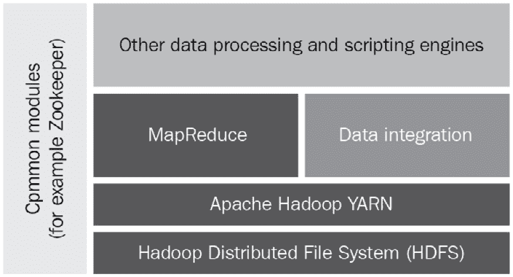

图 8.1 – Apache Hadoop MapReduce 生态系统

以下是三个核心组件的描述：

+   **Hadoop 分布式文件系统（HDFS）**：这是一个 Hadoop 原生文件系统，用于存储文件，以便这些文件可以在集群中并行化。

+   **另一个资源协调器（YARN）**：这是一个处理存储在 HDFS 中的数据并调度提交的作业（用于数据处理）以由处理系统运行的系统。处理系统可用于图处理、流处理或批量处理。

+   `map`（映射）和`reduce`（归约）函数与我们在*第六章*中讨论的相同，即《Python 高级技巧与窍门》。关键区别在于我们使用多个`map`和`reduce`函数并行处理多个数据集。

    在将大型数据集分解为小数据集后，我们可以将这些小数据集作为输入提供给多个 mapper 函数，以便在 Hadoop 集群的不同节点上处理。每个 mapper 函数接收一组数据作为输入，根据程序员设定的目标处理数据，并以键值对的形式产生输出。一旦所有小数据集的输出都可用，一个或多个 reducer 函数将接收来自 mapper 函数的输出，并根据 reducer 函数的目标汇总结果。

    为了更详细地解释，我们可以以计数大量文本数据中特定的单词，如*attack*和*weapon*为例。文本数据可以被划分为小数据集，例如，八个数据集。我们可以为每个数据集提供八个 mapper 函数来计数这两个单词。每个 mapper 函数为其提供的每个数据集提供*attack*和*weapon*单词的计数作为输出。在下一阶段，所有 mapper 函数的输出被提供给两个 reducer 函数，每个单词一个。每个 reducer 函数汇总每个单词的计数，并将汇总结果作为输出。下面展示了 MapReduce 框架在此单词计数示例中的操作。请注意，在 Python 编程中，mapper 函数通常实现为`map`，reducer 函数实现为`reduce`：

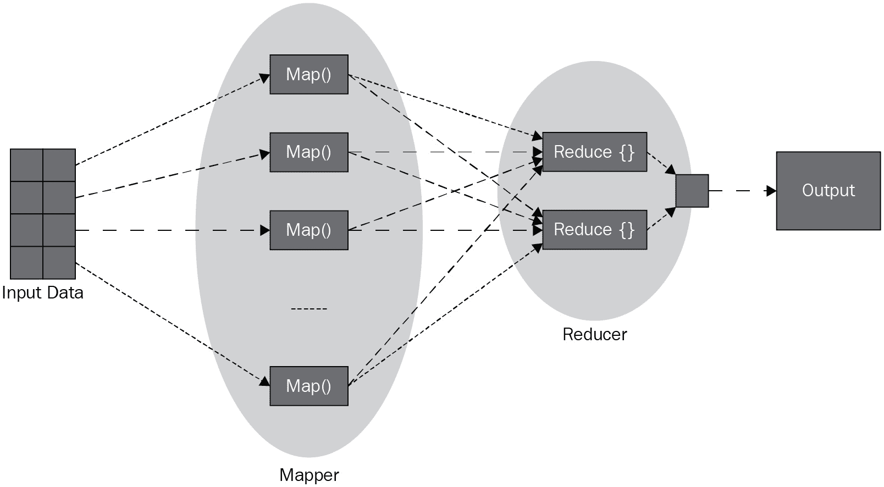

图 8.2 – MapReduce 框架的工作原理

我们将跳过 Hadoop 组件的下一级，因为它们与本章的讨论无关。Hadoop 主要用 Java 编写，但可以使用任何编程语言，如 Python，来编写定制的 mapper 和 reducer 组件，用于 MapReduce 模块。

Hadoop MapReduce 通过将数据分成小块来处理大量数据，非常适合。集群节点分别处理这些块，然后将结果汇总后发送给请求者。Hadoop MapReduce 从文件系统中处理数据，因此在性能方面不是非常高效。然而，如果处理速度不是关键要求，例如，如果数据处理可以安排在夜间进行，它工作得非常好。

## Apache Spark

Apache Spark 是一个开源的集群计算框架，适用于实时和批量数据处理。Apache Spark 的主要特点是它是一个内存数据处理框架，这使得它在实现低延迟方面非常高效，并且由于以下额外因素，它适合许多现实世界的场景：

+   它能够快速为关键任务和时间敏感的应用程序提供结果，例如实时或近实时场景。

+   由于内存处理，它非常适合以高效的方式重复或迭代地执行任务。

+   您可以利用现成的机器学习算法。

+   您可以利用 Java、Python、Scala 和 R 等额外编程语言的支持。

事实上，Apache Spark 涵盖了广泛的工作负载，包括批量数据、迭代处理和流数据。Apache Spark 的美丽之处在于它可以使用 Hadoop（通过 YARN）作为部署集群，但它也有自己的集群管理器。 

在高层次上，Apache Spark 的主要组件分为三个层次，如下所示：

![图 8.3 – Apache Spark 生态系统

![img/B17189_08_03.jpg]

图 8.3 – Apache Spark 生态系统

接下来讨论这些层次。

### 支持的语言

Scala 是 Apache Spark 的本地语言，因此在开发中非常流行。Apache Spark 还提供了 Java、Python 和 R 的高级 API。在 Apache Spark 中，通过使用**远程过程调用**（**RPC**）接口提供多语言支持。Scala 为每种语言编写了一个 RPC 适配器，将用不同语言编写的客户端请求转换为原生 Scala 请求。这使得它在开发社区中的采用更加容易。

### 核心组件

接下来简要概述每个核心组件：

+   **Spark Core 和 RDDs**：Spark Core 是 Spark 的核心引擎，负责为 RDDs 提供抽象，调度和分配作业到集群，与 HDFS、Amazon S3 或 RDBMS 等存储系统交互，以及管理内存和故障恢复。RDD 是一个弹性分布式数据集，是一个不可变且可分发的数据集合。RDD 被分区以在集群的不同节点上执行。我们将在下一节中更详细地讨论 RDD。

+   **Spark SQL**：此模块用于使用抽象接口查询存储在 RDDs 和外部数据源中的数据。使用这些通用接口使开发者能够将 SQL 命令与特定应用程序的分析工具混合使用。

+   **Spark Streaming**：此模块用于处理实时数据，这对于以低延迟分析实时数据流至关重要。

+   **MLlib**：**机器学习库**（**MLlib**）用于在 Apache Spark 中应用机器学习算法。

+   **GraphX**：此模块提供基于图并行计算的 API。此模块包含各种图算法。请注意，图是一个基于顶点和边的数学概念，它表示一组对象之间的关系或相互依赖。对象由顶点表示，它们之间的关系由边表示。

### 集群管理

Apache Spark 支持一些集群管理器，如 Standalone、Mesos、YARN 和 Kubernetes。集群管理器的关键功能是在集群节点上调度和执行作业以及管理集群节点上的资源。但是，为了与一个或多个集群管理器交互，主程序或驱动程序中使用了特殊对象，称为`SparkContext`对象，但它的 API 现在被封装为`SparkSession`对象的一部分。从概念上讲，以下图显示了`SparkSession`（**SparkContext**）和集群中的**工作节点**之间的交互：

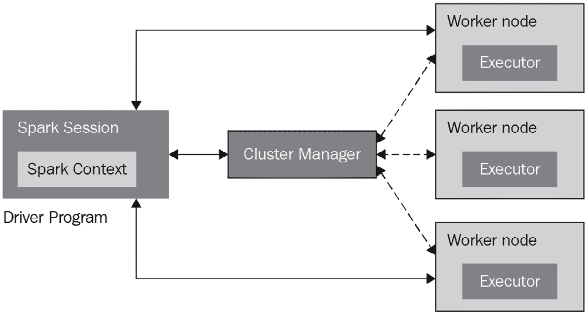

图 8.4 – Apache Spark 生态系统

`SparkSession`对象可以连接到不同类型的集群管理器。一旦连接，通过集群管理器在集群节点上获取执行器。执行器是运行作业并存储计算作业结果的 Spark 进程。主节点上的集群管理器负责将应用程序代码发送到工作节点上的执行器进程。一旦应用程序代码和数据（如果适用）移动到工作节点，驱动程序程序中的`SparkSession`对象将直接与执行器进程交互以执行任务。

根据 Apache Spark 3.1 版本，以下集群管理器得到支持：

+   **Standalone**：这是一个简单的集群管理器，它是 Spark Core 引擎的一部分。Standalone 集群基于主进程和工作进程（或从进程）。主进程基本上是一个集群管理器，工作进程托管执行器。尽管主节点和工作节点可以托管在单个机器上，但这并不是 Spark Standalone 集群的真实部署场景。建议将工作进程分布到不同的机器上以获得最佳效果。Standalone 集群易于设置并提供所需的集群的大部分功能。

+   **Apache Mesos**：这是另一个通用集群管理器，也可以运行 Hadoop MapReduce。对于大规模集群环境，Apache Mesos 是首选选项。这个集群管理器的理念是将物理资源聚合为单个虚拟资源，该资源充当集群并提供节点级抽象。它是一个设计上的分布式集群管理器。

+   **Hadoop YARN**：这个集群管理器是针对 Hadoop 的。它本质上也是一个分布式框架。

+   **Kubernetes**：这更多处于实验阶段。这个集群管理器的目的是自动化容器化应用的部署和扩展。Apache Spark 的最新版本包括了 Kubernetes 调度器。

在结束本节之前，值得提及其他一个框架，**Dask**，这是一个用 Python 编写的开源库，用于并行计算。Dask 框架可以直接与分布式硬件平台如 Hadoop 一起工作。与 Apache Spark 相比，Dask 是一个更小、更轻量级的框架，可以处理从小型到中型规模的集群。相比之下，Apache Spark 支持多种语言，并且是大型集群的最合适选择。

在介绍并行计算的集群选项之后，我们将在下一节讨论 Apache Spark 的核心数据结构，即 RDD。

# 介绍 RDD

RDD 是 Apache Spark 的核心数据结构。这种数据结构不仅是一个分布式的对象集合，而且是以一种方式分区，使得每个数据集都可以在集群的不同节点上处理和计算。这使得 RDD 成为分布式数据处理的核心元素。此外，RDD 对象具有容错性，即在发生故障的情况下，框架可以重建数据。当我们创建 RDD 对象时，主节点会将 RDD 对象复制到多个执行器或工作节点。如果任何执行器进程或工作节点失败，主节点会检测到故障，并在另一个节点上启用执行器进程以接管执行。新的执行器节点将已经拥有 RDD 对象的副本，并且可以立即开始执行。在原始执行器节点失败之前处理的所有数据将丢失，将由新的执行器节点重新计算。

在接下来的小节中，我们将学习两个关键的 RDD 操作以及如何从不同的数据源创建 RDD 对象。

## 学习 RDD 操作

RDD 是一个不可变对象，这意味着一旦创建，就不能更改。但可以对 RDD 的数据进行两种类型的操作。这些是**转换**和**动作**。以下将描述这些操作。

### 转换

这些操作应用于 RDD 对象，并导致创建一个新的 RDD 对象。这种类型的操作以 RDD 作为输入，并产生一个或多个 RDD 作为输出。我们还需要记住，这些转换本质上是惰性的。这意味着它们只有在触发动作操作（另一种类型的操作）时才会执行。为了解释惰性评估的概念，我们可以假设我们通过从 RDD 中的每个元素减去 1 然后对输出 RDD 中的转换步骤进行算术加法（动作）来转换 RDD 中的数值数据。由于惰性评估，转换操作将不会发生，直到我们调用动作操作（在这种情况下是加法）。

Apache Spark 提供了几个内置的转换函数。常用的转换函数如下：

+   `map`：`map`函数遍历 RDD 对象的每个元素或每行，并对每个元素应用定义的`map`函数。

+   `filter`：这个函数将从原始 RDD 中过滤数据，并提供一个包含过滤结果的新 RDD。

+   `union`：如果两个 RDD 类型相同，则应用此函数，结果生成另一个 RDD，它是输入 RDD 的并集。

### 操作

操作是在 RDD 上应用的计算操作，这些操作的输出结果将返回给驱动程序（例如，`SparkSession`）。Apache Spark 提供了几个内置的操作函数。常用的操作函数如下：

+   `count`：`count`操作返回 RDD 中的元素数量。

+   `collect`：这个操作将整个 RDD 返回给驱动程序。

+   `reduce`：这个操作将从 RDD 中减少元素。一个简单的例子是对 RDD 数据集进行加法操作。

对于转换和操作函数的完整列表，我们建议您查看 Apache Spark 的官方文档。接下来，我们将研究如何创建 RDD。

## 创建 RDD 对象

创建 RDD 对象有三种主要方法，下面将逐一描述。

### 并行化集合

这是 Apache Spark 创建 RDD 中使用的一种更简单的方法。在这种方法中，创建或加载一个集合到程序中，然后将其传递给`SparkContext`对象的`parallelize`方法。这种方法仅用于开发和测试，因为它要求整个数据集都存储在一台机器上，这对大量数据来说并不方便。

### 外部数据集

Apache Spark 支持从本地文件系统、HDFS、HBase 或甚至 Amazon S3 等分布式数据集。在这种创建 RDD 的方法中，数据直接从外部数据源加载。`SparkContext`对象提供了方便的方法，可以将各种数据加载到 RDD 中。例如，可以使用`textFile`方法从本地或远程资源加载文本数据，使用适当的 URL（例如，`file://`、`hdfs://`或`s3n://`）。

### 从现有 RDD 中

如前所述，可以使用转换操作来创建 RDD。这是 Apache Spark 与 Hadoop MapReduce 的不同之处之一。输入 RDD 不会改变，因为它是一个不可变对象，但可以从现有的 RDD 创建新的 RDD。我们已经看到了一些使用`map`和`filter`函数从现有 RDD 创建 RDD 的例子。

这就结束了我们对 RDD 的介绍。在下一节中，我们将使用 Python 代码示例和 PySpark 库提供更多细节。

# 使用 PySpark 进行并行数据处理

如前所述，Apache Spark 是用 Scala 语言编写的，这意味着它没有对 Python 的原生支持。由于 Python 拥有丰富的库集，许多数据科学家和分析专家更喜欢使用 Python 进行数据处理。因此，仅为了分布式数据处理而切换到另一种编程语言并不方便。因此，将 Python 与 Apache Spark 集成不仅对数据科学社区有益，也为那些希望采用 Apache Spark 而无需学习或切换到新编程语言的人打开了大门。

Apache Spark 社区构建了一个 Python 库，**PySpark**，以促进使用 Python 与 Apache Spark 协同工作。为了使 Python 代码与建立在 Scala（和 Java）之上的 Apache Spark 协同工作，开发了一个 Java 库，**Py4J**。这个 Py4J 库与 PySpark 捆绑在一起，允许 Python 代码与 JVM 对象交互。这就是为什么当我们安装 PySpark 时，我们首先需要在我们的系统上安装 JVM。

PySpark 提供了几乎与 Apache Spark 相同的功能和优势。这包括内存计算、并行化工作负载的能力、使用延迟评估设计模式，以及支持 Spark、YARN 和 Mesos 等多达多个集群管理器。

安装 PySpark（以及 Apache Spark）超出了本章的范围。本章的重点是讨论如何使用 PySpark 来利用 Apache Spark 的力量，而不是如何安装 Apache Spark 和 PySpark。但值得提及一些安装选项和依赖关系。

在线有针对 Apache Spark/PySpark 每个版本以及各种目标平台（例如 Linux、macOS 和 Windows）的许多安装指南。PySpark 包含在 Apache Spark 的官方版本中，现在可以从 Apache Spark 网站下载（[`spark.apache.org/`](https://spark.apache.org/)）。PySpark 也可以通过 PyPI 上的`pip`工具获得，可用于本地设置或连接到远程集群。安装 PySpark 时的另一个选项是使用**Anaconda**，这是另一个流行的包和环境管理系统。如果我们要在目标机器上安装 PySpark 和 Apache Spark，我们需要以下内容可用或已安装：

+   JVM

+   Scala

+   Apache Spark

对于后面将要讨论的代码示例，我们在 macOS 上安装了包含 PySpark 的 Apache Spark 版本 3.1.1。PySpark 自带`SparkSession`和`SparkContext`对象，可以用来与 Apache Spark 的核心引擎交互。以下图显示了 PySpark shell 的初始化：

![Figure 8.5 – PySpark shell

![img/B17189_08_05.jpg]

图 8.5 – PySpark shell

从 PySpark shell 的初始化步骤中，我们可以观察到以下内容：

+   `SparkContext`对象已经创建，并且其实例在 shell 中作为`sc`可用。

+   `SparkSession`对象也被创建，其实例作为`spark`可用。现在，`SparkSession`是 PySpark 框架的入口点，可以动态创建 RDD 和 DataFrame 对象。`SparkSession`对象也可以通过编程方式创建，我们将在后面的代码示例中讨论这一点。

+   Apache Spark 自带一个 Web UI 和一个 Web 服务器来托管 Web UI，并且在我们的本地机器安装中，它通过`http://192.168.1.110:4040`启动。请注意，此 URL 中提到的 IP 地址是一个特定于我们机器的私有地址。端口`4040`是由 Apache Spark 选定的默认端口。如果此端口已被占用，Apache Spark 将尝试在下一个可用的端口上托管，例如`4041`或`4042`。

在接下来的小节中，我们将学习如何创建`SparkSession`对象，探索 PySpark 的 RDD 操作，以及学习如何使用 PySpark DataFrame 和 PySpark SQL。我们将从使用 Python 创建 Spark 会话开始。

## 创建 SparkSession 和 SparkContext 程序

在 Spark 2.0 版本发布之前，`SparkContext`被用作 PySpark 的入口点。自 Spark 2.0 版本发布以来，`SparkSession`已被引入作为 PySpark 底层框架的入口点，用于处理 RDD 和 DataFrame。`SparkSession`还包括`SparkContext`、`SQLContext`、`StreamingContext`和`HiveContext`中可用的所有 API。现在，`SparkSession`也可以通过使用其`builder`方法通过`SparkSession`类来创建。这在下一个代码示例中进行了说明：

```py
import pyspark
from pyspark.sql import SparkSession
spark1 = SparkSession.builder.master("local[2]")
    .appName('New App').getOrCreate()
```

当我们在 PySpark shell 中运行此代码时，它已经创建了一个默认的`SparkSession`对象作为`spark`，它将返回与`builder`方法输出相同的会话。以下控制台输出显示了两个`SparkSession`对象（`spark`和`spark1`）的位置，这证实它们指向同一个`SparkSession`对象：

```py
>>> spark
<pyspark.sql.session.SparkSession object at 0x1091019e8>
>>> spark1
<pyspark.sql.session.SparkSession object at 0x1091019e8>
```

关于`builder`方法需要理解的一些关键概念如下：

+   `getOrCreate`：这是我们将在 PySpark shell 的情况下获得已创建会话的原因。如果没有已存在的会话，此方法将创建一个新的会话；否则，它将返回一个已存在的会话。

+   `master`：如果我们想创建一个连接到集群的会话，我们将提供主机的名称，这可以是 Spark 的实例名称，或者是 YARN 或 Mesos 集群管理器。如果我们使用的是本地部署的 Apache Spark 选项，我们可以使用`local[n]`，其中`n`是一个大于零的整数。`n`将确定要为 RDD 和 DataFrame 创建的分区数量。对于本地设置，`n`可以是系统上的 CPU 核心数。如果我们将其设置为`local[*]`，这是一个常见的做法，这将创建与系统上逻辑核心数量相同的工人线程。

如果需要创建一个新的 `SparkSession` 对象，我们可以使用 `newSession` 方法，该方法在现有的 `SparkSession` 对象实例级别上可用。下面是一个创建新的 `SparkSession` 对象的代码示例：

```py
import pyspark
from pyspark.sql import SparkSession
spark2 = spark.newSession()
```

`spark2` 对象的控制台输出确认，这不同于之前创建的 `SparkSession` 对象：

```py
>>> spark2
<pyspark.sql.session.SparkSession object at 0x10910df98>
```

`SparkContext` 对象也可以通过编程方式创建。从 `SparkSession` 实例获取 `SparkContext` 对象的最简单方法是使用 `sparkContext` 属性。PySpark 库中还有一个 `SparkConext` 类，也可以用来直接创建 `SparkContext` 对象，这在 Spark 发布 2.0 之前是一个常见的方法。

注意

我们可以有多个 `SparkSession` 对象，但每个 JVM 只有一个 `SparkContext` 对象。

`SparkSession` 类提供了一些更多有用的方法和属性，以下将进行总结：

+   `getActiveSession`：此方法返回当前 Spark 线程下的一个活动 `SparkSession`。

+   `createDataFrame`：此方法从 RDD、对象列表或 pandas DataFrame 对象创建 DataFrame 对象。

+   `conf`：此属性返回 Spark 会话的配置接口。

+   `catalog`：此属性提供了一个接口来创建、更新或查询相关的数据库、函数和表。

可以使用 PySpark 的 `SparkSession` 类文档中的完整方法列表和属性列表进行探索，文档地址为 [`spark.apache.org/docs/latest/api/python/reference/api/`](https://spark.apache.org/docs/latest/api/python/reference/api/)。

## 探索 PySpark 用于 RDD 操作

在 *介绍 RDD* 部分中，我们介绍了一些 RDD 的关键函数和操作。在本节中，我们将通过代码示例扩展 PySpark 上下文中的讨论。

### 从 Python 集合和外部文件创建 RDD

在上一节中，我们讨论了几种创建 RDD 的方法。在下面的代码示例中，我们将讨论如何从内存中的 Python 集合和外部文件资源创建 RDD。这两种方法如下所述：

+   要从 Python 数据集合创建 RDD，我们可以在 `sparkContext` 实例下使用 `parallelize` 方法。此方法将集合分发以形成一个 RDD 对象。该方法接受一个集合作为参数。`parallelize` 方法还提供了一个可选的第二个参数，用于设置要创建的分区数。默认情况下，此方法根据本地机器上的核心数或创建 `SparkSession` 对象时设置的核心数创建分区。

+   要从外部文件创建 RDD，我们将使用在 `sparkContext` 实例下可用的 `textFile` 方法。`textFile` 方法可以从 HDFS 或本地文件系统（在所有集群节点上可用）加载文件作为 RDD。对于基于本地系统的部署，可以提供绝对和/或相对路径。可以使用此方法设置要为 RDD 创建的最小分区数。

下面的快速示例代码（`rddcreate.py`）展示了用于创建新 RDD 的 PySpark 语句的确切语法：

```py
data = [5, 4, 6, 3, 2, 8, 9, 2, 8, 7,
        8, 4, 4, 8, 2, 7, 8, 9, 6, 9]
rdd1 = spark.sparkContext.parallelize(data)
print(rdd1.getNumPartitions())
rdd2 = spark.sparkContext.textFile('sample.txt')
print(rdd2.getNumPartitions())
```

注意，`sample.txt` 文件包含随机文本数据，其内容与这个代码示例无关。

### 使用 PySpark 的 RDD 转换操作

PySpark 提供了几个内置的转换操作。为了说明如何使用 PySpark 实现转换操作，例如 `map`，我们将以文本文件作为输入，并使用 RDD 中可用的 `map` 函数将其转换为另一个 RDD。下面的示例代码（`rddtranform1.py`）展示了：

```py
rdd1 = spark.sparkContext.textFile('sample.txt') 
rdd2 = rdd1.map(lambda lines: lines.lower())
rdd3 = rdd1.map(lambda lines: lines.upper())
print(rdd2.collect())
print(rdd3.collect())
```

在这个示例代码中，我们使用 `map` 操作应用了两个 lambda 函数，将 RDD 中的文本转换为小写和大写。最后，我们使用 `collect` 操作来获取 RDD 对象的内容。

另一个流行的转换操作是 `filter`，它可以用来过滤掉一些数据条目。下面的示例代码（`rddtranform2.py`）展示了如何从一个 RDD 中过滤出所有偶数：

```py
data = [5, 4, 6, 3, 2, 8, 9, 2, 8, 7,
        8, 4, 4, 8, 2, 7, 8, 9, 6, 9]
rdd1 = spark.sparkContext.parallelize(data)
rdd2 = rdd1.filter(lambda x: x % 2 !=0 )
print(rdd2.collect())
```

当你执行此代码时，它将提供包含 3、7、7 和 9 作为集合条目的控制台输出。接下来，我们将探索一些使用 PySpark 的动作示例。

### 使用 PySpark 的 RDD 动作操作

为了说明动作操作的实施，我们将使用从 Python 集合创建的 RDD，然后应用 PySpark 库中的一些内置动作操作。下面的示例代码（`rddaction1.py`）展示了：

```py
data = [5, 4, 6, 3, 2, 8, 9, 2, 8, 7,
        8, 4, 4, 8, 2, 7, 8, 9, 6, 9]
rdd1 = spark.sparkContext.parallelize(data)
print("RDD contents with partitions:" + str(rdd1.glom().  collect()))
print("Count by values: " +str(rdd1.countByValue()))
print("reduce function: " + str(rdd1.glom().collect()))
print("Sum of RDD contents:"+str(rdd1.sum()))
print("top: " + str(rdd1.top(5)))
print("count: " + str(rdd1.count()))
print("max: "+ str(rdd1.max()))
print("min" + str(rdd1.min()))
time.sleep(60)
```

在这个代码示例中使用的某些动作操作是自解释的且简单（`count`、`max`、`min`、`count` 和 `sum`）。其余的动作操作（非简单）将在下面解释：

+   `glom`：这会创建一个 RDD，它通过将所有数据条目与每个分区合并到一个列表中而创建。

+   `collect`：此方法返回 RDD 的所有元素作为列表。

+   `reduce`：这是一个通用的函数，可以应用于 RDD 以减少其中的元素数量。在我们的例子中，我们使用 lambda 函数将两个元素合并为一个，依此类推。这会导致将 RDD 中的所有元素相加。

+   `top(x)`：如果数组中的元素是有序的，这个动作返回数组中的前 `x` 个元素。

我们已经介绍了如何使用 PySpark 创建 RDD，以及如何在 RDD 上实现转换和动作操作。在下一节中，我们将介绍 PySpark DataFrame，这是另一个主要用于分析的热门数据结构。

## 了解 PySpark DataFrame

**PySpark DataFrame** 是一个由行和列组成的表格数据结构，类似于我们在关系型数据库中拥有的表，以及我们在*第六章*“Python 高级技巧与窍门”中介绍的 pandas DataFrame。与 pandas DataFrame 相比，关键区别在于 PySpark DataFrame 对象是在集群中分布的，这意味着数据存储在集群的不同节点上。DataFrame 的使用主要是为了以分布式方式处理大量结构化或非结构化数据，这些数据可能达到 PB 级别。与 RDDs 类似，PySpark DataFrame 是不可变的，并且基于懒加载，这意味着评估将延迟到需要执行时。

我们可以在 DataFrame 中存储数值型以及字符串数据类型。PySpark DataFrame 中的列不能为空；它们必须具有相同的数据类型，并且长度必须相同。DataFrame 中的行可以具有不同的数据类型。DataFrame 中的行名必须是唯一的。

在接下来的小节中，我们将学习如何创建 DataFrame，并介绍使用 PySpark 在 DataFrame 上的一些关键操作。

### 创建 DataFrame 对象

可以使用以下数据源之一创建 PySpark DataFrame：

+   Python 的集合，如列表、元组和字典。

+   文件（CSV、XML、JSON、Parquet 等）。

+   通过使用 PySpark 的 `toDF` 方法或 `createDataFrame` 方法。

+   可以使用 `SparkSession` 对象的 `readStream` 方法将 Apache Kafka 流消息转换为 PySpark DataFrame。

+   可以使用传统的 SQL 命令查询数据库（例如 Hive 和 HBase）表，输出将被转换为 PySpark DataFrame。

我们将从 Python 集合创建 DataFrame 开始，这是最简单的方法，但更有助于说明目的。下面的示例代码展示了如何从员工数据集合创建 PySpark DataFrame：

```py
data = [('James','','Bylsma','HR','M',40000),
  ('Kamal','Rahim','','HR','M',41000),
  ('Robert','','Zaine','Finance','M',35000),
  ('Sophia','Anne','Richer','Finance','F',47000),
  ('John','Will','Brown','Engineering','F',65000)
]
columns = ["firstname","middlename","lastname",
           "department","gender","salary"]
df = spark.createDataFrame(data=data, schema = columns)
print(df.printSchema())
print(df.show())
```

在此代码示例中，我们首先创建了一个员工行数据列表，然后创建了一个带有列名的模式。当模式仅是一个列名列表时，每个列的数据类型由数据确定，并且每个列默认标记为可空。可以使用更高级的 API (`StructType` 或 `StructField`) 手动定义 DataFrame 模式，这包括设置数据类型和标记列是否可空。下面是此示例代码的控制台输出，首先显示模式，然后以表格形式显示 DataFrame 内容：

```py
root
 |-- firstname: string (nullable = true)
 |-- middlename: string (nullable = true)
 |-- lastname: string (nullable = true)
 |-- department: string (nullable = true)
 |-- gender: string (nullable = true)
 |-- salary: long (nullable = true)
+---------+----------+--------+-----------+------+-------+
|firstname|middlename|lastname| department|gender|salary|
+---------+----------+--------+-----------+------+-------+
|    James|          |  Bylsma|         HR|     M|  40000|
|    Kamal|     Rahim|        |         HR|     M|  41000|
|   Robert|          |   Zaine|    Finance|     M|  35000|
|   Sophia|      Anne|  Richer|    Finance|     F|  47000|
|     John|      Will|   Brown|Engineering|     F|  65000|
+---------+----------+--------+-----------+------+-------+ 
```

在下一个代码示例中，我们将从 CSV 文件创建 DataFrame。CSV 文件将具有与上一个代码示例中相同的条目。在此示例代码 (`dfcreate2.py`) 中，我们还使用 `StructType` 和 `StructField` 对象手动定义了模式：

```py
schemas = StructType([ \
    StructField("firstname",StringType(),True), \
    StructField("middlename",StringType(),True), \
    StructField("lastname",StringType(),True), \
    StructField("department", StringType(), True), \
    StructField("gender", StringType(), True), \
    StructField("salary", IntegerType(), True) \
  ])
df = spark.read.csv('df2.csv', header=True, schema=schemas)
print(df.printSchema())
print(df.show())
```

此代码的控制台输出将与前面代码示例中显示的相同。使用类似语法，`read`方法支持将 JSON、文本或 XML 文件导入 DataFrame。对其他数据源的支持，如 RDDs 和数据库，留给你作为练习来评估和实现。

### 在 PySpark DataFrame 上工作

一旦我们从某些数据中创建了一个 DataFrame，无论数据的来源如何，我们就可以准备分析它、转换它，并对其采取一些操作以从中获得有意义的成果。PySpark DataFrame 支持的大多数操作与 RDDs 和 pandas DataFrame 类似。为了说明目的，我们将与前面的代码示例相同的数据加载到一个 DataFrame 对象中，然后执行以下操作：

1.  使用`select`方法从 DataFrame 对象中选择一个或多个列。

1.  使用字典和`replace`方法替换列中的值。PySpark 库中还有更多选项可用于替换列中的数据。

1.  根据现有列的数据添加一个新列。

完整的示例代码（`dfoperations.py`）如下所示：

```py
data = [('James','','Bylsma','HR','M',40000),
  ('Kamal','Rahim','','HR','M',41000),
  ('Robert','','Zaine','Finance','M',35000),
  ('Sophia','Anne','Richer','Finance','F',47000),
  ('John','Will','Brown','Engineering','F',65000)
]
columns = ["firstname","middlename","lastname",
           "department","gender","salary"]
df = spark.createDataFrame(data=data, schema = columns)
#show two columns
print(df.select([df.firstname, df.salary]).show())
#replacing values of a column
myDict = {'F':'Female','M':'Male'}
df2 = df.replace(myDict, subset=['gender'])
#adding a new colum Pay Level based on an existing column   values
df3 = df2.withColumn("Pay Level",
      when((df2.salary < 40000), lit("10")) \
     .when((df.salary >= 40000) & (df.salary <= 50000),           lit("11")) \
     .otherwise(lit("12")) \
  )
print(df3.show())
```

下面的输出是前面代码示例的结果：

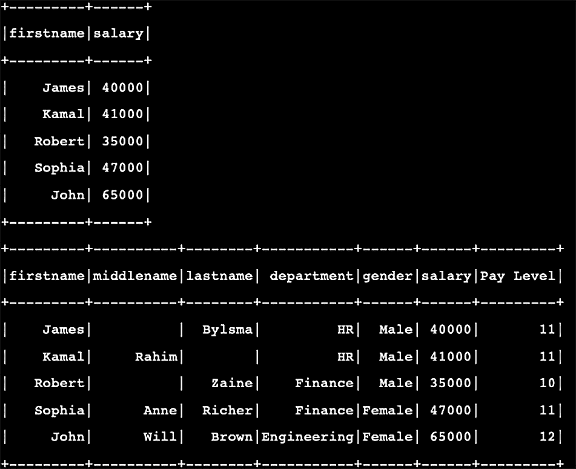

图 8.6 – dfoperations.py 程序的控制台输出

第一张表显示了`select`操作的结果。下一张表显示了在`gender`列上执行`replace`操作的结果，以及一个新的列，`Pay Level`。

有许多内置操作可用于与 PySpark DataFrame 一起使用，其中许多与我们在 pandas DataFrame 中讨论的相同。这些操作的详细信息可以通过使用 Apache Spark 官方文档（针对您使用的软件版本）进行探索。

在这一点上，任何人都可能会提出一个合法的问题，那就是，*为什么我们应该使用 PySpark DataFrame，当我们已经有了提供相同类型操作的 pandas DataFrame 时？* 答案非常简单。PySpark 提供了分布式 DataFrame，对这些 DataFrame 的操作旨在在节点集群上并行执行。这使得 PySpark DataFrame 的性能显著优于 pandas DataFrame。

到目前为止，我们已经看到，作为程序员，我们实际上并不需要编写任何关于如何将分布式 RDDs 和 DataFrames 委派给独立或分布式集群中不同执行器的代码。我们的重点只是数据处理方面的编程。与本地或远程节点集群的协调和通信由`SparkSession`和`SparkContext`自动处理。这正是 Apache Spark 和 PySpark 的美丽之处：让程序员专注于解决实际问题，而不是担心工作负载的执行方式。

## 介绍 PySpark SQL

Spark SQL 是 Apache Spark 的关键模块之一；它用于结构化数据处理，并充当分布式 SQL 查询引擎。正如你可以想象的那样，Spark SQL 具有高度的扩展性，作为一个分布式处理引擎。通常，Spark SQL 的数据源是一个数据库，但 SQL 查询可以应用于临时视图，这些视图可以从 RDDs 和 DataFrames 中构建。

为了展示使用 PySpark 库与 Spark SQL 的结合使用，我们将使用与前面示例代码相同的 DataFrame，使用员工数据构建一个 `TempView` 实例以进行 SQL 查询。在我们的代码示例中，我们将执行以下操作：

1.  我们将创建一个 PySpark DataFrame，用于存储来自 Python 集合的员工数据，就像我们在前面的代码示例中所做的那样。

1.  我们将使用 `createOrReplaceTempView` 方法从 PySpark DataFrame 创建一个 `TempView` 实例。

1.  使用 Spark Session 对象的 `sql` 方法，我们将在 `TempView` 实例上执行传统的 SQL 查询，例如查询所有员工记录、查询薪资高于 45,000 的员工、查询按性别类型划分的员工数量，以及使用 `group by` SQL 命令对 `gender` 列进行分组。

完整的代码示例 (`sql1.py`) 如下：

```py
data = [('James','','Bylsma','HR','M',40000),
  ('Kamal','Rahim','','HR','M',41000),
  ('Robert','','Zaine','Finance','M',35000),
  ('Sophia','Anne','Richer','Finance','F',47000),
  ('John','Will','Brown','Engineering','F',65000)
]
columns = ["firstname","middlename","lastname",
           "department","gender","salary"]
df = spark.createDataFrame(data=data, schema = columns)
df.createOrReplaceTempView("EMP_DATA")
df2 = spark.sql("SELECT * FROM EMP_DATA")
print(df2.show())
df3 = spark.sql("SELECT firstname,middlename,lastname,    salary FROM EMP_DATA WHERE SALARY > 45000")
print(df3.show())
df4 = spark.sql(("SELECT gender, count(*) from EMP_DATA     group by gender"))
print(df4.show())
```

控制台输出将显示三个 SQL 查询的结果：

```py
+---------+----------+--------+-----------+------+------+
|firstname|middlename|lastname| department|gender|salary|
+---------+----------+--------+-----------+------+------+
|    James|          |  Bylsma|         HR|     M| 40000|
|    Kamal|     Rahim|        |         HR|     M| 41000|
|   Robert|          |   Zaine|    Finance|     M| 35000|
|   Sophia|      Anne|  Richer|    Finance|     F| 47000|
|     John|      Will|   Brown|Engineering|     F| 65000|
+---------+----------+--------+-----------+------+------+
+---------+----------+--------+------+
|firstname|middlename|lastname|salary|
+---------+----------+--------+------+
|   Sophia|      Anne|  Richer| 47000|
|     John|      Will|   Brown| 65000|
+---------+----------+--------+------+
+------+--------+
|gender|count(1)|
+------+--------+
|     F|       2|
|     M|       3|
+------+--------+
```

Spark SQL 是 Apache Spark 中的一个重要主题。我们只提供了 Spark SQL 的简介，以展示在不知道数据源的情况下，在 Spark 数据结构上使用 SQL 命令的强大功能。这标志着我们使用 PySpark 进行数据处理和数据分析的讨论结束。在下一节中，我们将讨论几个案例研究，以构建一些实际应用。

# 使用 Apache Spark 和 PySpark 的案例研究

在前面的章节中，我们介绍了 Apache Spark 和 PySpark 的基本概念和架构。在本节中，我们将讨论两个案例研究，以实现 Apache Spark 的两个有趣且流行的应用。

## 案例研究 1 – Apache Spark 上的 Pi (π) 计算器

我们将使用运行在我们本地机器上的 Apache Spark 集群来计算 Pi (π)。当圆的半径为 1 时，Pi 是圆的面积。在讨论此应用的算法和驱动程序之前，介绍用于此案例研究的 Apache Spark 设置非常重要。

### 设置 Apache Spark 集群

在所有之前的代码示例中，我们都在没有集群的情况下在我们的机器上使用本地安装的 PySpark。对于这个案例研究，我们将通过使用多个虚拟机来设置一个 Apache Spark 集群。有许多虚拟化软件工具可用，例如 **VirtualBox**，并且这些软件工具中的任何一种都可以用于构建这种类型的设置。

我们使用 Ubuntu **Multipass** ([`multipass.run/`](https://multipass.run/))在 macOS 上构建虚拟机。Multipass 在 Linux 和 Windows 上也能工作。Multipass 是一个轻量级的虚拟化管理器，专为开发者设计，用于通过单个命令创建虚拟机。Multipass 命令非常少，这使得它更容易使用。如果您决定使用 Multipass，我们建议您使用官方文档进行安装和配置。在我们的虚拟机设置中，我们使用 Multipass 创建了以下虚拟机：

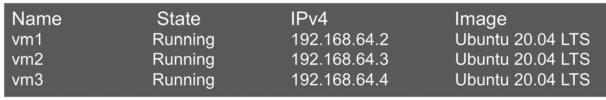

图 8.7 – 为我们的 Apache Spark 集群创建的虚拟机

我们通过使用`apt-get`实用程序在每个虚拟机上安装了*Apache Spark 3.1.1*。我们在`vm1`上以主节点启动 Apache Spark，然后通过提供主 Spark URI（在我们的案例中是`Spark://192.168.64.2.7077`）在`vm2`和`vm3`上以工作节点启动 Apache Spark。完整的 Spark 集群设置将如下所示：

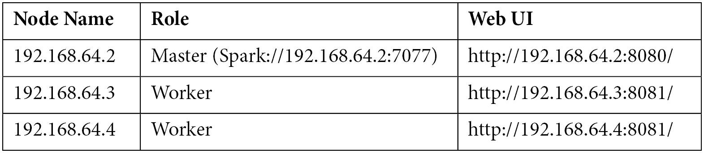

图 8.8 – Apache Spark 集群节点详细信息

主 Spark 节点的 Web UI 如下所示：

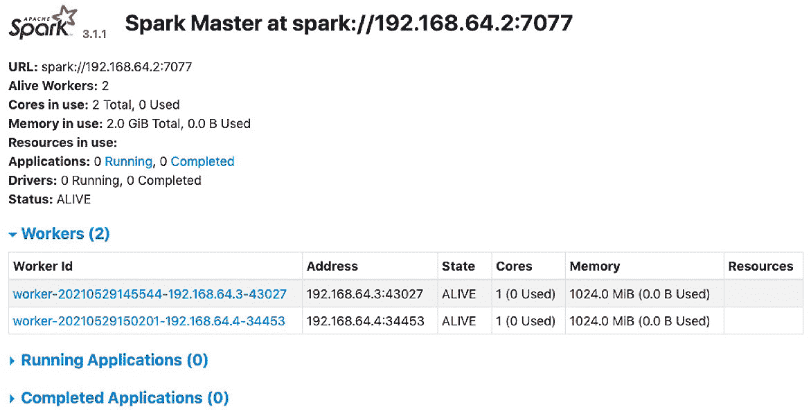

图 8.9 – Apache Spark 集群中主节点的 Web UI

这里给出了主节点的 Web UI 摘要：

+   Web UI 提供了节点名称和 Spark URL。在我们的案例中，我们使用了 IP 地址作为主机名，这就是为什么 URL 中有 IP 地址的原因。

+   这里是工作节点的详细信息，在我们的案例中有两个。每个工作节点使用 1 个 CPU 核心和 1GB 内存。

+   Web UI 还提供了正在运行和已完成的应用程序的详细信息。

工作节点的 Web UI 将如下所示：

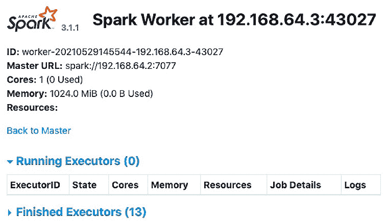

图 8.10 – Apache Spark 集群中工作节点的 Web UI

这里给出了工作节点的 Web UI 摘要：

+   Web UI 还提供了工作 ID 以及节点名称和工人监听请求的端口。

+   Web UI 还提供了主节点 URL。

+   分配给工作节点的 CPU 核心和内存的详细信息也可用。

+   Web UI 提供了正在进行的作业（**运行中的执行器**）和已完成作业的详细信息。

### 编写 Pi 计算的驱动程序

为了计算 Pi，我们使用了一个常用的算法（蒙特卡洛算法），该算法假设一个面积为 4 的正方形包围着一个单位圆（半径值为 1 的圆）。想法是在一个边长为 2 的正方形域内生成大量随机数。我们可以假设有一个直径值与正方形边长相同的圆在正方形内部。这意味着圆将内嵌在正方形内。Pi 的值是通过计算位于圆内的点数与生成的总点数之比来估计的。

下面的示例展示了驱动程序的完整代码。在这个程序中，我们决定使用两个分区，因为我们有两个可用的工作者。我们为每个工作者使用了 10,000,000 个点。另一个需要注意的重要事项是，在创建 Apache Spark 会话时，我们使用了 Spark 主节点 URL 作为主属性：

```py
#casestudy1.py: Pi calculator
from operator import add
from random import random
from pyspark.sql import SparkSession
spark = SparkSession.builder.master
        ("spark://192.168.64.2:7077") \
    .appName("Pi claculator app") \
    .getOrCreate()
partitions = 2
n = 10000000 * partitions
def func(_):
    x = random() * 2 – 1
    y = random() * 2 – 1
    return 1 if x ** 2 + y ** 2 <= 1 else 0
count = spark.sparkContext.parallelize(range(1, n + 1),     partitions).map(func).reduce(add)
print("Pi is roughly %f" % (4.0 * count / n))
```

控制台输出如下：

```py
Pi is roughly 3.141479 
```

Spark 网页用户界面将在应用程序运行时提供其状态，甚至在执行完成后。在下面的屏幕截图中，我们可以看到有两个工作者参与了完成作业：

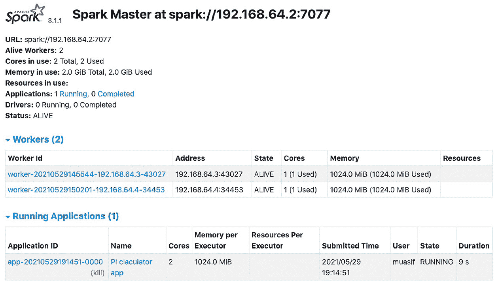

图 8.11 – Pi 计算器在 Spark 网页用户界面中的状态

我们可以点击应用程序名称，以查看应用程序的下一级详细情况，如图 8.12 所示。这个屏幕截图显示了哪些工作者参与了完成任务以及正在使用哪些资源（如果任务仍在运行）：

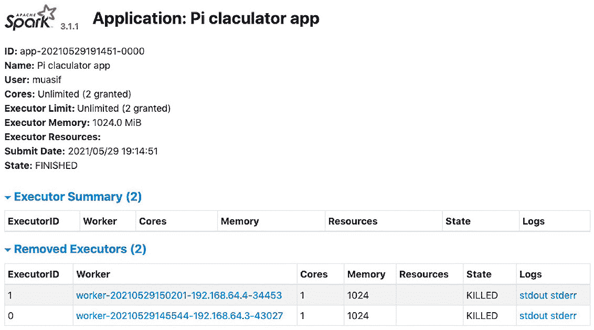

图 8.12 – Pi 计算器应用程序执行器级别的细节

在这个案例研究中，我们介绍了如何为测试和实验目的设置 Apache Spark 集群，以及如何使用 PySpark 库在 Python 中构建驱动程序程序以连接到 Apache Spark 并提交我们的作业以在两个不同的集群节点上处理。

在下一个案例研究中，我们将使用 PySpark 库构建一个词云。

## 案例研究 2 – 使用 PySpark 的词云

**词云**是某些文本数据中出现单词频率的视觉表示。简单来说，如果一个特定的单词在文本中出现的频率更高，它在词云中就会更大、更粗。这些也被称为**标签云**或**文本云**，是识别某些文本数据哪些部分更重要非常有用的工具。这个工具的一个实际用例是分析社交媒体上的内容，这在市场营销、商业分析和安全方面有许多应用。

为了说明目的，我们构建了一个简单的词云应用程序，该程序从本地文件系统读取文本文件。文本文件被导入到 RDD 对象中，然后进行处理以计算每个单词出现的次数。我们进一步处理数据以过滤掉出现次数少于两次的单词，并过滤掉长度小于四个字母的单词。单词频率数据被输入到 `WordCloud` 库对象中。为了显示词云，我们使用了 `matplotlib` 库。完整的示例代码如下：

```py
#casestudy2.py: word count application
import matplotlib.pyplot as plt
from pyspark.sql import SparkSession
from wordcloud import WordCloud
spark = SparkSession.builder.master("local[*]")\
    .appName("word cloud app")\
    .getOrCreate()
wc_threshold = 1
wl_threshold = 3
textRDD = spark.sparkContext.textFile('wordcloud.txt',3)
flatRDD = textRDD.flatMap(lambda x: x.split(' '))
wcRDD = flatRDD.map(lambda word: (word, 1)).\
    reduceByKey(lambda v1, v2: v1 + v2)
# filter out words with fewer than threshold occurrences
filteredRDD = wcRDD.filter(lambda pair: pair[1] >=     wc_threshold)
filteredRDD2 = filteredRDD.filter(lambda pair:     len(pair[0]) > wl_threshold)
word_freq = dict(filteredRDD2.collect())
# Create the wordcloud object
wordcloud = WordCloud(width=480, height=480, margin=0).\
    generate_from_frequencies(word_freq)
# Display the generated cloud image
plt.imshow(wordcloud, interpolation='bilinear')
plt.axis("off")
plt.margins(x=0, y=0)
plt.show()
```

这个程序的输出以窗口应用程序的形式展示，输出结果将如以下所示，基于提供给应用程序的样本文本（`wordcloud.txt`）：

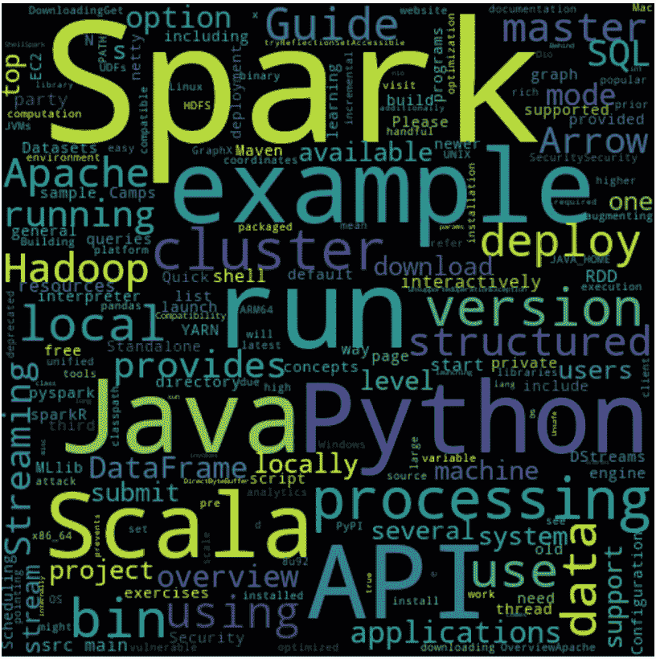


图 8.13 – 使用 PySpark RDDs 构建的词云

注意，我们在这个示例中没有使用一个非常大的文本数据样本。在现实世界中，源数据可以极其庞大，这证明了使用 Apache Spark 集群进行处理的必要性。

这两个案例研究为您提供了使用 Apache Spark 进行大规模数据处理的能力。它们为对自然语言处理（**NLP**）、文本分析和情感分析感兴趣的您提供了一个基础。如果您是数据科学家，并且您的日常工作需要数据分析以及构建 NLP 算法，这些技能对您来说非常重要。

# 摘要

在本章中，我们探讨了如何在机器集群上执行数据密集型作业以实现并行处理。并行处理对于大规模数据非常重要，也称为大数据。我们首先评估了可用于数据处理的不同集群选项。我们提供了 Hadoop MapReduce 和 Apache Spark 的比较分析，这两个是集群的两个主要竞争平台。分析表明，Apache Spark 在支持的编程语言和集群管理系统方面具有更大的灵活性，并且由于其内存数据处理模型，它在实时数据处理方面优于 Hadoop MapReduce。

一旦我们确定 Apache Spark 是各种数据处理应用的最合适选择，我们就开始研究其基本数据结构，即 RDD。我们讨论了如何从不同的数据源创建 RDD，并介绍了两种类型的操作：转换和行动。

在本章的核心部分，我们探讨了使用 PySpark 通过 Python 创建和管理 RDD。这包括几个转换和行动操作的代码示例。我们还介绍了用于分布式数据处理下一级别的 PySpark DataFrames。我们通过介绍 PySpark SQL 和一些代码示例来结束这个主题。

最后，我们探讨了两个使用 Apache Spark 和 PySpark 的案例研究。这些案例研究包括计算π和从文本数据构建词云。在案例研究中，我们还介绍了如何为测试目的在本地机器上设置一个独立的 Apache Spark 实例。

本章为您提供了大量在本地设置 Apache Spark 以及使用虚拟化设置 Apache Spark 集群的经验。本章提供了大量的代码示例，供您增强实践技能。这对于任何希望使用集群以提高效率和规模来处理大数据问题的人来说都很重要。

在下一章中，我们将探讨利用 Apache Beam 等框架的选项，并扩展我们关于使用公共云进行数据处理讨论。

# 问题

1.  Apache Spark 与 Hadoop MapReduce 有何不同？

1.  在 Apache Spark 中，转换与操作有何不同？

1.  Apache Spark 中的懒评估是什么？

1.  什么是`SparkSession`？

1.  PySpark DataFrame 与 pandas DataFrame 有何不同？

# 进一步阅读

+   由 Jean-Georges Perrin 所著的《*Spark in Action, 第二版*》

+   由 Tomasz Drabas 和 Denny Lee 所著的《*Learning PySpark*》

+   由 Raju Kumar Mishra 所著的《*PySpark Recipes*》

+   使用您正在使用的版本[`spark.apache.org/docs/rel#`](https://spark.apache.org/docs/rel#)的《*Apache Spark 文档*》

+   可在[`multipass.run/docs`](https://multipass.run/docs)找到的《*Multipass 文档*》

# 答案

1.  Apache Spark 是一个内存数据处理引擎，而 Hadoop MapReduce 则需要从文件系统中读取和写入。

1.  转换应用于将数据从一种形式转换为另一种形式，并且结果保留在集群内。操作是对数据应用以获取返回给驱动程序的函数的结果。

1.  懒评估主要应用于转换操作，这意味着转换操作在数据对象上触发操作之前不会执行。

1.  `SparkSession`是 Spark 应用程序的入口点，用于连接一个或多个集群管理器，并与执行器协同工作以执行任务。

1.  PySpark DataFrame 是分布式的，旨在在 Apache Spark 集群的多个节点上可用，以便进行并行处理。
