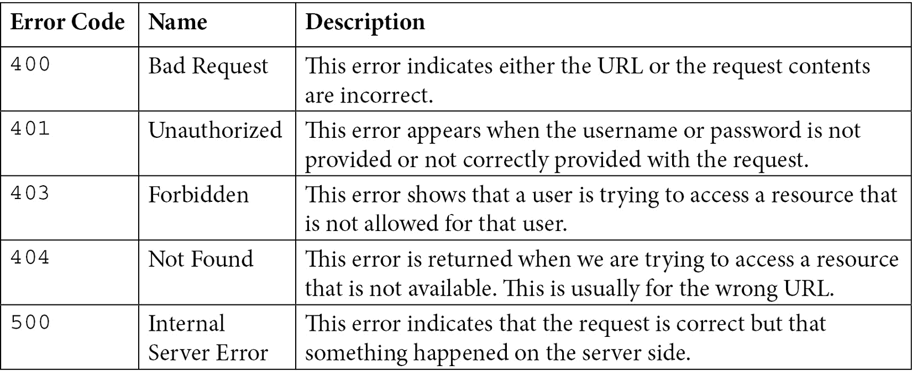
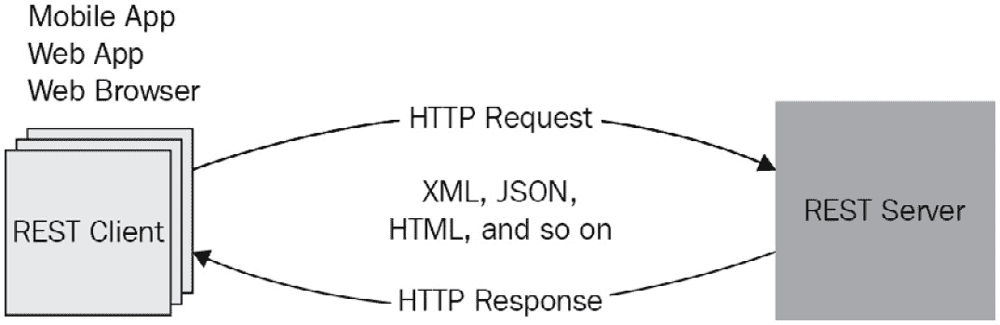
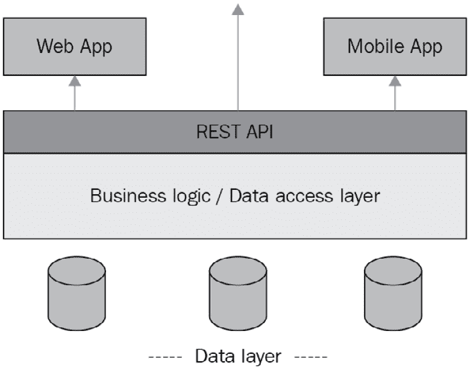
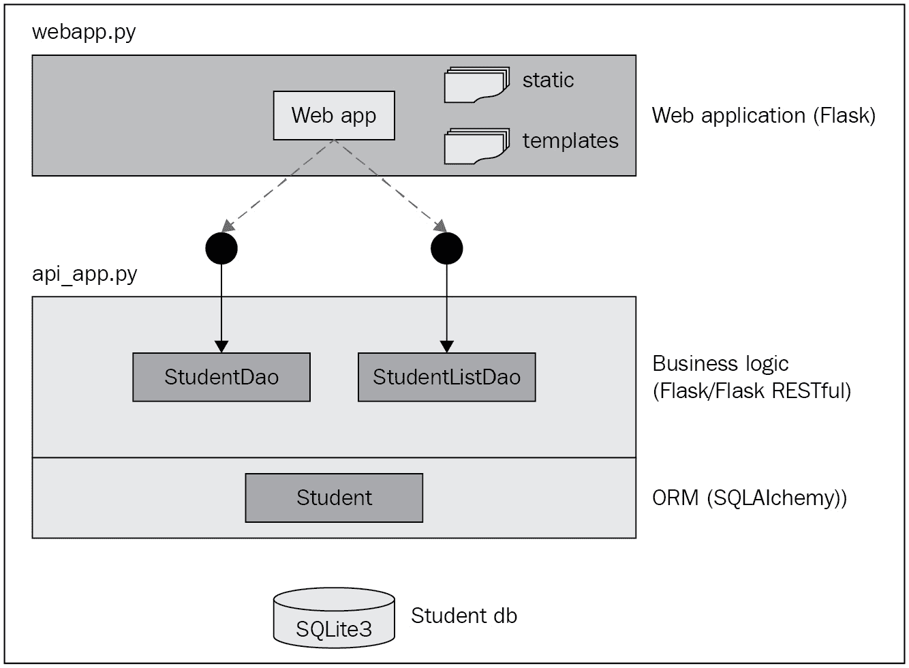

# *第十章*：使用 Python 进行网络开发和 REST API

网络应用是一种在内部网络或互联网上由 **网络服务器** 托管和运行的应用程序类型，通过客户端设备上的网络浏览器访问。使用网络浏览器作为客户端界面使用户能够从任何地方访问应用程序，而无需在本地机器上安装任何额外的软件。这种易于访问的特性促进了网络应用超过二十年的成功和流行。网络应用的使用范围广泛，从提供静态和动态内容（如维基百科和报纸）、电子商务、在线游戏、社交网络、培训、多媒体内容、调查和博客，到复杂的 **企业资源规划**（ERP）应用。

从本质上讲，网络应用是多层的，通常是三层应用。这三层包括用户界面（UI）、业务逻辑和数据库访问。因此，开发网络应用涉及到与用于 UI 的网络服务器、用于业务逻辑的应用服务器以及用于持久化数据的数据库系统进行交互。在移动应用时代，UI 可能是一个需要通过 REST API 访问业务逻辑层的移动应用。REST API 或任何类型的网络服务接口的可用性已成为网络应用的基本需求。本章将讨论如何使用 Python 构建 multi-tier 网络应用。Python 中有多个框架可用于开发网络应用，但我们在本章选择 **Flask** 进行讨论，因为它功能丰富但轻量级。网络应用也被称作 *web apps*，以区分针对小型设备的移动应用。

本章我们将涵盖以下主题：

+   网络开发的学习需求

+   介绍 Flask 框架

+   使用 Python 与数据库交互

+   使用 Python 构建 REST API

+   案例研究：使用 REST API 构建 web 应用程序

到本章结束时，你将能够使用 Flask 框架开发网络应用，与数据库交互，并构建 REST API 或网络服务。

# 技术要求

以下为本章的技术要求：

+   你需要在你的计算机上安装 Python 3.7 或更高版本。

+   Python Flask 库 2.x 及其扩展，安装在 Python 3.7 或更高版本之上。

本章的示例代码可在 [`github.com/PacktPublishing/Python-for-Geeks/tree/master/Chapter10`](https://github.com/PacktPublishing/Python-for-Geeks/tree/master/Chapter10) 找到。

我们将首先讨论开发网络应用和 REST API 的关键需求。

# 网络开发的学习需求

开发网络应用程序包括构建 UI、将用户请求或用户操作路由到应用程序端点、转换用户输入数据、编写用户请求的业务逻辑、与数据层交互以读取或写入数据，并将结果返回给用户。所有这些开发组件可能需要不同的平台，有时甚至需要使用不同的编程语言来实现。在本节中，我们将了解网络开发所需的组件和工具，从网络应用程序框架或网络框架开始。

## 网络框架

从零开始开发网络应用程序既耗时又繁琐。为了方便网络开发者，网络应用程序框架在 Web 开发的早期阶段就被引入了。网络框架提供了一套库、目录结构、可重用组件和部署工具。网络框架通常遵循一种架构，使开发者能够在更短的时间内以优化的方式构建复杂的应用程序。

在 Python 中有几种可用的网络框架：**Flask** 和 **Django** 是最受欢迎的。这两个框架都是免费和开源的。Flask 是一个轻量级框架，附带构建网络应用程序所需的标准功能，但它也允许根据需要使用额外的库或扩展。另一方面，Django 是一个全栈框架，自带所有功能，无需额外库。这两种方法都有优点和缺点，但最终，我们可以使用这些框架中的任何一个来开发任何网络应用程序。

如果你想对应用程序有完全的控制权，并且可以根据需要选择使用外部库，那么 Flask 被认为是更好的选择。当项目需求非常频繁地变化时，Flask 也是很好的选择。如果你想要所有工具和库都现成可用，并且只想专注于实现业务逻辑，那么 Django 是合适的。Django 对于大型项目来说是一个很好的选择，但对于简单的项目来说可能有些过度。Django 的学习曲线很陡峭，需要先前的网络开发经验。如果你是第一次用 Python 开发网络，Flask 是一条可行的道路。一旦你学会了 Flask，就很容易采用 Django 框架来进入下一个层次的 Web 项目开发。

当构建网络应用程序或任何 UI 应用程序时，我们经常会遇到术语 **模型-视图-控制器**（**MVC**）设计模式。这是一种将应用程序分为三个层的架构设计模式：

+   **模型**：模型层代表通常存储在数据库中的数据。

+   **视图**：这一层是与用户交互的 UI。

+   **控制器**：控制器层旨在通过 UI 提供处理用户与应用程序交互的逻辑。例如，用户可能想要创建一个新对象或更新现有对象。对于创建或更新请求，以及是否有模型（数据）的情况下，向用户展示哪个 UI（视图）的逻辑全部都在控制器层实现。

Flask 不提供对 MVC 设计模式的直接支持，但可以通过编程实现。Django 提供了足够接近 MVC 的实现，但不是完全的。Django 框架中的控制器由 Django 本身管理，并且不允许在其中编写自己的代码。Django 和许多其他 Python Web 框架遵循**模型视图模板**（**MVT**）设计模式，它类似于 MVC，除了模板层。MVT 中的模板层提供了特别格式化的模板，可以生成预期的 UI，并具有在 HTML 中插入动态内容的能力。

## 用户界面

**UI**是应用程序的表示层，有时它被包括在 Web 框架的一部分中。但在这里我们单独讨论它，以突出这一层的关键技术和选择。首先，用户通过浏览器在**超文本标记语言**（**HTML**）和**层叠样式表**（**CSS**）中进行交互。我们可以直接编写 HTML 和 CSS 来构建我们的界面，但这既繁琐又无法及时交付动态内容。有一些技术可以帮助我们在构建 UI 时更轻松地生活：

+   **UI 框架**：这些主要是 HTML 和 CSS 库，提供用于构建 UI 的不同类（样式）。我们仍然需要编写或生成 UI 的核心 HTML 部分，但无需担心如何美化我们的网页。一个流行的 UI 框架示例是**bootstrap**，它建立在 CSS 之上。它最初由 Twitter 用于内部使用，但后来开源，任何人都可以使用。**ReactJS**是另一个流行的选择，但它更像是一个库而不是框架，由 Facebook 引入。

+   **模板引擎**：模板引擎是另一种流行的动态生成网页内容的机制。模板更像是对期望输出的定义，它包含静态数据和动态内容的占位符。占位符是标记化字符串，在运行时会被值替换。输出可以是任何格式，如 HTML、XML、JSON 或 PDF。**Jinja2**是 Python 中最受欢迎的模板引擎之一，它也包含在 Flask 框架中。Django 自带其模板引擎。

+   **客户端脚本**：客户端脚本是从网络服务器下载并由客户端网络浏览器执行的程序。JavaScript 是最流行的客户端脚本语言。有许多 JavaScript 库可供使用，使网页开发更加容易。

我们可以使用多种技术来开发 Web 界面。在一个典型的 Web 项目中，这三个技术都在不同的层面上被使用。

## Web 服务器/应用服务器

Web 服务器是软件，它通过 HTTP 监听客户端请求，并根据请求类型交付内容（如网页、脚本、图像）。Web 服务器的基本任务是仅提供静态资源，并且无法执行代码。

应用服务器更具体地针对编程语言。应用服务器的主要任务是提供使用 Python 等编程语言编写的业务逻辑的实现访问。对于许多生产环境，为了便于部署，Web 服务器和应用服务器通常捆绑为一个软件。Flask 自带内置的 Web 服务器，名为**Werkzeug**，用于开发阶段，但不建议在生产中使用。对于生产，我们必须使用其他选项，如**Gunicorn**、**uWSGI**和**GCP 运行时引擎**。

## 数据库

这不是一个强制性的组件，但对于任何交互式 Web 应用来说几乎是必需的。Python 提供了几个库来访问常用的数据库系统，如**MySQL**、**MariaDB**、**PostgreSQL**和**Oracle**。Python 还配备了轻量级的数据库服务器**SQLite**。

## 安全性

安全性对于网络应用来说是基本的，主要是因为目标受众通常是互联网用户，在这样的环境中数据隐私是最基本的要求。**安全套接字层**（**SSL**）和最近引入的**传输层安全性**（**TLS**）是确保客户端和服务器之间数据传输安全性的最低可接受标准。传输层的安全性要求通常在 Web 服务器或有时代理服务器级别处理。用户级别的安全性是下一个基本要求，具有最低的用户名和密码要求。用户安全性是应用级别的安全性，开发者主要负责设计和实现它。

## API

网络应用中的业务逻辑层可以被额外的客户端使用。例如，一个移动应用可以使用相同业务逻辑来访问有限的或相同的功能集。对于**企业对企业**（**B2B**）应用，远程应用可以直接向业务逻辑层提交请求。如果我们公开标准接口，例如为我们的业务逻辑层提供 REST API，这一切都是可能的。在当前时代，通过 API 访问业务逻辑层是一种最佳实践，以确保 API 从第一天起就准备就绪。

## 文档

文档与编写编程代码一样重要。这对于 API 来说尤其如此。当我们说我们的应用程序有一个 API 时，API 消费者首先会问我们是否可以与他们分享 API 文档。拥有 API 文档的最佳方式是使用内置工具，或者可能将其集成到我们的 Web 框架中。**Swagger**是一个流行的工具，它可以从编码时添加的注释自动生成文档。

现在我们已经讨论了 Web 开发的关键要求，我们将在下一节深入探讨如何使用 Flask 开发 Web 应用程序。

# 介绍 Flask 框架

Flask 是一个用于 Python 的微型 Web 开发框架。术语*微型*表明 Flask 的核心是轻量级的，但具有可扩展的灵活性。一个简单的例子是与数据库系统交互。Django 自带了与最常见数据库交互所需的库。另一方面，Flask 允许根据数据库类型或集成方法使用扩展来实现相同的目标。Flask 的另一个哲学是使用*约定优于配置*，这意味着如果我们遵循 Web 开发的行业标准，我们就需要做更少的配置。这使得 Flask 成为 Python 学习 Web 开发的最佳选择。我们选择 Flask 进行 Web 开发，不仅因为它易于使用，而且它允许我们以逐步的方式介绍不同的概念。

在本节中，我们将学习使用 Flask 开发 Web 应用程序的以下方面：

+   使用路由构建基本 Web 应用程序

+   处理不同 HTTP 方法类型的请求

+   使用 Jinja2 渲染静态和动态内容

+   从 HTTP 请求中提取参数

+   与数据库系统交互

+   处理错误和异常

在我们开始使用下一节中的代码示例之前，需要在我们的虚拟环境中安装 Flask 2.x。我们将从一个基本的 Web 应用程序开始，使用 Flask。

## 使用路由构建基本应用程序

我们在上一章“云端的 Python 编程”中已经使用 Flask 构建了一个用于 GCP App Engine 部署的示例应用程序。我们将回顾如何使用 Flask 开发一个简单的 Web 应用程序。我们将从一个代码示例开始，了解 Web 应用程序是如何构建的以及其路由是如何工作的。完整的代码示例如下：

```py
#app1.py: routing in a Flask application
from flask import Flask
app = Flask(__name__)
@app.route('/')
def hello():
    return 'Hello World!'
@app.route('/greeting')
def greeting():
    return 'Greetings from Flask web app!'
if __name__ == '__main__':
    app.run()
```

让我们逐步分析这个代码示例：

1.  在我们的例子中，`app`作为第一步。Web 服务器将通过一个称为`app = Flask(__name__)`的协议将所有来自客户端的请求传递给这个应用程序实例。

    将模块名称作为参数传递给`Flask`构造函数是很重要的。Flask 使用这个参数来学习应用程序的位置，这将成为确定其他文件位置（如静态资源、模板和图像）的输入。使用`__name__`是将参数传递给`Flask`构造函数的惯例（而不是配置），Flask 会处理其余部分。

1.  `app`实例，现在执行处理请求的特定代码的责任属于该实例。这段代码通常是一个 Python 函数，被称为`handler`。好消息是每个请求通常（并非总是）与一个单独的 URL 相关联，这使得定义 URL 和 Python 函数之间的映射成为可能。这种 URL 到 Python 函数的映射称为路由。在我们的代码示例中，我们通过使用`route`装饰器选择了一种简单的方法来定义这种映射。例如，`/hello` URL 映射到`hello`函数，`/greeting` URL 映射到`greeting`函数。如果我们希望在一个地方定义所有路由，我们可以使用`add_url_rule`与 app 实例进行所有路由定义。

1.  **处理函数**：处理完请求后，处理函数必须向客户端发送响应。响应可以是一个简单的字符串，包含或不包含 HTML，也可以是一个复杂的网页，可以是静态的或基于模板的动态网页。在我们的代码示例中，为了说明目的，我们返回了一个简单的字符串。

1.  `app.run()`方法，或者在 shell 中使用`flask run`命令。当我们启动这个 Web 服务器时，它默认会查找`app.py`或`wsgi.py`模块，并且如果我们的模块文件使用`app.py`名称，它将自动与服务器一起加载（再次强调，惯例胜于配置）。但如果我们为我们的模块使用不同的名称（这正是我们的情况），我们必须设置一个环境变量`FLASK_APP = <module name>`，该变量将被 Web 服务器用于加载模块。

    如果你使用 IDE（如`http://localhost:5000/`）创建了一个 Flask 项目，并且默认情况下它只能通过你的本地机器访问。如果我们想使用不同的主机名和端口启动服务器，我们可以使用以下命令（或等效的 Python 语句）：

    ```py
    Flask run --host <ip_address> --port <port_num>
    ```

1.  `curl`命令：

    ```py
    curl -X GET http://localhost:5000/
    curl -X GET http://localhost:5000/greeting
    ```

现在我们已经完成了对 Flask 应用程序基础知识的讨论，我们将开始探索与处理请求和向客户端发送动态响应相关的话题。

## 处理不同 HTTP 方法类型的请求

HTTP 基于`GET`、`POST`、`PUT`、`DELETE`、`HEAD`、`PATCH`和`OPTIONS`。`GET`和`POST`是最常用的 HTTP 方法，因此我们将只涵盖这些方法来阐述我们的 Web 开发概念。

但在讨论这两种方法之前，了解 HTTP 的两个关键组件也很重要，即**HTTP 请求**和**HTTP 响应**。HTTP 请求分为三个部分：

+   **请求行**：这一行包括要使用的 HTTP 方法、请求的 URI 以及要使用的 HTTP 协议（版本）：

    ```py
    GET /home HTTP/1.1
    ```

+   `:`)

+   在 HTTP 请求的正文中的 `POST` 请求。对于 REST API，我们可以在正文内发送 `PUT` 或 `POST` 请求的数据。

当我们向 Web 服务器发送 HTTP 请求时，我们将得到一个 HTTP 响应作为结果。HTTP 响应将具有与 HTTP 请求类似的部分：

+   `200` 或 `200-299` 范围内的代码表示成功。客户端错误代码在 `400-499` 范围内，服务器端错误代码在 `500-599` 范围内。

+   **头部**：头部字段类似于 HTTP 请求头部字段。

+   **正文**（可选）：尽管是可选的，但这却是 HTTP 响应的关键部分。这可以包括 Web 应用程序的 HTML 页面或任何其他格式的数据。

`GET` 用于发送对 URL 中标识的资源进行请求，并可选择将 **查询字符串** 作为 URL 的一部分添加。在 URL 中添加 *?* 可以将查询字符串与基本 URL 区分开来。例如，如果我们想在 Google 上搜索单词 *Python*，我们将在浏览器中看到一个如下所示的 URL：

[`www.google.com/search?q=Python`](https://www.google.com/search?q=Python)

在这个 URL 中，`q=Python` 是一个查询字符串。查询字符串用于以键值对的形式携带数据。这种访问资源的方法因其简单性而受到欢迎，但也存在一些限制。查询字符串中的数据在 URL 中是可见的，这意味着我们不能将敏感信息，如用户名和密码，作为查询字符串发送。查询字符串的长度不能超过 255 个字符。然而，`GET` 方法因其简单性而被用于搜索网站，如 Google 和 YAHOO。在 `POST` 方法的情况下，数据通过 HTTP 请求正文发送，这消除了 `GET` 方法的限制。数据不会作为 URL 的一部分出现，并且我们可以发送到 HTTP 服务器的数据没有限制。使用 `POST` 方法支持的数据类型也没有限制。

Flask 提供了一些方便的方法来识别请求是使用 `GET` 或 `POST` 发送，还是使用其他任何方法。在我们的下一个代码示例中，我们将展示两种方法；第一种方法使用 `route` 装饰器，并指定期望的方法类型列表，第二种方法使用特定于 HTTP 方法类型的装饰器，例如 `get` 装饰器和 `post` 装饰器。这两种方法的使用将在下一个代码示例中展示，随后将进行详细分析：

```py
#app2.py: map request with method type
from flask import Flask, request
app = Flask(__name__)
@app.route('/submit', methods=['GET'])
def req_with_get():
    return "Received a get request"
@app.post('/submit')
def req_with_post():
    return "Received a post request"
@app.route('/submit2', methods = ['GET', 'POST'])
def both_get_post():
    if request.method == 'POST':
        return "Received a post request 2"
    else:
        return "Received a get request 2"
```

让我们逐一讨论我们示例代码中的三个路由定义及其对应的功能：

+   在第一个路由定义（`@app.route('/submit', methods=['GET'])`）中，我们使用了`route`装饰器来映射一个 URL，将`GET`类型的请求映射到一个 Python 函数。通过这个装饰器的设置，我们的 Python 函数将仅处理`/submit` URL 的`GET`方法请求。

+   在第二个路由定义（`@app.post('/submit')`）中，我们使用了`post`装饰器，并且只使用它指定请求 URL。这是将请求与`POST`方法映射到 Python 函数的简化版本。这个新设置与第一个路由定义等效，但以简化的形式包含了`POST`方法类型。我们可以通过使用`get`装饰器以相同的方式为`GET`方法实现这一点。

+   在第三个路由定义（`@app.route('/submit2', methods = ['GET', 'POST'])`）中，我们将一个 URL 的请求使用`POST`和`GET`两种方法映射到单个 Python 函数。当我们期望使用单个处理器（Python 函数）处理任何请求方法时，这是一个方便的方法。在 Python 函数内部，我们使用了请求对象的`method`属性来识别请求是`GET`类型还是`POST`类型。请注意，一旦我们将`request`包导入到我们的程序中，Web 服务器就会将请求对象提供给我们的 Flask 应用。这种方法为客户使用相同的 URL 提交两种方法之一的请求提供了灵活性，作为开发者，我们将它们映射到单个 Python 函数。

我们可以通过`curl`实用程序更方便地测试这个代码示例，因为它在未定义 HTML 表单的情况下提交`POST`请求将不会很容易。以下`curl`命令可以用来向我们的 Web 应用发送 HTTP 请求：

```py
curl -X GET http://localhost:5000/submit
curl -X POST http://localhost:5000/submit
curl -X GET http://localhost:5000/submit2
curl -X POST http://localhost:5000/submit2
```

接下来，我们将讨论如何从静态页面和模板中渲染响应。

## 渲染静态和动态内容

静态内容对于 Web 应用来说非常重要，因为它们包括 CSS 和 JavaScript 文件。静态文件可以直接由 Web 服务器提供。如果我们在我们项目的目录中创建一个名为`static`的目录并将客户端重定向到静态文件位置，Flask 也可以实现这一点。

可以使用 Python 创建动态内容，但这很繁琐，并且需要相当大的努力来维护这样的 Python 代码。推荐的方法是使用模板引擎，如**Jinja2**。Flask 自带 Jinja2 库，因此无需安装任何额外的库，也无需进行任何额外的配置来设置 Jinja2。下面是一个包含两个函数的示例代码，一个处理静态内容的请求，另一个处理动态内容的请求：

```py
#app3.py: rendering static and dynamic contents
from flask import Flask, render_template, url_for, redirect
app = Flask(__name__)
@app.route('/hello')
def hello():
    hello_url = url_for ('static', filename='app3_s.html')
    return redirect(hello_url)
@app.route('/greeting')
def greeting():
    msg = "Hello from Python"
    return render_template('app3_d.html', greeting=msg)
```

为了更好地理解这段示例代码，我们将突出关键点：

+   我们从 Flask 中导入额外的模块，例如`url_for`、`redirect`和`render_template`。

+   对于`/hello`路由，我们使用`url_for`函数，以`static`目录和 HTML 文件名为参数构建 URL。我们发送响应，这是一条指示浏览器将客户端重定向到静态文件位置 URL 的指令。重定向指令通过使用范围在`300-399`之间的状态码来指示 Web 浏览器，这是 Flask 在调用`redirect`函数时自动设置的。

+   对于`/gtreeting`路由，我们使用`render_template`函数渲染 Jinja 模板`app3_d.html`。我们还传递了一个问候消息字符串作为变量的值给模板。问候变量将可用于 Jinja 模板，如下所示，这是从`app3_d.html`文件中的模板摘录：

    ```py
    <!DOCTYPE html>
    <body>
    if statement enclosed by <% %>, and the Python variable is included by using the two curly brackets {{}} format. We will not go into the details regarding Jinja2 templates, but we highly recommended that you get familiar with Jinja2 templates through their online documentation (https://jinja.palletsprojects.com/). 
    ```

这个示例 Web 应用程序可以使用 Web 浏览器和`curl`实用程序访问。在下一节中，我们将讨论如何从不同类型的请求中提取参数。

## 从 HTTP 请求中提取参数

Web 应用程序与网站不同，因为它们与用户是交互式的，而没有客户端和服务器之间的数据交换这是不可能的。在本节中，我们将讨论如何从请求中提取数据。根据使用的 HTTP 方法类型，我们将采用不同的方法。我们将按以下方式涵盖以下三种类型的请求：

+   参数作为请求 URL 的一部分

+   使用`GET`请求作为查询字符串的参数

+   使用`POST`请求作为 HTML 表单数据的参数

以下是一个包含三种不同路由的示例代码，以涵盖上述三种请求类型。我们渲染了一个 Jinja 模板（`app4.html`），它与`app3_d.html`文件相同，只是变量名是`name`而不是`greeting`：

```py
#app4.py: extracting parameters from different requests
from flask import Flask, request, render_template
app = Flask(__name__)
@app.route('/hello')
@app.route('/hello/<fname> <lname>')
def hello_user(fname=None, lastname=None):
    return render_template('app4.html', name=f"{fname}{lname}")
@app.get('/submit')
def process_get_request_data():
    fname = request.args['fname'] 
    lname = request.args.get('lname', '')
    return render_template('app4.html', name=f"{fname}{lname}")
@app.post('/submit')
def process_post_request_data():
    fname = request.form['fname']
    lname = request.form.get('lname','']
    return render_template('app4.html', name=f"{fname}{lname}")
```

接下来，我们将讨论每种情况的参数提取方法：

+   对于第一组路由（`app.route`），我们定义路由的方式是，任何在`/hello/`之后的文本都被视为与请求一起的参数。我们可以设置零个、一个或两个参数，我们的 Python 函数能够处理任何组合，并将名称（可能为空）作为响应返回给模板。这种方法适用于简单地将参数传递给服务器程序的情况。在 REST API 开发中，这是一种流行的选择，用于访问单个资源实例。

+   对于第二个路由（`app.get`），我们从`args`字典对象中提取查询字符串参数。我们可以通过使用其名称作为字典键或使用带有第二个参数作为默认值的`GET`方法来获取参数值。我们使用空字符串作为`GET`方法的默认值。我们展示了两种选项，但如果我们想在请求中不存在参数的情况下设置默认值，我们推荐使用`GET`方法。

+   对于第三个路由（`app.post`），参数作为表单数据作为 HTTP 请求正文的一部分，我们将使用表单字典对象来提取这些参数。再次强调，我们使用参数名称作为字典键，并且为了说明目的，还使用了`GET`方法。

+   为了测试这些场景，我们建议使用`curl`工具，特别是对于`POST`请求。我们使用以下命令测试了应用程序：

```py
curl -X GET http://localhost:5000/hello
curl -X GET http://localhost:5000/hello/jo%20so
curl -X GET 'http://localhost:5000/submit?fname=jo&lname=so'
curl -d "fname=jo&lname=so" -X POST http://localhost:5000/submit
```

在下一节中，我们将讨论如何在 Python 中与数据库交互。

## 与数据库系统交互

一个全栈 Web 应用程序需要持久化结构化数据，因此了解和使用数据库的知识和经验是 Web 开发的先决条件。Python 和 Flask 可以与大多数 SQL 或非 SQL 数据库系统集成。Python 自带一个轻量级的 SQLite 数据库，模块名为`sqlite3`。我们将使用 SQLite，因为它不需要设置单独的数据库服务器，并且非常适合小型应用程序。对于生产环境，我们必须使用其他数据库系统，例如 MySQL 或 MariaDB，或者 PostgreSQL。为了访问和与数据库系统交互，我们将使用 Flask 扩展之一，`Flask-SQLAlchemy`。`Flask-SQLAlchemy`扩展基于 Python 的`SQLAlchemy`库，并将库提供给我们的 Web 应用程序。`SQLAlchemy`库提供了一个`SQLAlchemy`或类似的库来与数据库系统交互。

要从我们的应用程序与任何数据库系统交互，我们需要像往常一样创建我们的 Flask 应用程序实例。下一步是使用我们的数据库位置 URL（对于 SQLite3 的情况是一个文件）配置应用程序实例。一旦创建了应用程序实例，我们将通过将其传递给应用程序实例来创建一个`SQLAlchemy`实例。当使用如 SQLite 这样的数据库时，我们只需要在第一次初始化数据库。它可以由 Python 程序启动，但我们将不倾向于这种方法，以避免每次启动应用程序时都重置数据库。建议只使用`SQLAlchemy`实例从命令行初始化数据库一次。我们将在代码示例之后讨论初始化数据库的确切步骤。

为了说明`SQLAlchemy`库与我们的 Web 应用程序的使用，我们将创建一个简单的应用程序来从数据库表中*添加*、*列出*和*删除*学生对象。以下是初始化 Flask 应用程序和数据库实例（一个`SQLAlchemy`实例）以及创建`Student`类`Model`对象的示例代码：

```py
#app5.py (part1): interacting with db for create, delete   and list objects
from flask import Flask, request, render_template, redirect
from flask_sqlalchemy import SQLAlchemy
app = Flask(__name__)
app.config['SQLALCHEMY_DATABASE_URI'] = 'sqlite:///student.db'
app.config['SQLALCHEMY_TRACK_MODIFICATIONS'] = False
db = SQLAlchemy(app)
class Student(db.Model):
    id = db.Column(db.Integer, primary_key=True)
    name = db.Column(db.String(80), nullable=False)
    grade = db.Column(db.String(20), nullable=True)

    def __repr__(self):
        return '<Student %r>' % self.name
```

一旦我们创建了`SQLAlchemy`实例`db`，我们就可以处理数据库对象。像`SQLAlchemy`这样的 ORM 库的优点在于，我们可以定义一个数据库模式，称为`Student`，它继承自基类`db.Model`。在这个模型类中，我们定义了`id`、`name`和`grade`属性，这些属性将对应于`SQLite3`数据库实例中的`Student`数据库表中的三列。对于每个属性，我们定义了其数据类型、最大长度、是否为主键以及是否可为空。这些额外的属性定义对于以优化方式配置数据库表非常重要。

在下面的代码片段中，我们将展示一个 Python 函数，`list_students`，用于从数据库中获取学生对象列表。此函数映射到我们示例 Web 应用的`/list` URL，并通过在`query`实例（`db`实例的一个属性）上使用`all`方法来返回数据库表中的所有`Student`对象。请注意，`query`实例及其方法都来自基类`db.Model`：

```py
#app5.py (part 2)
@app.get('/list')
def list_students():
    student_list = Student.query.all()
    return render_template('app5.html',         students=student_list)
```

在下一个代码片段中，我们将编写一个函数（`add_student`）用于将学生添加到数据库表中。此函数映射到`/add` URL，并期望通过`GET`方法使用请求参数传递学生的姓名和成绩。为了将新对象添加到数据库中，我们将创建一个具有必要属性值的`Student`类的新实例，然后使用`db.Session`实例通过`add`函数将其添加到 ORM 层。`add`函数本身不会将实例添加到数据库中。我们将使用`commit`方法将其推送到数据库表。一旦新学生被添加到我们的数据库表中，我们将控制权重定向到`/list` URL。我们之所以使用重定向到该 URL，是因为我们希望在添加新学生后返回最新的学生列表，并重用我们已实现的`list_students`函数。`add_student`函数的完整代码如下：

```py
#app5.py(part 3)
@app.get('/add')
def add_student():
    fname = request.args['fname']
    lname = request.args.get('lname', '')
    grade = request.args.get('grade','')
    student = Student(name=f"{fname} {lname}", grade=grade)
    db.session.add(student)
    db.session.commit()
    return redirect("/list")
```

在此代码示例的最后部分，我们将编写一个 Python 函数（`delete_student`）用于从数据库表中删除学生。此函数映射到`/delete<int:id>` URL。请注意，我们期望客户端发送学生 ID（我们通过`list`请求发送学生列表）。要删除学生，首先，我们使用学生 ID 通过`filter_by`方法在`query`实例上查询确切的`Student`实例。一旦我们有了确切的`Student`实例，我们使用`db.Session`实例的`delete`方法，然后提交更改。与`add_student`函数一样，我们将客户端重定向到`/list` URL，以返回更新后的学生列表到我们的 Jinja 模板：

```py
#app5.py (part 4)
@app.get('/delete/<int:id>')
def del_student(id):
    todelete = Student.query.filter_by(id=id).first()
    db.session.delete(todelete)
    db.session.commit()
    return redirect("/list")
```

为了在浏览器中显示学生列表，我们创建了一个简单的 Jinja 模板（`app5.html`）。`app5.html`模板文件将以表格格式提供学生列表。需要注意的是，我们使用 Jinja `for`循环动态构建 HTML 表格行，如下面的 Jinja 模板所示：

```py
<!DOCTYPE html>
<body>
<h2>Students</h2>
    
        <table>
            <thead>
              <tr>
                <th scope="col">SNo</th>
                <th scope="col">name</th>
                <th scope="col">grade</th>
               </tr>
            </thead>
            <tbody>
              
                <tr>
                    <th scope="row">{{student.id}}</th>
                    <td>{{student.name}}</td>
                    <td>{{student.grade}}</td>
                </tr>
              
            </tbody>
        </table>
    
</body>
</html>
```

在开始此应用程序之前，我们应该初始化数据库模式作为一次性步骤。这可以通过使用 Python 程序来完成，但我们必须确保代码只执行一次或仅在数据库尚未初始化时执行。一种推荐的方法是手动使用 Python shell 来完成此步骤。在 Python shell 中，我们可以从我们的应用程序模块导入`db`实例，然后使用`db.create_all`方法根据我们程序中定义的模型类初始化数据库。以下是用于我们应用程序数据库初始化的示例命令：

```py
>>> from app5 import db
>>> db.create_all()
```

这些命令将在我们程序所在的同一目录中创建一个`student.db`文件。要重置数据库，我们可以删除`student.db`文件并重新运行初始化命令，或者我们可以在 Python shell 中使用`db.drop_all`方法。

我们可以使用`curl`实用程序或通过以下 URL 通过浏览器测试应用程序：

+   `http://localhost:5000/list`

+   `http://localhost:5000/add?fname=John&Lee=asif&grade=9`

+   `http://localhost:5000/delete/<id>`

接下来，我们将讨论如何在基于 Flask 的 Web 应用程序中处理错误。

## 处理 Web 应用程序中的错误和异常

在我们所有的代码示例中，我们没有关注当用户在浏览器中输入错误的 URL 或向我们的应用程序发送错误参数集时的处理情况。这并不是设计意图，而是首先关注 Web 应用程序的关键组件。Web 框架的美丽之处在于它们通常默认支持错误处理。如果发生任何错误，将自动返回适当的状态码。错误代码作为 HTTP 协议的一部分被很好地定义。例如，从`400`到`499`的错误代码表示客户端请求的错误，而从`500`到`599`的错误代码表示在执行请求时服务器的问题。以下是一些常见的错误总结：



表 10.1 – 常见观察到的 HTTP 错误

HTTP 状态码和错误的完整列表可在[`httpstatuses.com/`](https://httpstatuses.com/)找到。

Flask 框架还附带了一个错误处理框架。在处理客户端请求时，如果我们的程序崩溃，默认会返回`500 内部服务器错误`。如果客户端请求一个未映射到任何 Python 函数的 URL，Flask 将向客户端返回`404 未找到`错误。这些不同的错误类型作为`HTTPException`类的子类实现，该类是 Flask 库的一部分。

如果我们想要用自定义行为或自定义消息来处理这些错误或异常，我们可以将我们的处理器注册到 Flask 应用程序中。请注意，错误处理器是 Flask 中仅在发生错误时才会触发的一个函数，我们可以将特定的错误或通用异常与我们的处理器关联。我们将构建一个示例代码来从高层次上说明这个概念。首先，我们将通过以下示例代码展示一个简单的 Web 应用程序，其中包含两个函数（`hello` 和 `greeting`）来处理两个 URL：

```py
#app6.py(part 1): error and exception handling
import json
from flask import Flask, render_template, abort
from werkzeug.exceptions import HTTPException
app = Flask(__name__)
@app.route('/')
def hello():
    return 'Hello World!'
@app.route('/greeting')
def greeting():
    x = 10/0
    return 'Greetings from Flask web app!'
```

为了处理错误，我们将使用 `errorHandler` 装饰器将我们的处理器注册到应用程序实例。对于我们的示例代码（如下所示），我们将 `page_not_found` 处理器注册到 Flask 应用程序的 `404` 错误代码。对于 `500` 错误代码，我们注册了一个 `internal_error` 函数作为错误处理器。最后，我们将 `generic_handler` 注册到 `HTTPException` 类。这个通用处理器将捕获除 `404` 和 `500` 之外的错误或异常。下面展示了包含所有三个处理器的示例代码：

```py
#app6.py(part 2)
@app.errorhandler(404)
def page_not_found(error):
    return render_template('error404.html'), 404
@app.errorhandler(500)
def internal_error(error):
    return render_template('error500.html'), 500
@app.errorhandler(HTTPException)
def generic_handler(error):
    error_detail = json.dumps({
        "code": error.code,
        "name": error.name,
        "description": error.description,
    })
    return render_template('error.html', 
        err_msg=error_detail), error.code
```

为了说明目的，我们还编写了带有自定义消息的基本 Jinja 模板；`error404.html`、`error500.html` 和 `error.html`。`error404.html` 和 `error500.html` 模板使用模板中硬编码的消息。然而，`error.html` 模板期望从 Web 服务器接收自定义消息。为了测试这些示例应用程序，我们将通过浏览器或 `curl` 工具请求以下内容：

+   `GET http://localhost:5000/`：在这种情况下，我们将期望一个正常响应。

+   `GET http://localhost:5000/hello`：我们将期望出现 `404` 错误，因为没有 Python 函数映射到这个 URL，Flask 应用程序将渲染一个 `error404.html` 模板。

+   `GET http://localhost:5000/greeting`：我们将期望出现 `500` 错误，因为我们尝试将一个数字除以零以引发 `ZeroDivisionError` 错误。由于这是一个服务器端错误（`500`），它将触发我们的 `internal_error` 处理器，该处理器渲染一个通用的 `error500.html` 模板。

+   `POST http://localhost:5000/`：为了模拟通用处理器的角色，我们将发送一个触发除 `404` 和 `500` 之外错误代码的请求。这很容易通过发送一个期望 `GET` 请求的 URL 的 `POST` 请求来实现，在这种情况下，服务器将引发 `405` 错误（对于不支持的 HTTP 方法）。在我们的应用程序中，我们没有针对错误代码 405 的特定错误处理器，但我们已注册了一个带有 `HTTPException` 的通用处理器。这个通用处理器将处理这个错误并渲染一个通用的 `error.html` 模板。

这就结束了我们关于使用 Flask 框架进行 Web 应用程序开发的讨论。接下来，我们将探索使用 Flask 扩展构建 REST API。

# 构建 REST API

**REST**，或**ReST**，是**表示状态转移**的缩写，这是一种客户端机器请求关于远程机器上存在的资源信息的架构。**API**代表**应用程序编程接口**，它是一套规则和协议，用于与运行在不同机器上的应用程序软件进行交互。不同软件实体之间的交互不是新的需求。在过去的几十年里，已经提出了许多技术和发明，以使软件级交互无缝且方便。一些值得注意的技术包括**远程过程调用**（**RPC**）、**远程方法调用**（**RMI**）、CORBA 和基于 SOAP 的 Web 服务。这些技术在某些方面存在局限性，例如与特定的编程语言（例如 RMI）绑定或绑定到专有传输机制，或仅使用某种类型的数据格式。RESTful API（通常称为 REST API）几乎消除了这些限制。

HTTP 协议的灵活性和简单性使其成为作为 REST API 传输机制的合适候选者。使用 HTTP 的另一个优点是它允许使用多种数据格式进行数据交换（如文本、XML 和 JSON），并且不受限于单一格式，例如 XML 是 SOAP 基于 API 的唯一格式。REST API 不依赖于任何特定的语言，这使得它成为构建用于网络交互的 API 的事实选择。以下是一个从 REST 客户端到使用 HTTP 的 REST 服务器的 REST API 调用的架构视图：



图 10.1 – 客户端与服务器之间的 REST API 交互

REST API 依赖于 HTTP 请求并使用其原生方法，如`GET`、`PUT`、`POST`和`DELETE`。使用 HTTP 方法简化了从 API 设计角度出发的客户端和服务器端软件的实现。REST API 的开发考虑到了 CRUD 操作的概念。`GET`用于`读取`，`POST`用于`创建`，`PUT`用于`更新`，`DELETE`用于`删除`操作。

当使用 HTTP 方法构建 REST API 时，我们必须谨慎选择正确的方法，基于其幂等能力。在数学上，如果一个操作即使重复多次也会给出相同的结果，则认为该操作是幂等的。从 REST API 设计角度来看，`POST`方法不是幂等的，这意味着我们必须确保 API 客户端不会对同一组数据多次发起`POST`请求。`GET`、`PUT`和`DELETE`方法是幂等的，尽管如果我们尝试第二次删除同一资源，可能会得到`404`错误代码。然而，从幂等性的角度来看，这种行为是可以接受的。

## 使用 Flask 进行 REST API

在 Python 中，可以使用不同的库和框架来构建 REST API。构建 REST API 最受欢迎的框架是 Django、Flask（使用 **Flask-RESTful** 扩展）和 **FastAPI**。这些框架各有优缺点。如果网络应用也正在使用 Django 构建，那么 Django 是构建 REST API 的合适选择。然而，仅使用 Django 进行 API 开发可能有些过度。Flask-RESTful 扩展与 Flask 网络应用无缝协作。Django 和 Flask 都拥有强大的社区支持，这在选择库或框架时有时是一个重要因素。FastAPI 被认为是性能最好的，如果目标是只为你的应用构建 REST API，那么它是一个不错的选择。然而，FastAPI 的社区支持并不像 Django 和 Flask 那样强大。

我们选择了一个 Flask RESTful 扩展用于 REST API 开发，以继续我们之前开始的关于网络应用开发的讨论。请注意，我们只需使用 Flask 就可以构建一个简单的 Web API，我们已经在上一章中这样做过，当时我们开发了一个基于 Web 服务应用的示例，用于 Google Cloud 部署。在本节中，我们将专注于使用 REST 架构风格来构建 API。这意味着我们将使用 HTTP 方法对由 Python 对象表示的资源执行操作。

重要

Flask-RESTful 支持的独特之处在于它提供了一种方便的方式，将响应代码和响应头作为返回语句的一部分来设置。

要使用 Flask 和 Flask-RESTful 扩展，我们需要安装 Flask-RESTful 扩展。我们可以在虚拟环境中使用以下 `pip` 命令来安装它：

```py
pip install Flask-RESTful
```

在讨论如何实现 REST API 之前，熟悉一些与 API 相关的术语和概念是有益的。

### 资源

资源是 REST API 的一个关键元素，这得益于 Flask-RESTful 扩展。资源对象是通过从 Flask-RESTful 扩展库中的基础 `Resource` 类扩展我们的类来定义的。基础 `Resource` 类提供了一些魔法函数来协助 API 开发，并自动将 HTTP 方法与我们在资源对象中定义的 Python 方法关联起来。

### API 端点

API 端点是一个客户端软件和服务器软件之间建立通信的点。简单来说，API 端点是服务器或服务的 URL 的另一种说法，程序在这里监听 API 请求。使用 Flask-RESTful 扩展，我们通过将某个 URL（或多个 URL）与资源对象关联来定义 API 端点。在 Flask 实现中，我们通过从基础 `Resource` 类扩展来实现资源对象。

### 路由

API 的路由概念与 Flask 中的 Web 应用程序路由类似，唯一的区别在于在 API 的情况下，我们需要将一个 `Resource` 对象映射到一个或多个端点 URL。

### 参数解析

通过使用查询字符串或 HTML 表单编码的数据可以解析 API 的请求参数。然而，这不是一个推荐的方法，因为查询字符串或 HTML 表单都不适合或设计用于与 API 一起使用。推荐的方法是直接从 HTTP 请求中提取参数。为了方便这样做，Flask-RESTful 扩展提供了一个特殊的类，`reqparse`。这个 `reqparse` 类类似于 `argparse`，后者是解析命令行参数的一个流行选择。

接下来，我们将学习如何构建用于从数据库系统中访问数据的 REST API。

## 开发数据库访问的 REST API

为了说明如何使用 Flask 和 Flask-RESTful 扩展来构建 REST API，我们将修改我们的 Web 应用程序 (`app5.py`)，并使用 REST 架构风格提供对 `Student` 对象（一个 `Resource` 对象）的访问。我们期望在请求体中发送的 `PUT` 和 `POST` 方法的参数，API 将以 JSON 格式发送响应。带有 REST API 接口的 `app5.py` 修改后的代码如下：

```py
#api_app.py: REST API application for student resource
from flask_sqlalchemy import SQLAlchemy
from flask import Flask
from flask_restful import Resource, Api, reqparse
app = Flask(__name__)
api = Api(app)
app.config['SQLALCHEMY_DATABASE_URI'] = 'sqlite:///student.db'
app.config['SQLALCHEMY_TRACK_MODIFICATIONS'] = False
db = SQLAlchemy(app)
```

在前面的代码片段中，我们从初始化 Flask 应用程序和数据库实例开始。作为下一步，我们使用 Flask 实例创建了一个 API 实例。我们通过 `api = Api(app)` 语句实现了这一点。这个 API 实例是开发其余 API 应用程序的关键，我们将使用它。

接下来，我们需要通过注册我们期望从 HTTP 请求中解析的参数来配置 `reqparse` 实例。在我们的代码示例中，我们注册了两个字符串类型的参数，`name` 和 `grade`，如下面的代码片段所示：

```py
parser = reqparse.RequestParser()
parser.add_argument('name', type=str)
parser.add_argument('grade', type=str)
```

下一步是创建一个 `Student` 模型对象，这基本上与我们在 `app5.py` 中所做的一样，只不过我们将添加一个 `serialize` 方法来将我们的对象转换为 JSON 格式。这是在将 JSON 响应发送回 API 客户端之前序列化的重要步骤。还有其他一些解决方案可以实现相同的功能，但我们出于简单性的考虑选择了这个选项。创建 `Student` 对象的精确示例代码如下：

```py
class Student(db.Model):
    id = db.Column(db.Integer, primary_key=True)
    name = db.Column(db.String(80), nullable=False)
    grade = db.Column(db.String(20), nullable=True)
    def serialize(self):
        return {
            'id': self.id,
            'name': self.name,
            'grade': self.grade
        }
```

接下来，我们创建了两个 `Resource` 类来访问学生数据库对象。这些是 `StudentDao` 和 `StudentListDao`。接下来将对其进行描述：

+   `StudentDao` 在单个资源实例上提供了 `get` 和 `delete` 等方法，这些方法映射到 HTTP 协议的 `GET` 和 `DELETE` 方法。

+   `StudentListDao`提供了`get`和`post`等方法。`GET`方法被添加以使用`GET`HTTP 方法列出所有`Student`类型的资源，而`POST`方法被包含在内，用于使用`POST`HTTP 方法添加新的资源对象。这是实现 Web 资源 CRUD 功能的一个典型设计模式。

关于为`StudentDao`和`StudentListDao`类实现的方法，我们在一个语句中返回了状态码和对象本身。这是 Flask-RESTful 扩展提供的一个便利功能。

下面的示例代码展示了`StudentDao`类的示例代码：

```py
class StudentDao(Resource):
    def get(self, student_id):
        student = Student.query.filter_by(id=student_id).\
            first_or_404(description='Record with id={} is                 not available'.format(student_id))
        return student.serialize()
    def delete(self, student_id):
        student = Student.query.filter_by(id=student_id).\
            first_or_404(description='Record with id={} is                 not available'.format(student_id))
        db.session.delete(student)
        db.session.commit()
        return '', 204
```

`StudentListDao`类的示例代码如下：

```py
class StudentListDao(Resource):
    def get(self):
        students = Student.query.all()
        return [Student.serialize(student) for student in             students]
    def post(self):
        args = parser.parse_args()
        name = args['name']
        grade = args['grade']
        student = Student(name=name, grade=grade)
        db.session.add(student)
        db.session.commit()
        return student, 200
```

对于`StudentListDao`类的`post`方法，我们使用了`reqparse`解析器从请求中提取名称和成绩参数。`POST`方法中的其余实现与我们在`app5.py`示例中执行的方式相同。

在我们的示例 API 应用程序的下两行中，我们将 URL 映射到我们的`Resource`对象。所有针对`/students/<student_id>`的请求都将重定向到`StudentDao`资源类。任何针对`/students`的请求都将重定向到`StudentListDao`资源类：

```py
api.add_resource(StudentDao, '/students/<student_id>')
api.add_resource(StudentListDao, '/students')
```

注意，我们省略了`StudentDao`类的`PUT`方法实现，但它在本章提供的源代码中是可用的，以保持完整性。对于这个代码示例，我们没有添加错误和异常处理，以使代码简洁，便于讨论，但强烈建议在最终实现中包含这一部分。

在本节中，我们介绍了开发 REST API 的基础概念和实现原则，这些 API 对于任何想要开始构建 REST API 的人来说都是足够的。在下一节中，我们将扩展我们的知识，以基于 REST API 构建一个完整的 Web 应用程序。

# 案例研究 – 使用 REST API 构建 Web 应用程序

在本章中，我们学习了如何使用 Flask 构建简单的 Web 应用程序，以及如何使用 Flask 扩展将 REST API 添加到业务逻辑层。在现实世界中，Web 应用程序通常是三层：*Web 层*、*业务逻辑层*和*数据访问层*。随着移动应用的普及，架构已经发展到将 REST API 作为业务层的构建块。这为使用相同业务逻辑层构建 Web 应用程序和移动应用程序提供了自由。此外，相同的 API 可以用于与其他供应商的 B2B 交互。这种类型的架构在*图 10.2*中有所体现：



图 10.2 – Web/移动应用程序架构

在我们的案例研究中，我们将在之前代码示例中为`Student`模型对象开发的 REST API 应用程序之上开发一个 Web 应用程序。从高层次来看，我们的应用程序将包含以下组件：



图 10.3 – 带有 REST API 后端引擎的示例 Web 应用程序

我们已经开发了一个业务逻辑层和数据访问层（ORM），并通过两个 API 端点公开了功能。这将在 *使用 Flask 构建 REST API* 部分中讨论。我们将开发一个用于网络访问的 Web 应用程序部分，并使用业务逻辑提供的 API。

`webapp.py` Web 应用程序将基于 Flask。`webapp.py` 应用程序（以下称为 *webapp*）在意义上将是独立的，即两个应用程序将作为两个 Flask 实例分别运行，理想情况下在两台不同的机器上。但如果我们在同一台机器上运行这两个 Flask 实例进行测试，我们必须使用不同的端口，并使用本地机器 IP 地址作为主机。Flask 使用 *127.0.0.1* 地址作为主机来运行其内置的 Web 服务器，这可能不允许运行两个实例。两个应用程序将通过 REST API 互相通信。此外，我们还将开发一些 Jinja 模板来提交创建、更新和删除操作的请求。我们将直接重用 `api_py.py` 应用程序代码，但我们将开发具有列出学生、添加新学生、删除学生和更新学生数据等功能的 `webapp.py` 应用程序。我们将为每个功能逐一添加 Python 函数：

1.  我们将开始初始化 Flask 实例，就像我们在之前的代码示例中所做的那样。示例代码如下：

    ```py
    #webapp.py: interacting with business latyer via REST API 
    # for create, delete and list objects
    from flask import Flask, render_template, redirect,   request
    import requests, json
    app = Flask(__name__)
    ```

1.  接下来，我们将添加一个 `list` 函数来处理以 `/` URL 为请求的请求：

    ```py
    requests library to send a REST API request to the apiapp application that is hosted on the same machine in our test environment. 
    ```

1.  接下来，我们将实现一个 `add` 函数来处理将新学生添加到数据库的请求。只有使用 `POST` 方法类型的请求才会映射到这个 Python 函数。示例代码如下：

    ```py
    apiapp application, we built the payload object and passed it as a data attribute to the POST method of the requests module.
    ```

1.  接下来，我们将添加一个 `DELETE` 函数来处理删除现有学生的请求。映射到这个方法的请求类型预期将提供学生 ID 作为 URL 的一部分。

    ```py
    @app.get('/delete/<int:id>')
    def delete(id):
        response = requests.delete('http://localhost:8080         /students/'+str(id))
        return redirect("/")
    ```

1.  接下来，我们将添加两个函数来处理更新功能。一个函数（`update`）用于以与 `post` 函数相同的方式更新学生的数据。但在触发 `update` 函数之前，我们的 webapp 应用程序将向用户提供一个表单，其中包含 `student` 对象的当前数据。第二个函数（`load_student_for_update`）将获取一个 `student` 对象并将其发送到 Jinja 模板，供用户编辑。两个函数的代码如下：

    ```py
    @app.post('/update/<int:id>')
    def update(id):
        fname = request.form['fname']
        lname = request.form['lname']
        grade = request.form['grade']
        payload = {'name' : f"{fname} {lname}",'grade':grade}
        respone = requests.put('http://localhost:8080         /students/' + str(id), data = payload)
        return redirect("/")
    @app.get('/update/<int:id>')
    def load_student_for_update(id):
        response = requests.get('http://localhost:8080         /students/'+str(id))
        student = json.loads(response.text)
        fname = student['name'].split()[0]
        lname = student['name'].split()[1]
        return render_template('update.html', fname=fname,         lname=lname, student= student)
    ```

这些函数内部的代码与我们之前讨论的没有不同。因此，我们不会深入到代码的每一行，但我们将突出显示这个 Web 应用程序及其与 REST API 应用程序交互的关键点：

+   对于我们的 Web 应用程序，我们使用两个 Jinja 模板（`main.html`和`update.html`）。我们还使用了一个模板（我们称之为`base.html`），它是两个模板共有的。`base.html`模板主要使用 bootstrap UI 框架构建。我们不会讨论 Jinja 模板和 bootstrap 的细节，但我们将鼓励您使用本章末尾提供的参考熟悉这两个。本章源代码中提供了带有 bootstrap 代码的示例 Jinja 模板。

+   我们 Web 应用程序的根`/` URL 将启动主页（`main.html`），这允许我们添加一个新的学生，同时也提供了一个现有学生的列表。以下截图显示了主页面，它将使用我们的`main.html`模板进行渲染：

![图 10.4 – webapp 应用程序的主页]

![img/B17189_10_04.jpg]

图 10.4 – webapp 应用程序的主页

+   如果我们添加一个学生的姓名和成绩，并点击包含这三个输入字段数据的`POST`请求。我们的 webapp 应用程序将委托此请求到`add`函数。`add`函数将使用`apiapp`应用程序的相应 REST API 添加一个新的学生，并将`add`函数再次渲染带有更新学生列表（包括新学生）的主页。

+   在主 Web 应用程序页面（`main.html`）上，我们添加了两个按钮（带有`/delete/<id>` URL 的`GET`请求。此请求将被委托到`delete`函数。`delete`函数将使用`apiapp`应用程序的 REST API 从`SQLite3`数据库中删除学生，并将再次渲染带有更新学生列表的主页。

+   点击带有`/update/<id>` URL 的`GET`请求。此请求将被委托到`load_student_for_update`函数。此函数将首先使用`apiapp`应用程序的 REST API 加载学生数据，设置响应中的数据，并渲染`update.html`模板。`update.html`模板将向用户显示一个填写有学生数据的 HTML 表单，以允许编辑。我们为更新场景开发的表单如下所示：

![图 10.5 – 更新学生信息的示例表单]

![img/B17189_10_05.jpg]

图 10.5 – 更新学生信息的示例表单

在更改后，如果用户通过点击带有`/update/<id>` URL 的`POST`请求提交表单。我们已为此请求注册了`update`函数。`update`函数将从请求中提取数据并将其传递给`apiapp`应用程序的 REST API。一旦学生信息更新，我们将再次渲染带有更新学生列表的`main.html`页面。

在本章中，我们省略了纯 Web 技术如 HTML、Jinja、CSS 以及通用 UI 框架的细节。Web 框架的美丽之处在于，它们允许任何 Web 技术用于客户界面，尤其是如果我们使用 REST API 构建我们的应用程序时。

这就结束了我们关于使用 Flask 及其扩展构建 Web 应用程序和开发 REST API 的讨论。Web 开发不仅限于一种语言或一种框架。核心原则和架构在所有 Web 框架和语言中都是相同的。在这里学到的 Web 开发原则将帮助您理解任何其他 Python 或任何其他语言的 Web 框架。

# 摘要

在本章中，我们讨论了如何使用 Python 和 Web 框架（如 Flask）开发 Web 应用程序和 REST API。我们通过分析 Web 开发的必要条件开始本章，这些条件包括 Web 框架、UI 框架、Web 服务器、数据库系统、API 支持、安全性和文档。随后，我们介绍了如何使用 Flask 框架通过几个代码示例构建 Web 应用程序。我们讨论了不同 HTTP 方法下的不同请求类型，以及如何使用相关代码示例解析请求数据。我们还学习了如何使用 Flask 通过 ORM 库（如 SQLAlchemy）与数据库系统交互。在章节的后半部分，我们介绍了 Web API 在 Web 应用程序、移动应用程序和业务对业务应用程序中的作用。我们通过使用示例 API 应用程序进行了详细分析，研究了用于开发 REST API 的 Flask 扩展。在最后一部分，我们讨论了开发*学生*Web 应用程序的案例研究。该 Web 应用程序使用两个独立的应用程序构建，这两个应用程序都作为 Flask 应用程序运行。一个应用程序在数据库系统之上提供业务逻辑层的 REST API。另一个应用程序为用户提供 Web 界面，并消费第一个应用程序的 REST API 接口，以提供对学生资源对象的访问。

本章提供了使用 Flask 构建 Web 应用程序和 REST API 的丰富实战知识。本章包含的代码示例将使您能够开始创建 Web 应用程序并编写 REST API。这些知识对于寻求在 Web 开发领域发展并参与构建 REST API 的人来说至关重要。

在下一章中，我们将探讨如何使用 Python 开发微服务，这是软件开发的一种新范式。

# 问题

1.  TLS 的目的是什么？

1.  在什么情况下，Flask 框架比 Django 框架更优越？

1.  常用的 HTTP 方法有哪些？

1.  CRUD 是什么？它与 REST API 有何关联？

1.  REST API 是否仅使用 JSON 作为数据格式？

# 进一步阅读

+   *《Flask Web 开发》*，作者：米格尔·格林伯格

+   *《Python 3 编程高级指南》*，作者：约翰·亨特

+   *《使用 Flask 和 Python 构建 REST API》*，作者：杰森·迈尔斯和里克·科普兰德

+   *《Essential SQLAlchemy，第 2 版》*，作者：豪塞·萨尔瓦蒂埃拉

+   *《Bootstrap 4 快速入门》*，作者：雅各布·莱特

+   *Jinja 在线文档*，可在[`jinja.palletsprojects.com/`](https://jinja.palletsprojects.com/)找到

# 答案

1.  TLS 的主要目的是提供在互联网上两个系统之间交换数据的加密。

1.  Flask 是中小型应用的更好选择，尤其是在项目需求预期会频繁变化的情况下。

1.  `GET` 和 `POST`。

1.  `GET`、`POST`、`PUT` 和 `DELETE`。

1.  REST API 可以支持任何基于字符串的格式，例如 JSON、XML 或 HTML。数据格式支持更多地与 HTTP 作为 HTTP 主体元素传输数据的能力相关。
