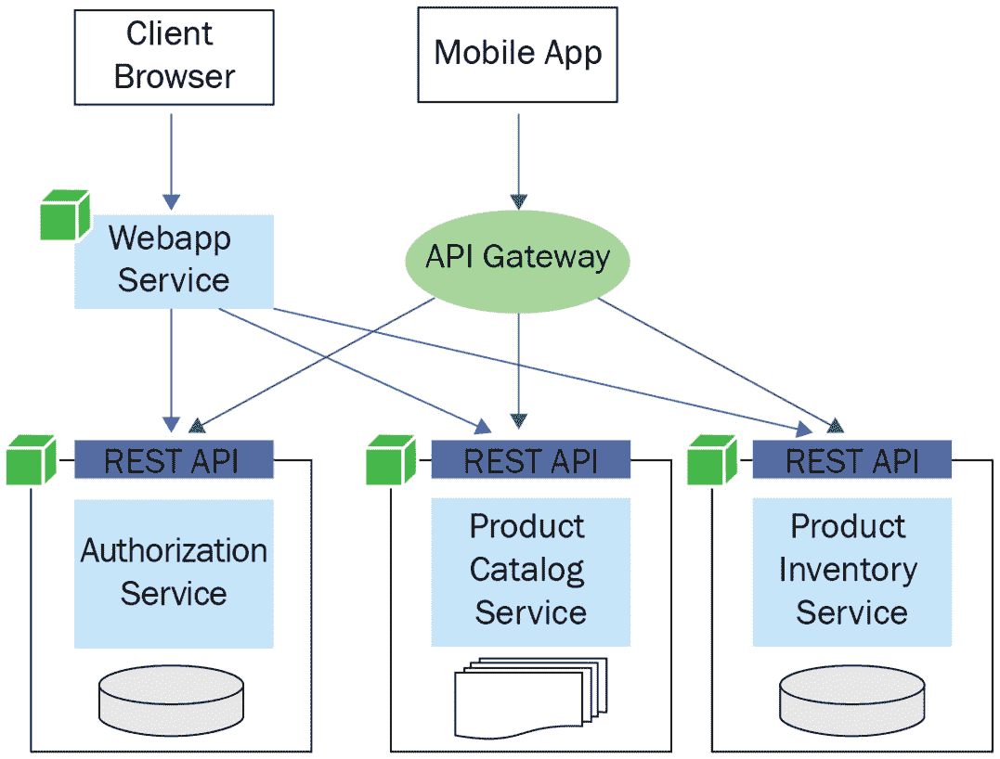
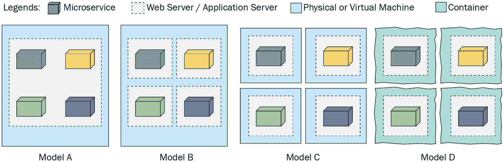
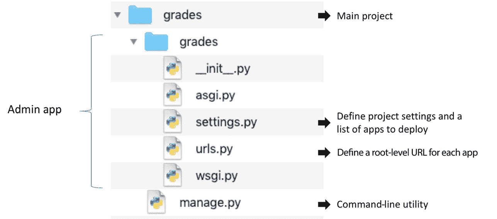
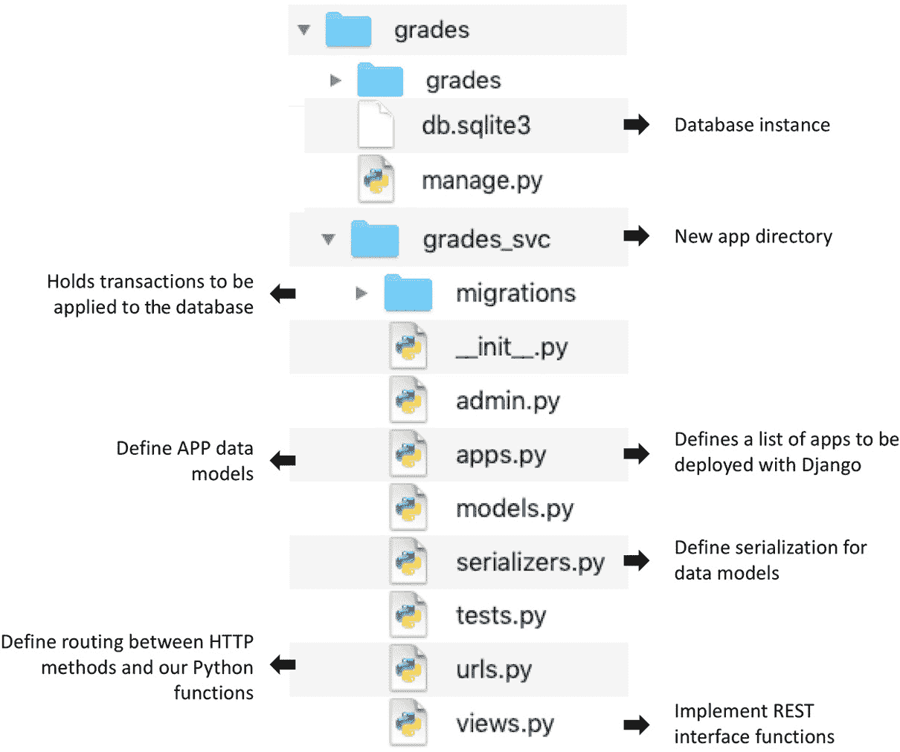

# 第十一章：*第十一章*：使用 Python 进行微服务开发

多年来，单体应用程序作为单层软件构建，一直是开发应用程序的流行选择。然而，在云平台上部署单体应用程序在资源预留和利用方面并不高效。这在物理机上部署大规模单体应用程序的情况下也是如此。这类应用程序的维护和开发成本始终很高。多级应用程序通过将应用程序分解为几个层级，在一定程度上解决了 Web 应用程序的这个问题。

为了满足动态资源需求并降低开发/维护成本，真正的救星是**微服务架构**。这种新架构鼓励在松散耦合的服务上构建应用程序，并部署在如容器等动态可扩展平台上。像亚马逊、Netflix 和 Facebook 这样的组织已经从单体模型迁移到了基于微服务的架构。没有这种改变，这些组织无法服务大量客户。

我们在本章中将涵盖以下主题：

+   介绍微服务

+   学习微服务的最佳实践

+   构建基于微服务的应用程序

完成本章学习后，您将了解微服务，并能够基于微服务构建应用程序。

# 技术要求

以下为本章的技术要求：

+   您需要在您的计算机上安装 Python 3.7 或更高版本。

+   在 Python 3.7 或更高版本上安装了 RESTful 扩展的 Python Flask 库。

+   在 Python 3.7 或更高版本上，使用 Django Rest Framework 库构建的 Python Django。

+   您需要在您的机器上拥有 Docker 注册表账户，并安装 Docker Engine 和 Docker Compose。

+   要在 GCP Cloud Run 中部署微服务，您需要一个 GCP 账户（免费试用版即可）。

本章的示例代码可以在[`github.com/PacktPublishing/Python-for-Geeks/tree/master/Chapter11`](https://github.com/PacktPublishing/Python-for-Geeks/tree/master/Chapter11)找到。

我们将首先从微服务的介绍开始讨论。

# 介绍微服务

微服务是一个独立的软件实体，必须具备以下特征：

+   **松散耦合**与其他服务，且不依赖于其他软件组件

+   **易于开发**和**维护**，小型团队无需依赖其他团队

+   **独立安装**作为一个单独的实体，最好在容器中

+   提供使用同步协议（如 REST API）或异步协议（如**Kafka**或**RabbitMQ**）的**易于消费**的接口

软件被称为微服务的关键字是独立部署、松散耦合和易于维护。每个微服务都可以有自己的数据库服务器，以避免与其他微服务共享资源。这将确保消除微服务之间的依赖性。

微服务架构风格是一种软件开发范式，用于使用纯微服务开发应用程序。这种架构甚至包括应用程序的主要接口实体，例如网络应用程序。以下是一个基于微服务的应用程序的示例：



图 11.1 – 一个示例的微服务架构风格应用程序

在这个示例应用程序中，我们有如**授权服务**、**产品目录服务**和**产品库存服务**等单个微服务。我们构建了一个网络应用程序，也是一个微服务，它通过 REST API 使用这三个单个微服务。对于移动客户端，可以通过 API 网关使用相同的单个微服务构建一个移动应用程序。我们可以看到微服务架构的一个直接优势，那就是可重用性。使用微服务的其他一些优势如下：

+   在选择任何适合任何单个微服务需求的技术和编程语言时，我们非常灵活。如果我们能够通过 API 接口暴露它，我们甚至可以重用任何语言编写的遗留代码。

+   我们可以通过小型独立团队开发、测试和维护单个微服务。对于大规模应用程序的开发，拥有独立和自主的小型团队至关重要。

+   单体应用程序的一个挑战是管理冲突的库版本，我们被迫包含这些版本，因为它们包含在单个应用程序的不同功能中。使用微服务，这些库版本冲突的可能性最小化。

+   我们可以独立部署和修补单个微服务。这使得我们能够为复杂的应用程序使用**持续集成/持续交付**（**CI/CD**）。当我们需要应用补丁或升级应用程序的一个功能时，这也非常重要。对于单体应用程序，我们将重新部署整个应用程序，这意味着有可能破坏应用程序的其他部分。使用微服务，只有一两个服务会被重新部署，而不会在其他微服务中造成破坏的风险。

+   我们可以在微服务级别而不是应用程序级别隔离故障和失败。如果一个服务出现故障或失败，我们可以调试它、修复它、打补丁或停止它进行维护，而不会影响应用程序的其他功能。在单体应用程序的情况下，一个组件的问题可能会使整个应用程序崩溃。

尽管有多个优点，但使用微服务架构风格也有一些缺点：

+   首先是创建基于微服务的应用程序的复杂性增加。这种复杂性主要源于每个微服务都必须暴露一个 API，并且消费者服务或程序必须使用 API 与微服务进行交互。基于每个微服务的安全性也是复杂性的另一个贡献者。

+   第二个缺点是与单体应用程序相比，资源需求增加。每个微服务都需要额外的内存来独立托管在容器或虚拟机中，即使它是一个**Java 虚拟机**（**JVM**）。

+   第三个缺点是，在可能部署在不同容器或系统中的不同微服务之间调试和解决问题需要额外的努力。

接下来，我们将研究构建微服务的最佳实践。

# 学习微服务的最佳实践

当开始一个新的应用程序时，我们首先应该问自己的问题是微服务架构是否合适。这始于对应用程序需求的分析以及将需求划分为单独和独立组件的能力。如果你看到你的组件经常相互依赖，这是一个指标，表明组件的隔离可能需要重新设计，或者这个应用程序可能不适合微服务架构。

在应用程序的早期阶段就决定是否使用微服务非常重要。有一种观点认为，最好一开始就使用单体架构来避免微服务的额外成本。然而，这不是一个可取的方法。一旦我们构建了一个单体应用程序，就很难将其转换为微服务架构，尤其是如果应用程序已经在生产中。像亚马逊和 Netflix 这样的公司已经做到了，但他们是在其技术演化的过程中做的，而且他们当然有可供利用的人力和技术资源来完成这种转型。

一旦我们决定使用微服务来构建我们的下一个应用程序，以下最佳实践将指导你在设计和部署决策中：

+   **独立且松散耦合**：这些要求是微服务定义的一部分。每个微服务都应该独立于其他微服务构建，并且尽可能地以松散耦合的方式构建。

+   **领域驱动设计**（**DDD**）：微服务架构的目的不是尽可能多地拥有小型微服务。我们需要始终记住，每个微服务都有其开销成本。我们应该构建业务或领域所需的微服务数量。我们建议考虑领域驱动设计（DDD），这是由*埃里克·埃文斯*在 2004 年提出的。

    如果我们尝试将领域驱动设计（DDD）应用于微服务，它建议首先进行战略设计，通过结合相关的业务领域及其子领域来定义不同的上下文。战略设计可以由战术设计跟随，战术设计专注于将核心领域分解成细粒度的构建块和实体。这种分解将为将需求映射到可能的微服务提供明确的指导。

+   **通信接口**：我们应该使用定义良好的微服务接口，最好是 REST API 或事件驱动 API，用于通信。微服务应避免直接相互调用。

+   **使用 API 网关**：微服务和它们的消费者应用应该通过 API 网关与单个微服务进行交互。API 网关可以开箱即用地处理安全方面的问题，例如身份验证和负载均衡。此外，当我们有一个微服务的新版本时，我们可以使用 API 网关将客户端请求重定向到新版本，而不会影响客户端软件。

+   **限制技术栈**：尽管微服务架构允许在服务级别使用任何编程语言和框架，但在没有业务或重用性原因的情况下，不建议使用不同的技术来开发微服务。多样化的技术栈可能从学术角度来看很有吸引力，但它将在维护和解决问题时带来运营复杂性。

+   **部署模型**：在容器中部署微服务不是强制性的，但这是推荐的。容器带来了许多内置功能，例如自动化部署、跨平台支持和互操作性。此外，通过使用容器，我们可以根据服务的要求分配资源，并确保不同微服务之间资源的公平分配。

+   **版本控制**：我们应该为每个微服务使用独立的版本控制系统。

+   **团队组织**：微服务架构提供了一个按每个微服务分配专用团队的机会。在组织大规模项目团队时，我们应该牢记这一原则。团队的大小应根据*两个披萨原则*来确定，即我们应该组建一个可以由两个大披萨喂养的工程师团队。一个团队可以拥有一个或多个微服务，这取决于它们的复杂性。

+   **集中式日志/监控**：如前所述，在微服务架构风格的应用程序中解决问题可能很耗时，尤其是如果微服务在容器中运行。我们应该使用开源或专业工具来监控和解决问题，以减少此类运营成本。此类工具的几个例子包括**Splunk**、**Grafana**、**Elk**和**App Dynamics**。

现在我们已经介绍了微服务的概念以及最佳实践，接下来，我们将深入学习如何使用微服务构建应用程序。

# 构建基于微服务的应用程序

在深入了解微服务的实现细节之前，分析几个微服务框架和部署选项是非常重要的。我们将从 Python 中可用的一个微服务框架开始。

## 学习 Python 中的微服务开发选项

在 Python 中，我们有大量的框架和库可用于微服务开发。我们无法列举所有可用的选项，但值得突出显示最受欢迎的以及那些具有一些不同功能集的选项。以下是对这些选项的描述：

+   **Flask**：这是一个轻量级的框架，可以用来构建基于**Web 服务网关接口**（**WSGI**）的微服务。请注意，WSGI 基于请求-响应的同步设计模式。我们已经在*第十章*，“使用 Python 进行 Web 开发和 REST API”中使用了 Flask 及其 RESTful 扩展来构建 REST API 应用程序。由于 Flask 是一个流行的 Web 和 API 开发框架，因此对于已经使用 Flask 的开发者来说，它是一个易于采纳的选择。

+   **Django**：Django 是另一个拥有庞大开发者社区的流行 Web 框架。通过其**Django Rest Framework**（**DRF**），我们可以使用 REST API 接口构建微服务。Django 提供基于 WSGI 和**异步服务网关接口**（**ASGI**）的微服务。ASGI 被认为是 WSGI 接口的继任者。如果你对基于**Asyncio**（我们在*第七章*，“多进程、多线程和异步编程”中详细讨论的主题）开发应用程序感兴趣，ASGI 是一个很好的选择。

+   **Falcon**：这也是在 Flask 和 Django 之后的一个流行的 Web 框架。它没有内置 Web 服务器，但针对微服务进行了很好的优化。像 Django 一样，它支持 ASGI 和 WSGI。

+   **Nameko**：这个框架专门为 Python 中的微服务开发设计，并且不是一个 Web 应用程序框架。Nameko 内置了对**远程过程调用**（**RPC**）、异步事件和基于 WebSocket 的 RPC 的支持。如果你的应用程序需要这些通信接口中的任何一个，你应该考虑使用 Nameko。

+   **Bottle**：这是一个基于 WSGI 的超级轻量级微服务框架。整个框架基于一个文件，并且仅使用 Python 标准库进行操作。

+   **Tornado**：它基于非阻塞网络 I/O。Tornado 可以以极低的开销处理高流量。这也适用于长轮询和基于 WebSocket 的连接。

为了我们样本微服务的开发，我们可以使用前面提到的任何框架。但我们将使用 Flask 和 Django，原因有两个。首先，这两个框架在开发 Web 应用和微服务方面是最受欢迎的。其次，我们将重用我们在上一章中开发的示例 API 应用。一个新的微服务将使用 Django 开发，它将展示如何使用 Django 进行 Web 和 API 开发。

接下来，我们将讨论微服务的部署选项。

## 介绍微服务的部署选项

一旦我们编写了微服务，下一个问题就是如何将它们作为独立和独立的实体进行部署。为了讨论方便，我们假设微服务是用 HTTP/REST 接口构建的。我们可以将所有微服务部署在同一台 Web 服务器上作为不同的 Web 应用，或者为每个微服务托管一台 Web 服务器。一个单独的 Web 服务器上的微服务可以部署在单台机器（物理或虚拟）上，或者在不同的机器上，甚至在不同的容器中。我们已经在以下图表中总结了所有这些不同的部署模型：




图 11.2 – 微服务部署模型

*图 11.2* 中显示的四种部署模型描述如下：

+   **模型 A**：在这个模型中，我们在同一台 Web 服务器上部署了四个不同的微服务。在这种情况下，微服务很可能共享库，位于单个 Web 服务器上。这可能会导致库冲突，因此不推荐使用这种模型来部署微服务。

+   **模型 B**：对于这个模型，我们在一台机器上部署了四个微服务，但每个微服务使用一个 Web 服务器来使它们独立。这种模型在开发环境中是可行的，但在生产规模上可能不太合适。

+   **模型 C**：这个模型使用四台虚拟机来托管四个不同的微服务。每台机器只托管一个微服务和一个 Web 服务器。如果无法使用容器，这种模型适合生产环境。这个模型的主要缺点是由于每个虚拟机都会带来额外的资源开销，从而增加了成本。

+   **模型 D**：在这个模型中，我们将每个微服务作为容器部署在单台机器上或跨多台机器。这不仅成本低，而且提供了一个简单的方法来符合微服务规范。只要可行，这是推荐使用的模型。

我们分析了不同的部署模型，以了解哪个选项比其他选项更合适。对于我们的示例基于微服务的应用程序开发，我们将使用基于容器和仅托管在 Web 服务器上的微服务的混合模式。这种混合模式说明我们可以从技术上使用任何选项，尽管基于容器的部署是一个推荐的选择。稍后，我们将把我们的一个微服务带到云端，以展示微服务的可移植性。

在讨论了微服务的开发和部署选项之后，现在是时候在下一节开始使用两个微服务构建应用程序了。

## 开发一个基于微服务的示例应用程序

对于这个示例应用程序，我们将使用 Flask 和 Django 框架开发两个微服务和一个 Web 应用程序。我们的示例应用程序将是上一章作为案例研究开发的**学生**Web 应用程序的扩展。应用程序架构将如图所示：

![图 11.3 – C 示例应用程序的基于微服务的架构]

![图片 B17189_11_03.jpg]

图 11.3 – C 示例应用程序的基于微服务的架构

为了开发这个示例应用程序，我们将开发以下组件：

+   在 Students 微服务下构建一个新的`Student`模型。

+   重新使用上一章中的`apiapp`应用程序。在这个示例应用程序中，它被命名为`Students`微服务。这个应用程序/模块的代码将不会发生变化。

+   我们将更新上一章案例研究中的`webapp`应用程序，以使用`Grades`微服务，并为每个`Student`对象添加额外的`Grade`属性。这还需要对 Jinja 模板进行一些小的更新。

我们将首先使用 Django 构建`Grades`微服务。

### 创建成绩微服务

要使用 Django 开发微服务，我们将使用**Django Rest Framework**（**DRF**）。Django 使用其 Web 框架的多个组件来构建 REST API 和微服务。因此，这个开发练习也将给您一个关于使用 Django 开发 Web 应用程序的高级概念。

由于我们是从 Flask 开始的，并且已经熟悉了 Web 开发的核心概念，因此对我们来说，开始使用 Django 将是一个方便的过渡。现在让我们了解涉及的步骤：

1.  首先，我们将创建一个项目目录，或者在最喜欢的 IDE 中创建一个新的项目并使用虚拟环境。如果您没有使用 IDE，您可以在项目目录下使用以下命令创建和激活一个虚拟环境：

    ```py
    python -m venv myenv
    source myenv/bin/activate
    ```

    对于任何 Web 应用程序，为每个应用程序创建一个虚拟环境是至关重要的。使用全局环境来管理库依赖可能会导致难以调试的错误。

1.  要构建一个 Django 应用程序，我们需要至少两个可以使用以下`pip`命令安装的库：

    ```py
    pip install django 
    pip install django-rest-framework
    ```

1.  一旦我们安装了 Django，我们就可以使用 `django-admin` 命令行工具来创建一个 Django 项目。下面的命令将创建一个用于我们的微服务的 Django `grades` 项目：

    ```py
    admin web app under the grades directory and add a manage.py file to our project. The admin web app includes built-in web server launch scripts, a settings file, and a URL routing file. manage.py is also a command-line utility, like django-admin, and offers similar features but in the context of a Django project. The file structure of the project directory will look as follows when we create a new Django project: Figure 11.4 – File structure of a new Django project As shown in *Figure 11.4*, the `settings.py` file contains a project-level setting including a list of apps to deploy with the web server. The `urls.py` file contains routing information for different deployed applications. Currently, only the `admin` app is included in this file. `asgi.py` and `wsgi.py` are available to launch the ASGI or WSGI web server, and the option of which one to use is set in the `settings.py` file. 
    ```

1.  下一步是创建一个新的 Django 应用（我们的 `Grades` 微服务），在主 `grades` 项目目录下使用以下命令：

    ```py
    grades_svc. This will also create a default SQLite3 database instance. The option of using the default SQLite3 database is available in the settings.py file, but it can be changed if we decide to use any other database. 
    ```

1.  除了在 `grades_svc` 目录中自动创建的文件外，我们还将添加两个额外的文件 – `urls.py` 和 `serializers.py`。带有两个额外文件的完整项目目录结构在 *图 11.5* 中显示。与我们的项目相关的不同文件的作用也在这个图中进行了详细说明：

    图 11.5 – 包含 grades_svc 应用的完整目录结构

1.  接下来，我们将逐个添加这些文件中我们微服务所需的必要代码。我们将首先通过扩展 Django 数据库 `models` 包中的 `Model` 类来定义我们的 `Grade` 模型类。`models.py` 文件的完整代码如下：

    ```py
    from django.db import models
    class Grade(models.Model):
        grade_id = models.CharField(max_length=20)
        building = models.CharField(max_length=200)
        teacher = models.CharField(max_length=200)
        def __str__(self):
            return self.grade_id
    ```

1.  为了使我们的模型在 `admin` 应用仪表板中可见，我们需要在 `admin.py` 文件中注册我们的 `Grade` 类模型，如下所示：

    ```py
    from django.contrib import admin
    from .models import Grade
    admin.site.register(Grade)
    ```

1.  接下来，我们将实现一个从数据库中检索 `Grade` 对象列表的方法。我们将在 `views.py` 文件中通过扩展 `ViewSet` 来添加一个 `GradeViewSet` 类，如下所示：

    ```py
    from rest_framework import viewsets, status
    from rest_framework.response import Response
    from .models import Grade
    from .serializers import GradeSerializer
    class GradeViewSet(Grade object and for getting a Grade object according to its ID in actual implementation for the completeness of our microservice. We are showing only the list method because this is the only method relevant for our sample application. It is also important to highlight that the view objects should be implemented as classes and we should avoid putting application logic in the view objects.
    ```

一旦我们在 `grades_svc` 应用程序下实现了核心方法，我们将添加我们的应用程序到 Django 项目中进行部署，并在应用以及 API 级别添加路由：

1.  首先，我们将在 `settings.py` 文件中将我们的 `grades_svc` 应用和 `rest-framework` 添加到 `INSTALLED_APPS` 列表中，如下所示：

    ```py
    INSTALLED_APPS = [
        'django.contrib.admin',
        'django.contrib.auth',
        'django.contrib.contenttypes',
        'django.contrib.sessions',
        'django.contrib.messages',
        'django.contrib.staticfiles',
        'grades_svc',
        'rest_framework',
    ]
    ```

    开发者常犯的一个错误是将新组件不断添加到单个设置文件中，这对于大型项目来说很难维护。最佳实践是将文件拆分为多个文件，并在主设置文件中加载它们。

1.  这也将确保我们的应用程序在 `admin` 应用中可见。下一步是在 `admin` 应用级别以及应用级别添加 URL 配置。首先，我们将在 `admin` 应用的 `urls.py` 文件中添加我们应用程序的 URL，如下所示：

    ```py
    urlpatterns = [
        path('admin/', admin.site.urls),
        urls.py file of the admin app, we are redirecting every request to our microservice, except the one that comes with the admin/ URL. 
    ```

1.  下一步是在我们的应用程序中根据不同的 HTTP 方法设置路由。这需要我们在 `grades_svc` 目录中添加 `urls.py` 文件，并包含以下路由定义：

    ```py
    from django.urls import path
    from .views import GradeViewSet
    urlpatterns = [
        path(grades/', GradeViewSet.as_view({
            GET and POST methods of HTTP requests with the grades/ URL to the list and create methods of the GradeViewSet class that we implemented in the views.py file earlier. Similarly, we attached the GET request with the grades/<str:id> URL to the retrieve method of the GradeViewSet class. By using this file, we can add additional URL mapping to the Python functions/methods. 
    ```

这就完成了我们的 `Grades` 微服务的实现。下一步是在 Django 网络服务器上运行此服务以进行验证。但在运行服务之前，我们将确保模型对象已转移到数据库中。这在 Flask 的情况下相当于初始化数据库。在 Django 的情况下，我们运行以下两个命令来准备更改，然后执行它们：

```py
python3 manage.py makemigrations
python3 manage.py migrate
```

通常，开发者会错过这个重要的步骤，在尝试启动应用程序时遇到错误。因此，在通过以下命令启动 Web 服务器之前，请确保所有更改都已执行：

```py
python3 manage.py runserver
```

这将在我们的本地主机机器上的默认端口`8000`启动一个 Web 服务器。请注意，包括数据库和具有主机和端口属性的 Web 服务器在内的默认设置可以在`settings.py`文件中更改。此外，我们建议使用以下命令设置`admin`应用程序的用户账户：

```py
python3 manage.py createsuperuser
```

此命令将提示您选择管理员账户的用户名、电子邮件地址和密码。一旦我们的微服务按预期执行功能，就是时候将其打包到容器中，并以容器应用程序的形式运行它。这将在下一节中解释。

### 微服务容器化

容器化是一种操作系统虚拟化类型，其中应用程序在其单独的用户空间中运行，但共享相同的操作系统。这个单独的用户空间被称为**容器**。Docker 是创建、管理和运行容器应用程序最流行的平台。Docker 仍然占据超过 80%的市场份额，但还有其他容器运行时，如**CoreOS rkt**、**Mesos**、**lxc**和**containerd**。在用 Docker 对我们的微服务进行容器化之前，我们将快速回顾 Docker 平台的主要组件：

+   **Docker Engine**：这是 Docker 的核心应用程序，用于构建、打包和运行基于容器的应用程序。

+   **Docker 镜像**：Docker 镜像是一个文件，用于在容器环境中运行应用程序。使用 Docker Engine 开发的程序存储为 Docker 镜像，这些镜像是一组应用程序代码、库、资源文件以及应用程序执行所需的任何其他依赖项。

+   **Docker Hub**：这是一个在线仓库，用于在您的团队和社区内共享 Docker 镜像。**Docker Registry**是在同一上下文中使用的另一个术语。Docker Hub 是管理 Docker 镜像仓库的 Docker 注册表的官方名称。

+   **Docker Compose**：这是一个使用基于 YAML 的文件构建和运行容器应用程序的工具，而不是使用 Docker Engine 的 CLI 命令。Docker Compose 提供了一种简单的方式来部署和运行多个容器，包括配置属性和依赖项。因此，我们建议使用 Docker Compose 或类似技术来构建和运行您的容器。

要使用 Docker Engine 和 Docker Compose，您需要在 Docker 注册表中有一个账户。此外，在开始以下步骤之前，您必须在您的机器上下载并安装 Docker Engine 和 Docker Compose。

1.  作为第一步，我们将使用`pip freeze`命令文件创建我们项目的依赖列表，如下所示：

    ```py
    requirements.txt file. This file will be used by Docker Engine to download these libraries inside the container on top of a Python interpreter. The contents of this file in our project are as follows: 

    ```

    asgiref==3.4.1

    Django==3.2.5

    django-rest-framework==0.1.0

    djangorestframework==3.12.4

    pytz==2021.1

    sqlparse==0.4.1

    ```py

    ```

1.  在下一步中，我们将构建 `Dockerfile`。此文件也将被 Docker Engine 用于创建容器的新镜像。在我们的情况下，我们将向此文件添加以下行：

    ```py
    FROM python:3.8-slim
    ENV PYTHONUNBUFFERED 1
    WORKDIR /app
    COPY requirements.txt /app/requirements.txt
    RUN pip install -r requirements.txt
    COPY . /app
    CMD python manage.py runserver 0.0.0.0:8000
    ```

    文件的第一行设置了此容器的基镜像，我们将其设置为 `Python:3.8-slim`，这个镜像已经在 Docker 仓库中可用。文件的第二行设置了环境变量以实现更好的日志记录。其余的行都是自解释的，因为它们大多是 Unix 命令。

1.  作为下一步，我们将创建一个 Docker Compose 文件（`docker-compose.yml`），如下所示：

    ```py
    version: '3.7'
    services:
      gradesms:
        build:
          context: gradesms service. Note that build is pointing to Dockerfile we just created and assuming it is in the same directory as this docker-compose.yml file. The container port 8000 is mapped to the web server port 8000. This is an important step in allowing traffic from the container to your application inside the container.
    ```

1.  作为最后一步，我们将当前目录（`.`）挂载到容器内的 `/app` 目录。这将允许系统上的更改反映在容器中，反之亦然。如果您在开发周期中创建容器，这一步非常重要。

1.  我们可以使用以下 Docker Compose 命令来启动我们的容器：

    ```py
    docker-compose up
    ```

    第一次，它将构建一个新的容器镜像，并且需要互联网访问来从 Docker 仓库下载基础容器镜像。在创建容器镜像后，它将自动启动容器。

Docker Engine 和 Docker Compose 的工作细节超出了本书的范围，但我们建议您通过他们的在线文档（[`docs.docker.com/`](https://docs.docker.com/)）熟悉容器技术，如 Docker。

### 重复使用我们的 Students API 应用

我们将重复使用我们在上一章中开发的 `Students` API 应用。此应用将使用其内置服务器启动，我们将它命名为我们的示例应用的 `Students` 微服务。此应用将不会有任何变化。

### 更新我们的 Students Web 应用程序

我们在上一章案例研究中开发的 `webapp` 应用程序仅通过 REST API 使用 `apiapp`。在修订版的这个 Web 应用程序中，我们将使用 `Grades` 微服务和 `Students` 微服务来获取 `Grade` 对象列表和 `Student` 对象列表。我们 Web 应用程序中的 `list` 函数将结合这两个对象列表，为 Web 客户端提供更多信息。`webapp.py` 文件中更新的 `list` 函数如下：

```py
STUDENTS_MS = http://localhost:8080/students
GRADES_MS   = "http://localhost:8000/grades"
@app.get('/')
def list():
   student_svc_resp = requests.get(STUDENTS_MS)
   students = json.loads(student_svc_resp.text)
   grades_svc_resp = requests.get(GRADES_MS)
   grades_list = json.loads(grades_svc_resp.text)
   grades_dict = {cls_item['grade']:
                    cls_item for cls_item in grades_list}
  for student in students:
    student['building'] =         grades_dict[student['grade']]['building']
    student['teacher'] =         grades_dict[student['grade']]['teacher']
   return render_template('main.html', students=students)
```

在这个修订的代码中，我们使用字典推导从 `Grades` 对象列表中创建了一个 `grades` 字典。这个字典将被用来在将它们发送到 Jinja 模板进行渲染之前，将成绩属性插入到 `Student` 对象中。在我们的主 Jinja 模板（`main.html`）中，我们向 **Students** 表格中添加了两个额外的列，**Building** 和 **Teacher**，如下所示：

![图 11.6 – 更新后的主页面，包含建筑和教师数据

![img/B17189_11_06.jpg]

图 11.6 – 更新后的主页面，包含建筑和教师数据

在本节中，我们介绍了创建微服务、将其作为 Docker 容器以及 Web 服务器上的 Web 应用程序部署，并将两个微服务的结果结合到一个 Web 应用程序中。

### 将 Students 微服务部署到 GCP Cloud Run

到目前为止，我们已使用 `Students` 微服务作为具有 REST API 的 Web 应用程序，该 API 在 Flask 开发服务器上托管。现在是时候将其容器化并部署到 **Google Cloud Platform**（**GCP**）了。GCP 有一个运行时引擎（**Cloud Run**），用于部署容器并将它们作为服务（微服务）运行。以下是涉及的步骤：

1.  要将我们的 `Students` 微服务的应用程序代码打包到容器中，我们首先确定一个依赖项列表并将它们导出到 `requirements.txt` 文件中。我们将从 `Students` 微服务项目的虚拟环境中运行以下命令：

    ```py
    pip freeze -> requirements.txt
    ```

1.  下一步是在项目的根目录中构建 Dockerfile，就像我们为我们的 `Grades` 微服务准备的那样。Dockerfile 的内容如下：

    ```py
    FROM python:3.8-slim
    ENV PYTHONUNBUFFERED True
    WORKDIR /app
    COPY . ./
    #Install production dependencies.
    RUN pip install -r requirements.txt
    RUN pip install Flask gunicorn
    # Run the web service on container startup. we will use 
    # gunicorn and bind our api_app as the main application
    CMD exec gunicorn --bind:$PORT --workers 1 --threads 8 api_app:app
    ```

    要在 GCP Cloud Run 上部署我们的应用程序，Dockerfile 就足够了。但首先，我们需要使用 GCP Cloud SDK 构建容器镜像。这需要我们使用 Cloud SDK 或 GCP 控制台创建一个 GCP 项目。我们在前面的章节中解释了创建 GCP 项目并将其与计费账户关联的步骤。我们假设您已经在 GCP 上创建了一个名为 `students-run` 的项目。

1.  一旦项目准备就绪，我们可以使用以下命令构建 `Students` API 应用程序的容器镜像：

    ```py
    gcr stands for Google Container Registry.
    ```

1.  要创建一个镜像，我们必须在以下格式中提供 tag 属性：

    ```py
    <hostname>/<Project ID>/<Image name>
    ```

1.  在我们的案例中，主机名是 `gcr.io`，它位于美国。我们也可以使用本地创建的镜像，但我们必须首先按照上述格式设置 `tag` 属性，然后将它推送到 Google 仓库。这可以通过以下 Docker 命令实现：

    ```py
    docker tag gcloud build command can achieve two steps in one command.
    ```

1.  下一步是运行上传的镜像。我们可以通过以下 Cloud SDK 命令来运行我们的容器镜像：

    ```py
    gcloud run deploy --image gcr.io/students-run/students
    ```

    我们镜像的执行也可以从 GCP 控制台触发。一旦容器成功部署并运行，此命令的输出（或 GCP 控制台）将包括我们的微服务的 URL。

要从 GCP Cloud Run 消费这个新的 `Students` 微服务版本，我们需要更新我们的 Web 应用程序以切换到使用 GCP Cloud Run 中新部署服务的 URL。如果我们使用本地部署的 `Grades` 微服务和远程部署的 `Students` 微服务测试我们的 Web 应用程序，我们将得到与前面 *图 11.6* 中所示相同的成果，并且可以执行所有操作，就像 `Students` 微服务本地部署时一样。

这结束了我们关于使用不同的 Python 框架构建微服务、在本地以及云中部署它们，并从 Web 应用程序中消费它们的讨论。

# 摘要

在本章中，我们介绍了微服务架构，并讨论了其优点和缺点。我们涵盖了构建、部署和运营微服务的几个最佳实践。我们还分析了在 Python 中构建微服务的开发选项，包括 Flask、Django、Falcon、Nameko、Bottle 和 Tornado。我们选择了 Flask 和 Django 来构建示例微服务。为了实现一个新的微服务，我们使用了 Django 及其 REST 框架（DRF）。这个微服务实现还向您介绍了 Django 框架的一般工作方式。稍后，我们提供了如何使用 Docker Engine 和 Docker Compose 容器化新创建的微服务的详细说明。最后，我们将我们的 `Students` API 应用程序转换为 Docker 镜像，并在 GCP Cloud Run 上部署。我们还更新了 `Students` 网络应用程序，使其能够消费部署在世界不同地区的两个微服务。

本章包含的代码示例将为您提供在构建和部署不同环境中的微服务时的实践经验。这些知识对任何希望在下一个项目中构建微服务的人来说都是有益的。在下一章中，我们将探讨如何使用 Python 开发无服务器函数，这是云软件开发的新范式。

# 问题

1.  我们能否在不使用容器的情况下部署微服务？

1.  两个微服务是否应该共享一个数据库，但使用不同的模式？

1.  Docker Compose 是什么，它是如何帮助部署微服务的？

1.  REST 是否是微服务数据交换的唯一格式？

# 进一步阅读

+   《动手实践：使用 Python 的 Docker 微服务》，作者：Jaime Buelta

+   《Python 微服务开发》，作者：Tarek Ziade

+   《领域驱动设计：软件核心的复杂性处理》，作者：Eric Evans

+   《Google Cloud Run 快速入门教程》用于构建和部署微服务，可在 [`cloud.google.com/run/docs/quickstarts/`](https://cloud.google.com/run/docs/quickstarts/) 找到

# 答案

1.  是的，但建议将其部署在容器中。

1.  从技术上讲，这是可行的，但并不是最佳实践。数据库故障将导致所有微服务都崩溃。

1.  Docker Compose 是一个使用 YAML 文件部署和运行容器应用的工具。它提供了一个简单的格式来定义不同的服务（容器）及其部署和运行时属性。

1.  REST API 是微服务之间数据交换最流行的接口，但并非唯一。微服务还可以使用 RPC 和基于事件的协议进行数据交换。
