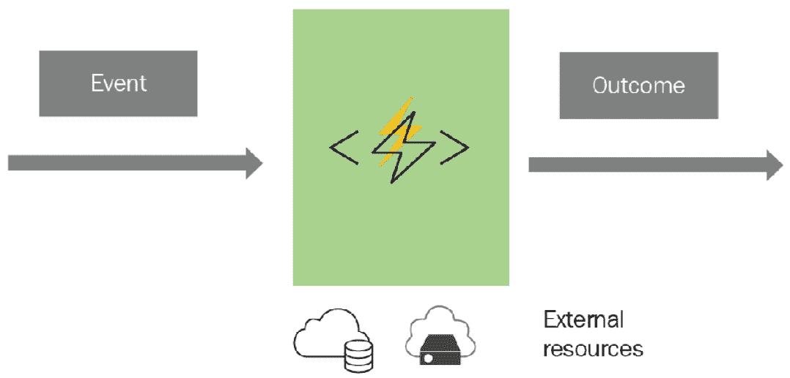
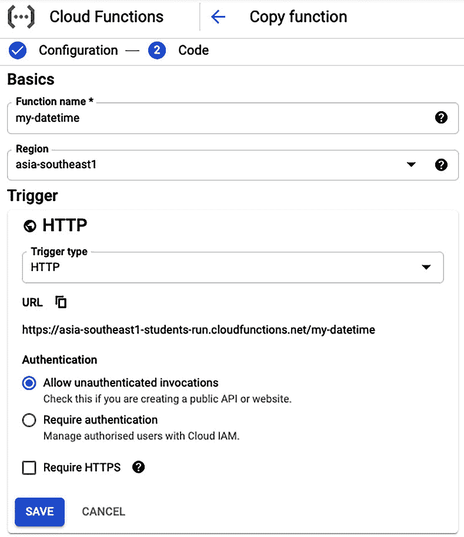
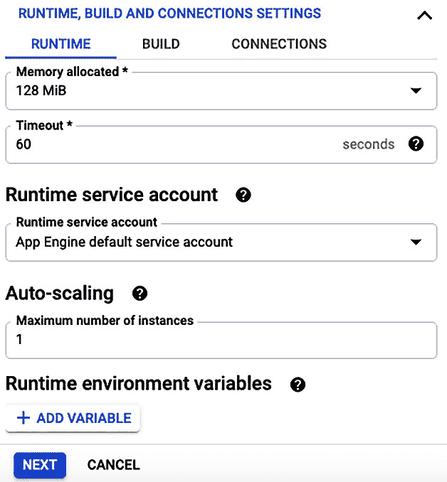
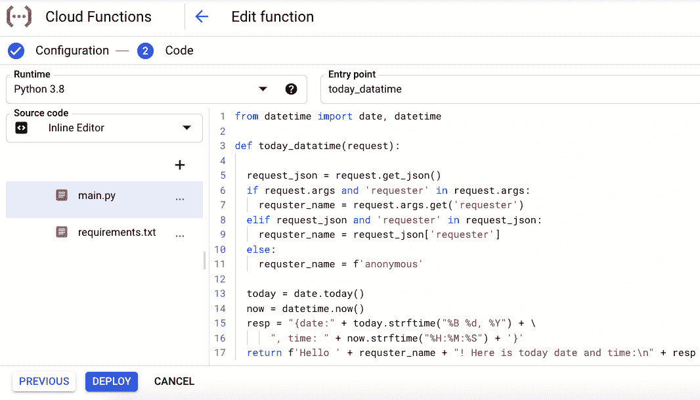

# *第十二章*：使用 Python 构建无服务器函数

无服务器计算是一种新的云计算模式，它将物理或虚拟服务器的管理以及数据库系统等基础设施级软件的管理与应用程序本身分离。这种模式允许开发者专注于应用程序开发，并使其他人能够管理底层的基础设施资源。云服务提供商是采用这种模式的最优选择。容器不仅适用于复杂的部署，而且在无服务器计算时代也是一种突破性技术。除了容器之外，还有一种无服务器计算的形式，被称为**函数即服务**（**FaaS**）。在这种新范式下，云服务提供商提供了一个平台来开发和运行应用程序函数或**无服务器函数**，通常是对这些函数的直接调用或响应某个事件。所有公共云服务提供商，如亚马逊、谷歌、微软、IBM 和甲骨文，都提供这项服务。本章的重点将在于理解和构建使用 Python 的无服务器函数。

在本章中，我们将涵盖以下主题：

+   介绍无服务器函数

+   理解无服务器函数的部署选项

+   通过案例研究学习如何构建无服务器函数

完成本章学习后，你应该对无服务器函数在云计算中的作用以及如何使用 Python 构建它们有一个清晰的理解。

# 技术要求

以下是为本章列出的技术要求：

+   你需要在你的计算机上安装 Python 3.7 或更高版本。

+   要在**谷歌云平台**（**GCP**）的 Cloud Functions 中部署无服务器函数，你需要一个 GCP 账户（免费试用版即可）。

+   你需要一个*SendGrid*账户（即免费账户）来发送电子邮件。

本章的示例代码可以在[`github.com/PacktPublishing/Python-for-Geeks/tree/master/Chapter12`](https://github.com/PacktPublishing/Python-for-Geeks/tree/master/Chapter12)找到。

让我们从无服务器函数的介绍开始。

# 介绍无服务器函数

无服务器函数是一种模型，可以用来开发和执行软件组件或模块，而无需了解或担心底层托管平台。这些软件模块或组件在公共云服务提供商的产品中被称为**Lambda 函数**或**云函数**。亚马逊是第一个在其 AWS 平台上提供这种无服务器函数的供应商，该函数被称为**AWS Lambda**。随后是谷歌和微软，分别提供**Google Cloud Functions**和**Azure Functions**。

通常，一个无服务器函数有四个组件，如下所示：



图 12.1 – 无服务器函数的组件

接下来将描述以下四个组件：

+   **函数式代码**：这是一个执行特定任务的编程单元，根据函数的业务或功能目标。例如，我们可以编写一个无服务器函数来处理输入数据流，或者编写一个计划活动来检查某些数据资源以进行监控目的。

+   **事件**：无服务器函数不是用来像微服务一样使用的。相反，它们是基于可以由 pub/sub 系统中的事件触发的触发器来使用的，或者它们可以根据外部事件（如来自现场传感器的事件）作为 HTTP 调用出现。

+   **结果**：当无服务器函数被触发执行任务时，函数会有输出，这可以是简单的对调用者的响应，或者触发后续操作以减轻事件的影响。无服务器函数的一个结果示例是触发另一个云服务，如数据库服务，或向订阅方发送电子邮件。

+   **资源**：有时，函数式代码需要使用额外的资源来完成其工作，例如数据库服务或云存储来访问或推送文件。

## 优点

无服务器函数带来了无服务器计算的所有好处，如下所示：

+   **开发简便**：无服务器函数将基础设施复杂性从开发者手中移除，使他们能够专注于程序的函数方面。

+   **内置可伸缩性**：无服务器函数提供内置的可伸缩性，以处理任何时间点的任何流量增长。

+   **成本效益**：无服务器函数不仅降低了开发成本，还提供了优化的部署和操作模式。通常，这是一个*按使用付费*的模式，这意味着您只需为函数执行的时间付费。

+   **技术无关性**：无服务器函数是技术无关的。这意味着您可以使用多种不同的云资源，在许多编程语言中构建它们。

注意，无服务器函数有一些限制；例如，在构建此类函数时，我们将拥有较少的系统级控制，并且没有系统级访问的情况下，故障排除可能很棘手。

## 用例

无服务器函数有几种可能的用途。例如，如果我们收到云存储中文件上传的事件或通过实时流有可用数据，我们可以使用此类函数进行数据处理。特别是，无服务器函数可以与**物联网**（**IoT**）传感器集成。通常，物联网传感器数量达到数千。无服务器函数具有以可扩展的方式处理如此大量传感器请求的能力。一个移动应用程序可以使用这些函数作为后端服务来执行某些任务或处理数据，而不会损害移动设备资源。无服务器函数在现实生活中的一个实际用途是**Amazon Alexa**产品。不可能将每个技能或智能都放入 Alexa 设备本身。相反，它使用 Amazon Lambda 函数来实现这些技能。Alexa 使用 Amazon Lambda 函数的另一个原因是它们可以根据需求进行扩展。例如，某些函数可能比其他函数更常用，如天气查询。

在下一节中，我们将探讨实现和执行无服务器函数的各种部署选项。

# 理解无服务器函数的部署选项

在公共云上使用虚拟机或其他运行时资源来处理偶尔访问的应用程序可能不是一个具有商业吸引力的解决方案。在这种情况下，无服务器函数就派上用场了。在这里，云提供商为您的应用程序提供动态管理的资源，并且仅在您的应用程序响应某个事件时才向您收费。换句话说，无服务器函数是一种仅在公共云上提供的按需和按使用付费的后端计算方法。我们将介绍在公共云中部署无服务器函数的一些选项，如下：

+   **AWS Lambda**：这被认为是任何公共云提供商推出的第一个服务之一。AWS Lambda 函数可以使用 Python、Node.js、Java、PowerShell、Ruby、Java、C#和 Go 编写。AWS Lambda 函数可以在响应事件时执行，例如将文件上传到**Amazon S3**、来自**Amazon SNS**的通知或直接 API 调用。AWS Lambda 函数是无状态的。

+   **Azure Functions**：微软在 AWS Lambda 函数推出近两年后推出了 Azure Functions。这些函数可以附加到云基础设施中的事件上。微软提供支持，使用 Visual Studio、Visual Studio Code、IntelliJ 和 Eclipse 来构建和调试这些函数。Azure Functions 可以使用 C#、F#、Node.js、PowerShell、PHP 和 Python 编写。此外，微软还提供了**Durable Functions**，允许我们在无服务器环境中编写有状态的函数。

+   **谷歌云函数**：GCP 提供谷歌云函数作为无服务器函数。谷歌云函数可以用 Python、Node.js、Go、.NET、Ruby 和 PHP 编写。像其竞争对手 AWS Lambda 和 Azure Functions 一样，谷歌云函数可以通过 HTTP 请求或谷歌云基础设施的事件触发。谷歌允许你使用 Cloud Build 来自动测试和部署云函数。

除了前三大公共云提供商之外，还有一些其他云提供商的更多服务。例如，IBM 提供基于开源项目**Apache OpenWhisk**的云函数。Oracle 提供基于开源项目**Fn**的无服务器计算平台。使用这些开源项目的美妙之处在于，你可以在本地开发和测试你的代码。此外，这些项目允许你将代码从一个云平台迁移到另一个云平台，甚至迁移到本地环境部署，而无需任何更改。

值得一提的是，在无服务器计算领域广为人知的另一个框架，称为**无服务器框架**。这不是一个部署平台，而是一个可以在本地使用的软件工具，可以用来构建和打包你的代码以进行无服务器部署，然后可以用来将包部署到你的首选公共云之一。无服务器框架支持多种编程语言，如 Python、Java、Node.js、Go、C#、Ruby 和 PHP。

在下一节中，我们将使用 Python 构建几个无服务器函数。

# 学习如何构建无服务器函数

在本节中，我们将探讨如何为公共云提供商之一构建无服务器函数。尽管亚马逊 AWS 在 2014 年通过提供 AWS Lambda 函数率先推出了无服务器函数，但我们将使用谷歌云函数平台作为我们的示例函数。这样做的原因是，我们在前面的章节中已经详细介绍了 GCP，并且你可以利用相同的 GCP 账户来部署这些示例函数。然而，我们强烈建议你使用其他平台，特别是如果你计划将来使用它们的无服务器函数的话。在各个云平台上构建和部署这些函数的核心原则是相同的。

GCP 云函数提供了多种开发和无服务器函数部署的方式（在 GCP 的上下文中，我们将它们称为*云函数*）。在我们的示例云函数中，我们将探索两种类型的事件，描述如下：

+   第一个云函数将从头到尾使用 GCP 控制台构建和部署。这个云函数将基于 HTTP 调用（或事件）触发。

+   第二个 Cloud Function 将是构建一个应用程序的一部分，该应用程序可以监听云基础设施中的事件，并对该事件采取行动，例如发送电子邮件作为对此事件的响应。在这个案例研究中使用的 Cloud Function 将使用 Cloud **软件开发工具包**（**SDK**）构建和部署。

我们将首先使用 GCP 控制台构建一个 Cloud Function。

## 使用 GCP 控制台构建基于 HTTP 的 Cloud Function

让我们从 Google Cloud Function 的开发过程开始。我们将构建一个非常简单的 Cloud Function，它为 HTTP 触发器提供今天的日期和当前时间。请注意，HTTP 触发器是 Cloud Function 被调用的最简单方式。首先，我们需要一个 GCP 项目。您可以使用 GCP 控制台为这个 Cloud Function 创建一个新的 GCP 项目，或者使用现有的 GCP 项目。有关如何创建 GCP 项目并将其与计费账户关联的步骤，请参阅*第九章*，*云端的 Python 编程*。一旦您准备好了 GCP 项目，构建一个新的 Cloud Function 是一个三步的过程。我们将在以下小节中解释这些步骤。

### 配置 Cloud Function 属性

当我们从 GCP 控制台启动 **创建函数** 工作流程时，系统将提示我们提供 Cloud Function 定义，如下所示：



图 12.2 – 使用 GCP 控制台创建新 Cloud Function 的步骤（1/2）

Cloud Function 定义的高级总结如下：

1.  我们提供 `my-datetime`) 并选择托管此函数的 GCP **区域**。

1.  我们将 `HTTP` 作为函数的 **触发类型**。为您的函数选择触发器是最重要的步骤。还有其他触发器可供选择，例如 **Cloud Pub/Sub** 和 **Cloud Storage**。在撰写本书时，GCP 已添加了一些用于评估目的的更多触发器。

1.  为了简化，我们将允许我们的函数进行未认证访问。

点击 **保存** 按钮，系统将提示我们输入 **运行时、构建和连接设置**，如下面的截图所示：



图 12.3 – 使用 GCP 控制台创建新 Cloud Function 的步骤（2/2）

我们可以提供以下 **运行时、构建和连接设置**：

1.  我们可以保留运行时属性在默认设置，但我们将函数的 **内存分配** 减少到 **128 MiB**。我们已将默认服务账户作为 **运行时服务账户** 与此函数关联。我们将保留 **自动扩展** 在默认设置，但可以将此设置为函数的最大实例数。

1.  如果我们有这样的需求，我们可以在**运行时**选项卡下添加**运行时环境变量**。我们不会为我们的云函数添加任何环境变量。

1.  在**构建**选项卡下，有一个选项可以添加**构建环境变量**。我们不会为我们的云函数添加任何变量。

1.  在**连接**选项卡下，我们可以保留默认设置，允许所有流量访问我们的云函数。

在设置云函数的运行时、构建和连接设置后，下一步将是添加此云函数的实现代码。

### 将 Python 代码添加到云函数中

在点击如图 12.3 所示的**下一步**按钮后，GCP 控制台将提供一个视图来定义或添加函数实现细节，如下面的截图所示：




图 12.4 – 使用 GCP 控制台实现云函数的步骤

可用于添加我们的 Python 代码的选项如下：

+   我们可以选择多个运行时选项，例如 Java、PHP、Node.js 或各种 Python 版本。我们选择了**Python 3.8**作为云函数的**运行时**。

+   **入口点**属性必须是我们的代码中函数的名称。Google Cloud Function 将根据此**入口点**属性调用我们的代码中的函数。

+   可以使用右侧的**内联编辑器**将 Python 源代码内联添加；或者，可以使用从本地机器或云存储的 ZIP 文件上传。我们还可以提供 GCP **云源**存储库位置以存储源代码。在这里，我们选择了使用**内联编辑器**工具来实现我们的函数。

+   对于 Python，GCP 云函数平台会自动创建两个文件：`main.py`和`requirements.txt`。`main.py`文件将包含我们的代码实现，而`requirements.txt`文件应包含我们对第三方库的依赖。

    一个示例代码，该代码在 HTTP 请求中的`requester`属性内显示或未显示。根据`requester`属性值，我们将发送包含今天日期和时间的欢迎信息。我们在*第九章*，“云中的 Python 编程”中，使用 Flask Web 应用程序实现了类似的代码示例，以展示 GCP App Engine 的功能。

在我们对 Python 代码满意后，我们将在 Google Cloud Functions 平台上部署该函数。

### 部署云函数

下一步是使用屏幕底部的 **部署** 按钮部署此函数，如图 *图 12.4* 所示。GCP 将立即开始部署函数，这可能需要几分钟才能完成此活动。重要的是要理解 Google Cloud Functions 与 GCP Cloud Run 上的微服务一样，使用容器进行部署。它们的主要区别在于可以使用不同类型的事件进行调用，并且使用按使用付费的定价模式。

函数部署后，我们可以复制它、测试它或从 **云函数** 列表中删除它，如图下所示截图：

![图 12.5 – Google Cloud Functions 的主视图]

![图片 B17189_12_05.jpg]

图 12.5 – Google Cloud Functions 的主视图

现在，我们将快速向您展示如何方便地使用 GCP 控制台测试和调试我们的云函数。一旦我们选择了 JSON 格式的 `requester` 属性，如下所示：

```py
{"requester":"John"} 
```

在互联网上的任何地方点击 `CURL` 工具。然而，我们必须确保我们的云函数包含 `allUsers` 作为其成员，并具有 `Cloud Functions Invoker` 的角色。这可以在 **权限** 选项卡下设置。然而，我们不推荐在不为您的云函数设置身份验证机制的情况下这样做：

![图 12.6 – 使用 GCP 控制台测试您的云函数]

![图片 B17189_12_06.jpg]

图 12.6 – 使用 GCP 控制台测试您的云函数

使用 GCP 控制台构建简单的云函数是一个简单的过程。接下来，我们将探讨云函数在现实世界中的应用案例研究。

## 案例研究 – 为云存储事件构建通知应用程序

在本案例研究中，我们将开发一个云函数，该函数在 **Google Storage 存储桶** 上的事件触发时执行。在接收到此类事件后，我们的云函数将向预定义的电子邮件地址列表发送电子邮件作为通知。此通知应用程序与云函数的流程如下所示：

![图 12.7 – 监听 Google 存储桶事件的云函数]

![图片 B17189_12_07.jpg]

图 12.7 – 监听 Google 存储桶事件的云函数

注意，我们可以将我们的云函数设置为监听一个或多个 Google Storage 事件。Google Cloud Functions 支持以下 Google Storage 事件：

+   **完成**：当在存储桶中添加或替换新文件时创建此事件。

+   **删除**：此事件表示从存储桶中删除文件。这适用于非版本化存储桶。请注意，实际上文件并未被删除，但如果存储桶设置为使用版本控制，则文件会被存档。

+   **存档**：当文件存档时引发此事件。存档操作是在文件被删除或覆盖时触发的，适用于具有版本控制的存储桶。

+   **元数据更新**：如果文件元数据有任何更新，将创建此事件。

在收到来自 Google Storage 存储桶的事件后，Cloud Function 将从作为参数传递给我们的 Cloud Function 的上下文和事件对象中提取属性。然后，云函数将使用第三方电子邮件服务（例如来自 *Twilio* 的 *SendGrid*）来发送通知。

作为先决条件，你必须创建一个 *SendGrid* 的免费账户（[`sendgrid.com/`](https://sendgrid.com/)）。创建账户后，你需要在 *SendGrid* 账户内创建至少一个发送用户。此外，你还需要在 *SendGrid* 账户内设置一个秘密 API 密钥，该密钥可以与 Cloud Function 一起使用来发送电子邮件。Twilio SendGrid 提供每天 *100* 封免费电子邮件，这对于测试目的来说已经足够好了。

对于这个案例研究，我们将本地编写 Cloud Function 的 Python 代码，然后使用 Cloud SDK 将其部署到 Google Cloud Functions 平台。我们将逐步实现这个通知应用，如下所示：

1.  我们将创建一个存储桶来附加到我们的 Cloud Function，并从这个存储桶上传或删除文件来模拟 Cloud Function 的事件。我们可以使用以下 Cloud SDK 命令来创建一个新的存储桶：

    ```py
    gsutil mb gs://<bucket name>
    gsutil mb gs://muasif-testcloudfn    #Example bucket   created
    ```

    为了简化这些事件的生成，我们将使用以下 Cloud SDK 命令关闭我们的存储桶的版本控制：

    ```py
    gsutil versioning set off gs://muasif-testcloudfn
    ```

1.  一旦存储桶准备就绪，我们将创建一个本地项目目录，并使用以下命令设置虚拟环境：

    ```py
    python -m venv myenv
    source myenv/bin/activate
    ```

1.  接下来，我们将使用 `pip` 工具安装 `sendgrid` Python 包，如下所示：

    ```py
    pip install sendgrid
    ```

1.  一旦我们的第三方库已经安装，我们需要创建一个 `requirements.txt` 依赖文件，如下所示：

    ```py
    pip freeze -> requirements.txt
    ```

1.  接下来，我们将创建一个新的 Python 文件（`main.py`），在其中包含一个 `handle_storage_event` 函数。这个函数将是我们的 Cloud Function 的入口点。这个入口点函数的示例代码如下：

    ```py
    #handle_storage_event function is expected to receive event and context objects as input arguments. An event object is a dictionary that contains the data of the event. We can access the event data from this object using keys such as bucket (that is, the bucket name), name (that is, the filename), and timeCreated (that is, the creation time). The context object provides the context of the event such as event_id and event_type. Additionally, we use the sendgrid library to prepare the email contents and then send the email with the event information to the target email list.
    ```

1.  一旦我们准备好了我们的 Python 代码文件（在我们的例子中，这是 `main.py`）和 `requirements.txt` 文件，我们就可以使用以下 Cloud SDK 命令来触发部署操作：

    ```py
    gcloud functions deploy handle_storage_create, and the entry-point attribute is set to the handle_storage_event function in the Python code. We set trigger-event to the finalize event. By using set-env-vars, we set SENDGRID_API_KEY for the SendGrid service.The `deploy` command will package the Python code from the current directory, prepare the target platform as per the `requirements.txt` file, and then deploy our Python code to the GCP Cloud Functions platform. In our case, we can create a `.gcloudignore` file to exclude the files and directories so that they can be ignored by the Cloud SDK `deploy` command.
    ```

1.  一旦我们部署了 Cloud Function，我们可以通过使用 Cloud SDK 命令将本地文件上传到我们的存储桶来测试它，如下所示：

    ```py
    gsutil finalize event will trigger the execution of our Cloud Function. As a result, we will receive an email with the event details. We can also check the logs of the Cloud Functions by using the following command:

    ```

    gcloud functions logs read --limit 50

    ```py

    ```

对于这个通知应用，我们只将其 Cloud Function 附加到 `Finalize` 事件。然而，如果我们还想附加另一个事件类型，比如 `Delete` 事件呢？嗯，一个 Cloud Function 只能附加到一个触发事件。但是等等，Cloud Function 是一个部署实体，而不是实际的程序代码。这意味着我们不需要编写或复制我们的 Python 代码来处理另一种类型的事件。我们可以创建一个新的 Cloud Function，使用相同的 Python 代码，但针对 `Delete` 事件，如下所示：

```py
gcloud functions deploy handle_storage_delete \
--entry-point handle_storage_event --runtime python38 \
--trigger-resource gs://muasif-testcloudfn/ \
--trigger-event google.storage.object.delete
--set-env-vars SENDGRID_API_KEY=<Your SEND-GRID KEY>
```

如果你注意到这个版本的`deploy`命令，我们所做的唯一更改是云函数的**名称**和触发事件的**类型**。这个`deploy`命令将创建一个新的云函数，并且将与早期创建的云函数并行工作，但将基于不同的事件触发（在这种情况下，这是`delete`）。

要测试我们新添加的云函数的`delete`事件，我们可以使用以下 Cloud SDK 命令从我们的存储桶中删除已上传的文件（或任何文件）：

```py
gsutil rm gs://muasif-testcloudfn/test1.txt
```

我们可以使用相同的 Python 代码为其他存储事件创建更多的云函数。这标志着我们使用 Cloud SDK 构建存储事件云函数讨论的结束。使用 Cloud SDK 讨论的所有步骤也可以使用 GCP 控制台实现。

# 摘要

在本章中，我们介绍了无服务器计算和 FaaS，随后分析了无服务器函数的主要成分。接下来，我们讨论了无服务器函数的关键优势和潜在问题。此外，我们还分析了可用于构建和部署无服务器函数的几种部署选项，包括 AWS Lambda、Azure Functions、Google Cloud Functions、Oracle Fn 和 IBM Cloud Functions。在本章的最后部分，我们基于 HTTP 触发器使用 GCP 控制台构建了一个简单的 Google Cloud Function。然后，我们使用 Cloud SDK 构建了一个基于 Google 存储事件的提醒应用和 Google Cloud Function。这些无服务器函数使用 Google Cloud Functions 平台进行部署。

本章包含的代码示例应能为您提供一些使用 GCP 控制台和 Cloud SDK 构建和部署云函数的经验。这种实践经验对于希望从事无服务器计算职业的人来说是有益的。

在下一章中，我们将探讨如何使用 Python 进行机器学习。

# 问题

1.  无服务器函数与微服务有何不同？

1.  无服务器函数在现实世界中的实际用途是什么？

1.  什么是持久化函数，谁提供它们？

1.  一个云函数可以附加到多个触发器。这是真的还是假的？

# 进一步阅读

+   《使用 Google Cloud 进行无服务器计算》由 Richard Rose 所著

+   《精通 AWS Lambda》由 Yohan Wadia 所著

+   《精通 Azure 无服务器计算》由 Lorenzo Barbieri 和 Massimo Bonanni 所著

+   《Google Cloud Functions 快速入门教程》用于构建和部署云函数，可在[`cloud.google.com/functions/docs/quickstarts`](https://cloud.google.com/functions/docs/quickstarts)找到

# 答案

1.  这两种都是无服务器计算的不同提供方式。通常，无服务器函数由事件触发，并基于**按使用付费**的模式。相比之下，微服务通常通过 API 调用进行消费，并且不基于**按使用付费**的模式。

1.  亚马逊 Alexa 使用 AWS Lambda 函数为用户提供智能和其他技能。

1.  可持久函数是微软 Azure Functions 的扩展，它在一个无服务器环境中提供了有状态的功能。

1.  错误。一个云函数只能附加到一个触发器。
