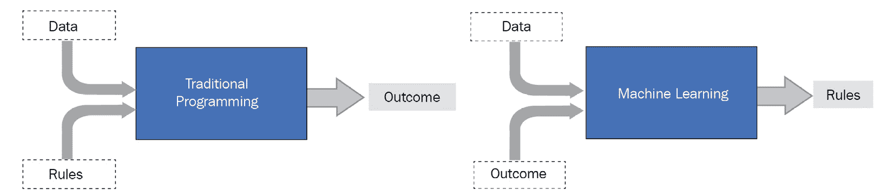
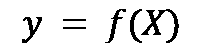
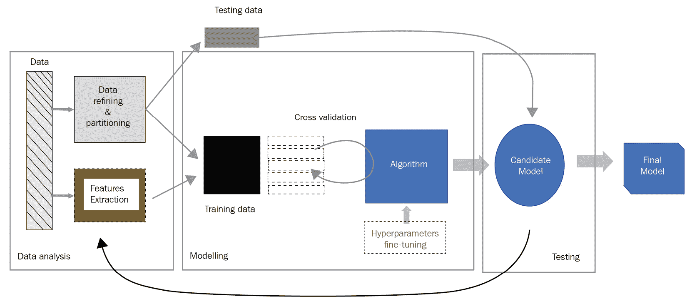
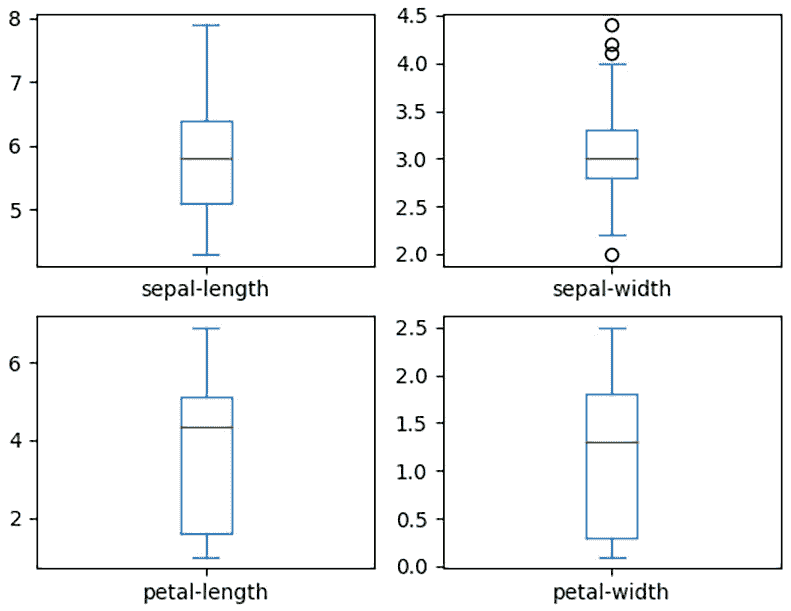
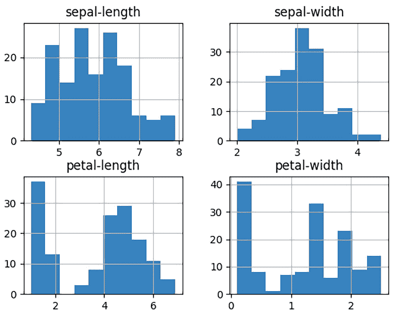
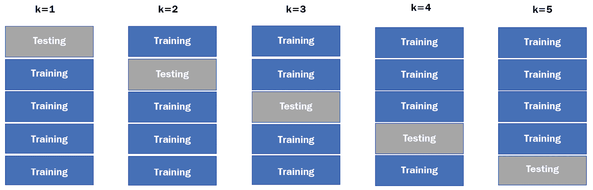

# 第十三章：*第十三章*：Python 与机器学习

**机器学习**（**ML**）是**人工智能**（**AI**）的一个分支，它基于从数据中学习模式并构建模型，然后使用这些模型进行预测。它是帮助人类以及企业在许多方面最受欢迎的人工智能技术之一。例如，它被用于医疗诊断、图像处理、语音识别、预测威胁、数据挖掘、分类以及许多其他场景。我们都理解机器学习在我们生活中的重要性和实用性。Python 作为一种简洁但强大的语言，被广泛用于实现机器学习模型。Python 使用 NumPy、pandas 和 PySpark 等库处理和准备数据的能力，使其成为开发人员构建和训练 ML 模型的首选选择。

在本章中，我们将讨论以优化方式使用 Python 进行机器学习任务。这尤其重要，因为训练 ML 模型是一个计算密集型任务，当使用 Python 进行机器学习时，优化代码是基础。

在本章中，我们将涵盖以下主题：

+   介绍机器学习

+   使用 Python 进行机器学习

+   测试和评估机器学习模型

+   在云中部署机器学习模型

完成本章后，你将了解如何使用 Python 构建、训练和评估机器学习模型，以及如何在云中部署它们并使用它们进行预测。

# 技术要求

本章的技术要求如下：

+   你需要在你的计算机上安装 Python 3.7 或更高版本。

+   你需要安装额外的机器学习库，如 SciPy、NumPy、pandas 和 scikit-learn。

+   要在 GCP 的 AI 平台上部署机器学习模型，你需要一个 GCP 账户（免费试用版也可以）。

本章的示例代码可以在[`github.com/PacktPublishing/Python-for-Geeks/tree/master/Chapter13`](https://github.com/PacktPublishing/Python-for-Geeks/tree/master/Chapter13)找到。

我们将从一个机器学习的介绍开始我们的讨论。

# 介绍机器学习

在传统的编程中，我们向程序提供数据和一些规则作为输入，以获得期望的输出。机器学习是一种根本不同的编程方法，其中数据和期望的输出被作为输入来生成一组规则。这在机器学习的术语中被称为**模型**。这一概念在以下图中得到了说明：



图 13.1 – 传统编程与机器学习编程的比较

要了解机器学习是如何工作的，我们需要熟悉其核心组件或元素：

+   **数据集**：没有好的数据集，机器学习就毫无意义。好的数据是机器学习的真正力量。它必须从不同的环境中收集，涵盖各种情况，以使模型接近现实世界的过程或系统。数据集的另一个要求是它必须很大，而我们所说的“大”是指数千条记录。此外，数据应该尽可能准确，并包含有意义的信息。数据用于训练系统，也用于评估其准确性。我们可以从许多来源收集数据，但大多数情况下，数据是以原始格式存在的。我们可以利用如 pandas 等库来使用数据处理技术，正如我们在前面的章节中讨论的那样。

+   **特征提取**：在使用任何数据构建模型之前，我们需要了解我们有什么类型的数据以及它的结构。一旦我们理解了这一点，我们就可以选择哪些数据特征可以被机器学习算法用来构建模型。我们还可以根据原始特征集计算额外的特征。例如，如果我们有以像素形式存在的原始图像数据，它本身可能对训练模型没有用，我们可以使用图像内部形状的长度或宽度作为特征来为我们的模型建立规则。

+   **算法**：这是一个用于从可用数据构建机器学习模型的程序。从数学的角度来看，机器学习算法试图学习一个目标函数 *f(X)*，该函数可以将输入数据 *X* 映射到输出 *y*，如下所示：

    

    由于没有一种算法可以解决所有问题，因此针对不同类型的问题和情况有几种不同的算法可用。一些流行的算法包括**线性回归**、**分类和回归树**以及**支持向量分类器**（**SVC**）。这些算法如何工作的数学细节超出了本书的范围。我们建议查看*进一步阅读*部分提供的附加链接，以获取有关这些算法的详细信息。

+   **模型**：在机器学习中，我们经常听到“模型”这个术语。模型是对我们日常生活中发生的过程的数学或计算表示。从机器学习的角度来看，它是将机器学习算法应用于我们的数据集时的输出。这个输出（模型）可以是一组规则或一些特定的数据结构，当用于任何实际数据时，可以用来进行预测。

+   **训练**：这不是机器学习中的一个新组件或步骤。当我们说训练一个模型时，这意味着将机器学习算法应用于数据集以产生一个机器学习模型。我们得到的输出模型被称为在某个数据集上训练过的。训练模型有三种不同的方法：

    a) **监督学习**: 这包括提供所需输出以及我们的数据记录。这里的目的是学习如何使用可用数据将输入（X）映射到输出（Y）。这种学习方法用于分类和回归问题。图像分类和预测房价（回归）是监督学习的几个现实世界例子。在图像处理的情况下，我们可以训练一个模型来识别图像中的动物类型，例如猫或狗，基于图像的形状、长度和宽度。为了训练我们的图像分类模型，我们将训练数据集中的每个图像用动物的名字标记。为了预测房价，我们必须提供关于我们关注的地区房屋的数据，例如它们所在的区域、房间数量和浴室数量等。

    b) **无监督学习**: 在这种情况下，我们在不知道所需输出的情况下训练模型。无监督学习通常应用于聚类和关联用例。这种类型的学习主要基于观察，并找到具有相似特征的数据点的组或聚类。这种学习方法在在线零售店如亚马逊中得到广泛应用，以根据他们的购物行为找到不同的客户组（聚类），并向他们提供他们感兴趣的商品。在线商店还试图找到不同购买之间的关联，例如，购买物品 A 的人有多大的可能性也会购买物品 B。

    c) **强化学习**: 在强化学习的情况下，模型在特定情况下做出适当决策时会得到奖励。在这种情况下，根本不存在训练数据，但模型必须从经验中学习。自动驾驶汽车是强化学习的流行例子。

+   **测试**: 我们需要在没有用于训练模型的数据库集上测试我们的模型。一种传统的方法是使用数据集的三分之二来训练模型，并使用剩余的三分之一来测试模型。

除了我们讨论的三个学习方法之外，我们还有深度学习。这是一种基于人类大脑如何使用神经网络算法获得某种类型知识的先进机器学习方法。在本章中，我们将使用监督学习来构建我们的示例模型。

在下一节中，我们将探讨 Python 机器学习中可用的选项。

# 使用 Python 进行机器学习

Python 在数据科学家社区中很受欢迎，因为它简单、跨平台兼容性良好，并且通过其库提供了丰富的数据分析和数据处理支持。机器学习中的一个关键步骤是为构建机器学习模型准备数据，Python 在这方面是一个自然的选择。使用 Python 的唯一挑战是它是一种解释型语言，因此与 C 语言等语言相比，执行代码的速度较慢。但这个问题并不严重，因为有一些库可以通过并行使用**中央处理器**（**CPUs**）或**图形处理器**（**GPUs**）的多个核心来最大化 Python 的速度。

在下一个子节中，我们将介绍一些用于机器学习的 Python 库。

## 介绍 Python 中的机器学习库

Python 附带了几种机器学习库。我们已提到支持库，如 NumPy、SciPy 和 pandas，这些库对于数据精炼、数据分析和数据处理是基础性的。在本节中，我们将简要讨论构建机器学习模型最流行的 Python 库。

### scikit-learn

这个库是一个流行的选择，因为它拥有大量内置的机器学习算法和评估这些算法性能的工具。这些算法包括用于监督学习的分类和回归算法，以及用于无监督学习的聚类和关联算法。scikit-learn 主要用 Python 编写，并依赖于 NumPy 库进行许多操作。对于初学者，我们建议从 scikit-learn 库开始，然后过渡到更高层次的库，例如 TensorFlow。我们将使用 scikit-learn 来展示构建、训练和评估机器学习模型的概念。

scikit-learn 还提供了**梯度提升算法**。这些算法基于**梯度**的数学概念，即函数的斜率。在机器学习语境中，它衡量错误的变化。基于梯度的算法的思路是通过迭代地微调参数来找到函数的局部最小值（最小化机器学习模型的错误）。梯度提升算法使用相同的策略通过考虑先前模型的性能，通过微调新模型的参数，并通过设置目标以接受新模型（如果它比先前模型更少地最小化错误）来迭代地改进模型。

### XGBoost

XGBoost，或**极端梯度提升**，是一个基于梯度提升决策树的算法库。这个库因其极端快速和与其他梯度提升算法实现以及传统机器学习算法相比的最佳性能而受到欢迎。scikit-learn 也提供了梯度提升算法，其本质与 XGBoost 相同，尽管 XGBoost 速度更快。主要原因是充分利用单台机器的不同核心或分布式节点集群的并行性。XGBoost 还可以正则化决策树，以避免模型过度拟合数据。XGBoost 不是一个完整的机器学习框架，但主要提供算法（模型）。要使用 XGBoost，我们必须使用 scikit-learn 来处理其余的实用函数和工具，例如数据分析和数据准备。

### TensorFlow

TensorFlow 是另一个非常流行的开源机器学习库，由 Google Brain 团队开发，用于高性能计算。TensorFlow 特别适用于训练和运行深度神经网络，是深度学习领域的热门选择。

### Keras

这是一个用于 Python 中神经网络深度学习的开源 API。Keras 更像是 TensorFlow 之上的高级 API。对于开发者来说，使用 Keras 比直接使用 TensorFlow 更方便，因此如果你是刚开始用 Python 开发深度学习模型，建议使用 Keras。Keras 可以与 CPU 和 GPU 一起工作。

### PyTorch

PyTorch 是另一个开源机器学习库，它是 C 语言中流行的**Torch**库的 Python 实现。

在下一节中，我们将简要讨论使用 Python 进行机器学习的最佳实践。

## 使用 Python 进行训练数据的最佳实践

我们已经强调了在训练机器学习模型时数据的重要性。在本节中，我们将强调在准备和使用数据来训练您的机器学习模型时的几个最佳实践和建议。具体如下：

+   正如我们之前提到的，收集大量数据至关重要（几千条数据记录或至少数百条）。数据量越大，机器学习模型将越准确。

+   在开始任何训练之前，请清理和精炼您的数据。这意味着数据中不应有任何缺失字段或误导性字段。pandas 等 Python 库在执行此类任务时非常方便。

+   在不损害数据隐私和安全性的情况下使用数据集很重要。您需要确保您没有未经适当批准使用其他组织的某些数据。

+   GPU 与数据密集型应用程序配合良好。我们鼓励您使用 GPU 来训练算法，以获得更快的成果。XGBoost、TensorFlow 和 Keras 等库因使用 GPU 进行训练而闻名。

+   当处理大量训练数据时，有效地利用系统内存非常重要。我们应该分块加载数据到内存中，或者利用分布式集群来处理数据。我们鼓励您尽可能多地使用生成器函数。

+   在处理数据密集型任务（例如，在训练模型时）期间，监控内存使用情况也是一个好习惯。通过强制垃圾回收释放未引用的对象，定期释放内存。

现在我们已经介绍了可用的 Python 库以及使用 Python 进行机器学习的最佳实践，现在是时候开始使用真实的代码示例进行工作了。

# 构建和评估机器学习模型

在我们开始编写 Python 程序之前，我们将评估构建机器学习模型的过程。

## 了解 ML 模型构建过程

在“介绍机器学习”部分，我们讨论了机器学习的不同组件。机器学习过程使用这些元素作为输入来训练模型。这个过程遵循一个有三个主要阶段的过程，每个阶段都有几个步骤。这些阶段如下所示：



图 13.2 – 使用经典学习方法构建 ML 模型的步骤

每个阶段及其详细步骤在这里都有描述：

+   **数据分析**：在这个阶段，我们收集原始数据并将其转换为可以分析和用于训练和测试模型的形式。我们可能会丢弃一些数据，例如包含空值的记录。通过数据分析，我们试图选择可用于识别数据中模式的特征（属性）。提取特征是一个非常关键的步骤，在构建成功的模型时，这些特征起着至关重要的作用。在许多情况下，我们必须在测试阶段之后调整特征，以确保我们有适合数据的正确特征集。通常，我们将数据分为两部分；一部分用于建模阶段训练模型，另一部分用于测试阶段测试训练好的模型以验证其准确性。如果我们使用其他方法（如**交叉验证**）评估模型，则可以跳过测试阶段。我们建议在您的 ML 构建过程中设置一个测试阶段，并保留一些数据（对模型来说是未知的）用于测试阶段，如图中所示。

+   **建模**：这个阶段是关于根据我们在前一阶段提取的训练数据和特征来训练我们的模型。在传统的机器学习方法中，我们可以直接使用训练数据来训练我们的模型。但为了确保我们的模型有更好的准确性，我们可以使用以下附加技术：

    a) 我们可以将我们的训练数据分割成块，并使用其中一个块来评估我们的模型，其余的块用于训练模型。我们重复这个过程，使用不同的训练块和评估块的组合。这种评估方法被称为交叉验证。

    b) 机器学习算法带有几个参数，可以用来微调模型以最佳地拟合数据。在建模阶段，通常与交叉验证一起进行这些参数（也称为**超参数**）的微调。

    数据集中的特征值可能使用不同的测量尺度，这使得使用这些特征的组合来构建规则变得困难。在这种情况下，我们可以将数据（特征值）转换到公共尺度或归一化尺度（例如 0 到 1）。这一步称为数据缩放或归一化。所有这些缩放和评估步骤（或其中一些）都可以添加到管道（如 Apache Beam 管道）中，并可以一起执行以评估不同的组合，以选择最佳模型。这一阶段的输出是一个候选机器学习模型，如前图所示。

+   **测试**：在测试阶段，我们使用之前阶段预留的数据来测试我们构建的候选机器学习模型的准确性。这一阶段的输出可以用来添加或删除一些特征，并微调模型，直到我们得到一个可接受的准确性。

一旦我们对模型的准确性满意，我们就可以将其应用于基于现实世界数据的预测。

## 构建一个示例机器学习模型

在本节中，我们将使用 Python 构建一个示例机器学习模型，该模型将识别三种类型的 Iris 植物。为了构建这个模型，我们将使用一个包含四个特征（萼片和花瓣的长度和宽度）和三种 Iris 植物类型的常用数据集。

对于这个代码练习，我们将使用以下组件：

+   我们将使用由*UC Irvine 机器学习存储库*提供的 Iris 数据集（http://archive.ics.uci.edu/ml/）。这个数据集包含 150 条记录和三个预期模式以识别。这是一个经过精炼的数据集，其中已经识别了必要的特征。

+   我们将使用以下各种 Python 库：

    a) 用于数据分析的 pandas 和 matplotlib 库

    b) 用于训练和测试我们的机器学习模型的 scikit-learn 库

首先，我们将编写一个 Python 程序来分析 Iris 数据集。

### 分析 Iris 数据集

为了编程的方便，我们从[`archive.ics.uci.edu/ml/machine-learning-databases/iris/`](https://archive.ics.uci.edu/ml/machine-learning-databases/iris/)下载了 Iris 数据集的两个文件（`iris.data`和`iris.names`）。

我们可以直接通过 Python 从这个仓库访问数据文件。但在我们的示例程序中，我们将使用文件的本地副本。scikit-learn 库也提供了几个数据集作为库的一部分，可以直接用于评估目的。我们决定使用实际文件，因为这更接近现实场景，即你自行收集数据，然后在程序中使用它。

Iris 数据文件包含 150 条记录，这些记录是根据预期输出排序的。在数据文件中，提供了四个不同特征的值。这四个特征在`iris.names`文件中描述为`sepal-length`（萼片长度）、`sepal-width`（萼片宽度）、`petal-length`（花瓣长度）和`petal-width`（花瓣宽度）。根据数据文件，Iris 植物的预期输出类型是`Iris-setosa`（伊丽莎白）、`Iris-versicolor`（维吉尼亚鸢尾）和`Iris-virginica`（弗吉尼亚鸢尾）。我们将数据加载到 pandas DataFrame 中，然后分析其不同感兴趣属性。以下是一些分析 Iris 数据的示例代码：

```py
#iris_data_analysis.py
from pandas import read_csv
from matplotlib import pyplot
data_file = "iris/iris.data"
iris_names = ['sepal-length', 'sepal-width', 'petal-  length', 'petal-width', 'class']
df = read_csv(data_file, names=iris_names)
print(df.shape)
print(df.head(20))
print(df.describe())
print(df.groupby('class').size())
# box and whisker plots
df.plot(kind='box', subplots=True, layout=(3,3),   sharex=False, sharey=False)
pyplot.show()
# check the histograms
df.hist()
pyplot.show()
```

在数据分析的第一部分，我们使用 pandas 库函数检查了一些关于数据的指标，如下所示：

+   我们使用了`shape`方法来获取 DataFrame 的维度。对于 Iris 数据集，这应该是[150, 5]，因为我们有 150 条记录和五个列（四个用于特征，一个用于预期输出）。这一步确保所有数据都正确地加载到我们的 DataFrame 中。

+   我们使用`head`或`tail`方法检查了实际数据。这只是为了直观地查看数据，特别是如果我们还没有看到数据文件内部的内容。

+   `describe`方法为我们提供了数据的不同统计 KPIs。此方法的结果如下：

```py
       sepal-length  sepal-width  petal-length  petal-width
count    150.000000   150.000000    150.000000   150.000000
mean       5.843333     3.054000      3.758667     1.198667
std        0.828066     0.433594      1.764420     0.763161
min        4.300000     2.000000      1.000000     0.100000
25%        5.100000     2.800000      1.600000     0.300000
50%        5.800000     3.000000      4.350000     1.300000
75%        6.400000     3.300000      5.100000     1.800000
max        7.900000     4.400000      6.900000     2.500000
```

这些关键绩效指标（KPIs）可以帮助我们选择适合数据集的正确算法。

+   使用了`groupby`方法来识别每个`class`（预期输出的列名）的记录数量。输出将表明每种 Iris 植物类型有 50 条记录：

```py
Iris-setosa        50
Iris-versicolor    50
Iris-virginica     50
```

在分析的第二部分，我们尝试使用`describe`方法（最小值、第一四分位数、第二四分位数（中位数）、第三四分位数和最大值）。这个图将告诉你你的数据是否是对称分布的，或者是否在某个范围内分组，或者你的数据有多大的偏斜倾向分布的一侧。对于我们的 Iris 数据集，我们将得到以下四个特征的箱线图：



图 13.3 – Iris 数据集特征的箱线和须线图

从这些图中，我们可以看到**花瓣长度**和**花瓣宽度**的数据在第一四分位数和第三四分位数之间有最多的分组。我们可以通过使用直方图分析数据分布来确认这一点，如下所示：



图 13.4 – Iris 数据集特征的直方图

在分析数据和选择合适的算法（模型）类型之后，我们将继续下一步，即训练我们的模型。

### 训练和测试一个样本机器学习模型

要训练和测试一个机器学习算法（模型），我们必须遵循以下步骤：

1.  作为第一步，我们将原始数据集分成两组：训练数据和测试数据。这种数据分割的方法被称为`train_test_split`函数，以便于进行分割：

    ```py
    #train_test_split function, we split the full dataset into a features dataset (typically called X, which should be uppercase in machine learning nomenclature) and the expected output dataset (called y, which should be lowercase in machine learning nomenclature). These two datasets (X and y) are split by the train_test_split function as per our test_size (20%, in our case). We also allow the data to be shuffled before splitting it. The output of this operation will give us four datasets (X_train, y_train, X_test, and y_test) for training and testing purposes. 
    ```

1.  在下一步中，我们将创建一个模型，并提供训练数据（`X_train`和`y_train`）来训练这个模型。对于这个练习来说，机器学习算法的选择并不那么重要。对于 Iris 数据集，我们将使用默认参数的 SVC 算法。以下是一些示例 Python 代码：

    ```py
    fit method. In the next statement, we made predictions based on the testing data (X_test). These predictions will be used to evaluate the performance of our trained model. 
    ```

1.  最后，将使用测试数据（`y_test`）中的预期结果，通过 scikit-learn 库的`accuracy_score`和`classification_report`函数来评估预测，如下所示：

    ```py
    #iris_build_svm_model.py (#3)
    # predictions evaluation
    print(accuracy_score(y_test, predictions))
    print(classification_report(y_test, predictions))
    ```

该程序的控制台输出如下：

```py
0.9666666
    Iris-setosa       1.00      1.00      1.00        11
Iris-versicolor       1.00      0.92      0.96        13
 Iris-virginica       0.86      1.00      0.92         6
       accuracy                           0.97        30
      macro avg       0.95      0.97      0.96        30
   weighted avg       0.97      0.97      0.97        30
```

准确率范围非常高（*0.966*），这表明模型可以以近 96%的准确率预测测试数据中的 Iris 植物。模型在**Iris-setosa**和**Iris-versicolor**方面表现优秀，但在**Iris-virginica**的情况下仅表现尚可（86%精确）。有几种方法可以提高我们模型的表现，所有这些方法我们将在下一节中讨论。

## 使用交叉验证和微调超参数评估模型

对于之前的样本模型，我们为了学习构建机器学习模型的核心步骤，保持了训练过程的简单性。对于生产部署，我们不能依赖于只包含 150 条记录的数据集。此外，我们必须使用以下技术等来评估模型以获得最佳预测：

+   **k 折交叉验证**：在之前的模型中，我们在使用保留法将数据分割成训练和测试数据集之前对数据进行了洗牌。因此，模型每次训练时都可以给出不同的结果，从而导致模型不稳定。从包含 150 条记录的小数据集中选择训练数据并不简单，因为在这种情况下，它确实可以代表真实世界系统或环境的数据。为了使我们的先前的模型在小数据集上更加稳定，k 折交叉验证是推荐的方法。这种方法基于将我们的数据集分成*k*个折或切片。想法是使用*k-1*个切片进行训练，并使用*kth*个切片进行评估或测试。这个过程会重复进行，直到我们使用每个数据切片进行测试。这相当于重复使用不同的数据切片进行测试的保留法*k*次。

    为了进一步阐述，我们必须将我们的整个数据集或训练数据集分成五个切片，比如说 *k=5*，进行五折交叉验证。在第一次迭代中，我们可以使用第一个切片（20%）进行测试，剩余的四个切片（80%）用于训练。在第二次迭代中，我们可以使用第二个切片进行测试，剩余的四个切片用于训练，依此类推。我们可以评估所有五个可能的训练数据集，并在最后选择最佳模型。数据用于训练和测试的选择方案如下：



图 13.5 – 五份数据切片的交叉验证方案

交叉验证准确率是通过计算每个迭代中每个模型根据 *k* 值的平均准确率来计算的。

+   **优化超参数**：在前面的代码示例中，我们使用了具有默认参数的机器学习算法。每个机器学习算法都带有许多可以微调以定制模型、根据数据集进行调整的超参数。统计学家可能通过分析数据分布手动设置一些参数，但分析这些参数组合的影响是繁琐的。我们需要通过使用这些超参数的不同值来评估我们的模型，这有助于我们在最后选择最佳的超参数组合。这种技术被称为微调或优化超参数。

交叉验证和微调超参数的实现过程相当繁琐，即使通过编程也是如此。好消息是，scikit-learn 库提供了一些工具，可以在几行 Python 代码中实现这些评估。scikit-learn 库为此评估提供了两种类型的工具：`GridSearchCV` 和 `RandomizedSearchCV`。我们将在下面讨论这些工具。

### GridSearchCV

`GridSearchCV` 工具通过交叉验证方法评估给定模型的所有可能超参数值的组合。每个超参数值的组合将通过在数据集切片上使用交叉验证来评估。

在下面的代码示例中，我们将使用来自 scikit-learn 库的`GridSearchCV`类来评估`C`和`gamma`参数组合的 SVC 模型。`C`参数是一个正则化参数，它管理着低训练错误与低测试错误之间的权衡。`C`的值越高，我们能够接受的错误数量就越多。我们将使用 0.001、0.01、1、5、10 和 100 作为`C`的值。`gamma`参数用于定义分类的非线性超平面或非线性线。`gamma`的值越高，模型可以通过添加更多的曲率或曲线到超平面或线来尝试拟合更多的数据。我们也将使用 0.001、0.01、1、5、10 和 100 作为`gamma`的值。`GridSearchCV`的完整代码如下：

```py
#iris_eval_svc_model.py (part 1 of 2)
from sklearn.model_selection import train_test_split
from sklearn.model_selection import   GridSearchCV,RandomizedSearchCV
from sklearn.datasets import load_iris
from sklearn.svm import SVC
iris= load_iris()
X = iris.data
y = iris.target
X_train, X_test, y_train, y_test=train_test_split   (X,y,test_size=0.2)
params = {"C":[0.001, 0.01, 1, 5, 10, 100],              "gamma": [0.001, 0.01, 0.1, 1, 10, 100]}
model=SVC()
grid_cv=GridSearchCV(model, params,  cv=5)
grid_cv.fit(X_train,y_train)
print(f"GridSearch- best parameter:{grid_cv.best_params_}")
print(f"GridSearch- accuracy: {grid_cv.best_score_}")
print(classification_report(y_test,   grid_cv.best_estimator_.predict( X_test)))
```

在这个代码示例中，以下几点需要强调：

+   为了说明目的，我们直接从 scikit-learn 库加载数据。您也可以使用前面的代码从本地文件加载数据。

+   定义`params`字典以微调超参数作为第一步是很重要的。我们在该字典中设置了`C`和`gamma`参数的值。

+   我们将`cv`设置为 5。这将通过五个切片进行交叉验证来评估每个参数组合。

该程序的输出将给我们提供`C`和`gamma`的最佳组合以及带有交叉验证的模型准确率。最佳参数和最佳模型的控制台输出如下：

```py
GridSearch- best parameter: {'C': 5, 'gamma': 0.1}
GridSearch- accuracy: 0.9833333333333334
```

通过评估不同参数组合并使用`GridSearchCV`进行交叉验证，模型的总体准确率从 96%提高到了 98%，与未进行交叉验证和超参数微调的结果相比。分类报告（未在程序输出中显示）显示，对于三种植物类型，我们的测试数据的精确度为 100%。然而，当数据集很大且参数值很多时，这个工具并不实用。

### RandomizedSearchCV

在`RandomizedSearchCV`工具的情况下，我们只评估随机选择的超参数值对应的模型，而不是所有不同的组合。我们可以提供参数值和要执行的随机迭代次数作为输入。`RandomizedSearchCV`工具将根据提供的迭代次数随机选择参数组合。当处理大型数据集且存在许多参数/值组合时，这个工具非常有用。评估大型数据集的所有可能组合可能是一个非常耗时的过程，需要大量的计算资源。

使用`RandomizedSearchCV`的 Python 代码与`GridSearchCV`工具相同，除了以下额外的代码行：

```py
#iris_eval_svc_model.py (part 2 of 2)
rand_cv=RandomizedSearchCV(model, params, n_iter = 5, cv=5)
rand_cv.fit(x_train,y_train)
print(f" RandomizedSearch - best parameter:   {rand_cv.best_params_}")
print(f" RandomizedSearch - accuracy:   {rand_cv.best_score_}")
```

由于我们定义了`n_iter=5`，`RandomizedSearchCV`将只选择五个`C`和`gamma`参数的组合，并相应地评估模型。

当程序的这个部分执行时，我们将得到类似于以下输出的结果：

```py
RandomizedSearch- best parameter: {'gamma': 10, 'C': 5}
RandomizedSearch- accuracy: 0.9333333333333333
```

注意，你可能得到不同的输出，因为此工具可能会为评估选择不同的参数值。如果我们增加`RandomizedSearchCV`对象的迭代次数（`n_iter`），我们将观察到输出中更高的准确性。如果我们不设置`n_iter`，我们将对所有组合进行评估，这意味着我们将得到与`GridSearchCV`提供相同的输出。

如我们所见，由`GridSearchCV`工具选择的最佳参数组合与由`RandomizedSearchCV`工具选择的组合不同。这是预期的，因为我们为这两个工具运行了不同次数的迭代。

这就结束了我们关于使用 scikit-learn 库构建示例机器学习模型的讨论。我们涵盖了构建和评估此类模型所需的核心步骤和概念。在实践中，我们还对数据进行缩放以进行归一化。这种缩放可以通过使用 scikit-learn 库中的内置缩放器类，如`StandardScaler`，或通过构建我们自己的缩放器类来实现。缩放操作是一种数据转换操作，可以在单个管道下与模型训练任务结合。scikit-learn 支持使用`Pipeline`类将多个操作或任务作为管道结合。`Pipeline`类也可以直接与`RandomizedSearchCV`或`GridSearchCV`工具一起使用。你可以通过阅读 scikit-learn 库的在线文档来了解更多关于如何使用 scikit-learn 库中的缩放器和管道的信息（[`scikit-learn.org/stable/user_guide.html`](https://scikit-learn.org/stable/user_guide.html))。

在下一节中，我们将讨论如何将模型保存到文件中，以及如何从文件中恢复模型。

## 将机器学习模型保存到文件

当我们评估了一个模型并选择了一个根据我们的数据集的最佳模型后，下一步就是实现这个模型以用于未来的预测。这个模型可以作为任何 Python 应用程序的一部分实现，例如 Web 应用程序、Flask 或 Django，或者它可以作为一个微服务甚至云函数使用。真正的问题是，如何将模型对象从一个程序转移到另一个程序。有几个库，如`pickle`和`joblib`，可以用来将模型序列化到文件中。然后，该文件可以在任何应用程序中使用，以在 Python 中再次加载模型并使用模型对象的`predict`方法进行预测。

为了说明这个概念，我们将把我们在之前的代码示例中创建的 ML 模型（例如，`iris_build_svm_model.py` 程序中的 `model` 对象）保存到一个名为 `model.pkl` 的文件中。在下一步中，我们将使用 pickle 库从这个文件中加载模型，并使用新数据进行预测，以模拟在任何应用程序中使用模型。完整的示例代码如下：

```py
#iris_save_load_predict_model.py 
#model is creating using the code in #iris_build_svm_model.py
#saving the model to a file
with open("model.pkl", 'wb') as file:
   pickle.dump(model, file)
#loading the model from a file (in another application
with open("model.pkl", 'rb') as file:
   loaded_model = pickle.load(file)
   x_new = [[5.6, 2.6, 3.9, 1.2]]
   y_new = loaded_model.predict(x_new)
   print("X=%s, Predicted=%s" % (x_new[0], y_new[0]))
```

使用 joblib 库比 pickle 库更简单，但如果它尚未作为 scikit-learn 的依赖项安装，则可能需要您安装此库。以下示例代码展示了如何使用 joblib 库保存我们最佳模型，根据我们在上一节中使用的 `GridSearchCV` 工具进行评估，然后从文件中加载模型：

```py
#iris_save_load_predict_gridmodel.py 
#grid_cv is created and trained using the code in the 
  #iris_eval_svm_model.py
joblib.dump(grid_cv.best_estimator_, "model.joblib")
loaded_model = joblib.load("model.joblib")
x_new = [[5.6, 2.5, 3.9, 1.1]]
y_new = loaded_model.predict(x_new)
print("X=%s, Predicted=%s" % (x_new[0], y_new[0]))
```

joblib 库的代码简洁简单。示例代码中的预测部分与上一节 pickle 库的示例代码相同。

现在我们已经学会了如何将模型保存到文件中，我们可以将模型部署到任何应用程序，甚至部署到云平台，如 GCP AI 平台。我们将在下一节中讨论如何在 GCP 平台上部署我们的 ML 模型。

# 在 GCP 云上部署和预测 ML 模型

公共云提供商正在提供多个 AI 平台，用于训练内置模型以及您的自定义模型，以便部署模型进行预测。Google 为 ML 用例提供 **Vertex AI** 平台，而 Amazon 和 Azure 分别提供 **Amazon SageMaker** 和 **Azure ML** 服务。我们选择 Google，因为我们假设您已经设置了 GCP 账户，并且您已经熟悉 GCP 的核心概念。GCP 提供其 AI 平台，这是 Vertex AI 平台的一部分，用于大规模训练和部署您的 ML 模型。GCP AI 平台支持 scikit-learn、TensorFlow 和 XGBoost 等库。在本节中，我们将探讨如何在 GCP 上部署我们已训练的模型，然后根据该模型预测结果。

Google AI 平台通过全局端点（`ml.googleapis.com`）或区域端点（`<region>-ml.googleapis.com`）提供其预测服务器（计算节点）。全局 API 端点建议用于批量预测，TensorFlow 在 Google AI 平台上提供批量预测。区域端点提供对其他区域故障的额外保护。我们将使用区域端点来部署我们的示例 ML 模型。

在我们开始在 GCP 中部署模型之前，我们需要有一个 GCP 项目。我们可以创建一个新的 GCP 项目或使用我们为之前的练习创建的现有 GCP 项目。创建 GCP 项目并将其与计费账户关联的步骤在 *第九章*，*云端的 Python 编程* 中讨论过。一旦我们准备好了 GCP 项目，我们就可以部署我们在上一节中创建的 `model.joblib` 模型。部署我们的模型的步骤如下：

1.  作为第一步，我们将创建一个存储桶，我们将在这里存储我们的模型文件。我们可以使用以下 Cloud SDK 命令来创建一个新的桶：

    ```py
    gsutil mb gs://<bucket name>
    gsutil mb gs://muasif-svc-model #Example bucket created
    ```

1.  一旦我们的桶准备好，我们可以使用以下 Cloud SDK 命令将我们的模型文件（`model.joblib`）上传到这个存储桶：

    ```py
    gsutil model with an extension such as pkl, joblib, or bst, depending on the library we used to package the model.We can now initiate a workflow to create a model object on the AI Platform by using the following command. Note that the name of the model must include only alphanumeric and underscore characters:

    ```

    gcloud ai-platform models create my_iris_model –  region=us-central1

    ```py

    ```

1.  现在，我们可以使用以下命令为我们的模型创建一个版本：

    ```py
    gcloud ai-platform versions model attribute will point to the name of the model we created in the previous step. b) The `origin` attribute will point to the storage bucket location where the model file is residing. We will only provide the directory's location, not the path to the file.c) The `framework` attribute is used to select which ML library to use. GCP offers scikit-learn, TensorFlow, and XGBoost.d) `runtime-version` is for the scikit-learn library in our case.e) `python-version` is selected as 3.7, which is the highest version offered that's by GCP AI Platform at the time of writing this book.f) The `region` attribute is set as per the region that was selected for the model.g) The `machine-type` attribute is optional and is used to indicate what type of compute node to use for model deployment. If not provided, the `n1-standard-2` machine type is used.The `versions create` command may take a few minutes to deploy a new version. Once it is done, we will get an output similar to the following:

    ```

    使用端点 [https://us-central1-  ml.googleapis.com/]

    创建版本（这可能需要几分钟）......完成。

    ```py

    ```

1.  要检查我们的模型和版本是否已正确部署，我们可以使用 `versions` 上下文下的 `describe` 命令，如下所示：

    ```py
    gcloud ai-platform versions describe v1 –  model=my_iris_model
    ```

1.  一旦我们的模型及其版本已经部署，我们可以使用新数据通过我们在 Google AI 平台上部署的模型来预测结果。为了测试，我们在一个 JSON 文件（`input.json`）中添加了几条与原始数据集不同的数据记录，如下所示：

    ```py
    [5.6, 2.5, 3.9, 1.1]
    [3.2, 1.4, 3.0, 1.8]
    ```

    我们可以使用以下 Cloud SDK 命令根据 `input.json` 文件内的记录预测结果，如下所示：

    ```py
    gcloud ai-platform predict --model my_iris_model --version v1 --json-instances input.json
    ```

    控制台输出将显示每个记录的预测类别，以及以下内容：

    ```py
    Using endpoint [https://us-central1-ml.googleapis.com/]
    ['Iris-versicolor', 'Iris-virginica']
    ```

要在我们的应用程序（本地或云）中使用已部署的模型，我们可以使用 *Cloud SDK* 或 *Cloud Shell*，但推荐的方法是使用 Google AI API 进行任何预测。

有了这些，我们已经涵盖了使用 Google AI 平台部署我们的机器学习模型以及预测选项。然而，您也可以将您的机器学习模型部署到其他平台，例如 Amazon SageMaker 和 Azure ML。您可以在 https://docs.aws.amazon.com/sagemaker/ 找到有关 Amazon SageMaker 平台的更多详细信息，以及有关 Azure ML 的更多详细信息可以在 [`docs.microsoft.com/en-us/azure/machine-learning/`](https://docs.microsoft.com/en-us/azure/machine-learning/) 找到。

# 摘要

在本章中，我们介绍了机器学习及其主要组成部分，例如数据集、算法和模型，以及模型的训练和测试。介绍之后，我们讨论了适用于 Python 的流行机器学习框架和库，包括 scikit-learn、TensorFlow、PyTorch 和 BGBoost。我们还讨论了为训练机器学习模型优化和管理数据的最佳实践。为了熟悉 scikit-learn 库，我们使用 SVC 算法构建了一个示例机器学习模型。我们训练了该模型，并使用诸如 k 折交叉验证和微调超参数等技术对其进行了评估。我们还学习了如何将训练好的模型存储到文件中，然后将其加载到任何程序中进行预测。最后，我们展示了如何使用几个 GCP Cloud SDK 命令在 Google AI 平台上部署我们的机器学习模型并预测结果。

本章中包含的概念和动手练习足以帮助构建使用 Python 进行机器学习项目的基石。这种理论和实践知识对那些希望开始使用 Python 进行机器学习的人来说是有益的。

在下一章中，我们将探讨如何使用 Python 进行网络自动化。

# 问题

1.  什么是监督学习和无监督学习？

1.  什么是 k 折交叉验证以及它是如何用于评估模型的？

1.  什么是`RandomizedSearchCV`以及它与`GridSearchCV`有何不同？

1.  我们可以使用哪些库将模型保存到文件中？

1.  为什么区域端点比全局端点是 Google AI 平台的优选选项？

# 进一步阅读

+   [《机器学习算法》](https://)，作者 Giuseppe Bonaccorso

+   [《40 个程序员应该知道的算法》](https://)，作者 Imran Ahmad

+   [《精通 scikit-learn 机器学习》](https://)，作者 Gavin Hackeling

+   [《Python 机器学习：使用 Python、scikit-learn 和 TensorFlow 2 进行机器学习和深度学习》](https://)，作者 Sebastian Raschka 和 Vahid Mirjalili

+   [scikit-learn 用户指南](https://scikit-learn.org/stable/user_guide.html)

+   [Google AI 平台指南](https://cloud.google.com/ai-platform/docs)提供了训练和部署机器学习模型的说明

# 答案

1.  在监督学习中，我们使用训练数据提供所需的输出。在无监督学习中，所需的输出不是训练数据的一部分。

1.  交叉验证是一种用于衡量机器学习模型性能的统计技术。在 k 折交叉验证中，我们将数据分为*k*个折叠或切片。我们使用数据集的*k-1*个切片来训练我们的模型，并使用*kth*个切片来测试模型的准确性。我们重复此过程，直到每个*kth*个切片都用作测试数据。模型的交叉验证准确性是通过取所有通过*k*次迭代构建的模型的准确性的平均值来计算的。

1.  `RandomizedSearchCV` 是一个与 scikit-learn 一起提供的工具，用于将交叉验证功能应用于随机选择的超参数的机器学习模型。`GridSearchCV` 提供与 `RandomizedSearchCV` 相似的功能，但不同之处在于它验证了提供给它的所有超参数值的组合。

1.  Pickle 和 Joblib。

1.  区域端点提供了对其他区域任何故障的额外保护，并且计算资源对于区域端点比全球端点更为可用。
