# 创建 GUI 表单并添加控件

在本章中，我们将使用 Python 开发我们的第一个 GUI。我们将从构建运行 GUI 应用程序所需的最少代码开始。然后，每个菜谱都会向 GUI 表单添加不同的控件。

我们将首先使用 `tkinter` 图形用户界面工具包。

`tkinter` 随 Python 一起提供。一旦安装了 Python 3.7 或更高版本，就无需安装它。`tkinter` 图形用户界面工具包使我们能够使用 Python 编写 GUI。

旧世界的 DOS 命令提示符已经过时。一些开发者仍然喜欢用它进行开发工作。你的程序最终用户期望一个更现代、更美观的 GUI。

在这本书中，你将学习如何使用 Python 编程语言开发 GUI。

通过从最少的代码开始，我们可以看到每个使用 `tkinter` 和 Python 编写的 GUI 都遵循的 **模式**。首先是 `import` 语句，然后是创建一个 `tkinter` 类。然后我们可以调用方法并更改属性。最后，我们总是调用窗口事件循环。现在我们可以运行代码了。

我们从最简单的代码开始，在每个后续菜谱中添加更多功能，引入不同的控件控制以及如何更改和检索属性。

在前两个菜谱中，我们将展示整个代码，它只包含几行代码。在随后的菜谱中，我们只展示要添加到先前菜谱中的代码，因为否则这本书会变得太长，反复看到相同的代码会相当无聊。

如果你没有时间自己输入代码，你可以从 [`github.com/PacktPublishing/Python-GUI-Programming-Cookbook-Third-Edition`](https://github.com/PacktPublishing/Python-GUI-Programming-Cookbook-Third-Edition) 下载整本书的代码。

每章开始时，我将展示属于每个章节的 Python 模块。然后我将引用属于展示、研究和运行的代码的不同模块。

到本章结束时，我们将创建一个包含标签、按钮、文本框、组合框、各种状态下的复选按钮和改变 GUI 背景颜色的单选按钮的工作 GUI 应用程序。

下面是本章中以 `.py` 扩展名结尾的 Python 模块概述：

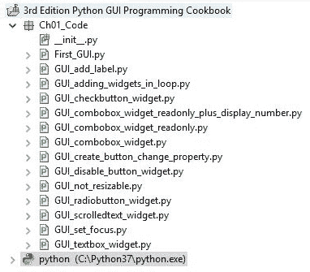

在本章中，我们将从使用 Python 3.7 或更高版本开始创建令人惊叹的 GUI。我们将涵盖以下主题：

+   创建我们的第一个 Python GUI

+   防止 GUI 被调整大小

+   向 GUI 表单添加标签

+   创建按钮并更改它们的文本属性

+   创建文本框小部件

+   将焦点设置到控件上并禁用控件

+   创建组合框控件

+   创建具有不同初始状态的复选按钮

+   使用单选按钮控件

+   使用滚动文本控件

+   在循环中添加多个控件

# 创建我们的第一个 Python GUI

Python 是一种非常强大的编程语言。它自带内置的`tkinter`模块。仅用几行代码（确切地说，是四行）我们就可以构建我们的第一个 Python GUI。

`tkinter`是 Python 到`tk`的**接口**。`tk`是一个 GUI 工具包，与`Tcl`相关，`Tcl`是一种工具命令语言。您可以在[`docs.python.org/3/library/tk.html`](https://docs.python.org/3/library/tk.html)了解更多关于`tk`的信息。

另一个与`tcl`和`tk`相关的网站是[`www.tcl.tk/`](https://www.tcl.tk/)。

# 准备工作

要遵循这个食谱，一个有效的 Python 开发环境是先决条件。Python 附带的 IDLE GUI 足以开始。IDLE 是使用`tkinter`构建的！

# 如何做到这一点…

让我们看看如何创建我们的第一个 Python GUI：

1.  创建一个新的 Python 模块并将其命名为`First_GUI.py`。

1.  在`First_GUI.py`模块的顶部导入`tkinter`：

```py
import tkinter as tk
```

1.  创建`Tk`类的实例：

```py
win = tk.Tk()
```

1.  使用实例变量设置标题：

```py
win.title("Python GUI")
```

1.  启动窗口的主事件循环：

```py
win.mainloop()
```

以下截图显示了创建结果的 GUI 所需的`First_GUI.py`的四个代码行：

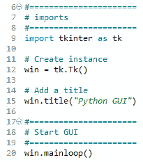

1.  运行 GUI 模块。在执行前面的代码后，得到以下输出：

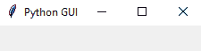

现在，让我们深入了解代码，以更好地理解它。

# 它是如何工作的…

在*第 9 行*，我们导入内置的`tkinter`模块并将其别名为`tk`以简化我们的 Python 代码。在*第 12 行*，我们通过调用其构造函数（`Tk`后附加的括号将类转换为实例）创建`Tk`类的实例。我们使用`tk`别名，这样我们就不必使用较长的单词`tkinter`。我们将类实例分配给一个名为`win`（代表窗口）的变量，这样我们就可以通过这个变量访问类属性。由于 Python 是一种动态类型语言，我们不必在分配之前声明这个变量，也不必给它指定一个特定的类型。Python *推断*这个语句的赋值类型。Python 是一种强类型语言，所以每个变量始终有一个类型。我们只是不必像在其他语言中那样事先指定它的类型。这使得 Python 成为编程中非常强大和高效的编程语言。

关于类和类型的一点点说明：在 Python 中，每个变量始终有一个类型。我们无法创建一个没有类型的变量。然而，在 Python 中，我们不必事先声明类型，就像在 C 编程语言中那样。

Python 足够智能，可以推断类型。在撰写本书时，C#也有这种能力。

使用 Python，我们可以使用`class`关键字而不是`def`关键字来创建我们自己的类。

为了将类分配给一个变量，我们首先必须创建我们类的实例。我们创建实例并将此实例分配给我们的变量，例如：

`class AClass(object):` `print('Hello from AClass')` `class_instance = AClass()`

现在，`class_instance`变量是`AClass`类型。

如果这听起来很复杂，不要担心。我们将在接下来的章节中介绍**面向对象编程**（**OOP**）。

在第 15 行，我们使用类的实例变量（`win`）通过调用`title()`方法并传入一个字符串来给我们的窗口设置标题。

你可能需要放大正在运行的 GUI 才能看到整个标题。

在第 20 行，我们通过在类实例`win`上调用`mainloop`方法来开始窗口的事件循环。到目前为止，在我们的代码中，我们已经创建了一个实例并设置了一个属性（窗口标题），但 GUI 将不会显示，直到我们开始主事件循环。

事件循环是一种使我们的 GUI 工作的机制。我们可以将其视为一个无限循环，其中我们的 GUI 正在等待事件发送给它。按钮点击在我们的 GUI 中创建一个事件，或者我们的 GUI 被调整大小也会创建一个事件。

我们可以提前编写所有的 GUI 代码，直到我们调用这个无限循环（前述代码中的`win.mainloop()`），用户屏幕上都不会显示任何内容。当事件循环结束时，用户点击红色 X 按钮或我们编程来结束 GUI 的小部件时，事件循环结束。当事件循环结束时，我们的 GUI 也结束了。

这个菜谱使用了最少的 Python 代码来创建我们的第一个 GUI 程序。然而，在这本书中，当有需要时，我们会使用面向对象编程（OOP）。

我们已经成功地学习了如何创建我们的第一个 Python GUI。现在，让我们继续下一个菜谱。

# 防止 GUI 被调整大小

默认情况下，使用`tkinter`创建的 GUI 可以被调整大小。这并不总是理想的。我们放置到 GUI 表单中的小部件可能会以不适当的方式调整大小，因此在这个菜谱中，我们将学习如何防止我们的 GUI 被 GUI 应用程序的用户调整大小。

# 准备工作

这个菜谱扩展了之前的菜谱，*创建我们的第一个 Python GUI*，因此一个要求是你必须自己在一个项目中将第一个菜谱输入进去。或者，你可以从[`github.com/PacktPublishing/Python-GUI-Programming-Cookbook-Third-Edition`](https://github.com/PacktPublishing/Python-GUI-Programming-Cookbook-Third-Edition)[/](https://github.com/PacktPublishing/Python-GUI-Programming-Cookbook-Second-Edition/)[.](https://github.com/PacktPublishing/Python-GUI-Programming-Cookbook-Second-Edition/)

# 如何做到这一点…

这里是防止 GUI 被调整大小的步骤：

1.  从上一个菜谱的模块开始，将其保存为`Gui_not_resizable.py`。

1.  使用`Tk`实例变量`win`来调用`resizable`方法：

```py
win.resizable(False, False)
```

这是防止 GUI 被调整大小的代码（`GUI_not_resizable.py`）：

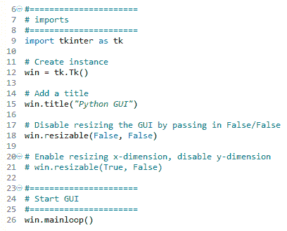

1.  运行代码。运行代码创建了这个 GUI：

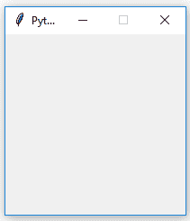

让我们深入幕后，更好地理解代码。

# 它是如何工作的…

第 18 行防止 Python GUI 被调整大小。

`resizable()` 方法属于 `Tk()` 类，通过传入 `(False, False)`，我们防止 GUI 被调整大小。我们可以禁用 GUI 的 *x* 和 *y* 维度以防止调整大小，或者通过传入 `True` 或任何非零数字来启用一个或两个维度。`(True, False)` 将启用 *x* 维度但防止 *y* 维度被调整大小。

运行此代码将生成一个类似于我们在第一个食谱中创建的 GUI。然而，用户不能再调整它的大小。此外，请注意窗口工具栏中的最大化按钮已变灰。

为什么这很重要？因为一旦我们向表单添加小部件，调整 GUI 的大小可能会让它看起来不是我们想要的样子。我们将在下一个食谱中添加小部件到 GUI，从*将标签添加到 GUI 表单*开始。

我们还在代码中添加了注释，为这本书中包含的食谱做准备。

在 Visual Studio .NET 等可视化编程 IDE 中，C#程序员通常不会考虑防止用户调整他们用这种语言开发的 GUI 的大小。这会创建出低质量的 GUI。添加这一行 Python 代码可以让我们的用户欣赏我们的 GUI。

我们已经成功学习了如何防止 GUI 被调整大小。现在，让我们继续下一个食谱。

# 将标签添加到 GUI 表单

标签是一个非常简单的小部件，为我们的 GUI 增加了价值。它解释了其他小部件的目的，提供了额外的信息。这可以指导用户理解 `Entry` 小部件的含义，也可以解释小部件显示的数据，而无需用户输入数据。

# 准备工作

我们正在扩展第一个食谱，*创建我们的第一个 Python GUI*。我们将保持 GUI 可调整大小，因此不要使用第二个食谱中的代码（或注释掉 `win.resizable` 行）。

# 如何操作…

执行以下步骤以将标签添加到 GUI 中：

1.  从 `First_GUI.py` 模块开始，将其保存为 `GUI_add_label.py`。

1.  导入 `ttk`：

```py
from tkinter import ttk
```

1.  使用 `ttk` 添加标签：

```py
ttk.Label(win, text="A Label")
```

1.  使用网格布局管理器定位标签：

```py
.grid(column=0, row=0)
```

为了将 `Label` 小部件添加到我们的 GUI 中，我们将从 `tkinter` 中导入 `ttk` 模块。请注意第 9 行和第 10 行的两个 `import` 语句。

以下代码添加在 `win.mainloop()` 之上，位于第一个和第二个食谱的底部（`GUI_add_label.py`）：

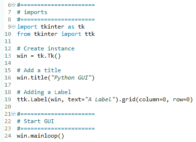

1.  运行代码并观察标签是如何添加到我们的 GUI 中的：

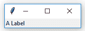

让我们深入了解代码以更好地理解它。

# 它是如何工作的…

在前述代码的第 10 行，我们从一个单独的模块中导入 `tkinter` 包。`ttk` 模块包含一些高级小部件，如笔记本、进度条、标签和按钮，它们看起来不同。这些有助于使我们的 GUI 看起来更好。在某种程度上，`ttk` 是 `tkinter` 包中的一个扩展。

我们仍然需要导入`tkinter`包，但我们需要指定我们现在还想要使用`tkinter`包中的`ttk`。

`ttk`代表*主题化*的`tk`。它改善了我们的 GUI 的外观和感觉。您可以在[`docs.python.org/3/library/tkinter.ttk.html`](https://docs.python.org/3/library/tkinter.ttk.html)找到更多信息。

第 19 行在调用`mainloop`之前将标签添加到 GUI 中。

我们将窗口实例传递给`ttk.Label`构造函数并设置`text`属性。这将成为`Label`将显示的文本。我们还使用了网格布局管理器，我们将在第二章[7b1f337c-b9fe-4dc2-8c86-5827e7256831.xhtml]中更深入地探讨，*布局管理*。

观察到我们的 GUI 突然比之前的配方小得多。它变得如此之小的原因是我们在表单中添加了一个小部件。如果没有小部件，`tkinter`包将使用默认大小。添加小部件会导致优化，这通常意味着使用尽可能少的空间来显示小部件（s）。如果我们使标签的文本更长，GUI 将自动扩展。我们将在第二章[7b1f337c-b9fe-4dc2-8c86-5827e7256831.xhtml]的后续配方中介绍这种自动表单大小调整，*布局管理*。

尝试调整大小并最大化带有标签的此 GUI，看看会发生什么。我们已经成功地学习了如何向 GUI 表单添加标签。

现在，让我们继续下一个配方。

# 创建按钮并更改它们的文本属性

在这个配方中，我们将添加一个按钮小部件，并使用这个按钮来改变我们 GUI 中另一个小部件的属性。这使我们了解了 Python GUI 环境中的回调函数和事件处理。

# 准备工作

这个配方扩展了之前的配方，*向 GUI 表单添加标签*。您可以从[`github.com/PacktPublishing/Python-GUI-Programming-Cookbook-Third-Edition`](https://github.com/PacktPublishing/Python-GUI-Programming-Cookbook-Third-Edition)下载整个代码。

# 如何做到这一点...

在这个配方中，我们将更新我们在上一个配方中添加的标签以及按钮的`text`属性。添加一个在点击时执行操作的按钮的步骤如下：

1.  从`GUI_add_label.py`模块开始，并将其保存为`GUI_create_button_change_property.py`。

1.  定义一个函数并命名为`click_me()`：

```py
def click_me()
```

1.  使用`ttk`创建一个按钮并给它一个`text`属性：

```py
action.configure(text="** I have been Clicked! **")
a_label.configure (foreground='red')
a_label.configure(text='A Red Label')
```

1.  将函数绑定到按钮：

```py
action = ttk.Button(win, text="Click Me!", command=click_me)
```

1.  使用网格布局定位按钮：

```py
 action.grid(column=1, row=0)
```

之前的说明产生了以下代码（`GUI_create_button_change_property.py`）：

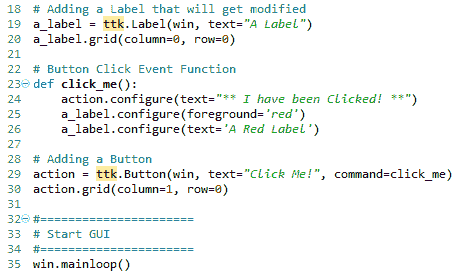

1.  运行代码并观察输出。

以下屏幕截图显示了点击按钮之前我们的 GUI 看起来是什么样子：

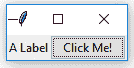

点击按钮后，标签的颜色发生了变化，按钮的文本也发生了变化，这可以从下面的屏幕截图中看到：

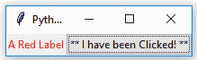

让我们深入幕后，更好地理解代码。

# 它是如何工作的…

在第 19 行，我们将标签分配给变量`a_label`，在第 20 行，我们使用这个变量在表单中定位标签。我们需要这个变量以便在`click_me()`函数中更改其属性。默认情况下，这是一个模块级变量，因此只要我们在调用它的函数上方声明变量，我们就可以在函数内部访问它。

第 23 行是当按钮被点击时调用的事件处理程序。

在第 29 行，我们创建了按钮并将命令绑定到`click_me()`函数。

GUI 是事件驱动的。点击按钮会创建一个事件。我们使用`ttk.Button`小部件的`command`属性将此事件发生的回调函数绑定。注意我们是如何不使用括号，只使用名称`click_me`的。

第 20 行和第 30 行都使用了网格布局管理器，这将在第二章的*布局管理*菜谱*使用网格布局管理器*中讨论。这使标签和按钮对齐。我们还更改了标签的文本，以包含单词`red`，使其更明显地表明颜色已更改。我们将继续在我们的 GUI 中添加更多和更多的小部件，并将在本书的其他菜谱中使用许多内置属性。

我们已经成功学习了如何创建按钮并更改它们的文本属性。现在，让我们继续到下一个菜谱。

# 创建文本框小部件

在`tkinter`中，典型的单行文本框小部件称为`Entry`。在这个菜谱中，我们将向我们的 GUI 添加这样的`Entry`小部件。我们将通过描述`Entry`小部件为用户做了什么来使我们的标签更有用。

# 准备工作

这个菜谱基于*创建按钮并更改它们的文本属性*菜谱，所以从存储库中下载它并开始工作。

# 如何做…

按照以下步骤创建文本框小部件：

1.  从`GUI_create_button_change_property.py`模块开始，并将其保存为`GUI_textbox_widget.py`。

1.  使用`tkinter`的`tk`别名创建一个`StringVar`变量：

```py
name = tk.StringVar()
```

1.  创建一个`ttk.Entry`小部件并将其分配给另一个变量：

```py
name_entered = ttk.Entry(win, width=12, textvariable=name)
```

1.  使用这个变量定位`Entry`小部件：

```py
name_entered.grid(column=0, row=1)
```

上述指令生成了以下代码（`GUI_textbox_widget.py`）：

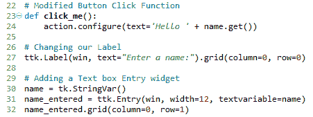

1.  运行代码并观察输出；我们的 GUI 看起来像这样：

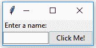

1.  输入一些文本并点击按钮；我们会看到 GUI 发生了变化，如下所示：

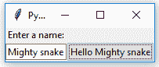

让我们深入幕后，更好地理解代码。

# 它是如何工作的…

在*步骤 1*中，我们创建一个新的 Python 模块，而在*步骤 2*中，我们添加了一个`StringVar`类型的`tkinter`，并将其保存在`name`变量中。当我们创建一个`Entry`小部件并将其分配给`Entry`小部件的`textvariable`属性时，我们使用这个变量。每次我们向`Entry`小部件中输入一些文本时，这些文本都会保存在`name`变量中。

在*步骤 4*中，我们定位了`Entry`小部件，前一个截图显示了整个代码。

在第 24 行，如图表所示，我们使用`name.get()`获取`Entry`小部件的值。

当我们创建我们的按钮时，我们将其引用保存在`action`变量中。我们使用`action`变量来调用按钮的`configure`方法，然后更新按钮的文本。

我们还没有使用 OOP，那么我们是如何访问一个甚至尚未声明的变量的值的呢？在不使用 OOP 类的情况下，在 Python 过程式编码中，我们必须在尝试使用该名称的语句上方实际放置一个名称。那么这是怎么工作的（它确实是这样工作的）？这个答案就是按钮点击事件是一个回调函数，并且当用户点击按钮时，这个函数中引用的变量是已知的并且确实存在。

第 27 行给我们的标签赋予了一个更有意义的名称；目前，它描述了其下方的文本框。我们将按钮向下移动到标签旁边，以便在视觉上关联这两个元素。我们仍在使用网格布局管理器，这将在第二章的*布局管理*中更详细地解释。

第 30 行创建了一个变量`name`。这个变量绑定到`Entry`小部件上，在我们的`click_me()`函数中，我们能够通过调用这个变量的`get()`来检索`Entry`小部件的值。这工作得很好。

现在我们注意到，虽然按钮显示了我们所输入的整个文本（以及更多），但文本框`Entry`小部件并没有扩展。这是因为我们在*第 31 行*将其硬编码为宽度为`12`。

Python 是一种动态类型语言，并从赋值中推断类型。这意味着如果我们将一个字符串分配给`name`变量，它将是`string`类型，如果我们将一个整数分配给`name`，它的类型将是整数。

使用`tkinter`，我们必须在成功使用之前将`name`变量声明为`tk.StringVar()`类型。原因是`tkinter`不是 Python。我们可以用 Python 使用它，但它不是同一种语言。更多信息请参见[`wiki.python.org/moin/TkInter`](https://wiki.python.org/moin/TkInter)。

我们已经成功学习了如何创建文本框小部件。现在，让我们继续学习下一个菜谱。

# 设置小部件的焦点和禁用小部件

当我们的 GUI 逐渐改进时，如果光标在 GUI 出现时立即出现在`Entry`小部件中，将会更加方便和有用。

在这个菜谱中，我们学习如何使光标出现在 Entry 框中，以便立即进行文本输入，而不是需要用户在输入到 entry 小部件之前先*点击*进入小部件以给它设置`focus`方法。

# 准备工作

这个菜谱扩展了之前的菜谱，*创建文本框小部件*。Python 确实很棒。我们只需要在 GUI 出现时将焦点设置到特定的控件上，只需在之前创建的`tkinter`小部件实例上调用`focus()`方法即可。在我们的当前 GUI 示例中，我们将`ttk.Entry`类实例分配给名为`name_entered`的变量。现在，我们可以给它设置焦点。

# 如何做到这一点…

将以下代码放置在模块底部之前的代码上方，该代码启动主窗口的事件循环，就像我们在之前的菜谱中所做的那样：

1.  从`GUI_textbox_widget.py`模块开始，并将其保存为`GUI_set_focus.py`。

1.  使用我们分配给`ttk.Entry`小部件实例的`name_entered`变量，并在这个变量上调用`focus()`方法：

```py
name_entered.focus()
```

上述说明生成了以下代码（`GUI_set_focus.py`）：

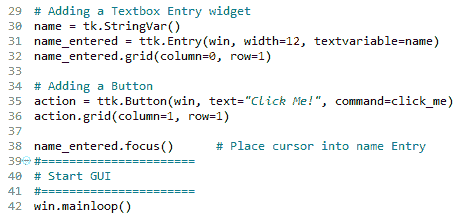

1.  运行代码并观察输出。

如果你遇到一些错误，请确保你将变量调用放置在它们声明的代码下方。目前我们不是使用面向对象编程，所以这仍然是必要的。稍后，将不再需要这样做。

在 Mac 上，你可能需要首先将焦点设置到 GUI 窗口，然后才能设置此窗口中的 Entry 小部件的焦点。

添加 Python 代码的第 38 行将光标放置在我们的文本 Entry 小部件中，给文本 Entry 小部件设置焦点。一旦 GUI 出现，我们就可以直接输入到这个文本框中，而无需先点击它。结果 GUI 现在看起来像这样，光标位于 Entry 小部件内：

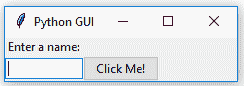

注意现在光标默认位于文本输入框内。

我们还可以禁用小部件。在这里，我们禁用按钮以展示原理。在更大的 GUI 应用程序中，禁用小部件的能力允许你在需要使某些内容只读时进行控制。最可能的是组合框小部件和 Entry 小部件，但因为我们还没有到达那些小部件，我们将使用我们的按钮。

要禁用小部件，我们将在小部件上设置一个属性。我们可以通过在创建按钮的 Python 代码的第 37 行下方添加以下代码来使按钮不可用：

1.  使用`GUI_set_focus.py`模块并将其保存为`GUI_disable_button_widget.py`。

1.  使用`action`按钮变量来调用`configure`方法并将`state`属性设置为`disabled`：

```py
action.configure(state='disabled')
```

1.  在`name_entered`变量上调用`focus()`方法：

```py
name_entered.focus()
```

上述说明生成了以下代码（`GUI_disable_button_widget.py`）：

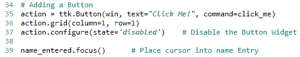

1.  运行代码。在添加上述 Python 代码行之后，点击按钮将不再创建动作：

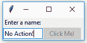

让我们深入了解代码，以更好地理解它。

# 它是如何工作的...

这段代码是自我解释的。在第 39 行，我们设置了一个控件的焦点，在第 37 行，我们禁用了另一个控件。在编程语言中使用良好的命名有助于消除冗长的解释。本书后面将有一些关于如何在工作中编程或在家中练习编程技能时如何做到这一点的先进技巧。

我们已经成功地学习了如何设置控件焦点并禁用控件。现在，让我们继续到下一个菜谱。

# 创建组合框小部件

在这个菜谱中，我们将通过添加具有初始默认值的下拉组合框来改进我们的 GUI。虽然我们可以限制用户只能选择某些选项，但我们也可以允许用户输入他们想要的任何内容。

# 准备工作

这个菜谱扩展了之前的菜谱，*设置控件焦点和禁用控件*。

# 如何做...

我们使用网格布局管理器在`Entry`控件和`Button`控件之间插入另一列。以下是 Python 代码：

1.  从`GUI_set_focus.py`模块开始，并将其保存为`GUI_combobox_widget.py`。

1.  将按钮列更改为`2`：

```py
action = ttk.Button(win, text="Click Me!", command=click_me)
action.grid(column=2, row=1)
```

1.  创建一个新的`ttk.Label`小部件：

```py
ttk.Label(win, text="Choose a number:").grid(cloumn=1, row=0)
```

1.  创建一个新的`ttk.Combobox`小部件：

```py
number_chosen = ttk.Combobox(win, width=12, textvariable=number)
```

1.  为`Combobox`小部件分配值：

```py
number_chosen['value'] = (1, 2, 4, 42, 100)
```

1.  将`Combobox`小部件放置在`列 1`：

```py
number_chosen.grid(column=1, row=1)
number_chosen.current(0)
```

前面的步骤生成了以下代码（`GUI_combobox_widget.py`）：

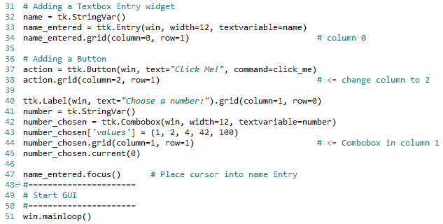

1.  运行代码。

当将此代码添加到之前的菜谱中时，会创建以下 GUI。注意，在前面的代码的第 43 行中，我们给组合框分配了一个具有默认值的元组。这些值随后出现在下拉框中。我们也可以根据需要更改它们（在应用程序运行时输入不同的值）：

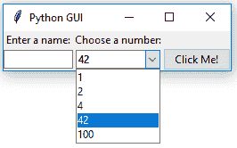

让我们深入了解代码，以更好地理解它。

# 它是如何工作的...

第 40 行添加了一个第二个标签以匹配新创建的组合框（在第 42 行创建）。第 41 行将框的值分配给一个特殊的`tkinter`类型的`StringVar`变量，就像我们在之前的菜谱中所做的那样。

第 44 行将两个新的控件（标签和组合框）在我们的前一个 GUI 布局中对齐，第 45 行将默认值分配给当 GUI 首次可见时显示。这是`number_chosen['values']`元组的第一个值，字符串`"1"`。我们在第 43 行没有给整数的元组加上引号，但它们被转换成了字符串，因为在第 41 行中，我们声明了值应该是`tk.StringVar`类型。

前面的截图显示了用户所做的选择是`42`。此值被分配给`number`变量。

如果在组合框中选择`100`，则`number`变量的值变为`100`。

*第 42 行*通过`textvariable`属性将组合框中选择的值绑定到`number`变量。

# 还有更多...

如果我们想限制用户只能选择我们编程到 `Combobox` 小部件中的值，我们可以通过将 *`state`* 属性传递给构造函数来实现。将 *第 42 行* 修改如下：

1.  从 `GUI_combobox_widget.py` 模块开始，并将其保存为 `GUI_combobox_widget_readonly.py`。

1.  在创建 `Combobox` 小部件时设置 `state` 属性：

```py
number_chosen = ttk.Combobox(win, width=12, textvariable=number, state='readonly')
```

前面的步骤生成以下代码（`GUI_combobox_widget_readonly.py`）：

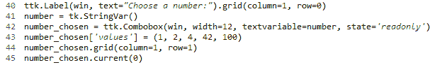

1.  运行代码。

现在，用户不能再向 `Combobox` 小部件中输入值。

我们可以通过在按钮点击事件回调函数中添加以下代码行来显示用户选择的价值：

1.  从 `GUI_combobox_widget_readonly.py` 模块开始，并将其保存为 `GUI_combobox_widget_readonly_plus_display_number.py`。

1.  通过在 `name` 变量上使用 `get()` 方法扩展按钮点击事件处理程序，使用连接（`+ ' ' +`），并从 `number_chosen` 变量（也调用它的 `get()` 方法）获取数字：

```py
def click_me(): 
    action.configure(text='Hello ' + name.get() + ' ' + 
    number_chosen.get())
```

1.  运行代码。

选择一个数字，输入一个名称，然后点击按钮，我们得到以下 GUI 结果，现在它还显示了输入名称旁边的所选数字（`GUI_combobox_widget_readonly_plus_display_number.py`）：

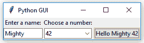

我们已经成功学习了如何添加组合框小部件。现在，让我们继续下一个配方。

# 创建具有不同初始状态的复选框

在这个配方中，我们将添加三个复选框小部件，每个小部件都有一个不同的初始状态：

+   第一个是禁用的，里面有一个勾选标记。由于小部件是禁用的，用户不能移除这个勾选标记。

+   第二个复选框是启用的，默认情况下没有勾选标记，但用户可以点击它来添加勾选标记。

+   第三个复选框默认既启用又选中。用户可以随时取消选中并重新选中小部件。

# 准备工作

这个配方扩展了之前的配方，*创建组合框小部件*。

# 如何做到这一点…

下面是创建三个状态不同的复选框小部件的代码：

1.  从 `GUI_combobox_widget_readonly_plus_display_number.py` 模块开始，并将其保存为 `GUI_checkbutton_widget.py`。

1.  创建三个 `tk.IntVar` 实例并将它们保存在局部变量中：

```py
chVarDis = tk.IntVar()
chVarUn = tk.IntVar()
chVarEn = tk.IntVar()
```

1.  为我们创建的每个 `Combobox` 小部件设置 `text` 属性：

```py
text="Disabled"
text="UnChecked"
text="Enabled"
```

1.  将它们的 `state` 设置为 `deselect`/`select`：

```py
check1.select()
check2.deselect()
check3.select()
```

1.  使用 `grid` 来布局：

```py
check1.grid(column=0, row=4, sticky=tk.W)
check2.grid(column=1, row=4, sticky=tk.W)
check3.grid(column=2, row=4, sticky=tk.W)
```

前面的步骤最终生成以下代码（`GUI_checkbutton_widget.py`）：

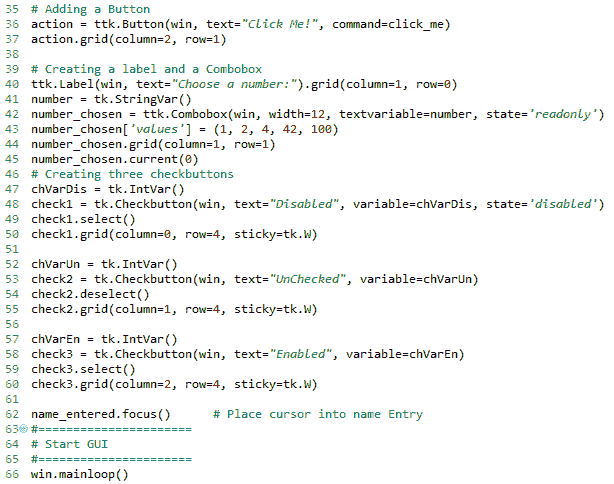

1.  运行模块。运行新代码的结果如下 GUI：

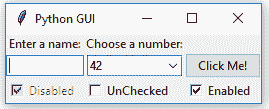

让我们深入了解代码以更好地理解它。

# 它是如何工作的…

*步骤 1* 到 *4* 展示了详细信息和截图，*步骤 5* 显示了代码的重要方面。

在*第 47 行*、*第 52 行*和*第 57 行*，我们创建了三个`IntVar`类型的变量。在每个这些变量之后的行中，我们创建了一个`Checkbutton`小部件，传递这些变量。它们将保存`Checkbutton`小部件的状态（未选中或选中）。默认情况下，这将是`0`（未选中）或`1`（选中），因此变量的类型是`tkinter`整数。

我们将这些`Checkbutton`小部件放置在我们的主窗口中，因此构造函数传入的第一个参数是小部件的父级，在我们的情况下是`win`。我们通过其`text`属性给每个`Checkbutton`小部件一个不同的标签。

将网格的`sticky`属性设置为`tk.W`意味着小部件将被对齐到网格的西边。这非常类似于 Java 语法，意味着它将被对齐到左边。当我们调整我们的 GUI 大小时，小部件将保持在左侧，而不会移动到 GUI 的中心。

第 49 行和第 59 行通过在这两个`Checkbutton`类实例上调用`select()`方法，将勾选标记放入`Checkbutton`小部件中。

我们继续使用网格布局管理器来排列我们的小部件，这将在第二章，*布局管理*中更详细地解释。

我们已经成功地学习了如何创建具有不同初始状态的复选框。现在，让我们继续下一个菜谱。

# 使用单选按钮小部件

在这个菜谱中，我们将创建三个单选按钮小部件。我们还将添加一些代码，根据选中的哪个单选按钮改变主表单的颜色。

# 准备工作

这个菜谱扩展了之前的菜谱，*创建具有不同初始状态的复选框*。

# 如何做…

我们将以下代码添加到之前的菜谱中：

1.  从`GUI_checkbutton_widget.py`模块开始，将其保存为`GUI_radiobutton_widget.py`。

1.  为颜色名称创建三个模块级别的全局变量：

```py
COLOR1 = "Blue"
COLOR2 = "Gold"
COLOR3 = "Red"
```

1.  为单选按钮创建一个回调函数：

```py
if radSel == 1: win.configure(background=COLOR1)
    elif radSel == 2: win.configure(background=COLOR2)
    elif radSel == 3: win.configure(background=COLOR3)
```

1.  创建三个`tk`单选按钮：

```py
rad1 = tk.Radiobutton(win, text=COLOR1, variable=radVar, value=1,                               
                      command=radCall)
rad2 = tk.Radiobutton(win, text=COLOR2, variable=radVar, value=2,                 
                      command=radCall)
rad3 = tk.Radiobutton(win, text=COLOR3, variable=radVar, value=3,     
                      command=radCall)
```

1.  使用网格布局来定位它们：

```py
rad1.grid(column=0, row=5, sticky=tk.W, columnspan=3)
rad2.grid(column=1, row=5, sticky=tk.W, columnspan=3)
rad3.grid(column=2, row=5, sticky=tk.W, columnspan=3)
```

前面的步骤最终将生成以下代码（`GUI_radiobutton_widget.py`）：

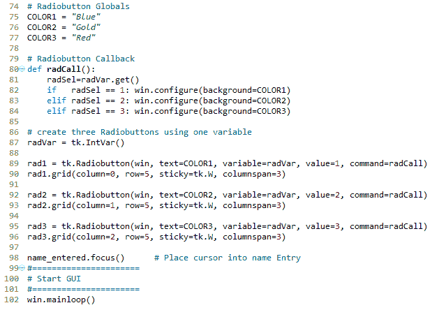

1.  运行代码。运行此代码并选择名为 Gold 的单选按钮将创建以下窗口：

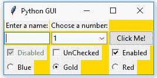

让我们深入了解代码以更好地理解。

# 它是如何工作的…

在第 75-77 行，我们创建了一些模块级别的全局变量，我们将在创建每个单选按钮以及创建改变主表单背景颜色的回调函数（使用`win`实例变量）时使用。

我们使用全局变量来简化代码的更改。通过将颜色名称分配给变量并在多个地方使用这个变量，我们可以轻松地尝试不同的颜色。我们不需要进行全局搜索和替换硬编码的字符串（这容易出错），只需更改一行代码，其他所有内容都会正常工作。这被称为**DRY 原则**，代表**不要重复自己**。这是我们在本书后面的菜谱中将要使用的一个面向对象的概念。

我们分配给变量的颜色名称（`COLOR1`、`COLOR2`、...）是`tkinter`关键字（技术上，它们是*符号名称*）。如果我们使用不是`tkinter`颜色关键字的名称，则代码将无法工作。

第 80 行是*回调函数*，根据用户的选中改变我们主表单（`win`）的背景。

在第 87 行，我们创建了一个`tk.IntVar`变量。重要的是，我们只创建了一个变量，供所有三个单选按钮使用。从截图可以看出，无论我们选择哪个单选按钮，其他所有单选按钮都会自动为我们取消选中。

第 89 行到第 96 行创建了三个单选按钮，并将它们分配给主表单，传递变量给回调函数，该函数用于改变我们主窗口的背景。

虽然这是第一个改变小部件颜色的菜谱，但坦白地说，它看起来有点丑。本书接下来的许多菜谱将解释如何使我们的 GUI 看起来真正令人惊叹。

# 更多内容…

这里是一个可用的符号颜色名称的小样本，您可以在官方 TCL 文档[`www.tcl.tk/man/tcl8.5/TkCmd/colors.htm`](http://www.tcl.tk/man/tcl8.5/TkCmd/colors.htm)中查找：

| **名称** | **红色** | **绿色** | **蓝色** |
| --- | --- | --- | --- |
| `alice blue` | 240 | 248 | 255 |
| `AliceBlue` | 240 | 248 | 255 |
| `蓝色` | 0 | 0 | 255 |
| `金色` | 255 | 215 | 0 |
| `红色` | 255 | 0 | 0 |

一些名称创建相同的颜色，所以`alice blue`与`AliceBlue`创建相同的颜色。在这个菜谱中，我们使用了符号名称`Blue`、`Gold`和`Red`。

我们已经成功学习了如何使用单选按钮小部件。现在，让我们继续学习下一个菜谱。

# 使用滚动文本小部件

`ScrolledText`小部件比简单的`Entry`小部件大得多，并且跨越多行。它们像记事本一样，自动换行，并在文本超过`ScrolledText`小部件高度时自动启用垂直滚动条。

# 准备中

这个菜谱扩展了之前的菜谱，*使用单选按钮小部件*。您可以从这个书的每个章节下载代码：[`github.com/PacktPublishing/Python-GUI-Programming-Cookbook-Third-Edition/`](https://github.com/PacktPublishing/Python-GUI-Programming-Cookbook-Third-Edition)。

# 如何做…

通过添加以下代码行，我们创建了一个`ScrolledText`小部件：

1.  从`GUI_radiobutton_widget.py`模块开始，并将其保存为`GUI_scrolledtext_widget.py`。

1.  导入`scrolledtext`：

```py
from tkinter import scrolledtext
```

1.  定义宽度和高度的变量：

```py
scrol_w = 30
scrol_h = 3
```

1.  创建一个`ScrolledText`小部件：

```py
scr = scrolledtext.ScrolledText(win, width=scrol_w, height=scrol_h, wrap=tk.WORD)
```

1.  定位小部件：

```py
scr.grid(column=0, columnspan=3)
```

前面的步骤最终将产生以下代码（`GUI_scrolledtext_widget.py`）：

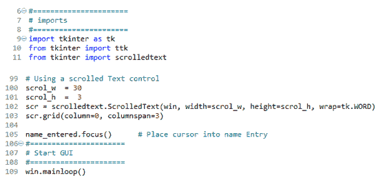

1.  运行代码。我们实际上可以在小部件中输入文本，如果我们输入足够的单词，行将自动换行：

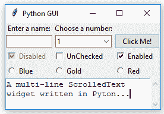

一旦我们输入的单词数量超过了小部件的高度，垂直滚动条就会启用。这一切都是默认的，我们不需要编写任何额外的代码来实现这一点：

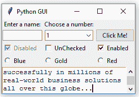

让我们深入了解代码，以更好地理解它。

# 它是如何工作的…

在第 11 行，我们导入了包含`ScrolledText`小部件类的模块。将其添加到模块的顶部，位于其他两个`import`语句之下。

第 100 行和第 101 行定义了我们即将创建的`ScrolledText`小部件的宽度和高度。这些是通过实验找到的*魔法数字*，它们在`ScrolledText`小部件构造函数的第 102 行中被传递进去。

这些值是通过实验找到的，效果很好。你可以通过将`scol_w`从 30 改为 50 来实验，并观察效果！

在第 102 行，我们通过传递`wrap=tk.WORD`来设置小部件的一个属性。通过将`wrap`属性设置为`tk.WORD`，我们告诉`ScrolledText`小部件通过单词来断行，这样我们就不需要在单词中间换行。默认选项是`tk.CHAR`，它会将任何字符都换行，无论我们是否在单词中间。

第二张截图显示，垂直滚动条向下移动，因为我们正在读取一个较长的文本，它不完全适合我们创建的`ScrolledText`控制器的*x, y*维度。

将网格布局的`columnspan`属性设置为`3`以适用于`ScrolledText`小部件，这使得该小部件跨越所有三个列。如果我们不设置此属性，我们的`ScrolledText`小部件将只位于第一列，这并不是我们想要的。

我们已经成功学习了如何使用滚动文本小部件。现在，让我们继续下一个食谱。

# 在循环中添加多个小部件

到目前为止，我们已经通过基本上复制粘贴相同的代码并修改变体（例如，列数）来创建了多个相同类型的控件（例如，单选按钮）。在这个食谱中，我们开始重构代码，以使其更少冗余。

# 准备工作

我们正在重构之前食谱代码的一些部分，*使用滚动文本小部件*，因此你需要这段代码来完成这个食谱。

# 如何做到这一点…

这是我们的代码重构方式：

1.  从`GUI_scrolledtext_widget.py`模块开始，并将其保存为`GUI_adding_widgets_in_loop.py`。

1.  删除全局名称变量，并创建一个 Python 列表代替：

```py
colors = ["Blue", "Gold", "Red"]
```

1.  使用单选按钮变量的`get()`函数：

```py
radSel=radVar.get()
```

1.  使用`if ... elif`结构创建逻辑：

```py
if radSel == 0: win.configure(background=colors[0])
    elif radSel == 1: win.configure(background=color[1])
    elif radSel == 2: win.configure(background=color[2])
```

1.  使用循环创建和定位单选按钮：

```py
for col in range(3):
    curRad = tk.Radiobutton(win, text=colors[col], cariable=radVar,  
    value, command=radCall)
    curRad.brid(column=col, row=5, sticky=tk.W)
```

1.  运行代码（`GUI_adding_widgets_in_loop.py`）：

![](img/918594c9-d943-49ce-b9a6-056ea4db08a9.png）

运行此代码将创建与之前相同的窗口，但我们的代码更加整洁且易于维护。这将在我们接下来的菜谱中扩展 GUI 时帮助我们。

# 它是如何工作的……

在*第 77 行*，我们将全局变量转换成了一个列表。在第 89 行，我们为名为`radVar`的`tk.IntVar`变量设置了一个默认值。这很重要，因为在之前的菜谱中，我们为单选按钮小部件设置了从`1`开始的值，而在我们新的循环中，使用 Python 的基于零的索引要方便得多。如果我们没有将默认值设置在单选按钮小部件的范围之外，当 GUI 出现时，其中一个单选按钮会被选中。虽然这本身可能不是那么糟糕，*但它不会触发回调函数*，我们最终会选中一个不执行其工作（即改变主窗口颜色）的单选按钮。

在*第 95 行*，我们用循环替换了之前硬编码创建的单选按钮小部件的三个实例。这更加简洁（代码行数更少）且易于维护。例如，如果我们想创建 100 个而不是仅仅`3`个单选按钮小部件，我们只需更改 Python 范围运算符内的数字即可。我们不需要输入或复制粘贴 97 段重复的代码，只需一个数字。

第 82 行显示了修改后的回调函数。

这个菜谱标志着本书第一章节的结束。接下来所有章节的所有菜谱都将基于我们迄今为止构建的 GUI 进行构建，极大地增强了它。
