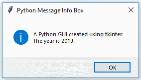
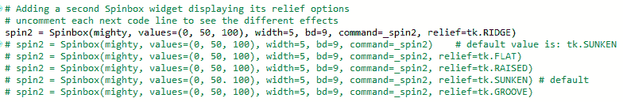

# 界面外观定制

在本章中，我们将通过更改一些属性来定制我们的 GUI 中的某些小部件。我们还将介绍一些`tkinter`提供的新的小部件。

在*使用 Python 创建工具提示*菜谱中，我们将创建一个`ToolTip`面向对象风格的类，它将是我们至今为止使用的单个 Python 模块的一部分。

你将学习如何创建不同的消息框，更改 GUI 窗口标题，以及更多。我们将使用旋转框控件来学习如何应用不同的样式。

界面外观定制是 GUI 设计的重要组成部分，因为它使我们的 GUI 看起来更专业。

这是本章 Python 模块的概述：


在本章中，我们将使用 Python 3.7 及以上版本来定制我们的 GUI。我们将涵盖以下菜谱：

+   创建消息框 – 信息、警告和错误

+   如何创建独立的消息框

+   如何创建 tkinter 窗口的标题

+   更改主根窗口的图标

+   使用旋转框控件

+   应用浮雕效果 – 小部件的凹凸外观

+   使用 Python 创建工具提示

+   将进度条添加到 GUI 中

+   如何使用画布控件

# 创建消息框 – 信息、警告和错误

消息框是一个弹出窗口，向用户提供反馈。它可以提供信息，暗示潜在问题，以及灾难性的错误。

使用 Python 创建消息框非常简单。

# 准备工作

我们将在第二章，*布局管理*中创建的*创建标签控件*菜单位置添加功能。

代码来自`GUI_tabbed_all_widgets_both_tabs.py`。在大多数应用程序中，当点击帮助 | 关于菜单时，用户通常会收到信息反馈。我们将从这个信息开始，然后改变设计模式以显示警告和错误。

# 如何操作…

以下是创建 Python 中消息框的步骤：

1.  从第二章，*布局管理*中打开`GUI_tabbed_all_widgets_both_tabs.py`，并将其模块保存为`GUI_message_box.py`。

1.  将以下代码行添加到模块顶部的导入语句部分：

```py
from tkinter import messagebox as msg
```

1.  接下来，创建一个回调函数，该函数将显示一个消息框。我们必须将回调函数的代码放在将回调附加到菜单项的代码之上，因为这部分仍然是过程式代码，而不是面向对象的代码。

在创建帮助菜单的代码上方添加以下代码：

```py
def _msgBox():
    msg.showinfo('Python Message Info Box', 'A Python GUI created 
    using tkinter:\nThe year is 2019.') 
```

上述指令生成以下代码，`GUI_message_box.py`：


1.  运行代码。现在点击帮助 | 关于将导致以下弹出窗口出现：



让我们将此代码转换为警告消息框弹出窗口：

1.  打开 `GUI_message_box.py` 并将模块保存为 `GUI_message_box_warning.py`。

1.  注释掉 `msg.showinfo` 行。

1.  将信息框代码替换为警告框代码：

```py
msg.showwarning('Python Message Warning Box', 'A Python GUI created using tkinter:' '\nWarning: There might be a bug in this code.')
```

上述指令产生以下代码，`GUI_message_box_warning.py`：


1.  运行上述代码现在将产生以下略微修改的消息框：


显示错误消息框很简单，通常警告用户存在严重问题。正如我们在前面的代码片段中所做的那样，注释掉上一行并添加以下代码，就像我们在这里所做的那样：

1.  打开 `GUI_message_box_warning.py` 并将模块保存为 `GUI_message_box_error.py`。

1.  将警告框代码替换为错误框代码：

```py
msg.showerror('Python Message Error Box', 'A Python GUI created using tkinter:'
    '\nError: Houston ~ we DO have a serious PROBLEM!')
```

上述指令产生以下代码：


1.  运行 `GUI_message_box_error.py` 文件。错误消息看起来像这样：


有不同的消息框显示多个“确定”按钮，我们可以根据用户的选项编程我们的响应。

以下是一个简单示例，说明了这项技术：

1.  打开 `GUI_message_box_error.py` 并将模块保存为 `GUI_message_box_yes_no_cancel.py`。

1.  将错误框替换为 `yes_no_cancel` 框：

```py
answer = msg.askyesnocancel("Python Message Multi Choice Box", "Are you sure you really wish to do this?")
```

上述指令产生以下代码：


1.  运行 `GUI_message_box_yes_no_cancel.py` 文件。运行此 GUI 代码将弹出一个弹出窗口，用户响应可以用于根据事件驱动的 GUI 循环的答案进行分支，通过将其保存在 `answer` 变量中：


使用 Eclipse 显示的控制台输出表明，点击“是”按钮将布尔值 `True` 分配给 `answer` 变量：


例如，我们可以使用以下代码：

```py
If answer == True: 
    <do something>
```

点击“否”返回 `False`，点击“取消”返回 `None`。

现在，让我们深入了解代码，以更好地理解它。

# 它是如何工作的…

我们为所有的 `GUI_message_box` Python 模块添加了另一个回调函数，`def _msgBox()`，并将其附加到帮助菜单的 `command` 属性以处理点击事件。现在，当我们点击帮助 | 关于菜单时，将发生一个动作。我们正在创建并显示最常见的弹出消息框对话框。它们是模态的，因此用户在点击“确定”按钮之前不能使用 GUI。

在第一个示例中，我们显示了一个信息框，如左边的图标所示。接下来，我们创建警告和错误消息框，它们会自动更改与弹出窗口关联的图标。我们只需指定我们想要显示的消息框即可。

`askyesnocancel` 消息框根据用户点击的按钮返回不同的值。我们可以将答案捕获到变量中，并根据所选答案编写不同的代码。

我们已经成功学习了如何创建消息框。现在，让我们继续学习下一个技巧。

# 如何创建独立的消息框

在这个技巧中，我们将创建我们的`tkinter`消息框作为独立的顶级 GUI 窗口。

你首先会注意到，这样做会导致一个额外的窗口，所以我们将探讨隐藏这个窗口的方法。

在之前的技巧中，我们通过主 GUI 表中的帮助 | 关于菜单调用了`tkinter`消息框。

那么，我们为什么想要创建一个独立的消息框呢？

一个原因是我们可能需要自定义我们的消息框并在多个 GUI 中重用它们。我们不需要在设计的每个 Python GUI 中复制和粘贴相同的代码，我们可以将其从主 GUI 代码中提取出来。这创建了一个小的可重用组件，然后我们可以将其导入到不同的 Python GUI 中。

# 准备工作

在之前的技巧中，我们已经创建了消息框的标题，*创建消息框 - 信息、警告和错误*。我们不会重用之前的代码，而是使用非常少的 Python 代码构建一个新的 GUI。

# 如何做到这一点...

我们可以创建一个简单的消息框如下：

1.  创建一个新的模块并将其保存为`GUI_independent_msg.py`。

1.  添加以下两行代码，这就是所有需要做的：

```py
from tkinter import messagebox as msg
msg.showinfo('Python GUI created using tkinter:\nThe year is 2019')
```

1.  运行`GUI_independent_msg.py`文件。这将导致以下两个窗口：


这看起来并不像我们想象中的样子。现在，我们有两个窗口，一个是我们不想要的，另一个窗口显示其文本作为标题。

哎呀！

让我们现在解决这个问题。我们可以通过添加一个单引号或双引号后跟一个逗号来更改 Python 代码：

1.  打开`GUI_independent_msg.py`并将模块保存为`GUI_independent_msg_info.py`。

1.  创建一个空标题：

```py
from tkinter import messagebox as msg
msg.showinfo('', 'Python GUI created using tkinter:\nThe year is 2019')
```

1.  运行`GUI_independent_msg_info.py`文件。现在，我们没有标题，但我们的文本最终出现在弹出窗口中，正如我们预期的：


第一个参数是标题，第二个参数是在弹出消息框中显示的文本。通过添加一个空的单引号或双引号后跟一个逗号，我们可以将我们的文本从标题移动到弹出消息框中。

我们仍然需要一个标题，我们肯定希望去掉这个不必要的第二个窗口。第二个窗口是由 Windows 事件循环引起的。我们可以通过抑制它来去掉它。

添加以下代码：

1.  打开`GUI_independent_msg_info.py`并将模块保存为`GUI_independent_msg_one_window.py`。

1.  导入`Tk`创建`Tk`类的一个实例，并调用`withdraw`方法：

```py
from tkinter import Tk
root = Tk()
root.withdraw()
```

现在，我们只有一个窗口。`withdraw()`方法移除了我们不感兴趣的浮动调试窗口。

1.  运行代码。这将导致以下窗口：


为了添加一个标题，我们只需要将字符串放入我们的第一个空参数中。

例如，考虑以下代码片段：

1.  打开 `GUI_independent_msg_one_window.py` 并将模块保存为 `GUI_independent_msg_one_window_title.py`。

1.  通过在第一个参数位置添加一些文字来给它一个标题：

```py
msg.showinfo('This is a Title', 'Python GUI created using tkinter:\nThe year is 2019')
```

上述指令产生以下代码：


1.  运行 `GUI_independent_msg_one_window_title.py` 文件。现在，我们的对话框有一个标题，如下面的截图所示：


现在，让我们深入了解代码，以更好地理解它。

# 它是如何工作的…

我们向消息框的 `tkinter` 构造函数传递更多的参数，以添加窗口表单的标题并在消息框中显示文本，而不是将其显示为标题。这是由于我们传递参数的位置。如果我们省略一个空引号或双引号，那么消息框小部件将参数的第一个位置作为标题，而不是消息框内要显示的文本。通过传递一个空引号后跟一个逗号，我们改变了消息框显示我们传递给函数的文本的位置。

我们通过在主根窗口上调用 `withdraw()` 方法来抑制由 `tkinter` 消息框小部件自动创建的第二个弹出窗口。

通过在之前为空的字符串中添加一些文字，我们给消息框添加了一个标题。这表明不同的消息框，除了它们显示的主要消息外，还有它们自己的自定义标题。这可以用来将几个不同的消息框关联到相同的功能。

我们已经成功地学习了如何创建独立的消息框。现在，让我们继续下一个菜谱。

# 如何创建 tkinter 窗口的标题

改变 tkinter 主根窗口标题的原则与我们之前讨论的相同：*如何创建独立的消息框*。我们只需将一个字符串作为第一个参数传递给小部件的构造函数。

# 准备工作

我们不是创建一个弹出对话框，而是创建主根窗口并为其添加标题。

# 如何做到这一点…

以下代码创建主窗口并为其添加标题。我们已经在之前的菜谱中这样做过；例如，在 *创建标签小部件* 菜谱中，在 第二章，*布局管理*。这里，我们只关注我们 GUI 的这个方面：

1.  打开 `GUI_tabbed_all_widgets_both_tabs.py` 并将模块保存为 `GUI_title.py`。

1.  给主窗口添加标题：

```py
import tkinter as tk 
win = tk.Tk()               # Create instance 
win.title("Python GUI")     # Add a title
```

1.  运行 `GUI_title.py` 文件。这将产生以下两个标签：


现在，让我们深入了解代码，以更好地理解它。

# 它是如何工作的…

通过使用 `tkinter` 内置的 `title` 属性，我们为主根窗口添加了一个标题。在创建一个 `Tk()` 实例之后，我们可以使用所有内置的 `tkinter` 属性来自定义我们的 GUI。

我们已经成功学习了如何为`tkinter`窗口表单创建标题。现在，让我们继续下一个菜谱。

# 更改主根窗口的图标

定制我们的 GUI 的一种方法是为它提供一个与`tkinter`默认图标不同的图标。以下是我们的操作方法。

# 准备工作

我们正在改进我们的 GUI，这是从第二章的*创建标签式小部件*菜谱中，*布局管理*。我们将使用 Python 附带的图标，但你也可以使用任何你认为有用的图标。确保你有图标所在位置的完整路径，否则可能会出错。

# 如何操作...

对于这个例子，我已经将图标从安装 Python 3.7 的地方复制到代码所在的同一文件夹中。以下截图显示了我们将要使用的图标：


为了使用此图标或其他图标文件，请执行以下步骤：

1.  打开`GUI_title.py`并将模块保存为`GUI_icon.py`。

1.  将以下代码放置在主事件循环之上：

```py
# Change the main windows icon 
win.iconbitmap('pyc.ico')
```

1.  运行`GUI_icon.py`文件。观察 GUI 左上角的默认羽毛图标是如何改变的：


现在，让我们深入了解代码，以更好地理解它。

# 它是如何工作的...

这是`tkinter`附带的一个属性，`tkinter`与 Python 3.7 及以上版本一起提供。我们使用`iconbitmap`属性通过传递到图标的相对路径来更改我们的主根窗口的图标，这会覆盖`tkinter`的默认图标，用我们选择的图标替换它。

如果图标位于与 Python 模块相同的文件夹中，我们可以简单地通过图标名称来引用它，而无需传递图标位置的完整路径。

我们已经成功学习了如何更改主根窗口的图标。现在，让我们继续下一个菜谱。

# 使用旋钮控制

在这个菜谱中，我们将使用一个`Spinbox`小部件，并且我们还将把键盘上的*Enter*键绑定到我们的某个小部件上。`Spinbox`小部件是一个单行小部件，类似于`Entry`小部件，它还具有限制它将显示的值的额外功能。它还有一些小的上下箭头，可以滚动上下值。

# 准备工作

我们将使用我们的标签式 GUI，来自*如何创建 tkinter 窗口标题*菜谱，并在`ScrolledText`控件上方添加一个`Spinbox`小部件。这只需要我们将`ScrolledText`的行值增加一行，并在`Entry`小部件上方插入我们的新`Spinbox`控件。

# 如何操作...

首先，我们通过以下步骤添加`Spinbox`控件：

1.  打开`GUI_title.py`并将模块保存为`GUI_spinbox.py`。

1.  将以下代码放置在`ScrolledText`小部件之上：

```py
# Adding a Spinbox widget 
spin = Spinbox(mighty, from_=0, to=10) 
spin.grid(column=0, row=2)
```

1.  运行代码。这将按以下方式修改我们的 GUI：


接下来，我们将减小`Spinbox`小部件的大小：

1.  打开`GUI_spinbox.py`并将模块保存为`GUI_spinbox_small.py`。

1.  在创建`Spinbox`小部件时添加一个`width`属性：

```py
spin = Spinbox(mighty, from_=0, to=10, width=5)
```

1.  运行前面的代码会产生以下 GUI：


接下来，我们添加另一个属性来进一步自定义我们的小部件；`bd`是`borderwidth`属性的缩写，它改变了围绕滚动框的边框宽度：

1.  打开`GUI_spinbox_small.py`并将模块保存为`GUI_spinbox_small_bd.py`。

1.  添加一个`bd`属性，将其大小设置为`8`：

```py
spin = Spinbox(mighty, from_=0, to=10, width=5 , bd=8)
```

1.  运行前面的代码会产生以下 GUI：


接下来，我们通过创建一个回调并将其链接到控制条来为小部件添加功能。

以下步骤展示了如何将`Spinbox`小部件的选择打印到`ScrolledText`以及到`stdout`。名为`scrol`的变量是我们对`ScrolledText`小部件的引用：

1.  打开`GUI_spinbox_small_bd.py`并将模块保存为`GUI_spinbox_small_bd_scrol.py`。

1.  在创建`Spinbox`小部件的上方编写一个回调函数，并将其分配给`Spinbox`小部件的`command`属性：

```py
# Spinbox callback  
def _spin(): 
    value = spin.get() 
    print(value) 
    scrol.insert(tk.INSERT, value + '\n')   # <-- add a newline 

    spin = Spinbox(mighty, from_=0, to=10, width=5, bd=8, 
    command=_spin)                 # <-- command=_spin
```

1.  点击`Spinbox`箭头时，运行`GUI_spinbox_small_bd_scrol.py`文件会产生以下 GUI：


我们可以使用一组值而不是使用范围，通过执行以下指令：

1.  打开`GUI_spinbox_small_bd_scrol.py`并将模块保存为`GUI_spinbox_small_bd_scrol_values.py`。

1.  在创建`Spinbox`小部件时添加`values`属性，替换`from_=0, to=10`，并分配一个数字元组：

```py
# Adding a Spinbox widget using a set of values 
spin = Spinbox(mighty, values=(1, 2, 4, 42, 100), width=5, bd=8, 
command=_spin)  
spin.grid(column=0, row=2)
```

1.  运行代码。这将创建以下 GUI 输出：


现在，让我们深入了解代码，以更好地理解它。

# 它是如何工作的…

注意，在第一个 Python 模块`GUI_spinbox.py`中，我们的新`Spinbox`控制条的默认宽度为`20`，这推高了该列中所有控制条的列宽。这不是我们想要的。我们给小部件指定了一个从`0`到`10`的范围。

在第二个 Python 模块`GUI_spinbox_small.py`中，我们减小了`Spinbox`控制条的宽度，使其与列中心对齐。

在第三个 Python 模块`GUI_spinbox_small_bd.py`中，我们添加了`Spinbox`的`borderwidth`属性，这使得整个`Spinbox`看起来不再扁平，而是三维的。

在第四个 Python 模块`GUI_spinbox_small_bd_scrol.py`中，我们添加了一个回调函数，用于在`ScrolledText`小部件中显示所选的数字，并将其打印到标准输出流。我们在回调函数`def _spin()`中添加了`\n`以在新的行中插入值。

注意默认值并没有被打印出来。只有当我们点击控制条时，回调函数才会被调用。通过点击带有默认值`0`的下箭头，我们可以打印出`0`值。

最后，在`GUI_spinbox_small_bd_scrol_values.py`中，我们将可用的值限制为硬编码的集合。这也可以以数据源的形式读取（例如，文本或 XML 文件）。

我们已经成功地学习了如何使用微调框控制。现在，让我们继续学习下一个菜谱。

# 应用 relief – 小部件的凹凸外观

我们可以通过使用一个属性来控制`Spinbox`小部件的外观，使其以不同的格式出现，例如凹或凸。这个属性是`relief`属性。

# 准备中

我们将添加一个额外的`Spinbox`控制，以演示小部件的可用外观，使用`Spinbox`控制的`relief`属性。

# 如何做到这一点…

当我们创建第二个`Spinbox`时，让我们也增加`borderwidth`以区分第二个`Spinbox`和第一个`Spinbox`：

1.  打开`GUI_spinbox_small_bd_scrol_values.py`并将模块保存为`GUI_spinbox_two_sunken.py`。

1.  在第一个`Spinbox`下方添加一个第二个`Spinbox`并设置`bd=20`：

```py
# Adding a second Spinbox widget  
spin2 = Spinbox(mighty, values=(0, 50, 100), width=5, bd=20, 
command=_spin2)                            # <-- new function
spin2.grid(column=1, row=2)
```

1.  我们还将为`command`属性创建一个新的回调函数`_spin2`。将此函数放在刚刚显示的代码上方，即创建第二个`Spinbox`的地方：

```py
# Spinbox2 callback function
def _spin2():
    value = spin2.get()
    print(value)
    scrol.insert(tk.INSERT, value + '\n')  
    # <-- write to same ScrolledText
```

1.  运行代码。这将创建以下 GUI 输出：


我们的两个微调框看起来不同，但这只是因为我们指定的`borderwidth`（`bd`）不同。两个小部件看起来都是三维的，这在第二个我们添加的`Spinbox`中更为明显。

尽管我们在创建微调框时没有指定`relief`属性，但它们实际上都有`relief`样式。

如果未指定，`relief`样式默认为`SUNKEN`。

这里是可以设置的`relief`属性选项：

+   `tk.SUNKEN`

+   `tk.RAISED`

+   `tk.FLAT`

+   `tk.GROOVE`

+   `tk.RIDGE`

我们将`tkinter`导入为`tk`。这就是为什么我们可以调用`relief`属性为`tk.SUNKEN`，等等。

通过将不同的可用选项分配给`relief`属性，我们可以为这个小部件创建不同的外观。

将`tk.RIDGE` relief 和边框宽度减少到与我们的第一个`Spinbox`小部件相同的值，结果如下 GUI：

1.  打开`GUI_spinbox_two_sunken.py`并将模块保存为`GUI_spinbox_two_ridge.py`。

1.  将`relief`设置为`tk.RIDGE`：

```py
spin2 = Spinbox(mighty, values=(0, 50, 100), width=5, bd=9, command=_spin2, relief=tk.RIDGE) 
```

1.  运行代码。运行代码后，可以得到以下 GUI 界面：


注意右侧第二个`Spinbox`小部件外观的差异。

现在，让我们深入了解代码，以更好地理解它。

# 它是如何工作的…

首先，我们在第二列（`index == 1`）中创建了一个第二个`Spinbox`，它默认为`SUNKEN`，因此看起来与我们的第一个`Spinbox`相似。我们通过增加第二个控制（右侧的控制）的边框宽度来区分这两个小部件。

接下来，我们明确设置`Spinbox`小部件的`relief`属性。我们将`borderwidth`设置为与我们的第一个`Spinbox`相同，因为通过给它不同的`relief`，差异在没有改变任何其他属性的情况下变得明显。

下面是一个不同`relief`选项的示例，`GUI_spinbox_two_ridge.py`：



下面是一个截图，展示了这些`relief`属性创建的效果：


我们已经成功地学习了如何使用和应用`relief`、凹陷和凸起外观到小部件上。现在，让我们继续到下一个示例。

# 使用 Python 创建工具提示

这个示例将向您展示如何创建工具提示。当用户将鼠标悬停在控件上时，将以工具提示的形式提供额外的信息。

我们将把这个附加信息编码到我们的 GUI 中。

# 准备工作

我们将向我们的 GUI 添加更多有用的功能。令人惊讶的是，给我们的控件添加工具提示应该是简单的，但实际上并不像我们希望的那样简单。

为了实现这个期望的功能，我们将我们的工具提示代码放置在其自己的面向对象类中。

# 如何做到这一点…

创建工具提示的步骤如下：

1.  打开`GUI_spinbox_small_bd_scrol_values.py`并将模块保存为`GUI_tooltip.py`。

1.  在`import`语句下面添加以下类：

```py
class ToolTip(object):
    def __init__(self, widget, tip_text=None):
        self.widget = widget
        self.tip_text = tip_text
        widget.bind('<Enter>', self.mouse_enter)
        widget.bind('<Leave>', self.mouse_leave)
```

1.  在`__init__`下面添加两个新方法：

```py
def mouse_enter(self, _event): 
    self.show_tooltip()

def mouse_leave(self, _event):
    self.hide_tooltip()
```

1.  在这两个方法下面添加另一个方法，并命名为`show_tooltip`：

```py
def show_tooltip(self):
    if self.tip_window:
        x_left = self.widget.winfo_rootx() 
        y_top = self.widget.winfo_rooty() - 18
        self.tip_window = tk.Toplevel(self.widget)
        self.tip_window.overrideredirect(True)
        self.tip_window.geometry("+%d+%d" % (x_left, y_top))
        label = tk.Label(self.tip_window, text=self.tip_text, 
        justify=tk.LEFT, background="#ffffe0", relief=tk.SOLID, 
        borderwidth=1, font=("tahoma", "8", "normal"))
        label.pack(ipadx=1)

```

1.  在`show_tooltip`方法下面添加另一个方法，并命名为`hide_tooltip`：

```py
def hide_tooltip(self):
    if self.tip_window:
        self.tip_window.destroy()
```

1.  在类下面和创建`Spinbox`小部件的代码下面创建`ToolTip`类的一个实例，传递`Spinbox`变量`spin`：

```py
# Adding a Spinbox widget
spin = Spinbox(mighty, values=(1, 2, 4, 42, 100), width=5, bd=9, command=_spin)  spin.grid(column=0, row=2)

# Add a Tooltip to the Spinbox
ToolTip(spin, 'This is a Spin control')     # <-- add this code

```

1.  对`Spinbox`小部件下面的`ScrolledText`小部件执行相同的步骤：

```py
scrol = scrolledtext.ScrolledText(mighty, width=scrol_w, height=scrol_h, wrap=tk.WORD)
scrol.grid(column=0, row=3, sticky='WE', columnspan=3)

# Add a Tooltip to the ScrolledText widget 
ToolTip(scrol, 'This is a ScrolledText widget') # <-- add this code
```

1.  运行代码并将鼠标悬停在`ScrolledText`小部件上：


现在，让我们深入了解代码，以更好地理解它。

# 它是如何工作的…

这本书中我们将要介绍的面向对象编程（OOP）的开始。这可能会显得有些高级，但请不要担心；我们会解释一切，并且它确实可行。

我们首先创建了一个新类，并将其命名为`ToolTip`。在初始化方法`__init__`中，我们期望传递`widget`和`tip_text`。我们使用`self`关键字将这些保存为实例变量。

接下来，我们将`Enter`和`Leave`鼠标事件绑定到我们刚刚在初始化器下面创建的新方法。当我们将鼠标悬停在为我们创建了工具提示的控件上时，这些方法会自动调用。这两个方法调用我们下面创建的两个方法。

`show_tooltip`方法检查在创建`ToolTip`类实例时是否传递了文本，如果是，我们就使用`winfo_rootx`和`winfo_rooty`获取小部件的左上角坐标。这些是我们可以使用的`tkinter`内置方法。

对于 `y_top` 变量，我们 **减去** `18`，这会定位小部件。这看起来可能有些反直觉，但 `tkinter` 坐标系统从屏幕左上角的 `0`，`0` 开始，所以从 *y* 坐标中减去实际上是将它向上移动。

然后，我们为工具提示创建一个 `tkinter` 的 `TopLevel` 窗口。设置 `overrideredirect(True)` 会移除围绕工具提示的标题栏，而我们不想那样做。

我们使用 `geometry` 来定位我们的 `tooltip`，然后创建一个 `Label` 小部件。我们使 `tooltip` 成为标签的父级。然后我们使用 `tooltip` 的 `text` 属性来显示在标签内部。

然后，我们 `pack` `Label` 小部件，使其可见。

在 `hide_tooltip` 方法中，我们检查是否已创建工具提示，如果是，则调用其上的 `destroy` 方法。否则，每次我们将鼠标悬停在某个小部件上然后移开鼠标时，工具提示都不会消失。

在我们的 `ToolTip` 类代码就绪后，我们现在可以为我们的小部件创建工具提示。我们通过创建 `ToolTip` 类的实例来实现，传入我们的小部件变量和希望显示的文本。

我们对 `ScolledText` 和 `Spinbox` 小部件也这样做。

我们已经成功学习了如何使用 Python 创建工具提示。现在，让我们继续下一个配方。

# 将进度条添加到 GUI 中

在这个配方中，我们将向我们的 GUI 添加一个 `Progressbar`。添加 `ttk.Progressbar` 非常简单，我们将演示如何启动和停止 `Progressbar`。这个配方还将向您展示如何延迟停止 `Progressbar`，以及如何在循环中运行它。

`Progressbar` 通常用于显示长时间运行进程的当前状态。

# 准备工作

我们将在之前的一个配方中开发的 GUI 的 **Tab 2** 中添加 `Progressbar`：*使用旋钮控制*。

# 如何做到这一点...

创建 `Progressbar` 和一些新的 `Buttons` 以启动和停止 `Progressbar` 的步骤如下：

1.  打开 `GUI_spinbox_small_bd_scrol_values.py` 并将模块保存为 `GUI_progressbar.py`。

1.  在模块顶部添加 `sleep` 到导入中：

```py
from time import sleep          # careful - this can freeze the GU
```

1.  在创建三个 `Radiobutton` 小部件的代码下方添加 `Progressbar`：

```py
# Now we are creating all three Radiobutton widgets within one loop
for col in range(3): 
    curRad = tk.Radiobutton(mighty2, text=colors[col], 
    variable=radVar, value=col, command=radCall) 
    curRad.grid(column=col, row=1, sticky=tk.W) # row=6

# Add a Progressbar to Tab 2     # <--- add this code here
progress_bar = ttk.Progressbar(tab2, orient='horizontal', length=286, mode='determinate')
progress_bar.grid(column=0, row=3, pady=2) 
```

1.  接下来，我们编写一个回调函数来更新 `Progressbar`：

```py
# update progressbar in callback loop
def run_progressbar():
    progress_bar["maximum"] = 100
    for i in range(101):
        sleep(0.05)
        progress_bar["value"] = i   # increment progressbar
        progress_bar.update()       # have to call update() in loop
    progress_bar["value"] = 0       # reset/clear progressbar 
```

1.  然后，我们在前面代码的下方编写以下三个函数：

```py
def start_progressbar():
    progress_bar.start()

def stop_progressbar():
    progress_bar.stop()

def progressbar_stop_after(wait_ms=1000):
    win.after(wait_ms, progress_bar.stop)
```

1.  我们将重用 `buttons_frame` 和 `LabelFrame`，但用新代码替换标签。更改以下代码：

```py
# PREVIOUS CODE -- REPLACE WITH BELOW CODE
# Create a container to hold labels
buttons_frame = ttk.LabelFrame(mighty2, text=' Labels in a Frame ')
buttons_frame.grid(column=0, row=7) 

# NEW CODE
# Create a container to hold buttons
buttons_frame = ttk.LabelFrame(mighty2, text=' ProgressBar ')
buttons_frame.grid(column=0, row=2, sticky='W', columnspan=2)
```

1.  删除位于 `buttons_frame` 中的先前标签：

```py
# DELETE THE LABELS BELOW
# Place labels into the container element
ttk.Label(buttons_frame, text="Label1").grid(column=0, row=0, sticky=tk.W)
ttk.Label(buttons_frame, text="Label2").grid(column=1, row=0, sticky=tk.W)
ttk.Label(buttons_frame, text="Label3").grid(column=2, row=0, sticky=tk.W)
```

1.  创建四个新的按钮。`buttons_frame` 是它们的父级：

```py
# Add Buttons for Progressbar commands
ttk.Button(buttons_frame, text=" Run Progressbar ", 
command=run_progressbar).grid(column=0, row=0, sticky='W') 
ttk.Button(buttons_frame, text=" Start Progressbar ", 
command=start_progressbar).grid(column=0, row=1, sticky='W') 
ttk.Button(buttons_frame, text=" Stop immediately ", 
command=stop_progressbar).grid(column=0, row=2, sticky='W') 
ttk.Button(buttons_frame, text=" Stop after second ", 
command=progressbar_stop_after).grid(column=0, row=3, sticky='W') 
```

1.  在循环中为 `buttons_frame` 的子项添加额外的填充：

```py
for child in buttons_frame.winfo_children(): 
    child.grid_configure(padx=2, pady=2) 
```

1.  为 **Tab2** 的所有子项添加额外的填充：

```py
for child in mighty2.winfo_children(): 
    child.grid_configure(padx=8, pady=2)
```

1.  运行代码。点击运行进度条按钮后，得到以下 GUI：


现在，让我们深入了解代码以更好地理解它。

# 它是如何工作的...

首先，我们导入了 `sleep`，否则 `Progressbar` 会太快而看不见。但是，使用 `sleep` 时要小心，因为它可能会冻结 GUI。我们在这里使用它来模拟一个长时间运行的过程，这通常是 `Progressbar` 被使用的地方。

然后，我们创建一个 `ttk.Progressbar` 小部件并将其分配给 **Tab2**。

我们创建了自己的回调函数 `run_progressbar`，在其中我们从 `0` 开始，使用 `sleep` 循环，一旦我们达到设置的 `100` 最大值，并且一旦 `Progressbar` 达到末端，我们将其重置为 `0`，这样 `Progressbar` 就会再次显示为空。

我们创建另一个函数 `start_progressbar`，在其中我们使用 `ttk.Progressbar` 内置的 `start` 方法。如果我们不在 `Progressbar` 运行时调用 `stop` 方法，一旦它到达末端，它将从头开始再次运行，形成一个无限循环，直到调用 `stop`。

`stop_progressbar` 函数会立即停止 `Progressbar`。

`progressbar_stop_after` 函数延迟停止一段时间。我们将其默认设置为 `1000` 毫秒，即 1 秒，但可以向这个函数传递不同的值。

我们通过在主 GUI 窗口的引用上调用 `after` 函数来实现这个延迟，我们将它命名为 `win`。

这四个函数展示了两种启动和停止 `Progressbar` 的方法。

在 `start_progressbar` 函数上调用 `Stop` 函数并不会停止它；它将完成循环。

我们创建了四个新的按钮，并将我们的函数分配给它们的 `command` 属性。现在点击按钮会调用这些函数。

我们已经成功学习了如何创建 `Progressbar` 并启动和停止它。现在，让我们继续到下一个菜谱。

# 如何使用画布小部件

这个菜谱展示了如何通过使用 `tkinter` 画布小部件来添加戏剧性的颜色效果到我们的 GUI。

# 准备工作

我们将改进之前从 `GUI_tooltip.py` 的代码，并且通过添加更多颜色来改善我们的 GUI 的外观。

# 如何做到这一点…

首先，我们将在我们的 GUI 中创建第三个标签，以便隔离我们的新代码。

这是创建新第三个标签的代码：

1.  打开 `GUI_tooltip.py` 并将模块保存为 `GUI_canvas.py`。

1.  创建第三个标签控制：

```py
tabControl = ttk.Notebook(win)          # Create Tab Control 

tab1 = ttk.Frame(tabControl)            # Create a tab  
tabControl.add(tab1, text='Tab 1')      # Add the tab 

tab2 = ttk.Frame(tabControl)              
tabControl.add(tab2, text='Tab 2')      # Add a second tab

tab3 = ttk.Frame(tabControl)            
tabControl.add(tab3, text='Tab 3')      # Add a third tab 

tabControl.pack(expand=1, fill="both")  # Pack to make tabs visible
```

1.  接下来，我们使用 `tkinter` 的另一个内置小部件，称为 `Canvas`。很多人喜欢这个小部件，因为它具有强大的功能：

```py
# Tab Control 3 -------------------------------
tab3_frame = tk.Frame(tab3, bg='blue')
tab3_frame.pack()
for orange_color in range(2):
    canvas = tk.Canvas(tab3_frame, width=150, height=80, 
    highlightthickness=0, bg='orange')
    canvas.grid(row=orange_color, column=orange_color)
```

1.  运行 `GUI_canvas.py` 文件。运行代码后获得以下 GUI：


现在，让我们幕后了解代码，以便更好地理解。

# 它是如何工作的…

在我们创建了新标签后，我们在其中放置了一个常规的 `tk.Frame` 并将其背景颜色设置为蓝色。在循环中，我们创建了两个 `tk.Canvas` 小部件，将它们的颜色设置为橙色，并将它们分配到网格坐标 `0,0` 和 `1,1`。这也使得 `tk.Frame` 的蓝色背景颜色在两个其他网格位置可见。

前面的截图显示了运行前面代码并点击新标签页 3 所创建的结果。当你运行代码时，它确实是橙色和蓝色的。在非彩色印刷的书中，这可能不会在视觉上很明显，但这些颜色是真实的；你可以相信我。

你可以通过在线搜索来查看图形和绘图功能。在这本书中，我不会深入探讨小部件（但它非常酷）。
