# 第四章：数据和类

在本章中，我们将把我们的 GUI 数据保存到`tkinter`变量中。我们还将开始使用**面向对象编程**（**OOP**），在 Python 中编写我们自己的类。这将引导我们创建可重用的 OOP 组件。到本章结束时，你将知道如何将 GUI 中的数据保存到本地的`tkinter`变量中。你还将学习如何显示工具提示，这会给用户额外的信息。了解如何做这一点可以使我们的 GUI 更功能化，更容易使用。

这里是本章 Python 模块的概述：

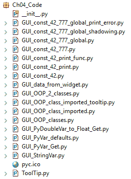

在本章中，我们将使用 Python 3.7 及以上版本的 Python 数据和 OOP 类。我们将涵盖以下食谱：

+   如何使用`StringVar()`

+   如何从一个小部件获取数据

+   使用模块级全局变量

+   如何在类中编码可以提高 GUI

+   编写回调函数

+   创建可重用的 GUI 组件

# 如何使用 StringVar()

`tkinter`中有一些内置的编程类型，与我们习惯编程的 Python 类型略有不同。`StringVar()`就是这样的`tkinter`类型。这个食谱将向你展示如何使用`StringVar()`类型。

# 准备工作

在这个食谱中，你将学习如何将`tkinter` GUI 中的数据保存到变量中，这样我们就可以使用这些数据。我们可以设置和获取它们的值，这与你使用 Java 的`getter`/`setter`方法非常相似。

这里是`tkinter`中的一些代码类型：

| `strVar = StringVar()` | 保存一个字符串；默认值是一个空字符串（`""`） |
| --- | --- |
| `intVar = IntVar()` | 保存一个整数；默认值是`0` |
| `dbVar = DoubleVar()` | 保存一个`float`；默认值是`0.0` |
| `blVar = BooleanVar()` | 保存一个布尔值，对于`False`返回`0`，对于`True`返回`1` |

不同的语言用`float`或`double`来表示小数点后的数字。`tkinter`将它们称为`DoubleVar`，在 Python 中这被称为`float`数据类型。根据精度的不同，`float`和`double`数据可能不同。在这里，我们将`tkinter`的`DoubleVar`转换为 Python 的`float`类型。

当我们添加一个带有 Python `float`的`DoubleVar`并查看生成的类型时，这一点变得更加清晰，它是一个 Python `float`，而不再是`DoubleVar`。

# 如何做呢...

我们将创建一个`tkinter`的`DoubleVar`变量，并使用`+`运算符向其中添加一个`float`数字字面量。之后，我们将查看生成的 Python 类型。

查看不同`tkinter`数据类型的步骤如下：

1.  创建一个新的 Python 模块，并将其命名为`GUI_PyDoubleVar_to_Float_Get.py`。

1.  在`GUI_PyDoubleVar_to_Float_Get.py`模块的顶部导入`tkinter`：

```py
import tkinter as tk
```

1.  创建`tkinter`类的实例：

```py
win = tk.Tk()
```

1.  创建一个`DoubleVar`并给它赋值：

```py
doubleData = tk.DoubleVar()
print(doubleData.get())
doubleData.set(2.4)
print(type(doubleData))

add_doubles = 1.222222222222222222222222 + doubleData.get()
print(add_doubles)
print(type(add_doubles))
```

1.  以下截图显示了最终的`GUI_PyDoubleVar_to_Float_Get.py`代码和运行代码后的输出：


我们可以用`tkinter`对字符串做同样的事情。

我们将按照以下方式创建一个新的 Python 模块：

1.  创建一个新的 Python 模块并将其命名为 `GUI_StringVar.py`。

1.  在 `GUI_StringVar.py` 模块的顶部，导入 `tkinter`：

```py
import tkinter as tk
```

1.  创建 `tkinter` 类的实例：

```py
win = tk.Tk()
```

1.  将 `tkinter` 的 `StringVar` 分配给 `strData` 变量：

```py
strData = tk.StringVar()
```

1.  设置 `strData` 变量：

```py
strData.set('Hello StringVar')
```

1.  获取 `strData` 变量的值并将其保存到 `varData`：

```py
varData = strData.get()
```

1.  打印出 `strData` 的当前值：

```py
print(varData)
```

1.  以下截图显示了最终的 `GUI_StringVar.py` 代码以及运行代码后的输出：

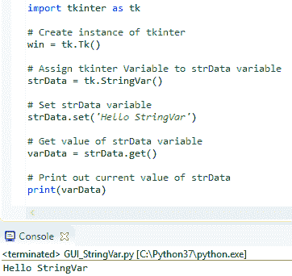

接下来，我们将打印 `tkinter` 的 `IntVar`、`DoubleVar` 和 `BooleanVar` 类型默认值：

1.  打开 `GUI_StringVar.py` 并将模块保存为 `GUI_PyVar_defaults.py`。

1.  在此模块的底部添加以下代码行：

```py
print(tk.IntVar())
print(tk.DoubleVar())
print(tk.BooleanVar())
```

1.  以下截图显示了最终的 `GUI_PyVar_defaults.py` 代码以及运行 `GUI_PyVar_defaults.py` 代码文件后的输出：

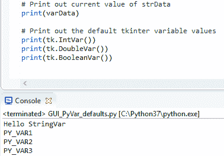

打印默认 `tkinter` 变量值的步骤如下：

1.  创建一个新的 Python 模块并将其命名为 `GUI_PyVar_Get.py`。

1.  将以下代码输入到模块中：

```py
import tkinter as tk
# Create instance of tkinter
win = tk.Tk()
# Print out the default tkinter variable values
intData = tk.IntVar()
print(intData)
print(intData.get())
# Set a breakpoint here to see the values in the debugger
print() 
```

1.  运行代码，可选地在 IDE 中的最终 `print()` 语句处设置断点：

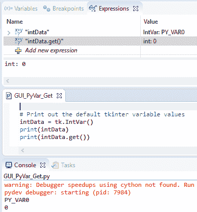

让我们深入了解代码以更好地理解它。

# 它是如何工作的…

在 Eclipse PyDev 控制台中，在 *步骤 8* 的 `GUI_StringVar.py` 的截图底部，我们可以看到打印到控制台的信息，即 Hello StringVar。这表明我们必须调用 `get()` 方法来获取数据。

如 *步骤 3* 中的 `GUI_PyVar_defaults.py` 的截图所示，默认值没有打印出来，正如我们预期的那样，因为我们没有调用 `get()`。

在线文献提到了默认值，但除非我们调用它们的 `get` 方法，否则我们看不到这些值。否则，我们只得到一个自动递增的变量名（例如，`PY_VAR3`，如前述 `GUI_PyVar_defaults.py` 的截图所示）。

将 `tkinter` 类型分配给 Python 变量不会改变结果。我们仍然得不到默认值，直到我们在这个变量上调用 `get()`。

值是 `PY_VAR0`，而不是预期的 `0`，直到我们调用 `get` 方法。现在我们可以看到默认值。我们没有调用 `set`，所以我们看到一旦我们调用每个类型的 `get` 方法，每个 `tkinter` 类型都会自动分配默认值。

注意默认值 `0` 被打印到控制台，这是我们在 `intData` 变量中保存的 `IntVar` 实例。我们还可以在截图顶部的 Eclipse PyDev 调试器窗口中看到这些值。

首先，我们导入`tkinter`模块并将其别名为`tk`。接下来，我们使用这个别名通过在`Tk`后添加括号来创建`Tk`类的实例，这调用类的构造函数。这与调用函数的机制相同；只是在这里，我们创建了一个类的实例。

通常，我们使用分配给`win`变量的这个实例在代码的稍后部分启动主事件循环，但在这里，我们不是显示 GUI；而是在演示如何使用`tkinter`的`StringVar`类型。

我们仍然需要创建一个`Tk()`的实例。如果我们取消注释这一行，我们将从`tkinter`得到一个错误，所以这个调用是必要的。

然后，我们创建一个`StringVar`类型的实例并将其分配给我们的 Python 变量`strData`。之后，我们使用我们的变量来调用`StringVar`上的`set()`方法，在设置值之后，我们获取该值，将其保存在名为`varData`的新变量中，然后打印其值。我们已经成功学习了如何使用`StringVar()`。现在让我们继续下一个菜谱。

# 如何从小部件获取数据

当用户输入数据时，我们想在代码中对其进行处理。这个菜谱展示了如何在变量中捕获数据。在前一个菜谱中，我们创建了几个`tkinter`类变量。它们是独立的。现在，我们将它们连接到我们的 GUI，使用从 GUI 获取的数据，并将它们存储在 Python 变量中。

# 准备工作

我们将继续使用我们在第三章，“外观和感觉定制”中构建的 Python GUI。我们将重用并增强该章节中的`GUI_progressbar.py`代码。

# 如何操作...

我们将 GUI 中的一个值分配给 Python 变量：

1.  打开第三章，“外观和感觉定制”中的`GUI_progressbar.py`，并将其模块保存为`GUI_data_from_widget.py`。

1.  在模块的底部添加以下代码。在主事件循环上方添加`strData`：

```py
strData = spin.get() 
print("Spinbox value: " + strData) 
```

1.  添加代码将光标置于名称输入框中：

```py
name_entered.focus()
```

1.  启动 GUI：

```py
win.mainloop() 
```

1.  运行代码给出以下结果：

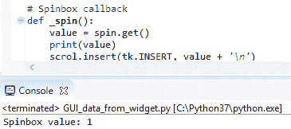

我们将代码放置在 GUI 主事件循环上方，所以打印发生在 GUI 变得可见之前。如果我们想在显示 GUI 并更改`Spinbox`控制器的值之后打印当前值，我们必须将代码放入回调函数中。

我们将检索`Spinbox`控制器的当前值：

1.  我们使用以下代码创建`Spinbox`小部件，并将可用的值硬编码到其中：

```py
# Adding a Spinbox widget using a set of values 
spin = Spinbox(mighty, values=(1, 2, 4, 42, 100), width=5, bd=8, 
command=_spin)  
spin.grid(column=0, row=2) 
```

1.  我们也可以将数据的硬编码从`Spinbox`类实例的创建中移除，并在稍后设置它：

```py
# Adding a Spinbox widget assigning values after creation 
spin = Spinbox(mighty, width=5, bd=8, command=_spin)  
spin['values'] = (1, 2, 4, 42, 100) 
spin.grid(column=0, row=2) 
```

我们如何创建小部件并将数据插入其中并不重要，因为我们可以通过在部件的实例上使用`get()`方法来访问这些数据。

让我们深入了解代码。

# 它是如何工作的...

为了从使用`tkinter`编写的 GUI 中获取值，我们使用我们希望获取值的实例小部件的`get()`方法。

在前面的例子中，我们使用了`Spinbox`控件，但对于所有具有`get()`方法的小部件，原理是相同的。

一旦我们获取了数据，我们就处于纯 Python 的世界，`tkinter`在构建我们的 GUI 方面做得很好。现在我们知道如何从我们的 GUI 中获取数据，我们可以使用这些数据。

我们已经成功学习了如何从小部件获取数据。现在让我们继续下一个菜谱。

# 使用模块级全局变量

封装是任何编程语言的主要优势之一，它使我们能够使用面向对象编程（OOP）进行编程。Python 既面向对象友好，也支持过程式编程。我们可以创建局部于它们所在模块的`global`变量。它们只对这个模块是全局的，这是封装的一种形式。我们为什么想要这样做呢？因为随着我们向 GUI 添加越来越多的功能，我们想要避免可能导致代码中错误的命名冲突。

我们不希望命名冲突在代码中产生错误！命名空间是避免这些错误的一种方法，在 Python 中，我们可以通过使用 Python 模块（这些是非官方的命名空间）来实现。

# 准备工作

我们可以在任何模块的任何函数上方和外部声明模块级**全局变量**。

我们随后必须使用 Python 的`global`关键字来引用它们。如果我们忘记在函数中使用`global`，我们将会意外地创建新的局部变量。这将是一个错误，是我们真的不想做的事情。

Python 是一种动态的强类型语言。我们将在运行时注意到像这样的错误（忘记使用`global`关键字来限定变量的作用域）。

# 如何做到这一点...

将以下代码添加到之前菜谱中使用的 GUI，即*如何从小部件获取数据*，创建一个模块级全局变量。我们使用全部大写约定来表示常量：

你可以在[`www.python.org/dev/peps/pep-0008/#constants`](https://www.python.org/dev/peps/pep-0008/#constants)上的**PEP 8 -- Python 代码风格指南**中找到更多信息。

1.  打开`GUI_data_from_widget.py`并将其模块保存为`GUI_const_42_print.py`。

1.  在模块顶部添加常量变量，并在底部添加`print`语句：

```py
GLOBAL_CONST = 42
# ...
print(GLOBAL_CONST)
```

1.  运行代码会导致打印出`global`。注意 42 被打印到 Eclipse 控制台（`GUI_const_42_print.py`）：

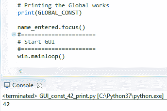

将`usingGlobal`函数添加到模块底部：

1.  打开`GUI_const_42_print.py`并将其模块保存为`GUI_const_42_print_func.py`。

1.  添加函数然后调用它：

```py
def usingGlobal():
    print(GLOBAL_CONST)
# call the function
usingGlobal()
```

1.  以下截图显示了最终的`GUI_const_42_print_func.py`代码和运行代码后的输出：

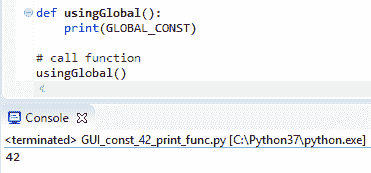

在前面的代码片段中，我们使用了模块级的`global`。很容易通过*遮蔽*全局变量来犯错误，如下面的代码所示：

1.  打开`GUI_const_42_print_func.py`并将模块保存为`GUI_const_42_777.py`。

1.  在函数内添加常量的声明：

```py
def usingGlobal():
    GLOBAL_CONST = 777
    print(GLOBAL_CONST)
```

1.  以下截图显示了最终的`GUI_const_42_777.py`代码和运行代码后的输出：

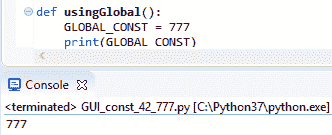

注意 42 变成了 777，尽管我们使用的是相同的变量名。

Python 中没有编译器会警告我们在局部函数中覆盖`全局`变量。这可能导致运行时调试困难。

如果我们尝试在不使用`全局`关键字的情况下打印出全局变量的值，我们会得到一个错误：

1.  打开`GUI_const_42_777.py`并将模块保存为`GUI_const_42_777_global_print_error.py`。

1.  注释掉`全局`并尝试打印：

```py
def usingGlobal():
    # global GLOBAL_CONST
    print(GLOBAL_CONST)
    GLOBAL_CONST = 777
    print(GLOBAL_CONST)
```

1.  运行代码并观察输出：

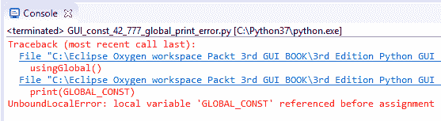

当我们使用`全局`关键字限定我们的局部变量时，我们可以打印出`全局`变量的值并局部覆盖此值：

1.  打开`GUI_const_42_777_global.py`。

1.  添加以下代码：

```py
def usingGlobal():
    global GLOBAL_CONST
    print(GLOVAL_CONST)
    GLOBAL_CONST = 777
    print(GLOBAL_CONST)
```

1.  运行代码并观察输出：


我们可能认为全局变量的值仅限于我们的函数。

1.  打开`GUI_const_42_777_global.py`并将其保存为`GUI_const_42_777_global_shadowing.py`。

1.  在函数下方添加`print('GLOBAL_CONST:', GLOBAL_CONS``T)`。

1.  运行代码并观察输出：

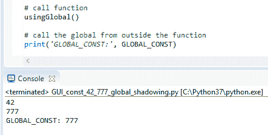

让我们深入了解代码，以更好地理解它。

# 它是如何工作的…

我们在模块的顶部定义了一个`全局`变量，并在模块的底部打印出它的值。

这有效。然后我们定义一个函数，并使用`全局`关键字在函数内打印出`全局`变量的值。如果我们忘记使用`全局`关键字，我们正在创建一个新的、局部的变量。当我们更改函数内全局变量的值时，这实际上会改变全局变量。正如我们所看到的，即使在我们的函数之外，全局值也发生了变化。

在编写小型应用程序时，`全局`变量非常有用。它们可以帮助我们在同一 Python 模块内的方法和函数之间共享数据，有时，面向对象的额外开销是不必要的。

随着我们的程序变得越来越复杂，使用全局变量的好处可能会迅速减少。

最好避免使用全局变量，并通过在不同作用域中使用相同的名称意外地覆盖变量。我们可以使用面向对象编程而不是使用全局变量。

我们在过程式代码中玩弄过`全局`变量，并了解到它可能导致难以调试的错误。在下一个菜谱中，我们将转向面向对象编程，这可以消除此类错误。

# 如何通过类编程改进 GUI

到目前为止，我们一直在以过程式风格编写代码。这是我们可以用 Python 做的快速脚本方法。当我们的代码变得越来越大时，我们需要转向面向对象编程。

为什么？

因为，在许多其他好处中，面向对象编程（OOP）允许我们通过使用方法来移动代码。一旦我们使用了类，我们就不再需要物理地将代码放在调用它的代码上方。这给了我们在组织代码方面很大的灵活性。我们可以将相关代码写在与其他代码相邻的位置，并且不再需要担心代码无法运行，因为代码没有放在调用它的代码上方。我们可以通过编写引用该模块中未创建的方法的模块来达到一些相当高级的效果。它们依赖于在代码运行时已经创建了这些方法。

如果我们调用的方法那时还没有被创建，我们会得到一个运行时错误。

# 准备工作

我们将非常简单地把我们整个过程性代码转换为面向对象编程。我们只需将其转换为一个类，缩进所有现有代码，并将 `self` 前缀添加到所有变量上。

这非常简单。

虽然一开始可能觉得需要在每件事前都加上 `self` 关键字有点烦人，这使得我们的代码更加冗长（<q>嘿，我们浪费了这么多纸张…</q>），但最终这是值得的。

# 如何做到这一点…

注意，在 Eclipse IDE 中，PyDev 编辑器通过在代码编辑器的右侧部分用红色突出显示来提示编码问题。

1.  打开 `GUI_const_42_777_global.py` 并将模块保存为 `GUI_OOP_classes.py`。

1.  高亮显示导入下面的整个代码，并缩进四个空格。

1.  在缩进的代码上方添加 `class OOP():`。

1.  看看右侧代码编辑器中所有的红色错误：

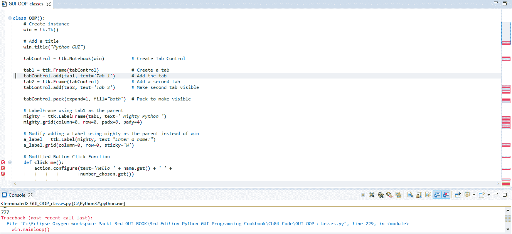

我们必须将所有变量都加上 `self` 关键字，并且通过使用 `self` 将函数绑定到类上，这在官方和技术上正式地将函数转换为方法。

让我们用 `self` 前缀来修复所有的红色错误，这样我们就可以再次运行我们的代码：

1.  打开 `GUI_OOP_classes.py` 并将模块保存为 `GUI_OOP_2_classes.py`。

1.  在需要的地方添加 `self` 关键字，例如，`click_me(self)`。

1.  运行代码并观察它：

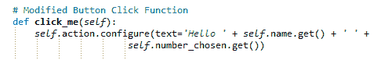

一旦我们为所有高亮的红色错误做了这件事，我们就可以再次运行我们的 Python 代码。`click_me` 函数现在绑定到了类上，并正式成为了一个方法。我们不再得到任何阻止代码运行的错误。

现在，让我们将来自 第三章，*外观和感觉定制* 的 `ToolTip` 类添加到这个 Python 模块中：

1.  打开 `GUI_OOP_2_classes.py`。

1.  将 `GUI_tooltip.py` 中的 `ToolTip` 类添加到以下模块的 `import` 语句的顶部：

```py
class ToolTip(object):
    def __init__(self, widget, tip_text=None):
        self.widget = widget
 ...
class OOP():
    def __init__(self): 
        self.win = tk.Tk() 
        ToolTip(self.win, 'Hello GUI')
        # <-- use the ToolTip class here
 ...
```

让我们深入幕后，更好地理解代码。

# 它是如何工作的…

我们正在将过程代码转换为面向对象的代码。首先，我们缩进整个代码，并定义代码是类的一部分，我们将其命名为`OOP`。为了使这可行，我们必须使用`self`关键字来表示变量和方法。以下是我们的旧代码与使用类的新 OOP 代码的简要比较：

```py
########################################
# Our procedural code looked like this:
########################################
# Button Click Function
def click_me(): 
    action.configure(text='Hello ' + name.get() + ' ' + 
    number_chosen.get())

# Adding a Textbox Entry widget
name = tk.StringVar()
name_entered = ttk.Entry(mighty, width=12, textvariable=name)
name_entered.grid(column=0, row=1, sticky='W') 

# Adding a Button
action = ttk.Button(mighty, text="Click Me!", command=click_me) 
action.grid(column=2, row=1) 

ttk.Label(mighty, text="Choose a number:").grid(column=1, row=0)
number = tk.StringVar()
number_chosen = ttk.Combobox(mighty, width=12, 
textvariable=number, state='readonly')
number_chosen['values'] = (1, 2, 4, 42, 100)
number_chosen.grid(column=1, row=1)
number_chosen.current(0)
# ...

******************************************** 
The new OOP code looks like this: 
********************************************
class OOP(): 
    def __init__(self):                # Initializer method
        # Create instance 
        self.win = tk.Tk()             # notice the self keyword

        ToolTip(self.win, 'Hello GUI')
        # Add a title        
        self.win.title("Python GUI")       
        self.create_widgets() 

    # Button callback 
    def click_me(self): 
        self.action.configure(text='Hello ' + self.name.get() + ' ' 
        +self.number_chosen.get()) 
        # ... more callback methods  

    def create_widgets(self):     
        # Create Tab Control 
        tabControl = ttk.Notebook(self.win)     
        tab1 = ttk.Frame(tabControl)            # Create a tab  
        tabControl.add(tab1, text='Tab 1')      # Add the tab 
        tab2 = ttk.Frame(tabControl)           # Create second tab 
        tabControl.add(tab2, text='Tab 2')      # Add second tab 
        # Pack to make visible 
        tabControl.pack(expand=1, fill="both")  

        # Adding a Textbox Entry widget - using self
        self.name = tk.StringVar()
        name_entered = ttk.Entry(mighty, width=12, 
        textvariable=self.name)
        name_entered.grid(column=0, row=1, sticky='W') 
        # Adding a Button - using self
        self.action = ttk.Button(mighty, text="Click Me!", 
        command=self.click_me) 
        self.action.grid(column=2, row=1)
        # ...
#====================== 
# Start GUI 
#====================== 
oop = OOP()    # create an instance of the class
               # use instance variable to call mainloop via oop.win
oop.win.mainloop()   
```

我们将回调方法移动到模块顶部，在新的`OOP`类内部。我们将所有小部件创建代码移动到一个相当长的`create_widgets`方法中，我们在类的初始化器中调用这个方法。技术上，在底层代码的深处，Python 确实有一个构造函数，但 Python 让我们免除了对此类问题的担忧。它由我们负责。除了真正的构造函数之外，Python 还为我们提供了一个初始化器，`__init__(self)`。我们强烈建议使用这个初始化器。我们可以用它向我们的类传递参数，初始化我们希望在类实例内部使用的变量。

最后，我们在模块顶部添加了`ToolTip`类，紧位于`import`语句之下。

在 Python 中，同一个 Python 模块中可以存在多个类，并且模块名称不必与类名称相同。

在这个菜谱中，我们可以看到，同一个 Python 模块中可以存在多个类。

确实很酷！以下是两个同一模块中驻留的两个类的屏幕截图：

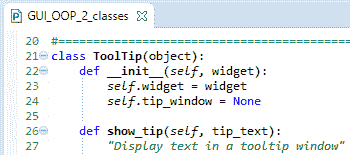

`ToolTip`类和`OOP`类都位于同一个 Python 模块`GUI_OOP_2_classes.py`中：

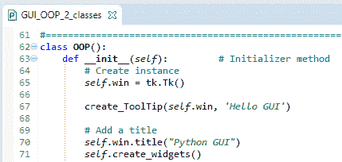

在这个菜谱中，我们将我们的过程代码提升到了面向对象的代码。Python 使我们能够以实用和过程式的方式编写代码，就像 C 编程语言风格一样。同时，我们有选择以面向对象的方式编码的选项，就像 Java、C#和 C++风格一样。

我们已经成功地学习了如何在类中编码可以改进 GUI。现在让我们继续下一个菜谱。

# 编写回调函数

最初，回调函数可能看起来有点令人畏惧。你调用函数，传递一些参数，然后函数告诉你它真的很忙，它将回叫你！

你可能会想：这个函数会回叫我吗？我需要等多久？在 Python 中，即使是回调函数也很容易，是的，它们通常会回叫你。它们只是必须首先完成分配的任务（“嘿，是你最初编写它们的…”）。

让我们更深入地了解一下，当我们把回调函数编码到我们的 GUI 中时会发生什么。我们的 GUI 是事件驱动的。创建并显示在屏幕上后，它通常就坐在那里等待事件发生。它基本上是在等待一个事件发送给它。我们可以通过点击其按钮之一来向我们的 GUI 发送一个事件。这创建了一个事件，从某种意义上说，我们通过发送消息来调用我们的 GUI。

现在，在我们向我们的 GUI 发送消息后，会发生什么？点击按钮后会发生什么取决于我们是否创建了一个事件处理程序并将其与该按钮关联。如果我们没有创建事件处理程序，点击按钮将没有任何效果。事件处理程序是一个回调函数（或方法，如果我们使用类）。回调方法也像我们的 GUI 一样被动地等待被调用。一旦我们的 GUI 的按钮被点击，它将调用回调。

回调通常执行一些处理，完成后将结果返回到我们的 GUI。

在某种程度上，我们可以看到我们的回调函数正在调用我们的 GUI。

# 准备工作

Python 解释器会遍历模块中的所有代码一次，寻找任何语法错误并指出。如果你的语法不正确，你无法运行你的 Python 代码。这包括缩进（如果不导致语法错误，不正确的缩进通常会导致错误）。

在下一个解析循环中，解释器解析我们的代码并运行它。

在运行时，可以生成许多 GUI 事件，通常回调函数会给 GUI 小部件添加功能。

# 如何做到这一点……

这里是 `Spinbox` 小部件的回调：

1.  打开 `GUI_OOP_2_classes.py` 文件。

1.  观察代码中的 `_spin(self)` 方法：

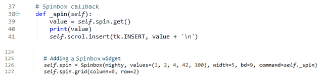

让我们深入了解代码，以更好地理解它。

# 它是如何工作的……

我们在 `OOP` 类中创建一个回调方法，当我们在 `Spinbox` 小部件中选择一个值时会被调用，因为我们通过 `command` 参数（`command=self._spin`）将方法绑定到小部件。我们使用前导下划线来暗示这个方法意味着要像私有 Java 方法一样被尊重。

Python 故意避免了语言限制，例如私有、公有、友元等。在 Python 中，我们使用命名约定。围绕关键字的前后双下划线通常被期望是 Python 语言的限制，并且我们期望不在自己的 Python 代码中使用它们。

然而，我们可以使用前导下划线前缀与变量名或函数来提供提示，表明这个名称意味着要像私有辅助程序一样被尊重。

同时，如果我们希望使用否则将是内置 Python 名称的名称，我们可以后缀一个单下划线。例如，如果我们想缩短列表的长度，我们可以这样做：

```py
len_ = len(aList) 
```

通常，下划线难以阅读且容易忽略，所以在实践中这可能不是最好的主意。

我们已经成功学习了如何编写回调函数。现在让我们继续下一个配方。

# 创建可重用的 GUI 组件

我们将使用 Python 创建可重用的 GUI 组件。在这个配方中，我们将通过将我们的 `ToolTip` 类移动到其自己的模块中来保持简单。然后，我们将导入并使用它来显示 GUI 中几个小部件的工具提示。

# 准备工作

我们正在从第三章，*外观和感觉定制*：`GUI_tooltip.py`构建我们的代码。我们将首先将我们的`ToolTip`类分离到一个单独的 Python 模块中。

# 如何做到这一点…

我们将创建一个新的 Python 模块，并将`ToolTip`类的代码放入其中，然后将其导入到我们的主模块中：

1.  打开`GUI_OOP_2_classes.py`并将模块保存为`GUI_OOP_class_imported_tooltip.py`。

1.  将`GUI_tooltip.py`中的`ToolTip`代码分离到一个新的 Python 模块中，并命名为`ToolTip.py`。

1.  将`ToolTip`类导入到`GUI_OOP_class_imported_tooltip.py`：

```py
from Ch04_Code.ToolTip import ToolTip
```

1.  将以下代码添加到`GUI_OOP_class_imported_tooltip.py`：

```py
ToolTip(self.win, 'Hello GUI')

# Add a ToolTip to the Spinbox
ToolTip(self.spin, 'This is a Spinbox control') 

# Add tooltips to more widgets
ToolTip(self.name_entered, 'This is an Entry control') 
ToolTip(self.action, 'This is a Button control') 
ToolTip(self.scrol, 'This is a ScrolledText control') 

# Tab 2
ToolTip(curRad, 'This is a Radiobutton control')
```

1.  运行代码并将鼠标悬停在不同的小部件上：

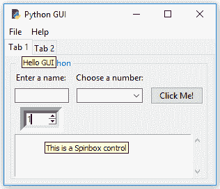

这也适用于第二个标签页：

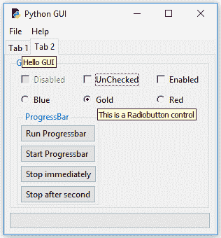

让我们深入幕后，更好地理解代码。

# 它是如何工作的…

首先，我们创建了一个新的 Python 模块，并将`ToolTip`类放入这个新模块中。然后，我们将这个`ToolTip`类导入到另一个 Python 模块中。之后，我们使用这个类创建了几个工具提示。

在前面的截图中，我们可以看到几个`ToolTip`消息正在显示。对于主窗口的工具提示可能会显得有点烦人，所以最好不为主窗口显示`ToolTip`，因为我们真的希望突出各个小部件的功能。主窗口表单有一个标题来解释其目的；不需要`ToolTip`。

将我们共同的`ToolTip`类代码重构到它自己的模块中，有助于我们从其他模块重用这段代码。而不是复制/粘贴/修改，我们使用**DRY**原则，并且我们的共同代码只位于一个地方，所以当我们修改代码时，所有导入它的模块都将自动获取我们模块的最新版本。

**DRY**代表**不要重复自己**，我们将在后面的章节中再次讨论它。我们可以通过将我们的 Tab 3 图像转换成一个可重用组件来做类似的事情。为了使这个菜谱的代码简单，我们移除了 Tab 3，但你可以在前一章的代码上进行实验。
