# 第五章：Matplotlib 图表

在本章中，我们将创建美观的图表，这些图表可以直观地表示数据。根据数据源的格式，我们可以在同一图表中绘制一个或多个数据列。

我们将使用 Python 的`Matplotlib`模块来创建我们的图表。

在我工作的一家公司，我们有一个现有的用于收集分析数据的程序。这是一个手动过程，需要将数据加载到 Excel 中，然后在 Excel 中生成图表。

我使用 Python 和`Matplotlib`自动化了整个流程。只需点击一下鼠标，数据就会被备份到网络驱动器上，再点击一下，图表就会自动创建。

为了创建这些图形图表，我们需要下载额外的 Python 模块，并且有几种安装方法。

本章将解释如何下载`Matplotlib`Python 模块以及所有其他必需的 Python 模块和下载方法。在我们安装所需的模块后，我们将创建自己的 Python 图表。

可视化表示数据使我们的 GUI 非常实用且外观出色，并极大地提高了你的编码技能。对于你的管理团队来说，用可视化方式表示数据也非常有用。

下面是本章中 Python 模块的概述：

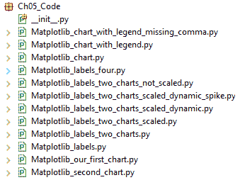

在本章中，我们将使用 Python 3.7 及以上版本和`Matplotlib`模块创建美观的图表。

以下 URL，[`matplotlib.org/users/screenshots.html`](http://matplotlib.org/users/screenshots.html)，是一个开始探索`Matplotlib`世界的绝佳地方，它教我们如何创建本章未展示的许多图表。

我们将介绍以下食谱：

+   使用 pip 和`.whl`扩展安装 Matplotlib

+   创建我们的第一个图表

+   在图表上放置标签

+   如何给图表添加图例

+   调整图表的比例

+   动态调整图表的比例

# 使用 pip 和`.whl`扩展安装 Matplotlib

下载额外的 Python 模块的常用方法是使用`pip`。`pip`模块是预安装在 Python 最新版本（3.7 及以上）中的。

如果你使用的是较旧的 Python 版本，你可能需要自己下载`pip`和`setuptools`。

这个食谱将展示如何成功使用`pip`安装`Matplotlib`。我们将使用`.whl`扩展名进行此安装，因此这个食谱还将向你展示如何安装`wheel`模块。

# 准备工作

首先，让我们找出你是否已经安装了`wheel`模块。`wheel`模块是下载和安装具有`.whl`扩展名的 Python 包所必需的。

我们可以使用`pip`找出我们目前安装了哪些模块。

从 Windows 命令提示符中运行`pip list`命令：

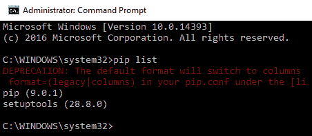

如果你运行此命令时遇到错误，你可能需要检查 Python 是否在你的环境路径上。如果目前不在，可以通过点击 Edit... 按钮将其添加到系统变量 | 路径（左下角）。然后，点击新建按钮（右上角）并输入你的 Python 安装路径。此外，添加 `C:\Python37\Scripts` 目录，因为 `pip.exe` 文件就位于那里：

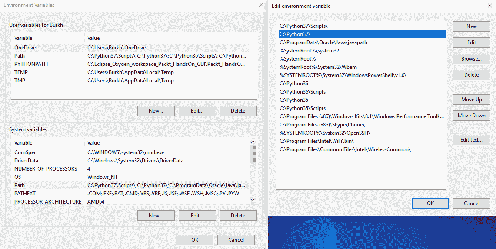

如果你安装了多个版本的 Python，将 Python 3.7 移到列表的顶部是个好主意。当我们输入 `pip install <module>` 时，可能会使用在 *系统变量* | **路径** 中找到的第一个版本，如果 Python 3.7 之上的版本较旧，你可能会遇到一些意外的错误。

让我们运行 `pip install wheel` 并然后使用 `pip list` 验证它是否已成功安装：

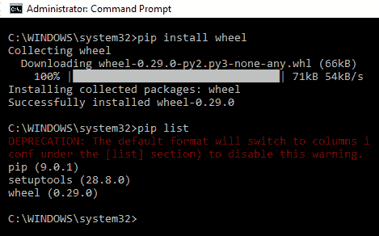

如果运行 `pip list` 没有显示 `wheel`，尝试在命令提示符中简单地输入 `wheel`。这假设你已经正确设置了你的 Python 路径：

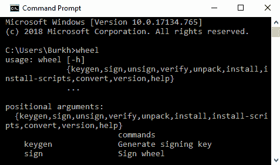

如果你真的非常习惯使用 Python 2.7 并坚持在 Python 2.7 中运行代码，你可以尝试这个技巧。在一切与 Python 3.7 一起正常工作后，你可以将 3.7 的 `python.exe` 重命名为 `python3.exe`，然后通过在命令窗口中输入 `python.exe` 或 `python3.exe` 来运行不同的 Python 可执行文件，享受使用 2.7 和 3.7 的乐趣。这是一个技巧。

如果你真的希望继续这条路，那就由你自己来，但它是可行的。

# 如何操作...

在安装了 `wheel` 模块之后，我们现在可以继续从 [`www.lfd.uci.edu/~gohlke/pythonlibs/`](http://www.lfd.uci.edu/~gohlke/pythonlibs/) 下载并安装 `Matplotlib`。

1.  将匹配的 `Matplotlib` 轮子下载到你的硬盘上：

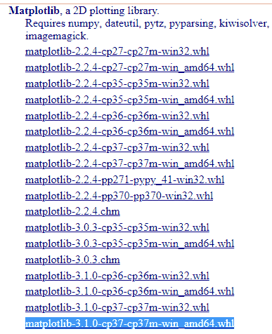

1.  打开命令提示符并运行 `pip install <matplotlib wheel>`，如下所示：

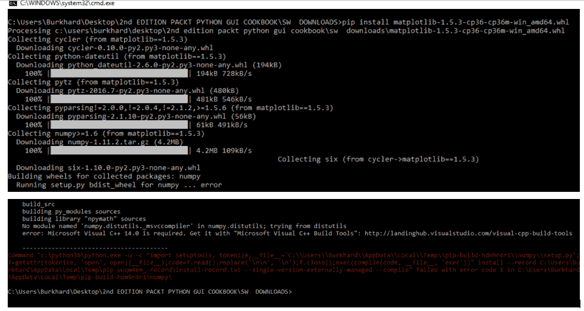

1.  如果你遇到前面的错误，请下载 Microsoft Visual C++ Build Tools 并从 [`visualstudio.microsoft.com/visual-cpp-build-tools/`](https://visualstudio.microsoft.com/visual-cpp-build-tools/) 安装它们：


开始安装 Microsoft Visual C++ Build Tools 的界面如下所示：


1.  如果遇到前面的错误，请重新运行 `Matplotlib` 安装，使用 `pip install`：

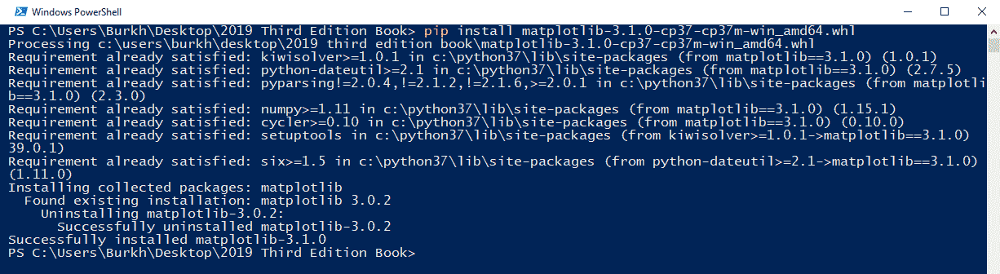

1.  通过查看 `site-packages` 文件夹来验证安装是否成功：

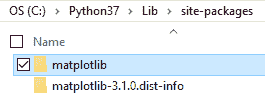

让我们现在深入了解安装过程。

# 它是如何工作的...

下载 wheel 安装程序后，我们现在可以使用 `pip` 安装 `Matplotlib` 轮子。

在*步骤 1*中，确保你下载并安装与你的 Python 版本匹配的`Matplotlib`版本。例如，如果你在 64 位操作系统（如 Microsoft Windows 10）上安装了 Python 3.7，请下载并安装`matplotlib-3.1.0-cp37-cp37m-win_amd64.whl`。

可执行文件名中间的`amd64`表示你正在安装 64 位版本。如果你使用的是 32 位 x86 系统，那么安装`amd64`将不会工作。如果你已经安装了 32 位版本的 Python 并下载了 64 位 Python 模块，也可能出现类似的问题。

根据你已经在系统上安装的内容，运行`pip install matplotlib-3.1.0-cp37-cp37m-win_amd64.whl`命令可能一开始运行正常，但可能无法完成。参考*步骤 2*中的前一个截图，了解安装过程中可能发生的情况。安装遇到了错误。解决这个问题的方法是下载并安装**Microsoft Visual C++构建工具**，我们在*步骤 3*中从错误消息中提到的网站进行安装([`visualstudio.microsoft.com/visual-cpp-build-tools/`](https://visualstudio.microsoft.com/visual-cpp-build-tools/))。

如果你安装 Microsoft Visual C++构建工具时遇到任何问题，这里有一个来自 Stack Overflow 的有用答案：[`stackoverflow.com/a/54136652`](https://stackoverflow.com/a/54136652)。还有一条链接到 MS：[`devblogs.microsoft.com/cppblog/announcing-visual-c-build-tools-2015-standalone-c-tools-for-build-environments/`](https://devblogs.microsoft.com/cppblog/announcing-visual-c-build-tools-2015-standalone-c-tools-for-build-environments/)。

在我们成功安装构建工具后，现在我们可以重新运行我们的`Matplotlib`安装，完成*步骤 4*。只需输入我们在*步骤 2*中之前使用的相同的`pip install`命令。

我们可以通过查看我们的 Python 安装目录来验证是否已成功安装`Matplotlib`，这是我们在*步骤 5*中做的。安装成功后，`Matplotlib`文件夹会被添加到`site-packages`中。根据我们安装 Python 的位置，Windows 上`site-packages`文件夹的完整路径可能是`..\Python37\Lib\site-packages`。

如果你看到`matplotlib`文件夹被添加到你的 Python 安装目录中的`site-packages`文件夹，那么你已经成功安装了`Matplotlib`。

使用`pip`安装 Python 模块通常非常简单，尽管你可能会遇到一些意想不到的问题。遵循前面的步骤，你的安装将会成功。

让我们继续到下一个示例。

# 创建我们的第一个图表

现在我们已经安装了所有必需的 Python 模块，我们可以使用`Matplotlib`创建自己的图表。

我们可以用几行 Python 代码创建图表。

# 准备工作

如前一个示例所示，成功安装`Matplotlib`是这个步骤的要求。

# 如何操作…

使用最少的代码，我们可以创建我们的第一个`Matplotlib`图表。

对于第一个图表，步骤如下：

1.  创建一个新的 Python 模块并将其保存为`Matplotlib_our_first_chart.py`。

1.  将以下代码输入到模块中：

```py
import matplotlib.pyplot as plt
from pylab import show

x_values = [1,2,3,4] 
y_values = [5,7,6,8] 
plt.plot(x_values, y_values)
show()
```

1.  运行代码以查看以下图表：

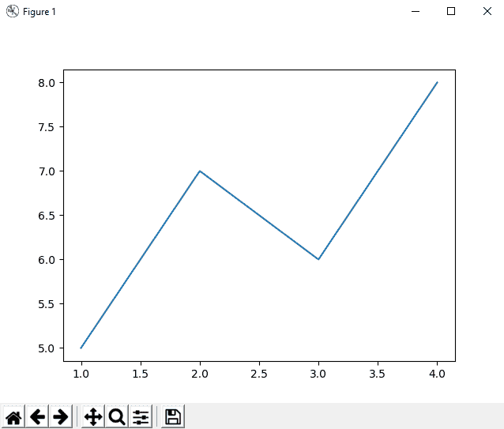

让我们现在深入了解代码。

# 它是如何工作的…

首先，我们导入`matplotlib.pyplot`并将其别名为`plt`。然后我们创建两个列表来存储我们的*x*和*y*值。然后我们将这两个列表传递给`plt`或`plot`函数。

我们还从`pylab`导入`show`并调用它以显示我们的图表。

注意，这会自动为我们创建一个 GUI，甚至包括一些按钮。

在左下角的按钮上试一试，因为它们完全可用。

注意，*x*轴和*y*轴会自动缩放以显示我们的*x*和*y*值的范围。

# 更多内容…

Python 的`Matplotlib`模块，结合`numpy`等附加组件，创建了一个非常丰富的编程环境，使我们能够轻松执行数学计算并在视觉图表中绘制它们。

现在，让我们继续下一个菜谱。

# 在图表上放置标签

到目前为止，我们已经使用了默认的`Matplotlib` GUI。现在，我们将创建一些`tkinter` GUI，我们将使用`Matplotlib`。

这将需要更多行 Python 代码和一些库的导入，但这值得努力，因为我们正在通过画布来控制我们的画作。

我们将在水平和垂直轴（即*x*和*y*）上放置标签。我们将通过创建一个我们将绘制到其中的`Matplotlib`图来做到这一点。

你还将学习如何使用子图，这将使你能够在同一个 GUI 窗口中绘制多个图表。

# 准备工作

在安装了必要的 Python 模块并知道如何找到官方在线文档和教程后，我们现在可以继续创建`Matplotlib`图表。

# 如何做到这一点…

虽然`plot`是创建`Matplotlib`图表的最简单方法，但使用`Figure`与`Canvas`结合创建的图表更加定制化，看起来更好，还使我们能够向其添加按钮和其他小部件：

1.  创建一个新的 Python 模块并将其保存为`Matplotlib_labels.py`。

1.  将以下代码输入到模块中：

```py
from matplotlib.figure import Figure 
from matplotlib.backends.backend_tkagg import FigureCanvasTkAgg 
import tkinter as tk 
#-------------------------------------------------------------- 
fig = Figure(figsize=(12, 8), facecolor='white') 
#-------------------------------------------------------------- 
# axis = fig.add_subplot(111) # 1 row, 1 column, only graph   #<-- uncomment
axis = fig.add_subplot(211) # 2 rows, 1 column, Top graph 
#-------------------------------------------------------------- 
```

1.  在上一段代码下方添加以下代码：

```py
xValues = [1,2,3,4] 
yValues = [5,7,6,8] 
axis.plot(xValues, yValues) 
axis.set_xlabel('Horizontal Label') 
axis.set_ylabel('Vertical Label') 
# axis.grid()                                 # default line style
axis.grid(linestyle='-')                      # solid grid lines 
```

1.  接下来，在上一段代码下方添加以下代码：

```py
#-------------------------------------------------------------- 
def _destroyWindow(): 
    root.quit() 
    root.destroy() 
#-------------------------------------------------------------- 
root = tk.Tk() 
root.protocol('WM_DELETE_WINDOW', _destroyWindow) 
#-------------------------------------------------------------- 
```

1.  现在，在上一段代码下方添加以下代码：

```py
canvas = FigureCanvasTkAgg(fig, master=root) 
canvas._tkcanvas.pack(side=tk.TOP, fill=tk.BOTH, expand=1) 
#-------------------------------------------------------------- 
root.mainloop()
```

1.  运行前面的代码将生成以下图表：

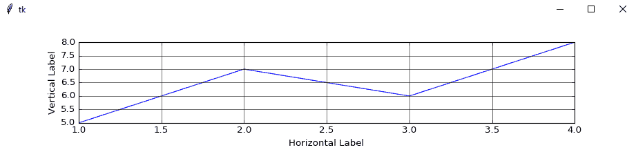

现在，让我们处理一个新的模块：

1.  创建一个新的模块并将其保存为`Matplotlib_labels_four.py`。

1.  将以下新代码输入到模块中：

```py
# imports and figure are the same as in the previous code
#-------------------------------------------------------------- 
axis1 = fig.add_subplot(221)
axis2 = fig.add_subplot(222, sharex=axis1, sharey=axis1)
axis3 = fig.add_subplot(223, sharex=axis1, sharey=axis1)
axis4 = fig.add_subplot(224, sharex=axis1, sharey=axis1)
#-------------------------------------------------------------- 
axis1.plot(xValues, yValues) 
axis1.set_xlabel('Horizontal Label 1') 
axis1.set_ylabel('Vertical Label 1') 
axis1.grid(linestyle='-') # solid grid lines 
#-------------------------------------------------------------- 
axis2.plot(xValues, yValues) 
axis2.set_xlabel('Horizontal Label 2') 
axis2.set_ylabel('Vertical Label 2') 
axis2.grid(linestyle='-') # solid grid lines 
#-------------------------------------------------------------- 
axis3.plot(xValues, yValues) 
axis3.set_xlabel('Horizontal Label3') 
axis3.set_ylabel('Vertical Label 3') 
axis3.grid(linestyle='-') # solid grid lines 
#-------------------------------------------------------------- 
axis4.plot(xValues, yValues) 
axis4.set_xlabel('Horizontal Label 4') 
axis4.set_ylabel('Vertical Label 4') 
axis4.grid(linestyle='-') # solid grid lines 
#-------------------------------------------------------------- 
# root and canvas are the same as in the previous code
```

1.  运行代码将创建以下图表：

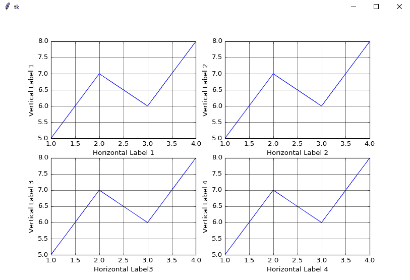

我们可以通过使用`add_subplot(212)`将子图分配到第二个位置来添加更多子图：

1.  创建一个新的模块并将其保存为`Matplotlib_labels_two_charts.py`。

1.  将以下代码输入到模块中：

```py
# imports and figure are the same as in the previous code
#--------------------------------------------------------------
    #-------------------------------------------------------------- 
    axis = fig.add_subplot(211) # 2 rows, 1 column, Top graph 
    #-------------------------------------------------------------- 
    xValues = [1,2,3,4] 
    yValues = [5,7,6,8] 
    axis.plot(xValues, yValues) 
    axis.set_xlabel('Horizontal Label') 
    axis.set_ylabel('Vertical Label') 
    axis.grid(linestyle='-')     # solid grid lines 
    #-------------------------------------------------------------- 
    axis1 = fig.add_subplot(212) # 2 rows, 1 column, Bottom graph 
    #-------------------------------------------------------------- 
    xValues1 = [1,2,3,4] 
    yValues1 = [7,5,8,6] 
    axis1.plot(xValues1, yValues1) 
    axis1.grid()                 # default line style  
    #-------------------------------------------------------------- 
#-------------------------------------------------------------- 
# root and canvas are the same as in the previous code
```

1.  运行代码以查看以下图表：

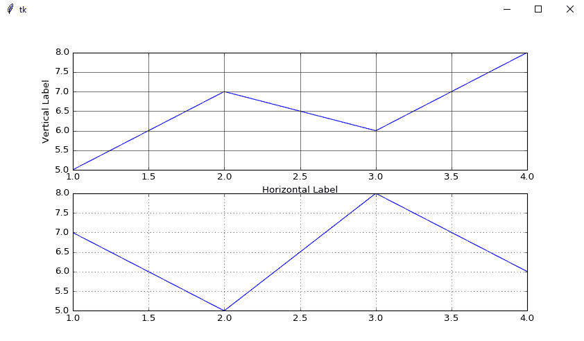

现在，让我们幕后了解代码以更好地理解它。

# 它是如何工作的...

在`Matplotlib_labels.py`的第一行代码中，在**步骤 2**之后，我们创建了一个`Figure`对象的实例。

这里是官方文档的链接：[`matplotlib.org/3.1.1/api/_as_gen/matplotlib.figure.Figure.html#matplotlib.figure.Figure.add_subplot`](https://matplotlib.org/3.1.1/api/_as_gen/matplotlib.figure.Figure.html#matplotlib.figure.Figure.add_subplot)。

接下来，我们通过调用`add_subplot(211)`向这个图表添加子图。

`211`中的第一个数字告诉图表*添加多少个绘图*，第二个数字确定*列数*，第三个告诉图表*显示绘图的顺序*。

在**步骤 3**中，我们创建值，绘制它们，并且我们还添加了一个网格并更改了其默认的线条样式。

尽管我们在图表中只显示一个绘图，但通过将子图数量选择为`2`，我们将绘图向上移动，这导致图表底部出现额外的空白空间。这个第一个绘图现在只占用屏幕的 50%，这影响了显示时该绘图网格线的大小。

通过取消注释`axis =`和`axis.grid()`的代码来实验代码，以查看不同的效果。你还得在每个代码下方取消注释原始行。

在**步骤 4**中，我们创建一个回调函数，当点击红色 X 按钮时，正确退出`tkinter` GUI。我们创建一个`tkinter`实例并将回调分配给`root`变量。

在**步骤 5**中，我们创建了一个画布并使用`pack`几何管理器，然后我们开始主窗口 GUI 事件循环。

在 S*步骤 6*中运行整个代码然后创建图表。

我们可以在同一个画布上放置多个图表。在`Matplotlib_labels_four.py`中，大部分代码与`Matplotlib_labels.py`相同。我们正在创建四个坐标轴并将它们定位在两行中。

重要的是要注意，我们创建了一个坐标轴，然后将其用作图表内其他图形的共享*x*和*y*坐标轴。这样，我们可以实现类似数据库的图表布局。

在`Matplotlib_labels_two_charts.py`中，现在运行代码将`axis1`添加到图表中。对于底部图表的网格，我们保留了默认的线条样式。与之前的图表相比，主要的不同之处在于我们使用`add_subplot(212)`将第二个图表分配到第二个位置。

这意味着：2 行，1 列，此图表的位置 2，这意味着它位于第二行，因为只有一列。

现在，让我们继续到下一个食谱。

# 如何给图表添加图例

一旦我们开始绘制多于一条的数据点线，事情可能会变得有点不清楚。通过在我们的图表中添加图例，我们可以识别数据，并了解它的实际含义。

我们不必选择不同的颜色来表示不同的数据。`Matplotlib`自动为每个数据点分配不同的颜色。

我们要做的只是创建图表并为其添加图例。

# 准备工作

在这个菜谱中，我们将增强前一个菜谱*在图表上放置标签*中的图表。我们将只绘制一个图表。

# 如何做到这一点…

首先，我们将在同一张图表上绘制更多数据行，然后我们将在图表上添加一个图例。

1.  创建一个新的模块并将其保存为`Matplotlib_chart_with_legend.py`。

1.  将以下代码输入到模块中：

```py
from matplotlib.figure import Figure 
from matplotlib.backends.backend_tkagg import FigureCanvasTkAgg 
import tkinter as tk 
#-------------------------------------------------------------- 
fig = Figure(figsize=(12, 5), facecolor='white') 
#-------------------------------------------------------------- 
```

1.  在前面的代码下方添加以下代码：

```py
axis = fig.add_subplot(111) # 1 row, 1 column  

xValues = [1,2,3,4] 
yValues0 = [6,7.5,8,7.5] 
yValues1 = [5.5,6.5,8,6] 
yValues2 = [6.5,7,8,7] 

t0, = axis.plot(xValues, yValues0) 
t1, = axis.plot(xValues, yValues1) 
t2, = axis.plot(xValues, yValues2) 

axis.set_ylabel('Vertical Label') 
axis.set_xlabel('Horizontal Label') 
axis.grid() 

fig.legend((t0, t1, t2), ('First line', 'Second line', 'Third 
 line'), 'upper right') 
#-------------------------------------------------------------- 
```

1.  接下来，在前面代码下方添加以下代码：

```py
def _destroyWindow(): 
    root.quit() 
    root.destroy() 
#-------------------------------------------------------------- 
root = tk.Tk() 
root.protocol('WM_DELETE_WINDOW', _destroyWindow) 
#-------------------------------------------------------------- 
canvas = FigureCanvasTkAgg(fig, master=root) 
canvas._tkcanvas.pack(side=tk.TOP, fill=tk.BOTH, expand=1) 
#-------------------------------------------------------------- 
root.mainloop()
```

1.  运行代码创建以下图表，该图表在右上角有一个图例：

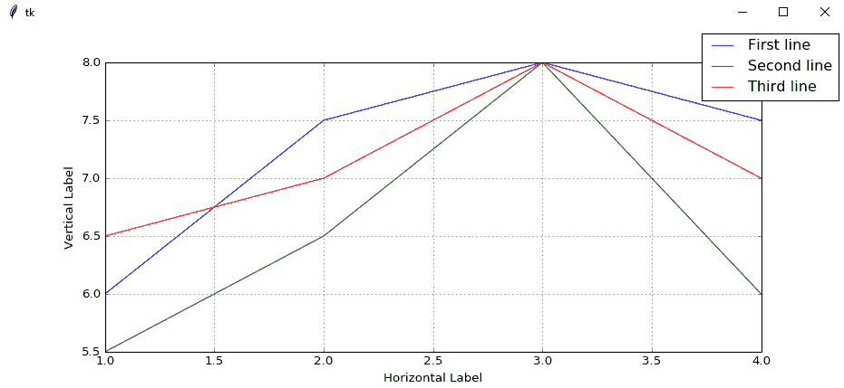

接下来，我们更改图例中线条的默认颜色。

1.  打开`Matplotlib_chart_with_legend.py`并将其保存为`Matplotlib_chart_with_legend_colors.py`。

1.  将以下颜色添加到每个绘图：

```py
t0, = axis.plot(xValues, yValues0, color = 'purple') 
t1, = axis.plot(xValues, yValues1, color = 'red') 
t2, = axis.plot(xValues, yValues2, color = 'blue')
```

1.  运行修改后的代码并观察不同的颜色：

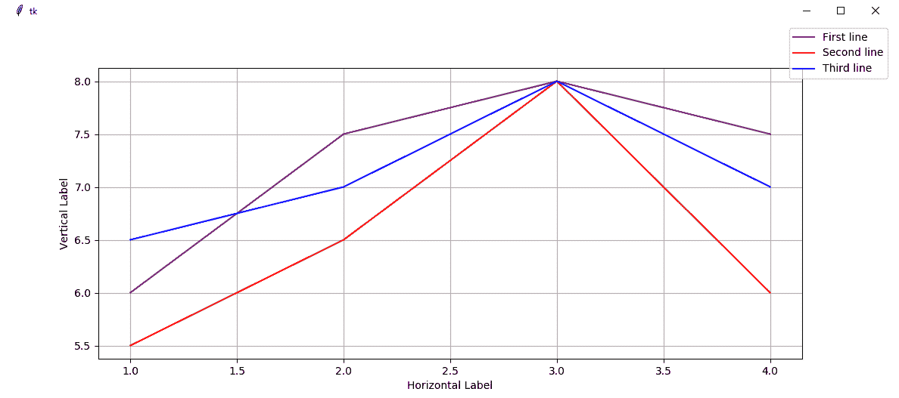

现在，让我们更仔细地看看将绘图分配给变量时的正确语法。

1.  打开`Matplotlib_chart_with_legend.py`并将其保存为`Matplotlib_chart_with_legend_missing_comma.py`。

1.  删除`t0`后面的逗号。

1.  运行代码。

1.  注意到`第一行`不再出现在右上角的图例中：


让我们现在幕后了解代码。

# 它是如何工作的…

在`Matplotlib_chart_with_legend.py`中，我们在这个菜谱中只绘制一个图表。

对于*步骤 2*，参考前一个菜谱的解释，*在图表上放置标签*，因为代码是相同的，除了我们通过`figsize`属性稍微修改了图形的大小。

在*步骤 3*中，我们将`fig.add_subplot(111)`更改为使用`111`。接下来，我们创建三个包含要绘制值的 Python 列表。当我们绘制数据时，我们将绘图引用保存在局部变量中。

我们通过传递一个包含三个绘图引用的元组来创建图例，然后传递另一个包含随后在图例中显示的字符串的元组，在第三个参数中，我们将图例定位在图表内。

对于*步骤 4*，参考前一个菜谱的解释，*在图表上放置标签*，因为代码是相同的*。

您可以在以下链接找到`tkinter`协议的官方文档：[`www.tcl.tk/man/tcl8.4/TkCmd/wm.htm#M39`](https://www.tcl.tk/man/tcl8.4/TkCmd/wm.htm#M39)。

在*步骤 5*中，运行代码时，我们可以看到我们的图表现在为每条数据行都有一个图例。

`Matplotlib`的默认设置将颜色方案分配给正在绘制的线条。在`Matplotlib_chart_with_legend_colors.py`中，我们可以通过在绘制每个坐标轴时设置一个属性，轻松地将这种默认的颜色设置更改为我们喜欢的颜色。

我们在 *步骤 2* 中通过使用 `color` 属性并分配一个可用的颜色值来完成此操作。现在在 *步骤 3* 中运行代码显示的颜色与默认颜色不同。

在 `Matplotlib_chart_with_legend_missing_comma.py` 中，我们故意删除了 `t0` 后面的逗号，以查看这会产生什么效果。

注意，`t0`、`t1` 和 `t2` 变量赋值后的逗号不是一个错误。它是创建图例所必需的。

每个变量的逗号**解包**列表值到变量中。这个值是 `Matplotlib` 的 `Line2D` 对象。如果我们省略逗号，我们的图例将不会显示，因为 `Line2D` 对象嵌入在一个列表中，我们必须将其从列表中解包出来。

当我们删除 `t0` 赋值后的逗号时，我们会得到一个错误，并且第一行不再出现在图中。图表和图例仍然被创建，但没有第一行出现在图例中。

让我们继续到下一个配方。

# 缩放图表

在之前的配方中，当我们创建第一个图表并增强它们时，我们硬编码了如何视觉表示这些值的缩放。

当前的值对我们使用的值来说效果很好，但我们可能需要从大型数据库中绘制图表。

根据数据范围，我们硬编码的垂直 *y* 维度的值可能并不总是最佳解决方案，并且可能使我们的图表中的线条难以看到。

# 准备工作

我们将从之前的配方，*如何给图表添加图例*，改进我们的代码。如果您没有输入之前配方中的所有代码，只需从 Packt 网站下载本章的代码，它将帮助您开始（然后您可以使用 Python 创建 GUI、图表等，享受很多乐趣）。

# 如何操作...

我们将修改之前配方中的 `yValues1` 代码行，使用 `50` 作为第三个值：

1.  打开 `Matplotlib_chart_with_legend.py` 并将其保存为 `Matplotlib_labels_two_charts_not_scaled.py`。

1.  将 `yValues1` 列表中的第三个值更改为 `50`：

```py
axis  = fig.add_subplot(111)        # 1 row, 1 column 
xValues  = [1,2,3,4] 
yValues0 = [6,7.5,8,7.5] 
yValues1 = [5.5,6.5,50,6]           # one very high value (50)
yValues2 = [6.5,7,8,7]
```

1.  运行代码以查看以下图表：

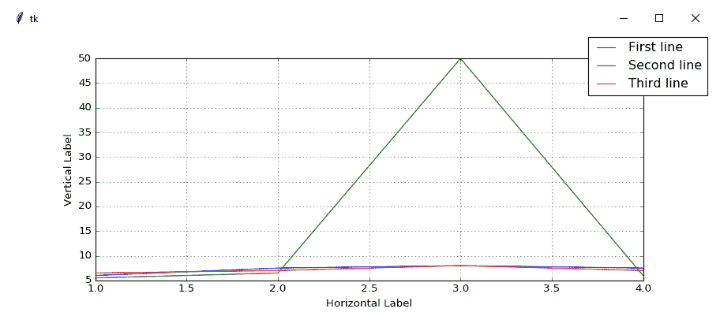

1.  打开 `Matplotlib_labels_two_charts_not_scaled.py` 并将其保存为 `Matplotlib_labels_two_charts_scaled.py`。

1.  在值代码下添加 `axis.set_ylim(5, 8)`：

```py
yValues0 = [6,7.5,8,7.5] 
yValues1 = [5.5,6.5,50,6]           # one very high value (50) 
yValues2 = [6.5,7,8,7] 

axis.set_ylim(5, 8)                 # limit the vertical display
```

1.  运行代码后，出现以下图表：

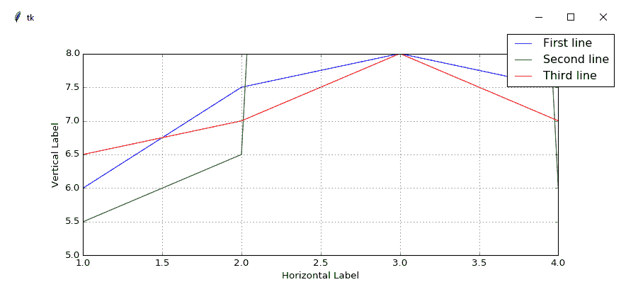

让我们现在幕后了解代码以更好地理解它。

# 它是如何工作的...

在 `Matplotlib_labels_two_charts_not_scaled.py` 中，与之前配方中创建图表的代码的唯一区别是一个数据值。

通过更改一个与所有其他绘制线条的平均值范围都不接近的值，数据的视觉表示发生了显著变化。我们失去了关于整体数据的大量细节，现在我们主要看到一个高峰。

到目前为止，我们的图表已经根据它们所视觉表示的数据进行了调整。

虽然这是`Matplotlib`的一个实用功能，但这并不总是我们想要的。我们可以通过限制垂直的*y*维度来限制表示的图表的刻度。

在`Matplotlib_labels_two_charts_scaled.py`中，`axis.set_ylim(5, 8)`这一行代码现在将起始值限制为`5`，并将垂直显示的结束值限制为`8`。

现在，当我们创建我们的图表时，高值峰值不再像以前那样有影响。

我们在数据中增加了一个值，这导致了戏剧性的效果。通过设置图表的垂直和水平显示的限制，我们可以看到我们最感兴趣的数据。

就像刚刚展示的尖峰一样，这些尖峰也可能非常有兴趣。这完全取决于我们在寻找什么。数据的视觉表示非常有价值。

一图胜千言。

现在，让我们继续下一个菜谱。

# 动态调整图表的刻度

在上一个菜谱中，我们学习了如何限制图表的缩放。在这个菜谱中，我们将更进一步，通过设置限制并在表示之前分析我们的数据来动态调整缩放。

# 准备工作

我们将通过动态读取我们正在绘制的图形数据、计算平均值然后调整我们的图表来增强上一个菜谱中*缩放图表*的代码。

虽然我们通常会从外部源读取数据，但在本菜谱中，我们将使用 Python 列表创建我们正在绘制的图形数据，如以下代码部分所示。

# 如何做到这一点…

我们在我们的 Python 模块中通过将包含数据的列表分配给`xValues`和`yValues`变量来创建自己的数据。现在让我们修改代码，以设置*x*和*y*维度的限制。

1.  打开`Matplotlib_labels_two_charts_scaled.py`并将其保存为`Matplotlib_labels_two_charts_scaled_dynamic_spike.py`。

1.  按照以下方式添加/调整`set_ylim`和`set_xlim`代码：

```py
xValues  = [1,2,3,4] 

yValues0 = [6,7.5,8,7.5] 
yValues1 = [5.5,6.5,50,6]           # one very high value (50) 
yValues2 = [6.5,7,8,7]               

axis.set_ylim(0, 8)                 # lower limit (0) 
axis.set_xlim(0, 8)                 # use same limits for x
```

1.  当我们运行修改后的代码时，我们得到以下结果：

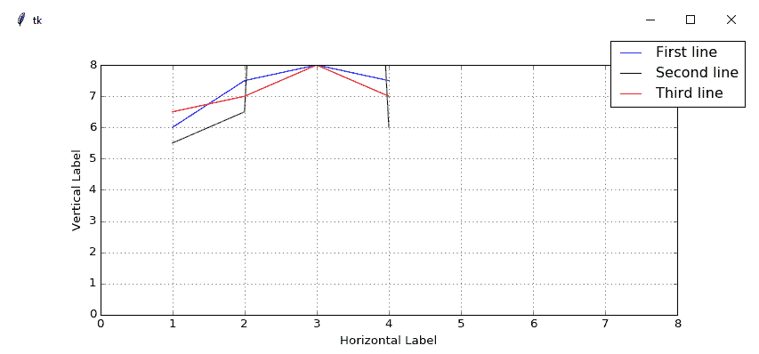

按照以下方式修改代码：

1.  打开`Matplotlib_labels_two_charts_scaled_dynamic_spike.py`并将其保存为`Matplotlib_labels_two_charts_scaled_dynamic.py`。

1.  从`yAll`开始插入以下新代码：

```py
xValues  = [1,2,3,4] 

yValues0 = [6,7.5,8,7.5] 
yValues1 = [5.5,6.5,50,6]              # one very high value (50) 
yValues2 = [6.5,7,8,7]               
yAll = [yValues0, yValues1, yValues2]  # list of lists 

# flatten list of lists retrieving minimum value 
minY = min([y for yValues in yAll for y in yValues]) 

yUpperLimit = 20 
# flatten list of lists retrieving max value within defined limit 
maxY = max([y for yValues in yAll for y in yValues if y < 
yUpperLimit]) 

# dynamic limits 
axis.set_ylim(minY, maxY)                  
axis.set_xlim(min(xValues), max(xValues))                 

t0, = axis.plot(xValues, yValues0) 
t1, = axis.plot(xValues, yValues1) 
t2, = axis.plot(xValues, yValues2)
```

1.  运行代码后，我们得到以下图表：

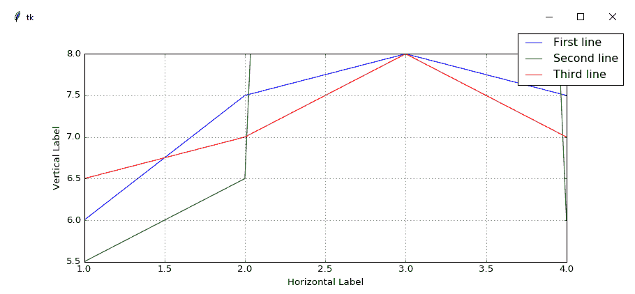

让我们现在幕后了解代码，以便更好地理解。

# 它是如何工作的…

在许多图表中，*x*和*y*坐标系的起始点在(0, 0)。这通常是一个好主意，因此我们相应地调整了我们的图表坐标代码。在`Matplotlib_labels_two_charts_scaled_dynamic_spike.py`中，我们为*x*和*y*设置了相同的限制，希望我们的图表可能看起来更平衡。查看结果，这并不是事实。

可能从(0, 0)开始并不是一个很好的主意。

我们真正想要做的是根据数据的范围动态调整我们的图表，同时限制过高或过低的值。

我们可以通过解析图表中要表示的所有数据，同时设置一些明确的限制来实现这一点。在 `Matplotlib_labels_two_charts_scaled_dynamic.py` 中，我们动态调整了其 *x* 和 *y* 维度。注意 *y*- 维度从 `5.5` 开始。图表也不再从 **(0, 0)** 开始，这为我们提供了关于数据更有价值的信息。

我们正在创建一个包含 *y*- 维度数据的列表的列表，然后使用一个列表推导式，将其包装在调用 Python 的 `min()` 和 `max()` 函数中。

如果列表推导式看起来有点高级，它们基本上是一个非常紧凑的循环。它们也被设计得比常规编程循环更快。

在 Python 代码中，我们创建了三个列表，用于存储要绘制的 *y*- 维度数据。然后我们创建了另一个列表，用于存储这三个列表，这样就创建了一个列表的列表，如下所示：

```py
yValues0 = [6,7.5,8,7.5] 
yValues1 = [5.5,6.5,50,6]              # one very high value (50) 
yValues2 = [6.5,7,8,7]               
yAll = [yValues0, yValues1, yValues2]  # list of lists
```

我们对获取所有 *y*- 维度数据的最大值和最小值以及这三个列表中包含的最大值都感兴趣。

我们可以通过 Python 列表推导式来实现这一点：

```py
# flatten list of lists retrieving minimum value 
minY = min([y for yValues in yAll for y in yValues])
```

运行列表推导式后，`minY` 为 `5.5`。

上一行代码是列表推导式，它遍历所有三个列表中包含的所有数据值，并使用 Python 的 `min` 关键字找到最小值。

在完全相同的模式中，我们找到了我们希望绘制的数据中的最大值。这次，我们也会在我们的列表推导式中设置一个限制，忽略所有超过我们指定限制的值，如下所示：

```py
yUpperLimit = 20 
# flatten list of lists retrieving max value within defined limit 
maxY = max([y for yValues in yAll for y in yValues if y < 
yUpperLimit])
```

在运行我们选择的限制条件下的前一段代码后，`maxY` 的值为 `8`（而不是 `50`）。

根据预定义的条件，我们对最大值应用了限制，选择 `20` 作为图表中显示的最大值。

对于 *x*- 维度，我们简单地在该 `Matplotlib` 方法中调用 `min()` 和 `max()` 来动态调整图表的限制。

在这个菜谱中，我们创建了几个 `Matplotlib` 图表，并调整了一些许多可用的属性。我们还使用核心 Python 动态控制图表的缩放。
