# 线程和网络

在本章中，我们将通过使用线程、队列和网络连接来扩展我们 Python GUI 的功能。

`tkinter` GUI 是一个单线程应用程序。涉及睡眠或等待时间的每个函数都必须在单独的线程中调用；否则，`tkinter` GUI 会冻结。

当我们运行我们的 Python GUI 时，在 Windows 任务管理器中，我们可以看到已启动一个新的`python.exe`进程。当我们给我们的 Python GUI 添加`.pyw`扩展名时，创建的进程将是`python.pyw`，这也可以在任务管理器中看到。

当创建进程时，进程会自动创建一个主线程来运行我们的应用程序。这被称为**单线程应用程序**。

单线程进程包含指令的单个序列执行。换句话说，一次只处理一个命令。

对于我们的 Python GUI，单线程应用程序会导致我们在调用长时间运行的任务（如点击具有几秒睡眠时间的按钮）时，GUI 立即冻结。为了保持我们的 GUI 响应，我们必须使用**多线程**，这正是本章我们将要学习的内容。

我们的 GUI 在单个线程中运行。了解如何使用多个线程是 GUI 开发中的一个重要概念。

我们也可以通过创建多个 Python GUI 实例来创建多个进程，如任务管理器所示，我们可以看到同时运行着几个`python.exe`进程。

设计上，进程之间是隔离的，并且不共享公共数据。为了在独立进程之间进行通信，我们必须使用**进程间通信**（**IPC**），这是一种高级技术。另一方面，线程之间确实共享公共数据、代码和文件，这使得在同一进程内使用线程进行通信比使用 IPC 要容易得多。关于线程的精彩解释可以在[`www.cs.uic.edu/~jbell/CourseNotes/OperatingSyste`](https://www.cs.uic.edu/~jbell/CourseNotes/OperatingSystems/4_Threads.html)[ms/4_Threads.html](https://www.cs.uic.edu/~jbell/CourseNotes/OperatingSystems/4_Threads.html)找到。

在本章中，我们将学习如何保持我们的 Python GUI 响应，并防止它冻结。在创建工作 GUI 时，拥有这种知识是必不可少的，并且知道如何创建线程和使用队列可以提高您的编程技能。

我们还将使用 TCP/IP 将我们的 GUI 连接到网络。除此之外，我们还将读取 URL 网页，这也是互联网上的一个网络组件。

这是本章 Python 模块的概述：

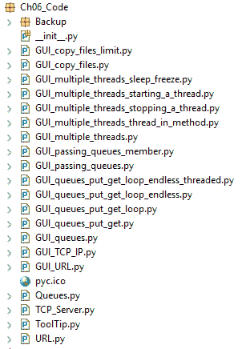

我们将使用 Python 3.7 或更高版本创建线程、队列和 TCP/IP 套接字。

总结来说，我们将涵盖以下内容：

+   如何创建多个线程

+   启动线程

+   停止线程

+   如何使用队列

+   在不同模块之间传递队列

+   使用对话框小部件将文件复制到您的网络中

+   使用 TCP/IP 通过网络进行通信

+   使用`urlopen`从网站读取数据

# 如何创建多个线程

多个线程是必要的，以便保持我们的 GUI 响应。如果没有使用多个线程运行我们的 GUI 程序，我们的应用程序可能会冻结并可能崩溃。

# 准备工作

多个线程在同一个计算机进程的内存空间中运行。不需要 IPC，这会复杂化我们的代码。在这个菜谱中，我们将通过使用线程来避免 IPC。

# 如何做到…

首先，我们将增加我们的`ScrolledText`小部件的大小，使其更大。让我们将`scrol_w`增加到`40`，将`scrol_h`增加到`10`。

我们将首先使用第五章的最新代码，*Matplotlib 图表*：

1.  打开`Ch04_Code.GUI_OOP_class_imported_tooltip.py`并将其保存为`GUI_multiple_threads.py`。

1.  进行以下代码所示更改：

```py
# Using a scrolled Text control 
scrol_w = 40; scrol_h = 10     # increase sizes
self.scrol = scrolledtext.ScrolledText(mighty, width=scrol_w, 
height=scrol_h, wrap=tk.WORD)
self.scrol.grid(column=0, row=3, sticky='WE', columnspan=3)
```

1.  将`self.spin.grid`修改为使用`sticky`：

```py
# Adding a Spinbox widget
self.spin = Spinbox(mighty, values=(1, 2, 4, 42, 100), width=5, 
bd=9, command=self._spin) 
self.spin.grid(column=0, row=2, sticky='W') # align left, use sticky
```

1.  增加小部件`Entry`的`width`大小：

```py
# Adding a Textbox Entry widget
self.name = tk.StringVar()
self.name_entered = ttk.Entry(mighty, width=24, 
# increase width
textvariable=self.name)
self.name_entered.grid(column=0, row=1, sticky='W')
```

1.  将`Combobox`小部件的`width`大小增加到`14`：

```py
ttk.Label(mighty, text="Choose a number:").grid(column=1, row=0)
number = tk.StringVar()
self.number_chosen = ttk.Combobox(mighty, width=14, 
# increase width
textvariable=number, state='readonly')
self.number_chosen['values'] = (1, 2, 4, 42, 100)
self.number_chosen.grid(column=1, row=1)
self.number_chosen.current(0)
```

1.  运行代码并观察输出：

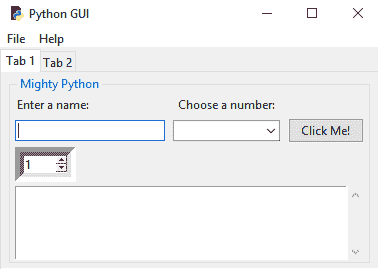

1.  从 Python 的内置`threading`模块导入`Thread`：

```py
#======================
# imports
#======================
import tkinter as tk
...
from threading import Thread
```

1.  添加`method_in_a_thread`方法：

```py
class OOP(): 
    def method_in_a_thread(self):
        print('Hi, how are you?')
```

1.  创建线程如下：

```py
#======================
# Start GUI
#======================
oop = OOP()

# Running methods in Threads
run_thread = Thread(target=oop.method_in_a_thread)  # create Thread

oop.win.mainloop()
```

1.  为`run_thread`变量设置断点或使用`print`语句：

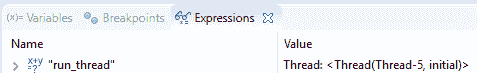

让我们深入了解代码，以更好地理解它。

# 它是如何工作的…

在我们对`GUI_multiple_threads.py`的*第 2 步*所做的第一次更改之后，当我们运行生成的 GUI 时，位于其上方的`Spinbox`小部件相对于`Entry`小部件是居中对齐的，这看起来不太好。我们将通过左对齐小部件来改变这一点。我们向`grid`控件添加`sticky='W'`以左对齐`Spinbox`小部件。

GUI 仍然可以更好，所以接下来，我们将`Entry`小部件的大小增加到获得更平衡的 GUI 布局。之后，我们也增加了`Combobox`小部件。运行修改和改进后的代码将产生一个更大的 GUI，我们将使用这个 GUI 来完成这个菜谱以及接下来的菜谱。

为了在 Python 中创建和使用线程，我们必须从`threading`模块导入`Thread`类。在添加`method_in_a_thread`方法后，我们现在可以在代码中调用我们的线程方法，并将实例保存在名为`run_thread`的变量中。

现在我们有一个线程化的方法，但当我们运行代码时，控制台没有任何打印输出！

我们必须首先启动线程，然后它才能运行，下一个菜谱将展示如何做到这一点。

然而，在 GUI 主事件循环之后设置断点证明我们确实创建了一个线程对象，如 Eclipse IDE 调试器中所示。

在这个菜谱中，我们首先通过增加 GUI 大小来准备我们的 GUI 使用线程，这样我们就可以更好地看到打印到`ScrolledText`小部件的结果。然后，我们从 Python 的`threading`模块导入了`Thread`类。接下来，我们创建了一个在 GUI 内部调用的方法。

让我们继续下一个菜谱。

# 启动线程

这个配方将向我们展示如何启动一个线程。它还将演示为什么在长时间运行的任务期间，线程对于保持我们的 GUI 响应是必要的。

# 准备工作

让我们先看看当我们调用与 `sleep` 相关的函数或 GUI 方法而没有使用线程时会发生什么。

我们在这里使用 `sleep` 来模拟可能需要等待网络服务器或数据库响应、大文件传输或复杂计算完成任务的现实世界应用程序。`sleep` 是一个非常现实的占位符，展示了涉及的原则。

# 如何操作…

在我们的按钮回调方法中添加一个循环和一些 `sleep` 时间会导致我们的 GUI 变得无响应，当我们尝试关闭 GUI 时，情况变得更糟。

1.  打开 `GUI_multiple_threads.py` 并将其保存为 `GUI_multiple_threads_sleep_freeze.py`。

1.  对代码进行以下更改：

```py
# Button callback
def click_me(self): 
    self.action.configure(text='Hello ' + self.name.get() + ' ' 
    + self.number_chosen.get())
    # Non-threaded code with sleep freezes the GUI
    for idx in range(10):
        sleep(5)
        self.scrol.insert(tk.INSERT, str(idx) + 'n')
```

1.  运行前面的代码会产生以下截图：

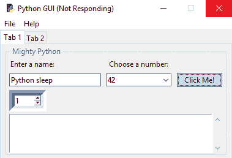

1.  让我们将线程的创建移动到它自己的方法中，然后从按钮回调方法中调用此方法：

    1.  打开 `GUI_multiple_threads_sleep_freeze.py` 并将其保存为 `GUI_multiple_threads_starting_a_thread.py`。

    1.  添加以下代码：

```py
# Running methods in Threads
def create_thread(self):
    self.run_thread = Thread(target=self.method_in_a_thread) 
    self.run_thread.start()              # start the thread

# Button callback
def click_me(self): 
    self.action.configure(text='Hello ' + self.name.get())
    self.create_thread()
```

1.  运行代码并观察输出。现在运行代码不再使我们的 GUI 冻结：

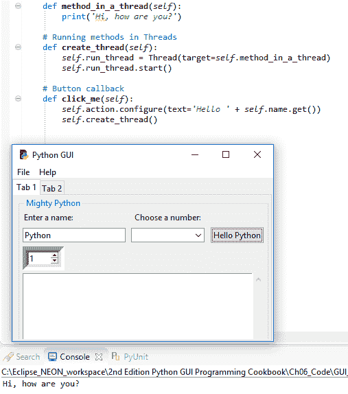

我们可以通过以下步骤打印线程的实例：

+   1.  打开 `GUI_multiple_threads_starting_a_thread.py`。

    1.  在代码中添加一个 `print` 语句：

```py
# Running methods in Threads
def create_thread(self):
    self.run_thread = 
    Thread(target=self.method_in_a_thread) 
    self.run_thread.start()              # start the thread
    print(self.run_thread)
```

1.  点击按钮现在会创建以下输出：

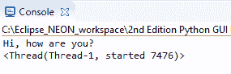

1.  在多次点击按钮后，你会得到以下输出：

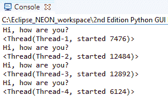

1.  将带有 `sleep` 的代码移动到 `method_in_a_thread` 方法中的循环：

```py
def method_in_a_thread(self):
    print('Hi, how are you?')
    for idx in range(10):
        sleep(5)
        self.scrol.insert(tk.INSERT, str(idx) + 'n')
```

1.  点击按钮，切换标签页，然后点击其他小部件：

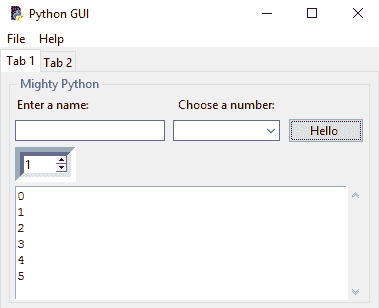

让我们深入了解代码，更好地理解它。

# 它是如何工作的…

在 `GUI_multiple_threads_sleep_freeze.py` 中，我们添加了一个 `sleep` 语句，并注意到我们的 GUI 变得无响应。

如果等待足够长的时间，方法最终会完成，但在这段时间内，我们的任何 GUI 小部件都不会对点击事件做出响应。我们通过使用线程来解决这个问题。

与常规 Python 函数和方法不同，我们必须 `start` 一个将在其自己的线程中运行的方法！这就是我们在 `GUI_multiple_threads_starting_a_thread.py` 中接下来所做的事情。点击按钮现在会导致调用 `create_thread` 方法，然后它反过来调用 `method_in_a_thread` 方法。

首先，我们创建一个线程并将其指向一个方法。然后，我们启动一个新线程来运行目标方法。现在运行代码不再使我们的 GUI 冻结。

GUI 本身在其自己的线程中运行，这是应用程序的主线程。

当我们多次点击按钮时，我们可以看到每个线程都会被分配一个唯一的名称和 ID。在将带有`sleep`的代码移动到`method_in_a_thread`方法的循环中之后，我们能够验证线程确实解决了我们的问题。

当点击按钮，同时数字以五秒的延迟打印到`ScrolledText`小部件时，我们可以在我们的 GUI 的任何地方点击，切换标签页等等。由于我们使用了线程，我们的 GUI 再次变得响应。

在这个菜谱中，我们在自己的线程中调用了我们的 GUI 类的函数，并了解到我们必须启动线程。否则，线程会被创建，但只是在那里等待我们运行它的目标方法。我们还注意到每个线程都会被分配一个唯一的名称和 ID。最后，我们通过在代码中插入`sleep`语句来模拟长时间运行的任务，这表明线程确实可以解决问题。

让我们继续下一个菜谱。

# 停止一个线程

我们必须通过调用`start()`方法来启动线程，以便真正让它做些事情，直观上，我们期望有一个匹配的`stop()`方法，但并没有这样的方法。在这个菜谱中，我们将学习如何将线程作为一个后台任务运行，这被称为*守护进程*。当关闭主线程，即我们的 GUI 时，所有守护进程也会自动停止。

# 准备工作

当我们在线程中调用方法时，我们也可以向方法传递参数和关键字参数。我们通过这样做来开始这个菜谱。我们将从上一个菜谱中的代码开始。

# 如何做到这一点...

通过在线程构造函数中添加`args=[8]`并将目标方法修改为期望参数，我们可以向线程方法传递参数。`args`参数必须是一个序列，因此我们将我们的数字包裹在一个 Python 列表中。让我们通过这个过程来了解一下：

1.  打开`GUI_multiple_threads_starting_a_thread.py`并将其保存为`GUI_multiple_threads_stopping_a_thread.py`。

1.  将`run_thread`改为`self.run_thread`并将`arg=[8]`改为`arg=[8]`：

```py
# Running methods in Threads 
def create_thread(self):
    self.run_thread = Thread(target=self.method_in_a_thread, 
    args=[8]) 
    self.run_thread.start() 
    print(self.run_thread)
print('createThread():', self.run_thread.isAlive())
```

1.  将`num_of_loops`作为新参数添加到`method_in_a_thread`中：

```py
def method_in_a_thread(self, num_of_loops=10): 
    for idx in range(num_of_loops): 
        sleep(1) 
        self.scrol.insert(tk.INSERT, str(idx) + 'n') 
    sleep(1) 
    print('method_in_a_thread():', self.run_thread.isAlive())
```

1.  运行代码，点击按钮，然后关闭 GUI：

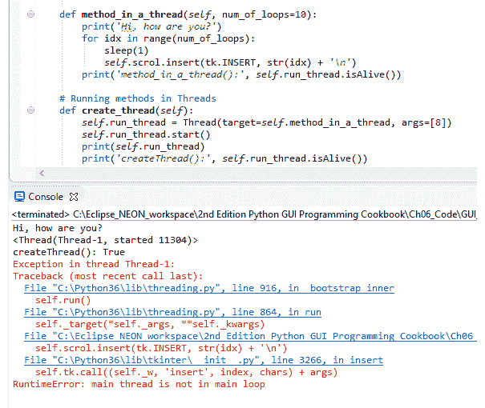

1.  在代码中添加`self.run_thread.setDaemon(True)`：

```py
# Running methods in Threads 
def create_thread(self):
    self.run_thread = Thread(target=self.method_in_a_thread, 
    args=[8]) 
    self.run_thread.setDaemon(True)         # <=== add this line
    self.run_thread.start()
    print(self.run_thread)
```

1.  运行修改后的代码，点击按钮，然后关闭 GUI：

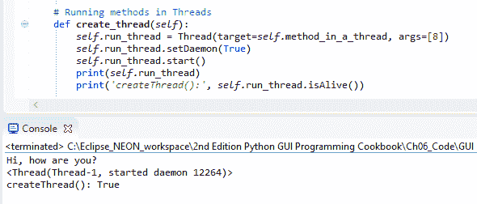

现在我们来看看这个菜谱是如何工作的！

# 它是如何工作的...

在以下代码中，`run_thread`是一个局部变量，我们只在我们创建`run_thread`的方法的作用域内访问它：

```py
# Running methods in Threads 
def create_thread(self):
    run_thread = Thread(target=self.method_in_a_thread, args=[8]) 
    run_thread.start()
```

通过将局部变量转换为类实例属性，我们可以通过在另一个方法中调用它的`isAlive`来检查线程是否仍在运行。在`GUI_multiple_threads_stopping_a_thread.py`中，我们将我们的局部`run_thread`变量提升为类的实例属性。这使得我们可以从我们类中的任何方法访问`self.run_thread`变量。

当我们点击按钮然后在线程完成之前退出 GUI 时，我们会得到一个运行时错误。

预期线程完成其分配的任务，因此当我们在线程完成之前关闭 GUI 时，根据错误信息，Python 告诉我们我们启动的线程不在主事件循环中。我们可以通过将线程转换为*守护线程*来解决这个问题，这样它就会作为一个后台任务执行。这给我们带来的好处是，当我们关闭我们的 GUI，即我们的主要线程，它启动其他线程时，守护线程会干净地退出。我们通过在启动线程之前调用线程的`setDaemon(True)`方法来实现这一点。

当我们现在点击按钮并在线程完成其分配的任务之前退出我们的 GUI 时，我们不再收到任何错误。虽然有一个`start`方法可以让线程运行，但令人惊讶的是，并没有一个等效的停止方法。

在这个菜谱中，我们在一个线程中运行一个方法，该方法将数字打印到我们的`ScrolledText`小部件中。当我们退出 GUI 时，我们不再对曾经打印到我们小部件的线程感兴趣，因此通过将线程转换为*守护线程*，我们可以干净地退出 GUI。

让我们继续下一个菜谱。

# 如何使用队列

Python 队列是一个实现**先进先出**（**FIFO**）范式的数据结构，基本上就像一个管道。你在一侧把东西铲进管道，它就会从管道的另一侧掉出来。

与将泥铲入物理管道相比，这个队列铲泥的主要区别在于，在 Python 队列中，事物不会混淆。你放一个单位进去，那个单位就会从另一侧出来。接下来，你放另一个单位进去（例如，一个类的实例），这个整个单位就会作为一个整体从另一端出来。它以我们插入队列代码的确切顺序从另一端出来。

队列不是一个我们推和弹出数据的栈。栈是一个**后进先出**（**LIFO**）的数据结构。

队列是容器，用于存储从可能不同的数据源输入队列中的数据。当这些客户端有数据可用时，我们可以让不同的客户端向队列提供数据。哪个客户端准备好向我们的队列发送数据就发送，然后我们可以在小部件中显示这些数据或将它们发送到其他模块。

使用多个线程在队列中完成分配的任务，在接收处理结果的最终结果并显示它们时非常有用。数据被插入到队列的一端，然后以有序的方式从另一端出来，FIFO。

我们的 GUI 可能有五个不同的按钮小部件，这样每个都可以启动一个不同的任务，我们希望在 GUI 中的小部件中显示这些任务（例如，一个`ScrolledText`小部件）。这五个不同的任务完成所需的时间各不相同。

每当一项任务完成时，我们立即需要知道这一点，并在 GUI 中显示此信息。通过创建共享的 Python 队列并让五个任务将它们的结果写入此队列，我们可以使用 FIFO 方法立即显示已完成任务的任何任务的结果。

# 准备工作

随着我们的 GUI 在功能性和实用性上的不断增长，它开始与网络、进程和网站进行通信，最终将不得不等待数据可用以便 GUI 显示。

在 Python 中创建队列解决了在 GUI 内部等待数据显示的问题。

# 如何做到这一点...

为了在 Python 中创建队列，我们必须从`queue`模块导入`Queue`类。在 GUI 模块的顶部添加以下语句：

1.  打开`GUI_multiple_threads_starting_a_thread.py`并将其保存为`GUI_queues.py`。

1.  对代码进行以下更改：

```py
from threading import Thread 
from queue import Queue
```

1.  添加以下方法：

```py
def use_queues(self): 
    gui_queue = Queue()        # create queue instance 
    print(gui_queue)           # print instance
```

1.  修改`click_me`方法：

```py
# Button callback
def click_me(self): 
    self.action.configure(text='Hello ' + self.name.get())
    self.create_thread()
    self.use_queues()
```

1.  运行前面的代码并观察输出，如图所示：

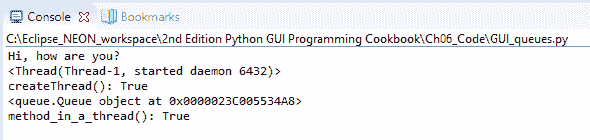

1.  修改`use_queues`以使用`put`和`get`：

```py
# Create Queue instance   
def use_queues(self):
    gui_queue = Queue() 
    print(gui_queue)
    gui_queue.put('Message from a queue') 
    print(gui_queue.get())
```

1.  运行前面的代码并观察输出，如图所示：

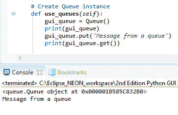

1.  编写一个循环，将许多消息放入`Queue`：

```py
# Create Queue instance 
def use_queues(self):
    gui_queue = Queue() 
    print(gui_queue)
    for idx in range(10):
        gui_queue.put('Message from a queue: ' + str(idx))
    print(gui_queue.get())
```

1.  运行前面的代码：

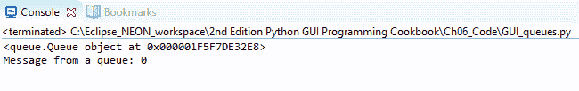

1.  添加一个`while`循环：

```py
# Create Queue instance 
def use_queues(self):
    gui_queue = Queue() 
    print(gui_queue)
    for idx in range(10):
        gui_queue.put('Message from a queue: ' + str(idx))
    while True: 
        print(gui_queue.get())
```

1.  运行前面的代码以查看以下结果：

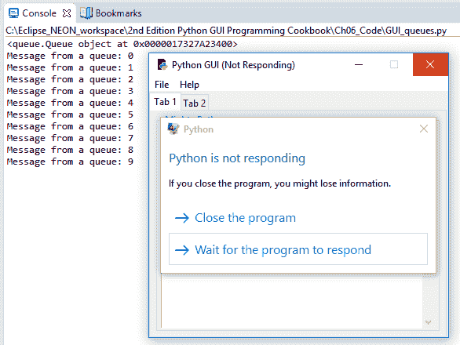

现在，让我们考虑无限循环的场景：

1.  打开`GUI_queues.py`并将其保存为`GUI_queues_put_get_loop_endless_threaded.py`。

1.  进行以下更改以将`self.run_thread`作为后台守护线程启动：

```py
# Running methods in Threads 
def create_thread(self):
    self.run_thread = Thread(target=self.method_in_a_thread, 
    args=[8])                    
    self.run_thread.setDaemon(True) 
    self.run_thread.start()

    # start queue in its own thread
    write_thread = Thread(target=self.use_queues, daemon=True)
    write_thread.start()
```

1.  在`click_me`方法中，我们注释掉`self.use_queues()`并现在调用`self.create_thread()`：

```py
# Button callback
def click_me(self): 
    self.action.configure(text='Hello ' + self.name.get())
    self.create_thread()
    # now started as a thread in create_thread()
    # self.use_queues()
```

1.  运行代码以查看以下结果：

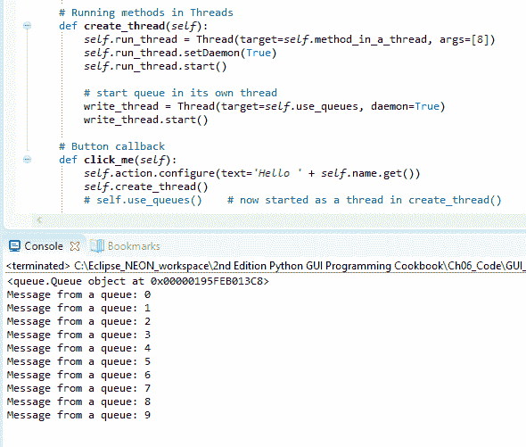

让我们深入了解代码以更好地理解它。

# 它是如何工作的...

在`GUI_queues.py`中，我们首先添加`import`语句，然后创建一个新的方法来创建`Queue`。我们在按钮点击事件中调用该方法。

在代码中，我们创建了一个局部`Queue`实例，该实例仅在此方法内部可访问。如果我们希望从其他地方访问此队列，我们必须使用`self`关键字将其转换为类的实例属性，这会将局部变量绑定到整个类，使其可在类中的任何其他方法中访问。在 Python 中，我们通常在`__init__(self)`方法中创建类实例变量，但 Python 非常实用，允许我们在代码的任何位置创建这些属性。

现在我们有一个队列的实例。我们可以通过打印它来看到这是如何工作的。

为了将数据放入队列，我们使用`put`命令。为了从队列中获取数据，我们使用`get`命令。

运行代码的结果是消息首先被放入`Queue`，然后从`Queue`中取出，然后被打印到控制台。我们已将 10 条消息放入`Queue`，但我们只取出第一条。其他消息仍然在`Queue`中，等待以 FIFO 的方式取出。为了取出所有已放入`Queue`的消息，我们可以创建一个无限循环。

尽管这段代码可以工作，但不幸的是，它使我们的 GUI 冻结。为了解决这个问题，我们必须在它的自己的线程中调用该方法，就像我们在前面的食谱中所做的那样。

我们在`GUI_queues_put_get_loop_endless_threaded.py`中这样做。

当我们现在点击按钮时，GUI 不再冻结，代码可以正常工作。我们创建了`Queue`，并以 FIFO 的方式将消息放入`Queue`的一侧。我们从`Queue`中取出消息，然后将其打印到控制台（`stdout`）。我们意识到我们必须在它的自己的线程中调用该方法，否则我们的 GUI 可能会冻结。

让我们继续下一个食谱。

# 在不同模块之间传递队列

在这个食谱中，我们将传递不同模块之间的队列。随着我们的 GUI 代码复杂性的增加，我们希望将 GUI 组件从业务逻辑中分离出来，将它们分离到不同的模块中。模块化使我们能够重用代码，并使代码更具可读性。

当我们在我们的 GUI 中显示的数据来自不同的数据源时，我们将面临延迟问题，这正是队列解决的问题。通过在不同 Python 模块之间传递`Queue`的实例，我们正在分离模块功能的不同关注点。

理想的 GUI 代码只应关注创建和显示小部件以及数据。

业务逻辑模块的工作只是执行业务逻辑并向 GUI 提供结果数据。

我们必须结合这两个元素，理想情况下使用尽可能少的模块间关系，减少代码依赖性。

避免不必要的依赖的编码原则通常被称为*松散耦合*。这是一个非常重要的原则，我强烈建议你深入研究它，理解它，并将其应用到自己的编码项目中。

为了理解*松散耦合*的重要性，我们可以在白板或一张纸上画一些盒子。一个盒子代表我们的 GUI 类和代码，而其他盒子代表业务逻辑、数据库等。

接下来，我们在盒子之间画线，绘制出这些盒子（即我们的 Python 模块）之间的相互依赖关系，如图所示：

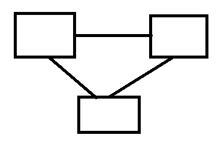

虽然这三个通过三条线连接的盒子看起来可能有点简单，但这正是你会在软件团队会议的白板上画出的内容。我已经省略了任何标签，但一个盒子可以标记为**UI**，另一个**数据库**，第三个**业务处理逻辑**。

我们 Python 盒子之间的线条越少，我们的设计就越是*松散耦合*。

# 准备工作

在之前的配方中，*如何使用队列*，我们开始使用队列。在这个配方中，我们将从我们的主 GUI 线程传递`Queue`实例到其他 Python 模块，这将使我们能够从另一个模块写入`ScrolledText`小部件，同时保持我们的 GUI 响应。

# 如何做到这一点…

1.  首先，我们在项目中创建一个新的 Python 模块。让我们称它为`Queues.py`。我们将一个函数放入其中（目前不需要面向对象）。依次，我们可以这样表述：

    1.  创建一个新的 Python 模块，并命名为`Queues.py`。

    1.  将以下代码写入此模块以将消息放入实例队列：

```py
def write_to_scrol(inst):
    print('hi from Queue', inst)
    for idx in range(10): 
        inst.gui_queue.put('Message from a queue: ' + 
 str(idx)) 
    inst.create_thread(6)
```

1.  下一步将展示我们如何导入这个新创建的模块：

    1.  打开`GUI_queues_put_get_loop_endless_threaded.py`并将其保存为`GUI_passing_queues_member.py`。

    1.  对导入的模块进行以下更改以调用该函数：

```py
import Ch06_Code.Queues as bq    # bq; background queue

class OOP(): 
    # Button callback 
    def click_me(self): 
        # Passing in the current class instance (self) 
        print(self) 
        bq.write_to_scrol(self)
```

1.  在`GUI_passing_queues_member.py`中创建一个`Queue`的实例：

```py
class OOP(): 
    def __init__(self): 
        # Create a Queue 
        self.gui_queue = Queue()
```

1.  修改`use_queues`方法：

```py
def use_queues(self): 
    # Now using a class instance member Queue 
    while True: 
        print(self.gui_queue.get())
```

1.  运行代码会产生以下结果：

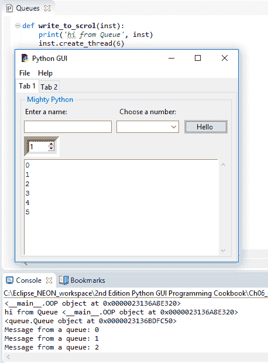

让我们深入了解代码以更好地理解它。

# 它是如何工作的…

首先，我们创建一个新的 Python 模块，名为`Queues.py`。其中`write_to_scrol`函数接受一个类的实例。我们使用这个实例来访问类的方法和属性。

在这里，我们依赖于我们的类实例具有我们函数中访问的两个方法。

在`GUI_passing_queues_member.py`中，我们首先导入`Queues`模块，将其别名设置为`bq`，然后我们使用它来调用位于`Queues`模块中的函数。

将模块别名设置为`bq`可能不是最好的名字。我的意思是想表示*后台队列*，因为它在后台以守护线程的形式运行。由于我在本书的前两版中已经使用了它，出于一致性的原因，我在这一版中不更改别名。

在`click_me`按钮回调方法中，我们将`self`传递给这个函数。这使得我们能够从另一个 Python 模块中使用所有的 GUI 方法。

导入的模块包含我们正在调用的`write_to_scrol`函数：

```py
    def write_to_scrol(inst): 
        print('hi from Queue', inst) 
        inst.create_thread(6)
```

通过传递类实例的自我引用到另一个模块中类调用的函数，我们现在可以从其他 Python 模块访问所有我们的 GUI 元素。

`gui_queue`是一个实例属性，`create_thread`是一个方法，两者都在`GUI_passing_queues_member.py`中定义，我们通过`Queues`模块中传递的 self 引用来访问它们。

我们将`Queue`创建为类的实例属性，将其引用放置在`GUI_passing_queues_member.py`类的`__init__`方法中。

现在，我们可以通过简单地使用传递给我们的 GUI 的类引用，从我们的新模块中向队列中放入消息。注意`Queues.py`代码中的`inst.gui_queue.put`：

```py
    def write_to_scrol(inst): 
        print('hi from Queue', inst) 
        for idx in range(10): 
            inst.gui_queue.put('Message from a queue: ' + str(idx)) 
        inst.create_thread(6)
```

在我们修改了 `use_queues` 方法之后，我们的图形用户界面（GUI）代码中的 `create_thread` 方法只从 `Queue` 中读取，这个 `Queue` 被我们新模块中的业务逻辑填充，这个新模块将逻辑从我们的图形用户界面（GUI）模块中分离出来。

为了将图形用户界面（GUI）小部件与表达业务逻辑的功能分离，我们创建了一个类，将队列作为该类的实例属性，并通过将类的实例传递到不同 Python 模块中的函数，我们现在可以访问所有图形用户界面（GUI）小部件以及队列。

这就是面向对象编程（OOP）的魔力。在一个类的中间，我们使用 `self` 关键字将自身传递给类内部调用的函数。

这个菜谱是一个例子，说明了在面向对象编程（OOP）中编程是有意义的。

让我们继续下一个菜谱。

# 使用对话框小部件将文件复制到您的网络

这个菜谱展示了如何从您的本地硬盘复制文件到网络位置。我们将通过使用 Python 的 `tkinter` 内置对话框来完成此操作，它使我们能够浏览硬盘。然后我们可以选择要复制的文件。

这个菜谱还展示了如何使 `Entry` 小部件只读，并将 `Entry` 默认设置为指定位置，这可以加快浏览硬盘的速度。

# 准备工作

我们将扩展前一个菜谱中构建的图形用户界面（GUI）的第二个标签页，*在不同模块间传递队列*。

# 如何操作…

在 `create_widgets()` 方法中接近底部的地方，我们将添加以下代码到图形用户界面（GUI）中，在那里我们创建了标签控制 2。新的小部件框架的父元素是 `tab2`，我们在 `create_widgets()` 方法的开头创建了它。只要您将以下代码物理地放置在 `tab2` 创建的下方，它就会工作：

1.  打开 `GUI_passing_queues_member.py` 并将其保存为 `GUI_copy_files.py`。

1.  进行以下更改：

```py
########################################################### 
def create_widgets(self): 
    # Create Tab Control
    tabControl = ttk.Notebook(self.win)   
    # Add a second tab
    tab2 = ttk.Frame(tabControl)           
    # Make second tab visible
    tabControl.add(tab2, text='Tab 2')     

# Create Manage Files Frame  
mngFilesFrame = ttk.LabelFrame(tab2, text=' Manage Files: ') 
mngFilesFrame.grid(column=0, row=1, sticky='WE', padx=10, pady=5) 

# Button Callback 
def getFileName(): 
    print('hello from getFileName') 

# Add Widgets to Manage Files Frame 
lb = ttk.Button(mngFilesFrame, text="Browse to File...", 
command=getFileName) 
lb.grid(column=0, row=0, sticky=tk.W)  

file = tk.StringVar() 
self.entryLen = scrol_w 
self.fileEntry = ttk.Entry(mngFilesFrame, width=self.entryLen, 
textvariable=file) 
self.fileEntry.grid(column=1, row=0, sticky=tk.W) 

logDir = tk.StringVar() 
self.netwEntry = ttk.Entry(mngFilesFrame, 
width=self.entryLen, textvariable=logDir) 
self.netwEntry.grid(column=1, row=1, sticky=tk.W)  

def copyFile(): 
    import shutil 
    src = self.fileEntry.get() 
    file = src.split('/')[-1] 
    dst = self.netwEntry.get() + ''+ file 
    try: 
        shutil.copy(src, dst) 
        msg.showinfo('Copy File to Network', 'Succes: 
        File copied.') 
    except FileNotFoundError as err: 
        msg.showerror('Copy File to Network', '*** Failed to copy 
        file! ***\n\n' + str(err)) 
    except Exception as ex: 
        msg.showerror('Copy File to Network', '*** Failed to copy 
        file! ***\n\n' + str(ex)) 

cb = ttk.Button(mngFilesFrame, text="Copy File To : ", 
command=copyFile) 
cb.grid(column=0, row=1, sticky=tk.E) 

# Add some space around each label 
for child in mngFilesFrame.winfo_children(): 
    child.grid_configure(padx=6, pady=6)
```

1.  运行代码会创建以下图形用户界面（GUI）：

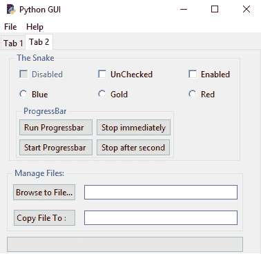

1.  点击浏览到文件…按钮：

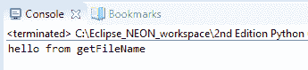

+   1.  打开 `GUI_copy_files.py`。

    1.  添加以下两个 `import` 语句：

```py
from tkinter import filedialog as fd 
from os import path
```

1.  创建以下函数：

```py
def getFileName(): 
    print('hello from getFileName') 
    fDir  = path.dirname(__file__) 
    fName = fd.askopenfilename(parent=self.win, initialdir=fDir)
```

1.  运行代码并点击浏览到按钮：

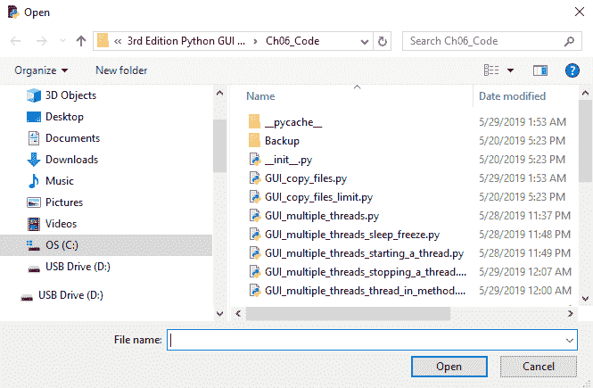

1.  在创建 `Entry` 小部件时添加以下两行代码：

```py
# Adding a Textbox Entry widget 
self.name = tk.StringVar()
self.name_entered = ttk.Entry(mighty, width=24, textvariable=self.name)
self.name_entered.grid(column=0, row=1, sticky='W') 
self.name_entered.delete(0, tk.END)
self.name_entered.insert(0, '< default name >')
```

1.  运行代码并查看以下结果：

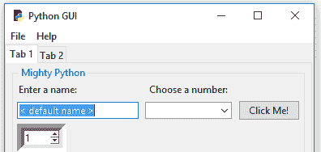

1.  现在，打开 `GUI_copy_files.py` 并添加以下代码：

```py
# Module level GLOBALS 
GLOBAL_CONST = 42 
fDir   = path.dirname(__file__) 
netDir = fDir + 'Backup' 

def __init__(self): 
    self.createWidgets()        
    self.defaultFileEntries() 

def defaultFileEntries(self): 
    self.fileEntry.delete(0, tk.END) 
    self.fileEntry.insert(0, fDir)  
    if len(fDir) > self.entryLen: 
        self.fileEntry.config(width=len(fDir) + 3) 
        self.fileEntry.config(state='readonly') 

    self.netwEntry.delete(0, tk.END) 
    self.netwEntry.insert(0, netDir)  
    if len(netDir) > self.entryLen: 
        self.netwEntry.config(width=len(netDir) + 3)
```

1.  运行 `GUI_copy_files.py` 会导致以下截图：

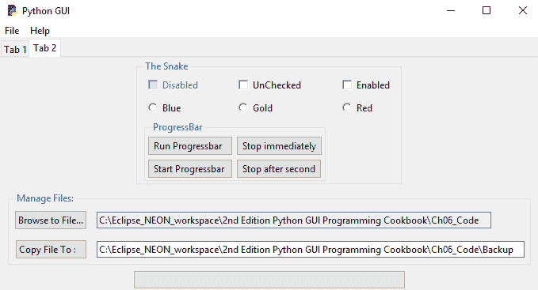

1.  打开 `GUI_copy_files.py` 并添加以下代码：

```py
# Module level GLOBALS 
GLOBAL_CONST = 42 

from os import makedirs 
fDir   = path.dirname(__file__) 
netDir = fDir + 'Backup'  
if not path.exists(netDir): 
    makedirs(netDir, exist_ok = True)
```

一旦我们点击调用 `copyFile()` 函数的按钮，我们就导入所需的模块。

1.  打开 `GUI_copy_files.py` 并添加以下代码：

```py
from tkinter import messagebox as msg
def copyFile(): 
    import shutil                   #import module within function
    src = self.fileEntry.get() 
    file = src.split('/')[-1] 
    dst = self.netwEntry.get() + ''+ file 
    try: 
        shutil.copy(src, dst) 
        msg.showinfo('Copy File to Network', 'Succes: File 
        copied.') 
    except FileNotFoundError as err: 
        msg.showerror('Copy File to Network', 
        '*** Failed to copy file! ***\n\n' + str(err)) 
    except Exception as ex: 
        msg.showerror('Copy File to Network', 
        '*** Failed to copy file! ***\n\n' + str(ex))
```

1.  运行代码，浏览到文件，并点击复制按钮：

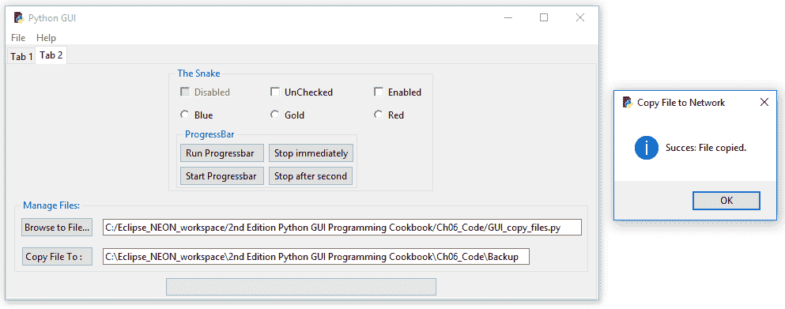

1.  运行代码，但不要浏览并点击复制按钮：

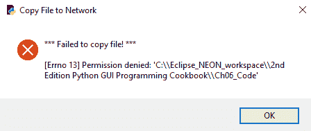

1.  打开`GUI_copy_files.py`并将其保存为`GUI_copy_files_limit.py`。

1.  添加以下代码：

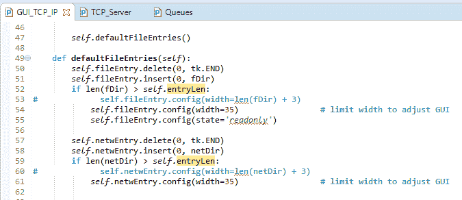

1.  运行前面的代码以观察输出，如下面的截图所示：

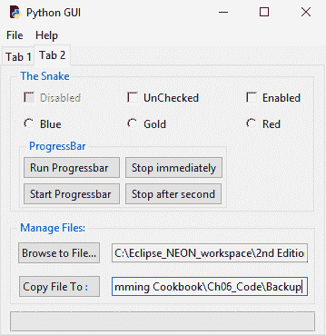

让我们深入了解代码以更好地理解它。

# 它是如何工作的...

在`GUI_copy_files.py`中，我们在 GUI 的标签 2 中添加了两个按钮和两个输入框。我们还没有实现按钮回调函数的功能。

点击“浏览文件...”按钮当前会在控制台打印`hello from getFileName`。在添加`import`语句后，我们可以使用`tkinter`内置的文件对话框。

我们现在可以在代码中使用对话框。而不是硬编码路径，我们可以使用 Python 的`os`模块来找到我们的 GUI 模块所在的全路径。点击“浏览文件...”按钮现在会打开`askopenfilename`对话框。我们现在可以在这个目录中打开文件或浏览到不同的目录。在对话框中选择文件并点击“打开”按钮后，我们将文件的全路径保存到`fName`局部变量中。

如果我们在打开 Python 的`askopenfilename`对话框小部件时，它自动默认到一个目录，这样我们就不必浏览到我们要打开特定文件的地方。最好的做法是通过回到我们的 GUI 标签 1 来演示如何做这件事，这就是我们接下来要做的。

我们可以将值默认到`Entry`小部件中。回到我们的标签 1，这非常简单。当我们现在运行 GUI 时，`name_entered`输入框有一个默认值。我们可以获取我们正在使用的模块的全路径，然后我们可以在它下面创建一个新的子文件夹。我们可以将这作为一个模块级别的全局变量，或者我们可以在一个方法中创建子文件夹。

我们为两个`Entry`小部件设置了默认值，并在设置后，使本地文件`Entry`小部件为只读。

这个顺序很重要。我们必须首先填充输入框，然后再将其设置为只读。

在调用主事件循环之前，我们也在选择标签 2，并且不再将焦点设置到标签 1 的`Entry`中。在`tkinter`的`notebook`上调用`select`是零基索引的，所以通过传入值`1`，我们选择了标签 2：

```py
    # Place cursor into name Entry 
    # name_entered.focus()                 # commented out             
    tabControl.select(1)                   # displayTab 2 at GUI startup 
```

由于我们不在同一个网络上，这个菜谱使用本地硬盘代替网络。

**UNC**路径是**通用命名约定**，这意味着通过使用双反斜杠而不是典型的`C:\`，我们可以访问网络上的服务器。

您只需使用 UNC 路径，并将`C:\`替换为`\\<servername>\<folder>`。

这个例子可以用来将我们的代码备份到备份目录，如果它不存在，我们可以使用`os.makedirs`来创建它。在选择了要复制到其他地方的文件后，我们导入 Python 的`shutil`模块。我们需要复制文件的源完整路径以及网络或本地目录路径，然后使用`shutil.copy`将文件名追加到我们将要复制的路径中。

`shutil` 是 shell 工具的缩写表示。

我们还通过消息框向用户反馈，以指示复制是否成功。为了做到这一点，我们导入`messagebox`并将其别名设置为`msg`。

在接下来的代码中，我们混合了两种不同的放置`import`语句的方法。在 Python 中，我们有其他语言所不具备的灵活性。我们通常将所有的`import`语句放置在每个 Python 模块的顶部，以便清楚地知道我们正在导入哪些模块。同时，现代编码方法是将变量的创建放置在它们首次被使用的函数或方法附近。

在代码中，我们在 Python 模块的顶部导入消息框，但随后也在一个函数中导入了`shutil` Python 模块。我们为什么希望这样做？这样做甚至可行吗？答案是肯定的，它是可行的，我们将这个`import`语句放入函数中，因为这是我们代码中唯一真正需要此模块的地方。

如果我们从未调用这个方法，那么我们永远不会导入这个方法所需的模块。从某种意义上说，你可以将这种技术视为**懒加载初始化设计模式**。如果我们不需要它，我们不会在 Python 代码中真正需要它时才导入它。这里的想法是，我们的整个代码可能需要，比如说，20 个不同的模块。在运行时，哪些模块真正需要取决于用户交互。如果我们从未调用`copyFile()`函数，那么就没有必要导入`shutil`。

当我们现在运行 GUI，浏览到文件，并点击复制时，文件将被复制到我们在 Entry 小部件中指定的位置。

如果文件不存在或者我们忘记浏览到文件而试图复制整个父文件夹，代码也会告诉我们这一点，因为我们正在使用 Python 内置的异常处理功能。

我们新的`Entry`小部件确实扩展了 GUI 的宽度。虽然有时候看到整个路径是件好事，但同时它也会推其他小部件，使我们的 GUI 看起来不那么好。我们可以通过限制`Entry`小部件的宽度参数来解决这个问题。我们在`GUI_copy_files_limit.py`中这样做。这导致 GUI 大小有限。我们可以按右箭头键在启用的`Entry`小部件中到达该小部件的末尾。

我们正在使用 Python shell 工具将文件从本地硬盘复制到网络上。由于我们大多数人没有连接到同一个局域网，我们通过将代码备份到不同的本地文件夹来模拟复制。

我们正在使用`tkinter`对话框控件之一，并通过默认目录路径，我们可以提高复制文件的效率。

让我们继续下一个菜谱。

# 使用 TCP/IP 通过网络进行通信

本菜谱展示了如何使用`sockets`通过*TCP/IP*进行通信。为了实现这一点，我们需要一个*IP 地址*和一个*端口号*。

为了使事情简单，并且独立于不断变化的互联网 IP 地址，我们将创建自己的本地 TCP/IP 服务器和客户端，我们将学习如何通过 TCP/IP 连接将客户端连接到服务器并读取数据。

我们将通过使用之前菜谱中创建的队列将这种网络功能集成到我们的 GUI 中。

**TCP/IP**代表**传输控制协议/互联网协议**，是一组网络协议，允许两台或多台计算机进行通信。

# 准备工作

我们将创建一个新的 Python 模块，它将成为 TCP 服务器。

# 如何实现…

在 Python 中实现 TCP 服务器的一种方法是从`socketserver`模块继承。我们子类化`BaseRequestHandler`然后覆盖继承的`handle`方法。在非常少的 Python 代码中，我们可以实现一个 TCP 服务器：

1.  创建一个新的 Python 模块并将其保存为`TCP_Server.py`。

1.  添加以下代码以创建 TCP 服务器和`start`函数：

```py
from socketserver import BaseRequestHandler, TCPServer 

class RequestHandler(BaseRequestHandler): 
    # override base class handle method 
    def handle(self): 
        print('Server connected to: ', self.client_address) 
        while True: 
            rsp = self.request.recv(512) 
            if not rsp: break 
            self.request.send(b'Server received: ' + rsp) 

def start_server(): 
    server = TCPServer(('', 24000), RequestHandler) 
    server.serve_forever()
```

1.  打开`Queues.py`并添加以下代码以创建套接字并使用它：

```py
# using TCP/IP
from socket import socket, AF_INET, SOCK_STREAM 

def write_to_scrol_TCP(inst): 
    print('hi from Queue', inst) 
    sock = socket(AF_INET, SOCK_STREAM) 
    sock.connect(('localhost', 24000)) 
    for idx in range(10): 
    sock.send(b'Message from a queue: ' + bytes(str(idx).encode()) ) 
        recv = sock.recv(8192).decode() 
        inst.gui_queue.put(recv)       
    inst.create_thread(6)
```

1.  打开`GUI_copy_files_limit.py`并将其保存为`GUI_TCP_IP.py`。

1.  添加以下代码以在单独的线程中启动 TCP 服务器：

```py
class OOP(): 
    def __init__(self): 
        # Start TCP/IP server in its own thread 
        svrT = Thread(target=start_server, daemon=True) 
        svrT.start()
```

1.  运行代码并点击 Tab 1 上的“点击我！”按钮：

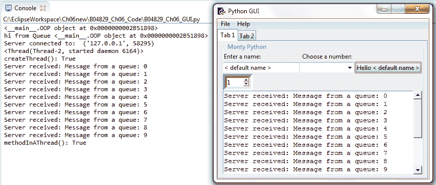

让我们深入幕后更好地理解代码。

# 它是如何工作的…

在`TCP_Server.py`中，我们将`RequestHandler`类传递给`TCPServer`初始化器。空的单引号是 localhost 的快捷方式，即我们的个人电脑。这是`127.0.0.1`的 IP 地址。元组中的第二个项目是*端口号*。我们可以选择任何在我们本地电脑上未使用的端口号。

我们必须确保我们在 TCP 连接的客户端使用相同的端口；否则，我们就无法连接到服务器。

当然，在客户端能够连接之前，我们必须首先启动服务器。我们将修改`Queues.py`模块以成为 TCP 客户端。当我们现在点击“点击我！”按钮时，我们正在调用`bq.write_to_scrol_TCP(self)`，然后创建套接字和连接。

这就是我们与 TCP 服务器通信所需的所有代码。在这个例子中，我们只是向服务器发送一些字节，服务器将它们发送回来，并在返回响应之前添加一些字符串。

这展示了 TCP 通过网络通信的工作原理。

一旦我们知道了如何通过 TCP/IP 连接到远程服务器，我们将使用我们感兴趣与之通信的程序协议设计的任何命令。在我们可以向服务器上驻留的特定应用程序发送命令之前，第一步是连接。

在`write_to_scrol_TCP`函数中，我们使用与之前相同的循环，但现在我们将消息发送到 TCP 服务器。服务器修改接收到的消息，然后将其发送回我们。接下来，我们将它放入 GUI 类实例队列中，正如之前的菜谱中所述，它在自己的线程中运行：

```py
sock.send(b'Message from a queue: ' + bytes(str(idx).encode()) )
```

注意字符串前面的`b`字符，然后进行所需的其余转换。

我们在 OOP 类的初始化器中在自己的线程中启动 TCP 服务器。

在 Python 3 中，我们以二进制格式通过套接字发送字符串。现在添加整数索引变得有点复杂，因为我们不得不将其转换为字符串，对其进行编码，然后将编码后的字符串转换为字节！

在 Tab 1 上点击“点击我！”按钮现在会在我们的`ScrolledText`小部件以及控制台上创建输出，由于使用了线程，响应速度非常快。我们创建了一个 TCP 服务器来模拟连接到我们局域网或互联网上的服务器。我们将我们的队列模块变成了 TCP 客户端。我们在各自的背景线程中运行队列和服务器，这使得我们的 GUI 非常响应。

让我们继续下一个菜谱。

# 使用`urlopen`从网站读取数据

这个菜谱展示了我们如何通过使用 Python 的一些内置模块轻松地读取整个网页。我们首先以原始格式显示网页数据，然后对其进行解码，然后我们在我们的 GUI 中显示它。

# 准备工作

我们将从网页中读取数据，然后在我们的 GUI 的`ScrolledText`小部件中显示它。

# 如何做到这一点...

首先，我们创建一个新的 Python 模块，并将其命名为`URL.py`。然后我们导入使用 Python 读取网页所需的功能。我们可以在非常少的代码行中做到这一点：

1.  创建一个新的模块并命名为`URL.py`。

1.  添加以下代码以打开和读取 URL：

```py
from urllib.request import urlopen 
link = 'http://python.org/'  
try:
    http_rsp = urlopen(link)
    print(http_rsp)
    html = http_rsp.read()
    print(html)
    html_decoded = html.decode()
    print(html_decoded) 
except Exception as ex:
    print('*** Failed to get Html! ***\n\n' + str(ex)) 
else:
    return html_decoded
```

1.  运行前面的代码并观察以下输出：

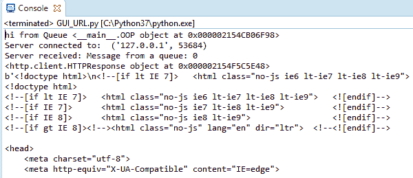

1.  将结果与刚刚读取的官方 Python 网页进行比较：

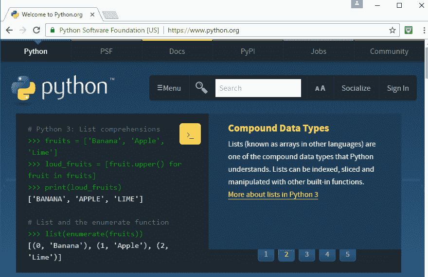

让我们考虑下一个场景：

1.  打开`URL.py`。

1.  将代码放入一个函数中：

```py
from urllib.request import urlopen 
link = 'http://python.org/'  

def get_html():
    try:
        http_rsp = urlopen(link)
        print(http_rsp)
        html = http_rsp.read()
        print(html)
        html_decoded = html.decode()
        print(html_decoded) 
    except Exception as ex:
        print('*** Failed to get Html! ***\n\n' + str(ex)) 
    else:
        return html_decoded
```

1.  从上一个菜谱中的`GUI_TCP_IP.py`打开并保存为`GUI_URL.py`。

1.  导入`URL`模块并修改`click_me`方法：

```py
import Ch06_Code.URL as url

# Button callback 
def click_me(self): 
    self.action.configure(text='Hello ' + self.name.get())
    bq.write_to_scrol(self) 
    sleep(2)
    html_data = url.get_html()
    print(html_data)
    self.scrol.insert(tk.INSERT, html_data)
```

1.  运行代码，输出如下：

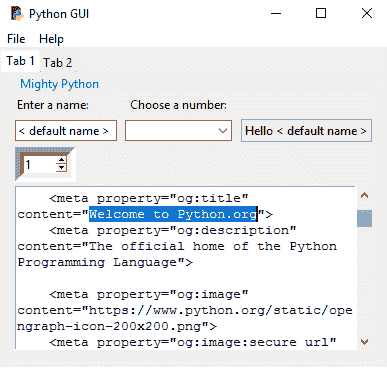

下一个部分将详细讨论这个过程。

# 它是如何工作的...

我们将`URL.py`代码包裹在一个类似于 Java 和 C#的`try...except`块中。这是一种现代的编程方法，Python 支持。每当我们的代码可能无法完成时，我们可以尝试这段代码，如果它有效，那就没问题。如果`try...except`块中的代码无法工作，Python 解释器将抛出几种可能的异常之一，然后我们可以捕获它。一旦我们捕获了异常，我们就可以决定下一步做什么。

Python 中存在异常的层次结构，我们也可以创建自己的类，这些类从 Python 异常类继承并扩展。在下面的代码中，我们主要关注的是我们试图打开的 URL 可能不可用，因此我们将代码包裹在一个`try...except`代码块中。如果代码成功打开请求的 URL，那就没问题。如果失败了，可能是因为我们的互联网连接断开，我们将进入代码的异常部分并打印出异常已发生。

你可以在[`docs.python.org/3.7/library/exceptions.html`](https://docs.python.org/3.7/library/exceptions.html)了解更多关于 Python 异常处理的信息。

通过在官方 Python 网站上调用`urlopen`，我们得到整个数据作为一个长字符串。第一个`print`语句将这个长字符串打印到控制台。然后我们对结果调用`decode`，这次我们得到了超过 1,000 行的网页数据，包括一些空白。我们还打印出`type`，调用`urlopen`的是`http.client.HTTPResponse`对象。实际上，我们首先打印它。

接下来，我们在 GUI 中的`ScrolledText`小部件中显示这些数据。为了做到这一点，我们必须将我们的新模块（从网页读取数据）连接到我们的 GUI。为了实现这一点，我们需要一个对我们 GUI 的引用，一种方法是将我们的新模块绑定到 Tab 1 按钮回调。我们可以从 Python 网页返回解码后的 HTML 数据到`Button`小部件，然后将其放置到`ScrolledText`控制中。

我们将`URL.py`代码转换为一个函数，并将数据返回给调用代码。现在，我们可以通过首先导入新模块，然后将数据插入到小部件中，将我们的按钮回调方法中的数据写入`ScrolledText`控制。我们还在调用`write_to_scrol`后给它一些休眠时间。

在`GUI_URL.py`中，HTML 数据现在显示在我们的 GUI 小部件中。
