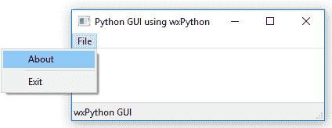

# 使用 wxPython 库扩展我们的 GUI

在本章中，我们将介绍另一个不与 Python 一起分发的 Python GUI 工具包。它被称为 wxPython。这个库有两个版本。原始版本被称为 **Classic**，而最新版本被称为其开发项目的代码名，即 **Phoenix**。

较旧的 Classic 版本不与 Python 3.x 兼容，我们将不会进一步探讨这个版本，而是专注于 Phoenix 软件版本。

在本书中，我们仅使用 Python 3.7 及更高版本进行编程，因为新的 Phoenix 项目也旨在支持 Python 3.7 及更高版本，因此这是我们本章将使用的 wxPython 版本。

首先，我们将安装框架。然后，我们将创建一个简单的 wxPython GUI，之后，我们将尝试将我们在本书中开发的基于 `tkinter` 的 GUI 与新的 wxPython 库连接起来。

wxPython 是 wxWidgets 的 Python 绑定。wxPython 中的 *w* 代表 Windows 操作系统，而 *x* 代表基于 Unix 的操作系统，例如 Linux 和苹果的 macOS。

虽然 `tkinter` 与 Python 一起分发，但拥有使用其他与 Python 兼容的 GUI 框架的经验是有价值的。这将提高你的 Python GUI 编程技能，并且你可以选择在你的项目中使用哪个框架。

这是本章 Python 模块的概述：


在本章中，我们将通过使用 wxPython 库来增强我们的 Python GUI。我们将涵盖以下配方：

+   安装 wxPython 库

+   在 wxPython 中创建我们的 GUI

+   使用 wxPython 快速添加控件

+   尝试将主 wxPython 应用嵌入到主 tkinter 应用中

+   尝试将我们的 tkinter GUI 代码嵌入到 wxPython 中

+   使用 Python 控制两个不同的 GUI 框架

+   两个连接的 GUI 之间的通信

# 安装 wxPython 库

wxPython 库不是与 Python 一起分发的，因此为了使用它，我们首先必须安装它。这个配方将向我们展示在哪里以及如何找到正确的版本来安装，以便与已安装的 Python 版本和正在运行的操作系统相匹配。

wxPython 第三方库已经存在了 18 年多，这表明它是一个健壮的库。

# 准备工作

为了使用 wxPython 与 Python 3.7 及更高版本，我们必须安装 wxPython Phoenix 版本。这是下载页面的链接：[`wxpython.org/pages/downloads/`](https://wxpython.org/pages/downloads/)。我们将使用此链接下载和安装 wxPython GUI 框架。

这是到 PyPI 的链接，其中包含有关如何使用 wxPython 的良好信息：[`pypi.org/project/wxPython/`](https://pypi.org/project/wxPython/)。

# 如何做到这一点...

几年前，找到适合 Python 3 的正确 wxPython 版本有点棘手，但现在我们可以简单地使用 `pip`。让我们详细看看：

1.  打开命令提示符或 PowerShell 窗口。

1.  输入 `pip install wxPython`。

1.  结果应该看起来像这样：


1.  确认在你的 Python `site-packages` 文件夹中有一个名为 `wx` 的新文件夹：


1.  创建一个新的模块，并将其命名为 `Hello_wxPython.py`。

1.  添加以下代码：

```py
import wx 
app = wx.App() 
frame = wx.Frame(None, -1, "Hello World") 
frame.Show() 
app.MainLoop() 
```

1.  运行前面的 Python 3.7 脚本将使用 wxPython/Phoenix 创建以下 GUI：


现在，让我们深入了解代码，更好地理解它。

# 它是如何工作的…

首先，我们使用 `pip` 安装 wxPython 框架。然后，我们验证我们是否有新的 `wx` 文件夹。

`wx` 是 wxPython Phoenix 库安装到的文件夹的名称。我们将使用 `wx` 这个名称将这个模块导入到我们的 Python 代码中。

我们可以通过执行来自官方 wxPython/Phoenix 网站的简单演示脚本来验证我们的安装是否成功。官方网站的链接是 [`wxpython.org/pages/overview/#hello-world`](https://wxpython.org/pages/overview/#hello-world)。

在这个菜谱中，我们成功安装了与 Python 3.7 兼容的正确版本的 wxPython 工具包。我们找到了这个 GUI 工具包的 Phoenix 项目，这是当前和活跃的开发线。Phoenix 将最终取代经典的 wxPython 工具包，并且专门设计来与 Python 3.7 一起很好地工作。

在成功安装 wxPython/Phoenix 工具包后，我们只用五行代码就创建了 GUI。

我们之前通过使用 `tkinter` 实现了相同的结果。

# 在 wxPython 中创建我们的 GUI

在这个菜谱中，我们将开始使用 wxPython GUI 工具包创建我们的 Python GUI。我们首先将重新创建我们之前使用 `tkinter` 创建的一些小部件，`tkinter` 是 Python 的一部分。然后，我们将探索 wxPython GUI 工具包提供的一些小部件，这些小部件使用 `tkinter` 创建起来并不那么容易。

# 准备工作

之前的菜谱向你展示了如何安装与你的 Python 版本和运行操作系统相匹配的正确版本的 wxPython。探索 wxPython GUI 工具包的一个好地方是访问以下网址：[`wxpython.org/Phoenix/docs/html/gallery.html`](http://wxpython.org/Phoenix/docs/html/gallery.html)。

这个网页显示了多个 wxPython 小部件，通过点击任何一个，我们都会被带到它们的文档，这对于想要快速了解 wxPython 控件的人来说是一个非常有用的功能：


现在，让我们使用 wxPython 库。

# 如何做到这一点…

我们可以非常快速地创建一个带有标题、菜单栏和状态栏的工作窗口。这个状态栏在鼠标悬停在小部件上时显示菜单项的文本。接下来，执行以下步骤：

1.  创建一个新的 Python 模块，并将其命名为 `wxPython_frame_GUI.py`。

1.  添加以下代码：

```py
# Import wxPython GUI toolkit 
import wx 

# Subclass wxPython frame 
class GUI(wx.Frame): 
    def __init__(self, parent, title, size=(200,100)): 
        # Initialize super class 
        wx.Frame.__init__(self, parent, title=title, size=size) 

        # Change the frame background color  
        self.SetBackgroundColour('white') 

        # Create Status Bar 
        self.CreateStatusBar()  

        # Create the Menu 
        menu= wx.Menu() 

        # Add Menu Items to the Menu 
        menu.Append(wx.ID_ABOUT, "About", "wxPython GUI") 
        menu.AppendSeparator() 
        menu.Append(wx.ID_EXIT,"Exit"," Exit the GUI") 

        # Create the MenuBar 
        menuBar = wx.MenuBar() 

        # Give the Menu a Title 
        menuBar.Append(menu,"File")  

        # Connect the MenuBar to the frame 
        self.SetMenuBar(menuBar)   

        # Display the frame 
        self.Show() 

# Create instance of wxPython application 
app = wx.App() 

# Call sub-classed wxPython GUI increasing default Window size 
GUI(None, "Python GUI using wxPython", (300,150)) 

# Run the main GUI event loop 
app.MainLoop() 
```

1.  这将创建以下 GUI，它使用 wxPython 库用 Python 编写：



1.  创建一个新的模块并将其命名为 `wxPython_panel_GUI.py`。

1.  添加以下代码：

```py
import wx                                  # Import wxPython GUI toolkit 
class GUI(wx.Panel):                       # Subclass wxPython Panel 
    def __init__(self, parent): 

        # Initialize super class 
        wx.Panel.__init__(self, parent) 

        # Create Status Bar 
        parent.CreateStatusBar()  

        # Create the Menu 
        menu= wx.Menu() 

        # Add Menu Items to the Menu 
        menu.Append(wx.ID_ABOUT, "About", "wxPython GUI") 
        menu.AppendSeparator() 
        menu.Append(wx.ID_EXIT,"Exit"," Exit the GUI") 

        # Create the MenuBar 
        menuBar = wx.MenuBar() 

        # Give the Menu a Title 
        menuBar.Append(menu,"File")  

        # Connect the MenuBar to the frame 
        parent.SetMenuBar(menuBar)   

        # Create a Print Button 
        button = wx.Button(self, label="Print", pos=(0,60)) 

        # Connect Button to Click Event method  
        self.Bind(wx.EVT_BUTTON, self.printButton, button) 

        # Create a Text Control widget  
        self.textBox = wx.TextCtrl(self, size=(280,50), 
        style=wx.TE_MULTILINE) 

    # callback event handler     
    def printButton(self, event): 
        self.textBox.AppendText(
        "The Print Button has been clicked!")  

app = wx.App()      # Create instance of wxPython application 
                    # Create frame
frame = wx.Frame(None, title="Python GUI using wxPython", size=(300,180))  
GUI(frame)          # Pass frame into GUI 
frame.Show()        # Display the frame 
app.MainLoop()      # Run the main GUI event loop 
```

1.  运行前面的代码并点击我们的 wxPython 按钮小部件，将产生以下 GUI 输出：


现在，让我们幕后了解代码，以便更好地理解它。

# 它是如何工作的…

在 `wxPython_frame_GUI.py` 代码中，我们继承自 `wx.Frame`。在下一代码中，我们继承自 `wx.Panel` 并将 `wx.Frame` 传递到我们类的 `__init__()` 方法中。

在 wxPython 中，顶级 GUI 窗口被称为框架。没有框架就不能有 wxPython GUI，框架必须作为 wxPython 应用程序的一部分来创建。我们在代码的底部创建了应用程序和框架。

为了将小部件添加到我们的 GUI 中，我们必须将它们附加到一个面板上。面板的父级是框架（我们的顶级窗口），而我们放入面板中的小部件的父级是面板。在 `wxPython_panel_GUI.py` 代码中，`parent` 是我们传递给 GUI 初始化器的 `wx.Frame`。我们还向面板小部件添加了一个按钮小部件，当点击时，会在 `textbox` 中打印一些文本。

在这个菜谱中，我们使用成熟的 wxPython GUI 工具包创建了我们的 GUI。仅用几行 Python 代码，我们就能够创建一个带有最小化、最大化和退出按钮的完整功能的 GUI。我们添加了一个菜单栏、一个多行文本控件和一个按钮。我们还创建了一个状态栏，当选择菜单项时，会在状态栏中显示文本。我们将所有这些小部件放入一个面板容器小部件中。我们将按钮连接到打印到文本控件。当悬停在菜单项上时，状态栏中会显示一些文本。

# 使用 wxPython 快速添加控件

在这个菜谱中，我们将重新创建本书早期使用 `tkinter` 创建的 GUI，但这次我们将使用 wxPython 库。我们将看到使用 wxPython GUI 工具包创建自己的 Python GUI 是多么容易和快捷。

我们不会重新创建之前章节中创建的全部功能。例如，我们不会国际化我们的 wxPython GUI，也不会将其连接到 MySQL 数据库。我们将重新创建 GUI 的视觉方面并添加一些功能。

比较不同的库为我们提供了选择用于我们自己的 Python GUI 开发的工具包的机会，我们可以在自己的 Python 代码中组合这些工具包中的几个。

# 准备工作

确保您已安装 wxPython 模块，以便遵循此菜谱。

# 如何做到这一点…

让我们看看如何执行这个菜谱：

1.  首先，我们创建我们的 Python `OOP` 类，就像之前使用 `tkinter` 一样，但这次我们继承并扩展了 `wx.Frame` 类。我们将类命名为 `MainFrame`。

1.  创建一个新的 Python 模块，并将其命名为 `GUI_wxPython.py`。

1.  添加以下代码：

```py
import wx 
BACKGROUNDCOLOR = (240, 240, 240, 255) 

class MainFrame(wx.Frame): 
    def __init__(self, *args, **kwargs): 
        wx.Frame.__init__(self, *args, **kwargs) 
        self.createWidgets() 
        self.Show() 

    def exitGUI(self, event):       # callback 
        self.Destroy() 

    def createWidgets(self):    
        self.CreateStatusBar()      # wxPython built-in method 
        self.createMenu() 
        self.createNotebook() 
```

1.  添加以下代码以创建一个 `notebook` 小部件：

```py
 #---------------------------------------------------------- 
    def createNotebook(self): 
        panel = wx.Panel(self) 
        notebook = wx.Notebook(panel) 
        widgets = Widgets(notebook) # Custom class explained below 
        notebook.AddPage(widgets, "Widgets") 
        notebook.SetBackgroundColour(BACKGROUNDCOLOR)  
        # layout 
        boxSizer = wx.BoxSizer() 
        boxSizer.Add(notebook, 1, wx.EXPAND) 
        panel.SetSizerAndFit(boxSizer)   
```

1.  添加一个新的类并命名为 `Widgets`：

```py
class Widgets(wx.Panel): 
    def __init__(self, parent): 
        wx.Panel.__init__(self, parent) 
        self.createWidgetsFrame() 
        self.addWidgets() 
        self.layoutWidgets() 
```

1.  添加以下方法：

```py
    #------------------------------------------------------ 
    def createWidgetsFrame(self): 
        self.panel = wx.Panel(self) 
        staticBox = wx.StaticBox(self.panel, -1, "Widgets Frame")     
        self.statBoxSizerV = wx.StaticBoxSizer(staticBox, wx.VERTICAL) 
    #----------------------------------------------------- 
    def layoutWidgets(self):          
        boxSizerV = wx.BoxSizer(wx.VERTICAL) 
        boxSizerV.Add(self.statBoxSizerV, 1, wx.ALL) 
        self.panel.SetSizer(boxSizerV) 
        boxSizerV.SetSizeHints(self.panel)               
    #------------------------------------------------------ 
    def addWidgets(self): 
        self.addCheckBoxes()         
        self.addRadioButtons() 
        self.addStaticBoxWithLabels() 
```

1.  添加 `addStaticBoxWithLabels` 方法：

```py
    def addStaticBoxWithLabels(self): 
        boxSizerH = wx.BoxSizer(wx.HORIZONTAL) 
        staticBox = wx.StaticBox(self.panel, -1, "Labels within a Frame") 
        staticBoxSizerV = wx.StaticBoxSizer(staticBox, wx.VERTICAL) 
        boxSizerV = wx.BoxSizer( wx.VERTICAL ) 
        staticText1 = wx.StaticText(self.panel, -1, "Choose a number:") 
        boxSizerV.Add(staticText1, 0, wx.ALL) 
        staticText2 = wx.StaticText(self.panel, -1,"Label 2") 
        boxSizerV.Add(staticText2, 0, wx.ALL) 
        #------------------------------------------------------ 
        staticBoxSizerV.Add(boxSizerV, 0, wx.ALL) 
        boxSizerH.Add(staticBoxSizerV) 
        #------------------------------------------------------ 
        boxSizerH.Add(wx.TextCtrl(self.panel)) 
        # Add local boxSizer to main frame 
        self.statBoxSizerV.Add(boxSizerH, 1, wx.ALL) 
```

1.  添加以下方法并在 `__init__` 中调用它们：

```py
class Widgets(wx.Panel): 
    def __init__(self, parent): 
        wx.Panel.__init__(self, parent) 
        self.panel = wx.Panel(self) 
        self.createWidgetsFrame() 
        self.createManageFilesFrame() 
        self.addWidgets() 
        self.addFileWidgets() 
        self.layoutWidgets()    
    #---------------------------------------------------------- 
    def createWidgetsFrame(self): 
        staticBox = wx.StaticBox(self.panel, -1, "Widgets Frame", 
        size=(285, -1))    
        self.statBoxSizerV = wx.StaticBoxSizer(staticBox, 
        wx.VERTICAL)    
    #---------------------------------------------------------- 
    def createManageFilesFrame(self): 
        staticBox = wx.StaticBox(self.panel, -1, "Manage Files", 
        size=(285, -1))    
        self.statBoxSizerMgrV = wx.StaticBoxSizer(staticBox, 
        wx.VERTICAL) 
    #---------------------------------------------------------- 
    def layoutWidgets(self):          
        boxSizerV = wx.BoxSizer( wx.VERTICAL ) 
        boxSizerV.Add( self.statBoxSizerV, 1, wx.ALL ) 
        boxSizerV.Add( self.statBoxSizerMgrV, 1, wx.ALL ) 

        self.panel.SetSizer( boxSizerV ) 
        boxSizerV.SetSizeHints( self.panel ) 
    #---------------------------------------------------------- 
    def addFileWidgets(self):    
        boxSizerH = wx.BoxSizer(wx.HORIZONTAL) 
        boxSizerH.Add(wx.Button(self.panel, label='Browse to 
        File...'))    
        boxSizerH.Add(wx.TextCtrl(self.panel, size=(174, -1), 
        value= "Z:" )) 

        boxSizerH1 = wx.BoxSizer(wx.HORIZONTAL) 
        boxSizerH1.Add(wx.Button(self.panel, label=
        'Copy File To: '))  
        boxSizerH1.Add(wx.TextCtrl(self.panel, size=(174, -1),  
        value="Z:Backup" ))     

        boxSizerV = wx.BoxSizer(wx.VERTICAL) 
        boxSizerV.Add(boxSizerH) 
        boxSizerV.Add(boxSizerH1)         

        self.statBoxSizerMgrV.Add( boxSizerV, 1, wx.ALL ) 
```

1.  在模块的底部，添加调用 `MainLoop` 的代码：

```py
#====================== 
# Start GUI 
#====================== 
app = wx.App() 
MainFrame(None, , size=(350,450)) 
app.MainLoop() 
```

1.  运行 `GUI_wxPython.py`。我们的 wxPython GUI 的最终结果如下：


现在，让我们深入了解代码，以更好地理解它。

# 它是如何工作的……

首先，我们创建一个新的 Python 模块。为了清晰起见，我们不再将我们的类命名为 `OOP`，而是将其重命名为 `MainFrame`。

在 wxPython 中，主 GUI 窗口被称为框架。

我们还创建了一个回调方法，当点击 Exit 菜单项时关闭 GUI，并声明一个浅灰色元组作为我们的 GUI 的背景颜色。然后，我们通过创建 wxPython 的 `Notebook` 类的实例并将其分配给我们的自定义类 `Widgets` 作为其父类，向我们的 GUI 添加一个选项卡控件。`Notebook` 类实例变量以 `wx.Panel` 作为其父类。

在 wxPython 中，选项卡控件被命名为 `Notebook`，就像在 `tkinter` 中一样。

每个 `Notebook` 小部件都需要一个父类，为了在 wxPython 的 `Notebook` 中布局小部件，我们使用不同类型的 sizers。

wxPython 的 sizers 是布局管理器，类似于 `tkinter` 的网格布局管理器。

接下来，我们向 `Notebook` 页面添加控件，我们通过创建一个继承自 `wx.Panel` 的单独类 `Widgets` 来完成这项工作。我们通过将代码分解成小方法来模块化我们的 GUI 代码，遵循 Python OOP 编程的最佳实践，这使我们的代码易于管理和理解。

当使用 wxPython 的 `StaticBox` 小部件时，为了成功布局它们，我们使用 `StaticBoxSizer` 和常规 `BoxSizer` 的组合。wxPython 的 `StaticBox` 与 `tkinter` 的 `LabelFrame` 小部件非常相似。

在 `tkinter` 中将 `StaticBox` 嵌套在另一个 `StaticBox` 内是直接的，但使用 wxPython 则稍微不那么直观。使它工作的一种方法在 `addStaticBoxWithLabels` 方法中显示。

在此之后，我们创建一个水平的 `BoxSizer`。接下来，我们创建一个垂直的 `StaticBoxSizer`，因为我们想在这个框架中将两个标签垂直排列。为了将另一个小部件安排在嵌入的 `StaticBox` 的右侧，我们必须将嵌入的 `StaticBox` 及其子控件和下一个小部件都分配给水平 `BoxSizer`。接下来，我们需要将这个 `BoxSizer` 分配给主 `StaticBox`。

这听起来是不是很困惑？

只需实验这些 sizers，以了解如何使用它们。从本食谱的代码开始，注释掉一些代码或修改一些 *x* 和 *y* 坐标以查看效果。阅读官方 wxPython 文档以了解更多信息也是好的。

重要的是要知道在代码中添加不同的 sizers 的位置，以便实现我们想要的布局。

为了在第一个`StaticBox`下方创建第二个`StaticBox`，我们创建了单独的`StaticBoxSizer`并将它们分配给同一个面板。我们在几个类中设计和布局我们的 wxPython GUI。一旦完成，在 Python 模块的底部部分，我们创建 wxPython 应用程序的一个实例。接下来，我们实例化我们的 wxPython GUI 代码。

之后，我们调用主 GUI 事件循环，它执行此应用程序进程中运行的全部 Python 代码。这显示了我们的 wxPython GUI。

这个配方使用了面向对象编程（OOP）来展示如何使用 wxPython GUI 工具包。

# 尝试在主 tkinter 应用程序中嵌入主 wxPython 应用程序

现在我们已经使用 Python 内置的`tkinter`库以及 wxWidgets 库的 wxPython 包装器创建了相同的 GUI，我们真的希望结合使用这些技术创建的 GUI。

wxPython 和`tkinter`库都有自己的优点。在在线论坛，如[`stackoverflow.com/`](http://stackoverflow.com/)，我们经常看到诸如哪个更好、我应该使用哪个 GUI 工具包等问题。这表明我们必须做出非此即彼的决定。实际上，我们不必做出这样的决定。

在这样做的主要挑战之一是，每个 GUI 工具包都必须有自己的事件循环。在这个配方中，我们将尝试通过从我们的`tkinter` GUI 中调用它来嵌入一个简单的 wxPython GUI。

# 准备工作

我们将重用我们在第一章“创建 GUI 表单和添加小部件”中“组合框小部件”配方中构建的`tkinter` GUI。

# 如何操作...

我们将从简单的`tkinter` GUI 开始：

1.  创建一个新的模块，并将其命名为`Embed_wxPython.py`。

1.  添加以下代码：

```py
#=========================================================== 
import tkinter as tk 
from tkinter import ttk, scrolledtext  

win = tk.Tk()          
win.title("Python GUI") 
aLabel = ttk.Label(win, text="A Label") 
aLabel.grid(column=0, row=0)     
ttk.Label(win, text="Enter a name:").grid(column=0, row=0) 
name = tk.StringVar() 
nameEntered = ttk.Entry(win, width=12, textvariable=name) 
nameEntered.grid(column=0, row=1) 
ttk.Label(win, text="Choose a number:").grid(column=1, row=0) 
number = tk.StringVar() 
numberChosen = ttk.Combobox(win, width=12, textvariable=number) 
numberChosen['values'] = (1, 2, 4, 42, 100) 
numberChosen.grid(column=1, row=1) 
numberChosen.current(0) 
scrolW = 30 
scrolH =  3 
scr = scrolledtext.ScrolledText(win, width=scrolW, height=scrolH, wrap=tk.WORD) 
scr.grid(column=0, sticky='WE', columnspan=3) 
nameEntered.focus()   
action = ttk.Button(win, text="Call wxPython GUI") 
action.grid(column=2, row=1) 
#====================== 
# Start GUI 
#====================== 
win.mainloop() 
```

1.  运行代码并观察以下输出：


1.  创建一个新的函数`wxPythonApp`，并将其放置在主循环之上：

```py

#=========================================================== 
def wxPythonApp(): 
 import wx 
    app = wx.App() 
    frame = wx.Frame(None, -1, "wxPython GUI", size=(200,150)) 
    frame.SetBackgroundColour('white') 
    frame.CreateStatusBar() 
    menu= wx.Menu() 
    menu.Append(wx.ID_ABOUT, "About", "wxPython GUI") 
    menuBar = wx.MenuBar() 
    menuBar.Append(menu,"File")  
    frame.SetMenuBar(menuBar)      
    frame.Show() 
    app.MainLoop() 

#=============== Bottom of module =================
action = ttk.Button(win, text="Call wxPython GUI", command=wxPythonApp) 
action.grid(column=2, row=1) 

#====================== 
# Start GUI 
#====================== 
win.mainloop()
```

1.  运行前面的代码会在点击`tkinter`按钮控件后从我们的`tkinter` GUI 启动 wxPython GUI：


现在，让我们深入了解代码以更好地理解它。

# 它是如何工作的...

首先，我们创建一个简单的`tkinter` GUI 并单独运行它。然后，我们尝试调用一个简单的 wxPython GUI，这是我们在这个章节之前的一个配方中创建的。

我们创建一个新的函数，`wxPythonApp`，其中包含 wxPython 代码，并将其放置在`tkinter`按钮之上。之后，我们将按钮的`command`属性设置为这个函数：

```py
action = ttk.Button(win, text="Call wxPython GUI", command=wxPythonApp)   # <====
```

重要的是，我们将整个 wxPython 代码放入一个名为`def wxPythonApp()`的单独函数中。在按钮点击事件的回调函数中，我们简单地调用这段代码。

需要注意的一件事是，我们必须在继续使用`tkinter` GUI 之前关闭 wxPython GUI。

# 尝试将我们的 tkinter GUI 代码嵌入到 wxPython 中

在这个配方中，我们将与之前的配方相反，尝试在 wxPython GUI 中调用我们的`tkinter` GUI 代码。

# 准备工作

我们将重用本章之前菜谱中创建的一些 wxPython GUI 代码。

# 如何做到这一点...

我们将从简单的 wxPython GUI 开始：

1.  创建一个新的模块并将其命名为 `Embed_tkinter.py`。

1.  添加以下代码：

```py

#============================================================= 
import wx 
app = wx.App() 
frame = wx.Frame(None, -1, "wxPython GUI", size=(270,180)) 
frame.SetBackgroundColour('white') 
frame.CreateStatusBar() 
menu= wx.Menu() 
menu.Append(wx.ID_ABOUT, "About", "wxPython GUI") 
menuBar = wx.MenuBar() 
menuBar.Append(menu,"File")  
frame.SetMenuBar(menuBar)  
textBox = wx.TextCtrl(frame, size=(250,50), style=wx.TE_MULTILINE) 

def tkinterEmbed(event): 
    tkinterApp()                             # <==== we create this function next

button = wx.Button(frame, label="Call tkinter GUI", pos=(0,60))  
frame.Bind(wx.EVT_BUTTON, tkinterEmbed, button) 
frame.Show() 

#====================== 
# Start wxPython GUI 
#====================== 
app.MainLoop()
```

1.  运行代码并观察以下输出：


1.  将以下代码添加到模块的顶部：

```py
#============================================================= 
def tkinterApp(): 
    import tkinter as tk 
    from tkinter import ttk 
    win = tk.Tk()     
    win.title("Python GUI") 
    aLabel = ttk.Label(win, text="A Label") 
    aLabel.grid(column=0, row=0)     
    ttk.Label(win, text="Enter a name:").grid(column=0, row=0) 
    name = tk.StringVar() 
    nameEntered = ttk.Entry(win, width=12, textvariable=name) 
    nameEntered.grid(column=0, row=1) 
    nameEntered.focus() 

    def buttonCallback(): 
        action.configure(text='Hello ' + name.get()) 
    action = ttk.Button(win, text="Print", command=buttonCallback) 
    action.grid(column=2, row=1) 
    win.mainloop()
#=============== Bottom of module =================
import wx
# ... 
```

1.  运行代码并点击调用 tkinter GUI 按钮。

1.  在 `tkinter` GUI 中输入一些文本并点击打印按钮。

1.  在 wxPython 的 `TextCtrl` 小部件中输入：


1.  运行代码并多次点击调用 tkinter GUI 按钮。

1.  在 `tkinter` GUI 中输入并点击打印按钮：


现在，让我们深入了解幕后，更好地理解代码。

# 它是如何工作的...

在这个菜谱中，我们与之前的菜谱相反，首先使用 wxPython 创建了一个 GUI，然后从其中创建了几种使用 `tkinter` 构建的 GUI 实例。

运行 `Embed_tkinter.py` 代码在点击 wxPython 按钮小部件后从我们的 wxPython GUI 启动一个 `tkinter` GUI。然后我们可以输入文本到 `tkinter` 文本框中，并通过点击其按钮，按钮文本会更新为名称。

在启动 `tkinter` 事件循环后，wxPython GUI 仍然可以响应，因为我们可以在 `tkinter` GUI 运行时仍然向 `TextCtrl` 小部件中输入。

在之前的菜谱中，我们无法使用我们的 `tkinter` GUI，直到我们关闭了 wxPython GUI。了解这种差异可以帮助我们做出设计决策，如果我们想结合这两种 Python GUI 技术。

我们还可以通过多次点击 wxPython GUI 按钮来创建几个 `tkinter` GUI 实例。然而，我们无法在 `tkinter` GUI 运行时关闭 wxPython GUI。我们必须先关闭它们。

当一个或多个 `tkinter` GUI 运行时，wxPython GUI 仍然可以响应。然而，点击 `tkinter` 按钮只在其第一次更新按钮文本。

# 使用 Python 控制两个不同的 GUI 框架

在这个菜谱中，我们将探讨从 Python 控制 `tkinter` 和 wxPython GUI 框架的方法。我们已经在第六章 [802f3638-4c00-4d83-8f04-3acdb39b53ec.xhtml]，*线程和网络* 中使用了 Python 线程模块来保持我们的 GUI 响应，所以在这里我们将尝试使用相同的方法。

我们将看到事情并不总是以直观的方式工作。然而，我们将改进我们的 `tkinter` GUI，使其在从内部调用 wxPython GUI 实例时不再无响应。

# 准备工作

这个菜谱将扩展本章之前的菜谱，*尝试在主 tkinter 应用程序中嵌入主 wxPython 应用程序*，其中我们成功地将主 wxPython GUI 嵌入到我们的 `tkinter` GUI 中。

# 如何做到这一点...

当我们从 `tkinter` GUI 创建 wxPython GUI 实例时，我们不能再使用 `tkinter` GUI 控件，直到我们关闭一个 wxPython GUI 实例。现在让我们改进这一点：

1.  创建一个新的模块，并将其命名为 `Control_Frameworks_NOT_working.py`。

1.  编写以下代码：

```py
#==================================================================
import tkinter as tk
from tkinter import ttk
from tkinter import scrolledtext
from threading import Thread

win = tk.Tk() 

win.title("Python GUI")
aLabel = ttk.Label(win, text="A Label")
aLabel.grid(column=0, row=0) 
ttk.Label(win, text="Enter a name:").grid(column=0, row=0)
name = tk.StringVar()
nameEntered = ttk.Entry(win, width=12, textvariable=name)
nameEntered.grid(column=0, row=1)
ttk.Label(win, text="Choose a number:").grid(column=1, row=0)
number = tk.StringVar()
numberChosen = ttk.Combobox(win, width=12, textvariable=number)
numberChosen['values'] = (1, 2, 4, 42, 100)
numberChosen.grid(column=1, row=1)
numberChosen.current(0)
scrolW = 30
scrolH = 3
scr = scrolledtext.ScrolledText(win, width=scrolW, height=scrolH, wrap=tk.WORD)
scr.grid(column=0, sticky='WE', columnspan=3)
nameEntered.focus() 

#================================================================== 
# NOT working - CRASHES Python -----------------------------------
def wxPythonApp():
    import wx
    app = wx.App()
    frame = wx.Frame(None, -1, "wxPython GUI", size=(200,150))
    frame.SetBackgroundColour('white')
    frame.CreateStatusBar()
    menu= wx.Menu()
    menu.Append(wx.ID_ABOUT, "About", "wxPython GUI")
    menuBar = wx.MenuBar()
    menuBar.Append(menu,"File") 
    frame.SetMenuBar(menuBar) 
    frame.Show()
    app.MainLoop()

def tryRunInThread():
    runT = Thread(target=wxPythonApp)       # <==== calling wxPythonApp in thread
    runT.setDaemon(True) 
    runT.start()
    print(runT)
    print('createThread():', runT.isAlive()) 

action = ttk.Button(win, text="Call wxPython GUI", command=tryRunInThread) 
action.grid(column=2, row=1)
#-----------------------------------------------------------------

#======================
# Start GUI
#======================
win.mainloop()
```

1.  运行代码。打开一些 wxPython GUI 并在 `tkinter` GUI 中输入：


1.  关闭 GUI：


为了避免如前一张截图所示，`Python.exe` 可执行进程崩溃的情况，我们不是在单独的线程中运行整个 wxPython 应用程序，而是可以将代码修改为只让 wxPython 的 `app.MainLoop` 在一个线程中运行。

1.  创建一个新的模块，并将其命名为 `Control_Frameworks.py`。

1.  编写以下代码并运行：

```py
#==================================================================
import tkinter as tk
from tkinter import ttk
from tkinter import scrolledtext
from threading import Thread

win = tk.Tk() 

win.title("Python GUI")
aLabel = ttk.Label(win, text="A Label")
aLabel.grid(column=0, row=0) 
ttk.Label(win, text="Enter a name:").grid(column=0, row=0)
name = tk.StringVar()
nameEntered = ttk.Entry(win, width=12, textvariable=name)
nameEntered.grid(column=0, row=1)
ttk.Label(win, text="Choose a number:").grid(column=1, row=0)
number = tk.StringVar()
numberChosen = ttk.Combobox(win, width=12, textvariable=number)
numberChosen['values'] = (1, 2, 4, 42, 100)
numberChosen.grid(column=1, row=1)
numberChosen.current(0)
scrolW = 30
scrolH = 3
scr = scrolledtext.ScrolledText(win, width=scrolW, height=scrolH, wrap=tk.WORD)
scr.grid(column=0, sticky='WE', columnspan=3)
nameEntered.focus() 

#================================================================== 
## working 
def wxPythonApp():
    import wx
    app = wx.App()
    frame = wx.Frame(None, -1, "wxPython GUI", size=(200,150))
    frame.SetBackgroundColour('white')
    frame.CreateStatusBar()
    menu= wx.Menu()
    menu.Append(wx.ID_ABOUT, "About", "wxPython GUI")
    menuBar = wx.MenuBar()
    menuBar.Append(menu,"File") 
    frame.SetMenuBar(menuBar) 
    frame.Show()

    runT = Thread(target=app.MainLoop)        # <==== Thread for MainLoop only
    runT.setDaemon(True) 
    runT.start()
    print(runT)
    print('createThread():', runT.isAlive())

action = ttk.Button(win, text="Call wxPython GUI", command=wxPythonApp) 
action.grid(column=2, row=1)
#================================================================== 
#======================
# Start GUI
#======================
win.mainloop()
```

让我们在下一节中详细理解这些步骤。

# 它是如何工作的…

我们首先尝试在一个线程中运行整个 wxPython GUI 应用程序，即 `Control_Frameworks_NOT_working.py`，但这没有工作，因为 wxPython 的主事件循环期望它是应用程序的主线程。

首先，`Control_Frameworks_NOT_working.py` 似乎可以正常工作，这是直观的，因为 `tkinter` 控件不再被禁用，我们可以通过点击按钮创建几个 wxPython GUI 实例。我们还可以在 wxPython GUI 中输入并选择其他的 `tkinter` 小部件。然而，当我们尝试关闭 GUI 时，我们会从 wxWidgets 接收错误，并且我们的 Python 可执行文件会崩溃。

我们通过只在一个线程中运行 wxPython 的 `app.MainLoop` 并使其相信它是主线程来解决这个问题，这个线程是一个技巧。这种方法的一个副作用是我们不能再单独关闭所有的 wxPython GUI 实例。至少有一个实例只有在关闭创建线程作为守护进程的 wxPython GUI 时才会关闭。你可以通过点击一次或多次调用 wxPython GUI 按钮来测试这一点，然后尝试关闭所有创建的 wxPython 窗口表单。我们无法关闭最后一个，除非我们关闭调用的 `tkinter` GUI！

我并不完全清楚这是为什么。直观上，我们可能期望能够关闭所有守护线程，而无需等待创建它们的父线程首先关闭。这可能与我们的主线程仍在运行时引用计数器没有被设置为零有关。在实用层面上，这就是它目前的工作方式。

# 两个连接的 GUI 之间的通信

在这个食谱中，我们将探讨使两个 GUI 互相通信的方法。

# 准备工作

阅读前面的食谱可能是为这个食谱做准备的好方法。

在这个食谱中，我们将使用与上一个食谱略有修改的 GUI 代码，但大部分基本的 GUI 构建代码是相同的。

# 如何做到这一点…

我们将编写 Python 代码，使两个 GUI 以一定程度的相互通信：

1.  创建一个新的模块，并将其命名为 `Communicate.py`。

1.  添加以下代码：

```py
#==================================================================
import tkinter as tk
from tkinter import ttk
from threading import Thread

win = tk.Tk() 
win.title("Python GUI") 
ttk.Label(win, text="Enter a name:").grid(column=0, row=0)

name = tk.StringVar()
nameEntered = ttk.Entry(win, width=12, textvariable=name)
nameEntered.grid(column=0, row=1)
nameEntered.focus() 

ttk.Label(win, text="Choose a number:").grid(column=1, row=0)
number = tk.StringVar()
numberChosen = ttk.Combobox(win, width=12, textvariable=number)
numberChosen['values'] = (1, 2, 4, 42, 100)
numberChosen.grid(column=1, row=1)
numberChosen.current(0)

text = tk.Text(win, height=10, width=40, borderwidth=2, wrap='word')
text.grid(column=0, sticky='WE', columnspan=3)

#================================================================== 
from multiprocessing import Queue 
sharedQueue = Queue()
dataInQueue = False

def putDataIntoQueue(data):
    global dataInQueue
    dataInQueue = True
    sharedQueue.put(data)

def readDataFromQueue():
    global dataInQueue
    dataInQueue = False
    return sharedQueue.get()

#================================================================== 
import wx 
class GUI(wx.Panel): 
    def __init__(self, parent):
        wx.Panel.__init__(self, parent)
        parent.CreateStatusBar() 
        menu= wx.Menu()
        menu.Append(wx.ID_ABOUT, "About", "wxPython GUI")
        menuBar = wx.MenuBar()
        menuBar.Append(menu, "File") 
        parent.SetMenuBar(menuBar) 
        button = wx.Button(self, label="Print", pos=(0,60))
        self.Bind(wx.EVT_BUTTON, self.writeToSharedQueue, button)
        self.textBox = wx.TextCtrl(self, size=(280,50), style=wx.TE_MULTILINE) 

    #-----------------------------------------------------------------
    def writeToSharedQueue(self, event):
        self.textBox.AppendText(
                        "The Print Button has been clicked!\n") 
        putDataIntoQueue('Hi from wxPython via Shared Queue.\n')
        if dataInQueue: 
            data = readDataFromQueue()
            self.textBox.AppendText(data)

            text.insert('0.0', data) # insert data into tkinter GUI

#================================================================== 
def wxPythonApp():
        app = wx.App() 
        frame = wx.Frame(
            None, title="Python GUI using wxPython", size=(300,180))
        GUI(frame) 
        frame.Show() 
        runT = Thread(target=app.MainLoop)
        runT.setDaemon(True) 
        runT.start()
        print(runT)
        print('createThread():', runT.isAlive())

#================================================================== 
action = ttk.Button(win, text="Call wxPython GUI", command=wxPythonApp) 
action.grid(column=2, row=1)

#======================
# Start GUI
#======================
win.mainloop() 
```

1.  运行代码，然后执行下一步。

1.  点击两个按钮并在控件中输入：


现在，让我们深入了解幕后，更好地理解代码。

# 它是如何工作的...

首先运行`Communicate.py`代码创建程序的`tkinter`部分，当我们在这个 GUI 中点击按钮时，它运行 wxPython GUI。两者都像之前一样同时运行，但这次在两个 GUI 之间有一个额外的通信层级。

在前面的屏幕截图中，`tkinter` GUI 显示在左侧，通过点击 Call wxPython GUI 按钮，我们调用 wxPython GUI 的一个实例。我们可以通过多次点击按钮创建多个实例。

所创建的 GUI 都保持响应。它们不会崩溃也不会冻结。

在任何 wxPython GUI 实例上点击 Print 按钮会将一句话写入其自己的`TextCtrl`小部件，并将另一行写入自身以及`tkinter` GUI。您将需要向上滚动才能看到 wxPython GUI 中的第一句话。

这种工作方式是通过使用模块级队列和`tkinter`的`Text`小部件。

一个需要注意的重要元素是，我们创建了一个线程来运行 wxPython 的`app.MainLoop`，就像我们在前面的菜谱中所做的那样：

```py
def wxPythonApp(): 
    app = wx.App() 
    frame = wx.Frame(None, title="Python GUI using wxPython", 
                     size=(300,180)) 
    GUI(frame)           
    frame.Show()         
    runT = Thread(target=app.MainLoop) 
    runT.setDaemon(True)     
    runT.start() 
```

我们创建了一个从`wx.Panel`继承的类，命名为`GUI`，然后在前面代码中实例化了该类的实例。

在这个类中，我们创建了一个按钮点击事件回调方法，然后调用上面编写的代码。正因为如此，这个类可以访问函数，并且可以写入共享队列：

```py
    #------------------------------------------------------ 
    def writeToSharedQueue(self, event): 
        self.textBox.AppendText("The Print Button has been clicked!n")  
        putDataIntoQueue('Hi from wxPython via Shared Queue.n') 
        if dataInQueue:  
            data = readDataFromQueue() 
            self.textBox.AppendText(data) 
            text.insert('0.0', data) # insert data into tkinter
```

我们首先检查在前面方法中数据是否已经放置在共享队列中，如果是这样，就将公共数据打印到两个 GUI。

`putDataIntoQueue()`行将数据放入队列，`readDataFromQueue()`读取它，并将其保存在`data`变量中。`text.insert('0.0', data)`是将此数据写入`tkinter` GUI 的 Print 按钮的 wxPython 回调方法的行。

代码中调用了以下函数，使其工作：

```py
from multiprocessing import Queue 
sharedQueue = Queue() 
dataInQueue = False 

def putDataIntoQueue(data): 
    global dataInQueue 
    dataInQueue =  True 
    sharedQueue.put(data) 

def readDataFromQueue(): 
    global dataInQueue 
    dataInQueue = False 
    return sharedQueue.get() 
```

我们使用了一个简单的布尔标志`dataInQueue`来通信当数据在队列中可用时。

在这个菜谱中，我们成功地以类似的方式结合了我们创建的两个 GUI，但它们之前是独立的，没有相互通信。然而，在这个菜谱中，我们通过使一个 GUI 启动另一个 GUI，并通过简单的多进程 Python 队列机制，我们能够使它们相互通信，将共享队列中的数据写入两个 GUI。

有许多更高级和复杂的技术可用于连接不同的进程、线程、池、锁、管道、TCP/IP 连接等等。

在 Python 精神下，我们找到了一个简单的解决方案，对我们来说很适用。一旦我们的代码变得更加复杂，我们可能需要重构它，但这是一个好的开始。
