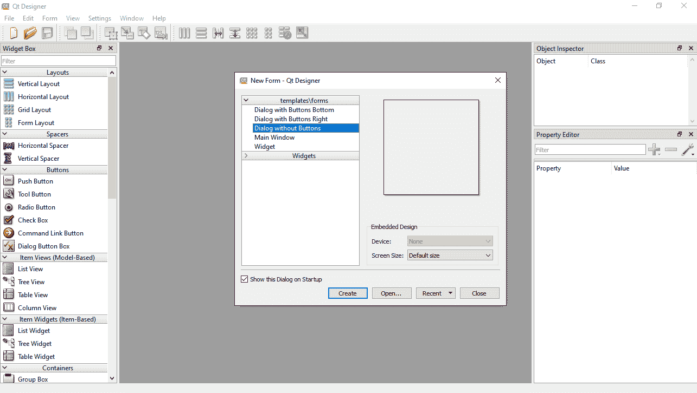

# 使用 PyQt5 构建 GUI

在本章中，我们将介绍另一个 Python GUI 工具包，名为 PyQt5，它确实非常出色。PyQt5 具有与`tkinter`相似的功能，但它附带了一个非常棒的视觉设计工具，允许我们将小部件拖放到表单上。我们还将使用另一个工具，将设计器的`.ui`代码转换为 Python 代码。

在设计器中视觉设计我们的 GUI 并将其代码转换为 Python 代码后，我们将继续使用纯 Python 为我们的小部件添加功能。首先，我们将安装 PyQt5 和设计器，然后在不使用设计器的情况下编写一个简单的 PyQt5 GUI。之后，我们将视觉设计我们的 GUI。

了解如何使用 PyQt5、视觉设计工具以及如何将`.ui`转换为`.py`代码将为您的 Python GUI 开发工具箱增添强大的技能。从这，您将学习如何创建强大而复杂的 GUI，以及如何使用模块化软件开发方法来视觉设计 UI，然后从设计中解耦功能。

这也给你提供了一个机会，比较我们在整本书中向您展示的不同 GUI 框架，这最终将引导你选择一个进行更深入的探索。

我已经创建了两个 Packt 视频课程，专注于使用`tkinter`和**PyQt5**进行 Python GUI 编程。您可以在 Packt 网站上找到它们。我还会在本章末尾提供它们的链接。

以下截图提供了您在本章中需要的 Python 模块的概述：


我们将介绍以下菜谱：

+   安装 PyQt5

+   安装 PyQt5 设计器工具

+   编写我们的第一个 PyQt5 GUI

+   更改 GUI 的标题

+   使用面向对象编程重构我们的代码

+   从 QMainWindow 继承

+   添加状态栏小部件

+   添加菜单栏小部件

+   启动 PyQt5 设计器工具

+   在 PyQt5 设计器中预览表单

+   保存 PyQt5 设计器表单

+   将设计器的`.ui`代码转换为`.py`代码

+   理解转换后的设计器代码

+   构建模块化 GUI 设计

+   在我们的菜单栏中添加另一个菜单项

+   将功能连接到退出菜单项

+   通过设计器添加标签小部件

+   在设计器中使用布局

+   在设计器中添加按钮和标签

# 安装 PyQt5

在这个菜谱中，我们将安装 PyQt5 GUI 框架。我们将使用 Python 的`pip`工具下载 PyQt5 的 wheel 格式安装程序。

您可以在以下链接找到官方文档：[`www.riverbankcomputing.com/static/Docs/PyQt5/installation.html`](https://www.riverbankcomputing.com/static/Docs/PyQt5/installation.html)。

# 准备工作

您需要在您的计算机上安装 Python 的`pip`工具。您可能已经有了它。

# 如何做到这一点...

让我们看看如何使用 Python 的`pip`工具安装 PyQt5：

1.  打开 Windows PowerShell 窗口或命令提示符。

1.  输入`pip install pyqt5`命令。

1.  按下*Enter*键。

1.  通过运行`pip list`来验证安装。

# 它是如何工作的...

在*步骤 1*中，我们打开一个 PowerShell 窗口，在*步骤 2*中，我们使用 Python 的`pip`工具。在*步骤 3*中按下*Enter*键运行命令后，安装将开始并运行至完成。您将看到类似于以下输出的内容：


在*步骤 4*中，我们再次使用`pip`来验证我们是否成功安装了 PyQt5。输出将类似于以下截图：


您可能会在您的计算机上看到安装了更多的软件包。重要的是要检查 PyQt5 软件包是否列在列表中。安装的版本号列在软件包名称的右侧。

# 安装 PyQt5 Designer 工具

在这个菜谱中，我们将安装 PyQt5 Designer 工具。我们将通过使用 Python 的`pip`工具来完成此操作。步骤与之前安装 PyQt5 的菜谱非常相似。

# 准备工作

您需要在您的计算机上安装 Python 的`pip`工具。

# 如何操作...

让我们看看如何使用 Python 的`pip`工具安装 PyQt5 Designer。请注意，该软件包不仅包括 Designer 工具：

1.  打开一个 Windows PowerShell 窗口或命令提示符。

1.  输入以下命令：

```py
pip install pyqt5-tools
```

1.  按下*Enter*键。

1.  通过运行以下命令来验证安装：

```py
pip list
```

1.  在您的硬盘上找到`Designer.exe`文件。

# 它是如何工作的...

在*步骤 1*中，我们打开一个 PowerShell 窗口，在*步骤 2*中，我们使用 Python 的`pip`工具。在*步骤 3*中按下*Enter*键运行命令后，安装将开始并运行至完成。您将看到类似于以下输出的内容：


请注意，在前面的截图中，安装遇到了错误。我不知道为什么，但有时安装会遇到错误。我简单地重新运行了安装，这次它没有遇到任何错误。包括 Designer 在内的必要工具都成功安装了。

*步骤 4*与之前的菜谱中的步骤完全相同，输出也是完全相同的。请参考*安装 PyQt5*菜谱的输出截图以获取更多信息。

在*步骤 5*中，我们想要找到`Designer.exe`文件，这是我们将在后续菜谱中使用的 Visual Designer 工具。找到它后，您可能想要在桌面上为其创建一个快捷方式。

这是`Designer.exe`在我的计算机上安装位置的截图：


您的位置可能不同，但这可以给您一个寻找工具的大致方向。

# 编写我们的第一个 PyQt5 GUI

在这个菜谱中，我们将编写我们的第一个 PyQt5 GUI。我们将直接使用 PyQt5 而不使用 Designer。

# 准备工作

您需要安装 PyQt5。请参阅*安装 PyQt5*菜谱，了解如何安装 PyQt5。使用您喜欢的 Python 编辑器编写代码。如果您不熟悉 Eclipse、PyCharm 等现代 IDE，可以使用随 Python 一起提供的 IDLE 编辑器。

# 如何操作...

让我们看看我们如何使用 PyQt5 构建我们的第一个 GUI：

1.  打开您的 Python 编辑器。

1.  创建一个新的 Python 模块并将其保存为`First_GUI_PyQt5.py`。

1.  首先输入以下导入语句：

```py
import sys 
from PyQt5.QtWidgets import QApplication, QWidget
```

1.  在导入语句下方添加以下四行代码：

```py
app = QApplication(sys.argv)
gui = QWidget() 
gui.show()
sys.exit(app.exec_())
```

1.  运行前面的代码。最大化、最小化和调整结果 GUI 的大小。点击右上角的×符号来关闭应用程序：


现在，让我们幕后看看它是如何工作的。

# 工作原理...

在*步骤 1*和*步骤 2*中，我们创建了一个新的 Python 模块。在*步骤 3*中，我们编写了一些导入语句。

我们导入`sys`以便我们可以将命令行参数传递到我们的 GUI 中。

从 PyQt5 包中导入`QApplication`和`QWidget`类，这两个类都位于`QtWidgets`模块中。

我们创建了一个`QApplication`类的实例，传递`sys.argv`以便我们可以传递额外的命令行参数。我们将此实例保存在`app`变量中。这将创建我们的应用程序。

然后，我们创建一个`QWidget`类的实例，它成为我们的 GUI。我们将此实例保存在名为`gui`的局部变量中。

接下来，我们在`gui`类实例上调用`show`方法，使 GUI 可见。

之后，我们在我们的应用程序类实例上调用`exec_`方法，这会执行我们的应用程序。我们将调用包装在`sys.exit`中，以便捕获可能发生的任何异常。如果发生异常，这将确保我们的 Python 应用程序干净地退出，而不会崩溃。

# 更改 GUI 的标题

在这个菜谱中，我们将更改上一菜谱中创建的 GUI 的标题。

# 准备工作

我们将使用上一菜谱中的代码，所以您可以选择将其输入到自己的模块中，或者从 Packt 网站下载这本书的代码。

# 如何操作...

我们将通过更改此 GUI 的标题来增强上一菜谱中的 GUI。让我们开始吧：

1.  打开`First_GUI_PyQt5.py`并将其保存为`GUI_PyQt5_title.py`。

1.  在现有代码的中间添加以下代码行：

```py
gui.setWindowTitle('PyQt5 GUI')
```

1.  运行代码并注意新的标题：


现在，让我们幕后看看它是如何工作的。

# 工作原理...

在*步骤 1*中，我们通过保存为新名称来重用上一菜谱中的代码。

在*步骤 2*中，我们在`gui`实例上调用`setWindowTitle`方法，将其作为字符串传递。当我们运行应用程序时，这个字符串成为我们的新标题。

完整的代码现在看起来是这样的：

```py
import sys 
from PyQt5.QtWidgets import QApplication, QWidget

app = QApplication(sys.argv)
gui = QWidget() 
gui.setWindowTitle('PyQt5 GUI')           # <-- method call in the middle
gui.show()
sys.exit(app.exec_())
```

在*步骤 3*中，我们运行代码并看到窗口标题现在显示为 PyQt5 GUI 而不是 python。

# 更多...

在前面的代码中需要注意的一个非常重要的事情是我们调用 `setWindowTitle` 的位置，因为这显示了每个 PyQt5 应用程序遵循的典型代码结构。

在导入语句之后，在顶部创建一个 PyQt5 应用程序。在底部执行应用程序。我们添加到 GUI 的所有功能都位于顶部和底部代码之间。

# 将我们的代码重构为面向对象编程

在这个菜谱中，我们将使用类将我们的代码重构为 **面向对象编程** （**OOP**）。这是为 PyQt5 设计器代码和本章后面将要构建的菜谱做准备。在这个菜谱中，GUI 的最终输出看起来相同，但代码将不同。

我们将构建一个继承自 `QWidget` 的类。

# 准备工作

我们将重构之前菜谱中的代码，所以请确保你理解那段代码。

# 如何做到这一点...

我们将把之前的、过程化的代码转换为面向对象的代码。以下是我们的做法：

1.  创建一个新的模块，并将其命名为 `GUI_PyQt5_refactored_OOP.py`。

1.  首先编写相同的导入语句：

```py
import sys
from PyQt5.QtWidgets import QApplication, QWidget
```

1.  创建一个继承自 `QWidget` 的类：

```py
class GUI(QWidget): 
    def __init__(self): 
        super().__init__()     
        # initialize super class, which creates the Window 
        self.initUI() 

    def initUI(self):
        self.setWindowTitle('PyQt5 GUI')    
```

1.  在前面的代码下添加一个 Python 自测部分：

```py
if __name__ == '__main__': 
    app = QApplication(sys.argv)        
    gui = GUI() 
    gui.show() 
    sys.exit(app.exec_()) 
```

1.  运行应用程序。生成的 GUI 将与之前菜谱中的相同。

# 它是如何工作的...

在 *步骤 1* 中，我们创建了一个新的模块，而在 *步骤 2* 中，我们在本章之前的菜谱中添加了相同的导入语句。

在 *步骤 3* 中，我们创建了一个新的类，它继承自 `QWidget`。我们调用 `super` 来初始化父类，这反过来又创建了我们的 GUI。

然后，我们创建并调用一个设置窗口标题的类方法。

在 *步骤 4* 中，我们使用 Python 的自测功能来创建 PyQt5 应用程序和 GUI，然后执行代码。

运行此代码将创建与之前菜谱中相同的 GUI，但我们的代码现在正在使用面向对象编程。

# 从 QMainWindow 继承

现在我们已经看到了如何从 PyQt5 类中继承，在这个菜谱中，我们将从 `QMainWindow` 继承。与从 `QWidgets` 继承相比，这为我们设计 GUI 提供了更多选项。除了设置 GUI 窗口标题外，我们还将给它一个特定的尺寸。

# 准备工作

阅读之前的菜谱，以便理解我们在这里编写的代码。

# 如何做到这一点...

我们将继承自 `QMainWindow` 并指定 GUI 的大小。让我们开始吧：

1.  创建一个新的模块，并将其命名为 `GUI_PyQt5_QMainWindow.py`。

1.  编写以下导入语句：

```py
import sys
from PyQt5.QtWidgets import QApplication, QMainWindow 
```

1.  创建以下类：

```py
class GUI(QMainWindow): 
    def __init__(self): 
        super().__init__() 
        self.initUI() 

    def initUI(self): 
        self.setWindowTitle('PyQt5 GUI') 
        self.resize(400, 300)
```

1.  添加之前菜谱中显示的相同的 `'__main__'` 代码。

1.  运行代码。生成的 GUI 将看起来与前面两个菜谱中的相同，但会更小。

# 它是如何工作的...

在 *步骤 1* 中，我们创建了一个新的模块，而在 *步骤 2* 中，我们编写了导入语句。然而，这一次，我们不是导入 `QWidgets`，而是导入 `QMainWindow`。在 *步骤 3* 中，我们创建了一个新的类，它继承自 `QMainWindow`。和之前一样，我们在调用的方法中设置了标题。然而，除了设置标题之外，我们还为我们的 GUI 指定了一个特定的尺寸。我们通过调用 `resize` 方法，并传入宽度和高度来实现这一点。

*步骤 4* 和 *步骤 5* 与前面的配方中相同，但现在的 GUI 大小是我们在 `resize` 方法中指定的。

# 添加状态栏小部件

在这个配方中，我们将开始向之前创建的 GUI 添加小部件。我们将从添加状态栏开始。这是一个 PyQt5 内置的小部件，所以我们只需要使用它。

# 准备工作

我们将扩展前面配方中的 GUI，因此请阅读前面的配方，以便理解我们在这里编写的代码。

# 如何实现...

让我们开始吧：

1.  创建一个新的模块，并将其命名为 `GUI_PyQt5_statusbar.py`。

1.  写出与前面配方中完全相同的代码，该代码可以在 `GUI_PyQt5_QMainWindow.py` 中找到。

1.  在类中创建一个新的方法，命名为 `add_widgets` 并调用它，如下面的代码块所示：

```py
Def initUI(self): 
    self.setWindowTitle('PyQt5 GUI') 
    self.resize(400, 300) 
    self.add_widgets()                # <== call new method here

def add_widgets(self):
    self.statusBar().showMessage('Text in statusbar')
```

1.  运行前面的代码，并注意 GUI 底部的新的状态栏：


现在，让我们深入了解这是如何工作的。

# 它是如何工作的...

在 *步骤 1* 中，我们创建了一个新的模块，而在 *步骤 2* 中，我们重用了前面配方中的代码。在 *步骤 3* 中，我们创建了一个新的方法 `add_widget`，在其中我们创建了 PyQt5 内置的状态栏。我们使用 `self` 来访问这个小部件，因为 `statusBar` 小部件是 `QMainWindow` 的一部分。这也是我们为什么选择从 `QMainWindow` 继承而不是从 `QWidgets` 继承来构建我们的 GUI 的原因之一。

在创建状态栏后，我们立即调用其上的 `showMessage` 方法。我们本可以将这分成两个步骤来做，即创建状态栏并将这个类的实例保存在一个局部变量中，然后使用这个变量来调用 `showMessage`。在这里，我们将代码简化为了一行。

# 添加菜单栏小部件

在这个配方中，我们将向前面配方中创建的 GUI 添加一个菜单栏。我们之前在 `tkinter` 中这样做过，但在这个配方中，我们将看到如何使用 PyQt5 创建菜单栏要简单得多，也更直观。

我们还将开始创建 PyQt5 **动作**，这些动作将为 GUI 添加功能。

# 准备工作

我们将扩展前面配方中的 GUI，其中我们添加了一个状态栏。为了理解我们在这里编写的代码，请阅读前面的配方。

# 如何实现...

我们将扩展前面配方中的内容，其中我们添加了第一个小部件。让我们看看我们如何做到这一点：

1.  创建一个新的模块，并将其命名为 `GUI_PyQt5_menubar.py`。

1.  复制之前菜谱中的代码，该代码位于 `GUI_PyQt5_statusbar.py` 文件中。

1.  在 `add_widgets` 方法中，添加以下代码：

```py
def add_widgets(self): 
    self.statusBar().showMessage('Text in statusbar')

    menubar = self.menuBar()                            
    file_menu = menubar.addMenu('File')                

    new_action = QAction('New', self)                   
    file_menu.addAction(new_action)                     

    new_action.setStatusTip('New File')
```

1.  运行前面的代码。您将看到一个带有菜单项的新菜单栏。点击文件菜单，然后点击新建。查看状态栏中的文本：


让我们深入了解它是如何工作的。

# 它是如何工作的...

在 *步骤 1* 中，我们创建了一个新模块，而在 *步骤 2* 中，我们重用了之前菜谱中的代码。在 *步骤 3* 中，我们在 `add_widgets` 方法中添加了新代码。再次，我们使用 `self` 来访问内置在 `QMainWindow` 中的 `menuBar` 类。在创建菜单栏的实例后，我们使用 `addMenu` 方法创建一个菜单。我们使用 `QAction` 类创建一个菜单项，然后我们使用 `addAction` 方法将此菜单项添加到菜单中。

我们使用 `new_action` 变量来调用 `setStatusTip`。现在，当我们点击文件 | 新建时，我们可以在状态栏中看到显示的文本，如图 *步骤 4* 所示。

# 启动 PyQt5 设计器工具

在这个菜谱中，我们将开始使用 PyQt5 设计器工具。我们将通过视觉设计我们的 GUI，并将小部件拖放到主窗口表单中。这个表单可以是 `QWidgets` 表单或 `QMainWindow` 表单。

# 准备工作

您需要在您的计算机上安装 PyQt5 和 Qt 设计器工具。请阅读 *安装 PyQt5* 和 *安装 PyQt5 设计器工具* 菜谱，以了解如何进行此操作。

# 如何做...

您需要运行 `Designer.exe` 文件。其位置可以在 *安装 PyQt5 设计器工具* 菜谱中找到。

让我们开始吧：

1.  定位 `Designer.exe` 并双击它以运行。

1.  设计器 GUI 将以以下方式打开：



1.  在“新建表单 - Qt 设计器”对话框中，如图所示，将左上角默认值更改为主窗口。

1.  点击对话框中的创建按钮。

1.  您应该看到 Qt 设计器变为以下视图：


让我们深入了解我们所看到的内容。

# 它是如何工作的...

在 *步骤 1* 中，我们通过双击可执行文件来启动 Qt 设计器。在 *步骤 2* 中，我们可以看到，默认情况下，我们被提供了一个对话框表单，允许我们创建新的 UI 或打开现有的 UI。

在对话框后面的表单是深灰色，这意味着它是空的。这实际上是我们在其中设计 GUI 的区域。

在左侧，我们可以看到 Widget Box 区域。这个区域包含所有 Designer 可以访问的 PyQt5 小部件。我们将从 Widget Box 中拖放小部件到 UI 表单中。

在设计器的右侧，我们有两个窗口：对象检查器和属性编辑器。目前它们都是空的。

在*步骤 3*中，我们将默认设置更改为主窗口，因为我们想创建一个`QMainWindow`应用程序。在之前的菜谱中，我们是手动完成这个操作的，但在这里我们使用设计器来为我们完成这个操作。

在*步骤 4*中，我们点击创建按钮，这将关闭对话框并在设计器的中心区域创建一个新的主窗口表单。同时，右侧的两个窗口也不再为空。

在*步骤 5*中，我们注意到主窗口拥有的类和属性。在对象检查器中，我们可以看到四个类：QMainWindow、QWidget、QMenuBar 和 QStatusBar。在之前的菜谱中，我们手动添加了菜单栏和状态栏。在创建新的`QMainWindow`时使用设计器工具，我们可以看到设计器已经为我们自动添加了这项功能。

在属性编辑器中，我们可以看到中央小部件对象的几何形状属性。这是一个 QWidget，是整个主窗口的中心部分。菜单栏和状态栏分别位于中央表单的上方和下方。几何形状属性的默认值为 800 x 600，这将成为我们以这种方式运行代码时的 GUI 的最终大小。

我们可以使用这个属性来更改 UI 的大小。或者，我们可以将 UI 表单拖到设计器的中心来更改其大小。这将更新这个属性，使其两种方式都有效。

在设计器周围看看，以了解它是如何工作的以及它提供了哪些信息。

# 在 PyQt5 设计器中预览表单

在这个菜谱中，我们将学习如何预览我们使用设计器创建的表单。这是设计器为我们提供的一个非常有用的功能，因为我们可以在设计过程中进行更改、撤销更改、预览更改，等等，直到我们对设计满意为止。到那时，我们可以保存设计。

# 准备工作

您需要在您的计算机上安装 PyQt5 和 Qt Designer 工具。

# 如何操作...

按照之前的菜谱中解释的，运行 `Designer.exe`。我们将更改主窗口的大小，然后预览它。按照以下步骤学习如何预览表单：

1.  从上一个菜谱中执行*步骤 1*到*步骤 5*。

1.  在属性编辑器中，将**几何形状**属性更改为`400` x `300`，如图所示：


1.  在设计器菜单中，点击表单 | 预览... 或按 *Ctrl* + *R*。

1.  您应该看到以下预览：


让我们深入了解代码，以更好地理解它。

# 它是如何工作的...

在*步骤 1*中，我们正在执行与之前菜谱中相同的步骤。这使我们回到了相同的状态，因为我们一旦关闭设计器工具，如果没有保存我们的 UI，我们的 UI 将会丢失。我们到目前为止还没有保存。

在 *步骤 2* 中，我们正在使用 Designer 右侧的属性编辑器更改 UI 的大小。确保在此编辑器中选中 QWidget 而不是 QMainWindow。如果你的编辑器看起来像下面的截图，只需点击它左侧的箭头来展开 QWidget 属性：


在 *步骤 3* 中，我们正在预览当前的 UI 设计。有两种方法可以做到这一点：点击菜单项并按快捷键。

*步骤 4* 显示了生成的 UI。注意窗口标题栏中的“预览”一词。

# 保存 PyQt5 Designer 表单

在本食谱中，我们将添加之前创建的相同菜单和菜单项。在预览后，我们将保存我们的 UI。

# 准备工作

您需要在您的计算机上安装 PyQt5 和 Qt Designer 工具。

# 如何操作...

运行 `Designer.exe`，如前一个食谱中所述。为了创建菜单和菜单项，我们可以在 Designer 的主窗口中直接输入。接下来，执行以下步骤：

1.  执行前一个食谱中的 *步骤 1* 和 *步骤 2*。

1.  在 Designer 中，在 MainWindow - untitled* 中，将 `File` 输入到“在此处输入”菜单中，如下面的截图所示：


1.  点击文件，输入 `New` 并按 *Enter* 键创建菜单项：


1.  按 *Ctrl* + *R* 预览 UI：


1.  关闭预览，并在 Designer 中将设计保存为 `Designer_First_UI.ui`，如下面的截图所示：


让我们深入了解，以便更好地理解这些步骤。

# 它是如何工作的...

在 *步骤 1* 中，我们正在执行与前一个食谱中相同的步骤。在 *步骤 2* 中，我们通过在 Designer 提供的菜单栏中直接输入来创建文件菜单。在 *步骤 3* 中，我们在新菜单中添加一个菜单项，同样也是通过在“在此处输入”下方输入。

在 *步骤 4* 中，我们预览我们的 UI 设计，而在 *步骤 5* 中，我们实际上第一次保存我们的设计。

注意我们设计的 UI 的扩展名是 `.ui`。

# 将 Designer .ui 代码转换为 .py 代码

在本食谱中，我们将查看我们在使用 Qt Designer 工具保存设计时保存的 `.ui` 代码。之后，我们将使用在安装 PyQt5 工具期间安装的一个实用工具，该工具将 `ui` 代码转换为 Python `py` 代码。

我们将特别使用 `pyuic5` 工具。你可以这样想：

通过使用 PyQt 版本 **5** 将 Designer **ui** 代码转换为 Python **py** 代码。

如果您正在尝试找到`pyuic5.exe`的位置，它实际上被安装到 Python 的`scripts`子文件夹中。在我的安装中，这是`C:\Python37\Scripts\pyuic5.exe`。确保您的`PATH`设置为`Scripts`文件夹，以便成功运行它。

让我们做好准备。

# 准备工作

您需要在您的计算机上安装 PyQt5 工具。

# 如何做...

首先，我们将打开在上一个菜谱中保存我们的 UI 时在 Designer 中生成的`.ui`代码。现在，按照以下步骤操作：

1.  从上一个菜谱中在文字编辑器（如 Notepad++）中打开`Designer_First_UI.ui`。

1.  查看`.ui`代码：


1.  导航到您在硬盘上保存`Designer_First_UI.ui`的位置，并打开一个 Windows PowerShell 或命令提示符窗口。

1.  输入`pyuic5 -x -o Designer_First_UI.py Designer_First_UI.ui`命令，并按以下截图所示按*Enter*键：


1.  在 PowerShell 或命令提示符窗口中运行`ls`命令以查看新生成的`.py`文件。或者，使用 Windows 文件资源管理器查看新文件：


让我们深入了解这些转换步骤以更好地理解它们。

# 它是如何工作的...

在*步骤 1*和*步骤 2*中，我们正在打开 Designer 中保存的`.ui`文件。我们使用 Notepad++或任何其他文字编辑器进行此操作。生成的`.ui`输出是清晰的 XML。

这绝对不是 Python 代码。我们必须将 XML 转换为 Python 代码，我们在*步骤 3*和*步骤 4*中这样做。

`pyuic5.exe`后面的`-x`参数使生成的 Python 模块可执行，而`-o`指定输出文件的名称。我们选择了与`.ui`文件相同的名称，但扩展名为`.py`。我们可以选择任何我们想要的名称，只要它有一个`.py`扩展名。`pyuic5`实用程序还具有将多个`.ui`文件转换为单个`.py`文件的能力，因此能够选择名称非常有用。

当运行`pyuic5.exe`时，如果转换成功，我们不会得到任何输出。如果我们没有收到任何错误，这意味着转换成功。

在*步骤 5*中，我们验证我们有了新的输出文件，即`Designer_First_UI.py`。

# 理解转换后的 Designer 代码

在上一个菜谱中，我们使用`pyuic5`转换工具将 Designer UI 代码转换为 Python 代码。在这个菜谱中，我们将查看生成的代码。我们用 Designer 创建的每个 GUI 都需要转换，我们做出的任何更改都将覆盖所有之前的代码。这将使我们能够理解如何通过 Python 的模块化方法将 UI 代码与我们将添加到 UI 的功能解耦。

# 准备工作

您需要拥有从上一个菜谱中转换的代码。如果您没有遵循本章前面的菜谱，只需从本书的 Packt 网站下载必要的代码。该网站提供了本书的所有代码，您只需点击一个按钮即可通过 GitHub 下载所有代码。

# 如何做到...

我们需要打开从`.ui`代码转换而来的`.py`代码以了解其结构。现在我们已经这样做，我们可以遵循以下步骤：

1.  从上一个菜谱中打开 `Designer_First_UI.py`。

1.  注意自动生成模块的顶部部分：


1.  看看上一节下面的导入语句：


1.  看看创建的类及其第一个方法：


1.  看看类中第一个方法下面的第二个方法：


1.  最后，看看代码底部的 `"__main__"` 部分：


1.  运行此代码。结果应该是一个运行的 Python GUI：


让我们深入了解代码背后的情况。

# 它是如何工作的...

在 *步骤 1* 中，我们将转换后的 UI 作为 Python 模块打开。在 *步骤 2* 中，我们可以看到一个重要的警告。

我强烈建议您认真对待这个警告。如果您在此模块中添加代码，并在以后通过`pyuic5.exe`重新生成代码，您所做的所有更改确实都会**丢失**！

*步骤 3* 显示了三个导入语句。这些语句始终被导入，尽管`QtGui`不是必需的，正如我在 Eclipse/PyDev 编辑器中的黄色警告和下划线所示。

*步骤 4* 显示了始终创建的类。它紧随`setupUi`方法之后。`__init__`方法之间没有。此方法中的代码对我们非常重要，因为我们可以通过生成的名称访问类属性。

在 *步骤 5* 中，我们注意到`retranslateUi`方法。此方法也是自动生成的。通过仔细观察，我们可以找到在 UI 设计阶段添加的菜单和菜单项的名称。

*步骤 6* 显示了代码底部的 `"__main__"` 部分。关于这一点，重要的是要知道，此部分仅在指定`pyuic5`转换期间的`-x`选项时创建。如果我们省略此选项，我们将看不到此部分。

在 *步骤 7* 中，我们运行我们的 GUI。注意我们不再 *预览* UI。现在这是真正的纯 Python 代码。

# 构建模块化 GUI 设计

正如我们在上一个菜谱中看到的，我们使用设计师设计的 UI 的所有自动生成的代码，一旦我们重新运行`pyuic5`工具，就会被覆盖。这是好事，因为它鼓励我们以模块化的方式设计 Python 模块（因此得名*模块*）。

在这个菜谱中，我们将从新的 Python 模块中导入生成的 UI 并在其中添加功能。每次我们重新运行 `pyuic5` 工具时，我们的代码都不会意外地被覆盖，因为我们正在将逻辑与 UI 分离。

**关注点分离**（**SoC**）是一个软件术语，指的是良好、模块化设计的好处。

因此，让我们编写一些代码！

# 准备工作

你需要从之前的菜谱中获取转换后的代码，该代码可以在 `Designer_First_UI.py` 中找到。

# 如何操作...

我们将创建一个新的模块，在其中我们将向我们的 UI 代码添加功能。我们将导入我们在 Qt 设计器中创建并转换为 Python 代码的 UI。让我们开始吧：

1.  创建一个新的 Python 模块，并将其命名为 `Designer_GUI_modular.py`。

1.  在这个模块中，编写以下代码行：

```py
from Ch10_Code.Designer_First_UI import Ui_MainWindow
```

注意，你可能需要调整 `Ch10_Code` 前缀以匹配你的位置。

1.  运行前面的代码。你不应该遇到任何错误。

1.  接下来，将 `Designer_First_UI.py` 中的 `"__main__"` 部分复制到这个新模块中。

1.  你还需要导入 `QtWidgets` 来使这生效：

```py
from PyQt5 import QtWidgets
from Ch10_Code.Designer_First_UI import Ui_MainWindow

if __name__ == "__main__":
    import sys
    app = QtWidgets.QApplication(sys.argv)
    MainWindow = QtWidgets.QMainWindow()
    ui = Ui_MainWindow()
    ui.setupUi(MainWindow)
    MainWindow.show()
    sys.exit(app.exec_())
```

1.  现在，运行前面的代码。你应该能看到我们设计和之前独立运行的 GUI：


让我们深入了解代码背后的原理。

# 工作原理...

在 *步骤 1* 中，我们创建一个新的 Python 模块。在 *步骤 2* 中，我们只是将 UI 导入到 Python 生成的代码中。

**这非常重要，因为它展示了 SoC 的原则！**

在 *步骤 3* 中，我们运行这一行代码。将不会显示任何 GUI，但这里重要的是我们不会遇到任何错误。如果我们遇到一些错误，通常意味着我们的导入语句失败了，因为我们的模块无法定位我们试图导入的模块。

*步骤 4* 复制我们转换的 `.py` 文件中的 `"__main__"` 部分。当模块自行运行时，当我们导入它时，我们还需要导入 `QtWidgets`，因为当我们导入模块时，那些模块的导入语句不会自动导入。我们在 *步骤 5* 中这样做。在 *步骤 6* 中，我们的 GUI 正在运行，但这次是通过模块化方法。

# 向菜单栏添加另一个菜单项

在这个菜谱中，我们将向我们的 GUI 添加第二个菜单项。我们将使用设计器然后重新生成 UI 代码。之后，我们将从我们的模块化 Python 模块中附加功能到菜单项。设计器具有某些功能，因此它可以添加此功能，但在这里，我们只是将 UI 代码与 GUI 的功能分开。

# 准备工作

你需要从之前的菜谱中获取 UI 代码。所有其他菜谱的先决条件也适用于这个菜谱。

# 如何操作...

我们将通过添加第二个菜单项来增强之前菜谱中的 UI 设计。之后，我们将像之前一样将 UI 代码转换为 Python 代码。让我们开始吧：

1.  在 Qt 设计器中打开 `Designer_First_UI.ui`。

1.  在文件 | 新菜单项下方创建另一个菜单项并将其命名为 `Exit`：


将这个新的菜单项输入到“在此处输入”区域。它看起来会是这样：


1.  按下 *Enter* 键并保存 `.ui` 文件。接下来，预览 UI：


1.  运行 `pyuic5.exe` 工具将 `.ui` 文件转换为 `.py` 文件。让我们将其保存为新的名称，以区分我们的原始模块。

在 PowerShell 或命令提示符窗口中，输入 `pyuic5.exe -x -o Designer_First_UI_Exit.py Designer_First_UI.ui` 并然后按 *Enter* 键：


你现在应该有一个名为 `Designer_First_UI_Exit.py` 的新 Python 模块。

1.  创建一个新的 Python 模块并将其命名为 `Designer_GUI_modular_exit.py`。将新转换的文件导入其中。以下是代码的示例：

```py
from PyQt5 import QtWidgets
from Ch10_Code.Designer_First_UI_Exit import Ui_MainWindow

if __name__ == "__main__":
    import sys
    app = QtWidgets.QApplication(sys.argv)
    MainWindow = QtWidgets.QMainWindow()
    ui = Ui_MainWindow()
    ui.setupUi(MainWindow)
    MainWindow.show()
    sys.exit(app.exec_())
```

1.  运行 GUI 并点击文件菜单以查看新的退出菜单项。结果将与我们在设计器中转换之前预览运行 GUI 的 *步骤 3* 中得到的结果相同：


现在，让我们幕后了解一下发生了什么。

# 它是如何工作的...

在 *步骤 1* 中，我们打开我们之前创建的 `.ui` 设计文件。我们并没有将其保存为不同的名称，所以我们基本上是在现有的设计中添加了一个新的菜单项。

在 *步骤 2* 中，我们使用设计器工具添加一个新菜单项并将其命名为 `Exit`。

在 *步骤 3* 中，我们按 *Enter* 键，坦白说，这听起来非常简单，但如果我们不这样做，我们的新项将不会被保存。我们还将 `.ui` 文件以相同的名称保存，覆盖我们之前的版本。这是可以的，因为我们只是在 UI 中添加了一些小的功能。

在 *步骤 4* 中，我们运行 `pyuic5.exe` 工具将 `.ui` 文件的 XML 转换为 Python 代码。然而，这一次，我们给生成的 `.py` 输出文件一个与 `.ui` 文件不同的名称。我们这样做是为了不覆盖我们之前的 Python 模块。

在 *步骤 5* 中，我们创建一个新的 Python 模块并将转换后的 `.ui` 导入其中。我们之前已经这样做过了。最后，在 *步骤 6* 中，我们运行纯 Python 代码，这样我们就可以看到我们新的菜单项。

# 还有更多...

在下一个菜谱中，我们将向我们的新退出菜单项添加功能，以便当我们点击它时，我们的 GUI 确实会退出，应用程序也会结束。

# 将功能连接到退出菜单项

在这个菜谱中，我们将向我们在上一个菜谱中创建的退出菜单项添加功能。到目前为止，我们有两个菜单项，但它们不是交互式的。

在这里，我们将学习如何通过使用我们的模块化编码方法在 UI 之外添加功能。我们还将通过将 `"__main__"` 自测试部分转换为其自己的类来改进我们的代码。

# 准备中

您需要将前一个菜谱中的`.ui`代码准备好。所有其他先决条件也适用于此菜谱。

# 如何做到这一点...

我们将通过 SoC 的模块化方法为我们的 GUI 添加功能。为了使我们的代码更健壮，我们将创建一个新的类。让我们开始吧：

1.  创建一个新的 Python 模块，并将其命名为`Designer_GUI_modular_exit_class.py`。

1.  将以下导入语句输入到模块中：

```py
import sys
from PyQt5 import QtWidgets
from Ch10_Code.Designer_First_UI_Exit import Ui_MainWindow
```

1.  创建一个带有`__init__`方法的新的 Python 类：

```py
class ExitDesignerGUI():
    def __init__(self):
        app = QtWidgets.QApplication(sys.argv)
        self.MainWindow = QtWidgets.QMainWindow() 
        self.ui = Ui_MainWindow() 
        self.ui.setupUi(self.MainWindow) 
        self.update_widgets()
        self.widget_actions() 
        self.MainWindow.show()
        sys.exit(app.exec_())
```

1.  创建一个更新状态栏并连接动作到菜单项的方法：

```py
    def widget_actions(self):
        self.ui.actionExit.setStatusTip(
        'Click to exit the application') 
        self.ui.actionExit.triggered.connect(self.close_GUI)
```

1.  编写一个关闭 GUI 的回调方法：

```py
def close_GUI(self): 
    self.MainWindow.close()
```

1.  编写一个更新 GUI 标题的类方法：

```py
def update_widgets(self):
    self.MainWindow.setWindowTitle('PyQt5 GUI')
```

1.  在`"__main__"`部分创建类的实例：

```py
if __name__ == "__main__":
    ExitDesignerGUI()
```

现在，让我们看看这是如何工作的。

# 它是如何工作的...

在*步骤 1*中，我们创建了一个新的 Python 模块，而在*步骤 2*中，我们在模块顶部编写了所需的导入语句。

在模块顶部编写所有导入语句是 Python 的最佳实践，并且强烈推荐。

在*步骤 3*中，我们创建了自己的 Python 类，并从典型的初始化器开始。在初始化器方法的末尾，我们调用在初始化器下面创建的方法。因为我们这样做，所以我们只需要实例化类，方法就会运行，而无需在类实例（对象）创建后调用类的任何特定方法。

在*步骤 4*中，我们通过`self.ui.actionExit`访问我们的菜单项名称。我们可以使用`self.ui`，因为在`"__init__"`方法中，我们创建了一个`MainWindow`的实例并将其保存为这样的实例。这是代码行：

```py
self.ui = Ui_MainWindow()
```

为什么我们使用`actionExit`？我们必须查看自动生成的代码以找到这个对象名。

我们在设计师中设计了我们的 UI，设计师为我们选择了一个名字。如果我们愿意，我们可以更改那个对象名，但这不是必要的。我们只需要找到我们正在寻找的名字。所以，让我们看看`Designer_First_UI_Exit.py`：


我们可以在该文件中找到`"actionExit"`名称。

我们也可以在 Qt 设计师的对象检查器中查找它：


无论哪种方式都行。

在*步骤 4*中，我们正在实现所需的功能，即通过退出菜单项关闭我们的 GUI。

我们在以下代码行中这样做，它调用了我们在*步骤 5*中创建的方法：

```py
self.ui.actionExit.triggered.connect(self.close_GUI) 
```

需要注意的非常重要的一点是，我们通过调用`triggered.connect(**<method name>**)`来实现这个功能。这连接了*动作*到菜单项被*触发*的事件。

这是 PyQt5 的语法和语义。

在*步骤 5*中，为了关闭 GUI，我们在`MainWindow`上调用内置的`close`方法。我们在`"__init__"`方法中保存了对`MainWindow`的引用，这样我们就可以在这个方法中，在同一个 Python 类中引用它。

在*第 6 步*中，我们使用相同的`self.MainWindow`引用来给我们的 GUI 窗口设置标题。

在*第 7 步*中，我们使用 Python 的自测试`"__main__"`部分来创建一个类实例。这就是我们运行我们的 GUI 所需要做的所有事情。

现在，当我们点击`退出`菜单项时，我们的 GUI 将退出。

# 通过设计师添加标签控件

在这个菜谱中，我们将使用设计师工具将标签控件添加到我们的 UI 中。然后，我们将`.ui`代码转换为 Python 代码。这将为我们添加更多小部件和功能到我们的 GUI 做好准备。

# 准备工作

你需要从之前的菜谱中获取`.ui`代码。所有其他先决条件也适用于此菜谱。

# 如何做到这一点...

我们将通过使用设计师将标签控件添加到我们的 UI 设计中。这就像拖放一样简单。让我们开始吧：

1.  在 Qt Designer 中打开`Designer_First_UI.ui`并将其保存为`Designer_Second_UI.ui`。

1.  从设计师的左侧拖动一个标签控件到主表单中：


1.  调整标签控件的大小，使其填充`MainWindow`的大部分区域，如前一张截图所示。

1.  保存`.ui`设计并预览它：


1.  点击标签 1 和标签 2。

1.  点击退出菜单项。

1.  使用`pyuic5.exe`工具将`.ui`代码转换为 Python 代码。

1.  运行转换后的 Python UI 代码。

# 它是如何工作的...

在*第 1 步*中，我们正在打开 Qt Designer 中的现有`.ui`文件，但这次我们以不同的文件名保存它。将我们的 UI 设计的不同版本保存在不同的名称下通常是一个好主意，以防我们的 UI 设计出了问题可以回到之前的版本。

我们漂亮的 UI 设计意外地被搞乱是很常见的，所以请确保你备份了你的`.ui`文件。你也可以使用像 GitHub 这样的版本控制系统来备份你的代码。

在*第 2 步*中，我们正在使用设计师的出色拖放功能将小部件（在视觉上和物理上）移动到画布表单上。我们可以简单地使用调整大小手柄以任何我们想要的方式调整小部件。我们在*第 3 步*中这样做。

看看设计师右侧的对象检查器，注意新的标签控件，以及两个标签、对象名称和它们所属的 PyQt5 类。

你也可能注意到`MainWindow`标题右侧有一个星号（*）。这意味着我们还没有保存设计。请注意这一点，因为如果你在没有保存的情况下关闭 UI 设计，你将丢失你的美丽设计。

在*第 4 步*中，我们保存我们的 UI 设计并预览它。

在*第 5 步*中，我们可以在两个新标签之间点击。注意每个标签的默认颜色是白色，在预览模式下的颜色与设计模式下的颜色不同。

*第 6 步*将*不会*关闭 UI，因为关闭 UI 的功能与 UI 解耦。我们编写的代码使得我们可以在不同的 Python 模块中关闭 GUI。

*第 7 步*主要留给你作为练习。

习惯在设计师中做小改动，转换代码，导入，运行，然后在设计师中做更多改动，如此循环。当您使用设计师工具时，习惯这种 GUI 开发的节奏。

在 *步骤 8* 中，我们运行代码。使用 `-x` 选项创建自测试的 `"__main__"` 部分，因此您应该能够在不导入的情况下运行转换后的 Python 代码。

# 在设计师中使用布局

在本食谱中，我们将探讨使用 PyQt5 布局的非常重要的概念，我们将使用设计师工具来实现这一点。在 `tkinter` 中，我们探讨了标签框架。在 PyQt5 中，水平和垂直布局是我们设计 UI 的主要方式。

这可能有点棘手，所以，如我之前提到的，请确保您经常备份您的 UI 设计，这样当事情变得糟糕时，您有一个可以返回的基础。

在下面的食谱中，我们将将这些小部件放置到这些布局中。

# 准备工作

您需要从上一个食谱中获取 `.ui` 代码。所有其他先决条件也适用于本食谱。

# 如何做到这一点...

我们将在主窗口中添加两个水平布局，我们将使用 Qt 设计师中的拖放来完成。让我们开始吧：

1.  在设计师中打开 `Designer_Second_UI.ui` 并将其保存为 `Designer_Second_UI_layout.ui`。

1.  将一个水平布局拖动到表单底部并调整其大小。

1.  将第二个水平布局拖动到第一个布局上方：


现在，您的 `MainWindow` 将看起来像前面的截图。

1.  保存设计，将其转换为 Python 代码，然后运行以确保没有错误。代码应该能运行，但请注意，您在最终的 GUI 中不会看到任何差异。

# 它是如何工作的...

在 *步骤 1* 中，我们正在以不同的名称保存我们的 UI 设计，实际上是在做一个备份。

在 *步骤 2* 和 *步骤 3* 中，我们是在视觉上将水平布局拖动到主表单上。您可以在前面的截图中看到它们，但在预览模式下您不会注意到任何差异。

一个非常重要的事情是要注意设计师右上角的对象检查器中的名称和类，以及设计师右下角的属性编辑器中自动为我们提供的属性。

此外，请注意我们是如何将这些小部件放置在标签 1 中的。标签 2 仍然是空的。

使用这些 PyQt5 布局真正酷的地方在于，一旦我们将小部件放置到这些布局中，我们可以通过移动布局来移动整个小部件组。我们甚至可以隐藏它们，使它们变得不可见！

在 *步骤 4* 中，我们确保我们知道在设计师中做更改并将其转换为 Python 代码的过程。如果运行代码不成功，可能出了点问题。做好小改动然后测试您的代码是个好习惯。

# 在设计师中添加按钮和标签

在本食谱中，我们将添加一个按钮和一个标签，我们将把它们放在我们在前一个食谱中添加到 UI 设计的布局中。

# 准备工作

你需要从上一个食谱中获取`.ui`代码。所有其他先决条件也适用于本食谱。

# 如何做到这一点...

我们将在我们的 UI 设计中添加一个按钮和一个标签。我们还将使用设计师将它们连接起来，在设计师中直接创建一些可用功能。让我们看看步骤：

1.  在设计师中打开`Designer_Second_UI_layout.ui`并将其保存为`Designer_Second_UI_layout_button.ui`。

1.  从左侧拖动一个`PushButton`到下方的水平布局中：


注意按钮如何自动调整自身以适应水平布局的左右边缘。

1.  保存并预览 UI。在 UI 预览运行期间点击按钮：


当点击它时，按钮看起来被按下，并带有我们可以更改的默认名称。

1.  从左侧拖动一个标签小部件并将其放置到顶部的水平布局中：


1.  保存`.ui`设计并预览它：


1.  接下来，我们将`PushButton`连接到设计师内部的标签。

按下*F4*键进入信号/槽编辑模式或使用设计师中的编辑菜单。从按钮拖动一个信号/槽连接到标签。现在设计师将看起来像这样：


1.  在**配置连接**弹出对话框中，点击左上角的`clicked()`。这将启用对话框的右侧。选择`clear()`方法：


1.  点击确定并保存`.ui`文件。现在你将看到按钮和标签之间的连接：


1.  预览`.ui`代码并点击按钮。你会注意到标签文本被清除了。

1.  使用`pyuic5.exe`将`.ui`代码转换为 Python 代码，就像我们之前做的那样。

让我们看看转换后的代码，以了解按钮连接到清除标签功能的工作原理。

# 它是如何工作的...

在**步骤 1**中，我们正在以新名称保存 UI 设计，而在**步骤 2**中，我们正在将`PushButton`拖放到`MainWindow`表单上。这个按钮本身并不做任何事情，但在设计师中还有一些方法可以添加功能。

在**步骤 3**中，我们正在预览 UI。请注意，按钮自动拉伸以填充整个水平布局框。垂直方向上，它的高度仅足以显示其默认文本。这些是我们可以在属性编辑器中更改的属性。

在 *第 4 步* 中，我们将文本标签小部件可视地拖放到 `MainWindow` 中。这个小部件不会附着到水平布局的左右两侧，因为它自带一个预定义的宽度。

它会自动附着到左侧。在属性编辑器中，如果我们愿意，我们可以更改它。

*第 5 步* 给我们提供了一个从设计器内部运行的用户界面预览。

*第 6 步* 带我们进入信号/槽编辑器。信号和槽是 PyQt5 的特性。以下截图显示了如何启用此编辑器：


您可以在视图菜单下找到编辑器。这将在属性编辑器右侧打开一个新窗口：


您可以看到，`pushButton` 对象是发送者，信号是 `clicked()`，接收者是 `label`，槽是 `clear()`。

*第 7 步* 展示了当我们连接 `PushButton` 和 `Label` 小部件之间的信号和槽时，可用的功能。`clear()` 方法是内置的，因此我们可以简单地选择它，以便在按下按钮时清除标签。

在 *第 8 步* 中，我们可以看到在点击确定连接两个小部件后，编辑器发生了变化。

由于功能是在设计器内添加的，当我们预览我们的 UI 时，它实际上是可以工作的。点击按钮确实会清除标签，如 *第 9 步* 所示。

当我们将 `.ui` 代码转换为 Python 代码时，我们得到以下输出：


注意 `pushButton` 有与 `clicked.connect(<method>)` 相同的语法，这是我们在外部设计器中启用退出菜单项时所拥有的。

# 更多...

PyQt5 GUI 框架是一个非常令人兴奋的工具，可以与之一起工作。我特别喜欢 Qt 设计器工具。

与 Packt 合作，我创建了几部 *使用 PyQt5 的 Python GUI 编程食谱* 视频课程。

其中一门课程特别关注 PyQt5 GUI 开发。它大约有四个小时长。

这是我课程的截图，可以在[`www.packtpub.com/application-development/python-gui-programming-recipes-using-pyqt5-video`](https://www.packtpub.com/application-development/python-gui-programming-recipes-using-pyqt5-video)找到：


如果这对你来说太长了（我在这门课程中涵盖了大量的 PyQt5 内容），还有一个更短的课程，专注于 `tkinter` 和 PyQt5，可以在[`www.packtpub.com/application-development/hands-python-3x-gui-programming-video`](https://www.packtpub.com/application-development/hands-python-3x-gui-programming-video)找到：


<q>我希望</q>你在软件开发的努力中 <q>一切顺利</q>。<q>Python 是一种</q>很棒 <q>编程语言。</q>
