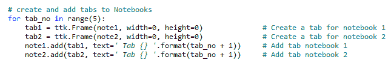

# 最佳实践

在本章中，我们将探讨不同的 *最佳实践*，这些实践可以帮助我们高效地构建 GUI，并使其既 *可维护* 又 *可扩展*。

这些最佳实践还将帮助你调试 GUI，使其达到你想要的样子。

这里是本章 Python 模块的概述：


了解如何使用最佳实践将大大提高你的 Python 编程技能。

本章将要讨论的食谱如下：

+   +   避免使用 spaghetti 代码

    +   使用 `__init__` 连接模块

    +   混合 fall-down 和 OOP 编码

    +   使用代码命名约定

    +   当不使用 OOP 时

    +   如何成功使用设计模式

    +   避免复杂性

    +   使用多个笔记本进行 GUI 设计

# 避免使用 spaghetti 代码

在这个菜谱中，我们将探讨创建 spaghetti 代码的典型方法，然后我们将看到避免此类代码的更好方法。

spaghetti 代码是功能很多且相互交织的代码。

# 准备工作

我们将创建一个新的、简单的 GUI，使用 Python 内置的 `tkinter` 库编写。

# 如何操作...

在网上搜索并阅读文档后，我们可能会先编写以下代码来创建我们的 GUI：

1.  创建一个新的模块：`GUI_Spaghetti.py`。

1.  添加以下代码：

```py
# Spaghetti Code ############################# 
def PRINTME(me):print(me) 
import tkinter  
x=y=z=1 
PRINTME(z)  
from tkinter import * 
scrolW=30;scrolH=6 
win=tkinter.Tk() 
if x:chVarUn=tkinter.IntVar() 
from tkinter import ttk 
WE='WE' 
import tkinter.scrolledtext 
outputFrame=tkinter.ttk.LabelFrame(win,text=' Type into the scrolled text control: ') 
scr=tkinter.scrolledtext.ScrolledText(outputFrame,width=scrolW,height=scrolH,wrap=tkinter.WORD) 
e='E' 
scr.grid(column=1,row=1,sticky=WE) 
outputFrame.grid(column=0,row=2,sticky=e,padx=8) 
lFrame=None 
if y:chck2=tkinter.Checkbutton(lFrame,text="Enabled",variable=chVarUn) 
wE='WE' 
if y==x:PRINTME(x)  
lFrame=tkinter.ttk.LabelFrame(win,text="Spaghetti") 
chck2.grid(column=1,row=4,sticky=tkinter.W,columnspan=3)   
PRINTME(z) 
lFrame.grid(column=0,row=0,sticky=wE,padx=10,pady=10)  
chck2.select() 
try: win.mainloop() 
except:PRINTME(x) 
chck2.deselect() 
if y==x:PRINTME(x)  
# End Pasta #############################
```

1.  运行代码并观察以下输出，如下所示：


1.  将前面的 GUI 与预期的 GUI 设计进行比较，如下所示：


1.  创建一个新的模块，`GUI_NOT_Spaghetti.py`，并添加以下代码：

```py
#====================== 
# imports 
#====================== 
import tkinter as tk 
from tkinter import ttk 
from tkinter import scrolledtext 
#====================== 
# Create instance 
#====================== 
win = tk.Tk()    
#====================== 
# Add a title        
#======================  
win.title("Python GUI") 
#========================= 
# Disable resizing the GUI 
#========================= 
win.resizable(0,0) 

```

1.  接下来，添加一些控件：

```py
#============================================================= 
# Adding a LabelFrame, Textbox (Entry) and Combobox   
#============================================================= 
lFrame = ttk.LabelFrame(win, text="Python GUI Programming Cookbook") 
lFrame.grid(column=0, row=0, sticky='WE', padx=10, pady=10) 
#============================================================= 
# Using a scrolled Text control     
#============================================================= 
outputFrame = ttk.LabelFrame(win, text=' Type into the scrolled text 
control: ') 
outputFrame.grid(column=0, row=2, sticky='E', padx=8) 
scrolW = 30 
scrolH =  6 
scr = scrolledtext.ScrolledText(outputFrame, width=scrolW, 
height=scrolH, wrap=tk.WORD) 
scr.grid(column=1, row=0, sticky='WE') 
```

1.  添加更多小部件：

```py
#============================================================= 
# Creating a checkbutton 
#============================================================= 
chVarUn = tk.IntVar() 
check2 = tk.Checkbutton(lFrame, text="Enabled", variable=chVarUn) 
check2.deselect() 
check2.grid(column=1, row=4, sticky=tk.W, columnspan=3)  
#====================== 
# Start GUI 
#====================== 
win.mainloop()
```

1.  运行代码并观察以下输出：


让我们深入了解代码以更好地理解它。

# 它是如何工作的...

当 spaghetti 代码创建了一个 GUI 时，它非常难以阅读，因为代码中存在太多的混乱。良好的代码与 spaghetti 代码相比有很多优势。

让我们先看看 spaghetti 代码的一个例子：

```py
def PRINTME(me):print(me) 
import tkinter  
x=y=z=1 
PRINTME(z)  
from tkinter import *
```

现在，考虑以下示例为良好的代码（请注意，阅读代码时没有太多的混乱）：

```py
#====================== 
# imports 
#====================== 
import tkinter as tk 
from tkinter import ttk
```

良好的代码有一个清晰的注释部分。我们可以轻松地找到导入语句：

```py
#-----------------------------------
```

考虑以下 spaghetti 代码：

```py
import tkinter.scrolledtext 
outputFrame=tkinter.ttk.LabelFrame(win,text=' Type into the scrolled text 
control: ') 
scr=tkinter.scrolledtext.ScrolledText(outputFrame,width=scrolW,height=scrolH,wrap=tkinter.WORD) 
e='E' 
scr.grid(column=1,row=1,sticky=WE) 
outputFrame.grid(column=0,row=2,sticky=e,padx=8) 
lFrame=None 
if y:chck2=tkinter.Checkbutton(lFrame,text="Enabled",variable=chVarUn) 
wE='WE' 
if y==x:PRINTME(x)  
lFrame=tkinter.ttk.LabelFrame(win,text="Spaghetti")
```

现在，考虑以下良好的代码。在这里，如前所述，我们可以轻松地找到导入语句：

```py
#============================================================= 
# Adding a LabelFrame, Textbox (Entry) and Combobox   
#============================================================= 
lFrame = ttk.LabelFrame(win, text="Python GUI Programming Cookbook") 
lFrame.grid(column=0, row=0, sticky='WE', padx=10, pady=10) 

#============================================================= 
# Using a scrolled Text control     
#============================================================= 
outputFrame = ttk.LabelFrame(win, text=' Type into the scrolled text 
control: ') 
outputFrame.grid(column=0, row=2, sticky='E', padx=8)
```

如前所述的代码块所示，良好的代码有一个自然的流程，遵循小部件在主 GUI 表单中的布局方式。

在 spaghetti 代码中，底部的 `LabelFrame` 在顶部的 `LabelFrame` 之前创建，并且与一个 `import` 语句和一些小部件创建混合在一起：

```py
#-----------------------------------
```

以下是一个 spaghetti 代码的示例，展示了这一特性：

```py
def PRINTME(me):print(me) 
x=y=z=1 
e='E' 
WE='WE' 
scr.grid(column=1,row=1,sticky=WE) 
wE='WE' 
if y==x:PRINTME(x)  
lFrame.grid(column=0,row=0,sticky=wE,padx=10,pady=10)  
PRINTME(z) 
try: win.mainloop() 
except:PRINTME(x) 
chck2.deselect() 
if y==x:PRINTME(x)
```

良好的代码不包含不必要的变量赋值，也没有一个 `PRINTME` 函数，它不会进行我们阅读代码时可能期望的调试：

```py
#-----------------------------------
```

以下代码块列举了这一方面。

这里是 spaghetti 代码：

```py
import tkinter 
x=y=z=1 
PRINTME(z)  
from tkinter import * 
scrolW=30;scrolH=6 
win=tkinter.Tk() 
if x:chVarUn=tkinter.IntVar() 
from tkinter import ttk 
WE='WE' 
import tkinter.scrolledtext
```

这里是良好的代码：

```py
import tkinter as tk 
from tkinter import ttk 
from tkinter import scrolledtext
```

良好的代码不应包含任何提到的意大利面代码实例。

`import`语句仅导入所需的模块，并且它们不会在代码中杂乱无章。也没有重复的`import`语句。没有`import *`语句：

```py
#-----------------------------------
```

以下代码块列举了这一方面。

这就是意大利面代码：

```py
x=y=z=1 
if x:chVarUn=tkinter.IntVar() 
wE='WE'
```

这里是良好的代码：

```py
#============================================================= 
# Using a scrolled Text control     
#============================================================= 
outputFrame = ttk.LabelFrame(win, text=' Type into the scrolled text
control: ') 
outputFrame.grid(column=0, row=2, sticky='E', padx=8) 
scrolW = 30 
scrolH =  6 
scr = scrolledtext.ScrolledText(outputFrame, width=scrolW, 
height=scrolH, wrap=tk.WORD) 
scr.grid(column=1, row=0, sticky='WE')
```

良好的代码，如前例所示，与意大利面代码相比，具有相当有意义的变量名。没有使用数字`1`而不是`True`的不必要的`if`语句。它还有良好的缩进，使代码更容易阅读。

在`GUI_NOT_Spaghetti.py`中，我们没有丢失预期的窗口标题，并且我们的复选框最终位于正确的位置。我们还使包围复选框的`LabelFrame`可见。

在`GUI_Spaghetti.py`中，我们既丢失了窗口标题，也没有显示顶部的`LabelFrame`。复选框最终位于错误的位置。

# 使用 __init__ 连接模块

当我们使用 Eclipse IDE 的 PyDev 插件创建新的 Python 包时，它会自动创建一个`__init__.py`模块。如果我们不使用 Eclipse，我们也可以手动创建它。

`__init__.py`模块通常是空的，然后其大小为 0 KB。

我们可以使用这个通常为空的模块，通过在其中输入代码来连接不同的 Python 模块。这个菜谱将展示如何做到这一点。

# 准备工作

我们将创建一个新的 GUI，类似于我们在之前的菜谱中创建的，*避免意大利面代码*。

# 如何做…

随着我们的项目越来越大，我们自然会将其分解成几个 Python 模块。有时，找到位于不同子目录中的模块可能会很复杂，无论是位于需要导入它的代码之上还是之下。

让我们按顺序看看这个菜谱：

1.  创建一个空文件并将其保存为`__init__.py`。

1.  看看它的大小：


1.  创建一个新的模块，`GUI__init.py`，并添加以下代码：

```py
#====================== 
# imports 
#====================== 
import tkinter as tk 
from tkinter import ttk 
#====================== 
# Create instance 
#====================== 
win = tk.Tk()    
#====================== 
# Add a title        
#======================  
win.title("Python GUI") 
```

1.  接下来，添加一些小部件和回调函数：

```py
#============================================================= 
# Adding a LabelFrame and a Button 
#============================================================= 
lFrame = ttk.LabelFrame(win, text="Python GUI Programming Cookbook") 
lFrame.grid(column=0, row=0, sticky='WE', padx=10, pady=10) 
def clickMe(): 
    from tkinter import messagebox 
    messagebox.showinfo('Message Box', 'Hi from same Level.') 
button = ttk.Button(lFrame, text="Click Me ", command=clickMe) 
button.grid(column=1, row=0, sticky=tk.S)   
#====================== 
# Start GUI 
#====================== 
win.mainloop()
```

1.  运行代码并点击`Click Me`按钮：


1.  在您运行 Python 模块的目录下创建三个子目录。

1.  将它们命名为`Folder1`、`Folder2`和`Folder3`：


1.  在`Folder3`中创建一个新的模块：`MessageBox.py`。

1.  添加以下代码：

```py
from tkinter import messagebox

def clickMe():
    messagebox.showinfo('Imported Message Box', 'Hi from Level 3')
```

1.  打开`GUI__init.py`并将其保存为`GUI__init_import_folder.py`。

1.  添加以下导入：

```py
from Ch11_Code.Folder1.Folder2.Folder3.MessageBox import clickMe
```

1.  注释掉或删除`clickMe`函数：

```py
# def clickMe():         # commented out
# from tkinter import messagebox
# messagebox.showinfo('Message Box', 'Hi from same Level.')
```

1.  在您的开发环境中运行代码并观察输出：


1.  打开命令提示符并尝试运行它。如果运行代码失败，您可以看到以下输出：


1.  打开`__init__.py`。

1.  将以下代码添加到`__init__.py`模块中：

```py
print('hi from GUI init\n') 
from sys import path 
from pprint import pprint 
#===================================================================
# Required setup for the PYTONPATH in order to find all package 
# folders 
#===================================================================
from site import addsitedir 
from os import getcwd, chdir, pardir 
while True: 
    curFull = getcwd() 
    curDir = curFull.split('\\')[-1]  
    if 'Ch11_Code' == curDir: 
        addsitedir(curFull) 
        addsitedir(curFull + 'Folder1\Folder2\Folder3') 
        break 
    chdir(pardir) 
pprint(path)
```

1.  打开 `GUI__init_import_folder.py` 并将其保存为 `GUI__init_import_folder_directly.py`。

1.  添加以下两个导入语句并注释掉之前的导入：

```py
# from Ch11_Code.Folder1.Folder2.Folder3.MessageBox import clickMe # comment out
import __init__ 
from MessageBox import clickMe
```

1.  在命令提示符中运行代码：


让我们深入了解代码，以便更好地理解它。

# 它是如何工作的…

当我们创建一个 `__init__.py` 模块时，它通常是空的，文件大小为 0 KB。

`__init__.py` 模块与 Python 类的 `__init__(self):` 方法不同。

在 `GUI__init.py` 中，我们创建了以下函数，该函数导入 Python 的消息框，然后使用它来显示消息框对话框：

```py
def clickMe(): 
    from tkinter import messagebox 
    messagebox.showinfo('Message Box', 'Hi from same Level.')
```

当我们将 `clickMe()` 消息框代码移动到嵌套目录文件夹中并尝试将其 `import` 到我们的 GUI 模块中时，我们可能会遇到一些挑战。

我们在我们的 Python 模块下方创建了三个子文件夹。然后我们将 `clickMe()` 消息框代码放入一个新的 Python 模块中，我们将其命名为 `MessageBox.py`。此模块位于 `Folder3` 中，位于我们的 Python 模块下方三个层级。

我们想导入 `MessageBox.py` 以使用该模块包含的 `clickMe()` 函数。

我们可以使用 Python 的相对导入语法：

```py
from Ch11_Code.Folder1.Folder2.Folder3.MessageBox import clickMe
```

在前面的代码中，路径是硬编码的。如果我们删除 `Folder2`，它将不再工作。

在 `GUI__init_import_folder.py` 中，我们删除了本地的 `clickMe()` 函数，现在我们的回调函数预期将使用导入的 `clickMe()` 函数。这适用于在 Eclipse 和其他将 `PYTHONPATH` 设置为开发代码的项目路径的 IDE 中。

它可能或可能不会在命令提示符中工作，这取决于你是否已将 `PYTHONPATH` 设置为 `Ch11_Code\Folder1\Folder2\Folder3` 文件夹的根目录。

为了解决这个错误，我们可以在 `__init__.py` 模块中初始化我们的 Python 搜索路径。这通常可以解决相对导入错误。

在 `GUI__init_import_folder_directly.py` 模块中，我们不再需要指定完整的文件夹路径。我们可以直接导入模块及其函数。

我们必须显式导入 `__init__` 才能使此代码工作。

这个配方展示了在遇到这种挑战时的几个故障排除方法。

# 混合逐级下降和面向对象编程（OOP）编码

Python 是一种面向对象编程语言，但并不总是使用面向对象编程有意义。对于简单的脚本任务，传统的瀑布式编码风格仍然适用。

在这个配方中，我们将创建一个新的 GUI，它混合了逐级下降编码风格和更现代的面向对象编程风格。

我们将创建一个面向对象风格的类，当我们将鼠标悬停在 Python GUI 中的小部件上时，它将显示一个工具提示，我们将使用瀑布风格创建它。

逐级下降和瀑布式编码风格是相同的。这意味着在我们从下面的代码中调用它之前，我们必须在物理上将代码放置在代码之上。在这个范例中，当我们执行代码时，代码实际上是从程序顶部逐级下降到程序底部的。

# 准备工作

在这个菜谱中，我们将使用 `tkinter` 创建一个 GUI，这与本书第一章中创建的 GUI 类似。

# 如何做到这一点...

让我们看看如何执行这个菜谱：

1.  我们将首先以过程式的方式使用 `tkinter` 创建一个 GUI，然后我们将向其中添加一个类来显示 GUI 小部件的提示信息。

1.  接下来，我们将创建一个新的模块：`GUI_FallDown.py`。

1.  添加以下代码：

```py
#====================== 
# imports 
#====================== 
import tkinter as tk 
from tkinter import ttk 
from tkinter import messagebox 
#====================== 
# Create instance 
#====================== 
win = tk.Tk()    
#====================== 
# Add a title        
#======================  
win.title("Python GUI") 
#========================= 
# Disable resizing the GUI 
#========================= 
win.resizable(0,0) 
```

1.  接下来，添加一些小部件：

```py
#============================================================= 
# Adding a LabelFrame, Textbox (Entry) and Combobox   
#============================================================= 
lFrame = ttk.LabelFrame(win, text="Python GUI Programming Cookbook") 
lFrame.grid(column=0, row=0, sticky='WE', padx=10, pady=10) 
#============================================================= 
# Labels 
#============================================================= 
ttk.Label(lFrame, text="Enter a name:").grid(column=0, row=0) 
ttk.Label(lFrame, text="Choose a number:").grid(column=1, row=0, sticky=tk.W) 
#============================================================= 
# Buttons click command 
#============================================================= 
def clickMe(name, number): 
    messagebox.showinfo('Information Message Box', 'Hello '+name+  
    ', your number is: ' + number) 
```

1.  在循环中添加更多小部件：

```py
#============================================================= 
# Creating several controls in a loop 
#============================================================= 
names         = ['name0', 'name1', 'name2'] 
nameEntries   = ['nameEntry0', 'nameEntry1', 'nameEntry2'] 
numbers       = ['number0', 'number1', 'number2'] 
numberEntries = ['numberEntry0', 'numberEntry1', 'numberEntry2'] 
buttons = [] 
for idx in range(3): 
    names[idx] = tk.StringVar() 
    nameEntries[idx] = ttk.Entry(lFrame, width=12, 
    textvariable=names[idx]) 
    nameEntries[idx].grid(column=0, row=idx+1) 
    nameEntries[idx].delete(0, tk.END) 
    nameEntries[idx].insert(0, '<name>') 
    numbers[idx] = tk.StringVar() 
    numberEntries[idx] = ttk.Combobox(lFrame, width=14,
    textvariable=numbers[idx]) 
    numberEntries[idx]['values'] = (1+idx, 2+idx, 4+idx, 42+idx, 
    100+idx) 
    numberEntries[idx].grid(column=1, row=idx+1) 
    numberEntries[idx].current(0) 
    button = ttk.Button(lFrame, text="Click Me "+str(idx+1), 
    command=lambda idx=idx: clickMe(names[idx].get(), 
    numbers[idx].get())) 
    button.grid(column=2, row=idx+1, sticky=tk.W)   
    buttons.append(button) 
#====================== 
# Start GUI 
#====================== 
win.mainloop()
```

1.  运行代码并点击其中一个按钮：


1.  创建一个新的模块：`GUI_FallDown_Tooltip.py`。

1.  使用 `GUI_FallDown.py` 中的代码，然后在顶部添加以下代码：

```py
import tkinter as tk
from tkinter import ttk
from tkinter import messagebox
#===================================================================
# Add this code at the top
class ToolTip(object):
    def __init__(self, widget, tip_text=None):
        self.widget = widget
        self.tip_text = tip_text
        widget.bind('<Enter>', self.mouse_enter)     
        widget.bind('<Leave>', self.mouse_leave)
    def mouse_enter(self, _event): 
        self.show_tooltip()        
    def mouse_leave(self, _event):
        self.hide_tooltip()
    def show_tooltip(self):
        if self.tip_text:
            x_left = self.widget.winfo_rootx() 
            # get widget top-left coordinates
            y_top = self.widget.winfo_rooty() - 18 
            # place tooltip above widget

            self.tip_window = tk.Toplevel(self.widget) 
            self.tip_window.overrideredirect(True) 
            self.tip_window.geometry("+%d+%d" % (x_left, y_top))  
            label = tk.Label(self.tip_window, text=self.tip_text, 
                          justify=tk.LEFT, background="#ffffe0", 
                          relief=tk.SOLID, borderwidth=1,
                          font=("tahoma", "8", "normal"))
            label.pack(ipadx=1)
    def hide_tooltip(self):
        if self.tip_window:
            self.tip_window.destroy() 
#====================================
# ...
# Add this code at the bottom
    # Add Tooltips to widgets
    ToolTip(nameEntries[idx], 'This is an Entry widget.') 
    ToolTip(numberEntries[idx], 'This is a DropDown widget.') 
    ToolTip(buttons[idx], 'This is a Button widget.') 
#======================
# Start GUI
#======================
win.mainloop()
```

1.  运行代码并将鼠标悬停在几个小部件上：


让我们深入了解代码以更好地理解它。

# 它是如何工作的...

首先，我们在 `GUI_FallDown.py` 中使用 `tkinter` 创建一个 Python GUI，并以瀑布式编写代码。

我们可以通过添加提示信息来改进我们的 Python GUI。最好的方法是隔离创建提示功能代码与我们的 GUI。

我们通过创建一个具有提示功能的不同类来实现这一点，然后在创建 GUI 的同一个 Python 模块中创建这个类的实例。

使用 Python，我们不需要将我们的 `ToolTip` 类放入一个单独的模块中。我们可以在过程式代码的上方放置它，然后从类代码下方调用它。

在 `GUI_FallDown_Tooltip.py` 中，代码几乎与 `GUI_FallDown.py` 相同，但现在我们有了提示信息。

我们可以非常容易地在同一个 Python 模块中混合使用过程式和面向对象编程。

# 使用代码命名约定

这个菜谱将展示遵循代码命名方案的价值：它帮助我们找到想要扩展的代码，并提醒我们程序的设计。

# 准备工作

在这个菜谱中，我们将查看 Python 模块名称，并探讨良好的命名约定。

# 如何做到这一点...

我们将创建具有不同 Python 模块名称的示例项目以比较命名：

1.  在 `Folder1` 下创建一个新的 `ModuleNames` 文件夹。

1.  添加以下 Python 模块：1、11、2 和 3：


1.  接下来，在 `Folder1` 下创建一个新的 `ModuleNames_` 文件夹。

1.  添加以下 Python 模块：1、11、2 和 3：


1.  接下来，在 `Folder1` 下创建一个新的 `ModuleNames_Desc` 文件夹。

1.  添加以下 Python 模块：`Logger`、`UnitTests`、`GUI` 和 `debug`：


1.  将此命名约定作为一个例子：


让我们深入了解代码以更好地理解它。

# 它是如何工作的...

在 *步骤 1* 中，我们创建一个名为 `ModuleNames` 的包子文件夹。

在 *步骤 2* 中，我们将 Python 模块添加到其中。

在 *步骤 3* 中，我们创建另一个包文件夹，并在名称后添加一个尾随下划线：`ModuleNames_`。

在*步骤 4*中，我们添加了与*步骤 2*中相同的名称的新 Python 模块。

在*步骤 5*中，我们创建了一个具有更多描述性名称的另一个包文件夹，名为`ModuleNames_Desc`。

在*步骤 6*中，我们添加了 Python 模块，但这次使用了更具描述性的名称，这些名称解释了每个 Python 模块的目的。

最后，在*步骤 7*中，我们展示了如何完整地展示这一点。

# 还有更多...

通常，开始编码的一种典型方式是通过递增数字，正如在`ModuleNames`中可以看到的那样。

后来，当我们回到这段代码时，我们并不清楚哪个 Python 模块提供了哪种功能，有时，我们最后递增的模块并不如早期版本好。

清晰的命名约定确实有帮助。

稍微改进一下，添加下划线可以使模块名称更易读，例如`ModuleNames_`。

更好的方法是添加一些关于模块做什么的描述，就像在`ModuleNames_Desc`中看到的那样。

虽然不完美，但为不同的 Python 模块选择的名称表明了每个模块的责任。当我们想要添加更多单元测试时，它们位于哪个模块中是清晰的。

在最后一个例子中，我们使用占位符`PRODUCT`来表示一个真实名称。

将单词`PRODUCT`替换为你目前正在工作的产品名称。

整个应用程序是一个 GUI。所有部分都是连接的。`DEBUG.py`模块仅用于调试代码。与所有其他模块相比，调用 GUI 的主要模块的名称是反转的。它以`Gui`开头，并具有`.pyw`扩展名。

这是唯一具有这种扩展名的 Python 模块。

从这种命名约定来看，如果你对 Python 足够熟悉，那么很明显，要运行这个 GUI，你可以双击`Gui_PRODUCT.pyw`模块。

所有其他 Python 模块都包含用于 GUI 的功能，并且执行底层业务逻辑以满足 GUI 所解决的问题。

Python 代码模块的命名约定对我们保持高效和帮助我们记住原始设计非常有帮助。当我们需要调试和修复缺陷或添加新功能时，它们是我们首先查看的资源。

通过数字递增模块名称并不很有意义，并且最终会浪费开发时间。

另一方面，Python 变量的命名更自由。Python 推断类型，因此我们不必指定变量将是`list`类型（它可能不是，或者稍后代码中，它可能成为不同的类型）。

变量命名的良好建议是使它们具有描述性，并且最好不要过度缩写。

如果我们想要指出某个变量被设计为`list`类型，那么使用完整的单词`list_of_things`而不是`lst_of_things`会更加直观。同样，使用`number`而不是`num`。

虽然给变量起非常描述性的名字是个好主意，但有时名字可能会太长。在苹果的 Objective-C 语言中，一些变量和函数名非常极端：`thisIsAMethodThatDoesThisAndThatAndAlsoThatIfYouPassInNIntegers:1:2:3`。

在命名变量、方法和函数时使用常识。

现在，让我们继续下一个示例。

# 何时不使用 OOP

Python 自带了面向对象编程（OOP）的能力，但与此同时，我们也可以编写不需要使用 OOP 的脚本。对于某些任务，使用 OOP 并不合适。

这个示例将向我们展示何时不使用 OOP。

# 准备工作

在这个示例中，我们将创建一个类似于之前示例的 Python GUI。我们将比较 OOP 代码和非 OOP 编程 GUI 的替代方法。结果输出将相同，但两个版本的代码略有不同。

# 如何做到这一点…

让我们看看如何执行这个示例：

1.  首先，让我们使用面向对象的方法创建一个新的 GUI。以下步骤中显示的代码将创建显示的 GUI。

1.  创建一个新的模块：`GUI_OOP.py`。

1.  添加以下代码：

```py
import tkinter as tk 
from tkinter import ttk 
from tkinter import scrolledtext 
from tkinter import Menu 
```

1.  创建一个类：

```py
class OOP(): 
    def __init__(self):  
        self.win = tk.Tk()          
        self.win.title("Python GUI")       
        self.createWidgets() 
```

1.  添加一个创建小部件的方法：

```py
def createWidgets(self): 
    tabControl = ttk.Notebook(self.win) 
    tab1 = ttk.Frame(tabControl) 
    tabControl.add(tab1, text='Tab 1') 
    tabControl.pack(expand=1, fill="both") 
    self.monty = ttk.LabelFrame(tab1, text=' Mighty Python ') 
    self.monty.grid(column=0, row=0, padx=8, pady=4) 

    ttk.Label(self.monty, text="Enter a name:").grid(column=0, 
    row=0, sticky='W') 
    self.name = tk.StringVar() 
    nameEntered = ttk.Entry(self.monty, width=12, 
    textvariable=self.name) 
    nameEntered.grid(column=0, row=1, sticky='W') 

    self.action = ttk.Button(self.monty, text="Click Me!") 
    self.action.grid(column=2, row=1) 

    ttk.Label(self.monty, text="Choose a number:")
    .grid(column=1, row=0) 
    number = tk.StringVar() 
    numberChosen = ttk.Combobox(self.monty, width=12, 
    textvariable=number) 
    numberChosen['values'] = (42) 
    numberChosen.grid(column=1, row=1) 
    numberChosen.current(0) 

    scrolW = 30; scrolH = 3 
    self.scr = scrolledtext.ScrolledText(self.monty, width=scrolW, 
    height=scrolH, wrap=tk.WORD) 
    self.scr.grid(column=0, row=3, sticky='WE', columnspan=3)
```

1.  创建一个菜单栏：

```py
    menuBar = Menu(tab1) 
    self.win.config(menu=menuBar) 
    fileMenu = Menu(menuBar, tearoff=0) 
    menuBar.add_cascade(label="File", menu=fileMenu) 
    helpMenu = Menu(menuBar, tearoff=0) 
    menuBar.add_cascade(label="Help", menu=helpMenu) 

    nameEntered.focus()      
#========================== 
oop = OOP() 
oop.win.mainloop()
```

1.  运行代码并观察以下输出：


让我们看看一个新的场景：

1.  创建一个新的模块，`GUI_NOT_OOP.py`，并添加以下代码：

```py
import tkinter as tk 
from tkinter import ttk 
from tkinter import scrolledtext 
from tkinter import Menu    

def createWidgets():     
    tabControl = ttk.Notebook(win)      
    tab1 = ttk.Frame(tabControl)             
    tabControl.add(tab1, text='Tab 1')     
    tabControl.pack(expand=1, fill="both")   
    monty = ttk.LabelFrame(tab1, text=' Mighty Python ') 
    monty.grid(column=0, row=0, padx=8, pady=4)         
```

1.  创建更多小部件：

```py
ttk.Label(monty, text="Enter a name:").grid(column=0, row=0, 
sticky='W') 
name = tk.StringVar() 
nameEntered = ttk.Entry(monty, width=12, textvariable=name) 
nameEntered.grid(column=0, row=1, sticky='W') 

action = ttk.Button(monty, text="Click Me!")    
action.grid(column=2, row=1) 

ttk.Label(monty, text="Choose a number:").grid(column=1, row=0) 
number = tk.StringVar() 
numberChosen = ttk.Combobox(monty, width=12, textvariable=number) 
numberChosen['values'] = (42) 
numberChosen.grid(column=1, row=1) 
numberChosen.current(0) 

scrolW = 30; scrolH = 3 
scr = scrolledtext.ScrolledText(monty, width=scrolW, 
height=scrolH, wrap=tk.WORD) 
scr.grid(column=0, row=3, sticky='WE', columnspan=3) 
```

1.  创建一个菜单栏：

```py
menuBar = Menu(tab1) 
win.config(menu=menuBar) 
fileMenu = Menu(menuBar, tearoff=0) 
menuBar.add_cascade(label="File", menu=fileMenu) 
helpMenu = Menu(menuBar, tearoff=0) 
menuBar.add_cascade(label="Help", menu=helpMenu) 

nameEntered.focus()
```

1.  现在，创建整个 GUI，调用创建小部件的函数：

```py
#====================== 
win = tk.Tk()          
win.title("Python GUI")    
createWidgets() 
win.mainloop()
```

1.  运行代码。生成的 GUI 将与之前显示的`GUI_OOP.py`中的 GUI 相同。

# 它是如何工作的…

首先，我们以 OOP 风格创建一个 Python `tkinter` GUI，`GUI_OOP.py`。然后，我们以过程式风格创建相同的 GUI，`GUI_NOT_OOP.py`。

我们可以通过稍微重构我们的代码来实现不使用 OOP 方法达到相同的 GUI。首先，我们移除`OOP`类及其`__init__`方法。接下来，我们将所有方法移动到左边，并移除`self`类引用，使它们变成未绑定函数。我们还移除了之前代码中所有的`self`引用。然后，我们将`createWidgets`函数调用移动到函数声明点下方。我们将其放置在`mainloop`调用之上。

最后，我们达到了相同的 GUI，但没有使用 OOP。

Python 使我们能够在合适的时候使用 OOP。其他语言，如 Java 和 C#，强制我们始终使用 OOP 方法进行编码。在这个示例中，我们探讨了不使用 OOP 的情况。

如果代码库增长，OOP 方法将更具可扩展性，但如果确定只需要这段代码，那么就没有必要通过 OOP。

现在，让我们继续下一个示例。

# 如何成功使用设计模式

在这个配方中，我们将通过使用*工厂设计模式*来创建我们的 Python GUI 的小部件。在之前的配方中，我们手动逐个创建小部件或动态地在循环中创建。使用工厂设计模式，我们将使用*工厂*来创建我们的小部件。

# 准备工作

我们将创建一个具有三个按钮的 Python GUI，每个按钮都有不同的样式。

# 如何操作...

我们将创建一个具有不同按钮样式的 Python GUI，我们将使用工厂设计模式来创建这些不同的样式：

1.  创建一个新的模块：`GUI_DesignPattern.py`。

1.  添加以下代码：

```py
import tkinter as tk
from tkinter import ttk
from tkinter import scrolledtext
from tkinter import Menu
```

1.  创建工厂类：

```py
class ButtonFactory():
    def createButton(self, type_):
        return buttonTypes[type_]()        
```

1.  创建一个基类：

```py
class ButtonBase(): 
    relief ='flat'
    foreground ='white'
    def getButtonConfig(self):
        return self.relief, self.foreground  
```

1.  创建从基类继承的类：

```py
class ButtonRidge(ButtonBase):
    relief ='ridge'
    foreground ='red'     

class ButtonSunken(ButtonBase):
    relief ='sunken'
    foreground ='blue' 

class ButtonGroove(ButtonBase):
    relief ='groove'
    foreground ='green' 
```

1.  创建一个包含之前类的列表：

```py
buttonTypes = [ButtonRidge, ButtonSunken, ButtonGroove] 
```

1.  创建一个新的类，它使用之前的代码：

```py
class OOP():
    def __init__(self): 
        self.win = tk.Tk() 
        self.win.title("Python GUI") 
        self.createWidgets()

    def createWidgets(self): 
        tabControl = ttk.Notebook(self.win) 
        tab1 = ttk.Frame(tabControl) 
        tabControl.add(tab1, text='Tab 1') 
        tabControl.pack(expand=1, fill="both") 
        self.monty = ttk.LabelFrame(tab1, text=' Monty Python ')
        self.monty.grid(column=0, row=0, padx=8, pady=4) 
        scr = scrolledtext.ScrolledText(self.monty, width=30, 
        height=3, wrap=tk.WORD)
        scr.grid(column=0, row=3, sticky='WE', columnspan=3)
        menuBar = Menu(tab1)
        self.win.config(menu=menuBar)
        fileMenu = Menu(menuBar, tearoff=0)
        menuBar.add_cascade(label="File", menu=fileMenu)
        helpMenu = Menu(menuBar, tearoff=0)
        menuBar.add_cascade(label="Help", menu=helpMenu)       
        self.createButtons()

    def createButtons(self):            
        factory = ButtonFactory() # <-- create the factory

        # Button 1
        rel = factory.createButton(0).getButtonConfig()[0]
        fg = factory.createButton(0).getButtonConfig()[1]
        action = tk.Button(self.monty, text="Button "+str(0+1), 
        relief=rel, foreground=fg) 
        action.grid(column=0, row=1) 
        # Button 2
        rel = factory.createButton(1).getButtonConfig()[0]
        fg = factory.createButton(1).getButtonConfig()[1]
        action = tk.Button(self.monty, text="Button "+str(1+1), 
        relief=rel, foreground=fg) 
        action.grid(column=1, row=1) 
        # Button 3
        rel = factory.createButton(2).getButtonConfig()[0]
        fg = factory.createButton(2).getButtonConfig()[1]
        action = tk.Button(self.monty, text="Button "+str(2+1), 
        relief=rel, foreground=fg) 
        action.grid(column=2, row=1) 
#==========================
oop = OOP()
oop.win.mainloop()
```

1.  运行代码并观察输出：


让我们深入了解代码以更好地理解它。

# 它是如何工作的...

我们创建了一个基类，我们的不同按钮样式类都从它继承，并且每个类都覆盖了`relief`和`foreground`配置属性。所有子类都从该基类继承`getButtonConfig`方法。此方法返回一个元组。

我们还创建了一个按钮工厂类和一个包含我们的按钮子类名称的列表。我们把这个列表命名为`buttonTypes`，因为我们的工厂将创建不同类型的按钮。

在模块的更下方，我们使用相同的`buttonTypes`列表创建了按钮小部件。我们创建了一个按钮工厂的实例，然后我们使用我们的工厂来创建我们的按钮。

`buttonTypes`列表中的项是我们子类的名称。

我们调用`createButton`方法，然后立即调用基类的`getButtonConfig`方法，并使用点符号获取配置属性。

我们可以看到，我们的 Python GUI 工厂确实创建了不同的按钮，每个按钮都有不同的样式。它们在文本颜色和`relief`属性上有所不同。

设计模式是我们软件开发工具箱中一个非常激动人心的工具。

# 避免复杂性

在这个配方中，我们将扩展我们的 Python GUI，并学习处理软件开发努力不断增加的复杂性。

我们的同事和客户都喜欢我们在 Python 中创建的 GUI，并要求添加更多功能到我们的 GUI 中。

这增加了复杂性，并可能轻易破坏我们的原始良好设计。

# 准备工作

我们将创建一个新的 Python GUI，类似于之前的配方，并将添加许多以小部件形式的功能。

# 如何操作...

让我们看看如何执行配方：

1.  我们将从一个具有两个标签页的 Python GUI 开始，然后我们将添加更多的小部件到它。

1.  创建一个新的模块：`GUI_Complexity_start.py`。

1.  添加以下代码：

```py
#======================
# imports
#======================
import tkinter as tk
from tkinter import ttk
from tkinter import scrolledtext
from tkinter import Menu
from tkinter import Spinbox
from Ch11_Code.ToolTip import ToolTip
```

1.  创建一个全局变量和一个类：

```py
GLOBAL_CONST = 42
#=================================================================== 
class OOP():
    def __init__(self): 
        # Create instance
        self.win = tk.Tk()         
        # Add a title 
        self.win.title("Python GUI") 
        self.createWidgets()   
    # Button callback
    def clickMe(self):
        self.action.configure(text='Hello ' + self.name.get())    
    # Button callback Clear Text 
    def clearScrol(self):
        self.scr.delete('1.0', tk.END)     
    # Spinbox callback 
    def _spin(self):
        value = self.spin.get()
        print(value)
        self.scr.insert(tk.INSERT, value + '\n')        
    # Checkbox callback 
    def checkCallback(self, *ignoredArgs):
        # only enable one checkbutton
        if self.chVarUn.get(): 
            self.check3.configure(state='disabled')
        else: self.check3.configure(state='normal')
        if self.chVarEn.get(): 
            self.check2.configure(state='disabled')
        else: self.check2.configure(state='normal')         
    # Radiobutton callback function
    def radCall(self):
        radSel=self.radVar.get()
        if radSel == 0: self.monty2.configure(text='Blue')
        elif radSel == 1: self.monty2.configure(text='Gold')
        elif radSel == 2: self.monty2.configure(text='Red') 
    # Exit GUI cleanly
    def _quit(self):
        self.win.quit()
        self.win.destroy()
        exit()     
    def usingGlobal(self):
        GLOBAL_CONST = 777
        print(GLOBAL_CONST)
```

1.  添加一个创建小部件的方法：

```py
#######################################################################
def createWidgets(self): 
    tabControl = ttk.Notebook(self.win) # Create Tab Control 
    tab1 = ttk.Frame(tabControl) # Create a tab 
    tabControl.add(tab1, text='Tab 1') # Add the tab 
    tab2 = ttk.Frame(tabControl) # Add a second tab
    tabControl.add(tab2, text='Tab 2') # Make second tab visible 
    tabControl.pack(expand=1, fill="both") # Pack to make visible 
    self.monty = ttk.LabelFrame(tab1, text=' Mighty Python ')
    self.monty.grid(column=0, row=0, padx=8, pady=4) 

    ttk.Label(self.monty, text="Enter a name:").grid(column=0, 
    row=0, sticky='W') 
    self.name = tk.StringVar()
    nameEntered = ttk.Entry(self.monty, width=12, 
    textvariable=self.name)
    nameEntered.grid(column=0, row=1, sticky='W') 

    self.action = ttk.Button(self.monty, text="Click Me!", 
    command=self.clickMe) 
    self.action.grid(column=2, row=1) 
    ttk.Label(self.monty, text="Choose a number:").grid(column=1, 
    row=0)
    number = tk.StringVar()
    numberChosen = ttk.Combobox(self.monty, width=12, 
    textvariable=number)
    numberChosen['values'] = (1, 2, 4, 42, 100)
    numberChosen.grid(column=1, row=1)
    numberChosen.current(0) 

    self.spin = Spinbox(self.monty, values=(1, 2, 4, 42, 100), 
    width=5, bd=8, command=self._spin) 
    self.spin.grid(column=0, row=2) 

    scrolW = 30; scrolH = 3
    self.scr = scrolledtext.ScrolledText(self.monty, width=scrolW, 
    height=scrolH, wrap=tk.WORD)
    self.scr.grid(column=0, row=3, sticky='WE', columnspan=3) 

    self.monty2 = ttk.LabelFrame(tab2, text=' Holy Grail ')
    self.monty2.grid(column=0, row=0, padx=8, pady=4)

    chVarDis = tk.IntVar()
    check1 = tk.Checkbutton(self.monty2, text="Disabled", 
    variable=chVarDis, state='disabled')
    check1.select()
    check1.grid(column=0, row=0, sticky=tk.W) 
    self.chVarUn = tk.IntVar()
    self.check2 = tk.Checkbutton(self.monty2, text="UnChecked", 
    variable=self.chVarUn)
    self.check2.deselect()
    self.check2.grid(column=1, row=0, sticky=tk.W ) 
    self.chVarEn = tk.IntVar()
    self.check3 = tk.Checkbutton(self.monty2, text="Toggle", 
    variable=self.chVarEn)
    self.check3.deselect()
    self.check3.grid(column=2, row=0, sticky=tk.W) 

    self.chVarUn.trace('w', lambda unused0, unused1, unused2 : 
    self.checkCallback()) 
    self.chVarEn.trace('w', lambda unused0, unused1, unused2 : 
    self.checkCallback()) 

    colors = ["Blue", "Gold", "Red"] 
    self.radVar = tk.IntVar() 
    self.radVar.set(99) 

    for col in range(3):
        curRad = 'rad' + str(col) 
        curRad = tk.Radiobutton(self.monty2, text=colors[col], 
        variable=self.radVar, value=col, command=self.radCall)
        curRad.grid(column=col, row=6, sticky=tk.W, columnspan=3)
        ToolTip(curRad, 'This is a Radiobutton control.')

    labelsFrame = ttk.LabelFrame(self.monty2, 
    text=' Labels in a Frame ')
    labelsFrame.grid(column=0, row=7) 

    ttk.Label(labelsFrame, text="Label1").grid(column=0, row=0)
    ttk.Label(labelsFrame, text="Label2").grid(column=0, row=1) 

    for child in labelsFrame.winfo_children(): 
        child.grid_configure(padx=8) 

    menuBar = Menu(tab1)
    self.win.config(menu=menuBar) 

    fileMenu = Menu(menuBar, tearoff=0)
    fileMenu.add_command(label="New")
    fileMenu.add_separator()
    fileMenu.add_command(label="Exit", command=self._quit)
    menuBar.add_cascade(label="File", menu=fileMenu) 

    helpMenu = Menu(menuBar, tearoff=0)
    helpMenu.add_command(label="About")
    menuBar.add_cascade(label="Help", menu=helpMenu) 

    self.win.iconbitmap('pyc.ico') 

    strData = tk.StringVar()
    strData.set('Hello StringVar') 
    intData = tk.IntVar()
    strData = tk.StringVar()
    strData = self.spin.get() 
    self.usingGlobal() 
    nameEntered.focus() 

    ToolTip(self.spin, 'This is a Spin control.') 
    ToolTip(nameEntered, 'This is an Entry control.') 
    ToolTip(self.action, 'This is a Button control.') 
    ToolTip(self.scr, 'This is a ScrolledText control.') 
#======================
# Start GUI
#======================
oop = OOP()
oop.win.mainloop()
```

1.  运行代码并点击两个标签页：


1.  打开 `GUI_Complexity_start.py` 并将其保存为 `GUI_Complexity_start_add_button.py`。

1.  将以下代码添加到 `createWidgets` 方法中：

```py
# Adding another Button 
self.action = ttk.Button(self.monty, text="Clear Text", command=self.clearScrol)    
self.action.grid(column=2, row=2)
```

1.  在 `__init__(self)` 下方添加以下代码：

```py
# Button callback 
def clickMe(self): 
    self.action.configure(text='Hello ' + self.name.get()) 

# Button callback Clear Text    
def clearScrol(self): 
    self.scr.delete('1.0', tk.END)
```

1.  运行代码并观察以下输出：


1.  打开 `GUI_Complexity_start_add_button.py` 并将其保存为 `GUI_Complexity_start_add_three_more_buttons.py`。

1.  将以下代码添加到 `createWidgets` 方法中：

```py
# Adding more Feature Buttons 
for idx in range(3): 
    b = ttk.Button(self.monty, text="Feature" + str(idx+1))    
    b.grid(column=idx, row=4)
```

1.  运行代码并观察输出：


1.  打开 `GUI_Complexity_start_add_three_more_buttons.py` 并将其保存为 `GUI_Complexity_start_add_three_more_buttons_add_more.py`。

1.  将以下代码添加到 `createWidgets` 方法中：

```py
# Adding more Feature Buttons 
startRow = 4
for idx in range(12):
    if idx < 2: col = idx
    else: col += 1
    if not idx % 3: 
        startRow += 1
        col = 0

    b = ttk.Button(self.monty, text="Feature " + str(idx+1)) 
    b.grid(column=col, row=startRow)
```

1.  运行代码并观察以下输出：


1.  打开 `GUI_Complexity_start_add_three_more_buttons_add_more.py` 并将其保存为 `GUI_Complexity_end_tab3.py`。

1.  将以下代码添加到 `createWidgets` 方法中：

```py
# Tab Control 3 ----------------------------------------- 
    tab3 = ttk.Frame(tabControl) # Add a tab 
    tabControl.add(tab3, text='Tab 3') # Make tab visible 

    monty3 = ttk.LabelFrame(tab3, text=' New Features ') 
    monty3.grid(column=0, row=0, padx=8, pady=4) 

    # Adding more Feature Buttons 
    startRow = 4 
    for idx in range(24): 
        if idx < 2: col = idx 
        else: col += 1
        if not idx % 3: 
            startRow += 1 
            col = 0 

        b = ttk.Button(monty3, text="Feature " + str(idx+1)) 
        b.grid(column=col, row=startRow) 

    # Add some space around each label 
    for child in monty3.winfo_children(): 
        child.grid_configure(padx=8)
```

1.  运行代码并点击标签 3：


让我们深入了解代码，以便更好地理解。

# 它是如何工作的…

我们从一个使用 `tkinter`、`GUI_Complexity_start.py` 构建的 GUI 开始，它有两个标签页上的控件。我们在这整本书中创建了许多类似的 GUI。

我们收到的第一个新功能请求是在标签 1 中添加清除 `scrolledtext` 小部件的功能。

足够简单。我们只需在标签 1 中添加另一个按钮。

我们还必须在 `GUI_Complexity_start_add_button.py` 中创建回调方法以添加所需的功能，我们定义这个功能在类的顶部和创建小部件的方法之外。现在，我们的 GUI 有一个新的按钮，当我们点击它时，它会清除 `ScrolledText` 小部件中的文本。为了添加此功能，我们不得不在同一个 Python 模块中的两个地方添加代码。

我们在 `createWidgets` 方法中插入了新的按钮，然后创建了一个新的回调方法，当我们的新按钮被点击时，它会调用这个方法。我们将此代码放置在第一个按钮的回调代码下方。

我们下一个功能请求是添加更多功能。业务逻辑封装在另一个 Python 模块中。我们在 `GUI_Complexity_start_add_three_more_buttons.py` 中的标签 1 中添加了三个更多按钮来调用这个新功能。我们使用循环来完成这个操作。

接下来，我们的客户要求更多功能，我们在 `GUI_Complexity_start_add_three_more_buttons_add_more.py` 中使用了相同的方法。

这并不太糟糕。当我们收到新的 50 个新功能请求时，我们开始怀疑我们的方法是否仍然是最佳选择。

管理我们 GUI 处理的日益增加的复杂性的方法之一是添加标签页。通过添加更多标签页并将相关功能放入它们自己的标签页中，我们控制了复杂性，并使我们的 GUI 更加直观。我们在 `GUI_Complexity_end_tab3.py` 中这样做，它创建了我们的新标签 3。

我们看到如何通过将 GUI 模块化，将大特性分解成小块，并使用标签在功能相关区域中排列，来处理复杂性。

虽然复杂性有许多方面，但模块化和重构代码通常是处理软件代码复杂性的非常有效的方法。

# 使用多个笔记本进行 GUI 设计

在这个食谱中，我们将使用多个笔记本创建我们的 GUI。令人惊讶的是，`tkinter`没有自带这种功能，但我们可以自己设计这样的小部件。

使用多个笔记本将进一步减少前一个食谱中讨论的复杂性。

# 准备中

我们将创建一个新的 Python GUI，类似于前一个食谱中的 GUI。然而，这次我们将使用两个笔记本来设计我们的 GUI。为了专注于这个特性，我们将使用函数而不是类方法。阅读前一个食谱将是对这个食谱的良好介绍。

# 如何操作...

让我们看看如何执行这个食谱：

1.  要在同一个 GUI 中使用多个笔记本，我们首先创建两个框架。第一个框架将包含笔记本及其标签页，而第二个框架将作为每个标签页设计的控件显示区域。

1.  创建一个新的模块：`GUI_Complexity_end_tab3_multiple_notebooks.py`。

1.  添加以下代码：

```py
import tkinter as tk
from tkinter import ttk
from tkinter import scrolledtext
from tkinter import Menu
from tkinter import Spinbox
from tkinter.messagebox import showinfo
```

1.  创建回调函数：

```py
def clickMe(button, name, number):
    button.configure(text='Hello {} {}'.format(name.get(), 
    number.get()))

def clearScrol(scr):
    scr.delete('1.0', tk.END) 

def _spin(spin, scr):
    value = spin.get()
    print(value)
    scr.insert(tk.INSERT, value + '\n')

def checkCallback(*ignoredArgs):
    pass
#------------------------------------------
def create_display_area():
    # add empty label for spacing 
    display_area_label = tk.Label(display_area, text="", height=2)
    display_area_label.grid(column=0, row=0)    
#------------------------------------------
def clear_display_area():
    # remove previous widget(s) from display_area:
    for widget in display_area.grid_slaves():
        if int(widget.grid_info()["row"]) == 0:
            widget.grid_forget() 
#------------------------------------------
def _quit():
    win.quit()
    win.destroy()
    exit()     
```

1.  创建菜单栏：

```py
def create_menu(): 
    menuBar = Menu(win_frame_multi_row_tabs)
    win.config(menu=menuBar)    

    fileMenu = Menu(menuBar, tearoff=0)
    fileMenu.add_command(label="New")
    fileMenu.add_separator()
    fileMenu.add_command(label="Exit", command=_quit)
    menuBar.add_cascade(label="File", menu=fileMenu)    

    helpMenu = Menu(menuBar, tearoff=0)
    helpMenu.add_command(label="About")
    menuBar.add_cascade(label="Help", menu=helpMenu)  
```

1.  创建标签显示区域 1：

```py
def display_tab1():
    monty = ttk.LabelFrame(display_area, text=' Mighty Python ')
    monty.grid(column=0, row=0, padx=8, pady=4)    

    ttk.Label(monty, text="Enter a name:").grid(column=0, row=0, 
    sticky='W')    

    name = tk.StringVar()
    nameEntered = ttk.Entry(monty, width=12, textvariable=name)
    nameEntered.grid(column=0, row=1, sticky='W')    
    ttk.Label(monty, text="Choose a number:").grid(column=1, row=0)
    number = tk.StringVar()
    numberChosen = ttk.Combobox(monty, width=12, 
    textvariable=number)
    numberChosen['values'] = (1, 2, 4, 42, 100)
    numberChosen.grid(column=1, row=1)
    numberChosen.current(0)

    action = ttk.Button(monty, text="Click Me!", 
    command= lambda: clickMe(action, name, number)) 
    action.grid(column=2, row=1)    

    scrolW = 30; scrolH = 3
    scr = scrolledtext.ScrolledText(monty, width=scrolW, 
    height=scrolH, wrap=tk.WORD)
    scr.grid(column=0, row=3, sticky='WE', columnspan=3)            

    spin = Spinbox(monty, values=(1, 2, 4, 42, 100), width=5, bd=8, 
    command= lambda: _spin(spin, scr)) 
    spin.grid(column=0, row=2, sticky='W')   

    clear = ttk.Button(monty, text="Clear Text", command= lambda: 
    clearScrol(scr)) 
    clear.grid(column=2, row=2)

    startRow = 4
    for idx in range(12):
        if idx < 2:col = idx
        else: col += 1
        if not idx % 3: 
            startRow += 1
            col = 0
        b = ttk.Button(monty, text="Feature " + str(idx+1)) 
        b.grid(column=col, row=startRow)    
```

1.  创建标签显示区域 2：

```py
def display_tab2():
    monty2 = ttk.LabelFrame(display_area, text=' Holy Grail ')
    monty2.grid(column=0, row=0, padx=8, pady=4)    

    chVarDis = tk.IntVar()
    check1 = tk.Checkbutton(monty2, text="Disabled", 
    variable=chVarDis, state='disabled')
    check1.select()
    check1.grid(column=0, row=0, sticky=tk.W)    
    chVarUn = tk.IntVar()
    check2 = tk.Checkbutton(monty2, text="UnChecked", 
    variable=chVarUn)
    check2.deselect()
    check2.grid(column=1, row=0, sticky=tk.W )      
    chVarEn = tk.IntVar()
    check3 = tk.Checkbutton(monty2, text="Toggle", 
    variable=chVarEn)
    check3.deselect()
    check3.grid(column=2, row=0, sticky=tk.W) 

    labelsFrame = ttk.LabelFrame(monty2, 
    text=' Labels in a Frame ')
    labelsFrame.grid(column=0, row=7)     

    ttk.Label(labelsFrame, text="Label1").grid(column=0, row=0)
    ttk.Label(labelsFrame, text="Label2").grid(column=0, row=1)    

    for child in labelsFrame.winfo_children(): 
        child.grid_configure(padx=8)        
```

1.  创建标签显示区域 3：

```py
def display_tab3():
    monty3 = ttk.LabelFrame(display_area, text=' New Features ')
    monty3.grid(column=0, row=0, padx=8, pady=4)   

    startRow = 4
    for idx in range(24):
        if idx < 2: col = idx
        else: col += 1
        if not idx % 3: 
            startRow += 1
            col = 0    
        b = ttk.Button(monty3, text="Feature " + str(idx + 1)) 
        b.grid(column=col, row=startRow)         

    for child in monty3.winfo_children(): 
        child.grid_configure(padx=8)          
```

1.  编写代码以显示所有其他标签的按钮：

```py
def display_button(active_notebook, tab_no):
    btn = ttk.Button(display_area, text=active_notebook +' - Tab '+ 
    tab_no, \ command= lambda: showinfo("Tab Display", 
    "Tab: " + tab_no) )
    btn.grid(column=0, row=0, padx=8, pady=8) 
```

1.  创建笔记本回调函数：

```py
def notebook_callback(event):
    clear_display_area()    
    current_notebook = str(event.widget)
    tab_no = str(event.widget.index("current") + 1)     
    if current_notebook.endswith('notebook'):
        active_notebook = 'Notebook 1'
    elif current_notebook.endswith('notebook2'):
        active_notebook = 'Notebook 2'
    else:
        active_notebook = ''        
    if active_notebook is 'Notebook 1': 
        if tab_no == '1': display_tab1()
        elif tab_no == '2': display_tab2()
        elif tab_no == '3': display_tab3()
        else: display_button(active_notebook, tab_no)
    else:
        display_button(active_notebook, tab_no)
```

1.  使用多个笔记本创建 GUI：

```py
win = tk.Tk()                 # Create instance 
win.title("Python GUI")       # Add title 
#------------------------------------------
win_frame_multi_row_tabs = ttk.Frame(win)
win_frame_multi_row_tabs.grid(column=0, row=0, sticky='W')
display_area = ttk.Labelframe(win, text=' Tab Display Area ') 
display_area.grid(column=0, row=1, sticky='WE')
note1 = ttk.Notebook(win_frame_multi_row_tabs)
note1.grid(column=0, row=0)
note2 = ttk.Notebook(win_frame_multi_row_tabs)
note2.grid(column=0, row=1)
# create and add tabs to Notebooks
for tab_no in range(5):
    tab1 = ttk.Frame(note1, width=0, height=0) 
    # Create a tab for notebook 1
    tab2 = ttk.Frame(note2, width=0, height=0) 
    # Create a tab for notebook 2
    note1.add(tab1, text=' Tab {} '.format(tab_no + 1)) 
    # Add tab notebook 1
    note2.add(tab2, text=' Tab {} '.format(tab_no + 1)) 
    # Add tab notebook 2

# bind click-events to Notebooks 
note1.bind("<ButtonRelease-1>", notebook_callback)
note2.bind("<ButtonRelease-1>", notebook_callback)

create_display_area()
create_menu()
display_tab1()
#-------------
win.mainloop() 
#-------------
```

1.  运行代码，点击第 1 个标签页，并观察以下输出：


1.  点击第 2 个标签页。您将看到以下输出：


1.  点击第 3 个标签页。您将看到以下输出：


1.  在第二行的第 4 个标签页上点击，并观察以下输出：


1.  在第一行的第 5 个标签页上点击，然后点击标签显示区域中的按钮，您将看到以下输出：


让我们幕后了解代码，以便更好地理解。

# 它是如何工作的...

在`GUI_Complexity_end_tab3_multiple_notebooks.py`中，我们使用网格布局管理器来安排我们创建的两个框架，将一个放置在另一个之上。然后，我们创建两个笔记本并将它们安排在第一个框架内：


接下来，我们使用循环创建五个标签页并将它们添加到每个笔记本中：



我们创建了一个回调函数并将两个笔记本的点击事件绑定到这个回调函数。现在，当用户点击属于这两个笔记本的任何标签时，这个回调函数将被调用：


在回调函数中，我们添加逻辑来决定点击标签后显示哪些控件：


我们添加了一个创建显示区域的函数和另一个清除区域的函数：


注意`notebook_callback()`函数是如何调用`clear_display_area()`函数的。

`clear_display_area()`函数知道小部件在标签中创建的行和列，通过找到行 0，我们可以使用`grid_forget()`来清除显示。

对于第一个笔记本的 1 到 3 标签，我们创建新的框架来容纳更多的小部件。点击这三个标签中的任何一个，然后结果会是一个与我们在上一个菜谱中创建的 GUI 非常相似的 GUI。

这前三个标签在回调函数中被调用为`display_tab1()`、`display_tab2()`和`display_tab3()`，当点击这些标签时。

这里是点击第一个笔记本的标签 3 时运行的代码：


点击第一个笔记本的前三个标签之外的任何标签都会调用相同的函数，即`display_button()`，这会导致显示一个按钮，其文本属性被设置为显示笔记本和标签编号：


点击这些按钮中的任何一个都会弹出一个消息框。

在代码的末尾，我们调用了`display_tab1()`函数。当 GUI 首次启动时，这个标签的小部件会显示在显示区域中：


运行这个菜谱的`GUI_Complexity_end_tab3_multiple_notebooks.py`代码会创建以下 GUI：


点击第一个笔记本的标签 2 会清除标签显示区域，然后显示`display_tab2()`函数创建的小部件：


注意标签显示区域是如何自动调整到创建的小部件的大小。

点击标签 3 会导致以下 GUI 显示：


点击第一个或第二个笔记本中的任何其他标签都会在标签显示区域中显示一个按钮：


点击这些按钮中的任何一个都会弹出一个消息框：


创建笔记本没有限制。我们可以创建我们设计所需的任意数量的笔记本。
