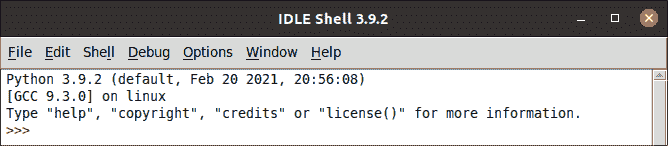
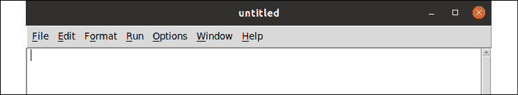
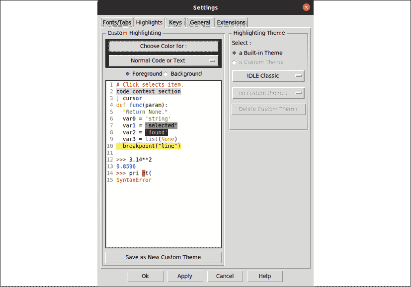
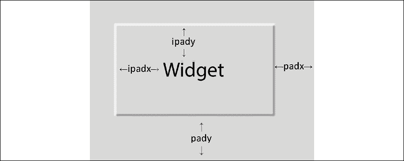
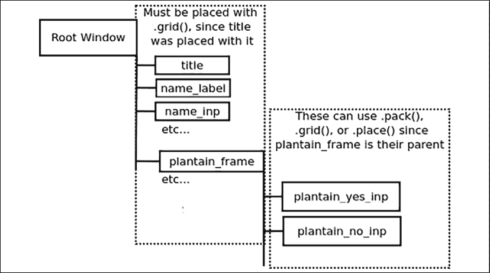
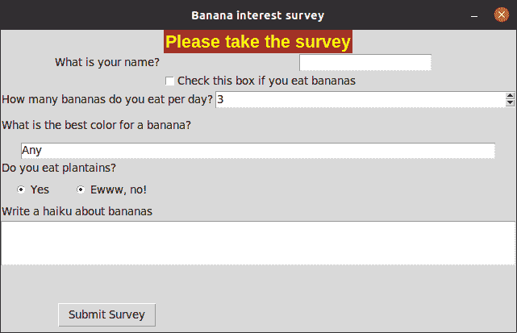

# 1

# Tkinter 简介

欢迎来到 Python 程序员！如果你已经学会了 Python 的基础知识，并想开始设计强大的 GUI 应用程序，这本书就是为你准备的。

到现在为止，你无疑已经体验到了 Python 的强大和简单。也许你编写过网络服务、执行过数据分析或管理过服务器。也许你编写过一款游戏、自动化常规任务，或者只是简单地玩弄代码。但现在你准备好处理 GUI 了。

在对网络、移动和服务器端编程如此重视的今天，简单桌面 GUI 应用程序的开发似乎越来越像一门失传的艺术；许多经验丰富的开发者从未学会如何创建这样的应用程序。多么遗憾啊！桌面计算机在工作和家庭计算中仍然扮演着至关重要的角色，为这个无处不在的平台构建简单、功能性的应用程序应该是每个软件开发人员工具箱的一部分。幸运的是，对于 Python 程序员来说，这种能力通过 Tkinter 轻而易举地就能实现。

在本章中，你将涵盖以下主题：

+   在 *Introducing Tkinter and Tk* 中，你将了解 Tkinter，这是一个内置在 Python 标准库中的快速、有趣、易于学习的 GUI 库；以及 IDLE，这是一个用 Tkinter 编写的编辑器和开发环境。

+   在 *An overview of basic Tkinter* 中，你将通过一个 "Hello World" 程序学习 Tkinter 的基础知识，并创建一个调查应用程序。

# Tkinter 和 Tk 介绍

Tk 窗口部件库起源于 **工具命令语言**（**Tcl**）编程语言。Tcl 和 Tk 是由 John Ousterhout 在 1980 年代后期在伯克利大学担任教授时创建的，作为一种更简单的编程大学正在使用的工程工具的方法。由于其速度和相对简单性，Tcl/Tk 在学术、工程和 Unix 程序员中迅速流行起来。与 Python 本身一样，Tcl/Tk 最初起源于 Unix 平台，后来才迁移到 macOS 和 Windows。Tk 的实用意图和 Unix 根仍然影响着其设计，与其它工具包相比，其简单性仍然是一个主要优势。

**Tkinter** 是 Python 对 Tk GUI 库的接口，自 1994 年 Python 版本 1.1 发布以来一直是 Python 标准库的一部分，使其成为 Python 的 *事实上的* GUI 库。Tkinter 的文档以及进一步学习的链接可以在标准库文档中找到：[`docs.python.org/3/library/tkinter.html`](https://docs.python.org/3/library/tkinter.html)。

## 选择 Tkinter

想要构建图形用户界面的 Python 程序员有多个工具包选项可供选择；不幸的是，Tkinter 经常被贬低或忽视，被视为一个过时的选项。公平地说，它并不是一种可以用时髦的词汇和夸大的宣传来描述的技术。然而，Tkinter 不仅适用于各种应用，而且还有一些不容忽视的优点：

+   **Tkinter 在标准库中**：除少数例外，Tkinter 在 Python 可用的任何地方都可用。无需安装 pip、创建虚拟环境、编译二进制文件或在网上搜索安装包。对于需要快速完成的项目，这是一个明显的优势。

+   **Tkinter 是稳定的**：虽然 Tkinter 的开发没有停止，但它的发展缓慢且渐进。API 已经稳定多年，变化主要在于新增功能和错误修复。您的 Tkinter 代码在未来几年或几十年内可能无需修改即可运行。

+   **Tkinter 只是一个 GUI 工具包**：与其他一些 GUI 库不同，Tkinter 没有自己的线程库、网络堆栈或文件系统 API。它依赖于常规 Python 库来处理这些事情，因此它非常适合将 GUI 应用于现有的 Python 代码。

+   **Tkinter 简单且直接了当**：Tkinter 非常基础且直接；它可以在过程式和面向对象的 GUI 设计中有效使用。要使用 Tkinter，您不需要学习数百个小部件类、标记或模板语言、新的编程范式、客户端-服务器技术或不同的编程语言。

当然，Tkinter 并不完美，它也有一些缺点：

+   **Tkinter 的默认外观和感觉过时了**：Tkinter 的默认外观已经落后于当前趋势，它还保留了一些来自 20 世纪 90 年代 Unix 世界的遗迹。虽然它缺少动画小部件、渐变或可缩放图形等细节，但得益于 Tk 本身的更新和主题小部件库的添加，它在过去几年里已经取得了很大的进步。本书将教会我们如何修复或避免 Tkinter 的一些更古老的默认设置。

+   **Tkinter 缺少更复杂的小部件**：Tkinter 缺少像富文本编辑器、3D 图形嵌入、HTML 查看器或专用输入小部件等高级小部件。正如我们将在本书后面看到的那样，Tkinter 通过自定义和组合其简单的小部件，使我们能够创建复杂的小部件。

Tkinter 可能不适合游戏 UI 或光滑的商业应用程序；然而，对于数据驱动应用程序、简单实用程序、配置对话框和其他业务逻辑应用程序，Tkinter 提供了所需的一切，甚至更多。在这本书中，我们将通过开发一个工作环境中的数据输入应用程序来开展工作，Tkinter 可以出色地处理这项任务。

## 安装 Tkinter

Tkinter 包含在 Windows 和 macOS 的 Python 标准库中。因此，如果您使用官方安装程序在这些平台上安装了 Python，您不需要做任何事情来安装 Tkinter。

然而，我们将在这本书中专门关注 Python 3.9；因此，您需要确保您已安装此版本或更高版本。

### 在 Windows 上安装 Python 3.9

您可以通过以下步骤从 [python.org](http://python.org) 网站获取 Windows 的 Python 3 安装程序：

1.  前往 [`www.python.org/downloads/windows`](https://www.python.org/downloads/windows/)。

1.  选择最新的 Python 3 版本。在撰写本文时，最新版本是 3.9.2。

1.  在 **文件** 部分下，选择适合您系统架构的 Windows 可执行安装程序（x86 用于 32 位 Windows，x86-64 用于 64 位 Windows；如果您不确定，x86 适用于任何一种）。

1.  启动下载的安装程序。

1.  点击 **自定义安装**。确保已选中 **tcl/tk 和 IDLE** 选项（默认情况下应该已选中）。

1.  使用所有默认选项继续安装向导。

### 在 macOS 上安装 Python 3

到本文撰写时，macOS 内置了 Python 2.7。然而，Python 2 于 2020 年正式弃用，本书中的代码将无法与它兼容，因此 macOS 用户需要安装 Python 3 才能遵循本书。

按照以下步骤在 macOS 上安装 Python3：

1.  前往 [`www.python.org/downloads/mac-osx/`](https://www.python.org/downloads/mac-osx/)。

1.  选择最新的 Python 3 版本。在撰写本文时，最新版本是 3.9.2。

1.  在 **文件** 部分下，选择并下载 macOS 64 位/32 位安装程序。

1.  启动您下载的 `.pkg` 文件，并按照安装向导的步骤操作，选择默认选项。

### 在 Linux 上安装 Python 3 和 Tkinter

大多数 Linux 发行版都包含 Python 2 和 Python 3；然而，Tkinter 并非总是与它捆绑在一起或默认安装。要找出 Tkinter 是否已安装，打开终端并尝试以下命令：

```py
$ python3 -m tkinter 
```

这应该会打开一个简单的窗口，显示有关 Tkinter 的信息。如果您收到 `ModuleNotFoundError` 错误，您需要使用您的包管理器安装您发行版的 Python 3 Tkinter 包。在大多数主要发行版中，包括 Debian、Ubuntu、Fedora 和 openSUSE，此包称为 `python3-tk`。

## 介绍 IDLE

**IDLE** 是一个集成开发环境，它包含在官方 Python 软件发行版中，适用于 Windows 和 macOS（在大多数 Linux 发行版中也可以轻松获得，通常作为 `idle` 或 `idle3`）。

IDLE 使用 Python 和 Tkinter 编写，它不仅为我们提供了 Python 的编辑环境，而且还是 Tkinter 作用的一个很好的示例。因此，尽管 IDLE 的基本功能可能不被经验丰富的 Python 程序员视为专业级别，并且尽管您可能已经有一个用于编写 Python 代码的首选环境，但我鼓励您在阅读本书的过程中花些时间使用 IDLE。

IDLE 有两种主要模式：shell 模式和编辑模式。我们将在本节中探讨这些模式。

### 使用 IDLE 的 shell 模式

当您启动 IDLE 时，您将进入 shell 模式，这是一个简单的 Python **读取-评估-打印循环**（**REPL**），类似于在终端窗口中键入 `python` 时获得的结果。

您可以在此屏幕截图中看到 IDLE 的 shell 模式：



图 1.1：IDLE 的 shell 模式

IDLE 的 shell 有一些很好的功能，您在命令行 REPL 中得不到，如语法高亮和自动补全。REPL 对于 Python 开发过程至关重要，因为它允许您实时测试代码并检查类和 API，而无需编写完整的脚本。我们将在后面的章节中使用 shell 模式来探索模块的功能和行为。如果您没有打开 shell 窗口，可以通过在 IDLE 菜单中点击**运行**|**Python Shell**来打开一个。

### 使用 IDLE 的编辑模式

编辑模式用于创建 Python 脚本文件，您可以在以后运行它们。当本书告诉您创建一个新文件时，这是您将使用的模式。要打开编辑模式中的新文件，只需在菜单中导航到**文件**|**新建文件**，或在键盘上按 Ctrl + N。

此图像显示了 IDLE 的文件编辑器：



图 1.2：IDLE 的文件编辑器

您可以在编辑模式下按 F5 键运行脚本而无需离开 IDLE；IDLE 将打开一个 shell 模式窗口来执行脚本并显示输出。

### IDLE 作为 Tkinter 的示例

在我们开始使用 Tkinter 编程之前，让我们快速查看您可以使用它做什么，通过检查一些 IDLE 的 UI。从主菜单导航到**选项**|**配置 IDLE**以打开 IDLE 的配置设置。在这里，您可以更改 IDLE 的字体、颜色和主题、键盘快捷键和默认行为，如此截图所示：



图 1.3：IDLE 配置设置

考虑以下组成此用户界面的组件：

+   有下拉菜单，允许您在大型选项集中进行选择。

+   有可勾选的按钮，允许您在小型选项集中进行选择。

+   有许多可点击的按钮来执行操作。

+   有一个文本窗口可以显示多色文本。

+   有标签化的框架，其中包含组件组。

+   屏幕顶部有标签页，用于选择不同的配置部分。

在 Tkinter（如大多数 GUI 库一样），这些组件都被称为**小部件**；我们将在本书中遇到这些小部件以及更多内容，并学习如何像这里一样使用它们。然而，我们首先从一些更简单的东西开始。

## 创建 Tkinter 的 "Hello World"

在任何编程语言或库中，有一个伟大的传统是创建一个 "Hello World" 程序：即，显示 `Hello World` 并退出的程序。让我们逐步创建一个 Tkinter 的 "Hello World" 应用程序，并在过程中讨论它的各个部分。

首先，在 IDLE 或您喜欢的编辑器中创建一个名为 `hello_tkinter.py` 的新文件，并输入以下代码：

```py
"""Hello World application for Tkinter"""
import tkinter as tk 
```

第一行被称为**文档字符串**，每个 Python 脚本都应该以一个开始。至少，它应该给出程序的名字，但也可以包括有关如何使用它、谁编写了它以及它需要什么的详细信息。

第二行将`tkinter`模块导入到我们的程序中。尽管 Tkinter 在标准库中，但我们必须导入它才能使用其任何类或函数。

有时，你可能看到这种导入方式被写成 `from tkinter import *`。这种做法被称为**通配符导入**，它会导致所有对象都被引入到全局**命名空间**中。虽然它在教程中因其简单性而流行，但在实际代码中却是个坏主意，因为我们的变量名可能与`tkinter`模块中的所有名称发生冲突，这可能导致微妙的错误。

为了避免这种情况，我们将`tkinter`放在它自己的**命名空间**中；然而，为了使代码简洁，我们将别名`tkinter`为`tk`。这个约定将在整本书中使用。

每个 Tkinter 程序必须恰好有一个**根窗口**，它代表我们应用程序的最高级窗口，也是应用程序本身。让我们创建我们的`root`窗口，如下所示：

```py
root = Tk() 
```

`root`窗口是`Tk`类的一个实例。我们通过调用`Tk()`来创建它，就像我们在这里做的那样。在我们可以创建任何其他 Tkinter 对象之前，这个对象必须存在，当它被销毁时，应用程序会退出。

现在，让我们创建一个窗口小部件：

```py
label = Label(root, text="Hello World") 
```

这是一个`Label`小部件，它只是一个可以显示一些文本的面板。任何 Tkinter 小部件的第一个参数总是**父小部件**（有时称为**主小部件**）；在这种情况下，我们传递了根窗口的引用。父小部件是我们`Label`将被放置其上的一小部件，因此这个`Label`将直接位于应用程序的根窗口上。Tkinter GUI 中的小部件按层次排列，每个小部件都包含在另一个小部件中，直到根窗口。

我们还传递了一个关键字参数，`text`。这个参数当然定义了将被放置在小部件上的文本。对于大多数 Tkinter 小部件，大多数配置都是使用这样的关键字参数完成的。

现在我们已经创建了一个小部件，我们需要将其实际放置在 GUI 上：

```py
label.pack() 
```

`Label`小部件的`pack()`方法被称为**几何管理器方法**。它的任务是确定小部件将如何附加到其父小部件，并在那里绘制它。如果没有这个调用，你的小部件将存在，但你不会在任何窗口上看到它。`pack()`是三种几何管理器之一，我们将在下一节中了解更多关于它的内容。

我们程序的最后一行看起来是这样的：

```py
root.mainloop() 
```

这行代码启动了应用程序的**事件循环**。事件循环是一个无限循环，它持续处理程序执行期间发生的任何**事件**。事件可以是按键、鼠标点击或其他用户生成活动。这个循环一直运行到程序退出，因此在这行代码之后的任何代码都不会运行，直到主窗口关闭。因此，这行代码通常是任何 Tkinter 程序中的最后一行。

通过按 F5 在 IDLE 中运行程序，或者在终端中输入以下命令：

```py
$ python hello_tkinter.py 
```

你应该会看到一个非常小的窗口弹出，上面显示**Hello World**，如图所示：


图 1.4：我们的“Hello World”应用程序

在`root.mainloop()`调用之前，你可以随意修改这个脚本，添加更多的小部件。你可以添加更多的`Label`对象，或者尝试一些`Button`（创建可点击的按钮）或`Entry`（创建文本字段）小部件。就像`Label`一样，这些小部件使用父对象（使用`root`）和`text`参数初始化。别忘了在每个小部件上调用`pack()`来将它们放置在根窗口上。

本书所有章节的示例代码可以从[`github.com/PacktPublishing/Python-GUI-Programming-with-Tkinter-2E`](https://github.com/PacktPublishing/Python-GUI-Programming-with-Tkinter-2E)下载。你可能现在想下载这些代码，以便跟随学习。

当你准备好后，继续到下一节，我们将创建一个更有趣的应用程序。

# Tkinter 基本概述

虽然看到第一个 GUI 窗口在屏幕上弹出可能非常令人兴奋，但“Hello World”并不是一个特别有趣的应用程序。让我们重新开始，在构建一个稍微大一点的应用程序的同时，更深入地了解 Tkinter。由于下一章将带你去一个虚构的农业实验室工作，研究水果植物，让我们创建一个小程序来评估你对香蕉的看法。

## 使用 Tkinter 小部件构建 GUI

在你的编辑器中创建一个名为`banana_survey.py`的新文件，并开始导入`tkinter`，如下所示：

```py
# banana_survey.py
"""A banana preferences survey written in Python with Tkinter"""
import tkinter as tk 
```

与`hello_tkinter.py`一样，在创建任何小部件或其他 Tkinter 对象之前，我们需要创建一个`root`窗口：

```py
root = tk.Tk() 
```

再次强调，我们把这个对象命名为`root`。`root`窗口可以以各种方式配置；例如，我们可以给它一个窗口标题或设置其大小，如下所示：

```py
# set the title
root.title('Banana interest survey')
# set the root window size
root.geometry('640x480+300+300')
root.resizable(False, False) 
```

`title()`方法设置我们的窗口标题（即显示在任务管理器和窗口装饰中的名称），而`geometry()`设置窗口大小。在这种情况下，我们告诉根窗口大小为 640×480 像素。`+300+300`设置窗口在屏幕上的位置——在这种情况下，顶部和左侧各 300 像素（位置部分是可选的，如果你只关心大小）。请注意，`geometry()`的参数是一个字符串。在 Tcl/Tk 中，每个参数都被视为字符串。由于 Tkinter 只是一个包装器，它将参数传递给 Tcl/Tk，我们经常会发现字符串被用来配置 Tkinter 对象——即使我们可能期望使用整数或浮点数。

`resizable()`方法设置我们的窗口是否可以水平和垂直调整大小。`True`表示窗口可以调整大小，`False`表示其尺寸是固定的。在这种情况下，我们希望防止窗口调整大小，这样我们就不必担心使布局适应窗口大小的变化。

现在，让我们开始向我们的调查添加小部件。我们已经遇到了`Label`小部件，所以让我们添加一个：

```py
title = tk.Label(
  root,
  text='Please take the survey',
  font=('Arial 16 bold'),
  bg='brown',
  fg='#FF0'
) 
```

正如我们在“Hello World”示例中看到的那样，传递给任何 Tkinter 小部件的第一个参数是**父**小部件，新小部件将放置在这个小部件上。在这种情况下，我们将把这个`Label`小部件放置在`root`窗口上。小部件的其他参数被指定为关键字参数。在这里，我们指定了以下内容：

+   `text`，这是标签将显示的文本。

+   `font`，指定用于显示文本的字体家族、大小和粗细。请注意，字体设置被指定为一个简单的字符串，就像我们的`geometry`设置一样。

+   `bg`，用于设置小部件的背景颜色。在这里，我们使用了一个颜色名称；Tkinter 识别了大量的颜色名称，类似于 CSS 或 X11 中使用的颜色名称。

+   `fg`，用于设置小部件的前景色（文本）颜色。在这种情况下，我们指定了一个简短的十六进制字符串，其中三个字符分别代表红色、绿色和蓝色值。我们也可以使用六位十六进制字符串（例如，`#FFE812`）来对颜色进行更精细的控制。

在第九章“使用样式和主题改进外观”中，我们将学习更复杂的方法来设置字体和颜色，但这对现在来说已经足够好了。

Tkinter 有许多用于数据输入的交互式小部件，当然，最简单的是`Entry`小部件：

```py
name_label = tk.Label(root, text='What is your name?')
name_inp = tk.Entry(root) 
```

`Entry`小部件只是一个简单的文本输入框，设计用于单行文本。Tkinter 中的大多数输入小部件都不包含任何类型的标签，所以我们添加了一个标签，以便让我们的用户清楚输入框的用途。

那个例外是`Checkbutton`小部件，我们将在下一节创建它：

```py
eater_inp = tk.Checkbutton(
  root,
  text='Check this box if you eat bananas'
) 
```

`Checkbutton`创建一个复选框输入；它包括一个位于框旁边的标签，我们可以使用`text`参数设置其文本。

对于输入数字，Tkinter 提供了 `Spinbox` 小部件。让我们添加一个：

```py
num_label = tk.Label(
  root,
  text='How many bananas do you eat per day?'
)
num_inp = tk.Spinbox(root, from_=0, to=1000, increment=1) 
```

`Spinbox` 与 `Entry` 类似，但具有可以递增和递减框内数字的箭头按钮。我们在这里使用了几个参数来配置它：

+   `from_` 和 `to` 参数分别设置按钮递减或递增的最小和最大值。请注意，`from_` 在末尾有一个额外的下划线；这并不是一个错误！由于 `from` 是 Python 的一个关键字（用于导入模块），它不能用作变量名，因此 Tkinter 的作者选择使用 `from_` 代替。

+   `increment` 参数设置箭头按钮增加或减少的数值。

Tkinter 有几个小部件允许您从预设的选择值中进行选择；其中最简单的一个是 `Listbox`，它看起来像这样：

```py
color_label = tk.Label(
  root,
  text='What is the best color for a banana?'
)
color_inp = tk.Listbox(root, height=1)  # Only show selected item
# add choices
color_choices = (
  'Any', 'Green', 'Green-Yellow',
  'Yellow', 'Brown Spotted', 'Black'
  )
for choice in color_choices:
  color_inp.insert(tk.END, choice) 
```

`Listbox` 接受一个 `height` 参数，指定可见的行数；默认情况下，框足够大，可以显示所有选项。我们将其更改为 `1`，以便只显示当前选定的选项。其他选项可以使用箭头键访问。

要向框中添加选项，我们需要调用其 `insert()` 方法并逐个添加每个选项。我们在这里使用 `for` 循环来完成，以节省重复的编码。`insert` 的第一个参数指定我们想要插入选项的位置；请注意，我们使用了 `tkinter` 提供的一个特殊 **常量**，`tk.END`。这是 Tkinter 中定义的许多特殊常量之一。在这种情况下，`tk.END` 表示小部件的末尾，因此我们插入的每个选择都将放置在末尾。

另一种让用户在少量选项之间进行选择的方法是 `Radiobutton` 小部件；这些与 `Checkbutton` 小部件类似，但类似于（非常、非常古老的）汽车收音机中的机械预设按钮，它们一次只允许选择一个。让我们创建几个 `Radiobutton` 小部件：

```py
plantain_label = tk.Label(root, text='Do you eat plantains?')
plantain_frame = tk.Frame(root)
plantain_yes_inp = tk.Radiobutton(plantain_frame, text='Yes')
plantain_no_inp = tk.Radiobutton(plantain_frame, text='Ewww, no!') 
```

注意我们在 `plantain_frame` 上做了什么：我们创建了一个 `Frame` 对象，并将其用作每个 `Radiobutton` 小部件的父小部件。`Frame` 只是一个空白的面板，上面没有任何内容，它对于分层组织布局非常有用。在这本书中，我们将经常使用 `Frame` 小部件来将一组小部件组合在一起。

`Entry` 小部件适用于单行字符串，但对于多行字符串呢？对于这些，Tkinter 提供了 `Text` 小部件，我们创建它的方式如下：

```py
banana_haiku_label = tk.Label(
  root, 
  text='Write a haiku about bananas'
)
banana_haiku_inp = tk.Text(root, height=3) 
```

`Text` 小部件的功能远不止多行文本，我们将在 *第九章*，*通过样式和主题改进外观* 中探索其一些更高级的功能。不过，现在我们只使用它来显示文本。

我们的 GUI 如果没有用于调查的提交按钮就不完整了，这个按钮由 `Button` 类提供，如下所示：

```py
submit_btn = tk.Button(root, text='Submit Survey') 
```

我们将使用这个按钮来提交调查并显示一些输出。我们可以使用哪个小部件来显示那个输出？结果证明，`Label`对象不仅对静态消息很有用；我们还可以在运行时使用它们来显示消息。

让我们为我们的程序输出添加一个：

```py
output_line = tk.Label(root, text='', anchor='w', justify='left') 
```

在这里，我们创建了一个没有文本的`Label`小部件（因为我们还没有输出）。我们还使用了一些额外的参数来设置`Label`：

+   `anchor`确定如果小部件比文本宽，文本将粘附在哪个小部件的侧面。Tkinter 有时使用基本方向（北、南、东和西），缩写为它们的首字母，每当它需要指定小部件的侧面时；在这种情况下，字符串`'w'`表示小部件的西边（或左边）。

+   `justify`确定当有多行代码时，文本将对齐到哪一侧。与`anchor`不同，它使用传统的`'left'`、`'right'`和`'center'`选项。

`anchor`和`justify`可能看起来是多余的，但它们的行为略有不同。在多行文本的情况下，文本可以与每行的中心对齐，但整个行集合可以锚定到小部件的西边，例如。换句话说，`anchor`影响相对于包含小部件的整个文本块，而`justify`影响相对于其他行的单个文本行。

Tkinter 有许多更多的小部件，我们将在本书的剩余部分遇到许多它们。

## 使用几何管理器排列我们的小部件

如果你将`root.mainloop()`添加到这个脚本中并直接执行，你会看到一个空白窗口。嗯，我们刚才创建的所有小部件都去哪了？嗯，你可能还记得从`hello_tkinter.py`中，我们需要使用像`pack()`这样的几何管理器来实际上将它们放置在父小部件的某个位置。

Tkinter 提供了三种几何管理器方法：

+   `pack()`是最古老的，它简单地按顺序将小部件添加到窗口的四个侧面之一。

+   `grid()`是较新的，也是首选的，它允许你在二维网格表中放置小部件。

+   `place()`是第三个选项，它允许你将小部件放置在特定的像素坐标上。它不建议使用，因为它对窗口大小、字体大小和屏幕分辨率的更改反应不佳，所以我们不会在这本书中使用它。

虽然`pack()`对于涉及少量小部件的简单布局来说确实不错，但它并不适合更复杂的布局，除非有大量的`Frame`小部件嵌套。因此，大多数 Tkinter 程序员依赖于更现代的`grid()`几何管理器。正如其名所示，`grid()`允许你在二维网格上布局小部件，就像电子表格文档或 HTML 表格一样。在这本书中，我们将主要关注`grid()`。

让我们从使用`grid()`开始布局我们的 GUI 小部件，首先是`title`标签：

```py
title.grid() 
```

默认情况下，对`grid()`的调用将小部件放置在*第一列*（列 0）的*下一个空行*中。因此，如果我们简单地对下一个小部件调用`grid()`，它将直接位于第一个小部件下方。然而，我们也可以通过使用`row`和`column`参数来明确这一点，如下所示：

```py
name_label.grid(row=1, column=0) 
```

行和列从小部件的左上角开始计数，从`0`开始。因此，`row=1, column=0`将小部件放置在第二行第一列。如果我们想要额外的列，我们只需要在小部件中放置一个，如下所示：

```py
name_inp.grid(row=1, column=1) 
```

当我们向新行或新列添加小部件时，网格会自动扩展。如果一个小部件比当前列的宽度或行的长度大，那么该列或行的所有单元格都会扩展以容纳它。我们可以使用`columnspan`和`rowspan`参数分别告诉小部件跨越多个列或多个行。例如，让我们的标题跨越表单的宽度可能是个不错的选择，所以让我们相应地修改它：

```py
title.grid(columnspan=2) 
```

当列和行扩展时，小部件默认不会随着它们一起扩展。如果我们想让它们扩展，我们需要使用`sticky`参数，如下所示：

```py
eater_inp.grid(row=2, columnspan=2, sticky='we') 
```

`sticky`告诉 Tkinter 将小部件的边缘粘附到其包含单元格的边缘，这样当单元格扩展时，小部件也会拉伸。就像我们上面学到的`anchor`参数一样，`sticky`也接受四个基本方向：`n`（北）、`s`（南）、`e`（东）和`w`（西）。在这种情况下，我们指定了西和东，这将导致当列进一步扩展时，小部件在水平方向上拉伸。

作为字符串的替代，我们还可以使用 Tkinter 的常量作为`sticky`参数的参数：

```py
num_label.grid(row=3, sticky=tk.W)
num_inp.grid(row=3, column=1, sticky=(tk.W + tk.E)) 
```

在 Tkinter 看来，使用常量和字符串字面量之间没有真正的区别；然而，使用常量的优点是，你的编辑软件可以更容易地识别你是否使用了不存在的常量，而不是无效的字符串。

`grid()`方法允许我们为小部件添加填充，如下所示：

```py
color_label.grid(row=4, columnspan=2, sticky=tk.W, pady=10)
color_inp.grid(row=5, columnspan=2, sticky=tk.W + tk.E, padx=25) 
```

`padx`和`pady`表示*外部*填充——也就是说，它们将扩展包含单元格，但不会扩展小部件。另一方面，`ipadx`和`ipady`表示*内部*填充。指定这些参数将扩展小部件本身（从而扩展包含单元格）。



图 1.5：内部填充（ipadx, ipady）与外部填充（padx, pady）的比较

Tkinter 不允许我们在同一个父小部件上混合几何管理器；一旦我们在任何子小部件上调用`grid()`，对兄弟小部件的`pack()`或`place()`方法的调用将生成错误，反之亦然。

然而，我们可以在兄弟小部件的子项上使用不同的几何管理器。例如，我们可以使用`pack()`将子小部件放置在`plantain_frame`小部件上，如下所示：

```py
plantain_yes_inp.pack(side='left', fill='x', ipadx=10, ipady=5)
plantain_no_inp.pack(side='left', fill='x', ipadx=10, ipady=5)
plantain_label.grid(row=6, columnspan=2, sticky=tk.W)
plantain_frame.grid(row=7, columnspan=2, stick=tk.W) 
```

`plantain_label`和`plantain_frame`小部件作为`root`的子项，必须使用`grid()`进行放置；然而，`plantain_yes`和`plantain_no`是`plantain_frame`的子项，因此如果我们愿意，可以选择在它们上使用`pack()`（或`place()`）。以下图表说明了这一点：



图 1.6：每个小部件的子项必须使用相同的几何管理器方法

这种为每个容器小部件选择几何管理器的能力，使我们能够在布局 GUI 时具有极大的灵活性。虽然`grid()`方法当然可以指定大多数布局，但在某些时候，`pack()`或`place()`的语义对于我们界面的一部分来说更有意义。

虽然`pack()`几何管理器与`grid()`共享一些参数，如`padx`和`pady`，但大多数参数是不同的。例如，示例中使用的`side`参数决定了小部件将从哪一侧填充，而`fill`参数决定了小部件将在哪个轴上扩展。

让我们向窗口添加最后几个小部件：

```py
banana_haiku_label.grid(row=8, sticky=tk.W)
banana_haiku_inp.grid(row=9, columnspan=2, sticky='NSEW')
submit_btn.grid(row=99)
output_line.grid(row=100, columnspan=2, sticky='NSEW') 
```

注意，我们已经将`Text`小部件（`banana_haiku_inp`）固定在其容器的四面。这将导致它在网格拉伸时同时垂直和水平扩展。同时请注意，我们跳过了最后两个小部件的 99 行和 100 行。记住，未使用的行会被折叠成无，因此通过跳过行或列，我们可以为 GUI 未来的扩展留出空间。

默认情况下，Tkinter 会使我们的窗口大小刚好足够容纳我们放置在上面的所有小部件；但如果我们的窗口（或包含框架）变得比小部件所需的空间大呢？默认情况下，小部件将保持原样，固定在应用程序的左上角。如果我们想让 GUI 扩展并填充可用空间，我们必须告诉父小部件哪些列和行将扩展。我们通过使用父小部件的`columnconfigure()`和`rowconfigure()`方法来完成此操作。

例如，如果我们想让我们的第二列（包含大部分输入小部件的列）扩展到未使用空间，我们可以这样做：

```py
root.columnconfigure(1, weight=1) 
```

第一个参数指定了我们想要影响的列（从 0 开始计数）。关键字参数`weight`接受一个整数，该整数将决定列将获得多少额外空间。当只指定一个列时，任何大于 0 的值都会导致该列扩展到剩余空间中。

`rowconfigure()`方法的工作方式相同：

```py
root.rowconfigure(99, weight=2)
root.rowconfigure(100, weight=1) 
```

这次，我们给两行分配了一个`weight`值，但请注意，行`99`被分配了`2`的权重，而`100`被分配了`1`的权重。在这种配置下，任何额外的垂直空间将在行`99`和`100`之间分配，但行`99`将获得其中两倍的空间。

如您所见，通过结合使用`grid()`、`pack()`子框架和一些精心规划，我们可以在 Tkinter 中相对容易地实现复杂的 GUI 布局。

## 使表单真正发挥作用

我们现在有一个很好的表单布局，包括一个提交按钮；那么我们如何让它真正做些什么呢？如果你过去只编写过程式代码，你可能会对 GUI 应用程序中代码的流程感到困惑。与过程式脚本不同，GUI 不能简单地从上到下执行所有代码。相反，它必须响应用户操作，如按钮点击或按键，无论何时何地发生。这些操作被称为**事件**。为了使程序响应用户事件，我们需要将事件**绑定**到函数上，我们称之为**回调**。

在 Tkinter 中绑定事件到回调函数有几种方法；对于按钮，最简单的是配置其`command`属性，如下所示：

```py
submit_btn.configure(command=on_submit) 
```

在创建小部件时（例如，`submit_btn = Button(root, command=on_submit)`），或者在创建小部件后使用其`configure()`方法，可以指定`command`参数。`configure()`方法允许你在创建小部件后通过传递参数来更改小部件的配置，就像创建小部件时一样。

在任何情况下，`command`指定了一个当按钮被点击时要调用的回调函数的*引用*。请注意，我们在这里函数名后不加括号；这样做会导致函数被调用，并且其返回值将被分配给`command`。我们在这里只想得到函数的引用。

在将回调函数传递给`command`之前，回调函数必须存在。因此，在调用`submit_btn.configure()`之前，让我们创建`on_submit()`函数：

```py
def on_submit():
  """To be run when the user submits the form"""
  pass
submit_btn.configure(command=on_submit) 
```

当回调函数专门创建来响应特定事件时，通常以`on_<event_name>`的格式命名回调函数。然而，这不是必需的，也不总是合适的（例如，如果函数是多个事件的回调）。

绑定事件的一个更强大的方法是使用小部件的`bind()`方法，我们将在*第六章*，*规划应用扩展*中更详细地讨论。

我们当前的`on_submit()`回调相当无聊，让我们让它变得更好。删除`pass`语句并添加以下代码：

```py
def on_submit():
  """To be run when the user submits the form"""
  name = name_inp.get()
  number = num_inp.get()
  selected_idx = color_inp.curselection()
  if selected_idx:
    color = color_inp.get(selected_idx)
  else:
    color = ''
  haiku = banana_haiku_inp.get('1.0', tk.END)
  message = (
    f'Thanks for taking the survey, {name}.\n'
    f'Enjoy your {number} {color} bananas!'
  )
  output_line.configure(text=message)
  print(haiku) 
```

在这个函数中，我们首先要做的是从一些输入中检索值。对于许多输入，我们使用`get()`方法来检索小部件的当前值。请注意，即使在我们的`Spinbox`中，这个值也将以字符串的形式返回。

对于我们的列表小部件`color`，事情要复杂一些。它的`get()`方法需要一个索引号来选择一个选项，并返回该索引号的文本。我们可以使用小部件的`curselection()`方法来获取选中的索引。如果没有进行选择，选中的索引将是一个空元组。在这种情况下，我们将只设置`color`为空字符串。如果有选择，我们可以将值传递给`get()`。

从`Text`小部件获取数据又略有不同。它的`get()`方法需要两个值，一个用于起始位置，另一个用于结束位置。这些遵循特殊的语法（我们将在*第三章*，*使用 Tkinter 和 Ttk 小部件创建基本表单*中讨论），但基本上`1.0`表示第一行的第一个字符，而`tk.END`是一个表示`Text`小部件末尾的常量。

从我们的`Checkbutton`和`Radiobutton`中检索数据，没有使用 Tkinter 控制变量是不可能的，我们将在下面的章节中讨论，即*使用 Tkinter 控制变量处理数据*。

收集完数据后，我们的回调函数通过更新输出`Label`小部件的`text`属性，以包含一些输入数据的字符串结束，然后将用户的俳句打印到控制台。

要使这个脚本可运行，以这一行结束：

```py
root.mainloop() 
```

这将执行脚本的事件循环，以便 Tkinter 可以开始响应用件。保存你的脚本并执行它，你应该会看到类似这样的：



图 1.7：我们的香蕉调查应用程序

恭喜，你的香蕉调查应用程序工作正常！好吧，有点。让我们看看我们是否可以使它完全工作。

## 使用 Tkinter 控制变量处理数据

我们已经很好地掌握了 GUI 布局，但我们的 GUI 存在一些问题。从我们的小部件中检索数据有些混乱，我们甚至不知道如何获取`Checkbutton`或`Radiobutton`小部件的值。实际上，如果你尝试操作`Radiobutton`小部件，你会发现它们完全损坏了。看来我们遗漏了拼图中的一个大块。

我们缺少的是 Tkinter **控制变量**。控制变量是特殊的 Tkinter 对象，允许我们存储数据；有四种类型的控制变量：

+   **StringVar**：用于存储任意长度的字符串

+   **IntVar**：用于存储整数

+   **DoubleVar**：用于存储浮点值

+   **BooleanVar**：用于存储布尔（True/False）值

但等等！Python 已经有一些可以存储这些类型数据以及更多数据的变量。我们为什么还需要这些类？简单地说，这些变量类具有一些常规 Python 变量所缺乏的特殊能力，例如：

+   我们可以在控制变量和小部件之间创建**双向绑定**，这样如果小部件内容或变量内容发生变化，两者都将保持同步。

+   我们可以在变量上设置**跟踪**。跟踪将变量事件（如读取或更新变量）绑定到回调函数。（跟踪将在*第四章*，*使用类组织我们的代码*中讨论。）

+   我们可以在小部件之间建立关系。例如，我们可以告诉我们的两个`Radiobutton`小部件它们是连接的。

让我们看看控制变量如何帮助我们的调查应用程序。回到顶部，查看定义名称输入的地方，然后添加一个变量：

```py
**name_var = tk.StringVar(root)**
name_label = tk.Label(root, text='What is your name?')
name_inp = tk.Entry(root, **textvariable=name_var**) 
```

我们可以通过调用`StringVar()`来创建一个`StringVar`对象；注意，我们已将`root`窗口作为第一个参数传递。控制变量需要一个对`root`窗口的引用；然而，在几乎所有情况下，它们可以自动解决这个问题，因此在这里实际上指定`root`窗口很少是必要的。重要的是要理解，*在没有 Tk 对象存在的情况下，不能创建任何控制变量对象*。

一旦我们有一个`StringVar`对象，我们可以通过将其传递给`textvariable`参数来将其绑定到我们的`Entry`小部件。通过这样做，`name_inp`小部件的内容和`name_var`变量保持同步。调用变量的`get()`方法将返回框的当前内容，如下所示：

```py
print(name_var.get()) 
```

对于复选框，使用`BooleanVar`：

```py
eater_var = tk.BooleanVar()
eater_inp = tk.Checkbutton(
  root, variable=eater_var, text='Check this box if you eat bananas'
) 
```

这次，我们通过`variable`参数将变量传递给了`Checkbutton`。按钮小部件将使用关键字`variable`来绑定控制变量，而通常将文本值返回的小部件或用户输入的小部件则使用关键字`textvariable`。

按钮小部件也接受`textvariable`参数，但它并不绑定按钮的值；相反，它绑定到按钮标签的文本。这个特性允许你动态更新按钮的文本。

可以使用`value`参数初始化变量，如下所示：

```py
num_var = tk.IntVar(value=3)
num_label = tk.Label(text='How many bananas do you eat per day?')
num_inp = tk.Spinbox(
  root, textvariable=num_var, from_=0, to=1000, increment=1
) 
```

这里，我们使用`IntVar()`创建了一个整数变量并将其值设置为`3`；当我们启动表单时，`num_inp`小部件将被设置为`3`。请注意，尽管我们认为`Spinbox`是一个数字输入，但它使用`textvariable`参数来绑定其控制变量。`Spinbox`小部件实际上可以用于不仅仅是数字，因此其数据在内部以文本形式存储。然而，通过将其绑定到`IntVar`或`DoubleVar`，检索到的值将自动转换为整数或浮点数。

如果用户能够输入字母、符号或其他无效字符，`IntVar`和`DoubleVar`自动转换为整数或浮点数可能会成为一个问题。当在一个包含无效数字字符串（例如，`'1.1.2'`或`'I like plantains'`）的小部件上调用`get()`方法时，将引发异常，导致我们的应用程序崩溃。在*第五章*，*通过验证和自动化减少用户错误*，我们将学习如何解决这个问题。

之前，我们使用`Listbox`向用户显示选项列表。不幸的是，`Listbox`与控制变量配合得不太好，但还有一个名为`OptionMenu`的小部件可以做到这一点。

让我们将`color_inp`替换为`OptionMenu`小部件：

```py
color_var = tk.StringVar(value='Any')
color_label = tk.Label(
  root, 
  text='What is the best color for a banana?'
)
color_choices = (
  'Any', 'Green', 'Green Yellow', 'Yellow', 'Brown Spotted', 'Black'
)
**color_inp = tk.OptionMenu(**
 **root, color_var, *color_choices**
**)** 
```

`OptionMenu`小部件以字符串的形式保存选项列表，因此我们需要创建一个`StringVar`来绑定它。注意，与`ListBox`小部件不同，`OptionMenu`允许我们在创建时指定选项。`OptionMenu`构造函数与其他 Tkinter 小部件构造函数也有所不同，因为它接受控制变量和选项作为位置参数，如下所示：

```py
# Example, don't add this to the program
menu = tk.OptionMenu(parent, ctrl_var, opt1, opt2, ..., optN) 
```

在我们的调查代码中，我们通过使用解包操作符（`*`）将`color_choices`列表展开为位置参数来添加选项。我们也可以直接列出它们，但这样做可以使我们的代码更整洁。

我们将在第三章*使用 Tkinter 和 Ttk 小部件创建基本表单*中讨论一个更好的下拉列表框选项。

`Radiobutton`小部件与其他小部件在处理变量方面略有不同。为了有效地使用`Radiobutton`小部件，我们将所有分组在一起的按钮绑定到同一个控制变量上，如下所示：

```py
plantain_var = tk.BooleanVar()
plantain_yes_inp = tk.Radiobutton(
  plantain_frame, text='Yes', value=True, variable=plantain_var
)
plantain_no_inp = tk.Radiobutton(
  plantain_frame, 
  text='Ewww, no!', 
  value=False, 
  variable=plantain_var
) 
```

我们可以将任何类型的控制变量绑定到`Radiobutton`小部件上，但我们必须确保为每个小部件提供一个与变量类型匹配的`value`。在这种情况下，我们使用按钮来回答`True`/`False`问题，因此`BooleanVar`是合适的；我们使用`value`参数将一个按钮设置为`True`，另一个设置为`False`。当我们调用变量的`get()`方法时，它将返回所选按钮的`value`参数。

不幸的是，并非所有 Tkinter 小部件都支持控制变量。值得注意的是，我们用于`banana_haiku_inp`输入的`Text`小部件不能绑定到变量上，而且（与`Listbox`不同）没有可用的替代方案。目前，我们不得不像之前那样处理`Text`输入小部件。

Tkinter 的`Text`框不支持变量，因为它不仅仅是多行文本；它可以包含图像、富文本和其他无法用简单字符串表示的对象。然而，在*第四章*，*使用类组织我们的代码*中，我们将实现一个解决方案，允许我们将变量绑定到多行字符串小部件。

控制变量不仅用于绑定到输入小部件；我们还可以使用它们来更新非交互式小部件（如`Label`）中的字符串。例如：

```py
output_var = tk.StringVar(value='')
output_line = tk.Label(
  root, textvariable=output_var, anchor='w', justify='left'
) 
```

通过将`output_var`控制变量绑定到这个`Label`小部件的`textvariable`参数，我们可以在运行时通过更新`output_var`来改变标签显示的文本。

### 在回调函数中使用控制变量

现在我们已经创建了所有这些变量并将它们绑定到小部件上，我们可以用它们做什么呢？跳转到回调函数`on_submit()`，并删除其中的代码。我们将使用控制变量重新编写它。

从`name`值开始：

```py
def on_submit():
  """To be run when the user submits the form"""
  name = name_var.get() 
```

如前所述，`get()`方法用于检索变量的值。`get()`返回的数据类型取决于变量的类型，如下所示：

+   `StringVar`返回一个`str`

+   `IntVar` 返回一个 `int`

+   `DoubleVar` 返回一个 `float`

+   `BooleanVar` 返回一个 `bool`

注意，每当调用 `get()` 时都会执行类型转换，因此如果小部件包含的内容与变量期望的内容不兼容，将会在此时刻引发异常。例如，如果 `IntVar` 绑定到一个空的 `Spinbox`，`get()` 将会引发异常，因为空字符串无法转换为 `int`。

因此，有时将 `get()` 放在 `try/except` 块中是明智的，如下所示：

```py
 try:
    number = num_var.get()
  except tk.TclError:
    number = 10000 
```

与经验丰富的 Python 程序员可能预期的相反，对于无效值引发的异常不是 `ValueError`。转换实际上是在 Tcl/Tk 中完成的，而不是在 Python 中，因此引发的异常是 `tkinter.TclError`。在这里，我们已经捕获了 `TclError` 并通过将香蕉数量设置为 `10,000` 来处理它。

当 Tcl/Tk 执行我们的翻译 Python 调用遇到困难时，会引发 `TclError` 异常，因此为了正确处理它们，您可能需要从异常中提取实际的错误字符串。这有点丑陋，不符合 Python 风格，但 Tkinter 给我们的选择不多。

现在提取我们的 `OptionMenu`、`Checkbutton` 和 `Radiobutton` 小部件的值要干净得多，正如您在这里可以看到的：

```py
 color = color_var.get()
  banana_eater = eater_var.get()
  plantain_eater = plantain_var.get() 
```

对于 `OptionMenu`，`get()` 返回选中的字符串。对于 `Checkbutton`，如果按钮被选中，则返回 `True`，如果没有选中，则返回 `False`。对于 `Radiobutton` 小部件，`get()` 返回选中小部件的 `value`。控制变量的好处是，我们不必知道或关心它们绑定到了哪种小部件；只需调用 `get()` 就足以检索用户的输入。

如前所述，`Text` 小部件不支持控制变量，因此我们必须以传统的方式获取其内容：

```py
 haiku = banana_haiku_inp.get('1.0', tk.END) 
```

现在我们有了所有这些数据，让我们为调查者构建一个消息字符串：

```py
 message = f'Thanks for taking the survey, {name}.\n'
  if not banana_eater:
    message += "Sorry you don't like bananas!\n"
  else:
    message += f'Enjoy your {number} {color} bananas!\n'
  if plantain_eater:
    message += 'Enjoy your plantains!'
  else:
    message += 'May you successfully avoid plantains!'
  if haiku.strip():
    message += f'\n\nYour Haiku:\n{haiku}' 
```

为了向用户显示我们的消息，我们需要更新 `output_var` 变量。这是通过使用它的 `set()` 方法来完成的，如下所示：

```py
 output_var.set(message) 
```

`set()` 方法将更新控制变量，这反过来又会更新它所绑定到的 `Label` 小部件。这样，我们可以动态地更新显示的消息、小部件标签以及我们应用程序中的其他文本。

记得使用 `set()` 来更改控制变量的值！使用赋值运算符（`=`）只会用不同的对象覆盖控制变量对象，您将无法再使用它。例如，`output_var = message` 只会将名称 `output_var` 重新分配给字符串对象 `message`，而当前绑定到 `output_line` 的控制变量对象将变得无名称。

### 控制变量的重要性

希望你能看到控制变量是 Tkinter GUI 的一个强大且必要的一部分。我们将在我们的应用程序中广泛使用它们来存储和传递 Tkinter 对象之间的数据。实际上，一旦我们将一个变量绑定到小部件上，通常就不再需要保留对小部件的引用。例如，如果我们这样定义输出部分，我们的调查代码将运行得很好：

```py
output_var = tk.StringVar(value='')
# remove the call to output_line.grid() in the layout section!
tk.Label(
  root, textvariable=output_var, anchor='w', justify='left'
).grid(row=100, columnspan=2, sticky="NSEW") 
```

由于我们不需要直接与输出`Label`交互，我们只需创建它并将所有内容放在一行中，无需保存引用。由于小部件的父级保留了对象的引用，Python 不会销毁该对象，我们可以随时使用控制变量检索其内容。当然，如果我们后来想以某种方式操作小部件（例如更改其`font`值），我们需要保留对其的引用。

# 摘要

在本章中，你学习了如何安装 Tkinter 和 IDLE，并且体验到了使用 Tkinter 开始构建 GUI 是多么简单。你学习了如何创建小部件，如何使用`grid()`布局管理器将它们排列在主窗口中，以及如何将它们的内联内容绑定到控制变量，如`StringVar`和`BooleanVar`。你还学习了如何将事件，如按钮点击，绑定到回调函数，以及如何检索和处理小部件数据。

在下一章中，你将在 ABQ AgriLabs 开始你的新工作，并面临一个需要你的 GUI 编程技能的问题。你将学习如何分析这个问题，制定程序规范，并设计一个用户友好的应用程序，这将成为解决方案的一部分。
