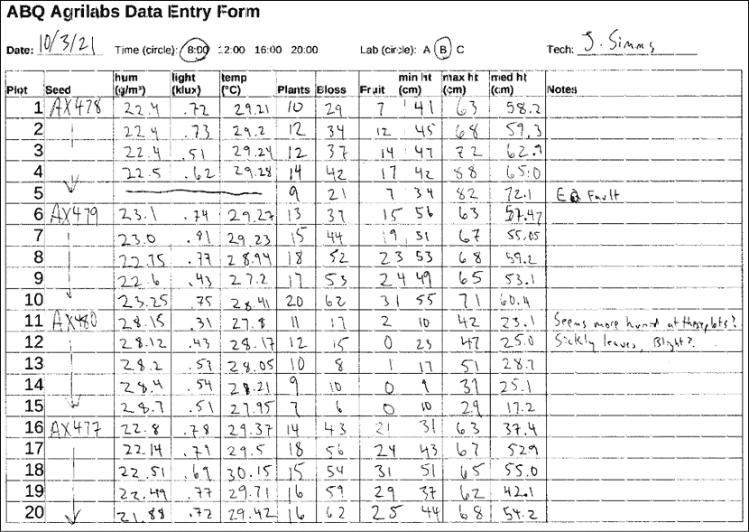
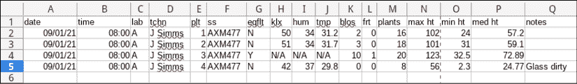
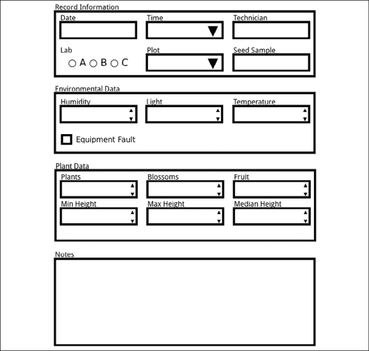
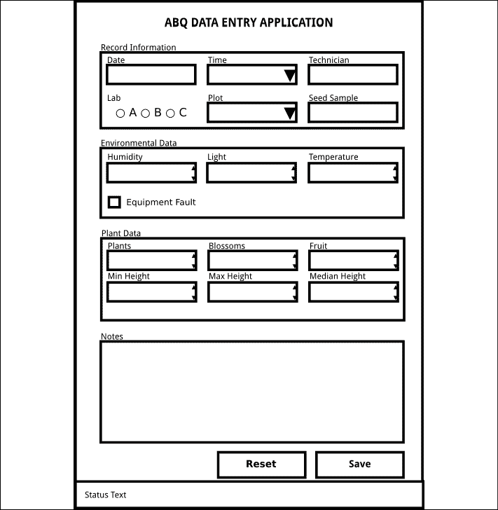

# 2

# 设计 GUI 应用程序

软件应用的开发分为三个重复的阶段：理解问题、设计解决方案和实施解决方案。这些阶段在应用程序的生命周期中重复，随着你添加新功能、改进功能并更新应用程序，直到它变得最优或过时。虽然许多程序员想要直接进入实施阶段，但放下代码编辑器，花时间完成前两个阶段将给你开发一个正确解决问题的应用程序的机会更大。

在本章中，我们将介绍你新工作场所的问题，并开始设计以下主题的解决方案：

+   在*分析 ABQ AgriLabs 的问题*中，我们将了解你新工作中你可以用你的编码技能帮助解决的问题。

+   在*记录规范要求*中，我们将创建一个程序规范，概述我们解决方案的要求。

+   在*设计应用程序*中，我们将开发一个实现解决方案的 GUI 应用程序的设计。

+   在*评估技术选项*中，我们将考虑哪个工具包和语言最适合我们的项目。

# 分析 ABQ AgriLabs 的问题

恭喜！你的 Python 技能让你在 ABQ AgriLabs 获得了一份优秀的数据分析师工作。到目前为止，你的工作相当简单：整理并对你每天由实验室数据录入人员发送给你的 CSV 文件进行简单的数据分析。

然而，有一个问题。你带着挫败感注意到，实验室发送的 CSV 文件质量很不一致。数据缺失，错误百出，而且经常需要花费大量时间重新录入文件。实验室主任也注意到了这个问题，并且知道你是一位熟练的 Python 程序员，她认为你可能能够帮忙。你已经接受了编写一个解决方案的任务，这个方案将允许数据录入人员以更少的错误将实验室数据录入 CSV 文件。你的应用程序需要简单，并尽可能减少错误的空间。

## 评估问题

电子表格通常是计算机用户跟踪数据的起点。它们的表格式布局和计算功能似乎使它们非常适合这项任务。

然而，随着数据集的增长和多个用户的添加，电子表格的缺点变得明显：它们不强制数据完整性，当处理长行稀疏或模糊数据时，它们的表格式布局可能会视觉上令人困惑，而且如果用户不小心，他们可以很容易地删除或覆盖数据。

为了改善这种情况，你提议实施一个简单的 GUI 数据录入表单，将数据追加到我们需要的 CSV 文件格式中。表单可以通过以下几种方式帮助提高数据完整性：

+   他们可以强制输入数据的类型（例如，数字或日期）。

+   他们可以验证录入的数据是否在预期的范围内，是否符合预期的模式，或者是否在有效的选项集中。

+   他们可以自动填写诸如当前日期、时间和用户名等信息。

+   他们可以确保所需的数据字段没有被留空。

通过实施一个设计良好的表单，我们可以大大减少数据录入人员的人为错误。我们从哪里开始呢？

## 收集关于问题的信息

要构建一个真正有效的数据录入应用程序，你需要的不仅仅是将一些录入字段放在表单上。理解数据及其周围的所有问题方面的**工作流程**非常重要。同时，了解你需要适应的人类和技术限制也同样重要。为了做到这一点，我们需要与几个不同的当事人进行交流：

+   应用程序数据的**发起者**——在这种情况下，检查每个实验室图表的实验室技术人员。他们可以帮助我们了解数据的重要性，可能的值，以及可能需要特殊处理的数据异常情况。

+   我们应用程序的**用户**——在这种情况下，数据录入人员。我们需要了解他们接收数据时的数据样子，他们录入数据的工作流程是怎样的，他们面临哪些实际或知识限制，以及我们的软件如何使他们的工作变得更**容易**而不是更难。

+   应用程序数据的**消费者**——即所有将使用 CSV 文件的人（包括你！）他们对这个应用程序的输出有什么期望？他们希望如何处理异常情况？他们保持和分析数据的目的是什么？

+   涉及将运行或消耗您应用程序数据的系统的**支持人员**。需要支持哪些技术？需要适应哪些技术限制？需要解决哪些安全问题？

当然，这些群体有时会重叠。无论如何，思考一下所有可能受数据和软件影响的工作人员的职责，并在设计应用程序时考虑他们的需求，这很重要。因此，在我们开始编码之前，我们将准备一些问题，以帮助我们收集这些细节。

### 访谈相关方

你首先会与实验室技术人员交谈，试图了解更多关于正在记录的数据的细节。这并不像听起来那么简单。软件在处理数据时需要绝对的黑白规则；另一方面，人们往往对他们的数据持一般性看法，并且他们通常在没有提示的情况下不考虑极限或边缘情况的精确细节。作为应用程序的设计师，你的任务是提出能够揭示你需要的信息的问题。

以下是我们可以向实验室技术人员提出的问题，以了解更多关于数据的信息：

+   字符字段可接受的值是什么？是否有任何值被限制在离散的值集中？

+   每个数值字段代表什么单位？

+   数值字段真的是仅数字字段吗？它们是否可能需要字母或符号？

+   每个数值字段可接受的数值范围是什么？

+   不可用数据（如设备故障）如何标记？

接下来，让我们采访应用程序的用户。如果我们正在制作一个旨在减少用户错误的程序，我们必须了解这些用户以及他们的工作方式。在这个应用程序的情况下，我们的用户将是数据录入人员。我们需要询问他们关于他们的需求和工作流程的问题，以便我们可以创建一个对他们来说效果良好的应用程序。

这里有一些我们可以向数据录入人员提出的好问题：

+   当你收到数据时，数据是如何格式化的？

+   数据何时接收以及何时录入？最晚可能是什么时候录入？

+   是否有可以自动填充的字段？用户是否应该能够覆盖自动值？

+   用户的整体技术能力如何？他们是优秀的打字员，还是更喜欢鼠标驱动的界面？

+   你喜欢当前解决方案的什么？你不喜欢什么？

+   是否有任何用户有视觉或手动障碍需要考虑？

    **倾听你的用户！** 当与用户讨论应用程序设计时，他们可能会经常提出不切实际、不符合最佳实践或看似琐碎的要求或想法。例如，他们可能会要求在特定条件下按钮显示动画，特定字段为黄色，或者时间字段以小时和分钟的下拉列表形式表示。与其摒弃这些想法，不如试图理解背后的推理或促使他们提出这些想法的问题。这通常会揭示你之前没有理解的数据和工作流程的方面，并导致更好的解决方案。

一旦我们与用户交谈过，就轮到我们与数据消费者交谈了。在这种情况下，那就是你！你已经对需要和期望从数据中获得的内容有了很好的了解，但即便如此，反思并考虑你理想中希望从这个应用程序中接收数据的方式仍然很重要。例如：

+   CSV 真的是最好的输出格式，还是只是习惯上一直使用？

+   CSV 中字段的顺序重要吗？对标题值有约束（没有空格，大小写混合等）吗？

+   应用程序应如何处理异常情况？它们在数据中应呈现什么样子？

+   应如何在数据中表示不同的对象，如布尔值或日期值？

+   是否有额外的数据应该被捕获以帮助你实现目标？

最后，我们需要了解我们的应用程序将与之合作的技术；也就是说，用于完成任务的计算机、网络、服务器和平台。你可以提出以下问题向 IT 支持人员询问：

+   数据录入使用什么类型的计算机？它的速度或性能如何？

+   它运行在什么操作系统平台上？

+   这些系统上是否有 Python？如果有，是否安装了任何 Python 库？

+   当前解决方案中涉及哪些其他脚本或应用程序？

+   需要多少用户同时使用该程序？

随着开发过程的继续，不可避免地会有更多关于数据、工作流程和技术的问题出现。因此，务必与所有这些团队保持联系，并在需要时提出更多问题。

## 分析我们所发现的内容

您已经与所有感兴趣的各方进行了访谈，现在是时候回顾您的笔记了。您首先写下您已经知道的 ABQ 运营的基本信息：

+   您的 ABQ 设施有三个温室，每个温室使用不同的气候，分别标记为 A、B 和 C

+   每个温室有 20 个图块（标记为 1 到 20）

+   目前有四种类型的种子样本，每个样本都带有六位数的标签

+   每个图块中种植了 20 个给定样本的种子，以及它自己的环境传感器单元

### 数据提供者的信息

与实验室技术人员的交谈揭示了有关数据的大量信息。每天四次，在 8:00、12:00、16:00 和 20:00，每位技术人员都会检查其分配的实验室中的图块。他们使用纸质表格记录每个图块中植物和环境条件的信息，并将所有数值记录到不超过两位小数。这通常需要 45 到 90 分钟，具体取决于植物生长的进度。

每个图块都有自己的环境传感器，可以检测图块处的光、温度和湿度。不幸的是，这些设备容易发生暂时性故障，设备上的设备故障灯会指示这一点。由于故障会使环境数据可疑，他们只是在这些情况下划掉字段，并记录不记录这些数据。

他们为您提供了一份纸质表格的示例副本，看起来像这样：



图 2.1：实验室技术人员填写的纸质表格

最后，技术人员会向您介绍字段的数据单位和可能的范围，您将在以下图表中记录：

| 字段 | 数据类型 | 备注 |
| --- | --- | --- |
| 日期 | 日期 | 数据收集日期。通常是当前日期。 |
| 时间 | 时间 | 测量开始的时间段。可以是 8:00、12:00、16:00 或 20:00 之一。 |
| 实验室 | 字符 | 实验室 ID，可以是 A、B 或 C。 |
| 技术员 | 文本 | 记录数据的技师的姓名。 |
| 图块 | 整数 | 图块 ID，从 1 到 20。 |
| 种子样本 | 文本 | 种子样本的 ID 字符串。始终是一个包含数字 0 到 9 和字母 A 到 Z 的大写字母的六位代码。 |
| 故障 | 布尔值 | 如果环境设备记录了故障，则为真，否则为假。 |
| 湿度 | 小数 | g/m³的绝对湿度，大约在 0.5 到 52.0 之间。 |
| 光照 | 小数 | 图块中心的光照量，单位为千勒克斯，介于 0 到 100 之间。 |
| 温度 | 小数 | 图块中的温度，单位为摄氏度；应在 4 到 40 之间。 |
| 花蕾数量 | 整数 | 图块中植物上的花蕾数量。没有最大值，但不太可能接近 1,000。 |
| 果实数量 | 整数 | 植物上的果实数量。没有最大值，但不太可能达到 1,000。 |
| 植物数量 | 整数 | 图块中的植物数量；不应超过 20。 |
| 最大高度 | 小数 | 图块中最高的植物高度，单位为厘米。没有最大值，但不太可能接近 1,000。 |
| 中位数高度 | 小数 | 图块中植物的中位数高度，单位为厘米。没有最大值，但不太可能接近 1,000。 |
| 最小高度 | 小数 | 图块中最矮的植物高度，单位为厘米。没有最大值，但不太可能接近 1,000。 |
| 备注 | 长文本 | 关于植物、数据、仪器等方面的额外观察。 |

### 来自应用程序用户的信息

与数据录入人员会话的结果是获得了关于他们工作流程和实际问题的良好信息。你了解到实验室技术人员在完成纸质表格后将其提交，数据通常立即录入，并且通常在提交当天完成。

数据录入人员目前正在使用电子表格（LibreOffice Calc）录入数据。他们喜欢能够使用复制粘贴来批量填充重复数据，如日期、时间和技术人员姓名。他们还指出，LibreOffice 的自动完成功能在文本字段中通常很有帮助，但有时会在数字字段中导致意外的数据错误。

你记录了他们如何从表格中录入数据的以下信息：

+   日期以月/日/年格式录入，因为这是 LibreOffice 默认使用系统区域设置进行格式化的方式。

+   时间以 24 小时制录入。

+   技术人员以首字母和姓氏录入。

+   在设备故障的情况下，环境数据录入为`N/A`。

+   CSV 文件通常按图块顺序（从 1 到 20）逐个实验室创建。

总共有四位数据录入员，但任何时候只有一位在工作；在采访这些职员时，你了解到其中一位有红绿色盲，另一位由于 RSI 问题使用鼠标有困难。他们都是相当懂电脑的，并且更喜欢键盘输入而不是鼠标输入，因为这使他们能够更快地工作。

特别有一位用户对您的程序的外观提出了一些想法。他建议将实验作为一组复选框进行，并为植物数据和环境数据设置单独的弹出对话框。

### 来自技术支持的信息

与 IT 人员交谈后，你了解到数据录入人员只有一台 PC 工作站，他们共享这台机器。这是一台运行 Debian GNU/Linux 的较老系统，但性能足够。Python3 和 Tkinter 作为基础系统的一部分已经安装，尽管它们比你在工作站上的版本稍旧。数据录入人员将当天的 CSV 数据保存到名为 `abq_data_record.csv` 的文件中。当所有数据都录入完毕后，数据录入人员可以运行一个脚本来通过电子邮件发送文件并为第二天创建一个新的空文件。该脚本还会备份带有日期戳的旧文件，以便稍后可以调出来进行更正。

### 来自数据消费者的信息

作为主要的数据消费者，你很容易就坚持你已经知道的东西；然而，你花了时间去审查一份最近的 `abq_data_record.csv` 文件副本，它看起来像这样：



图 2.2：abq_data_record.csv 文件

在反思这一点时，你意识到有一些改变现状的方法可以使你在进行数据分析时生活变得更轻松：

+   如果文件能立即打上日期戳就太好了。目前，你的收件箱里满是名为 `abq_data_record.csv` 的文件，而且没有好的方法来区分它们。

+   如果文件中的数据以 Python 可以更轻松解析且无歧义的方式保存，那就太有帮助了。例如，日期目前以本地月/日/年格式保存，但 ISO 格式会更好。

+   你希望有一个字段明确指示设备故障发生的时间，而不仅仅是通过缺失的环境数据来暗示。

+   `N/A` 是你在处理数据时必须过滤掉的内容。如果设备故障能直接清除环境数据字段，那么文件就不会包含那样的无用数据就好了。

+   当前的 CSV 标题很晦涩，你总是在报告脚本中需要翻译它们。有可读的标题会很好。

这些改变不仅会使你的工作变得更轻松，而且还会使数据处于比之前更可用的状态。像这些 CSV 文件这样的遗留数据格式通常充满了来自过时软件环境或过时工作流程的遗迹。提高数据的清晰度和可读性将有助于未来试图使用这些数据的人，随着实验室对数据的使用不断演变。

# 记录规范要求

现在你已经收集了关于受你的应用程序影响的数据、人员和技术的信息，现在是时候编写一个**软件规范**了。软件规范可能从非常正式、包含时间估计和截止日期的合同文件，到程序员打算构建的简单描述集合。规范的目的是为所有参与项目的人提供一个参考点，了解开发者将创建什么。它明确了要解决的问题、所需的功能以及程序应该和不应该做什么的范围。

你的场景相当非正式，你的应用程序也很简单，所以在这种情况下你不需要详细的正式规范。然而，一个基本的知识概述将确保你、你的雇主和用户都能理解你将要编写的应用程序的基本要素。

## 简单规范的目录

我们将从以下我们需要编写的项目概要开始编写规范：

+   **描述**：这是一句或两句描述应用程序的主要目的、功能和目标的话。把它看作是程序的使命宣言。

+   **需求**：这一部分是程序必须能够执行的具体事项列表，以便其具有最小功能。它可以包括功能和非功能需求。

    +   **功能需求**是程序必须实现的明确目标；例如，它必须执行的业务逻辑或它必须产生的输出格式。列出这些内容有助于我们了解何时我们的程序准备好投入生产使用。

    +   **非功能需求**通常不那么具体，关注用户期望和一般目标，例如可用性、性能或可访问性要求。尽管这些目标并不总是可衡量的，但它们有助于指导我们的开发重点。

+   **不需要的功能**：这一部分是程序不需要执行的事项列表；它存在是为了阐明软件的范围，确保没有人对应用程序有非分之想。我们不需要列出应用程序不会做的每一件事；自然，我们的程序不会烤面包或洗衣服。然而，如果我们没有实现用户可能合理期望的功能，这里是一个澄清不会做什么的好地方。

+   **限制**：这是程序必须在其下运行的约束列表，包括技术和人为的约束。

+   **数据字典**：这是应用程序中数据字段及其参数的详细列表。数据字典可能会相当长，可能值得成为一个单独的文档。它不仅在我们开发应用程序期间有用，而且随着应用程序的扩展和数据在其他环境中被利用，它将成为应用程序产生的数据的关键参考。

## 编写 ABQ 数据录入程序规范

你可以用你喜欢的文字处理器编写规范，但理想情况下，规范应该被视为代码的一部分；它需要与代码一起保存，并与应用程序的任何更改保持同步。因此，我们将使用**reStructuredText**标记语言在我们的代码编辑器中编写规范。

对于 Python 文档、reStructuredText 或 reST，是官方的标记语言。Python 社区鼓励使用 reST 来记录 Python 项目，Python 社区中使用的许多打包和发布工具都期望 reST 格式。要深入了解 reST，请参阅*附录 A*，*reStructuredText 快速入门*，或查看官方文档在`https://docutils.sourceforge.io/rst.html`。

让我们从文档的“描述”部分开始：

```py
======================================
 ABQ Data Entry Program specification
======================================
Description
-----------
This program facilitates entry of laboratory observations
into a CSV file. 
```

现在，让我们列出“需求”。记住，功能需求是客观可达到的目标，如输入和输出需求、必须完成的计算或必须存在的功能。另一方面，非功能需求是主观的或尽力而为的目标。回顾上一节的研究结果，考虑哪些需求是哪一种。你应该得出以下类似的结果：

```py
Requirements
----------------------
Functional Requirements:
  * Allow all relevant, valid data to be entered,
    as per the data dictionary.
  * Append entered data to a CSV file:
    - The CSV file must have a filename of
    abq_data_record_CURRENTDATE.csv, where CURRENTDATE is the date
    of the laboratory observations in ISO format (Year-month-day).
    - The CSV file must include all fields
    listed in the data dictionary.
    - The CSV headers will avoid cryptic abbreviations.
  * Enforce correct datatypes per field.
Non-functional Requirements:
  * Enforce reasonable limits on data entered, per the data dict.
  * Auto-fill data to save time.
  * Suggest likely correct values.
  * Provide a smooth and efficient workflow.
  * Store data in a format easily understandable by Python. 
```

接下来，我们将通过“不需要的功能”部分来缩小程序的范围。记住，现在这只是一个输入表单；数据的编辑或删除将由电子表格应用程序处理。我们将如下明确这一点：

```py
Functionality Not Required
--------------------------
The program does not need to:
  * Allow editing of data.
  * Allow deletion of data.
Users can perform both actions in LibreOffice if needed. 
```

对于“限制”部分，请记住，我们有一些用户有身体限制，以及硬件和操作系统限制。它应该看起来像这样：

```py
Limitations
-----------
The program must:
  * Be efficiently operable by keyboard-only users.
  * Be accessible to color blind users.
  * Run on Debian GNU/Linux.
  * Run acceptably on a low-end PC. 
```

最后，我们将编写数据字典。这本质上是我们之前制作的表格，但我们将会将范围、数据类型和单位分开，以便快速参考，如下所示：

```py
+------------+--------+----+---------------+--------------------+
|Field       | Type   |Unit| Valid Values  |Description         |
+============+========+====+===============+====================+
|Date        |Date    |    |               |Date of record      |
+------------+--------+----+---------------+--------------------+
|Time        |Time    |    | 8:00, 12:00,  |Time period         |
|            |        |    | 16:00, 20:00  |                    |
+------------+--------+----+---------------+--------------------+
|Lab         |String  |    | A - C         |Lab ID              |
+------------+--------+----+---------------+--------------------+
|Technician  |String  |    |               |Technician name     |
+------------+--------+----+---------------+--------------------+
|Plot        |Int     |    | 1 - 20        |Plot ID             |
+------------+--------+----+---------------+--------------------+
|Seed        |String  |    | 6-character   |Seed sample ID      |
|Sample      |        |    | string        |                    |
+------------+--------+----+---------------+--------------------+
|Fault       |Bool    |    | True, False   |Environmental       |
|            |        |    |               |sensor fault        |
+------------+--------+----+---------------+--------------------+
|Light       |Decimal |klx | 0 - 100       |Light at plot       |
|            |        |    |               |blank on fault      |
+------------+--------+----+---------------+--------------------+
|Humidity    |Decimal |g/m³| 0.5 - 52.0    |Abs humidity at plot|
|            |        |    |               |blank on fault      |
+------------+--------+----+---------------+--------------------+
|Temperature |Decimal |°C  | 4 - 40        |Temperature at plot |
|            |        |    |               |blank on fault      |
+------------+--------+----+---------------+--------------------+
|Blossoms    |Int     |    | 0 - 1000      |No. blossoms in plot|
+------------+--------+----+---------------+--------------------+
|Fruit       |Int     |    | 0 - 1000      |No. fruits in plot  |
+------------+--------+----+---------------+--------------------+
|Plants      |Int     |    | 0 - 20        |No. plants in plot  |
+------------+--------+----+---------------+--------------------+
|Max Height  |Decimal |cm  | 0 - 1000      |Height of tallest   |
|            |        |    |               |plant in plot       |
+------------+--------+----+---------------+--------------------+
|Min Height  |Decimal |cm  | 0 - 1000      |Height of shortest  |
|            |        |    |               |plant in plot       |
+------------+--------+----+---------------+--------------------+
|Median      |Decimal |cm  | 0 - 1000      |Median height of    |
|Height      |        |    |               |plants in plot      |
+------------+--------+----+---------------+--------------------+
|Notes       |String  |    |               |Miscellaneous notes |
+------------+--------+----+---------------+--------------------+ 
```

目前为止，这就是我们的规范！随着我们发现新的需求，规范很可能增长、变化或变得更加复杂，但它为我们设计应用程序的第一版提供了一个很好的起点。

# 设计应用程序

拿着我们的规范和明确的需求，现在是时候开始设计我们的解决方案了。我们应用程序的主要焦点是数据输入表单本身，因此我们将从这里开始这个 GUI 组件的设计。

我们将分三步为我们的表单创建一个基本设计：

1.  确定每个数据字段的适当输入小部件类型

1.  将相关项目分组在一起，以创建一种组织感

1.  在其组内布局我们的小部件

## 决定输入控件

在没有承诺特定的 GUI 库或小部件集的情况下，我们可以通过为每个字段决定适当的输入小部件类型来开始表单设计。大多数工具包都为不同类型的数据提供了相同的基本输入类型。

我们在查看 Tkinter 时已经看到了一些这些，但让我们看看可能有哪些选项可用：

| 小部件类型 | Tkinter 示例 | 用途 |
| --- | --- | --- |
| 行输入 | `Entry` | 单行字符串 |
| 数字输入 | `Spinbox` | 整数或小数值 |
| 选择列表（下拉列表） | `Listbox`，`OptionMenu` | 在许多不同的值之间进行选择 |
| 复选框 | `Checkbutton` | 真假值 |
| 单选按钮 | `Radiobutton` | 在几个不同的值之间进行选择 |
| 文本输入 | `Text` | 多行文本输入 |
| 日期输入 | （无特定） | 日期 |

查看我们的数据字典，我们应该为每个字段选择哪种小部件？让我们考虑一下：

+   有几个小数字段，许多具有清晰的边界范围，如最小高度、最大高度、中等高度、湿度、温度和光照。我们需要某种类型的数字输入，可能是一个 Tkinter `Spinbox`。

+   此外，还有一些整数字段，如植物、花蕾和果实。同样，像`Spinbox`小部件这样的数字输入是正确的选择。

+   有几个字段具有有限的可能值：时间和实验室。对于这些，我们可以选择单选按钮或某种选择列表。这完全取决于选项的数量和我们的布局方式：当有超过几个选项时，单选按钮会占用很多空间，但选择列表小部件需要额外的交互并减慢用户速度。我们将为时间字段选择选择/下拉列表，为实验室字段选择单选按钮。

+   图表字段是一个棘手的情况。从表面上看，它看起来像是一个整数字段，但想想看：图表也可以用字母、符号或名称来标识。数字只是任意标识符的一个简单值集合。图表 ID，就像实验室 ID 一样，实际上是一个受限的值集；因此，在这里使用选择列表会更有意义。

+   备注字段是多行文本，因此 Text 小部件在这里是合适的。

+   有一个布尔字段，故障。在这里使用复选框类型的小部件是一个不错的选择，尤其是因为这个值通常是假的，代表一种特殊情况。

+   对于日期字段，使用某种形式的日期输入会更好。我们目前还没有在 Tkinter 中找到这样的输入方式，但当我们编写应用程序时，我们会看看是否能够解决这个问题。

+   剩余的行是简单的单行字符字段。我们将为这些字段使用文本输入类型的小部件。

我们最终的分析结果如下：

| 字段 | 小部件类型 |
| --- | --- |
| 日期 | 日期输入 |
| 时间 | 选择列表 |
| 实验室 | 单选按钮 |
| 技术员 | 文本输入 |
| 图表 | 选择列表 |
| 种子样本 | 文本输入 |
| 故障 | 复选框 |
| 湿度 | 数字输入 |
| 光照 | 数字输入 |
| 温度 | 数字输入 |
| 花蕾 | 数字输入 |
| 果实 | 数字输入 |
| 植物 | 数字输入 |
| 最大高度 | 数字输入 |
| 中等高度 | 数字输入 |
| 最小高度 | 数字输入 |
| 备注 | 文本输入 |

请记住，这种分析并不是一成不变的；随着我们从用户那里收到反馈，随着应用程序的使用案例的发展，或者随着我们更熟悉 Python 和 Tkinter 的功能和限制，它几乎肯定会进行修订。这只是一个起点，我们可以从中创建一个初步设计。

## 分组我们的字段

当人们盯着一大堆无序的输入时，往往会感到困惑。通过将输入表分成相关字段集，你可以为你的用户提供很大的便利。当然，这假设你的数据有相关的字段集，不是吗？我们的数据有分组吗？

回想一下我们在访谈中收集的一些信息：

+   其中一位员工要求为“环境数据”和“植物数据”分别制作表格

+   纸质表格的布局将时间、日期、实验室和技术员全部放在顶部；这些信息有助于识别数据记录会话

这样的细节告诉你很多关于用户如何*思考*他们的数据，这应该会指导应用程序如何*呈现*这些数据。

考虑所有这些，你确定了以下相关组：

+   日期、实验室、Plot、种子样本、技术人员和时间字段是关于记录本身的标识数据或元数据。你可以将这些信息一起分组在标题为*记录信息*下。

+   花朵、水果、三个高度字段和植物字段都是与 Plot 字段中的植物相关的测量值。你可以将这些信息一起分组在*植物数据*标题下。

+   湿度、光照、温度和设备故障字段都是来自环境传感器的信息。你可以将这些信息分组为*环境数据*。

+   笔记字段可能与任何事物相关，所以它属于一个单独的类别。

大多数 GUI 库都提供了多种方式来将表单的各个部分分组在一起；想想你看到过的。以下是一些列出的例子：

| 小部件类型 | 描述 |
| --- | --- |
| 标签页（笔记本） | 允许用户在多个标签页之间切换 |
| 框架/框 | 在表单的各个部分周围绘制框，有时带有标题 |
| 手风琴 | 将表单分成可以隐藏或逐个展开的各个部分 |

框架是分割 GUI 的最简单方式。在有很多字段的情况下，标签页或手风琴小部件可以通过隐藏用户未使用的字段来提供帮助。然而，它们需要额外的用户交互来切换页面或部分。经过一些考虑，你决定带有标题的框架将完全适合这个表单。实际上没有足够的字段来证明需要单独的页面，而且切换它们只会给数据输入过程增加更多开销。

## 布置表单

到目前为止，我们知道我们有 17 个输入，它们被分组如下：

+   六个在记录信息下的字段

+   四个在环境数据下的字段

+   六个在植物数据下的字段

+   一个大的笔记字段

我们想使用某种带有标题标签的框或框架来分组前面的输入。注意，前三个部分中的两个部分有多个小部件。这表明我们可以将它们排列成一个每行有三项的网格。我们应该如何在每个组内排序字段？

字段的排序看似微不足道，但对于用户来说，它可能在可用性上产生重大差异。那些必须随意在表单中跳转以匹配其工作流程的用户更有可能出错。

正如你所学的，数据是从实验室技术人员填写的纸质表格中输入的。请参考前一小节中显示的纸质表格截图 *图 2.1*。看起来项目大多是以我们记录的方式分组，因此我们将使用此表单上的顺序来排序我们的字段。这样，数据录入员就可以从上到下、从左到右快速浏览整个表单，而无需在屏幕上四处跳转。

记住，用户工作流程很重要！当设计一个新的应用程序来替代现有流程的一部分时，尊重既定的工作流程至关重要。虽然改善现状可能需要调整工作流程，但请务必注意，在没有充分理由的情况下，不要让别人的工作变得更难。

我们设计中的最后一个考虑因素是字段标签相对于字段的位置。在 UI 设计社区中，关于标签最佳放置位置有很多争议，但共识是以下两种选项之一最佳：

+   字段上方的标签

+   字段左侧的标签

你可以尝试绘制两种方案，看看你更喜欢哪一种，但在这个应用程序中，字段上方的标签可能更适合以下原因：

+   由于字段和标签都是矩形的，因此通过堆叠它们，我们的表单将更加紧凑。

+   由于我们不需要找到一个适用于所有标签且不会使标签与字段距离过远的标签宽度，因此布局工作会容易得多。

唯一的例外是复选框字段；复选框通常在控件右侧标注。

请花点时间用纸笔或如果你更喜欢的话，用绘图程序制作一个表单的草图。你的表单应该看起来像这样：



图 2.3：表单布局

## 布置应用程序

当你的表单设计完成后，是时候考虑应用程序其余部分的 GUI 了：

+   你需要一个保存按钮来触发已输入数据的存储。

+   通常，我们会包括一个重置表单的按钮，以便用户在需要时可以重新开始。

+   有时，我们可能需要向用户提供状态信息。例如，我们可能想让他们知道记录是否成功保存，或者特定字段中是否有错误。应用程序通常有一个 **状态栏**，在窗口底部显示这些类型的消息。

+   最后，最好有一个标题来表明表单的内容。

在我们的草图添加以下内容后，我们会有如下截图所示的内容：



图 2.4：应用程序布局

看起来不错！您的最后一步是将这些设计展示给用户和主管，以获取任何反馈或批准。祝您好运！

尽可能让利益相关者——您的老板、用户以及将受您的程序影响的其他人——尽可能参与到您的应用程序设计过程中。这减少了您以后不得不重新设计应用程序的可能性。

# 评估技术选项

在我们开始编码之前，让我们花一点时间来评估可用于实现此设计的现有技术选择。

自然，我们将使用 Python 和 Tkinter 来构建这个表单，因为这正是本书的主题。然而，在现实世界中，值得问一问 Tkinter 是否真的是应用程序技术的最佳选择。在决定用于实现应用程序的语言、库和其他技术时，许多标准都会发挥作用，包括性能、功能可用性、成本和许可、平台支持以及开发者的知识和信心。

让我们根据以下标准评估我们的 ABQ 应用程序的情况：

+   **性能**：这不会是一个高性能的应用程序。没有计算密集型任务，高速不是关键。Python 和 Tkinter 在性能方面将完美无缺。

+   **功能可用性**：您的应用程序需要能够显示基本表单字段，验证输入的数据，并将其写入 CSV 文件。Tkinter 可以处理这些前端需求，而 Python 可以轻松处理 CSV 文件。您对 Tkinter 缺少专门的日期输入字段有些担忧，但这可能是一些我们可以解决的难题。

+   **成本和许可**：这个项目不会分发或出售，因此许可不是一个大问题。尽管如此，该项目没有预算，因此您使用的任何东西都需要免费，没有任何财务成本。Python 和 Tkinter 都是免费的，并且拥有宽松的许可，所以无论如何这都不是问题。

+   **平台支持**：您将在 Windows PC 上开发应用程序，但它需要在 Debian Linux 上运行，因此 GUI 的选择应该是跨平台的。它将运行的计算机较旧且速度较慢，因此您的程序需要节省资源。Python 和 Tkinter 在这里都符合要求。

+   **开发者知识和信心**：您的专长在于 Python，但在创建 GUI 方面经验不足。为了尽快交付，您需要一个与 Python 配合良好且易于学习的选项。您还希望选择一个成熟且稳定的工具，因为您没有时间跟上工具包中的新进展。Tkinter 在这里是一个很好的选择。

在这里，不要将您自己的技能、知识和对技术的舒适度排除在外！虽然做出客观的选择和认识到您对已知事物的个人偏见是好的，但同样重要的是要认识到您自信交付和维护产品的能力是您评估中的一个关键因素。

考虑到 Python 的可选方案，Tkinter 是此应用程序的一个好选择。它易于学习，轻量级，免费，在您的开发和目标平台上都很容易获得，并提供了我们数据输入表单所需的基本功能。在解决了这个问题之后，是时候更深入地研究 Tkinter，以找到我们构建此应用程序所需的内容。

Python 在 GUI 开发方面还有其他选项，包括 PyQt、Kivy 和 wxPython。与 Tkinter 相比，它们有不同的优势和劣势，但如果您发现 Tkinter 不适合某个项目，这些中的任何一个可能是一个更好的选择。

# 摘要

在本章中，您完成了应用程序开发的头两个阶段：理解问题和设计解决方案。您学习了如何通过访谈用户和检查数据和需求来开发应用程序规范，为您的用户创建了一个最佳表单布局，并了解了在 GUI 框架中处理不同类型输入数据的不同类型的控件。在创建规范后，您评估了 Tkinter，看看它是否是一个合适的技术。最重要的是，您了解到开发应用程序不是从代码开始的，而是从研究和规划开始的。

在下一章中，您将使用 Tkinter 和 Python 创建您设计的初步实现。您将了解一个新的控件集 Ttk，并使用它以及我们已经遇到的一些 Tkinter 控件来创建表单和应用程序。
