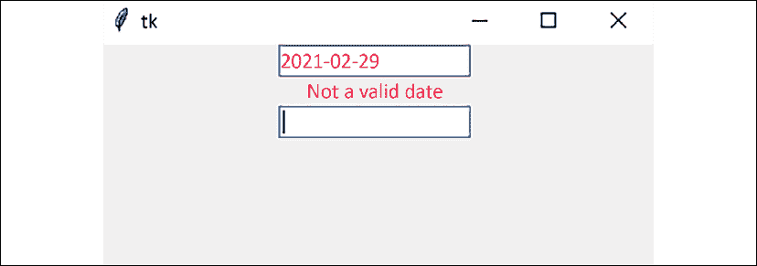
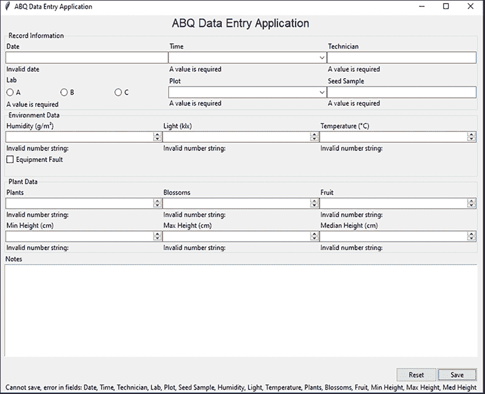

# 通过验证和自动化减少用户错误

我们的项目进展顺利：数据输入表单运行良好，代码组织得更好，用户对使用应用程序的前景感到兴奋。尽管如此，我们还没有准备好投入生产！我们的表单还没有执行承诺的任务，即防止或劝阻用户错误：数字框仍然允许字母，组合框没有限制在给定的选择中，日期只是需要手动填写的文本字段。在本章中，我们将通过以下主题来纠正这些问题：

+   在 *验证用户输入* 中，我们将讨论一些在控件中强制正确值并如何在 Tkinter 中实现它们的策略。

+   在 *创建验证控件类* 中，我们将使用一些自定义验证逻辑来增强 Tkinter 的控件类。

+   在 *在我们的 GUI 中实现验证控件* 中，我们将使用我们新的控件来改进 ABQ 数据输入。

+   在 *自动化输入* 中，我们将实现控件中的数据自动填充，以节省用户的时间和精力。

让我们开始吧！

# 验证用户输入

初看 Tkinter 的输入控件选择似乎有点令人失望。

它既没有提供只允许数字的真正数字输入，也没有提供真正键盘友好的、现代的下拉选择器。我们没有日期输入、电子邮件输入或其他特殊格式的输入控件。

尽管如此，这些弱点可以成为优势。因为这些控件没有任何假设，我们可以使它们以适合我们特定需求的方式表现。例如，在数字输入中，字母字符可能看起来不合适，但它们合适吗？在 Python 中，如 `NaN` 和 `Infinity` 这样的字符串是有效的浮点值；有一个可以递增数字但也可以处理这些字符串值的框，在某些应用中可能非常有用。

当然，在我们能够根据我们的需求定制我们的控件之前，我们需要考虑我们确切想要它们做什么。让我们进行分析。

## 防止数据错误的策略

对于控件应该如何响应用户尝试输入错误数据的问题，没有统一的答案。在各种 GUI 工具包中找到的验证逻辑可能大相径庭；当输入错误数据时，输入控件可能会以以下任何一种方式验证用户输入：

+   完全阻止无效按键注册

+   接受输入，但在表单提交时返回错误或错误列表

+   当用户离开输入字段时显示错误，可能禁用表单提交直到更正

+   将用户锁定在输入字段中，直到输入有效数据

+   使用最佳猜测算法静默地纠正错误数据

数据输入表单（每天由相同用户填写数百次，他们甚至可能没有注意到它）的正确行为可能与仪表控制面板（值必须绝对正确以避免灾难）或在线用户注册表单（由从未见过的小部件的用户填写一次）不同。我们需要问自己——以及我们的用户——哪种行为将最好地最小化错误。

在与数据输入人员用户讨论后，你得出以下一系列指南：

+   在可能的情况下，应忽略无意义的按键（例如，数字字段中的字母）。

+   在焦点移出时（当用户退出字段时），应通过描述问题的错误以某种可见方式标记包含不良数据的字段。

+   在焦点移出时留空的必填字段应标记为错误。

+   如果有字段存在未解决的错误，应禁用表单提交。

在继续之前，让我们将以下要求添加到我们的规范中。在“要求”部分，更新“功能要求”如下：

```py
Functional Requirements:
  (...)
  * have inputs that:
    - ignore meaningless keystrokes
    - display an error if the value is invalid on focusout
    - display an error if a required field is empty on focusout
  * prevent saving the record when errors are present 
```

到目前为止一切顺利，但我们如何实现它？

## Tkinter 中的验证

Tkinter 的验证系统是工具箱中不太直观的部分之一。它依赖于三个我们可以传递给任何输入小部件的配置参数：

+   `validate`参数确定哪种类型的事件将触发验证回调。

+   `validatecommand`参数：此选项接受确定数据是否有效的命令。

+   `invalidcommand`：此选项接受一个命令，如果`validatecommand`返回`False`，则运行该命令。

这看起来似乎很简单，但也有一些意外的曲线。让我们深入查看每个参数。

### `validate`参数

`validate`参数指定了触发验证的事件类型。它可以是指定的以下字符串值之一：

| 值 | 触发事件 |
| --- | --- |
| `none` | 从不。此选项关闭验证。 |
| `focusin` | 用户选择或输入小部件。 |
| `focusout` | 用户离开小部件。 |
| `focus` | `focusin`和`focusout`。 |
| `key` | 用户在小部件中按下一个键。 |
| `all` | 任何`focusin`、`focusout`或`key`事件。 |

只能指定一个`validate`参数，所有匹配的事件将触发相同的验证回调。大多数时候，你将想要使用`key`和`focusout`（在`focusin`上验证很少有用），但由于没有结合这两个事件的值，通常最好使用`all`，并在必要时让回调根据事件类型切换其验证逻辑。

### `validatecommand`参数

`validatecommand` 参数指定了当 `validate` 事件被触发时将运行的回调函数。这里事情变得有点棘手。你可能认为这个参数接受一个 Python 函数或方法的名称，但事实并非如此。相反，我们需要提供一个包含对 Tcl/Tk 函数的字符串引用的元组，以及（可选的）一些 **替换代码**，这些代码指定了我们想要传递给函数的触发事件的详细信息。

我们如何获取一个 Tcl/Tk 函数的引用？幸运的是，这并不太难；我们只需要将一个 Python 可调用对象传递给任何 Tkinter 小部件的 `register()` 方法。这会返回一个字符串引用，我们可以用它来与 `validatecommand` 一起使用。

例如，我们可以创建一个（有点无意义的）验证命令，如下所示：

```py
# validate_demo.py
import tkinter as tk
root = tk.Tk()
entry = tk.Entry(root)
entry.grid()
def always_good():
  return True
validate_ref = root.register(always_good)
entry.configure(
  validate='all',
  validatecommand=(validate_ref,)
)
root.mainloop() 
```

在这个例子中，我们通过将 `always_good` 函数传递给 `root.register()` 来检索我们的函数引用。然后我们可以将这个引用作为一个元组传递给 `validatecommand`。我们注册的验证回调必须返回一个布尔值，表示字段中的数据是否有效或无效。

`validatecommand` 回调 *必须* 返回一个布尔值。如果它返回任何其他内容（包括没有 `return` 语句时的隐式 `None` 值），Tkinter 将关闭小部件的验证（即，它将 `validate` 设置为 `none`）。请记住，它的目的 *仅* 是指示数据是否可接受。无效数据的处理将由我们的 `invalidcommand` 回调完成。

当然，除非我们向函数提供一些要验证的数据，否则很难验证数据。为了使 Tkinter 将信息传递给我们的验证回调，我们可以在 `validatecommand` 元组中添加一个或多个替换代码。这些代码如下：

| 代码 | 传递的值 |
| --- | --- |
| `%d` | 指示尝试的操作的代码：`0` 表示删除，`1` 表示插入，以及 `-1` 表示其他事件。请注意，这作为字符串传递，而不是整数。 |
| `%P` | 变更后字段将具有的提议值（仅限关键事件）。 |
| `%s` | 当前字段中的值（仅限关键事件）。 |
| `%i` | 在按键事件中插入或删除的文本的索引（从 `0` 开始），或在非按键事件中为 `-1`。请注意，这作为字符串传递，而不是整数。 |
| `%S` | 用于插入或删除的文本（仅限关键事件）。 |
| `%v` | 小部件的 `validate` 值。 |
| `%V` | 触发验证的事件类型，可以是 `focusin`、`focusout`、`key` 或 `forced`（表示小部件的变量已更改）。 |
| `%W` | Tcl/Tk 中小部件的名称，作为字符串。 |

我们可以使用这些代码创建一个稍微更有用的验证 `Entry`，如下所示：

```py
# validate_demo.py
# Place just before root.mainloop()
entry2 = tk.Entry(root)
entry2.grid(pady=10)
def no_t_for_me(proposed):
  return 't' not in proposed
validate2_ref = root.register(no_t_for_me)
entry2.configure(
  validate='all',
  validatecommand=(validate2_ref, '%P')
) 
```

在这里，我们将 `%P` 替换代码传递到我们的 `validatecommand` 元组中，以便我们的回调函数将接收到小部件的提议新值（即，如果按键被接受，则小部件的值）。在这种情况下，如果提议的值包含 `t` 字符，我们将返回 `False`。

注意，当 `validatecommand` 回调返回时，小部件的行为会根据触发验证的事件类型而改变。如果验证回调由 `key` 事件触发并返回 `False`，Tkinter 的内置行为是拒绝按键并保持内容不变。如果 `focus` 事件触发验证，则 `False` 返回值将简单地标记小部件为无效。在这两种情况下，`invalidcommand` 回调也将被执行。如果我们没有指定回调，Tkinter 将不会采取任何进一步的操作。

例如，运行上面的脚本；您会发现您不能在 `Entry` 小部件中键入 `t`。这是因为 `key` 验证返回 `False`，所以 Tkinter 拒绝了按键。

### `invalidcommand` 参数

`invalidcommand` 参数与 `validatecommand` 参数完全相同，需要使用 `register()` 方法以及相同的替换代码。它指定了一个在 `validatecommand` 返回 `False` 时要运行的回调函数。它可以用来显示错误或可能纠正输入。

要了解这些代码组合在一起的样子，请考虑以下仅接受五个字符的 `Entry` 小部件的代码：

```py
entry3 = tk.Entry(root)
entry3.grid()
entry3_error = tk.Label(root, fg='red')
entry3_error.grid()
def only_five_chars(proposed):
  return len(proposed) < 6
def only_five_chars_error(proposed):
  entry3_error.configure(
  text=f'{proposed} is too long, only 5 chars allowed.'
  )
validate3_ref = root.register(only_five_chars)
invalid3_ref = root.register(only_five_chars_error)
entry3.configure(
  validate='all',
  validatecommand=(validate3_ref, '%P'),
  invalidcommand=(invalid3_ref, '%P')
) 
```

在这里，我们创建了一个简单的 GUI，其中包含一个 `Entry` 小部件和一个 `Label` 小部件。我们还创建了两个函数，一个用于返回字符串长度是否小于六个字符，另一个用于配置 `Label` 小部件以显示错误。然后我们使用 `root.register()` 方法将这两个函数注册到 Tk 中，将它们传递给 `Entry` 小部件的 `validatecommand` 和 `invalidcommand` 参数。我们还包括了 `%P` 替换代码，以便将小部件的提议值传递给每个函数。请注意，您可以传递任意多的替换代码，并且可以按任意顺序传递，只要您的回调函数能够接受这些参数。

运行此示例并测试其行为；请注意，您不仅不能在框中键入超过五个字符，而且您还会在标签中收到警告，表明您的尝试编辑过长。

# 创建经过验证的小部件类

如您所见，即使在 Tkinter 小部件中添加非常简单的验证也涉及几个步骤和一些不太直观的逻辑。即使只对我们的部分小部件添加验证也可能变得冗长且难以看懂。然而，我们在上一章中学到，我们可以通过子类化 Tkinter 小部件来改进它们，以添加新的配置和功能。让我们看看我们是否可以将这种技术应用于小部件验证，通过创建 Tkinter 小部件类的验证版本。

例如，让我们再次实现我们的五字符输入，这次作为 `ttk.Entry` 的子类，如下所示：

```py
# five_char_entry_class.py
class FiveCharEntry(ttk.Entry):
  """An Entry that truncates to five characters on exit."""
  def __init__(self, parent, *args, **kwargs):
    super().__init__(parent, *args, **kwargs)
    self.error = tk.StringVar()
    self.configure(
      validate='all',
      validatecommand=(self.register(self._validate), '%P'),
      invalidcommand=(self.register(self._on_invalid), '%P')
    )
  def _validate(self, proposed):
    return len(proposed) <= 5
  def _on_invalid(self, proposed):
    self.error.set(
      f'{proposed} is too long, only 5 chars allowed!'
    ) 
```

这次，我们通过子类化 `Entry` 并在方法中定义我们的验证逻辑而不是外部函数来实现验证。这简化了我们在验证方法中对小部件的访问，如果我们需要的话，并且也允许我们在它们实际定义之前在 `__init__()` 中引用这些方法。我们还添加了一个名为 `error` 的 `StringVar` 作为实例变量。如果我们的验证失败，我们可以使用这个变量来保存错误消息。

注意，我们使用 `self.register()` 而不是 `root.register()` 来注册这些函数。`register()` 方法不需要在 `root` 窗口对象上运行；它可以在任何 Tkinter 小部件上运行。由于我们无法确定使用我们类代码的人是否会调用 `root` 窗口，或者它是否在 `__init__()` 方法运行时处于作用域内，因此使用 `FiveCharEntry` 小部件本身来注册函数是有意义的。然而，这必须在调用 `super().__init__()` 之后完成，因为底层的 Tcl/Tk 对象实际上并不存在（并且不能注册函数），直到该方法运行。这就是为什么我们使用 `configure()` 来设置这些值，而不是将它们传递给 `super().__init__()` 的原因。

我们可以使用此类如下：

```py
root = tk.Tk()
entry = FiveCharEntry(root)
error_label = ttk.Label(
  root, textvariable=entry.error, foreground='red'
)
entry.grid()
error_label.grid()
root.mainloop() 
```

在这里，我们创建了一个 `FiveCharEntry` 小部件的实例以及一个 `Label` 小部件来显示错误。请注意，我们将小部件的内置错误变量 `entry.error` 传递给标签的 `textvariable` 参数。当你执行这个操作时，你应该会看到标签在尝试输入超过五个字符时显示错误，如下所示：


图 5.1：五字符输入拒绝接受 "Banana"

## 创建日期字段

现在让我们尝试做一些更有用的东西：创建一个用于我们的 `Date` 字段的验证 `DateEntry` 小部件。我们的小部件将阻止任何对于日期字符串无效的按键，并在 `focusout` 时检查日期的有效性。如果日期无效，我们将以某种方式标记字段，并在 `StringVar` 中设置一个错误消息，其他小部件可以使用它来显示错误。

首先，打开一个名为 `DateEntry.py` 的新文件，并从以下代码开始：

```py
# DateEntry.py
import tkinter as tk
from tkinter import ttk
from datetime import datetime
class DateEntry(ttk.Entry):
  """An Entry for ISO-style dates (Year-month-day)"""
  def __init__(self, parent, *args, **kwargs):
    super().__init__(parent, *args, **kwargs)
    self.configure(
      validate='all',
      validatecommand=(
        self.register(self._validate),
        '%S', '%i', '%V', '%d'
      ),
      invalidcommand=(self.register(self._on_invalid), '%V')
    )
    self.error = tk.StringVar() 
```

在导入 `tkinter` 和 `ttk` 之后，我们还导入了 `datetime`，这是为了验证输入的日期字符串。与之前的类一样，我们重写了 `__init__()` 方法来设置验证并添加一个错误变量。然而，这一次，我们将向我们的 `validatecommand` 方法传递更多的参数：要插入的字符（`%S`），插入的索引位置（`%i`），触发验证的事件类型（`%V`），以及动作类型（`%d`）。`invalidcommand` 只接收事件类型（`%V`）。由于我们将在所有事件上触发验证，我们需要这个值来决定如何适当地处理无效数据。

接下来，让我们创建一个名为 `_toggle_error()` 的方法来在小部件中打开或关闭错误状态：

```py
 def _toggle_error(self, error=''):
    self.error.set(error)
    **self.config(foreground=****'red'****if** **error** **else****'black'****)** 
```

我们将使用这个方法来处理小部件在发生错误或被纠正时的行为。它首先将我们的错误变量设置为提供的字符串。如果字符串不为空，我们设置一个视觉错误指示器（在这种情况下，将文本变为红色）；如果为空，我们关闭视觉指示器。

现在我们有了这些，我们可以创建我们的 `_validate()` 方法，如下所示：

```py
 def _validate(self, char, index, event, action):
    # reset error state
    self._toggle_error()
    valid = True
    # ISO dates only need digits and hyphens
    if event == 'key':
      if action == '0':
        valid = True
      elif index in ('0', '1', '2', '3', '5', '6', '8', '9'):
        valid = char.isdigit()
      elif index in ('4', '7'):
        valid = char == '-'
      else:
        valid = False 
```

这个方法将采取“无罪直到被证明有罪”的方法来验证用户输入，所以我们首先关闭任何错误状态并将 `valid` 标志设置为 `True`。然后，我们将开始查看按键事件。`if action == '0':` 这行代码告诉我们用户是否正在尝试删除字符。我们总是希望允许这样做，以便用户可以编辑字段，所以它应该总是返回 `True`。

ISO 日期的基本格式是四位数字，一个连字符，两位数字，一个连字符，再是两位数字。我们可以通过检查插入的字符是否与我们的期望匹配来测试用户是否遵循了这种格式。例如，`index in ('0','1', '2', '3', '5', '6', '8', '9')` 这行代码将告诉我们字符是否被插入到需要数字的一个位置，如果是，我们将检查该字符是否为数字。索引 `4` 和 `7` 的字符应该是连字符。任何其他按键都是无效的。

尽管你可能期望它们是整数，Tkinter 将动作代码和字符索引都作为字符串传递。在编写比较时请记住这一点。

虽然这是一个对于正确日期来说极其天真的启发式方法，因为它允许像 `0000-97-46` 或看起来正确但实际上错误的日期 `2000-02-29` 这样的完全无意义的日期，但它至少强制执行了基本格式，并移除了一大堆无效的按键。一个完全准确的日期部分分析器是一个独立的项目，但就目前而言，这已经足够了。

检查在焦点移出时日期的正确性更为简单且更不容易出错，正如你在这里可以看到的：

```py
# still in DateEntry._validate()
    elif event == 'focusout':
      try:
        datetime.strptime(self.get(), '%Y-%m-%d')
      except ValueError:
        valid = False
    return valid 
```

由于我们现在可以访问用户打算输入的最终值，我们可以使用 `datetime.strptime()` 尝试使用格式 `%Y-%m-%d` 将字符串转换为 Python `datetime` 对象。如果这失败，我们知道日期是无效的。

最后，在方法末尾，我们返回我们的 `valid` 标志。正如你之前看到的，对于按键事件，返回 `False` 就足以防止字符被插入；但对于焦点事件上的错误，我们需要以某种用户可见的方式做出响应。

这将在我们的 `_on_invalid()` 方法中处理，如下所示：

```py
 def _on_invalid(self, event):
    if event != 'key':
      self._toggle_error('Not a valid date') 
```

我们已经配置了此方法，使其仅接收事件类型，我们将使用它来忽略按键事件（它们已经被默认行为充分处理）。对于任何其他事件类型，我们将使用我们的 `_toggle_error()` 方法来设置我们的视觉指示器和错误字符串。

让我们在文件的末尾使用一个小测试脚本来测试 `DateEntry` 类：

```py
if __name__ == '__main__':
  root = tk.Tk()
  entry = DateEntry(root)
  entry.pack()
  ttk.Label(
    textvariable=entry.error, foreground='red'
  ).pack()
  # add this so we can unfocus the DateEntry
  ttk.Entry(root).pack()
  root.mainloop() 
```

保存文件并运行它以尝试新的 `DateEntry` 类。尝试输入各种错误的日期或无效的按键，然后点击第二个 `Entry` 小部件以取消 `DateEntry` 的焦点，并注意发生了什么。

你应该看到如下内容：



图 5.2：一个验证的 DateEntry 小部件警告我们关于一个错误的日期字符串

# 在我们的 GUI 中实现验证小部件

现在你已经知道了如何验证你的小部件，你有很多工作要做！我们有 17 个输入小部件，你必须为它们都编写像上一节中所示的那种验证代码，以获得我们需要的功能。在这个过程中，你需要确保小部件对错误做出一致的反应，并向应用程序提供一个一致的 API。

如果这听起来像是你想无限期推迟的事情，我无法责怪你。也许有一种方法我们可以减少我们需要编写的重复代码量。

## 介绍多重继承的强大功能

到目前为止，我们已经了解到 Python 允许我们通过子类化来创建新类，从超类继承特性，并且只添加或更改我们新类中不同的部分。Python 还支持使用 **多重继承** 来构建类，其中子类可以继承多个超类。我们可以通过创建所谓的 **混合类** 来利用这个特性。

混合类只包含我们想要能够“混合”到其他类中以组成新类的一组特定功能。

看看下面的示例代码：

```py
class Fruit():
  _taste = 'sweet'
  def taste(self):
    print(f'It tastes {self._taste}')
class PeelableMixin():
  def __init__(self, *args, **kwargs):
    super().__init__(*args, **kwargs)
    self._peeled = False
  def peel(self):
    self._peeled = True
  def taste(self):
    if not self._peeled:
      print('I will peel it first')
      self.peel()
    super().taste() 
```

在这个例子中，我们有一个名为 `Fruit` 的类，它有一个 `_taste` 类属性和一个 `taste()` 方法，该方法打印一条消息，指示水果的口感。然后我们有一个名为 `PeelableMixin` 的混合类。混合类添加了一个实例属性 `_peeled`，用来指示水果是否已被剥皮，以及一个 `peel()` 方法来更新 `_peeled` 属性。它还重写了 `taste()` 方法，在品尝之前检查水果是否已被剥皮。请注意，即使混合类没有从另一个类继承，其 `__init__()` 方法也会调用超类初始化器。我们稍后将看到这是为什么。

现在，让我们使用多重继承来创建一个新的类，如下所示：

```py
class Plantain(PeelableMixin, Fruit):
  _taste = 'starchy'
  def peel(self):
    print('It has a tough peel!')
    super().peel() 
```

`Plantain`类是由`PeelableMixin`和`Fruit`类的组合创建的。当我们使用多重继承创建类时，我们指定的最右侧的类被称为**基类**，混入类应该在其之前指定（即位于基类的左侧）。因此，在这种情况下`Fruit`是基类。

让我们创建我们类的实例并调用`taste()`，如下所示：

```py
plantain = Plantain()
plantain.taste() 
```

如你所见，生成的子类既有`taste()`方法也有`peel()`方法，但请注意，在所有类之间定义了每种方法的两个版本。当我们调用这些方法之一时，使用的是哪个版本？

在多重继承的情况下，`super()`所做的比仅仅代表超类要复杂一些。它使用称为**方法解析顺序**（**MRO**）的东西来查找继承链，并确定定义我们正在调用的方法的最近类。解析顺序从当前类开始，然后按照从左侧到基类的超类链进行。

因此，当我们调用`plantain.taste()`时，会发生一系列的方法解析，如下所示：

+   `plantain.taste()`解析为`PeelableMixin.taste()`。

+   然后`PeelableMixin.taste()`调用`self.peel()`。由于`self`是一个`Plantain`对象，`self.peel()`解析为`Plantain.peel()`。

+   `Plaintain.peel()`打印一条消息并调用`super().peel()`。Python 将此调用解析为具有`peel()`方法的左侧最接近的类，即`PeelableMixin.peel()`。

+   当返回结果时，`PeelableMixin.taste()`然后调用`super().taste()`。从`PeelableMixin`开始的下一个左侧类是`Fruit`，因此这解析为`Fruit.taste()`。

+   `Fruit.taste()`引用类变量`_taste`。即使正在运行的方法在`Fruit`类中，但我们的对象类是`Plantain`，所以这里使用`Plantain._taste`。

如果这看起来很复杂，只需记住`self.method()`或`self.attribute`将始终首先在当前类中查找`method()`或`attribute`，然后从左到右按照继承的类列表进行查找，直到找到方法或属性。`super()`对象将做同样的事情，但它会跳过当前类。

这就是我们为什么在示例中在混入类的初始化器中调用`super().__init__()`的原因。

如果不进行此调用，则只会调用混入类的初始化器。通过调用`super().__init__()`，Python 还会继续沿着 MRO 链向上调用基类初始化器。这在创建 Tkinter 类的混入类时尤其重要，因为 Tkinter 类的初始化器创建了实际的 Tcl/Tk 对象。

类的方法解析顺序存储在其`__mro__`属性中；如果你在使用继承的方法或属性时遇到问题，可以在 Python 壳或调试器中检查此方法。

注意，`PeelableMixin`不能单独使用：它只能在具有`taste()`方法的类结合使用时工作。这就是为什么它是一个混合类：它旨在与其他类混合以增强其他类，而不是单独使用。

不幸的是，Python 没有提供一种方法来显式地在代码中注释一个类是混合类或它必须与哪些类混合，所以请确保很好地记录你的混合类。

## 构建验证混合类

让我们应用我们对多重继承的知识来构建一个混合类，这将帮助我们用更少的样板代码创建验证小部件类。打开`data_entry_app.py`并在你的`Application`类定义之上添加新类：

```py
# data_entry_app.py
class ValidatedMixin:
  """Adds a validation functionality to an input widget"""
  def __init__(self, *args, error_var=None, **kwargs):
    self.error = error_var or tk.StringVar()
    super().__init__(*args, **kwargs) 
```

我们像往常一样开始这个类，尽管这次我们没有子类化任何东西，因为这是一个混合类。构造函数还有一个额外的参数，称为`error_var`。这将允许我们传递一个用于错误消息的变量；如果没有，类将创建自己的。记住，对`super().__init__()`的调用将确保执行基类初始化器。

接下来，我们设置验证，如下所示：

```py
 vcmd = self.register(self._validate)
    invcmd = self.register(self._invalid)
    self.configure(
      validate='all',
      validatecommand=(vcmd, '%P', '%s', '%S', '%V', '%i', '%d'),
      invalidcommand=(invcmd, '%P', '%s', '%S', '%V', '%i', '%d')
    ) 
```

如之前所做的那样，我们正在注册实例方法以进行验证和无效数据处理，然后使用`configure`将它们与小部件一起设置。我们将继续传递所有替换代码（除了`%w`，即小部件名称，因为它在类上下文中相当无用）。我们在所有条件下运行验证，因此我们可以捕获`focus`和`key`事件。

现在，我们将定义我们的错误条件处理器：

```py
 def _toggle_error(self, on=False):
    self.configure(foreground=('red' if on else 'black')) 
```

这将仅在存在错误时将文本颜色更改为红色，否则为黑色。与之前的验证小部件类不同，我们不会在这个函数中设置错误字符串；相反，我们将在验证回调中这样做，因为在那样的上下文中我们将更好地了解错误是什么。

我们的验证回调将如下所示：

```py
 def _validate(self, proposed, current, char, event, index, action):
    self.error.set('')
    self._toggle_error()
    valid = True
    # if the widget is disabled, don't validate
    state = str(self.configure('state')[-1])
    if state == tk.DISABLED:
      return valid
    if event == 'focusout':
      valid = self._focusout_validate(event=event)
    elif event == 'key':
      valid = self._key_validate(
      proposed=proposed,
      current=current,
      char=char,
      event=event,
      index=index,
      action=action
    )
    return valid 
```

由于这是一个混合类，我们的`_validate()`方法实际上不包含任何验证逻辑。相反，它将首先处理一些设置任务，例如关闭错误并清除错误消息。然后，它检查小部件是否被禁用，通过检索小部件`state`值中的最后一个项目来实现。如果它被禁用，小部件的值无关紧要，因此验证应该始终通过。

之后，该方法根据传入的事件类型调用特定的事件回调方法。我们现在只关心`key`和`focusout`事件，所以任何其他事件都返回`True`。这些特定的事件方法将在我们的子类中定义，以确定实际使用的验证逻辑。

注意，我们使用关键字参数调用单个方法；当我们创建我们的子类时，我们将覆盖这些方法。通过使用关键字参数，我们的覆盖函数只需指定所需的关键字或从`**kwargs`中提取单个参数，而不必按正确的顺序获取所有参数。此外，请注意，所有参数都传递给了`_key_validate()`，但只有`event`传递给了`_focusout_validate()`。焦点事件不会传递任何有用的参数给其他任何参数，所以没有必要传递它们。

接下来，我们将为特定事件的验证方法添加占位符：

```py
 def _focusout_validate(self, **kwargs):
    return True
  def _key_validate(self, **kwargs):
    return True 
```

这里的最终想法是，我们的子类只需要覆盖一个或两个`_focusout_validate()`或`_key_validate()`，具体取决于我们对该小部件的关注点。如果我们不覆盖它们，它们将默认返回`True`，因此验证通过。

现在，让我们为我们的无效输入处理程序做类似的事情：

```py
 def _invalid(self, proposed, current, char, event, index, action):
    if event == 'focusout':
      self._focusout_invalid(event=event)
    elif event == 'key':
      self._key_invalid(
        proposed=proposed,
        current=current,
        char=char,
        event=event,
        index=index,
        action=action
      )
  def _focusout_invalid(self, **kwargs):
    """Handle invalid data on a focus event"""
    self._toggle_error(True)
  def _key_invalid(self, **kwargs):
    """Handle invalid data on a key event.  
    By default we want to do nothing"""
    pass 
```

我们对这些方法采取相同的方法。与验证方法不同，我们的无效数据处理程序不需要返回任何内容。对于无效的`key`事件，我们默认不执行任何操作，对于`focusout`事件上的无效输入，我们切换错误状态。

我们最后想添加的是一种手动在控件上执行验证的方法。按键验证仅在输入键的上下文中才有意义，但有时我们可能想手动运行焦点退出检查，因为它们实际上检查了完整输入值。让我们通过以下公共方法来实现这一点：

```py
 def trigger_focusout_validation(self):
    valid = self._validate('', '', '', 'focusout', '', '')
    if not valid:
      self._focusout_invalid(event='focusout')
    return valid 
```

在这个方法中，我们只是在复制焦点退出事件发生时的逻辑：运行验证函数，如果失败，则运行无效处理程序。这完成了`ValidatedMixin`。现在让我们通过将其应用于我们的某些小部件来看看它是如何工作的。

## 使用 ValidatedMixin 构建验证输入小部件

首先，让我们思考一下我们需要使用我们的新`ValidatedMixin`类实现哪些类：

+   除了注释字段之外，我们所有的字段都是必需的（当未禁用时），因此我们需要一个基本的`Entry`小部件，如果没有任何输入，它会注册一个错误。

+   我们有一个日期字段，因此我们需要一个强制有效日期字符串的`Entry`小部件。

+   我们有几个用于十进制或整数输入的`Spinbox`小部件。我们需要确保这些小部件只接受有效的数字字符串。

+   我们有几个`Combobox`小部件，它们的行为并不完全符合我们的期望。

让我们开始吧！

### 需求数据

让我们从需要数据的基本`Entry`小部件开始。我们可以将这些用于技术人员和种子样本字段。

在`ValidatedMixin`类之后添加一个新类：

```py
# data_entry_app.py
class RequiredEntry(ValidatedMixin, ttk.Entry):
  """An Entry that requires a value"""
  def _focusout_validate(self, event):
    valid = True
    if not self.get():
      valid = False
      self.error.set('A value is required')
    return valid 
```

这里没有按键验证要做，所以我们只需要创建`_focusout_validate()`。在那个方法中，我们只需要检查输入值是否为空。如果是，我们只需设置一个`error`字符串并返回`False`。

就这么简单！

### 创建日期小部件

接下来，让我们将混合类应用到我们之前制作的`DateEntry`类上，保持相同的验证算法。在`RequiredEntry`类下方添加以下代码：

```py
class DateEntry(ValidatedMixin, ttk.Entry):
  """An Entry that only accepts ISO Date strings"""
  def _key_validate(self, action, index, char, **kwargs):
    valid = True
    if action == '0':  # This is a delete action
      valid = True
    elif index in ('0', '1', '2', '3', '5', '6', '8', '9'):
      valid = char.isdigit()
    elif index in ('4', '7'):
      valid = char == '-'
    else:
      valid = False
    return valid
  def _focusout_validate(self, event):
    valid = True
    if not self.get():
      self.error.set('A value is required')
      valid = False
    try:
      datetime.strptime(self.get(), '%Y-%m-%d')
    except ValueError:
      self.error.set('Invalid date')
      valid = False
    return valid 
```

在这个类中，我们再次简单地重写了`key`和`focus`验证方法，这次复制了我们之前在`DateEntry`小部件中使用的验证逻辑。`_focusout_validate()`方法也包括了`RequiredEntry`类的逻辑，因为日期值是必需的。

这些类都很容易创建；让我们继续做一些更复杂的事情。

### 一个更好的 Combobox 小部件

不同工具包或小部件集中的下拉小部件在鼠标操作方面表现相当一致，但按键响应各不相同；例如：

+   一些不做任何事情，例如 Tkinter 的`OptionMenu`

+   一些需要使用箭头键来选择项目，例如 Tkinter 的`ListBox`

+   一些将列表缩小到以按下的任何键开头的第一个条目，并在后续按下时循环显示以该字母开头的条目

+   一些将列表缩小到与输入的文本匹配的条目

我们需要考虑我们的`Combobox`小部件应该有什么行为。由于我们的用户习惯于使用键盘进行数据输入，并且有些人使用鼠标有困难，因此小部件需要与键盘很好地协同工作。让他们使用重复的按键来选择选项也不是很直观。在与数据输入人员交谈后，你决定采用以下行为：

+   如果提议的文本与任何条目都不匹配，则忽略按键

+   当提议的文本与单个条目匹配时，小部件被设置为该值

+   删除或退格键清除整个框

让我们看看我们能否通过验证来实现这一点。在`DateEntry`定义之后添加另一个类：

```py
class ValidatedCombobox(ValidatedMixin, ttk.Combobox):
  """A combobox that only takes values from its string list"""
  def _key_validate(self, proposed, action, **kwargs):
    valid = True
    if action == '0':
      self.set('')
      return True 
```

`_key_validate()`方法首先设置一个有效标志并快速检查这是否是一个删除操作。如果是，我们将值设置为空字符串并返回`True`。这样就处理了最后一个要求。

现在，我们将添加将提议文本与我们的值匹配的逻辑：

```py
 values = self.cget('values')
    # Do a case-insensitive match against the entered text
    matching = [
      x for x in values
      if x.lower().startswith(proposed.lower())
    ]
    if len(matching) == 0:
      valid = False
    elif len(matching) == 1:
      self.set(matching[0])
      self.icursor(tk.END)
      valid = False
    return valid 
```

使用小部件的`cget()`方法检索其值列表的副本。然后，我们使用列表推导来将此列表缩减到仅包含以提议文本开头的条目。为了使匹配不区分大小写，我们在比较之前在列表项中的值和提议文本上都调用`lower()`

每个 Tkinter 小部件都支持`cget()`方法。它可以用来通过名称检索小部件的任何配置值。

如果匹配列表的长度为`0`，则没有以输入值开头的项，我们将拒绝按键。如果它是`1`，我们就找到了匹配项，因此我们将变量设置为该值。这是通过调用小部件的`set()`方法并传递匹配值来完成的。作为最后的润色，我们将使用组合框的`.icursor()`将光标移至字段的末尾。这并不是严格必要的，但看起来比将光标留在文本中间要好。注意，尽管值匹配成功，我们仍然将`valid`设置为`False`；由于我们正在将值自行设置为匹配项，我们希望停止任何进一步的输入到小部件。否则，建议的按键将被附加到我们设置的值的末尾，从而创建一个无效的输入。

还要注意，如果我们的匹配列表包含多个值，该方法将仅返回`True`，允许用户继续输入并过滤列表。

接下来，让我们添加`focusout`验证器：

```py
 def _focusout_validate(self, **kwargs):
    valid = True
    if not self.get():
      valid = False
      self.error.set('A value is required')
    return valid 
```

我们在这里不需要做太多，因为键验证方法确保唯一可能的值是空白字段或`values`列表中的项，但由于所有字段都需要值，我们将从`RequiredEntry`复制验证逻辑。

这样我们就处理好了`Combobox`小部件。接下来，我们将处理`Spinbox`小部件。

### 一个范围受限的 Spinbox 小部件

数字输入看起来似乎处理起来不会太复杂，但有一些细微之处需要处理以确保其健壮性。除了限制字段为有效的数字字符串外，你还需要强制执行`from_`、`to`和`increment`参数分别为输入的最小值、最大值和精度。

算法需要实现以下规则：

+   删除总是允许的

+   数字总是允许的

+   如果`from_`小于 0，允许负号作为第一个字符

+   如果`increment`有小数部分，则允许一个（且仅一个）点

+   如果建议的值大于`to`值，则忽略按键

+   如果建议的值需要比`increment`更高的精度，则忽略按键

+   在`focusout`时，确保值是一个有效的数字字符串

+   在`focusout`时，确保值大于`from_`值

这有很多规则，所以让我们慢慢来，在尝试实现它们的过程中。我们首先想要做的是从标准库中导入`Decimal`类。在文件顶部，将以下内容添加到导入列表的末尾：

```py
from decimal import Decimal, InvalidOperation 
```

`Decimal`类帮助我们的十进制值比内置的`float`类更精确，并且也使得在数字和字符串之间进行转换变得更容易。`InvalidOperation`是我们可以在验证逻辑中使用的特定于十进制的异常。

现在，让我们在`ValidatedCombobox`类下添加一个新的`ValidatedSpinbox`类，如下所示：

```py
**class****ValidatedSpinbox****(ValidatedMixin, ttk.Spinbox):**
  def __init__(
    self, *args, from_='-Infinity', to='Infinity', **kwargs
  ):
    super().__init__(*args, from_=from_, to=to, **kwargs)
    increment = Decimal(str(kwargs.get('increment', '1.0')))
    self.precision = increment.normalize().as_tuple().exponent 
```

我们首先通过重写`__init__()`方法来指定一些默认值，并从初始化参数中获取`from_`、`to`和`increment`值，以便在建立验证规则时使用。请注意，我们已经为`to`和`from_`设置了默认值：`-Infinity`和`Infinity`。`float`和`Decimal`都乐意接受这些值，并按你期望的方式处理它们。回想一下，如果我们指定一个限制，我们必须也指定另一个。添加这些默认值允许我们只指定所需的那个，并且我们的`Spinbox`将按预期工作。

一旦我们运行了超类初始化方法，我们将确定精度值；即我们希望小数点右边的数字位数。

要做到这一点，我们首先从关键字参数中检索`increment`值，如果没有指定，则使用`1.0`。然后我们将此值转换为`Decimal`对象。为什么要这样做？`Spinbox`小部件的参数可以是浮点数、整数或字符串。无论你如何传递它们，Tkinter 都会在`Spinbox`初始化器运行时将它们转换为浮点数。由于浮点数错误，确定浮点数的精度是有问题的，所以我们希望在它成为浮点数之前将其转换为 Python 的`Decimal`。

什么是浮点数错误？浮点数试图以二进制形式表示十进制数。打开 Python 壳，并输入`1.2 / 0.2`。你可能会惊讶地发现答案是`5.999999999999999`而不是`6`。这是在二进制数上而不是在十进制数上进行计算的结果，并且是几乎所有编程语言中的计算错误来源。Python 为我们提供了`Decimal`类，它接受一个数字字符串并将其以使数学运算免受浮点数错误影响的方式存储。

注意，我们在将`increment`传递给`Decimal`之前将其转换为`str`。理想情况下，我们应该将`increment`作为字符串传递给我们的小部件以确保它被正确解释，但如果出于某种原因需要传递一个浮点数，`str`将首先进行一些合理的舍入。

将`increment`转换为`Decimal`对象后，我们可以通过取最小有效小数位的指数来提取其精度值。我们将在验证方法中使用这个值来确保我们输入的数据没有太多小数位。

我们的小部件构造器现在已经确定，所以让我们编写验证方法。`_key_validate()`方法有点棘手，所以我们将分块进行讲解。

首先，我们开始这个方法：

```py
 def _key_validate(
    self, char, index, current, proposed, action, **kwargs
  ):
    if action == '0':
      return True
    valid = True
    min_val = self.cget('from')
    max_val = self.cget('to')
    no_negative = min_val >= 0
    no_decimal = self.precision >= 0 
```

首先，因为删除操作应该始终有效，所以如果操作是删除，我们将立即返回`True`。之后，我们使用`cget()`获取`from_`和`to`的值，并声明一些标志变量来指示是否允许负数和小数。

接下来，我们需要测试所提出的按键是否是一个有效的字符：

```py
 if any([
      (char not in '-1234567890.'),
      (char == '-' and (no_negative or index != '0')),
      (char == '.' and (no_decimal or '.' in current))
    ]):
      return False 
```

有效的字符是数字、`-` 符号和十进制（`.`）。减号仅在索引 `0` 处有效，并且仅当允许负数时有效。小数只能出现一次，并且只有当我们的精度小于 `1` 时才有效。我们将所有这些条件放入一个列表中，并将其传递给内置的 `any()` 函数。

内置的 `any()` 函数接受一个表达式列表，如果列表中的任何一个表达式为真，则返回 `True`。还有一个 `all()` 函数，只有当列表中的所有表达式都为真时才返回 `True`。这些函数允许你压缩一长串布尔表达式。

到目前为止，我们几乎可以肯定有一个有效的 `Decimal` 字符串，但还不完全确定；我们可能只有 `-`、`.` 或 `-.` 这些字符。

这些不是有效的 `Decimal` 字符串，但它们是有效的 *部分* 输入，因此我们应该允许它们。此代码将检查这些组合并允许它们：

```py
 if proposed in '-.':
      return True 
```

如果我们在此点还没有返回，则提议的文本只能是一个有效的 `Decimal` 字符串，因此我们将从它创建一个 `Decimal` 对象并进行一些最终测试：

```py
 proposed = Decimal(proposed)
    proposed_precision = proposed.as_tuple().exponent
    if any([
      (proposed > max_val),
      (proposed_precision < self.precision)
    ]):
      return False
    return valid 
```

我们最后的两个测试是检查提议的文本是否大于我们的最大值，或者比我们指定的增量（我们在这里使用 `<` 操作符的原因是精度以负值表示小数位数）有更多的精度。最后，如果没有返回任何内容，我们将返回 `valid` 值。

这就处理了键验证；我们的焦点外验证器要简单得多，如下所示：

```py
 def _focusout_validate(self, **kwargs):
    valid = True
    value = self.get()
    min_val = self.cget('from')
    max_val = self.cget('to')
    try:
      d_value = Decimal(value)
    except InvalidOperation:
      self.error.set(f'Invalid number string: {value}')
      return False
    if d_value < min_val:
      self.error.set(f'Value is too low (min {min_val})')
      valid = False
    if d_value > max_val:
      self.error.set(f'Value is too high (max {max_val})')
      valid = False
    return valid 
```

在我们拥有整个预期值的情况下，我们只需要确保它是一个有效的 `Decimal` 字符串，并且处于指定的值范围内。从理论上讲，我们的键验证应该阻止无效的十进制字符串或高值被输入，但进行检查并无害处。

完成该方法后，我们的 `ValidatedSpinbox` 就可以使用了。

### 验证 Radiobutton 小部件

验证 `Radiobutton` 小部件可能一开始看起来毫无意义，因为小部件本身只能处于开启或关闭状态；然而，在某些情况下，验证一组按钮可能非常有用。例如，在我们的 ABQ 数据表单中，实验室字段必须有一个值，但当前用户可以提交一个记录而不点击任何一个选项。

为了解决这个问题，我们将创建一个新的类来表示一组按钮，并将验证代码添加到这个复合小部件中。

不幸的是，我们的混合类在这里帮不上忙，因为我们的复合小部件和 Ttk `Radiobutton` 小部件都不支持 `validate`、`validatecommand` 或 `invalidcommand` 参数。因此，我们将不得不在没有 Tkinter 验证系统帮助的情况下实现按钮组的验证。

首先，我们将对 `ttk.Frame` 进行子类化，以构建复合小部件：

```py
# data_entry_app.py 
class ValidatedRadioGroup(ttk.Frame):
  """A validated radio button group"""
  def __init__(
    self, *args, variable=None, error_var=None,
    values=None, button_args=None, **kwargs
  ):
    super().__init__(*args, **kwargs)
    self.variable = variable or tk.StringVar()
    self.error = error_var or tk.StringVar()
    self.values = values or list()
    self.button_args = button_args or dict() 
```

这个类的初始化器接受多个关键字参数：

+   `variable` 将是控制该组值的控制变量。如果没有传入，它将由该类创建。

+   `error_var` 是错误字符串的控制变量。正如我们其他已验证的类一样，我们允许接受一个 `StringVar` 控制变量来保存错误字符串，或者如果没有传入，我们创建一个，将其保存为 `self.error`。

+   `values` 将是一个包含每个按钮在组中代表的字符串值的列表。

+   `button_args` 将是一个关键字参数的字典，我们可以将其传递给单个 `Radiobutton` 小部件。这将允许我们单独从 `Frame` 容器传递参数给按钮。

剩余的位置参数和关键字参数被传递给超类初始化器。在将关键字值保存到实例变量之后，我们将创建按钮，如下所示：

```py
 for v in self.values:
      button = ttk.Radiobutton(
        self, value=v, text=v,
        variable=self.variable, **self.button_args
      )
      button.pack(
        side=tk.LEFT, ipadx=10, ipady=2, expand=True, fill='x'
      ) 
```

正如我们在 `LabelInput` 初始化器中所做的那样，我们正在遍历 `values` 列表，为每个值创建一个 `Radiobutton` 小部件，并将其绑定到公共控制变量。每个小部件都从小部件的左侧开始填充到 `Frame` 中。

为了完成初始化器，我们需要在 `Frame` 小部件失去焦点时触发验证回调。为此，我们可以简单地使用 `bind()`，如下所示：

```py
 self.bind('<FocusOut>', self.trigger_focusout_validation) 
```

现在，每当小部件失去焦点时，验证回调将被调用。让我们接下来编写这个回调：

```py
 def trigger_focusout_validation(self, *_):
    self.error.set('')
    if not self.variable.get():
      self.error.set('A value is required') 
```

此方法首先将错误变量设置为空字符串，然后简单地检查我们的边界变量是否包含值。如果它是空的，错误字符串将被填充。

在我们能够使用这个复合小部件与我们的应用程序一起使用之前，我们需要对 `LabelInput` 类进行一个小修改。记住，`LabelInput` 确保正确的控制变量关键字参数被传递到小部件初始化器中。我们需要确保我们的新复合小部件类得到正确的关键字（在这种情况下是 `variable`）。

更新 `LabelInput` 初始化器如下：

```py
# data_entry_app, in LabelInput.__init__()
    if input_class in (
      ttk.Checkbutton, ttk.Button,
      ttk.Radiobutton, **ValidatedRadioGroup**
    ):
      input_args["variable"] = self.variable
    else:
      input_args["textvariable"] = self.variable 
```

有了这些，`ValidatedRadio` 小部件应该准备好使用了！

## 更新我们的表单以使用验证小部件

现在我们已经制作了所有小部件，是时候在我们的表单 GUI 中使用它们了。在 `data_entry_app.py` 中，滚动到 `DataRecordForm` 类的 `__init__()` 方法，我们将逐行更新我们的小部件。第 1 行相当直接：

```py
 LabelInput(
      r_info, "Date", var=self._vars['Date'], input_class=**DateEntry**
    ).grid(row=0, column=0)
    LabelInput(
      r_info, "Time", input_class=**ValidatedCombobox**,
      var=self._vars['Time'],
      input_args={"values": ["8:00", "12:00", "16:00", "20:00"]}
    ).grid(row=0, column=1)
    LabelInput(
      r_info, "Technician",  var=self._vars['Technician'],
      input_class=**RequiredEntry**
    ).grid(row=0, column=2) 
```

这就像在每个 `LabelInput` 调用中用我们新的类之一替换 `input_class` 值一样简单。继续运行你的应用程序并尝试这些小部件。在 `DateEntry` 中尝试一些不同的有效和无效日期，看看 `ValidatedCombobox` 小部件是如何工作的（`RequiredEntry` 在这一点上不会做太多，因为唯一的可见指示是红色文本，如果没有文本标记为红色，那么它就是空的；我们将在下一节中解决这个问题）。

现在，让我们处理第 2 行，它包括 Lab、Plot 和 Seed Sample 输入：

```py
 LabelInput(
      r_info, "Lab", input_class=**ValidatedRadioGroup**,
      var=self._vars['Lab'], input_args={"values": ["A", "B", "C"]}
    ).grid(row=1, column=0)
    LabelInput(
      r_info, "Plot", input_class=ValidatedCombobox,
      var=self._vars['Plot'], 
      input_args={"values": list(range(1, 21))}
    ).grid(row=1, column=1)
    LabelInput(
      r_info, "Seed Sample",  var=self._vars['Seed Sample'],
      input_class=RequiredEntry
    ).grid(row=1, column=2) 
```

一个敏锐的读者可能会注意到这不应该工作，因为我们的值列表包含整数，而 `ValidatedCombobox` 小部件的验证回调假定值是字符串（例如，我们在列表中的每个项上运行 `lower()`，并将项与提议的字符串进行比较）。实际上，Tkinter 在将调用转换为 Tcl/Tk 时隐式地将值列表中的项转换为字符串。当你编写包含数字的字段的验证方法时，了解这一点是很好的。

太好了！现在让我们继续到环境数据。我们只需要更新这里的数字输入到 `ValidatedSpinbox` 小部件：

```py
 LabelInput(
      e_info, "Humidity (g/m³)",
      input_class=ValidatedSpinbox,  var=self._vars['Humidity'],
      input_args={"from_": 0.5, "to": 52.0, "increment": .01}
    ).grid(row=0, column=0)
    LabelInput(
      e_info, "Light (klx)", input_class=ValidatedSpinbox,
      var=self._vars['Light'],
      input_args={"from_": 0, "to": 100, "increment": .01}
    ).grid(row=0, column=1)
    LabelInput(
      e_info, "Temperature (°C)",
      input_class=ValidatedSpinbox,  var=self._vars['Temperature'],
      input_args={"from_": 4, "to": 40, "increment": .01}
    ).grid(row=0, column=2) 
```

在此点保存并执行脚本，并尝试使用 `ValidatedSpinbox` 小部件。你应该会发现无法输入大于最大值或超过两位小数的值，并且如果小于最小值，文本也会变成红色。

接下来，我们将更新植物数据的第一行，添加更多的 `ValidatedSpinbox` 小部件：

```py
 LabelInput(
      p_info, "Plants", input_class=ValidatedSpinbox,
      var=self._vars['Plants'], input_args={"from_": 0, "to": 20}
    ).grid(row=0, column=0)
    LabelInput(
      p_info, "Blossoms", input_class=ValidatedSpinbox,
      var=self._vars['Blossoms'], input_args={"from_": 0, "to": 1000}
    ).grid(row=0, column=1)
    LabelInput(
      p_info, "Fruit", input_class=ValidatedSpinbox,
      var=self._vars['Fruit'], input_args={"from_": 0, "to": 1000}
    ).grid(row=0, column=2) 
```

保存并再次运行表单；你应该会发现这些小部件不允许你输入小数点，因为增量是默认的 (`1.0`)。

剩下的只是我们最后一行数字输入。在我们做这些之前，让我们解决一些表单小部件交互的问题。

## 实现表单小部件之间的验证交互

到目前为止，我们已经使用验证来创建可以根据用户输入到该小部件的输入进行验证的小部件。然而，有时小部件可能需要根据表单上另一个小部件的状态进行验证。在我们的表单上有两个这样的例子：

+   我们的高度字段（最小高度、中等高度和最大高度）不应允许用户输入一个大于其他两个字段的最小高度，一个小于其他两个字段的最大高度，或者一个不在其他字段之间的中等高度。

+   我们的设备故障复选框应该禁用环境数据的输入，因为我们不希望记录被怀疑有故障的数据。

### 动态更新 Spinbox 范围

为了解决我们高度字段的问题，我们将更新我们的 `ValidatedSpinbox` 小部件，使其范围可以动态更新。为此，我们可以使用我们在 *第四章*，*使用类组织我们的代码* 中学到的变量跟踪功能。

我们的策略将是允许可选的 `min_var` 和 `max_var` 参数传递给 `ValidatedSpinbox` 类，然后对这些变量设置跟踪，以便在相应变量更改时更新 `ValidatedSpinbox` 对象的最小值或最大值。我们还将有一个 `focus_update_var` 变量，该变量将在 `Spinbox` 小部件失去焦点时更新其值。然后，这个变量可以作为 `min_var` 或 `max_var` 变量传递给第二个 `ValidatedSpinbox`，这样第一个小部件的值就可以改变第二个的有效范围。

让我们对 `ValidatedSpinbox` 进行以下更改。首先，更新 `ValidatedSpinbox.__init__()` 方法，如下添加我们的新关键字参数：

```py
 def __init__(self, *args, min_var=None, max_var=None,
    focus_update_var=None, from_='-Infinity', to='Infinity', **kwargs
  ): 
```

我们为此功能的一些代码将需要 `Spinbox` 有一个变量绑定到它，所以接下来我们要确保这一点；将此代码放在 `__init__()` 的末尾：

```py
 self.variable = kwargs.get('textvariable')
    if not self.variable:
      self.variable = tk.DoubleVar()
      self.configure(textvariable=self.variable) 
```

我们首先从关键字参数中检索 `textvariable`；如果它没有设置任何值，我们将创建一个 `DoubleVar` 并将其作为变量。我们存储对变量的引用，以便我们可以在实例方法中轻松使用它。

注意，如果稍后使用 `configure()` 分配变量，这种安排可能会引起问题。在我们的代码中这不会是问题，但如果你在自己的 Tkinter 程序中使用这个类，你可能想要覆盖 `configure()` 方法以确保变量引用保持同步。

接下来，仍然在 `__init__()` 中，让我们设置我们的最小值和最大值变量：

```py
 if min_var:
      self.min_var = min_var
      self.min_var.trace_add('write', self._set_minimum)
    if max_var:
      self.max_var = max_var
      self.max_var.trace_add('write', self._set_maximum) 
```

如果我们传递了 `min_var` 或 `max_var` 参数，则值将被存储并配置一个跟踪。跟踪的回调指向一个适当命名的私有方法。

我们还需要存储对 `focus_update_var` 参数的引用，并将焦点离开事件绑定到一个将用于更新它的方法。为此，将以下代码添加到 `__init__()` 中：

```py
 self.focus_update_var = focus_update_var
    self.bind('<FocusOut>', self._set_focus_update_var) 
```

`bind()` 方法可以在任何 Tkinter 小部件上调用，它用于将小部件事件连接到 Python 可调用函数。事件可以是按键、鼠标移动或点击、焦点事件、窗口管理事件等。

现在，我们需要添加 `trace()` 和 `bind()` 命令的回调方法。我们将从更新 `focus_update_var` 的那个开始，我们将称之为 `_set_focus_update_var()`。如下添加：

```py
 def _set_focus_update_var(self, event):
    value = self.get()
    if self.focus_update_var and not self.error.get():
      self.focus_update_var.set(value) 
```

此方法只是获取小部件的当前值，如果实例中存在 `focus_update_var` 参数，则将其设置为相同的值。请注意，如果小部件上当前存在错误，我们不会设置值，因为将值更新为无效内容是没有意义的。

还请注意，该方法接受一个 `event` 参数。我们不使用此参数，但它是必要的，因为这是一个绑定回调。当 Tkinter 调用一个绑定回调时，它会传递一个包含触发回调的事件信息的事件对象。即使你不会使用这些信息，你的函数或方法也需要能够接受这个参数。

现在，让我们创建设置最小值的回调，从以下内容开始：

```py
 def _set_minimum(self, *_):
    current = self.get() 
```

这种方法的第一步是使用 `self.get()` 获取小部件的当前值。我们这样做的原因是因为 `Spinbox` 小部件有一个稍微令人烦恼的默认行为，即当 `to` 或 `from_` 值改变时，它会自动纠正其值，将过低值移动到 `from_` 值，将过高值移动到 `to` 值。这种无声的自动纠正可能会逃过用户的注意，导致保存错误数据。

我们更希望保留超出范围的值不变，并将其标记为错误；因此，为了绕过 `Spinbox` 小部件，我们将保存当前值，更改配置，然后将原始值放回字段。

在将当前值存储在 `current` 中后，我们尝试获取 `min_var` 的值，并使用它设置小部件的 `from_` 值，如下所示：

```py
 try:
      new_min = self.min_var.get()
      self.config(from_=new_min)
    except (tk.TclError, ValueError):
      pass 
```

这里可能会出现几个问题，例如 `min_var` 中的空白或无效值，所有这些问题都应引发 `tk.TclError` 或 `ValueError`。在任何情况下，我们只是什么也不做，保留当前最小值不变。

通常来说，只是静默异常并不是一个好主意；然而，在这种情况下，如果变量有问题，我们除了忽略它外，合理地无法做任何事情。

现在，我们只需将保存的 `current` 值写回字段，如下所示：

```py
 if not current:
      self.delete(0, tk.END)
    else:
      self.variable.set(current) 
```

如果 `current` 为空，我们只需删除字段的内容；否则，我们将输入的变量设置为 `current`。

最后，我们将想要触发小部件的焦点退出验证，以查看当前值是否在新范围内可接受；我们可以通过调用我们的 `trigger_focusout_validation()` 方法来实现，如下所示：

```py
 self.trigger_focusout_validation() 
```

`_set_maximum()` 方法将与这个方法相同，只是它将使用 `max_var` 更新 `to` 值。它在这里显示：

```py
 def _set_maximum(self, *_):
    current = self.get()
    try:
      new_max = self.max_var.get()
      self.config(to=new_max)
    except (tk.TclError, ValueError):
      pass
    if not current:
      self.delete(0, tk.END)
    else:
      self.variable.set(current)
    self.trigger_focusout_validation() 
```

这样就完成了我们的 `ValidatedSpinbox` 变更。现在我们可以使用这种新功能实现植物数据中的最后一行。

首先，我们需要设置变量来存储最小和最大高度，如下所示：

```py
 min_height_var = tk.DoubleVar(value='-infinity')
    max_height_var = tk.DoubleVar(value='infinity') 
```

每个变量都是一个 `DoubleVar`，设置为 `-infinity` 或 `infinity`，实际上默认没有最小值或最大值。我们的小部件直到它们实际更改（触发跟踪回调）才会受到这些变量值的影响，因此它们最初不会覆盖小部件中输入的 `to` 或 `from_` 值。

注意，这些不需要是实例变量，因为我们的小部件将存储对它们的引用。

现在，我们将创建最小高度小部件，如下所示：

```py
 LabelInput(
      p_info, "Min Height (cm)",
      input_class=**ValidatedSpinbox**,  var=self._vars['Min Height'],
      input_args={
        "from_": 0, "to": 1000, "increment": .01,
        **"max_var"****: max_height_var,** **"focus_update_var"****: min_height_var**
      }
    ).grid(row=1, column=0) 
```

我们将使用 `max_height_var` 来更新这里的高度，并将 `focus_update_var` 设置为 `min_height_var`，以便进入最小高度小部件将更新最小高度变量。我们不想在这个字段上设置 `min_var`，因为它的值代表其他字段的最小值。

接下来，让我们更新最大高度小部件：

```py
 LabelInput(
      p_info, "Max Height (cm)",
      input_class=**ValidatedSpinbox**,  var=self._vars['Max Height'],
      input_args={
        "from_": 0, "to": 1000, "increment": .01,
        **"min_var"****: min_height_var,** **"focus_update_var"****: max_height_var**
      }
    ).grid(row=1, column=1) 
```

这次，我们使用`min_height_var`变量设置部件的最小值，并将`max_height_var`设置为在焦点移出时更新部件的当前值。我们在这个字段上不设置`max_var`，因为它的值将代表最大值，不应该超出其初始限制。

最后，Median Height 字段应该更新如下：

```py
 LabelInput(
      p_info, "Median Height (cm)",
      input_class=ValidatedSpinbox,  var=self._vars['Med Height'],
      input_args={
        "from_": 0, "to": 1000, "increment": .01,
        "min_var": min_height_var, "max_var": max_height_var
      }
    ).grid(row=1, column=2) 
```

在这里，我们分别从`min_height_var`和`max_height_var`变量设置字段的最低和最高值。我们不会更新 Median Height 字段的任何变量，尽管我们可以在这里添加额外的变量和代码，以确保 Min Height 不会超过它，Max Height 不会低于它。在大多数情况下，只要用户按顺序输入数据，Median Height 作为最后一个字段，这通常不会很重要。

你可能会想知道为什么我们不直接使用 Min Height 和 Max Height 的绑定变量来保存这些值。如果你尝试这样做，你会发现原因：绑定变量会在你输入时更新，这意味着你的部分值会立即成为新的最大值或最小值。我们宁愿等到用户已经确认了值再更新范围，因此我们创建了一个单独的变量，它只在焦点移出时更新。

### 动态禁用字段

为了在激活 EquipmentFault 复选框时禁用我们的环境数据字段，我们再次使用控制变量跟踪。然而，这一次，我们不是在部件类级别实现它，而是在我们的复合部件`LabelInput`中实现它。

在你的代码中定位`LabelInput`类，并让我们向它的`__init__()`方法添加一个新的关键字参数：

```py
class LabelInput(tk.Frame):
  """A widget containing a label and input together."""
  def __init__(
    self, parent, label, var, input_class=ttk.Entry,
      input_args=None, label_args=None, **disable_var=None**,
      **kwargs
  ): 
```

`disable_var`参数将允许我们传递一个布尔控制变量，我们将监控该变量以确定我们的字段是否应该被禁用。为了使用它，我们需要将其存储在`LabelInput`实例中并配置一个跟踪。将以下代码添加到`LabelInput.__init__()`的末尾：

```py
 if disable_var:
      self.disable_var = disable_var
      self.disable_var.trace_add('write', self._check_disable) 
```

跟踪链接到一个名为`_check_disable()`的实例方法。这个方法需要检查`disable_var`的值，并对`LabelInput`部件的输入采取适当的行动。

让我们在`LabelInput`类中这样实现该方法：

```py
 def _check_disable(self, *_):
    if not hasattr(self, 'disable_var'):
      return
    if self.disable_var.get():
      self.input.configure(state=tk.DISABLED)
      self.variable.set('')
    else:
      self.input.configure(state=tk.NORMAL) 
```

首先，我们的方法使用`hasattr`来检查这个`LabelInput`是否有`disable_var`。从理论上讲，如果没有这个变量，方法甚至不应该被调用，因为没有跟踪，但为了保险起见，我们将检查并简单地返回，如果实例变量不存在。

如果我们有`disable_var`，我们将检查其值以确定它是否为`True`。如果是，我们将禁用输入小部件。要禁用输入小部件，我们需要配置其`state`属性。`state`属性决定了小部件的当前状态。在这种情况下，我们希望禁用它，因此可以将`state`设置为`tk.DISABLED`常量。这将使我们的字段变灰，使其只读。我们还希望清除禁用字段中的任何信息，以确保用户理解这些字段不会记录任何数据。因此，我们将变量设置为空字符串。

如果`disable_var`为`false`，我们需要重新启用小部件。为此，我们只需将其状态设置为`tk.NORMAL`。

`state`属性将在第九章*通过样式和主题改进外观*中更详细地介绍。

在编写了该方法之后，我们只需更新我们的环境数据字段，并添加一个`disable_var`变量。滚动到你的`DataRecordForm.__init__()`方法，找到我们创建这些字段的位置。我们将按如下方式更新它们：

```py
 LabelInput(
      e_info, "Humidity (g/m³)",
      input_class=ValidatedSpinbox,  var=self._vars['Humidity'],
      input_args={"from_": 0.5, "to": 52.0, "increment": .01},
      **disable_var=self._****vars****[****'Equipment Fault'****]**
    ).grid(row=0, column=0)
    LabelInput(
      e_info, "Light (klx)", input_class=ValidatedSpinbox,
      var=self._vars['Light'],
      input_args={"from_": 0, "to": 100, "increment": .01},
      **disable_var=self._****vars****[****'Equipment Fault'****]**
    ).grid(row=0, column=1)
    LabelInput(
      e_info, "Temperature (°C)",
      input_class=ValidatedSpinbox,  **var=self._****vars****[****'Temperature'****],**
      input_args={"from_": 4, "to": 40, "increment": .01},
      **disable_var=self._****vars****[****'Equipment Fault'****]**
    ).grid(row=0, column=2) 
```

在每种情况下，我们都添加了`disable_var`参数，并将其设置为`self._vars['Equipment Fault']`。如果你现在运行脚本，你应该会发现勾选设备故障框将禁用并清除这三个字段，取消勾选则重新启用它们。

我们的形式现在在强制正确数据和在数据输入过程中捕获潜在错误方面做得更好，但还不是非常用户友好。让我们看看在下一节中我们能做些什么。

## 显示错误

如果你运行应用程序，你可能会注意到，虽然具有焦点丢失错误的字段变成了红色，但我们看不到实际的错误。这对用户体验来说有点问题，所以让我们看看我们能否解决这个问题。我们的计划是将`LabelInput`复合小部件更新为另一个可以显示错误字符串的`Label`。

要实现这一点，首先定位你的`LabelInput`类。将以下代码添加到`__init__()`方法的末尾：

```py
 self.error = getattr(self.input, 'error', tk.StringVar())
    ttk.Label(self, textvariable=self.error, **label_args).grid(
      row=2, column=0, sticky=(tk.W + tk.E)
    ) 
```

在这里，我们检查输入是否有错误变量，如果没有，我们创建一个。经过验证的小部件应该已经有了这样的变量，但未经过验证的小部件，如用于`Notes`字段的`BoundText`小部件，则没有，因此我们需要这个检查来确保。

接下来，我们正在创建并放置一个`Label`小部件，并将错误变量绑定到其`textvariable`参数。这将根据验证逻辑的更新来更新`Label`的内容。

保存应用程序，运行它，并在字段中尝试输入一些错误数据（例如，在`Spinbox`小部件中的一个低值）。当你聚焦到下一个字段时，你应该会在字段下方看到一个错误弹出。成功！

尽管如此，还有一个小问题需要修复。如果你在点击设备故障复选框时聚焦在环境数据字段，如湿度，那么该字段下将留下一个错误。原因是点击复选框会导致字段失去焦点，触发其验证。同时，`_check_disable()`方法将其值设置为无效的空字符串，验证逻辑会拒绝它。

解决方案是在我们禁用字段时清除错误字符串。在`LabelInput._check_disable()`方法中，更新代码如下：

```py
 if self.disable_var.get():
      self.input.configure(state=tk.DISABLED)
      self.variable.set('')
      self.error.set('') 
```

再次运行应用程序，你应该会在复选框被选中时看到错误消失。

## 阻止错误时表单提交

阻止错误进入我们的 CSV 文件的最后一步是停止应用程序在表单有已知错误时保存记录。

记录保存发生在我们的`Application`对象中，因此我们需要一种方法让该对象在保存数据之前确定表单的错误状态。这意味着我们的`DataRecordForm`将需要一个公共方法。我们将称此方法为`get_errors()`。

在`DataRecordForm`类的末尾，添加以下方法：

```py
 def get_errors(self):
    """Get a list of field errors in the form"""
    errors = {}
    for key, var in self._vars.items():
      inp = var.label_widget.input
      error = var.label_widget.error
      if hasattr(inp, 'trigger_focusout_validation'):
        inp.trigger_focusout_validation()
      if error.get():
        errors[key] = error.get()
    return errors 
```

我们首先定义一个空的`dict`对象来存储错误。我们将错误存储在字典中，格式为`field: error_string`，这样调用代码可以具体指定哪些字段有错误。

回想一下，我们的`LabelInput`类在其`__init__()`方法中将其自身引用附加到传入的控制变量上。现在我们可以使用这个引用来遍历我们的变量字典。对于每个变量，我们做了以下操作：

+   我们从`LabelWidget`引用中检索其输入小部件和相关的`error`变量。

+   如果输入定义了`trigger_focusout_validation()`方法，我们调用它，以确保其值已被验证。

+   如果值无效，这将填充错误变量；所以，如果`error`不为空，我们将其添加到`errors`字典中。

+   在我们遍历完所有字段后，我们可以返回`errors`字典。

现在我们有了检索表单错误的方法，我们需要在`Application`类的`on_save()`方法中利用它。定位该方法，然后在方法的开头添加以下代码：

```py
 errors = self.recordform.get_errors()
    if errors:
      self.status.set(
        "Cannot save, error in fields: {}"
        .format(', '.join(errors.keys()))
      )
      return 
```

回想一下，我们的`Application`对象在`self.recordform`中存储了对表单的引用。现在我们可以通过调用其`get_errors()`方法来检索其错误字典。如果字典不为空，我们将通过连接所有键（即字段名称）并将它们附加到错误消息中来构造一个错误字符串。然后将其传递给`status`控制变量，使其在状态栏中显示。最后，我们从方法中返回，以便`on_save()`中的剩余逻辑不执行。

启动应用程序并尝试保存一个空白表单。你应该会在所有字段中收到错误消息，并在底部显示一条消息，告诉你哪些字段有错误，如下所示：



图 5.3：显示所有错误的程序

# 自动化输入

防止用户输入错误数据是提高他们输出质量的一种方法；另一种方法是自动化数据输入，在这些地方值是可以预测的。利用我们对表单可能如何填写我们的理解，我们可以插入对于某些字段非常可能正确的值。

从*第二章*，*设计 GUI 应用程序*中记住，表单几乎总是在填写当天记录的，从 Plot 1 开始，按顺序到 Plot 20，以便每个纸质表单。

还要记住，日期、时间、实验室和技术人员值对于每个填写的表单都是相同的。这给了我们实现一些有用自动化的可能性，具体如下：

+   当前日期可以自动插入到日期字段中

+   如果上一个绘图不是实验室中的最后一个绘图，我们可以增加其值，同时保持时间、技术人员和实验室值不变

让我们看看我们如何为用户实现这些更改。

## 日期自动化

插入当前日期是一个容易开始的地方。做这件事的地方是在`DataRecordForm.reset()`方法中，该方法在表单初始化时以及每次记录保存时被调用，以设置表单为新记录做准备。

按照以下方式更新该方法：

```py
 def reset(self):
    """Resets the form entries"""
    for var in self._vars.values():
      if isinstance(var, tk.BooleanVar):
        var.set(False)
      else:
        var.set('')
    current_date = datetime.today().strftime('%Y-%m-%d')
    self._vars['Date'].set(current_date)
    self._vars['Time'].label_widget.input.focus() 
```

在清除所有变量的值之后，我们将使用`datetime.today().strftime()`获取当前日期的 ISO 格式，就像我们在`Application.on_save()`中对日期戳所做的那样。一旦我们有了这个值，只需将其设置为`Date`变量即可。

作为最后的润色，我们应该更新表单的焦点到下一个需要输入的输入字段，在这种情况下，是时间字段。否则，用户将不得不手动通过已经填写好的日期字段。为此，我们通过其`label_widget`成员访问与`Time`变量关联的输入小部件，并调用小部件的`focus()`方法。此方法给小部件提供键盘焦点。

## 自动化绘图、实验室、时间和技术人员

处理绘图、实验室、时间和技术人员稍微复杂一些。我们的策略将类似于以下内容：

+   在清除数据之前，存储绘图、实验室、时间和技术人员值。

+   清除所有值。

+   如果存储的绘图值小于最后一个值（20），我们将把实验室、时间和技术人员值放回字段中。我们还将增加绘图值。

+   如果存储的绘图值*是*最后一个值（或没有值），则保留这些字段为空。

让我们从以下方式开始添加这个逻辑到`reset()`方法：

```py
 def reset(self):
    """Resets the form entries"""
    lab = self._vars['Lab'].get()
    time = self._vars['Time'].get()
    technician = self._vars['Technician'].get()
    try:
      plot = self._vars['Plot'].get()
    except tk.TclError:
      plot = ''
    plot_values = (
      self._vars['Plot'].label_widget.input.cget('values')
    ) 
```

在 `reset()` 方法中的任何其他操作之前，我们将获取受影响字段的值并将它们保存。注意，我们将 `plot` 放在一个 `try/except` 块中。如果绘图输入为空，它将抛出一个 `TclError`，因为空字符串是一个无效的整数字符串。在这种情况下，我们将绘图赋值为空字符串并继续。

我们还通过访问绘图变量的 `label_widget` 成员来检索可能的绘图值列表。由于我们知道每个实验室有 20 个绘图，我们在这里可以简单地硬编码一个从 1 到 20 的列表，但这种信息硬编码的方式是不好的；如果实验室中添加或删除了绘图，我们就必须遍历我们的代码以找到数字 20，并修复所有基于这个假设的地方。查询小部件本身以获取其可能的值要更好。

接下来，在清空字段并设置日期之后，让我们添加以下代码来更新字段：

```py
 if plot not in ('', 0, plot_values[-1]):
      self._vars['Lab'].set(lab)
      self._vars['Time'].set(time)
      self._vars['Technician'].set(technician)
      next_plot_index = plot_values.index(str(plot)) + 1
      self._vars['Plot'].set(plot_values[next_plot_index])
      self._vars['Seed Sample'].label_widget.input.focus() 
```

这段代码检查绘图值是否为空字符串、`0` 或绘图值列表中的最后一个值。如果不是，我们开始填充自动化字段。首先，实验室、时间和技术人员字段被填充为我们存储的值。然后我们需要增加绘图值。

在这一点上，绘图应该是一个整数，但由于 Tkinter 隐式转换东西为字符串的习惯，最好像它不是整数一样处理它。因此，我们不是仅仅增加绘图值，而是从 `plot_values` 中检索其索引并增加它。然后我们可以将绘图变量的值设置为增加后的索引。

作为最后的润色，我们将表单的焦点设置到种子样本输入框，就像我们之前对时间输入框所做的那样。

我们的有效性和自动化代码已经完成，表单现在可以与我们的用户进行试验运行。与 CSV 输入相比，这确实是一个改进，并将帮助数据输入快速处理这些表单。干得好！

# 摘要

应用程序已经取得了很大的进步。在本章中，我们学习了 Tkinter 验证，创建了一个验证混合类，并使用它创建了`Entry`、`Combobox`和`Spinbox`小部件的验证版本。我们还学习了如何验证不支持内置验证框架的`Radiobutton`小部件。我们在按键和焦点事件上验证了不同类型的数据，并创建了根据相关字段值动态改变状态或更新其约束的字段。最后，我们在几个字段上自动化了输入，以减少用户所需的手动数据输入量。

在下一章中，我们将通过学习如何组织大型应用程序以简化维护来为我们的代码库的扩展做准备。更具体地说，我们将了解 MVC 模式以及如何将我们的代码结构化到多个文件中以便于维护。我们还将学习版本控制软件以及它是如何帮助我们跟踪变更的。
