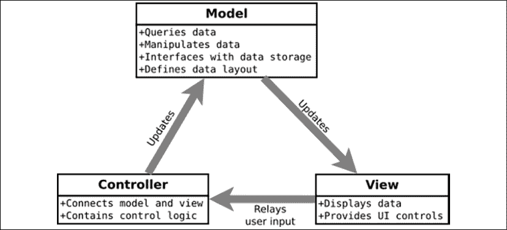
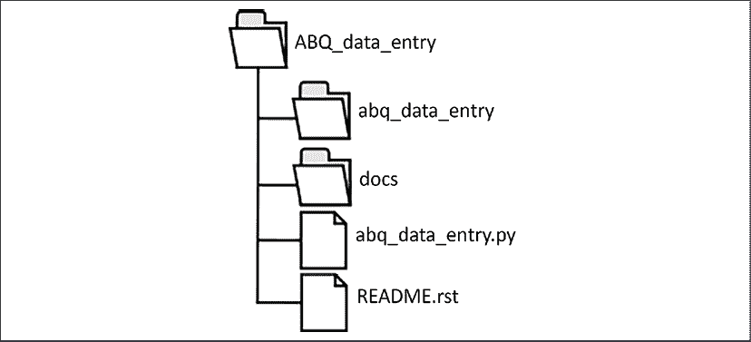
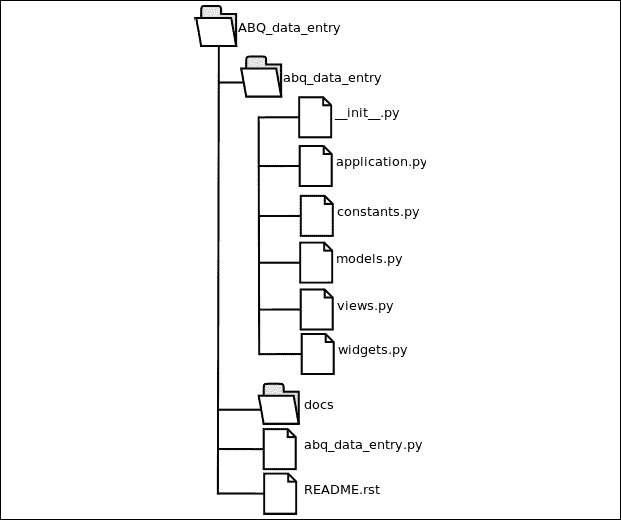
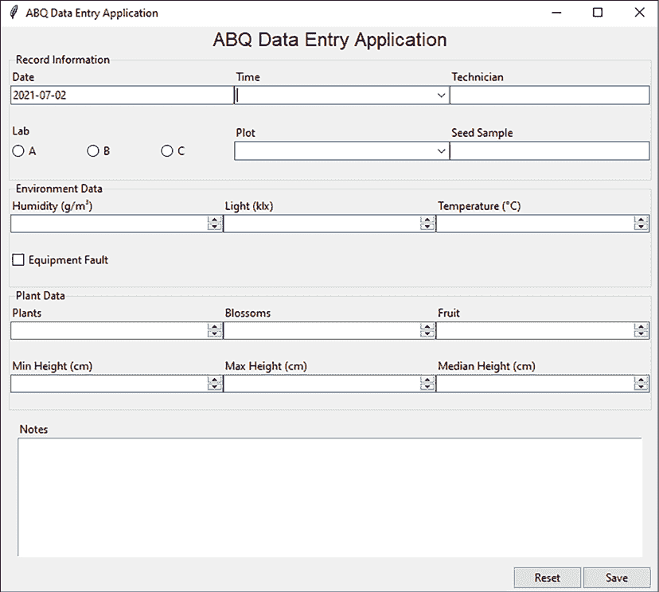

# 第六章：为我们应用程序的扩展做准备

该应用程序非常受欢迎！经过一些初步测试和定位后，数据输入人员已经使用了你新创建的表格几周了。错误和数据输入时间的减少非常显著，关于这个程序可能解决的其他问题的讨论也非常热烈。甚至总监也加入了头脑风暴，你强烈怀疑你很快就会被要求添加一些新功能。

虽然如此，但存在一个问题：应用程序已经是一个包含数百行脚本的程序，随着其增长，你对其可管理性感到担忧。你需要花些时间来组织你的代码库，为未来的扩展做准备。

在本章中，我们将学习以下主题：

+   在*分离关注点*中，你将了解如何使用**模型-视图-控制器**（**MVC**）模式。

+   在*结构化我们的应用程序目录*中，你将学习如何将你的代码组织成一个 Python 包。

+   在*将我们的应用程序拆分为多个文件*中，你将重新组织数据输入应用程序为一个 MVC Python 包。

+   在*使用版本控制软件*中，你将发现如何使用 Git 版本控制系统来跟踪你的更改。

# 分离关注点

正确的架构设计对于任何需要扩展的项目至关重要。任何人都可以用一些支架搭建一个花园小屋，但房屋或摩天大楼则需要仔细规划和工程。软件也是如此；简单的脚本可以通过使用全局变量或直接操作类属性等捷径来逃避，但随着程序的扩展，我们的代码需要以限制在任何给定时刻需要理解复杂性的方式隔离和封装不同的功能。

我们称这个概念为**关注点分离**，它是通过使用描述不同应用程序组件及其交互的架构模式来实现的。

## MVC 模式

在这些架构模式中，最持久的是**模型-视图-控制器**（**MVC**）模式，该模式在 20 世纪 70 年代被引入。虽然这个模式在多年中已经演变并产生了各种变体，但其基本原理保持不变：保持数据、数据的展示和应用程序逻辑在独立、分离的组件中。

MVC 组件的角色和关系如图所示：



图 6.1：模型、视图和控制器的角色和关系

让我们更深入地看看这些组件，并在我们当前应用程序的背景下理解它们。

### 什么是模型？

MVC 中的**模型**代表数据。这包括数据的存储，但也包括数据可以查询或操作的各种方式。理想情况下，模型不关心或不受数据展示方式（即使用什么 GUI 小部件、字段如何排序等）的影响，而是提供一个高级接口，仅对其他组件的内部工作有最小程度的关注。理论上，如果你决定完全改变程序的用户界面（例如，从 Tkinter 应用程序到 Web 应用程序），模型应该完全不受影响。

你在模型中可能会找到的功能或信息示例包括：

+   准备和将程序数据保存到持久介质（数据文件、数据库等）

+   从文件或数据库中检索数据到程序有用的格式

+   一组数据字段及其数据类型和限制的权威列表

+   验证数据与定义的数据类型和限制

+   对存储数据进行计算

我们的应用程序中目前没有模型类；数据布局是在表单类中定义的，而`Application.onsave()`方法是迄今为止唯一涉及数据持久化的代码。为了在我们的应用程序中实现 MVC，我们需要将这部分逻辑拆分到一个单独的对象中，该对象将定义数据布局并处理所有 CSV 操作。

### 什么是视图？

**视图**是向用户展示数据和控件的一个接口。应用程序可能有多个视图，通常基于相同的数据。视图可能或可能没有直接访问模型；如果它们有，通常只有只读访问权限，将写请求通过控制器发送。

你在视图中可能会找到的代码示例包括：

+   GUI 布局和小部件定义

+   表单自动化，例如字段自动完成、动态切换小部件或显示错误对话框

+   格式化原始数据以供展示

我们的`DataRecordForm`类是一个视图的例子：它包含了我们应用程序用户界面的大部分代码。它还包含`_vars`字典，该字典目前定义了我们的数据记录结构。这个字典可以留在视图中，因为视图确实需要一种方式在将其传递给模型之前临时存储数据，但`_vars`不应该再定义我们的数据记录——这是模型的工作。为了实现 MVC，我们需要使视图中的数据概念依赖于模型，而不是它自己的定义。

### 什么是控制器？

**控制器**是应用程序的“中央车站”。它处理来自用户的请求，并负责在视图和模型之间路由数据。MVC 的多数变体都会改变控制器的角色（有时还会改变名称），但重要的是它作为视图和模型之间的中介。我们的控制器对象需要持有应用程序使用的视图和模型的引用，并负责管理它们之间的交互。

你在控制器中找到的代码示例包括：

+   应用程序的启动和关闭逻辑

+   用户界面事件的回调

+   模型和视图实例的创建

我们的`Application`对象目前正作为我们应用程序的控制器，尽管它里面也有一些视图和模型逻辑。不幸的是，Tkinter 中的`Tk`对象结合了控制中心点和`root`窗口，因此不可能完全将控制器与应用程序的主要视图分开。因此，我们的`Application`对象将包含两者的部分，但为了实现更 MVC 的设计，我们需要将其部分展示逻辑移动到视图，部分数据逻辑移动到模型。理想情况下，我们希望`Application`对象主要专注于连接模型和视图之间的代码。

## 为什么要使设计复杂化？

初始时，这种将应用程序拆分的方式可能看起来有很多不必要的开销。我们将在不同的对象之间传递数据，并最终编写更多的代码来完成完全相同的事情。我们为什么要这样做呢？

简而言之，我们这样做是为了使扩展变得可管理。随着应用程序的增长，复杂性也会增长。将我们的组件相互隔离限制了任何单个组件需要管理的复杂性；例如，如果我们想重新设计数据记录表单的布局，我们不应该担心这样做是否会改变输出文件中的数据结构。

程序的这两个方面应该相互独立。

它还帮助我们保持一致，关于我们将某些类型的逻辑放在哪里。例如，拥有一个离散的模型对象有助于我们避免在 UI 代码中随意添加数据查询或文件访问尝试。

事实上，如果没有一些指导性的架构策略，我们的程序可能会变成一团糟的意大利面逻辑。即使不严格遵循 MVC 设计的定义，一致地遵循即使是松散的 MVC 模式，当应用程序变得更加复杂时，也会节省很多麻烦。

# 结构化我们的应用程序目录

正如将我们的程序分解成单独的关注点有助于我们管理每个组件的逻辑复杂性一样，将代码物理地分解成多个文件有助于我们保持每个文件的复杂性可管理。这也加强了组件之间的隔离；例如，你无法在文件之间共享全局变量，而且你知道如果你的 `models.py` 文件导入了 `tkinter`，你正在做错事。

## 基本目录结构

对于 Python 应用程序的目录布局没有官方标准，但有一些常见的约定可以帮助我们保持整洁，并在以后更容易打包我们的软件。让我们设置我们的目录结构。

首先，创建一个名为 `ABQ_Data_Entry` 的目录。这是我们的应用程序的根目录，因此每当提到**应用程序根目录**时，指的就是这个目录。

在应用程序根目录下创建另一个名为 `abq_data_entry` 的目录。注意它是小写的。这将是一个包含应用程序所有代码的 Python 包；它应该有一个相当独特且描述性的名称，以免与现有的 Python 包混淆。通常，你不会在应用程序根目录和这个主要模块之间使用不同的大小写，但这也没有什么坏处；我们在这里这样做是为了避免混淆。

Python 包和模块应该始终使用全部小写字母和下划线来分隔单词。这个约定在 PEP 8 中有详细说明，这是 Python 的官方风格指南。有关 PEP 8 的更多信息，请参阅 [`www.python.org/dev/peps/pep-0008`](https://www.python.org/dev/peps/pep-0008)。

接下来，在应用程序根目录下创建一个 `docs` 文件夹。这个文件夹将用于存放有关应用程序的文档文件。

最后，在应用程序根目录中创建两个空文件：`README.rst` 和 `abq_data_entry.py`。你的目录结构应该如下所示：



图 6.2：应用程序根目录的目录结构

现在，让我们将这些代码放入这些文件中。

### abq_data_entry.py 文件

`abq_data_entry.py` 文件将是启动程序时执行的主要文件。然而，它不会包含我们程序的大部分内容。实际上，它将只包含以下代码：

```py
from abq_data_entry.application import Application
app = Application()
app.mainloop() 
```

将该代码添加到文件中并保存。这个文件的唯一目的是导入我们的 `Application` 类，创建其实例并运行它。其余的工作将在 `abq_data_entry` 包内部完成。我们还没有创建这个包，所以这个文件现在还不能运行。在我们处理应用程序包之前，让我们先处理我们的文档。

### README.rst 文件

从 20 世纪 70 年代开始，程序中就包含了一个简短的文本文件，称为 `README`，其中包含程序文档的简明摘要。对于小型程序，它可能是唯一的文档；对于大型程序，它通常包含用户或管理员在飞行前必须执行的必要指令。

`README`文件没有规定的内容，但作为一个基本指南，请考虑以下部分：

+   **描述**：对程序及其功能的简要描述。我们可以重用我们的规范中的描述，或者类似的内容。这还可能包含主要功能的简要列表。

+   **作者信息**：作者的名字和版权日期。如果您计划共享您的软件，这尤为重要，但对于内部使用的软件，对于未来的维护者来说，了解谁创建了软件以及何时创建也是有用的。

+   **要求**：如果有的话，列出软件和硬件的要求。

+   **安装**：安装软件的说明、其先决条件、依赖项和基本设置。

+   **配置**：如何配置应用程序以及可用的选项。这通常针对命令行或配置文件选项，而不是在程序中交互式设置的选项。

+   **用法**：如何启动应用程序、命令行参数以及其他用户需要了解的基本功能的相关说明。

+   **一般注意事项**：用于收集用户应了解的笔记或关键信息的通用部分。

+   **错误**：已知错误或应用程序的限制列表。

并非所有这些部分都适用于每个程序；例如，ABQ 数据输入目前没有任何配置选项，因此没有必要有配置部分。根据情况，您还可以添加其他部分；例如，公开分发的软件可能有常见问题解答部分，或开源软件可能有贡献部分，其中包含提交补丁的说明。

`README`文件使用纯 ASCII 或 Unicode 文本编写，可以是自由格式或使用标记语言。由于我们正在进行 Python 项目，我们将使用**reStructuredText**，这是 Python 官方文档的标记语言（这也是为什么我们的文件使用`rst`文件扩展名）。

关于 reStructuredText 的更多信息，请参阅**附录 A**，**reStructuredText 快速入门**。

GitHub 仓库中的示例代码中包含了一个`README.rst`文件的样本。花点时间看看它；然后，我们可以继续到`docs`文件夹。

### 填充文档文件夹

`docs`文件夹是放置文档的地方。这可以是任何类型的文档：用户手册、程序规范、API 参考、图表等等。

现在，我们只需复制这些内容：

+   我们在前几章中编写的程序规范

+   您的界面原型

+   技术人员使用的表格副本

在某个时候，您可能需要编写用户手册，但到目前为止，程序足够简单，不需要它。

### 制作 Python 包

创建自己的 Python 包出奇地简单。一个 Python 包由以下三个部分组成：

+   一个目录

+   目录中的`__init__.py`文件

+   可选地，该目录中的一个或多个 Python 文件

一旦完成这些操作，你就可以像导入标准库包一样，整体或部分导入你的包，前提是你的脚本与包目录位于同一父目录下。

注意，模块中的`__init__.py`文件在某种程度上类似于类的初始化方法。其中的代码会在包被导入时运行，并且任何创建或导入到其中的名称都直接在包命名空间下可用。尽管没有实际需要代码，Python 社区通常不鼓励在这个文件中放置太多代码；因此，我们将保持这个文件为空。

让我们开始构建应用程序的包。在`abq_data_entry`下创建以下六个空文件：

+   `__init__.py`

+   `widgets.py`

+   `views.py`

+   `models.py`

+   `application.py`

+   `constants.py`

这些 Python 文件每个都被称为**模块**。模块不过是一个包目录内的 Python 文件。现在你的目录结构应该看起来像这样：



图 6.3：更新后的目录结构，包括包目录

到目前为止，你有一个正在工作的包，尽管里面没有实际的代码。为了测试这一点，打开一个终端或命令行窗口，切换到你的`ABQ_Data_Entry`目录，并启动一个 Python shell。

现在，输入以下命令：

```py
from abq_data_entry import application 
```

这应该会无错误地执行。当然，它什么也不做，但我们会继续下去。

不要将这里的术语*包*与实际的可分发 Python 包混淆，例如使用`pip`下载的包。我们将在*第十六章*，*使用 setuptools 和 cxFreeze 打包*中学习如何制作可分发 Python 包。在这个上下文中，包只是 Python 模块的集合。

# 将我们的应用程序拆分为多个文件

现在我们已经整理好了目录结构，我们需要开始分解我们的应用程序脚本，并将其拆分到我们的模块文件中。我们还需要创建我们的模型类。

打开你的`data_entry_app.py`文件，来自*第五章*，*通过验证和自动化减少用户错误*，然后我们开始吧！

## 创建模型模块

当你的应用程序全部关于数据时，从模型开始是个好主意。记住，模型的工作是管理应用程序数据的存储、检索和处理，通常与它的持久化存储格式（在本例中是 CSV）相关。为了完成这个任务，我们的模型应该包含关于我们数据的所有知识。

目前，我们的应用程序没有类似模型的东西；关于应用程序数据的知识散布在表单字段中，而`Application`对象在请求保存操作时，只是简单地将表单包含的数据直接填充到 CSV 文件中。由于我们还没有检索或更新信息，我们的应用程序实际上对 CSV 文件中的内容一无所知。

要将我们的应用程序迁移到 MVC 架构，我们需要创建一个模型类，该类既管理数据存储和检索，又代表我们数据的知识权威来源。换句话说，我们必须在这里我们的模型中编码数据字典中包含的知识。我们目前还不知道我们将如何使用这些知识，但这就是它应该属于的地方。

存储这些数据有几种方式，例如创建一个自定义字段类或一个`namedtuple`对象，但为了简单起见，我们现在将只使用字典，将字段名称映射到字段元数据。

字段元数据将同样以关于字段的属性字典的形式存储，它将包括：

+   字段中存储的数据类型

+   字段是否必需

+   如果适用，可能的值列表

+   如果适用，值的范围、最小值、最大值和增量

为了存储每个字段的类型，我们将定义一组常量，这将让我们以一致和明确的方式引用不同的字段类型。我们将把这个放在`constants.py`文件中，所以请在您的编辑器中打开该文件并添加以下代码：

```py
# abq_data_entry/constants.py
from enum import Enum, auto
class FieldTypes(Enum):
  string = auto()
  string_list = auto()
  short_string_list = auto()
  iso_date_string = auto()
  long_string = auto()
  decimal = auto()
  integer = auto()
  boolean = auto() 
```

我们创建了一个名为`FieldTypes`的类，它只是存储了一些命名整数值，这些值将描述我们将要存储的不同类型的数据。这个类基于 Python 的`Enum`类，这是一个用于定义此类常量集合的有用类。这些变量的值并不重要，只要每个都是唯一的；在`Enum`中，我们真正感兴趣的是拥有一组不等于彼此的变量名。

我们可以手动将它们设置为字符串或顺序整数，但`enum`模块提供了一个`auto()`函数，它可以自动为类的每个常量分配一个唯一的整数值。使用这种方法更好地传达了值本身并不重要；只有名称才是关键。

现在我们有了这些常量，让我们打开`models.py`并开始创建我们的模型类：

```py
# abq_data_entry/models.py, at the top
import csv
from pathlib import Path
from datetime import datetime
import os
from .constants import FieldTypes as FT
class CSVModel:
  """CSV file storage""" 
```

我们首先导入我们模型所需的库：`csv`、`pathlib`、`datetime`、`os`以及我们的新`FieldTypes`常量。前三个是我们为`Application`中的`on_save()`方法所需的库。现在，模型类将处理大部分这些功能。`os`模块将用于检查文件权限，而`FieldTypes`常量将用于定义我们模型的数据字典。

注意我们导入`FieldTypes`的方式：`from .constants import FieldTypes`。`constants`前面的点表示这是一个**相对导入**。相对导入可以在 Python 包内部使用，以定位同一包中的其他模块。在这种情况下，我们处于`models`模块中，我们需要访问`abq_data_entry`包内的`constants`模块。单个点代表我们的当前父模块（`abq_data_entry`），因此在这个文件中的`.constants`意味着`abq_data_entry`包的`constants`模块。

相对导入区分了我们的自定义模块和 `PYTHONPATH` 中的模块。通过使用它们，我们不必担心任何第三方或标准库包与我们的模块名称冲突。

接下来，我们需要创建一个包含模型中所有字段字典的类成员变量。字典中的每个条目都将包含有关字段的详细信息：其数据类型、是否必需以及有效值、范围和增量。

除了字段属性外，我们还在这里记录了 CSV 字段的顺序。在 Python 3.6 及以后的版本中，字典保留了它们被定义的顺序；如果你使用的是 Python 3 的较旧版本，你需要使用 `collections` 标准库模块中的 `OrderedDict` 类来保留字段顺序。

按照这种方式添加这个字典：

```py
 fields = {
    "Date": {'req': True, 'type': FT.iso_date_string},
    "Time": {'req': True, 'type': FT.string_list,
      'values': ['8:00', '12:00', '16:00', '20:00']},
    "Technician": {'req': True, 'type':  FT.string},
    "Lab": {'req': True, 'type': FT.short_string_list,
      'values': ['A', 'B', 'C']},
    "Plot": {'req': True, 'type': FT.string_list,
      'values': [str(x) for x in range(1, 21)]},
    "Seed Sample":  {'req': True, 'type': FT.string},
    "Humidity": {'req': True, 'type': FT.decimal,
      'min': 0.5, 'max': 52.0, 'inc': .01},
    "Light": {'req': True, 'type': FT.decimal,
      'min': 0, 'max': 100.0, 'inc': .01},
    "Temperature": {'req': True, 'type': FT.decimal,
      'min': 4, 'max': 40, 'inc': .01},
    "Equipment Fault": {'req': False, 'type': FT.boolean},
    "Plants": {'req': True, 'type': FT.integer,       'min': 0, 'max': 20},
    "Blossoms": {
      'req': True, 'type': FT.integer, 'min': 0, 'max': 1000},
    "Fruit": {'req': True, 'type': FT.integer, 
      'min': 0, 'max': 1000},
    "Min Height": {'req': True, 'type': FT.decimal,
      'min': 0, 'max': 1000, 'inc': .01},
    "Max Height": {'req': True, 'type': FT.decimal,
      'min': 0, 'max': 1000, 'inc': .01},
    "Med Height": {'req': True, 'type': FT.decimal,
      'min': 0, 'max': 1000, 'inc': .01},
    "Notes": {'req': False, 'type': FT.long_string}
  } 
```

这个列表直接来自我们的数据字典，我们已经在 `DataRecordForm` 类中看到了这些相同的值；但从现在开始，这个字典将成为这些信息的权威来源。任何需要关于模型字段信息的其他类都必须从该字典中检索。

在我们开始设计模型类的函数之前，让我们花一点时间看看我们应用程序中现有的文件保存逻辑，并考虑哪些部分属于模型。我们当前脚本中的代码看起来是这样的：

```py
 def _on_save(self):
    errors = self.recordform.get_errors()
    if errors:
      self.status.set(
        "Cannot save, error in fields: {}"
        .format(', '.join(errors.keys()))
      )
      return
    datestring = datetime.today().strftime("%Y-%m-%d")
    filename = f"abq_data_record_{datestring}.csv"
    newfile = not Path(filename).exists()
    data = self.recordform.get()
    with open(filename, 'a') as fh:
      csvwriter = csv.DictWriter(fh, fieldnames=data.keys())
      if newfile:
        csvwriter.writeheader()
      csvwriter.writerow(data)
    self._records_saved += 1
    self.status.set(
      f"{self._records_saved} records saved this session"
    )
    self.recordform.reset() 
```

让我们审查这段代码，确定哪些内容放入模型，哪些保留在 `Application` 类中：

+   第一段代码从 `DataRecordForm` 类中提取错误。由于模型将没有关于表单的了解，这部分应该保留在 `Application` 中。实际上，模型甚至不需要知道表单错误，因为唯一采取的操作是 UI 相关的（即显示错误）。

+   接下来的几行定义了我们将要使用的文件名。由于这是文件存储的细节，这显然是模型关心的问题。

+   `newfile` 赋值行确定文件是否存在。作为数据存储介质的实现细节，这显然是模型的问题，而不是应用程序的问题。

+   这一行 `data = self.recordform.get()` 从表单中获取数据。由于我们的模型对表单的存在没有了解，这部分需要保留在 `Application` 中。

+   下一段代码打开文件，创建一个 `csv.DictWriter` 对象，并追加数据。这显然是模型关心的问题。

+   最后一段代码将文件保存操作的结果通知用户并重置表单。这完全是用户界面相关的，所以它不属于模型。

因此，我们的模型将需要确定文件名并负责将 `Application` 对象接收到的数据写入其中，而应用程序将负责检查表单错误、从表单中检索数据，并将保存操作的结果通知用户。

让我们为我们的模型类创建初始化器方法。由于`CSVModel`代表对特定 CSV 文件的接口，我们将在`__init__()`中确定文件名，并在模型对象的生命周期内保持它。该方法开始如下：

```py
# models.py, in the CSVModel class
  def __init__(self):
    datestring = datetime.today().strftime("%Y-%m-%d")
    filename = "abq_data_record_{}.csv".format(datestring)
    self.file = Path(filename) 
```

`__init__()`方法首先确定`filename`，从当前日期转换成`Path`对象，并将其存储为实例变量。

由于模型实例与文件名相关联，并代表我们对该文件的访问，如果我们没有权限向文件追加数据，那么这个模型将相对无用。因此，我们希望在开始将数据输入到我们的表单之前，初始化器会检查对文件的访问权限，并在发现任何问题时提醒我们。

要做到这一点，我们需要使用`os.access()`函数，如下所示：

```py
# models.py, in CSVModel.__init__()
    file_exists = os.access(self.file, os.F_OK)
    parent_writeable = os.access(self.file.parent, os.W_OK)
    file_writeable = os.access(self.file, os.W_OK)
    if (
      (not file_exists and not parent_writeable) or
      (file_exists and not file_writeable)
    ):
      msg = f'Permission denied accessing file: {filename}'
      raise PermissionError(msg) 
```

`os.access()`函数接受两个参数：一个文件路径字符串或`Path`对象，以及一个表示我们想要检查的模式的常量。我们将使用两个常量：`os.F_OK`，它检查文件是否存在，以及`os.W_OK`，它检查我们是否有对该文件的写入权限。请注意，如果文件不存在（如果没有保存任何数据，这是完全可能的），检查`W_OK`将返回`False`，因此我们需要检查两种可能的情况：

+   文件存在，但我们无法写入它

+   文件不存在，我们无法写入其父目录

在这两种情况下，我们将无法写入文件，应该抛出异常。你可能会想知道为什么我们要抛出异常而不是显示某种错误信息（例如在状态栏中或通过控制台打印）。记住，模型类不应该对 UI 有任何假设，也不应包含任何 UI 代码。在模型中处理错误情况的方法是使用异常将消息传递回控制器，以便控制器可以采取适合我们用户界面的适当操作。

故意抛出异常的想法对初学者来说通常很奇怪；毕竟，异常是我们试图避免的东西，对吧？在小型脚本中，我们实际上是现有模块的消费者时，这是正确的；然而，当你编写自己的模块时，异常是模块通过其类和函数与使用它们的代码通信问题的正确方式。试图处理——或者更糟，压制——外部代码的不良行为，最多会破坏我们代码的模块化；最坏的情况是，它将创建难以追踪的微妙错误。

现在我们已经初始化了具有可写文件名的模型，我们需要创建一个方法来保存数据。在`CSVModel`类中，让我们创建一个公共方法来存储数据。为`save_record()`方法添加以下代码：

```py
# models.py, in the CSVModel class
  def save_record(self, data):
    """Save a dict of data to the CSV file"""
    newfile = not self.file.exists()
    with open(self.file, 'a', newline='') as fh:
      csvwriter = csv.DictWriter(fh, fieldnames=self.fields.keys())
      if newfile:
        csvwriter.writeheader()
      csvwriter.writerow(data) 
```

由于模型不需要知道表单错误，并且在其初始化器中已经建立了文件名，因此这个方法只需要一个表单数据的字典作为参数。剩下的是确定我们是否处理的是新文件，并将数据写入 CSV。

注意，当将字段名称写入新的 CSV 文件时，我们使用`fields`字典的键，而不是依赖于传入数据中的键。请记住，`CSVModel.fields`现在是关于应用程序数据信息的权威来源，因此它应该确定使用的标题。

我们的模式类现在已经完成。让我们开始着手用户界面！

## 移动小部件

虽然我们可以将所有与 UI 相关的代码放在一个`views`模块中，但我们有很多自定义小部件类。将它们放在自己的单独模块中，以限制`views`模块的复杂性是有意义的。因此，我们将所有小部件类的代码移动到`widgets.py`文件中。我们将移动的小部件类包括所有实现可重用 GUI 组件的类，包括复合小部件如`LabelInput`。如果我们开发更多的自定义小部件，我们也将它们添加到这个文件中。

打开`widgets.py`，并将`ValidatedMixin`、`DateEntry`、`RequiredEntry`、`ValidatedCombobox`、`ValidatedSpinbox`、`ValidatedRadioGroup`、`BoundText`和`LabelInput`的所有代码复制进去。这些都是我们迄今为止创建的所有小部件类。

`widgets.py`文件当然需要导入被复制进来的代码所使用的任何模块依赖项。我们需要检查我们的代码，找出我们使用的库并将它们导入。请在文件的顶部添加以下内容：

```py
# top of widgets.py
import tkinter as tk
from tkinter import ttk
from datetime import datetime
from decimal import Decimal, InvalidOperation 
```

显然，我们需要`tkinter`和`ttk`；我们的`DateEntry`类使用`datetime`库中的`datetime`类，而我们的`ValidatedSpinbox`类则使用`decimal`库中的`Decimal`类和`InvalidOperation`异常。这就是`widgets.py`中所需的所有内容。

## 移动视图

接下来，我们将处理`views.py`文件。回想一下，视图是更大的 GUI 组件，就像我们的`DataRecordForm`类。实际上，目前它是我们唯一的视图，但随着我们创建更多的大型 GUI 组件，它们将被添加到这里。

打开`views.py`文件，并将`DataRecordForm`类复制进去；然后，回到顶部处理模块导入。再次强调，我们需要`tkinter`和`ttk`，以及`datetime`，因为我们的自动填充逻辑需要它们。

按照以下方式将它们添加到文件顶部：

```py
# abq_data_entry/views.py, at the top
import tkinter as tk
from tkinter import ttk
from datetime import datetime 
```

尽管如此，我们还没有完成；我们的实际小部件不再在这里，所以我们需要导入它们，如下所示：

```py
from . import widgets as w 
```

就像我们在`models.py`文件中的`FieldTypes`一样，我们使用相对导入导入了我们的`widgets`模块。我们保持小部件在其自己的命名空间中，以保持全局命名空间干净，但给它一个简短的别名`w`，这样我们的代码就不会过于杂乱。

这意味着，尽管如此，我们还需要遍历代码，并在所有 `LabelInput`、`RequiredEntry`、`DateEntry`、`ValidatedCombobox`、`ValidatedRadioGroup`、`BoundText` 和 `ValidatedSpinbox` 实例前添加 `w.`。这应该足够容易在 IDLE 或任何其他文本编辑器中通过一系列搜索和替换操作来完成。

例如，表单的第一行应如下所示：

```py
 **w.**LabelInput(
      r_info, "Date", var=self._vars['Date'],
      input_class=w.DateEntry
    ).grid(row=0, column=0)
    **w.**LabelInput(
      r_info, "Time", input_class=w.ValidatedCombobox,
      var=self._vars['Time'],
      input_args={"values": ["8:00", "12:00", "16:00", "20:00"]}
    ).grid(row=0, column=1)
    **w.**LabelInput(
      r_info, "Technician",  var=self._vars['Technician'],
      input_class=w.RequiredEntry
    ).grid(row=0, column=2) 
```

在你开始更改所有这些内容之前，让我们停下来，花点时间重构一些代码中的冗余。

### 减少视图逻辑中的冗余

考虑我们传递给 `LabelInput` 小部件的参数：它们包含许多也存在于我们模型中的信息。最小值、最大值、增量以及可能的值在这里和我们的模型代码中都被定义。甚至我们选择的输入小部件的类型也与存储的数据类型直接相关：数字得到一个 `ValidatedSpinbox` 小部件，日期得到一个 `DateEntry` 小部件，依此类推。理想情况下，关于每个字段的信息来源应该只定义在一个地方，并且那个地方应该是模型。如果我们需要出于某种原因更新模型，我们的表单应该与这些更改同步。

而不是在视图中重复定义这些选项，我们需要让我们的视图能够访问来自我们模型的字段规范，以便小部件的详细信息可以从它中确定。由于我们的小部件实例是在 `LabelInput` 类内部定义的，我们将增强该类，使其能够自动从我们模型的字段规范格式中确定输入类和参数。

要做到这一点，打开 `widgets.py` 文件。我们将首先导入 `FieldTypes` 类，如下所示：

```py
# at the top of widgets.py
from .constants import FieldTypes as FT 
```

接下来，我们需要告诉 `LabelInput` 类如何将字段类型转换为控件类。为此，定位 `LabelInput` 类，并在 `__init__()` 方法之上添加以下 `field_types` 类属性：

```py
# widgets.py, inside LabelInput
  field_types = {
    FT.string: RequiredEntry,
    FT.string_list: ValidatedCombobox,
    FT.short_string_list: ValidatedRadioGroup,
    FT.iso_date_string: DateEntry,
    FT.long_string: BoundText,
    FT.decimal: ValidatedSpinbox,
    FT.integer: ValidatedSpinbox,
    FT.boolean: ttk.Checkbutton
  } 
```

这个字典将作为键将我们的模型字段类型转换为适当的控件类型。

注意，所有这些控件在我们可以创建这个字典之前都必须存在，所以请确保如果尚未放置在 `widgets.py` 的末尾，将 `LabelInput` 类定义放在 *末尾*。

现在，我们需要更新 `LabelInput.__init__()` 方法以接受一个 `field_spec` 参数，并在提供的情况下使用它来定义输入小部件的参数。首先，初始化器的参数列表应更新如下：

```py
# widgets.py, inside LabelInput
  def __init__(
    self, parent, label, var, input_class=None,
    input_args=None, label_args=None, **field_spec=None**,
    disable_var=None, **kwargs
  ): 
```

虽然 `field_spec` 将在很大程度上消除对 `input_class` 和 `input_args` 参数的需求，但我们仍将保留它们，以防我们稍后需要构建一个与模型无关的表单。

在初始化方法内部，我们需要读取字段规范并应用这些信息。在变量设置之后和标签设置之前添加以下代码：

```py
# widgets.py, inside LabelInput.__init__():
    if field_spec:
      field_type = field_spec.get('type', FT.string)
      input_class = input_class or self.field_types.get(field_type)
      if 'min' in field_spec and 'from_' not in input_args:
        input_args['from_'] = field_spec.get('min')
      if 'max' in field_spec and 'to' not in input_args:
        input_args['to'] = field_spec.get('max')
      if 'inc' in field_spec and 'increment' not in input_args:
        input_args['increment'] = field_spec.get('inc')
      if 'values' in field_spec and 'values' not in input_args:
        input_args['values'] = field_spec.get('values') 
```

如果提供了`field_spec`，我们首先会做的是检索字段类型。这将用于使用`field_types`字典查找适当的控件。如果我们想为特定的`LabelInput`实例覆盖此查找值，可以显式传递一个`input_class`参数来覆盖查找值。

接下来，我们需要设置字段参数，`min`、`max`、`inc`和`values`。对于这些中的每一个，我们检查键是否存在于字段规范中，并确保相应的`from_`、`to`、`increment`或`values`参数没有使用`input_args`显式传递。如果是这样，我们将使用适当的值设置`input_args`。现在，`input_class`和`input_args`已经从字段规范中确定，初始化方法剩余部分可以继续按照之前定义的方式进行。

将`LabelInput`重构为接受一个`field_spec`参数后，我们可以更新我们的视图代码以利用这个新功能。为此，我们的`DataRecordForm`类首先需要访问`model`对象，从而可以获取数据模型的字段规范。

在`views.py`文件中，编辑`DataRecordForm`的初始化方法，以便我们可以传递`model`的一个副本：

```py
# views.py, in DataRecordForm class
  def __init__(self, parent, model, *args, **kwargs):
    super().__init__(parent, *args, **kwargs)
    self.model= model
    fields = self.model.fields 
```

我们已经将`model`本身存储在一个实例变量中，并将`fields`字典提取到一个局部变量中，以减少我们使用此字典时的代码冗余。现在，我们可以遍历我们的`LabelInput`调用，并用单个`field_spec`参数替换`input_args`和`input_class`参数。

这些更改后，第一行看起来是这样的：

```py
# views.py, in DataRecordForm.__init__()
    w.LabelInput(
      r_info, "Date",
      field_spec=fields['Date'],
      var=self._vars['Date'],
    ).grid(row=0, column=0)
    w.LabelInput(
      r_info, "Time",
      field_spec=fields['Time'],
      var=self._vars['Time'],
    ).grid(row=0, column=1)
    w.LabelInput(
      r_info, "Technician",
      field_spec=fields['Technician'],
      var=self._vars['Technician']
    ).grid(row=0, column=2) 
```

按照同样的方式继续更新其他小部件，用`field_spec`参数替换`input_class`和`input_args`。注意，当你到达高度字段时，你仍然需要传递一个`input_args`字典来定义`min_var`、`max_var`和`focus_update_var`参数。

例如，以下是最小高度输入定义：

```py
 w.LabelInput(
      p_info, "Min Height (cm)",
      field_spec=fields['Min Height'],
      var=self._vars['Min Height'],
      input_args={
        "max_var": max_height_var,
        "focus_update_var": min_height_var
      }) 
```

就这样。现在，任何对给定字段规范的更改都可以仅在模型中进行，表单将简单地做正确的事情。

### 使用自定义事件来移除紧密耦合

在离开`DataRecordForm`类之前，我们应该进行一个修改，以改善我们应用程序的关注点分离。目前，我们表单上的`savebutton`小部件绑定到`self.master._on_save()`，这指的是`Application`类的`_on_save()`方法。然而，我们绑定此命令的方式假设`self.master`（即`DataRecordForm`的父小部件）是`Application`。如果我们决定将我们的`DataRecordForm`小部件放入`Notebook`或`Frame`小部件中，而不是直接在`Application`对象下，会发生什么？在这种情况下，`self.master`将改变，代码将出错。由于父小部件实际上是布局问题，我们不会期望对其的更改会影响保存按钮回调。

这种情况，即一个类过度依赖于类外部的应用程序架构，被称为**紧耦合**，这是我们应在代码中努力避免的。相反，我们希望在代码中实现**松耦合**，以便一个类的更改不会在另一个类中引起意外的错误。

我们可以解决这个问题的几种方法。我们可以将回调或`Application`类的引用传递给视图，以便它可以更明确地引用相关的方法。这将有效，但仍然比我们理想中想要的耦合更紧密。

一个更好的方法是利用**事件**。正如你所知，Tkinter 在用户以某种方式与 GUI 交互时生成事件，例如点击按钮或按键。这些事件可以使用任何 Tkinter 小部件的`bind()`方法显式绑定到回调函数。Tkinter 还允许我们生成自己的自定义事件，我们可以像绑定内置事件一样绑定它们。

让我们在`DataRecordForm`中实现一个回调方法，该方法将生成一个自定义事件，如下所示：

```py
 def _on_save(self):
    self.event_generate('<<SaveRecord>>') 
```

可以在任何 Tkinter 小部件上调用`event_generate()`方法，以使其发出指定的事件。在这种情况下，我们调用我们的事件`<<SaveRecord>>`。所有自定义事件序列都必须使用双尖括号来区分它们与内置事件类型。除此之外，你可以随意命名它们。

在`DataRecordForm.__init__()`方法中，我们将更新我们的保存按钮定义，使用此方法作为回调，如下所示：

```py
# views.py, in DataRecordForm.__init__()
    self.savebutton = ttk.Button(
      buttons, text="Save", command=self._on_save) 
```

现在，我们不再直接执行`Application`对象的`_on_save()`方法，按钮将简单地使`DataRecordForm`发出一个消息，表明用户请求了记录保存操作。处理这个消息将是`Application`对象的责任。

在构建我们的应用程序菜单时，我们将在第七章*使用菜单和 Tkinter 对话框创建菜单*中更广泛地使用自定义事件。

## 创建应用程序文件

我们需要创建的最后一块是控制器和根窗口类，`Application`。打开`application.py`文件，并将`Application`类定义从旧的`data_entry_app.py`文件中复制过来。

和之前一样，我们需要添加此代码所需的模块导入。在文件顶部添加以下内容：

```py
# abq_data_entry/application.py, at the top
import tkinter as tk
from tkinter import ttk
from . import views as v
from . import models as m 
```

再次，我们需要`tkinter`和`ttk`，当然；我们还需要`views`模块来使用我们的`DataRecordForm`，以及`models`模块来使用我们的`CSVModel`。

现在，我们需要对`Application.__init__()`方法进行一些修改。首先，我们需要创建一个模型实例，我们可以将其传递给`DataRecordForm`并保存我们的数据。在初始化方法顶部创建此对象：

```py
# application.py, inside the Application class
  def __init__(self, *args, **kwargs):
    super().__init__(*args, **kwargs)
    self.model = m.CSVModel() 
```

接下来，我们需要更新对`DataRecordForm`的调用，既要添加命名空间，又要确保我们传递了模型实例，如下所示：

```py
# application.py, inside Application.__init__()
    self.recordform = v.DataRecordForm(self, self.model) 
```

我们还需要将我们的自定义事件`<<SaveRecord>>`绑定到`Application`对象的记录保存回调。添加`bind`命令如下所示：

```py
# application.py, inside Application.__init__()
    self.recordform = v.DataRecordForm(self, self.model)
    self.recordform.grid(row=1, padx=10, sticky=(tk.W + tk.E))
    self.recordform.bind('<<SaveRecord>>', self._on_save) 
```

最后，我们需要更新`Application._on_save()`中的代码以使用模型。新的方法应该看起来像这样：

```py
 def _on_save(self, *_):
    """Handles file-save requests"""
    errors = self.recordform.get_errors()
    if errors:
      self.status.set(
        "Cannot save, error in fields: {}"
        .format(', '.join(errors.keys()))
      )
      return 
    data = self.recordform.get()
    self.model.save_record(data)
    self._records_saved += 1
    self.status.set(
      f"{self._records_saved} records saved this session"
    )
    self.recordform.reset() 
```

如你所见，使用我们的模型非常无缝；一旦我们检查了错误并从表单中检索了数据，我们只需将其传递给`self.model.save_record()`。`Application`不需要了解数据是如何保存的细节。

注意，我们在方法定义中添加了一个`*_`参数。当我们使用`bind`将事件绑定到回调时，回调将接收到一个`event`对象。我们不会使用这个`event`参数，所以按照 Python 的惯例，我们将所有位置参数合并到一个名为`_`（下划线）的变量中。这样，我们的回调可以处理接收参数，但我们已经表明我们不会使用它们。

## 运行应用程序

应用程序现在已完全迁移到新的数据格式。要测试它，导航到应用程序根文件夹`ABQ_Data_Entry`，并执行以下命令：

```py
$ python3 abq_data_entry.py 
```

它应该看起来和表现得就像第五章中的单个脚本一样，*《通过验证和自动化减少用户错误》*，并且运行时没有错误，如下面的截图所示：



图 6.4：ABQ 数据录入应用程序 – 在 MVC 重构后依然保持相同的外观！

成功！

# 使用版本控制软件

我们的代码结构良好，便于扩展，但还有一个关键问题需要解决：**版本控制**。你可能已经熟悉了**版本控制系统**（**VCS**），有时也称为**修订控制**或**源代码管理**，但如果还不熟悉，它是一个处理大型且不断变化的代码库不可或缺的工具。

当我们在应用程序上工作时，有时我们认为自己知道需要更改什么，但结果证明我们是错的。有时，我们不知道如何编写代码，需要多次尝试才能找到正确的方法。有时，我们需要恢复到很久以前更改过的代码。有时，有多个人在相同的代码片段上工作，我们需要合并他们的更改。版本控制系统正是为了解决这些问题和其他问题而创建的。

有数十种不同的版本控制系统，但它们大多数遵循本质上相同的流程：

+   你有一个**工作副本**的代码，你可以对其进行更改

+   你定期选择更改并将它们**提交**到一个**主副本**

+   你可以在任何时刻**检出**（即检索到你的工作副本）代码的旧版本，然后稍后恢复到主副本

+   你可以创建代码的**分支**来尝试不同的方法、新功能或大规模重构

+   你可以稍后**合并**这些分支回主副本

版本控制系统（VCS）为你提供了一个安全网，让你在更改代码时无需担心会彻底破坏它：只需几个简单的命令就可以恢复到已知的工作状态。它还帮助我们记录代码的更改，并在有机会时与他人协作。

现在有数十种版本控制系统可用，但到目前为止，Git 仍然是许多年来最受欢迎的版本控制系统。让我们看看如何使用 Git 来跟踪应用程序的更改。

## Git 使用快速指南

Git 是由 Linus Torvalds 创建的，旨在成为 Linux 内核项目的版本控制系统，并从此发展成为世界上最受欢迎的版本控制系统。它被源代码共享网站如 GitHub、Bitbucket、SourceForge 和 GitLab 所使用。Git 非常强大，掌握它可能需要数月或数年；幸运的是，基础可以在几分钟内掌握。

首先，你需要安装 Git；访问 [`git-scm.com/downloads`](https://git-scm.com/downloads) 获取在 macOS、Windows、Linux 或其他 Unix 操作系统上安装 Git 的说明。

### 初始化和配置 Git 仓库

Git 安装完成后，我们需要初始化和配置我们的项目目录作为 Git 仓库。为此，打开一个命令终端，导航到应用程序的根目录（`ABQ_Data_Entry`），然后运行以下命令：

```py
$ git init 
```

此命令会在我们的项目根目录下创建一个名为 `.git` 的隐藏目录，并用构成仓库的基本文件初始化它。`.git` 目录将包含关于我们保存的修订版本的所有数据和元数据。

在我们将任何文件添加到仓库之前，我们需要指导 Git 忽略某些类型的文件。例如，Python 在执行文件时创建字节码（`.pyc`）文件，而我们不想将这些文件作为代码的一部分保存。为此，在您的项目根目录中创建一个名为 `.gitignore` 的文件，并在其中放入以下行：

```py
*.pyc
__pycache__/ 
```

您可以添加更多的目录名、文件名或通配符模式来忽略您不想保存的文件类型（例如，某些编辑器通过在文件名中添加特定字符来创建临时文件或备份副本）。

### 添加和提交代码

现在既然我们的仓库已经初始化，我们可以使用 `git add` 命令将文件和目录添加到我们的 Git 仓库中，如下所示：

```py
$ git add abq_data_entry
$ git add abq_data_entry.py
$ git add docs
$ git add README.rst 
```

到目前为止，我们的文件已经 **暂存**，但尚未提交到仓库。由于单个应用程序的更改可能需要更改多个文件，Git 允许您暂存任意数量的文件以作为单个提交的一部分。请注意，我们可以指定目录而不是单个文件；在这种情况下，目录中当前的所有文件都将为我们的下一次提交进行暂存。

您可以通过输入命令 `git status` 在任何时间检查您仓库的状态以及其中的文件。现在尝试一下，你应该会得到以下输出：

```py
On branch master
No commits yet
Changes to be committed:
(use "git rm --cached <file>..." to unstage)
new file: README.rst
new file: abq_data_entry.py
new file: abq_data_entry/~__init__.py~
new file: abq_data_entry/application.py
new file: abq_data_entry/models.py
new file: abq_data_entry/views.py
new file: abq_data_entry/widgets.py
new file: docs/Application_layout.png
new file: docs/abq_data_entry_spec.rst
new file: docs/lab-tech-paper-form.png
Untracked files:
(use "git add <file>..." to include in what will be committed)
.gitignore 
```

这表明 `abq_data_entry/` 和 `docs/` 目录下的所有文件，以及您直接指定的文件，都已准备好提交到仓库中。

让我们继续使用以下命令提交更改：

```py
$ git commit -m "Initial commit" 
```

此处的 `-m` 标志允许您指定一个 **提交信息**，该信息与提交一起存储。每次您将代码提交到仓库时，您都需要编写一条信息。您应该始终使这些信息尽可能有意义，详细说明您所做的更改及其背后的原因。

### 查看和使用我们的提交

要查看您仓库的历史记录，运行 `git log` 命令，如下所示：

```py
$ git log
commit df48707422875ff545dc30f4395f82ad2d25f103 (HEAD -> master)
Author: Alan Moore <alan@example.com>
Date: Thu Dec 21 18:12:17 2017 -0600
Initial commit 
```

如您所见，`Author`、`Date` 和提交信息显示为我们上次的提交。如果我们有更多的提交，它们也会按时间顺序从新到旧地列在这里。输出第一行中您看到的长的十六进制值是 **提交哈希**，这是一个唯一值，用于标识提交。此值可以在其他操作中引用提交。

例如，我们可以用它来将我们的仓库重置到过去的状态。通过以下步骤尝试一下：

1.  删除 `README.rst` 文件，并验证它是否已完全删除。

1.  运行 `git log` 获取您上次提交的哈希值。

1.  现在，输入命令 `git reset --hard df48707`，将 `df48707` 替换为您上次提交哈希值的前七个字符。

1.  再次检查您的文件列表：`README.rst` 文件应该已经恢复。

这里发生的情况是我们修改了我们的仓库，然后告诉 Git 将仓库的状态**硬重置**到最后的提交。如果你不想重置你的仓库，你也可以使用 `git checkout` 临时切换到一个旧的提交，或者使用 `git branch` 创建一个新的分支，以特定的提交作为基础。正如你已看到的，这为我们提供了一个强大的安全网，用于实验；无论你对代码进行多少次修改，任何提交都只是命令之遥！

Git 有许多超出本书范围的功能。如果你想了解更多，Git 项目提供了一个免费的在线手册，网址为 [`git-scm.com/book`](https://git-scm.com/book)，在那里你可以了解关于分支和设置远程仓库等高级功能。现在，重要的是要边做边提交更改，这样你就可以保持你的安全网并记录更改的历史。

# 摘要

在本章中，你学习了如何为你的简单脚本做一些重大的扩展。你学习了如何使用模型-视图-控制器模型将应用程序的责任区域划分为单独的组件。你将 ABQ 应用程序重新实现为一个 Python 包，将代码拆分为多个模块，以进一步强化关注点的分离并为后续扩展提供一个有组织的框架。最后，你为你的代码设置了一个 Git 仓库，这样你就可以使用版本控制跟踪所有更改。

在下一章中，我们将通过实现文件打开和保存、信息弹出窗口和主菜单来测试我们新项目布局的便利性。你还将学习如何为你的应用程序提供可配置的设置并将它们保存到磁盘。
