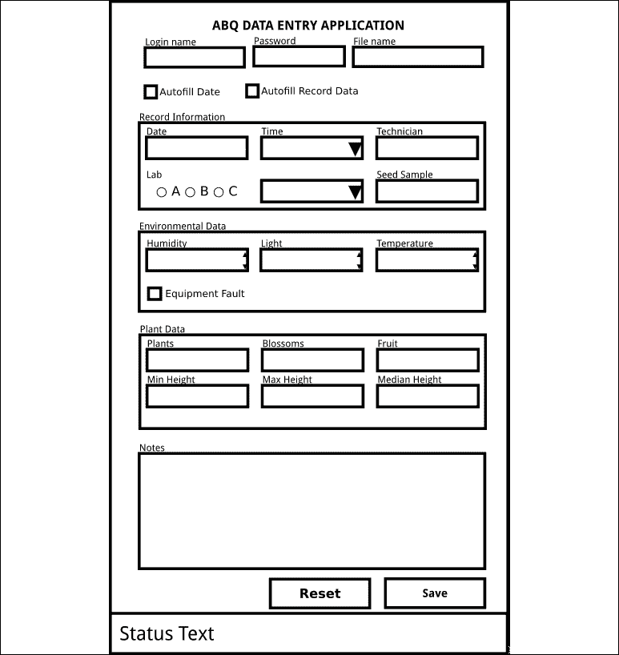
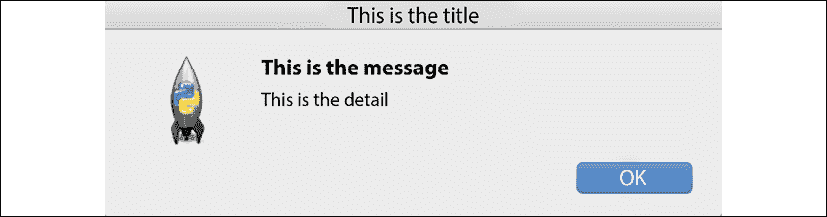
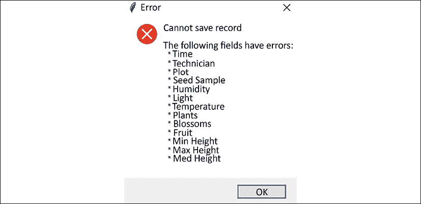
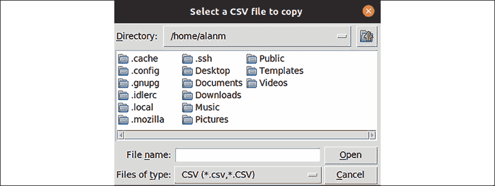
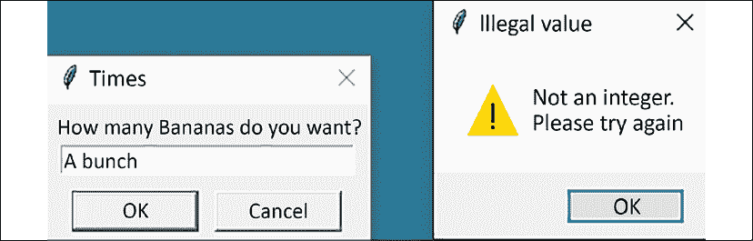
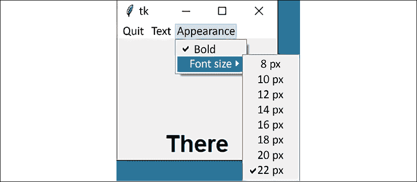
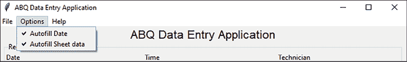

# 使用菜单和 Tkinter 对话框创建菜单

随着应用程序功能的增长，将所有功能和输入都挤入一个单一表单变得越来越低效。相反，我们需要以保持它们可用而不使视觉呈现杂乱的方式组织对功能、信息和控制的访问。像 Tkinter 这样的 GUI 工具包为我们提供了一些工具来帮助我们处理这个问题。首先，**菜单系统**，通常位于应用程序窗口的顶部（或在某些平台上，在全局桌面菜单中），可以用来以压缩的层次结构组织应用程序功能。其次，**对话框窗口**，通常被称为**对话框**，提供了一种快速显示包含信息、错误或基本表单的临时窗口的方法。

在本章中，我们将通过以下主题来探讨 Tkinter 中菜单和对话框的使用和最佳实践：

+   在 *解决应用程序中的问题* 中，我们将分析一些关于我们应用程序的报告问题，并设计一个涉及菜单和对话框的解决方案。

+   在 *实现 Tkinter 对话框* 中，我们将探索 Tkinter 的对话框类以及如何使用它们来实现常见应用程序功能。

+   在 *设计应用程序菜单* 中，我们将使用 Tkinter 的 `Menu` 小部件将我们的应用程序功能组织到一个主菜单系统中。

让我们从看看我们的应用程序需要哪些改进开始。

# 解决应用程序中的问题

虽然到目前为止每个人都对你的应用程序感到满意，但你的老板在与员工讨论后，给你带来了这一系列需要解决的问题：

+   固定代码的文件名是一个问题。有时数据录入人员直到第二天才能到达表单；在这种情况下，他们需要能够手动输入他们想要附加数据的文件名。

+   此外，数据录入人员对表单中的自动填充功能有矛盾的看法。有些人认为它非常有帮助，但其他人希望自动填充部分或完全禁用。

+   一些用户很难注意到底部的状态栏文本，并希望当由于字段错误而无法保存数据记录时，应用程序能够更加果断。

+   最后，实验室正在引入一些实习生到实验室工作，数据安全问题已经被提出。IT 建议简单的登录要求是可取的。它不需要有很高的安全性，只要足够“让诚实的人保持诚实”即可。

## 规划解决这些问题的方案

很明显，你需要实现一种方法来输入登录凭证，选择保存文件名，并切换表单的自动填充功能。你还需要使状态文本更加引人注目。首先，你考虑只是为主应用程序添加这些功能的控件并增加状态文本的大小。你快速制作了一个看起来像这样的原型：



图 7.1：我们添加新功能的第一次尝试：用于登录数据和文件名的三个 Entry 小部件，以及两个用于设置的 Checkbutton 小部件

很明显，这不是一个好的设计，而且肯定不是一种能够适应增长的设计。用户不想盲目地在框中输入文件路径和文件名，他们也不需要额外的登录字段和复选框来弄乱用户界面。增大状态字体看起来是个好主意，直到你意识到现在表单太长，很可能会被推到屏幕底部。

在思考其他 GUI 应用程序时，你会意识到这些功能通常由对话框处理，通常从菜单选项激活。考虑到菜单和对话框，你计划以下解决方案来解决问题：

+   从菜单系统激活的**文件对话框**可以用来选择数据将保存到的文件。

+   我们菜单系统中的**设置菜单**将处理激活或禁用自动填充。

+   **错误对话框**将用于更坚定地显示问题状态消息。

+   **登录对话框**可以用来输入登录信息。

在我们能够编写这个解决方案之前，我们需要更多地了解 Tkinter 中的对话框。

# 实现 Tkinter 对话框

Tkinter 包含许多子模块，为不同情况提供现成的对话框。这些包括：

+   `messagebox`，用于显示简单的消息和警告

+   `filedialog`，用于提示用户输入文件或文件夹路径

+   `simpledialog`，用于从用户请求字符串、整数或浮点值

在本节中，我们将探索这些对话框，并使用它们来解决我们应用程序的一些问题。

## 使用 Tkinter 的 messagebox 显示错误对话框

在 Tkinter 中显示简单对话框的最佳方式是使用`tkinter.messagebox`模块，它提供了各种信息显示对话框类型。

由于它是一个子模块，我们需要在可以使用它之前显式导入它，如下所示：

```py
from tkinter import messagebox 
```

与创建大量小部件实例相比，`messagebox`模块提供了一系列**便利函数**，用于利用其各种对话框类型。当执行时，每个函数都会显示不同的按钮组合和预设图标，以及你指定的消息和详细文本。当用户点击对话框中的按钮或关闭对话框时，该函数将返回一个布尔值或字符串值，具体取决于哪个按钮被点击。

下表显示了`messagebox`模块的一些函数及其图标和返回值：

| 函数 | 图标 | 按钮文本/返回值 |
| --- | --- | --- |
| `askokcancel()` | 问题 | 确定（`True`），取消（`False`） |
| `askretrycancel()` | 警告 | 重试（`True`），取消（`False`） |
| `askyesno()` | 问题 | 是（`True`），否（`False`） |
| `askyesnocancel()` | 问题 | 是（`True`），否（`False`），取消（`None`） |
| `showerror()` | 错误 | 确定（`ok`） |
| `showinfo()` | 信息 | 确定 (`ok`) |
| `showwarning()` | 警告 | 确定 (`ok`) |

每个 `message` `box` 函数都接受这个相同的参数集：

+   `title` 设置窗口的标题，该标题在桌面环境中的标题栏和/或任务栏中显示。

+   `message` 设置对话框的主要消息。它通常以标题字体显示，并且应该保持相当简短。

+   `detail` 设置对话框的主体文本，通常以标准窗口字体显示。

对 `messagebox.showinfo()` 的基本调用看起来可能像这样：

```py
messagebox.showinfo(
  title='This is the title',
  message='This is the message',
  detail='This is the detail'
) 
```

在 Windows 10 中，它将导致一个看起来像这样的对话框：


图 7.2：Windows 10 上的 showinfo() 消息框

在 macOS 上，你会看到类似这样的东西：



图 7.3：macOS 上的 showinfo() 消息框

在 Ubuntu Linux 上，对话框看起来像这样：


图 7.4：Ubuntu Linux 上的 showinfo() 消息框

注意，Tkinter `messagebox` 对话框是**模态的**，这意味着当对话框打开时，程序执行暂停，其余的 UI 不可响应。没有办法改变这一点，所以只有在程序在对话框打开时暂停执行是可以接受的情况下才使用它们。

让我们创建一个小的示例脚本，以展示 `messagebox` 函数的使用：

```py
# messagebox_demo.py
import tkinter as tk
from tkinter import messagebox
see_more = messagebox.askyesno(
  title='See more?',
  message='Would you like to see another box?',
  detail='Click NO to quit'
)
if not see_more:
  exit()
messagebox.showinfo(
  title='You got it',
  message="Ok, here's another dialog.",
  detail='Hope you like it!'
) 
```

这将创建一个带有**是**和**否**按钮的对话框。如果用户点击**否**，函数返回 `False` 并且应用程序退出。在我们的用户想要看到更多对话框的情况下，程序将继续并显示一个信息框。

## 在 ABQ 数据输入中显示错误对话框

现在你已经了解了如何使用 `messagebox`，在应用程序中实现错误对话框应该很容易。`Application._on_save()` 方法已经显示状态栏中的错误；我们只需要确保同样的文本也在错误对话框中显示。

首先，打开 `application.py`，然后让我们这样导入 `messagebox`：

```py
# application.py at the top of the file
from tkinter import messagebox 
```

现在，定位到 `Application._on_save()` 方法中更新应用程序状态以显示任何错误的行（在 `if errors:` 块内）。就在那行之后，让我们添加一些代码来显示错误对话框，如下所示：

```py
# application.py, inside Application._on_save()
    if errors:
      # ... after setting the status:
      message = "Cannot save record"
      detail = (
        "The following fields have errors: "
        "\n  * {}".format(
          '\n  * '.join(errors.keys())
      ))
      messagebox.showerror(
        title='Error',
        message=message,
        detail=detail
      )
      return False 
```

我们首先为对话框构建了消息和详细字符串，通过使用 `\n *`（即换行符、空格和星号）将存在错误的字段合并成一个项目符号列表。不幸的是，`messagebox` 对话框不支持任何类型的标记或富文本，因此像项目符号列表这样的结构需要使用常规字符手动构建。

在构建消息之后，我们调用 `messagebox.showerror()` 来显示它们。记住，此时应用程序将冻结，直到用户点击**确定**并且 `showerror()` 函数返回。

打开程序并点击**保存**；你会看到一个对话框，提示你应用程序中的错误，如下面的截图所示：



图 7.5：当我们在没有数据的情况下尝试保存时，Windows 10 上的错误信息

这个错误应该对任何人来说都不难发现！

`messagebox`模块的对话框的一个缺点是它们不能滚动；一个长的错误信息将创建一个可能填满（或超出）屏幕的对话框。如果这是一个潜在问题，你将想要创建一个包含可滚动小部件的自定义对话框。我们将在本节的后面创建一个自定义对话框。

## 使用`filedialog`

当用户需要输入文件或目录路径时，首选的方式是显示一个包含微型文件浏览器的对话框，通常称为**文件对话框**。像大多数工具包一样，Tkinter 为我们提供了打开文件、保存文件和选择目录的对话框。这些都是`filedialog`模块的一部分。

就像`messagebox`一样，`filedialog`是 Tkinter 的一个子模块，需要显式导入才能使用。同样，像`messagebox`一样，它包含一组方便的函数，用于创建适合不同场景的文件对话框。

以下表格列出了函数、它们返回的内容以及可以在对话框中选择的选项：

| 函数 | 返回值 | 允许选择 |
| --- | --- | --- |
| `askdirectory()` | 字符串形式的目录路径 | 仅目录 |
| `askopenfile()` | 文件句柄对象 | 仅现有文件 |
| `askopenfilename()` | 字符串形式的文件路径 | 仅现有文件 |
| `askopenfilenames()` | 字符串列表形式的多个文件路径 | 多个现有文件 |
| `asksaveasfile()` | 文件句柄对象 | 新或现有文件 |
| `asksaveasfilename()` | 字符串形式的文件路径 | 新或现有文件 |

正如你所见，每个文件选择对话框有两种版本：一种返回一个路径字符串，另一种返回一个打开的文件对象。

每个函数都可以接受以下参数：

+   `title`指定对话框窗口标题。

+   `parent`指定（可选）父小部件。文件对话框将显示在这个小部件之上。

+   `initialdir`设置文件浏览器应该开始的目录。

+   `filetypes`是一个元组列表，每个元组都有一个标签和匹配的模式，这些模式将用于构建通常在文件名输入下看到的“格式”或“文件类型”下拉列表。这用于过滤可见文件，只显示应用程序支持的文件。例如，`[('Text', '*.txt'), ('Python', '*.py')]`的值将提供仅查看`.txt`或`.py`文件的能力。

`asksaveasfile()`和`asksaveasfilename()`函数还接受以下两个附加参数：

+   `initialfile`：此参数是一个默认文件路径，用于选择。

+   `defaultextension`：此参数是一个文件扩展名字符串，如果用户没有包含一个，它将被自动附加到文件名上。

最后，返回文件对象的那些方法接受一个`mode`参数，用于指定打开文件时使用的模式；这些是 Python 内置`open()`函数使用的相同的一个或两个字符字符串（例如，`r`为只读，`w`为写入，等等）。

注意，`asksaveasfile()`默认情况下会以写入模式自动打开所选文件。这会立即清空所选文件的内容，*即使您随后没有向文件写入任何内容或关闭文件句柄!* 因此，除非您绝对确定所选文件应该被覆盖，否则应避免使用此函数。

在 macOS 和 Windows 上，`filedialog`使用操作系统的内置文件对话框，您可能很熟悉。在 Linux 上，它将使用自己的对话框，看起来像这样：



图 7.6：Ubuntu Linux 上的文件对话框

我们的应用程序需要使用哪个对话框？让我们考虑我们的需求：

+   我们需要一个允许我们选择现有文件的对话框。

+   我们还需要能够创建一个新文件。

+   由于打开文件是模型的责任，我们不希望 Tkinter 为我们打开它，所以我们只想获取一个要传递给模型的文件名。

这些要求明确指向`asksaveasfilename()`函数。让我们在我们的`Application`对象上创建一个方法，使用此对话框获取文件名并构建一个新的模型。

打开`abq_data_entry/application.py`，并在`Application`类上启动一个新的方法，名为`_on_file_select()`：

```py
# abq_data_entry/application.py, in the Application class
  def _on_file_select(self, *_):
    """Handle the file->select action"""
    filename = filedialog.asksaveasfilename(
      title='Select the target file for saving records',
      defaultextension='.csv',
      filetypes=[('CSV', '*.csv *.CSV')]
    ) 
```

该方法首先启动`asksaveasfilename`文件对话框；使用`filetypes`参数，现有文件的选取将限制在以`.csv`或`.CSV`结尾的文件。当对话框退出时，该函数将返回所选文件的路径作为字符串传递给`filename`。无论如何，我们必须将此路径传递给我们的模型。

目前，模型使用的文件名是在模型的初始化方法中生成的。为了创建一个带有用户提供的文件名的新的模型，我们需要更新初始化方法，使其能够接受一个文件名作为参数。

打开`abq_data_entry/model.py`，并编辑`CSVModel.__init__()`方法，如下所示：

```py
# abq_data_entry/models.py, in CSVModel
  def __init__(self, **filename=None**):
    **if not** **filename**:
      datestring = datetime.today().strftime("%Y-%m-%d")
      filename = "abq_data_record_{}.csv".format(datestring)
    self.file = Path(filename) 
```

如您所见，我们已将`filename`作为关键字参数添加，默认值为`None`。如果`filename`确实为空，我们将使用之前生成的文件名。这样，我们就不必修改任何使用`CSVModel`的现有代码，但我们有传递文件名的选项。

现在，回到`Application`类，让我们完成`_on_file_select()`方法，如下所示：

```py
# abq_data_entry/application.py, in CSVModel._on_file_select()
    if filename:
      self.model = m.CSVModel(filename=filename) 
```

要使用不同的文件，我们只需要更改这些内容。目前，我们没有运行此回调的方法；我们将在下一节中解决，即*设计应用程序菜单*。不过，首先，让我们谈谈最后一个对话框模块，`simpledialog`。

## 使用 simpledialog 创建自定义对话框

在 GUI 应用程序中，你经常会需要停止一切，在程序可以继续执行操作之前先询问用户一个值。为此，Tkinter 提供了`simpledialog`模块。像`messagebox`一样，它为我们提供了一些便利函数，这些函数显示一个模态对话框，并根据用户的交互返回一个值。然而，与`simpledialog`一样，对话框中包含一个`Entry`小部件，允许用户提供值。

与其他对话框库一样，我们必须导入`simpledialog`才能使用它，如下所示：

```py
from tkinter import simpledialog as sd 
```

有三个便利函数可用：`askstring()`、`askinteger()`和`askfloat()`。每个函数都接受一个`title`参数和一个`prompt`参数，分别用于提供窗口标题和输入提示文本。

例如，让我们要求用户输入一个单词：

```py
word = sd.askstring('Word', 'What is the word?') 
```

这将显示一个类似这样的框：


图 7.7：macOS 上的 askstring 对话框

当用户点击**确定**时，函数将返回输入到`Entry`小部件中的内容作为字符串。`askinteger()`和`askfloat()`的工作方式完全相同，只是在返回之前，它们会尝试将输入的值转换为整数或浮点数。`Entry`小部件本身不使用验证回调进行验证，但如果在提交对话框时转换输入值出现问题，Tkinter 将显示一个错误框，如图所示：



图 7.8：当提交非整数值时，askinteger()生成的错误

### 使用 simpledialog 创建登录对话框

我们在本章中的一项任务是向我们的应用程序添加一个`Login`对话框。这似乎是 simpledialog 可以帮助我们的事情，但内置的便利函数中没有一个真正适合这个目的：`askstring()`可以用来，但它一次只询问一个字符串，如果我们可以为用户安全起见对密码输入进行掩码那就更好了。

幸运的是，我们可以创建自己的自定义`simpledialog`类，包含我们想要的任何字段集。为此，我们将子类化`simpledialog.Dialog`类。

由于这是一个 GUI 表单，让我们将其添加到我们的`abq_data_entry/views.py`文件中。打开该文件，并从导入`Dialog`开始：

```py
# abq_data_entry/views.py at the top
from tkinter.simpledialog import Dialog 
```

现在，在文件末尾，让我们开始一个新的类，称为`LoginDialog`，如下所示：

```py
# abq_data_entry/views.py at the bottom
class LoginDialog(Dialog):
  """A dialog that asks for username and password"""
  def __init__(self, parent, title, error=''):
    self._pw = tk.StringVar()
    self._user = tk.StringVar()
    self._error = tk.StringVar(value=error)
    super().__init__(parent, title=title) 
```

`Dialog`初始化器期望一个`parent`参数，指定它将出现的窗口小部件，以及一个`title`参数，用于框的窗口标题。我们还添加了一个关键字参数`error`，它将允许我们在显示对话框时传递一个错误消息。

在初始化器内部，我们正在设置用户、密码和错误字符串的私有控制变量，然后调用超类初始化器。为了实际构建`Dialog`类的 GUI，我们需要覆盖一个名为`body()`的方法。此方法预期构建 GUI 的主体，并返回一个输入小部件的实例，该实例在对话框显示时应获得焦点。

我们的`body()`方法将如下所示：

```py
 def body(self, frame):
    ttk.Label(frame, text='Login to ABQ').grid(row=0)
    if self._error.get():
      ttk.Label(frame, textvariable=self._error).grid(row=1)
    user_inp = w.LabelInput(
      frame, 'User name:', input_class=w.RequiredEntry,
      var=self._user
    )
    user_inp.grid()
    w.LabelInput(
      frame, 'Password:', input_class=w.RequiredEntry,
      input_args={'show': '*'}, var=self._pw
    ).grid()
    return user_inp.input 
```

此方法中的`frame`参数是一个由超类初始化器创建的`tkinter.Frame`对象，在它上面可以构建对话框的主体。我们的方法需要在框架上构建表单。在这里，我们为表单的顶部添加了一个`Label`小部件，然后使用我们的`LabelInput`类添加用户名和密码字段。对于我们的密码输入，我们使用`show`参数用星号隐藏密码输入。此外，请注意，我们已经保存了对用户输入类的局部引用；记住`body()`需要返回一个在对话框显示时将获得焦点的部件的引用。

注意，在我们的`body()`方法中没有定义按钮。默认情况下，`Dialog`创建一个**确定**按钮和一个**取消**按钮，分别连接到`Dialog.ok()`和`Dialog.cancel()`回调。这对于许多情况来说是可以的，但我们可能更喜欢我们的对话框显示**登录**和**取消**。为此，我们需要覆盖`buttonbox()`方法。此方法负责将按钮放置在表单上并将它们连接到它们的回调。

让我们像这样覆盖该方法：

```py
 def buttonbox(self):
    box = ttk.Frame(self)
    ttk.Button(
      box, text="Login", command=self.ok, default=tk.ACTIVE
    ).grid(padx=5, pady=5)
    ttk.Button(
      box, text="Cancel", command=self.cancel
    ).grid(row=0, column=1, padx=5, pady=5)
    self.bind("<Return>", self.ok)
    self.bind("<Escape>", self.cancel)
    box.pack() 
```

在此方法中，我们创建了一个`Frame`小部件，然后添加了登录和取消按钮。每个按钮都连接到相应的回调，并添加到框架中。接下来，我们将相同的回调绑定到`Return`和`Escape`键上，分别。这并不是严格必要的，但对于仅使用键盘的用户来说是一个很好的功能，这也是超类方法版本所做的事情。

为了使输入的数据容易为调用对话框的代码访问，我们将创建一个包含输入用户名和密码的元组，并在用户点击**登录**时将其作为类成员提供。

我们可以覆盖`ok()`方法来实现这一点，但该方法处理一些其他逻辑（如关闭对话框），我们不希望重新实现。相反，`Dialog`具有一个`apply()`方法，我们打算用我们的自定义逻辑覆盖它。

它将简单地如下所示：

```py
 def apply(self):
    self.result = (self._user.get(), self._pw.get()) 
```

此函数构建一个包含输入数据的元组，并将其存储为公共成员`result`。使用我们的`LoginDialog`类的代码可以访问此属性以检索`username`和`password`。

### 在我们的类中整合 LoginDialog

方便函数`askstring()`、`askfloat()`和`askinteger()`基本上创建它们相关联的对话框类的实例，并返回其`result`属性。为了使用我们的自定义对话框类，我们将做同样的事情。当我们得到结果时，我们将将其传递给一个认证方法，该方法将决定凭据是否有效。如果无效，我们将重新显示带有错误的对话框，直到凭据正确或用户取消对话框。

首先，让我们编写一个认证方法。我们将把这个方法添加到`Application`类中，所以打开`application.py`文件，并将这个`_simple_login()`方法添加到类的末尾：

```py
# application.py, at the end of the Application class
  @staticmethod
  def _simple_login(username, password):
    return username == 'abq' and password == 'Flowers' 
```

注意，我们将其实现为一个静态方法，因为它不需要访问实例或类。它将简单地接受给定的`username`和`password`，并查看它们是否与硬编码的值匹配。它相应地返回`True`或`False`。

这可能是你在应用程序中做密码安全的最糟糕的方式；**永远不要**在真实的应用程序中使用这种方法。我们在这里使用它是为了说明，因为目的是理解对话框。在**第十二章**，**使用 SQL 改进数据存储**中，我们将实现一个真正值得生产的认证后端。

现在，让我们创建第二个方法，这个方法将显示登录对话框并测试输入的凭据是否有效，如下所示：

```py
# application.py, at the end of the Application class
  def _show_login(self):
    error = ''
    title = "Login to ABQ Data Entry"
    while True:
      login = v.LoginDialog(self, title, error)
      if not login.result:  # User canceled
        return False
      username, password = login.result
      if self._simple_login(username, password):
        return True
      error = 'Login Failed' # loop and redisplay 
```

在这个方法中，我们首先创建`error`和`title`变量，然后进入一个无限循环。在循环内部，我们使用`title`和`error`字符串创建`LoginDialog`实例。这将显示对话框，并且执行将在这里暂停，直到用户取消或提交对话框。当这种情况发生时，`login`被分配给对话框的实例（**不是**结果！）现在我们可以检查`login.result`以查看用户输入了什么。

如果`result`为空，则用户取消了操作，因此我们可以从方法中返回`False`。如果用户输入了某些内容，我们将`result`提取到其`username`和`password`值中，然后将这些值传递给我们的`_simple_login()`方法。如果凭据检查通过，我们将返回`True`；如果不通过，我们将更新错误字符串并让循环再次迭代，重新显示对话框。最终结果是，这个方法将返回`False`（如果对话框被取消），或者`True`（如果认证成功）。

现在，我们需要在应用程序启动时调用这个方法。我们将在应用程序的初始化器中这样做。由于对话框必须在创建根窗口之后才能创建，所以我们必须在调用`super().__init__()`之后立即进行（记住，`Application`是`Tk`的子类，所以调用`super().__init__()`就是创建我们的`Tk`实例）。

将以下代码添加到`Application.__init__()`中，就在调用`super().__init__()`之后：

```py
# application.py, inside Application.__init__()
    self.withdraw()
    if not self._show_login():
      self.destroy()
      return
    self.deiconify() 
```

第一行调用了`withdraw()`方法，该方法隐藏了我们的主窗口。我们并不严格必须这样做，但如果没有它，当登录对话框正在显示时，我们将会有一个空白的`Application`窗口悬挂在那里。

在隐藏空白窗口之后，我们将调用`_show_login()`并测试其`return`值。记住，如果用户成功认证，它将返回`True`，如果用户取消对话框，则返回`False`。在后一种情况下，我们将调用`self.destroy()`，这将删除我们的`Tk`实例，并从方法中返回。实际上，这会退出应用程序。

通常您会调用`Application.quit()`来退出 Tkinter 程序；这个`Tk`对象的方法会导致主循环退出，从而程序结束。然而，在程序的这个阶段，我们还没有启动主循环，所以`quit()`不会做任何事情。如果我们销毁窗口并返回而不添加任何其他内容，主循环将看到根窗口已被销毁，并在第一次迭代后退出。

如果用户成功认证，我们将调用应用程序的`deiconify()`方法，这将恢复其可见性。然后我们继续初始化器的其余部分。

继续启动应用程序，以对您的`LoginDialog`类进行测试运行。它应该看起来像这样：


图 7.9：登录对话框

干得好！

# 设计应用程序菜单

大多数应用程序将功能组织成层次菜单系统，通常显示在应用程序或屏幕的顶部（取决于操作系统）。虽然不同操作系统之间此菜单的组织方式不同，但某些项目在各个平台之间相当常见。

在这些常见项目之中，我们的应用程序需要以下内容：

+   一个包含文件操作（如**打开**/**保存**/**导出**）的**文件菜单**，以及通常有一个退出应用程序的选项。我们的用户将需要这个菜单来选择要保存的文件，以及退出程序。

+   一个**选项菜单**，用户可以在此配置应用程序。我们需要这个菜单来切换设置；有时这样的菜单被称为首选项或设置，但我们现在先使用选项。

+   一个**帮助菜单**，其中包含指向帮助文档的链接，或者至少是一个提供应用程序基本信息的关于对话框。我们将为此实现菜单。

苹果、微软和 GNOME 项目分别发布了 macOS、Windows 和 GNOME 桌面环境（用于 Linux 和 BSD）的指南；每一套指南都针对特定平台的菜单项布局。我们将在第十章*维护跨平台兼容性*中更详细地探讨这一点。

在我们能够实现我们的菜单之前，我们需要了解 Tkinter 中菜单是如何工作的。

## Tkinter 菜单小部件

`tkinter.Menu`小部件是用于在 Tkinter 应用程序中实现菜单的基本构建块；它是一个相当简单的小部件，充当任意多个菜单项的容器。

菜单项可以是以下五种类型之一：

| 项目类型 | 描述 |
| --- | --- |
| `command` | 一个标签化的项，在点击时执行命令 |
| `checkbutton` | 一个标签化的复选按钮，可以与布尔控制变量相关联 |
| `radiobutton` | 一个标签化的单选按钮，可以与控制变量相关联 |
| `separator` | 一个系统适当的视觉分隔符，通常是一条黑色线 |
| `cascade` | 一个子菜单，作为第二个`Menu`实例实现 |

为了探索`Menu`类的工作方式，让我们从一个简单的示例脚本开始，如下所示：

```py
# menu_demo.py
import tkinter as tk
root = tk.Tk()
root.geometry('200x150')
main_text = tk.StringVar(value='Hi')
label = tk.Label(root, textvariable=main_text)
label.pack(side='bottom') 
```

此应用程序设置了一个 200x150 像素的主窗口，其中包含一个`Label`小部件，其文本由一个字符串变量`main_text`控制。现在，让我们开始添加菜单组件，如下所示：

```py
main_menu = tk.Menu(root)
root.config(menu=main_menu) 
```

这创建了一个`Menu`实例，然后通过将其分配给`root`窗口的`menu`参数，将其设置为应用程序的主菜单。

目前，菜单是空的，所以让我们添加一个项；将以下代码添加到脚本中：

```py
main_menu.add('command', label='Quit', command=root.quit) 
```

在这里，我们添加了一个`command`命令项以退出应用程序。`Menu.add()`方法允许我们指定一个项目类型以及任意数量的关键字参数来创建一个新的菜单项。在`command`项的情况下，我们至少需要一个`label`参数来指定将在菜单中显示的文本，以及一个指向 Python 回调函数的`command`参数。

一些平台，如 macOS，不允许在顶级菜单中使用命令。我们将在第十章*维护跨平台兼容性*中更详细地介绍不同平台菜单之间的差异。

接下来，让我们尝试创建一个子菜单，如下所示：

```py
text_menu = tk.Menu(main_menu, tearoff=False) 
```

创建一个子菜单就像创建一个菜单一样，只不过我们需要指定父菜单作为小部件的父级。注意`tearoff`参数；在 Tkinter 中，子菜单默认是**可撕离的**，这意味着它们可以被拉出来并作为独立窗口移动。

您不必禁用此选项，但这是一种相当古老的 UI 功能，在现代平台上很少使用。我们的用户可能会觉得它很困惑，所以每当创建子菜单时，我们都会禁用它。

现在我们有了子菜单对象，让我们添加一些命令，如下所示：

```py
text_menu.add_command(
  label='Set to "Hi"',
  command=lambda: main_text.set('Hi')
)
text_menu.add_command(
  label='Set to "There"',
  command=lambda: main_text.set('There')
) 
```

这里使用的`add_command()`方法仅仅是`add('command')`的快捷方式，并且可以在任何`Menu`对象上使用。还有类似的方法用于添加其他项（如`add_cascade()`、`add_separator()`等）。

现在我们已经填充了`text_menu`，让我们使用`add_cascade()`方法将我们的菜单添加回其父小部件，如下所示：

```py
main_menu.add_cascade(label="Text", menu=text_menu) 
```

当将子菜单添加到其父菜单时，我们只需提供菜单的标签和菜单对象本身。

### 使用 Checkbutton 和 Radiobutton 项

除了命令和子菜单外，我们还可以在菜单中添加`Checkbutton`和`Radiobutton`小部件。为了演示这一点，让我们创建另一个子菜单，其中包含用于更改标签外观的选项。

首先，我们需要添加以下设置代码：

```py
font_bold = tk.BooleanVar(value=False)
font_size = tk.IntVar(value=10)
def set_font(*args):
  size = font_size.get()
  bold = 'bold' if font_bold.get() else ''
  font_spec = f'TkDefaultFont {size} {bold}'
  label.config(font=font_spec)
font_bold.trace_add('write', set_font)
font_size.trace_add('write', set_font)
set_font() 
```

要在菜单中使用`checkbutton`和`radiobutton`项，我们首先需要创建控制变量来绑定它们。在这里，我们只是创建了一个布尔变量用于粗体字体切换，以及一个整数变量用于字体大小。接下来，我们创建了一个回调函数，该函数读取变量并在被调用时从它们设置`Label`小部件的`font`属性。最后，我们为这两个变量设置了跟踪，以便在值更改时调用回调，并调用了回调以初始化字体设置。

现在，我们只需要创建菜单选项来更改变量；添加以下代码：

```py
appearance_menu = tk.Menu(main_menu, tearoff=False)
main_menu.add_cascade(label="Appearance", menu=appearance_menu)
appearance_menu.add_checkbutton(label="Bold", variable=font_bold) 
```

在这里，我们创建了外观选项的子菜单并添加了粗体文本的复选框。就像常规的`Checkbutton`小部件一样，`add_checkbutton()`方法使用`variable`参数来分配其控制变量。然而，与常规的`Checkbutton`小部件不同，它使用`label`参数而不是`text`参数来分配标签文本。

默认情况下，`checkbutton`项与`BooleanVar`一起使用；然而，就像`Checkbutton`小部件一样，你可以通过传递`onvalue`和`offvalue`参数来使用不同的控制变量类型。

为了演示`radiobutton`项，让我们在我们的外观子菜单中添加一个子菜单，如下所示：

```py
size_menu = tk.Menu(appearance_menu, tearoff=False)
appearance_menu.add_cascade(label='Font size', menu=size_menu)
for size in range(8, 24, 2):
  size_menu.add_radiobutton(
    label="{} px".format(size),
    value=size, variable=font_size
  ) 
```

正如我们向主菜单添加了子菜单一样，我们也可以向子菜单添加子菜单。在理论上，你可以无限地嵌套子菜单，但大多数 UI 指南都建议不超过两个级别。

要为我们的尺寸菜单创建项，我们只是迭代从 8 到 24 生成的偶数列表；对于每一个，我们调用`add_radiobutton()`，添加一个具有该尺寸值的项。就像常规的`Radiobutton`小部件一样，传递给`variable`参数的控制变量将在按钮被选中时更新为存储在`value`参数中的值。

最后，让我们添加一个对`mainloop()`的调用：

```py
root.mainloop() 
```

启动应用程序并尝试使用它。你应该得到类似以下内容：



图 7.10：菜单演示应用程序

现在我们已经了解了如何使用`Menu`小部件，让我们为我们的应用程序设计和实现一个菜单。

## 实现 ABQ 应用程序菜单

作为 GUI 的主要组件，我们的主菜单代码将非常适合放在`views.py`文件中。然而，由于随着应用程序的增长它将大大扩展，我们将将其放入自己的模块文件中。在`abq_data_entry`目录中创建一个名为`mainmenu.py`的新文件。然后以一个文档字符串和我们的导入开始文件：

```py
# mainmenu.py
"""The Main Menu class for ABQ Data Entry"""
import tkinter as tk
from tkinter import messagebox 
```

接下来，让我们通过以下方式子类化`tkinter.Menu`来创建我们自己的主菜单类：

```py
class MainMenu(tk.Menu):
  """The Application's main menu"""
  def __init__(self, parent, **kwargs):
    super().__init__(parent, **kwargs) 
```

我们将在初始化器内部构建菜单的其余部分，尽管目前这并没有做任何额外的事情。在我们开始构建菜单之前，让我们回到`application.py`模块，并将此类设置为应用程序的主菜单。

首先，在文件顶部导入类，如下所示：

```py
# application.py, at the top after the import statements
from .mainmenu import MainMenu 
```

接下来，在`Application.__init__()`内部，我们需要创建我们的`MainMenu`类的一个实例，并将其作为应用程序的菜单。更新方法如下：

```py
# application.py, inside Application.__init__()
    self.title("ABQ Data Entry Application")
    self.columnconfigure(0, weight=1)
    **menu = MainMenu(self)**
    **self.config(menu=menu)** 
```

现在，让我们回到`mainmenu.py`并开始构建菜单的组件。

### 添加帮助菜单

让我们从简单的事情开始。我们只需添加一个关于对话框来显示有关我们程序的一些信息。这通常位于帮助菜单中。

将以下代码添加到`MainMenu.__init__()`中：

```py
# mainmenu.py, inside MainMenu.__init__()
    help_menu = tk.Menu(self, tearoff=False)
    help_menu.add_command(label='About…', command=self.show_about) 
```

在这里，我们添加了一个帮助菜单和一个关于的命令。

命令指定了一个实例方法`show_about()`作为其回调；因此，我们需要将该方法添加到类中，如下所示：

```py
# mainmenu.py, inside the MainMenu class
  def show_about(self):
    """Show the about dialog"""
    about_message = 'ABQ Data Entry'
    about_detail = (
      'by Alan D Moore\n'
      'For assistance please contact the author.'
    )
    messagebox.showinfo(
      title='About', message=about_message, detail=about_detail
    ) 
```

此方法仅指定了一些关于应用程序的基本信息，并在`messagebox`对话框中显示它。当然，您可以更新`about_detail`变量以包含您自己的信息，或者一个更长（并且希望更有帮助）的消息。

### 添加文件菜单

接下来我们要创建的菜单是文件菜单。这个菜单将有两个命令，一个用于选择文件，另一个用于退出应用程序。然而，与关于对话框不同的是，我们实际上不能在菜单类本身中实现这两个命令的回调逻辑。文件选择需要调用我们在本章早期创建的`Application._on_file_select()`方法，而退出命令需要调用`Application.quit()`。

由于菜单的父小部件将是`Application`对象，我们可以将这些命令绑定到`parent._on_file_select`和`parent.quit`，但这样会创建一个紧密耦合的情况，正如我们在第六章中讨论的，*为应用程序的扩展做准备*。正如我们在那一章中所做的那样，我们将使用生成的事件来将信息反馈给控制器类。

实现我们的文件菜单命令的一个可能方法是使用一个`lambda`函数，如下所示：

```py
 file_menu.add_command(
      label="Select file…",
      command=lambda: self.event_generate('<<FileSelect>>')
    ) 
```

`lambda`关键字创建了一个包含单个表达式的匿名内联函数。它通常用于需要函数引用（如小部件的`command`参数）但不需要定义命名函数的开销的情况。在这种情况下，我们创建了一个匿名函数，它使用`event_generate()`在`MainMenu`对象上生成一个自定义的`<<FileSelect>>`事件。

您可以在 Python 官方文档的*第 6.14 节*中了解更多关于 Lambda 表达式的信息，该文档可在[`docs.python.org/3/reference/expressions.html`](https://docs.python.org/3/reference/expressions.html)找到。

然而，这种方法有两个问题。

首先，每次都使用 `lambda` 会相当冗长且难看，并且由于我们的菜单在应用程序增长时将生成大量的自定义事件，我们希望避免大量的重复样板代码。

第二，在 `Menu` 对象上绑定事件在所有平台上都不起作用（特别是，在 Microsoft Windows 上不起作用）。这与 `Menu` 是围绕每个平台的本地菜单系统构建的事实有关。为了解决这个问题，我们需要获取对 `root` 窗口的引用，并将我们的事件绑定到它。

由于这会让我们的代码变得更加丑陋，因此创建一个简单的包装函数来保持我们的菜单定义整洁是有意义的。

在 `MainMenu` 类的初始化器之上添加以下 `_event()` 方法：

```py
# mainmenu.py, inside MainMenu
  def _event(self, sequence):
    def callback(*_):
      root = self.master.winfo_toplevel()
      root.event_generate(sequence)
    return callback 
```

这个简单的方法创建了一个函数，该函数会导致 `root` 窗口实例生成提供的 `sequence` 字符串，然后返回对新定义的函数的引用。为了获取 `root` 窗口的引用，我们在菜单的父小部件（`self.master`）上调用 `winfo_toplevel()`，这将返回菜单父小部件的最高级窗口。你可能想知道为什么我们不直接使用 `self.master`，或者直接在 `Menu` 对象上调用 `winfo_toplevel()`。在第一种情况下，我们无法确定菜单的父小部件是什么，直到我们创建其实例，尤其是在我们的程序在未来发展时。虽然我们无法确定父小部件的确切类型，但我们确信它将是一个窗口上的小部件；通过调用 `winfo_toplevel()`，我们应该得到 `root` 窗口。

在第二种情况下，`winfo_toplevel()` 方法，当在 `Menu` 对象上调用时，实际上返回的是 *菜单* 的顶层。换句话说，在这个上下文中，`self.winfo_toplevel()` 将仅返回我们的 `MainMenu` 对象。

现在，我们可以更新我们的菜单项以使用这个包装方法，如下所示：

```py
# mainmenu.py, inside MainMenu.__init__()
    file_menu = tk.Menu(self, tearoff=False)
    file_menu.add_command(
      label="Select file…",
      command=self._event('<<FileSelect>>')
    )
    file_menu.add_separator()
    file_menu.add_command(
      label="Quit",
      command=self._event('<<FileQuit>>')
    ) 
```

注意在 `"Select file"` 后面使用了省略号字符（`…`）。这是菜单中的一个约定，表示当执行命令时，将打开另一个窗口或对话框来获取用户信息，而不是直接运行命令。

现在代码看起来整洁多了。为了使这些命令生效，我们需要告诉我们的 `Application` 类监听这些事件，并在它们生成时采取适当的行动。

在 `application.py` 文件中，让我们在菜单对象设置之后，向 `Application.__init__()` 添加以下行：

```py
# application.py, inside Application.__init__()
    event_callbacks = {
      '<<FileSelect>>': self._on_file_select,
      '<<FileQuit>>': lambda _: self.quit(),
    }
    for sequence, callback in event_callbacks.items():
      self.bind(sequence, callback) 
```

在这里，我们创建了一个 `event_callbacks` 字典，将事件序列与回调方法相匹配。然后，我们遍历这个字典，将每个序列绑定到其事件。

随着我们向菜单中添加更多项目，我们只需要更新字典以包含额外的绑定。请注意，我们不能直接将`<<FileQuit>>`动作绑定到`self.quit()`。这是因为使用`bind()`方法绑定的回调在调用时传递参数，而`self.quit()`不接受任何参数。我们在这里使用`lambda`调用只是为了从回调中过滤掉添加的参数。

### 添加设置菜单

下一步需要添加的是我们的选项菜单，它将允许用户指定他们是否希望在表单中自动填充日期和表数据。我们已经看到向菜单中添加复选框选项相当简单，但实际上使这些选项工作需要一些额外的管道工作。我们需要以某种方式将这些菜单选项连接到`DataRecordForm`实例，以便它可以适当地禁用自动化。

要做到这一点，让我们首先在`Application`类中创建一个字典，该字典将存储一些控制变量：

```py
# application.py, inside Application.__init__()
# before the menu setup
  self.settings = {
    'autofill date': tk.BooleanVar(),
    'autofill sheet data': tk.BooleanVar()
  } 
```

接下来，我们需要确保我们的`DataRecordForm`和`MainMenu`对象都可以访问这些设置；我们将通过将`settings`字典传递给它们的初始化方法并将它存储在每个类的实例变量上来做到这一点。

首先，在`views.py`中，让我们更新`DataRecordForm.__init__()`方法，如下所示：

```py
# views.py, inside DataRecordForm class
  def __init__(self, parent, model, **settings**, *args, **kwargs):
    super().__init__(parent, *args, **kwargs)
    self.model = model
    **self.settings = settings** 
```

接下来，在`mainmenu.py`中，让我们更新`MainMenu.__init__()`方法，如下所示：

```py
# mainmenu.py, inside MainMenu class
  def __init__(self, parent, **settings**, **kwargs):
    super().__init__(parent, **kwargs)
    **self.settings = settings** 
```

现在，回到`Application`类，我们必须更新创建这些类实例的代码，以便将`settings`字典传递给每个实例。按照以下方式更新`Application.__init__()`中的代码：

```py
# application.py, in Application.__init__()
  # update the menu creation line:
  menu = MainMenu(self, **self.settings**)
  #...
  # update the data record form creation line:
  self.recordform = v.DataRecordForm(
    self,
    self.model,
    **self.settings**
  ) 
```

每个类现在都可以访问`settings`字典，所以让我们来使用它。首先，让我们将我们的选项菜单添加到主菜单中。

在`MainMenu`文件中，将以下代码添加到初始化方法中以构建菜单：

```py
# mainmenu.py, in MainMenu.__init__()
    options_menu = tk.Menu(self, tearoff=False)
    options_menu.add_checkbutton(
      label='Autofill Date',
      variable=self.settings['autofill date']
    )
    options_menu.add_checkbutton(
      label='Autofill Sheet data',
      variable=self.settings['autofill sheet data']
    ) 
```

简单来说，我们创建了一个名为`options_menu`的`Menu`小部件，其中包含两个绑定到我们的设置变量的`checkbutton`项。这就是`MainMenu`需要的所有设置配置。

我们需要做的最后一件事是让这些设置与`DataRecordForm`类的`reset()`方法一起工作，该方法处理这些字段的自动填充。

在`views.py`文件中，定位`DataRecordForm.reset()`方法，并找到设置日期变量的代码。更新如下：

```py
# views.py, in DataRecordForm.reset()
    **if** **self.settings[****'autofill date'****].get():**
      current_date = datetime.today().strftime('%Y-%m-%d')
      self._vars['Date'].set(current_date)
      self._vars['Time'].label_widget.input.focus() 
```

我们在这里所做的只是将这个日期设置逻辑放在一个检查`settings`值的`if`语句下面。我们需要对我们的表数据部分做同样的事情，如下所示：

```py
 if (
      **self.settings[****'autofill sheet data'****].get()** **and**
      plot not in ('', 0, plot_values[-1])
    ):
      self._vars['Lab'].set(lab)
      self._vars['Time'].set(time)
      # etc... 
```

由于这个逻辑已经在`if`语句下面，我们只是向检查中添加了另一个条件。现在这应该会给我们提供功能选项。

### 完成菜单

在我们的主菜单中，我们需要做的最后一件事是将我们创建的子菜单添加到主菜单中。在`MainMenu.__init__()`的末尾，添加以下行：

```py
# mainmenu.py, at the end of MainMenu.__init__()
    self.add_cascade(label='File', menu=file_menu)
    self.add_cascade(label='Options', menu=options_menu)
    self.add_cascade(label='Help', menu=help_menu) 
```

子菜单将按照我们添加它们的顺序从左到右排列。通常，文件菜单是第一个，帮助菜单是最后一个，其他菜单在中间排列。我们将在第十章*维护跨平台兼容性*中了解更多关于如何根据平台排列菜单的信息。

运行应用程序，你应该看到一个像这样的漂亮主菜单：



图 7.11：ABQ 应用程序拥有一个花哨的主菜单

通过取消选中设置并输入一些记录来尝试设置。当禁用时，它们应该禁用自动填充功能。

## 持久化设置

我们的设置是有效的，但有一个主要的不便：它们在会话之间不会持久化。关闭应用程序并重新启动，你会看到设置已经恢复到默认值。这不是一个主要问题，但这是我们不应该留给用户的一个粗糙边缘。理想情况下，他们的个人设置应该在每次启动应用程序时加载。

Python 为我们提供了多种在文件中持久化数据的方法。我们已经体验了 CSV，它是为表格数据设计的；还有其他格式，考虑到不同的能力而设计。以下表格显示了 Python 标准库中可用的存储数据选项的几个示例：

| 模块 | 文件类型 | 适合 | 优点 | 缺点 |
| --- | --- | --- | --- | --- |
| `pickle` | 二进制 | 任何 Python 对象 | 快速、简单、文件小 | 不安全，文件不可读，必须读取整个文件 |
| `configparser` | 文本 | 键 -> 值对 | 可读性文件 | 无法处理序列或复杂对象，层次结构有限 |
| `json` | 文本 | 简单值和序列 | 广泛使用，简单，可读性高 | 无法处理日期，没有修改无法处理复杂对象 |
| `xml` | 文本 | 任何 Python 对象 | 强大、灵活、可读性高 | 不安全，使用复杂，语法冗长 |
| `sqlite` | 二进制 | 关系数据 | 快速、强大，可以表示复杂关系 | 需要 SQL 知识，对象必须转换为表 |

表 7.3：

如果这还不够，第三方库中还有更多选项可用。几乎任何一种都适合存储几个布尔值，那么我们如何选择？让我们考虑一下选项：

+   `SQL`和`XML`功能强大，但对我们这里的简单需求来说过于复杂。

+   如果我们需要调试损坏的设置文件，我们希望坚持使用文本格式，因此`pickle`不可用。

+   `configparser` 目前可以工作，但它无法处理列表、元组和字典，这可能在将来会成为一个限制。

这就留下了`json`，这是一个不错的选择。虽然它无法处理每种 Python 对象，但它可以处理字符串、数字和布尔值，以及列表和字典。它甚至可以扩展以处理其他类型的数据。它应该能够很好地满足我们当前的配置需求，以及我们未来的需求。

当我们说一个库“不安全”时，这意味着什么？一些数据格式被设计成具有强大的功能，如可扩展性、链接或别名，这些功能解析库必须实现。不幸的是，这些功能可能会被用于恶意目的。例如，“十亿笑声”XML 漏洞结合了三个 XML 功能来创建一个文件，当解析时，会膨胀到巨大的大小（通常会导致程序或在某些情况下操作系统崩溃）。

### 构建设置持久化的模型

就像任何类型的数据持久化一样，我们需要首先实现一个模型。就像我们的`CSVModel`类一样，设置模型需要保存和加载数据，以及权威地定义设置数据的布局。由于我们使用`json`，我们需要导入它。将以下内容添加到`models.py`的顶部：

```py
import json 
```

现在，在`models.py`的末尾，让我们开始创建一个新的`SettingsModel`类，如下所示：

```py
# models.py, at the bottom
class SettingsModel:
  """A model for saving settings"""
  fields = {
    'autofill date': {'type': 'bool', 'value': True},
    'autofill sheet data': {'type': 'bool', 'value': True}
  } 
```

就像我们对`CSVModel`所做的那样，我们在类中定义了一个类变量来指定设置文件中包含的`fields`。目前，它只包含我们两个布尔值。字典中的每个字段定义了字段的类型和默认值。请注意，我们在这里使用字符串而不是 Python `type`对象；这样做将允许我们将类型和值持久化到文本文件中。

接下来，让我们创建初始化器方法，如下所示：

```py
# models.py, in SettingsModel
  def __init__(self):
    filename = 'abq_settings.json'
    self.filepath = Path.home() / filename 
```

初始化器将确定我们的设置将被保存到的文件路径；目前，我们已将名称`abq_settings.json`硬编码并存储在用户的家目录中。`Path.home()`是`Path`类的一个类方法，它为我们提供了一个指向用户家目录的`Path`对象。这样，系统上的每个用户都可以有自己的设置文件。

一旦模型创建完成，我们希望从磁盘加载用户的保存选项，因此让我们添加一个调用我们称之为`load()`的实例方法：

```py
# models.py, at the end of SettingsModel.__init__()
    self.load() 
```

现在我们需要实现`load()`方法。一个简单的实现可能如下所示：

```py
 def load(self):
    with open(self.filepath, 'r') as fh:
      self.fields = json.load(fh) 
```

这只是简单地打开存储在`self.filepath`位置的文件，并用`json.load()`提取的内容覆盖`fields`变量。这是我们需要做的核心，但这种方法有两个问题：

+   如果文件不存在会发生什么？（例如，如果用户之前从未运行过程序。）

+   如果模型中的 JSON 数据与我们的应用程序期望的键不匹配会发生什么？（例如，如果它被篡改，或者由应用程序的旧版本创建。）

让我们创建一个更健壮的回调来处理这些问题，如下所示：

```py
# models.py, inside the SettingsModel class
  def load(self):
    if not self.filepath.exists():
      return
    with open(self.filepath, 'r') as fh:
      raw_values = json.load(fh)
    for key in self.fields:
      if key in raw_values and 'value' in raw_values[key]:
        raw_value = raw_values[key]['value']
        self.fields[key]['value'] = raw_value 
```

在这个版本中，我们通过检查文件是否存在来解决第一个问题。如果文件不存在，该方法将简单地返回并什么都不做。文件不存在是完全合理的，特别是如果用户从未运行过程序或编辑过任何设置。在这种情况下，该方法将保持`self.fields`不变，用户最终将使用默认值。

为了解决第二个问题，我们将 JSON 数据拉入一个名为`raw_values`的局部变量中；然后，我们通过从`raw_values`中检索由我们的类定义的键来更新`fields`。如果 JSON 数据缺少特定的键，我们将跳过它，使`fields`保持其默认值。

除了加载设置外，我们的模型当然还需要保存其数据。让我们编写一个`save()`方法来将我们的值写入文件：

```py
# models.py, inside the SettingsModel class
  def save(self):
    with open(self.filepath, 'w') as fh:
      json.dump(self.fields, fh) 
```

`json.dump()`函数是`json.load()`的逆操作：它接受一个 Python 对象和一个文件句柄，将对象转换为 JSON 字符串，并将其写入文件。将我们的设置数据保存下来就像将`fields`字典转换为 JSON 字符串并写入指定的文本文件一样简单。

我们模型需要的最后一个方法是外部代码设置值的方式；我们本可以直接允许外部代码直接操作`fields`字典，但为了保护我们的数据完整性，我们将通过方法调用来实现。

按照 Tkinter 约定，我们将此方法命名为`set()`。

`set()`方法的基本实现如下：

```py
def set(self, key, value):
  self.fields[key]['value'] = value 
```

这种简单的方法只接受`key`和`value`参数，并将它们写入`fields`字典。尽管如此，这也会带来一些潜在的问题：

+   如果提供的值对于数据类型无效怎么办？

+   如果键不在我们的`fields`字典中怎么办？我们应该允许外部代码直接添加新键吗？

这些情况可能会在应用程序中造成难以调试的问题，因此我们的`set()`方法应该防范这些场景。

让我们创建一个更健壮的版本，如下所示：

```py
# models.py, inside the SettingsModel class
  def set(self, key, value):
    if (
      key in self.fields and
      type(value).__name__ == self.fields[key]['type']
    ):
      self.fields[key]['value'] = value
    else:
      raise ValueError("Bad key or wrong variable type") 
```

在这个版本中，我们检查给定的`key`参数是否存在于`fields`中，以及数据的`type`是否与该字段定义的类型匹配。为了将`value`变量的对象类型与`field`字典的`type`字符串相匹配，我们使用`type(value).__name__`提取了变量的数据类型作为字符串。这返回一个如`bool`的字符串，对于布尔变量，或者`str`对于字符串。有了这些检查来保护我们的值赋值，尝试写入未知键或错误的变量类型将失败。

然而，我们不会让它默默失败；如果有不良数据，我们将立即引发一个`ValueError`异常。为什么要引发异常？如果测试失败，这只意味着调用代码中存在错误。通过异常，我们将立即知道调用代码是否向我们的模型发送了不良请求。如果没有它，请求将默默失败，留下一个难以发现的错误。

### 在我们的应用程序中使用设置模型

我们的应用程序在启动时需要加载设置，然后在它们更改时自动保存。目前，应用程序的 `settings` 字典是手动创建的，但作为设置数据结构的权威，我们的模型应该真正地告诉它要创建什么类型的变量。

回到 `Application.__init__()` 方法中，找到创建我们的 `settings` 字典的行，并将其替换为以下代码：

```py
# application.py, inside Application.__init__()
    self.settings_model = m.SettingsModel()
    self._load_settings() 
```

首先，我们创建了一个 `SettingsModel` 实例，将其存储为实例变量。然后，我们运行一个名为 `_load_settings()` 的实例方法。这个方法将负责查询 `settings_model` 以创建 `Application.settings` 字典。

在类定义的末尾，让我们创建 `_load_settings()` 方法：

```py
# application.py, inside the Application class
  def _load_settings(self):
    """Load settings into our self.settings dict."""
    vartypes = {
      'bool': tk.BooleanVar,
      'str': tk.StringVar,
      'int': tk.IntVar,
      'float': tk.DoubleVar
    }
    self.settings = dict()
    for key, data in self.settings_model.fields.items():
      vartype = vartypes.get(data['type'], tk.StringVar)
      self.settings[key] = vartype(value=data['value']) 
```

我们的模式存储了每个变量的类型和值，但我们的应用程序需要 Tkinter 控制变量。我们需要将模型的数据表示转换为 `Application` 可以使用的结构。因此，这个函数首先创建一个 `vartypes` 字典，将我们的 `type` 字符串转换为控制变量类型。

虽然我们目前在我们的设置中只有布尔变量，但我们预计未来会有更多的设置，并创建一个能够处理字符串、浮点数和整数的函数。

在定义了 `vartypes` 字典并为 `settings` 创建了一个空字典之后，我们只需要迭代 `self.settings_model.fields`，为每个字段创建一个匹配的控制变量。请注意，`vartypes.get(data['type'], tk.StringVar)` 确保如果我们得到一个不在 `vartypes` 中列出的变量类型，我们只需为它创建一个 `StringVar`。

在这里使用 Tkinter 变量的主要原因是为了能够通过 UI 追踪用户对值的任何更改，并立即做出响应。具体来说，我们希望在用户进行更改时保存我们的设置。为了实现这一点，将最后两行添加到方法中：

```py
# application.py, inside Application._load_settings()
    for var in self.settings.values():
      var.trace_add('write', self._save_settings) 
```

这添加了一个跟踪，每当设置变量更改时都会调用 `_save_settings`。当然，这意味着我们需要编写一个名为 `Application._save_settings()` 的方法，该方法将设置保存到磁盘。

将此代码添加到 `Application` 的末尾：

```py
 def _save_settings(self, *_):
    for key, variable in self.settings.items():
      self.settings_model.set(key, variable.get())
    self.settings_model.save() 
```

`save_settings()` 方法只需要从 `Application.settings` 获取数据到模型，然后保存。这就像迭代 `self.settings` 并调用我们的模型的 `set()` 方法逐个拉入值一样简单。一旦我们更新了值，我们就调用模型的 `save()` 方法。

这完成了我们的设置持久化；你应该能够运行程序并观察到设置被保存，即使你在关闭和重新打开应用程序后也是如此。你还会在你的主目录中找到一个名为 `abq_settings.json` 的文件（这不是保存设置文件的理想位置，但我们在第十章 *维护跨平台兼容性* 中将解决这个问题）。

# 摘要

在本章中，我们的简单表单已经迈出了很大一步，向成为一个完整的应用程序迈进。我们实现了主菜单、在执行之间保持的选项设置，以及一个关于对话框。我们增加了选择记录保存文件的能力，并通过错误对话框改善了表单错误的可见性。在这个过程中，你学习了 Tkinter 菜单、文件对话框、消息框和自定义对话框，以及标准库中持久化数据的各种选项。

在下一章中，我们将被要求使程序既能读取数据也能写入数据。我们将学习关于 Ttk 的 `Treeview` 和 `Notebook` 小部件，以及如何使我们的 `CSVModel` 和 `DataRecordForm` 类能够读取和更新现有数据。
