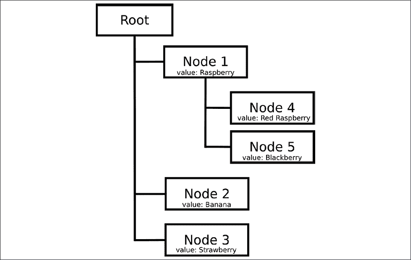
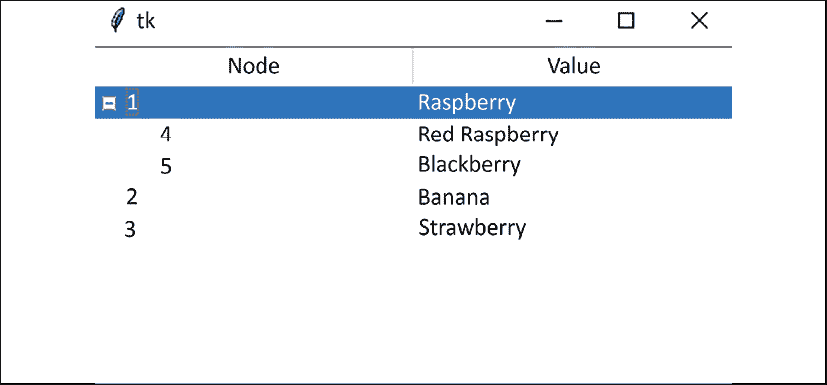
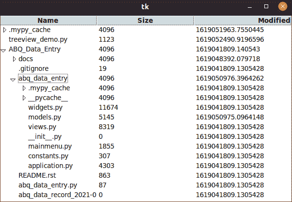
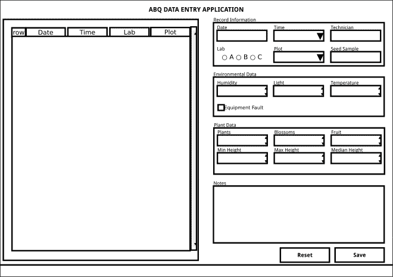
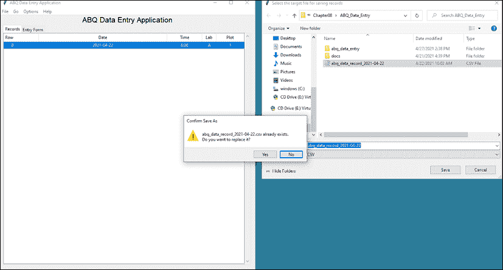

# 使用 Treeview 和 Notebook 导航记录

你收到了另一个关于应用程序功能的请求。现在，由于用户可以打开任意文件进行追加，他们希望能够查看这些文件的内容，并使用他们已经习惯的数据输入表单来纠正旧记录，而不是不得不切换到电子表格。简而言之，现在是时候在我们的应用程序中实现读取和更新功能了。

在本章中，我们将涵盖以下主题：

+   在 *在模型中实现读取和更新* 中，我们将修改我们的 CSV 模型以实现读取和更新功能。

+   在 *探索 Ttk Treeview* 中，我们将探讨 Ttk 的 `Treeview` 小部件。

+   在 *使用 Treeview 实现记录列表* 中，我们将利用我们对 `Treeview` 小部件的了解来创建 CSV 文件中记录的交互式显示。

+   在 *将记录列表添加到应用程序中* 中，我们将使用 Ttk 的 `Notebook` 小部件将我们的新记录列表视图集成到应用程序中。

# 在模型中实现读取和更新

我们到目前为止的设计一直围绕着只向文件追加数据的表单；添加读取和更新功能是一个基本的改变，将几乎触及应用程序的每个部分。

这可能看起来像是一项艰巨的任务，但通过一次处理一个组件，我们会发现这些变化并不那么令人难以承受。

我们首先应该做的是更新我们的文档。在 `docs` 文件夹中打开 `abq_data_entry_spec.rst` 文件，让我们从需求部分开始：

```py
Functional Requirements:
  * Provide a UI for reading, updating, and appending 
    data to the CSV file
  * ... 
```

当然，我们还应该更新那些不需要的部分，如下所示：

```py
The program does not need to:
  * Allow deletion of data. 
```

现在，让代码与文档匹配只是一个简单的问题。让我们开始吧！

## 向 CSVModel 类添加读取和更新功能

请花点时间考虑一下，`CSVModel` 类缺少哪些我们需要添加以实现读取和更新功能的部分：

+   我们需要一个可以检索文件中所有记录的方法，这样我们就可以显示它们。我们将称之为 `get_all_records()`。

+   我们需要一个方法来通过行号从文件中获取单个记录。我们可以称这个方法为 `get_record()`。

+   我们需要以能够追加新记录的同时也能更新现有记录的方式保存记录。我们可以更新我们的 `save_record()` 方法以适应这一需求。

在你的编辑器中打开 `models.py` 文件，让我们一步步进行这些修改。

### 实现 `get_all_records()`

让我们在 `CSVModel` 中开始一个新的方法，称为 `get_all_records()`：

```py
# models.py, in the CSVModel class
  def get_all_records(self):
    """Read in all records from the CSV and return a list"""
    if not self.file.exists():
      return [] 
```

我们首先做的事情是检查模型文件是否存在（回想一下，`self.file` 是一个 `Path` 对象，因此我们可以直接调用 `exists()` 来查看它是否存在）。当我们的用户每天早上启动程序时，`CSVModel` 会生成一个指向一个可能还不存在的文件的默认文件名，因此 `get_all_records()` 需要优雅地处理这种情况。在这种情况下返回一个空列表是有意义的，因为没有数据时文件不存在。

如果文件确实存在，我们将以只读模式打开它并获取所有记录。我们可以这样做：

```py
 with open(self.file, 'r') as fh:
      csvreader = csv.DictReader(fh)
      records = list(csvreader) 
```

虽然这种方法效率不高，但将整个文件拉入内存并转换为列表在我们的情况下是可以接受的，因为我们知道我们的最大文件应该限制在仅仅 241 行：20 个图表乘以 3 个实验室乘以 4 个检查会话，再加上一个标题行。这么多的数据对于 Python 来说是小菜一碟，即使是老工作站。然而，这种方法过于信任用户。我们至少应该做一些合理性检查，以确保用户实际上打开了一个包含正确字段的 CSV 文件，而不是其他任意文件，这可能会使程序崩溃。

让我们修改这个方法，使其能够检查文件的正确字段结构：

```py
# models.py, inside CSVModel.get_all_records()
    with open(self.file, 'r', encoding='utf-8') as fh:
      csvreader = csv.DictReader(fh.readlines())
      missing_fields = (
        set(self.fields.keys()) - set(csvreader.fieldnames)
      )
      if len(missing_fields) > 0:
        fields_string = ', '.join(missing_fields)
        raise Exception(
          f"File is missing fields: {fields_string}"
        )
      records = list(csvreader) 
```

在这个版本中，我们首先通过比较`CSVModel.fields`字典的键与 CSV 文件中的`fieldnames`列表来查找任何缺失的字段。为了找到缺失的字段，我们使用了一个涉及 Python `set`类型的简单技巧：如果我们将两个列表都转换为`set`对象，我们可以从其中一个减去另一个，从而得到一个包含来自第一个列表（我们的`fields`键）而第二个列表（CSV 字段名）中缺失的字段的`set`对象。

如果`missing_fields`有任何项，那么这些就是 CSV 文件中缺失的字段。在这种情况下，我们将引发一个异常，详细说明哪些字段缺失。否则，我们将像在方法简单版本中那样将 CSV 数据转换为列表。

Python `set`对象在比较列表、元组和其他序列对象的内容时非常有用。它们提供了一个简单的方法来获取两个集合之间的信息，如差集（*x*中不在*y*中的项）或交集（*x*和*y*中都有的项），并允许你比较序列而不考虑顺序。

在我们能够从方法中返回`records`列表之前，我们需要纠正一个问题；CSV 文件中的所有数据都存储为文本，并由 Python 作为字符串读取。大多数情况下这没问题，因为 Tkinter 会负责将字符串转换为`float`或`int`。然而，布尔值在 CSV 文件中以字符串`True`和`False`的形式存储，直接将这些值强制转换为`bool`是不行的。字符串`False`是一个非空字符串，在 Python 中所有非空字符串都会评估为`True`。

为了解决这个问题，我们首先定义一个字符串列表，这些字符串应该被解释为`True`：

```py
# models.py, inside CSVModel.get_all_records()
    trues = ('true', 'yes', '1') 
```

任何不在该列表中的值将被视为`False`。我们将进行不区分大小写的比较，因此我们的列表中只有小写值。

接下来，我们使用列表推导创建一个包含布尔型模型字段的列表，如下所示：

```py
 bool_fields = [
      key for key, meta
      in self.fields.items()
      if meta['type'] == FT.boolean
    ] 
```

从技术上讲，我们知道“设备故障”是我们唯一的布尔字段，所以实际上，我们只需将方法硬编码来纠正该字段即可。然而，更明智的做法是设计模型，以便任何对模式的更改都将由逻辑部分自动适当地处理。如果添加或更改了字段，我们理想情况下只需要更改字段规范，其余的模型代码应该能够正确运行。

现在，让我们遍历记录并纠正每行中的所有布尔字段：

```py
 for record in records:
      for key in bool_fields:
        record[key] = record[key].lower() in trues 
```

对于每条记录，我们遍历布尔字段列表，并将字段的值与我们的真值字符串列表进行比较，相应地设置项的值。

在布尔值固定后，我们可以通过返回记录列表来完成我们的函数，如下所示：

```py
 return records 
```

注意，此方法返回的行是以`save_record()`方法保存数据时预期的格式相同的字典。对于模型来说，保持数据表示方式的一致性是一种良好的实践。在一个更健壮的模型中，你甚至可以创建一个类来表示数据行，尽管对于更简单的应用，字典通常也足够好。

### 实现 get_record()

`get_record()`方法需要接受一个行号并返回一个包含该行数据的单个字典。鉴于我们处理的是非常少量的数据，我们可以简单地利用我们刚刚编写的`get_all_records()`方法，并在几行代码中处理这个问题，如下所示：

```py
# models.py, inside the CSVModel class
  def get_record(self, rownum):
    return self.get_all_records()[rownum] 
```

然而，请注意，可能传递一个不存在于我们的记录列表中的`rownum`值；在这种情况下，Python 会引发`IndexError`异常。

由于在模型内部处理这种情况没有有意义的方法，我们需要记住在使用此方法时让我们的控制器捕获这个异常并适当地处理它。

### 为 save_record()添加更新功能

为了将`save_record()`方法转换为可以更新记录的方法，我们首先需要提供传递行号以更新的能力。默认值将是`None`，这表示数据是新的行，应该将其附加到文件中。

更新后的方法签名如下所示：

```py
# models.py, in the CSVModel class
  def save_record(self, data, rownum=None):
    """Save a dict of data to the CSV file""" 
```

我们现有的记录保存逻辑不需要改变，但它应该只在`rownum`为`None`时运行。

因此，在方法中首先要做的是检查`rownum`：

```py
 if rownum is None:
      # This is a new record
      newfile = not self.file.exists()
      with open(self.file, 'a') as fh:
        csvwriter = csv.DictWriter(fh, fieldnames=self.fields.keys())
        if newfile:
          csvwriter.writeheader()
        csvwriter.writerow(data) 
```

如果`rownum`是`None`，我们只是在运行现有的代码：如果文件不存在，则写入标题，然后将行追加到文件末尾。

如果`rownum`不是`None`，我们需要更新指定的行并保存文件。完成此任务有几种方法，但对于相对较小的文件，更新单行最简单的方法是：

1.  将整个文件加载到列表中

1.  更改列表中的行

1.  将整个列表写回到一个干净的文件中

这可能看起来效率不高，但再次强调，我们处理的是非常少量的数据。只有在处理大量数据时（肯定不会存储在 CSV 文件中！），才需要更精细的方法。

因此，让我们添加以下代码来完成这项工作：

```py
# models.py, inside CSVModel.save_record()
    else:
      # This is an update
      records = self.get_all_records()
      records[rownum] = data
      with open(self.file, 'w', encoding='utf-8') as fh:
        csvwriter = csv.DictWriter(fh, fieldnames=self.fields.keys())
        csvwriter.writeheader()
        csvwriter.writerows(records) 
```

再次利用我们的 `get_all_records()` 方法将 CSV 文件的内容提取到列表中。然后，我们将请求行中的字典替换为提供的数据字典。最后，我们以写入模式（`w`）打开文件，这将清除其内容，并用我们写入文件的内容替换它。然后我们将标题和所有记录写回空文件。

注意，我们采取的方法使得两个用户同时在一个 CSV 文件中工作变得不安全。创建允许多个用户同时编辑单个文件的软件非常困难，许多程序最初选择通过锁文件或其他保护机制来防止这种情况。在 *第十二章*，*使用 SQL 改进数据存储* 中，我们将更新我们的程序，以便多个用户可以同时使用它。

此方法已完成，我们只需要在我们的模型中进行以下更改，以启用数据的更新和查看。现在，是时候向我们的 GUI 添加必要的功能了。

# Ttk 树视图

为了让用户能够查看 CSV 文件的内容并选择记录进行编辑，我们需要在应用程序中实现一个新的视图，该视图能够显示表格数据。这个记录列表视图将允许我们的用户浏览文件内容，并打开记录进行查看或编辑。

我们的用户习惯于以表格形式查看这些数据，类似于表格格式，因此以类似的方式设计我们的视图是有意义的。

为了构建具有可选行的表格视图，Tkinter 给我们提供了 **Ttk Treeview** 小部件。为了构建我们的记录列表视图，我们需要了解 `Treeview`。

## 树视图的结构

为了帮助我们探索树视图，让我们回顾一些与该小部件相关的基本术语和概念。树视图旨在显示 **层次数据**；也就是说，数据被组织成 **节点**，每个节点可以恰好有一个父节点和零个或多个子节点。以下图表显示了层次数据的示例：



图 8.1：一个小型的层次数据结构。节点 1、2 和 3 是根节点的子节点，节点 4 和 5 是节点 1 的子节点；“值”是每个节点的属性。

`Treeview` 小部件以表格格式显示层次数据；表格的每一行代表一个单独的节点，它称之为 **项**。表格的每一列代表节点的某个属性。当一个节点有子节点时，这些行将显示在父节点下方，并且可以通过单击父节点来隐藏或显示。

例如，上面的 `Treeview` 中显示的层次结构将看起来像这样：



图 8.2：在树视图小部件中显示的浆果层次结构

树视图中每个项目都有一个唯一的 **项目标识符**（**IID**），每个列都有一个 **列标识符**（**CID**）。这些值是字符串，你可以手动分配它们，或者让小部件自动选择它们。

在树视图中列的顶部是 **标题小部件**。这些是按钮，可以显示每列的名称，并且可选地当点击时运行回调函数。

`Treeview` 小部件的第一列被称为 **图标列**，其 CID 为 `#0`。它不能被移除，也不能更改其 CID。通常它包含有关项目的标识信息。

## 构建文件浏览器

在树视图中表示我们能够表示的数据的最好例子可能是一个文件系统树：

+   每一行可以代表一个文件或目录

+   每个目录可以包含额外的文件或目录

+   每行可以具有额外的数据属性，例如权限、大小或所有权信息

为了更好地理解 `Treeview` 小部件的工作原理，让我们创建一个简单的文件浏览器。

打开一个名为 `treeview_demo.py` 的新文件，并从以下模板开始：

```py
# treeview_demo.py
import tkinter as tk
from tkinter import ttk
from pathlib import Path
root = tk.Tk()
# Code will go here
root.mainloop() 
```

我们首先获取当前工作目录下所有文件路径的列表。`Path` 有一个名为 `glob()` 的方法，将给我们这样一个列表。在 `root = tk.Tk()` 行下方添加此行：

```py
paths = Path('.').glob('**/*') 
```

`glob()` 函数在文件路径中搜索匹配文件系统匹配表达式的文件或目录。该表达式可以包含通配符字符，如 `*`（表示“零个或多个字符”）和 `?`（表示“单个字符”）。虽然“glob”这个名字可以追溯到非常早期的 Unix 命令，但这个相同的通配符语法现在被用于大多数现代操作系统命令行界面中。

`Path('.')` 创建一个引用当前工作目录的路径对象，`**/*` 是一种特殊的通配符语法，它可以递归地获取路径下的所有对象。给定这个通配符表达式，`glob()` 方法返回一个包含当前目录下每个目录和文件的 `Path` 对象列表。

### 创建和配置 Treeview

现在我们有一些要显示的数据，让我们创建一个 `Treeview` 小部件来显示它，如下所示：

```py
tv = ttk.Treeview(
  root, columns=['size', 'modified'], selectmode='none'
) 
```

与任何 Tkinter 小部件一样，`Treeview` 的第一个参数是其父小部件。接下来，我们向 `column` 参数传递了一个字符串列表。这些是我们列的 CID 值。请注意，这些列是 **除了** 默认图标列之外的，所以这个 `Treeview` 小部件将总共有 3 列：`#0`、`size` 和 `modified`。

`selectmode` 参数决定了用户如何在树中选取项目。`selectmode` 的不同选项如下所示：

| 值 | 行为 |
| --- | --- |
| `"none"` | 不能进行选择 |
| `"browse"` | 用户只能选择一个项目 |
| `"extended"` | 用户可以选择多个项目 |

在这种情况下，我们正在防止选择，因此将其设置为 `none`（注意，这将是字符串 `none`，而不是 `None` 对象）。

虽然 Tkinter 会为每个 CID 值添加一个列，但它不会自动给这些列提供标题标签。我们需要自己使用 `Treeview.heading()` 方法来做这件事，如下所示：

```py
tv.heading('#0', text='Name')
tv.heading('size', text='Size', anchor='center')
tv.heading('modified', text='Modified', anchor='e') 
```

树形视图的 `heading()` 方法允许我们配置列标题小部件；它接受我们希望操作的列的 CID，后跟任意数量的关键字参数来配置标题小部件。

这些属性可以包括：

+   `text`：标题显示的文本。默认情况下，它是空的。

+   `anchor`：文本的对齐方式；可以是八个基本方向之一或 `center`，指定为字符串或 Tkinter 常量。

+   `command`：当点击标题时运行的回调函数。这可能用于按该列排序行，或选择列中的所有值，例如。

+   `image`：要在标题中显示的图像。

除了配置标题外，我们还可以使用 `Treeview.column()` 方法配置影响整个列的一些属性。

例如：

```py
tv.column('#0', stretch=True)
tv.column('size', width=200) 
```

在此代码中，我们在第一列中设置了 `stretch=True`，这将导致它扩展以填充任何可用空间。然后我们在 `size` 列上设置了 `width` 值为 `200` 像素。

可以设置的列参数包括：

+   `stretch`：是否将此列扩展以填充可用空间。

+   `width`：列的像素宽度。

+   `minwidth`：列可以调整大小的最小宽度，以像素为单位。

+   `anchor`：列中文本的对齐方式。可以是八个基本方向之一或 `center`，指定为字符串或 Tkinter 常量。

配置好树形视图后，让我们将其添加到 GUI 中，如下所示：

```py
tv.pack(expand=True, fill='both') 
```

### 填充 Treeview 的数据

现在我们已经完成了 GUI 部分，我们的视图需要填充数据。使用 `Treeview` 小部件的 `insert()` 方法逐行填充数据。

`insert()` 方法的基本调用如下：

```py
mytreeview.insert(
  parent, 'end', iid='item1',
  text='My Item 1', values=['12', '42']
) 
```

第一个参数指定了插入行的 **父项**。这 **不是** 父小部件，而是插入节点所属的层次结构中父节点的 IID。对于顶级项，此值应该是一个空字符串。

下一个参数指定了项目相对于其兄弟节点在其父节点下的插入位置。它可以是数值索引或字符串 `end`，它将项目放置在列表的末尾。

在这些位置参数之后，`insert()` 接受多个关键字参数，这些参数可以包括：

+   `text`：这是要在图标列（CID `#0`）中显示的值。

+   `values`：这是剩余列的值列表。请注意，我们需要按顺序指定它们。

+   `image`：这是要在图标列的左侧显示的图像对象。

+   `iid`：行的 IID 字符串。如果您不指定它，将自动分配。

+   `open`：对于有子节点的节点，这设置行是否最初是打开的（显示子项目）或不是。

+   `tags`：一个标签字符串列表。当我们讨论第九章中的样式时，我们将了解更多关于标签的信息，*使用样式和主题改进外观*。

要将我们的文件路径插入到树视图中，让我们按照以下方式遍历`paths`列表：

```py
for path in paths:
  meta = path.stat()
  parent = str(path.parent)
  if parent == '.':
    parent = '' 
```

在调用`insert()`之前，我们需要从`path`对象中提取和准备一些数据。`path.stat()`方法会给我们一个包含各种文件信息的对象，我们将从中提取大小和修改时间。`path.parent`为我们提供了包含路径；然而，我们需要将根路径（目前是一个点）的名称更改为空字符串，这是`Treeview`表示根节点的方式。

现在，仍然在`for`循环中，我们按照以下方式添加`insert()`方法调用：

```py
 tv.insert(
    parent,
    'end',
    iid=str(path),
    text=str(path.name),
    values=[meta.st_size, meta.st_mtime]
  ) 
```

通过使用路径字符串作为 IID，我们可以将其指定为其子对象的父节点。我们只使用路径名称（即，不带包含路径的文件或目录名称）作为我们的显示值，然后从`stat()`数据中检索`st_size`和`st_mtime`以填充大小和修改时间列。

运行此脚本，你应该会看到一个简单的文件树浏览器，看起来像这样：



图 8.3：我们的 Treeview 小部件文件浏览器在 Ubuntu Linux 上运行

### 排序 Treeview 记录

`Treeview`小部件默认不提供任何排序功能，但我们可以通过向列标题添加回调函数来实现排序。

对未知深度的分层数据进行排序有点棘手；为了做到这一点，我们将编写一个**递归函数**。递归函数是一种调用自身的函数，它们在处理未知深度的分层数据时最常被使用。

让我们先定义我们的函数签名，如下所示：

```py
def sort(tv, col, parent='', reverse=False): 
```

这个`sort()`函数接受一个`Treeview`小部件、我们想要排序的列的 CID 字符串、一个可选的父节点 IID 和一个布尔值，表示是否应该反转排序。`parent`的默认值是一个空字符串，表示层次结构的根。

我们将要做的第一件事是构建一个元组列表，每个元组包含我们想要排序的值和包含该值的行的 IID，如下所示：

```py
 sort_index = list()
  for iid in tv.get_children(parent):
    sort_value = tv.set(iid, col) if col != '#0' else iid
    sort_index.append((sort_value, iid)) 
```

`Treeview.get_children()`方法检索一个 IID 字符串列表，这些字符串是给定`parent` IID 的直接子代。例如，在我们的文件浏览器中，调用`tv.get_children('')`将返回当前目录（不在任何子目录中）中所有文件和文件夹的 IID 值列表。

一旦我们有了这个列表，我们就遍历它，并开始构建一个我们可以对其进行排序的列表。为此，我们需要为每个 IID 获取排序列的内容。这有点令人困惑，这是通过 `Treeview.set()` 方法完成的。`Treeview.set()` 可以用两个或三个参数调用，前两个始终是我们想要引用的单元格的 IID 和 CID。如果第三个参数存在，`set()` 将将该值写入单元格。如果省略，`set()` 将返回该单元格的当前值。没有 `Treeview.get()` 方法，所以我们通过这种方式检索特定单元格的值。

然而，即使我们只想检索值，也不能在 CID `#0` 上调用 `set()`。因此，我们添加了一个检查，以防用户正在对该列进行排序，并返回 IID。在获取表格单元格的内容后，我们将它及其 IID 添加到 `sort_index` 列表中。

现在，我们可以对索引进行排序：

```py
 sort_index.sort(reverse=reverse) 
```

由于我们的表格单元格值在每个元组中都是第一个，所以默认情况下元组将根据它进行排序。请注意，我们已传递了 `reverse` 值，以指示列表的排序方向。

现在我们已经有一个排序后的列表，我们需要相应地移动每个节点。接下来添加以下代码：

```py
 for index, (_, iid) in enumerate(sort_index):
    tv.move(iid, parent, index) 
```

`enumerate()` 函数返回一个包含列表中每个项目及其在列表中索引的整数的元组。由于我们列表中的每个项目已经是一个元组，所以我们也将它展开，从而得到三个变量：`index`，列表项的索引数字；`_`，排序值（我们不再需要它，所以我们用下划线命名它）；以及 `iid`。

对于列表中的每个项目，我们调用 `Treeview.move()`，它接受三个参数：我们想要移动的行的 IID、我们想要移动到的父节点，以及在该节点下应该插入的索引。这将有效地根据 `sort_index` 列表的顺序对行进行排序。

然而，到目前为止，这仅对根节点的直接子节点进行了排序。现在是我们使用递归以对所有子节点进行排序的时候了；这只需要一行额外的代码：

```py
 for index, (_, iid) in enumerate(sort_index):
    tv.move(iid, parent, index)
    **sort(tv, col, parent=iid, reverse=reverse)** 
```

`for` 循环的最后一行再次调用 `sort()` 函数，这次传入子 IID 作为父节点，并传递所有其他相同的参数。`sort()` 将继续递归调用自身，直到达到没有子节点的节点。在没有子节点的情况下，对 `sort()` 的调用将返回而不做任何事情。这样，所有包含文件的子目录都将通过它们自己的 `sort()` 调用单独排序。

要使用我们的 `sort()` 函数，我们需要将其绑定到我们的列标题上；我们可以通过再次调用 `Treeview.heading()` 方法来实现，如下所示：

```py
for cid in ['#0', 'size', 'modified']:
  tv.heading(cid, command=lambda col=cid: sort(tv, col)) 
```

在这里，我们正在遍历每个 CID 值，调用 `heading()` 方法向标题添加一个 `command` 参数。我们以具有默认 CID 的 `lambda` 函数的形式这样做。

为什么使用默认参数来传递 CID？`lambda`函数的主体使用**延迟绑定**进行评估，这意味着变量的值直到主体运行时才确定。到那时，`cid`将是列表中的最后一个值（`'modified'`），无论哪个列调用回调。然而，`lambda`函数的签名立即评估，这意味着`col`的默认值将是我们创建函数时`cid`的值。

对此函数的最后一个小修复；通常，点击标题的第二次点击将反转排序。我们可以在`sort()`函数内部通过调用`heading()`方法的第二组调用来实现这一点，这将用反转版本替换`lambda`函数。

在`sort()`函数内部，添加以下代码：

```py
 if parent == '':
    tv.heading(
      col,
      command=lambda col=col: sort(tv, col, reverse=not reverse)
    ) 
```

由于该函数是递归调用的，我们不希望在每次排序时调用它超过一次；因此，我们只为根节点运行此代码，由`parent`值是空字符串表示。在该块内部，我们重置正在排序的列上的`lambda`函数，这次将`reverse`设置为当前值的相反。

现在当你运行应用程序时，你应该能够通过点击每一列的标题以两个方向进行排序。

注意，尽管两个列包含数字，但它们是按**字典顺序**排序的——也就是说，就像它们是字符串一样，而不是数值。这是因为放入`Treeview`小部件的值隐式转换为字符串，所以`Treeview.set()`返回的排序值是一个字符串。要使用数值排序对这些进行排序，您需要在排序之前将它们转换回整数或浮点值。

### 使用 Treeview 虚拟事件

为了能够响应用户与`Treeview`小部件项目的交互，该小部件包括三个虚拟事件，如表中所示：

| 事件 | 生成 |
| --- | --- |
| `<<TreeviewSelect>>` | 当用户选择一个项目时 |
| `<<TreeviewOpen>>` | 当一个父项目展开以显示子项目时 |
| `<<TreeviewClose>>` | 当一个打开的父项目再次关闭时 |

例如，我们可以使用这些事件在用户打开目录时在状态栏中显示一些目录信息。首先，让我们向应用程序添加一个状态栏：

```py
# treeview_demo.py
status = tk.StringVar()
tk.Label(root, textvariable=status).pack(side=tk.BOTTOM) 
```

接下来，我们将为获取有关打开目录的信息并显示的事件创建一个回调：

```py
def show_directory_stats(*_):
  clicked_path = Path(tv.focus())
  num_children = len(list(clicked_path.iterdir()))
  status.set(
    f'Directory: {clicked_path.name}, {num_children} children'
  ) 
```

当用户点击一个项目以打开它时，该项目获得焦点，因此我们可以使用 treeview 的`focus()`方法来获取被点击项目的 IID。我们将它转换为`Path`，并使用`Path`对象的`iterdir()`方法计算目录中的子对象数量。然后，我们使用该信息更新`status`变量。

现在，我们可以将此回调绑定到适当的虚拟事件，如下所示：

```py
tv.bind('<<TreeviewOpen>>', show_directory_stats)
tv.bind('<<TreeviewClose>>', lambda _: status.set('')) 
```

除了将打开事件绑定到我们的回调函数外，我们还把关闭事件绑定到一个清除状态控制变量的 `lambda` 函数。现在，运行演示脚本并点击一个目录。你应该会在状态栏中看到一些信息。再次点击它，信息就会消失。

# 使用 Treeview 实现记录列表

现在我们已经了解了如何使用 `Treeview` 小部件，是时候实现一个 GUI，它将允许我们浏览 CSV 文件中的记录并打开它们进行编辑。让我们花点时间来规划我们需要创建的内容：

+   我们希望将 CSV 数据以表格结构进行布局，类似于它在电子表格中的样子。这将是一个平面表格，而不是一个层次结构。

+   每个表格行将代表文件中的一个记录。当用户双击行或高亮显示并按 Enter 键时，我们希望记录表单以选定的记录打开。

+   我们实际上不需要在表中显示每个字段，因为它的目的仅仅是定位记录以进行编辑。相反，我们将只显示那些对用户唯一标识记录的行。具体来说，这些是 `Date`（日期）、`Time`（时间）、`Lab`（实验室）和 `Plot`（绘图）。我们还可以显示 CSV 行号。

+   实际上没有必要对数据进行排序，所以我们不会实现排序。目的是可视化 CSV 文件，其顺序不应该改变。

为了使所有这些工作，我们首先将实现一个使用树视图显示所有记录并允许选择记录的小部件。然后，我们将通过应用程序的其他组件并集成新的功能。让我们开始吧！

## 创建 RecordList 类

我们将通过从 `tkinter.Frame` 继承来开始构建我们的 `RecordList` 类，就像我们处理记录表单时做的那样：

```py
# views.py, at the end of the file
class RecordList(tk.Frame):
  """Display for CSV file contents""" 
```

为了避免重复代码，我们将定义树视图的列属性和默认值作为类属性。这也会使我们在以后更容易调整它们以满足不断变化的需求。将这些属性添加到类中：

```py
# views.py, inside the RecordList class
  column_defs = {
    '#0': {'label': 'Row', 'anchor': tk.W},
    'Date': {'label': 'Date', 'width': 150, 'stretch': True},
    'Time': {'label': 'Time'},
    'Lab': {'label': 'Lab', 'width': 40},
    'Plot': {'label': 'Plot', 'width': 80}
  }
  default_width = 100
  default_minwidth = 10
  default_anchor = tk.CENTER 
```

回想一下，我们将显示 `Date`（日期）、`Time`（时间）、`Lab`（实验室）和 `Plot`（绘图）。对于 `#0` 列，我们将显示 CSV 行号。我们还为一些列设置了 `width`（宽度）和 `anchor`（锚点）值，并将 `Date` 字段配置为 `stretch`（拉伸）。在 `RecordList` 类的初始化器中配置 `Treeview` 小部件时，我们将使用这些值。

接下来是初始化方法，让我们这样开始：

```py
# views.py, inside the RecordList class
def __init__(self, parent, *args, **kwargs):
  super().__init__(parent, *args, **kwargs)
  self.columnconfigure(0, weight=1)
  self.rowconfigure(0, weight=1) 
```

在这里，在运行超类初始化器之后，我们已配置网格布局以扩展第一行和第一列。这就是我们的 `Treeview` 小部件将被放置的地方，因此我们希望它能够占据框架上的任何可用空间。

### 配置 Treeview 小部件

现在我们已经准备好创建我们的 `Treeview` 小部件，如下所示：

```py
# views.py, inside the RecordList.__init__() method
  self.treeview = ttk.Treeview(
    self,
    columns=list(self.column_defs.keys())[1:],
    selectmode='browse'
  )
  self.treeview.grid(row=0, column=0, sticky='NSEW') 
```

在这里，我们创建了一个 `Treeview` 小部件并将其添加到框架的布局中。我们通过从 `column_defs` 字典中检索键来生成 `columns` 列表，并排除了第一个条目（`#0`）。请记住，`#0` 是自动创建的，不应包含在 `columns` 列表中。我们还选择了 `browse` 选择模式，以便用户只能选择 CSV 文件的单独行。这将在我们与控制器通信的方式中非常重要。

接下来，我们将通过遍历 `column_defs` 字典来配置 `Treeview` 小部件的列和标题：

```py
 for name, definition in self.column_defs.items():
      label = definition.get('label', '')
      anchor = definition.get('anchor', self.default_anchor)
      minwidth = definition.get('minwidth', self.default_minwidth)
      width = definition.get('width', self.default_width)
      stretch = definition.get('stretch', False)
      self.treeview.heading(name, text=label, anchor=anchor)
      self.treeview.column(
        name, anchor=anchor, minwidth=minwidth,
        width=width, stretch=stretch
      ) 
```

对于 `column_defs` 中的每个条目，我们正在提取指定的配置值，然后根据适当的情况将它们传递给 `Treeview.heading()` 或 `Treeview.column()`。如果字典中没有指定值，则将使用类的默认值。

最后，我们将设置一些绑定，以便双击或按 Enter 键在记录上会导致打开记录，如下所示：

```py
# views.py, in RecordList.__init__()
    self.treeview.bind('<Double-1>', self._on_open_record)
    self.treeview.bind('<Return>', self._on_open_record) 
```

事件 `<Double-1>` 指的是鼠标按钮 1 的双击（即左键），而 `<Return>` 事件表示按下 Return 或 Enter 键（取决于您的硬件上的标签）。这两个事件都绑定到一个名为 `_on_open_record()` 的实例方法。让我们继续实现该方法，如下所示：

```py
# views.py, in the RecordList class
  def _on_open_record(self, *args):
    self.event_generate('<<OpenRecord>>') 
```

由于打开记录是在 `RecordList` 类外部发生的，我们只是简单地生成一个名为 `<<OpenRecord>>` 的自定义事件，我们的 `Application` 类可以监听它。当然，`Application` 需要知道要切换到哪个记录，因此我们需要一种方法让它能够从表中检索当前选中的行。我们将使用 Python 类的一个特性，称为**属性**。类属性在外部代码中看起来像是一个常规属性，但在每次评估时都会运行一个方法来确定其值。我们当然可以使用方法，但使用属性简化了类外部的访问。要创建一个属性，我们需要编写一个只接受 `self` 作为参数的方法并返回一个值，然后使用 `@property` 装饰器。我们将我们的属性命名为 `selected_id`；将其添加到 `RecordList` 类中，如下所示：

```py
 @property
  def selected_id(self):
    selection = self.treeview.selection()
    return int(selection[0]) if selection else None 
```

在这个方法中，我们首先使用 `selection()` 方法检索所选项目的列表。此方法始终返回一个列表，即使只选择了一个项目（即使只有一个项目*可以*被选择）。由于我们只想返回一个 IID，如果列表中存在，则检索项目 0，如果没有任何选择，则返回 `None`。请记住，我们树视图中每一行的 IID 是 CSV 行号*作为字符串*。我们将希望将其转换为整数，以便控制器可以轻松地使用它从模型中定位 CSV 记录。

### 为 Treeview 添加滚动条

由于 CSV 文件将包含数百条记录，记录列表很可能会超出应用程序窗口的高度，即使应用程序已最大化。如果发生这种情况，为用户提供一个滚动条来垂直导航列表将很有帮助。

`Treeview` 小部件默认没有滚动条；它可以使用键盘或鼠标滚轮控件进行滚动，但用户合理地期望在可滚动的区域（如 `Treeview`）上有一个滚动条，以帮助他们可视化列表的大小和他们在列表中的当前位置。

幸运的是，Ttk 为我们提供了一个可以连接到我们的 `Treeview` 小部件的 `Scrollbar` 小部件。回到初始化器，让我们添加一个：

```py
# views.py , in RecordList.__init__()
    self.scrollbar = ttk.Scrollbar(
      self,
      orient=tk.VERTICAL,
      command=self.treeview.yview
    ) 
```

`Scrollbar` 类接受两个重要的关键字参数：

+   `orient`：此参数确定是水平还是垂直滚动。可以使用字符串 `horizontal` 或 `vertical`，或者使用 Tkinter 常量 `tk.HORIZONTAL` 和 `tk.VERTICAL`。

+   `command`：此参数为滚动条移动事件提供回调。回调将传递描述发生的滚动运动的参数。

在这种情况下，我们将回调设置为树视图的 `yview()` 方法，该方法用于使树视图上下滚动。（另一种选择是 `xview()`，它将用于水平滚动。）结果是，当滚动条移动时，位置数据被发送到 `Treeview.yview()`，导致树视图上下滚动。

我们还需要将我们的 `Treeview` 与滚动条连接起来：

```py
 self.treeview.configure(yscrollcommand=self.scrollbar.set) 
```

这告诉 `Treeview` 在滚动时，将当前垂直位置发送到滚动条小部件的 `set()` 方法。如果我们不这样做，我们的滚动条将不知道我们已经滚动到列表的哪个位置，也不知道列表有多长，因此无法适当地设置条形小部件的大小或位置。

在配置了我们的 `Scrollbar` 小部件后，我们需要将其放置在框架上。按照惯例，它应该位于被滚动的小部件的右侧，如下所示：

```py
 self.scrollbar.grid(row=0, column=1, sticky='NSW') 
```

注意我们将 `sticky` 设置为北、南和西。北和南确保滚动条拉伸整个小部件的高度，而西确保它紧挨着其左侧的 `Treeview` 小部件。

### 填充 Treeview

现在我们已经创建并配置了我们的 `Treeview` 小部件，我们需要一种方法来填充它。让我们创建一个 `populate()` 方法来完成这个任务：

```py
# views.py, in the RecordList class
  def populate(self, rows):
    """Clear the treeview and write the supplied data rows to it.""" 
```

`rows` 参数将接受一个字典列表，例如模型 `get_all_records()` 方法返回的内容。其思路是控制器将从模型获取一个列表，然后通过此方法将其传递给 `RecordList`。

在重新填充 `Treeview` 之前，我们需要清空它：

```py
# views.py, in RecordList.populate()
    for row in self.treeview.get_children():
      self.treeview.delete(row) 
```

要从树视图中删除记录，我们只需调用其 `delete()` 方法，并传入要删除的行的 IID。在这里，我们已经使用 `get_children()` 获取了所有行的 IID，然后逐个传递给 `delete()`。

现在树形视图已被清除，我们可以遍历`rows`列表并填充表格：

```py
 cids = self.treeview.cget('columns')
    for rownum, rowdata in enumerate(rows):
      values = [rowdata[cid] for cid in cids]
      self.treeview.insert('', 'end', iid=str(rownum),
         text=str(rownum), values=values) 
```

在这里我们首先创建一个列表，列出我们实际上想要从每一行获取的所有 CID，通过检索树形视图的`columns`值。

接下来，我们使用`enumerate()`函数遍历提供的数据行以生成行号。对于每一行，我们将使用列表推导式创建一个按正确顺序排列的值列表，然后使用`insert()`方法将列表插入到`Treeview`小部件的末尾。请注意，我们只是使用行号（转换为字符串）作为行的第一列的 IID 和文本。

在这个函数中最后需要做的事情是一个小的可用性调整。为了使我们的记录列表键盘友好，我们需要最初将焦点放在第一个项目上，这样键盘用户就可以立即通过箭头键开始导航它。

在`Treeview`小部件中执行此操作实际上需要三个方法调用：

```py
 if len(rows) > 0:
      self.treeview.focus_set()
      self.treeview.selection_set('0')
      self.treeview.focus('0') 
```

首先，`focus_set()`方法将焦点移动到`Treeview`小部件。接下来，`selection_set('0')`选择列表中的第一个记录（注意字符串`0`是第一个记录的 IID）。最后，`focus('0')`将焦点放在 IID 为`0`的行上。当然，我们只有在有行的情况下才这样做；如果我们对一个空的`Treeview`调用这些方法，我们将引发异常。

`RecordList`类现在已完成。现在是时候更新应用程序的其余部分以使用它了。

# 将记录列表添加到应用程序

现在我们有一个能够读取和更新数据的模型，以及一个能够显示文件内容的`RecordList`小部件，我们需要对应用程序的其余部分进行更改以使一切协同工作。具体来说，我们必须做以下事情：

+   我们需要更新`DataRecordForm`以使其适合更新现有记录以及添加新记录。

+   我们需要更新`Application`窗口的布局以适应新的记录列表。

+   我们需要创建新的`Application`回调来处理记录加载和应用导航。

+   最后，我们需要更新主菜单以添加新的功能选项。

让我们开始吧！

## 修改记录表单以进行读取和更新

只要我们还在`views.py`中，就让我们向上滚动查看我们的`DataRecordForm`类，并调整它使其能够加载和更新现有记录。

请花点时间考虑以下我们需要做出的更改：

+   该表单需要跟踪它正在编辑的记录，或者如果是一个新记录。

+   用户需要一些视觉指示来了解正在编辑的记录。

+   表单需要一种方式来加载控制器提供的记录。

让我们实现这些更改。

### 添加当前记录属性

为了跟踪正在编辑的当前记录，我们只需使用一个实例属性。在`__init__()`方法中，在第一个`LabelFrame`小部件创建之上，添加以下代码：

```py
# views.py, in DataRecordForm.__init__()
    self.current_record = None 
```

`current_record`实例属性最初设置为`None`，我们将用它来表示没有加载记录且表单正在用于创建新记录。当我们编辑记录时，我们将此值更新为引用 CSV 数据中行的整数。我们在这里可以使用 Tkinter 变量，但在这个情况下没有真正的优势，并且我们无法使用`None`作为值。

### 添加一个标签来显示正在编辑的内容

由于表单现在可能正在编辑现有记录或新记录，因此用户能够一眼看出正在发生的事情将很有帮助。为此，让我们在表单顶部添加一个`Label`来显示正在编辑的当前记录，如下所示：

```py
# views.py, in DataRecordForm.__init__()
    self.record_label = ttk.Label(self)
    self.record_label.grid(row=0, column=0) 
```

我们将新的`Label`小部件放置在`row 0`，`column 0`，这将导致其他小部件向下移动一行。这不会影响由`_add_frame()`生成的`Frame`小部件，因为它们使用隐式行号，但我们的笔记输入和按钮需要移动。让我们更新这些小部件到新的位置：

```py
# views.py, in DataRecordForm.__init__()
    w.LabelInput(
      self, "Notes", field_spec=fields['Notes'],
      var=self._vars['Notes'], input_args={"width": 85, "height": 10}
    ).grid(sticky="nsew", **row=****4**, column=0, padx=10, pady=10)
    buttons = tk.Frame(self)
    buttons.grid(sticky=tk.W + tk.E, **row=****5**) 
```

如果这个更改导致您的系统中的表单底部超出屏幕，请随意调整笔记字段的长度！

### 添加`load_record()`方法

在`DataRecordForm`类中最后要添加的是一种加载新记录的方法。这个方法需要接受来自控制器的一个行号和数据字典，并使用它们来更新`current_record`（表单中的数据）和顶部的标签。这将是一个公共方法，因为它将由控制器调用，并且它将如下开始：

```py
 def load_record(self, rownum, data=None):
    self.current_record = rownum
    if rownum is None:
      self.reset()
      self.record_label.config(text='New Record') 
```

在更新`current_record`属性后，我们检查`rownum`是否为`None`。回想一下，这表示我们请求一个空白表单来输入新记录。在这种情况下，我们将调用`reset()`方法并配置标签以显示**新记录**。

注意，这里的`if`条件专门检查`rownum`是否为`None`；我们不能仅仅检查`rownum`的真值，因为 0 是一个有效的更新`rownum`。

如果我们有有效的`rownum`，我们需要它以不同的方式行动：

```py
 else:
      self.record_label.config(text=f'Record #{rownum}')
      for key, var in self._vars.items():
        var.set(data.get(key, ''))
        try:
          var.label_widget.input.trigger_focusout_validation()
        except AttributeError:
          pass 
```

在这个块中，我们首先使用我们正在编辑的行号适当地设置标签。然后，我们遍历表单的`_vars`字典，从传递给函数的`data`字典中检索匹配的值。最后，我们尝试在每个变量的输入小部件上调用`trigger_focusout_validation()`方法，因为 CSV 文件可能包含无效数据。如果没有这样的方法（也就是说，如果我们使用的是常规 Tkinter 小部件而不是我们验证过的小部件），我们就什么也不做。

我们的形式现在已准备好加载数据记录！

## 更新应用程序布局

我们已经准备好了用于加载记录的表单，并且我们有了准备显示记录的记录列表。现在，我们需要将这些全部整合到主应用程序中。不过，首先，我们需要考虑如何将这两个表单容纳到我们的 GUI 布局中。

在*第二章*，*设计 GUI 应用程序*中，我们列出了一些可以帮助我们分组 GUI 组件并减少 GUI 杂乱的组件选项。我们选择使用框架盒来组织我们的数据输入表单；我们能否再次这样做？

这个想法的快速原型可能看起来像这样：



图 8.4：使用并排框架的应用程序布局

这可能可行，但屏幕上一次显示的信息太多，用户实际上不需要同时看到所有这些信息。记录列表主要用于导航，数据输入表单用于编辑或输入数据。如果我们一次只显示一个组件可能会更好。

将这两个大型组件组织到同一个 GUI 中的另一种选项是**笔记本**。这种类型的小部件可以通过使用标签在 GUI 中切换多个页面。Ttk 为我们提供了一个实现此功能的`Notebook`小部件；你之前在*第一章*，*Tkinter 简介*中已经见过它，当时我们查看 IDLE 配置对话框。它在这里可以看到：


图 8.5：IDLE 配置对话框中的 Ttk 笔记本标签

让我们快速看一下 Ttk 的`Notebook`，看看它如何在应用程序中使用。

### Ttk 笔记本小部件

`Notebook`小部件是`ttk`模块的一部分，因此我们不需要添加任何额外的导入就可以使用它。创建一个`Notebook`小部件相当简单，如下所示：

```py
# notebook_demo.py
import tkinter as tk
from tkinter import ttk
root = tk.Tk()
notebook = ttk.Notebook(root)
notebook.grid() 
```

要向小部件添加页面，我们需要创建一些子小部件。让我们创建几个带有一些信息内容的`Label`小部件：

```py
banana_facts = [
  'Banana trees are of the genus Musa.',
  'Bananas are technically berries.',
  'All bananas contain small amounts of radioactive potassium.'
  'Bananas are used in paper and textile manufacturing.'
]
plantain_facts = [
  'Plantains are also of genus Musa.',
  'Plantains are starchier and less sweet than bananas',
  'Plantains are called "Cooking Bananas" since they are'
  ' rarely eaten raw.'
]
b_label = ttk.Label(notebook, text='\n\n'.join(banana_facts))
p_label = ttk.Label(notebook, text='\n\n'.join(plantain_facts)) 
```

在这里，我们创建了一些标签作为笔记本中的页面。通常，你的笔记本页面小部件可能是`Frame`对象或我们的`RecordList`或`DataRecordForm`组件的子类，但任何小部件都可以使用。

我们不是使用几何管理器将这些组件放置在笔记本中，而是使用小部件的`add()`方法，如下所示：

```py
notebook.add(b_label, text='Bananas', padding=20)
notebook.add(p_label, text='Plantains', padding=20) 
```

`add()`方法创建一个包含给定小部件的新页面，并将其放置在笔记本的末尾。如果我们想将页面插入到其他位置，我们也可以使用`insert()`方法，如下所示：

```py
notebook.insert(1, p_label, text='Plantains', padding=20) 
```

此方法与之前相同，只是它将索引号作为第一个参数。页面将插入到该索引位置。

两种方法都接受多个关键字参数来配置页面及其标签，如下所示：

| 参数 | 值 | 描述 |
| --- | --- | --- |
| `text` | 字符串 | 标签上显示的文本。默认情况下，标签是空的。 |
| `padding` | 整数 | 在页面上的小部件周围添加的像素间距。 |
| `sticky` | 基数值（`N`，`S`，`E`，`W`） | 在笔记本页面上粘滞小部件的位置。默认为`NSEW`。 |
| `underline` | 整数 | 在`text`中绑定键盘遍历的字母索引。 |
| `image` | Tkinter `Photoimage` | 在标签上显示的图像。见*第九章*，*使用样式和主题改进外观*。 |
| `compound` | `LEFT`, `RIGHT`, `CENTER`, `TOP`, `BOTTOM` | 如果指定了文本和图像，则显示图像的位置相对于文本。 |

`underline`选项是我们之前在其他小部件上见过的（见*第三章*，*使用 Tkinter 和 Ttk 小部件创建基本表单*）；然而，在`ttk.Notebook`小部件中，当使用该选项时，实际上会设置键盘绑定。

让我们在我们的示例笔记本上尝试一下：

```py
notebook.tab(0, underline=0)
notebook.tab(1, underline=0) 
```

`tab()`方法类似于小部件的`config()`方法，允许我们在添加标签后更改配置选项。

在这种情况下，我们为两个标签都指定了`underline=0`，这意味着每个标签的`text`字符串的第一个字母将被下划线。此外，将创建一个键绑定，以便按下 Alt 键加上下划线字母的组合可以切换到相应的标签。例如，在我们的应用程序中，我们在标签**Banana**中下划线字母 0，所以 Alt-B 将切换到该标签；我们还在标签**Plantain**中下划线字母 0，所以 Alt-P 将切换到**Plantain**标签。

除了这些绑定之外，我们还可以通过调用其`enable_traversal()`方法来启用笔记本的通用键盘遍历，如下所示：

```py
notebook.enable_traversal() 
```

如果调用此方法，Control-Tab 将从左到右循环遍历标签页，而 Shift-Control-Tab 将按从右到左的顺序遍历它们。

我们的代码有时可能需要选择一个标签；为此，我们可以使用`select()`方法，如下所示：

```py
notebook.select(0) 
```

在这种情况下，我们传递整数`0`，表示第一个标签。我们也可以传递包含在标签中的小部件的名称，如下所示：

```py
notebook.select(p_label) 
```

这同样适用于`tab()`方法以及任何需要标签 ID 的方法。

`Notebook`小部件有一个`<<NotebookTabChanged>>`虚拟信号，每当用户更改标签时都会生成。您可能可以使用此功能刷新页面或显示帮助信息，例如。

现在我们已经熟悉了笔记本，让我们将其整合到我们的应用程序中。

### 将笔记本添加到我们的应用程序中

要将`Notebook`小部件添加到我们的布局中，我们需要在创建`DataRecordForm`和`RecordList`小部件之前在`Application.__init__()`中创建一个。打开`application.py`文件，找到当前创建`DataRecordForm`对象的行，并在它们上面创建一个笔记本，如下所示：

```py
# application.py, in Application.__init__()
    self.notebook = ttk.Notebook(self)
    self.notebook.enable_traversal()
    self.notebook.grid(row=1, padx=10, sticky='NSEW') 
```

注意，我们为仅使用键盘的用户启用了键盘遍历，并将小部件粘附在网格的所有边上。现在，按照以下方式更新创建记录表单的行：

```py
 self.recordform = v.DataRecordForm(
      self, 
      self.model, 
      self.settings
    )
    self.recordform.bind('<<SaveRecord>>', self._on_save)
    **self.notebook.add(self.recordform, text=****'Entry Form'****)** 
```

在这里，我们只是移除了对`self.recordform.grid()`的调用，并用`self.notebook.add()`替换了它。接下来，让我们创建一个`RecordList`类的实例并将其添加到笔记本中：

```py
 self.recordlist = v.RecordList(self)
    self.notebook.insert(0, self.recordlist, text='Records') 
```

虽然我们是在第二个添加 `RecordList` 小部件，但我们希望它首先显示；因此，我们使用 `insert()` 将其添加到标签列表的开头。这样我们就完成了页面的添加，但让我们开始添加必要的回调来使它们工作。

## 添加和更新应用程序回调

为了以功能方式将这些新小部件组合在一起，我们需要在 `Application` 对象上创建一些回调方法，以便在需要时允许应用程序将用户和数据传递到 GUI 的适当区域。具体来说，我们需要创建四个方法：

+   我们可以使用 `_show_recordlist()` 方法在需要时显示记录列表

+   一个可以用来从文件数据中重新填充记录列表的 `_populate_recordlist()` 方法

+   一个可以用来切换到新的、空白的记录的 `_new_record()` 方法

+   我们可以调用的 `_open_record()` 方法来从记录列表中加载特定的记录到表单中

我们还需要修复 `Application._on_save()` 方法，以确保它传递给模型所有必要的信息，以便更新现有记录和创建新记录。

让我们逐一查看每个方法，创建或更新方法，并在适当的地方绑定或调用它。

### `_show_recordlist()` 方法

我们将要编写的第一个方法是 `_show_recordlist()`。正如你所见，这个方法相当简单：

```py
# application.py, in the Application class
  def _show_recordlist(self, *_):
    self.notebook.select(self.recordlist) 
```

编写这样一个简单的方法几乎不值得，但通过将其作为方法，我们可以轻松地将其绑定为回调，而无需使用 `lambda` 函数。请注意，我们可以将其编写为 `self.notebook.select(0)`，但传递小部件引用更明确地表达了我们的意图。如果我们决定切换标签的顺序，此方法将继续工作而无需更改。

我们还希望将此回调绑定到主菜单上。回到 `Application` 的初始化器中，让我们将此方法添加到我们的回调函数字典中，如下所示：

```py
# application.py, in Application.__init__()
    event_callbacks = {
      #...
      '<<ShowRecordlist>>': self._show_recordlist
    } 
```

我们将在下一节中添加菜单本身的必要代码。另一个我们应该调用此方法的地方是在 `__init__()` 的末尾，以确保当用户打开程序时记录列表被显示。在 `Application.__init__()` 的末尾添加此代码：

```py
# application.py, at the end of Application.__init__()
    self._show_recordlist() 
```

### `_populate_recordlist()` 方法

`_populate_recordlist()` 方法需要从模型中检索数据并将其传递给记录列表的 `populate()` 方法。我们可以这样编写它：

```py
 def _populate_recordlist(self):
    rows = self.model.get_all_records()
    self.recordlist.populate(rows) 
```

然而，请记住，如果文件中的数据有问题，`CSVModel.get_all_records()` 可能会引发一个 `Exception`。捕获这个异常并采取适当的行动是控制器的责任，所以我们将这样编写该方法：

```py
# application.py, in the Application class
  def _populate_recordlist(self):
    try:
      rows = self.model.get_all_records()
    except Exception as e:
      messagebox.showerror(
        title='Error',
        message='Problem reading file',
        detail=str(e)
      )
    else:
      self.recordlist.populate(rows) 
```

在这个版本中，如果我们从 `get_all_records()` 获取异常，我们将在错误对话框中显示其消息。然后用户将负责处理这个问题。

现在我们有了这个方法，它应该在什么时候被调用？首先，它应该在每次我们选择一个新的文件来工作时被调用；所以，让我们在`_on_file_select()`的末尾添加对它的调用，如下所示：

```py
 def _on_file_select(self, *_):
    # ...
    if filename:
      self.model = m.CSVModel(filename=filename)
      **self._populate_recordlist()** 
```

此外，我们还需要在打开程序时填充列表，因为它将自动加载默认文件。让我们在创建记录列表小部件后立即调用此方法，如下所示：

```py
# application.py, in Application.__init__()
    self.recordlist = v.RecordList(self)
    self.notebook.insert(0, self.recordlist, text='Records')
    **self._populate_recordlist()** 
```

最后，每次我们保存记录时，这也应该更新记录列表，因为新记录已经被添加到文件中。我们需要在`_on_save()`中添加对方法的调用，如下所示：

```py
# application.py, in Application._on_save()
  def _on_save(self, *_):
    #...
    self.recordform.reset()
    **self._populate_recordlist()** 
```

现在我们的记录列表应该与我们在工作的文件状态保持同步。

### `_new_record()`方法

接下来，我们需要一个可以打开数据记录表单以输入新记录的方法。记住，我们的`DataRecordForm.load_record()`方法可以将`None`作为记录号和数据参数，表示我们想要处理一个新记录，所以我们只需要编写一个回调来完成这个操作。

将此方法添加到`Application`：

```py
# application.py, in the Application class
  def _new_record(self, *_):
    self.recordform.load_record(None)
    self.notebook.select(self.recordform) 
```

在调用`load_record()`为新的记录输入准备表单后，我们使用`notebook.select()`将笔记本切换到记录表单。为了使用户能够调用此方法，我们将创建一个菜单项，因此我们需要在`event_callbacks`字典中添加另一个条目。

在`Application.__init__()`中，按如下方式更新字典：

```py
# application.py, in Application.__init__()
    event_callbacks = {
      #...
      **'<<NewRecord>>'****: self._new_record**
    } 
```

我们将在下一节中添加必要的代码到菜单中。

### `_open_record()`方法

接下来，我们需要编写一个回调方法，当用户从记录列表中选择一个记录时，它会打开一个现有的记录。将此方法添加到`Application`类：

```py
# application.py, in the Application class
  def _open_record(self, *_):
    """Open the selected id from recordlist in the recordform"""
    rowkey = self.recordlist.selected_id
    try:
      record = self.model.get_record(rowkey)
    except Exception as e:
      messagebox.showerror(
        title='Error', message='Problem reading file', detail=str(e)
      )
    else:
      self.recordform.load_record(rowkey, record)
      self.notebook.select(self.recordform) 
```

记住，每当记录被双击或使用 Enter 键激活时，`RecordList`对象都会更新其`selected_id`属性。我们正在检索这个 ID 号并将其传递给模型的`get_record()`方法。因为`get_record()`会调用`get_all_records()`，如果文件有问题，它也可能抛出异常。因此，就像我们在`_populate_recordlist()`中所做的那样，我们在有问题的情况下捕获异常并向用户显示其消息。

如果没有问题，我们已经检索到了数据，我们只需要传递行号和数据字典到表单的`load_record()`方法。最后，我们调用`notebook.select()`来切换到记录表单视图。

这个回调需要在用户从记录列表中选择文件时被调用。记住，我们已经编写了`RecordList`对象来生成一个`<<OpenRecord>>`事件，每当这种情况发生时。回到应用程序的初始化方法中，我们需要设置一个绑定到这个事件。

回到`Application.__init__()`，在创建`RecordList`小部件后添加此绑定，如下所示：

```py
# application.py, inside Application.__init__()
    self.notebook.insert(0, self.recordlist, text='Records')
    self._populate_recordlist()
    **self.recordlist.bind(****'<<OpenRecord>>'****, self._open_record)** 
```

现在双击或按 Enter 键将打开选定的记录。

### `_on_save()`方法

最后，现在我们的模型可以处理更新现有记录，我们需要修改调用模型 `save_record()` 方法的代码，以确保我们传递了它需要更新现有记录或插入新记录所需的所有信息。回想一下，我们更新了 `save_record()` 以接受 `rownum` 参数。当此值为 `None` 时，添加新记录；当它是一个整数时，更新指定的行号。

在 `Application._on_save()` 中，按照以下方式更新代码：

```py
# application.py, inside Application._on_save()
    data = self.recordform.get()
    **rownum = self.recordform.current_record**
    **self.model.save_record(data, rownum)** 
```

回想一下，记录表单对象的 `current_record` 包含正在编辑的当前行的值，如果没有正在编辑的记录，则为 `None`。我们可以直接将此值传递给模型的 `save()` 方法，确保数据被保存到正确的位置。

## 主菜单更改

我们需要对我们应用程序进行的最后一个更改是更新主菜单，以包含用于导航应用程序的新选项；具体来说，我们需要添加一个添加新文件的命令，以及一个返回记录列表的命令。记住，`Application` 对象将这些操作的回调绑定到 `<<ShowRecordlist>>` 和 `<<NewRecord>>` 事件上。

对于在应用程序中导航的命令实际上并没有一个标准的位置，因此我们将创建一个新的子菜单，称为“Go”。打开 `mainmenu.py` 文件，让我们在初始化方法中添加一个新的子菜单：

```py
# mainmenu.py, inside MainMenu.__init__()
    go_menu = tk.Menu(self, tearoff=False)
    go_menu.add_command(
      label="Record List",
      command=self._event('<<ShowRecordlist>>')
    )
    go_menu.add_command(
      label="New Record",
      command=self._event('<<NewRecord>>')
    ) 
```

在这里，我们添加了一个新的子菜单小部件，并添加了我们的两个导航命令，再次利用 `_event()` 方法，它为我们提供了一个生成给定事件的方法的引用。现在，在文件和选项菜单之间添加`Go`菜单，如下所示：

```py
# mainmenu.py, at the end of MainMenu.__init__()
    self.add_cascade(label='File', menu=file_menu)
    **self.add_cascade(label=****'Go'****, menu=go_menu)**
    self.add_cascade(label='Options', menu=options_menu) 
```

## 测试我们的程序

到目前为止，你应该能够运行应用程序并加载如以下截图所示的示例 CSV 文件。



图 8.6：使用我们新的菜单和记录列表选择现有文件进行写入

确保尝试打开记录、编辑并保存它，以及插入新记录和打开不同的文件。你还应该测试以下错误条件：

+   尝试打开一个不是 CSV 文件的文件，或者字段不正确的 CSV 文件。会发生什么？

+   打开一个有效的 CSV 文件，选择一个记录进行编辑，然后，在点击“保存”之前，选择不同的或空文件。会发生什么？

+   打开程序的两个副本，并将它们指向保存的 CSV 文件。尝试在两个程序之间交替执行编辑或更新操作。注意发生了什么。

考虑如何解决这些问题；在某些情况下可能无法解决，用户将不得不被告知这些限制。此外，如果可能的话，尝试在不同的操作系统上执行最后一个测试。结果是否不同？

# 摘要

我们已经将程序从仅能追加数据输入表单转变为能够从现有文件中加载、查看和更新数据的应用程序。在这个过程中，你学习了如何更新我们的模型，使其能够读取和更新 CSV 文件。你还探索了`Treeview`小部件，包括其基本用法、虚拟事件和列回调。你通过创建文件浏览工具，探索了如何使用`Treeview`小部件与层次化数据结构协同工作。你学习了如何使用`Notebook`小部件组织多表单应用程序，以及如何使用`Scrollbar`小部件创建滚动界面。最后，你将这些概念整合到 ABQ 数据输入应用程序中，以满足用户需求。

在我们接下来的章节中，我们将学习如何修改应用程序的外观和感觉。我们将了解如何使用小部件属性、样式和主题，以及如何处理位图图形。
