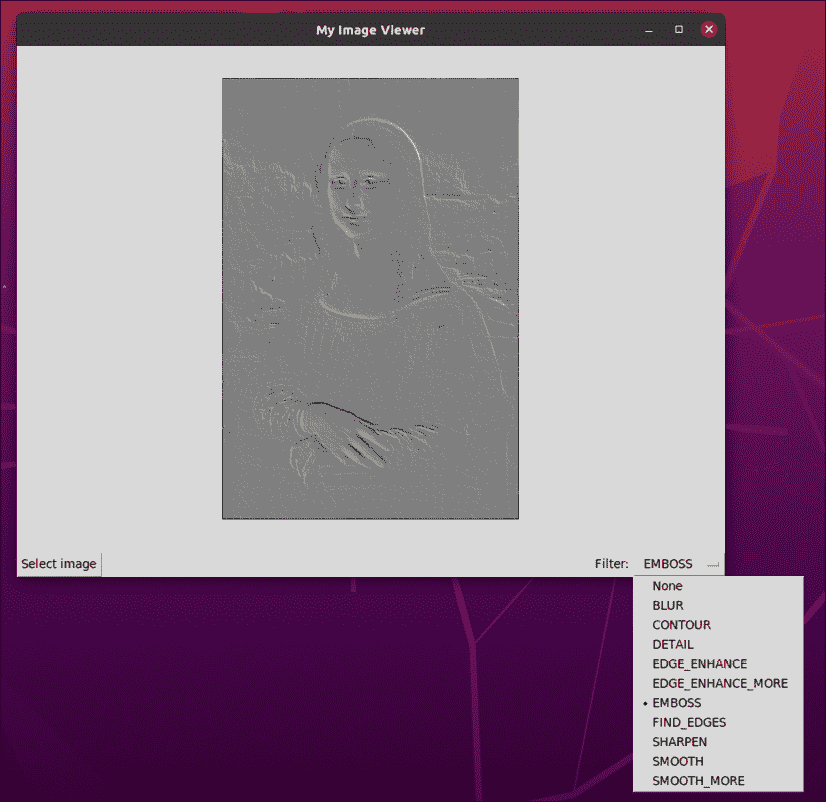
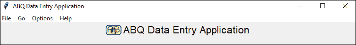
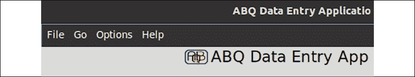
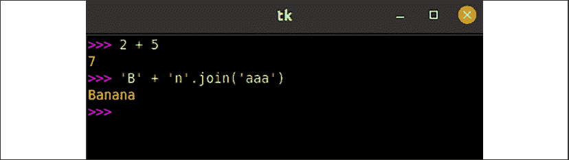
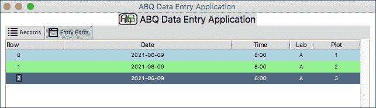
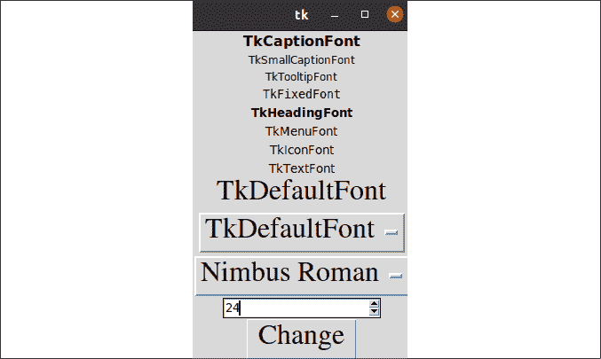
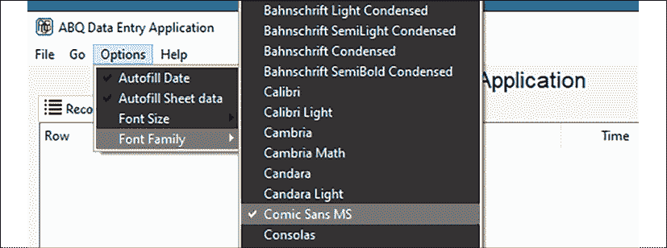
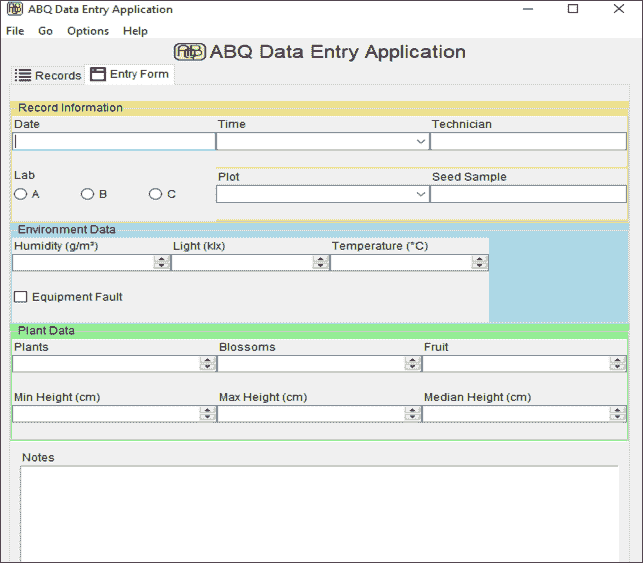
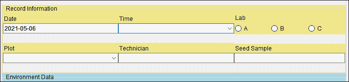
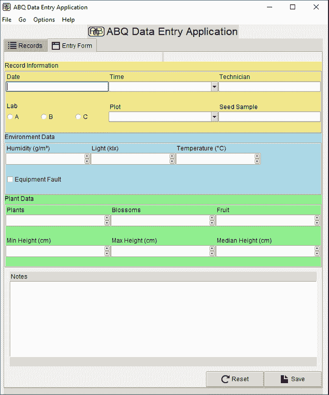

# 通过样式和主题改进外观

虽然程序可以用黑色、白色和灰度的纯文本完美运行，但微妙地使用颜色、字体和图像可以增强甚至最实用应用程序的视觉吸引力和可用性。你的数据录入应用程序也不例外，你同事带来的这一轮请求似乎需要重新调整应用程序的外观和感觉。

具体来说，你被要求解决以下这些点：

+   你的经理已经通知你，ABQ 的公司政策要求在公司内部的所有软件上显示公司标志。你已经提供了一个公司标志图像以包含在应用程序中。

+   数据录入人员在与表单的可读性方面存在一些问题。他们希望表单各部分之间有更多的视觉区分，以及错误消息有更高的可见性。

+   数据录入人员还要求你在会话期间突出显示他们添加或更新的记录，以帮助他们跟踪他们的工作。

除了用户的要求外，你还想通过在按钮和菜单中添加一些图标来使你的应用程序看起来更加专业。

在本章中，我们将学习 Tkinter 的一些功能，这些功能将帮助我们解决这些问题：

+   在 *在 Tkinter 中处理图像* 中，我们将学习如何将图片和图标添加到我们的 Tkinter GUI 中。

+   在 *Tkinter 小部件样式化* 中，我们将学习如何调整 Tkinter 小部件的颜色和视觉样式，无论是直接调整还是使用标签。

+   在 *在 Tkinter 中处理字体* 中，我们将学习 Tkinter 中字体使用的细节。

+   在 *样式化 Ttk 小部件* 中，我们将学习如何使用样式和主题调整 Ttk 小部件的外观。

# 在 Tkinter 中处理图像

为了解决公司标志问题并使我们的应用程序看起来更加美观，我们需要了解如何在 Tkinter 中处理图像。Tkinter 通过两个类提供对图像文件的访问：`PhotoImage` 类和 `BitmapImage` 类。让我们看看这些类如何帮助我们向应用程序添加图形。

## Tkinter PhotoImage

许多 Tkinter 小部件，包括 `Label` 和 `Button`，都接受一个 `image` 参数，允许我们在小部件上显示图像。这个参数要求我们创建并传递一个 `PhotoImage`（或 `BitmapImage`）对象。

创建 `PhotoImage` 对象相对简单：

```py
myimage = tk.PhotoImage(file='my_image.png') 
```

`PhotoImage` 通常使用关键字参数 `file` 调用，该参数指向一个文件路径。或者，你可以使用 `data` 参数指向一个包含图像数据的 `bytes` 对象。在两种情况下，生成的对象现在都可以在任何接受 `image` 参数的地方使用，例如在 `Label` 小部件中：

```py
mylabel = tk.Label(root, image=myimage) 
```

注意，如果我们向 `Label` 初始化器传递了 `image` 和 `text` 参数，默认情况下只会显示图像。要显示两者，我们还需要为 `compound` 参数提供一个值，该参数决定了图像和文本相对于彼此的排列方式。例如：

```py
mylabel_1 = tk.Label(root, text='Banana', image=myimage)
mylabel_2 = tk.Label(
  root,
  text='Plantain',
  image=myimage,
  compound=tk.LEFT
) 
```

在这种情况下，第一个标签只会显示 `image`；`text` 不会显示。在第二个中，由于我们指定了 `compound` 值为 `tk.LEFT`，`image` 将显示在 `text` 的左侧。`compound` 可以是 `LEFT`、`RIGHT`、`BOTTOM` 或 `TOP`（小写字符串或 Tkinter 常量），它表示图像相对于文本的位置。

### PhotoImage 和变量作用域

当使用 `PhotoImage` 对象时，必须记住你的应用程序必须保留对将保持作用域的对象的引用，直到图像显示完毕；否则，图像将不会显示。为了理解这意味着什么，请考虑以下示例：

```py
# image_scope_demo.py
import tkinter as tk
class App(tk.Tk):
  def __init__(self):
    super().__init__()
    smile = tk.PhotoImage(file='smile.gif')
    tk.Label(self, image=smile).pack()
App().mainloop() 
```

如果你运行这个示例，你会注意到没有图像被显示。这是因为持有 `PhotoImage` 对象的变量 `smile` 是一个局部变量，因此一旦初始化器返回，它就会被销毁。由于没有对 `PhotoImage` 对象的引用，它被丢弃，图像消失，即使我们已经将它打包到布局中。

让我们通过进行简单的更改来修复我们的脚本：

```py
 def __init__(self):
    super().__init__()
    self.smile = tk.PhotoImage(file='smile.gif')
    tk.Label(self, image=self.smile).pack() 
```

在这种情况下，我们将 `PhotoImage` 对象存储在一个实例变量 `self.smile` 中。实例变量会持续存在，直到对象本身被销毁，因此图片会留在屏幕上。

## 使用 Pillow 扩展图像支持

Tkinter 的图像支持仅限于 GIF、PGM、PPM 和 PNG 文件。如果你只是将标志和图标添加到 GUI 中，这些格式可能足够了，但对于需要更多图形的场景，缺少像 JPEG、SVG 和 WebP 这样的常见格式变得相当受限。如果你需要支持这些格式中的任何一种，你可以使用 `Pillow` 库。

`Pillow` 不是标准库的一部分，也不是大多数 Python 发行版的一部分。要安装它，请遵循 [`python-pillow.org`](https://python-pillow.org/) 上的说明；尽管在大多数情况下，你只需在终端中输入以下内容即可：

```py
$ pip install -U pillow 
```

这将使用 **Python 包索引**（**PyPI**）安装 `Pillow`。Pillow 为我们提供了一个名为 `ImageTk` 的类，我们可以使用它从广泛的各种图像文件格式创建 `PhotoImage` 对象。为了了解它是如何工作的，让我们构建一个带有过滤器的基于 Tkinter 的小型图像查看器。

打开一个名为 `image_viewer_demo.py` 的新文件，并从以下代码开始：

```py
# image_viewer_demo.py
import tkinter as tk
from tkinter import ttk
from tkinter import filedialog
from PIL import Image, ImageTk, ImageFilter 
```

注意，`Pillow` 被导入为 `PIL`。实际上，Pillow 是一个已停止的项目 `PIL`（Python Imaging Library）的分支。为了向后兼容，它继续使用 `PIL` 模块名称。我们从 `PIL` 导入 `Image` 类，用于加载图像；`ImageTk` 类，用于将 Pillow `Image` 对象转换为 Tkinter 可用；以及 `ImageFilter`，它将为我们提供一些用于转换图像的过滤器。

接下来，让我们为这个应用程序创建主应用程序类 `PictureViewer`：

```py
class PictureViewer(tk.Tk):
  def __init__(self, *args, **kwargs):
    super().__init__(*args, **kwargs)
    self.title('My Image Viewer')
    self.geometry('800x600')
    self.rowconfigure(0, weight=1)
    self.columnconfigure(0, weight=1) 
```

此类首先继承自`Tk`，就像我们在 ABQ 应用程序中所做的那样，初始化器从一些基本的窗口和网格布局配置开始。接下来，我们将创建 GUI 元素，如下所示：

```py
 self.image_display = ttk.Label(self)
    self.image_display.grid(columnspan=3)
    ttk.Button(
      self, text='Select image', command=self._choose_file
    ).grid(row=1, column=0, sticky='w') 
```

到目前为止，我们只有一个用于显示图像的`Label`小部件和一个绑定到实例方法`self._choose_file()`的`Button`小部件。让我们创建这个方法，如下所示：

```py
 def _choose_file(self):
    filename = filedialog.askopenfilename(
      filetypes=(
        ('JPEG files', '*.jpg *.jpeg *.JPG *.JPEG'),
        ('PNG files', '*.png *.PNG'),
        ('All files', '*.*')
      ))
    if filename:
      self.image = Image.open(filename)
      self.photoimage = ImageTk.PhotoImage(self.image)
      self.image_display.config(image=self.photoimage) 
```

此方法首先使用我们在第七章中学习的`filedialog.askopenfilename()`方法请求用户输入文件名，*创建菜单和 Tkinter 对话框*。如果用户选择了一个文件，我们调用`Image.open()`方法从文件创建一个 Pillow `Image`对象。`Image.open()`是一个便利方法，它只需一个文件名或路径，就返回一个包含该文件图像数据的`Image`对象。接下来，我们通过将`Image`对象传递给`ImageTk.PhotoImage()`创建一个 Tkinter `PhotoImage`对象。最后，我们使用新的`PhotoImage`对象更新我们的`image_display`小部件。

使用这种方法，你可以在 Tkinter 中显示更广泛的各种图像格式——Pillow 对超过 40 种不同的格式提供了完整的读取支持！然而，Pillow 提供的不仅仅是图像格式转换。我们还可以用它以各种方式编辑或转换我们的图像。例如，我们可以将过滤应用于我们的 Pillow `Image`对象。让我们将此功能添加到演示应用程序中。

在`PictureViewer.__init__()`中向上回溯，添加以下 GUI 代码：

```py
 self.filtervar = tk.StringVar()
    filters =[
      'None', 'BLUR', 'CONTOUR', 'DETAIL', 'EDGE_ENHANCE',
      'EDGE_ENHANCE_MORE', 'EMBOSS', 'FIND_EDGES',
      'SHARPEN', 'SMOOTH', 'SMOOTH_MORE'
    ]
    ttk.Label(self, text='Filter: ').grid(
      row=1, column=1, sticky='e'
    )
    ttk.OptionMenu(
      self, self.filtervar, 'None', *filters
    ).grid(row=1, column=2)
    self.filtervar.trace_add('write', self._apply_filter) 
```

`filters`列表包含所有可以应用于`Image`对象的 Pillow 提供的过滤器对象的名称（这些可以在`Pillow`文档中找到）。我们将所有这些添加到`OptionMenu`中，以及字符串`None`。然后，我们将`OptionMenu`小部件绑定到`filtervar`控制变量，我们在其上添加了一个调用`_apply_filter()`方法的跟踪。

`_apply_filter()`方法如下所示：

```py
 def _apply_filter(self, *_):
    filter_name = self.filtervar.get()
    if filter_name == 'None':
      self.filtered_image = self.image
    else:
      filter_object = getattr(ImageFilter, filter_name)
      self.filtered_image = self.image.filter(filter_object)
    self.photoimage = ImageTk.PhotoImage(self.filtered_image)
    self.image_display.config(image=self.photoimage) 
```

首先，这种方法从控制变量中检索过滤器名称。如果它是`None`，我们将`self.filtered_image`设置为当前的`self.image`对象。否则，我们使用`getattr()`从`ImageFilter`模块检索过滤器对象，并使用其`filter()`方法将过滤器应用于我们的 Pillow `Image`对象。

最后，我们通过创建一个新的`PhotoImage`对象并更新`Label`小部件的配置来更新应用程序中显示的图像。

要查看此程序的实际运行效果，将最后两行添加到脚本中：

```py
app = PictureViewer()
app.mainloop() 
```

你应该看到类似这样的东西：



图 9.1：图像查看器应用程序，过滤蒙娜丽莎

现在我们已经掌握了在 Tkinter 中使用图像的方法，让我们将此知识应用到 ABQ 数据输入应用程序中。

## 将公司标志添加到 ABQ 数据输入

通过我们对`PhotoImage`的了解，将公司标志添加到我们的程序应该是简单的。我们提供了几个不同尺寸的公司标志 PNG 文件。

你可以将其中一个复制到应用程序根目录，并在`Application`类的初始化器中添加类似的内容：

```py
# application.py, in Application.__init__()
    self.logo = tk.PhotoImage(file='abq_logo_32x20.png')
    ttk.Label(
      self, text="ABQ Data Entry Application",
      font=("TkDefaultFont", 16),
      image=self.logo, compound=tk.LEFT
    ).grid(row=0) 
PhotoImage object from a file path, storing it as an instance variable so it does not go out of scope. Then, we've assigned this object to the image argument of the application's title label, also adding the compound argument so that the image is displayed to the left of the text.
```

如果你从应用程序根目录内的终端运行应用程序，这种方法是可行的。然而，如果你从任何其他目录运行它，图像就不会出现。例如，尝试从包含你的根目录的命令行中这样做：

```py
$ cd ABQ_Data_Entry
$ python3 abq_data_entry.py
# the image will show when you run it this way.
$ cd ..
$ python3 ABQ_Data_Entry/abq_data_entry.py
# the image will not show this way. 
```

为什么会是这种情况，我们能做些什么来解决这个问题？

### 处理图像路径问题

当你只给 Python 一个没有路径的文件名来打开时，它假设文件在**当前工作目录**中。这是用户运行应用程序时的目录。在上面的例子中，当我们第一次运行程序时，我们的工作目录是应用程序的根目录。图像就在那个目录中，所以 Python 找到了它。第二次我们运行它时，我们的工作目录是应用程序根目录的父目录。Python 在*那个*目录中寻找图像，但没有找到。

如果你知道你的文件在系统中的位置，你可以提供一个绝对路径；例如，如果你在 Windows 10 上，应用程序的根目录在你的家目录中，你可以这样做：

```py
 self.logo = tk.PhotoImage(
      file=r'C:\Users\myuser\ABQ_Data_Entry\abq_logo_32x20.png'
    ) 
```

然而，问题在于如果我们把代码放在系统的任何其他地方，这个参考就会失效。记住，我们的应用程序需要在 Linux 和 Windows 上运行，所以提供这样的绝对路径在跨平台上是不可行的。

上面的路径字符串前面的`r`使其成为一个原始字符串。当一个字符串被标记为原始字符串时，Python 不会在字符串中解释反斜杠转义序列。这使得原始字符串在 Windows 上很有用，因为 Windows 使用反斜杠作为路径分隔符。有关解决跨平台路径问题的更多详细信息，请参阅*第十章*，*维护跨平台兼容性*。

一种更稳健的方法是从某个已知点提供一个相对路径。每个 Python 脚本都可以访问一个名为`__file__`的变量，它是一个包含脚本文件路径的字符串。我们可以使用这个变量结合`pathlib`模块来定位应用程序根目录内的文件。

例如，我们可以这样重写我们的`PhotoImage`对象的配置：

```py
 self.logo = tk.PhotoImage(
      Path(__file__).parent.parent / 'abq_logo_32x20.png'
    ) 
```

由于我们处于`application.py`中，`__file__`指向`ABQ_Data_Entry/abq_data_entry/application.py`。我们可以使用这个参考点来找到父父目录，其中包含图像文件。这将使 Python 无论当前工作目录是什么都能成功找到图像。

这种方法在功能上是可接受的，但是每次我们需要访问图像文件时，进行这类路径操作会显得相当杂乱和笨拙。让我们运用我们在*第六章*，*为应用程序的扩展规划*中学到的一些组织技巧，将图像放入它们自己的模块中。

在`abq_data_entry`目录下创建一个新的目录，命名为`images`，并在其中放置一个适合我们应用程序使用的 PNG 文件（示例代码中的图像具有 8x5 的宽高比，因此在这种情况下，我们使用 32x20）。

接下来，在`images`文件夹内创建一个`__init__.py`文件，我们将添加以下代码：

```py
# images/__init__.py
from pathlib import Path
IMAGE_DIRECTORY = Path(__file__).parent
ABQ_LOGO_16 = IMAGE_DIRECTORY / 'abq_logo-16x10.png'
ABQ_LOGO_32 = IMAGE_DIRECTORY / 'abq_logo-32x20.png'
ABQ_LOGO_64 = IMAGE_DIRECTORY / 'abq_logo-64x40.png' 
```

在这种情况下，`__file__`指向`ABQ_Data_Entry/abq_data_entry/images/__init__.py`，因此我们可以使用这个参考点来获取我们放在`ABQ_Data_Entry/abq_data_entry/images/`中的所有图像文件的路径。

现在，我们的`application.py`模块可以像这样导入`images`模块：

```py
# application.py, at the top
from . import images 
```

一旦导入，我们可以轻松地引用`PhotoImage`对象的图像路径：

```py
# application.py, inside Application.__init__()
    self.logo = tk.PhotoImage(file=images.ABQ_LOGO_32)
    ttk.Label(
      self, text="ABQ Data Entry Application",
      font=("TkDefaultFont", 16),
      image=self.logo, compound=tk.LEFT
    ).grid(row=0) 
```

现在，无论您从哪个工作目录运行脚本，您都应该看到标题看起来像这样：



图 9.2：带有公司标志的 ABQ 数据输入应用程序

## 设置窗口图标

目前，我们应用程序的窗口图标（在窗口装饰和操作系统的任务栏中显示的图标）是 Tkinter 标志，这是任何 Tkinter 应用程序的默认设置。对我们来说，使用公司标志图像作为这个图标更有意义。我们如何实现这一点呢？

作为`Tk`的子类，我们的`Application`对象有一个名为`iconphoto()`的方法，它应该根据图标文件的路径设置窗口图标。不幸的是，这个方法在不同平台上的结果有些不一致。让我们继续将其添加到初始化器中，看看会发生什么。在调用`super().__init__()`之后添加此代码：

```py
# application.py, inside Application.__init__()
    self.taskbar_icon = tk.PhotoImage(file=images.ABQ_LOGO_64)
    self.iconphoto(True, self.taskbar_icon) 
```

第一行创建了一个新的`PhotoImage`对象，引用了标志的较大版本。接下来，我们执行`self.iconphoto()`。第一个参数指示我们是否希望这个图标在所有新窗口中都是默认的，或者它只是针对这个窗口。在这里传递`True`使其对所有窗口都是默认的。第二个参数是我们的`PhotoImage`对象。

现在，当您运行应用程序时，您应该看到 ABQ 图标被用作窗口图标；它如何使用取决于平台。例如，在 Windows 上，它出现在窗口装饰中，如下所示：


图 9.3：ABQ 标志作为任务栏图标

下面是`iconphoto`在不同平台上使用的总结：

+   在 Linux 上，它将取决于您的桌面环境，但通常，它将在任务栏或坞站以及窗口装饰中出现

+   在 macOS 上，它将作为坞站图标出现，但不会在全局菜单或窗口本身上显示

+   在 Windows 10 上，它将出现在窗口装饰中，但不会出现在任务栏上

造成这种不一致的部分原因是我们应用程序是一个由 Python 执行的脚本，从操作系统的角度来看，我们正在运行的程序不是 ABQ 数据输入，而是 Python。因此，您可能会在您的平台上看到 Python 标志而不是 ABQ 标志。我们将在第十六章*使用 setuptools 和 cxFreeze 打包*中进一步解决这个问题。

## 为按钮和菜单添加图标

虽然用户或公司不需要，但您觉得在按钮和菜单项的文本旁边添加一些简单的图标可以使您的应用程序看起来更令人印象深刻。不幸的是，Tkinter 没有提供任何图标主题，也无法访问操作系统的内置图标主题。因此，为了使用图标，我们首先需要获取一些 PNG 或 GIF 图像来使用。这些可以从网上多个来源获取，或者当然，您也可以自己创建。

示例代码附带了一些来自**Open-Iconic**项目的图标，该项目提供了一组在 MIT 许可下发布的标准应用程序图标。您可以在[`useiconic.com/open`](https://useiconic.com/open)找到这个项目。

假设您已经获取了一些图标文件，让我们将它们添加到`images`文件夹中，然后按以下方式更新`images/__init__.py`：

```py
SAVE_ICON = IMAGE_DIRECTORY / 'file-2x.png'
RESET_ICON = IMAGE_DIRECTORY / 'reload-2x.png'
LIST_ICON = IMAGE_DIRECTORY / 'list-2x.png'
FORM_ICON = IMAGE_DIRECTORY / 'browser-2x.png' 
```

在这里，我们为**保存**和**重置**按钮添加了图像，以及代表 GUI 的记录列表和数据输入表部分的图像。我们现在可以开始将这些添加到我们的应用程序中；例如，让我们将它们添加到`DataRecordForm`框架中的按钮上。首先，将`images`导入到`views.py`中，如下所示：

```py
# views.py, at the top
from . import images 
```

现在，在初始化器中，让我们用图像图标更新`DataRecordForm`中的按钮：

```py
# views.py, inside DataRecordForm.__init__()
    **self.save_button_logo = tk.PhotoImage(file=images.SAVE_ICON)**
    self.savebutton = ttk.Button(
      buttons, text="Save", command=self._on_save,
      **image=self.save_button_logo, compound=tk.LEFT**
    )
    #...
    **self.reset_button_logo = tk.PhotoImage(file=images.RESET_ICON)**
    self.resetbutton = ttk.Button(
      buttons, text="Reset", command=self.reset,
      **image=self.reset_button_logo, compound=tk.LEFT**
    ) 
```

现在，表单应该看起来像这样：


图 9.4：现在带有图标的记录表单中的按钮

记住我们还可以将图像添加到`Notebook`小部件的标签页上。回到`application.py`，找到在`__init__()`中创建笔记本标签的代码，并按以下方式更新它：

```py
# application.py, inside Application.__init__()
    **self.recordform_icon = tk.PhotoImage(file=images.FORM_ICON)**
    self.recordform = v.DataRecordForm(
      self, self.model, self.settings
    )
    self.notebook.add(
      self.recordform, text='Entry Form',
      **image=self.recordform_icon, compound=tk.LEFT**
    )
    #...
    **self.recordlist_icon = tk.PhotoImage(file=images.LIST_ICON)**
    self.recordlist = v.RecordList(self)
    self.notebook.insert(
      0, self.recordlist, text='Records',
      **image=self.recordlist_icon, compound=tk.LEFT**
    ) 
```

这就像在笔记本的`add()`和`insert()`方法调用中添加一个`image`参数一样简单。与按钮和标签一样，务必包含`compound`参数，否则只会显示图标。现在，当我们运行应用程序时，标签应该看起来像这样：


图 9.5：带有图标的笔记本标签

如您所见，使用图标的流程相当一致：

1.  创建一个`PhotoImage`对象，确保对其的引用将保持作用域。

1.  将对象传递给您希望它显示的小部件的`image`参数。

1.  将小部件的`compound`参数传递给指定将显示文本和图像的小部件的布局。

而不是为每个图标创建一个单独的类属性，你可能发现将它们存储在字典对象中更有效率。例如，我们应在`MainMenu`类中这样做，因为我们需要很多图标。将`images`导入到`mainmenu.py`中，就像你在其他两个文件中所做的那样，并在`MainMenu`中创建一个新的`_create_icons()`实例方法，如下所示：

```py
# mainmenu.py, in the MainMenu class
  def _create_icons(self):
    self.icons = {
      'file_open': tk.PhotoImage(file=images.SAVE_ICON),
      'record_list': tk.PhotoImage(file=images.LIST_ICON),
      'new_record': tk.PhotoImage(file=images.FORM_ICON),
    } 
```

在这里，我们使用实例方法创建一个`PhotoImage`对象的字典，并将其存储为实例属性`self.icons`。你可能想知道为什么我们不创建`MainMenu.icons`作为类属性，类似于我们为模型创建的`fields`字典。

原因是`PhotoImage`对象，就像所有 Tkinter 对象一样，必须在创建`Tk`实例（在我们的案例中是`Application`对象）之后才能创建。

类定义以及因此类属性，在 Python 开始执行主执行线程之前由 Python 执行，所以在定义此类时，将不存在`Application`对象。

我们可以在初始化器内部调用此方法，以确保在定义菜单之前`self.icons`已被填充；添加如下代码：

```py
# mainmenu.py, inside the MainMenu class
  def __init__(self, parent, settings, **kwargs):
    super().__init__(parent, **kwargs)
    self.settings = settings
    **self._create_icons()** 
```

现在，每个菜单项都可以通过字典访问其`PhotoImage`对象，如下所示：

```py
# mainmenu.py, inside MainMenu.__init__()
    file_menu.add_command(
      label="Select file…", command=self._event('<<FileSelect>>'),
      **image=self.icons['file_open'], compound=tk.LEFT**
    )
    #...
    go_menu.add_command(
      label="Record List", command=self._event('<<ShowRecordlist>>'),
      **image=self.icons['record_list'], compound=tk.LEFT**
    )
    go_menu.add_command(
      label="New Record", command=self._event('<<NewRecord>>'),
      **image=self.icons['new_record'], compound=tk.LEFT**
    ) 
```

现在，我们的菜单展示了一些看起来专业的图标，如图所示：


图 9.6：带有一些精美图标的“前往”菜单

### 使用 BitmapImage

使用`PhotoImage`与 PNG 文件配合已经足够满足我们的应用需求，但 Tkinter 中还有另一个值得提及的图像选项：`BitmapImage`。`BitmapImage`对象与`PhotoImage`类似，但仅限于与**XBM**（X11 位图）文件协同工作。这是一个非常古老的图像格式，仅允许单色图像。尽管是单色的，XBM 图像并未压缩，因此其大小并不小于同等大小的 PNG 文件。`BitmapImage`对象的唯一真正优势在于，我们可以告诉 Tkinter 以我们想要的任何颜色渲染它。

要了解这是如何工作的，让我们在我们的`images`模块中添加一些 XBM 文件；复制一些 XBM 文件，然后像这样将它们添加到`__init__.py`中：

```py
QUIT_BMP = IMAGE_DIRECTORY / 'x-2x.xbm'
ABOUT_BMP = IMAGE_DIRECTORY / 'question-mark-2x.xbm' 
```

样本代码中包含了一些 XBM 文件；或者，你可以使用像 GNU Image Manipulation Program（[`www.gimp.org`](https://www.gimp.org)）这样的图像编辑软件将你的图像文件转换为 XBM。

现在，回到`mainmenu.py`，让我们将它们添加到我们的`icons`字典中，如下所示：

```py
# mainmenu.py, in MainMenu._create_icons()
    self.icons = {
      #...
      **'quit': tk.BitmapImage(**
        **file=images.QUIT_BMP, foreground='red'**
      **),**
      **'about': tk.BitmapImage(**
        **file=images.ABOUT_BMP,**
        **foreground='#CC0', background='#A09'**
      **)**
    } 
```

如你所见，创建`BitmapImage`与创建`PhotoImage`对象相同，但可以指定图像的`前景色`和`背景色`。一旦创建，将它们添加到菜单项的操作与使用`PhotoImage`相同，如下所示：

```py
# mainmenu.py, inside MainMenu.__init__()
    help_menu.add_command(
      label='About…', command=self.show_about,
      **image=self.icons['about'], compound=tk.LEFT**
    )
    #...
    file_menu.add_command(
      label="Quit", command=self._event('<<FileQuit>>'),
      **image=self.icons['quit'], compound=tk.LEFT**
    ) 
```

现在，**帮助**菜单应该有一个彩色的图标，如图所示：


图 9.7：现在彩色的关于图标

如果你希望重复使用单个文件但具有不同的颜色，或者可能需要动态更改图标颜色方案以适应主题或指示某种状态，那么`BitmapImage`对象可能会很有用。不过，大多数情况下，使用`PhotoImage`对象会更合适。

这些图像极大地改变了我们应用程序的外观，但其余部分仍然是相当单调的灰色。在接下来的几节中，我们将着手更新其颜色。

# Tkinter 小部件样式

Tkinter 本质上有两个样式系统：旧的 Tkinter 小部件系统和较新的 Ttk 系统。尽管我们尽可能使用 Ttk 小部件，但仍然有一些情况下需要使用常规的 Tkinter 小部件，因此了解这两个系统都是好的。让我们首先看看较旧的 Tkinter 系统，并给我们的应用程序中的 Tkinter 小部件应用一些样式。

## 小部件颜色属性

如你在*第一章*，*Tkinter 简介*中看到的，基本的 Tkinter 小部件允许你更改两个颜色值：前景色，主要指文本和边框的颜色，以及背景色，指小部件的其余部分。这些可以通过`foreground`和`background`参数，或它们的别名`fg`和`bg`来设置。

例如，我们可以这样设置标签的颜色：

```py
# tkinter_color_demo.py
import tkinter as tk
l = tk.Label(text='Hot Dog Stand!', fg='yellow', bg='red') 
```

颜色的值可以是颜色名称字符串或 CSS 风格的 RGB 十六进制字符串。

例如，以下代码会产生相同的效果：

```py
l2 = tk.Label(
  text='Also Hot Dog Stand!',
  foreground='#FFFF00',
  background='#FF0000'
) 
```

Tkinter 识别了超过 700 种命名颜色，大致对应于 Linux 和 Unix 上使用的 X11 显示服务器所识别的颜色，或者网络设计师使用的 CSS 命名颜色。完整的列表，请参阅[`www.tcl.tk/man/tcl8.6/TkCmd/colors.htm`](https://www.tcl.tk/man/tcl8.6/TkCmd/colors.htm)。

### 在 MainMenu 上使用小部件属性

在我们的视图中，我们并没有使用很多 Tkinter 小部件，尽可能多地使用 Ttk。我们确实使用 Tkinter 小部件的一个地方是应用程序的主菜单。我们可以使用主菜单来演示如何配置 Tkinter 小部件的颜色。

注意，在菜单系统上设置颜色和其他外观选项仅在 Linux 或 BSD 上**一致**地工作。在 Windows 或 macOS 上的效果不完整，因此那些平台上的读者可能会看到不完整的结果。在*第十章*，*维护跨平台兼容性*中，我们将重新设计我们的菜单，以便考虑到这些兼容性差异。

`tk.Menu`小部件接受以下与外观相关的参数：

| 参数 | 值 | 描述 |
| --- | --- | --- |
| `background` | 颜色字符串 | 正常条件下的背景色 |
| `foreground` | 颜色字符串 | 正常条件下的前景色（文本）颜色 |
| `borderwidth` | 整数 | 正常条件下的小部件边框宽度，以像素为单位 |
| `activebackground` | 颜色字符串 | 当小部件处于活动状态（被悬停或通过键盘选中）时的背景色 |
| `activeforeground` | 颜色字符串 | 当 widget 处于活动状态时的前景（文字）颜色 |
| `activeborderwidth` | 整数 | 当 widget 处于活动状态时，边框的宽度，以像素为单位 |
| `disabledforeground` | 颜色字符串 | 当 widget 被禁用时的前景（文字）颜色 |
| `relief` | Tkinter 常量之一`RAISED`、`SUNKEN`、`FLAT`、`RIDGE`、`SOLID`或`GROOVE` | 绘制在 widget 周围的边框样式 |

注意，对于正常和活动状态，以及禁用状态，都有`background`、`foreground`和`borderwidth`的版本，还有一个用于禁用状态的`foreground`版本。根据 widget 适用的内容，许多 Tkinter widget 支持某些状态、条件或功能的额外参数；例如，具有可选文本的 widget，如`Entry` widget，支持`highlightbackground`和`highlightforeground`参数来指定文本被选中时使用的颜色。

Tcl/Tk 文档在[`www.tcl.tk/man/`](https://www.tcl.tk/man/)提供了关于 widget 特定选项的最完整参考，包括样式选项。

打开`mainmenu.py`文件，让我们在初始化方法中为我们的菜单添加一些样式：

```py
# mainmenu.py, inside MainMenu.__init__()
    self.configure(
      background='#333',
      foreground='white',
      activebackground='#777',
      activeforeground='white',
      'relief'=tk.GROOVE
    ) 
```

运行应用程序，并注意菜单的外观。在 Linux 或 BSD 上，它应该看起来像这样：



图 9.8：在 Ubuntu Linux 上的样式化 Tkinter 菜单

注意，样式不会超出主菜单；子菜单仍然是默认的灰色背景黑色文字。为了使菜单保持一致，我们需要将这些样式应用到所有子菜单上。为了避免重复，让我们修改我们的代码，将样式存储在字典中，然后我们可以在每次调用`tk.Menu`时解包这些样式。按照以下方式更新代码：

```py
# mainmenu.py, inside MainMenu.__init__()
    self.styles = {
      'background': '#333',
      'foreground': 'white',
      'activebackground': '#777',
      'activeforeground': 'white',
      'relief': tk.GROOVE
    }
    self.configure(**self.styles) 
```

现在，为了将样式添加到每个子菜单，我们只需要在每个子菜单初始化时添加`**self.styles**`，如下所示：

```py
# mainmenu.py, inside MainMenu.__init__()
    help_menu = tk.Menu(self, tearoff=False, ****self.styles**)
    #...
    file_menu = tk.Menu(self, tearoff=False, ****self.styles**)
    #...
    options_menu = tk.Menu(self, tearoff=False, ****self.styles**)
    #...
    go_menu = tk.Menu(self, tearoff=False, ****self.styles**) 
```

假设你的平台支持菜单样式，你现在应该看到子菜单上也应用了样式。

## 使用标签对 widget 内容进行样式设置

对于像按钮和标签这样的简单小部件，前景色和背景色就足够了，但对于更复杂的 Tkinter 小部件，如`Text`小部件或 Ttk `Treeview`小部件，它们依赖于基于**标签**的系统来进行更详细的样式设置。在 Tkinter 中，**标签**是 widget 内容的一个命名区域，可以将颜色和字体设置应用于该区域。为了了解这是如何工作的，让我们构建一个粗糙但相当漂亮的 Python 终端模拟器。

打开一个名为`tags_demo.py`的新文件，我们首先创建一个`Text`小部件来存储终端的输入和输出：

```py
# tags_demo.py
import tkinter as tk
text = tk.Text(width=50, height=20, bg='black', fg='lightgreen')
text.pack() 
```

在这里，我们使用了`fg`和`bg`参数来设置绿色背景黑色文字的终端主题，这是程序员中流行的经典组合。然而，我们不想只有绿色文字，让我们为我们的提示符和解释器输出配置不同的颜色。

要做到这一点，我们需要定义一些标签：

```py
text.tag_configure('prompt', foreground='magenta')
text.tag_configure('output', foreground='yellow') 
```

`tag_configure()`方法允许我们在`Text`小部件上声明和配置标记。我们创建了一个名为`prompt`的标记，用于外壳提示的洋红色文本，另一个名为`output`的标记，用于 Python 输出的黄色文本。注意，我们在这里并不限于单个配置参数；如果我们愿意，我们可以传递`font`或`background`参数。

要插入应用了给定标记的文本，我们执行以下操作：

```py
text.insert('end', '>>> ', ('prompt',)) 
```

如您所记得，`Text.insert()`方法接受索引和字符串作为其前两个参数。注意第三个参数：这是我们想要标记插入文本的标记的元组。这个值必须是一个元组，即使你只使用一个标记；当然，你可以包括你想要的任意多个标记。

如果你将`text.mainloop()`添加到代码末尾并运行它，你会看到我们有一个黑色文本输入窗口和一个洋红色提示符；然而，如果你输入任何内容，你的文本将以绿色显示（小部件的默认前景色）。到目前为止，一切顺利；现在，让我们让它执行一些 Python 代码。

在调用`mainloop()`之前创建一个函数：

```py
def on_return(*args):
  cmd = text.get('prompt.last', 'end').strip() 
```

回想一下，当我们从`Text`小部件检索文本时，我们必须为要检索的文本提供起始和结束索引。我们可以像这里这样在我们的索引值中使用标记名称：`prompt.last`告诉 Tkinter 从标记为`prompt`的区域结束之后开始检索文本。

接下来，让我们执行输入的命令：

```py
 if cmd:
    try:
      output = str(eval(cmd))
    except Exception as e:
      output = str(e) 
```

如果`cmd`变量实际上包含任何内容，我们将尝试使用`eval()`执行它，然后将响应值的字符串存储为输出。如果引发异常，我们将异常转换为字符串并将其设置为输出。

注意，`eval()`只对表达式有效，所以我们的“外壳”无法处理循环、条件或其他语句。

然后，我们将像这样显示我们的输出：

```py
 # (still in the if block)
    text.insert('end', '\n' + output, ('output',)) 
```

在这里，我们插入我们的`output`字符串，前面带有换行符并标记为`output`。

我们将通过给用户返回一个提示符来完成函数：

```py
 text.insert('end', '\n>>> ', ('prompt',))
  return 'break' 
```

注意，我们在这里也返回了字符串`break`。这告诉 Tkinter 忽略触发回调的原始事件。由于我们将从 Return/Enter 键盘中触发，我们希望在完成之后忽略该键盘中断。如果不这样做，键盘中断将在我们的函数返回后执行，在提示符显示后插入换行符，并使用户停留在提示符下的行。

最后，我们需要将我们的函数绑定到 Return 键：

```py
text.bind('<Return>', on_return) 
```

注意，Enter/Return 键的事件始终是`<Return>`，即使在非 Apple 硬件上（那里的键通常标记为“Enter”）。

确保在脚本末尾添加对`text.mainloop()`的调用，然后启动应用程序。你应该会得到类似以下内容：



图 9.9：多彩的 Python 外壳

虽然这个外壳不会很快取代 IDLE，但它看起来相当不错，不是吗？

### 使用标签对记录列表进行样式化

虽然`Treeview`是一个 Ttk 小部件，但它使用标签来控制单个行的样式。我们可以利用这一功能来满足您从数据录入人员那里收到的另一个请求——具体来说，他们希望记录列表能够突出显示当前会话中更新和插入的记录。

我们首先需要让我们的`RecordList`对象跟踪会话期间哪些行已被更新或插入。

我们将从`RecordList.__init__()`开始，创建一些实例变量来存储会话期间更新或插入的行：

```py
# views.py, inside RecordList.__init__()
    super().__init__(parent, *args, **kwargs)
    **self._inserted = list()**
    **self._updated = list()** 
```

当记录被插入或更新时，我们需要将其行号追加到相应的列表中。由于`RecordList`不知道何时更新或插入记录，我们需要创建一些公共方法，供`Application`对象调用以追加到列表中。在`RecordList`类中创建这两个方法：

```py
# views.py, inside RecordList
  def add_updated_row(self, row):
    if row not in self._updated:
      self._updated.append(row)
  def add_inserted_row(self, row):
    if row not in self._inserted:
      self._inserted.append(row) 
```

每个方法都接受一个行号并将其追加到相应的列表中。为了避免重复，我们只有在行不在列表中时才这样做。现在，为了使用这些方法，我们需要更新`Application._on_save()`方法，使其在记录保存后、重新填充记录列表之前调用适当的更新方法。

在`_on_save()`中，在调用`self.model.save_record()`之后，添加以下行：

```py
# application.py, in Application._on_save()
    if rownum is not None:
      self.recordlist.add_updated_row(rownum) 
```

更新操作有一个`rownum`值，该值不为`None`，但可能是`0`，因此我们在这里明确检查`None`，而不是仅仅使用`if rownum:`。如果`rownum`不为`None`，我们将将其追加到更新列表中。

现在，我们需要处理插入操作：

```py
 else:
      rownum = len(self.model.get_all_records()) -1
      self.recordlist.add_inserted_row(rownum) 
```

插入的记录稍微麻烦一些，因为我们没有现成的行号来记录。不过，我们知道插入的记录总是追加到文件的末尾，因此其行号应该比文件中的行数少一。

我们插入和更新的记录将保留到程序会话结束（当用户退出程序）或直到用户选择一个新的文件来工作。如果用户选择了一个新的文件，我们需要清除列表，因为我们正在处理一组全新的记录。

再次强调，由于`RecordList`不知道何时发生这种情况，我们需要创建一个公共方法来清除列表。将以下`clear_tags()`方法添加到`RecordList`类中：

```py
# views.py, inside RecordList
  def clear_tags(self):
    self._inserted.clear()
    self._updated.clear() 
```

现在，我们需要在`Application`类中选择保存新文件时调用此方法，这发生在`Application._on_file_select()`中。在重新填充记录列表之前，添加对方法的调用：

```py
# application.py inside Application._on_file_select()
    if filename:
      self.model = m.CSVModel(filename=filename)
      **self.recordlist.clear_tags()**
      self._populate_recordlist() 
```

现在我们已经正确更新了这些列表，我们需要使用它们来为列表项着色。

要做到这一点，我们首先需要配置带有适当颜色的标签。我们的数据录入人员认为，浅绿色是插入记录的合理颜色，浅蓝色是更新记录的颜色。

在`RecordList.__init__()`的末尾添加以下代码：

```py
# views.py, inside RecordList.__init__()    
    self.treeview.tag_configure(
      'inserted', background='lightgreen'

    self.treeview.tag_configure('updated', background='lightblue') 
```

正如我们在之前的`Text`小部件中所做的那样，我们调用`TreeView`对象的`tag_configure()`方法来将`background`颜色设置与我们的标签名称连接起来。为了将标签添加到我们的`TreeView`行中，我们需要更新`populate()`方法，以便在插入行时，添加适当的标签（如果有的话）。

在`populate()`方法的`for`循环中，在插入行之前，我们将添加以下代码：

```py
# views.py, inside RecordList.populate()
    for rownum, rowdata in enumerate(rows):
      values = [rowdata[cid] for cid in cids]
      if rownum in self._inserted:
        tag = 'inserted'
      elif rownum in self._updated:
        tag = 'updated'
      else:
        tag = '' 
```

现在，我们的`treeview.insert()`调用只需要修改为这个标签值：

```py
 self.treeview.insert(
        '', 'end', iid=str(rownum),
        text=str(rownum), values=values, **tag=tag**
      ) 
```

运行应用程序并尝试插入和更新一些记录。

你应该得到类似这样的结果：



图 9.10：具有样式行的 treeview。浅蓝色对应于更新的行（行 0）和浅绿色对应于插入的行（行 1）。请注意，深蓝色行只是选中的行（行 2）。

除了`Text`和`Treeview`小部件外，标签也用于 Tkinter 的`Canvas`小部件，我们将在第十五章中了解更多关于它的内容，即《使用 Canvas 小部件可视化数据》。

# 在 Tkinter 中处理字体

一些我们的数据输入用户抱怨应用程序的字体有点太小，难以阅读，但其他人不喜欢你增加它的想法，因为它使得应用程序太大，不适合屏幕。为了满足所有用户的需求，我们可以添加一个配置选项，允许他们设置首选的字体大小和家族。

## 配置 Tkinter 字体

Tkinter 中任何显示文本的小部件都允许我们指定一个字体，通常通过其`font`配置属性。对于支持标签的小部件，我们还可以为每个标签指定字体设置。我们自第一章《Tkinter 简介》以来一直在使用`font`参数，但现在是我们深入探究 Tkinter 允许我们用字体做什么的时候了。

在 Tkinter 中指定小部件字体有三种方式：使用字符串、使用元组和使用`Font`对象。让我们逐一看看。

### 使用字符串和元组配置字体

在 Tkinter 中配置字体的最简单方法是直接使用字体指定字符串：

```py
tk.Label(text="Format with a string", font="Times 20 italic bold") 
```

字符串的格式为`font-family size styles`，其中：

+   `font-family`是字体家族的名称。它只能是一个单词；不允许有空格。

+   `size`是一个描述大小的整数。正整数表示以点为单位的大小，负数表示以像素为单位的大小。不支持浮点值。

+   `styles`可以是任何有效的文本样式关键字组合。

除了字体家族之外，其他都是可选的，尽管如果你想要指定任何样式关键字，你需要指定一个大小。可用于样式的关键字包括：

+   `bold`用于加粗文本，或`normal`用于正常重量

+   `italic`用于斜体文本，或`roman`用于常规斜体

+   `underline`用于下划线文本

+   `overstrike`用于删除线文本

样式关键字的顺序无关紧要，但重量和斜体关键字是互斥的（也就是说，你不能有`bold normal`或`italic roman`）。

虽然字符串方法快速简单，但它有其缺点；首先，它无法处理名称中包含空格的字体，这在现代系统中相当常见。

要处理这样的字体，你可以使用元组格式：

```py
tk.Label(
  text="Tuple font format",
  font=('Noto sans', 15, 'overstrike')
) 
```

此格式与字符串格式完全相同，不同之处在于不同的组件被写成元组中的项。

大小组件可以是一个整数或包含数字的字符串，这取决于值的来源提供了一些灵活性。

### 字体模块

字符串或元组方法在启动时设置少量字体更改时工作良好，但对于需要动态操作字体设置的情况，Tkinter 提供了`font`模块。此模块为我们提供了一些与字体相关的函数以及一个`Font`类，其实例可以分配给小部件并动态更改。

要使用`font`模块，首先必须导入：

```py
from tkinter import font 
```

现在，我们可以创建一个自定义的`Font`对象并将其分配给一些小部件：

```py
labelfont = font.Font(
  family='Courier', size=30,
  weight='bold', slant='roman',
  underline=False, overstrike=False
)
tk.Label(text='Using the Font class', font=labelfont).pack() 
```

如您所见，传递给`Font`初始化参数的值与字符串和元组字体规范中使用的重量和斜体值相对应。`weight`参数还支持使用`font.NORMAL`或`font.BOLD`常量，而`slant`支持使用`font.ITALIC`或`font.ROMAN`。

一旦我们创建了一个`Font`对象并将其分配给一个或多个小部件，我们就可以在运行时动态地更改其某些方面。例如，我们可以创建一个按钮来切换我们字体的`overstrike`属性：

```py
def toggle_overstrike():
  labelfont['overstrike'] = not labelfont['overstrike']
tk.Button(text='Toggle Overstrike', command=toggle_overstrike).pack() 
```

`Font`对象是 Python 对 Tcl/Tk 中称为**命名字体**的功能的接口。在 Tcl/Tk 中，命名字体只是一个与名称相关联的字体属性集合。

`Tk`已经预配置了几个命名的字体，如下表所示：

| 字体名称 | 默认为 | 用于 |
| --- | --- | --- |
| `TkCaptionFont` | 系统标题字体 | 窗口和对话框标题栏 |
| `TkDefaultFont` | 系统默认字体 | 未指定其他项 |
| `TkFixedFont` | 系统固定宽度字体 | `Text`小部件 |
| `TkHeadingFont` | 系统标题字体 | 列表和表中的列标题 |
| `TkIconFont` | 系统图标字体 | 图标标题 |
| `TkMenuFont` | 系统菜单字体 | 菜单标签 |
| `TkSmallCaptionFont` | 系统标题字体 | 子窗口、工具对话框 |
| `TkTextFont` | 系统输入字体 | 输入小部件：`Entry`、`Spinbox`等 |
| `TkTooltipFont` | 系统工具提示字体 | 工具提示 |

`font`模块包含一个名为`names()`的函数，该函数返回系统上当前命名的字体列表，包括您自己创建的字体（通过创建`Font`对象）。我们可以使用`font.nametofont()`函数从一个给定的名称生成一个`Font`对象。

例如，我们可以创建一个小程序来演示 Tkinter 包含的所有命名字体，如下所示：

```py
# named_font_demo.py
import tkinter as tk
from tkinter import font
root = tk.Tk()
for name in font.names():
  font_obj = font.nametofont(name)
  tk.Label(root, text=name, font=font_obj).pack()
root.mainloop() 
```

在此脚本中，我们使用`font.names()`检索所有命名字体的列表，并通过它迭代。对于每个名称，我们使用`font.nametofont()`创建一个`Font`对象，然后创建一个显示命名字体名称并使用`Font`对象作为其字体的标签。

此脚本将显示您的系统上所有内置命名字体的外观。

例如，在 Ubuntu Linux 上，它们看起来像这样：


图 9.11：Ubuntu Linux 上的 Tkinter 命名字体

由于 Tkinter 默认使用其内置的命名字体，我们可以通过为这些默认命名字体创建`Font`对象并覆盖其属性来改变整个应用程序的整体外观。我们做出的更改将应用于所有没有明确字体配置的小部件。

例如，我们可以在前面的脚本中`root.mainloop()`之前添加一些代码，以允许我们自定义内置字体：

```py
# named_font_demo.py
namedfont = tk.StringVar()
family = tk.StringVar()
size = tk.IntVar()
tk.OptionMenu(root, namedfont, *font.names()).pack()
tk.OptionMenu(root, family, *font.families()).pack()
tk.Spinbox(root, textvariable=size, from_=6, to=128).pack()
def setFont():
  font_obj = font.nametofont(namedfont.get())
  font_obj.configure(family=family.get(), size=size.get())
tk.Button(root, text='Change', command=setFont).pack() 
```

在此代码中，我们设置了三个控制变量来保存命名字体名称、字体族和大小值，然后设置了三个小部件来选择它们。第一个`OptionMenu`小部件使用`font.names()`检索所有命名字体的列表，第二个使用`font.families()`函数检索操作系统上可用的字体族列表（在大多数现代系统上这很可能是一个非常长的列表）。然后我们有一个`Spinbox`用于选择字体大小。

回调函数`setFont()`从所选的命名字体创建一个字体对象，然后使用所选的字体族和大小配置它。然后此函数绑定到一个按钮上。

如果现在运行此脚本，您应该能够选择任何命名字体并编辑其字体族和大小。当您点击**更改**时，您应该看到相关的标签根据您的选择而更改。您也可能注意到更改某些命名字体会影响您的`OptionMenu`、`Spinbox`和`Button`小部件。

例如，在 Ubuntu Linux 上，它看起来像这样：



图 9.12：Ubuntu Linux 上的命名字体编辑器

## 在 ABQ 数据输入中为用户提供字体选项

现在我们已经了解了如何在 Tkinter 中处理字体，让我们为用户添加在应用程序中配置字体的能力。我们将允许他们选择一个大小和一个字体族，这些大小和字体族将用于应用程序中显示的所有小部件和数据。

由于用户希望在会话之间持久化此值，我们应该首先在我们的设置模型中添加`font size`（字体大小）和`font family`（字体族）的键。打开`models.py`并将这些添加到`fields`字典中，如下所示：

```py
# models.py, inside SettingsModel
  fields = {
    # ...
    **'font size': {'type': 'int', 'value': 9}**,
    **'font family': {'type': 'str', 'value': ''}**
  } 
```

我们已将大小默认设置为 9 点，但字体族默认设置为空字符串。使用空字符串作为字体族值配置字体将导致 Tkinter 使用其自己的默认字体族。

记住，`Application`对象将读取`fields`字典并为每个设置设置一个控制变量，然后这些控制变量的字典将传递给我们的`MainMenu`对象。因此，我们的下一个任务将是为这些变量的大小和家族值创建菜单项。

打开`mainmenu.py`，让我们首先导入`font`模块：

```py
# mainmenu.py, at the top
from tkinter import font 
```

现在，在`MainMenu`初始化方法内部，让我们为`options_menu`级联创建一些子菜单：

```py
# mainmenu.py, inside MainMenu.__init__(), 
# after creating options_menu
    size_menu = tk.Menu(
      options_menu, tearoff=False, **self.styles
    )
    options_menu.add_cascade(label='Font Size', menu=size_menu)
    for size in range(6, 17, 1):
      size_menu.add_radiobutton(
        label=size, value=size,
        variable=self.settings['font size']
      )
    family_menu = tk.Menu(
      options_menu, tearoff=False, **self.styles
    )
    options_menu.add_cascade(
      label='Font Family', menu=family_menu
    )
    for family in font.families():
      family_menu.add_radiobutton(
        label=family, value=family,
        variable=self.settings['font family']
      ) 
```

这应该看起来很熟悉，因为我们创建了一个几乎相同的字体大小菜单，在*第七章*中学习 Tkinter `Menu`小部件时。我们允许从 6 到 16 的字体大小，这应该为用户提供足够的范围。

字体家族菜单几乎相同，除了我们从`font.families()`中拉取可能的值，就像我们在本章早些时候的演示脚本中所做的那样。

现在用户可以选择字体并存储他们的选择，让我们实际上让这些设置更改应用程序中的字体。要做到这一点，我们首先需要在`Application`类中添加一个方法，该方法将读取值并相应地更改适当的命名字体。

打开`application.py`；在顶部添加一个`font`导入语句，然后让我们将这个新的`_set_font()`方法添加到`Application`类中：

```py
# application.py, inside the Application class
  def _set_font(self, *_):
    """Set the application's font"""
    font_size = self.settings['font size'].get()
    font_family = self.settings['font family'].get()
    font_names = (
      'TkDefaultFont', 'TkMenuFont', 'TkTextFont', 'TkFixedFont'
    )
    for font_name in font_names:
      tk_font = font.nametofont(font_name)
      tk_font.config(size=font_size, family=font_family) 
```

此方法首先从各自的控制变量中检索大小和家族设置。接下来，我们将遍历一个包含我们想要更改的内置命名字体的元组。`TkDefaultFont`将更改大多数小部件，`TkMenuFont`将影响主菜单，`TkTextFont`将更改文本输入小部件，而`TkFixedFont`将为我们的`Text`小部件设置默认值。

对于每一个，我们使用`nametofont()`检索一个`Font`对象，并使用从`settings`检索的值重新配置它。

此方法需要在设置最初加载后以及每次更改大小或家族值后调用。因此，让我们将以下行添加到`Application._load_settings()`的末尾：

```py
# application.py, in Application._load_settings()
    self._set_font()
    self.settings['font size'].trace_add('write', self._set_font)
    self.settings['font family'].trace_add(
      'write', self._set_font
    ) 
```

现在，每当`Application()`创建新的设置控制变量时，它将设置字体并添加一个跟踪，以便在更改这些值时重新配置应用程序字体。

运行应用程序并尝试字体菜单。它应该看起来像这样：



图 9.13：将我们的 ABQ 数据输入切换为 Comic Sans

# Ttk 小部件的样式

我们需要解决的最后用户请求涉及我们的`Ttk`小部件的样式和颜色；用户要求在表单部分之间有更多的视觉区分，以及错误消息有更高的可见性。

经过一番思考和讨论，你决定按照以下方式对表单部分进行颜色编码：

+   记录信息部分将使用米色，暗示用于纸质记录的经典曼尼拉文件夹

+   环境数据部分将使用浅蓝色，象征着水和空气

+   植物数据将具有浅绿色背景，象征着植物

+   笔记输入足够独特，因此它将保持默认的灰色

为了提高错误信息的可见性，我们希望当字段有错误时，将其背景变为红色，并将错误文本本身显示为深红色。为了实现这一点，我们需要了解如何样式化 `Ttk` 部件。

## TTk 样式分解

Ttk 部件在样式化方面比标准 Tkinter 部件有了很大的改进，它们可以以更强大和灵活的方式被样式化。这种灵活性使得 Ttk 部件能够模仿跨平台的原生 UI 控件，但这也带来了一定的代价：Ttk 样式化可能令人困惑、复杂、文档不完善，并且偶尔不一致。

为了理解 Ttk 样式，让我们从一些词汇开始，从最基本的到最复杂的：

+   Ttk 以 **元素** 为起点。一个元素是部件的一部分，例如边框、箭头或可以输入文本的字段。

+   每个元素都有一组 **选项**，定义了颜色、大小和字体等属性。

+   元素是通过 **布局** 组合成完整的部件（例如 `Combobox` 或 `Treeview`）。

+   **样式** 是应用于部件的元素选项设置的集合。一个样式通过其名称来识别。通常，名称是 "T" 加上部件的名称，例如 `TButton` 或 `TEntry`，尽管有一些例外。

+   部件也有许多 **状态**，这些是可开启或关闭的标志：

    +   样式可以通过将元素选项值与状态或状态组合关联的 **映射** 来配置。

+   一组布局及其相关样式被称为 **主题**。Ttk 在不同平台上提供不同的主题集，每个平台都有一个旨在匹配其原生部件集外观的默认主题。由于每个主题可能包含具有不同样式选项的元素，因此并非每个选项都可用，也不是每个主题都有相同的效果。例如，默认 macOS 主题中的 `ttk.Button` 可能包含不同的元素集，与在 Windows 中使用默认主题的 `ttk.Button` 应用样式设置的方式不同。

如果你此时感到困惑，这是可以理解的。为了使事情更清晰，让我们深入探讨 `ttk.Combobox` 的结构。

### 探索 Ttk 部件

为了更好地了解 Ttk 部件的构建方式，请在 IDLE 中打开一个 shell 并导入 `tkinter`、`ttk` 和 `pprint`：

```py
>>> import tkinter as tk
>>> from tkinter import ttk
>>> from pprint import pprint 
```

现在，创建一个 `root` 窗口、`Combobox` 和 `Style` 对象：

```py
>>> root = tk.Tk()
>>> cb = ttk.Combobox(root)
>>> cb.pack()
>>> style = ttk.Style() 
```

`Style` 对象可能被略微误命名；它并不指向单个 *样式*，而是为我们提供了一个访问点，以检查和修改当前 *主题* 的样式、布局和映射。

为了检查我们的 `Combobox`，我们首先使用 `winfo_class()` 方法获取其样式名称：

```py
>>> cb_stylename = cb.winfo_class()
>>> print(cb_stylename)
TCombobox 
```

如预期，名称是 `TCombobox`，这仅仅是 `T` 加上小部件名称。我们可以使用这个名称来了解更多关于这个 `Combobox` 小部件的信息。

例如，我们可以通过将名称传递给 `Style.layout()` 方法来检查其布局，如下所示：

```py
>>> cb_layout = style.layout(cb_stylename)
>>> pprint(cb_layout)
[(
  'Combobox.field',
  {
    'children': [
      (
        'Combobox.downarrow',
        {'side': 'right', 'sticky': 'ns'}
      ),
      (
        'Combobox.padding',
       {
        'children': [
          ('Combobox.textarea', {'sticky': 'nswe'})
        ],
        'expand': '1',
        'sticky': 'nswe'
      }
      )
    ],
    'sticky': 'nswe'
   }
)] 
```

注意，`layout()` 的输出可能因你的系统而异，因为布局内容取决于主题。不同的操作系统使用不同的默认主题。

返回的布局规范显示了构建此小部件所使用的元素层次结构。在这种情况下，元素是 `"Combobox.field"`、`"Combobox.downarrow"`、`"Combobox.padding"` 和 `"Combobox.textarea"`。正如你所看到的，每个元素都有与几何管理器方法中传递的类似的位置属性。

`layout()` 方法也可以通过传入一个新的规范作为第二个参数来替换一个样式的布局。不幸的是，由于样式是使用不可变的元组构建的，这需要替换整个布局规范——你无法仅仅调整或替换单个元素。

要查看此布局中元素可用的选项，我们可以使用 `style.element_options()` 方法。此方法接受一个元素名称，并返回一个可以用来更改它的选项列表。

例如：

```py
>>> pprint(style.element_options('Combobox.downarrow'))
('background', 'relief', 'borderwidth', 'arrowcolor', 'arrowsize') 
```

一次又一次，这个列表可能因你的操作系统和主题设置而不同（甚至可能是空的）。

这告诉我们 `Combobox` 小部件的 `downarrow` 元素提供了 `background`、`relief`、`borderwidth`、`arrowcolor` 和 `arrowsize` 样式属性来调整其外观。要更改这些属性，我们可以使用 `style.configure()` 方法。

例如，让我们将箭头的颜色改为红色：

```py
>>> style.configure('TCombobox', arrowcolor='red') 
```

如果你的操作系统不支持 `arrowcolor` 选项，请随意尝试不同的选项或切换到 alt 主题。下一节将介绍如何切换主题。

你应该看到箭头的颜色已变为红色。这就是我们为了配置静态更改所需的全部信息，但关于动态更改，比如当输入被禁用或无效时怎么办？

要进行动态更改，我们需要处理我们的小部件状态和映射。我们可以使用 `state()` 方法检查或更改 `Combobox` 的状态，如下所示：

```py
>>> print(cb.state())
() 
```

`state()` 不带参数将返回一个包含当前设置的状态标志的元组；正如你所看到的，`Combobox` 小部件默认没有状态标志。我们也可以通过传递一个字符串序列来设置状态，如下所示：

```py
>>> cb.state(['active', 'invalid'])
('!active', '!invalid')
>>> print(cb.state())
('active', 'invalid')
>>> cb.state(['!invalid'])
('invalid',)
>>> print(cb.state())
('active',) 
```

注意，为了关闭状态标志，我们需要在标志名称前加上一个 `!`。当你使用参数调用 `state()` 来更改值时，返回值是一个包含一组状态（或否定状态）的元组，如果应用这些状态，将*撤销你刚刚设置的状态改变*。因此，在这种情况下，当我们传入使 `active` 和 `invalid` 状态开启的列表时，该方法返回一个将再次关闭这些状态的元组。同样，当我们传入否定 `invalid` 状态时，我们得到了包含 `invalid` 的元组。这可能在你想暂时设置小部件的状态然后返回到其之前（可能是未知）的状态的情况下很有用。

你不能为 `state()` 使用任何任意的字符串；它们必须是支持值之一，如下表所示：

| 状态 | 表示 |
| --- | --- |
| `active` | 小部件元素正被鼠标悬停 |
| `disabled` | 小部件的交互被关闭 |
| `focus` | 小部件将接收键盘事件 |
| `pressed` | 小部件当前正在被点击 |
| `selected` | 小部件已被用户选中（例如，单选按钮） |
| `background` | 小部件位于非前景窗口的窗口上 |
| `readonly` | 小部件不允许修改 |
| `alternate` | 根据小部件的不同，有不同的效果 |
| `invalid` | 小部件包含无效数据（即验证命令返回 `False`） |
| `hover` | 与 `active` 类似，但指的是整个小部件而不是一个元素 |

小部件如何使用这些状态中的每一个取决于小部件和主题；并非每个状态都默认配置为对每个小部件都有影响。例如，`readonly` 对 `Label` 小部件没有影响，因为它一开始就是不可编辑的。

小部件状态通过使用**样式映射**与主题的小部件样式交互。我们可以使用 `style.map()` 方法检查或设置每个样式的映射。

看看 `TCombobox` 的默认映射：

```py
>>> pprint(style.map(cb_stylename))
{
  'arrowcolor': [
    ('disabled', '#a3a3a3')
  ],
  'fieldbackground': [
    ('readonly', '#d9d9d9'),
    ('disabled', '#d9d9d9')
  ]
} 
```

如你所见，`TCombobox` 默认为 `arrowcolor` 和 `fieldbackground` 选项提供了样式映射。每个样式映射是一个元组的列表，每个元组是一个或多个状态标志后面跟着元素选项的值。当所有状态标志与当前小部件的状态匹配时，该值（即元组中的最后一个字符串）生效。

默认映射在设置 `disabled` 标志时将箭头颜色转换为浅灰色，当设置 `disabled` 或 `readonly` 标志时，将字段背景转换为不同的浅灰色。

我们可以使用相同的方法设置自己的样式映射：

```py
>>> style.map(
  'TCombobox',
  arrowcolor=[('!invalid', 'blue'), ('invalid', 'focus', 'red')]
)
{}
>>> pprint(style.map('TCombobox'))
{
  'arrowcolor': [
    ('!invalid', 'blue'), ('invalid', 'focus', 'red')
  ],
  'fieldbackground': [
    ('readonly', '#d9d9d9'), ('disabled', '#d9d9d9')
  ]
} 
```

在这里，我们已将 `arrowcolor` 属性配置为在未设置无效标志时为 `blue`，在同时设置了 `invalid` 和 `focus` 标志时为 `red`。请注意，虽然我们的 `map()` 调用完全覆盖了 `arrowcolor` 样式映射，但 `fieldbackground` 映射未受到影响。您可以单独替换每个选项的样式映射，而不会影响其他选项，尽管您为该选项指定的任何映射都会覆盖该选项的整个映射。

到目前为止，我们一直在操作 `TCombobox` 样式，这是所有 `Combobox` 小部件的默认样式。我们所做的任何更改都会影响应用程序中的每个 `Combobox` 小部件。如果我们只想更改特定的小部件或特定的一组小部件，我们应该怎么办？我们可以通过创建 **自定义样式** 来做到这一点。自定义样式必须通过在现有样式名称前添加一个名称和一个点来从现有样式派生。

例如：

```py
>>> style.configure('Blue.TCombobox', fieldbackground='blue')
>>> cb.configure(style='Blue.TCombobox') 
```

`Blue.TCombobox` 继承了 `TCombobox` 的所有属性（包括我们之前配置的动态着色向下箭头），但可以通过自己的设置添加或覆盖它们，而不会影响 `TCombobox`。这允许您为某些小部件创建自定义样式，而不会影响相同类型的其他小部件。

我们甚至可以通过添加更多前缀来自定义我们的自定义样式；例如，样式 `MyCB.Blue.TCombobox` 将继承 `TCombobox` 和 `Blue.TCombobox` 的所有样式，以及我们想要添加或覆盖的任何额外设置。

### 使用主题

我们可以通过更改主题来一次性改变应用中所有 Ttk 小部件的外观。请记住，主题是一组样式和布局的集合；因此，更改主题不仅会改变外观，还可能改变可用的样式选项。

Ttk 在每个操作系统平台上都提供了一组不同的主题；要查看您平台上的主题，请使用 `Style.theme_names()` 方法：

```py
>>> style.theme_names()
('clam', 'alt', 'default', 'classic') 
```

（以下是在 Debian Linux 上可用的主题；您的可能不同。）

要查询当前主题或设置新主题，请使用 `Style.theme_use()` 方法：

```py
>>> style.theme_use()
'default'
>>> style.theme_use('alt') 
```

如果没有参数，该方法将返回当前主题的名称。如果有参数，它将主题设置为给定的主题名称。注意，当您更改主题时，之前的样式将消失。但是，如果您切换回默认主题，您会看到您的更改被保留了。这是因为我们使用 `Style.configure()` 方法所做的任何更改仅影响当前正在运行的主题。

## 为 ABQ 数据输入添加一些颜色

现在您已经对 Ttk 主题和样式有了更深入的了解，让我们给我们的数据输入表单添加一些颜色。首先，我们将为数据记录表单中的每个 `LabelFrame` 小部件设置不同的背景颜色。由于我们希望配置三个相同类型的小部件，我们将需要使用自定义样式。对于每个框架，我们将创建一个自定义样式，用适当的颜色配置它，然后将它分配给框架。

首先打开`views.py`，让我们将以下代码添加到`DataRecordForm`初始化方法中：

```py
# views.py, inside DataRecordForm.__init__()
    style = ttk.Style()
    # Frame styles
    style.configure(
      'RecordInfo.TLabelframe',
      background='khaki', padx=10, pady=10
    )
    style.configure(
      'EnvironmentInfo.TLabelframe', background='lightblue',
      padx=10, pady=10
    )
    style.configure(
      'PlantInfo.TLabelframe',
      background='lightgreen', padx=10, pady=10
    ) 
```

我们首先创建一个`Style`对象，我们可以使用它来访问和修改小部件样式。然后我们使用`style.configure()`方法设置基于`TLabelframe`的三个自定义样式，这是 Ttk `Labelframe`小部件的默认样式。我们已经根据我们的计划设置了颜色，并且还添加了一些样式填充。

现在，我们需要将这些样式分配给每个框架。记住，我们的`LabelFrame`小部件是在一个名为`_add_frame()`的实例方法中创建的。我们需要更新这个方法，使其接受一个`style`参数，我们可以将其传递给小部件。按照以下方式更新方法：

```py
# views.py, inside the DataRecordForm class
  def _add_frame(self, label, **style=''**, cols=3):
    """Add a labelframe to the form"""
    frame = ttk.LabelFrame(self, text=label)
    **if style:**
      **frame.configure(style=style)**
    frame.grid(sticky=tk.W + tk.E)
    for i in range(cols):
      frame.columnconfigure(i, weight=1)
    return frame 
```

在这个版本中，我们接受一个字符串作为样式，如果传递了一个样式，我们将配置我们的`LabelFrame`小部件来使用它。现在，让我们更新初始化器中的`_add_frame()`调用，传入我们创建的自定义样式，如下所示：

```py
# views.py, in DataRecordForm.__init__()
    r_info = self._add_frame(
      "Record Information", 'RecordInfo.TLabelframe'
    )
    #...
    e_info = self._add_frame(
      "Environment Data", 'EnvironmentInfo.TLabelframe'
    )
    #...
    p_info = self._add_frame("Plant Data", 'PlantInfo.TLabelframe') 
```

现在，执行应用程序，让我们看看表单。它应该看起来像这样：



图 9.14：我们尝试为记录表单框架着色的第一次尝试

如您所见，这远远不是理想的。虽然有一些颜色从小部件后面透出，但每个部分的小部件仍然是默认的灰暗颜色，甚至`LabelFrame`小部件的标签部分仍然是灰色。样式不会传播到子小部件，因此我们需要单独设置每个小部件以获得完整效果。

### 为单个表单小部件添加样式

我们可以迅速修复的第一件事是每个`LabelFrame`小部件的标签部分。尽管每个小部件都已分配到自定义样式，但小部件的标签元素需要显式地设置样式。我们可以通过将以下代码添加到`DataRecordForm`初始化器中来实现这一点：

```py
# views.py, inside DataRecordForm.__init__()
    style.configure(
      'RecordInfo.TLabelframe.Label', background='khaki',
      padx=10, pady=10
    )
    style.configure(
      'EnvironmentInfo.TLabelframe.Label',
      background='lightblue', padx=10, pady=10
    )
    style.configure(
      'PlantInfo.TLabelframe.Label',
      background='lightgreen', padx=10, pady=10
    ) 
```

这正是我们创建自定义`TLabelframe`样式的相同方法，只不过我们添加了想要样式的单个元素名称（在这种情况下，`Label`）。如果你再次运行程序，你会看到现在每个框架的标签也共享框架的背景颜色。但我们还没有完成，因为我们需要所有的小部件标签都显示框架的背景颜色。

让我们考虑我们需要为哪些小部件创建自定义样式：

+   我们需要为每个部分的`Label`小部件设置样式，因为我们将在记录信息、环境数据和植物数据中为这些小部件使用不同的颜色。

+   我们需要为我们的`Checkbutton`设置样式，因为它使用的是其内置的标签而不是单独的标签小部件。由于目前只有一个，我们只需要为它设置一个样式。

+   我们需要为`Radiobutton`小部件设置样式，因为它们也使用内置的标签。尽管如此，我们只需要一个样式，因为它们也只出现在一个表单部分中。

让我们创建这些样式：

```py
# views.py, inside DataRecordForm.__init__()
    style.configure('RecordInfo.TLabel', background='khaki')
    style.configure('RecordInfo.TRadiobutton', background='khaki')
    style.configure('EnvironmentInfo.TLabel', background='lightblue')
    style.configure(
      'EnvironmentInfo.TCheckbutton',
      background='lightblue'
    )
    style.configure('PlantInfo.TLabel', background='lightgreen') 
```

现在我们已经创建了样式，我们需要将它们添加到表单中的每个小部件上。记住，`LabelInput`初始化器接受一个`label_args`字典，用于传递给其`Label`小部件的关键字参数，因此我们需要在那里添加标签样式。

例如，第一行应该看起来像这样：

```py
 w.LabelInput(
      r_info, "Date",
      field_spec=fields['Date'],
      var=self._vars['Date'],
      **label_args={'style': 'RecordInfo.TLabel'}**
    ).grid(row=0, column=0)
    w.LabelInput(
      r_info, "Time",
      field_spec=fields['Time'],
      var=self._vars['Time'],
      **label_args={'style': 'RecordInfo.TLabel'}**
    ).grid(row=0, column=1)
    w.LabelInput(
      r_info, "Technician",
      field_spec=fields['Technician'],
      var=self._vars['Technician'],
      **label_args={'style': 'RecordInfo.TLabel'}**
    ).grid(row=0, column=2) 
```

对于`Lab`输入，记住我们正在使用我们的`ValidatedRadioGroup`小部件，它接受一个`button_args`字典，用于传递给单选按钮的参数。我们将必须指定一个`label_args`参数和一个`input_args`参数，以便在这些小部件上设置我们的样式，如下所示：

```py
 w.LabelInput(
      r_info, "Lab",
      field_spec=fields['Lab'],
      var=self._vars['Lab'],
      **label_args={'style': 'RecordInfo.TLabel'}**,
      **input_args={**
        **'button_args':{'style': 'RecordInfo.TRadiobutton'}**
      **}**
    ).grid(row=1, column=0) 
```

继续将这些样式添加到其余的`LabelInput`小部件中；如果你遇到了困难，请参考书中包含的代码示例。当你完成时，应用程序应该看起来像这样：



图 9.15：带有彩色标签的应用程序

这是一个显著的改进，但还不是完全到位；错误标签仍然是旧的默认颜色。让我们接下来解决这一点。

### 修复错误颜色

要修复错误标签，我们需要编辑我们的`LabelInput`小部件，使其在创建错误标签的`Label`小部件时，使用通过`label_args`字典传入的样式值。然而，我们遇到了一个复杂的问题：我们希望将错误文本设置为深红色。我们如何尊重传入样式的背景色，同时只为这个小部件定制前景色？

答案是我们可以进一步给我们的自定义样式添加前缀，以创建一个新的样式，它继承所有自定义的属性，同时添加或覆盖其自身的属性。换句话说，如果我们创建一个名为`Error.RecordInfo.TLabel`的样式，它将继承`RecordInfo.TLabel`的所有属性，同时允许我们进行额外的更改。

打开`widgets.py`文件，让我们看看我们是否可以在`LabelInput`初始化方法中实现这一点：

```py
# widgets.py, inside LabelInput.__init__()
    error_style = 'Error.' + label_args.get('style', 'TLabel')
    ttk.Style().configure(error_style, foreground='darkred')
    self.error = getattr(self.input, 'error', tk.StringVar())
    ttk.Label(
      self, textvariable=self.error, style=error_style
    ).grid(row=2, column=0, sticky=(tk.W + tk.E)) 
```

在此代码中，我们从`label_args`字典中提取了`style`值，如果没有传入样式，则默认为`TLabel`。然后，我们通过在给定的样式前加上`Error.`（注意点，这很重要！）来创建一个新的样式名称。然后，我们调用`Style.configure()`来设置我们新样式的文本颜色为深红色。请注意，我们没有给`Style`对象命名；因为我们只做了一次更改，所以可以直接在创建的对象上调用`configure()`，然后让对象被丢弃。

现在，你应该看到错误显示小部件与背景色相匹配，但同时也以深红色显示。

### 在错误时对输入小部件进行样式化

将错误文本设置为深红色是对错误可见性问题的微小改进，但对于我们的色盲用户来说，这种改进至多只是微妙的，如果甚至能注意到的话。然而，我们可以利用我们对样式的知识来更进一步。而不仅仅是改变文字的颜色，让我们将输入的颜色反转，这样我们就有浅色文字在深色背景上。

要做到这一点，我们需要更新`ValidatedMixin`类。回想一下，我们之前实现了一个`_toggle_error()`方法，当控件在失去焦点时无效时，它会将前景颜色设置为红色。我们可以更新该命令以应用不同的样式到控件上，这样背景颜色也会改变。然而，有一个更好的方法。

在本章的早期，我们了解到当验证失败时，小部件会被标记为`无效`状态，并且 Ttk 样式可以通过样式映射将颜色和其他属性与不同的控件状态相关联。我们不需要在验证失败时明确更改样式或颜色，而是可以创建一个样式映射，在验证失败时自动更改颜色。

首先，请从`ValidatedMixin`类中删除对`self._toggle_error()`的所有调用，该类可以在`_validate()`方法和`_focusout_invalid()`方法中找到。这将使`_focusout_invalid()`方法为空，因此用`pass`替换它：

```py
# widget.py, inside the ValidatedMixin class
  def _focusout_invalid(self, **kwargs):
    """Handle invalid data on a focus event"""
    pass 
```

虽然这个方法现在什么也不做，但我们保留它，因为它混合类 API 的一部分，子类可以覆盖它。实际上，你可以删除`_toggle_error()`方法，因为它的功能将由样式映射处理。

现在，在初始化器中，让我们为我们的控件配置一个样式和样式映射：

```py
# widget.py, inside ValidatedMixin.__init__()
    style = ttk.Style()
    widget_class = self.winfo_class()
    validated_style = 'ValidatedInput.' + widget_class
    style.map(
      validated_style,
      foreground=[('invalid', 'white'), ('!invalid', 'black')],
      fieldbackground=[
        ('invalid', 'darkred'), 
        ('!invalid', 'white')
      ]
    )
    self.configure(style=validated_style) 
```

由于这是一个混合类，我们不知道我们要混合的控件的原生样式名称，所以我们使用`winfo_class()`方法获取它。在获取控件类之后，我们通过在类名前添加`ValidatedInput`来创建一个自定义样式。然后，我们调用`style.map()`来配置此样式在无效和非无效状态下的前景和背景颜色：`无效`状态将使控件在深红色背景上显示白色文字，而`!invalid`状态（即，如果控件没有无效标志）则是黑色文字在白色背景上。最后，我们使用`self.configure()`将样式应用到控件上。

如果你现在尝试这个应用程序，你可能会看到现在带有错误的字段变成了深红色，文字为白色：


图 9.16：我们新的验证样式在工作

也就是说，你将在 Linux 或 macOS 上看到这种情况；在 Microsoft Windows 上，字段背景将保持不变。这里发生了什么？

记住，根据我们在*探索 Ttk 小部件*中的早期讨论，每个平台都自带一组独特的主题，每个主题为其小部件定义了独特的布局。这些布局定义了每个小部件的各个元素以及可以为其定义的属性。这意味着某些样式属性可能在某个主题上有效，但在另一个主题上则无效。

在此情况下，Windows 的默认 Ttk 主题（`vista`主题）不允许更改我们输入小部件的背景颜色。我们的目标用户是 Debian Linux 上的 ABQ 数据输入，因此这不会影响他们。但如果我们能在其他平台上看到这个功能工作，那将很棒。

## 设置主题

一般而言，任何给定平台的默认 Ttk 主题可能是该平台上最好的选择，但外观是主观的，有时我们可能会觉得 Tkinter 处理得不对。有时，就像我们在上一节中看到的那样，我们可能需要的某些功能在默认主题中可能不起作用。有一种方法可以切换主题可能会帮助平滑一些粗糙的边缘，并让一些用户对应用程序的外观感到更加舒适。

正如我们已经看到的，查询可用主题和设置新主题相当简单。让我们创建一个配置选项来更改应用程序的主题。

### 构建主题选择器

主题通常不是用户需要经常更改的内容，正如我们所见，更改主题可能会撤销我们对小部件所做的样式更改。鉴于这一点，我们将通过设计一个需要重启程序才能实际更改主题的主题更改器来确保安全。

我们将首先在我们的`SettingsModel`类的`fields`字典中添加一个`theme`选项：

```py
# models.py, inside the SettingsModel class
  fields = {
    #...
    **'theme': {'type': 'str', 'value': 'default'}**
    } 
```

每个平台都有一个主题别名为`default`，因此这是一个安全和合理的默认值。

接下来，我们的`Application`对象需要在设置加载时检查此值并应用它。将以下代码添加到`Application._load_settings()`方法的末尾：

```py
 # application.py, in Application._load_settings()
    style = ttk.Style()
    theme = self.settings.get('theme').get()
    if theme in style.theme_names():
      style.theme_use(theme) 
```

此代码将创建一个`Style`对象，检索主题，然后使用`theme_use()`方法设置主题。如果我们给 Tkinter 一个不存在的主题，它将引发`TCLError`异常；为了避免这种情况，我们添加了一个`if`语句来确保给定的主题在`theme_names()`返回的列表中。

现在剩下的是创建所需的 UI 元素。就像我们处理字体选项一样，我们将为选择主题添加一个子菜单到我们的`Options`菜单中。

要做到这一点，请打开`mainmenu.py`并在顶部添加对`ttk`的导入语句。然后，在字体菜单之后初始化方法中添加以下代码：

```py
# mainmenu.py, inside MainMenu.__init__()
    style = ttk.Style()
    themes_menu = tk.Menu(self, tearoff=False, **self.styles)
    for theme in style.theme_names():
      themes_menu.add_radiobutton(
        label=theme, value=theme,
        variable=self.settings['theme']
      )
    options_menu.add_cascade(label='Theme', menu=themes_menu) 
```

在这里，就像我们处理字体设置一样，我们只需遍历从`theme_names()`检索到的可用主题，并为每个主题添加一个`Radiobutton`项，将其绑定到我们的`settings['theme']`变量。

对于用户来说，可能不明显的是更改主题需要重启，所以让我们确保让他们知道这一点。

我们可以使用变量跟踪来实现这一点，如下所示：

```py
 self.settings['theme'].trace_add(
      'write', self._on_theme_change
    ) 
```

每当主题更改时，此跟踪将调用`self._on_theme_change()`方法；让我们将此方法添加到`MainMenu`类的末尾：

```py
# mainmenu.py, inside MainMenu
  @staticmethod
  def _on_theme_change(*_):
    message = "Change requires restart"
    detail = (
      "Theme changes do not take effect"
      " until application restart"
    )
    messagebox.showwarning(
      title='Warning',
      message=message,
      detail=detail
    ) 
```

注意，我们实际上并没有采取任何行动来更改主题；此方法仅显示警告消息框，没有其他操作。实际的设置更改由绑定到菜单复选框的控制变量处理，所以我们实际上不需要明确地做任何事情。此外，因为这个方法不需要访问实例或类，所以我们将其设为静态方法。

现在，你可以运行应用程序并尝试更改主题，然后重新启动应用程序。你应该会注意到应用程序外观的变化。例如，这里是在 Windows 上使用“clam”主题的应用程序：



图 9.17：在 Windows 上使用“clam”主题的 ABQ 数据输入

如你所见，并非每个主题都适合我们的更改。尝试你平台上可用的不同主题。哪个主题在你的平台上看起来最好？哪些主题与我们的样式更改配合得最好？尝试它们所有，看看效果如何。

# 摘要

在本章中，我们对应用程序的外观和用户体验进行了全面改造，以提升美学和实用性。你学习了如何使用 PhotoImage 和 BitmapImage 在你的应用程序中使用图片和图标，以及如何使用 Pillow 扩展图像格式支持。你学习了如何为小部件分配字体，以及如何更改内置字体的设置。你学习了如何处理默认 Tkinter 小部件的颜色和字体设置，以及如何使用标签来格式化单个`Treeview`项和`Text`小部件的内容。我们探索了 Ttk 样式的复杂世界，并学习了如何基于内置默认值创建自定义样式。最后，我们将我们对样式的知识应用到 ABQ 数据输入应用程序中，使其更具美学价值和用户友好性。

在下一章中，我们将采取措施确保我们的程序在主要桌面平台上有效运行。你将学习避免跨平台陷阱的策略，特别是在 Tkinter 编程中。我们还将探索平台供应商为针对其平台开发人员提供的各种指南。
