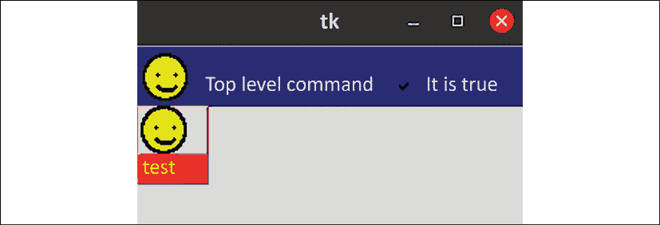
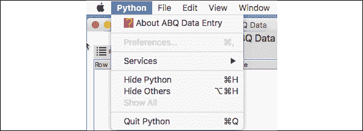
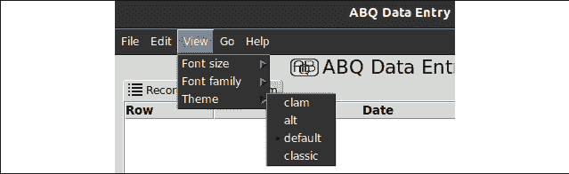

# 维护跨平台兼容性

关于你的应用程序的消息已经在 ABQ AgriLabs 传开，它被用作可视化和处理实验数据文件的方式。因此，它现在需要在 Windows、macOS 和 Linux 系统上同等良好地运行。幸运的是，对于你来说，Python 和 Tkinter 在这三个操作系统上都有支持，你可能会惊喜地发现你的应用程序在所有三个系统上都能无修改地运行。然而，还有一些小问题需要你解决，并保持警觉，以便你的应用程序能够在每个平台上成为良好的公民。

在本章中，我们将通过介绍以下主题来了解更多关于跨平台兼容性的内容：

+   在《跨平台 Python 编写》中，你将学习如何保持基本的 Python 代码在多个平台上保持功能。

+   在《跨平台 Tkinter 编写》中，你将了解影响 Tkinter 代码的特定跨平台问题。

+   在《改进我们应用程序的跨平台兼容性》中，我们将更新我们的 ABQ 数据录入应用程序以获得更好的跨平台支持。

# 跨平台 Python 编写

在撰写本文时，Python 在近十种操作系统平台上都有支持，涵盖了从常见的桌面系统如 Windows 到高端商业 Unix 如 AIX，以及像 Haiku OS 这样的神秘 OS 项目。

在所有这些平台上，大多数 Python 代码无需任何重大修改即可工作，因为 Python 已被设计为将高级功能转换为每个系统上适当的低级操作。即便如此，仍然存在一些情况，其中操作系统差异无法（或尚未）抽象化，需要谨慎处理以避免特定平台的失败。

在本节中，我们将探讨一些影响跨平台 Python 的较大问题。

## 跨平台文件名和文件路径

文件系统可能是跨平台开发中最大的陷阱来源。尽管大多数平台共享文件和目录按层次结构排列的概念，但有一些关键差异可能会让不熟悉各种操作系统的开发者陷入困境。

### 路径分隔符和驱动器

当涉及到在文件系统中标识位置时，操作系统通常使用以下两种模型之一：

+   Windows/DOS：在这个模型中，每个分区或存储设备都被分配一个卷标（通常是一个字母），每个卷都有自己的文件系统树。路径由反斜杠（`\`）字符分隔。这个系统被 Windows、DOS 和 VMS 使用。

+   Unix：在这个模型中，有一个文件系统树，设备和分区在任意点挂载。路径由正斜杠（`/`）分隔。这个模型被 macOS、Linux、BSD、iOS、Android 和其他类 Unix 操作系统使用。

因此，像`E:\Server\Files\python`这样的路径在 Linux 或 macOS 上是没有意义的，而像`/mnt/disk1/files/python`这样的路径在 Windows 上同样没有意义。这可能会使得编写跨平台访问文件的代码变得相当困难，但 Python 为我们提供了一些工具来处理这些差异。

#### 路径分隔符转换

如果你在一个 Windows 系统上使用 Unix 风格的正斜杠路径分隔符，Python 会自动将它们转换为反斜杠。这对于跨平台用途非常有用，因为在使用字符串中的反斜杠时可能会遇到问题。例如，如果你尝试在 Python 中创建字符串`C:\Users`，你会得到一个异常，因为`\u`是用于指定 Unicode 序列的转义序列，而`sers`（`\U`之后的字符串）不是一个有效的 Unicode 序列。

要在字符串中使用反斜杠，你必须通过输入双反斜杠（`\\`）来转义它们，或者你必须使用原始字符串（通过在字符串字面量前加上`r`）。

注意，没有 Windows 到 Unix 路径分隔符的转换：Python 不会将反斜杠转换为 Unix 风格的正斜杠。因此，像`r'\usr\bin\python'`这样的路径在 macOS 或 Linux 上将无法正常工作。

#### os.path 模块

即使有自动路径分隔符插值，构建或硬编码路径作为字符串也是一项繁琐的工作。Python 强大的字符串操作方法使得尝试以字符串的形式处理路径变得诱人，许多程序员都尝试这样做。

结果通常是丑陋的、不可移植的代码，如下所示：

```py
script_dir = '/'.join(some_path.split('/')[:-1]) 
```

虽然这种方法在大多数情况下可能有效（甚至在 Windows 上），但它容易在一些边缘情况下出错（例如，如果`some_path`是`/script.sh`）。因此，Python 标准库包括了`os.path`模块来处理文件系统路径。

`path`模块似乎是一组函数和常量，有助于抽象常见的文件名和目录操作，尽管它实际上是对 Unix-like 系统的`posixpath`模块和 Windows 的`ntpath`模块的低级封装。当你导入`path`时，Python 会简单地检测你的操作系统并加载适当的低级库。

下表显示了对于跨平台开发者有用的某些常见的`os.path`函数：

| 函数 | 目的 |
| --- | --- |
| `join()` | 以平台适当的方式连接两个或多个路径段 |
| `expanduser()` | 将`~`或`username`快捷方式分别扩展到用户的家目录或用户名 |
| `expandvars()` | 扩展路径字符串中存在的任何 shell 变量 |
| `dirname()` | 提取路径的父目录 |
| `isfile()` | 确定路径是否指向一个文件 |
| `isdir()` | 确定路径是否指向一个目录 |
| `exists()` | 确定给定的路径是否存在 |

使用这些函数而不是直接操作路径字符串可以保证你的代码在各个平台上的一致性。

#### pathlib 模块

Python 标准库中较新的补充是`pathlib`模块。`pathlib`模块是对文件系统路径的一种更面向对象且稍微高级的抽象，我们在整本书中一直在使用它。与仅是一系列函数和常量的`os.path`不同，`pathlib`提供了`Path`对象，它代表一个文件系统位置，并提供了一系列修改路径和获取其信息的方法。

我们通常通过从其中导入`Path`类来使用`pathlib`。例如：

```py
>>> from pathlib import Path
>>> p = Path()
>>> print(p)
.
>>> print(p.absolute())
'/home/alanm' 
```

`Path`默认为当前工作目录，但你也可以提供绝对或相对路径字符串。相对路径将相对于当前工作目录进行计算。

`Path`对象具有各种有用的属性和方法：

```py
# Create a Path object for the current working directory
p = Path()
# Find the parent directory
parent = p.parent
# Check if the path /var/log exists
has_var_log = Path('/var/log').exists()
# Join Paths together, using the division operator
image_path = Path(__file__) / 'images' / 'png' 
```

有关这个强大库的更多信息，请参阅`pathlib`模块的文档：[`docs.python.org/3/library/pathlib.html`](https://docs.python.org/3/library/pathlib.html)。

你应该使用`os.path`还是`pathlib.Path`？一般来说，`pathlib`是更好的选择，并且总体上代码更干净。然而，在某些边缘情况下，你可能需要`os.path`。例如，`pathlib`没有与`expandvars()`等效的功能；此外，`os.path`模块以函数为导向的方法在函数式编程场景中可能更有用。

### 大小写敏感性

平台在文件系统大小写敏感性方面也存在差异。例如，在 Linux、BSD 和 Unix 上，文件`log.txt`、`LOG.txt`和`LoG.TxT`都是不同的文件，可以在同一目录中共存。在 Windows 或 macOS（取决于你的设置），这三个名称都会指向同一个文件，并且不能在同一目录中存在三个具有这些名称的文件。

以下表格详细说明了主要操作系统的大小写敏感性：

| 系统 | 大小写敏感 |
| --- | --- |
| Windows | 否 |
| macOS | 默认不区分（可配置） |
| Linux | 是 |
| BSD，大多数其他 Unix 系统 | 是 |

大小写（不）敏感性问题通常取决于你习惯的系统：

+   习惯于不区分大小写的系统的程序员在引用文件和路径时可能会遇到大小写使用不一致的问题。例如，你可能会将文件保存为`UserSettings.json`，但尝试以`usersettings.JSON`的形式检索它。

+   习惯于大小写敏感系统的程序员在依赖于大小写来区分文件或目录名时可能会遇到问题。例如，你可能在同一目录下有`ImportIngest.txt`和`ImportingEst.txt`这两个文件。

通过以下几条基本规则可以避免这些问题：

+   除非有充分的理由，否则请使用全小写名称作为文件和路径名称。

+   如果你确实混合了大小写，请遵循一致的规则，这样你就不需要记住任意的使用大小写。

+   避免使用 CamelCase 或类似依赖于大小写来表示单词分隔的命名方案。使用下划线、连字符或空格（它们在所有现代文件系统中都是有效的！）。

换句话说：将所有路径和文件名视为如果系统是大小写敏感的，但不要依赖于系统是大小写敏感的。

### 符号链接

符号链接是一种特殊的文件系统级构造，看起来像文件或目录，但实际上只是指向系统上另一个文件或目录的指针。它们通常用于提供文件或目录的别名，或者在不使用额外磁盘空间的情况下，使同一个文件看起来存在于多个位置。尽管它们存在于 Windows 上，但在 Linux、macOS 和其他类 Unix 系统上使用得更为普遍；因此，对于来自 Windows 环境的程序员来说，它们可能是一个混淆点。

符号链接不应与桌面快捷方式混淆，后者也存在于所有三个主要平台上。快捷方式只是桌面环境级别的元数据文件，而符号链接是在文件系统级别实现的。

文件和路径操作有时需要明确它们是在处理符号链接本身还是链接指向的文件。

例如，假设我们当前目录中有一个符号链接 `secret_stuff.txt`，它指向一个不存在的文件 `/tmp/secret_stuff.txt`。看看 `os.path()` 如何响应这样的文件：

```py
>>> from os import path
>>> path.exists('secret_stuff.txt')
False
>>> path.lexists('secret_stuff.txt')
True 
```

正常的 `path.exists()` 函数会跟随链接并发现实际文件不存在。`os.path` 还包括一个 `lexists()` 函数，它会告诉我们链接是否存在，即使文件不存在。这种情况可能是一个问题；例如，你的程序可能正在尝试创建一个与损坏的符号链接同名目录。在这种情况下，`os.path.exists()` 或 `Path.exists()` 都会返回 `False`，但名称冲突仍然存在，目录创建会失败。在这种情况下，检查 `os.path.lexists()` 或 `Path.is_symlink()` 也是一个好主意。

以下表格展示了 `os.path` 中一些帮助处理符号链接的函数：

| 方法 | 描述 |
| --- | --- |
| `islink()` | 如果路径是符号链接，则返回 `True` |
| `lexists()` | 如果路径存在，即使它是损坏的符号链接，也返回 `True` |
| `realpath()` | 返回实际路径，解析任何符号链接到真实文件和目录 |

`pathlib.Path` 对象也具有这些与链接相关的方法：

| 方法 | 描述 |
| --- | --- |
| `is_symlink()` | 如果路径是符号链接，则返回 `True` |
| `resolve()` | 返回一个路径，其中所有符号链接都已解析为真实文件和目录 |
| `lchmod()` | 改变符号链接的权限，而不是它指向的文件 |
| `lstat()` | 返回符号链接的文件系统信息，而不是它指向的文件 |

总结来说，我们的代码应该注意在可能引起其行为异常的情况下处理符号链接。

### 路径变量

大多数平台，包括 Windows、macOS 和 Linux，支持某种类型的 shell 变量，这些变量通常由系统自动设置，以指向常见的文件系统位置。`os.path` 模块提供了 `expandvars()` 函数来将这些变量展开为其实际值（`pathlib` 没有等效方法）。虽然这些变量在定位常见路径位置时可能很有用，但跨平台开发者应该了解它们在平台间并不一致。

在不同系统间，一些常用的变量包括以下内容：

| 描述 | Windows | macOS | Linux |
| --- | --- | --- | --- |
| 当前用户主目录 | `%HOME%`, `%USERPROFILE%` | `$HOME` | `$HOME` |
| 临时目录 | `%TMP%`, `%TEMP%` | `$TMPDIR` | 无 |
| 默认 shell 路径 | 无 | `$SHELL` | `$SHELL` |
| 当前工作目录 | 无 | `$PWD` | `$PWD` |
| 配置目录 | `%APPDATA%`, `%LOCALAPPDATA%` | 无 | `$XDG_CONFIG_HOME`（通常未设置） |
| OS 目录 | `%WINDIR%`, `%SYSTEMROOT%` | 无 | 无 |
| 程序文件目录 | `%PROGRAMFILES%`, `%PROGRAMW6432%` | 无 | 无 |

注意，Windows 变量可以使用本地的 `%VARIABLENAME%` 格式或 Unix 风格的 `$VARIABLENAME` 格式；macOS 和 Linux 只接受 Unix 风格格式。

使用这些变量不一定是个坏主意（它们可以帮助抽象操作系统的版本或配置之间的差异），但请注意，它们在平台间并不一致可用，甚至可能没有意义。

## 库和功能支持不一致

虽然可以理解许多第三方 Python 库只支持有限数量的平台，但你可能会惊讶地发现，标准库包含的模块集合根据平台略有不同。即使那些在平台上都存在的模块，其行为也可能略有不同，或者内容不一致，这取决于平台。

自然地，这些变量在跨平台应用程序中必须谨慎处理。让我们看看这些库和功能的几个例子。

### Python 的平台限制库

在 Python 标准库文档的第 34 和 35 部分 ([`docs.python.org/3/library/index.html`](https://docs.python.org/3/library/index.html)) 中，你可以找到仅在 Windows 或类 Unix 系统上可用的库列表。仔细阅读文档可显示，在其他部分还列出了更多平台限制库。

这是一个你可能遇到的常见平台限制库列表：

| 库 | 描述 | 可用性 |
| --- | --- | --- |
| `ossaudiodev` | 开放声音系统 (OSS) 音频服务器接口 | Linux, FreeBSD |
| `winsound` | Windows 音频接口 | Windows |
| `msilib` | Windows 软件打包工具 | Windows |
| `winreg` | Windows 注册表工具 | Windows |
| `syslog` | Unix 系统日志接口 | Linux, macOS, BSD |
| `pwd`, `spwd` | Unix 密码数据库接口 | Linux, macOS, BSD |
| `resource` | 系统资源限制 | Linux、macOS、BSD |
| `curses` | 基于终端的 UI 库 | Linux、macOS、BSD |

在某些情况下，可以使用更高层次的跨平台库来替换这些库（例如，使用`logging`代替`syslog`），但在其他情况下，功能过于特定于平台，可能别无选择（例如`winreg`）。在这种情况下，在导入这些库之前，您需要进行平台检查，因为在不支持的平台上您将收到`ImportError`异常。

### 检查低级函数兼容性

即使在普遍可用的库中，有时也存在某些函数或方法，它们根据平台的不同而不可用或表现出不同的行为。`os`模块可能是最显著的例子。

`os`模块是对系统调用或命令的相对较薄的包装，尽管它试图抽象跨平台的一些大致类似调用，但许多函数过于特定于平台，无法普遍提供。

`os`模块的文档在[`docs.python.org/3/library/os.html`](https://docs.python.org/3/library/os.html)中包含有关平台支持的完整详细信息，但这里列出了其中的一些示例：

| 库 | 描述 | 可用性 |
| --- | --- | --- |
| `getuid`、`getgid`、`getgroups`、`geteuid` | 获取当前进程的用户或组信息 | 类 Unix |
| `setuid`、`setgid`、`setgroups`、`seteuid` | 设置当前进程的用户或组信息 | 类 Unix |
| `getpriority`、`setpriority` | 获取或设置当前进程的优先级 | 类 Unix |
| `chown`、`lchown` | 更改文件或其符号链接的所有者 | 类 Unix |
| `startfile` | 以双击文件的方式打开文件 | Windows |

尝试使用不可用的函数将导致异常，因此这些函数中没有一个应该在跨平台应用程序中使用，除非进行适当的检查或异常处理。到目前为止，`os`模块中大多数受平台限制的函数仅限于类 Unix 系统（Linux、macOS、BSD 等），而大多数 Windows 的类似函数可以在第三方`pywin32`包中找到（当然，该包仅适用于 Windows）。

通常，您需要检查您使用的库的文档，以确保它们在您打算支持的平台上都可用。当使用与操作系统功能（如窗口管理、文件系统、用户身份验证等）或仅在某些平台上可用的服务（例如 Microsoft SQL Server）交互的库时，应特别注意。

### 子进程模块的危险

`subprocess` 模块提供了在您的 Python 应用程序中启动和管理其他程序和命令的工具。对于已经熟悉其操作系统命令行界面的程序员来说，它通常提供了一种快速便捷的方式来完成文件系统操作或其他管理任务。但它也极有可能破坏跨平台兼容性！

例如，Linux 或 macOS 上的程序员可能会尝试以下方式复制文件：

```py
import subprocess
subprocess.call(['cp', 'file1.txt', 'file2.txt']) 
```

这在类 Unix 操作系统上会起作用，但在 Windows 上会失败，因为 `cp` 不是一个有效的 Windows 命令行命令。在这种情况下，更好的选择是使用 `shutil` 库，它包含用于复制文件的高级函数。

为了避免这里的问题，请遵循以下指南：

1.  在求助于 `subprocess` 解决问题之前，先寻找高级库。

1.  如果您必须使用 `subprocess`，请仔细研究每个受支持平台上的调用命令，确保语法、输出和行为完全相同。

1.  如果它们不是，请确保为每个平台创建不同的案例（参见下文“根据平台编写代码”部分）。

自然地，所有这些建议同样适用于任何允许您在 Python 中执行操作系统命令的第三方模块。

## 文本文件编码和格式

不同平台上的纯文本文件默认使用不同的字符编码和换行符。尽管大多数操作系统可以处理多种编码，但每个系统都有一个默认编码（通常由语言或本地化设置确定），如果没有指定，将使用该编码。不同平台上的文本文件也使用不同的字符代码作为换行符。

Linux 和 macOS 的现代版本使用 UTF-8 作为默认编码，并使用换行符（`\n`）作为行终止符。然而，Windows 10 使用 `cp1252` 作为其默认编码，并使用回车符和换行符的组合（`\r\n`）作为行终止符。大多数时候，这些差异不会造成问题，尤其是如果您只使用 Python 读取和写入文件，并且处理标准英语字符。

然而，考虑以下场景，您尝试将一个 Unicode 字符追加到文本文件中，如下所示：

```py
with open('testfile.test', 'a') as fh:
  fh.write('\U0001F34C') 
```

在 Windows 或其他使用非 Unicode 默认编码的系统上，前面的代码将引发异常，如下所示：

```py
UnicodeEncodeError: 'charmap' codec can't encode character '\U0001f34c' in position 0: character maps to <undefined> 
```

为了避免这个问题，您可以在打开文件时手动指定字符编码，如下所示：

```py
with open('testfile.test', 'a', encoding='utf-8') as fh:
  fh.write('\U0001F34C') 
```

在使用 `newline` 参数打开文件时，也可以指定行终止符字符，如下所示：

```py
with open('testfile.test', 'w', newline='\n') as fh:
  fh.write('banana') 
```

我们已经在 ABQ 数据录入中这样做，以解决 Windows 上 `csv` 模块的错误。在跨平台的情况下，指定 `encoding` 和 `newline` 参数以保存您不控制的数据（例如用户输入的数据）是一个好主意。

## 图形和控制台模式

在 Windows 上，程序将以 GUI 模式或控制台模式启动，这由可执行文件中的元数据决定。Windows 的 Python 发行版包括一个名为 Python launcher 的实用程序，它在安装期间与 Python 文件关联。Python launcher 将根据其文件扩展名在 GUI 或控制台模式下启动您的应用程序，如下所示：

+   以 `.py` 扩展名结尾的文件将使用 `python.exe` 在控制台模式下启动。这将导致在后台打开一个命令行窗口，程序运行期间必须保持该窗口打开。

+   以 `.pyw` 结尾的文件将使用 `pythonw.exe` 在 GUI 模式下启动。不会启动命令行窗口，如果从命令行运行程序，程序将不会阻塞控制台（即，提示符将立即返回，而程序仍在运行）；然而，`print()` 将没有效果，`sys.stderr` 和 `sys.stdout` 也不会存在。尝试访问它们将引发异常。

这种区别常常会让来自 Linux 或 macOS 的开发者感到困惑，在这些系统中，图形应用程序通常会将错误和调试信息输出到终端。即使是对于刚开始接触 GUI 应用程序的 Windows 程序员来说，GUI 应用程序没有命令行输出也可能是个问题。

为了避免问题，只需记住以下内容：

1.  如果将代码部署到 Windows，请从代码中移除任何 `sys.stdout()` 或 `sys.stderr()` 调用。

1.  依靠日志记录而不是 `print()` 或 `sys.stderr()` 调用来记录调试信息。

1.  创建主可执行脚本的 `.pyw` 扩展名副本，以便 Windows 用户可以无需命令行窗口即可启动它。

虽然 macOS 不区分 GUI 和控制台应用程序（除了明显的 GUI 存在之外），但其桌面通过启动一个终端窗口来启动常规的 `.py` 文件，就像 Windows 一样。虽然 macOS Python 包含一个无需终端即可启动的 `pythonw.exe` 文件，但存在两个问题。首先，它默认不与 `.pyw` 扩展名关联；如果您想实现这种行为，则需要手动进行。其次，根据您如何安装 Python 3（例如，如果您使用 `homebrew` 安装），您的安装可能没有 `pythonw`。

在 macOS 上设置 Python 程序以使其表现得像真正的 GUI 应用程序是有方法的，我们将在 *第十六章*，*使用 setuptools 和 cxFreeze 打包* 中介绍。

## 编写根据平台变化的代码

如您所见，在某些情况下，您根本无法避免编写特定平台的代码，要么是因为高级库不可用，要么是因为需要在特定平台上执行的操作本质上不同。

在这种情况下，检测平台变得必要。在 Python 中，有几种方法可以做到这一点，包括`os.system()`函数和`sys.platform`属性，但标准库中的`platform`模块包含了确定 OS 详细信息的最有用的功能集。当调用时，`platform.system()`函数返回一个标识操作系统的字符串：`Windows`、`Linux`、`freebsd7`或`Darwin`（用于 macOS）。

`platform`模块中一些其他有用的函数包括`release()`，它返回 OS 的版本字符串（例如，Windows 10 上的"10"，macOS High Sierra 上的"17.3.0"，或 Linux 上的运行内核版本）；以及`architecture()`，它告诉我们系统是 64 位还是 32 位。

对于代码中的简单差异，通常使用嵌套的`if` / `else`链中的此信息就足够了：

```py
# simple_cross_platform_demo.py
import platform
import subprocess
os_name = platform.system()
if os_name in ('Darwin', 'freebsd7'):
    cmd = ['ps', '-e', '-o', "comm=''", '-c']
elif os_name == 'Linux':
    cmd = ['ps', '-e', '--format', 'comm', '--no-heading']
elif os_name == 'Windows':
    cmd = ['tasklist', '/nh', '/fo', 'CSV']
else:
    raise NotImplemented("Command unknown for OS")
processes = subprocess.check_output(cmd, text=True)
print(processes) 
```

此示例定义了一个基于`platform.system()`返回值的平台适当的命令标记列表。正确的列表被保存为`cmd`，然后传递给`subprocess.check_output()`以运行命令并获取其输出。

这对于偶尔的调用来说是可接受的，但对于更复杂的情况，将特定于平台的代码打包到后端类中是有意义的，然后我们可以根据我们的平台字符串选择这些类。例如，我们可以将上述代码重新实现如下：

```py
# complex_cross_platform_demo/backend.py
import subprocess
import platform
class GenericProcessGetter():
  cmd = []
  def get_process_list(self):
    if self.cmd:
      return subprocess.check_output(self.cmd)
    else:
      raise NotImplementedError
class LinuxProcessGetter(GenericProcessGetter):
  cmd = ['ps', '-e', '--format', 'comm', '--no-heading']
class MacBsdProcessGetter(GenericProcessGetter):
  cmd = ['ps', '-e', '-o', "comm=''", '-c']
class WindowsProcessGetter(GenericProcessGetter):
  cmd = ['tasklist', '/nh', '/fo', 'CSV'] 
```

在这种方法中，我们创建了一个通用类来处理获取进程的常见逻辑，然后将其子类化以专门针对每个平台覆盖`cmd`属性。

现在，我们可以创建一个选择函数，当给定 OS 名称时返回适当的后端类：

```py
# complex_cross_platform_demo/backend.py
def get_process_getter_class(os_name):
  process_getters = {
    'Linux': LinuxProcessGetter,
    'Darwin': MacBsdProcessGetter,
    'Windows': WindowsProcessGetter,
    'freebsd7': MacBsdProcessGetter
  }
  try:
    return process_getters[os_name]
  except KeyError:
    raise NotImplementedError("No backend for OS") 
```

现在，需要使用此类的代码可以利用此函数检索平台适当的版本。例如：

```py
# complex_cross_platform_demo/main.py
os_name = platform.system()
process_getter = get_process_getter_class(os_name)()
print(process_getter.get_process_list()) 
```

现在，此脚本可以在 Linux、Windows、macOS 或 BSD 上运行以打印进程列表。可以通过创建更多的`GenericProcessGetter`子类并更新`get_process_getter_class()`轻松添加其他平台。

对于更复杂的情况，其中多个类或函数需要在平台之间以不同的方式实现，我们可以采取类似于标准库的`os.path`模块的方法：为每个平台实现完全独立的模块，然后根据平台导入它们，使用一个共同的别名。例如：

```py
import platform
os_name = platform.system()
if os_name == 'Linux':
    import linux_backend as backend
elif os_name == 'Windows':
    import windows_backend as backend
elif os_name in ('Darwin', 'freebsd7'):
    import macos_bsd_backend as backend
else:
    raise NotImplementedError(f'No backend for {os_name}') 
```

请记住，每个后端模块理想情况下应包含相同的类和函数名称，并产生类似的输出。这样，`backend`就可以在代码中使用，而无需关心特定的平台。

# 编写跨平台 Tkinter

如您迄今为止所见，Tkinter 在各个平台上大多工作方式相同，甚至可以以最小的努力在每个平台上做正确的事情。然而，当您在多个操作系统上支持 Tkinter 应用程序时，有一些小问题需要注意。在本节中，我们将探讨更显著的不同之处。

## 跨平台 Tkinter 版本差异

截至 2021 年，主流平台官方 Python 3 发行版至少包含 Tcl/Tk 8.6；这是 Tcl/Tk 的最新主要版本，包含了本书中讨论的所有功能。然而，并非每个平台都包含最新的次要版本，这可能会影响错误修复和次要功能。在撰写本文时，Tcl/Tk 的最新版本是 8.6.11。

历史上，一些平台（尤其是 macOS）在发布 Tcl/Tk 最新版本方面落后。尽管在撰写本文时平台支持相当一致，但未来可能会有所差异。

要发现您系统上安装的 Tcl/Tk 的确切版本，您可以在 Python 提示符下执行以下命令：

```py
>>> import tkinter as tk
>>> tk.Tcl().call('info', 'patchlevel') 
```

此代码使用 `Tcl()` 函数创建一个新的 Tcl 解释器，然后调用 `info patchlevel` 命令。以下是使用每个平台最常用的 Python 3 发行版在几个平台上运行此命令的返回结果：

| 平台 | Python 版本 | Tcl/Tk 版本 |
| --- | --- | --- |
| Windows 10 | 3.9（来自 python.org） | 8.6.9 |
| macOS High Sierra | 3.9（来自 python.org） | 8.6.8 |
| Ubuntu 20.04 | 3.8（来自仓库） | 8.6.10 |
| Debian 10 | 3.7（来自仓库） | 8.6.9 |

如您所见，这些平台中没有一个提供 Tcl/Tk 的最新版本，即使那些拥有 Python 较新版本的系统，也可能拥有较旧的 Tcl/Tk 版本。最终，如果您打算编写跨平台 Tkinter 代码，请确保您没有依赖于 Tcl/Tk 最新版本的特性。

## 平台间的应用程序菜单

应用程序菜单可能是能力与平台间差异最明显的区域之一。如 *第七章* 中所述，*使用 Menu 和 Tkinter 对话框创建菜单*，在设计我们的菜单时，我们应该了解主要操作系统对限制和期望。

### 菜单小部件功能

我们在第七章中了解到的 `Menu` 小部件与其他大多数 Tkinter 小部件不同，因为它依赖于底层平台的菜单功能。这允许您的应用程序拥有一个表现本地的菜单；例如，在 macOS 上，菜单出现在屏幕顶部的全局菜单区域，而在 Windows 上，它出现在任务栏下的应用程序窗口中。

由于这种设计，当与跨平台的 `Menu` 小部件一起工作时，存在一些限制。为了演示这一点，让我们构建一个极端的非跨平台菜单。

我们将首先创建一个带有菜单的简单 `Tk` 窗口，如下所示：

```py
# non_cross_platform_menu.py
import tkinter as tk
from tkinter.messagebox import showinfo
root = tk.Tk()
root.geometry("300x200")
menu = tk.Menu(root) 
```

现在，我们将创建一个级联菜单：

```py
smile = tk.PhotoImage(file='smile.gif')
smile_menu = tk.Menu(menu, tearoff=False)
smile_menu.add_command(
  image=smile,
  command=lambda: showinfo(message="Smile!")
)
smile_menu.add_command(label='test')
menu.add_cascade(image=smile, menu=smile_menu) 
```

`smile_menu` 包含两个命令，一个带有文本标签，另一个只包含图像。我们在添加菜单的级联时也使用了图像，因此它不应该有文本标签，只需一个图像即可。

在此期间，让我们添加一些颜色；在*第九章*，*通过样式和主题改进外观*中，我们自定义了应用程序菜单的颜色，提到它只在 Linux 上工作。让我们看看它在其他平台上会做什么；添加以下代码：

```py
menu.configure(foreground='white', background='navy')
smile_menu.configure(foreground='yellow', background='red') 
```

这样应该会使我们的主菜单显示为黑色背景上的白色文字，而级联菜单为红色背景上的黄色。

接下来，让我们在`smile_menu`之后的主菜单中添加一个分隔符和一条命令：

```py
menu.add_separator()
menu.add_command(
  label='Top level command',
  command=lambda: showinfo(message='By your command!')
) 
```

最后，我们将在主菜单上直接创建一个`Checkbutton`小部件，并使用通常的样板代码来配置`root`并运行`mainloop()`方法：

```py
boolvar = tk.BooleanVar()
menu.add_checkbutton(label="It is true", variable=boolvar)
root.config(menu=menu)
root.mainloop() 
```

保存此文件并执行代码。根据你的操作系统，你可能会看到一些不同的结果。

如果你使用的是 Linux（在这个例子中是 Ubuntu 20.04），它似乎大致按预期工作：



图 10.1：Ubuntu 20.04 上的菜单实验

我们有了第一个带有笑脸 GIF 标签的级联菜单，我们的顶级菜单命令，以及我们的顶级`Checkbutton`（因为我们已经检查过，确实我们的菜单是工作的！）。颜色似乎也是正确的，尽管 GIF 的背景是默认的灰色，而不是我们预期的红色（GIF 本身有透明背景）。

如果你使用的是 Windows 10，你应该会看到类似这样的效果：


图 10.2：Windows 10 上的菜单实验

在顶部菜单中，我们没有微笑图标，而是只有文本**（图像）**。即使我们指定了一个标签，这个文本也会出现在图像应该出现的位置。幸运的是，当我们在级联菜单中使用它时，图像确实出现了。至于颜色，它们在级联菜单中按预期工作，但顶级菜单完全忽略了它们。主菜单中的命令出现并正常工作，但`Checkbutton`小部件没有。它的标签出现并可以点击，但复选标记本身没有出现。

最后，让我们在 macOS 上尝试这个菜单。它应该看起来像这样：


图 10.3：macOS 上的菜单实验

在 macOS 上，我们的菜单不是显示在程序窗口中，而是显示在屏幕顶部的全局菜单中，正如 macOS 用户所期望的那样。然而，有一些明显的问题。

首先，当我们的微笑图标出现时，它似乎被截断了。由于顶部栏的高度是固定的，Tkinter 不会为我们调整图标大小，所以大于顶部栏高度的图片会被截断。还有更大的问题：顶级命令和`Checkbutton`小部件都无处可寻。只有我们的级联菜单出现了。在颜色方面，顶级菜单忽略了我们的颜色，而级联菜单只尊重前景色（导致了一种相当难以阅读的灰色背景上的黄色组合）。此外，请注意，我们有一个我们没有创建的“Python”级联菜单。

在每个平台上，我们受限于菜单系统的功能，虽然看起来 Linux 上的菜单似乎可以随意设置，但其他两个操作系统在构建菜单时需要更加小心。

为了避免菜单出现任何问题，请遵循以下指南：

+   在主菜单中避免使用命令、`Checkbutton`和`Radiobutton`项；仅使用级联菜单。

+   不要在顶级主菜单中使用图像。

+   不要使用颜色来设置菜单样式，至少不要在 Windows 或 macOS 上使用。

+   如果你必须执行上述任何一点，为每个平台创建单独的菜单。

如果你为每个平台分别构建菜单，当然可以实施该平台支持的所有功能。然而，仅仅因为你在某个平台上可以使用某个功能，并不意味着你“应该”使用它。在下一节中，我们将探讨可以帮助你决定如何在每个平台上实现菜单的指南和标准。

### 菜单指南和标准

我们的主要平台都提供了标准，以指导开发者创建满足该系统用户期望的用户界面。虽然这些标准应考虑整个应用程序，但受其影响最明显的区域之一是应用程序菜单（或菜单栏，使用标准术语）的布局。

让我们看看每个平台可用的标准，我们将在本章创建跨平台主菜单时参考这些标准。

#### Windows 用户体验交互指南

微软的*Windows 用户体验交互指南*，可在[`docs.microsoft.com/en-us/windows/win32/uxguide/guidelines`](https://docs.microsoft.com/en-us/windows/win32/uxguide/guidelines)找到，为开发者提供了大量关于设计适合 Windows 桌面的应用程序的信息。在提供的许多关于菜单栏设计的指南中，包括对标准菜单项及其排列方式的描述。

在撰写本文时，微软刚刚发布了针对 Windows 11 和通用 Windows 平台的新指南，可在[`docs.microsoft.com/en-us/windows/apps/design/basics/`](https://docs.microsoft.com/en-us/windows/apps/design/basics/)找到。然而，这些新指南并没有提供关于菜单结构的具体指导，因此我们使用了较旧的指南。

#### 苹果公司的人机界面指南

苹果公司的人机界面指南可在[`developer.apple.com/macos/human-interface-guidelines/`](https://developer.apple.com/macos/human-interface-guidelines/)找到，并提供了一套详细的规则，用于创建符合 macOS 的界面。

虽然菜单栏设计的基本建议与微软提供的类似，但布局建议却截然不同，并且更加具体。例如，macOS 应用程序的第一个级联菜单应该是应用程序菜单，即以应用程序命名的菜单，其中包含**关于**和**首选项**等项。

#### Linux 和 BSD 人机界面指南

与 Windows 和 macOS 形成鲜明对比的是，Linux、BSD 和其他 X11 系统没有受到祝福的默认桌面环境或控制实体来规定 UI 标准。这些平台有十多个完整的桌面环境可供选择，每个都有其自己的目标和关于用户交互的想法。虽然有许多项目正在为这些平台创建**人机界面指南**（**HIG**），但我们将遵循 Gnome 项目制定的 Gnome HIG。这组指南被 Gnome、MATE 和 XFCE 桌面使用，可在[`developer.gnome.org/hig/`](https://developer.gnome.org/hig/)找到。Gnome 桌面是许多 Linux 发行版的默认桌面环境，包括 Red Hat、Ubuntu，以及特别值得注意的是 Debian，这是我们在 ABQ 的目标 Linux 环境。

### 菜单和加速键

加速键是分配给常见应用程序操作的键盘快捷键，尤其是菜单项。到目前为止，我们还没有添加任何加速键，这对仅使用键盘的用户来说是不利的。

在 Tkinter 中，可以使用`bind()`方法将加速键分配给小部件。我们还可以使用`bind_all()`方法，该方法可以在任何小部件上调用，并有效地全局绑定事件（即，即使调用`bind_all()`的小部件没有获得焦点）。我们的菜单项也接受一个`accelerator`参数，该参数可以用来指定将在菜单中显示的加速键提示字符串。

每个平台的 UI 指南定义了常见操作的标准化加速键，其中大多数在平台上是相同的，因为它们源自 20 世纪 80 年代建立的 IBM **通用用户访问**（**CUA**）标准。最显著的区别是 macOS 使用命令（）键代替 Windows 和 Linux 使用的控制（Ctrl）键。

在为跨平台兼容性重写我们的应用程序菜单时，我们还将添加适合平台的加速键。

## 跨平台字体

在*第九章*，*使用样式和主题改进外观*中，我们了解到如何轻松地自定义 Tkinter 的字体以改变应用程序的外观和感觉。然而，这样做可能会导致跨平台的不一致性。

大约有 18 种字体在 macOS 和 Windows 之间共享，但它们在两个平台上并不完全相同。至于 Linux，由于许可问题，大多数发行版都不包含这 18 种字体中的任何一种。

除非你能保证特定字体在所有支持的平台上都可用，否则最好避免在样式中使用特定的字体家族名称。幸运的是，如果你恰好指定了一个不存在的字体，Tkinter 将只使用默认字体，但即使在某些情况下这也可能引起布局或可读性问题。

为了安全起见，请坚持使用 Tkinter 的命名字体，这些字体在每个平台上都自动设置为相同的默认值。

## 跨平台主题支持

正如我们在*第九章*中看到的，*使用样式和主题改进外观*，Ttk 提供了一系列在不同平台上不同的主题。每个平台都包含一个名为“default”的别名，它指向该平台最合理的主题。尝试设置一个不存在的主题会导致异常，因此请避免在应用程序中硬编码主题设置，并确保主题选择与`Style.theme_names()`的输出进行核对。

## 窗口缩放状态

除了最大化窗口和最小化窗口外，许多窗口环境还有一个“缩放”窗口的概念，它完全占据屏幕。在 Windows 或 macOS 上，可以通过使用根窗口的`state()`方法来激活 Tkinter 应用程序的缩放功能，如下所示：

```py
from tkinter import *
root = Tk()
root.state('zoomed')
root.mainloop() 
```

在 Windows 或 macOS 上，这会创建一个占据整个屏幕的窗口；然而，在 Linux 或 BSD 上，它会引发异常，因为 X11 没有提供设置缩放状态的功能。

在 X11 上，可以通过以下方式打开根窗口的`-zoomed`属性来实现：

```py
root.attributes('-zoomed', True) 
```

不幸的是，前面的代码在 Windows 和 macOS 上会引发异常。如果您需要在程序中设置此状态，您需要使用一些特定于平台的代码。

现在我们已经走过了一系列跨平台问题，让我们来看看 ABQ 数据输入，看看我们能为不同操作系统改进其行为做些什么。

# 提高我们应用程序的跨平台兼容性

我们的应用程序在各个平台上表现相当不错，但我们还可以做一些事情来改进它：

+   首先，我们的应用程序将首选项存储在用户的家目录中，这在任何平台上都不是最佳选择。大多数桌面平台定义了配置文件应放置的具体位置，因此我们将修复我们的应用程序以使用这些位置来存储`abq_settings.json`文件。

+   第二，我们在创建 CSV 文件时没有指定任何编码；如果用户插入了一个 Unicode 字符（比如在`Notes`字段中），文件保存将引发异常并在非 Unicode 平台上失败。

+   最后，当前的菜单结构实际上并没有真正接近遵循我们所讨论的任何人类界面指南。我们将为每个平台实现独立的菜单，以确保用户有一个与其平台一致的 UI。

让我们开始吧！

## 正确存储首选项

每个平台定义了存储用户配置文件的适当位置：

+   Linux 和其他 X11 系统将配置文件存储在由`$XDG_CONFIG_HOME`环境变量定义的位置，如果没有定义，则默认为`$HOME/.config`。

+   macOS 用户配置文件存储在`$HOME/Library/Application Support/`。

+   Windows 用户配置文件存储在`%USERPROFILE%\AppData\Local`。尽管如果你的环境使用带有漫游配置文件的**Active Directory**（**AD**），你可能更喜欢使用`%HOME%\AppData\Roaming`。

为了在我们的应用程序中实现这一点，我们需要更新`SettingsModel`类。记住，我们`SettingsModel`类的初始化方法目前将配置文件放置在`Path.home()`，它返回每个平台上的用户家目录。让我们用一些特定平台的代码来更新它。

首先，打开`models.py`并导入`platform`模块，如下所示：

```py
# models.py, at the top
import platform 
```

为了确定所需的目录，我们需要获取平台名称以及一些环境变量。`os.environ`变量是一个包含系统上设置的环境变量的字典。由于我们已经在`models.py`文件中导入了`os`，我们可以使用`os.environ`来检索我们需要的变量。

在`SettingsModel`类中，我们将创建一个字典来查找正确的配置目录，如下所示：

```py
 config_dirs = {
    "Linux": Path(
      os.environ.get('$XDG_CONFIG_HOME', Path.home() / '.config')
    ),
    "freebsd7": Path(
      os.environ.get('$XDG_CONFIG_HOME', Path.home() / '.config')
    ),
    'Darwin': Path.home() / 'Library' / 'Application Support',
    'Windows': Path.home() / 'AppData' / 'Local'
  } 
```

在每种情况下，我们都将一个平台名称与一个指向每个平台默认配置目录的`pathlib.Path`对象匹配。现在，在`SettingsModel`初始化器内部，我们只需要使用`platform.system()`的值来查找正确的目录。

按如下方式更新`__init__()`方法：

```py
 def __init__(self):
    filename = 'abq_settings.json'
    **filedir = self.config_dirs.get(platform.system(), Path.home())**
    self.filepath = filedir / filename
    self.load() 
```

如果平台不在我们的列表中，我们只需默认使用`Path.home()`将配置文件放置在用户的家目录中。否则，文件应该正确放置在平台上。

现在当你运行应用程序时，你应该会发现任何之前的偏好设置都被重置为默认设置（因为我们现在正在不同的位置查找配置文件），并且如果你保存新的偏好设置，文件`abq_settings.json`将出现在你的平台配置目录中。

## 为我们的 CSV 文件指定编码

我们的应用程序目前正在使用系统的默认编码保存 CSV 文件。如果 Windows 用户尝试使用 Unicode 字符，这可能会成为一个问题。

在`models.py`中，我们需要找到`CSVModel`类中的三个`open()`实例，并指定一个编码，如下例所示：

```py
# models.py, in CSVModel.save_record()
    with open(
      self.filename, 'a', encoding='utf-8', newline=''
    ) as fh: 
```

确保更新`models.py`中的所有`open()`调用，包括`SettingsModel`中的调用。有了这个更改，Unicode 字符应该不再有问题。

## 创建适合平台的菜单

创建特定平台的菜单将比之前的修复更复杂。我们的基本方法将是创建多个菜单类，并使用选择函数返回适当的类，如前一小节所述。

在我们能够这样做之前，我们需要准备我们的`MainMenu`类，使其更容易被继承。

### 准备我们的`MainMenu`类

目前，我们的`MainMenu`类的配置的大部分工作发生在`__init__()`中。然而，对于每个平台，我们都需要以不同的结构构建菜单，并且对于某些命令有一些不同的细节。为了使这更简单，我们将采取组合方法，其中我们将菜单创建分解为许多离散的方法，然后我们可以在每个子类中按需组合这些方法。

我们首先要做的是将其名称更改，以便更清楚地说明其作用：

```py
class GenericMainMenu(tk.Menu):
  styles = dict() 
```

我们还创建了一个空的`styles`字典作为类属性。由于菜单样式并不是在所有平台上都得到很好的支持，这个空字典可以作为一个占位符，这样我们就可以通过简单地覆盖这个属性来在需要时应用样式。

接下来，我们将为创建每个菜单项创建单独的方法。因为这些项可能会根据平台的不同添加到不同的菜单中，所以每个方法都将接受一个`menu`参数，该参数将用于指定它将添加到哪个`Menu`对象。

让我们从创建用于创建我们的**选择文件**和**退出**命令条目的方法开始：

```py
 def _add_file_open(self, menu):
    menu.add_command(
      label='Select file…', command=self._event('<<FileSelect>>'),
      image=self.icons.get('file'), compound=tk.LEFT
  )
  def _add_quit(self, menu):
    menu.add_command(
      label='Quit', command=self._event('<<FileQuit>>'),
      image=self.icons.get('quit'), compound=tk.LEFT
    ) 
```

接下来，创建添加自动填充设置选项的方法：

```py
 def _add_autofill_date(self, menu):
    menu.add_checkbutton(
      label='Autofill Date', variable=self.settings['autofill date']
    )
  def _add_autofill_sheet(self, menu):
    menu.add_checkbutton(
      label='Autofill Sheet data',
      variable=self.settings['autofill sheet data']
    ) 
```

对于我们具有自己子菜单的字体选项，我们将创建创建整个子菜单的方法，如下所示：

```py
 def _add_font_size_menu(self, menu):
    font_size_menu = tk.Menu(self, tearoff=False, **self.styles)
    for size in range(6, 17, 1):
      font_size_menu.add_radiobutton(
        label=size, value=size,
        variable=self.settings['font size']
      )
    menu.add_cascade(label='Font size', menu=font_size_menu)
  def _add_font_family_menu(self, menu):
    font_family_menu = tk.Menu(self, tearoff=False, **self.styles)
    for family in font.families():
      font_family_menu.add_radiobutton(
        label=family, value=family,
        variable=self.settings['font family']
    )
    menu.add_cascade(label='Font family', menu=font_family_menu) 
```

注意，我们在定义级联菜单时使用了`self.styles`字典；尽管在这个类中它是空的，但我们希望如果定义了样式，它们将应用到所有菜单。

对于主题菜单，我们将做同样的事情，并设置显示警告消息的跟踪，如下所示：

```py
 def _add_themes_menu(self, menu):
    style = ttk.Style()
    themes_menu = tk.Menu(self, tearoff=False, **self.styles)
    for theme in style.theme_names():
      themes_menu.add_radiobutton(
        label=theme, value=theme,
        variable=self.settings['theme']
      )
    menu.add_cascade(label='Theme', menu=themes_menu)
    self.settings['theme'].trace_add('write', self._on_theme_change) 
```

最后，让我们添加用于导航和“关于”命令的最后三个方法：

```py
 def _add_go_record_list(self, menu):
    menu.add_command(
      label="Record List", command=self._event('<<ShowRecordlist>>'),
      image=self.icons.get('record_list'), compound=tk.LEFT
    )
  def _add_go_new_record(self, menu):
    menu.add_command(
      label="New Record", command=self._event('<<NewRecord>>'),
      image=self.icons.get('new_record'), compound=tk.LEFT
    )
  def _add_about(self, menu):
    menu.add_command(
      label='About…', command=self.show_about,
      image=self.icons.get('about'), compound=tk.LEFT
    ) 
```

现在，为了将这些方法组合成一个菜单，我们将创建一个新的方法，称为`_build_menu()`。此方法可以被我们的子类覆盖，而`__init__()`则负责处理常见的设置任务。

为了了解这将如何工作，让我们创建一个将重新创建我们的通用菜单的方法版本：

```py
 def _build_menu(self):
    # The file menu
    self._menus['File'] = tk.Menu(self, tearoff=False, **self.styles)
    self._add_file_open(self._menus['File'])
    self._menus['File'].add_separator()
    self._add_quit(self._menus['File'])
    # The options menu
    self._menus['Options'] = 
      tk.Menu(
        self, tearoff=False, **self.styles
      )
    self._add_autofill_date(self._menus['Options'])
    self._add_autofill_sheet(self._menus['Options'])
    self._add_font_size_menu(self._menus['Options'])
    self._add_font_family_menu(self._menus['Options'])
    self._add_themes_menu(self._menus['Options'])
    # switch from recordlist to recordform
    self._menus['Go'] = tk.Menu(self, tearoff=False, **self.styles)
    self._add_go_record_list(self._menus['Go'])
    self._add_go_new_record(self._menus['Go'])
    # The help menu
    self._menus['Help'] = tk.Menu(self, tearoff=False, **self.styles)
    self.add_cascade(label='Help', menu=self._menus['Help'])
    self._add_about(self._menus['Help'])
    for label, menu in self._menus.items():
      self.add_cascade(label=label, menu=menu) 
```

在这里，我们正在创建我们的文件、选项、导航和帮助级联菜单，并将每个菜单传递给适当的项添加方法以设置其项。我们将这些存储在字典`self._menus`中，而不是作为局部变量。在方法末尾，我们遍历字典以将每个级联添加到主菜单。

现在，我们可以将这个类的初始化器简化为仅包含方法调用的骨架，如下所示：

```py
 def __init__(self, parent, settings, **kwargs):
    super().__init__(parent, **kwargs)
    self.settings = settings
    self._create_icons()
    self._menus = dict()
    self._build_menu()
    self.configure(**self.styles) 
```

在调用超类初始化器后，此方法仅保存设置，创建图标和`_menus`字典，然后调用`_build_menu()`。如果设置了任何样式，则通过`self.configure()`将这些样式应用到主菜单。

### 添加加速键

在我们开始构建`GenericMainMenu`的子类之前，让我们使每个菜单能够添加特定于平台的加速键。这些只是可以激活我们的菜单项的键盘快捷键。我们不需要为每个菜单项都这样做，只需为一些常用命令添加即可。

要创建菜单项的关键绑定，有两个步骤：

1.  使用`bind_all()`方法将键盘事件绑定到回调函数。

1.  使用菜单项的加速器参数用键盘序列标记菜单项。

重要的是要理解我们需要做这两件事；`accelerator`参数不会自动设置键绑定，它只是决定了菜单项的标签。同样，`bind_all()`方法不会导致菜单项被标签化，它只会创建事件绑定。

为了完成这两项任务，我们将创建两个类属性字典，一个用于加速器，一个用于键绑定，如下所示：

```py
class GenericMainMenu(tk.Menu):
  accelerators = {
    'file_open': 'Ctrl+O',
    'quit': 'Ctrl+Q',
    'record_list': 'Ctrl+L',
    'new_record': 'Ctrl+R',
  }
  keybinds = {
    '<Control-o>': '<<FileSelect>>',
    '<Control-q>': '<<FileQuit>>',
    '<Control-n>': '<<NewRecord>>',
    '<Control-l>': '<<ShowRecordlist>>'
  } 
```

第一个字典只是将加速器字符串与我们可以用于我们的菜单定义方法中的键匹配。要使用此字典，我们只需要更新这些方法以包括加速器；例如，像这样更新`_add_file_open()`方法：

```py
# mainmenu.py, inside the GenericMainMenu class
  def _add_file_open(self, menu):
    menu.add_command(
      label='Select file…',
      command=self._event('<<FileSelect>>'),
      **accelerator=self.accelerators.get('file_open')**,
      image=self.icons.get('file'),
      compound=tk.LEFT
  ) 
```

请继续在`_add_quit()`、`_add_go_record_list()`和`_add_go_new_record()`中的`add_command()`调用中添加`accelerator`参数。

为了处理键绑定，我们只需要创建一个将创建键绑定的方法。将此`_bind_accelerators()`方法添加到类中：

```py
# mainmenu.py, inside the GenericMainMenu class
  def _bind_accelerators(self):
    for key, sequence in self.keybinds.items():
      self.bind_all(key, self._event(sequence)) 
```

`_bind_accelerators()`方法遍历`keybinds`字典，并将每个键序列绑定到由`_event()`方法创建的函数，该函数将生成给定的事件。请注意，我们在这里使用了`bind_all()`；与只对小部件上的事件做出响应的`bind()`方法不同，`bind_all()`方法将在任何小部件上生成事件时执行回调。因此，无论选择或聚焦的是哪个小部件，Control + Q 快捷键都会退出程序，例如。

最后的部分是从我们的初始化器中调用这个新方法。将以下内容添加到`GenericMainMenu.__init__()`的末尾：

```py
 self._bind_accelerators() 
```

现在`GenericMainMenu`类已准备好进行子类化。让我们一次处理一个平台，找出需要更新的内容。

### 构建 Windows 菜单

在学习完*Windows 用户体验交互指南*后，你认为以下更改是使我们的菜单 Windows 友好的必要步骤：

+   **文件** | **退出**应改为**文件** | **退出**，并且不应为其设置加速器。Windows 使用 Alt + F4 来关闭程序，这由 Windows 自动处理。

+   Windows 可以很好地处理菜单栏中的命令，并且指南鼓励这样做以用于常用功能。我们将直接将我们的记录列表和新记录命令移动到主菜单。不过，我们必须移除图标，因为主菜单无法处理图标。

+   配置选项项应放在工具菜单下，与工具中的其他项（如果有）分开。我们需要创建一个工具菜单并将我们的选项移到那里。

让我们实施这些更改并创建我们的 Windows 菜单类。首先，像这样对`GenericMainMenu`类进行子类化：

```py
class WindowsMainMenu(GenericMainMenu): 
```

我们首先将重写初始化器，以便我们可以删除 **文件** | **退出** 的快捷键绑定：

```py
# mainmenu.py, inside WindowsMainMenu
  def __init__(self, *args, **kwargs):
    del(self.keybinds['<Control-q>'])
    super().__init__(*args, **kwargs) 
```

接下来，我们需要重写 `_add_quit()` 方法以重新标记它并删除加速键：

```py
 def _add_quit(self, menu):
    menu.add_command(
      label='Exit', command=self._event('<<FileQuit>>'),
      image=self.icons.get('quit'), compound=tk.LEFT
    ) 
```

我们需要删除两个导航命令的图标，这样我们菜单中就不会出现 **(Image)** 字符串。为此，我们将接下来重写 `_create_icons()` 方法，如下所示：

```py
# mainmenu.py, inside WindowsMainMenu
  def _create_icons(self):
    super()._create_icons()
    del(self.icons['new_record'])
    del(self.icons['record_list']) 
```

该方法的超类版本创建了 `self.icons`，所以我们只需运行它并删除我们不需要的图标。

现在这些问题都解决了，我们可以创建 `_build_menu()` 方法来组合我们的菜单，从以下三个级联开始：

```py
 def _build_menu(self):
    # The File menu
    self._menus['File'] = tk.Menu(self, tearoff=False)
    self._add_file_open(self._menus['File'])
    self._menus['File'].add_separator()
    self._add_quit(self._menus['File'])
    # The Tools menu
    self._menus['Tools'] = tk.Menu(self, tearoff=False)
    self._add_autofill_date(self._menus['Tools'])
    self._add_autofill_sheet(self._menus['Tools'])
    self._add_font_size_menu(self._menus['Tools'])
    self._add_font_family_menu(self._menus['Tools'])
    self._add_themes_menu(self._menus['Tools'])
    # The Help menu
    self._menus['Help'] = tk.Menu(self, tearoff=False)
    self._add_about(self._menus['Help']) 
```

由于我们希望将导航命令条目（记录列表和新记录）直接添加到主菜单而不是级联菜单中，我们无法简单地遍历 `_menus` 字典来添加级联。相反，我们必须手动将条目添加到顶级菜单中，如下所示：

```py
 self.add_cascade(label='File', menu=self._menus['File'])
    self.add_cascade(label='Tools', menu=self._menus['Tools'])
    self._add_go_record_list(self)
    self._add_go_new_record(self)
    self.add_cascade(label='Help', menu=self._menus['Help']) 
```

Windows 菜单现在已完整并准备好使用。让我们继续到下一个平台！

### 构建 Linux 菜单

我们的 `GenericMainMenu` 类与 Gnome HIG 非常接近，但需要做出一个修改：我们的选项菜单实际上并不合适；相反，我们需要将其项目分为两个类别：

+   自动填充选项，因为它们改变了表单中数据输入的方式，应属于编辑菜单。

+   字体和主题选项，因为它们只改变应用程序的外观而不改变实际数据，应属于视图菜单。

由于 Linux 也完全支持菜单颜色，我们将把颜色样式添加回这个版本的菜单。

让我们先从子类化 `GenericMainMenu` 并定义一些样式开始：

```py
# mainmenu.py
class LinuxMainMenu(GenericMainMenu):
  styles = {
    'background': '#333',
    'foreground': 'white',
    'activebackground': '#777',
    'activeforeground': 'white',
    'relief': tk.GROOVE
  } 
```

这些菜单样式并非绝对必要，但如果我们要为 Linux 创建一个单独的菜单，那么充分利用其一些特性也是可以的！

现在，让我们从文件和编辑菜单开始 `_build_menu()` 方法：

```py
 def _build_menu(self):
    self._menus['File'] = tk.Menu(self, tearoff=False, **self.styles)
    self._add_file_open(self._menus['File'])
    self._menus['File'].add_separator()
    self._add_quit(self._menus['File'])
    self._menus['Edit'] = tk.Menu(self, tearoff=False, **self.styles)
    self._add_autofill_date(self._menus['Edit'])
    self._add_autofill_sheet(self._menus['Edit']) 
```

注意，我们已经将 `**self.styles` 添加回每个 `Menu()` 调用以应用样式。我们将在构建下一个三个级联时做同样的事情，如下所示：

```py
 self._menus['View'] = tk.Menu(self, tearoff=False, **self.styles)
    self._add_font_size_menu(self._menus['View'])
    self._add_font_family_menu(self._menus['View'])
    self._add_themes_menu(self._menus['View'])
    self._menus['Go'] = tk.Menu(self, tearoff=False, **self.styles)
    self._add_go_record_list(self._menus['Go'])
    self._add_go_new_record(self._menus['Go'])
    self._menus['Help'] = tk.Menu(self, tearoff=False, **self.styles)
    self._add_about(self._menus['Help']) 
```

最后，我们将遍历 `_menus` 字典并添加所有级联：

```py
 for label, menu in self._menus.items():
      self.add_cascade(label=label, menu=menu) 
```

我们不需要做其他任何更改；我们的加速键和菜单的其他部分与 Gnome HIG 非常匹配。

### 构建 macOS 菜单

在这三个特定平台的菜单中，macOS 菜单需要最多的更改。与 Windows 和 Gnome 指南主要建议类别不同，Apple 指南非常具体地说明了哪些菜单应该创建以及哪些项目属于它们。此外，macOS 还创建并预先填充了一些这些菜单的默认命令，因此我们需要使用特殊参数来钩入这些菜单并添加我们自己的项目。

我们需要做出的更改以符合 Apple 的 HIG 如下：

+   我们需要创建一个**应用程序菜单**。这是 macOS 创建的第一个菜单，位于菜单栏中苹果图标右侧。它默认创建，但我们需要将其钩入以添加一些自定义项。

+   关于命令属于应用程序菜单；我们将将其移动到那里并删除未使用的帮助菜单。

+   由于 macOS 将为我们提供一个退出命令，我们将移除我们的。

+   正如我们在 Linux 菜单中所做的那样，我们的选项将在编辑和查看菜单之间分配。

+   我们需要添加一个窗口菜单；这是 macOS 填充窗口管理和导航功能的另一个自动生成的菜单。我们的导航项将从“转到”菜单移动到这个菜单。

+   最后，macOS 使用命令键而不是控制键来激活加速器。我们需要相应地更新我们的键绑定和加速器字典。

如前所述，我们将从创建`GenericMainMenu`的子类开始：

```py
class MacOsMainMenu(GenericMainMenu):
  keybinds = {
    '<Command-o>': '<<FileSelect>>',
    '<Command-n>': '<<NewRecord>>',
    '<Command-l>': '<<ShowRecordlist>>'
  }
  accelerators = {
    'file_open': 'Cmd-O',
    'record_list': 'Cmd-L',
    'new_record': 'Cmd-R',
  } 
```

我们首先做的事情是重新定义`keybinds`和`accelerators`字典，移除`Quit`条目并将"`Control`"改为"`Command`"。请注意，当菜单显示时，Tkinter 会自动将字符串`Command`或`Cmd`替换为命令键的符号（![img/B17578_10_0011.jpg]），所以当你指定加速器时，确保使用其中一个。

现在，让我们开始工作于`_build_menu()`方法，如下所示：

```py
 def _build_menu(self):
    self._menus['ABQ Data Entry'] = tk.Menu(
      self, tearoff=False,
      name='apple'
    )
    self._add_about(self._menus['ABQ Data Entry'])
    self._menus['ABQ Data Entry'].add_separator() 
```

第一项任务是应用程序菜单。要访问这个内置菜单，我们只需要在创建`Menu`对象时传递一个设置为`apple`的`name`参数。应用程序菜单应包含我们的关于选项和退出选项，但我们只需要添加前者，因为 macOS 会自动添加退出操作。请注意，我们还在关于命令后添加了一个分隔符，这应该总是添加在关于命令之后。

应用程序菜单应该*始终*是你在 macOS 主菜单中添加的第一个菜单。如果你先添加其他任何内容，你的自定义应用程序菜单项将添加到它们自己的菜单中，而不是生成的应用程序菜单中。

在继续之前，我们需要对我们的关于命令进行一个修正。苹果的 HIG 指定这个命令应该读作*关于<程序名称>*而不是仅仅*关于*。因此，我们需要覆盖`_add_about()`来纠正这一点，如下所示：

```py
# mainmenu.py, inside MacOSMainMenu
  def _add_about(self, menu):
    menu.add_command(
      label='About ABQ Data Entry', command=self.show_about,
      image=self.icons.get('about'), compound=tk.LEFT
    ) 
```

你的应用程序菜单目前会显示为"Python"而不是"ABQ 数据输入"。我们将在第十六章*使用 setuptools 和 cxFreeze 打包*中解决这个问题。

在创建应用程序菜单之后，让我们创建我们的文件、编辑和查看菜单，如下所示：

```py
# mainmenu.py, inside MacOSMainMenu._build_menu()    
    self._menus['File'] = tk.Menu(self, tearoff=False)
    self.add_cascade(label='File', menu=self._menus['File'])
    self._add_file_open(self._menus['File'])
    self._menus['Edit'] = tk.Menu(self, tearoff=False)
    self._add_autofill_date(self._menus['Edit'])
    self._add_autofill_sheet(self._menus['Edit'])
    self._menus['View'] = tk.Menu(self, tearoff=False)
    self._add_font_size_menu(self._menus['View'])
    self._add_font_family_menu(self._menus['View'])
    self._add_themes_menu(self._menus['View']) 
```

我们实际上不需要在那里做任何不同的事情；然而，`Window`菜单是 macOS 创建的另一个自动生成的菜单，因此我们再次需要在创建它时使用`name`参数：

```py
 self._menus['Window'] = tk.Menu(
      self, name='window', tearoff=False
    )
    self._add_go_record_list(self._menus['Window'])
    self._add_go_new_record(self._menus['Window']) 
```

最后，让我们遍历`_menus`字典并添加所有级联菜单：

```py
 for label, menu in self._menus.items():
      self.add_cascade(label=label, menu=menu) 
```

尽管 macOS 会自动创建应用程序和窗口菜单，但你仍然需要显式地使用`add_cascade()`方法将`Menu`对象添加到主菜单中，否则你添加的项目将不会出现在自动创建的菜单中。

这就完成了我们的 macOS 菜单类。

### 创建和使用我们的选择函数

在创建了我们的类之后，让我们添加一个简单的选择器函数来为每个平台返回适当的类；将以下代码添加到 `mainmenu.py` 中：

```py
# mainmenu.py, at the end
def get_main_menu_for_os(os_name):
  menus = {
    'Linux': LinuxMainMenu,
    'Darwin': MacOsMainMenu,
    'freebsd7': LinuxMainMenu,
    'Windows': WindowsMainMenu
  }
  return menus.get(os_name, GenericMainMenu) 
```

这个字典中的键是 `platform.system()` 的输出字符串，我们将它们指向适当的平台菜单类。如果我们运行在一些新的、未知系统上，我们将默认使用 `GenericMainMenu` 类。

现在，回到 `application.py`，我们将更改我们的导入语句，从 `mainmenu` 只导入这个函数，如下所示：

```py
# application.py, at the top
from .mainmenu import get_main_menu_for_os
import platform 
```

注意，我们还导入了 `platform`，我们将使用它来确定正在运行的操作系统。

现在，我们不再调用 `v.MainMenu()`（它已不存在），而是使用以下函数：

```py
# application.py, inside Application.__init__()
    # menu = MainMenu(self, self.settings)
    **menu_class = get_main_menu_for_os(platform.system())**
    **menu = menu_class(self, self.settings)**
    self.config(menu=menu) 
```

现在当您运行应用程序时，您的菜单外观将根据平台而改变。在 Windows 上，您应该看到类似如下内容：


图 10.4：Windows 电脑上的菜单系统

在 macOS 上，您将看到类似如下内容：



图 10.5：macOS 上的菜单系统

在 Linux 或 BSD 上，您将看到如下截图所示的菜单：



图 10.6：Ubuntu Linux 上的菜单系统

# 摘要

在本章中，您学习了如何编写跨多个平台工作的 Python 软件。您学习了如何在 Python 代码中避免常见的平台陷阱，例如文件系统差异和库支持，以及如何编写能够智能适应不同操作系统需求的软件。您还了解了有助于开发者编写满足平台用户期望的软件的已发布指南，并使用这些指南为 ABQ 数据录入创建了特定平台的菜单。

在下一章中，我们将学习关于自动化测试的内容。您将学习编写确保代码正确工作的测试，无论是常规 Python 代码还是特定于 Tkinter 的代码，并利用 Python 标准库中包含的测试框架。
