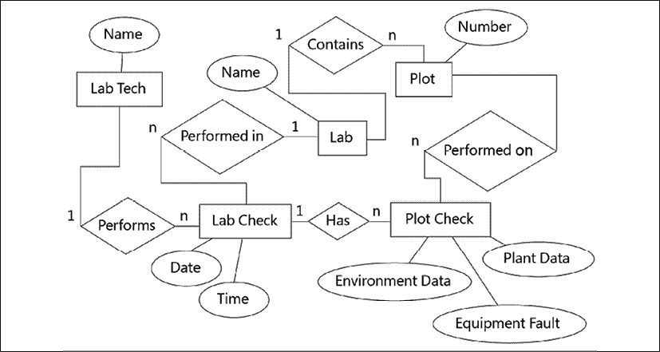

# 第十二章：使用 SQL 提升数据存储

随着时间的推移，实验室出现了一个日益严重的问题：CSV 文件无处不在！冲突的副本、丢失的文件、非数据录入人员更改的记录，以及其他与 CSV 相关的挫折正在困扰着项目。不幸的是，应用程序中的密码保护并没有起到任何有意义的作用，以防止任何人编辑文件和损坏数据。很明显，当前的数据存储解决方案不起作用。需要更好的解决方案！

该设施有一个安装了 PostgreSQL 数据库的较旧的 Linux 服务器。你被要求更新你的程序，使其将数据存储在 PostgreSQL 数据库中，而不是 CSV 文件中，并针对数据库进行用户认证。这样就可以有一个权威的数据源，支持人员可以轻松地管理访问权限。此外，SQL 数据库将有助于强制执行正确的数据类型，并允许比简单的平面文件更复杂的数据关系。这将是你的应用程序的一个重大更新！

本章，你将学习以下主题：

+   在 *PostgreSQL* 中，我们将安装和配置 PostgreSQL 数据库系统。

+   在 *关系数据建模* 中，我们将讨论如何在数据库中结构化数据以实现良好的性能和可靠性。

+   在 *创建 ABQ 数据库* 中，我们将为 ABQ 数据录入应用程序构建一个 SQL 数据库。

+   在 *使用 psycopg2 连接到 PostgreSQL* 中，我们将使用 `psycopg2` 库将我们的程序连接到 PostgreSQL。

+   最后，在 *将 SQL 集成到我们的应用程序中* 中，我们将更新 ABQ 数据录入以利用新的 SQL 数据库。

本章假设你具备基本的 SQL 知识。如果你不具备，请参阅 *附录 B*，*快速 SQL 教程*。

# PostgreSQL

Python 可以与各种关系型数据库进行交互，包括 Microsoft SQL Server、Oracle、MariaDB、MySQL 和 SQLite；在这本书中，我们将专注于 Python 世界中一个非常受欢迎的选择，即 PostgreSQL。PostgreSQL（通常发音为 post-gress，其中 "QL" 静音）是一个免费、开源、跨平台的数据库系统。它作为网络服务运行，你可以使用客户端程序或软件库与其通信。在撰写本文时，版本 13 是当前的稳定版本。

虽然 ABQ 已经提供了一个已经安装和配置好的 PostgreSQL 服务器，但你仍需要在你的工作站上下载和安装软件以进行开发。让我们看看如何让我们的工作站为 PostgreSQL 开发做好准备。

应该永远不要在测试或开发中使用共享的生产资源，如数据库和 Web 服务。始终在你的工作站或单独的服务器机器上设置这些资源的单独开发副本。

## 安装和配置 PostgreSQL

要下载 PostgreSQL，请访问 [`www.postgresql.org/download`](https://www.postgresql.org/download) 并下载适用于您操作系统的安装包。EnterpriseDB（一家为 PostgreSQL 提供付费支持的商业实体）提供了 Windows、macOS、Linux、BSD 和 Solaris 的安装包。这些安装程序包含服务器、命令行客户端和 **pgAdmin** 图形客户端，全部包含在一个包中。要安装软件，请使用具有管理员权限的账户启动安装程序，并按照安装向导中的屏幕操作。在安装过程中，您将被要求为 `postgres` 超级用户账户设置密码；请务必记下此密码。

### 使用图形实用程序配置 PostgreSQL

安装完成后，您可以使用 **pgAdmin** 图形实用程序配置和与 PostgreSQL 交互。从您的应用程序菜单启动 pgAdmin，并按照以下步骤为自己创建一个新的管理员用户：

1.  从左侧的 **浏览器** 窗格中选择 **服务器**。您将被提示输入超级用户密码。

1.  一旦认证，选择 **对象** | **创建** | **登录/组角色**。在 **常规** 选项卡中输入用于数据库访问的用户名。然后访问 **权限** 选项卡以检查 **超级用户** 和 **可以登录**，以及 **定义** 选项卡以设置密码。

1.  在窗口底部点击 **保存** 按钮。

接下来，我们需要创建一个数据库。为此，请按照以下步骤操作：

1.  从菜单中选择 **对象** | **创建** | **数据库**。

1.  将数据库命名为 `abq`，并将您的新用户账户设置为所有者。

1.  在窗口底部点击 **保存** 按钮。

您的数据库现在已准备好使用。您可以通过在 **浏览器** 窗格中选择数据库并点击菜单中的 **工具** | **查询工具** 来开始输入 SQL 语句以运行数据库。

### 使用命令行配置 PostgreSQL

如果您更喜欢直接在命令行中工作，PostgreSQL 包含几个命令行实用程序，包括以下内容：

| 命令 | 描述 |
| --- | --- |
| `createuser` | 创建 PostgreSQL 用户账户 |
| `dropuser` | 删除 PostgreSQL 用户账户 |
| `createdb` | 创建 PostgreSQL 数据库 |
| `dropdb` | 删除 PostgreSQL 数据库 |
| `psql` | 命令行 SQL shell |

例如，在 macOS 或 Linux 上，我们可以使用以下命令完成数据库的配置：

```py
$ sudo -u postgres createuser -sP myusername
$ sudo -u postgres createdb -O myusername abq
$ psql -d abq -U myusername 
```

这三个命令创建用户、创建数据库并打开一个 SQL shell，可以在其中输入查询。请注意，我们使用 `sudo` 命令以 `postgres` 用户身份运行这些命令。请记住，这是您在安装过程中设置的超级用户账户。

尽管 EnterpriseDB 为 Linux 提供了二进制安装程序，但大多数 Linux 用户更愿意使用他们发行版提供的软件包。你可能会得到一个稍微旧一点的 PostgreSQL 版本，但对于大多数基本用例来说这不会很重要。请注意，pgAdmin 通常是一个单独的软件包的一部分，也可能是一个稍微旧一点的版本。无论如何，你应该没有困难地使用较旧版本来跟随这一章节。

# 关系型数据建模

我们的应用程序目前将数据存储在一个单一的 CSV 文件中；这样的文件通常被称为**平面文件**，因为数据已经被展平到二维。虽然这种格式对我们应用程序来说是可接受的，并且可以直接转换为 SQL 表，但一个更准确和有用的数据模型需要更多的复杂性。在本节中，我们将介绍一些数据建模的概念，这将帮助我们将 CSV 数据转换为有效的关系表。

## 主键

关系型数据库中的每个表都应该有一个称为**主键**的东西。主键是一个值，或一组值，它唯一地标识表中的记录；因此，它应该是一个值或一组值，对于表中的每一行都是唯一的且非空的。数据库中的其他表可以使用此字段来引用表中的特定行。这被称为**外键**关系。

我们如何确定一组数据的主键是什么？考虑这个表格：

| 水果 | 分类 |
| --- | --- |
| 香蕉 | 草莓 |
| 香蕉 | 草莓 |
| 橙子 | 柑橘 |
| 柠檬 | 柑橘 |

在这个表中，每一行代表一种水果类型。在这个表中，`水果`列是空的就没有意义，或者两行对于`水果`有相同的值也是不合理的。这使得该列成为主键的完美候选者。

现在考虑一个不同的表格：

| 水果 | 品种 | 数量 |
| --- | --- | --- |
| 香蕉 | 凯文迪什 | 452 |
| 香蕉 | 红色 | 72 |
| 橙子 | 橘子 | 1023 |
| 橙子 | 红色 | 875 |

在这个表中，每一行代表一种水果的亚品种；然而，没有单个字段可以唯一地定义单一水果的单一品种。相反，需要`水果`和`品种`字段。当我们需要多个字段来确定主键时，我们称之为**组合主键**。在这种情况下，我们的组合主键使用了`水果`和`品种`字段。

### 使用代理主键

考虑这个`员工`表：

| 名字 | 姓氏 | 职位 |
| --- | --- | --- |
| 鲍勃 | 史密斯 | 经理 |
| 爱丽丝 | 琼斯 | 分析师 |
| 帕特 | 汤普森 | 开发者 |

假设这个表使用 `First` 和 `Last` 作为复合主键，并且假设数据库中的其他表使用主键引用行。不考虑两个同名同姓的人显然的问题，如果 Bob Smith 决定他更愿意被称为 Robert，或者如果 Alice Jones 结婚并取了新的姓氏，会发生什么？记住，其他表使用主键值来引用表中的行；如果我们更改主键字段的值，引用这些员工的表要么也必须更新，要么将无法在 `employees` 表中找到记录。

虽然使用实际数据字段来构建主键值在理论上可能是最纯粹的方法，但当您开始使用外键关联表时，会出现两个主要的缺点：

+   您必须在需要引用您的表的每个表中重复数据。如果您有许多字段组成的复合键，这可能会变得特别繁琐。

+   您不能更改原始表中的值，否则会破坏外键引用。

因此，数据库工程师可能会选择使用**代理键**。这些通常是存储在**标识列**中的整数或**全局唯一标识符**（**GUID**）值，当记录被插入到表中时，这些值会自动添加到记录中。在 `employees` 表的情况下，我们可以简单地添加一个包含自动递增整数值的 `ID` 字段，如下所示：

| ID | 首名 | 姓氏 | 职位 |
| --- | --- | --- | --- |
| 1 | Bob | Smith | 经理 |
| 2 | Alice | Jones | 分析师 |
| 3 | Pat | Thompson | 开发者 |

现在，其他表可以简单地引用 `employees.ID=1` 或 `employees.ID=2`，这样 `Bob` 和 `Alice` 就可以自由更改他们的名字而不会产生后果。

使用代理键可能会破坏数据库的理论纯粹性；它还可能要求我们手动指定列的唯一性或非空约束，这些约束在它们用作主键时是隐含的。有时，尽管如此，代理键的实用优势可能会超过这些担忧。您需要评估哪种选项最适合您的应用程序及其数据。

在做出这种决定的规则之一是考虑您打算用作键的数据是**描述**还是**定义**了由行表示的项目。例如，一个名字并不定义一个人：一个人可以更改他们的名字，但仍然是同一个人。另一方面，存储在我们 CSV 文件中的检查图是由日期、时间、实验室和检查图值定义的。更改这些值中的任何一个，你就是在引用不同的检查图。

## 规范化

将平面数据文件分解成多个表的过程称为**规范化**。规范化过程被分解成一系列称为**范式**的级别，这些级别逐步消除重复并创建一个更精确的数据模型。尽管有许多范式，但大多数常见业务数据中遇到的问题都可以通过遵循前三个范式来解决。

将数据符合这些形式的目的在于消除冗余、冲突或未定义数据情况的可能性。让我们简要地看一下前三个范式，以及它们能防止哪些问题。

### 第一范式

**第一范式**要求每个字段只包含一个值，并且必须消除重复的列。例如，假设我们有一个看起来像这样的平面文件：

| 水果 | 多种品种 |
| --- | --- |
| 香蕉 | 卡文迪什、红色、苹果 |
| 橙子 | 柑橘、瓦伦西亚、血橙、卡拉卡拉 |

这个表中的`Varieties`字段在一个列中有多个值，所以这个表不在第一范式。我们可能会尝试这样修复它：

| 水果 | 品种 _1 | 品种 _2 | 品种 _3 | 品种 _4 |
| --- | --- | --- | --- | --- |
| 香蕉 | 卡文迪什 | 红色 | 苹果 |  |
| 橙子 | 柑橘、瓦伦西亚、血橙、卡拉卡拉 |

这是一种改进，但它仍然不在第一范式，因为我们有**重复的列**。所有的`Variety_`列代表相同的属性（水果的品种），但被任意地拆分成了不同的列。判断是否有重复列的一种方法是，如果数据无论放入哪一列都是同样有效的；例如，`Cavendish`可以同样地放入`Variety_2`、`Variety_3`或`Variety_4`列。

考虑这种格式的一些问题：

+   如果我们在多个`Variety`字段中有相同的数据意味着什么；例如，如果`Banana`行在`Variety_1`和`Variety_4`中都有`Cavendish`？或者如果`Variety_1`为空，但`Variety_2`有值，这会表明什么？这些模糊的情况被称为**异常**，可能导致数据库中的冲突或混淆数据。

+   查询这个表以查看两种水果是否共享一个品种名称会复杂到什么程度？我们必须检查每个`Variety_`字段与每个其他`Variety_`字段。如果我们需要为某种特定水果超过四种品种怎么办？我们就必须添加列，这意味着我们的查询将变得指数级复杂。

要将这个表提升到第一范式，我们需要创建一个`Fruit`列和一个`Variety`列，类似于这样：

| 水果 | 品种 |
| --- | --- |
| 香蕉 | 卡文迪什 |
| 香蕉 | 红色 |
| 香蕉 | 苹果 |
| 橙子 | 柑橘 |
| 橙子 | 瓦伦西亚 |
| 橙子 | 血橙 |
| 橙子 | 卡拉卡拉 |

注意，这改变了我们表的本质，因为它不再是每 `Fruit` 一行，而是每 `Fruit-Variety` 组合一行。换句话说，主键已从 `Fruit` 变为 `Fruit + Variety`。如果表中还有其他与 `Fruit` 类型相关但与 `Variety` 无关的字段，我们将在查看第二范式时解决该问题。

### 第二范式

**第二范式**要求满足第一范式，并且还要求每个值必须依赖于整个主键。换句话说，如果一个表有主键字段 A、B 和 C，并且列 X 的值仅依赖于列 A 的值，而不考虑 B 或 C，则该表违反了第二范式。例如，假设我们向我们的表中添加了一个 `Classification` 字段，如下所示：

| 水果 | 品种 | 分类 |
| --- | --- | --- |
| 香蕉 | 卡文迪什 | 草莓 |
| 香蕉 | 红色 | 草莓 |
| 橙子 | 柑橘 | 柑橘 |
| 橙子 | 瓜拉尼 | 柑橘 |

在这个表中，`Fruit` 和 `Variety` 构成了每一行的主键。然而，`Classification` 只依赖于 `Fruit`，因为所有香蕉都是草莓，所有橙子都是柑橘。考虑这种格式的缺点：

+   首先，我们有一个数据冗余，因为每种 `Fruit` 类型都会多次列出其 `Classification`（每次 `Fruit` 值重复时都会列出一次）。

+   这种冗余可能导致异常，即相同的 `Fruit` 值在不同的行中有不同的 `Classification` 值。这是没有意义的。

为了解决这个问题，我们需要将我们的表拆分为两个表；一个包含 `Fruit` 和 `Classification`，主键为 `Fruit`，另一个包含 `Fruit` 和 `Variety`，这两个字段共同构成主键。

### 第三范式

**第三范式**要求满足第二范式，并且还要求表中的每个值只依赖于主键。换句话说，给定一个主键为 A 的表，以及数据字段 X 和 Y，Y 的值不能依赖于 X 的值，它只能依赖于 A。

例如，考虑这个表：

| 水果 | 主要出口国家 | 主要出口大陆 |
| --- | --- | --- |
| 香蕉 | 厄瓜多尔 | 南美洲 |
| 橙子 | 巴西 | 南美洲 |
| 苹果 | 中国 | 亚洲 |

这个表符合第二范式，因为这两列都是相对于主键是唯一的——每种水果只能有一个主要的出口国家，以及一个主要的出口大陆。然而，`Leading Export Continent` 的值依赖于 `Leading Export Country` 的值（一个非主键字段），因为一个国家位于一个大陆，与其水果出口无关。这种格式的缺点是：

+   存在数据冗余，因为任何出现多次的国家都会导致其大陆出现多次。

+   再次，这种冗余可能导致异常，即同一个国家可能会列出两个不同的洲。这是没有意义的。

要将此转换为第三范式，我们需要创建一个包含大陆列和任何其他依赖于国家的列的单独的国家表。

### 更多的规范化形式

数据库理论家提出了其他更高的规范化形式，可以帮助进一步消除数据中的模糊性和冗余，但在这本书中，前三个应该足以组织我们的数据。请注意，对于某个应用来说，数据可能存在过度规范化的问题。决定什么构成过度规范化实际上取决于数据和用户。

例如，如果你有一个包含`telephone_1`和`telephone_2`列的联系人数据库，第一范式会规定你应该将电话号码放在它们自己的表中以消除重复字段。但如果你的用户不需要超过两个字段，很少使用第二个字段，并且永远不会对数据进行复杂查询，那么使数据库和应用复杂化以符合理论上的纯模型可能并不值得。

## 实体-关系图

有一个有效的方法可以帮助我们规范化数据并为关系数据库做准备，那就是创建一个**实体-关系图**，或**ERD**。ERD 是一种图表化我们数据库存储信息的事物及其之间关系的方式。

这些“事物”被称为**实体**。实体是一个唯一可识别的对象；它对应于单个表中的一行。实体有**属性**，它们对应于表中的列。实体还与其他实体有**关系**，这对应于我们在 SQL 中定义的外键关系。

让我们考虑我们实验室场景中的实体及其属性和关系：

+   有**实验室**。每个实验室都有一个名字。

+   有**地块**。每个地块属于一个实验室，并有一个编号。每个地块中种植一个单独的种子样本。

+   有**实验室技术人员**，他们每个人都有一个名字。

+   有**实验室检查**，这些检查由实验室的技术人员在一个特定的实验室进行。每个实验室检查都有一个日期和时间。

+   有**地块检查**，这是在实验室检查期间在单个地块上收集的数据。每个地块检查都记录了各种植物和环境数据。

下面的图显示了这些实体及其关系：



图 12.1：我们 ABQ 数据的实体-关系图

在此图中，实体由矩形表示。我们有五个实体：`Lab`、`Plot`、`Lab Tech`、`Lab Check` 和 `Plot Check`。每个实体都有属性，由椭圆形表示。实体之间的关系由菱形表示，其中的文字描述了从左到右的关系。例如，`Lab Tech` 执行 `Lab Check`，并且 `Lab Check` 在 `Lab` 中执行。注意关系周围的小 *1* 和 *n* 字符：这些显示了关系的**基数**。数据库中常见三种基数类型：

+   **一对多**（1 到 n）的关系，其中左表中的一行与右表中的多行相关联。例如，一个 `Lab Tech` 执行多个 `Lab Checks`。

+   **多对一**（n 到 1）的关系，其中左表中的多行与右表中的同一行相关联。例如，在同一个“实验室”中执行多个“实验室检查”。

+   **多对多**（n 到 n）的关系，其中左表中的多行与右表中的多行相关联。例如，如果我们需要更新我们的数据库以允许一个以上的技术人员在同一实验室检查中工作，那么一个实验室技术人员仍然会执行多个检查，但一个检查会有多个技术人员（幸运的是，我们不需要实现这一点！）。

此图表示了我们数据的一个合理规范结构。要在 SQL 中实现它，我们只需为每个实体创建一个表，为每个属性创建一个列，并为每个关系创建一个外键关系。但在我们这样做之前，让我们再考虑一件事：SQL 数据类型。

## 分配数据类型

标准 SQL 定义了 16 种数据类型，包括各种大小的整数和浮点数类型、固定或可变大小的 ASCII 或 Unicode 字符串类型、日期和时间类型以及单比特类型。除了实现标准类型外，几乎每个 SQL 引擎都通过添加更多类型来扩展此列表，以适应二进制数据、JSON 数据、货币值、网络地址和其他特殊类型的字符串或数字。许多数据类型似乎有点冗余，并且有几个别名可能在实现之间不同。为您的列选择数据类型可能会令人惊讶地复杂！

对于 PostgreSQL，以下图表提供了一些合理的选择：

| 存储的数据 | 推荐类型 | 备注 |
| --- | --- | --- |
| 固定长度字符串 | `CHAR` | 需要长度，例如，`CHAR(256)`。 |
| 短到中等长度的字符串 | `VARCHAR` | 需要一个最大长度参数，例如，`VARCHAR(256)`。 |
| 长文本，自由格式 | `TEXT` | 长度无限，性能较慢。 |
| 较小的整数 | `SMALLINT` | 范围为 ±32,767。 |
| 大多数整数 | `INT` | 大约 ±2.1 亿。 |
| 较大的整数 | `BIGINT` | 大约 ±922 万亿。 |
| 小数数字 | `NUMERIC` | 可选长度和精度参数。 |
| 整数主键 | `SERIAL, BIGSERIAL` | 自动递增的整数或大整数。 |
| 布尔值 | `BOOLEAN` | 可以是 TRUE、FALSE 或 NULL。 |
| 日期和时间 | `TIMESTAMP WITH TIMEZONE` | 存储日期、时间和时区。精确到 1 µs。 |
| 日期无时间 | `DATE` | 存储日期。 |
| 时间无日期 | `TIME` | 可以带或不带时区。 |

这些类型可能满足大多数应用中的绝大多数需求，我们将使用这些类型的一个子集来构建我们的 ABQ 数据库。随着我们创建表格，我们将参考我们的数据字典，并为我们的列选择适当的数据类型。

请注意不要选择过于具体或限制性的数据类型。任何数据最终都可以存储在`TEXT`字段中；选择更具体类型的目的是主要为了能够使用特定于该类型数据的运算符、函数或排序。如果那些不是必需的，考虑一个更通用的类型。例如，电话号码和美国社会保障号码可以用纯数字表示，但这并不是将它们做成`INTEGER`或`NUMERIC`字段的原因；毕竟，你不会对它们进行算术运算！

# 创建 ABQ 数据库

现在我们已经建模了数据，并对可用的数据类型有了感觉，是时候构建我们的数据库了。确保你已经安装了 PostgreSQL，并如本章第一部分所述创建了`abq`数据库，然后让我们开始编写 SQL 来创建我们的数据库结构。

在你的项目根目录下，创建一个名为`sql`的新目录。在`sql`目录内，创建一个名为`create_db.sql`的文件。我们将从这里开始编写我们的表定义查询。

## 创建我们的表格

我们创建表格的顺序很重要。任何在外键关系中引用的表格都必须在定义关系之前存在。因此，最好从你的查找表开始，沿着一对一关系的链条继续，直到所有表格都创建完成。在我们的 ERD 中，这从大致的左上角延伸到右下角。

### 创建查找表

我们需要创建以下三个查找表：

+   `labs`：这个查找表将包含我们实验室的 ID 字符串。由于实验室的名称不会改变，我们将只使用单字母名称作为主键值。

+   `lab_techs`：这个查找表将包含实验室技术人员的姓名。由于我们不希望使用员工姓名作为主键，我们将创建一个员工 ID 号码的列，并使用它作为主键。

+   `plots`：这个查找表将为每个物理地块创建一行，通过实验室和地块编号进行标识。它还将跟踪地块中种植的当前种子样本。

将创建这些表格的 SQL 查询添加到`create_db.sql`文件中，如下所示：

```py
# create_db.sql
CREATE TABLE labs (id CHAR(1) PRIMARY KEY);
CREATE TABLE lab_techs (
  id SMALLINT PRIMARY KEY,
  name VARCHAR(512) UNIQUE NOT NULL
);
CREATE TABLE plots (
  lab_id CHAR(1) NOT NULL REFERENCES labs(id),
  plot SMALLINT NOT NULL,
  current_seed_sample CHAR(6),
  PRIMARY KEY(lab_id, plot),
  CONSTRAINT valid_plot CHECK (plot BETWEEN 1 AND 20)
); 
```

一旦创建，这三个表格看起来可能像这样：

| lab_id |
| --- |
| A |
| B |
| C |

实验室表

| id | name |
| --- | --- |
| 4291 | J Simms |
| 4319 | P Taylor |

实验室技术人员表

| lab_id | plot | current_seed_sample |
| --- | --- | --- |
| A | 1 | AXM477 |
| A | 2 | AXM478 |
| A | 3 | AXM479 |

地块表

虽然这些表可能看起来非常简单，但它们将有助于强制数据完整性，并使动态从数据库构建接口变得简单。例如，由于我们将从数据库中填充我们的 `Labs` 小部件，因此向应用程序添加一个新的实验室只是向数据库中添加一行的问题。

### `lab_checks` 表

`lab_checks` 表的每一行代表一个技术人员在给定日期的特定时间检查实验室所有图表的一个实例。我们将使用以下 SQL 来定义它：

```py
CREATE TABLE lab_checks(
  date DATE NOT NULL, time TIME NOT NULL,
  lab_id CHAR(1) NOT NULL REFERENCES labs(id),
  lab_tech_id SMALLINT NOT NULL REFERENCES lab_techs(id),
  PRIMARY KEY(date, time, lab_id)
); 
```

当创建并填充时，表将看起来像这样：

| 日期 | 时间 | 实验室 ID | 实验室技术人员 ID |
| --- | --- | --- | --- |
| 2021-10-01 | 8:00 | A | 4291 |

`lab_checks` 表

`date`、`time` 和 `lab_id` 列共同唯一地标识一个实验室检查，因此我们将它们共同指定为主键。进行检查的实验室技术人员的 ID 是这个表中的唯一属性，并创建与 `lab_techs` 表的外键关系。

### `plot_checks` 表

图表检查是在各个图表收集的实际数据记录。这些每个都属于一个实验室检查，因此必须使用三个键值 `date`、`time` 和 `lab_id` 回指现有的实验室检查。

我们将从主键列开始：

```py
CREATE TABLE plot_checks(
  date DATE NOT NULL,
  time TIME NOT NULL,
  lab_id CHAR(1) NOT NULL REFERENCES labs(id),
  plot SMALLINT NOT NULL, 
```

`plot_checks` 的主键基本上是 `lab_check` 表的主键，增加了图表编号；其键约束如下所示：

```py
 PRIMARY KEY(date, time, lab_id, plot),
  FOREIGN KEY(date, time, lab_id)
    REFERENCES lab_checks(date, time, lab_id),
  FOREIGN KEY(lab_id, plot) REFERENCES plots(lab_id, plot), 
```

现在我们已经定义了主键列，我们可以添加属性列：

```py
 seed_sample CHAR(6) NOT NULL,
  humidity NUMERIC(4, 2) CHECK (humidity BETWEEN 0.5 AND 52.0),
  light NUMERIC(5, 2) CHECK (light BETWEEN 0 AND 100),
  temperature NUMERIC(4, 2) CHECK (temperature BETWEEN 4 AND 40),
  equipment_fault BOOLEAN NOT NULL,
  blossoms SMALLINT NOT NULL CHECK (blossoms BETWEEN 0 AND 1000),
  plants SMALLINT NOT NULL CHECK (plants BETWEEN 0 AND 20),
  fruit SMALLINT NOT NULL CHECK (fruit BETWEEN 0 AND 1000),
  max_height NUMERIC(6, 2) NOT NULL
    CHECK (max_height BETWEEN 0 AND 1000),
  min_height NUMERIC(6, 2) NOT NULL
    CHECK (min_height BETWEEN 0 AND 1000),
  median_height NUMERIC(6, 2) NOT NULL
  CHECK (median_height BETWEEN min_height AND max_height),
  notes TEXT
); 
```

当创建并填充时，表的最初几列看起来像这样：

| 日期 | 时间 | 实验室 | 图表 | 种子样本 | 湿度 | 光照 | （等等...） |
| --- | --- | --- | --- | --- | --- | --- | --- |
| 2021-10-01 | 08:00:00 | A | 1 | AXM477 | 24.19 | 0.97 |  |
| 2021-10-01 | 08:00:00 | A | 2 | AXM478 | 23.62 | 1.03 |  |

`plot_checks` 表

注意我们使用数据类型和 `CHECK` 约束来复制规范的数据字典中定义的限制。使用这些，我们利用了数据库的强大功能来保护无效数据。这完成了我们对 ABQ 数据库的表定义。

## 创建一个视图

在我们完成数据库设计之前，我们将创建一个 **视图**，这将简化我们数据的访问。视图在大多数方面表现得像一张表，但它不包含实际数据；它实际上只是一个存储的 `SELECT` 查询。我们将创建一个名为 `data_record_view` 的视图，以重新排列我们的数据，以便更容易与 GUI 交互。

视图是通过使用 `CREATE VIEW` 命令创建的，它开始如下：

```py
# create_db.sql
CREATE VIEW data_record_view AS ( 
```

接下来，在括号内，我们放入将返回我们视图中所需表数据的 `SELECT` 查询：

```py
SELECT pc.date AS "Date", to_char(pc.time, 'FMHH24:MI') AS "Time",
  lt.name AS "Technician", pc.lab_id AS "Lab", pc.plot AS "Plot",
  pc.seed_sample AS "Seed Sample", pc.humidity AS "Humidity",
  pc.light AS "Light", pc.temperature AS "Temperature",
  pc.plants AS "Plants", pc.blossoms AS "Blossoms",
  pc.fruit AS "Fruit", pc.max_height AS "Max Height",
  pc.min_height AS "Min Height", pc.median_height AS "Med Height",
  pc.notes AS "Notes"
FROM plot_checks AS pc
  JOIN lab_checks AS lc ON pc.lab_id = lc.lab_id
  AND pc.date = lc.date AND pc.time = lc.time
  JOIN lab_techs AS lt ON lc.lab_tech_id = lt.id
 ); 
```

我们正在选择 `plot_checks` 表，并通过外键关系将其与 `lab_checks` 和 `lab_techs` 表连接。请注意，我们已使用 `AS` 关键字对这些表进行了别名设置。这样的简短别名可以帮助使大型查询更易于阅读。我们还将每个字段别名为应用程序数据结构中使用的名称。这些名称必须用双引号括起来，以便使用空格并保留大小写。通过使列名与我们的应用程序中的数据字典键匹配，我们就不需要在应用程序代码中翻译字段名。

视图的前几列看起来像这样；将其与上面的原始 `plot_checks` 表进行比较：

| 日期 | 时间 | 技术员 | 实验室 | 图表 | 种子样本 | 湿度 | 光照 |
| --- | --- | --- | --- | --- | --- | --- | --- |
| 2021-10-01 | 8:00 | J Simms | A | 1 | AXM477 | 24.19 | 0.97 |
| 2021-10-01 | 8:00 | J Simms | A | 2 | AXM478 | 23.62 | 1.03 |

SQL 数据库引擎，如 PostgreSQL，在连接和转换表格数据方面非常高效。尽可能利用这种力量，让数据库为您的应用程序方便地格式化数据。

这完成了我们的数据库创建脚本。在您的 PostgreSQL 客户端中运行此脚本，并验证是否已创建了四个表和视图。要在 pgAdmin 中执行脚本，首先从 **工具** | **查询工具** 打开 **查询工具**，然后通过点击 **查询编辑器** 窗口上方的文件夹图标打开文件。文件打开后，点击播放按钮图标来执行它。要在命令行中运行脚本，请在终端执行以下命令：

```py
$ cd ABQ_Data_Entry/sql
$ psql -U myuser -d abq < create_db.sql 
```

## 填充查找表

虽然所有表都已创建，但在我们可以使用它们之前，查找表需要被填充；具体来说：

+   `labs` 应该有 `A` 到 `C` 的值，代表三个实验室。

+   `lab_techs` 需要我们四位实验室技术人员的姓名和 ID 号：J Simms（4291）、P Taylor（4319）、Q Murphy（4478）和 L Taniff（5607）。

+   `plots` 需要所有 60 个图表，每个实验室的编号从 1 到 20。种子样本在四个值之间旋转，例如 AXM477、AXM478、AXM479 和 AXM480。

您可以使用 pgAdmin 手动填充这些表，或使用示例代码中包含的 `lookup_populate.sql` 脚本。就像执行 `create_db.sql` 脚本一样执行它。

现在我们的数据库已准备好与应用程序一起使用。让我们让应用程序准备好与数据库一起工作！

# 使用 psycopg2 连接到 PostgreSQL

现在我们有一个很好的数据库可以与之一起使用，我们如何让我们的应用程序使用它？要从我们的应用程序中执行 SQL 查询，我们需要安装一个可以直接与我们的数据库通信的 Python 库。在 Python 中，每个不同的 SQL 产品都有一到多个库可用于与之集成。

对于 PostgreSQL，最流行的选择是`psycopg2`。`psycopg2`库不是 Python 标准库的一部分，因此您需要在运行应用程序的任何机器上安装它。您可以在[`initd.org/psycopg/docs/install.html`](http://initd.org/psycopg/docs/install.html)找到最新的安装说明；然而，首选的方法是使用`pip`。

对于 Windows、macOS 和 Linux，以下命令应该有效：

```py
$ pip install --user psycopg2-binary 
```

如果这不起作用，或者您宁愿从源代码安装它，请检查网站上的要求。请注意，`psycopg2`库是用 C 语言编写的，而不是 Python，因此需要 C 编译器和一些其他开发包才能从源代码安装。

Linux 用户通常可以从其发行版的软件包管理系统中安装`psycopg2`。

## psycopg2 基础知识

使用`psycopg2`的基本工作流程如下：

1.  首先，我们使用`psycopg2.connect()`创建一个`Connection`对象。此对象代表我们与数据库引擎的连接，并用于管理我们的登录会话。

1.  接下来，我们使用`Connection`对象的`cursor()`方法从我们的连接中创建一个`Cursor`对象。**游标**是我们与数据库引擎交互的点。

1.  我们可以通过将 SQL 字符串传递给游标的`execute()`方法来运行查询。

1.  如果我们的查询返回数据，我们可以使用游标的`fetchone()`或`fetchall()`方法检索数据。

以下脚本演示了`psycopg2`的基本用法：

```py
# psycopg2_demo.py
import psycopg2 as pg
from getpass import getpass
cx = pg.connect(
  host='localhost',  database='abq',
  user=input('Username: '),
  password=getpass('Password: ')
)
cur = cx.cursor()
cur.execute("""
  CREATE TABLE test
  (id SERIAL PRIMARY KEY, val TEXT)
""")
cur.execute("""
  INSERT INTO test (val)
  VALUES ('Banana'), ('Orange'), ('Apple');
""") 
```

我们首先导入`psycopg2`并将其别名为`pg`以简化；我们还导入了`getpass`以提示用户输入密码。接下来，我们使用`connect()`函数生成一个连接对象`cx`，传递所有必要的详细信息以定位数据库服务器并对其进行身份验证。这些详细信息包括服务器的主机名、数据库名称和身份验证凭证。`host`参数可以是运行 PostgreSQL 服务器的服务器名称、IP 地址或完全限定的域名。由于我们在本地系统上运行 PostgreSQL，所以我们在这里使用了`localhost`，它指向我们的本地系统。

从连接中，我们创建一个游标对象`cur`。最后，我们使用了游标的`execute()`方法来执行两个 SQL 查询。

现在，让我们从数据库中检索一些数据，如下所示：

```py
cur.execute("SELECT * FROM test")
num_rows = cur.rowcount
data = cur.fetchall()
print(f'Got {num_rows} rows from database:')
print(data) 
```

您可能期望从查询中检索到的数据在`execute()`的返回值中找到；然而，情况并非如此。相反，我们执行查询，然后使用游标的方法和属性来检索数据和执行的相关元数据。在这种情况下，我们使用了`fetchall()`一次性检索所有数据行。我们还使用了游标的`rowcount`属性来查看从数据库返回了多少行。

PostgreSQL 是一个 **事务型数据库**，这意味着修改操作（如我们的 `CREATE` 和 `INSERT` 语句）不会自动保存到磁盘。为了做到这一点，我们需要 **提交** 事务。在 `psycopg2` 中，我们可以使用连接对象的 `commit()` 方法来完成，如下所示：

```py
cx.commit() 
```

如果我们不提交，我们在连接退出时所做的更改将不会被保存。当我们的应用程序或脚本退出时，连接会自动退出，但我们可以使用连接的 `close()` 方法显式退出，如下所示：

```py
cx.close() 
```

在创建 `Connection` 对象时，您可以指定 `autocommit=True`，这样 `psycopg2` 就会在每次查询后隐式提交事务。这是一个方便的便利功能，尤其是在使用 shell 中的 PostgreSQL 时。

## 参数化查询

很常见的情况是我们需要在 SQL 查询中包含运行时数据，例如用户输入的数据。您可能会倾向于使用 Python 强大的字符串格式化功能来完成此操作，如下所示：

```py
new_item = input('Enter new item: ')
cur.execute(f"INSERT INTO test (val) VALUES ('{new_item}')")
cur.execute('SELECT * FROM test')
print(cur.fetchall()) 
```

*绝对不要这样做!* 虽然一开始可能有效，但它会创建一个称为 **SQL 注入漏洞** 的漏洞。换句话说，它将允许程序的用户输入他们想要的任何 SQL 命令。例如，我们可以执行脚本并添加如下恶意数据：

```py
$ python psycopg2_demo.py
Username: alanm
Password:
Got 3 rows from database:
[(1, 'Banana'), (2, 'Orange'), (3, 'Apple')]
Enter new item: '); DROP TABLE test; SELECT ('
Traceback (most recent call last):
  File "/home/alanm/psycopg2_demo.py", line 37, in <module>
    cur.execute('SELECT * FROM test')
psycopg2.errors.UndefinedTable: relation "test" does not exist
LINE 1: SELECT * FROM test 
```

在这个例子中，我们执行了程序并输入了一个字符串，该字符串关闭了我们的编码 SQL 语句并添加了一个 `DROP TABLE` 语句。然后它添加了一个部分 `SELECT` 语句以避免 SQL 引擎的语法错误。结果是 `test` 表被删除，当我们尝试从它查询数据时出现异常！

SQL 注入漏洞已经困扰应用程序数十年，并成为许多高调黑客灾难的源头。幸运的是，`psycopg2` 通过使用 **参数化查询** 给我们提供了避免这种情况的方法。前面代码的参数化版本如下所示：

```py
new_item = input('Enter new item: ')
**cur.execute(****"INSERT INTO test (val) VALUES (%s)"****, (new_item,))**
cur.execute('SELECT * FROM test')
print(cur.fetchall()) 
```

要参数化一个查询，我们使用 `%s` 字符串来代替我们想要插入查询中的值。这些值本身作为 `execute()` 方法的第二个参数传入。对于多个值，参数值应该作为列表或元组传入，并将按顺序替换 `%s` 出现的位置。

对于复杂的查询，我们还可以给每个参数一个名称，并传入一个字典来匹配值；例如：

```py
cur.execute(
  "INSERT INTO test (val) VALUES (%(item)s)",
  {'item': new_item}
) 
```

参数的名称放在百分号和 `s` 字符之间的括号中。名称将与参数值字典中的键匹配，并在数据库执行查询时进行替换。

这个参数字符串中的 `s` 被称为 **格式说明符**，它源自 Python 的原始字符串替换语法。它是必需的，并且应该 *始终* 是 `s`。如果您参数化的查询导致无效格式说明符错误，那是因为您忘记了 `s` 或使用了不同的字符。

参数化查询负责正确转义和清理我们的数据，从而使得 SQL 注入攻击几乎不可能。例如，如果我们尝试使用参数化代码的先前黑客攻击，我们会得到以下结果：

```py
Enter new item: '); DROP TABLE test; SELECT ('
[(1, 'Banana'), (2, 'Orange'), (3, 'Apple'), (4, "'); DROP TABLE test; SELECT ('")] 
```

不仅参数化查询可以保护我们免受 SQL 注入攻击，而且它们还会自动将某些 Python 类型转换为 SQL 值；例如，Python `date` 和 `datetime` 对象会自动转换为 SQL 识别为日期的字符串，而 `None` 会自动转换为 SQL `NULL`。

注意，参数仅适用于 *数据值*；没有方法可以对其他查询内容进行参数化，如表名或命令。

## 特殊游标类

默认情况下，`Cursor.fetchall()` 将我们的查询结果作为元组的列表返回。如果我们有一个一列或两列的表，这可能是可以接受的，但对于像我们的 ABQ 数据库中的大表，很快就会变成一个问题，即记住哪个元组索引对应哪个字段。理想情况下，我们希望能够通过名称引用字段。

为了适应这一点，`psycopg2` 允许我们为我们的连接对象指定一个 **游标工厂** 类，允许我们使用具有自定义行为的游标对象。`psycopg2` 中包含的一个这样的自定义游标类是 `DictCursor` 类。我们这样使用它：

```py
# psycopg2_demo.py
**from** **psycopg2.extras** **import** **DictCursor**
cx = pg.connect(
  host='localhost',  database='abq',
  user=input('Username: '),
  password=getpass('Password: '),
  **cursor_factory=DictCursor**
) 
```

`DictCursor` 在 `psycopg2.extras` 模块中找到，因此我们必须从主模块单独导入它。一旦导入，我们将它传递给 `connect()` 函数的 `cursor_factory` 参数。现在，行将以 `DictRow` 对象的形式返回，可以像字典一样处理：

```py
cur.execute("SELECT * FROM test")
data = cur.fetchall()
for row in data:
    print(row['val']) 
```

当处理大量列时，这要方便得多。

关于 `psycopg2` 的更多信息可以在其官方文档中找到：[`www.psycopg.org/docs/`](https://www.psycopg.org/docs/)。

# 将 SQL 集成到我们的应用程序中

将我们的应用程序转换为 SQL 后端将是一项艰巨的任务。应用程序是围绕 CSV 文件假设构建的，尽管我们已经尽力分离关注点，但许多事情都需要改变。

让我们分解我们需要采取的步骤：

+   我们需要创建一个新的模型来与 SQL 数据库进行接口。

+   我们的 `Application` 类将需要使用 SQL 模型，并且可能需要根据结果调整一些行为。

+   记录表单需要重新排序以优先考虑我们的关键字段，使用新的查找表，并使用数据库中的信息自动填充。

+   记录列表需要调整以与新数据模型和主键一起工作。

让我们开始吧！

## 创建一个新的模型

我们将在 `models.py` 中开始导入 `psycopg2` 和 `DictCursor`：

```py
# models.py
import psycopg2 as pg
from psycopg2.extras import DictCursor 
```

如前一小节所学，`DictCursor` 允许我们以 Python 字典而不是默认的元组形式获取结果，这在我们应用程序中更容易处理。

现在，开始一个新的模型类 `SQLModel`，并像这样复制 `CSVModel` 的 `fields` 属性：

```py
# models.py
class SQLModel:
  """Data Model for SQL data storage"""
  fields = {
    "Date": {'req': True, 'type': FT.iso_date_string},
    "Time": {'req': True, 'type': FT.string_list,
     'values': ['8:00', '12:00', '16:00', '20:00']},
    # etc. ... 
```

然而，我们需要对这个字典做一些修改。首先，我们的有效实验室和绘图值将从数据库中提取，而不是在这里硬编码，所以我们将它们指定为空列表，并在初始化器中填充它们。此外，技术人员字段将变成一个下拉选择，也由数据库填充，所以我们需要将其类型改为 `string_list`，并将 `values` 参数的列表留空。

这三个条目应该看起来像这样：

```py
# models.py, in the SQLModel.fields property
    "Technician": {
      'req': True, 'type':  FT.string_list, 'values': []
    },
    "Lab": {
      'req': True, 'type': FT.short_string_list, 'values': []
    },
    "Plot": {
      'req': True, 'type': FT.string_list, 'values': []
    }, 
```

在我们编写初始化器之前，让我们创建一个方法来封装查询和检索数据周围的许多样板代码。我们将把这个方法命名为 `query()`；像这样将其添加到 `SQLModel` 类中：

```py
# models.py, inside SQLModel
  def query(self, query, parameters=None):
    with self.connection:
      with self.connection.cursor() as cursor:
        cursor.execute(query, parameters)

        if cursor.description is not None:
          return cursor.fetchall() 
```

此方法接受一个查询字符串，以及可选的参数序列。在方法内部，我们首先使用 `Connection` 对象打开一个上下文块。以这种方式使用连接意味着如果查询成功，`psycopg2` 将自动提交事务。接下来，我们生成我们的 `Cursor` 对象，也使用上下文管理器。通过将游标用作上下文管理器，如果 `execute()` 方法抛出异常，`psycopg2` 将自动 **回滚** 我们的事务。回滚是提交数据库的相反：不是保存更改，而是丢弃它们，并从上次提交（或会话的开始，如果我们还没有调用 `commit()`）时的数据库状态开始。回滚后，异常将被重新抛出，以便我们可以在调用代码中处理它，并且，在任何情况下，当块退出时，游标都将关闭。本质上，它等同于以下内容：

```py
 cursor = self.connection.cursor()
    try:
      cursor.execute(query, parameters)
    except (pg.Error) as e:
      self.connection.rollback()
      raise e
    finally:
      cursor.close() 
```

如果我们成功执行查询并且它返回数据，该方法需要返回这些数据。为了确定是否返回了数据，我们检查 `cursor.description` 属性。`cursor.description` 属性返回由我们的查询返回的表的标题列表；如果我们的查询没有返回数据（例如 `INSERT` 查询），它被设置为 `None`。重要的是要意识到，如果没有从查询返回数据，`fetchall()` 将引发异常，所以我们应该在执行之前检查 `description`。

现在我们有了这个方法，我们可以轻松地从数据库中检索结果，如下所示：

```py
 def some_method(self):
    return self.query('SELECT * FROM table') 
```

为了了解我们如何使用查询方法，让我们先给这个类添加一个初始化器方法：

```py
# models.py, inside SQLModel
  def __init__(self, host, database, user, password):
    self.connection = pg.connect(
      host=host, database=database,
      user=user, password=password,
      cursor_factory=DictCursor
    )
    techs = self.query("SELECT name FROM lab_techs ORDER BY name")
    labs = self.query("SELECT id FROM labs ORDER BY id")
    plots = self.query(
      "SELECT DISTINCT plot FROM plots ORDER BY plot"
    )
    self.fields['Technician']['values'] = [
      x['name'] for x in techs
    ]
    self.fields['Lab']['values'] = [x['id'] for x in labs]
    self.fields['Plot']['values'] = [
      str(x['plot']) for x in plots
    ] 
```

`__init__()` 方法接受数据库连接详情，并使用 `psycopg2.connect()` 建立数据库连接，将 `cursor_factory` 设置为 `DictCursor`。然后，我们使用我们新的 `query()` 方法查询数据库，获取我们三个查找表中的相关列，使用列表推导来简化每个查询的结果，以形成相应的 `values` 列表。

接下来，我们需要编写应用程序调用来从模型检索数据的那些方法。我们将从 `get_all_records()` 开始，它看起来像这样：

```py
 def get_all_records(self, all_dates=False):
    query = (
      'SELECT * FROM data_record_view '
      'WHERE NOT %(all_dates)s OR "Date" = CURRENT_DATE '
      'ORDER BY "Date" DESC, "Time", "Lab", "Plot"'
    )
    return self.query(query, {'all_dates': all_dates}) 
```

由于我们的用户习惯于只处理当前天的数据，我们默认只显示这些数据，但添加一个可选标志，以便我们将来需要检索所有时间的数据。要在 PostgreSQL 中检索当前日期，我们可以使用`CURRENT_DATE`常量，该常量始终根据服务器持有当前日期。请注意，我们使用预定义查询将`all_dates`值传递到查询中。

接下来，让我们创建`get_record()`：

```py
 def get_record(self, rowkey):
    date, time, lab, plot = rowkey
    query = (
      'SELECT * FROM data_record_view '
      'WHERE "Date" = %(date)s AND "Time" = %(time)s '
      'AND "Lab" = %(lab)s AND "Plot" = %(plot)s'
    )
    result = self.query(
      query,
      {"date": date, "time": time, "lab": lab, "plot": plot}
    )
    return result[0] if result else dict() 
```

此方法代表了从`CSVModel`类界面上的一个变化。我们不再处理行号；相反，行由其主键值来标识。在我们的记录（即绘图检查）的情况下，我们需要日期、时间、实验室和绘图来标识一个记录。为了方便，我们将以（`日期`，`时间`，`实验室`，`绘图`）的格式将此值作为元组传递。因此，我们的方法首先将`rowkey`元组提取到这四个值中。

一旦我们有了这些值，我们可以使用预定义查询从我们创建的视图中检索所有记录数据。请注意，即使查询结果是一行，`query()`方法也将结果作为列表返回。然而，我们的应用程序期望从`get_record()`获取单个数据字典，因此我们的`return`语句在列表不为空时提取`result`中的第一个项目，如果为空，则返回空字典。

获取实验室检查记录非常相似：

```py
 def get_lab_check(self, date, time, lab):
    query = (
      'SELECT date, time, lab_id, lab_tech_id, '
      'lt.name as lab_tech FROM lab_checks JOIN lab_techs lt '
      'ON lab_checks.lab_tech_id = lt.id WHERE '
      'lab_id = %(lab)s AND date = %(date)s AND time = %(time)s'
    )
    results = self.query(
      query, {'date': date, 'time': time, 'lab': lab}
    )
    return results[0] if results else dict() 
```

在此查询中，我们使用连接来确保我们有技术人员名称而不是仅 ID。此方法在`CSVModel`中不存在，因为我们尚未规范化数据；但它将在我们的`save_record()`方法和我们的表单自动化方法中派上用场。

### 保存数据

在我们的 SQL 模型中保存数据比 CSV 复杂一些，因为每个数据记录由两个不同的表中的行表示：`lab_checks`和`plot_checks`表。当我们尝试保存记录时，我们需要考虑三种可能性：

+   对于给定的日期、时间、实验室和绘图，既没有实验室检查记录也没有绘图检查记录。在这种情况下，需要创建实验室检查和绘图检查记录。

+   对于给定的日期、时间和实验室，实验室检查存在，但对于给定的绘图，没有相应的绘图检查存在。在这种情况下，需要更新实验室检查记录（以防用户想要更正技术人员值），并且需要添加绘图检查记录。

+   实验室检查和绘图检查都存在。在这种情况下，都需要使用提交的非主键值进行更新。

我们实现的`save_record()`方法需要检查这些条件，并对每个表运行适当的`INSERT`或`UPDATE`查询。

我们还需要考虑用户在编辑现有记录时更新主键字段的可能性。在这种情况下，模型应该做什么？让我们考虑：

+   从用户的角度来看，他们在应用程序中填写的每一条记录都对应一个图表检查。

+   图表检查基于其日期、时间和实验室与实验室检查相关联。

+   因此，如果用户更改了这些关键字段之一，他们最有可能的意图是将图表检查记录与不同的实验室检查相关联，而不是更改它已经关联的实验室检查记录。

+   由于从 GUI 的角度来看，用户正在更新现有记录而不是添加新记录，因此，更新由更改前的日期、时间、实验室和图表值标识的图表检查，并用新输入的字段值更新这些字段是有意义的。

因此，当我们确定是否运行`INSERT`或`UPDATE`查询时，我们应该根据实验室检查的*输入数据*来决定，但对于图表检查的*关键数据*。

让我们通过编写我们的查询来实现这个逻辑，我们将把这些查询存储在类变量中，以使`save_record()`方法更加简洁。

我们将开始编写实验室检查查询：

```py
# models.py, in SQLModel
  lc_update_query = (
    'UPDATE lab_checks SET lab_tech_id = '
    '(SELECT id FROM lab_techs WHERE name = %(Technician)s) '
    'WHERE date=%(Date)s AND time=%(Time)s AND lab=%(Lab)s'
  )
  lc_insert_query = (
    'INSERT INTO lab_checks VALUES (%(Date)s, %(Time)s, %(Lab)s, '
    '(SELECT id FROM lab_techs WHERE name LIKE %(Technician)s))'
  ) 
```

这些查询相当直接，但请注意我们在每种情况下都使用了子查询来填充`lab_tech_id`。我们的应用程序将不知道实验室技术人员的 ID 是什么，因此我们需要通过名称查找 ID。此外，请注意我们的参数名称与模型`fields`字典中使用的名称相匹配。这将使我们免于重新格式化从表单获取的记录数据。

图表检查查询更长，但并不更复杂：

```py
 pc_update_query = (
    'UPDATE plot_checks SET seed_sample = %(Seed Sample)s, '
    'humidity = %(Humidity)s, light = %(Light)s, '
    'temperature = %(Temperature)s, '
    'equipment_fault = %(Equipment Fault)s, '
    'blossoms = %(Blossoms)s, plants = %(Plants)s, '
    'fruit = %(Fruit)s, max_height = %(Max Height)s, '
    'min_height = %(Min Height)s, median_height = %(Med Height)s, '
    'notes = %(Notes)s WHERE date=%(key_date)s AND time=%(key_time)s '
    'AND lab_id=%(key_lab)s AND plot=%(key_plot)s')
  pc_insert_query = (
    'INSERT INTO plot_checks VALUES (%(Date)s, %(Time)s, %(Lab)s,'
    ' %(Plot)s, %(Seed Sample)s, %(Humidity)s, %(Light)s,'
    ' %(Temperature)s, %(Equipment Fault)s, %(Blossoms)s,'
    ' %(Plants)s, %(Fruit)s, %(Max Height)s, %(Min Height)s,'
    ' %(Med Height)s, %(Notes)s)') 
```

注意，在`UPDATE`查询的`WHERE`子句中使用的参数名称以`key_`为前缀；这将允许我们根据行键中的日期、时间、实验室和图表值更新由这些值标识的记录，如前所述。

查询就绪后，我们可以开始编写`save_record()`方法：

```py
# models.py, inside SQLModel
  def save_record(self, record, rowkey):
    if rowkey:
      key_date, key_time, key_lab, key_plot = rowkey
      record.update({
        "key_date": key_date,
        "key_time": key_time,
        "key_lab": key_lab,
        "key_plot": key_plot
      }) 
```

`CSVModel.save_record()`方法接受一个记录字典和一个整数值`rownum`，以确定哪个记录将被更新（如果是新记录，则为`None`）。在我们的数据库中，我们使用复合键来标识图表检查，我们期望它是一个包含日期、时间、实验室和图表的元组。因此，如果传递了`rowkey`，我们将提取其值并将其添加到记录字典中，以便我们可以将它们传递给查询。

接下来，我们需要确定对实验室检查表运行哪种查询：

```py
 if self.get_lab_check(
      record['Date'], record['Time'], record['Lab']
    ):
      lc_query = self.lc_update_query
    else:
      lc_query = self.lc_insert_query 
```

如果存在具有输入日期、时间和实验室的现有实验室检查记录，我们将只更新它（这实际上只是将技术人员值更改为输入的值）。如果没有，我们将创建一个新记录。

接下来，让我们确定要执行哪种图表检查操作：

```py
 if rowkey:
      pc_query = self.pc_update_query
    else:
      pc_query = self.pc_insert_query 
```

这次我们只需要知道是否给方法提供了一个行键元组。如果是，这应该是一个现有记录，我们只想更新它。如果不是，我们需要插入一个新的记录。

现在，我们只需运行两个查询来完成方法，将`record`字典作为参数列表传递：

```py
 self.query(lc_query, record)
    self.query(pc_query, record) 
```

注意，`psycopg2`没有问题，我们可以传递一个包含未在查询中引用的额外参数的字典，所以我们不需要从`record`中过滤掉不需要的项目。

### 获取图的当前种子样本

此模型还需要一个最后的方法；由于我们的数据库知道每个图中的当前种子样本是什么，我们希望我们的表单能够自动为用户填充这个信息。我们需要一个方法，它接受`lab`和`plot_id`作为参数，并返回种子样本名称。

我们将其命名为`get_current_seed_sample()`：

```py
 def get_current_seed_sample(self, lab, plot):
    result = self.query(
      'SELECT current_seed_sample FROM plots '
      'WHERE lab_id=%(lab)s AND plot=%(plot)s',
      {'lab': lab, 'plot': plot}
    )
    return result[0]['current_seed_sample'] if result else '' 
```

这次，我们的`return`语句不仅仅是提取结果的第一行，而是从第一行中提取`current_seed_sample`列的值。如果没有结果，我们返回一个空字符串。

这就完成了我们的模型类；现在让我们将其集成到应用程序中。

## 调整 Application 类以支持 SQL 后端

在创建`SQLModel`实例之前，`Application`类需要数据库连接信息以传递给模型：服务器名称、数据库名称、用户名和密码。服务器名称和数据库名称不太可能经常更改，所以用户不需要每次都输入这些信息。相反，我们只需将它们添加为`SettingsModel`中的设置：

```py
# models.py, inside SettingsModel
class SettingsModel:
  fields = {
    #...
    **'db_host'****: {****'type'****:** **'str'****,** **'value'****:** **'localhost'****},**
    **'db_name'****: {****'type'****:** **'str'****,** **'value'****:** **'abq'****}**
  } 
```

这些可以保存在我们的 JSON 配置文件中，该文件可以编辑以从开发模式切换到生产模式，但用于身份验证的用户名和密码需要用户输入。为此，我们可以使用我们的登录对话框。

### 实现 SQL 登录

登录对话框当前使用`Application._simple_login()`方法中硬编码的凭据进行身份验证。这远远不够理想，因此我们将使用我们的 PostgreSQL 服务器作为生产质量的身份验证后端。首先，让我们创建一个新的`Application`方法，命名为`_database_login()`，如下所示：

```py
# application.py, inside Application
  def _database_login(self, username, password):
    db_host = self.settings['db_host'].get()
    db_name = self.settings['db_name'].get()
    try:
      self.model = m.SQLModel(
        db_host, db_name, username, password
      )
    except m.pg.OperationalError as e:
      print(e)
      return False
    return True 
```

此方法类似于我们的`_simple_login()`方法，因为`Application._show_login()`方法将调用它来验证用户输入的凭据。然而，与`_simple_login()`不同，此方法是一个实例方法，因为它需要访问设置并需要保存它创建的`SQLModel`实例。

该方法首先从`settings`字典中获取数据库主机和数据库名称，然后尝试使用它们创建一个`SQLModel`实例。`psycopg2.OperationalError`表示无法连接到数据库，最可能是因为凭据失败；在这种情况下，我们将从方法中返回`False`。否则，如果连接成功，我们将返回`True`。

注意，我们将错误信息打印到控制台。由于其他问题可能导致`OperationalError`，记录异常或以其他方式使其可访问进行调试，而不仅仅是静默处理，这将是明智的。

要使用此登录后端，我们只需在`_show_login()`方法中更改一行：

```py
# application.py, in Application
  def _show_login(self):
    #...
      **if** **self._database_login(username, password):**
        return True 
```

我们需要为 SQL 登录进行的最后一个更改是在`Application`类的初始化器中。我们需要确保在显示登录对话框之前`settings`字典是可用的，因为我们的数据库登录依赖于`db_host`和`db_name`设置。只需将加载设置的行移动到`__init__()`的顶部，就在调用`super().__init__()`之后，如下所示：

```py
# application.py, in Application
  def __init__(self, *args, **kwargs):
    super().__init__(*args, **kwargs)
    self.settings_model = m.SettingsModel()
    self._load_settings()
    self.withdraw()
    if not self._show_login():
      self.destroy()
      return
    self.deiconify() 
```

### 更新 Application._on_save()方法

由于我们的记录键已从单个整数更改为元组，我们需要对我们的`_on_save()`方法做一些小的调整。感谢我们努力保持模型对象接口的完整性，这个方法的核心功能实际上运行得很好。然而，当涉及到保存已更改或更新的行的引用时，我们不能再依赖于计算行号；我们将不得不依赖于键。

从`Application._on_save()`方法的第二部分开始，就在`if errors:`块之后，按照以下方式修改代码：

```py
# application,py, in Application._on_save()
    data = self.recordform.get()
    **rowkey = self.recordform.current_record**
    **self.model.save_record(data, rowkey)**
    **if** **rowkey** **is****not****None****:**
      **self.recordlist.add_updated_row(rowkey)**
    **else:**
      **rowkey = (**
        **data[****'Date'****], data[****'Time'****], data[****'Lab'****], data[****'Plot'****]**
      **)**
      **self.recordlist.add_inserted_row(rowkey)**
    # remainder of method as before 
```

首先，我们将`rownum`变量改为`rowkey`，使其更能描述变量包含的内容。其次，当我们有一个新记录时，我们使用与记录一起传递的日期、时间、实验室和图表值来构造一个新的行键。请注意，现在`RecordList`小部件的`_updated`和`_inserted`列表的内容将是元组而不是整数，因此我们还需要更新其代码。我们将在本章后面这样做。

### 移除基于文件的代码

在我们从`Application`类继续前进之前，我们需要删除一些我们不再需要的基于文件的代码。删除或注释掉以下代码：

+   在`__init__()`中，删除创建`CSVModel`实例的行。我们不再想这样做。

+   同样在`__init__()`中，从`event_callbacks`字典中删除`<<FileSelect>>`事件。

+   删除`self._on_file_select()`方法定义。

+   最后，在`mainmenu.py`中，我们可以注释掉每个菜单类中调用`_add_file_open()`方法的代码。

现在`Application`对象已准备好进行 SQL 操作，让我们来看看我们的视图代码。

## 调整 DataRecordForm 以适应 SQL 数据

目前我们的`DataRecordForm`使用行号来跟踪其记录。这不再有效，因为记录由复合主键识别。我们需要调整记录的加载方式以及记录表单的标签，以便我们可以准确地识别我们正在处理的行。我们还需要重新排序字段，以便首先输入键值，这将有助于自动填充工作得更顺畅。

此外，我们的数据库为我们提供了自动填充数据的新可能性。一旦我们知道了足够的信息来识别一个实验室检查记录，我们就可以自动填充技术人员字段；一旦我们知道我们正在处理哪个图表，我们就可以自动填充种子样本字段。

### 重新排序字段

我们可以对 `DataRecordForm` 进行的第一项更改是最简单的。我们只需要重新排列字段，以便关键字段日期、时间、实验室和绘图出现在最前面。

更新后的调用（省略了一些参数）应按如下顺序排列：

```py
# views.py, inside DataRecordForm.__init__()
    # line 1
    w.LabelInput(
      r_info, "Date",
      #...
    ).grid(row=0, column=0)
    w.LabelInput(
      r_info, "Time",
      #...
    ).grid(row=0, column=1)
    # swap order for chapter 12
    w.LabelInput(
      r_info, "Lab",
      #...
    ).grid(row=0, column=2)
    # line 2
    w.LabelInput(
      r_info, "Plot",
      #...
    ).grid(row=1, column=0)
    w.LabelInput(
      r_info, "Technician",
      #...
    ).grid(row=1, column=1)
    w.LabelInput(
      r_info, "Seed Sample",
      #...
    ).grid(row=1, column=2) 
```

注意，您需要更改 `grid()` 方法调用中的 `row` 和 `column` 参数，而不仅仅是 `LabelInput` 调用的顺序。

### 修复 `load_record()` 方法

`load_record()` 方法只需要进行两项调整。首先，我们将用 `rowkey` 替换 `rownum` 变量，以与 `Application` 类保持一致。其次，我们需要更新生成的标题文本，以便识别记录，如下所示：

```py
#views.py, inside DataRecordForm.load_record()
    if **rowkey** is None:
      self.reset()
      self.record_label.config(text='New Record')
    else:
      **date, time, lab, plot = rowkey**
      **title =** **f'Record for Lab****{lab}, Plot****{plot}****at****{date}****{time}****'**
      self.record_label.config(text=title) 
```

再次强调，我们已经从键中提取了 `date`、`time`、`lab` 和 `plot` 值，并使用它们来识别用户目前正在编辑的记录。方法的其他部分可以保持不变。

### 改进自动填充

对于我们的记录表单，我们希望有两个自动填充回调。首先，当用户输入 `lab` 和 `plot` 值时，我们希望自动填充种子样本字段，以包含当前种植在该 `plot` 中的种子值。其次，当输入了 `date`、`time` 和 `lab` 值，并且我们有匹配的现有实验室检查时，我们应该填充执行该检查的实验室技术人员姓名。当然，如果我们的用户希望不自动填充数据，我们就不应该执行这两件事。

让我们从种子样本回调开始：

```py
# views.py, inside DataRecordForm
  def _populate_current_seed_sample(self, *_):
    """Auto-populate the current seed sample for Lab and Plot"""
    if not self.settings['autofill sheet data'].get():
      return
    plot = self._vars['Plot'].get()
    lab = self._vars['Lab'].get()
    if plot and lab:
      seed = self.model.get_current_seed_sample(lab, plot)
      self._vars['Seed Sample'].set(seed) 
```

我们首先检查用户是否希望自动填充数据。如果不是，我们就从方法中返回。如果是，我们就从表单的控制变量字典中获取 Plot 和 Lab 值。如果我们都有，我们就使用它们从模型中获取种子样本值，并在表单中相应地设置它。

我们将对技术人员值做类似处理：

```py
# views.py, inside DataRecordForm
  def _populate_tech_for_lab_check(self, *_):
    """Populate technician based on the current lab check"""
    if not self.settings['autofill sheet data'].get():
      return
    date = self._vars['Date'].get()
    try:
      datetime.fromisoformat(date)
    except ValueError:
      return
    time = self._vars['Time'].get()
    lab = self._vars['Lab'].get()
    if all([date, time, lab]):
      check = self.model.get_lab_check(date, time, lab)
      tech = check['lab_tech'] if check else ''
      self._vars['Technician'].set(tech) 
```

这次，我们使用表单的 `date`、`time` 和 `lab` 值来获取实验室检查记录，然后从结果中设置技术人员值（如果没有结果，则为空字符串）。请注意，我们在 `date` 值周围添加了错误处理；这是因为我们计划从变量跟踪触发这些方法。`Lab` 和 `Time` 都是从 `Combobox` 小部件中选择的，所以它们只会改变到完整值，但 `Date` 是文本输入字段，所以我们可能会得到部分输入的日期。如果 `date` 字符串无效，运行 SQL 查询（这是一个相对耗时的操作）就没有意义，所以我们使用了 `datetime.fromisoformat()` 来确定输入的 `date` 字符串是否有效。如果它无效，我们就从方法中返回，因为没有更多的事情要做。

为了完成这个功能，我们只需要添加触发器，以便在适当的变量更新时运行这些方法。将以下代码添加到 `DataRecordForm.__init__()` 中：

```py
# views.py, inside DataRecordForm.__init__()
    for field in ('Lab', 'Plot'):
      self._vars[field].trace_add(
        'write', self._populate_current_seed_sample
      )
    for field in ('Date', 'Time', 'Lab'):
      self._vars[field].trace_add(
        'write', self._populate_tech_for_lab_check
      ) 
```

使用 `for` 循环，我们为确定种子样本和技术员值所涉及的每个变量添加了跟踪。现在，当输入足够的信息来确定它们的值时，这些字段应该会自动填充。

## 更新 SQLModel 的 RecordList 记录

我们 `RecordList` 对象最重要的特性之一是能够选择一个记录，以便 `Application` 对象可以在 `DataRecordForm` 视图中打开它。为此，我们必须将每个记录的键存储在其相应的 `Treeview` 项的 IID 值中。这对于整数行号值来说很容易，但现在出现了问题。回想一下 *第八章*，*使用 Treeview 和 Notebook 导航记录*，IID 值*必须是一个字符串*。我们不能使用元组。

要解决这个问题，我们只需要想出一个一致的方法来将我们的行键元组连接到一个可以作为 IID 使用的字符串值。我们将创建一个字典作为实例变量，它将映射行键到 IID 值。

在 `RecordList.__init__()` 中，添加创建我们映射的这条线：

```py
# views.py, near the beginning of RecordList.__init__()
    self.iid_map = dict() 
```

现在，我们需要更新 `populate()` 方法以利用字典而不是整数值。首先，在删除现有行之后，方法开始处，让我们清除字典中的任何当前信息，如下所示：

```py
# views.py, in RecordList.populate()
    self.iid_map.clear() 
```

然后，找到此方法中填充 `Treeview` 的 `for` 循环，并让我们按如下方式编辑代码：

```py
 for rowdata in rows:
      values = [rowdata[key] for key in cids]
      rowkey = tuple([str(v) for v in values])
      if rowkey in self._inserted:
        tag = 'inserted'
      elif rowkey in self._updated:
        tag = 'updated'
      else:
        tag = ''
      iid = self.treeview.insert(
        '', 'end', values=values, tag=tag
      )
      self.iid_map[iid] = rowkey 
```

由于行号不再存在，我们可以删除 `enumerate()` 调用，只需处理行数据。碰巧的是，`cids` 列表中的四个列与构成键的四个列相同，并且顺序相同。因此，我们可以直接将此列表转换为 `tuple` 对象以创建我们的 `rowkey`。请注意，我们确实需要将键中的每个项转换为字符串；它们从数据库中以 Python 对象的形式（如 `date` 和 `int`）输出，并且我们需要将它们与 `_` `inserted` 和 `_` `updated` 列表中的键匹配。从我们的 `DataRecordForm` 中提取的这些值都是字符串值。

一旦我们有了键，我们就检查它是否在列表之一中，并适当地设置 `tag` 值。然后，我们将 `Treeview.insert()` 的输出保存为 `iid`。当 `insert()` 被调用而没有显式 IID 值时，会自动生成一个值并由该方法返回。然后我们使用生成的 IID 值作为键将我们的 `rowkey` 值添加到映射字典中。

在 `for` 循环之后，此方法的最后一部分将焦点放在第一行，以便键盘用户使用。要聚焦在第一行之前，我们依赖于第一个 IID 总是 `0` 的这一事实。现在第一个 IID 将是一个自动生成的值，在数据加载之前我们无法预测，因此我们必须在设置选择和焦点之前检索 IID。

我们可以通过使用 `Treeview.identify_row()` 方法来实现这一点：

```py
# views.py, in RecordList.populate()
    if len(rows) > 0:
      firstrow = self.treeview.identify_row(0)
      self.treeview.focus_set()
      self.treeview.selection_set(firstrow)
      self.treeview.focus(firstrow) 
```

`identify_row()` 方法接受一个行号并返回该行的 IID。一旦我们有了它，我们就可以将其传递给 `selection_set()` 和 `focus()`。

我们已经处理了将行键映射到我们的 IID；现在我们需要更新 `selected_id()` 属性方法，使其返回一个行键元组。按照以下方式更新该方法：

```py
# views.py, in RecordList
  @property
  def selected_id(self):
    selection = self.treeview.selection()
    return **self.iid_map[selection[0]]** if selection else None 
```

就像之前一样，我们使用 `self.treeview.selection()` 方法检索选定的 IID。不过，这次我们需要在返回之前在映射字典中查找行键值。

`RecordList` 的最后更改需要在初始化器中完成。目前，我们的第一列 `Row` 显示 IID，理由是它是行号。现在情况已经不再是这样了，因为我们更新 `insert()` 调用时没有指定要显示的值，所以这一列现在是空的。因此，我们能做的最好的事情就是移除这一列。

然而，这是不可能的。`#0` 列是必需的，不能被移除。但是，它可以被隐藏。为了做到这一点，我们需要设置 `Treeview` 小部件的 `show` 属性，如下所示：

```py
# views.py, inside RecordList.__init__()
    self.treeview.config(show='headings') 
```

`show` 属性基本上决定了 `#0` 列是否会被显示。它可以设置为 `tree`，在这种情况下，列将被显示，或者设置为 `headings`，在这种情况下，它将被隐藏。默认值是 `tree`，因此我们将它更改为 `headings`。现在只显示我们四个数据列。

## 我们完成了！

呼呼！这是一段相当漫长的旅程，但我们的 SQL 转换基本上已经完成。你应该能够启动应用程序，使用你的 PostgreSQL 凭据登录，并使用数据库加载和保存记录。这代表了应用程序的一个巨大改进，从简单的脚本追加文件到完整的数据库应用程序的一个重大转变。

当然，在现实世界中，我们在这里还没有完全完成。单元测试和文档都需要更新，以反映新的模型层和其他代码更改。此外，现有数据可能需要导入到数据库中，并且用户需要重新培训以适应从平面文件迁移。我们不会在书中涵盖所有这些，但如果你在真实的生产环境中进行此类更改，请记住这一点！

# 摘要

在本章中，你学习了如何与关系型 SQL 数据库一起工作。你安装并配置了 PostgreSQL。通过识别主键字段、选择正确的数据类型以及将数据结构规范化以减少不一致性、冗余和异常的可能性，将平面文件数据集转换为关系表。你学习了如何安装和使用 `psycopg2` 库在 PostgreSQL 中检索和存储数据。最后，你完成了构建 SQL 数据库以存储你的 ABQ 数据的艰巨任务，构建了一个数据库模型类以与数据库接口，并将应用程序代码转换为使用新的 SQL 后端。

在下一章中，我们将接触到云计算。我们需要使用不同的网络协议来联系一些远程服务器以交换数据。你将学习到 Python 标准库中用于处理 HTTP 的模块，以及用于连接 REST 服务和通过 SFTP 传输文件的第三方包。
