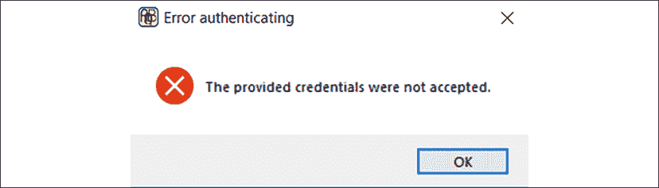
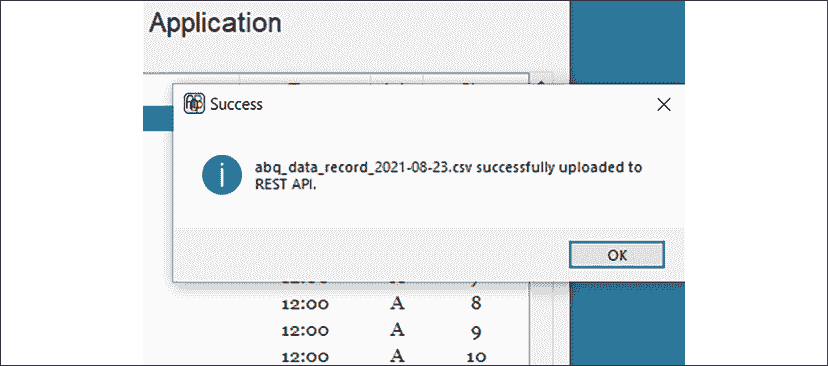
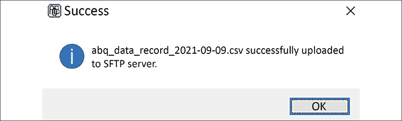

# 13

# 连接到云

似乎几乎每个应用程序迟早都需要与外部世界进行通信，你的 ABQ 数据录入应用程序也不例外。你已经收到了一些新的功能请求，这些请求将需要与远程服务器和服务进行交互。

首先，质量保证部门正在研究当地天气条件如何影响每个实验室的环境数据；他们请求一种按需下载和存储本地天气数据到数据库的方法。第二个请求来自你的经理，她仍然需要每天上传 CSV 文件到中央企业服务器。她希望这个过程简化并可通过鼠标点击实现。

在本章中，你将学习以下主题，以与云进行接口：

+   在*使用 urllib 的 HTTP*中，你将使用`urllib`连接到网络服务并下载数据。

+   在*使用 requests 的 RESTful HTTP*中，你将学习如何使用`requests`库与 REST 服务进行交互。

+   在*使用 paramiko 的 SFTP*中，你将使用`paramiko`通过 SSH 上传文件。

# 使用 urllib 的 HTTP

每次你在浏览器中打开一个网站，你都在使用超文本传输协议，即 HTTP。HTTP 是在 30 多年前被创建的，作为一种让网页浏览器下载 HTML 文档的方式，但它已经演变成为适用于各种目的的最受欢迎的客户端-服务器通信协议之一。

我们不仅在使用浏览器查看从纯文本到通过互联网流式传输的视频时使用它，应用程序还可以使用它来传输数据、启动远程过程或分配计算任务。

## HTTP 事务基础

客户端和服务器之间基本 HTTP 事务是这样的：

1.  首先，客户端创建一个**请求**，它将发送到服务器。请求包含以下内容：

    +   一个**URL**，它指定了请求的目标主机、端口和路径。

    +   一个**方法**，也称为动词，它告诉服务器客户端请求的操作。最常见的方法是`GET`，用于检索数据，以及`POST`，用于提交数据。

    +   一个**头部**，它包括键值对中的元数据；例如，提交的内容类型、内容的编码方式或授权令牌。

    +   最后，请求可能有一个**有效载荷**，它将包含提交给服务器的数据；例如，上传的文件或来自表单的一组键值对。

1.  当服务器接收到请求时，它会返回一个**响应**。响应包含以下内容：

    +   一个包含元数据，如响应大小或内容类型的**头部**。

    +   包含响应实际内容的**有效载荷**，例如 HTML、XML、JSON 或二进制数据。

在网页浏览器中，这些交互在后台进行，但我们的应用程序代码将直接处理请求和响应对象，以便与远程 HTTP 服务器进行通信。

### HTTP 状态码

每个 HTTP 请求在其头部中都会包含一个**状态码**，它是一个 3 位数，表示请求的处理状态。这些代码在 HTTP 标准中定义，并按以下方式组织：

+   1XX 状态码是在请求处理过程中发送的信息性消息。

+   2XX 状态码表示请求成功；例如，200 是最常见的响应，表示请求成功。

+   3XX 状态码表示重定向。例如，301 用于将客户端重定向到新的 URL，而 304 表示内容自上次下载以来未修改（将客户端重定向到其缓存）。

+   4XX 状态码表示客户端请求中的错误。例如，403 错误表示禁止请求（例如未经身份验证请求受保护文档），而众所周知的 404 错误表示请求了不存在的文档。

+   5XX 状态码表示服务器端发生错误，例如当服务器在 Web 服务中遇到错误时发出的通用 500 错误。

虽然网络浏览器用户通常只会遇到 4XX 和 5XX 错误，但当你直接通过 `urllib` 与 HTTP 交互时，你会遇到一些不同的状态码。

## 使用 `urllib.request` 进行基本下载

`urllib.request` 模块是 Python 模块，用于实现 HTTP 交互。它包含了一系列用于生成请求的函数和类，其中最基本的是 `urlopen()` 函数。此函数可以创建一个 `GET` 或 `POST` 请求，将其发送到远程服务器，并返回一个包含服务器响应的对象。

让我们来看看 `urllib` 是如何工作的；打开 Python 壳并执行以下命令：

```py
>>> from urllib.request import urlopen
>>> response = urlopen('http://python.org') 
```

`urlopen()` 函数至少需要一个 URL 字符串。默认情况下，它会对 URL 发起一个 `GET` 请求，并返回一个封装从服务器接收到的响应的对象。

此响应对象公开了从服务器接收到的元数据或内容，我们可以在我们的应用程序中使用这些信息。响应的大部分元数据都位于头部中，我们可以使用其 `getheader()` 方法来提取，如下所示：

```py
>>> response.getheader('Content-Type')
'text/html; charset=utf-8'
>>> response.getheader('Server')
'nginx' 
```

`getheader()` 方法需要一个键名，如果该键名在头部中找到，则返回其值。如果找不到该键名，则返回 `None`。

我们还可以使用 `status` 和 `reason` 属性提取状态码和代码的文本说明，如下所示：

```py
>>> response.status
200
>>> response.reason
'OK' 
```

记住，`200` 状态码表示请求成功。`OK` 字符串只是状态码的更易读形式。

响应对象的负载可以通过类似于文件句柄的接口来检索；例如：

```py
>>> html = response.read()
>>> html[:15]
b'<!doctype html>' 
```

就像文件句柄一样，响应只能使用`read()`方法读取一次；与文件句柄不同，它不能使用`seek()`进行“回滚”，因此如果需要多次访问响应数据，则非常重要地将响应数据保存在另一个变量中。请注意，`response.read()`的输出是一个`bytes`对象，根据下载的内容，应该将其转换为适当的对象或解码。

在这种情况下，我们知道从`Content-Type`头信息中，内容是 UTF-8 字符串，因此我们应该使用`decode()`将其转换为`str`，如下所示：

```py
>>> html.decode('utf-8')[:15]
'<!doctype html>' 
```

### 生成 POST 请求

`urlopen()`函数还可以生成`POST`请求。为此，我们只需要包含一个`data`参数，如下所示：

```py
>>> response = urlopen('http://duckduckgo.com', data=b'q=tkinter') 
```

`data`值需要是一个 URL 编码的`bytes`对象。一个 URL 编码的数据字符串由用`&`符号分隔的键值对组成，某些保留字符被编码为 URL 安全的替代字符（例如，空格字符是`%20`，有时也可以是`+`）。

这样的字符串可以手动创建，但使用`urllib.parse`模块提供的`urlencode()`函数会更简单，如下所示：

```py
>>> from urllib.parse import urlencode
>>> url = 'http://duckduckgo.com'
>>> data = {'q': 'tkinter, python', 'ko': '-2', 'kz': '-1'}
>>> u_data = urlencode(data)
>>> u_data
'q=tkinter%2C+python&ko=-2&kz=-1'
>>> response = urlopen(url, data=u_data.encode()) 
```

注意，`data`参数必须是`bytes`类型，而不是字符串，因此在`urlopen()`接受之前，必须在 URL 编码的字符串上调用`encode()`。

## 将天气数据下载到 ABQ 数据录入

让我们尝试下载我们应用程序所需的天气数据。我们将使用的是[`weather.gov`](http://weather.gov)，该网站提供美国国内的天气数据。我们将下载的实际 URL 是[`w1.weather.gov/xml/current_obs/STATION.xml`](http://w1.weather.gov/xml/current_obs/STATION.xml)，其中`STATION`被替换为当地气象站的呼号。对于 ABQ，我们将使用位于印第安纳州布卢明顿的`KBMG`。

QA 团队希望您记录温度（以摄氏度为单位）、相对湿度、气压（以毫巴为单位）和天空状况（字符串，如“多云”或“晴朗”）。他们还需要气象站观测天气的日期和时间。

### 创建天气数据模型

虽然将`urlopen()`调用放在`Application`类回调中可能足够简单，但与我们的 MVC 设计更一致的是，将我们与天气数据服务的交互封装在一个模型类中。我们的模型类将负责从网络服务获取天气数据并将其转换为其他组件可以轻松使用的格式。

打开`models.py`文件，让我们首先导入`urlopen()`：

```py
# models.py
from urllib.request import urlopen 
```

现在，在文件末尾，让我们开始一个新的模型类来封装我们的数据下载：

```py
class WeatherDataModel:
  base_url = 'http://w1.weather.gov/xml/current_obs/{}.xml'
  def __init__(self, station):
    self.url = self.base_url.format(station) 
```

我们的初始化器将接受一个`station`字符串作为参数，并使用它与基本 URL 值构建天气数据的下载 URL。通过将`station`值设置为变量，我们可以在用户的配置文件中设置站点，允许其他 ABQ 设施的用户使用此功能。

现在，让我们开始为这个类编写一个公共方法来检索天气数据：

```py
# models.py, inside WeatherDataModel
  def get_weather_data(self):
    response = urlopen(self.url) 
```

我们通过向模型的 URL 发送 GET 请求并检索响应来开始这个方法。请注意，这可能会引发异常（例如，如果由于某种原因无法访问该网站），调用此方法的代码需要处理这个异常。

假设一切顺利，我们只需要解析这个响应中的数据，并将其放入`Application`类可以传递给 SQL 模型的形式。为了确定我们将如何处理这个响应，让我们回到 Python shell 中检查那里的数据：

```py
>>> url = 'http://w1.weather.gov/xml/current_obs/KBMG.xml'
>>> response = urlopen(url)
>>> print(response.read().decode())
  <?xml version="1.0" encoding="ISO-8859-1"?>
  <?xml-stylesheet href="latest_ob.xsl" type="text/xsl"?>
  <current_observation version="1.0"
  xmlns:xsd=http://www.w3.org/2001/XMLSchema
  xmlns:xsi=http://www.w3.org/2001/XMLSchema-instance
  xsi:noNamespaceSchemaLocation=
    "http://www.weather.gov/view/current_observation.xsd">
  <credit>NOAA's National Weather Service</credit>
  <credit_URL>http://weather.gov/</credit_URL>
.... 
```

如 URL 所示，响应的有效负载是一个 XML 文档，其中大部分我们不需要。然而，经过一些搜索后，你应该能够找到我们需要的字段，如下所示：

```py
<observation_time_rfc822>
  Tue, 29 Jun 2021 15:53:00 -0400
</observation_time_rfc822>
<weather>Mostly Cloudy</weather>
<temp_c>32.8</temp_c>
<relative_humidity>54</relative_humidity>
<pressure_mb>1020.0</pressure_mb> 
```

很好，我们需要的数据就在那里，所以我们只需要将其从 XML 字符串中提取出来，转换成我们应用程序可以使用的形式。让我们花点时间来学习如何解析 XML 数据。

### 解析 XML 天气数据

Python 标准库包含一个`xml`包，它由几个用于解析或创建 XML 数据的子模块组成。在这些子模块中，`xml.etree.ElementTree`子模块是一个简单、轻量级的解析器，应该能满足我们的需求。

让我们将`ElementTree`导入到我们的`models.py`文件中，如下所示：

```py
# models.py
from xml.etree import ElementTree 
```

现在，回到我们的`get_weather_data()`方法的末尾，我们将按照以下方式解析响应对象中的 XML 数据：

```py
# models.py, inside WeatherDataModel.get_weather_data()
  xmlroot = ElementTree.fromstring(response.read()) 
```

`fromstring()` 方法接受一个 XML 字符串并返回一个`Element`对象。为了获取我们需要的数据，我们首先需要了解`Element`对象代表什么，以及如何与之交互。

XML 是数据的分层表示；一个元素代表这个层次结构中的一个节点。元素以一个标签开始，这是一个位于尖括号内的文本字符串。每个标签都有一个匹配的闭标签，它只是在标签名前加上一个前导斜杠。

在开标签和闭标签之间，一个元素可能包含其他子元素，或者它可能包含文本。元素还可以有属性，这些属性是放置在开标签的尖括号内的键值对，紧随标签名之后。

看一下以下 XML 的示例：

```py
<star_system starname="Sol">
  <planet>Mercury</planet>
  <planet>Venus</planet>
  <planet>Earth
    <moon>Luna</moon>
  </planet>
  <planet>Mars
    <moon>Phobos</moon>
    <moon>Deimos</moon>
  </planet>
  <dwarf_planet>Ceres</dwarf_planet>
</star_system> 
```

这个示例是一个（不完整）的太阳系 XML 描述。根元素有一个`<star_system>`标签和一个`starname`属性。在这个根元素下，我们有四个`<planet>`元素和一个`<dwarf_planet>`元素，每个元素都包含一个表示行星名称的文本节点。一些行星节点还有子`<moon>`节点，每个节点都包含一个表示月球名称的文本节点。

可以说，这些数据可以有不同的结构；例如，行星名称可以在行星元素内部的子`<name>`节点中，或者作为`<planet>`标签的属性列出。虽然 XML 的*语法*定义良好，但 XML 文档的实际*结构*由其创建者决定，因此完全解析 XML 数据需要了解数据在文档中的布局方式。

如果你查看我们在 shell 中之前下载的 XML 天气数据，你会注意到它是一个相当浅的层次结构。在`<current_observations>`节点下，有许多子元素，其标签代表特定的数据字段，如温度、湿度、风寒等等。

要访问和提取这些子元素，`Element`对象为我们提供了以下各种方法：

| 方法 | 返回值 |
| --- | --- |
| `iter()` | 所有子节点的迭代器（递归） |
| `find(tag)` | 匹配给定标签的第一个元素 |
| `findall(tag)` | 匹配给定标签的元素列表 |
| `getchildren()` | 立即子节点列表 |
| `iterfind(tag)` | 所有匹配给定标签的子节点的迭代器（递归） |

在我们之前下载 XML 数据时，我们确定了五个包含我们想要从该文档中提取的数据的标签：`<observation_time_rfc822>`、`<weather>`、`<temp_c>`、`<relative_humidity>`和`<pressure_mb>`。我们希望我们的函数返回一个包含每个这些标签作为键的 Python 字典。

因此，在`get_weather_data()`内部，让我们创建一个包含我们想要的标签的字典，如下所示：

```py
 weatherdata = {
    'observation_time_rfc822': None,
    'temp_c': None,
    'relative_humidity': None,
    'pressure_mb': None,
    'weather': None
  } 
```

现在，让我们从`Element`对象中获取值并将它们添加到字典中：

```py
 for tag in weatherdata:
    element = xmlroot.find(tag)
    if element is not None:
      weatherdata[tag] = element.text
  return weatherdata 
```

对于我们所有的标签名，我们将使用`find()`方法尝试在`xmlroot`中定位匹配的元素。这个特定的 XML 文档不使用重复的标签（因为单个观测值多次出现，温度值、湿度值等等都没有意义），所以任何标签的第一个实例应该是唯一的。如果标签匹配，我们将返回匹配节点的`Element`对象；如果没有匹配，我们将返回`None`，所以在尝试访问其`text`属性之前，我们需要确保`element`不是`None`。

完成所有标签后，我们可以通过返回字典来完成函数。

你可以在 Python shell 中测试这个函数；从命令行，导航到`ABQ_Data_Entry`目录并启动 Python shell。然后输入以下命令：

```py
>>> from abq_data_entry.models import WeatherDataModel
>>> wdm = WeatherDataModel('KBMG')
>>> wdm.get_weather_data()
{'observation_time_rfc822': 'Mon, 09 Aug 2021 15:53:00 -0400',
'temp_c': '26.1', 'relative_humidity': '74',
'pressure_mb': '1013.7', 'weather': 'Fair'} 
```

你应该会得到一个包含印第安纳州布卢明顿当前天气状况的字典。

你可以在[`w1.weather.gov/xml/current_obs/`](http://w1.weather.gov/xml/current_obs/)找到美国其他城市的站码。

现在我们有了我们的天气数据模型，我们只需要构建存储数据的表和触发操作的接口。

### 实现天气数据存储

为了存储我们的天气数据，我们首先将在 ABQ 数据库中创建一个表来保存单个观测数据，然后构建一个`SQLModel`方法来存储检索到的数据。我们不需要担心编写从数据库中检索数据的代码，因为我们的实验室的 QA 团队有自己的报告工具，他们将使用这些工具来访问它。

#### 创建 SQL 表

在应用程序的 `sql` 文件夹下，打开 `create_db.sql` 文件，并添加一个新的 `CREATE TABLE` 语句，如下所示：

```py
**# create_db.sql**
CREATE TABLE local_weather (
  datetime TIMESTAMP(0) WITH TIME ZONE PRIMARY KEY,
  temperature NUMERIC(5,2),
  rel_hum NUMERIC(5, 2),
  pressure NUMERIC(7,2),
  conditions VARCHAR(32)
); 
```

在这个表中，我们使用记录上的 `TIMESTAMP` 数据类型作为主键；保存相同的带时间戳的观察结果两次是没有意义的，因此这足以成为一个合适的主键。`TIMESTAMP` 数据类型后面的 `(0)` 大小表示我们需要多少小数位来进行秒的测量。由于这些测量大约每小时进行一次，而我们只需要大约每四小时一次（当实验室检查完成时），我们不需要在时间戳中包含秒的小数部分。

注意我们正在保存时区；当可用时，始终将时区数据与时间戳一起存储！这可能看起来并不必要，尤其是当你的应用程序将在永远不会更改时区的办公场所运行时，但存在许多边缘情况，例如夏令时变更，时区的缺失可能会造成重大问题。

在你的数据库中运行这个 `CREATE` 查询来构建表，然后让我们继续创建我们的 `SQLModel` 方法。

#### 实现 SQLModel.add_weather_data() 方法

在 `models.py` 中，让我们向 `SQLModel` 类添加一个新的方法，称为 `add_weather_data()`，它只接受一个字典作为其唯一参数。从这个方法开始创建一个 `INSERT` 查询，如下所示：

```py
# models.py, inside SQLModel
  def add_weather_data(self, data):
    query = (
      'INSERT INTO local_weather VALUES '
      '(%(observation_time_rfc822)s, %(temp_c)s, '
      '%(relative_humidity)s, %(pressure_mb)s, '
      '%(weather)s)'
    ) 
```

这是一个简单的参数化 `INSERT` 查询，使用与 `get_local_weather()` 函数从 XML 数据中提取的字典键匹配的变量名。我们只需要将这个查询和 `data` 字典传递到我们的 `query()` 方法中。

然而，有一个问题；如果我们得到一个重复的时间戳，我们的查询将因为重复的主键而失败。我们可以在查询之前再进行一次查询来检查，但这会稍微有些多余，因为 PostgreSQL 本身会在插入新行之前检查重复的键。

当它检测到此类错误时，`psycopg2` 会引发 `IntegrityError` 异常，因此我们只需捕获这个异常，如果它被引发，就什么也不做。

要做到这一点，我们将像这样将我们的 `query()` 调用包装在 `try`/`except` 块中：

```py
 try:
      self.query(query, data)
    except pg.IntegrityError:
      # already have weather for this datetime
      pass 
```

现在，我们的数据录入人员可以随时调用此方法，但它只会保存有新鲜观测记录时。

#### 更新 SettingsModel 类

在离开 `models.py` 之前，我们需要添加一个新的应用程序设置来存储首选的天气站。在 `SettingsModel.fields` 字典中添加以下新条目：

```py
# models.py, inside SettingsModel
  fields = {
    # ...
    **'weather_station'****: {****'type'****:** **'str'****,** **'value'****:** **'KBMG'****}**,
  } 
```

我们不会添加一个 GUI 来更改此设置，因为用户不需要更新它。这将取决于我们，或者在其他实验室站点上的系统管理员，通过编辑 `abq_settings.json` 文件来确保每个工作站都正确设置。

## 添加天气下载的 GUI 元素

`Application` 对象现在需要将 `WeatherDataModel` 中的天气下载方法连接到 `SQLModel` 中的数据库方法，使用一个适当的回调方法，这样主菜单类就可以调用它。

打开 `application.py` 文件，并在 `Application` 类中启动一个新的方法，命名为 `_update_weather_data()`：

```py
# application.py, inside Application
  def _update_weather_data(self, *_):
    weather_data_model = m.WeatherDataModel(
      self.settings['weather_station'].get()
    )
    try:
      weather_data = weather_data_model.get_weather_data() 
```

此方法首先使用从 `settings` 字典中拉取的 `weather_station` 值创建一个 `WeatherDataModel` 实例。然后，它尝试在 `try` 块中调用 `get_weather_data()`。

记住，在错误场景中，`urlopen()` 可能会引发任何数量的异常，具体取决于 HTTP 事务中出了什么问题。应用程序实际上无法做任何事情来处理这些异常，除了通知用户并退出方法。因此，我们将捕获通用的 `Exception` 并在 `messagebox` 对话框中显示文本，如下所示：

```py
 except Exception as e:
      messagebox.showerror(
        title='Error',
        message='Problem retrieving weather data',
        detail=str(e)
      )
      self.status.set('Problem retrieving weather data') 
```

如果 `get_local_weather()` 成功，我们只需将数据传递给我们的模型方法。我们可以在 `else` 子句中添加此内容：

```py
 else:
      self.data_model.add_weather_data(weather_data)
      time = weather_data['observation_time_rfc822']
      self.status.set(f"Weather data recorded for {time}") 
```

除了保存数据外，我们还在状态栏通知用户天气已更新，并显示了更新时间戳。

回调方法完成后，让我们将其添加到我们的回调字典中：

```py
# application.py, in Application.__init__()
    event_callbacks = {
      #...
      **'<<UpdateWeatherData>>'****: self._update_weather_data**
    } 
```

现在，我们可以在主菜单中添加一个 `command` 项目作为回调。根据我们在第十章“保持跨平台兼容性”中学到的主菜单指南，我们应该考虑为该命令提供一个合适的子菜单。在 Windows 上，此类功能位于 `Tools` 菜单中，由于 Gnome 和 macOS 指南似乎没有指示更合适的位置，我们将在 `LinuxMainMenu` 和 `MacOsMainMenu` 类中实现一个 `Tools` 菜单来保持一致性，以包含此命令。

打开 `mainmenu.py` 文件，从通用的菜单类开始，让我们添加一个私有方法，该方法将添加 `command` 项目：

```py
# mainmenu.py, inside GenericMainMenu
  def _add_weather_download(self, menu):
    menu.add_command(
      label="Update Weather Data",
      command=self._event('<<UpdateWeatherData>>')
    ) 
```

现在，在每个菜单类的初始化器中，我们将创建一个 `Tools` 菜单并将其添加到其中：

```py
# mainmenu.py, inside GenericMainMenu.__init__()
    # Put between the File and Options menus
    self._menus['Tools'] = tk.Menu(self, tearoff=False)
    self._add_weather_download(self._menus['Tools']) 
```

将此相同代码添加到 macOS 和 Linux 菜单类的初始化器中。在 `WindowsMainMenu` 类的初始化器中，您只需添加第二行，因为 `Tools` 菜单已经存在。更新菜单后，您可以运行应用程序并尝试从 `Tools` 菜单中的新命令。如果一切顺利，您应该在状态栏中看到以下截图所示：


图 13.1：成功下载天气数据

您还应该使用您的 PostgreSQL 客户端连接到数据库，并执行以下 SQL 命令来检查表中是否包含一些天气数据：

```py
SELECT * FROM local_weather; 
```

该 SQL 语句应该返回类似于以下内容的输出：

| 日期时间 | 温度 | 相对湿度 | 压力 | 条件 |
| --- | --- | --- | --- | --- |
| 2021-08-12 18:53:00-05 | 26.10 | 74.00 | 1013.70 | 晴朗 |

正如您所看到的，`urllib`在从网络下载文件方面相对简单易用；大部分工作涉及解析下载的文件并在应用程序中使用它。然而，并非所有 Web 事务都像单个`GET`或`POST`请求那样简单。在下一节中，我们将探讨一个更强大的 HTTP 交互工具，`requests`。

# 使用请求的 RESTful HTTP

您的经理要求您在程序中创建一个函数，以便她可以将每日数据的 CSV 提取上传到 ABQ 的企业 Web 服务，该服务使用经过身份验证的 REST API。**REST**代表**表征状态转移**，它指的是一种围绕高级 HTTP 语义构建的 Web 服务方法，以提供更符合代码的接口。围绕 REST 概念设计的服务被称为**RESTful**。让我们更深入地了解 REST 交互是如何工作的。

## 了解 RESTful Web 服务

RESTful 服务围绕访问**资源**的概念构建。资源通常是数据记录或文件，尽管它也可能是远程过程或硬件接口之类的其他东西。我们通过**端点**访问资源，端点是表示特定资源的 URL。

我们已经看到，Web 服务器通常允许您使用`GET`方法获取数据，使用`POST`方法提交数据。然而，REST API 使用额外的 HTTP 方法，如`DELETE`、`PUT`和`PATCH`来指示不同的操作。根据我们在请求端点时使用的方法，我们可以在资源上执行不同的操作。

尽管 REST 服务的实现方式各异，以下表格显示了典型 API 中 HTTP 方法的一般公认功能：

| 方法 | 功能 |
| --- | --- |
| `GET` | 获取资源 |
| `HEAD` | 仅检索资源的元数据（头部） |
| `POST` | 根据提交的数据创建或更新资源 |
| `PUT` | 以原样上传资源（通常用于文件） |
| `PATCH` | 使用部分数据更新现有资源（很少实现） |
| `DELETE` | 删除资源 |

除了更健壮的方法集之外，REST 服务还以更符合代码的方式交换数据。虽然以浏览器为导向的服务接受 URL 编码的字符串数据并返回 HTML 文档，但 RESTful 服务可以接受请求并以 JSON 或 XML 等格式返回响应。在某些情况下，客户端甚至可以请求返回的数据格式。

理解这一点至关重要，尽管存在一些 RESTful 服务的标准，但 REST 站点（包括它们对不同方法的精确响应）的组织和行为差异很大。为了与 REST API 交互，您需要查阅其具体文档。

## Python 的 requests 库

正如我们在本章的第一节中看到的，`urllib` 对于基本的 `GET` 和 `POST` 请求来说相当简单易用，并且作为标准库的一部分，当我们的需求仅限于此时，它是一个很好的选择。然而，涉及身份验证、文件上传或附加 HTTP 方法的更复杂 HTTP 交互，仅使用 `urllib` 可能会令人沮丧且复杂。为了完成这项工作，我们将转向第三方 `requests` 库。这个库被 Python 社区高度推荐，用于任何涉及 HTTP 的严肃工作。正如您将看到的，`requests` 去除了 `urllib` 中留下的许多粗糙边缘和过时的假设，为更现代的 HTTP 事务（如 REST）提供了方便的类和包装函数。`requests` 的完整文档可以在 [`docs.python-requests.org`](https://docs.python-requests.org) 找到，但下一节将涵盖您需要了解的大部分内容，以便有效地使用它。

### 安装和使用 requests

`requests` 包是用纯 Python 编写的，因此使用 `pip` 安装它不需要编译或二进制下载。只需在终端中输入 `pip install --user requests` 即可，它将被添加到您的系统中。

让我们来看看 `requests` 在 Python 命令行中的工作方式；打开一个命令行窗口并输入以下内容：

```py
>>> import requests
>>> response = requests.request('GET', 'http://www.alandmoore.com') 
```

`requests.request()` 函数至少需要 HTTP 方法和一个 URL。就像 `urlopen()` 一样，它构建适当的请求包，将其发送到 URL，并返回一个表示服务器响应的对象。在这里，我们正在向这位作者的网站发送一个 `GET` 请求。

除了 `request()` 函数外，`requests` 还提供了对应于最常见 HTTP 方法的快捷函数。因此，相同的请求可以如下进行：

```py
>>> response = requests.get('http://www.alandmoore.com') 
```

`get()` 方法只需要 URL 并执行 `GET` 请求。同样，`post()`、`put()`、`patch()`、`delete()` 和 `head()` 函数使用相应的 HTTP 方法发送请求。所有这些请求函数都接受额外的可选参数。

例如，我们可以通过以下方式使用 `POST` 请求发送数据：

```py
>>> data = {'q': 'tkinter', 'ko': '-2', 'kz': '-1'}
>>> url = 'https://duckduckgo.com'
>>> response = requests.post(url, data) 
```

注意，与 `urlopen()` 不同，我们可以直接使用 Python 字典作为 `data` 参数；`requests` 会为我们将其转换为适当的 URL 编码 `bytes` 对象。

与请求函数一起使用的某些更常见的参数如下：

| 参数 | 用途 |
| --- | --- |
| `params` | 与 `data` 类似，但添加到查询字符串而不是有效负载中 |
| `json` | 要包含在有效负载中的 JSON 数据 |
| `headers` | 要用于请求的头部数据字典 |
| `files` | 要作为多部分表单数据请求发送的 `{字段名: 文件对象}` 字典 |
| `auth` | 用于基本 HTTP 摘要身份验证的用户名和密码元组 |

注意，这里的`auth`参数仅用于对 HTTP 摘要认证进行认证；这是一种较老的认证方法，它在网络服务器级别实现，而不是在实际的 Web 应用程序中实现，并且在现代网站上很少使用。要与现代认证系统协同工作，我们需要了解会话的使用。

### 使用 Session 与认证网站交互

HTTP 是一个**无状态**协议，这意味着每个 HTTP 请求都是独立的，并且不与其他请求连接，即使在同一客户端和服务器之间也是如此。尽管您在登录时可能感觉像是“连接”到了您的社交媒体或银行网站，但实际上，您和服务器之间没有持续的底层连接，只有一系列无关的请求和响应。

那么，这些网站是如何保持您的交互安全的？

在现代网站上，这通常是通过使用**会话 cookie**或**认证令牌**来完成的。在这两种方法中，当客户端向服务器进行认证时，服务器会返回一个数据片段，客户端可以将其包含在未来的请求中，以标识自己为成功认证的同一实体。通过这种方式，客户端和服务器都可以通过将它们之间的请求和响应关联到会话中，来模拟一个有状态的连接。

对于客户端来说，会话 cookie 和认证令牌之间的区别无关紧要；只需知道两者都需要我们在认证后从服务器存储某些信息，并在未来的每个请求中提供这些信息。

`requests`模块通过提供`Session`类使这种交互变得简单。`Session`对象在多个请求之间持续设置、cookie 和令牌，允许您与需要认证或特殊客户端设置的服务进行交互。要创建一个`Session`对象，使用以下`requests.session()`工厂函数：

```py
>>> s = requests.session() 
```

现在，我们可以在我们的`Session`对象上调用请求方法，例如`get()`、`post()`等：

```py
# Assume this is a valid authentication service that returns an auth token
>>> s.post('http://example.com/login', data={'u': 'test', 'p': 'test'})
# Now we would have an auth token stored in s
>>> response = s.get('http://example.com/protected_content')
# Our token cookie would be listed here
>>> print(s.cookies.items()) 
```

这种类型的令牌和 cookie 处理是在后台发生的，不需要我们采取任何明确的行动。Cookies 存储在`Session`对象的`cookies`属性中的`CookieJar`对象中。

我们还可以在我们的`Session`对象上设置将在请求之间持续存在的配置选项；例如：

```py
>>> s.headers['User-Agent'] = 'Mozilla'
>>> s.params['uid'] = 12345
# will be sent with a user-agent string of "Mozilla"
# and a parameter of "uid=12345"
>>> s.get('http://example.com') 
```

在这个例子中，我们将用户代理字符串设置为`Mozilla`，这将随后用于从这个`Session`对象发出的所有请求。我们还使用`params`属性设置了一个默认 URL 参数；因此，实际请求的 URL 是`http://example.com?uid=12345`。

### requests.Response 对象

`requests` 中的所有请求函数和方法都返回一个 `Response` 对象。这些 `Response` 对象与 `urlopen()` 返回的对象不同；它们包含所有相同的数据，但形式略有不同（通常更方便）。此外，它们还有一些有助于快速处理其内容的方法。

例如，响应头已经为我们翻译成了 Python 字典，如下所示：

```py
>>> r = requests.get('http://python.org')
>>> r.headers
{'Connection': 'keep-alive', 'Content-Length': '49812',
'Server': 'nginx', 'Content-Type': 'text/html; charset=utf-8',
 # ... etc 
```

与 `urllib` 的另一个区别是，`requests` 在 HTTP 错误上不会自动引发异常。但是，可以通过调用 `.raise_for_status()` 响应方法来这样做。

例如，让我们向一个将返回 HTTP `404` 错误的 URL 发送请求：

```py
>>> r = requests.get('http://www.example.com/does-not-exist')
>>> r.status_code
404
>>> r.raise_for_status()
Traceback (most recent call last):
File "<stdin>", line 1, in <module>
File "/usr/lib/python3.9/site-packages/requests/models.py", line 935, in
raise_for_status
raise HTTPError(http_error_msg, response=self)
requests.exceptions.HTTPError: 404 Client Error: Not Found for url:
http://www.example.com/does-not-exist 
```

这给了我们使用异常处理或更传统的流程控制逻辑来处理 HTTP 错误的选择，或者将异常处理推迟到更方便的时刻。

## 实现 REST 后端

要开始实现与 ABQ 企业 REST 服务器的交互，我们需要弄清楚我们将发送什么类型的请求。我们已从企业办公室获得了一些文档，描述了如何与 REST API 交互。

API 文档告诉我们以下内容：

+   在访问任何其他端点之前，我们需要获取一个身份验证令牌。我们通过向 `/auth` 端点提交 `POST` 请求来完成此操作。`POST` 请求的有效负载应包括作为 URL 编码数据的 `username` 和 `password`。如果我们的凭证失败，我们将收到 HTTP 401 错误。如果我们没有令牌，任何其他请求都将因 HTTP 403 错误而失败。

+   一旦我们有了令牌，我们就可以使用 `/files` 端点来处理文件：

    +   我们可以使用 `PUT` 请求上传文件。文件作为名为 `file` 的参数指定的多部分表单数据上传。

    +   我们可以通过发送形式为 `/files/FILENAME` 的 `GET` 请求来检索一个文件，其中 `FILENAME` 是文件的名称。

    +   或者，我们可以通过向 `/files/FILENAME` 发送 `HEAD` 请求来仅检索文件的元数据。

+   所有 HTTP 错误都伴随着包含状态码和指示错误原因的消息的 JSON 有效负载。

包含示例代码的这本书中包含了一个名为 `sample_rest_service.py` 的示例脚本，它复制了 ABQ 企业 REST 服务的功能。要使用它，您需要使用命令 `pip install -u flask` 安装 `flask` 库，然后在终端提示符下运行命令 `python sample_rest_service.py`。

再次强调，遵循我们的 MVC 设计，我们将实现一个封装所有这些交互的模型。我们将在 `models.py` 中开始，导入 `requests` 库，如下所示：

```py
# models.py
import requests 
```

现在，在文件末尾，让我们开始一个新的模型类，`CorporateRestModel`，用于 REST 网站：

```py
# models.py
class CorporateRestModel:
  def __init__(self, base_url):
    self.auth_url = f'{base_url}/auth'
    self.files_url = f'{base_url}/files'
    self.session = requests.session() 
```

类初始化器接受一个`base_url`参数，用于定义我们想要联系的基础 REST 服务的 URL。然后使用此 URL 来构造上传、认证和文件检索的端点 URL。最后，由于我们需要存储认证令牌，我们为每个方法创建一个会话对象。

我们本可以将`base_url`指定为一个类属性，就像我们在`WeatherDataModel`中做的那样；然而，为了使我们能够测试此类与测试服务，或者为了适应公司服务器可能发生的变化，我们将此值存储在用户的设置中，以便可以轻松替换。

在我们继续之前，让我们为我们的`SettingsModel`添加一个用于 REST 基础 URL 的设置：

```py
# models.py, inside SettingsModel
  fields = {
    #...
    'abq_rest_url': {
      'type': 'str',
      'value': 'http://localhost:8000'
    }
  } 
```

默认值`http://localhost:8000`是提供的示例服务器的基础 URL，用于测试；在生产环境中，此设置可以通过编辑每个用户的`abq_settings.json`文件由技术支持进行更改。

现在，回到我们的`CorporateRestModel`类中，我们需要实现四个方法：

+   一个`authenticate()`方法，通过`POST`请求将凭据发送到`/auth`端点。

+   一个`upload_file()`方法，通过`PUT`请求将文件发送到`/files`端点。

+   一个`check_file()`方法，用于从`/files`端点检索仅包含元数据。

+   一个`get_file()`方法，用于从`/files`端点下载文件。

让我们开始吧！

### `authenticate()`方法

由于没有认证令牌我们无法做任何事情，让我们从`authenticate()`方法开始：

```py
# models.py, inside CorporateRestModel
  def authenticate(self, username, password):
    response = self.session.post(
      self.auth_url,
      data={'username': username, 'password': password}
    ) 
```

此方法将接受用户名和密码，并使用我们模型的`Session`对象将它们发布到`auth_url`。如果成功，会话将自动存储我们收到的令牌。回想一下，如果提供无效的凭据，服务器将返回 HTTP 401 错误；我们可以简单地检查响应的状态码，并从该方法返回`True`或`False`。然而，由于远程 HTTP 服务器调用失败有多种方式（例如，服务器上的问题可能导致 500 错误），如果能向调用代码报告更多关于失败详细信息的反馈会更好。我们可以通过调用`Response`对象的`raise_for_status()`方法来实现，这将向调用代码发送`HTTPError`异常。这可能会给我们一个像这样的错误对话框：


图 13.2：一个丑陋的 401 错误

当然，我们可以，也应该做得更好。大多数用户不会知道 HTTP 401 错误是什么意思。

从 API 规范中记住，服务器还会返回一个包含更具有意义错误信息的 JSON 对象。我们可以为我们的模型编写一个静态方法来处理`HTTPError`并将其转换为带有更人性化的信息的异常。将此方法添加到模型中：

```py
 @staticmethod
  def _raise_for_status(response):
    try:
      response.raise_for_status()
    except requests.HTTPError:
      raise Exception(response.json().get('message')) 
```

此方法接受一个`Response`对象，然后调用其`raise_for_status()`方法。如果状态码是成功（200），则不会发生任何事情，该方法返回。然而，如果抛出`HTTPError`，我们将从`Response`对象的 JSON 有效负载中提取`message`值，并使用该消息抛出一个新的`Exception`错误。

在`authenticate()`中，让我们通过传递响应到此静态方法来结束该方法：

```py
# models.py, inside CorporateRestModel.authenticate()
    self._raise_for_status(response) 
```

现在失败的登录看起来更像是这样：



图 13.3：一个更友好的错误信息

如果没有抛出异常，我们不需要做任何事情。会话中已经有了令牌，我们可以继续进行其他操作。

### `upload_file()`方法

我们下一个要实现的方法是实际上传文件。记住，根据 API 文档，这需要向`/files`端点发送`PUT`请求。该方法看起来如下：

```py
 def upload_file(self, filepath):
    with open(filepath, 'rb') as fh:
      files = {'file': fh}
      response = self.session.put(
        self.files_url, files=files
      )
    self._raise_for_status(response) 
```

要使用`requests`发送文件，我们必须实际打开它并获取一个文件句柄，然后将文件句柄放入一个字典中，并将其传递给请求方法的`files`参数。如果每个文件在字典中都有一个不同的键，则可以发送多个文件；然而，我们的 API 一次只允许发送一个文件，并且它必须有一个键为`file`。再次提醒，我们通过检查响应的错误码来结束方法，使用我们的`_raise_for_status()`方法。

注意我们以二进制读取模式（`rb`）打开文件。`requests`文档建议这样做，因为它确保请求头将计算正确的`Content-length`值。

### `check_file()`方法

我们需要的下一个方法是`check_file()`方法，它将检索服务器上文件的头部信息，而无需实际下载它。API 文档告诉我们，通过向`files/FILENAME`端点发送`HEAD`请求，我们可以获取文件的元数据，其中`FILENAME`是我们想要获取信息的文件名。`HEAD`请求在处理慢速连接或大文件时很有用，因为它们允许我们找到有关文件的信息（例如，其大小或是否存在），而无需实际下载整个文件。

让我们这样实现这个方法：

```py
 def check_file(self, filename):
    url = f"{self.files_url}/{filename}"
    response = self.session.head(url)
    if response.status_code == 200:
      return True
    elif response.status_code == 404:
      return False
    self._raise_for_status(response) 
```

对于我们的目的，我们主要关心服务器上的文件是否存在，因此我们将根据是否收到状态码 200（成功）或 404（文件未找到）从该方法返回一个布尔值。当然，请求也可能出现其他问题，所以如果状态码不同，我们也会将响应传递给我们的`_raise_for_status()`方法。

### `get_file()`方法

我们将要实现的最后一个方法是`get_file()`方法，用于下载文件数据。将以下方法添加到`CorporateRestModel`中：

```py
 def get_file(self, filename):
    """Download a file from the server"""
    url = f"{self.files_url}/{filename}"
    response = self.session.get(url)
    self._raise_for_status(response)
    return response.text 
```

与此 API 中的其他端点不同，对`/files`端点的`GET`请求**不**返回 JSON，而是返回文件的正文。我们可以从`Response`对象的`text`属性中检索这些内容，这是我们方法返回的。这将取决于调用此方法的代码如何处理方法返回的内容。我们将在`Application`类中这样做，我们将保存下载的内容到文件中。

由于我们的模型现在已经完成，让我们转到`Application`类，开始处理前端工作。

## 将 REST 上传集成到应用程序中

在与负责执行 REST 上传的经理讨论后，你确定 REST 上传操作的流程需要类似于以下内容：

+   当从 GUI 运行 REST 上传时，它应该首先检查数据库中是否有当天的数据，如果没有，则终止操作。如果上传了空文件，这会让你的经理看起来很糟糕！

+   如果有数据，它应该使用在设施转向 SQL 存储之前使用的原始命名格式创建当天的 CSV 数据提取，因为这是 ABQ 公司期望的文件名格式。

+   接下来，它应该提示输入 REST API 的认证凭证。

+   之后，程序应该检查当天数据是否已经上传了文件。如果没有，请上传文件。

+   如果有文件（有时她忘记并上传两次），程序应该提示是否应该覆盖文件。

+   如果我们没有覆盖文件，应该有一个选项从服务器下载文件，以便可以手动与 SQL 中的数据进行比较。

让我们开始实现这段代码！

### 创建 CSV 提取

在我们可以上传任何内容之前，我们需要实现创建每日数据 CSV 提取的方法。这将被多个函数使用，因此我们将将其实现为一个单独的方法。

在`Application`类中开始一个新的私有方法，命名为`_create_csv_extract()`，如下所示：

```py
# application.py, inside Application
  def _create_csv_extract(self):
    csvmodel = m.CSVModel()
    records = self.model.get_all_records()
    if not records:
      raise Exception('No records were found to build a CSV file.')
    for record in records:
      csvmodel.save_record(record)
    return csvmodel.file 
```

该方法首先创建我们`CSVModel`类的新实例；尽管我们不再将数据存储在 CSV 文件中，但我们仍然可以使用该模型导出 CSV 文件。我们没有传递任何参数，只是使用文件的默认文件路径。接下来，我们调用应用程序`SQLModel`实例的`get_all_records()`方法。记住，我们的`SQLModel.get_all_records()`方法默认返回当前日期的所有记录列表。由于你的老板不希望上传空文件，如果没有记录来构建 CSV，我们将引发异常。我们的调用代码可以捕获这个异常并显示适当的警告。如果有记录要保存，该方法将遍历它们，将每个记录保存到 CSV 中，然后返回`CSVModel`对象的`file`属性（即指向已保存文件的`Path`对象）。我们的调用代码将负责对从方法返回的内容进行适当的处理。我们将在`Application`类中这样做，我们将保存下载的内容到文件中。

### 创建上传回调

现在我们有了创建 CSV 提取文件的方法，我们可以编写实际的回调方法如下所示：

```py
# application.py, inside Application
  def _upload_to_corporate_rest(self, *_):
    try:
      csvfile = self._create_csv_extract()
    except Exception as e:
      messagebox.showwarning(
        title='Error', message=str(e)
      )
      return 
```

首先，我们尝试创建一个 CSV 提取文件；如果我们遇到任何异常（例如，我们创建的“没有记录”异常，或者可能是数据库问题），我们将显示错误消息并退出方法。

如果我们成功创建了 CSV 文件，我们的下一步是对 REST API 进行身份验证。为此，我们需要从用户那里获取用户名和密码。幸运的是，我们有完美的类来完成这个任务：

```py
 d = v.LoginDialog(
      self, 'Login to ABQ Corporate REST API'
    )
    if d.result is not None:
      username, password = d.result
    else:
      return 
```

我们的`LoginDialog`类在这里为我们提供了很好的服务。与数据库登录不同，我们不会无限循环地运行这个；如果密码错误，我们将直接从函数返回，用户如果需要可以重新运行命令。回想一下，如果用户点击了“取消”，那么对话框的`result`属性将是`None`，所以在这种情况下，我们将直接退出回调方法。

现在我们有了凭据和文件名，我们可以尝试对服务器进行身份验证：

```py
 rest_model = m.CorporateRestModel(
      self.settings['abq_rest_url'].get()
    )
    try:
      rest_model.authenticate(username, password)
    except Exception as e:
      messagebox.showerror('Error authenticating', str(e))
      return 
```

我们首先基于用户的`abq_rest_url`设置创建一个`CorporateRestModel`实例，然后将我们的凭据传递给其`authenticate()`方法。回想一下，在出现 HTTP 问题（包括无效凭据）的情况下，我们的模型将抛出一个带有友好信息的`Exception`，因此我们可以简单地在一个消息框中显示它并退出回调。

我们下一步是检查服务器上是否已经存在今天日期的文件。我们将使用我们模型的`check_file()`方法来完成，如下所示：

```py
 try:
      exists = rest_model.check_file(csvfile.name)
    except Exception as e:
      messagebox.showerror('Error checking for file', str(e))
      return 
```

记住`check_file()`将返回一个布尔值，表示文件是否存在于服务器上，或者如果出现其他 HTTP 问题，可能会抛出异常。和之前一样，在出现错误的情况下，我们将显示对话框并退出函数。

如果文件已经存在，我们需要确定用户对此的处理意愿；首先，他们是否只想覆盖它，如果不是，是否想要下载它。我们可以通过一些消息框来实现，如下所示：

```py
 if exists:
      overwrite = messagebox.askyesno(
        'File exists',
        f'The file {csvfile.name} already exists on the server, '
        'do you want to overwrite it?'
      )
      if not overwrite:
        download = messagebox.askyesno(
          'Download file',
          'Do you want to download the file to inspect it?'
        ) 
```

记住来自*第七章*，*使用菜单和 Tkinter 对话框创建菜单*，`askyesno()`函数返回一个布尔值，取决于用户是否点击了**是**或**否**。

如果用户想要下载文件，我们可以使用我们的模型来完成，如下所示：

```py
 if download:
          filename = filedialog.asksaveasfilename()
          if not filename:
            return
          try:
            data = rest_model.get_file(csvfile.name)
          except Exception as e:
            messagebox.showerror('Error downloading', str(e))
            return
          with open(filename, 'w', encoding='utf-8') as fh:
            fh.write(data)
          messagebox.showinfo(
            'Download Complete', 'Download Complete.'
            )
        return 
```

在这里，我们首先使用`filedialog`函数检索用户想要保存下载文件的文件名。如果他们取消对话框，我们将直接退出函数而不做任何操作。否则，我们尝试使用我们模型的`get_file()`方法下载文件。和之前一样，如果失败，我们将显示错误并退出。如果成功，我们将打开一个新的 UTF-8 文件并将数据保存到其中。最后，在文件写入后，我们将显示一个成功对话框。最后的`return`语句将根据用户是否决定下载文件退出方法；因为在这个时候，他们已经选择在两种情况下都不覆盖文件。

如果他们选择了覆盖文件，我们的方法将继续在`if`块外部执行，如下所示：

```py
 try:
      rest_model.upload_file(csvfile)
    except Exception as e:
      messagebox.showerror('Error uploading', str(e))
    else:
      messagebox.showinfo(
        'Success',
        f'{csvfile} successfully uploaded to REST API.'
      ) 
```

到目前为止，如果由于错误或用户选择而导致方法尚未返回，我们可以继续上传文件。这是通过我们模型的`upload_file()`方法完成的。我们将根据操作是否成功获得成功对话框或错误对话框。在任何情况下，我们的方法都到此结束。

### 完成工作

我们最后需要做的是添加一个用于运行 REST 上传的菜单选项。首先，将方法添加到`Application`类的回调事件中，如下所示：

```py
# application.py, inside Application.__init__()
    event_callbacks = {
      #...
      '<<UploadToCorporateREST>>': self._upload_to_corporate_rest,
    } 
```

最后，让我们将命令项添加到我们的主菜单中。我们将首先添加一个创建菜单中 REST 上传条目的方法，如下所示：

```py
# mainmenu.py, inside GenericMainMenu
  def _add_rest_upload(self, menu):
    menu.add_command(
      label="Upload CSV to corporate REST",
      command=self._event('<<UploadToCorporateREST>>')
    ) 
```

接下来，我们需要在`GenericMainMenu`类的初始化器和每个平台特定的菜单中添加对这个方法的调用；在每种情况下，它应该看起来像这样：

```py
# mainmenu.py, in each menu class initializer
    # after creation of Tools menu
    self._add_rest_upload(self._menus['Tools']) 
```

现在，运行应用程序并尝试一下。为了使其工作，你至少需要在数据库中保存一条记录，并且需要从示例代码中启动`sample_rest_service.py`脚本。

如果一切顺利，你应该会看到一个类似的对话框：



图 13.4：成功上传到 REST 服务器

你的服务器也应该在终端打印出类似以下内容的输出：

```py
127.0.0.1 - - [07/Sep/2021 17:10:27] "POST /auth HTTP/1.1" 200 –
127.0.0.1 - - [07/Sep/2021 17:10:27]
  "HEAD /files/abq_data_record_2021-09-07.csv HTTP/1.1" 200 –
Uploaded abq_data_record_2021-09-07.csv
127.0.0.1 - - [07/Sep/2021 17:10:34] "PUT /files HTTP/1.1" 200 - 
```

注意`POST`、`HEAD`和`PUT`请求，以及`PUT`的有效负载中的 CSV 文件名。

你也可以再次运行上传，在这种情况下，你应该会看到对话框询问你是否要覆盖文件，然后是否要下载它，如下所示：


图 13.5：下载对话框

这就完成了我们为这个应用程序所需的功能。做得好！

# 使用 paramiko 的 SFTP

虽然自定义编写的 RESTful Web API 在大型公司和第三方服务中很常见，但我们的程序通常需要使用标准通信协议与服务器交换文件或数据。在 Linux 和 Unix 世界中，安全外壳或 SSH 协议长期以来一直是系统间通信的事实标准。大多数 SSH 实现包括 SFTP（**安全文件传输协议**），它是过时的 FTP 服务的加密替代品。

除了将 CSV 提取上传到企业 REST 服务之外，你的经理还需要使用 SFTP 将第二个副本上传到远程服务器。用户工作流程需要保持一致，尽管有一个要求将文件上传到服务器上的特定目录。你需要在应用程序中实现这个上传，就像你为 REST 服务所做的那样。

## 设置 SSH 服务以进行测试

为了测试我们将在应用程序中编写的 SFTP 功能，我们需要有一个可供我们使用的 SSH 服务器。如果你没有运行 SSH 的设备，你可以根据你的操作系统轻松地在自己的工作站上安装它：

+   在 macOS 上，SSH 是预安装的，但需要启用。您可以从**系统偏好设置**中的**共享**页面启用它。

+   在大多数 Linux 发行版中，您可以在包管理器中找到 SSH，作为 `ssh`、`ssh-server` 或 `openssh`（如果尚未安装）。大多数发行版在安装后默认启用服务器。

+   在 Windows 10 及更高版本中，您可以通过在 **设置** | **应用** | **应用和功能** 下的 **可选功能** 工具安装 OpenSSH 服务器。安装完成后，通过打开 **服务** 应用，选择 **OpenSSH** **服务器**，然后点击 **启动服务** 来启动服务。

一旦服务安装并运行，您可以使用类似 OpenSSH 客户端这样的 SSH 客户端连接到您的计算机，并使用本地用户名和密码登录。您可以使用您的普通用户账户，但由于我们的应用程序将在您用于连接 SSH 的任何用户的家目录下创建目录和复制文件，您可能还希望创建一个测试用户账户以供登录，这样应用程序就不会意外覆盖您的任何文件。

## 安装和使用 paramiko

虽然标准库在 SSH 或 SFTP 支持方面没有提供任何功能，但第三方 `paramiko` 库提供了用于处理两者的完整工具集。使用以下命令从 PyPI 安装 `paramiko`：

```py
$ pip install --user paramiko 
```

`paramiko` 是纯 Python 编写的，因此它不需要编译或安装额外的程序。您可以在其网站上了解更多关于 `paramiko` 的信息，[`www.paramiko.org`](https://www.paramiko.org)。

### 使用 paramiko

在 `paramiko` 中，我们将主要使用 `SSHClient` 类，通过它我们将连接并与远程服务器交互。打开一个 Python 命令行界面，并创建一个如下所示的实例：

```py
>>> import paramiko
>>> ssh_client = paramiko.SSHClient() 
```

在我们可以使用该对象连接到任何服务器之前，我们需要配置其密钥管理策略。作为 SSH 安全设计的一部分，SSH 客户端在第一次连接时会与服务器交换加密密钥；因此，当您第一次使用 SSH 客户端连接到新服务器时，您可能会看到如下消息：

```py
The authenticity of host 'myserver (::1)' can't be established.
ED25519 key fingerprint is
  SHA256:fwefogdhFa2Bh6wnbXSGY8WG6nl7SzOw3fxmI8Ii2oVs.
This key is not known by any other names
Are you sure you want to continue connecting (yes/no/[fingerprint])? 
```

如果您选择继续，服务器的密钥（或**指纹**）将与主机名一起存储在通常称为 `known_hosts` 的文件中。当再次连接到服务器时，SSH 会咨询已知主机列表以验证我们是否连接到同一服务器。如果密钥不同，连接将失败。

因此，我们首先需要加载我们拥有的任何可用密钥存储；如果您的 SSH 密钥存储在标准位置，调用 `load_system_host_keys()` 方法就足够了：

```py
>>> ssh_client.load_system_host_keys() 
```

您还可以使用 `load_host_keys()` 方法显式指定已知主机文件，如下所示：

```py
>>> ssh.load_host_keys('/home/alanm/.ssh/known_hosts2') 
```

对于交互式客户端，将未知主机添加到已知主机列表的提示可能是可以接受的，但在编程库中显然不太实用。相反，我们需要设置一个策略，以确定当尝试连接到未知主机时 `SSHClient` 对象将执行什么操作。默认情况下，它将简单地失败，但我们可以通过使用 `set_missing_host_key_policy()` 强制它自动信任新主机，如下所示：

```py
>>> ssh_client.set_missing_host_key_policy(paramiko.AutoAddPolicy()) 
```

在这里，我们将策略设置为 `AutoAddPolicy` 的实例，这意味着任何新的主机密钥都将自动被信任。`paramiko` 还提供了一个 `RejectPolicy` 类（这是默认设置），它会自动拒绝所有新的密钥，并且对于更高级的使用场景，我们可以定义自己的策略类以实现更细微的行为。在这种情况下，我们使用 `AutoAddPolicy` 以方便起见；在实际的、安全的环境中，您应该保留默认的 `RejectPolicy` 设置，并在脚本外部管理 `known_hosts` 列表。

您可以通过使用 **OpenSSH** 客户端登录到服务器并在提示添加密钥时选择 `yes`，或者通过使用 OpenSSH 客户端中包含的 `ssh-keyscan` 命令检索密钥并将它们手动添加到文件中，简单地将在您的 `known_hosts` 文件中添加服务器。

一旦解决了密钥管理问题，我们就可以连接到主机。这是通过使用 `connect()` 方法完成的，如下所示：

```py
>>> ssh_client.connect('localhost', username='test', password='test') 
```

除了接受一个主机名或 IP 地址作为位置参数外，`connect()` 还接受多个关键字参数，包括：

| 参数 | 默认值 | 描述 |
| --- | --- | --- |
| `username` | 本地用户名 | 用于身份验证的用户名。 |
| `password` | `None` | 身份验证密码。如果为空，`SSHClient` 将尝试基于密钥的身份验证。 |
| `port` | `22` | 连接到的 TCP 端口。 |
| `pkey` | `None` | 用于身份验证的私钥字符串。 |
| `key_file` | `None` | 包含用于身份验证的私钥或证书的文件。 |
| `compress` | `False` | 启用或禁用传输数据的压缩。 |
| `timeout` | `None` | 在放弃连接之前等待的秒数。 |

### 检查我们的连接

连接到服务器后，我们的代码可能需要获取有关连接的一些信息。这可以通过访问与客户端关联的 `Transport` 对象来完成。此对象表示连接，并包含设置或检索有关连接信息的方法和属性。

我们可以使用 `SSHClient` 的 `get_transport()` 方法检索 `Transport` 对象，如下所示：

```py
>>> transport = ssh_client.get_transport() 
```

现在，我们可以以各种方式检查我们的连接，例如：

```py
# See if the connection is still active
>>>  transport.is_active()
True
# See our remote username
>>> transport.get_username()
'alanm'
# See if we're authenticated
>>> transport.is_authenticated()
True
# Get the name or IP of the connected server
>>> transport.getpeername()
('::1', 22, 0, 0)
# Get the compression used by the server
>>> transport.remote_compression
'none' 
```

这些属性在用户使用从环境中检测到的默认值进行连接的情况下尤其有用。

### 使用 SFTP

现在我们已经建立到服务器的 SSH 连接，我们可以开始使用 SFTP。为此，我们将使用 `open_sftp()` 方法创建 `SFTPClient` 实例，如下所示：

```py
>>> sftp_client = ssh_client.open_sftp() 
```

我们可以使用 `SFTPClient` 对象的方法在远程服务器上通过 SFTP 执行各种文件管理命令。以下表格中展示了其中一些更有用的命令：

| 方法 | 参数 | 描述 |
| --- | --- | --- |
| `chdir()` | `path` | 设置当前工作目录。 |
| `getcwd()` | None | 返回当前工作目录的路径。注意，如果目录未使用 `chdir()` 设置，则返回 `None`。 |
| `listdir()` | `path`（可选） | 返回`path`路径上的文件和目录列表，如果没有指定，则在当前工作目录返回。 |
| `mkdir()` | `path` | 在服务器上的`path`路径创建一个目录。 |
| `rmdir()` | `path` | 从服务器上描述的`path`路径删除目录。 |
| `get()` | `remotepath`, `localpath` | 从服务器上的`remotepath`下载文件并将其保存到客户端的`localpath`。 |
| `put()` | `localpath`, `remotepath` | 将客户端上的文件从`localpath`上传并保存到服务器上的`remotepath`。 |
| `stat()` | `path` | 返回一个包含`path`路径上的文件或目录信息的对象。 |
| `remove()` | `path` | 从服务器上描述的`path`路径删除文件。如果`path`是目录，则不起作用（请使用`rmdir()`代替）。 |
| `close()` | None | 关闭 SFTP 连接。 |

例如，假设我们需要在我们的服务器上的`Fruit`目录中创建一个名为`Bananas`的文件夹，并将名为`cavendish.ban`的文件从`/home/alanm/bananas/`上传到服务器上的新目录。这个交换过程看起来是这样的：

```py
>>> sftp_client.chdir('Fruit')
>>> sftp_client.mkdir('Bananas')
>>> sftp_client.put('/home/alanm/bananas/cavendish.ban', 'Bananas/cavendish.ban') 
```

注意，在`put()`调用的目标路径中，我们没有包含`Fruit`目录。这是因为它是我们的当前工作目录，所以我们的远程路径被认为是相对于它的。

让我们看看我们能否利用我们对`paramiko`和 SFTP 的理解来实现 ABQ 数据录入中的 SFTP 上传。

## 实现 SFTP 模型

正如我们在 REST 上传中所做的那样，我们将首先在模型类中封装与 SFTP 服务器的交互。

打开`models.py`，我们首先导入`paramiko`：

```py
# models.py
import paramiko 
```

现在，让我们开始我们的模型类：

```py
# models.py
class SFTPModel:
  def __init__(self, host, port=22):
    self.host = host
    self.port = port 
```

我们类的初始化器将接受一个服务器的主机名，以及可选的端口号。SSH 通常在端口`22`上运行，尽管出于安全原因，系统管理员在另一个端口上运行它的情况并不少见，所以提供这个选项是好的。

接下来，我们将继续初始化器，通过配置我们的`SSHClient`对象：

```py
 self._client = paramiko.SSHClient()
    self._client.set_missing_host_key_policy(
      paramiko.AutoAddPolicy()
    )
    self._client.load_system_host_keys() 
```

在创建客户端实例并将其保存到实例属性后，我们将其配置为自动添加新的宿主密钥。最后，我们从默认的系统位置加载已知的宿主。

在一个安全的生成环境中，你可能希望将此策略保留为默认的`RestrictPolicy`设置，并在应用程序外部管理已知的宿主列表。请注意，`AutoAddPolicy`仅影响对*新宿主*的连接；如果`SSHClient`在连接到已知宿主时收到无效的指纹，它仍然会引发异常。

这样就处理好了初始化器，接下来我们创建一个`authenticate()`方法来建立与服务器的连接：

```py
# models.py, inside SFTPModel
  def authenticate(self, username, password):
    try:
      self._client.connect(
        self.host, username=username,
        password=password, port=self.port
      )
    except paramiko.AuthenticationException:
      raise Exception(
        'The username and password were not accepted by the server.'
      ) 
```

这个方法将接受一个`username`和`password`，并使用它们通过`connect()`方法建立连接。如果认证失败，`paramiko`将引发一个`AuthenticationException`。我们可以简单地允许这个异常传递回调用代码，但就像我们在 REST 模型中所做的那样，我们对其进行了一些清理，以便我们的`Application`对象可以显示一个更友好的消息。

就像我们的`RESTModel`一样，我们将创建另外三个方法：一个用于上传文件，一个用于下载文件，还有一个用于检查服务器上是否存在文件。尽管所有这些都需要我们连接并验证身份，但如果我们没有连接，有一个引发异常的方法会很有用。

我们将为这个操作创建一个名为`_check_auth()`的私有方法，如下所示：

```py
 def _check_auth(self):
    transport = self._client.get_transport()
    if not transport.is_active() and transport.is_authenticated():
      raise Exception('Not connected to a server.') 
```

正如你在上一节中看到的，我们可以从其`Transport`对象中检索连接的活跃和认证状态；因此，这个方法检索传输对象，然后如果它既不活跃也不认证，就引发一个异常。

为了了解我们将如何使用它，让我们首先创建我们的`get_file()`方法：

```py
 def get_file(self, remote_path, local_path):
    self._check_auth()
    sftp = self._client.open_sftp()
    sftp.get(remote_path, local_path) 
```

这个方法将接受一个远程路径和一个本地路径，并将文件从远程路径复制到本地路径。注意，我们首先调用`_check_auth()`以确保我们已经正确连接到服务器。然后我们创建我们的 SFTP 客户端并运行`get()`方法。这就是全部内容！

当创建一个复制或移动数据的命令或函数时，一个长期以来的惯例是将你的参数按照`(SOURCE, DESTINATION)`的顺序排列。搞混这一点可能会让你用户或同行开发者极度不悦。

### 上传文件

创建一个上传方法将稍微复杂一些。与只处理单个端点的 REST 客户端不同，SFTP 服务器有一个文件系统结构，我们有可能上传到服务器上的子目录。如果我们尝试将文件上传到不存在的目录，`paramiko`将引发一个异常。

因此，在我们上传文件之前，我们需要连接到服务器并确保目标路径中的所有目录都存在。如果其中任何一个不存在，我们需要创建那个目录。

我们将像以前一样开始我们的方法，检查连接并创建一个 SFTPClient 实例：

```py
 def upload_file(self, local_path, remote_path):
    self._check_auth()
    sftp = self._client.open_sftp() 
```

现在，我们将检查目录：

```py
 remote_path = Path(remote_path)
    for directory in remote_path.parent.parts:
      if directory not in sftp.listdir():
        sftp.mkdir(directory)
      sftp.chdir(directory) 
```

我们的`remote_path`可能是一个字符串，所以我们首先将其转换为`pathlib.Path`对象，以便更容易地操作。`remote_path.parent.parts`给我们一个包含文件的目录列表，从最高层到最低层。例如，如果`remote_path`的值是`Food/Fruit/Bananas/cavendish.ban`，这个属性会给我们列表`['Food', 'Fruit', 'Bananas']`。

一旦我们有了这个列表，我们就遍历它，检查目录是否在当前工作目录的内容中。如果不是，我们就创建它。一旦我们知道目录存在，我们就将当前工作目录更改为它，并重复对列表中的下一个目录进行操作。

一旦建立了目录结构，我们就可以上传实际的文件：

```py
 sftp.put(local_path, remote_path.name) 
```

`put()` 方法接收我们本地文件的路径以及我们想要复制到的远程路径。注意，然而，我们只使用远程路径的 `name` 部分；这是因为遍历我们的目录的 `for` 循环已经将当前工作目录留在了文件需要放置的正确父目录中。因此，我们只需将文件名作为目标传递即可。

### 检查文件是否存在

我们需要的最后一个方法是检查服务器上文件的存在。为此，我们将依赖于 `stat()` 方法。`SFTPClient` 的 `stat()` 方法可以用来获取服务器上文件的相关元数据，如大小和修改时间。我们不需要这些信息，但 `stat()` 的一个有用的副作用是，如果传递了一个不存在的路径，它会引发 `FileNotFoundError`。

我们可以在我们的方法中使用它，如下所示：

```py
 def check_file(self, remote_path):
    self._check_auth()
    sftp = self._client.open_sftp()
    try:
      sftp.stat(remote_path)
    except FileNotFoundError:
      return False
    return True 
```

与其他方法一样，这个方法首先检查身份验证，然后创建我们的 `SFTPClient` 对象。然后，它尝试对 `remote_path` 上的文件进行 `stat()`。如果引发 `FileNotFoundError`，我们返回 `False`。否则，我们返回 `True`。

这完成了我们的 `SFTPModel`，至少对于我们的应用程序需要执行的操作来说是这样；但在离开 `models.py` 之前，跳转到 `SettingsModel` 类，让我们添加一些与 SFTP 相关的设置：

```py
# models.py, inside SettingsModel
  fields = {
    # ...
    'abq_sftp_host': {'type': 'str', 'value': 'localhost'},
    'abq_sftp_port': {'type': 'int', 'value': 22},
    'abq_sftp_path': {'type': 'str', 'value': 'ABQ/BLTN_IN'}
  } 
```

这些设置定义了服务器的地址和端口，以及我们的文件需要上传到服务器上的子目录路径。添加这些设置后，我们就可以在 GUI 界面方面开始工作了。

## 在我们的应用程序中使用 SFTPModel

我们需要实现的 SFTP 上传过程与 REST 上传过程相同：我们需要对服务器进行身份验证，然后检查文件是否已存在。如果存在，我们询问用户是否要覆盖它。如果不，我们提供下载文件供他们检查。

让我们在 `Application` 中开始这个方法：

```py
try:
      csvfile = self._create_csv_extract()
    except Exception as e:
      messagebox.showwarning(
        title='Error', message=str(e)
      )
      return 
```

就像之前一样，我们首先尝试从当天的数据创建 CSV 文件；如果出现异常，我们将显示它并退出。

现在，我们将进行身份验证：

```py
 d = v.LoginDialog(self, 'Login to ABQ Corporate SFTP')
    if d.result is None:
      return
    username, password = d.result
    host = self.settings['abq_sftp_host'].get()
    port = self.settings['abq_sftp_port'].get()
    sftp_model = m.SFTPModel(host, port)
    try:
      sftp_model.authenticate(username, password)
    except Exception as e:
      messagebox.showerror('Error Authenticating', str(e))
      return 
```

同样，就像之前一样，我们使用我们的 `LoginDialog` 从用户那里请求用户名和密码，只是简单地调整了 SFTP 的标签文本。然后，我们使用 `settings` 对象中的主机和端口值创建我们的 `SFTPModel` 实例，并尝试进行身份验证。任何身份验证错误都会在消息框中显示。

接下来，我们需要检查目标路径是否已存在：

```py
 destination_dir = self.settings['abq_sftp_path'].get()
    destination_path = f'{destination_dir}/{csvfile.name}'
    try:
      exists = sftp_model.check_file(destination_path)
    except Exception as e:
      messagebox.showerror(
        f'Error checking file {destination_path}',
        str(e)
      )
      return 
```

这次，我们需要通过将 `settings` 中的 `abq_sftp_path` 值与生成的 CSV 文件名组合来构造完整的目标路径。请注意，我们正在使用字符串格式化而不是使用 `Path` 对象来构建路径。这是因为 `Path` 将使用我们本地系统上的路径分隔符字符（正斜杠或反斜杠）来连接路径组件。我们创建的路径需要与远程文件系统兼容。幸运的是，`paramiko` 不论远程服务器使用的是 Windows 还是类 Unix 系统，都会使用正斜杠（Unix 风格的路径分隔符）。因此，我们明确使用正斜杠来格式化我们的路径。

如果文件已存在，我们需要询问用户下一步要做什么：

```py
 if exists:
      overwrite = messagebox.askyesno(
        'File exists',
        f'The file {destination_path} already exists on the server,'
        ' do you want to overwrite it?'
      )
      if not overwrite:
        download = messagebox.askyesno(
          'Download file',
          'Do you want to download the file to inspect it?'
        )
        if download:
          filename = filedialog.asksaveasfilename()
          try:
            sftp_model.get_file(destination_path, filename)
          except Exception as e:
            messagebox.showerror('Error downloading', str(e))
            return
          messagebox.showinfo(
            'Download Complete', 'Download Complete.'
            )
        return 
```

再次强调，这与我们的基于 REST 的代码相同，只是我们需要记住我们处理的是路径，而不仅仅是文件名。因此，我们在之前使用 `csvfile.name` 的地方使用了 `destination_path`。

如果到这一点方法还没有返回，我们可以尝试上传我们的文件：

```py
 try:
      sftp_model.upload_file(csvfile, destination_path)
    except Exception as e:
      messagebox.showerror('Error uploading', str(e))
    else:
      messagebox.showinfo(
        'Success',
        f'{csvfile} successfully uploaded to SFTP server.'
      ) 
```

这样就完成了我们的 SFTP 上传回调。

一些读者可能会想知道，为什么我们的模型在每次调用时都会检查其认证状态，尽管我们的回调方法只在成功认证后执行操作。首先，这是一个防御性编程的举动。我们不知道我们的模型类将来可能如何被使用，模型也不能总是依赖表现良好的视图和控制层在执行其他操作之前确保认证。其次，这是因为与 HTTP 不同，SSH 是一个**有状态的**协议。这意味着当我们连接时，会创建一个活动会话，必须保持该会话以执行任何操作。如果在认证和后续操作之间会话被中断（例如，由于临时网络中断或笔记本电脑用户切换网络），那些操作将失败，我们需要重新开始。因此，当与有状态的协议一起工作时，在执行单个操作之前检查连接和认证状态是一个好主意。

### 完成操作

现在剩下的只是将新功能添加到我们的菜单中。回到 `Application.__init__()`，将回调添加到我们的 `event_callbacks` 字典中：

```py
# application.py, inside Application.__init__()
    event_callbacks = {
      #...
      '<<UploadToCorporateSFTP>>': self._upload_to_corporate_sftp,
     } 
```

现在，转到 `mainmenu.py` 文件，并在 `GenericMainMenu` 类中添加一个新的私有方法：

```py
# mainmenu.py, inside GenericMainMenu
  def _add_sftp_upload(self, menu):
    menu.add_command(
      label="Upload CSV to corporate SFTP",
      command=self._event('<<UploadToCorporateSFTP>>'),
    ) 
```

然后，在每个菜单子类中，将条目添加到 `Tools` 菜单中，如下所示：

```py
# mainmenu.py, inside each class's _build_menu() method
    self._add_sftp_upload(self._menus['Tools']) 
```

我们的新上传功能现在已完成！确保您的系统上正在运行 SSH，启动 ABQ 数据录入，确保至少保存了一条当天的记录，然后从 **工具** 菜单中运行上传。你应该会看到一个成功对话框，如下所示：



图 13.6：SFTP 上传成功对话框

再次运行该功能，你应该会看到警告对话框，如下所示：


图 13.7：SFTP 上传覆盖对话框

继续努力，确保你能下载该文件。做得很好！

# 摘要

在本章中，我们使用网络协议 HTTP 和 SSH 连接到了云端。你学习了如何使用`urllib`通过 HTTP 下载数据，以及如何使用`ElementTree`模块解析 XML 数据结构。你还发现了一种使用`requests`库与 HTTP 交互的替代方法，并学习了与 REST API 交互的基础知识。你学习了如何处理需要身份验证和会话 cookie 的 HTTP 交互，并上传了一个文件。最后，你学习了如何使用`paramiko`库通过 SFTP 服务在 SSH 上传输和管理远程文件。

在下一章中，我们将学习如何通过异步编程来阻止长时间运行的过程冻结我们的应用程序，并提高应用程序的性能。我们将学习如何操作 Tkinter 事件循环以获得更好的响应性，以及使用 Python 的`threading`库进行高级异步编程。
