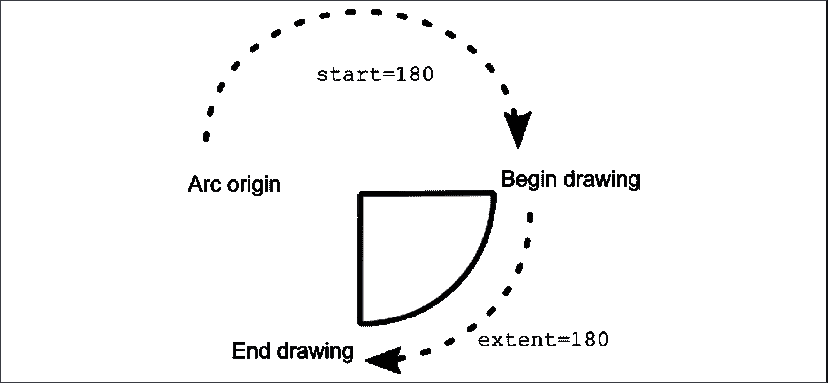
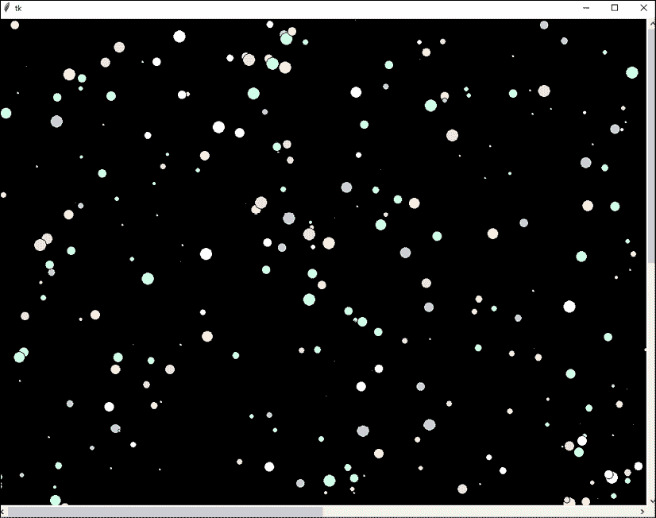
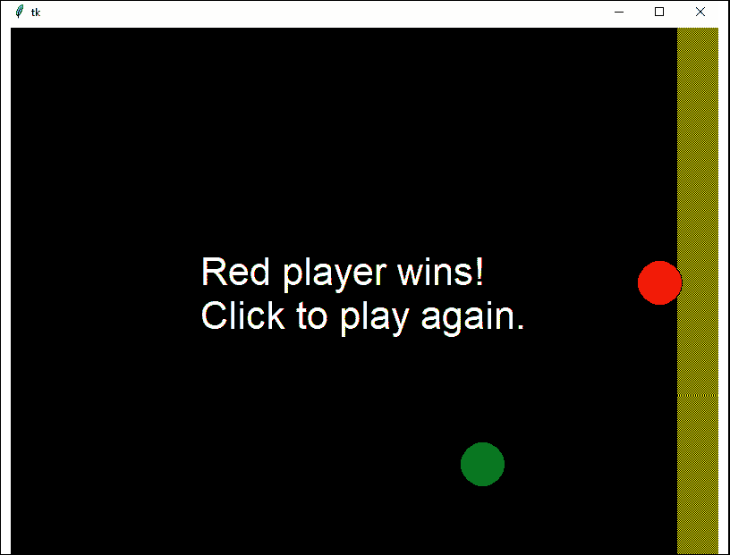
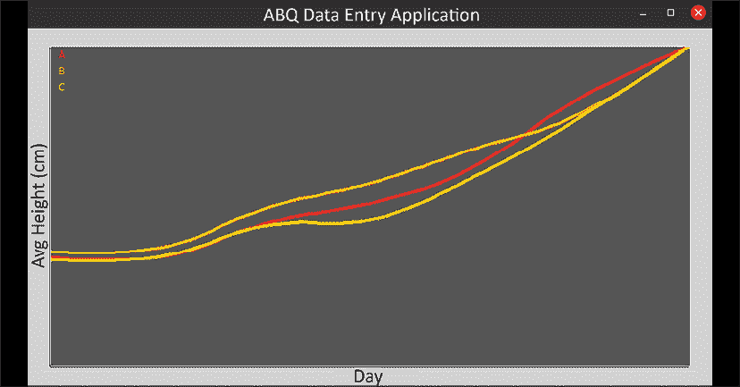
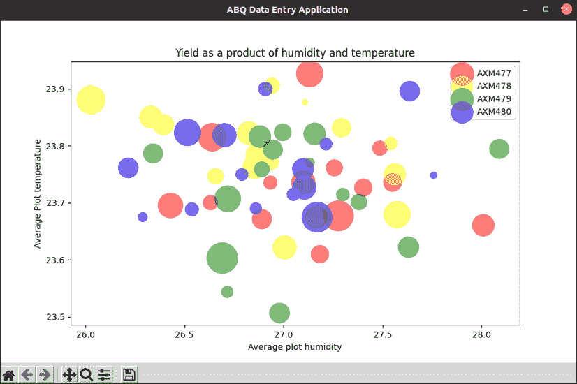

# 第十五章：使用 Canvas 小部件可视化数据

在数据库中记录了几个月的实验数据后，是时候开始可视化和解释这些数据的过程了。与其将数据导出到电子表格中创建图表和图形，你的同事分析师们询问程序本身是否可以创建图形数据可视化。确实可以！为了实现这个功能，你需要了解 Tkinter 的`Canvas`小部件。

在本章中，你将在学习以下主题的同时实现数据可视化：

+   在“使用 Tkinter 的 Canvas 进行绘制和动画”中，你将学习如何使用`Canvas`小部件进行绘制和动画

+   在“使用 Canvas 创建简单图表”中，我们将使用 Tkinter `Canvas`构建一个简单的线形图

+   在“使用 Matplotlib 创建高级图表”中，我们将学习如何集成 Matplotlib 库以获得更强大的图表和图形功能

# 使用 Tkinter 的 Canvas 进行绘制和动画

`Canvas`小部件无疑是 Tkinter 中最强大的小部件之一。它可以用来构建从自定义小部件和视图到完整用户界面的任何东西。

正如其名所示，`Canvas`小部件是一个空白区域，可以在其上绘制图形和图像。为了理解其基本用法，让我们创建一个小型演示脚本。

通过创建根窗口和`Canvas`对象开始脚本：

```py
# simple_canvas_demo.py
import tkinter as tk
root = tk.Tk()
canvas = tk.Canvas(
  root, background='black',
  width=1024, height=768
)
canvas.pack() 
```

创建`Canvas`对象就像创建任何其他 Tkinter 小部件一样。除了父小部件和`background`参数外，我们还可以指定`width`和`height`参数来设置`Canvas`的大小。设置`Canvas`小部件的大小很重要，因为它不仅定义了小部件的大小，还定义了**视口**；即我们的绘制对象将可见的区域。我们实际上可以在`Canvas`的几乎无限表面上绘制任何地方，但只有视口内的区域才是可见的。

我们将在“滚动画布”部分学习如何查看视口下方的区域。

## 在画布上绘制

一旦我们有了`Canvas`对象，我们就可以开始使用其许多`create_()`方法在其上绘制项目。这些方法允许我们绘制形状、线条、图像和文本。随着我们开发`simple_canvas_demo.py`脚本，让我们更详细地探讨这些方法。

### 矩形和正方形

可以使用`create_rectangle()`方法在`Canvas`上绘制矩形或正方形，如下所示：

```py
# simple_canvas_demo.py
canvas.create_rectangle(240, 240, 260, 260, fill='orange') 
```

`create_rectangle()`的前四个参数是上左角和下右角的坐标，从`Canvas`的上左角开始计算像素。每个`create_()`方法都以位置参数开始，这些参数定义了形状的位置和大小。随后，我们可以指定各种关键字参数来描述形状的其他方面；例如，这里使用的`fill`选项指定了对象内部的颜色。

理解`Canvas`上的垂直坐标非常重要，与典型图表上的坐标不同，它们是从顶部向下延伸的。例如，坐标(200, 100)比(200, 200)高 100 像素。对于所有 Tkinter 小部件上的坐标，以及许多其他 GUI 编程环境中的坐标也是如此。

坐标也可以指定为元组对，如下所示：

```py
canvas.create_rectangle(
  (300, 240), (320, 260),
  fill='#FF8800'
) 
```

虽然这需要更多的字符，但它大大提高了可读性。`create_rectangle()`方法支持其他几个关键字参数来配置矩形的填充和轮廓，包括以下内容：

| 参数 | 值 | 描述 |
| --- | --- | --- |
| `dash` | 整数元组 | 定义轮廓的虚线模式（见下文） |
| `outline` | 颜色字符串 | 指定边框的颜色 |
| `width` | 整数 | 指定边框的宽度 |
| `stipple` | 位图名称 | 使用该位图模式进行填充的位图名称 |

可以在`Canvas`对象上使用**虚线模式**定义虚线或点线。这是一个整数元组，描述了在切换线与空白之间的像素数。例如，`dash`值为`(5, 1, 2, 1)`将产生一个重复的模式，包括五像素的线、一个空像素、两个像素的线和一个空像素。

`stipple`值允许您指定用于填充形状的位图，而不是实心填充。Tkinter 自带一些内置的位图文件，例如`gray75`、`gray50`、`gray25`和`gray12`（每个都填充了均匀分布的像素，百分比由指定），或者您可以使用格式`@filename.xbm`加载自己的`.xbm`文件。

### 椭圆、圆形和圆弧

除了矩形外，我们还可以使用`create_oval()`方法创建椭圆和圆形。以下是将椭圆添加到演示中的方法：

```py
canvas.create_oval(
  (350, 200), (450, 250), fill='blue'
) 
```

与创建矩形类似，我们首先指定坐标来描述形状；然而，这次坐标决定了其**边界框**的左上角和右下角。边界框是包含一个项目的最小矩形。例如，在这个椭圆的情况下，边界框的角位于`(350, 200)`和`(450, 250)`。要画一个圆形，当然，我们只需定义一个具有正方形边界框的椭圆。

`create_oval()`允许与`create_rectangle()`相同的关键字参数来配置形状的填充和轮廓。

如果我们只想画椭圆的一部分，可以使用`create_arc()`方法。此方法与`create_oval()`工作方式相同，但也接受`extent`和`start`关键字参数。`start`参数指定从圆的左中点起原点到绘图开始点的角度数，而`extent`参数指定逆时针延伸的角度数。例如，`extent`为`90`和`start`为`180`将绘制从右侧开始到底部的四分之一椭圆，如图所示：



图 15.1：绘制圆弧

让我们在我们的演示中添加一个圆弧：

```py
canvas.create_arc(
  (100, 200), (200, 300),
  fill='yellow', extent=315, start=25
) 
```

### 线条

我们还可以使用`create_line()`方法在`Canvas`上绘制线条。与矩形、椭圆和圆弧一样，我们首先指定坐标来定义线条。与形状不同，坐标不定义边界框，而是定义一组定义线条的点。

让我们在我们的演示脚本中添加一条线，如下所示：

```py
canvas.create_line(
  (0, 180), (1024, 180),
  width=5, fill='cyan'
) 
```

在这个例子中，将绘制一条从第一个点`(0, 180)`到第二个点`(1024, 180)`的直线。在这种情况下，`fill`参数定义了线的颜色，而`width`决定了它的宽度。

`create_line()`方法不仅限于两点之间的一条线。我们可以指定任意数量的坐标对作为位置参数，Tkinter 将从第一个到最后一个连接它们。例如，将以下内容添加到演示中：

```py
canvas.create_line(
  (0, 320), (500, 320), (500, 768), (640, 768),
  (640, 320), (1024, 320),
  width=5, fill='cyan'
) 
```

这次我们创建了一条包含六个点的更复杂的线。

这里显示了`create_line()`的一些附加参数：

| 参数 | 值 | 描述 |
| --- | --- | --- |
| `arrow` | `FIRST`，`LAST`或`BOTH` | 如果指定，将在线条的末端绘制箭头。默认值为无值，表示没有箭头。 |
| `capstyle` | `BUTT`，`PROJECTING`或`ROUND` | 指定线条末端的样式。默认为`BUTT`。 |
| `dash` | 整数元组 | 定义线的虚线样式。 |
| `joinstyle` | `ROUND`，`BEVEL`或`MITER` | 指定角落连接的样式。默认为`ROUND`。 |
| `smooth` | 布尔值 | 是否用样条曲线绘制线条。默认为`False`（直线）。 |
| `tags` | 字符串元组 | 可分配给线条的任意数量的标签。 |

### 多边形

`Canvas`还允许我们绘制任意多边形；它的工作方式与线条类似，其中每个坐标定义一个点，该点将被连接以绘制多边形的轮廓。区别在于最后一个点和第一个点也将被连接以形成一个封闭形状。

按如下方式将多边形添加到我们的演示脚本中：

```py
canvas.create_polygon(
  (350, 225), (350,  300), (375, 275), (400, 300),
  (425, 275), (450, 300), (450, 225),
  fill='blue'
) 
```

注意，与`create_line()`不同，`fill`参数定义的是多边形内部的颜色，而不是轮廓的颜色。多边形轮廓的外观可以通过与`create_rectangle()`和`create_oval()`相同的参数进行配置。

### 文本

除了简单的形状，我们还可以直接在`Canvas`上放置文本。

例如，让我们在我们的演示中添加一些文本：

```py
canvas.create_text(
  (500, 100), text='Insert a Quarter',
  fill='yellow', font='TkDefaultFont 64'
) 
```

单一坐标参数确定文本将锚定到`Canvas`上的位置。默认情况下，文本以其自身的中心点锚定到锚点。在这种情况下，这意味着我们字符串的中间（大约在“a”的位置）将在`x=500`，`y=100`。然而，`anchor`参数可以用来指定文本项的哪一部分被锚定到锚点；它可以是指定的任何基本方向常量（`N`，`NW`，`W`等）或`CENTER`，这是默认值。

在这种情况下，`fill` 参数确定文本的颜色，我们可以使用 `font` 来确定文本的字体属性。Tkinter 8.6 及以后的版本还提供了一个 `angle` 参数，可以旋转文本指定的角度。

### 图像

当然，我们不仅限于在 `Canvas` 上绘制线条和简单的形状；我们还可以使用 `create_image()` 方法放置位图图像。此方法允许我们在 `Canvas` 上放置 `PhotoImage` 或 `BitmapImage` 对象，如下所示：

```py
# simple_canvas_demo.py
smiley = tk.PhotoImage(file='smile.gif')
canvas.create_image((570, 250), image=smiley) 
```

与文本一样，图像默认情况下通过其中心锚定坐标连接，但可以使用 `anchor` 参数将其更改为图像边界框的任何一边或角。

### Tkinter 小部件

我们可以在 `Canvas` 上放置的最后一件东西是另一个 Tkinter 小部件。当然，由于 `Canvas` 是一个小部件，我们可以使用 `pack()` 或 `grid()` 这样的布局管理器来做到这一点，但如果我们将它作为 `Canvas` 项目使用 `create_window()` 添加，我们会获得更多的控制。

要使用 `create_window()` 添加小部件，该小部件只需是 `Canvas` 小部件同一父窗口上的小部件的子项。然后我们可以将小部件的引用传递给方法的 `window` 参数。我们还可以指定 `width` 和 `height` 参数来确定要添加小部件的窗口区域的大小；小部件将默认扩展到该区域。

例如，让我们向演示中添加一个退出按钮：

```py
quit = tk.Button(
  root, text='Quit', bg='black', fg='cyan', font='TkFixedFont 24',
  activeforeground='black', activebackground='cyan',  
  command=root.quit
)
canvas.create_window((100, 700), height=100, width=100, window=quit) 
```

就像文本和图像一样，小部件默认情况下通过其中心锚定到给定的坐标，可以使用 `anchor` 参数将其锚定到一边或角。

### Canvas 项目和状态

注意上述代码示例中 `activeforeground` 和 `activebackground` 参数的使用。就像小部件一样，`Canvas` 项目可以设置各种状态，这些状态可以用来动态改变外观。下表显示了项目的可用状态及其结果：

| 状态 | 触发 | 结果 |
| --- | --- | --- |
| `normal` | 默认 | 正常外观 |
| `disabled` | 手动设置 | 禁用外观 |
| `active` | 鼠标悬停 | 活跃外观 |
| `hidden` | 手动设置 | 不显示 |

所有绘制的项目（即不是图像的项目）都有基于状态的 `fill`、`outline`、`dash`、`width`、`stipple` 和 `outlinestipple` 参数的版本，这些参数只是前面加上 `active` 或 `disabled` 的参数。例如，`activefill` 在项目被鼠标悬停时设置 `fill` 值，而 `disabledoutline` 在项目设置为 `disabled` 状态时设置轮廓颜色。图像项目有 `disabledimage` 和 `activeimage` 参数，可以在项目禁用或活跃时显示不同的图像。

当鼠标悬停在项目上时，会自动设置 `active` 状态；可以使用 `Canvas.itemconfigure()` 方法设置 `disabled` 和 `hidden` 状态，该方法将在下面的 *Canvas 对象方法* 部分中讨论。

## Canvas 对象方法

`Canvas` 项目不是由一个 Python 对象表示；相反，任何 `create_()` 方法的返回值都是一个整数，它唯一地标识了在 `Canvas` 对象上下文中该项目。为了在创建后操作 `Canvas` 项目，我们需要保存该标识值并将其传递给各种 `Canvas` 方法。

例如，我们可以保存我们添加的图像的 ID，然后使用 `Canvas.tag_bind()` 方法将图像绑定到一个回调：

```py
# simple_canvas_demo.py
**image_item =** canvas.create_image((570, 250), image=smiley)
**canvas.tag_bind(**
 **image_item,**
**'<Button-1>'****,**
**lambda** **e: canvas.delete(image_item)**
**)** 
```

在这里，我们使用了 `tag_bind()` 方法将我们的图像对象上的左键单击绑定到 `Canvas` 的 `delete()` 方法，该方法（当给定项目标识符时）会删除该项目。

`Canvas` 对象具有许多可以对 `Canvas` 项目执行操作的方法；其中一些更有用的方法列在这个表中：

| 方法 | 参数 | 描述 |
| --- | --- | --- |
| `bbox()` | 项目 ID | 返回一个描述项目边界的元组。 |
| `coords()` | 项目 ID，坐标 | 如果只提供 ID，则返回项目的坐标。否则，将项目移动到给定的坐标。 |
| `delete()` | 项目 ID | 从 `Canvas` 中删除项目。 |
| `find_overlapping()` | 矩形坐标 | 返回一个列表，包含与由坐标描述的矩形重叠的项目 ID。 |
| `itemcget()` | 项目 ID，选项 | 返回给定项目的 `option` 值。 |
| `itemconfigure()` | 项目 ID，选项 | 在指定的项目上设置一个或多个配置选项。 |
| `move()` | 项目 ID，X，Y | 将项目在 `Canvas` 上相对于其当前位置移动给定 `X` 和 `Y` 的量。 |
| `type()` | 项目 ID | 返回一个描述对象类型（矩形、椭圆、弧等）的字符串。 |

注意，任何接受项目 ID 的这些方法也可以接受一个 **标签**。回想一下 *第九章*，*通过样式和主题改进外观*，标签只是一个字符串，可以在创建项目时分配给它，允许我们一次引用多个项目。`Canvas` 默认有两个内置标签，`all` 和 `current`。正如你所期望的，`all` 指的是 `Canvas` 上的所有项目，而 `current` 指的是当前具有焦点的项目。

所有 `create_()` 方法都允许指定一个字符串元组，将其附加到对象上。

顺便说一下，如果你还没有这样做，请将 `root.mainloop()` 添加到演示脚本中并执行它，以查看我们绘制了什么！

## 滚动画布

如前所述，`Canvas` 小部件的宽度和高度决定了视口的大小，但实际的绘制区域在部件的所有方向上无限延伸。要实际看到视口区域外的对象，我们需要启用滚动。

要了解这是如何工作的，让我们创建一个可滚动的星系；打开一个名为 `canvas_scroll.py` 的新文件，并开始如下：

```py
# canvas_scroll.py
import tkinter as tk
from random import randint, choice
# Create root and canvas
root = tk.Tk()
width = 1024
height = 768
canvas = tk.Canvas(
  root, background='black',
  width=width, height=height,
)
canvas.grid(row=0, column=0) 
```

在这里，我们导入了 `tkinter` 和 `random` 的一些函数，然后创建了一个根窗口和一个具有 1024x768 视口大小的 `Canvas` 对象。最后，我们使用 `grid()` 将 `Canvas` 放置在根窗口上。

现在，让我们绘制一些“星星”：

```py
colors = ['#FCC', '#CFC', '#CCF', '#FFC', '#FFF', '#CFF']
for _ in range(1000):
  x = randint(0, width * 2)
  y = randint(0, height * 2)
  z = randint(1, 10)
  c = choice(colors)
  canvas.create_oval((x - z, y - z), (x + z, y + z), fill=c) 
```

我们首先定义一个颜色值列表，然后启动一个将迭代 1000 次的`for`循环。在循环内部，我们将生成随机的`X`和`Y`坐标，一个随机的大小（`Z`），并随机选择一种颜色。然后，我们将让`Canvas`在随机点上绘制一个填充随机颜色的圆。

注意，为`X`和`Y`提供的范围是`Canvas`对象大小的两倍。正因为如此，循环将创建从视口区域右侧和下方延伸出去的圆。

要启用`Canvas`的滚动，我们首先必须为它定义一个`scrollregion`值，如下所示：

```py
canvas.configure(scrollregion=(0, 0, width * 2, height * 2)) 
```

`scrollregion`的值是一个包含四个整数的元组，描述了我们想要能够滚动的区域的边界框。本质上，前两个整数是框左上角的`X`和`Y`坐标，后两个是右下角的坐标。

要实际滚动`Canvas`，我们需要一些`Scrollbar`小部件。我们在*第八章*，*使用 Treeview 和 Notebook 导航记录*中已经遇到过这些小部件，记得要使用它们，我们需要创建小部件，将它们添加到布局中，并连接适当的回调函数，以便滚动条可以与被滚动的小部件通信。

将以下代码添加到脚本中：

```py
xscroll = tk.Scrollbar(
  root,
  command=canvas.xview,
  orient=tk.HORIZONTAL
)
xscroll.grid(row=1, column=0, sticky='new')
yscroll = tk.Scrollbar(root, command=canvas.yview)
yscroll.grid(row=0, column=1, sticky='nsw')
canvas.configure(yscrollcommand=yscroll.set)
canvas.configure(xscrollcommand=xscroll.set) 
```

在这里，我们创建了两个`Scrollbar`小部件，一个用于水平滚动，一个用于垂直滚动。我们将它们分别添加到`Canvas`下方和右侧的布局中。然后，我们将每个滚动条的`command`参数连接到`Canvas`的`xview`或`yview`方法，并将`Canvas`的`yscrollcommand`和`xscrollcommand`参数配置为调用相应滚动条的`set()`方法。

通过调用`root.mainloop()`来完成此脚本，并执行它；你应该会看到这里所示的内容：



图 15.2：滚动星星！

在`Canvas`上绘制基于运行时定义的点（例如，基于用户输入）后正确配置滚动区域的一个实用技巧是将`scrollregion`设置为创建项目后`canvas.bbox('all')`的输出。当传递一个`all`标签时，`bbox()`方法返回一个包含`Canvas`上所有项目全部内容的边界框。您可以直接将此值设置为`scrollregion`，以确保您可以看到所有项目。

## 动画 Canvas 对象

Tkinter 的`Canvas`小部件没有内置的动画框架，但我们可以通过结合其`move()`方法与我们对事件队列的理解来创建简单的动画。

为了演示这一点，我们将创建一个虫子赛跑模拟器，其中两个虫子（用彩色圆圈表示）将随意向屏幕另一侧的终点线冲刺。像真正的虫子一样，它们不会意识到自己在比赛中，并且会相对随机地移动，获胜者是偶然第一个撞到终点线的虫子。

首先，打开一个新的 Python 文件，并从一个基本的面向对象模式开始，如下所示：

```py
# bug_race.py
import tkinter as tk
class App(tk.Tk):
  def __init__(self, *args, **kwargs):
    super().__init__(*args, **kwargs)
    self.canvas = tk.Canvas(self, background='black')
    self.canvas.pack(fill='both', expand=1)
    self.geometry('800x600')
App().mainloop() 
```

这只是一个简单的 OOP Tkinter 模板应用程序，其中添加了一个 `Canvas` 对象到根窗口。这将是我们将构建游戏代码的基本平台。

### 设置比赛场地

现在我们有了基本框架，让我们设置比赛场地。我们希望在每一轮之后能够重置比赛场地，因此我们不会在初始化器中这样做，而是创建一个单独的方法，称为 `setup()`，如下所示：

```py
 def setup(self):
    self.canvas.left = 0
    self.canvas.top = 0
    self.canvas.right = self.canvas.winfo_width()
    self.canvas.bottom = self.canvas.winfo_height()
    self.canvas.center_x = self.canvas.right // 2
    self.canvas.center_y = self.canvas.bottom // 2
    self.finish_line = self.canvas.create_rectangle(
      (self.canvas.right - 50, 0),
      (self.canvas.right, self.canvas.bottom),
      fill='yellow', stipple='gray50'
    ) 
```

`setup()` 方法首先在 `Canvas` 对象上计算一些相对位置，并将它们保存为实例属性，这将简化在 `Canvas` 对象上放置对象的过程。在运行时计算这些位置意味着我们可以在回合之间调整窗口大小，以适应更长或更短的赛道。

终点线实现为一个横跨窗口右侧的矩形。注意使用 `stipple` 参数指定一个位图，该位图将叠加到纯色上，以给它一些纹理；在这种情况下，`gray50` 是一个内置的位图，交替填充和不填充像素。这让我们得到一个比纯色更有趣的东西。

在 `App.__init__()` 的末尾添加对 `setup()` 的调用，如下所示：

```py
# bug_race.py, in App.__init__()
        self.canvas.wait_visibility()
        self.setup() 
```

因为 `setup()` 依赖于 `Canvas` 对象的宽度和高度值，我们需要确保它不会在操作系统的窗口管理器绘制和调整窗口大小之前被调用。最简单的方法是在 `Canvas` 对象上调用 `wait_visibility()`，这将阻塞执行，直到对象被绘制。

### 设置我们的玩家

现在我们有了比赛场地，我们需要创建我们的玩家。我们将创建一个 `Racer` 类来表示一个玩家；如下启动它：

```py
# bug_race.py
class Racer:
  def __init__(self, canvas, color):
    self.canvas = canvas
    self.name = f"{color.title()} player"
    size = 50
    self.id = canvas.create_oval(
      (canvas.left, canvas.center_y),
      (canvas.left + size, canvas.center_y + size),
      fill=color
    ) 
```

`Racer` 类将通过引用 `Canvas` 对象和一个颜色字符串来创建，其颜色和名称将从该字符串中派生。我们将最初在屏幕的左中位置绘制赛车，并使其大小为 50 像素。最后，我们将其项目 ID 字符串的引用保存到 `self.id` 中。

现在，回到 `App.setup()`，我们将通过添加以下内容创建两个赛车：

```py
# bug_race.py, in App.setup()
    self.racers = [
      Racer(self.canvas, 'red'),
      Racer(self.canvas, 'green')
    ] 
```

到目前为止，我们游戏中的所有对象都已设置。运行程序，你应该在右侧看到一个带有黄色斑点的终点线，在左侧看到一个绿色圆圈（红色圆圈将隐藏在绿色圆圈下面，因为它们位于相同的坐标）。

### 动画赛车

为了动画赛车，我们将使用 `Canvas.move()` 方法。正如我们之前所学的，`move()` 接收一个项目 ID、一个 `X` 像素数和一个 `Y` 像素数，并将项目移动这个量。通过结合这个方法与 `random.randint()` 函数和一些简单的逻辑，我们可以生成一系列移动，将每辆赛车引导到终点线的蜿蜒路径上。

一个简单的实现可能看起来像这样：

```py
from random import randint
# inside Racer
  def move_racer(self):
    x = randint(0, 100)
    y = randint(-50, 50)
    t = randint(500, 2000)
    self.canvas.after(t, self.canvas.move, self.id, x, y)
    if self.canvas.bbox(self.id)[0] < self.canvas.right:
      self.canvas.after(t, self.move_racer) 
```

这种方法生成一个随机的向前`X`移动，一个随机的上下`Y`移动，以及一个随机的时间间隔。然后我们使用`after()`方法在随机时间间隔后安排对`move()`的调用，以生成`X`和`Y`移动。`if`语句确定赛车者的边界框是否当前位于屏幕的右侧或更远；如果此测试结果为`False`，我们将安排对`move_racer()`的另一次调用。

此方法将赛车带到终点线，但这并不是我们想要的。问题是`move()`是瞬间发生的，导致错误在屏幕上跳跃，而不是平滑移动。

为了使虫子移动得更平滑，我们需要采取更复杂的方法：

1.  首先，我们将计算一系列线性移动，每个移动都有一个随机的`delta x`、`delta y`和间隔，这将达到终点线

1.  然后，我们将每个单独的动作分解成由将移动间隔除以常规动画帧间隔确定的步骤数

1.  接下来，我们将每个动作的每一步添加到队列中

1.  最后，我们将在每个动画帧间隔调用一个方法，该方法将从队列中拉取下一个步骤并将其传递给`move()`

让我们先定义我们的帧间隔；在`Racer`类中，创建一个类属性来表示这个：

```py
class Racer:
  FRAME_RES = 50 
```

`FRAME_RES`（代表帧分辨率）定义了每个`Canvas.move()`调用之间的毫秒数。50 毫秒给我们 20 帧每秒，应该足够平滑地移动。

接下来，我们需要导入`Queue`类并在`Racer`对象的初始化器中创建一个实例：

```py
# bug_race.py, at top
from queue import Queue
# inside Racer.__init__()
    self.movement_queue = Queue() 
```

现在，我们将创建一个绘制到终点线路线的方法：

```py
# bug_race.py, inside Racer
  def plot_course(self):
    start_x = self.canvas.left
    start_y = self.canvas.center_y
    total_dx, total_dy = (0, 0)
    while start_x + total_dx < self.canvas.right:
      dx = randint(0, 100)
      dy = randint(-50, 50)
      target_y = start_y + total_dy + dy
      if not (self.canvas.top < target_y < self.canvas.bottom):
        dy = -dy
      total_dx += dx
      total_dy += dy
      time = randint(500, 2000)
      self.queue_move(dx, dy, time) 
```

此方法通过生成随机的`x`和`y`移动，直到`x`的总变化量大于`Canvas`对象的宽度，从而在`Canvas`的左中心绘制一条路线到右侧的随机点。`x`的变化量始终为正，使我们的虫子向终点线移动，但`y`的变化量可以是正的或负的，以允许向上和向下移动。为了使我们的虫子保持在屏幕上，我们将通过否定任何将玩家置于`Canvas`顶部或底部边界之外的`y`变化来约束总的`y`移动。

除了随机的`dx`和`dy`值之外，我们还需要为移动生成一个随机的时间间隔，介于半秒和两秒之间。最后，生成的`dx`、`dy`和`time`值被传递给`queue_move()`方法。

`queue_move()`方法需要将大动作分解成单个动作帧，这些动作帧描述了赛车应该在`FRAME_RES`间隔内如何移动。为了进行这个计算，我们需要一个**分区函数**，这是一个数学函数，它将整数`N`分解成`K`个大约相等的整数。例如，如果我们想将`-10`分解成四个部分，我们的函数应该返回一个类似`[-2, -2, -3, -3]`的列表。

让我们在 `Racer` 上创建一个名为 `partition()` 的静态方法：

```py
# bug_race.py, inside Racer
  @staticmethod
  def partition(n, k):
    """Return a list of k integers that sum to n"""
    if n == 0:
      return [0] * k 
```

我们从简单的情况开始这个方法：当 `n` 为 `0` 时，返回一个包含 `k` 个零的列表。

现在，我们将处理更复杂的情况：

```py
 base_step = n // k
    parts = [base_step] * k
    for i in range(n % k):
      parts[i] += 1
    return parts 
```

对于非零的 `n`，我们首先通过使用向下取整将 `n` 除以 `k` 来计算 `base_step`，这会将我们的结果向下取整到最接近的整数。然后，我们创建一个长度为 `k` 的列表，该列表由 `base_step` 值组成。接下来，我们需要尽可能均匀地将 `n / k` 的余数分配到这个列表中。为了完成这个任务，我们将第一个 `n % k` 项添加到部分列表中。

使用我们的 `n = -10` 和 `k = 4` 的例子来遵循这里的数学：

+   基本步长计算为 `-10 / 4 = -3`（记住，向下取整总是向下取整，所以 `-2.5` 被四舍五入到 `-3`）。

+   然后，我们创建一个包含四个基本步长值的列表：`[-3, -3, -3, -3]`。

+   `-10 % 4 = 2`，所以我们向列表中的前两项添加 `1`。

+   我们得到了一个答案 `[-2, -2, -3, -3]`。完美！

像这样的分区函数是 **离散数学** 的组成部分，离散数学是处理整数运算的数学分支。离散数学常用于解决绘图和动画中遇到的空间问题。

现在我们有了分区方法，我们可以编写 `queue_move()` 方法：

```py
 def queue_move(self, dx, dy, time):
    num_steps = time // self.FRAME_RES
    steps = zip(
      self.partition(dx, num_steps),
      self.partition(dy, num_steps)
    )
    for step in steps:
      self.movement_queue.put(step) 
```

我们首先通过将时间间隔除以 `FRAME_RES` 使用向下取整来确定这次移动所需的步数。然后，我们通过将 `dx` 和 `dy` 分别传递给我们的 `partition()` 方法来创建一个 `X` 移动列表和一个 `Y` 移动列表。这两个列表通过 `zip()` 组合形成一个单一的 `(dx, dy)` 对列表，我们迭代这个列表，将每一对添加到动画队列中。

要使动画真正发生，我们需要一个方法来检查队列并执行每个移动；我们将称之为 `next_move()`：

```py
 def next_move(self):
    if not self.movement_queue.empty():
      nextmove = self.movement_queue.get()
      self.canvas.move(self.id, *nextmove) 
```

`next_move()` 方法首先检查队列中是否有移动步骤。如果有，则使用赛车者的 ID 和步骤的 `X` 和 `Y` 值调用 `canvas.move()`。当游戏开始时，此方法将从 `App` 对象中反复调用，直到其中一名赛车者获胜。

最后，我们需要将 `plot_course()` 调用添加到 `Racer` 类的初始化器中，如下所示：

```py
# bug_race.py, at the end of Racer.__init__()
    self.plot_course() 
```

因此，一旦创建了一个 `Racer` 对象，它就会绘制到终点的赛道，并等待 `App` 类告诉它移动。

### 运行游戏循环并检测获胜条件

要实际运行游戏，我们需要启动一个游戏循环。当然，我们知道从 *第十四章*，*使用线程和队列进行异步编程*，我们不能简单地使用 Python 的 `for` 或 `while` 循环，因为这会阻塞 Tkinter 绘图操作，并使游戏冻结直到结束。相反，我们需要创建一个方法来执行游戏动画的单个“帧”，然后将其调度到 Tkinter 事件循环中再次运行。

那个方法开始是这样的：

```py
# bug_race.py, inside App
  def execute_frame(self):
    for racer in self.racers:
      racer.next_move() 
```

它首先遍历赛车对象并执行它们的 `next_move()` 方法。移动每个赛车后，我们的下一步是确定是否有任何一个赛车手已经越过终点线并获胜。

为了检测这种条件，我们需要检查赛车是否与终点线项目重叠。

使用 Tkinter `Canvas` 小部件进行项目之间的碰撞检测稍微有些棘手。我们必须传递一组边界框坐标到 `find_overlapping()`，它返回一个重叠边界框的项目标识符元组。

让我们为我们的 `Racer` 类创建一个 `overlapping()` 方法：

```py
# bug_race.py, inside Racer
  @property
  def overlapping(self):
    bbox = self.canvas.bbox(self.id)
    overlappers = self.canvas.find_overlapping(*bbox)
    return [x for x in overlappers if x!=self.id] 
```

此方法使用 `Canvas` 的 `bbox()` 方法检索 `Racer` 项目的边界框。然后，它使用 `find_overlapping()` 获取与该边界框重叠的项目元组的列表。由于这包括 `Racer` 项目的 ID，我们将使用列表推导从元组中过滤掉它。结果是与这个 `Racer` 对象的 `Canvas` 项目重叠的项目列表。由于此方法不需要任何参数并且只返回一个值，我们将其制作为一个属性。

在我们的 `execute_frame()` 方法中，我们将检查每个赛车手是否已经越过终点线：

```py
# bug_race.py, inside App
  def execute_frame(self):
    for racer in self.racers:
      racer.next_move()
      **if** **self.finish_line** **in** **racer.overlapping:**
        **self.declare_winner(racer)**
        **return**
    **self.after(Racer.FRAME_RES, self.execute_frame)** 
```

如果赛车手的 `overlapping()` 方法返回的列表中包含 `finish_line` ID，则赛车手已经撞到终点线，将通过调用 `declare_winner()` 方法并从该方法返回来宣布其为获胜者。

如果没有玩家被宣布为获胜者，`execute_frame()` 方法将在 `Racer.FRAME_RES` 毫秒后再次运行。这实际上使用 Tkinter 事件循环实现了一个游戏循环，它将一直运行，直到有赛车获胜。

我们在 `declare_winner()` 方法中处理获胜条件：

```py
 def declare_winner(self, racer):
    wintext = self.canvas.create_text(
      (self.canvas.center_x, self.canvas.center_y),
      text=f'{racer.name} wins!\nClick to play again.',
      fill='white',
      font='TkDefaultFont 32',
      activefill='violet'
    )
    self.canvas.tag_bind(wintext, '<Button-1>', self.reset) 
```

在此方法中，我们只是在 `Canvas` 的中心创建了一个文本项目，宣布 `racer.name` 为获胜者。`activefill` 参数使得当鼠标悬停时颜色呈现紫色，这向用户表明此文本是可点击的。

当点击该文本时，它会调用 `reset()` 方法：

```py
 def reset(self, *args):
    self.canvas.delete('all')
    self.setup() 
```

`reset()` 方法需要清除 `Canvas`，因此它使用 `all` 参数调用 `delete()` 方法。记住，`all` 是一个应用于 `Canvas` 上所有项目的内置标签，因此这一行实际上删除了所有 `Canvas` 项目。一旦 `Canvas` 清空，我们就调用 `setup()` 来重置并重新开始游戏。

我们最后需要确保每次调用 `setup()` 时游戏都会开始。要做到这一点，将 `execute_frame()` 的调用添加到 `setup()` 的末尾：

```py
# bug_race.py, in App.setup()
  def setup():
    # ...
    self.execute_frame() 
```

游戏现在已完成；运行脚本，你应该会看到类似这样的结果：



图 15.3：虫子赛跑游戏。红色获胜！

虽然并不完全简单，但经过一些仔细规划和数学计算，Tkinter 中的动画可以提供平滑且令人满意的结果。不过，既然我们已经足够了解游戏，就让我们回到实验室，看看如何使用 Tkinter 的 `Canvas` 小部件来可视化数据。

# 使用 Canvas 创建简单的图表

我们想要生成的第一个图表是一个简单的线形图，显示我们的植物随时间增长的情况。每个实验室都有不同的气候条件，我们想看看这些条件是如何影响所有植物的生长的，因此图表将包含每个实验室的一条线，显示实验期间实验室中所有地块的中位数高度测量的平均值。

我们将首先创建一个模型方法来返回原始数据，然后创建基于 `Canvas` 的线形图表视图，最后创建一个应用程序回调来获取数据并将其发送到图表视图。

## 创建模型方法

与 ABQ 的另一位数据分析师合作，你开发了一个 SQL 查询，通过从 `plot_checks` 表中的最老日期减去其日期来确定地块检查的日期编号，然后提取 `lab_id` 和给定日期给定实验室中所有植物的中位数高度的平均值。查询如下所示：

```py
SELECT
  date - (SELECT min(date) FROM plot_checks) AS "Day",
  lab_id,
  avg(median_height) AS "Average Height (cm)"
FROM plot_checks
GROUP BY date, lab_id
ORDER BY "Day", lab_id; 
```

查询返回一个看起来像这样的数据表：

| Day | lab_id | Average Height (cm) |
| --- | --- | --- |
| 0 | A | 1.4198750000000000 |
| 0 | B | 1.3320000000000000 |
| 0 | C | 1.5377500000000000 |
| 1 | A | 1.7266250000000000 |
| 1 | B | 1.8503750000000000 |
| 1 | C | 1.4633750000000000 |

使用此查询，让我们创建一个新的 `SQLModel` 方法 `get_growth_by_lab()` 来返回所需的数据：

```py
# models.py, inside SQLModel
  def get_growth_by_lab(self):
    query = (
      'SELECT date - (SELECT min(date) FROM plot_checks) AS "Day", '
      'lab_id, avg(median_height) AS "Avg Height (cm)" '
      'FROM plot_checks '
      'GROUP BY date, lab_id ORDER BY "Day", lab_id;'
    )
    return self.query(query) 
```

这是一个相当直接的方法；它只是运行查询并返回结果。回想一下，`SQLModel.query()` 方法返回的结果是一个字典列表；在这种情况下，每个字典包含三个字段：`Day`、`lab_id` 和 `Avg Height (cm)`。现在我们只需要开发一个可以为此数据可视化给用户的图表视图。

## 创建图表视图

我们将要创建的图表视图需要从我们的模型方法中获取数据结构，并使用它来绘制线形图。前往 `views.py` 文件，我们将创建 `LineChartView` 类：

```py
# views.py
class LineChartView(tk.Canvas):
  """A generic view for plotting a line chart"""
  margin = 20
  colors = [
    'red', 'orange', 'yellow', 'green',
    'blue', 'purple', 'violet'
  ] 
```

`LineChartView` 是 `Canvas` 的子类，因此我们可以在其上直接绘制项目。这个视图不仅包含数据图表，还包括坐标轴、标签和图例。它将为了可重用性而构建，因此我们将设计它时不会针对我们在此实例中绘制的具体数据进行任何特定参考。理想情况下，我们希望能够向它发送任意数据集以生成线形图。这里定义的两个类属性为图表周围的 `margin`（以像素为单位）提供了一个默认值，并为每个后续线形图提供了一组 `colors`。我们制作的增长图表只有三个图表（每个实验室一个），但额外的颜色允许我们指定多达七个。如果您想使用具有七个以上图表的图表，则可以在该列表中提供额外的颜色。

现在，我们将开始初始化方法：

```py
# views.py, inside LineChartView
  def __init__(
    self, parent, data, plot_size,
    x_field, y_field, plot_by_field
  ):
    self.data = data
    self.x_field = x_field
    self.y_field = y_field
    self.plot_by_field = plot_by_field 
```

除了通常的父小部件参数外，我们还指定了这些额外的位置参数：

+   `data` 将是我们的包含查询数据的字典列表。

+   `plot_size`将是一个整数元组，指定绘图区域的宽度和高度（以像素为单位）。

+   `x_field`和`y_field`将是用于绘图`X`和`Y`值的字段名称。对于增长图表，这将是`Day`和`Avg Height (cm)`。

+   `plot_by_field`将是用于将行分类为单独图表的值所在的字段。对于增长图表，这将是一个`lab_id`，因为我们希望为每个实验室绘制一个线条图表。

所有这些值都存储在实例变量中，这样我们就可以从我们的方法中访问它们。

我们将实现这个小部件的绘图区域作为一个放置在`LineChartView`上的第二个`Canvas`。然后，`LineChartView`的大小将是图表的大小加上围绕轴和标签的外部边距。我们将计算这个大小，然后将其传递给`LineChartView`超类初始化器，如下所示：

```py
 self.plot_width, self.plot_height = plot_size
    view_width = self.plot_width + (2 * self.margin)
    view_height = self.plot_height + (2 * self.margin)
    super().__init__(
      parent, width=view_width,
      height=view_height, background='lightgrey'
    ) 
```

注意，我们已经将绘图区域的宽度和高度保存为实例变量，因为我们将在某些方法中需要它们。

现在我们已经初始化了超类，我们就可以开始在主`Canvas`上绘制了；首先，让我们绘制轴：

```py
 self.origin = (self.margin, view_height - self.margin)
   # X axis
    self.create_line(
      self.origin,
      (view_width - self.margin, view_height - self.margin)
    )
    # Y axis
    self.create_line(
      self.origin, (self.margin, self.margin), width=2
    ) 
```

我们的图表原点将距离左下角`self.margin`像素，我们将从原点向图表边缘绘制简单的黑色线条，表示`X`和`Y`轴。记住，`Canvas`的`Y`坐标是从顶部向下计算的，而不是从底部向上，所以原点的`Y`坐标是视图区域的高度减去边距。

接下来，我们将标注轴：

```py
 self.create_text(
      (view_width // 2, view_height - self.margin),
      text=x_field, anchor='n'
    )
    self.create_text(
       (self.margin, view_height // 2),
       text=y_field, angle=90, anchor='s'
    ) 
```

在这里，我们正在创建文本项，将其设置为`X`和`Y`轴的标签，使用传递给对象的字段名称作为文本标签。注意使用`anchor`来设置文本边界框的哪一侧与提供的坐标相连接。例如，对于`X`轴，我们指定了`n`（北），因此文本的顶部将在`X`轴线下方。对于`Y`轴标签，我们希望文本是侧放的，所以我们指定了`angle=90`来旋转它。此外，请注意，我们已将旋转文本的`anchor`位置指定为`s`（南）；即使它已旋转，这里的四个基本方向是相对于旋转前的对象。因此，“南”始终是文本的正常书写的底部，即使对象已旋转。

在标注了轴之后，我们需要创建一个包含绘图区域的第二个`Canvas`：

```py
 self.plot_area = tk.Canvas(
      self, background='#555',
      width=self.plot_width, height=self.plot_height
    )
    self.create_window(
      self.origin, window=self.plot_area, anchor='sw'
    ) 
```

这个`Canvas`对象是实际绘图的地方。虽然我们可以在`LineChartView`上直接绘制图表，但嵌入第二个`Canvas`使得计算图表的坐标点更容易，因为我们不需要考虑边距。这也允许我们使用不同的背景颜色，使其看起来更美观。

在我们可以在图表上绘制数据之前，我们需要创建一个可以这样做的方法。让我们创建一个名为`_plot_line()`的私有实例方法，用于在图表上绘制单个线条图表，其开始如下：

```py
 def _plot_line(self, data, color):
    max_x = max([row[0] for row in data])
    max_y = max([row[1] for row in data])
    x_scale = self.plot_width / max_x
    y_scale = self.plot_height / max_y 
```

此方法将接收一个包含线`X`和`Y`点的列表的`data`参数。由于我们的图表是固定像素数，而我们的数据值可能有任意范围，我们首先需要将数据缩放以适应图表的大小。为此，我们首先找到`X`和`Y`字段的极大值，然后为每个轴创建一个缩放比例，通过将图表的总高度除以极大值来计算（注意，这假设最小值是 0。这个特定的图表类不是为处理负值而设计的）。

一旦我们有了刻度值，我们就可以通过使用列表推导式将每个数据点乘以刻度值来将数据点转换为坐标，如下所示：

```py
 coords = [
      (round(x * x_scale), self.plot_height - round(y * y_scale))
      for x, y in data
    ] 
```

注意，我们正在四舍五入值，因为我们不能绘制到分数像素值。同样，由于数据通常以左下角为原点进行绘图，但`Canvas`上的坐标从左上角开始测量，我们需要翻转`Y`坐标；这也在我们的列表推导式中完成，通过从绘图高度中减去新的`Y`值。

这些坐标现在可以传递给`create_line()`，同时传递一个合理的宽度和调用者传入的颜色参数，如下所示：

```py
 self.plot_area.create_line(
      *coords, width=4, fill=color, smooth=True
    ) 
```

注意，我们还使用了`smooth`参数来使曲线更加圆润，使其看起来更自然。

要使用这个方法，我们需要回到初始化器并做一些计算。由于`_plot_line()`方法一次只处理一个绘图，我们需要通过`plot_by_field`字段过滤我们的数据，并逐个渲染线条。

在`LineChartView.__init__()`的末尾添加此代码：

```py
# views.py, in LineChartView.__init__()
    plot_names = sorted(set([
      row[self.plot_by_field]
      for row in self.data
    ]))
    color_map = list(zip(plot_names, self.colors)) 
```

首先，我们通过从数据中检索唯一的`plot_by_field`值来获取单个绘图名称。这些值被排序并转换为`set`对象，这样我们就只能得到唯一的值。然后，我们使用`zip()`来创建一个名称到颜色的元组列表。由于`zip()`返回一个生成器，而我们打算多次使用这个映射，所以将其转换为`list`对象。

现在，让我们绘制我们的线条：

```py
 for plot_name, color in color_map:
      dataxy = [
        (row[x_field], row[y_field])
        for row in data
        if row[plot_by_field] == plot_name
      ]
      self._plot_line(dataxy, color) 
```

对于每个独特的绘图名称和颜色，我们首先使用列表推导式将数据格式化为一个包含(`X`，`Y`)对的列表。然后我们调用`_plot_line()`方法，传递数据和颜色。我们的线条现在已经被绘制了！

我们还需要一个图例，以告诉用户图表上每种颜色代表什么。没有它，这个图表对用户来说就没有意义。为此，我们将编写一个`_draw_legend()`方法：

```py
# views.py, inside LineChartView
  def _draw_legend(self, color_map):
    for i, (label, color) in enumerate(color_map):
      self.plot_area.create_text(
        (10, 10 + (i * 20), text=label, fill=color, anchor='w'
      ) 
```

我们的方法接受在初始化器中创建的颜色映射列表，并遍历它，使用`enumerate()`函数为每个迭代生成一个递增的数字。对于每个映射，我们简单地绘制一个包含标签文本和相关填充颜色的文本项。这是从图表左上角开始绘制的，每个项目比上一个项目低二十像素。

最后，让我们从初始化器调用这个方法：

```py
# views.py, inside LineChartView.__init__()
    self._draw_legend(color_map) 
```

`LineChartView` 已经准备就绪；现在我们只需要创建调用它的支持代码。

## 更新应用程序

在 `Application` 类中，创建一个新的方法来显示我们的图表：

```py
# application.py, in Application
  def show_growth_chart(self, *_):
    data = self.model.get_growth_by_lab()
    popup = tk.Toplevel()
    chart = v.LineChartView(
      popup, data, (800, 400),
      'Day', 'Avg Height (cm)', 'lab_id'
    )
    chart.pack(fill='both', expand=1) 
```

第一要务是从我们的 `get_growth_by_lab()` 方法获取数据。然后，我们创建一个 `TopLevel` 小部件来容纳我们的 `LineChartView` 对象。在这个小部件上，我们添加 `LineChartView` 对象，配置它为 `800` x `400` 像素，并指定 `X`（`Day`）、`Y`（`Avg Height (cm)`）和 `plot_by_field` 值（`lab_id`）。这个图表被打包进 `Toplevel`。

`Toplevel` 小部件创建了一个新的、空白的窗口，位于根窗口之外。你应该将其用作创建新窗口的基础，这些新窗口不是简单的对话框或消息框。

在完成此方法后，将其添加到 `Application` 初始化器中的 `event_callbacks` 字典中：

```py
# application.py, inside Application.__init__()
    event_callbacks = {
      #...
      '<<ShowGrowthChart>>': self.show_growth_chart
     } 
```

最后，我们需要添加一个菜单项来启动图表。将以下方法添加到 `GenericMainMenu` 类中：

```py
 def _add_growth_chart(self, menu):
    menu.add_command(
      label='Show Growth Chart',
      command=self._event('<<ShowGrowthChart>>')
    ) 
```

然后在每个菜单类的 `_build_menu()` 方法中使用此方法将此选项添加到 **工具** 菜单中。例如：

```py
# mainmenu.py, in any class's _build_menu() method
    self._add_growth_chart(self._menus['Tools']) 
```

当你调用你的函数时，你应该看到类似以下的内容：



图 15.4：Ubuntu Linux 上的增长图表

如果没有一些样本数据，你的图表看起来可能不会太好。除非你只是喜欢做数据录入，`sql` 目录中有一个用于加载样本数据的脚本。在测试你的图表之前，在数据库上运行此脚本。

# 使用 Matplotlib 的高级图表

我们的折线图看起来很漂亮，但还需要做相当多的工作才能成为一个真正专业的可视化：它缺少刻度、网格线、缩放功能和其他使其成为一个完全有用的图表的功能。

我们本可以花更多的时间使其更加完整，但有一个更快的方法可以在我们的 Tkinter 应用程序中获得更多令人满意的图表和图形：Matplotlib。

Matplotlib 是一个用于生成所有类型专业质量、交互式图表的第三方 Python 库。它是一个庞大的库，拥有许多附加组件，我们不会过多地介绍其实际用法，但我们将探讨如何将 Matplotlib 图表集成到 Tkinter 应用程序中。为了演示这一点，我们将创建一个气泡图，展示每个绘图与湿度和温度的关系。

你应该能够使用以下命令通过 `pip` 安装 `matplotlib` 库：

```py
$ pip install --user matplotlib 
```

关于安装的完整说明，请参阅 [`matplotlib.org/users/installing.html`](https://matplotlib.org/users/installing.html)。

## 数据模型方法

在我们能够制作图表之前，我们需要另一个 `SQLModel` 方法来提取图表所需的数据。再次提醒，你已经提供了一个返回所需数据的 SQL 查询：

```py
SELECT
  seed_sample,
  MAX(fruit) AS yield,
  AVG(humidity) AS avg_humidity,
  AVG(temperature) AS avg_temperature
FROM plot_checks
WHERE NOT equipment_fault
GROUP BY lab_id, plot, seed_sample 
```

此图表的目的是找到每个种子样本的温度和湿度的最佳点。因此，我们需要为每个图表包含最大果实测量值、图表列的平均湿度和温度以及种子样本的每一行。由于我们不希望有任何不良数据，我们将过滤掉包含设备故障的行。

查询返回的数据看起来像这样：

| seed_sample | yield | avg_humidity | avg_temperature |
| --- | --- | --- | --- |
| AXM480 | 11 | 27.7582142857142857 | 23.7485714285714286 |
| AXM480 | 20 | 27.2146428571428571 | 23.8032142857142857 |
| AXM480 | 15 | 26.2896428571428571 | 23.6750000000000000 |
| AXM478 | 31 | 27.2928571428571429 | 23.8317857142857143 |
| AXM477 | 39 | 27.1003571428571429 | 23.7360714285714286 |
| AXM478 | 39 | 26.8550000000000000 | 23.7632142857142857 |

为了将此数据提供给应用程序，让我们将查询放入另一个名为`get_yield_by_plot()`的方法中：

```py
# models.py, in SQLModel
  def get_yield_by_plot(self):
    query = (
      'SELECT seed_sample, MAX(fruit) AS yield, '
      'AVG(humidity) AS avg_humidity, '
      'AVG(temperature) AS avg_temperature '
      'FROM plot_checks WHERE NOT equipment_fault '
      'GROUP BY lab_id, plot, seed_sample'
    )
    return self.query(query) 
```

这就是模型所需的所有内容，让我们继续到视图部分。

## 创建气泡图视图

要将 Matplotlib 集成到 Tkinter 应用程序中，我们需要在`views.py`中进行几个模块导入。

第一个是`matplotlib`本身：

```py
import matplotlib
matplotlib.use('TkAgg') 
```

在脚本导入部分执行方法可能看起来很奇怪，你的代码编辑器或 IDE 甚至可能会对此提出警告。然而，根据 Matplotlib 的文档，`use()`应该在从`matplotlib`导入其他模块之前调用，以告诉它应该使用哪个渲染后端。在这种情况下，我们想要`TkAgg`后端，它是为了集成到 Tkinter 而设计的。

Matplotlib 为各种 GUI 工具包提供了后端，例如 PyQt、wxWidgets 和 Gtk3，以及用于非 GUI 情况（例如，直接将图表渲染到文件）的后端，如 SVG 渲染或网络使用。有关更多详细信息，请参阅[`matplotlib.org/stable/api/index_backend_api.html`](https://matplotlib.org/stable/api/index_backend_api.html)文档。

现在我们已经设置了后端，我们可以从`matplotlib`导入一些其他项目：

```py
from matplotlib.figure import Figure
from matplotlib.backends.backend_tkagg import (
  FigureCanvasTkAgg,
  NavigationToolbar2Tk
) 
```

`Figure`类代表`matplotlib`图表可以绘制的基本绘图区域。`FigureCanvasTkAgg`类是`Figure`和 Tkinter `Canvas`之间的接口，`NavigationToolbar2Tk`允许我们在我们的 GUI 上放置一个预先制作的导航工具栏，用于`Figure`对象。

为了了解这些是如何结合在一起的，让我们从`views.py`中的`YieldChartView`类开始：

```py
# views.py
class YieldChartView(tk.Frame):
  def __init__(self, parent, x_axis, y_axis, title):
    super().__init__(parent)
    self.figure = Figure(figsize=(6, 4), dpi=100)
    self.canvas_tkagg = FigureCanvasTkAgg(self.figure, master=self) 
```

在调用超类初始化器以创建`Frame`对象之后，我们创建一个`Figure`对象来保存我们的图表。与像素大小不同，`Figure`对象接受英寸大小和每英寸点数（`dpi`）设置。在这种情况下，我们的 6 英寸乘以 4 英寸和每英寸 100 点的参数产生了一个 600 乘以 400 像素的`Figure`对象。接下来，我们创建一个`FigureCanvasTkAgg`对象，它将用于将我们的`Figure`对象与 Tkinter `Canvas`连接。

`FigureCanvasTkAgg` 对象本身不是一个 `Canvas` 对象或其子类，但它包含一个我们可以放置在我们的应用程序中的 `Canvas` 对象。可以通过 `FigureCanvasTkAgg` 对象的 `get_tk_widget()` 方法检索对这个 `Canvas` 对象的引用。我们将获取一个引用并将其打包到 `YieldChartView` 小部件中：

```py
 canvas = self.canvas_tkagg.get_tk_widget()
    canvas.pack(fill='both', expand=True) 
```

接下来，我们将添加工具栏并将其附加到我们的 `FigureCanvasTkAgg` 对象上：

```py
 self.toolbar = NavigationToolbar2Tk(self.canvas_tkagg, self) 
```

注意，我们不需要使用几何管理器来添加工具栏；相反，我们只需将 `FigureCanvasTkAgg` 对象和父小部件（在这种情况下是 `self`，即我们的 `YieldChartView` 对象）传递给工具栏的初始化器，这将将其附加到我们的 `Figure` 上。

下一步是设置坐标轴：

```py
 self.axes = self.figure.add_subplot(1, 1, 1)
    self.axes.set_xlabel(x_axis)
    self.axes.set_ylabel(y_axis)
    self.axes.set_title(title) 
```

在 `matplotlib` 中，`Axes` 对象代表一个单一的 `X` 和 `Y` 轴集合，可以在其上绘制数据，它通过 `Figure.add_subplot()` 方法创建。传递给 `add_subplot()` 的三个整数确定这是第一组轴，位于一个行一个列的子图的第一组。我们的图可能包含多个以表格格式排列的子图，但我们只需要一个，因此我们在这里传递所有 1。创建后，我们在 `Axes` 对象上设置标签。

要创建一个气泡图，我们将使用 Matplotlib 的 **散点图** 功能，使用每个点的尺寸来表示水果产量。我们还将对点进行着色编码，以表示数据点代表哪个种子样本。

让我们实现一个绘制我们的散点图的方法：

```py
 def draw_scatter(self, data, color, label):
    x, y, size = zip(*data)
    scaled_size = [(s ** 2)//2 for s in size]
    scatter = self.axes.scatter(
      x, y, scaled_size,
      c=color, label=label, alpha=0.5
    ) 
```

传入的数据应包含每条记录的三个列，我们将它们拆分为包含 `x`、`y` 和 `size` 值的三个单独的列表。接下来，我们将通过将每个值平方然后除以二来放大 `size` 值之间的差异，使它们更明显。这并不是严格必要的，但它有助于在差异相对较小时使图表更易于阅读。

最后，我们通过调用 `scatter()` 将数据绘制到 `axes` 对象上，同时传递点颜色和标签值，并通过 `alpha` 参数使它们半透明。

`zip(*data)` 是 Python 中的一个惯用语，用于将长度为 n 的元组列表拆分为 n 个值列表，本质上与 `zip(x, y, s)` 相反。

要为我们的 `Axes` 对象绘制图例，我们需要两样东西：一个包含我们的散点对象的列表以及一个包含它们标签的列表。为了获取这些，我们将在 `__init__()` 中创建几个空列表，并在每次调用 `draw_scatter()` 时将适当的值追加到它们中。

在 `__init__()` 中添加一些空列表：

```py
# views.py, in YieldChartView.__init__()
    self.scatters = list()
    self.scatter_labels = list() 
```

现在，在 `draw_scatter()` 的末尾，追加列表并更新 `legend()` 方法：

```py
# views.py, in YieldChartView.draw_scatter()
    self.scatters.append(scatter)
    self.scatter_labels.append(label)
    self.axes.legend(self.scatters, self.scatter_labels) 
```

注意，我们可以反复调用 `legend()`，它将简单地每次都销毁并重新绘制图例。

## 更新应用程序类

在 `Application` 中，让我们创建一个方法来显示我们的产量数据图表。

首先，创建一个方法来显示带有我们的图表视图的 `Toplevel` 小部件：

```py
# application.py, inside Application
  def show_yield_chart(self, *_):
     popup = tk.Toplevel()
     chart = v.YieldChartView(
        popup,
       'Average plot humidity', 'Average plot temperature',
       'Yield as a product of humidity and temperature'
     )
     chart.pack(fill='both', expand=True) 
```

现在让我们设置散点图所需的数据：

```py
 data = self.data_model.get_yield_by_plot()
    seed_colors = {
      'AXM477': 'red', 'AXM478': 'yellow',
      'AXM479': 'green', 'AXM480': 'blue'
    } 
```

我们已从数据模型中检索出产量数据，并创建了一个字典，将保存我们想要为每个种子样本使用的颜色。现在我们只需要遍历种子样本并绘制散点图：

```py
 for seed, color in seed_colors.items():
      seed_data = [
        (x['avg_humidity'], x['avg_temperature'], x['yield'])
        for x in data if x['seed_sample'] == seed
      ]
      chart.draw_scatter(seed_data, color, seed) 
```

再次，我们使用列表推导式对数据进行格式化和筛选，为 `x` 提供平均湿度，为 `y` 提供平均温度，以及为 `s` 提供产量。

将该方法添加到回调字典中，并在生长图表选项下方创建一个菜单项。

你的气泡图应该看起来像这样：



图 15.5：我们的散点图显示了种子样本在不同条件下的表现

请花点时间使用导航工具栏来操作这个图表。注意你可以缩放和平移，调整图表的大小，并保存图像。这些强大的工具由 Matplotlib 自动提供，使得图表看起来非常专业。

这暂时结束了我们的图表需求，但正如你所看到的，将 Matplotlib 的强大图表和图形集成到我们的应用程序中非常简单。当然，只要付出足够的努力，使用 `Canvas` 小部件生成可视化就没有极限。

# 摘要

在本章中，你学习了 Tkinter 的图形功能。你了解了 `Canvas` 小部件，以及如何在上面绘制形状、线条、图像、文本和小部件。你通过在 Tkinter 事件队列中排队项目移动来实现 `Canvas` 上的动画。你使用纯 `Canvas` 实现了一个简单的折线图类，为 SQL 查询结果提供基本的数据可视化。最后，你学习了如何将强大的 Matplotlib 库及其丰富的图表和图形集成到你的应用程序中。

在下一章中，我们将学习如何打包我们的应用程序以进行分发。我们将学习如何以 Python 代码的形式安排分发目录，以及如何使用第三方工具在 Windows、macOS 和 Linux 上创建可执行文件。
