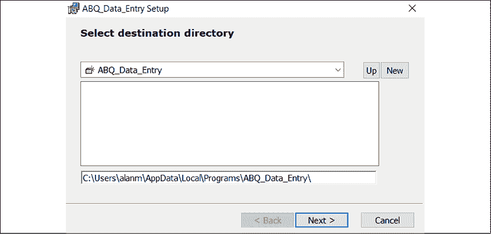
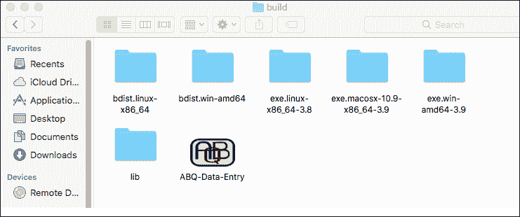

# 使用 setuptools 和 cxFreeze 打包

你的应用程序在 ABQ 公司内部广为人知，你被要求在其他设施中使用它。不幸的是，运行和安装应用程序的过程并不友好；你一直通过繁琐且容易出错的复制粘贴过程来安装它，并且用户从你在每台机器上手动创建的批处理或脚本中启动它。你需要以专业的方式打包你的应用程序，使其在 Windows、macOS 和 Linux 上安装和运行变得容易。

在本章中，你将学习以下主题：

+   在 *使用 setuptools 创建可分发软件包* 中，你将学习如何使用 `setuptools` 库创建可分发的 Python 源代码和 `wheel` 软件包。

+   在 *使用 cx_Freeze 创建可执行文件* 中，你将学习如何创建应用程序的独立可执行文件，包括针对 Windows 和 macOS 的具体说明。

# 使用 setuptools 创建可分发软件包

分发过程经常被引用为 Python 的一个主要缺点；这是一个有着不断发展的工具和方法的悠久历史领域，常常处于过去的遗迹和未来竞争愿景之间。

话虽如此，它的工作效果出奇地好，正如我们在整本书中通过 `pip` 安装组件的便利性所证明的那样。本节的目标是消除一些混淆，并为你提供一个既尊重传统方法又符合未来趋势的流程。

标准库包含 `distutils` 库，这是一个与打包和分发 Python 代码相关的功能集合。然而，`distutils` 文档（[`docs.python.org/3/library/distutils.html`](https://docs.python.org/3/library/distutils.html)）和官方打包指南都建议不要使用它，而是建议你使用 `setuptools`。

`setuptools` 库是 `distutils` 库的扩展，它增加了一些重要的功能，例如依赖关系处理、打包非 Python 文件以及生成可执行文件。尽管 `setuptools` 不是标准库的一部分，但它包含在 Windows 和 macOS 的官方 Python 发行版中，并且可以从大多数 Linux 发行版的软件仓库中轻松获取。`setuptools` 被用于 `pip` 软件包安装器，我们可以使用它来创建可以在任何安装了 Python 和 `pip` 的系统上安装的软件包。

如果你想创建可以上传到 PyPI 的软件包，你需要 `setuptools`。有关准备和上传软件包到 PyPI 的更多信息，请参阅官方 Python 打包指南，网址为 [`packaging.python.org`](https://packaging.python.org)。

## 准备我们的软件包以供分发

尽管我们在 *第六章* 中对项目目录进行的重构，即 *为应用程序的扩展做准备*，使我们能够很好地打包我们的应用程序，但我们需要对 Python 包进行一些小的添加和更改，以便它作为一个分布式包成为良好的公民。让我们来看看这些是什么。

### 创建一个 requirements.txt 文件

`requirements.txt` 文件是一个纯文本文件，通常放置在应用程序根目录中，列出了我们用于开发应用程序的所有第三方模块。尽管此文件不被 `setuptools` 使用，但它可以被 `pip` 用于安装包的依赖项。

创建一个包含以下内容的 `requirements.txt` 文件：

```py
# requirements.txt
--index-url https://pypi.python.org/simple/
# Runtime:
Requests
Paramiko
psycopg2
matplotlib
# for testing REST:
flask 
```

文件的第一行指定了我们要从哪个索引安装包；严格来说，这一行不是必需的，因为默认情况下会使用 PyPI。然而，如果我们想使用不同的包索引，我们可以覆盖这个 URL；例如，如果 ABQ 决定出于安全原因创建自己的私有 Python 包索引，我们可以将 `pip` 重定向到那个服务器。

接下来，我们已指定了运行时需求。我们的应用程序依赖于四个外部库：`requests`、`paramiko`、`psycopg2` 和 `matplotlib`，这些库简单地按行指定。请注意，我们也可以通过在行首添加 `#` 符号来向文件添加注释。

最后，我们已经将 `flask` 作为依赖项包含在内，尽管它没有被应用程序使用，但它是我们用于 REST 的测试服务所要求的。包含这类需求可能看起来有些奇怪，但 `requirements.txt` 文件的目的就是让其他开发者（包括你未来的自己）能够轻松地重现这个应用程序的开发环境。你可能选择将这类非运行时需求放在一个单独的文件中，例如，`requirements.development.txt` 或 `requirements.testing.txt`。

然后，可以使用以下命令使用此文件指导 `pip` 安装这些依赖项：

```py
$ pip install -r requirements.txt 
```

这个命令会导致 `pip` 逐行读取文件以安装依赖项。对于每个依赖项，`pip` 会首先检查该包是否已经安装；如果没有，它将从指定的包索引安装该包的最新版本。

这虽然带来了一点小问题；如果我们的代码依赖于用户系统上安装的包的新版本，会发生什么？或者，如果库的新版本中的不兼容更改要求我们运行比索引中最新版本更旧的版本，会发生什么？

为了解决这个问题，我们可以在 `requirements.txt` 中包含版本指定符字符串，如下所示：

```py
# These are examples, don't include this in our requirements.txt
requests==2.26.0
paramiko>=2.6
psycopg2<3.0
matplotlib>3.2,<=3.3 
```

版本指定符由一个比较运算符后跟一个版本字符串组成。这将指导 `pip` 确保安装的版本与要求匹配；在这种情况下，它将指定以下内容：

+   `requests` 必须是 *正好* 版本 2.26.0

+   `paramiko` 至少需要 2.6 或更高版本

+   `psycopg2` 必须小于 3.0

+   `matplotlib` 必须大于 3.2（不包括 3.2！），但 3.3 或更低版本

你是否包含版本指定符，以及你使它们有多具体，这在一定程度上取决于你的项目和用户的需求。一般来说，你不应该限制 `pip` 安装库的新版本，以免错过错误修复和安全补丁，但在存在已知新版本错误的情况下，这可能至关重要。

`pip freeze` 命令将打印出所有已安装的包及其确切版本列表。在关键任务环境中工作的开发者，他们希望确保能够重现其确切的开发环境，通常会直接将此输出复制到 `requirements.txt` 文件中。

### 创建 pyproject.toml 文件

虽然 `setuptools` 仍然是打包 Python 项目的既定标准，但 Python 社区正在向工具无关的配置转变，以适应新的选项。作为这一转变的一部分，官方打包指南建议在项目的根目录中创建一个 `pyproject.toml` 文件。目前，此文件仅用于指定项目的构建系统和构建系统要求，但有迹象表明，未来更多的项目设置将迁移到该文件。

对于我们的项目，文件应包含以下内容：

```py
[build-system]
requires = [
    "setuptools",
    "wheel"
]
build-backend = "setuptools.build_meta" 
```

此文件表示我们的项目需要 `setuptools` 和 `wheel` 包，并且我们正在使用 `setuptools.build_meta` 实际构建我们的项目。如果你希望使用 `setuptools` 构建项目，这些是推荐的配置。

注意，这里列出的要求是 *构建要求*，这意味着它们是构建工具所需的包，用于创建可分发包。这与我们在 `requirements.txt` 中列出的要求不同，后者是需要使用包的包。

**TOML**（**Tom's Obvious, Minimal Language**）是一种相对较新的配置文件格式，于 2013 年推出。它通过引入层次结构和嵌套列表等新特性扩展了传统的 INI 风格格式。它在 Rust、JavaScript 以及当然还有 Python 等语言中作为构建工具的配置格式越来越受欢迎。更多关于 TOML 的信息请访问 [`toml.io`](https://toml.io)。

### 添加许可文件

当你分发代码时，确保接收者知道他们可以如何使用该代码非常重要。与 C 或 Java 等编译型语言不同，当你使用 `setuptools` 分发项目时，Python 源代码必然会被包含在内。为了确保接收者适当地使用代码，我们需要在我们的代码中包含一个许可文件。

在决定许可时，你需要考虑一些问题。

首先，如果你在工作中开发软件（例如我们的 ABQ 数据录入程序），你的雇主通常拥有代码的所有权，你需要确保你指定了他们为代码所偏好的许可证。就这个问题咨询你的雇主以了解他们的政策。

其次，如果你使用了第三方库，你需要确保你的许可证与这些库的许可证兼容。例如，如果你正在使用许可为**GNU 公共许可证**（**GPL**）的软件库，你可能需要将你的软件以 GPL 或类似、兼容的许可证发布。Python 和 Tkinter 是以相当宽松的许可证分发的；以下是我们的四个依赖项的许可证：

| 包 | 许可证 | 参考 |
| --- | --- | --- |
| `requests` | Apache2 | [`2.python-requests.org/projects/3/user/intro/`](https://2.python-requests.org/projects/3/user/intro/) |
| `paramiko` | LGPL 2.1 | [`github.com/paramiko/paramiko`](https://github.com/paramiko/paramiko) (`LICENSE` 文件) |
| `psycopg2` | LGPL 2.1 | [`www.psycopg.org/license`](https://www.psycopg.org/license) |
| `matplotlib` | Matplotlib 许可证（基于 BSD） | [`matplotlib.org/stable/users/license.html`](https://matplotlib.org/stable/users/license.html) |

在分发你的包之前，务必查阅这些许可证，以确保你遵守使用这些库的软件的要求。如果上述任何情况都不适用，你应该简单地考虑哪种许可证最适合项目，并描述你分发它的意图。

无论你选择哪种，都应该包含在你的项目根目录中，文件名为`LICENSE`。

### 使我们的包可执行

到目前为止，我们通过运行放置在项目根目录*外部*包中的`abq_data_entry.py`文件来执行我们的应用程序。理想情况下，我们希望所有我们的 Python 代码——甚至这个微不足道的启动脚本——都位于包内部。我们只需将`abq_data_entry.py`复制到包目录中，对吧？这似乎很简单，但当我们现在执行脚本时，我们得到了一个错误：

```py
$ python abq_data_entry/abq_data_entry.py
Traceback (most recent call last):
  File ".../abq_data_entry/abq_data_entry.py", line 1, in <module>
    from abq_data_entry.application import Application
  File ".../abq_data_entry/abq_data_entry.py", line 1, in <module>
    from abq_data_entry.application import Application
ModuleNotFoundError: No module named 'abq_data_entry.application';
  'abq_data_entry' is not a package 
```

不幸的是，我们在包中使用的相对导入在包内部执行代码时将无法正确工作。然而，Python 在这里提供了一个解决方案：我们可以使我们的*包*可执行，而不是依赖于特定的 Python *脚本*来执行。

为了做到这一点，我们需要在我们的包内部创建一个`__main__.py`文件。这个 Python 包内的特殊文件使包可执行；当模块被执行时，Python 将运行`__main__.py`脚本。然而，它将以一种稍微特殊的方式运行，这将允许我们的相对导入正常工作。

创建一个名为`abq_data_entry/__main__.py`的新文件，并添加以下内容：

```py
# abq_data_entry/__main__.py
from abq_data_entry.application import Application
def main():
  app = Application()
  app.mainloop()
if __name__ == '__main__':
    main() 
```

`__main__.py`的内容几乎与`abq_data_entry.py`相同；唯一的区别是我们将`Application`的创建和`mainloop()`的执行放在了一个名为`main()`的函数中。原因将在我们开始构建包时简要解释。

一旦我们创建了`__main__.py`，我们可以像这样执行模块：

```py
$ python -m abq_data_entry 
```

`-m`标志告诉 Python 加载并执行提供的模块。注意，目前，这个命令必须在项目根目录内执行。一旦我们创建并安装了我们的 Python 包，我们就可以从任何地方运行它。

## 配置`setup.py`脚本

现在我们代码准备好了，我们可以开始创建我们的`setuptools`配置。要使用`setuptools`打包我们的项目，我们需要创建一个**配置脚本**；按照惯例，这个文件叫做`setup.py`，并且创建在应用程序的根目录中。

`setuptools`配置也可以创建为一个 INI 风格的配置文件，`setup.cfg`。最终，这可能会取代`setup.py`，但在这本书中，我们将坚持使用 Python 脚本方法，因为它允许我们执行一些必要的 Python 代码。

`setup.py`文件的基本结构如下所示：

```py
# setup.py
from setuptools import setup
setup(
  # Configuration arguments here
) 
```

我们的大多数配置都将作为参数传递给`setup()`函数，定义我们包的基本元数据，包括要打包的内容以及安装后提供的一些功能。

### 基本元数据参数

首先，让我们使用`setup.py`中的这些参数定义一些关于我们应用程序的基本元数据：

```py
setup(
  name='ABQ_Data_Entry',
  version='1.0',
  author='Alan D Moore',
  author_email='alandmoore@example.com',
  description='Data entry application for ABQ AgriLabs',
  url="http://abq.example.com",
  license="ABQ corporate license",
  #...
) 
```

这样的元数据将被用于命名包以及为 PyPI 提供信息。如果你只是用于个人或内部打包，并非所有字段都是必要的，但如果你计划上传到 PyPI，你应该包括所有这些字段以及`long_description`，它应该是一个 reStructuredText 字符串，提供有关程序的扩展信息。

通常，可以直接使用`README.rst`文件。因为这个配置脚本只是一个 Python 脚本，我们可以使用正常的 Python 来读取文件，并使用其内容进行此配置选项，如下所示：

```py
# setup.py, near the top
with open('README.rst', 'r') as fh:
  long_description = fh.read()
# inside the setup() call:
setup(
  #...
  long_description=long_description,
) 
```

### 包和依赖项

一旦我们指定了元数据，我们需要告诉`setuptools`我们实际上正在捆绑哪些包，使用`packages`参数。在我们的例子中，我们只有`abq_data_entry`包，所以我们将如下指定它：

```py
setup(
  #...
  packages=[
    'abq_data_entry',
    'abq_data_entry.images',
    'abq_data_entry.test'
  ], 
```

注意，我们已经指定了主包以及子模块`images`和`test`。我们需要明确指定我们想要包含的所有子模块，因为`setuptools`不会自动包含它们。

对于非常复杂的包，这可能会变得繁琐，所以`setuptools`还包括`find_packages()`函数，可以像这样使用：

```py
from setuptools import setup, find_packages
setup(
  #...
  packages=**find_packages(),** 
```

这将自动定位并包含我们项目目录中的所有包。

除了我们项目中定义的模块外，我们的应用程序还依赖于第三方模块，如`psycopg2`、`requests`、`paramiko`和`matplotlib`。我们可以在`setup()`中指定这些依赖项，并且假设它们可以从 PyPI 获取，当我们的包被安装时，`pip`将自动安装它们。

这是通过`install_requires`参数实现的，如下所示：

```py
setup(
  #...
  install_requires=[
    'psycopg2', 'requests', 'paramiko', 'matplotlib'
  ], 
```

注意，这些所需的软件包可能也有它们自己的依赖项；例如，`matplotlib`需要包括`numpy`和`pillow`在内的几个其他库。我们不必指定所有这些子依赖项；它们也将由`pip`自动安装。

如果该包需要这些模块的特定版本，我们也可以指定：

```py
# Just an example, do not add to your setup.py!  
  install_requires=[
    'psycopg2==2.9.1', 'requests>=2.26',
    'paramiko', 'matplotlib<3.3.5'
  ] 
```

这看起来相当熟悉，不是吗？这些是我们可以在`requirements.txt`中放入的相同类型的规则，以及相同的运行时依赖项列表。一些开发者采取的方法是只读取`requirements.txt`并将其内容发送到`install_requires`列表；甚至有工具可以帮助翻译它们之间的一些不兼容语法。但是，请记住，我们的`requirements.txt`文件的目的是为了重新创建我们的特定开发环境。因此，它包含非运行时包，并且可能包含非常具体的版本指定符以测试一致性。相比之下，`install_requires`列表仅用于运行时要求，并且通常应该对版本和包来源更加抽象。例如，虽然指定`psycopg2`版本`2.9.1`对于开发环境可能是有帮助的，除非我们确定它只与该版本正确工作，否则我们在这里会指定更通用的版本，例如`psycopg2<3.0`。

就像我们可以指定包的版本要求一样，我们也可以使用`python_requires`参数指定我们的应用程序所需的 Python 版本，如下所示：

```py
setup(
  #...
  python_requires='>= 3.6', 
```

如果您正在使用在早期版本中找不到的 Python 特性（例如，我们应用程序中使用的 f-strings 在 Python 3.6 之前无法工作），或者您想确保只使用特定的、经过测试的 Python 版本，那么这始终是一个好主意。如果用户没有运行匹配的 Python 版本，`pip install`将因错误而终止。

在`setuptools`中使用的版本指定符的语法在 PEP 440 中有详细说明，您可以在[`www.python.org/dev/peps/pep-0440/`](https://www.python.org/dev/peps/pep-0440/)找到。

### 添加额外文件

默认情况下，`setuptools`只会将 Python 文件复制到您的包中。然而，我们的包包含的不仅仅是这些：我们还有 RST 格式的文档、SQL 脚本，最重要的是我们的 PNG 图像，没有这些图像，我们的程序将无法正确运行。

位于我们包结构内部的非 Python 文件可以使用`package_data`参数进行指定：

```py
setup(
  #...
  package_data={'abq_data_entry.images': ['*.png', '*.xbm']},
) 
```

`package_data` 参数接受一个字典，将模块路径与要包含在该模块中的文件列表（或匹配文件列表的 globbing 表达式）相匹配。在这里，我们告诉 `setuptools` 包含 `images` 模块中的所有 PNG 和 XBM 文件。

我们的项目还包含 `abq_data_entry` 模块之外必要的文件；这些文件对于程序运行不是必需的，但应该与软件包一起分发。我们无法在 `setup()` 中指定这些文件，因为它只处理软件包内的文件。

要添加这些，我们需要在项目根目录中创建一个名为 `MANIFEST.in` 的单独文件。对于我们的应用程序，该文件应包含以下内容：

```py
# MANIFEST.in
include README.rst
include requirements.txt
include docs/*
include sql/*.sql 
```

`MANIFEST.in` 文件包含一系列的 `include` 指令，其中包含文件名或匹配我们想要包含的文件的 globbing 表达式。在这里，我们包括 `docs` 目录中的所有文件，`sql` 目录中的所有 `.sql` 文件，`requirements.txt` 文件和 `README.rst` 文件。由于 `setup.py` 依赖于 `README.rst` 和 `requirements.txt` 文件来设置数据，因此我们务必将它们包含在软件包中。否则，我们的软件包在其他系统上可能无法构建。

### 定义命令

之前，我们在包中创建了一个 `__main__.py` 文件，允许我们通过命令 `python -m abq_data_entry` 运行我们的包。这当然比寻找要执行的正确 Python 脚本要干净得多，但理想情况下，我们希望我们的软件包设置一个简单的命令，用户可以执行以启动程序。

`setuptools` 库提供了一个使用 `entry_points` 参数在我们的软件包中添加可执行命令的方法。**入口点**是外部环境访问我们代码的方式。一个特定的入口点，`console_scripts`，定义了一个将映射到外部命令的模块函数列表。当软件包安装时，`setuptools` 将为每个 `console_scripts` 项创建一个简单、平台适当的可执行文件，当执行时，将运行指定的函数。

然而，我们不能将 `console_scripts` 指向一个 Python 文件或包；它必须指向包内的一个 *函数*。这就是为什么我们之前在 `__main__.py` 文件中创建 `main()` 函数的原因，这样我们就可以指定 `__main__.main()` 作为控制台脚本入口点，如下所示：

```py
setup(
  #...
  entry_points={
    'console_scripts': [
    'abq = abq_data_entry.__main__:main'
  ]}
) 
```

`console_scripts` 列表中的每个项都是一个格式为 `{executable_name} = {module}.{submodule}:{function_name}` 的字符串。我们的代码将导致 `setuptools` 创建一个名为 `abq` 的可执行文件，该文件将运行我们在 `__main__.py` 中定义的 `main()` 函数。因此，安装后，我们只需在命令行中键入 `abq` 即可执行应用程序。如果包中有可以独立运行的函数，您还可以在这里定义其他脚本。

### 测试配置

在我们创建可分发包之前，我们可以通过在项目根目录中运行以下命令来检查其语法和内容：

```py
$ python setup.py check 
```

如果一切顺利，这将简单地返回字符串`running check`，没有其他输出。如果缺少某些内容，你会得到一个错误消息。例如，如果你注释掉`setup()`中的`name`和`version`参数并运行检查，你会得到以下输出：

```py
running check
warning: check: missing required meta-data: name, version 
```

虽然它不会找到你`setup.py`中所有潜在的问题，但`check`命令至少会确保你指定了所有必要的元数据，这对于你希望将包上传到 PyPI 来说尤为重要。

## 创建和使用源分布

在配置文件全部设置完毕后，我们现在可以创建一个**源分布**。这种分布将所有构建我们包所需的相关文件打包成一个`.tar.gz`存档。

要创建源分布，请在项目根目录中运行带有`sdist`选项的`setup.py`：

```py
$ python setup.py sdist 
```

完成此操作后，在项目根目录下将出现两个新的目录：

+   `ABQ_Data_Entry.egg-info`：这个目录包含由`setuptools`生成的元数据文件。如果你探索这个目录，你会发现我们传递给`setup()`的所有信息都以某种形式存储在这里。

+   `dist`：这个目录包含为分发而生成的文件；在这种情况下，只有一个包含我们的源包的单个`.tar.gz`文件。

要在另一台计算机上安装源分布，首先需要将其提取出来。这可以使用 GUI 工具或使用以下示例中的`tar`命令在终端中完成：

```py
$ tar -xzf ABQ_Data_Entry-1.0.tar.gz 
```

提取后，我们可以在提取的目录中通过运行带有`install`选项的`setup.py`来安装包，如下所示：

```py
$ cd ABQ_Data_Entry/
$ python3 setup.py install 
```

### 测试我们的源分布

如果你没有第二台计算机来测试你的源安装器，你可以使用 Python **虚拟环境**。虚拟环境是一个干净、隔离的 Python 安装，可以根据需要激活，以防止安装的包污染系统的主要 Python 环境。

要创建一个，首先确保你已经使用`pip`安装了`virtualenv`包：

```py
$ pip install --user virtualenv 
```

接下来，在你的系统上的任何位置创建一个目录，并使用以下命令在其中生成一个 Python 3 环境：

```py
$ mkdir testenv
$ python -m virtualenv -p python3 testenv 
```

这将在`testenv`目录中创建一个虚拟环境，本质上是一个 Python 解释器和标准库的副本，以及一些支持脚本和文件。这个环境可以按你的意愿进行修改，而不会影响你的系统 Python 环境。

要使用新的虚拟环境，你需要通过在终端中执行以下代码来**激活**它：

```py
# On Linux, macOS, and other unix-like systems:
$ source testenv/bin/activate
# On Windows
> testenv\Scripts\activate 
```

激活虚拟环境意味着 `python` 的调用将使用虚拟环境中的二进制和库，而不是你的系统安装。这包括与 Python 相关的命令，如 `pip`，这意味着 `pip install` 将将包安装到环境的库中，而不是你的系统或用户 Python 库中。

在你的测试环境激活后，你现在可以在你的源分发上运行 `setup.py install`。你会注意到 Python 将安装 `psycopg2`、`requests`、`paramiko` 和 `matplotlib`，以及它们的各个依赖项，即使你已经在你的系统上安装了这些包。这是因为虚拟环境从没有第三方包的干净状态开始，所以在新环境中必须重新安装一切。

如果安装成功，你应该找到以下内容：

+   你在你的虚拟环境中有一个名为 `abq` 的命令，它启动 ABQ 数据输入应用程序。

+   你可以从系统的任何目录（而不仅仅是项目根目录）打开 Python 提示符并导入 `abq_data_entry`。

+   `abq_data_entry` 包目录位于 `testenv/lib/python3.9/sitepackages`。

当你完成虚拟环境后，你可以在终端中输入 `deactivate` 以返回到你的系统 Python。如果你想删除环境，只需删除 `testenv` 目录。

## 构建 wheel 分发

虽然源分发可能适合像我们的应用程序这样的简单软件，但具有复杂构建步骤（如代码编译）的包可能从 **构建分发** 中受益。正如其名所示，构建分发是指任何构建操作（编译或代码生成等）已经完成的分发。`setuptools` 用于构建分发的当前格式是 **wheel 格式**。

wheel 格式取代了旧的 `distutils` 分发格式，称为 `egg`。当使用 `setuptools` 或其他 `distutils` 衍生工具时，你仍然会看到对 `egg` 的引用。

一个 `wheel`（`.whl`）文件基本上是一个包含预构建代码的 ZIP 格式存档文件。它有以下三种类型：

+   **通用**：这种类型的 `wheel` 文件只包含在任何平台和任何主要版本的 Python（2 和 3）上运行的 Python 代码。

+   **纯 Python**：这种类型的 `wheel` 文件只包含在任何平台上运行的 Python 代码，但只与一个版本的 Python 兼容。

+   **平台**：这个 `wheel` 文件限制在特定的操作系统、平台或架构上，通常是因为它包含编译的二进制代码。

由 `setuptools` 创建的默认 `wheel` 文件是一个纯 Python wheel，这正是我们的应用程序应该使用的（因为我们没有编译代码，但只与 Python 3 兼容）。创建一个很简单，只需使用 `bdist_wheel` 选项调用 `setup.py`，如下所示：

```py
$ python3 setup.py bdist_wheel 
```

与`sdist`命令类似，这个命令在`dist`目录下创建一个新的文件，但这次是一个`.whl`文件。文件名将是`ABQ_Data_Entry-1.0-py3-none-any.whl`，其各个部分代表以下信息：

+   包名，在本例中为`ABQ_Data_Entry`。

+   版本，在本例中为`1.0`。

+   不论是 Python 3、Python 2 还是通用版；在本例中，为 Python 3 的`py3`。

+   **应用二进制接口**（**ABI**）标签，它将指示特定的 Python 实现（例如，CPython 与 IronPython）。在本例中，它是`none`，因为我们没有特定的 ABI 要求。

+   支持的平台，在本例中为`any`，因为我们的应用程序不是平台特定的。请注意，这个组件可以包括 CPU 架构以及操作系统。

注意到`bdist_wheel`过程还会创建一个`build`目录，这是在代码被压缩进`wheel`文件之前，代码被暂存的地方。您可以检查这个目录，以确保您的包正在正确组装。

一旦构建完成，您可以使用`pip`安装`wheel`文件，如下所示：

```py
$ pip install ABQ_Data_Entry-1.0-py3-none-any.whl 
```

与源代码安装一样，`pip`将首先安装在设置配置中指定的任何依赖项，然后安装包到环境的`site-packages`目录。可执行文件`abq`也将被创建并复制到适合您平台的可执行位置。

如果在尝试使用`bdist_wheel`时遇到错误，您可能需要安装`wheel`模块，因为这个模块并不总是包含在`setuptools`中。可以使用命令`pip install --user wheel`安装此模块。然而，请记住，我们在`pyproject.toml`中指定了`wheel`作为构建依赖项，因此这一步应该由`setuptools`处理。

# 使用 cx_Freeze 创建可执行文件

虽然源代码和轮子发行版很有用，但它们都需要在程序运行之前在系统上安装 Python 和任何第三方库依赖项。通常，如果我们能提供一个或一组文件，可以直接复制并在系统上运行而不需要先安装其他任何东西，那就方便多了。更好的是，我们希望有适合平台的安装包，这些包可以设置桌面快捷方式并执行其他常见的系统配置。

有几种方法可以用 Python 代码来实现这一点，也有几个项目可供选择；在这本书中，我们将探讨一个名为`cx_Freeze`的项目。

`cx_Freeze`的基本思想是将 Python 项目的所有代码和共享库文件以及 Python 解释器捆绑在一起，然后生成一个小的可执行文件，该文件将使用捆绑的解释器启动代码。这种方法通常被称为**冻结**代码（因此得名），并且大多数时候效果相当不错。然而，正如我们将看到的，有一些限制和困难需要克服。一个显著的限制是`cx_Freeze`只能为其运行的平台生成可执行文件；换句话说，如果你想生成 Windows 的可执行文件，你需要在 Windows 上构建它；如果你想生成 Linux 的可执行文件，你必须在 Linux 上构建它，依此类推。

`cx_Freeze`的完整文档可以在[`cx-freeze.readthedocs.io`](https://cx-freeze.readthedocs.io)找到。

## 使用`cx_Freeze`的第一步

使用以下命令使用`pip`安装`cx_Freeze`：

```py
$ pip install --user cx-Freeze 
```

Linux 用户可能还需要安装`patchelf`实用程序，通常可在您发行版的包管理器中找到。

与`setuptools`一样，`cx_Freeze`是`distutils`的扩展；它与`setuptools`有很多相似之处，但正如您将看到的，它采取了不同的方法来解决某些问题。就像`setuptools`一样，我们将从一个项目目录中的脚本开始，该脚本调用`setup()`函数。为了将此脚本与我们的`setuptools`脚本区分开来，我们将将其命名为`cxsetup.py`。打开此文件并输入以下内容：

```py
# cxsetup.py
import cx_Freeze as cx
cx.setup(
  name='ABQ_Data_Entry',
  version='1.0',
  author='Alan D Moore',
  author_email='alandmoore@example.com',
  description='Data entry application for ABQ Agrilabs',
  url="http://abq.example.com",
  packages=['abq_data_entry'],
) 
```

到目前为止，这与`setuptools`脚本相同，除了我们使用`cx_Freeze.setup()`函数而不是`setuptools`的函数。然而，从现在开始，事情将会有很大的不同。

`setuptools`使用`entry_points`参数，而`cx_Freeze`使用`executables`参数。此参数接受一个`cx_Freeze.Excecutable`对象的列表，每个对象都描述了我们想要生成的可执行文件的各种属性。为 ABQ 数据输入添加以下代码：

```py
cx.setup(
  #...
 **executables=[**
 **cx.Executable(**
**'abq_data_entry/__main__.py'****,**
 **target_name=****'abq'****,**
 **icon=****'abq.ico'**
 **)**
 **],**
) 
```

至少，我们需要提供一个 Python 脚本，当可执行文件运行时应该执行；我们正在使用我们的`abq_data_entry/__main__.py`脚本为此目的。

默认情况下，生成的可执行文件将是脚本名称，不带`.py`扩展名。在这种情况下，将是`__main__`，这不是我们应用程序的一个非常描述性的名称。幸运的是，我们可以使用`target_name`参数来覆盖此默认设置，就像我们在这里所做的那样。通过在这里指定`abq`，`cx_Freeze`将构建一个名为`abq`的可执行文件。

我们还可以使用`icon`参数指定应用程序要使用的图标。这需要是一个`.ico`文件的路径，因此在使用之前，您需要将 PNG 或其他格式转换为`.ico`。文件的路径相对于包含`cxsetup.py`文件的项目目录，并且不需要在包内部。

## 构建可执行文件选项

可以使用`options`参数将特定`cx_Freeze`操作的参数传递给`setup()`。此参数接受一个字典，其中每个项都是一个与操作特定参数的`dict`对象配对的`cx_Freeze`操作名称。我们将首先查看的操作是`build_exe`，这是所有其他操作的一个通用第一步。正如其名所示，这是可执行文件及其伴随文件被构建的阶段。

在其他方面，这是我们指定包依赖项的地方：

```py
cx.setup(
  #...
 **options={**
**'build_exe'****: {**
**'packages'****: [**
**'psycopg2'****,** **'requests'****,**
**'matplotlib'****,** **'numpy'****,**
**'paramiko'**
 **],**
**'includes'****: [],** 
```

`packages`参数是需要安装的包列表。它与`setuptools`的`install_requires`参数类似，但有一个重要的区别，即它不支持版本指定符。此外，请注意，我们已经包含了一些超出我们三个主要依赖项的内容。不幸的是，由于`cx_Freeze`并不总是能够很好地识别所有依赖项，因此通常需要明确列出子依赖项。

当`packages`是一个需要包含的包列表时，我们也可以使用`includes`参数指定要包含的特定*模块*。从理论上讲，我们在这里不应该需要指定任何内容，但在实践中，`cx_Freeze`有时无法捆绑我们的程序需要的模块。

使用`includes`指令，我们可以明确请求模块以确保它们被包含。

为了确定列表中应该包含什么，遵循基本的试错程序：

1.  构建可执行文件。

1.  运行可执行文件。

1.  如果你收到一个`ModuleNotFoundError`异常，表明无法找到模块，请将模块添加到`includes`列表，并再次运行构建命令。

1.  如果你发现同一个包中的多个模块缺失，将包添加到`packages`列表并重新构建可能更有效。

例如，假设你构建了 ABQ 数据输入，并在运行`abq`时得到以下错误：

```py
ModuleNotFoundError: No module named 'zlib' 
```

在这种情况下，`zlib`是我们所需的某个包的一个依赖项，由于某种原因`cx_Freeze`没有将其识别为必要的。为了解决这个问题，我们只需通过更新配置强制其包含。

```py
cx.setup(
  #...
  options={
    'build_exe': {
      #...
      'includes': **[****'zlib'****]**, 
```

之后，重新构建的可执行文件应包含缺失的模块。通常，对于广泛使用的模块，你不需要这样做，但根据你的平台和所需的包，这些问题确实会出现。

## 包含外部文件

与`setuptools`一样，`cx_Freeze`默认只包含 Python 文件。为了包含其他文件，如图像和文档，我们可以使用`build_exe`的`include_files`参数。然而，存在一个问题：由于`cx_Freeze`以压缩归档的方式捆绑我们的 Python 模块，因此访问模块内部的文件路径需要一些额外的代码。

我们的`images`模块就存在这样的问题：它包含 PNG 文件，我们的应用程序通过从其`__init__.py`文件计算相对路径来访问这些文件。

为了解决这个问题，在构建过程中需要将 PNG 文件重新定位到包外的目录。然后，我们的代码将在冻结时在新位置找到它们，在未冻结时在原始位置找到它们。

为了使其工作，按照以下方式修改 `images/__init__.py`：

```py
# abq_data_entry/images/__init__.py
from pathlib import Path
import sys
if getattr(sys, 'frozen', False):
  IMAGE_DIRECTORY = Path(sys.executable).parent / 'images'
else:
  IMAGE_DIRECTORY = Path(__file__).parent / 'images' 
```

当运行使用 `cx_Freeze` 冻结的 Python 脚本时，`sys` 模块有一个名为 `frozen` 的属性。我们可以测试该属性的存在来指定当应用程序冻结时改变的行为。在这种情况下，当我们的应用程序冻结时，我们将寻找位于可执行文件相同目录下的 `images` 目录中的图像。可执行文件的位置可以通过 `sys.executable` 变量找到。如果应用程序未冻结，我们将像以前一样在模块目录中寻找图像。

现在脚本知道在哪里查找图像，我们需要配置我们的 `cx_Freeze` 设置，将图像复制到我们设定的位置。为此，我们需要更新我们的 `build_exe` 选项，如下所示：

```py
# cxsetup.py
cx.setup(
  #...
  options={
    'build_exe': {
      #...
      **'include_files'****: [(****'abq_data_entry/images'****,** **'images'****)]** 
```

`include_files` 参数是一个包含两个元组的列表。第一个元组成员是相对于 `cxsetup.py` 脚本的源路径，而第二个是相对于可执行文件的目标路径。在这种情况下，我们告诉它将 `abq_data_entry/images` 目录中的文件复制到生成的可执行目录下的 `images` 目录中。

## 构建可执行文件

到目前为止，我们可以通过运行以下命令来构建一个可执行文件：

```py
$ python cxsetup.py build 
```

`build` 命令运行所有步骤直到 `build_exe`，留下你在 `./build` 下的平台特定目录中的构建代码，格式为 `exe.(os)-(cpu_arch)-(python_version)`。例如，如果你在 64 位 Linux 上使用 Python 3.9 运行此命令，你将有一个包含编译代码的 `build/exe.linux-x86_64-3.9` 目录。你可以检查此目录以确保文件被正确复制和创建，以及测试生成的可执行二进制文件。在我们的应用程序中，`cx_Freeze` 应该创建一个名为 `abq` 的二进制可执行文件，运行时将启动你的应用程序。它还应创建 `lib` 和 `images` 目录，并复制 `abq.ico` 文件。

注意，平台特定构建目录中的所有文件都必须存在，程序才能运行；`cx_Freeze` 不支持创建单文件独立可执行文件。

对于 Linux 和 BSD，此构建目录可以打包并直接分发；其他计算机上的用户应该能够只需提取目录并执行文件。然而，对于 Windows 和 macOS，我们需要做一些额外的工作来使其准备好分发。实际上，你可能甚至遇到了在运行构建命令或执行二进制文件时出现的错误。我们将在下一节中讨论需要发生的特定于平台的小调整和配置。

`cx_Freeze` 支持创建 RPM 文件，这是 Fedora 或 SUSE 等某些 Linux 发行版使用的包格式。如果你在一个基于 RPM 的发行版上，你可能想调查这个选项。不幸的是，没有构建操作来为 Debian、Ubuntu 或 Arch 等非 RPM 发行版构建包。 

### 清理构建

尽管我们有一个可工作的可执行文件，但你可能已经注意到，对于像我们这样的简单项目，可分发文件夹非常大。

在结束一天的工作之前，值得在构建目录内部进行一些探索，看看 `cx_Freeze` 将哪些文件捆绑到你的应用程序中，以及你是否真的需要所有这些文件。

如果你查看 `lib/python(python_version)/` 下的平台特定构建目录，你会找到所有作为我们包依赖项拉入的库。你可能发现其中一些实际上并不是运行我们的应用程序所必需的。例如，如果你恰好在你的系统上安装了 PyQt 或 PySide 这样的替代 GUI 库，`matplotlib` 可能会将其作为依赖项拉入。

如果我们最终有像这样的额外包，我们可以使用 `build_exe` 的 `excludes` 选项来删除它们，如下所示：

```py
cx.setup(
  #...
  options={
    #...
    'build_exe': {
      #...
      'excludes': [
        'PyQt4', 'PyQt5', 'PySide', 'IPython', 'jupyter_client',
        'jupyter_core', 'ipykernel','ipython_genutils'
      ], 
```

添加此更改后，删除你的 `build` 目录并重新运行构建命令。你会发现所有这些包都不再存在，并且你的构建大小显著减小。

了解可以包含或排除的内容需要研究和一些试错，但通过仔细修剪，我们可以显著降低我们的可分发文件的大小和包的构建时间。

## 使用 cx_Freeze 构建 Windows 可执行文件

要在 Microsoft Windows 上构建可执行文件，我们需要正确设置 `Executable` 初始化器的 `base` 参数。回想一下 *第十章*，*维护跨平台兼容性*，Windows 程序以控制台或 GUI 模式启动。对于每个平台，`cx_Freeze` 有一个或多个基础可执行文件，它从中构建冻结的可执行文件；在 Linux、BSD 和 macOS 上，默认基础可执行文件是可以接受的，但在 Windows 上，默认基础会在控制台模式下启动应用程序。

我们需要指定一个基础，以便以 GUI 模式启动我们的脚本。这可以通过将 `Win32GUI` 的值传递给 `base` 参数来实现。因此，在我们的 `cxsetup.py` 脚本顶部添加以下代码：

```py
# cxsetup.py
import platform
base = None
target_name = 'abq'
if platform.system() == "Windows":
  base = "Win32GUI"
# Inside cx.setup()
  #...
  executables=[
    cx.Executable(
      'abq_data_entry.py',
      base=base,
      target_name=target_name,
      icon='abq.ico'
    )
  ], 
```

正如我们在 *第十章*，*维护跨平台兼容性* 中所学到的，我们使用了 `platform.system()` 来确定我们正在运行的操作系统；如果是 Windows，我们将基础设置为 `Win32GUI`。对于其他平台，`base` 应该只是 `None`，这将导致它使用默认的基础可执行文件。

现在应该在 Windows 上使用 `python cxsetup.py build` 成功构建应用程序，你应该能在 `build/exe.win-amd64-(python_version)` 目录中找到 `abq.exe`。

### 构建 Windows 安装程序文件

除了构建 Windows 可执行文件外，我们还可以使用`bdist_msi`操作构建 Windows 安装程序文件（`.msi`）。虽然我们的应用程序可以通过简单地压缩构建文件夹并在目标系统上提取它来分发，但使用 MSI 文件有一些优点：

+   在大规模 Windows 环境中，系统管理员可以更轻松地部署 MSI 文件。

+   当安装 MSI 文件时，它会将应用程序注册到操作系统，使得升级、修复和卸载等操作更加干净。

+   MSI 文件具有额外的设置功能，例如安装向导和桌面快捷方式生成。

要开始使用`cx_Freeze`生成 MSI 文件，我们需要通过设置`options`参数的`bdist_msi`字典中的值来配置我们的 MSI 的一些方面。

我们首先将指定一个**升级代码**：

```py
cx.setup(
  #...
  options = {
    #...
    'bdist_msi': {
      'upgrade_code': '{12345678-90AB-CDEF-1234-567890ABCDEF}', 
```

升级代码是一个**全局唯一标识符**（GUID）值，它将在操作系统上识别此程序。通过指定此代码，后续构建的此`.msi`文件将删除并替换任何现有程序的安装。

升级代码由五个部分组成，每个部分由 8、4、4、4 和 12 个字符组成，字符范围从 0 到 9 和 A 到 F。它们可以在 Microsoft Visual Studio 中创建，或者使用以下 PowerShell 命令：

```py
[System.Guid]::NewGuid().ToString().ToUpper() 
```

一旦指定，你不应该在应用程序后续构建中更改升级代码。

MSI 安装过程还可以创建应用程序快捷方式，当安装包安装时，这些快捷方式将被放置在桌面和/或程序菜单上。为此，我们需要通过创建类似于以下这些的**快捷方式表**元组来定义我们的快捷方式：

```py
# cxsetup.py, after the imports
shortcut_data = [
  (
    'DesktopShortcut', 'DesktopFolder', 'ABQ Data Entry',
    'TARGETDIR', '[TARGETDIR]' + target_name, None,
    'Data Entry application for ABQ Agrilabs', None,
    None, None, None, 'TARGETDIR'
  ),
  (
    'MenuShortcut', 'ProgramMenuFolder', 'ABQ Data Entry',
    'TARGETDIR', '[TARGETDIR]' + target_name, None,
    'Data Entry application for ABQ Agrilabs', None,
    None, None, None, 'TARGETDIR'
  )
] 
```

前两个元组分别定义了桌面和菜单的快捷方式。它们包含的数据与微软在[`msdn.microsoft.com/en-us/library/windows/desktop/aa371847.aspx`](https://docs.microsoft.com/en-us/windows/win32/msi/shortcut-table?redirectedfrom=MSDN)中描述的快捷方式表布局相匹配。

按顺序，这些字段由微软定义为以下内容：

+   **快捷方式**: 要创建的快捷方式类型；在我们的例子中是`DesktopShortcut`或`MenuShortcut`。

+   **目录**: 一个特殊的目录键，快捷键将被复制到其中。在这里，`DesktopFolder`指向桌面，而`ProgramMenuFolder`指向菜单中的程序文件夹。

+   **名称**: 快捷键的名称；在我们的例子中，`ABQ 数据录入`。

+   **组件**: 这表示一个程序，其安装或卸载状态决定了我们的快捷方式是否应该安装或卸载。通过指定`TARGETDIR`，我们的快捷方式的安装/卸载状态与程序目录的安装/卸载状态相匹配。

+   **目标**: 由快捷方式启动的可执行文件。这将是我们位于`TARGETDIR`内的`target_name`属性。

+   **参数**：传递给命令的参数字符串。在这里指定的任何内容都将简单地附加到快捷方式的目标可执行文件中，并在我们的程序中通过 `sys.argv` 可用。例如，您可以使用此功能创建一个启动测试模式的第二个快捷方式。在我们的情况下，ABQ 程序不期望任何命令行参数，因此这是 `None`。

+   **描述**：用于快捷方式描述字段中的字符串。

+   **图标** 和 **IconIndex**：这些用于定位快捷方式的图标，如果我们希望它与可执行文件的图标不同。这些可以保留为 `None`，因为我们的可执行文件的图标将默认使用。

+   **ShowCmd**：指定程序将以最小化、最大化还是正常方式启动。将其保留为 `None` 将以正常方式启动。

+   **WkDir**：指示要使用的当前工作目录。我们希望这是程序的目录，因此在这里使用 `TARGETDIR`。

一旦创建，这些快捷方式表需要包含在我们的 `bdist_msi` 选项的数据参数中，如下所示：

```py
cx.setup(
  #...
  options={
  #...
    'bdist_msi': {
      #...
      'data': {'Shortcut': shortcut_data} 
```

目前，`data` 在 `cx_Freeze` 文档中未记录；`cx_Freeze` 使用标准库的 `msilib` 模块来构建 `.msi` 文件，并将传递给此参数的任何内容传递给 `msilib` 的 `add_data()` 函数。如果您想进一步探索此选项，请参阅 [`docs.python.org/3/library/msilib.html`](https://docs.python.org/3/library/msilib.html) 中的标准库 `msilib` 文档。

指定了 `bdist_msi` 选项后，让我们按照以下方式构建 `.msi` 文件：

```py
$ python cxsetup.py bdist_msi 
```

此命令在 `dist` 目录中创建一个新的安装文件，您应该能够在任何兼容的 Windows 系统上安装它，如下面的截图所示：



图 16.1：ABQ 数据输入的 MSI 安装向导

请记住，`cx_Freeze` 使用构建环境中的 Python 二进制文件来构建应用程序；因此，64 位 Python 将构建 64 位可执行文件，而 32 位 Python 将构建 32 位可执行文件。此外，在较新版本的 Windows 上创建的构建可能不与较旧版本的 Windows 兼容。为了获得最大兼容性，请在您计划支持的最早版本 Windows 的 32 位版本上构建您的二进制文件。

## 使用 cx_Freeze 构建 macOS 可执行文件

`cx_Freeze` 实现了两个特定于 macOS 的构建操作：`bdist_mac` 和 `bdist_dmg`。这些操作分别创建 **应用程序包** 和 **压缩磁盘映像** 文件。让我们更详细地查看每个操作。

### 构建 macOS 应用程序包

`bdist_mac` 构建操作创建了一个应用程序包，一个具有 `.app` 扩展名的特殊格式目录，Mac 桌面将其视为可执行文件。`bdist_mac` 有几个配置选项，但我们只将使用两个：

```py
cx.setup(
  #...
  options={
    #...
    **'bdist_mac'****: {**
**'bundle_name'****:** **'ABQ-Data-Entry'****,**
**'iconfile'****:** **'abq.icns'**
 **}** 
```

在这里，`bundle_name`设置应用程序包目录的名称，不包括`.app`扩展名。通常，这会默认为传递给`setup()`的`name`参数，在我们的例子中是`ABQ_Data_Entry`。我们在这里覆盖它，使用破折号而不是下划线，因为它对最终用户来说看起来不那么技术化。请注意，虽然在这个值中使用空格在技术上有效，但往往会给`cx_Freeze`带来问题，最好避免。`iconfile`设置允许我们指向 macOS 将用于应用程序图标的 ICNS 文件。此图像文件的尺寸需要是 16 到 1,024 像素之间的平方数，且是 2 的幂。示例代码中包含了一个兼容的 ABQ 标志。

请参阅`cx_Freeze`文档以获取此处额外的选项，包括代码签名和明确指定用于包的额外框架。

一旦添加了配置选项，请使用以下命令运行`cxsetup.py`脚本：

```py
$ python3 cxsetup.py bdist_mac 
```

当此过程完成后，`ABQ-Data-Entry.app`应出现在构建目录中。您可以在 macOS GUI 中双击此目录从任何位置运行它，或者将其拖到`/Applications`目录中安装。

它应该看起来像以下屏幕截图所示：



图 16.2：构建目录中的 ABQ-Data-Entry 包

如果您从这个包中启动应用程序，您会看到应用程序菜单不再读取**Python**，正如我们在第十章*维护跨平台兼容性*中首次看到的；现在它读取**abq**，这是可执行文件的名称，这正是我们想要的。

与 Windows 可执行文件一样，`cx_Freeze`为 macOS 生成的包不一定向下兼容，因此最好在您需要支持的 macOS 最旧版本上创建它们。

### 构建 macOS .dmg 文件

macOS 上的应用程序通常分布在压缩磁盘映像（`.dmg`）文件中。`cx_Freeze`的`build_dmg`操作允许您构建应用程序包并将其打包成 DMG 文件，以便于分发。

要这样做，只需执行此命令而不是`bdist_mac`命令：

```py
$ python3 cxsetup.py bdist_dmg 
```

此命令首先运行`bdist_mac`来构建应用程序包，然后将其打包成 DMG 文件。`bdist_dmg`的配置选项允许您覆盖文件名并包括指向`/Applications`目录的快捷方式，以便于安装。构建的文件将出现在`build`目录中，您可以从该目录复制到另一台 Macintosh 上以进行挂载和使用。

# 摘要

在本章中，你学习了如何为分发准备和打包你的应用程序。你学习了如何使你的包可执行，以及如何使用`setuptools`创建源代码和构建版本，以便在组织内部使用或在公共索引如 PyPI 上分发。你还学习了如何使用`cx_Freeze`将你的 Python 脚本转换为可执行文件，这样就可以在不安装 Python 或依赖包的情况下将其分发到其他系统，以及如何为 Windows 和 macOS 制作应用程序安装包。

恭喜你完成这本书！我们一起将一个简单的 CSV 文件变成了一个复杂且健壮的图形应用程序。你现在拥有了创建用户友好的 GUI 应用程序的知识和信心，这些应用程序可以在所有主要平台上与文件、数据库、网络和 API 协同工作。

至于你在 ABQ 的职业发展，你刚刚收到了一份晋升提议，将作为软件开发者与公司总部一起工作。你还有更多东西要学习，但凭借你迄今为止学到的技能，你已经准备好迎接接下来的任何挑战。祝你好运！
