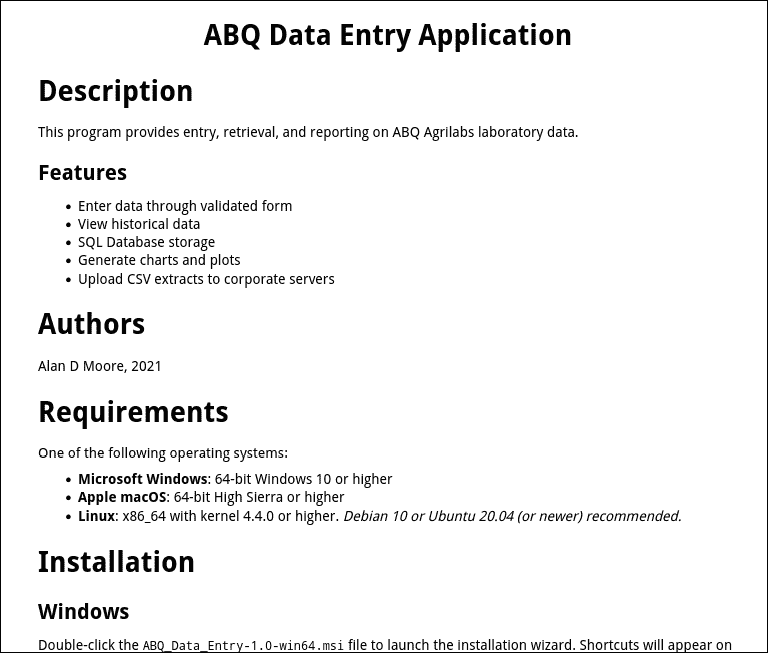
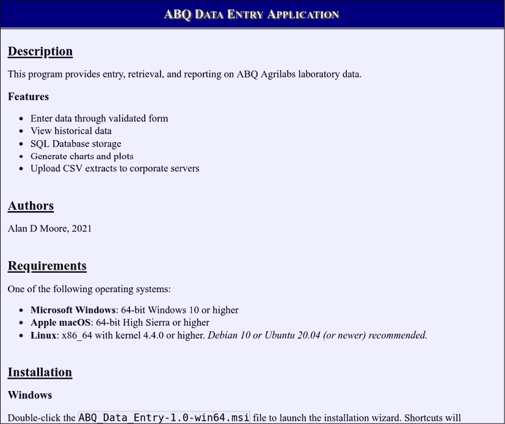

# 第十七章：A

# reStructuredText 快速入门

当涉及到编写软件文档时，软件开发人员通常更喜欢使用**轻量级标记语言**而不是像 DOCX 或其他字处理文件这样的二进制格式。这些语言旨在在纯文本文件的范围内提供一种标准化的方式来注释基本富文本功能，如项目符号列表、强调文本、章节标题、表格和内联代码，同时保持可读性。使用轻量级标记语言编写的文档可以原样阅读，或者编译成 PDF、DOCX 或 HTML 等其他格式。

这种方法与使用二进制字处理文件相比有几个优点：

+   文档可以被当作代码来处理：它可以使用代码编辑器进行编辑，并且可以用像**版本控制系统**（**VCS**）这样的工具轻松管理。

+   文档具有通用访问性：它可以从任何带有文本编辑器的系统上阅读，甚至可以从终端提示符中读取。

+   写作过程不那么分散注意力：因为标记语言通常关注语义对象，如标题、段落、表格等，而不是像颜色、字体或文本大小这样的外观细节，开发者就不会被外观细节所分散，更多地专注于组织和正确的信息。

在 1990 年代及之前，开发者倾向于使用各种 ASCII 艺术手段来视觉上传达富文本功能，如由管道和下划线组成的表格、用星号制作的列表或用第二行破折号表示的标题。在 2000 年代初，几个项目致力于正式化和定义这些结构，并开发工具，使开发者能够将他们的标记编译成用于分发或出版的二进制富文本格式。

这本书实际上是用一种标记语言在代码编辑器中编写的，然后通过脚本转换为出版商所需的格式。

# reStructuredText 标记语言

虽然存在多种标记语言选项，但 Python 社区倾向于更喜欢**reStructuredText**（**RST**）。reStructuredText 标记语言是 Python Docutils 项目的组成部分，位于 [`docutils.sourceforge.net`](http://docutils.sourceforge.net)。Docutils 项目开发了 RST 标准，并提供将 RST 转换为 PDF、ODT、HTML 和 LaTeX 等格式的实用工具。

## 文档结构

RST 旨在创建结构化文档；因此，我们首先应该创建的是我们文档的标题。这可以通过在单行文本上方和下方使用一行符号来表示，如下所示：

```py
=========================
The reStructuredText saga
========================= 
```

在这种情况下，我们使用标题两边的等号来表示它是我们的文档标题。我们还可以通过添加带有不同符号的下划线行来添加副标题：

```py
=========================
The reStructuredText saga
=========================
An adventure in markup languages.
--------------------------------- 
```

这里使用的确切符号并不重要；它们可以是以下任何一种：

```py
! " # $ % & ' ( ) * + , - . / : ; < = > ? @ [ \ ] ^ _ ` { | } ~ 
```

一个作为标题，另一个作为副标题的区分在于顺序。我们在文档中首先使用的符号将成为顶级标题。我们使用的第二个符号将成为二级标题，依此类推。按照惯例，等号通常用于一级，连字符用于二级，波浪号用于三级，加号用于四级。然而，这仅是一种惯例；在文档中，层次结构由您使用符号的顺序决定。

我们也可以不使用符号的顶部行来写标题，如下所示：

```py
Chapter 1
========= 
```

虽然这不是必需的，但这种样式通常比文档标题更适用于章节标题。文档标题是通过创建一个没有内容的顶级部分标题来表示的，而常规部分标题有内容。

例如，它们可以包含文本段落。RST 中的段落通过在文本块之间留一个空白行来表示，如下所示：

```py
Long ago the world had many markup languages, but they were ugly, and hard to read in plain-text.
Then, one day, everything changed... 
```

注意，段落不应缩进。缩进一行文本将表示其他结构，如下所示。

## 列表

RST 能够表示子弹列表和数字列表，两者都可以包含嵌套列表。

列表项是通过在一行开始处使用`*`、`-`或`+`符号后跟一个空格来创建的，如下所示：

```py
Lightweight markup languages include:
- reStructuredText
- emacs org-mode
- markdown 
```

要创建一个子列表，只需缩进两个空格，如下所示：

```py
Lightweight markup languages include:
- reStructuredText
  - released in 2002
  - widely used in Python
- emacs org-mode
  + released in 2003
  + included with the emacs editor
- markdown
  * released in 2004
  * Several variants exist,
    including Github-flavored,
    markdown extra, and multimarkdown. 
```

注意，列表中实际使用的符号没有任何语法意义，尽管它可以帮助纯文本读者区分子列表。另外，请注意，我们已经通过将后续行缩进到与列表第一行文本相同的缩进量，创建了一个多行列表项（`markdown`下的最后一个点）。

注意列表中的第一个点之前和每个子列表周围的空白行。列表应该在列表的第一个项目之前和最后一个项目之后有一个空白行。列表可以在其项目符号之间包含可选的空白行，这在提高可读性方面有时很有帮助。

编号列表的创建方式与子弹列表类似，但使用数字或`#`符号，后跟一个点作为项目符号；例如：

```py
Take these steps to use RST:
#. Learn RST
#. Write a document in RST
#. Install docutils:
  1\. Open a terminal
  2\. type pip install docutils
#. Convert your RST to another format using a command-line utility:
  * rst2pdf converts to PDF
  * rst2html converts to HTML
  * rst2odt converts to ODT 
```

虽然`#`符号对纯文本读者来说不太有帮助，但转换程序将自动在此情况下生成编号列表。注意，我们可以在编号列表中嵌套编号列表或子弹列表。

## 字符样式

使用 reStructuredText，我们可以表示各种内联字符样式，其中最常见的是强调、强强调和内联文本。

这是通过用特定的符号包围文本来完成的，如下表所示：

| 语法 | 用途 | 常见显示 |
| --- | --- | --- |
| `*单星号表示强调文本*` | 轻度强调 | 斜体文本 |
| `**双星号用于强烈强调文本**` | 强调 | 粗体文本 |
| ```py ``Double backticks are for inline literals`` ``` | 文本示例，例如代码 | 等宽文本，保留内联空白 |

注意，符号和被标记的文本之间不应有空格。

## 块和引用

当记录代码时，我们可能需要从其他来源包含一个块引用的情况相当常见。在 RST 中，可以通过缩进一个包含只有两个冒号的段落来完成简单的块引用，如下所示：

```py
In the immortal words of my late, great uncle Fred,
    Please pass the banana pudding!
Heaven rest his soul. 
```

在需要保留空白（如缩进和换行符）的情况下，我们可以使用**行块**，其中每行以一个竖线和空格开始。例如：

```py
A banana haiku:
| In a skin of gold
|     To be peeled and discarded –
|     Pale treasure awaits. 
```

虽然您的文档可能包含一些诗歌或文学引用，但更可能需要代码块。在 RST 中，代码块由一个缩进的块表示，该块之前是一个只包含两个冒号的段落，如下所示：

```py
The Fibonacci series can be calculated in
a generator function like so:
::
    def fibonacci():
        a, b = 0, 1
        while True:
            b, a = a + b, b
            yield a 
```

在代码块中，空白字符将被保留（当然，忽略初始缩进），并且不会解释 RST 标记，正如您期望引用实际代码那样。

## 表格

在文档中，表格是常见的需求，RST 提供了两种表示表格的方法。更简单但更有限的方法如下所示：

```py
===== ============= ==========================
Fruit Variety       Description
===== ============= ==========================
Apple Gala          Sweet and flavorful
Apple Fuji          Crisp and tangy, yet sweet
Apple Red Delicious Large, bland, insipid
===== ============= ========================== 
```

使用这种语法，我们使用空格在列中排列数据，并用 `=` 符号包围表格和标题行。整个表格中的空格表示列分隔符。请注意，符号必须与最长单元格的宽度相同。这种语法的限制在于它不能表示多行单元格或跨越多行或多列的单元格。

为了实现这一点，我们可以使用更详细的表格格式：

```py
+---------+-----------+------------------------------+
| Fruit   | Variety   | Description                  |
+=========+===========+==============================+
| Orange  | All varieties are sweet with orange rind |
+         +-----------+------------------------------+
|         | Navel     | Seedless, thick skin         |
+         +-----------+------------------------------+
|         | Valencia  | Thin skin, very juicy        |
+         +-----------+------------------------------+
|         | Blood     | Smaller, red inside          |
+---------+-----------+------------------------------+ 
```

在此格式中，表格单元格使用连字符和管道定义，每个单元格的角落使用加号符号。通过简单地省略它们之间的边框字符，可以使单元格跨越多行或多列。例如，在上面的表格中，包含`Orange`的单元格延伸到表格底部，标题下的第一行跨越了第二和第三列。请注意，表格标题是通过使用等号符号而不是连字符来表示的。

在纯文本编辑器中创建表格可能很繁琐，但一些编程工具具有生成 RST 表格的插件。如果您计划在 RST 文档中创建大量表格，您可能想看看您的编辑器是否有这样的工具。

# 将 RST 转换为其他格式

如果没有其他选择，遵循 reStructuredText 语法将导致一个非常可读和表达力强的纯文本文件。然而，使用标准化标记语言的真正力量在于将其转换为其他格式。

可在 PyPI 上找到的 `docutils` 软件包包含几个用于转换 RST 文件的命令行实用程序。其中更有用的列在这里：

| 命令 | 格式 | 格式描述 |
| --- | --- | --- |
| `rst2html` | 超文本标记语言 (HTML) | 网页的标准标记语言，用于发布到网站。 |
| `rst2html5` | 超文本标记语言版本 5 (HTML 5) | 更现代的 HTML 版本，适用于网页使用。 |
| `rst2pdf` | 可移植文档格式 (PDF) | 适用于打印文档或分发只读文档。 |
| `rst2odt` | Open Document Text (ODT) | 文字处理格式，当你想在文字处理器中进行进一步编辑时很有用。 |
| `rst2latex` | LaTeX 标记语言 | 一种非常强大的标记语言，常用于科学出版物。 |
| `rst2man` | `MAN` 页面标记 | UNIX man 页面使用的标记。在 Linux、BSD 或 macOS 上的文档很有用。 |
| `rst2s5` | 简单的基于标准的幻灯片系统（S5） | 基于 HTML 的幻灯片格式。适合演示。 |

要使用这些命令中的任何一个，只需用 RST 文件的名称调用它即可。

根据命令，输出文件可以通过 `-o` 开关或作为第二个位置参数指定，例如：

```py
# uses the -o switch
$ rst2pdf README.rst -o README.pdf
# uses the positional argument
$ rst2html5 README.rst README.html 
```

这些脚本会解析 RST 文件中的标记并构建一个格式良好的 PDF 或 HTML 文件。你可以在附录示例代码中的 `README.rst` 文件上尝试这些命令，这是 ABQ 数据录入的二进制发布版本的 README。例如，如果你渲染一个默认的 HTML 文件，在浏览器中看起来可能就像这样：



图 A.1：README.rst 的默认 HTML5 渲染

每个命令都有大量的选项可用，你可以通过使用 `--help` 开关调用命令来查看这些选项，如下所示：

```py
$ rst2html5 --help 
```

例如，`rst2html` 命令允许我们指定一个将被嵌入到生成的 HTML 文件中的 CSS 样式表。我们可以用它来改变生成的文档的外观，如下所示：

```py
$ rst2html5 --stylesheet abq_stylesheet.css  README.rst README.abq.html 
```

随着本书的示例代码，包含了一个 `abq_stylesheet.css` 文件，尽管如果你知道 CSS，你也可以创建自己的文件。如果你使用了捆绑的文件，在浏览器中的结果看起来可能就像这样：



图 A.2：添加了样式表的 README.rst 文件

## 其他渲染 RST 的方法

除了 `docutils`，还有其他工具可以利用 RST 文件：

+   来自 [`pandoc.org`](https://pandoc.org) 的 `pandoc` 工具可以将 RST 文件转换为更广泛的输出格式，并提供多种额外的渲染选项。

+   许多流行的代码共享服务，如 GitHub、GitLab 和 Bitbucket，将自动将 RST 文件渲染为 HTML，以便在它们的网络界面中显示。

+   来自 [`sphinx-doc.org`](https://sphinx-doc.org) 的 Sphinx 项目是一个针对 Python 项目的综合文档生成器。它可以通过渲染代码中的 docstrings、README 文件和其他文档中的 RST 来为你的项目生成完整的文档。Sphinx 在 Python 项目中广泛使用，包括官方 Python 文档在 [`docs.python.org`](https://docs.python.org)。

由于 RST 被广泛接受为 Python 文档的标准，你可以安全地假设任何针对 Python 的文档工具都将期望与之一起工作。

本教程只是对 reStructuredText 语法进行了浅尝辄止！如需快速语法参考，请参阅[`docutils.sourceforge.io/docs/user/rst/quickref.html`](https://docutils.sourceforge.io/docs/user/rst/quickref.html)。如需完整文档，请参阅[`docutils.sourceforge.io/rst.html`](https://docutils.sourceforge.io/rst.html)。
