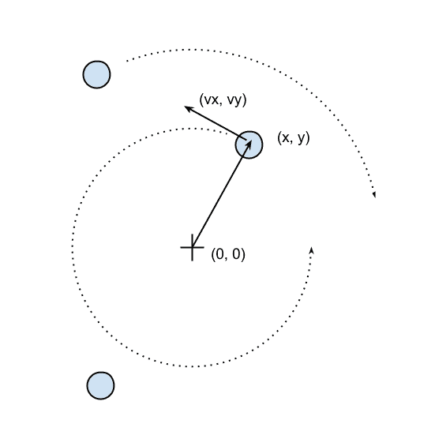
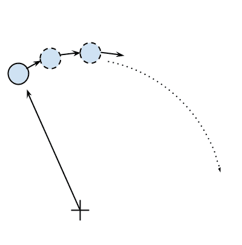
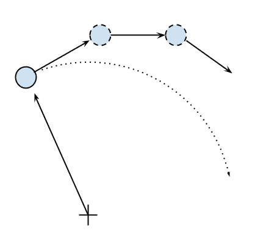
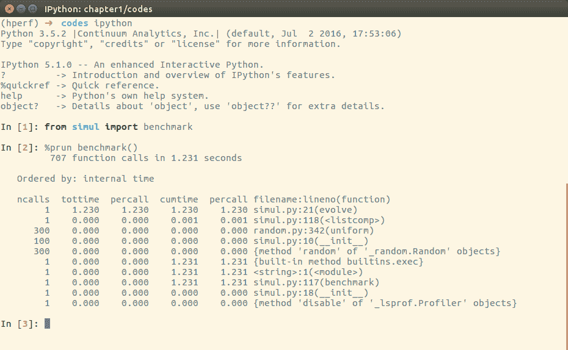
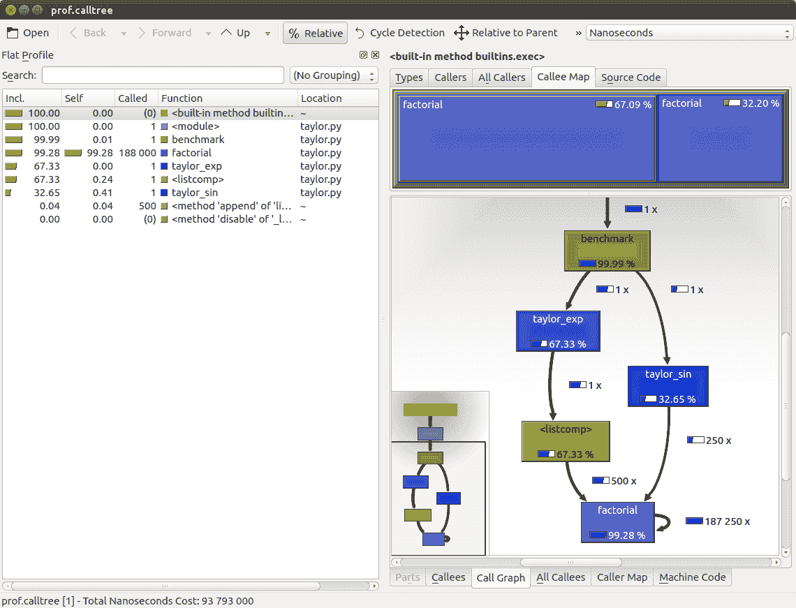
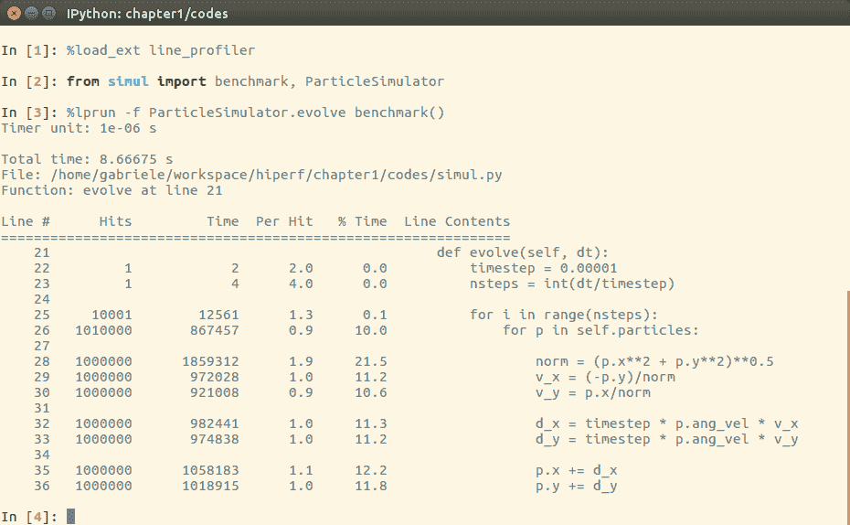
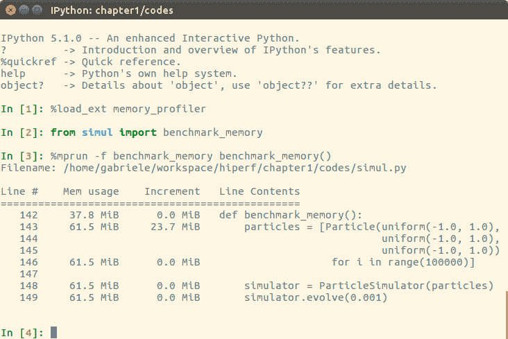

# 基准测试和分析

识别程序中的慢速部分是加快代码速度时最重要的任务。幸运的是，在大多数情况下，导致应用程序变慢的代码只是程序的一小部分。通过定位这些关键部分，你可以专注于需要改进的部分，而无需在微优化上浪费时间。

**分析**是允许我们定位应用程序中最资源密集的部分的技术。**分析器**是一个运行应用程序并监控每个函数执行时间的程序，从而检测应用程序花费最多时间的函数。

Python 提供了几个工具来帮助我们找到这些瓶颈并测量重要的性能指标。在本章中，我们将学习如何使用标准的 `cProfile` 模块和第三方包 `line_profiler`。我们还将学习如何通过 `memory_profiler` 工具分析应用程序的内存消耗。我们还将介绍另一个有用的工具 *KCachegrind*，它可以用来图形化显示各种分析器产生的数据。

**基准测试**是用于评估应用程序总执行时间的脚本。我们将学习如何编写基准测试以及如何准确测量程序的时间。

本章我们将涵盖的主题列表如下：

+   高性能编程的一般原则

+   编写测试和基准测试

+   Unix 的 `time` 命令

+   Python 的 `timeit` 模块

+   使用 `pytest` 进行测试和基准测试

+   分析你的应用程序

+   `cProfile` 标准工具

+   使用 KCachegrind 解释分析结果

+   `line_profiler` 和 `memory_profiler` 工具

+   通过 `dis` 模块反汇编 Python 代码

# 设计你的应用程序

当设计一个性能密集型程序时，第一步是编写你的代码，不要担心小的优化：

“过早优化是万恶之源。”

- **唐纳德·克努特**

在早期开发阶段，程序的设计可能会迅速变化，可能需要大量重写和组织代码库。通过在无需优化的负担下测试不同的原型，你可以自由地投入时间和精力来确保程序产生正确的结果，并且设计是灵活的。毕竟，谁需要运行速度快但给出错误答案的应用程序？

当优化代码时你应该记住的咒语如下：

+   **让它运行**：我们必须让软件处于工作状态，并确保它产生正确的结果。这个探索阶段有助于更好地理解应用程序并在早期阶段发现主要的设计问题。

+   **正确地做**：我们希望确保程序的设计是稳固的。在尝试任何性能优化之前应该进行重构。这实际上有助于将应用程序分解成独立且易于维护的单元。

+   **使其快速**：一旦我们的程序运行良好且结构合理，我们就可以专注于性能优化。如果内存使用成为问题，我们可能还想优化内存使用。

在本节中，我们将编写并分析一个 *粒子模拟器* 测试应用程序。**模拟器**是一个程序，它接受一些粒子，并根据我们施加的一组定律模拟它们随时间的变化。这些粒子可以是抽象实体，也可以对应于物理对象，例如在桌面上移动的台球、气体中的分子、在空间中移动的恒星、烟雾粒子、室内的流体等等。

计算机模拟在物理学、化学、天文学和其他许多学科领域都很有用。用于模拟系统的应用程序特别注重性能，科学家和工程师花费大量时间优化这些代码。为了研究现实系统，通常需要模拟大量的物体，并且任何小的性能提升都至关重要。

在我们的第一个示例中，我们将模拟一个包含粒子围绕中心点以不同速度不断旋转的系统，就像时钟的指针一样。

运行我们的模拟所需的信息将是粒子的起始位置、速度和旋转方向。从这些元素中，我们必须计算出粒子在下一时刻的位置。以下图示了一个示例系统。系统的原点是 `(0, 0)` 点，位置由 **x**、**y** 向量表示，速度由 **vx**、**vy** 向量表示：



圆周运动的基本特征是粒子始终沿着连接粒子和中心的连线垂直移动。要移动粒子，我们只需沿着运动方向采取一系列非常小的步骤（这相当于在很短的时间间隔内推进系统）来改变位置，如下图所示：



我们将首先以面向对象的方式设计应用程序。根据我们的要求，自然有一个通用的 `Particle` 类来存储粒子的位置 `x` 和 `y` 以及它们的角速度 `ang_vel`：

```py
    class Particle: 
        def __init__(self, x, y, ang_vel): 
            self.x = x 
            self.y = y 
            self.ang_vel = ang_vel

```

注意，我们接受所有参数的正负数（`ang_vel` 的符号将简单地确定旋转方向）。

另一个类，称为 `ParticleSimulator`，将封装运动定律，并负责随时间改变粒子的位置。`__init__` 方法将存储 `Particle` 实例的列表，而 `evolve` 方法将根据我们的定律改变粒子位置。

我们希望粒子围绕对应于 *x=0* 和 *y=0* 坐标的点以恒定速度旋转。粒子的方向始终垂直于从中心的方向（参考本章第一图）。为了找到沿 *x* 和 *y* 轴的运动方向（对应于 Python 的 `v_x` 和 `v_y` 变量），可以使用以下公式：

```py
    v_x = -y / (x**2 + y**2)**0.5
    v_y = x / (x**2 + y**2)**0.5

```

如果我们让我们的一个粒子运动，经过一定的时间 *t*，它将沿着圆形路径到达另一个位置。我们可以通过将时间间隔，*t*，划分为微小的时步，*dt*，来近似圆形轨迹，其中粒子沿着圆的切线方向直线运动。最终结果只是圆形运动的近似。为了避免强烈的发散，例如以下图中所示，必须采取非常小的时间步长：



以更简化的方式，我们必须执行以下步骤来计算时间 *t* 时的粒子位置：

1.  计算运动方向（`v_x` 和 `v_y`）。

1.  计算位移（`d_x` 和 `d_y`），这是时间步长、角速度和运动方向的乘积。

1.  重复步骤 1 和 2，直到覆盖总时间 *t*。

以下代码显示了完整的 `ParticleSimulator` 实现：

```py
    class ParticleSimulator: 

        def __init__(self, particles): 
            self.particles = particles 

        def evolve(self, dt): 
            timestep = 0.00001 
            nsteps = int(dt/timestep) 

            for i in range(nsteps):
                for p in self.particles:
                    # 1\. calculate the direction 
                    norm = (p.x**2 + p.y**2)**0.5 
                    v_x = -p.y/norm 
                    v_y = p.x/norm 

                    # 2\. calculate the displacement 
                    d_x = timestep * p.ang_vel * v_x 
                    d_y = timestep * p.ang_vel * v_y 

                    p.x += d_x 
                    p.y += d_y 
                    # 3\. repeat for all the time steps

```

我们可以使用 `matplotlib` 库来可视化我们的粒子。这个库不包括在 Python 标准库中，并且可以使用 `pip install matplotlib` 命令轻松安装。

或者，您可以使用包含 `matplotlib` 和本书中使用的其他大多数第三方包的 Anaconda Python 发行版（[`store.continuum.io/cshop/anaconda/`](https://store.continuum.io/cshop/anaconda/））。Anaconda 是免费的，并且适用于 Linux、Windows 和 Mac。

为了制作交互式可视化，我们将使用 `matplotlib.pyplot.plot` 函数显示粒子作为点，并使用 `matplotlib.animation.FuncAnimation` 类来动画化粒子随时间的变化。

`visualize` 函数接受一个 `ParticleSimulator` 实例作为参数，并在动画图中显示轨迹。使用 `matplotlib` 工具显示粒子轨迹的必要步骤如下：

+   设置坐标轴并使用 `plot` 函数显示粒子。`plot` 函数接受一个 *x* 和 *y* 坐标列表。

+   编写一个初始化函数，`init`，和一个函数，`animate`，使用 `line.set_data` 方法更新 *x* 和 *y* 坐标。

+   通过传递 `init` 和 `animate` 函数以及 `interval` 参数（指定更新间隔）和 `blit`（提高图像更新率）来创建一个 `FuncAnimation` 实例。

+   使用 `plt.show()` 运行动画：

```py
    from matplotlib import pyplot as plt 
    from matplotlib import animation 

    def visualize(simulator): 

        X = [p.x for p in simulator.particles] 
        Y = [p.y for p in simulator.particles] 

        fig = plt.figure() 
        ax = plt.subplot(111, aspect='equal') 
        line, = ax.plot(X, Y, 'ro') 

        # Axis limits 
        plt.xlim(-1, 1) 
        plt.ylim(-1, 1) 

        # It will be run when the animation starts 
        def init(): 
            line.set_data([], []) 
            return line, # The comma is important!

        def animate(i): 
            # We let the particle evolve for 0.01 time units 
            simulator.evolve(0.01) 
            X = [p.x for p in simulator.particles] 
            Y = [p.y for p in simulator.particles] 

            line.set_data(X, Y) 
            return line, 

        # Call the animate function each 10 ms 
        anim = animation.FuncAnimation(fig,
                                       animate,
                                       init_func=init,
                                       blit=True,
                                       interval=10) 
        plt.show()

```

为了测试，我们定义了一个小函数`test_visualize`，它使一个由三个粒子组成的系统以不同的方向旋转。请注意，第三个粒子的旋转速度比其他粒子快三倍：

```py
    def test_visualize(): 
        particles = [Particle(0.3, 0.5, 1), 
                     Particle(0.0, -0.5, -1), 
                     Particle(-0.1, -0.4, 3)] 

        simulator = ParticleSimulator(particles) 
        visualize(simulator) 

    if __name__ == '__main__': 
        test_visualize()

```

`test_visualize` 函数有助于图形化地理解系统时间演变。在下一节中，我们将编写更多的测试函数，以正确验证程序正确性和测量性能。

# 编写测试和基准测试

现在我们有一个可工作的模拟器，我们可以开始测量我们的性能并调整我们的代码，以便模拟器可以处理尽可能多的粒子。作为第一步，我们将编写一个测试和一个基准测试。

我们需要一个测试来检查模拟产生的结果是否正确。优化程序通常需要采用多种策略；随着我们多次重写代码，错误可能很容易被引入。一个稳固的测试套件确保在每次迭代中实现都是正确的，这样我们就可以自由地尝试不同的事情，并充满信心地认为，如果测试套件通过，代码仍然会按预期工作。

我们的测试将使用三个粒子，模拟 0.1 时间单位，并将结果与参考实现的结果进行比较。组织测试的一个好方法是为应用程序的每个不同方面（或单元）使用一个单独的函数。由于我们当前的功能包含在`evolve`方法中，我们的函数将命名为`test_evolve`。以下代码显示了`test_evolve`的实现。请注意，在这种情况下，我们通过`fequal`函数比较浮点数，直到一定的精度：

```py
    def test_evolve(): 
        particles = [Particle( 0.3,  0.5, +1), 
                     Particle( 0.0, -0.5, -1), 
                     Particle(-0.1, -0.4, +3)] 

        simulator = ParticleSimulator(particles) 

        simulator.evolve(0.1) 

        p0, p1, p2 = particles 

        def fequal(a, b, eps=1e-5): 
            return abs(a - b) < eps 

        assert fequal(p0.x, 0.210269) 
        assert fequal(p0.y, 0.543863) 

        assert fequal(p1.x, -0.099334) 
        assert fequal(p1.y, -0.490034) 

        assert fequal(p2.x,  0.191358) 
        assert fequal(p2.y, -0.365227) 

    if __name__ == '__main__': 
        test_evolve()

```

测试确保了我们的功能正确性，但关于其运行时间提供的信息很少。基准测试是一个简单且具有代表性的用例，可以运行以评估应用程序的运行时间。基准测试对于跟踪我们程序每个新版本的运行速度非常有用。

我们可以通过实例化具有随机坐标和角速度的千个`Particle`对象，并将它们提供给`ParticleSimulator`类来编写一个代表性的基准测试。然后，我们让系统演变 0.1 时间单位：

```py
    from random import uniform 

    def benchmark(): 
        particles = [Particle(uniform(-1.0, 1.0), 
                              uniform(-1.0, 1.0), 
                              uniform(-1.0, 1.0)) 
                      for i in range(1000)] 

        simulator = ParticleSimulator(particles) 
        simulator.evolve(0.1) 

    if __name__ == '__main__': 
        benchmark()

```

# 测量基准测试的时间

通过 Unix `time` 命令可以非常简单地测量基准测试的时间。使用`time`命令，如下所示，你可以轻松地测量任意进程的执行时间：

```py
    $ time python simul.py
real    0m1.051s
user    0m1.022s
sys     0m0.028s

```

`time`命令在 Windows 上不可用。要在 Windows 上安装 Unix 工具，如`time`，您可以使用从官方网站下载的`cygwin` shell（[`www.cygwin.com/`](http://www.cygwin.com/)）。或者，您可以使用类似的 PowerShell 命令，如`Measure-Command`（[`msdn.microsoft.com/en-us/powershell/reference/5.1/microsoft.powershell.utility/measure-command`](https://msdn.microsoft.com/en-us/powershell/reference/5.1/microsoft.powershell.utility/measure-command)），来测量执行时间。

默认情况下，`time`显示三个指标：

+   `real`: 从开始到结束运行进程的实际时间，就像用秒表测量的一样

+   `user`: 所有 CPU 在计算过程中花费的累积时间

+   `sys`: 所有 CPU 在系统相关任务（如内存分配）上花费的累积时间

注意，有时`user` + `sys`可能大于`real`，因为多个处理器可能并行工作。

`time`还提供了更丰富的格式化选项。要了解概述，你可以查看其手册（使用`man time`命令）。如果你想要所有可用指标的摘要，可以使用`-v`选项。

Unix 的`time`命令是衡量程序性能最简单和最直接的方法之一。为了进行准确的测量，基准测试应该设计得足够长，执行时间（以秒为单位）足够长，这样与应用程序执行时间相比，进程的设置和拆除时间就很小。`user`指标适合作为 CPU 性能的监控指标，而`real`指标还包括在等待 I/O 操作时花费在其他进程上的时间。

另一种方便计时 Python 脚本的方法是`timeit`模块。该模块将代码片段在循环中运行*n*次，并测量总执行时间。然后，它重复相同的操作*r*次（默认情况下，*r*的值为`3`）并记录最佳运行时间。由于这种计时方案，`timeit`是准确计时独立小语句的合适工具。

`timeit`模块可以用作 Python 包，从命令行或从*IPython*使用。

IPython 是一种改进 Python 解释器交互性的 Python shell 设计。它增强了 tab 补全和许多用于计时、分析和调试代码的实用工具。我们将使用这个 shell 在整本书中尝试代码片段。IPython shell 接受**魔法命令**--以`%`符号开始的语句，这些语句增强了 shell 的特殊行为。以`%%`开始的命令称为**单元魔法**，它可以应用于多行代码片段（称为**单元**）。

IPython 在大多数 Linux 发行版中通过`pip`提供，并包含在 Anaconda 中。

你可以使用 IPython 作为常规 Python shell（`ipython`），但它也提供基于 Qt 的版本（`ipython qtconsole`）和强大的基于浏览器的界面（`jupyter notebook`）。

在 IPython 和命令行界面中，可以使用`-n`和`-r`选项指定循环或重复的次数。如果没有指定，它们将由`timeit`自动推断。从命令行调用`timeit`时，你也可以通过`-s`选项传递一些设置代码，这将执行基准测试之前。在以下代码片段中，演示了 IPython 命令行和 Python 模块版本的`timeit`：

```py
# IPython Interface 
$ ipython 
In [1]: from simul import benchmark 
In [2]: %timeit benchmark() 
1 loops, best of 3: 782 ms per loop 

# Command Line Interface 
$ python -m timeit -s 'from simul import benchmark' 'benchmark()'
10 loops, best of 3: 826 msec per loop 

# Python Interface 
# put this function into the simul.py script 

import timeit
result = timeit.timeit('benchmark()',
 setup='from __main__ import benchmark',
 number=10)

# result is the time (in seconds) to run the whole loop 
result = timeit.repeat('benchmark()',
 setup='from __main__ import benchmark',
 number=10,
 repeat=3) 
# result is a list containing the time of each repetition (repeat=3 in this case)

```

注意，虽然命令行和 IPython 接口会自动推断一个合理的循环次数`n`，但 Python 接口需要你通过`number`参数显式指定一个值。

# 使用 pytest-benchmark 进行更好的测试和基准测试

Unix 的`time`命令是一个多功能的工具，可以用来评估各种平台上小型程序的运行时间。对于更大的 Python 应用程序和库，一个更全面的解决方案，它同时处理测试和基准测试的是`pytest`，结合其`pytest-benchmark`插件。

在本节中，我们将使用`pytest`测试框架为我们的应用程序编写一个简单的基准测试。对于感兴趣的读者，可以在[`doc.pytest.org/en/latest/`](http://doc.pytest.org/en/latest/)找到的`pytest`文档是了解框架及其用途的最佳资源。

您可以使用`pip install pytest`命令从控制台安装`pytest`。同样，可以通过发出`pip install pytest-benchmark`命令来安装基准测试插件。

测试框架是一组工具，它简化了编写、执行和调试测试的过程，并提供丰富的测试结果报告和总结。当使用`pytest`框架时，建议将测试代码与应用程序代码分开。在下面的示例中，我们创建了`test_simul.py`文件，其中包含`test_evolve`函数：

```py
    from simul import Particle, ParticleSimulator

    def test_evolve():
        particles = [Particle( 0.3,  0.5, +1),
                     Particle( 0.0, -0.5, -1),
                     Particle(-0.1, -0.4, +3)]

        simulator = ParticleSimulator(particles)

        simulator.evolve(0.1)

        p0, p1, p2 = particles

        def fequal(a, b, eps=1e-5):
            return abs(a - b) < eps

        assert fequal(p0.x, 0.210269)
        assert fequal(p0.y, 0.543863)

        assert fequal(p1.x, -0.099334)
        assert fequal(p1.y, -0.490034)

        assert fequal(p2.x,  0.191358)
        assert fequal(p2.y, -0.365227)

```

`pytest`可执行文件可以从命令行使用，以发现和运行包含在 Python 模块中的测试。要执行特定的测试，我们可以使用`pytest path/to/module.py::function_name`语法。要执行`test_evolve`，我们可以在控制台中输入以下命令以获得简单但信息丰富的输出：

```py
$ pytest test_simul.py::test_evolve

platform linux -- Python 3.5.2, pytest-3.0.5, py-1.4.32, pluggy-0.4.0
rootdir: /home/gabriele/workspace/hiperf/chapter1, inifile: plugins:
collected 2 items 

test_simul.py .

=========================== 1 passed in 0.43 seconds ===========================

```

一旦我们有了测试，就可以使用`pytest-benchmark`插件将测试作为基准来执行。如果我们修改`test`函数，使其接受一个名为`benchmark`的参数，`pytest`框架将自动将`benchmark`资源作为参数传递（在`pytest`术语中，这些资源被称为*fixtures*）。可以通过传递我们打算基准测试的函数作为第一个参数，然后是额外的参数来调用基准资源。在下面的代码片段中，我们展示了基准测试`ParticleSimulator.evolve`函数所需的编辑：

```py
    from simul import Particle, ParticleSimulator

    def test_evolve(benchmark):
        # ... previous code
        benchmark(simulator.evolve, 0.1)

```

要运行基准测试，只需重新运行`pytest test_simul.py::test_evolve`命令即可。生成的输出将包含有关`test_evolve`函数的详细计时信息，如下所示：


对于每个收集到的测试，`pytest-benchmark`将多次执行基准函数，并提供其运行时间的统计总结。前面显示的输出非常有趣，因为它显示了运行时间在不同运行之间的变化。

在这个例子中，`test_evolve`中的基准测试运行了`34`次（`Rounds`列），其时间在`29`到`41`毫秒（`Min`和`Max`）之间，`Average`和`Median`时间大约在`30`毫秒，这实际上非常接近获得的最佳时间。这个例子展示了运行之间可能会有很大的性能变化，并且当使用`time`等单次工具进行计时的时候，多次运行程序并记录一个代表性值，如最小值或中位数，是一个好主意。

`pytest-benchmark`有许多更多功能和选项，可用于进行准确的计时和分析结果。有关更多信息，请参阅[`pytest-benchmark.readthedocs.io/en/stable/usage.html`](http://pytest-benchmark.readthedocs.io/en/stable/usage.html)上的文档。

# 使用 cProfile 查找瓶颈

在评估程序的正确性和计时执行时间后，我们就可以确定需要调整性能的代码部分。这些部分通常与程序的大小相比非常小。

Python 标准库中提供了两个分析模块：

+   **`profile`**模块：这个模块是用纯 Python 编写的，会给程序执行增加显著的开销。它在标准库中的存在是因为它具有广泛的平台支持，并且更容易扩展。

+   **`cProfile`**模块：这是主要的分析模块，其接口与`profile`相当。它用 C 语言编写，开销小，适合作为通用分析器。

`cProfile`模块可以用三种不同的方式使用：

+   从命令行

+   作为 Python 模块

+   使用 IPython

`cProfile`不需要对源代码进行任何修改，可以直接在现有的 Python 脚本或函数上执行。您可以从命令行这样使用`cProfile`：

```py
$ python -m cProfile simul.py

```

这将打印出包含应用程序中所有调用函数的多个分析指标的冗长输出。您可以使用`-s`选项按特定指标排序输出。在下面的代码片段中，输出按`tottime`指标排序，这里将对其进行描述：

```py
$ python -m cProfile **-s tottime** simul.py

```

可以通过传递`-o`选项将`cProfile`生成数据保存到输出文件。`cProfile`使用的格式可由`stats`模块和其他工具读取。`-o`选项的使用方法如下：

```py
$ python -m cProfile **-o prof.out** simul.py

```

将`cProfile`作为 Python 模块使用需要以以下方式调用`cProfile.run`函数：

```py
    from simul import benchmark
    import cProfile

    cProfile.run("benchmark()")

```

您也可以在`cProfile.Profile`对象的方法调用之间包裹一段代码，如下所示：

```py
    from simul import benchmark
    import cProfile

    pr = cProfile.Profile()
    pr.enable()
    benchmark()
    pr.disable()
    pr.print_stats()

```

`cProfile`也可以与 IPython 交互式使用。`%prun`魔法命令允许您分析单个函数调用，如下所示：



`cProfile`输出分为五个列：

+   `ncalls`：函数被调用的次数。

+   `tottime`：函数中不考虑对其他函数的调用所花费的总时间。

+   `cumtime`：函数中包括其他函数调用所花费的时间。

+   `percall`：函数单次调用所花费的时间——可以通过将总时间或累积时间除以调用次数来获得。

+   `filename:lineno`：文件名和相应的行号。当调用 C 扩展模块时，此信息不可用。

最重要的指标是`tottime`，即不包括子调用的函数体实际花费的时间，这告诉我们瓶颈的确切位置。

毫不奇怪，大部分时间都花在了`evolve`函数上。我们可以想象，循环是代码中需要性能调优的部分。

`cProfile`只提供函数级别的信息，并不告诉我们哪些具体的语句是瓶颈所在。幸运的是，正如我们将在下一节中看到的，`line_profiler`工具能够提供函数中逐行花费的时间信息。

对于具有大量调用和子调用的程序，分析`cProfile`文本输出可能会令人望而却步。一些可视化工具通过改进交互式图形界面来辅助任务。

KCachegrind 是一个用于分析`cProfile`生成的分析输出的**图形用户界面(GUI)**。

KCachegrind 可在 Ubuntu 16.04 官方仓库中找到。Qt 端口，QCacheGrind，可以从[`sourceforge.net/projects/qcachegrindwin/`](http://sourceforge.net/projects/qcachegrindwin/)下载到 Windows 上。Mac 用户可以通过遵循博客文章中的说明来使用 Mac Ports 编译 QCacheGrind（[`www.macports.org/`](http://www.macports.org/)），该博客文章位于[`blogs.perl.org/users/rurban/2013/04/install-kachegrind-on-macosx-with-ports.html`](http://blogs.perl.org/users/rurban/2013/04/install-kachegrind-on-macosx-with-ports.html)。

KCachegrind 不能直接读取`cProfile`生成的输出文件。幸运的是，第三方 Python 模块`pyprof2calltree`能够将`cProfile`输出文件转换为 KCachegrind 可读的格式。

您可以使用命令`pip install pyprof2calltree`从 Python 包索引安装`pyprof2calltree`。

为了最好地展示 KCachegrind 的功能，我们将使用一个具有更复杂结构的另一个示例。我们定义了一个`recursive`函数，名为`factorial`，以及两个使用`factorial`的其他函数，分别命名为`taylor_exp`和`taylor_sin`。它们代表了`exp(x)`和`sin(x)`的泰勒近似的多项式系数：

```py
    def factorial(n): 
        if n == 0: 
            return 1.0 
        else: 
            return n * factorial(n-1) 

    def taylor_exp(n): 
        return [1.0/factorial(i) for i in range(n)] 

    def taylor_sin(n): 
        res = [] 
        for i in range(n): 
            if i % 2 == 1: 
               res.append((-1)**((i-1)/2)/float(factorial(i))) 
            else: 
               res.append(0.0) 
        return res 

    def benchmark(): 
        taylor_exp(500) 
        taylor_sin(500) 

    if __name__ == '__main__': 
        benchmark()

```

要访问配置文件信息，我们首先需要生成`cProfile`输出文件：

```py
$ python -m cProfile -o prof.out taylor.py

```

然后，我们可以使用`pyprof2calltree`转换输出文件并启动 KCachegrind：

```py
$ pyprof2calltree -i prof.out -o prof.calltree
$ kcachegrind prof.calltree # or qcachegrind prof.calltree

```

下面的截图显示了输出：



上一张截图显示了 KCachegrind 用户界面。在左侧，我们有一个与`cProfile`相当输出的输出。实际的列名略有不同：Incl.对应于`cProfile`模块的`cumtime`，Self 对应于`tottime`。通过在菜单栏上点击相对按钮，以百分比的形式给出值。通过点击列标题，您可以按相应的属性排序。

在右上角，点击调用图标签将显示函数成本的图表。在图表中，函数花费的时间百分比与矩形的面积成正比。矩形可以包含表示对其他函数子调用的子矩形。在这种情况下，我们可以很容易地看到有两个矩形表示`factorial`函数。左边的对应于`taylor_exp`的调用，右边的对应于`taylor_sin`的调用。

在右下角，您可以通过点击调用图标签显示另一个图表，即*调用图*。调用图是函数之间调用关系的图形表示；每个方块代表一个函数，箭头表示调用关系。例如，`taylor_exp`调用`factorial` 500 次，而`taylor_sin`调用`factorial` 250 次。KCachegrind 还检测递归调用：`factorial`调用自身 187250 次。

您可以通过双击矩形导航到调用图或调用者图标签；界面将相应更新，显示时间属性相对于所选函数。例如，双击`taylor_exp`将导致图表更改，仅显示`taylor_exp`对总成本的贡献。

**Gprof2Dot** ([`github.com/jrfonseca/gprof2dot`](https://github.com/jrfonseca/gprof2dot))是另一个流行的工具，用于生成调用图。从支持的剖析器产生的输出文件开始，它将生成一个表示调用图的`.dot`图表。

# 使用 line_profiler 逐行分析

现在我们知道了要优化的函数，我们可以使用`line_profiler`模块，该模块以逐行的方式提供关于时间花费的信息。这在难以确定哪些语句成本高昂的情况下非常有用。`line_profiler`模块是一个第三方模块，可在 Python 包索引上找到，并可通过遵循[`github.com/rkern/line_profiler`](https://github.com/rkern/line_profiler)上的说明进行安装。

为了使用`line_profiler`，我们需要将`@profile`装饰器应用到我们打算监控的函数上。请注意，您不需要从另一个模块导入`profile`函数，因为它在运行`kernprof.py`分析脚本时被注入到全局命名空间中。为了为我们程序生成分析输出，我们需要将`@profile`装饰器添加到`evolve`函数上：

```py
    @profile 
    def evolve(self, dt): 
        # code

```

`kernprof.py` 脚本将生成一个输出文件，并将分析结果打印到标准输出。我们应该使用以下两个选项来运行脚本：

+   `-l` 用于使用 `line_profiler` 函数

+   `-v` 用于立即在屏幕上打印结果

`kernprof.py` 的使用在以下代码行中说明：

```py
$ kernprof.py -l -v simul.py

```

还可以在 IPython shell 中运行分析器以进行交互式编辑。首先，你需要加载 `line_profiler` 扩展，它将提供 `lprun` 魔法命令。使用该命令，你可以避免添加 `@profile` 装饰器：



输出相当直观，分为六个列：

+   `行号`：运行的行号

+   `击中次数`：该行被运行的次数

+   `时间`：该行的执行时间，以微秒为单位（`时间`）

+   `每次击中`：时间/击中次数

+   `% 时间`：执行该行所花费的总时间的比例

+   `行内容`：该行的内容

通过查看百分比列，我们可以很好地了解时间花费在哪里。在这种情况下，`for` 循环体中有几个语句，每个语句的成本约为 10-20%。

# 优化我们的代码

现在我们已经确定了应用程序大部分时间花在了哪里，我们可以进行一些更改并评估性能的变化。

有多种方法可以调整我们的纯 Python 代码。产生最显著结果的方法是改进所使用的**算法**。在这种情况下，我们不再计算速度并添加小步骤，而是更有效（并且正确，因为它不是近似）用半径 `r` 和角度 `alpha`（而不是 `x` 和 `y`）来表示运动方程，然后使用以下方程计算圆上的点：

```py
    x = r * cos(alpha) 
    y = r * sin(alpha)

```

另一种方法是通过最小化指令的数量。例如，我们可以预先计算 `timestep * p.ang_vel` 因子，该因子不随时间变化。我们可以交换循环顺序（首先迭代粒子，然后迭代时间步），并将因子的计算放在循环外的粒子上进行。

行内分析还显示，即使是简单的赋值操作也可能花费相当多的时间。例如，以下语句占用了超过 10% 的总时间：

```py
    v_x = (-p.y)/norm

```

我们可以通过减少执行的操作数来提高循环的性能。为此，我们可以通过将表达式重写为单个稍微复杂一些的语句来避免中间变量（注意，右侧在赋值给变量之前会被完全评估）：

```py
    p.x, p.y = p.x - t_x_ang*p.y/norm, p.y + t_x_ang * p.x/norm

```

这导致以下代码：

```py
        def evolve_fast(self, dt): 
            timestep = 0.00001 
            nsteps = int(dt/timestep) 

            # Loop order is changed 
            for p in self.particles: 
                t_x_ang = timestep * p.ang_vel 
                for i in range(nsteps): 
                    norm = (p.x**2 + p.y**2)**0.5 
                    p.x, p.y = (p.x - t_x_ang * p.y/norm,
                                p.y + t_x_ang * p.x/norm)

```

应用更改后，我们应该通过运行我们的测试来验证结果是否仍然相同。然后我们可以使用我们的基准来比较执行时间：

```py
$ time python simul.py # Performance Tuned
real    0m0.756s
user    0m0.714s
sys    0m0.036s

$ time python simul.py # Original
real    0m0.863s
user    0m0.831s
sys    0m0.028s

```

如您所见，我们通过进行纯 Python 微优化只获得了速度的适度提升。

# `dis` 模块

有时很难估计 Python 语句将执行多少操作。在本节中，我们将深入研究 Python 内部机制以估计单个语句的性能。在 CPython 解释器中，Python 代码首先被转换为中间表示形式，即**字节码**，然后由 Python 解释器执行。

要检查代码如何转换为字节码，我们可以使用`dis` Python 模块（`dis`代表反汇编）。它的使用非常简单；所需做的就是调用`dis.dis`函数对`ParticleSimulator.evolve`方法进行操作：

```py
    import dis 
    from simul import ParticleSimulator 
    dis.dis(ParticleSimulator.evolve)

```

这将打印出函数中每一行的字节码指令列表。例如，`v_x = (-p.y)/norm`语句在以下指令集中展开：

```py
    29           85 LOAD_FAST                5 (p) 
                 88 LOAD_ATTR                4 (y) 
                 91 UNARY_NEGATIVE        
                 92 LOAD_FAST                6 (norm) 
                 95 BINARY_TRUE_DIVIDE    
                 96 STORE_FAST               7 (v_x)

```

`LOAD_FAST`将`p`变量的引用加载到栈上，`LOAD_ATTR`将栈顶元素的`y`属性加载到栈上。其他指令，如`UNARY_NEGATIVE`和`BINARY_TRUE_DIVIDE`，在栈顶元素上执行算术运算。最后，结果存储在`v_x`中（`STORE_FAST`）。

通过分析`dis`输出，我们可以看到第一个版本的循环产生了`51`条字节码指令，而第二个版本被转换为`35`条指令。

`dis`模块有助于发现语句是如何转换的，主要用作 Python 字节码表示的探索和学习工具。

为了进一步提高我们的性能，我们可以继续尝试找出其他方法来减少指令的数量。然而，很明显，这种方法最终受限于 Python 解释器的速度，可能不是完成这项工作的正确工具。在接下来的章节中，我们将看到如何通过执行用较低级别语言（如 C 或 Fortran）编写的快速专用版本来加快解释器受限的计算速度。

# 使用`memory_profiler`分析内存使用

在某些情况下，高内存使用量构成一个问题。例如，如果我们想要处理大量的粒子，由于创建了大量的`Particle`实例，我们将产生内存开销。

`memory_profiler`模块以一种类似于`line_profiler`的方式总结了进程的内存使用情况。

`memory_profiler`包也可在 Python 包索引中找到。您还应该安装`psutil`模块（[`github.com/giampaolo/psutil`](https://github.com/giampaolo/psutil)），作为可选依赖项，这将使`memory_profiler`运行得更快。

就像`line_profiler`一样，`memory_profiler`也要求通过在我们要监控的函数上放置`@profile`装饰器来对源代码进行仪器化。在我们的例子中，我们想要分析`benchmark`函数。

我们可以稍微修改`benchmark`，实例化大量的`Particle`实例（例如`100000`个），并减少模拟时间：

```py
    def benchmark_memory(): 
        particles = [Particle(uniform(-1.0, 1.0), 
                              uniform(-1.0, 1.0), 
                              uniform(-1.0, 1.0)) 
                      for i in range(100000)] 

        simulator = ParticleSimulator(particles) 
        simulator.evolve(0.001)

```

我们可以通过以下截图所示的`%mprun`魔法命令从 IPython shell 中使用`memory_profiler`：



在添加了`@profile`装饰器后，可以使用`mprof run`命令从 shell 中运行`memory_profiler`。

从`Increment`列中，我们可以看到 100,000 个`Particle`对象占用`23.7 MiB`的内存。

1 MiB（兆字节）相当于 1,048,576 字节。它与 1 MB（兆字节）不同，1 MB 相当于 1,000,000 字节。

我们可以在`Particle`类上使用`__slots__`来减少其内存占用。这个特性通过避免在内部字典中存储实例变量来节省一些内存。然而，这种策略有一个缺点——它阻止了添加`__slots__`中未指定的属性：

```py
    class Particle:
        __slots__ = ('x', 'y', 'ang_vel') 

        def __init__(self, x, y, ang_vel): 
            self.x = x 
            self.y = y 
            self.ang_vel = ang_vel

```

我们现在可以重新运行我们的基准测试来评估内存消耗的变化，结果如下截图所示：


通过使用`__slots__`重写`Particle`类，我们可以节省大约`10 MiB`的内存。

# 摘要

在本章中，我们介绍了优化的基本原理，并将这些原理应用于一个测试应用。在优化时，首先要做的是测试并确定应用中的瓶颈。我们看到了如何使用`time` Unix 命令、Python 的`timeit`模块以及完整的`pytest-benchmark`包来编写和计时基准测试。我们学习了如何使用`cProfile`、`line_profiler`和`memory_profiler`来分析我们的应用，以及如何使用 KCachegrind 图形化地分析和导航分析数据。

在下一章中，我们将探讨如何使用 Python 标准库中可用的算法和数据结构来提高性能。我们将涵盖扩展、几个数据结构的示例用法，并学习诸如缓存和记忆化等技术。
