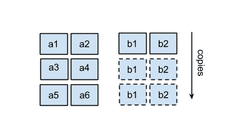
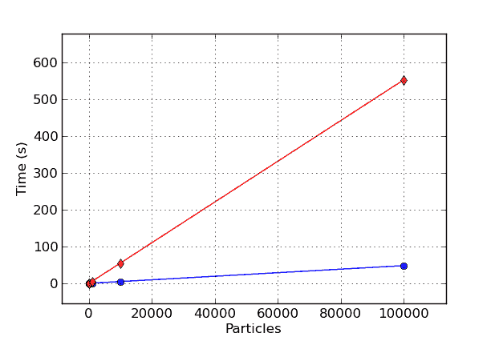

# 第三章：使用 NumPy 和 Pandas 进行快速数组操作

NumPy 是 Python 中科学计算的 **de facto** 标准。它通过提供灵活的多维数组扩展了 Python，允许快速简洁的数学计算。

NumPy 提供了旨在使用简洁语法表达复杂数学运算的常见数据结构和算法。多维数组 `numpy.ndarray` 在内部基于 C 数组。除了性能优势外，这种选择还允许 NumPy 代码轻松地与现有的 C 和 FORTRAN 例程接口；NumPy 有助于弥合 Python 和使用这些语言编写的旧代码之间的差距。

在本章中，我们将学习如何创建和操作 NumPy 数组。我们还将探索用于以高效和简洁的方式重写复杂数学表达式的 NumPy 广播功能。

Pandas 是一个高度依赖 NumPy 的工具，它提供了针对数据分析的额外数据结构和算法。我们将介绍 Pandas 的主要功能和用法。我们还将学习如何从 Pandas 数据结构和矢量化操作中获得高性能。

本章涵盖的主题如下：

+   创建和操作 NumPy 数组

+   掌握 NumPy 的广播功能以实现快速简洁的矢量化操作

+   使用 NumPy 提高我们的粒子模拟器

+   使用 `numexpr` 达到最佳性能

+   Pandas 基础知识

+   使用 Pandas 进行数据库式操作

# 使用 NumPy 入门

NumPy 库围绕其多维数组对象 `numpy.ndarray` 展开。NumPy 数组是相同数据类型元素的集合；这种基本限制允许 NumPy 以一种允许高性能数学运算的方式打包数据。

# 创建数组

您可以使用 `numpy.array` 函数创建 NumPy 数组。它接受一个类似列表的对象（或另一个数组）作为输入，并可选地接受一个表示其数据类型的字符串。您可以使用 IPython shell 交互式测试数组创建，如下所示：

```py
    import numpy as np 
    a = np.array([0, 1, 2]) 

```

每个 NumPy 数组都有一个关联的数据类型，可以使用 `dtype` 属性访问。如果我们检查 `a` 数组，我们会发现其 `dtype` 是 `int64`，代表 64 位整数：

```py
    a.dtype 
    # Result: 
    # dtype('int64') 

```

我们可能决定将这些整数数字转换为 `float` 类型。为此，我们可以在数组初始化时传递 `dtype` 参数，或者使用 `astype` 方法将数组转换为另一种数据类型。以下代码显示了选择数据类型的两种方法：

```py
    a = np.array([1, 2, 3], dtype='float32') 
    a.astype('float32') 
    # Result:
    # array([ 0.,  1.,  2.], dtype=float32) 

```

要创建一个具有两个维度（数组数组）的数组，我们可以使用嵌套序列进行初始化，如下所示：

```py
    a = np.array([[0, 1, 2], [3, 4, 5]]) 
    print(a) 
    # Output:
    # [[0 1 2]
    #  [3 4 5]] 

```

以这种方式创建的数组具有两个维度，在 NumPy 的术语中称为 **轴**。以这种方式形成的数组就像一个包含两行三列的表格。我们可以使用 `ndarray.shape` 属性来访问轴：

```py
    a.shape 
    # Result:
    # (2, 3) 

```

只要形状维度的乘积等于数组中的总元素数（即，总元素数保持不变），数组也可以被重塑。例如，我们可以以下列方式重塑包含 16 个元素的数组：`(2, 8)`、`(4, 4)` 或 `(2, 2, 4)`。要重塑数组，我们可以使用 `ndarray.reshape` 方法或给 `ndarray.shape` 元组赋新值。以下代码说明了 `ndarray.reshape` 方法的使用：

```py
    a = np.array([0, 1, 2, 3, 4, 5, 6, 7, 8, 
                  9, 10, 11, 12, 13, 14, 15]) 
    a.shape 
    # Output:
    # (16,)

    a.reshape(4, 4) # Equivalent: a.shape = (4, 4) 
    # Output: 
    # array([[ 0,  1,  2,  3],
    #        [ 4,  5,  6,  7],
    #        [ 8,  9, 10, 11],
    #        [12, 13, 14, 15]]) 

```

多亏了这一特性，你可以自由地添加大小为 1 的维度。你可以将包含 16 个元素的数组重塑为 `(16, 1)`、`(1, 16)`、`(16, 1, 1)` 等等。在下一节中，我们将广泛使用这一特性通过 *广播* 实现复杂操作。

NumPy 提供了一些便利函数，如下面的代码所示，用于创建填充零、一或无初始值（在这种情况下，其实际值没有意义且取决于内存状态）的数组。这些函数接受数组形状作为元组，并且可选地接受其 `dtype`：

```py
    np.zeros((3, 3)) 
    np.empty((3, 3)) 
    np.ones((3, 3), dtype='float32') 

```

在我们的示例中，我们将使用 `numpy.random` 模块在 `(0, 1)` 区间内生成随机浮点数。`numpy.random.rand` 将接受一个形状并返回具有该形状的随机数数组：

```py
    np.random.rand(3, 3) 

```

有时初始化与某个其他数组形状相同的数组很方便。为此目的，NumPy 提供了一些实用的函数，例如 `zeros_like`、`empty_like` 和 `ones_like`。这些函数可以按如下方式使用：

```py
    np.zeros_like(a) 
    np.empty_like(a) 
    np.ones_like(a) 

```

# 访问数组

在浅层上，NumPy 数组接口与 Python 列表类似。NumPy 数组可以使用整数索引，并使用 `for` 循环迭代：

```py
    A = np.array([0, 1, 2, 3, 4, 5, 6, 7, 8]) 
    A[0] 
    # Result:
    # 0 

    [a for a in A] 
    # Result:
    # [0, 1, 2, 3, 4, 5, 6, 7, 8] 

```

在 NumPy 中，可以通过在下标操作符 `[]` 内使用多个以逗号分隔的值方便地访问数组元素和子数组。如果我们取一个 `(3,3)` 的数组（包含三个三元组的数组），并且我们访问索引为 `0` 的元素，我们获得第一行，如下所示：

```py
    A = np.array([[0, 1, 2], [3, 4, 5], [6, 7, 8]]) 
    A[0] 
    # Result:
    # array([0, 1, 2]) 

```

我们可以通过添加另一个以逗号分隔的索引来再次索引行。要获取第一行的第二个元素，我们可以使用 `(0, 1)` 索引。一个重要的观察是，`A[0, 1]` 语法实际上是一个简写，即 `A[(0, 1)]`，也就是说，我们实际上是在使用 *元组* 进行索引！以下代码片段显示了这两种版本：

```py
    A[0, 1] 
    # Result:
    # 1

    # Equivalent version using tuple
    A[(0, 1)]

```

NumPy 允许你将数组切割成多个维度。如果我们对第一个维度进行切割，我们可以获得一系列三元组，如下所示：

```py
    A[0:2] 
    # Result:
    # array([[0, 1, 2], 
    #        [3, 4, 5]]) 

```

如果我们再次使用 `0:2` 在第二个维度上切割数组，我们基本上是从之前显示的三元组集合中提取前两个元素。这导致了一个形状为 `(2, 2)` 的数组，如下所示：

```py
    A[0:2, 0:2] 
    # Result:
    # array([[0, 1], 
    #        [3, 4]]) 

```

直观地讲，你可以使用数值索引和切片来更新数组中的值。以下代码片段展示了这一点的示例：

```py
    A[0, 1] = 8 
    A[0:2, 0:2] = [[1, 1], [1, 1]]

```

使用切片语法进行索引非常快，因为与列表不同，它不会生成数组的副本。在 NumPy 的术语中，它返回相同内存区域的*视图*。如果我们从原始数组中取一个切片，然后改变其值中的一个，原始数组也会被更新。以下代码展示了这一特性的一个示例：

```py
    a= np.array([1, 1, 1, 1]) 
    a_view = a[0:2] 
    a_view[0] = 2 
    print(a) 
    # Output:
    # [2 1 1 1] 

```

在修改 NumPy 数组时，需要格外小心。由于视图共享数据，改变视图的值可能会导致难以发现的错误。为了防止副作用，您可以设置`a.flags.writeable = False`标志，这将防止意外修改数组或其任何视图。

我们可以看看另一个示例，展示如何在实际场景中使用切片语法。我们定义一个`r_i`数组，如下面的代码行所示，它包含一组 10 个坐标（*x*，*y*）。它的形状将是`(10, 2)`：

```py
    r_i = np.random.rand(10, 2)

```

如果您在区分轴顺序不同的数组时遇到困难，例如在形状为`(10, 2)`的数组与`(2, 10)`的数组之间，那么每次您说“*of*”这个词时，都应该引入一个新的维度。一个大小为二的十个元素的数组将是`(10, 2)`。相反，一个大小为十的两个元素的数组将是`(2, 10)`。

我们可能感兴趣的一个典型操作是从每个坐标中提取*x*分量。换句话说，您想要提取`(0, 0)`、`(1, 0)`、`(2, 0)`等等项，结果得到一个形状为`(10,)`的数组。有助于思考的是，第一个索引是*移动的*，而第二个索引是*固定的*（在`0`处）。带着这个想法，我们将第一个轴（移动的轴）上的每个索引进行切片，并在第二个轴上取第一个元素（固定的元素），如下面的代码行所示：

```py
    x_i = r_i[:, 0] 

```

另一方面，以下表达式将保持第一个索引固定，第二个索引移动，返回第一个(*x*，*y*)坐标：

```py
    r_0 = r_i[0, :] 

```

在最后一个轴上对所有的索引进行切片是可选的；使用`r_i[0]`与`r_i[0, :]`具有相同的效果。

NumPy 允许您使用另一个由整数或布尔值组成的 NumPy 数组来索引数组，这是一个称为*花式索引*的特性。

如果您使用另一个整数数组（例如，`idx`）来索引数组（例如，`a`），NumPy 将解释这些整数为索引，并返回一个包含它们对应值的数组。如果我们使用`np.array([0, 2, 3])`来索引包含 10 个元素的数组，我们将得到一个形状为`(3,)`的数组，包含位置`0`、`2`和`3`的元素。以下代码为我们展示了这一概念：

```py
    a = np.array([9, 8, 7, 6, 5, 4, 3, 2, 1, 0]) 
    idx = np.array([0, 2, 3]) 
    a[idx] 
    # Result:
    # array([9, 7, 6]) 

```

您可以通过为每个维度传递一个数组来实现多维度的花式索引。如果我们想提取`(0, 2)`和`(1, 3)`元素，我们必须将作用于第一个轴的所有索引打包在一个数组中，而将作用于第二个轴的索引放在另一个数组中。这可以在以下代码中看到：

```py
    a = np.array([[0, 1, 2], [3, 4, 5], 
                  [6, 7, 8], [9, 10, 11]]) 
    idx1 = np.array([0, 1]) 
    idx2 = np.array([2, 3]) 
    a[idx1, idx2]

```

你也可以使用正常的列表作为索引数组，但不能使用元组。例如，以下两个语句是等价的：

```py
    a[np.array([0, 1])] # is equivalent to
    a[[0, 1]]

```

然而，如果你使用元组，NumPy 将以下语句解释为对多个维度的索引：

```py
    a[(0, 1)] # is equivalent to
    a[0, 1] 

```

索引数组不需要是一维的；我们可以以任何形状从原始数组中提取元素。例如，我们可以从原始数组中选择元素来形成一个 `(2,2)` 的数组，如下所示：

```py
    idx1 = [[0, 1], [3, 2]] 
    idx2 = [[0, 2], [1, 1]] 
    a[idx1, idx2] 
    # Output: 
    # array([[ 0,  5],
    #        [10,  7]]) 

```

数组切片和花式索引功能可以组合使用。这在例如我们想要交换坐标数组中的 *x* 和 *y* 列时很有用。在下面的代码中，第一个索引将遍历所有元素（一个切片），对于这些元素中的每一个，我们首先提取位置 `1`（*y*）的元素，然后是位置 `0`（*x*）的元素：

```py
    r_i = np.random(10, 2) 
    r_i[:, [0, 1]] = r_i[:, [1, 0]] 

```

当索引数组是 `bool` 类型时，规则略有不同。`bool` 数组将像 *掩码* 一样工作；每个对应于 `True` 的元素将被提取并放入输出数组中。这个过程在下面的代码中显示：

```py
    a = np.array([0, 1, 2, 3, 4, 5]) 
    mask = np.array([True, False, True, False, False, False]) 
    a[mask] 
    # Output:
    # array([0, 2]) 

```

当处理多个维度时，相同的规则适用。此外，如果索引数组的形状与原始数组相同，对应于 `True` 的元素将被选中并放入结果数组中。

NumPy 中的索引是一个相对快速的运算。无论如何，当速度至关重要时，你可以使用稍微快一点的 `numpy.take` 和 `numpy.compress` 函数来挤出更多性能。`numpy.take` 的第一个参数是我们想要操作的数组，第二个参数是我们想要提取的索引列表。最后一个参数是 `axis`；如果没有提供，索引将作用于展平后的数组；否则，它们将沿着指定的轴进行操作：

```py
    r_i = np.random(100, 2) 
    idx = np.arange(50) # integers 0 to 50 

    %timeit np.take(r_i, idx, axis=0) 
    1000000 loops, best of 3: 962 ns per loop 

    %timeit r_i[idx] 
    100000 loops, best of 3: 3.09 us per loop 

```

对于布尔数组，有一个类似但更快的版本是 `numpy.compress`，它以相同的方式工作。以下是如何使用 `numpy.compress` 的示例：

```py
    In [51]: idx = np.ones(100, dtype='bool') # all True values 
    In [52]: %timeit np.compress(idx, r_i, axis=0) 
    1000000 loops, best of 3: 1.65 us per loop 
    In [53]: %timeit r_i[idx] 
    100000 loops, best of 3: 5.47 us per loop 

```

# 广播

NumPy 的真正力量在于其快速的数学运算。NumPy 使用的策略是通过使用优化的 C 代码进行逐元素计算来避免进入 Python 解释器。**广播** 是一组巧妙的规则，它使得形状相似（但不完全相同！）的数组能够进行快速数组计算。

无论何时你在两个数组（如乘积）上进行算术运算，如果两个操作数具有相同的形状，该运算将以逐元素的方式应用。例如，在乘以两个形状为 `(2,2)` 的数组时，操作将在对应元素对之间进行，产生另一个 `(2, 2)` 的数组，如下面的代码所示：

```py
    A = np.array([[1, 2], [3, 4]]) 
    B = np.array([[5, 6], [7, 8]]) 
    A * B 
    # Output:
    # array([[ 5, 12],           
    #        [21, 32]]) 

```

如果操作数的形状不匹配，NumPy 将尝试使用广播规则来匹配它们。如果一个操作数是 *标量*（例如，一个数字），它将被应用到数组的每个元素上，如下面的代码所示：

```py
    A * 2 
    # Output: 
    # array([[2, 4], 
    #        [6, 8]]) 

```

如果操作数是另一个数组，NumPy 将尝试从最后一个轴开始匹配形状。例如，如果我们想将形状为`(3, 2)`的数组与形状为`(2,)`的数组组合，第二个数组将被重复三次以生成一个`(3, 2)`的数组。换句话说，数组沿着一个维度进行*广播*以匹配另一个操作数的形状，如下面的图所示：



如果形状不匹配，例如，当将`(3, 2)`的数组与`(2, 2)`的数组组合时，NumPy 将抛出异常。

如果轴的大小为 1，数组将在这个轴上重复，直到形状匹配。为了说明这一点，考虑以下形状的数组：

```py
    5, 10, 2 

```

现在，假设我们想要与形状为`(5, 1, 2)`的数组进行广播；数组将在第二个轴上重复 10 次，如下所示：

```py
    5, 10, 2 
    5,  1, 2 → repeated 
    - - - - 
    5, 10, 2 

```

之前，我们看到了可以自由重塑数组以添加大小为 1 的轴。在索引时使用`numpy.newaxis`常量将引入一个额外的维度。例如，如果我们有一个`(5, 2)`的数组，我们想要与形状为`(5, 10, 2)`的数组组合，我们可以在中间添加一个额外的轴，如下面的代码所示，以获得兼容的`(5, 1, 2)`数组：

```py
    A = np.random.rand(5, 10, 2) 
    B = np.random.rand(5, 2) 
    A * B[:, np.newaxis, :] 

```

此功能可用于操作两个数组所有可能的组合。其中一种应用是*外积*。考虑以下两个数组：

```py
    a = [a1, a2, a3] 
    b = [b1, b2, b3] 

```

外积是一个矩阵，包含两个数组元素所有可能的组合（i, j）的乘积，如下面的代码片段所示：

```py
    a x b = a1*b1, a1*b2, a1*b3 
            a2*b1, a2*b2, a2*b3 
            a3*b1, a3*b2, a3*b3 

```

要使用 NumPy 计算此操作，我们将重复`[a1, a2, a3]`元素在一个维度上，`[b1, b2, b3]`元素在另一个维度上，然后取它们的逐元素乘积，如下面的图所示：


使用代码，我们的策略是将`a`数组从形状`(3,)`转换为形状`(3, 1)`，将`b`数组从形状`(3,)`转换为形状`(1, 3)`。两个数组在两个维度上广播并使用以下代码相乘：

```py
    AB = a[:, np.newaxis] * b[np.newaxis, :] 

```

此操作非常快且非常有效，因为它避免了 Python 循环，并且能够以与纯 C 或 FORTRAN 代码相当的速度处理大量元素。

# 数学运算

NumPy 默认包含了广播中最常见的数学运算，从简单的代数到三角学、舍入和逻辑。例如，要计算数组中每个元素的平方根，我们可以使用`numpy.sqrt`，如下面的代码所示：

```py
    np.sqrt(np.array([4, 9, 16])) 
    # Result:
    # array([2., 3., 4.]) 

```

比较运算符在尝试根据条件过滤某些元素时很有用。想象一下，我们有一个从`0`到`1`的随机数数组，我们想要提取所有大于`0.5`的数字。我们可以在数组上使用`>`运算符来获得一个`bool`数组，如下所示：

```py
    a = np.random.rand(5, 3) 
    a > 0.3 
    # Result:
    # array([[ True, False,  True],
    #        [ True,  True,  True],
    #        [False,  True,  True],
    #        [ True,  True, False],
    #        [ True,  True, False]], dtype=bool) 

```

然后，我们可以将生成的 `bool` 数组作为索引重用，以检索大于 `0.5` 的元素：

```py
    a[a > 0.5] 
    print(a[a>0.5]) 
    # Output:
    # [ 0.9755  0.5977  0.8287  0.6214  0.5669  0.9553  0.5894   
    0.7196  0.9200  0.5781  0.8281 ] 

```

NumPy 还实现了 `ndarray.sum` 等方法，该方法对轴上的所有元素求和。如果我们有一个形状为 `(5, 3)` 的数组，我们可以使用 `ndarray.sum` 方法对第一个轴、第二个轴或整个数组的所有元素求和，如下面的代码片段所示：

```py
    a = np.random.rand(5, 3) 
    a.sum(axis=0) 
    # Result:
    # array([ 2.7454,  2.5517,  2.0303]) 

    a.sum(axis=1) 
    # Result:
    # array([ 1.7498,  1.2491,  1.8151,  1.9320,  0.5814]) 

    a.sum() # With no argument operates on flattened array 
    # Result:
    # 7.3275 

```

注意，通过在一个轴上对元素求和，我们消除了该轴。从前面的例子中，轴 `0` 上的求和产生了一个形状为 `(3,)` 的数组，而轴 `1` 上的求和产生了一个形状为 `(5,)` 的数组。

# 计算范数

我们可以通过计算一组坐标的 *norm* 来回顾本节中展示的基本概念。对于二维向量，范数定义为以下内容：

```py
    norm = sqrt(x**2 + y**2) 

```

给定一个包含 10 个坐标 (*x*, *y*) 的数组，我们想要找到每个坐标的范数。我们可以通过以下步骤来计算范数：

1.  将坐标平方，得到一个包含 `(x**2, y**2)` 元素的数组。

1.  使用 `numpy.sum` 在最后一个轴上对这些值求和。

1.  使用 `numpy.sqrt` 对每个元素进行平方根运算。

最终的表达式可以压缩成一行：

```py
    r_i = np.random.rand(10, 2) 
    norm = np.sqrt((r_i ** 2).sum(axis=1)) 
    print(norm)
    # Output:
    # [ 0.7314  0.9050  0.5063  0.2553  0.0778   0.9143   1.3245  
    0.9486  1.010   1.0212] 

```

# 在 NumPy 中重写粒子模拟器

在本节中，我们将通过使用 NumPy 重写粒子模拟器的一些部分来优化我们的粒子模拟器。我们从 第一章 “*Benchmarking and Profiling*” 中所做的分析中发现，我们程序中最慢的部分是 `ParticleSimulator.evolve` 方法中包含的以下循环：

```py
    for i in range(nsteps): 
      for p in self.particles: 

        norm = (p.x**2 + p.y**2)**0.5 
        v_x = (-p.y)/norm 
        v_y = p.x/norm 

        d_x = timestep * p.ang_vel * v_x 
        d_y = timestep * p.ang_vel * v_y 

        p.x += d_x 
        p.y += d_y 

```

你可能已经注意到，循环的主体仅对当前粒子起作用。如果我们有一个包含粒子位置和角速度的数组，我们可以使用广播操作重写循环。相比之下，循环的步骤依赖于前一步，不能以这种方式并行化。

因此，将所有数组坐标存储在形状为 `(nparticles, 2)` 的数组中，并将角速度存储在形状为 `(nparticles,)` 的数组中是很自然的，其中 `nparticles` 是粒子的数量。我们将这些数组称为 `r_i` 和 `ang_vel_i`：

```py
    r_i = np.array([[p.x, p.y] for p in self.particles]) 
    ang_vel_i = np.array([p.ang_vel for p in self.particles]) 

```

速度方向，垂直于向量 (*x*, *y*)，被定义为以下内容：

```py
    v_x = -y / norm 
    v_y = x / norm 

```

范数可以使用在“*Getting started with NumPy*”标题下的“*Calculating the norm*”部分中展示的策略来计算：

```py
    norm_i = ((r_i ** 2).sum(axis=1))**0.5 

```

对于 (*-y*, *x*) 分量，我们首先需要在 `r_i` 中交换 x 和 y 列，然后将第一列乘以 -1，如下面的代码所示：

```py
    v_i = r_i[:, [1, 0]] / norm_i 
    v_i[:, 0] *= -1 

```

要计算位移，我们需要计算 `v_i`、`ang_vel_i` 和 `timestep` 的乘积。由于 `ang_vel_i` 的形状为 `(nparticles,)`，它需要一个新轴才能与形状为 `(nparticles, 2)` 的 `v_i` 操作。我们将使用 `numpy.newaxis` 来实现这一点，如下所示：

```py
    d_i = timestep * ang_vel_i[:, np.newaxis] * v_i 
    r_i += d_i 

```

在循环外部，我们必须更新粒子实例的新坐标，*x* 和 *y*，如下所示：

```py
    for i, p in enumerate(self.particles): 
      p.x, p.y = r_i[i] 

```

总结一下，我们将实现一个名为`ParticleSimulator.evolve_numpy`的方法，并将其与重命名为`ParticleSimulator.evolve_python`的纯 Python 版本进行基准测试：

```py
    def evolve_numpy(self, dt): 
      timestep = 0.00001 
      nsteps = int(dt/timestep) 

      r_i = np.array([[p.x, p.y] for p in self.particles]) 
      ang_vel_i = np.array([p.ang_vel for p in self.particles]) 

      for i in range(nsteps): 

        norm_i = np.sqrt((r_i ** 2).sum(axis=1)) 
        v_i = r_i[:, [1, 0]] 
        v_i[:, 0] *= -1 
        v_i /= norm_i[:, np.newaxis] 
        d_i = timestep * ang_vel_i[:, np.newaxis] * v_i 
        r_i += d_i 

        for i, p in enumerate(self.particles): 
          p.x, p.y = r_i[i] 

```

我们还更新了基准测试，以便方便地更改粒子数量和模拟方法，如下所示：

```py
    def benchmark(npart=100, method='python'): 
      particles = [Particle(uniform(-1.0, 1.0),     
                            uniform(-1.0, 1.0),
                            uniform(-1.0, 1.0))  
                            for i in range(npart)] 

      simulator = ParticleSimulator(particles) 

      if method=='python': 
        simulator.evolve_python(0.1) 

      elif method == 'numpy': 
        simulator.evolve_numpy(0.1) 

```

让我们在 IPython 会话中运行基准测试：

```py
    from simul import benchmark 
    %timeit benchmark(100, 'python') 
    1 loops, best of 3: 614 ms per loop 
    %timeit benchmark(100, 'numpy') 
    1 loops, best of 3: 415 ms per loop 

```

我们有一些改进，但看起来并不像是一个巨大的速度提升。NumPy 的强大之处在于处理大型数组。如果我们增加粒子数量，我们将注意到更显著的性能提升：

```py
    %timeit benchmark(1000, 'python') 
    1 loops, best of 3: 6.13 s per loop 
    %timeit benchmark(1000, 'numpy') 
    1 loops, best of 3: 852 ms per loop 

```

下一个图中的图是通过运行具有不同粒子数的基准测试产生的：



该图显示，两种实现都与粒子大小成线性关系，但纯 Python 版本的运行时间增长速度比 NumPy 版本快得多；在更大的尺寸下，我们有更大的 NumPy 优势。一般来说，当使用 NumPy 时，你应该尽量将事物打包成大型数组，并使用广播功能分组计算。

# 使用 numexpr 达到最佳性能

当处理复杂表达式时，NumPy 会在内存中存储中间结果。David M. Cooke 编写了一个名为`numexpr`的包，该包在运行时优化和编译数组表达式。它是通过优化 CPU 缓存的使用并利用多个处理器来工作的。

它的使用通常很简单，基于一个单一的功能--`numexpr.evaluate`。该函数将包含数组表达式的字符串作为其第一个参数。语法基本上与 NumPy 相同。例如，我们可以以下这种方式计算一个简单的`a + b * c`表达式：

```py
    a = np.random.rand(10000) 
    b = np.random.rand(10000) 
    c = np.random.rand(10000) 
    d = ne.evaluate('a + b * c') 

```

`numexpr`包几乎在所有情况下都能提高性能，但要获得实质性的优势，你应该使用它来处理大型数组。一个涉及大型数组的应用是计算一个*距离矩阵*。在粒子系统中，距离矩阵包含粒子之间所有可能距离。为了计算它，我们首先应该计算连接任何两个粒子`(i,j)`的所有向量，如下所示：

```py
    x_ij = x_j - x_i 
    y_ij = y_j - y_i. 

```

然后，我们通过取其范数来计算这个向量的长度，如下所示：

```py
    d_ij = sqrt(x_ij**2 + y_ij**2) 

```

我们可以通过使用通常的广播规则（操作类似于外积）在 NumPy 中编写这个表达式：

```py
    r = np.random.rand(10000, 2) 
    r_i = r[:, np.newaxis] 
    r_j = r[np.newaxis, :] 
    d_ij = r_j - r_i 

```

最后，我们使用以下代码行计算最后一个轴上的范数：

```py
    d_ij = np.sqrt((d_ij ** 2).sum(axis=2)) 

```

使用`numexpr`语法重写相同的表达式非常简单。`numexpr`包不支持在数组表达式中进行切片；因此，我们首先需要通过添加一个额外的维度来准备广播的操作数，如下所示：

```py
    r = np.random(10000, 2) 
    r_i = r[:, np.newaxis] 
    r_j = r[np.newaxis, :] 

```

在那个时刻，我们应该尽量在一个表达式中包含尽可能多的操作，以便进行显著的优化。

大多数 NumPy 数学函数也存在于 `numexpr` 中。然而，有一个限制——减少操作（如求和）必须在最后发生。因此，我们必须首先计算总和，然后退出 `numexpr`，最后在另一个表达式中计算平方根：

```py
    d_ij = ne.evaluate('sum((r_j - r_i)**2, 2)') 
    d_ij = ne.evaluate('sqrt(d_ij)') 

```

`numexpr` 编译器将通过不存储中间结果来避免冗余内存分配。在可能的情况下，它还会将操作分布到多个处理器上。在 `distance_matrix.py` 文件中，你可以找到实现两个版本的函数：`distance_matrix_numpy` 和 `distance_matrix_numexpr`：

```py
    from distance_matrix import (distance_matrix_numpy, 
                                 distance_matrix_numexpr) 
    %timeit distance_matrix_numpy(10000) 
    1 loops, best of 3: 3.56 s per loop 
    %timeit distance_matrix_numexpr(10000) 
    1 loops, best of 3: 858 ms per loop 

```

通过简单地将表达式转换为使用 `numexpr`，我们能够将性能提高 4.5 倍。`numexpr` 包可以在你需要优化涉及大型数组和复杂操作的 NumPy 表达式时使用，并且你可以通过代码的最小更改来实现这一点。

# Pandas

Pandas 是由 Wes McKinney 开发的库，最初是为了以无缝和高效的方式分析数据集而设计的。近年来，这个强大的库在 Python 社区中看到了令人难以置信的增长和巨大的采用。在本节中，我们将介绍这个库中提供的主要概念和工具，并使用它来提高各种用例的性能，这些用例无法使用 NumPy 的矢量化操作和广播来解决。

# Pandas 基础知识

虽然 NumPy 主要处理数组，但 Pandas 的主要数据结构是 `pandas.Series`、`pandas.DataFrame` 和 `pandas.Panel`。在本章的其余部分，我们将用 `pd` 来缩写 `pandas`。

`pd.Series` 对象与 `np.array` 的主要区别在于，`pd.Series` 对象将一个特定的 *键* 关联到数组的每个元素。让我们通过一个例子来看看这在实践中是如何工作的。

假设我们正在尝试测试一种新的降压药，并且我们想要存储每个患者在接受药物后血压是否有所改善。我们可以通过将每个受试者 ID（用一个整数表示）与 `True` 关联来编码此信息，如果药物有效，否则为 `False`。

我们可以通过将表示药物有效性的值数组与键数组（患者）关联来创建一个 `pd.Series` 对象。键数组可以通过 `Series` 构造函数的 `index` 参数传递给 `Series`，如下面的代码片段所示：

```py
    import pandas as pd
    patients = [0, 1, 2, 3]
    effective = [True, True, False, False]

    effective_series = pd.Series(effective, index=patients)

```

将一组从 0 到 *N* 的整数与一组值关联，在技术上可以使用 `np.array` 实现，因为在这种情况下，键将简单地是数组中元素的位置。在 Pandas 中，键不仅限于整数，还可以是字符串、浮点数，甚至是通用的（可哈希的）Python 对象。例如，我们可以轻松地将我们的 ID 转换为字符串，如下面的代码所示：

```py
    patients = ["a", "b", "c", "d"]
    effective = [True, True, False, False]

    effective_series = pd.Series(effective, index=patients)

```

一个有趣的观察是，虽然 NumPy 数组可以被看作是类似于 Python 列表的连续值集合，但 Pandas 的`pd.Series`对象可以被看作是一个将键映射到值的结构，类似于 Python 字典。

如果你想存储每个患者的初始和最终血压值怎么办？在 Pandas 中，可以使用`pd.DataFrame`对象将多个数据关联到每个键。

`pd.DataFrame`可以通过传递列和索引的字典，类似于`pd.Series`对象进行初始化。在以下示例中，我们将看到如何创建包含四个列的`pd.DataFrame`，这些列代表我们患者的收缩压和舒张压的初始和最终测量值：

```py
    patients = ["a", "b", "c", "d"]

    columns = {
      "sys_initial": [120, 126, 130, 115],
      "dia_initial": [75, 85, 90, 87],
      "sys_final": [115, 123, 130, 118],
      "dia_final": [70, 82, 92, 87]
    }

    df = pd.DataFrame(columns, index=patients)

```

同样，你可以将`pd.DataFrame`视为`pd.Series`集合。实际上，你可以直接使用`pd.Series`实例的字典初始化`pd.DataFrame`：

```py
    columns = {
      "sys_initial": pd.Series([120, 126, 130, 115], index=patients),
      "dia_initial": pd.Series([75, 85, 90, 87], index=patients),
      "sys_final": pd.Series([115, 123, 130, 118], index=patients),
      "dia_final": pd.Series([70, 82, 92, 87], index=patients)
    }
    df = pd.DataFrame(columns)

```

要检查`pd.DataFrame`或`pd.Series`对象的内容，你可以使用`pd.Series.head`和`pd.DataFrame.head`方法，这些方法会打印数据集的前几行：

```py
    effective_series.head()
    # Output:
    # a True
    # b True
    # c False
    # d False
    # dtype: bool

    df.head()
    # Output:
    #    dia_final  dia_initial  sys_final  sys_initial
    # a         70           75        115          120
    # b         82           85        123          126
    # c         92           90        130          130
    # d         87           87        118          115

```

就像`pd.DataFrame`可以用来存储`pd.Series`集合一样，你可以使用`pd.Panel`来存储`pd.DataFrames`集合。我们不会介绍`pd.Panel`的用法，因为它不像`pd.Series`和`pd.DataFrame`那样常用。要了解更多关于`pd.Panel`的信息，请确保参考优秀的文档[`pandas.pydata.org/pandas-docs/stable/dsintro.html#panel`](http://pandas.pydata.org/pandas-docs/stable/dsintro.html#panel)。

# 索引 Series 和 DataFrame 对象

根据其*键*检索`pd.Series`中的数据可以通过索引`pd.Series.loc`属性直观地完成：

```py
    effective_series.loc["a"]
    # Result:
    # True

```

你也可以使用`pd.Series.iloc`属性，根据其底层数组中的*位置*访问元素：

```py
    effective_series.iloc[0]
    # Result:
    # True

```

你还可以使用`pd.Series.ix`属性进行混合访问。如果键不是整数，它将尝试通过键匹配，否则它将提取由整数指示的位置的元素。当你直接访问`pd.Series`时，将发生类似的行为。以下示例演示了这些概念：

```py
    effective_series.ix["a"] # By key
    effective_series.ix[0]   # By position

    # Equivalent
    effective_series["a"] # By key
    effective_series[0]   # By position

```

注意，如果索引由整数组成，此方法将回退到仅键的方法（如`loc`）。在这种情况下，按位置索引的唯一选项是`iloc`方法。

`pd.DataFrame`的索引工作方式类似。例如，你可以使用`pd.DataFrame.loc`通过键提取一行，你也可以使用`pd.DataFrame.iloc`通过位置提取一行：

```py
    df.loc["a"]
    df.iloc[0]
    # Result:
    # dia_final 70
    # dia_initial 75
    # sys_final 115
    # sys_initial 120
    # Name: a, dtype: int64

```

重要的一个方面是，在这种情况下返回的类型是`pd.Series`，其中每一列都是一个新键。为了检索特定的行和列，你可以使用以下代码。`loc`属性将按键索引行和列，而`iloc`版本将按整数索引行和列：

```py
    df.loc["a", "sys_initial"] # is equivalent to
    df.loc["a"].loc["sys_initial"]

    df.iloc[0, 1] # is equivalent to
    df.iloc[0].iloc[1]

```

使用 `ix` 属性索引 `pd.DataFrame` 便于混合使用索引和基于位置的索引。例如，检索位置为 0 的行的 `"sys_initial"` 列可以按以下方式完成：

```py
    df.ix[0, "sys_initial"] 

```

通过名称从 `pd.DataFrame` 中检索列可以通过常规索引或属性访问实现。要按位置检索列，可以使用 `iloc` 或使用 `pd.DataFrame.column` 属性来检索列名：

```py
    # Retrieve column by name
    df["sys_initial"] # Equivalent to
    df.sys_initial

    # Retrieve column by position
    df[df.columns[2]] # Equivalent to
    df.iloc[:, 2]

```

提到的这些方法也支持类似于 NumPy 的更高级的索引，例如 `bool`、列表和 `int` 数组。

现在是时候考虑一些性能问题。Pandas 中的索引与字典之间有一些区别。例如，虽然字典的键不能包含重复项，但 Pandas 索引可以包含重复元素。然而，这种灵活性是有代价的--如果我们尝试访问非唯一索引中的元素，我们可能会遭受重大的性能损失--访问将是 *O*(*N*)，类似于线性搜索，而不是 *O*(1)，类似于字典。

减缓这种影响的一种方法是对索引进行排序；这将允许 Pandas 使用计算复杂度为 *O*(*log*(*N*)) 的二分搜索算法，这要好得多。这可以通过使用 `pd.Series.sort_index` 函数实现，如下面的代码所示（同样适用于 `pd.DataFrame`）：

```py
    # Create a series with duplicate index
    index = list(range(1000)) + list(range(1000))

    # Accessing a normal series is a O(N) operation
    series = pd.Series(range(2000), index=index)

    # Sorting the will improve look-up scaling to O(log(N))
    series.sort_index(inplace=True)

```

不同版本的计时总结在下表中：

| **索引类型** | **N=10000** | **N=20000** | **N=30000** | **时间** |
| --- | --- | --- | --- | --- |
| 唯一 | 12.30 | 12.58 | 13.30 | *O*(1) |
| 非唯一 | 494.95 | 814.10 | 1129.95 | *O*(N) |
| 非唯一（排序） | 145.93 | 145.81 | 145.66 | *O*(*log*(*N*)) |

# 使用 Pandas 进行数据库风格的操作

你可能已经注意到，“表格”数据类似于通常存储在数据库中的数据。数据库通常使用主键进行索引，而不同的列可以有不同的数据类型，就像在 `pd.DataFrame` 中一样。

Pandas 中索引操作的效率使其适合于数据库风格的操作，如计数、连接、分组和聚合。

# 映射

Pandas 支持与 NumPy 类似的元素级操作（毕竟，`pd.Series` 使用 `np.array` 存储其数据）。例如，可以在 `pd.Series` 和 `pd.DataFrame` 上非常容易地应用转换：

```py
    np.log(df.sys_initial) # Logarithm of a series
    df.sys_initial ** 2    # Square a series
    np.log(df)             # Logarithm of a dataframe
    df ** 2                # Square of a dataframe

```

你还可以以类似于 NumPy 的方式在两个 `pd.Series` 之间执行元素级操作。一个重要的区别是操作数将按键匹配，而不是按位置匹配；如果索引不匹配，结果值将被设置为 `NaN`。以下示例展示了这两种情况：

```py
    # Matching index
    a = pd.Series([1, 2, 3], index=["a", "b", "c"])
    b = pd.Series([4, 5, 6], index=["a", "b", "c"])
    a + b
    # Result: 
    # a 5
    # b 7
    # c 9
    # dtype: int64

    # Mismatching index
    b = pd.Series([4, 5, 6], index=["a", "b", "d"])
    # Result:
    # a 5.0
    # b 7.0
    # c NaN
    # d NaN
    # dtype: float64

```

为了增加灵活性，Pandas 提供了 `map`、`apply` 和 `applymap` 方法，可以用来应用特定的转换。

可以使用 `pd.Series.map` 方法对每个值执行一个函数，并返回一个包含每个结果的 `pd.Series`。在以下示例中，我们展示了如何将 `superstar` 函数应用于 `pd.Series` 的每个元素：

```py
    a = pd.Series([1, 2, 3], index=["a", "b", "c"])
    def superstar(x):
        return '*' + str(x) + '*'
    a.map(superstar)

    # Result:
    # a *1*
    # b *2*
    # c *3*
    # dtype: object

```

`pd.DataFrame.applymap` 函数是 `pd.Series.map` 的等价函数，但适用于 `DataFrames`：

```py
    df.applymap(superstar)
    # Result:
    #    dia_final  dia_initial  sys_final  sys_initial
    # a       *70*         *75*      *115*        *120*
    # b       *82*         *85*      *123*        *126*
    # c       *92*         *90*      *130*        *130*
    # d       *87*         *87*      *118*        *115*

```

最后，`pd.DataFrame.apply` 函数可以将传递的函数应用于每一列或每一行，而不是逐个元素。选择可以通过 `axis` 参数执行，其中 `0`（默认值）对应于列，`1` 对应于行。请注意，`apply` 的返回值是一个 `pd.Series`：

```py
    df.apply(superstar, axis=0)
    # Result:
    # dia_final *a 70nb 82nc 92nd 87nName: dia...
    # dia_initial *a 75nb 85nc 90nd 87nName: dia...
    # sys_final *a 115nb 123nc 130nd 118nName:...
    # sys_initial *a 120nb 126nc 130nd 115nName:...
    # dtype: object

    df.apply(superstar, axis=1)
    # Result:
    # a *dia_final 70ndia_initial 75nsys_f...
    # b *dia_final 82ndia_initial 85nsys_f...
    # c *dia_final 92ndia_initial 90nsys_f...
    # d *dia_final 87ndia_initial 87nsys_f...
    # dtype: object

```

Pandas 还支持使用方便的 `eval` 方法执行高效的 `numexpr`-风格表达式。例如，如果我们想计算最终和初始血压的差异，我们可以将表达式写成字符串，如下面的代码所示：

```py
    df.eval("sys_final - sys_initial")
    # Result:
    # a -5
    # b -3
    # c 0
    # d 3
    # dtype: int64

```

使用 `pd.DataFrame.eval` 表达式中的赋值运算符也可以创建新的列。请注意，如果使用 `inplace=True` 参数，操作将直接应用于原始的 `pd.DataFrame`；否则，函数将返回一个新的数据框。在下一个示例中，我们计算 `sys_final` 和 `sys_initial` 之间的差异，并将其存储在 `sys_delta` 列中：

```py
df.eval("sys_delta = sys_final - sys_initial", inplace=False)
# Result:
#     dia_final   dia_initial   sys_final   sys_initial   sys_delta
# a          70            75         115           120          -5
# b          82            85         123           126          -3
# c          92            90         130           130           0
# d          87            87         118           115           3

```

# 分组、聚合和转换

Pandas 最受赞赏的功能之一是简单简洁地表达需要分组、转换和聚合数据的分析管道。为了演示这个概念，让我们通过添加两个未接受治疗的新患者来扩展我们的数据集（这通常被称为 *对照组*）。我们还包含一个列，`drug_admst`，该列记录患者是否接受了治疗：

```py
    patients = ["a", "b", "c", "d", "e", "f"]

    columns = {
      "sys_initial": [120, 126, 130, 115, 150, 117],
      "dia_initial": [75, 85, 90, 87, 90, 74],
      "sys_final": [115, 123, 130, 118, 130, 121],
      "dia_final": [70, 82, 92, 87, 85, 74],
      "drug_admst": [True, True, True, True, False, False]
    }

    df = pd.DataFrame(columns, index=patients)

```

到目前为止，我们可能想知道两组之间的血压变化情况。您可以使用 `pd.DataFrame.groupby` 函数根据 `drug_amst` 对患者进行分组。返回值将是 `DataFrameGroupBy` 对象，可以迭代以获取每个 `drug_admst` 列值的新的 `pd.DataFrame`：

```py
    df.groupby('drug_admst')
    for value, group in df.groupby('drug_admst'):
        print("Value: {}".format(value))
        print("Group DataFrame:")
        print(group)
# Output:
# Value: False
# Group DataFrame:
#    dia_final   dia_initial   drug_admst   sys_final   sys_initial
# e         85            90        False         130           150
# f         74            74        False         121           117
# Value: True
# Group DataFrame:
#    dia_final   dia_initial   drug_admst   sys_final   sys_initial
# a         70            75         True         115           120
# b         82            85         True         123           126
# c         92            90         True         130           130
# d         87            87         True         118           115

```

在 `DataFrameGroupBy` 对象上迭代几乎从不必要，因为，多亏了方法链，可以直接计算与组相关的属性。例如，我们可能想要计算每个组的平均值、最大值或标准差。所有以某种方式总结数据的操作都称为聚合，可以使用 `agg` 方法执行。`agg` 的结果是一个新的 `pd.DataFrame`，它关联了分组变量和聚合结果，如下面的代码所示：

```py
df.groupby('drug_admst').agg(np.mean)
#              dia_final   dia_initial   sys_final   sys_initial
# drug_admst 
# False            79.50         82.00       125.5        133.50
# True             82.75         84.25       121.5        122.75

```

**还可以对不表示汇总的 DataFrame 组进行处理。这类操作的一个常见例子是填充缺失值。这些中间步骤被称为 *转换*。**

我们可以用一个例子来说明这个概念。假设我们的数据集中有一些缺失值，我们想要用同一组中其他值的平均值来替换这些值。这可以通过以下方式使用转换来完成：

```py
df.loc['a','sys_initial'] = None
df.groupby('drug_admst').transform(lambda df: df.fillna(df.mean())) 
#     dia_final    dia_initial   sys_final   sys_initial
# a          70             75         115    123.666667
# b          82             85         123    126.000000
# c          92             90         130    130.000000
# d          87             87         118    115.000000
# e          85             90         130    150.000000
# f          74             74         121    117.000000

```

# 连接

连接对于聚合分散在不同表中的数据非常有用。假设我们想在数据集中包含患者测量所进行的医院的位置。我们可以使用`H1`、`H2`和`H3`标签来引用每个患者的位置，并将医院的地址和标识符存储在`hospital`表中：

```py
    hospitals = pd.DataFrame(
      { "name" : ["City 1", "City 2", "City 3"],
        "address" : ["Address 1", "Address 2", "Address 3"],
        "city": ["City 1", "City 2", "City 3"] },
      index=["H1", "H2", "H3"])

    hospital_id = ["H1", "H2", "H2", "H3", "H3", "H3"]
    df['hospital_id'] = hospital_id

```

现在，我们想要找到每个患者所测量的城市。我们需要将`hospital_id`列中的键*映射*到存储在`hospitals`表中的城市。

这肯定可以用 Python 中的字典来实现：

```py
    hospital_dict = {
     "H1": ("City 1", "Name 1", "Address 1"),
     "H2": ("City 2", "Name 2", "Address 2"),
     "H3": ("City 3", "Name 3", "Address 3")
    }
    cities = [hospital_dict[key][0] 
               for key in hospital_id]

```

此算法以*O*(*N*)的时间复杂度高效运行，其中*N*是`hospital_id`的大小。Pandas 允许您使用简单的索引来编码相同的操作；优势在于连接将在高度优化的 Cython 和高效的哈希算法下执行。前面的简单 Python 表达式可以很容易地以这种方式转换为 Pandas：

```py
    cities = hospitals.loc[hospital_id, "city"]

```

更高级的连接也可以使用`pd.DataFrame.join`方法执行，这将生成一个新的`pd.DataFrame`，将为每个患者附加医院信息：

```py
    result = df.join(hospitals, on='hospital_id')
    result.columns
    # Result:
    # Index(['dia_final', 'dia_initial', 'drug_admst', 
    # 'sys_final', 'sys_initial',
    # 'hospital_id', 'address', 'city', 'name'],
    # dtype='object')

```

# 概述

在本章中，我们学习了如何操作 NumPy 数组，以及如何使用数组广播编写快速数学表达式。这些知识将帮助您编写更简洁、更具表现力的代码，同时获得实质性的性能提升。我们还介绍了`numexpr`库，以最小的努力进一步加快 NumPy 计算的速度。

Pandas 实现了高效的数据结构，这在分析大型数据集时非常有用。特别是，当数据通过非整数键索引时，Pandas 表现得尤为出色，并提供了非常快速的哈希算法。

NumPy 和 Pandas 在处理大型、同质输入时表现良好，但当表达式变得复杂且无法使用这些库提供的工具表达时，它们就不太适合了。在这种情况下，我们可以通过使用 Cython 包与 C 接口，利用 Python 作为粘合语言的能力。
