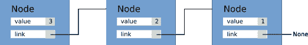

# 探索编译器

Python 是一种成熟且广泛使用的语言，人们对其性能的改进有着浓厚的兴趣，这包括直接将函数和方法编译成机器代码，而不是在解释器中执行指令。我们已经在第四章中看到了一个编译器的例子，即使用 Cython 进行 C 性能优化，其中 Python 代码通过添加类型被增强，编译成高效的 C 代码，并且解释器调用被绕过。

在本章中，我们将探讨两个项目——Numba 和 PyPy——它们以略微不同的方式处理编译。**Numba** 是一个设计用于即时编译小函数的库。Numba 不将 Python 代码转换为 C 代码，而是分析和直接编译 Python 函数到机器代码。**PyPy** 是一个替换解释器，它通过在运行时分析代码并自动优化慢速循环来工作。

这些工具被称为 **即时**（**Just-In-Time**，**JIT**）编译器，因为编译是在运行时而不是在运行代码之前（在其他情况下，编译器是在编译时或 AOT 调用）进行的。

本章要涵盖的主题列表如下：

+   开始使用 Numba

+   使用本地模式编译实现快速函数

+   理解和实现通用函数

+   JIT 类

+   设置 PyPy

+   使用 PyPy 运行粒子模拟器

+   其他有趣的编译器

# Numba

Numba 是由 NumPy 的原始作者 Travis Oliphant 在 2012 年启动的，作为一个在运行时使用 **低级虚拟机**（**LLVM**）工具链编译单个 Python 函数的库。

LLVM 是一套用于编写编译器的工具。LLVM 是语言无关的，用于编写广泛语言的编译器（一个重要例子是 clang 编译器）。LLVM 的一个核心方面是中间表示（LLVM IR），这是一种非常低级的、平台无关的语言，类似于汇编语言，它可以编译为特定目标平台的机器代码。

Numba 通过检查 Python 函数并使用 LLVM 编译它们到 IR 来工作。正如我们在上一章中看到的，当我们为变量和函数引入类型时，可以获得速度提升。Numba 实现了聪明的算法来猜测类型（这被称为类型推断），并为快速执行编译了类型感知版本的函数。

注意，Numba 是为了提高数值代码的性能而开发的。开发工作通常优先考虑优化那些大量使用 NumPy 数组的应用程序。

Numba 发展非常快，在版本之间可能会有实质性的改进，有时甚至会有向后不兼容的更改。为了跟上进度，请确保您参考每个版本的发布说明。在本章的其余部分，我们将使用 Numba 版本 0.30.1；请确保您安装了正确的版本，以避免任何错误。

本章中的完整代码示例可以在 `Numba.ipynb` 笔记本中找到。

# Numba 的第一步

开始使用 Numba 相对简单。作为一个示例，我们将实现一个计算数组平方和的函数。函数定义如下：

```py
    def sum_sq(a):
        result = 0
        N = len(a)
        for i in range(N):
            result += a[i]
        return result

```

要使用 Numba 设置此函数，只需应用 `nb.jit` 装饰器即可。

```py
    from numba import nb

    @nb.jit
    def sum_sq(a):
        ...

```

当应用 `nb.jit` 装饰器时，它不会做太多。然而，当函数第一次被调用时，Numba 将检测输入参数 `a` 的类型，并编译原始函数的专用、高性能版本。

要衡量 Numba 编译器带来的性能提升，我们可以比较原始函数和专用函数的运行时间。原始的未装饰函数可以通过 `py_func` 属性轻松访问。两个函数的运行时间如下：

```py
    import numpy as np

    x = np.random.rand(10000)

    # Original
    %timeit sum_sq.py_func(x)
    100 loops, best of 3: 6.11 ms per loop

    # Numba
    %timeit sum_sq(x)
    100000 loops, best of 3: 11.7 µs per loop

```

从前面的代码中，你可以看到 Numba 版本（11.7 µs）比 Python 版本（6.11 ms）快一个数量级。我们还可以将这种实现与 NumPy 标准运算符进行比较：

```py
    %timeit (x**2).sum()
    10000 loops, best of 3: 14.8 µs per loop

```

在这种情况下，Numba 编译的函数略快于 NumPy 向量化操作。Numba 版本额外速度的原因可能是与我们的 `sum_sq` 函数执行的就地操作相比，NumPy 版本在执行求和之前分配了一个额外的数组。

由于我们在 `sum_sq` 中没有使用特定于数组的函数，我们也可以尝试在常规 Python 浮点数列表上应用相同的函数。有趣的是，与列表推导相比，Numba 在这种情况下也能获得显著的速度提升。

```py
    x_list = x.tolist()
    %timeit sum_sq(x_list)
    1000 loops, best of 3: 199 µs per loop

    %timeit sum([x**2 for x in x_list])
    1000 loops, best of 3: 1.28 ms per loop

```

考虑到我们只需要应用一个简单的装饰器就能在不同数据类型上获得令人难以置信的速度提升，Numba 所做的看起来就像是魔法。在接下来的章节中，我们将深入了解 Numba 的工作原理，并评估 Numba 编译器的优点和局限性。

# 类型专用化

如前所述，`nb.jit` 装饰器通过在遇到新的参数类型时编译函数的专用版本来工作。为了更好地理解其工作原理，我们可以检查 `sum_sq` 示例中的装饰函数。

Numba 通过 `signatures` 属性公开专用类型。在 `sum_sq` 定义之后，我们可以通过访问 `sum_sq.signatures` 来检查可用的专用化，如下所示：

```py
    sum_sq.signatures
    # Output:
    # []

```

如果我们用特定的参数调用这个函数，例如一个 `float64` 数字数组，我们可以看到 Numba 如何即时编译一个专用版本。如果我们也对 `float32` 数组应用这个函数，我们可以看到一个新的条目被添加到 `sum_sq.signatures` 列表中：

```py
    x = np.random.rand(1000).astype('float64')
    sum_sq(x)
    sum_sq.signatures
    # Result:
    # [(array(float64, 1d, C),)]

    x = np.random.rand(1000).astype('float32')
    sum_sq(x)
    sum_sq.signatures
    # Result:
    # [(array(float64, 1d, C),), (array(float32, 1d, C),)]

```

可以通过传递签名到 `nb.jit` 函数来显式地为某些类型编译函数。

可以将单个签名作为包含我们希望接受的类型的元组传递。Numba 提供了 `nb.types` 模块中可以找到的多种类型，它们也存在于顶级 `nb` 命名空间中。如果我们想指定特定类型的数组，我们可以在类型本身上使用切片运算符 `[:]`。在以下示例中，我们演示了如何声明一个接受 `float64` 数组作为唯一参数的函数：

```py
    @nb.jit((nb.float64[:],))
    def sum_sq(a):

```

注意，当我们显式声明一个签名时，我们将无法使用其他类型，以下示例进行了演示。如果我们尝试将数组 `x` 作为 `float32` 传递，Numba 将引发一个 `TypeError`：

```py
    sum_sq(x.astype('float32'))
    # TypeError: No matching definition for argument type(s) 
    array(float32, 1d, C)

```

声明签名的另一种方式是通过类型字符串。例如，一个接受 `float64` 作为输入并返回 `float64` 作为输出的函数可以使用 `float64(float64)` 字符串声明。可以使用 `[:]` 后缀声明数组类型。将它们组合起来，我们可以按照以下方式为我们的 `sum_sq` 函数声明一个签名：

```py
    @nb.jit("float64(float64[:])")
    def sum_sq(a):

```

您也可以通过传递一个列表来传递多个签名：

```py
    @nb.jit(["float64(float64[:])",
             "float64(float32[:])"])
    def sum_sq(a):

```

# 对象模式与原生模式

到目前为止，我们已经展示了 Numba 在处理相对简单的函数时的行为。在这种情况下，Numba 工作得非常好，我们在数组和列表上获得了出色的性能。

从 Numba 获得的优化程度取决于 Numba 能够多好地推断变量类型以及它能够多好地将这些标准 Python 操作转换为快速的类型特定版本。如果发生这种情况，解释器将被绕过，我们可以获得类似于 Cython 的性能提升。

当 Numba 无法推断变量类型时，它仍然会尝试编译代码，在类型无法确定或某些操作不受支持时回退到解释器。在 Numba 中，这被称为 **对象模式**，与称为 **原生模式** 的无解释器场景相对。

Numba 提供了一个名为 `inspect_types` 的函数，有助于了解类型推断的有效性以及哪些操作被优化。作为一个例子，我们可以查看 `sum_sq` 函数推断出的类型：

```py
    sum_sq.inspect_types()

```

当调用此函数时，Numba 将打印出为函数的每个专用版本推断出的类型。输出由包含与变量及其类型相关的信息的块组成。例如，我们可以检查 `N = len(a)` 这一行：

```py
    # --- LINE 4 --- 
    #   a = arg(0, name=a)  :: array(float64, 1d, A)
    #   $0.1 = global(len: <built-in function len>)  :: 
    Function(<built-in function len>)
    #   $0.3 = call $0.1(a)  :: (array(float64, 1d, A),) -> int64
    #   N = $0.3  :: int64

    N = len(a)

```

对于每一行，Numba 都会打印出关于变量、函数和中间结果的详细描述。在前面的示例中，你可以看到（第二行），参数 `a` 被正确地识别为 `float64` 数字数组。在 `LINE 4`，`len` 函数的输入和返回类型也被正确地识别（并且可能已优化）为接受 `float64` 数字数组并返回 `int64`。

如果你滚动查看输出，你可以看到所有变量都有一个明确定义的类型。因此，我们可以确信 Numba 能够相当高效地编译代码。这种编译形式被称为 **原生模式**。

作为反例，我们可以看看如果我们编写一个包含不支持的操作的函数会发生什么。例如，截至版本 0.30.1，Numba 对字符串操作的支持有限。

我们可以实现一个连接一系列字符串的函数，并按以下方式编译它：

```py
    @nb.jit
    def concatenate(strings):
        result = ''
        for s in strings:
            result += s
        return result

```

现在，我们可以用字符串列表调用这个函数并检查其类型：

```py
    concatenate(['hello', 'world'])
    concatenate.signatures
    # Output: [(reflected list(str),)]
    concatenate.inspect_types()

```

Numba 将返回 `reflected list (str)` 类型的函数输出。例如，我们可以检查第 3 行是如何推断出来的。`concatenate.inspect_types()` 的输出如下所示：

```py
    # --- LINE 3 --- 
    #   strings = arg(0, name=strings)  :: pyobject
    #   $const0.1 = const(str, )  :: pyobject
    #   result = $const0.1  :: pyobject
    #   jump 6
    # label 6

    result = ''

```

你可以看到这次，每个变量或函数都是通用的 `pyobject` 类型，而不是特定的类型。这意味着在这种情况下，Numba 没有 Python 解释器的帮助无法编译这个操作。最重要的是，如果我们对原始函数和编译后的函数进行计时，我们会注意到编译后的函数大约比纯 Python 版本慢三倍：

```py
    x = ['hello'] * 1000
    %timeit concatenate.py_func(x)
    10000 loops, best of 3: 111 µs per loop

    %timeit concatenate(x)
    1000 loops, best of 3: 317 µs per loop

```

这是因为 Numba 编译器无法优化代码，并在函数调用中添加了一些额外的开销。

正如你可能已经注意到的，即使效率不高，Numba 也能无怨无悔地编译代码。主要原因在于 Numba 仍然能够以高效的方式编译代码的其他部分，而对于其他部分则回退到 Python 解释器。这种编译策略被称为 **对象模式**。

可以通过将 `nopython=True` 选项传递给 `nb.jit` 装饰器来强制使用原生模式。例如，如果我们将这个装饰器应用于我们的连接函数，我们会观察到 Numba 在第一次调用时抛出错误：

```py
    @nb.jit(nopython=True)
    def concatenate(strings):
        result = ''
        for s in strings:
            result += s
        return result

    concatenate(x)
    # Exception:
    # TypingError: Failed at nopython (nopython frontend)

```

这个特性对于调试和确保所有代码都快速且正确类型非常有用。

# Numba 和 NumPy

Numba 最初是为了方便提高使用 NumPy 数组的代码的性能而开发的。目前，许多 NumPy 功能都由编译器高效实现。

# Numba 中的通用函数

通用函数是在 NumPy 中定义的特殊函数，能够根据广播规则在不同的数组大小和形状上操作。Numba 的最佳特性之一是实现快速的 `ufuncs`。

我们已经在 第三章*，使用 NumPy 和 Pandas 的快速数组操作* 中看到了一些 `ufunc` 示例。例如，`np.log` 函数是一个 `ufunc`，因为它可以接受不同大小和形状的标量和数组。此外，接受多个参数的通用函数仍然遵循广播规则。接受多个参数的通用函数的例子有 `np.sum` 或 `np.difference`。

通用函数可以通过实现标量版本并使用`np.vectorize`函数来增强广播功能来在标准 NumPy 中定义。作为一个例子，我们将看到如何编写*Cantor 配对函数*。

配对函数是一个将两个自然数编码为单个自然数的函数，这样你可以轻松地在两种表示之间进行转换。Cantor 配对函数可以写成如下形式：

```py
    import numpy as np

    def cantor(a, b):
        return  int(0.5 * (a + b)*(a + b + 1) + b)

```

如前所述，可以使用`np.vectorized`装饰器在纯 Python 中创建一个 ufunc：

```py
    @np.vectorize
    def cantor(a, b):
        return  int(0.5 * (a + b)*(a + b + 1) + b)

    cantor(np.array([1, 2]), 2)
    # Result:
    # array([ 8, 12])

```

除了方便之外，在纯 Python 中定义通用函数并不很有用，因为它需要大量的函数调用，这些调用受解释器开销的影响。因此，ufunc 的实现通常在 C 或 Cython 中完成，但 Numba 凭借其便利性击败了所有这些方法。

为了执行转换，所需做的只是使用等效的装饰器`nb.vectorize`。我们可以比较标准`np.vectorized`版本的速度，在以下代码中称为`cantor_py`，以及使用标准 NumPy 操作实现相同功能的函数：

```py
    # Pure Python
    %timeit cantor_py(x1, x2)
    100 loops, best of 3: 6.06 ms per loop
    # Numba
    %timeit cantor(x1, x2)
    100000 loops, best of 3: 15 µs per loop
    # NumPy
    %timeit (0.5 * (x1 + x2)*(x1 + x2 + 1) + x2).astype(int)
    10000 loops, best of 3: 57.1 µs per loop

```

你可以看到 Numba 版本如何以很大的优势击败所有其他选项！Numba 工作得非常好，因为函数简单，可以进行类型推断。

通用函数的另一个优点是，由于它们依赖于单个值，它们的评估也可以并行执行。Numba 通过将`target="cpu"`或`target="gpu"`关键字参数传递给`nb.vectorize`装饰器，提供了一个轻松并行化此类函数的方法。

# 广义通用函数

通用函数的一个主要限制是它们必须在标量值上定义。广义通用函数（简称`gufunc`）是通用函数的扩展，它将数组作为过程。

一个经典的例子是矩阵乘法。在 NumPy 中，可以使用`np.matmul`函数进行矩阵乘法，该函数接受两个二维数组并返回另一个二维数组。`np.matmul`的一个示例用法如下：

```py
    a = np.random.rand(3, 3)
    b = np.random.rand(3, 3)

    c = np.matmul(a, b)
    c.shape
    # Result:
    # (3, 3)

```

如前所述，ufunc 会将操作广播到标量数组上，其自然推广将是广播到数组数组上。例如，如果我们取两个 3x3 矩阵的数组，我们期望`np.matmul`会匹配矩阵并取它们的乘积。在以下示例中，我们取包含 10 个形状为`(3, 3)`矩阵的数组。如果我们应用`np.matmul`，乘法将按矩阵方式应用，以获得包含 10 个结果的新数组（这些结果再次是`(3, 3)`矩阵）：

```py
    a = np.random.rand(10, 3, 3)
    b = np.random.rand(10, 3, 3)

    c = np.matmul(a, b)
    c.shape
    # Output
    # (10, 3, 3)

```

广播的常规规则将以类似的方式工作。例如，如果我们有一个 `(3, 3)` 矩阵的数组，它将具有 `(10, 3, 3)` 的形状，我们可以使用 `np.matmul` 来计算每个元素与单个 `(3, 3)` 矩阵的矩阵乘法。根据广播规则，我们得到单个矩阵将被重复以获得 `(10, 3, 3)` 的大小：

```py
    a = np.random.rand(10, 3, 3)
    b = np.random.rand(3, 3) # Broadcasted to shape (10, 3, 3)
    c = np.matmul(a, b)
    c.shape
    # Result:
    # (10, 3, 3)

```

Numba 通过 `nb.guvectorize` 装饰器支持高效通用函数的实现。作为一个例子，我们将实现一个函数，该函数计算两个数组之间的欧几里得距离作为一个 `gufunc`。要创建一个 `gufunc`，我们必须定义一个函数，该函数接受输入数组，以及一个输出数组，我们将在这里存储计算结果。

`nb.guvectorize` 装饰器需要两个参数：

+   输入和输出的类型：两个一维数组作为输入，一个标量作为输出

+   所说的布局字符串，它是输入和输出大小的表示；在我们的情况下，我们取两个相同大小的数组（任意表示为 `n`），并输出一个标量

在下面的示例中，我们展示了使用 `nb.guvectorize` 装饰器实现 `euclidean` 函数的方法：

```py
    @nb.guvectorize(['float64[:], float64[:], float64[:]'], '(n), (n) -
    > ()')
    def euclidean(a, b, out):
        N = a.shape[0]
        out[0] = 0.0
        for i in range(N):
            out[0] += (a[i] - b[i])**2

```

有几个非常重要的要点需要说明。可以预见的是，我们将输入 `a` 和 `b` 的类型声明为 `float64[:]`，因为它们是一维数组。然而，输出参数呢？它不是应该是一个标量吗？是的，然而，**Numba 将标量参数视为大小为 1 的数组**。这就是为什么它被声明为 `float64[:]`。

类似地，布局字符串表示我们有两个大小为 `(n)` 的数组，输出是一个标量，用空括号 `()` 表示。然而，输出数组将以大小为 1 的数组形式传递。

此外，请注意，我们从函数中不返回任何内容；所有输出都必须写入 `out` 数组。

布局字符串中的字母 `n` 完全任意；你可以选择使用 `k` 或其他你喜欢的字母。此外，如果你想组合不同大小的数组，你可以使用布局字符串，例如 `(n, m)`。

我们全新的 `euclidean` 函数可以方便地用于不同形状的数组，如下面的示例所示：

```py
    a = np.random.rand(2)
    b = np.random.rand(2)
    c = euclidean(a, b) # Shape: (1,)

    a = np.random.rand(10, 2)
    b = np.random.rand(10, 2)
    c = euclidean(a, b) # Shape: (10,)

    a = np.random.rand(10, 2)
    b = np.random.rand(2)
    c = euclidean(a, b) # Shape: (10,)

```

`euclidean` 的速度与标准 NumPy 相比如何？在下面的代码中，我们使用先前定义的 `euclidean` 函数与 NumPy 向量化版本进行基准测试：

```py
    a = np.random.rand(10000, 2)
    b = np.random.rand(10000, 2)

    %timeit ((a - b)**2).sum(axis=1)
    1000 loops, best of 3: 288 µs per loop

    %timeit euclidean(a, b)
    10000 loops, best of 3: 35.6 µs per loop

```

再次，Numba 版本在性能上大幅领先于 NumPy 版本！

# JIT 类

截至目前，Numba 不支持通用 Python 对象的优化。然而，这个限制对数值代码的影响并不大，因为它们通常只涉及数组和数学运算。

尽管如此，某些数据结构使用对象实现起来更为自然；因此，Numba 提供了对定义可以用于并编译为快速原生代码的类的支持。

请记住，这是最新（几乎是实验性的）功能之一，它非常有用，因为它允许我们将 Numba 扩展以支持那些难以用数组实现的快速数据结构。

作为示例，我们将展示如何使用 JIT 类实现一个简单的链表。链表可以通过定义一个包含两个字段的`Node`类来实现：一个值和列表中的下一个项目。如图所示，每个**Node**连接到下一个节点并持有值，最后一个节点包含一个断开链接，我们将其赋值为**None**：



在 Python 中，我们可以将`Node`类定义为如下：

```py
    class Node:
        def __init__(self, value):
            self.next = None
            self.value = value

```

我们可以通过创建另一个名为`LinkedList`的类来管理`Node`实例的集合。这个类将跟踪列表的头部（在先前的图中，这对应于**值**为**3**的**Node**）。为了在列表前面插入一个元素，我们可以简单地创建一个新的**Node**并将其链接到当前头部。

在以下代码中，我们开发了`LinkedList`的初始化函数和`LinkedList.push_back`方法，该方法使用前面概述的策略在列表前面插入一个元素：

```py
    class LinkedList:

        def __init__(self):
            self.head = None

        def push_front(self, value):
            if self.head == None:
                self.head = Node(value)
            else:
                # We replace the head
                new_head = Node(value)
                new_head.next = self.head
                self.head = new_head

```

为了调试目的，我们还可以实现一个`LinkedList.show`方法，该方法遍历并打印列表中的每个元素。该方法在下面的代码片段中展示：

```py
        def show(self):
            node = self.head
            while node is not None:
                print(node.value)
                node = node.next

```

在这一点上，我们可以测试我们的`LinkedList`并查看它是否表现正确。我们可以创建一个空列表，添加一些元素，并打印其内容。请注意，由于我们是在列表前面推入元素，最后插入的元素将是首先打印的：

```py
    lst = LinkedList()
    lst.push_front(1)
    lst.push_front(2)
    lst.push_front(3)
    lst.show()
    # Output:
    # 3
    # 2
    # 1

```

最后，我们可以实现一个函数，`sum_list`，它返回链表中元素的总和。我们将使用此方法来测量 Numba 和纯 Python 版本之间的差异：

```py
    @nb.jit
    def sum_list(lst):
        result = 0
        node = lst.head
        while node is not None:
            result += node.value
            node = node.next
        return result

```

如果我们测量原始`sum_list`版本和`nb.jit`版本的执行时间，我们会看到没有太大的差异。原因是 Numba 无法推断类的类型：

```py
    lst = LinkedList()
    [lst.push_front(i) for i in range(10000)]

    %timeit sum_list.py_func(lst)
    1000 loops, best of 3: 2.36 ms per loop

    %timeit sum_list(lst)
    100 loops, best of 3: 1.75 ms per loop

```

我们可以通过使用`nb.jitclass`装饰器编译`Node`和`LinkedList`类来提高`sum_list`的性能。

`nb.jitclass`装饰器接受一个包含属性类型的单个参数。在`Node`类中，属性类型为`value`的`int64`和`next`的`Node`。`nb.jitclass`装饰器还将编译为该类定义的所有方法。在深入代码之前，需要提出两个观察点。

首先，属性声明必须在定义类之前完成，但我们如何声明尚未定义的类型？Numba 提供了`nb.deferred_type()`函数，可用于此目的。

第二，`next`属性可以是`None`或`Node`实例。这被称为可选类型，Numba 提供了一个名为`nb.optional`的实用工具，允许你声明可以（可选地）为`None`的变量。

以下代码示例展示了这个`Node`类。正如你所见，`node_type`是使用`nb.deferred_type()`预先声明的。属性被声明为一个包含属性名和类型的对列表（也请注意`nb.optional`的使用）。在类声明之后，我们需要声明延迟类型：

```py
    node_type = nb.deferred_type()

    node_spec = [
        ('next', nb.optional(node_type)),
        ('value', nb.int64)
    ]

    @nb.jitclass(node_spec)
    class Node:
        # Body of Node is unchanged

    node_type.define(Node.class_type.instance_type)

```

`LinkedList`类可以很容易地编译，如下所示。所需做的只是定义`head`属性并应用`nb.jitclass`装饰器：

```py
    ll_spec = [
        ('head', nb.optional(Node.class_type.instance_type))
    ]

    @nb.jitclass(ll_spec)
    class LinkedList:
        # Body of LinkedList is unchanged

```

现在我们可以测量当我们传递一个 JIT `LinkedList`给`sum_list`函数时的执行时间：

```py
    lst = LinkedList()
    [lst.push_front(i) for i in range(10000)]

    %timeit sum_list(lst)
    1000 loops, best of 3: 345 µs per loop

    %timeit sum_list.py_func(lst)
    100 loops, best of 3: 3.36 ms per loop

```

有趣的是，当使用编译函数中的 JIT 类时，我们获得了与纯 Python 版本相比的显著性能提升。然而，从原始的`sum_list.py_func`中使用 JIT 类实际上会导致性能下降。确保你只在编译函数内部使用 JIT 类！

# Numba 的限制

有一些情况下，Numba 无法正确推断变量类型，并将拒绝编译。在以下示例中，我们定义了一个函数，它接受一个整数嵌套列表并返回每个子列表中元素的求和。在这种情况下，Numba 将引发`ValueError`并拒绝编译：

```py
    a = [[0, 1, 2], 
         [3, 4], 
         [5, 6, 7, 8]]

    @nb.jit
    def sum_sublists(a):
        result = []
        for sublist in a:
            result.append(sum(sublist))
        return result

    sum_sublists(a)
    # ValueError: cannot compute fingerprint of empty list

```

这个代码的问题在于 Numba 无法确定列表的类型，从而导致失败。解决这个问题的一个方法是通过用一个样本元素初始化列表并在结束时移除它来帮助编译器确定正确的类型：

```py
    @nb.jit
    def sum_sublists(a):
        result = [0]
        for sublist in a:
            result.append(sum(sublist))
        return result[1:]

```

在 Numba 编译器中尚未实现的其他特性包括函数和类定义、列表、集合和字典推导、生成器、`with`语句以及`try` `except`块。然而，值得注意的是，许多这些特性可能在将来得到支持。

# PyPy 项目

PyPy 是一个旨在提高 Python 解释器性能的非常雄心勃勃的项目。PyPy 提高性能的方式是在运行时自动编译代码中的慢速部分。

PyPy 是用一种称为 RPython 的特殊语言编写的（而不是 C 语言），这使得开发者能够快速且可靠地实现高级功能和改进。RPython 意味着*受限 Python*，因为它实现了一个针对编译器开发的 Python 语言的受限子集。

到目前为止，PyPy 版本 5.6 支持许多 Python 特性，并且是各种应用的一个可能选择。

PyPy 使用一种非常巧妙的策略来编译代码，称为*跟踪 JIT 编译*。最初，代码是使用解释器调用正常执行的。然后 PyPy 开始分析代码并识别最密集的循环。在识别完成后，编译器随后观察（跟踪）操作，并能够编译其优化、无解释器的版本。

一旦有了代码的优化版本，PyPy 就能比解释版本更快地运行慢速循环。

这种策略可以与 Numba 的做法进行对比。在 Numba 中，编译的单位是方法和函数，而 PyPy 的重点是慢速循环。总体而言，项目的重点也非常不同，因为 Numba 对数值代码的范围有限，并且需要大量的仪器，而 PyPy 的目标是替换 CPython 解释器。

在本节中，我们将演示并基准测试 PyPy 在我们的粒子模拟器应用程序上的使用。

# 设置 PyPy

PyPy 以预编译的二进制形式分发，可以从 [`pypy.org/download.html`](http://pypy.org/download.html) 下载，并且目前支持 Python 版本 2.7（PyPy 5.6 中的 beta 支持）和 3.3（PyPy 5.5 中的 alpha 支持）。在本章中，我们将演示 2.7 版本的使用。

一旦下载并解压 PyPy，你可以在解压存档的 `bin/pypy` 目录中找到解释器。你可以使用以下命令初始化一个新的虚拟环境，在该环境中我们可以使用以下命令安装额外的包：

```py
$ /path/to/bin/pypy -m ensurepip
$ /path/to/bin/pypy -m pip install virtualenv
$ /path/to/bin/virtualenv my-pypy-env

```

要激活环境，我们将使用以下命令：

```py
$ source my-pypy-env/bin/activate 

```

到目前为止，你可以通过输入 `python -V` 来验证二进制 Python 是否链接到 PyPy 可执行文件。到这一点，我们可以继续安装我们可能需要的包。截至版本 5.6，PyPy 对使用 Python C API 的软件支持有限（最著名的是 `numpy` 和 `matplotlib` 等包）。我们可以按照常规方式继续安装它们：

```py
(my-pypy-env) $ pip install numpy matplotlib

```

在某些平台上，安装 `numpy` 和 `matplotlib` 可能很棘手。你可以跳过安装步骤，并从我们将运行的脚本中移除这两个包的任何导入。

# 在 PyPy 中运行粒子模拟器

现在我们已经成功设置了 PyPy 安装，我们可以继续运行我们的粒子模拟器。作为第一步，我们将对来自 第一章，*基准测试和性能分析* 的粒子模拟器在标准 Python 解释器上进行计时。如果虚拟环境仍然处于活动状态，你可以输入命令 deactivate 退出环境。我们可以通过使用 `python -V` 命令来确认 Python 解释器是标准的：

```py
(my-pypy-env) $ deactivate
$ python -V
Python 3.5.2 :: Continuum Analytics, Inc.

```

到目前为止，我们可以使用 `timeit` 命令行界面来计时我们的代码：

```py
$ python -m timeit --setup "from simul import benchmark" "benchmark()"
10 loops, best of 3: 886 msec per loop

```

我们可以重新激活环境并运行与 PyPy 完全相同的代码。在 Ubuntu 上，你可能会在导入 `matplotlib.pyplot` 模块时遇到问题。你可以尝试执行以下 `export` 命令来修复问题，或者从 `simul.py` 中移除 `matplotlib` 的导入：

```py
$ export MPLBACKEND='agg'

```

现在，我们可以使用 PyPy 来计时代码：

```py
$ source my-pypy-env/bin/activate
Python 2.7.12 (aff251e54385, Nov 09 2016, 18:02:49)
[PyPy 5.6.0 with GCC 4.8.2]

(my-pypy-env) $ python -m timeit --setup "from simul import benchmark" "benchmark()"
WARNING: timeit is a very unreliable tool. use perf or something else for real measurements
10 loops, average of 7: 106 +- 0.383 msec per loop (using standard deviation)

```

注意，我们获得了很大的加速，超过八倍！然而，PyPy 警告我们 `timeit` 模块可能不可靠。我们可以使用 PyPy 建议的 `perf` 模块来确认我们的计时：

```py
(my-pypy-env) $ pip install perf
(my-pypy-env) $ python -m perf timeit --setup 'from simul import benchmark' 'benchmark()'
.......
Median +- std dev: 97.8 ms +- 2.3 ms

```

# 其他有趣的项目

多年来，许多项目试图通过多种策略提高 Python 的性能，但遗憾的是，许多项目失败了。截至目前，有一些项目幸存下来，并承诺将带来更快的 Python。

Numba 和 PyPy 是成熟的项目，多年来一直在稳步改进。功能持续被添加，并且它们对未来 Python 的前景有着巨大的承诺。

**Nuitka** 是由 Kay Hayen 开发的一个程序，它将 Python 代码编译成 C 语言。截至目前（版本 0.5.x），它提供了与 Python 语言的极致兼容性，并生成高效的代码，与 CPython 相比，实现了适度的性能提升。

Nuitka 与 Cython 在意义上相当不同，因为它专注于与 Python 语言的极致兼容性，并且不通过额外的结构扩展语言。

**Pyston** 是 Dropbox 开发的一个新的解释器，它为 JIT 编译器提供动力。它与 PyPy 有很大不同，因为它不使用追踪 JIT，而是使用逐方法 JIT（类似于 Numba 所做的）。Pyston，像 Numba 一样，也是建立在 LLVM 编译器基础设施之上的。

Pyston 目前仍处于早期开发阶段（alpha 版本），仅支持 Python 2.7。基准测试显示，它的速度比 CPython 快，但比 PyPy 慢；尽管如此，随着新功能的添加和兼容性的提高，它仍然是一个值得关注的有趣项目。

# 摘要

Numba 是一个工具，它在运行时编译 Python 函数的快速、专用版本。在本章中，我们学习了如何编译、检查和分析由 Numba 编译的函数。我们还学习了如何实现快速 NumPy 通用函数，这些函数在广泛的数值应用中非常有用。最后，我们使用 `nb.jitclass` 装饰器实现了更复杂的数据结构。

工具如 PyPy 允许我们在不改变 Python 程序的情况下运行，以获得显著的速度提升。我们展示了如何设置 PyPy，并评估了我们在粒子模拟应用程序上的性能提升。

我们也简要地描述了当前 Python 编译器的生态系统，并相互比较了它们。

在下一章中，我们将学习并发和异步编程。使用这些技术，我们将能够提高那些花费大量时间等待网络和磁盘资源的应用程序的响应性和设计。
