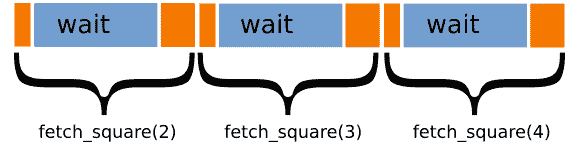
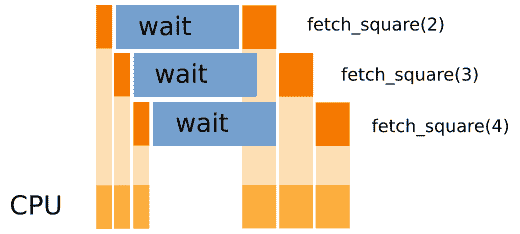
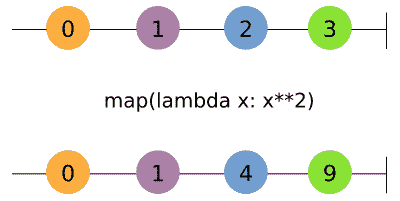
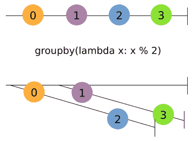
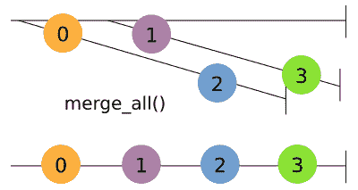
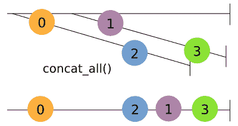
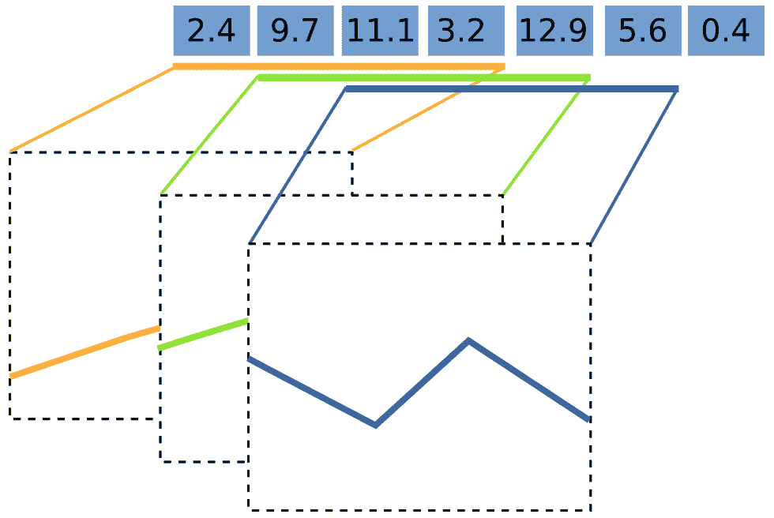

# 第六章：实现并发

到目前为止，我们已经探讨了如何通过使用巧妙的算法和更高效的机器代码来减少 CPU 执行的操作数量，从而测量和改进程序的性能。在本章中，我们将把重点转向那些大部分时间都花在等待比 CPU 慢得多的资源（如持久存储和网络资源）的程序。

异步编程是一种编程范式，有助于处理慢速和不可预测的资源（如用户），并且广泛用于构建响应式服务和用户界面。在本章中，我们将向您展示如何使用协程和响应式编程等技术以异步方式在 Python 中进行编程。

在本章中，我们将涵盖以下主题：

+   内存层次结构

+   回调

+   未来

+   事件循环

+   使用`asyncio`编写协程

+   将同步代码转换为异步代码

+   使用 RxPy 进行响应式编程

+   与可观察对象一起工作

+   使用 RxPY 构建内存监控器

# 异步编程

异步编程是一种处理慢速和不可预测资源（如用户）的方法。异步程序能够同时高效地处理多个资源，而不是空闲等待资源可用。以异步方式编程可能具有挑战性，因为必须处理可能以任何顺序到达、可能花费可变的时间或可能不可预测地失败的外部请求。在本节中，我们将通过解释主要概念和术语以及异步程序的工作方式来介绍这个主题。

# 等待 I/O

现代计算机使用不同类型的内存来存储数据和执行操作。一般来说，计算机拥有能够以快速速度运行的昂贵内存和更便宜、更丰富的内存，后者以较慢的速度运行，用于存储大量数据。

以下图表显示了内存层次结构：


在内存层次结构的顶部是 CPU 寄存器。这些是集成在 CPU 中的，用于存储和执行机器指令。在寄存器中访问数据通常需要一个时钟周期。这意味着如果 CPU 以 3 GHz 的速度运行，那么访问 CPU 寄存器中的一个元素所需的时间大约是 0.3 纳秒。

在**寄存器**层之下，你可以找到 CPU 缓存，它由多个级别组成，并集成在处理器中。**缓存**的运行速度略慢于**寄存器**，但处于同一数量级。

层次结构中的下一项是主存储器（**RAM**），它能够存储更多的数据，但比缓存慢。从内存中检索一个项目可能需要几百个时钟周期。

在底层，你可以找到持久存储，例如旋转磁盘（HDD）和**固态硬盘**（**SSD**）。这些设备存储的数据最多，比主存储慢几个数量级。一个 HDD 可能需要几毫秒来定位和检索一个项目，而 SSD 则快得多，只需几分之一毫秒。

为了将每种存储类型的相对速度置于一个可比较的视角，假设 CPU 的时钟速度大约为一秒，那么对寄存器的访问就相当于从桌子上拿起一支笔。对缓存的访问则相当于从书架上取下一本书。在层次结构中继续向上，对 RAM 的访问将相当于洗衣服（比缓存慢大约二十倍）。当我们转向持久存储时，情况就大不相同了。从 SSD 中检索一个元素将相当于进行四天的旅行，而从 HDD 中检索一个元素可能需要长达六个月！如果我们转向通过网络访问资源，时间可能会进一步延长。

从前面的例子中，应该很明显，从存储和其他 I/O 设备访问数据比 CPU 慢得多；因此，非常重要的是要妥善处理这些资源，以确保 CPU 不会无目的地等待。这可以通过精心设计软件来实现，该软件能够同时管理多个正在进行中的请求。

# 并发

并发是一种实现能够同时处理多个请求的系统的方法。其思想是，我们可以在等待资源可用时继续处理其他资源。并发通过将任务分割成可以无序执行的小子任务来实现，这样多个任务就可以在不等待前一个任务完成的情况下部分地向前推进。

作为第一个例子，我们将描述如何实现对慢速网络资源的并发访问。假设我们有一个将数字平方的 Web 服务，我们的请求和响应之间的时间大约为一秒。我们可以实现`network_request`函数，该函数接受一个数字并返回一个包含操作成功信息和结果的字典。我们可以使用`time.sleep`函数来模拟这样的服务，如下所示：

```py
    import time

    def network_request(number):
        time.sleep(1.0)
        return {"success": True, "result": number ** 2}

```

我们还将编写一些额外的代码来执行请求，验证请求是否成功，并打印结果。在下面的代码中，我们定义了`fetch_square`函数，并使用它通过调用`network_request`来计算数字二的平方：

```py
    def fetch_square(number):
        response = network_request(number)
        if response["success"]:
            print("Result is: {}".format(response["result"]))

    fetch_square(2)
    # Output:
    # Result is: 4

```

由于网络速度慢，从网络上获取一个数字将需要一秒钟。如果我们想计算多个数字的平方呢？我们可以调用`fetch_square`函数，该函数将在前一个请求完成后立即启动网络请求：

```py
    fetch_square(2)
    fetch_square(3)
    fetch_square(4)
    # Output:
    # Result is: 4
    # Result is: 9
    # Result is: 16

```

之前的代码将需要三秒钟来运行，但这并不是我们能做的最好的。等待前一个结果完成是不必要的，因为我们实际上可以提交多个请求并并行等待它们。

在下面的图中，三个任务被表示为方框。CPU 处理和提交请求所花费的时间用橙色表示，而等待时间用蓝色表示。您可以看到，大部分时间都花在等待资源上，而我们的机器闲置，什么也不做：



理想情况下，我们希望在等待已提交的任务完成的同时开始其他新的任务。在下面的图中，您可以看到，当我们提交请求到**fetch_square(2)**后，我们可以立即开始准备**fetch_square(3)**等等。这使我们能够减少 CPU 的等待时间，并在结果可用时立即开始处理：



这种策略之所以可行，是因为这三个请求是完全独立的，我们不需要等待前一个任务的完成就可以开始下一个任务。此外，请注意，单个 CPU 可以轻松地处理这种场景。虽然将工作分配到多个 CPU 可以进一步提高执行速度，但如果等待时间与处理时间相比很大，那么速度提升将是微不足道的。

要实现并发，需要不同的思考和编码方式；在接下来的章节中，我们将展示实现健壮并发应用程序的技术和最佳实践。

# 回调

我们迄今为止看到的代码会在资源可用之前阻塞程序的执行。负责等待的调用是`time.sleep`。为了使代码开始处理其他任务，我们需要找到一种方法来避免阻塞程序流程，以便程序的其余部分可以继续处理其他任务。

实现这种行为的最简单方法是通过回调。这种策略与我们请求出租车时所做的非常相似。

想象一下，你正在一家餐厅，已经喝了几杯酒。外面在下雨，你也不想坐公交车；因此，你要求叫一辆出租车，并让他们在你外面时打电话给你，这样你就可以出来，不必在雨中等待。

在这种情况下，你所做的是请求一辆出租车（即慢速资源），但你不是在外面等待出租车到达，而是提供你的电话号码和指示（回调），这样他们准备好时你可以出来，然后回家。

现在，我们将展示这种机制如何在代码中工作。我们将比较`time.sleep`的阻塞代码与等效的非阻塞代码`threading.Timer`。

对于这个例子，我们将编写一个函数`wait_and_print`，该函数将阻塞程序执行一秒钟，然后打印一条消息：

```py
    def wait_and_print(msg):
        time.sleep(1.0)
        print(msg)

```

如果我们想以非阻塞的方式编写相同的函数，我们可以使用`threading.Timer`类。我们可以通过传递我们想要等待的时间量和回调函数来初始化一个`threading.Timer`实例。**回调**是一个当计时器到期时将被调用的函数。请注意，我们还需要调用`Timer.start`方法来激活计时器：

```py
    import threading

    def wait_and_print_async(msg):
        def callback():
            print(msg)

        timer = threading.Timer(1.0, callback)
        timer.start()

```

`wait_and_print_async`函数的一个重要特性是，没有任何语句会阻塞程序的执行流程。

`threading.Timer`是如何在不阻塞的情况下等待的呢？

`threading.Timer`使用的策略是启动一个新的线程，该线程能够并行执行代码。如果这让你感到困惑，不要担心，我们将在接下来的章节中详细探讨线程和并行编程。

这种在响应某些事件时注册回调以执行的技术通常被称为*好莱坞原则*。这是因为，在好莱坞试镜一个角色后，你可能会被告知"<q>不要给我们打电话，我们会给你打电话</q>"，这意味着他们不会立即告诉你是否选择了你，但如果他们选择了你，他们会给你打电话。

为了突出`wait_and_print`的阻塞和非阻塞版本之间的差异，我们可以测试和比较两个版本的执行。在输出注释中，等待时间由`<wait...>`表示：

```py
    # Syncronous
    wait_and_print("First call")
    wait_and_print("Second call")
    print("After call")
    # Output:
    # <wait...>
    # First call  
    # <wait...>
    # Second call
    # After call
    # Async
    wait_and_print_async("First call async")
    wait_and_print_async("Second call async")
    print("After submission")
    # Output:
    # After submission 
    # <wait...>
    # First call
    # Second call

```

同步版本的行为非常熟悉。代码等待一秒钟，打印`First call`，然后等待另一秒钟，接着打印`Second call`和`After call`消息。

在异步版本中，`wait_and_print_async`*提交*（而不是*执行*）那些调用，并立即继续。你可以通过确认“提交后”消息立即打印出来看到这个机制的作用。

在这个前提下，我们可以通过使用回调重写我们的`network_request`函数来探索一个稍微复杂的情况。在下面的代码中，我们定义了`network_request_async`函数。`network_request_async`与其阻塞版本之间最大的区别是`network_request_async`*不返回任何内容*。这是因为我们在调用`network_request_async`时仅提交请求，但值只有在请求完成时才可用。

如果我们无法返回任何内容，我们如何传递请求的结果？与其返回值，我们不如将结果作为参数传递给`on_done`回调函数。

函数的其余部分包括向`timer.Timer`类提交一个回调（称为`timer_done`），当它准备好时将调用`on_done`：

```py
    def network_request_async(number, on_done):

        def timer_done():
            on_done({"success": True, 
                     "result": number ** 2})

        timer = threading.Timer(1.0, timer_done)
        timer.start()

```

`network_request_async`的使用与`timer.Timer`非常相似；我们只需传递我们想要平方的数字和一个将在结果准备好时接收结果的回调函数。这将在下面的代码片段中演示：

```py
    def on_done(result):
        print(result)

    network_request_async(2, on_done)

```

现在，如果我们提交多个网络请求，我们会注意到调用是并发执行的，并不会阻塞代码：

```py
    network_request_async(2, on_done)
    network_request_async(3, on_done)
    network_request_async(4, on_done)
    print("After submission")

```

为了在`fetch_square`中使用`network_request_async`，我们需要修改代码以使用异步构造。在下面的代码中，我们通过定义和传递`on_done`回调到`network_request_async`来修改`fetch_square`：

```py
    def fetch_square(number):
        def on_done(response):
            if response["success"]:
                print("Result is: {}".format(response["result"]))

        network_request_async(number, on_done)

```

你可能已经注意到，异步代码比它的同步版本要复杂得多。这是因为每次我们需要检索某个结果时，都必须编写和传递一个回调，导致代码变得嵌套且难以跟踪。

# 期货

期货是一种更方便的模式，可以用来跟踪异步调用的结果。在前面的代码中，我们看到我们不是返回值，而是接受回调，并在结果准备好时传递结果。值得注意的是，到目前为止，还没有简单的方法来跟踪资源的状态。

期货是一个抽象，帮助我们跟踪请求的资源，并等待它们变得可用。在 Python 中，你可以在`concurrent.futures.Future`类中找到期货的实现。可以通过不带参数调用其构造函数来创建`Future`实例：

```py
    fut = Future()
    # Result:
    # <Future at 0x7f03e41599e8 state=pending>

```

期货代表一个尚未可用的值。你可以看到它的字符串表示报告了结果当前的状态，在我们的例子中，仍然是挂起的。为了使结果可用，我们可以使用`Future.set_result`方法：

```py
    fut.set_result("Hello")
    # Result:
    # <Future at 0x7f03e41599e8 state=finished returned str>

    fut.result()
    # Result:
    # "Hello"

```

你可以看到，一旦我们设置了结果，`Future`将报告任务已完成，并且可以使用`Future.result`方法访问。还可能订阅一个回调到期货，以便一旦结果可用，回调就会被执行。要附加回调，只需将一个函数传递给`Future.add_done_callback`方法。当任务完成时，该函数将以`Future`实例作为其第一个参数被调用，并且可以使用`Future.result()`方法检索结果：

```py
    fut = Future()
    fut.add_done_callback(lambda future: print(future.result(), flush=True))
    fut.set_result("Hello")
    # Output:
    # Hello

```

为了了解期货在实际中的应用，我们将`network_request_async`函数修改为使用期货。想法是，这次，我们不是返回空值，而是返回一个`Future`，它会为我们跟踪结果。注意两点：

+   我们不需要接受`on_done callback`，因为回调可以在之后使用`Future.add_done_callback`方法连接。此外，我们将通用的`Future.set_result`方法作为`threading.Timer`的回调。

+   这次我们能够返回一个值，从而使代码与我们在上一节中看到的阻塞版本更加相似：

```py
    from concurrent.futures import Future

    def network_request_async(number):
        future = Future()
        result = {"success": True, "result": number ** 2}
        timer = threading.Timer(1.0, lambda: future.set_result(result))
        timer.start()
        return future

    fut = network_request_async(2)

```

尽管在这些例子中我们直接实例化和管理期货；在实际应用中，期货是由框架处理的。

如果你执行前面的代码，将不会发生任何事情，因为代码只包含准备和返回一个`Future`实例。为了启用对未来的进一步操作，我们需要使用`Future.add_done_callback`方法。在下面的代码中，我们将`fetch_square`函数调整为使用 futures：

```py
    def fetch_square(number):
        fut = network_request_async(number)

        def on_done_future(future):
            response = future.result()
            if response["success"]:
                print("Result is: {}".format(response["result"]))

        fut.add_done_callback(on_done_future)

```

代码看起来仍然与回调版本非常相似。Futures 是处理回调的不同且稍微方便一些的方式。Futures 还有优势，因为它们可以跟踪资源状态，取消（取消调度）已安排的任务，并且更自然地处理异常。

# 事件循环

到目前为止，我们已经使用操作系统线程实现了并行性。然而，在许多异步框架中，并发任务的协调是由**事件循环**管理的。

事件循环背后的想法是持续监控各种资源的状态（例如，网络连接和数据库查询），并在事件发生时（例如，当资源就绪或计时器过期时）触发回调的执行。

为什么不坚持使用线程呢？

有时人们更喜欢事件循环，因为每个执行单元永远不会同时运行，这可以简化处理共享变量、数据结构和资源。阅读下一章了解更多关于并行执行及其缺点的详细信息。

作为第一个例子，我们将实现一个无线程版本的`threading.Timer`。我们可以定义一个`Timer`类，它将接受一个超时时间，并实现一个`Timer.done`方法，如果计时器已过期则返回`True`：

```py
    class Timer:

        def __init__(self, timeout):
            self.timeout = timeout
            self.start = time.time()

        def done(self):
            return time.time() - self.start > self.timeout

```

要确定计时器是否已过期，我们可以编写一个循环，通过调用`Timer.done`方法连续检查计时器状态。当计时器过期时，我们可以打印一条消息并退出循环：

```py
    timer = Timer(1.0)

    while True:
        if timer.done():
            print("Timer is done!")
            break

```

通过这种方式实现计时器，执行流程永远不会被阻塞，原则上我们可以在 while 循环内部做其他工作。

通过循环不断轮询等待事件发生，通常被称为*忙等待*。

理想情况下，我们希望附加一个自定义函数，当计时器响起时执行，就像我们在`threading.Timer`中做的那样。为此，我们可以实现一个方法，`Timer.on_timer_done`，它将接受一个回调，当计时器响起时执行：

```py
    class Timer:
       # ... previous code 
       def on_timer_done(self, callback):
            self.callback = callback

```

注意，`on_timer_done`仅仅存储了回调的引用。监控事件并执行回调的是循环。这一概念如下所示。而不是使用打印函数，循环将在适当的时候调用`timer.callback`：

```py
    timer = Timer(1.0)
    timer.on_timer_done(lambda: print("Timer is done!"))

    while True:
        if timer.done():
            timer.callback()
            break

```

如你所见，异步框架正在开始占据一席之地。我们在循环之外所做的所有事情只是定义计时器和回调，而循环则负责监控计时器并执行相关的回调。我们可以通过实现对多个计时器的支持来进一步扩展我们的代码。

实现多个计时器的一种自然方式是将几个`Timer`实例添加到一个列表中，并修改我们的事件循环，使其定期检查所有计时器，并在需要时调度回调。在下面的代码中，我们定义了两个计时器，并将它们各自附加了一个回调。这些计时器被添加到列表`timers`中，该列表由我们的事件循环持续监控。一旦计时器完成，我们就执行回调并将事件从列表中删除：

```py
    timers = []

    timer1 = Timer(1.0)
    timer1.on_timer_done(lambda: print("First timer is done!"))

    timer2 = Timer(2.0)
    timer2.on_timer_done(lambda: print("Second timer is done!"))

    timers.append(timer1)
    timers.append(timer2)

    while True:
        for timer in timers:
            if timer.done():
                timer.callback()
                timers.remove(timer)
        # If no more timers are left, we exit the loop 
        if len(timers) == 0:
            break

```

事件循环的主要限制是，由于执行流程是由一个持续运行的循环管理的，因此它**永远不会使用阻塞调用**。如果我们在这个循环中使用任何阻塞语句（例如`time.sleep`），你可以想象事件监控和回调调度将停止，直到阻塞调用完成。

为了避免这种情况，我们不是使用阻塞调用，如`time.sleep`，而是让事件循环在资源准备好时检测并执行回调。通过不阻塞执行流程，事件循环可以自由地以并发方式监控多个资源。

事件的通知通常是通过操作系统调用（例如`select` Unix 工具）来实现的，这些调用会在事件准备好时（与忙等待相反）恢复程序的执行。

Python 标准库包括一个非常方便的事件循环基于的并发框架，`asyncio`，这将是下一节的主题。

# asyncio 框架

到现在为止，你应该已经对并发的工作原理以及如何使用回调和未来有了坚实的基础。现在我们可以继续学习如何使用从版本 3.4 开始的标准库中存在的`asyncio`包。我们还将探索全新的`async`/`await`语法，以非常自然的方式处理异步编程。

作为第一个示例，我们将看到如何使用`asyncio`检索和执行一个简单的回调。可以通过调用`asyncio.get_event_loop()`函数来检索`asyncio`循环。我们可以使用`loop.call_later`来调度一个回调执行，该函数接受秒数延迟和回调。我们还可以使用`loop.stop`方法来停止循环并退出程序。要开始处理计划中的调用，必须启动循环，这可以通过`loop.run_forever`来完成。以下示例通过调度一个将打印消息并停止循环的回调来演示这些基本方法的用法：

```py
    import asyncio

    loop = asyncio.get_event_loop()

    def callback():
        print("Hello, asyncio")
        loop.stop()

    loop.call_later(1.0, callback)
    loop.run_forever()

```

# 协程

回调函数的一个主要问题在于，它们要求你将程序执行分解成小的函数，这些函数将在某个事件发生时被调用。正如我们在前面的章节中看到的，回调函数很快就会变得繁琐。

协程是另一种，也许更自然的方法，将程序执行分解成块。它们允许程序员编写类似于同步代码的代码，但将以异步方式执行。你可以把协程想象成一个可以被停止和恢复的函数。协程的基本例子是生成器。

生成器可以在 Python 中使用函数内的 `yield` 语句定义。在下面的例子中，我们实现了 `range_generator` 函数，它从 `0` 到 `n` 产生并返回值。我们还添加了一个打印语句来记录生成器的内部状态：

```py
    def range_generator(n):
        i = 0
        while i < n:
            print("Generating value {}".format(i))
            yield i
            i += 1

```

当我们调用 `range_generator` 函数时，代码不会立即执行。注意，当执行以下代码片段时，没有任何内容打印到输出。相反，返回了一个 *生成器对象*：

```py
    generator = range_generator(3)
    generator
    # Result:
    # <generator object range_generator at 0x7f03e418ba40>

```

为了开始从生成器中提取值，必须使用 `next` 函数：

```py
    next(generator)
    # Output:
    # Generating value 0

    next(generator)
    # Output:
    # Generating value 1

```

注意，每次我们调用 `next` 时，代码会运行直到遇到下一个 `yield` 语句，并且必须发出另一个 `next` 语句来恢复生成器的执行。你可以把 `yield` 语句看作是一个断点，在那里我们可以停止和恢复执行（同时保持生成器的内部状态）。这种停止和恢复执行的能力可以被事件循环利用，以实现并发。

也可以通过 `yield` 语句在生成器中 *注入*（而不是 *提取*）值。在下面的例子中，我们声明了一个名为 parrot 的函数，它将重复发送的每条消息。为了允许生成器接收一个值，你可以将 `yield` 赋值给一个变量（在我们的例子中，它是 `message = yield`）。要在生成器中插入值，我们可以使用 `send` 方法。在 Python 世界中，既能接收值又能产生值的生成器被称为 *基于生成器的协程*：

```py
    def parrot():
        while True:
            message = yield
            print("Parrot says: {}".format(message))

    generator = parrot()
    generator.send(None)
    generator.send("Hello")
    generator.send("World")

```

注意，在我们开始发送消息之前，我们还需要发出 `generator.send(None)`；这是为了启动函数执行并带我们到第一个 `yield` 语句。另外，注意 `parrot` 中有一个无限循环；如果我们不使用生成器来实现这个循环，我们将陷入无限循环中！

在这种情况下，你可以想象事件循环如何在不阻塞整个程序执行的情况下部分地推进这些生成器。你也可以想象，只有在某些资源准备好时，生成器才能被推进，从而消除了回调的需要。

使用 `asyncio` 可以通过 `yield` 语句实现协程。然而，自 Python 3.5 版本以来，Python 支持使用更直观的语法定义强大的协程。

使用 `asyncio` 定义协程，你可以使用 `async def` 语句：

```py
    async def hello():
        print("Hello, async!")

    coro = hello()
    coro
    # Output:
    # <coroutine object hello at 0x7f314846bd58>

```

如你所见，如果我们调用 `hello` 函数，函数体不会立即执行，而是返回一个 *协程对象*。`asyncio` 协程不支持 `next`，但它们可以很容易地通过使用 `run_until_complete` 方法在 `asyncio` 事件循环中运行：

```py
    loop = asyncio.get_event_loop()
    loop.run_until_complete(coro)

```

使用 `async def` 语句定义的协程也被称为 *原生协程*。

`asyncio` 模块提供了资源（称为 *awaitables*），这些资源可以通过 `await` 语法在协程内部请求。例如，如果我们想等待一段时间然后执行一个语句，我们可以使用 `asyncio.sleep` 函数：

```py
    async def wait_and_print(msg):
        await asyncio.sleep(1)
        print("Message: ", msg)

    loop.run_until_complete(wait_and_print("Hello"))

```

结果是漂亮的、干净的代码。我们正在编写功能齐全的异步代码，而没有回调的所有丑陋之处！

你可能已经注意到了 `await` 如何为事件循环提供一个断点，这样在等待资源的同时，事件循环可以继续运行并并发管理其他协程。

更好的是，协程也是 `awaitable` 的，我们可以使用 `await` 语句来异步地链式调用协程。在下面的示例中，我们通过将 `time.sleep` 调用替换为 `asyncio.sleep` 来重写我们之前定义的 `network_request` 函数：

```py
    async def network_request(number):
         await asyncio.sleep(1.0)
         return {"success": True, "result": number ** 2}

```

我们可以通过重新实现 `fetch_square` 来跟进。正如你所看到的，我们可以直接等待 `network_request`，而不需要额外的 futures 或回调。

```py
    async def fetch_square(number):
         response = await network_request(number)
         if response["success"]:
             print("Result is: {}".format(response["result"]))

```

我们可以使用 `loop.run_until_complete` 单独执行协程：

```py
    loop.run_until_complete(fetch_square(2))
    loop.run_until_complete(fetch_square(3))
    loop.run_until_complete(fetch_square(4))

```

使用 `run_until_complete` 运行任务对于测试和调试来说是可行的。然而，我们的程序大多数情况下将以 `loop.run_forever` 启动，并且我们需要在循环已经运行时提交我们的任务。

`asyncio` 提供了 `ensure_future` 函数，该函数安排协程（以及 futures）的执行。`ensure_future` 可以通过简单地传递我们想要安排的协程来使用。以下代码将安排多个并发执行的 `fetch_square` 调用：

```py
    asyncio.ensure_future(fetch_square(2))
    asyncio.ensure_future(fetch_square(3))
    asyncio.ensure_future(fetch_square(4))

    loop.run_forever()
    # Hit Ctrl-C to stop the loop

```

作为额外的好处，当传递一个协程时，`asyncio.ensure_future` 函数将返回一个 `Task` 实例（它是 `Future` 的子类），这样我们就可以利用 `await` 语法，而不必放弃常规未来的资源跟踪能力。

# 将阻塞代码转换为非阻塞代码

虽然 `asyncio` 支持以异步方式连接到资源，但在某些情况下需要使用阻塞调用。例如，当第三方 API 仅公开阻塞调用（例如，许多数据库库）时，以及执行长时间运行的计算时，这种情况会发生。在本小节中，我们将学习如何处理阻塞 API 并使其与 `asyncio` 兼容。

处理阻塞代码的有效策略是在单独的线程中运行它。线程在 **操作系统** （**OS**） 级别实现，并允许并行执行阻塞代码。为此，Python 提供了 `Executor` 接口，用于在单独的线程中运行任务，并使用未来来监控它们的进度。

您可以通过从 `concurrent.futures` 模块导入它来初始化 `ThreadPoolExecutor`。执行器将启动一组线程（称为 `workers`），它们将等待执行我们向它们投递的任何任务。一旦提交了一个函数，执行器将负责将其执行调度到可用的工作线程，并跟踪结果。可以使用 `max_workers` 参数来选择线程数。

注意，一旦任务完成，执行器不会销毁一个线程。这样做可以减少与线程创建和销毁相关的成本。

在以下示例中，我们创建了一个具有三个工作者的 `ThreadPoolExecutor`，并提交了一个 `wait_and_return` 函数，该函数将阻塞程序执行一秒钟并返回一个消息字符串。然后我们使用 `submit` 方法来安排其执行：

```py
    from concurrent.futures import ThreadPoolExecutor
    executor = ThreadPoolExecutor(max_workers=3)

    def wait_and_return(msg):
        time.sleep(1)
        return msg

    executor.submit(wait_and_return, "Hello. executor")
    # Result:
    # <Future at 0x7ff616ff6748 state=running>

```

`executor.submit` 方法立即安排函数并返回一个未来。可以使用 `loop.run_in_executor` 方法来管理 `asyncio` 中的任务执行，该方法与 `executor.submit` 工作方式非常相似：

```py
    fut = loop.run_in_executor(executor, wait_and_return, "Hello, asyncio 
    executor")
    # <Future pending ...more info...>

```

`run_in_executor` 方法也会返回一个 `asyncio.Future` 实例，可以从其他代码中等待，主要区别在于未来将不会运行，直到我们开始循环。我们可以使用 `loop.run_until_complete` 来运行并获取响应：

```py
    loop.run_until_complete(fut)
    # Result:
    # 'Hello, executor'

```

作为实际示例，我们可以使用这项技术来实现多个网页的并发获取。为此，我们将导入流行的（阻塞的）`requests` 库，并在执行器中运行 `requests.get` 函数：

```py
    import requests

    async def fetch_urls(urls):
        responses = []
        for url in urls:
            responses.append(await loop.run_in_executor
                                (executor, requests.get, url))
        return responses

    loop.run_until_complete(fetch_ruls(['http://www.google.com', 
                                        'http://www.example.com',
                                        'http://www.facebook.com']))
    # Result
    # []

```

此版本的 `fetch_url` 不会阻塞执行，并允许 `asyncio` 中的其他协程运行；然而，它并不理想，因为函数不会并行获取 URL。为此，我们可以使用 `asyncio.ensure_future` 或使用 `asyncio.gather` 便利函数，该函数将一次性提交所有协程并收集结果。这里展示了 `asyncio.gather` 的用法：

```py
    def fetch_urls(urls):
        return asyncio.gather(*[loop.run_in_executor
                                 (executor, requests.get, url) 
                                 for url in urls])

```

使用此方法可以并行获取的 URL 数量将取决于您拥有的工作线程数量。为了避免这种限制，您应该使用原生的非阻塞库，例如 `aiohttp`。

# 响应式编程

响应式编程是一种旨在构建更好的并发系统的范式。响应式应用程序旨在符合响应式宣言中例示的要求：

+   **响应式**：系统立即响应用户。

+   **弹性**：系统能够处理不同级别的负载，并能适应不断增长的需求。

+   **弹性**：系统优雅地处理故障。这是通过模块化和避免单一故障点来实现的。

+   **消息驱动**：系统不应阻塞并利用事件和消息。消息驱动型应用程序有助于实现所有先前的要求。

如您所见，反应式系统的意图非常崇高，但反应式编程究竟是如何工作的呢？在本节中，我们将通过使用 RxPy 库来学习反应式编程的原则。

RxPy 库是 ReactiveX ([`reactivex.io/`](http://reactivex.io/)) 的一部分，ReactiveX 是一个实现多种语言反应式编程工具的项目。

# 可观察对象

如同其名所暗示的，反应式编程的主要思想是*响应*事件。在前一节中，我们通过回调示例看到了这个想法的一些例子；您订阅它们，回调在事件发生时立即执行。

在反应式编程中，这种想法通过将事件视为数据流来扩展。这可以通过在 RxPy 中展示此类数据流的示例来体现。可以使用 `Observable.from_iterable` 工厂方法从迭代器创建数据流，如下所示：

```py
    from rx import Observable
    obs = Observable.from_iterable(range(4))

```

为了从 `obs` 接收数据，我们可以使用 `Observable.subscribe` 方法，该方法将为数据源发出的每个值执行我们传递的函数：

```py
    obs.subscribe(print)
    # Output:
    # 0
    # 1
    # 2
    # 3

```

您可能已经注意到，可观察对象就像列表或更一般地说，迭代器一样是有序集合。这不是巧合。

“可观察”一词来自观察者和可迭代的组合。一个*观察者*是一个对它观察的变量的变化做出反应的对象，而一个*可迭代*是一个能够产生并跟踪迭代器的对象。

在 Python 中，迭代器是定义了 `__next__` 方法的对象，并且可以通过调用 `next` 提取其元素。迭代器通常可以通过使用 `iter` 从集合中获得；然后我们可以使用 `next` 或 `for` 循环提取元素。一旦从迭代器中消耗了一个元素，我们就不能回退。我们可以通过从列表创建迭代器来演示其用法：

```py
    collection = list([1, 2, 3, 4, 5])
    iterator = iter(collection)

    print("Next")
    print(next(iterator))
    print(next(iterator))

    print("For loop")
    for i in iterator:
         print(i)

    # Output:
    # Next
    # 1
    # 2
    # For loop
    # 3
    # 4
    # 5

```

您可以看到，每次我们调用 `next` 或迭代时，迭代器都会产生一个值并前进。从某种意义上说，我们是从迭代器中“拉取”结果。

迭代器听起来很像生成器；然而，它们更为通用。在 Python 中，生成器是由使用 yield 表达式的函数返回的。正如我们所见，生成器支持 `next`，因此，它们是迭代器的一个特殊类别。

现在你可以欣赏到迭代器和可观察对象之间的对比。可观察对象在准备好时将数据流 *推送* 给我们，但这不仅仅是这样。可观察对象还能告诉我们何时出现错误以及何时没有更多数据。实际上，可以注册更多的回调到 `Observable.subscribe` 方法。在以下示例中，我们创建了一个可观察对象，并注册了回调，当有下一个项目可用时使用 `on_next` 调用，当没有更多数据时使用 `on_completed` 参数：

```py
    obs = Observable.from_iter(range(4))
    obs.subscribe(on_next=lambda x: print(on_next="Next item: {}"),
                  on_completed=lambda: print("No more data"))
    # Output:
    # Next element: 0
    # Next element: 1
    # Next element: 2
    # Next element: 3
    # No more data

```

这个与迭代器的类比很重要，因为我们可以使用与迭代器相同的技巧来处理事件流。

RxPy 提供了可以用来创建、转换、过滤和分组可观察对象的操作符。响应式编程的强大之处在于，这些操作返回其他可观察对象，可以方便地链接和组合在一起。为了快速体验，我们将演示 `take` 操作符的使用。

给定一个可观察对象，`take` 将返回一个新的可观察对象，该对象将在 `n` 个项目后停止。其用法很简单：

```py
    obs = Observable.from_iterable(range(100000))
    obs2 = obs.take(4)

    obs2.subscribe(print)
    # Output:
    # 0
    # 1
    # 2
    # 3

```

在 RxPy 中实现的操作集合多种多样且丰富，可以用这些操作符作为构建块来构建复杂的应用程序。

# 有用的操作符

在本小节中，我们将探讨以某种方式转换源可观察对象元素的运算符。这个家族中最突出的成员是熟悉的 `map`，它在应用函数后发出源可观察对象的元素。例如，我们可能使用 `map` 来计算数字序列的平方：

```py
    (Observable.from_iterable(range(4))
               .map(lambda x: x**2)
               .subscribe(print))
    # Output:
    # 0
    # 1
    # 4
    # 9

```

操作符可以用水滴图来表示，这有助于我们更好地理解操作符的工作原理，尤其是在考虑到元素可以在一段时间内发出时。在水滴图中，数据流（在我们的例子中，是一个可观察对象）由一条实线表示。一个圆圈（或其他形状）标识由可观察对象发出的值，一个 **X** 符号表示错误，一条垂直线表示流的结束。

在下面的图中，我们可以看到 **map** 的水滴图：



源可观察对象位于图的顶部，转换位于中间，结果可观察对象位于底部。

另一个转换的例子是 `group_by`，它根据键将项目排序到组中。`group_by` 操作符接受一个函数，当给定一个元素时提取一个键，并为每个键生成一个与相关元素关联的可观察对象。

使用水滴图可以更清楚地表达 `group_by` 操作。在下面的图中，你可以看到 `group_by` 发出两个可观察对象。此外，项目在发出后立即动态地排序到组中：



我们可以通过一个简单的例子进一步了解`group_by`的工作方式。假设我们想要根据数字是偶数还是奇数来分组。我们可以通过传递`lambda x: x % 2`表达式作为键函数来实现这一点，如果数字是偶数则返回`0`，如果是奇数则返回`1`：

```py
    obs = (Observable.from_range(range(4))
                     .group_by(lambda x: x % 2))

```

到目前为止，如果我们订阅并打印`obs`的内容，实际上会打印出两个可观测量：

```py
    obs.subscribe(print)
    # <rx.linq.groupedobservable.GroupedObservable object at 0x7f0fba51f9e8>
    # <rx.linq.groupedobservable.GroupedObservable object at 0x7f0fba51fa58>

```

您可以使用`key`属性来确定组密钥。为了提取所有偶数，我们可以取第一个可观测量（对应于等于 0 的密钥）并订阅它。在下面的代码中，我们展示了这是如何工作的：

```py
    obs.subscribe(lambda x: print("group key: ", x.key))
    # Output:
    # group key:  0
    # group key:  1
    obs.take(1).subscribe(lambda x: x.subscribe(print))
    # Output:
    # 0
    # 2

```

使用`group_by`，我们引入了一个发出其他可观测量的可观测量。这实际上是响应式编程中相当常见的一种模式，并且有一些函数允许您组合不同的可观测量。

结合可观测量的两个有用工具是`merge_all`和`concat_all`。合并操作接受多个可观测量，并产生一个包含两个可观测量元素的单一可观测量，其顺序与它们被发射的顺序相同。这可以通过一个弹珠图更好地说明：



`merge_all`可以与类似的操作符`concat_all`进行比较，它返回一个新的可观测量，该可观测量发射第一个可观测量的所有元素，然后是第二个可观测量的元素，依此类推。`concat_all`的弹珠图如下所示：



为了演示这两个操作符的用法，我们可以将这些操作应用于`group_by`返回的可观测量的可观测量。在`merge_all`的情况下，项目以它们最初相同的顺序返回（记住`group_by`以两个组中的元素顺序发射）：

```py
    obs.merge_all().subscribe(print)
    # Output
    # 0
    # 1
    # 2
    # 3

```

另一方面，`concat_all`首先返回偶数元素，然后等待第一个可观测量完成，然后开始发射第二个可观测量的元素。这在下述代码片段中得到了演示。在这个特定的例子中，我们还应用了一个函数`make_replay`；这是必需的，因为在“偶数”流被消费时，第二个流的元素已经被产生，并且将不可用给`concat_all`。在阅读了*热和冷可观测量*章节后，这个概念将变得更加清晰：

```py
    def make_replay(a):
        result = a.replay(None)
        result.connect()
        return result

    obs.map(make_replay).concat_all().subscribe(print)
    # Output
    # 0
    # 2
    # 1
    # 3

```

这次，首先打印偶数，然后打印奇数。

RxPy 还提供了`merge`和`concat`操作，可以用来组合单个可观测量。

# 热和冷可观测量

在前面的章节中，我们学习了如何使用`Observable.from_iterable`方法创建可观测量。RxPy 提供了许多其他工具来创建更有趣的事件源。

`Observable.interval` 接收一个时间间隔（以毫秒为单位），`period`，并且会创建一个在每次周期过去时发出值的可观察对象。以下代码行可以用来定义一个可观察对象 `obs`，它将从零开始，每秒发出一个数字。我们使用 `take` 操作符来限制计时器只触发四个事件：

```py
    obs = Observable.interval(1000)
    obs.take(4).subscribe(print)
    # Output:
    # 0
    # 1
    # 2
    # 3

```

关于 `Observable.interval` 的一个非常重要的事实是，计时器只有在订阅时才会开始。我们可以通过打印从计时器开始定义时的索引和延迟来观察这一点，如下所示：

```py
    import time

    start = time.time()
    obs = Observable.interval(1000).map(lambda a: 
                                           (a, time.time() - start))

    # Let's wait 2 seconds before starting the subscription
    time.sleep(2)
    obs.take(4).subscribe(print)
    # Output:
    # (0, 3.003735303878784)
    # (1, 4.004871129989624)
    # (2, 5.005947589874268)
    # (3, 6.00749135017395)

```

正如你所见，第一个元素（对应于 `0` 索引）在经过三秒后产生，这意味着计时器是在我们发出 `subscribe(print)` 方法时开始的。

如 `Observable.interval` 这样的可观察对象被称为 **lazy**，因为它们只有在请求时才开始产生值（想想自动售货机，除非我们按下按钮，否则它们不会发放食物）。在 Rx 术语中，这类可观察对象被称为 **cold**。冷可观察对象的一个特性是，如果我们附加两个订阅者，间隔计时器将多次启动。这可以从以下示例中清楚地看出。在这里，我们在第一个订阅后 0.5 秒添加一个新的订阅，你可以看到两个订阅的输出在不同的时间到来：

```py
    start = time.time()
    obs = Observable.interval(1000).map(lambda a: 
                                           (a, time.time() - start))

    # Let's wait 2 seconds before starting the subscription
    time.sleep(2)
    obs.take(4).subscribe(lambda x: print("First subscriber: 
                                             {}".format(x)))
    time.sleep(0.5)
    obs.take(4).subscribe(lambda x: print("Second subscriber: 
                                             {}".format(x)))
    # Output:
    # First subscriber: (0, 3.0036110877990723)
    # Second subscriber: (0, 3.5052847862243652)
    # First subscriber: (1, 4.004414081573486)
    # Second subscriber: (1, 4.506155252456665)
    # First subscriber: (2, 5.005316972732544)
    # Second subscriber: (2, 5.506817102432251)
    # First subscriber: (3, 6.0062034130096436)
    # Second subscriber: (3, 6.508296489715576)

```

有时候我们可能不希望这种行为，因为我们可能希望多个订阅者订阅相同的数据源。为了使可观察对象产生相同的数据，我们可以延迟数据的生产，并确保所有订阅者都会通过 `publish` 方法获得相同的数据。

`Publish` 将将我们的可观察对象转换为 `ConnectableObservable`，它不会立即开始推送数据，而只有在调用 `connect` 方法时才会开始。`publish` 和 `connect` 的用法在以下代码片段中得到了演示：

```py
    start = time.time()
    obs = Observable.interval(1000).map(lambda a: (a, time.time() - 
    start)).publish()
    obs.take(4).subscribe(lambda x: print("First subscriber: 
                                             {}".format(x)))
 obs.connect() # Data production starts here 
    time.sleep(2)
    obs.take(4).subscribe(lambda x: print("Second subscriber: 
                                             {}".format(x)))
    # Output:
    # First subscriber: (0, 1.0016899108886719)
    # First subscriber: (1, 2.0027990341186523)
    # First subscriber: (2, 3.003532648086548)
    # Second subscriber: (2, 3.003532648086548)
    # First subscriber: (3, 4.004265308380127)
    # Second subscriber: (3, 4.004265308380127)
    # Second subscriber: (4, 5.005320310592651)
    # Second subscriber: (5, 6.005795240402222)

```

在前面的示例中，你可以看到我们首先发出 `publish`，然后订阅第一个订阅者，最后发出 `connect`。当发出 `connect` 时，计时器将开始产生数据。第二个订阅者晚到了派对，实际上将不会收到前两条消息，而是从第三条开始接收数据。注意，这一次，订阅者共享了完全相同的数据。这种独立于订阅者产生数据的数据源被称为 **hot**。

与 `publish` 类似，你可以使用 `replay` 方法，该方法将为每个新的订阅者产生从开始的数据。以下示例说明了这一点，它与前面的示例相同，只是我们将 `publish` 替换为了 `replay`：

```py
    import time

    start = time.time()
    obs = Observable.interval(1000).map(lambda a: (a, time.time() - 
    start)).replay(None)
    obs.take(4).subscribe(lambda x: print("First subscriber: 
                                             {}".format(x)))
 obs.connect()

    time.sleep(2)
    obs.take(4).subscribe(lambda x: print("Second subscriber: 
                                             {}".format(x)))

    First subscriber: (0, 1.0008857250213623)
    First subscriber: (1, 2.0019824504852295)
 Second subscriber: (0, 1.0008857250213623)
    Second subscriber: (1, 2.0019824504852295)    First subscriber: (2, 3.0030810832977295)
    Second subscriber: (2, 3.0030810832977295)
    First subscriber: (3, 4.004604816436768)
    Second subscriber: (3, 4.004604816436768)

```

你可以看到，这一次，尽管第二个订阅者晚到了派对，但他仍然得到了到目前为止已经发放的所有物品。

创建热可观察量的另一种方式是通过`Subject`类。`Subject`很有趣，因为它既能接收数据也能推送数据，因此可以用来手动*推送*项目到一个可观察量。使用`Subject`非常直观；在下面的代码中，我们创建了一个`Subject`并订阅它。稍后，我们使用`on_next`方法向它推送值；一旦这样做，订阅者就会被调用：

```py
    s = Subject()
    s.subscribe(lambda a: print("Subject emitted value: {}".format(x))
    s.on_next(1)
    # Subject emitted value: 1
    s.on_next(2)
    # Subject emitted value: 2

```

注意，`Subject`是热可观察量的另一个例子。

# 构建 CPU 监控器

现在我们已经掌握了主要反应式编程概念，我们可以实现一个示例应用程序。在本小节中，我们将实现一个监控器，它将提供有关我们 CPU 使用情况的实时信息，并且能够检测到峰值。

CPU 监控器的完整代码可以在`cpu_monitor.py`文件中找到。

作为第一步，让我们实现一个数据源。我们将使用`psutil`模块，它提供了一个名为`psutil.cpu_percent`的函数，该函数返回最新的 CPU 使用率作为百分比（并且不会阻塞）：

```py
    import psutil
    psutil.cpu_percent()
    # Result: 9.7

```

由于我们正在开发一个监控器，我们希望在不同时间间隔内采样这些信息。为此，我们可以使用熟悉的`Observable.interval`，然后像上一节那样使用`map`。此外，我们希望使这个可观察量*热*，因为对于这个应用程序，所有订阅者都应该接收单一的数据源；为了使`Observable.interval`成为热可观察量，我们可以使用`publish`和`connect`方法。创建`cpu_data`可观察量的完整代码如下

```py
    cpu_data = (Observable
                .interval(100) # Each 100 milliseconds
                .map(lambda x: psutil.cpu_percent())
                .publish())
    cpu_data.connect() # Start producing data

```

我们可以通过打印 4 个样本来测试我们的监控器。

```py
    cpu_data.take(4).subscribe(print)
    # Output:
    # 12.5
    # 5.6
    # 4.5
    # 9.6

```

现在我们已经设置了主要数据源，我们可以使用`matplotlib`实现一个监控器可视化。想法是创建一个包含固定数量测量的图表，并且随着新数据的到来，我们包括最新的测量值并移除最旧的测量值。这通常被称为*移动窗口*，通过以下插图可以更好地理解。在下面的图中，我们的`cpu_data`流被表示为数字列表。第一个图表是在我们获得前四个数字时产生的，每次新数字到达时，我们通过一个位置移动窗口并更新图表：



为了实现这个算法，我们可以编写一个名为`monitor_cpu`的函数，该函数将创建和更新我们的绘图窗口。该函数将执行以下操作：

+   初始化一个空图表并设置正确的绘图限制。

+   将我们的`cpu_data`可观察量转换为一个在数据上移动的窗口。这可以通过使用`buffer_with_count`运算符来完成，它将窗口中的点数`npoints`作为参数，并将偏移量设置为`1`。

+   订阅这个新的数据流并更新图表中的传入数据。

函数的完整代码如下所示，如您所见，它非常紧凑。花点时间运行该函数并调整参数：

```py
    import numpy as np
    from matplotlib import pyplot as plt

    def monitor_cpu(npoints):
        lines, = plt.plot([], [])
        plt.xlim(0, npoints) 
        plt.ylim(0, 100) # 0 to 100 percent

        cpu_data_window = cpu_data.buffer_with_count(npoints, 1)

        def update_plot(cpu_readings):
            lines.set_xdata(np.arange(npoints))
            lines.set_ydata(np.array(cpu_readings))
            plt.draw()

        cpu_data_window.subscribe(update_plot)

        plt.show()

```

我们可能还想开发的一个功能是，例如，当 CPU 使用率持续一段时间时触发警报，因为这可能表明我们机器中的某些进程正在非常努力地工作。这可以通过结合`buffer_with_count`和`map`来实现。我们可以取 CPU 流和窗口，然后在`map`函数中测试所有项的值是否高于二十百分比的使用率（在一个四核 CPU 中，这相当于大约一个处理器以百分之一百的速度工作）。如果窗口中的所有点使用率都高于二十百分比，我们将在我们的绘图窗口中显示警告。

新观察量的实现可以写成以下形式，并将产生一个观察量，如果 CPU 使用率高，则发出`True`，否则发出`False`：

```py
    alertpoints = 4    
    high_cpu = (cpu_data
                .buffer_with_count(alertpoints, 1)
                .map(lambda readings: all(r > 20 for r in readings)))

```

现在当`high_cpu`观察量准备就绪后，我们可以创建一个`matplotlib`标签并订阅它以获取更新：

```py
    label = plt.text(1, 1, "normal")
    def update_warning(is_high):
        if is_high:
            label.set_text("high")
        else:
            label.set_text("normal")
    high_cpu.subscribe(update_warning)

```

# 摘要

当我们的代码处理缓慢且不可预测的资源时，如 I/O 设备和网络，异步编程是有用的。在本章中，我们探讨了并发和异步编程的基本概念，以及如何使用`asyncio`和 RxPy 库编写并发代码。

当处理多个相互关联的资源时，`asyncio`协程是一个很好的选择，因为它们通过巧妙地避免回调来极大地简化代码逻辑。在这些情况下，响应式编程也非常好，但它真正闪耀的时候是处理在实时应用程序和用户界面中常见的流数据。

在接下来的两章中，我们将学习并行编程以及如何通过利用多个核心和多个机器来实现令人印象深刻的性能提升。
