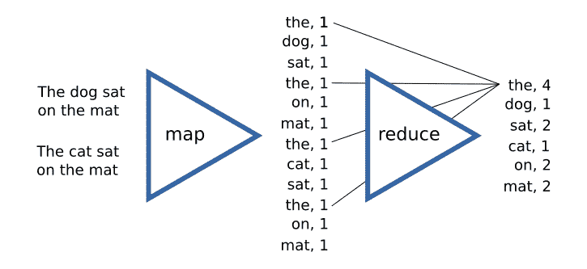
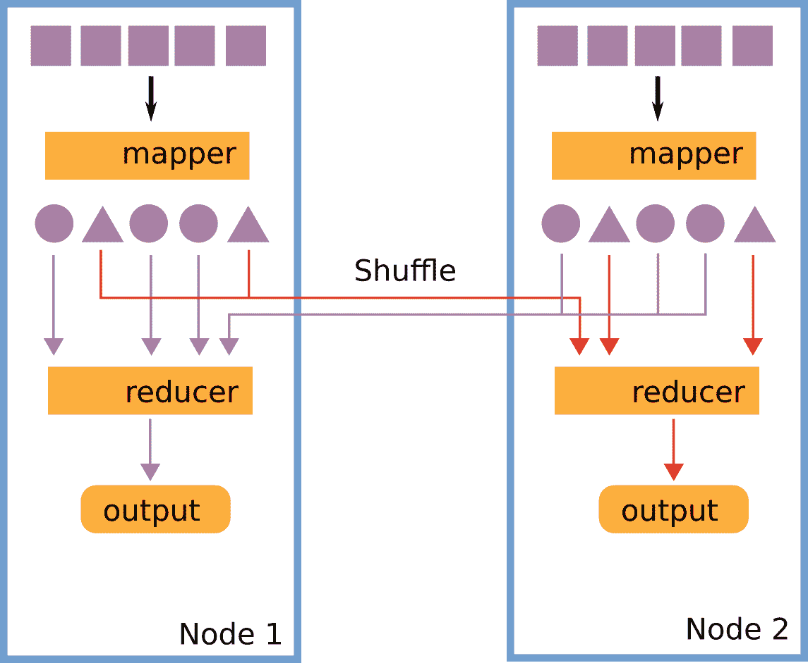
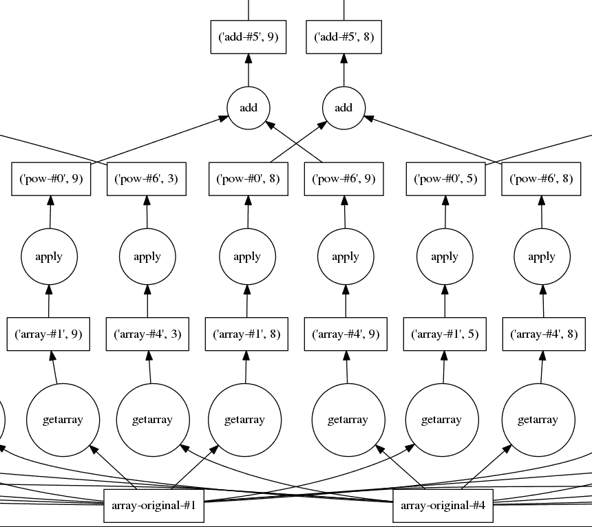
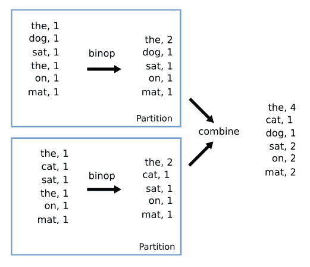
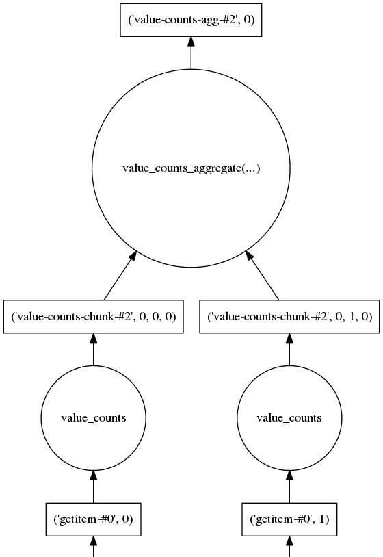
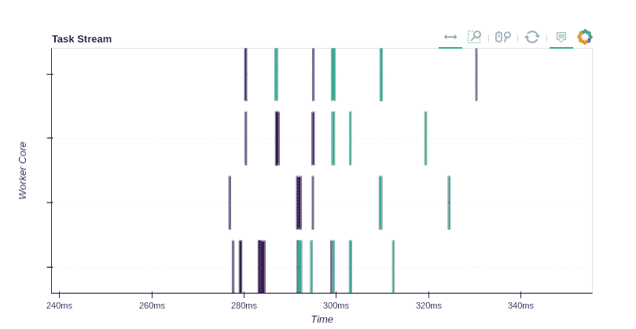
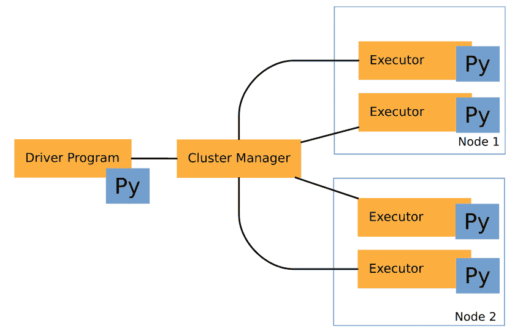

# 分布式处理

在上一章中，我们介绍了并行处理的概念，并学习了如何利用多核处理器和 GPU。现在，我们可以将游戏提升到一个新的水平，并将注意力转向分布式处理，这涉及到在多台机器上执行任务以解决特定问题。

在本章中，我们将说明在计算机集群上运行代码的挑战、用例和示例。Python 提供了易于使用且可靠的分布式处理包，这将使我们能够相对容易地实现可扩展和容错代码。

本章的主题列表如下：

+   分布式计算和 MapReduce 模型

+   使用 Dask 的定向无环图

+   使用 Dask 的`array`、`Bag`和`DataFrame`数据结构编写并行代码

+   使用 Dask Distributed 分发并行算法

+   PySpark 简介

+   Spark 的弹性分布式数据集和 DataFrame

+   使用`mpi4py`进行科学计算

# 分布式计算简介

在当今世界，计算机、智能手机和其他设备已成为我们生活的重要组成部分。每天，都会产生大量的数据。数十亿人通过互联网访问服务，公司不断收集数据以了解他们的用户，以便更好地定位产品和提升用户体验。

处理这日益增长的大量数据带来了巨大的挑战。大型公司和组织通常构建机器集群，用于存储、处理和分析大型且复杂的数据集。在数据密集型领域，如环境科学和医疗保健，也产生了类似的数据库。这些大规模数据集最近被称为**大数据**。应用于大数据的分析技术通常涉及机器学习、信息检索和可视化的结合。

计算集群在科学计算中已经使用了数十年，在研究复杂问题时需要使用在高性能分布式系统上执行的并行算法。对于此类应用，大学和其他组织提供并管理超级计算机用于研究和工程目的。在超级计算机上运行的应用通常专注于高度数值化的工作负载，如蛋白质和分子模拟、量子力学计算、气候模型等。

为分布式系统编程的挑战显而易见，如果我们回顾一下，随着我们将数据和计算任务分散到本地网络中，通信成本是如何增加的。与处理器速度相比，网络传输极其缓慢，在使用分布式处理时，保持网络通信尽可能有限尤为重要。这可以通过使用一些不同的策略来实现，这些策略有利于本地数据处理，并且仅在绝对必要时才进行数据传输。

分布式处理的其他挑战包括计算机网络的一般不可靠性。当你想到在一个计算集群中可能有数千台机器时，很明显（从概率上讲），故障节点变得非常普遍。因此，分布式系统需要能够优雅地处理节点故障，而不会干扰正在进行的工作。幸运的是，公司已经投入了大量资源来开发容错分布式引擎，这些引擎可以自动处理这些方面。

# MapReduce 简介

**MapReduce**是一种编程模型，允许你在分布式系统上高效地表达算法。MapReduce 模型最早由 Google 在 2004 年提出（[`research.google.com/archive/mapreduce.html`](https://research.google.com/archive/mapreduce.html)），作为一种在多台机器上自动分区数据集、自动本地处理以及*集群节点*之间通信的方法。

MapReduce 框架与分布式文件系统**Google 文件系统**（GFS 或 GoogleFS）合作使用，该系统旨在将数据分区并复制到计算集群中。分区对于存储和处理无法适应单个节点的数据集很有用，而复制确保系统能够优雅地处理故障。Google 使用 MapReduce 与 GFS 一起对他们的网页进行索引。后来，MapReduce 和 GFS 概念由 Doug Cutting（当时是雅虎的员工）实现，产生了**Hadoop 分布式文件系统**（**HDFS**）和 Hadoop MapReduce 的第一个版本。

MapReduce 暴露的编程模型实际上相当简单。其思想是将计算表达为两个相当通用的步骤的组合：*Map*和*Reduce*。一些读者可能熟悉 Python 的`map`和`reduce`函数；然而，在 MapReduce 的上下文中，Map 和 Reduce 步骤能够表示更广泛的操作类别。

Map 以一组数据作为输入，并对这些数据进行*转换*。Map 通常输出一系列键值对，这些键值对可以被传递到 Reduce 步骤。Reduce 步骤将具有相同键的项聚合起来，并对集合应用一个函数，形成一个通常更小的值集合。

在上一章中展示的*π*的估计可以通过一系列 Map 和 Reduce 步骤轻松转换。在这种情况下，输入是一系列随机数的对。转换（Map 步骤）是击中测试，而 Reduce 步骤是计算击中测试为 True 的次数。

MapReduce 模型的典型示例是实现词频统计；程序接受一系列文档作为输入，并返回每个单词在文档集合中的总出现次数。以下图展示了词频统计程序的 Map 和 Reduce 步骤。在左侧，我们有输入文档。Map 操作将生成一个（键，值）条目，其中第一个元素是单词，第二个元素是 **1**（这是因为每个单词都对最终计数贡献了 **1**）。

然后我们执行 reduce 操作，聚合相同键的所有元素，并为每个单词生成全局计数。在图中，我们可以看到所有键为 **the** 的项的值是如何相加以生成最终的条目（**the, 4**）：



如果我们使用 Map 和 Reduce 操作实现我们的算法，框架实现将确保通过限制节点之间的通信通过巧妙的算法来高效地完成数据生产和聚合。

然而，MapReduce 是如何将通信保持在最低限度的？让我们回顾一下 MapReduce 任务的旅程。想象一下，你有一个包含两个节点的集群，数据分区（这通常在每个节点本地找到）从磁盘加载到每个节点，并准备好处理。在每个节点上创建了一个 mapper 进程，并处理数据以生成中间结果。

接下来，有必要将数据发送到 reducer 进行进一步处理。然而，为了做到这一点，所有具有相同键的项都必须发送到同一个 reducer。这个操作称为 **洗牌**，是 MapReduce 模型中的主要通信任务：



注意，在数据交换发生之前，有必要将键的子集分配给每个 reducer；这一步称为 **分区**。一旦 reducer 收到其自己的键分区，它就可以自由地处理数据并在磁盘上写入结果输出。

MapReduce 框架（通过 Apache Hadoop 项目）在其原始形式下已被许多公司和组织广泛使用。最近，一些新的框架被开发出来，以扩展 MapReduce 引入的思想，以创建能够表达更复杂工作流程、更有效地使用内存并支持瘦型和高效分布式任务执行的系统。

在接下来的章节中，我们将描述 Python 分布式领域中两个最常用的库：Dask 和 PySpark。

# Dask

**Dask** 是 Continuum Analytics（负责 Numba 和 `conda` 软件包管理器的同一家公司）的一个项目，是一个用于并行和分布式计算的纯 Python 库。它在执行数据分析任务方面表现出色，并且与 Python 生态系统紧密结合。

Dask 最初被构想为一个用于单机内存外计算的包。最近，随着 Dask Distributed 项目的推出，其代码已被调整以在具有出色性能和容错能力的集群上执行任务。它支持 MapReduce 风格的任务以及复杂的数值算法。

# 有向无环图

Dask 背后的理念与我们已经在上一章中看到的 Theano 和 Tensorflow 非常相似。我们可以使用熟悉的 Pythonic API 来构建执行计划，而框架将自动将工作流程拆分成将在多个进程或计算机上传输和执行的任务。

Dask 将它的变量和操作表示为一个**有向无环图**（**DAG**），可以通过一个简单的 Python 字典来表示。为了简要说明这是如何工作的，我们将使用 Dask 实现两个数的和。我们将通过在字典中存储输入变量的值来定义我们的计算图。输入变量`a`和`b`将被赋予值`2`：

```py
    dsk = {
      "a" : 2,
      "b" : 2,
    }

```

每个变量代表 DAG 中的一个节点。构建我们的 DAG 的下一步是执行我们刚刚定义的节点上的操作。在 Dask 中，一个任务可以通过在`dsk`字典中放置一个包含 Python 函数及其位置参数的元组来定义。为了实现求和，我们可以添加一个新的节点，命名为`result`（实际名称完全任意），包含我们打算执行的函数，后跟其参数。以下代码展示了这一点：

```py
    dsk = {
      "a" : 2,
      "b" : 2,
      "result": (lambda x, y: x + y, "a", "b")
    }

```

为了更好的风格和清晰度，我们可以通过替换`lambda`语句为标准的`operator.add`库函数来计算和：

```py
    from operator import add
    dsk = {
      "a" : 2,
      "b" : 2,
      "result": (add, "a", "b")
    }

```

需要注意的是，我们打算传递给函数的参数是`"a"`和`"b"`字符串，它们指的是图中的`a`和`b`节点。请注意，我们没有使用任何 Dask 特定的函数来定义 DAG；这是框架灵活和精简的第一个迹象，因为所有操作都是在简单且熟悉的 Python 字典上进行的。

任务执行由调度器完成，调度器是一个函数，它接受一个 DAG 以及我们想要执行的任务或任务列表，并返回计算值。默认的 Dask 调度器是`dask.get`函数，可以使用以下方式使用：

```py
    import dask

    res = dask.get(dsk, "result")
    print(res)
    # Output:
    # 4 

```

所有复杂性都隐藏在调度器后面，调度器将负责将任务分配到线程、进程甚至不同的机器上。`dask.get`调度器是一个同步和串行实现，适用于测试和调试目的。

使用简单的字典定义图对于理解 Dask 如何施展魔法以及用于调试目的非常有用。原始字典也可以用来实现 Dask API 未涵盖的更复杂算法。现在，我们将学习 Dask 如何通过熟悉的 NumPy 和 Pandas-like 接口自动生成任务。

# Dask 数组

Dask 的主要用例之一是自动生成并行数组操作，这极大地简化了处理无法装入内存的数组。Dask 采取的策略是将数组分割成多个子单元，在 Dask 数组术语中，这些子单元被称为 **chunks**。

Dask 在 `dask.array` 模块（我们将简称为 `da`）中实现了一个类似于 NumPy 的数组接口。可以使用 `da.from_array` 函数从一个类似于 NumPy 的数组创建数组，该函数需要指定块大小。`da.from_array` 函数将返回一个 `da.array` 对象，该对象将处理将原始数组分割成指定块大小的子单元。在以下示例中，我们创建了一个包含 `30` 个元素的数组，并将其分割成每个块包含 `10` 个元素的块：

```py
    import numpy as np
    import dask.array as da

    a = np.random.rand(30)

    a_da = da.from_array(a, chunks=10)
    # Result:
    # dask.array<array-4..., shape=(30,), dtype=float64, chunksize=(10,)>

```

`a_da` 变量维护一个 Dask 图，可以通过 `dask` 属性访问。为了了解 Dask 在底层做了什么，我们可以检查其内容。在以下示例中，我们可以看到 Dask 图包含四个节点。其中一个是源数组，用 `'array-original-4c76'` 键表示，`a_da.dask` 字典中的其他三个键是用于使用 `dask.array.core.getarray` 函数访问原始数组子块的任务，如您所见，每个任务提取了 10 个元素的一个切片：

```py
    dict(a_da.dask)
    # Result
    {('array-4c76', 0): (<function dask.array.core.getarray>, 
                         'array-original-4c76',
                         (slice(0, 10, None),)),
     ('array-4c76', 2): (<function dask.array.core.getarray>,
                         'array-original-4c76',
                         (slice(20, 30, None),)),
     ('array-4c76', 1): (<function dask.array.core.getarray>, 
                         'array-original-4c76',
                         (slice(10, 20, None),)),
     'array-original-4c76': array([ ... ])
    }

```

如果我们在 `a_da` 数组上执行操作，Dask 将生成更多子任务来操作更小的子单元，从而打开实现并行化的可能性。`da.array` 暴露的接口与常见的 NumPy 语义和广播规则兼容。以下代码展示了 Dask 与 NumPy 广播规则、逐元素操作和其他方法的良好兼容性：

```py
    N = 10000
    chunksize = 1000 

    x_data = np.random.uniform(-1, 1, N)
    y_data = np.random.uniform(-1, 1, N)

    x = da.from_array(x_data, chunks=chunksize)
    y = da.from_array(y_data, chunks=chunksize)

    hit_test = x ** 2 + y ** 2 < 1

    hits = hit_test.sum()
    pi = 4 * hits / N

```

可以使用 `compute` 方法计算 π 的值，也可以通过 `get` 可选参数来指定不同的调度器（默认情况下，`da.array` 使用多线程调度器）：

```py
    pi.compute() # Alternative: pi.compute(get=dask.get)
    # Result:
    # 3.1804000000000001

```

即使是表面上简单的算法，如 π 的估计，也可能需要执行大量任务。Dask 提供了可视化计算图的工具。以下图显示了用于估计 π 的 Dask 图的一部分，可以通过执行 `pi.visualize()` 方法获得。在图中，圆形代表应用于节点的转换，节点以矩形表示。这个例子帮助我们了解 Dask 图的复杂性，并欣赏调度器创建高效执行计划的工作，包括正确排序任务和选择并行执行的任务：



# Dask Bag 和 DataFrame

Dask 提供了其他数据结构用于自动生成计算图。在本小节中，我们将探讨 `dask.bag.Bag`，这是一个通用的元素集合，可用于编写 MapReduce 风格的算法，以及 `dask.dataframe.DataFrame`，它是 `pandas.DataFrame` 的分布式版本。

一个 `Bag` 可以很容易地从 Python 集合中创建。例如，您可以使用 `from_sequence` 工厂函数从一个列表中创建一个 `Bag`。可以使用 `npartitions` 参数指定并行级别（这将把 `Bag` 内容分布到多个分区中）。在以下示例中，我们创建了一个包含从 `0` 到 `99` 的数字的 `Bag`，分为四个块：

```py
    import dask.bag as dab
    dab.from_sequence(range(100), npartitions=4)
    # Result:
    # dask.bag<from_se..., npartitions=4>

```

在下一个示例中，我们将演示如何使用类似于 MapReduce 的算法对一组字符串进行词频统计。给定我们的序列集合，我们应用 `str.split`，然后使用 `concat` 获取文档中的线性单词列表。然后，对于每个单词，我们生成一个包含单词和值 `1` 的字典（有关说明，请参阅 *MapReduce 简介* 部分）。然后，我们使用 `foldby` 操作符编写一个 *Reduce* 步骤来计算词频。

`foldby` 转换对于实现不需要在网络中重新排序所有元素即可合并词频的 Reduce 步骤非常有用。想象一下，我们的单词数据集被分为两个分区。计算总计数的一个好策略是首先计算每个分区的单词出现次数之和，然后将这些部分和组合起来得到最终结果。以下图示说明了这个概念。在左侧，我们有我们的输入分区。每个单独分区计算部分和（这是使用二进制操作 **binop** 完成的），然后通过使用 **combine** 函数组合部分和来计算最终总和。



以下代码说明了如何使用 `Bag` 和 `foldby` 操作符来计算词频。对于 `foldby` 操作符，我们需要定义两个函数，它们接受五个参数：

+   `key`: 这是一个返回 reduce 操作键的函数。

+   `binop`: 这是一个接受两个参数的函数：`total` 和 `x`。给定一个 `total` 值（到目前为止累积的值），`binop` 将下一个项目合并到总和中。

+   `initial`: 这是 `binop` 累积的初始值。

+   `combine`: 这是一个将每个分区的总和合并的函数（在这种情况下是一个简单的求和）。

+   `initial_combine`: 这是 `combine` 累积的初始值。

现在，让我们看看代码：

```py
    collection = dab.from_sequence(["the cat sat on the mat",
                                    "the dog sat on the mat"], npartitions=2)

 binop = lambda total, x: total + x["count"]
    combine = lambda a, b: a + b
    (collection
     .map(str.split)
     .concat()
     .map(lambda x: {"word": x, "count": 1})
     .foldby(lambda x: x["word"], binop, 0, combine, 0)
     .compute())
    # Output:
    # [('dog', 1), ('cat', 1), ('sat', 2), ('on', 2), ('mat', 2), ('the', 4)]

```

正如我们刚才看到的，使用`Bag`以有效的方式表达复杂操作可能会变得繁琐。因此，Dask 提供另一种数据结构，专为分析工作负载设计--`dask.dataframe.DataFrame`。`DataFrame`可以在 Dask 中使用多种方法初始化，例如从分布式文件系统上的`CSV`文件，或直接从`Bag`。就像`da.array`提供了一个与 NumPy 功能紧密相似的 API 一样，Dask `DataFrame`可以用作`pandas.DataFrame`的分布式版本。

作为演示，我们将使用`DataFrame`重新实现词频。我们首先加载数据以获得一个单词的`Bag`，然后使用`to_dataframe`方法将`Bag`转换为`DataFrame`。通过将列名传递给`to_dataframe`方法，我们可以初始化一个`DataFrame`，它包含一个名为`words`的单列：

```py
    collection = dab.from_sequence(["the cat sat on the mat",
                                    "the dog sat on the mat"], npartitions=2)
    words = collection.map(str.split).concat()
    df = words.to_dataframe(['words'])
    df.head()
    # Result:
    #   words
    # 0   the
    # 1   cat
    # 2   sat
    # 3    on
    # 4   the

```

Dask `DataFrame`紧密复制了`pandas.DataFrame` API。要计算词频，我们只需在单词列上调用`value_counts`方法，Dask 将自动设计一个并行计算策略。要触发计算，只需调用`compute`方法：

```py
    df.words.value_counts().compute()
    # Result:
    # the    4
    # sat    2
    # on     2
    # mat    2
    # dog    1
    # cat    1
    # Name: words, dtype: int64

```

一个可能的问题是一个人可能会问：“*DataFrame 底层使用的是哪种算法？*”。答案可以通过查看生成的 Dask 图的顶部来找到，该图如下所示。底部的前两个矩形代表数据集的两个分区，它们存储为两个`pd.Series`实例。为了计算总数，Dask 将首先在每个`pd.Series`上执行`value_counts`，然后结合`value_counts_aggregate`步骤：



如您所见，Dask `array`和`DataFrame`都利用了 NumPy 和 Pandas 的快速向量化实现，以实现卓越的性能和稳定性。

# Dask 分布式

Dask 项目的最初迭代是为了在单台计算机上运行而设计的，使用基于线程或进程的调度器。最近，新分布式后端的实现可以用来在计算机网络上设置和运行 Dask 图。

Dask 分布式不是与 Dask 自动安装的。该库可以通过`conda`包管理器（使用`$ conda install distributed`命令）以及`pip`（使用`$ pip install distributed`命令）获得。

开始使用 Dask 分布式实际上非常简单。最基本的设置是通过实例化一个`Client`对象来获得的：

```py
    from dask.distributed import Client

    client = Client()
    # Result:
    # <Client: scheduler='tcp://127.0.0.1:46472' processes=4 cores=4>

```

默认情况下，Dask 将通过`Client`实例启动一些关键进程（在本地机器上），这些进程对于调度和执行分布式任务是必要的。Dask 集群的主要组件是一个单一的*scheduler*和一组*workers*。

**调度器**是负责在工作器之间分配工作并监控和管理结果的进程。通常，当任务被提交给用户时，调度器会找到一个空闲的工作器并提交一个任务以供执行。一旦工作器完成，调度器就会被告知结果已可用。

工作器是一个接受传入任务并产生结果的进程。工作器可以驻留在网络上的不同机器上。工作器使用`ThreadPoolExecutor`执行任务。这可以用来在不需要获取 GIL（例如，在`nogil`块中的 Numpy、Pandas 和 Cython 函数）的函数中使用并行性。当执行纯 Python 代码时，启动许多单线程工作器进程是有利的，因为这将为获取 GIL 的代码启用并行性。

`Client`类可以用来使用熟悉的异步方法手动将任务提交给调度器。例如，为了在集群上执行一个函数，可以使用`Client.map`和`Client.submit`方法。在下面的代码中，我们展示了如何使用`Client.map`和`Client.submit`来计算几个数字的平方。`Client`将向调度器提交一系列任务，我们将为每个任务接收一个`Future`实例：

```py
    def square(x):
       return x ** 2

    fut = client.submit(square, 2)
    # Result:
    # <Future: status: pending, key: square-05236e00d545104559e0cd20f94cd8ab>

    client.map(square)
    futs = client.map(square, [0, 1, 2, 3, 4])
    # Result:
    # [<Future: status: pending, key: square-d043f00c1427622a694f518348870a2f>,
    #  <Future: status: pending, key: square-9352eac1fb1f6659e8442ca4838b6f8d>,
    #  <Future: status: finished, type: int, key: 
    #  square-05236e00d545104559e0cd20f94cd8ab>,
    #  <Future: status: pending, key: 
    #  square-c89f4c21ae6004ce0fe5206f1a8d619d>,
    #  <Future: status: pending, key: 
    #  square-a66f1c13e2a46762b092a4f2922e9db9>]

```

到目前为止，这与我们在前几章中看到的`TheadPoolExecutor`和`ProcessPoolExecutor`非常相似。然而，请注意，Dask Distributed 不仅提交任务，还将在工作器内存中缓存计算结果。您可以通过查看前面的代码示例来看到缓存的作用。当我们第一次调用`client.submit`时，`square(2)`任务被创建，其状态设置为*待处理*。当我们随后调用`client.map`时，`square(2)`任务被重新提交给调度器，但这次，调度器不是重新计算其值，而是直接从工作器检索结果。因此，map 返回的第三个`Future`已经处于完成状态。

可以使用`Client.gather`方法检索来自`Future`实例集合的结果：

```py
    client.gather(futs)
    # Result:
    # [0, 1, 4, 9, 16]

```

`Client`也可以用来运行任意的 Dask 图。例如，我们可以通过将`client.get`函数作为可选参数传递给`pi.compute`来简单地运行我们的π近似值：

```py
    pi.compute(get=client.get)

```

这个特性使得 Dask 具有极高的可扩展性，因为它可以在本地机器上使用其中一个较简单的调度器开发和运行算法，如果性能不满意，还可以在由数百台机器组成的集群上重用相同的算法。

# 手动集群设置

要手动实例化调度器和工作者，可以使用`dask-scheduler`和`dask-worker`命令行工具。首先，我们可以使用`dask-scheduler`命令初始化调度器：

```py
$ dask-scheduler
distributed.scheduler - INFO - -----------------------------------------------
distributed.scheduler - INFO - Scheduler at: tcp://192.168.0.102:8786
distributed.scheduler - INFO - bokeh at: 0.0.0.0:8788
distributed.scheduler - INFO - http at: 0.0.0.0:9786
distributed.bokeh.application - INFO - Web UI: http://127.0.0.1:8787/status/
distributed.scheduler - INFO - -----------------------------------------------

```

这将为调度器提供一个地址和一个可以用来监控集群状态的 Web UI 地址。现在，我们可以将一些工作线程分配给调度器；这可以通过使用 `dask-worker` 命令并将调度器的地址传递给工作线程来实现。这将自动启动一个拥有四个线程的工作线程：

```py
$ dask-worker 192.168.0.102:8786
distributed.nanny - INFO - Start Nanny at: 'tcp://192.168.0.102:45711'
distributed.worker - INFO - Start worker at: tcp://192.168.0.102:45928
distributed.worker - INFO - bokeh at: 192.168.0.102:8789
distributed.worker - INFO - http at: 192.168.0.102:46154
distributed.worker - INFO - nanny at: 192.168.0.102:45711
distributed.worker - INFO - Waiting to connect to: tcp://192.168.0.102:8786
distributed.worker - INFO - -------------------------------------------------
distributed.worker - INFO - Threads: 4
distributed.worker - INFO - Memory: 4.97 GB
distributed.worker - INFO - Local Directory: /tmp/nanny-jh1esoo7
distributed.worker - INFO - -------------------------------------------------
distributed.worker - INFO - Registered to: tcp://192.168.0.102:8786
distributed.worker - INFO - -------------------------------------------------
distributed.nanny - INFO - Nanny 'tcp://192.168.0.102:45711' starts worker process 'tcp://192.168.0.102:45928'

```

Dask 调度器在容错方面相当强大，这意味着如果我们添加和删除一个工作线程，它能够追踪哪些结果不可用，并按需重新计算它们。最后，为了从 Python 会话中使用初始化的调度器，只需初始化一个 `Client` 实例并提供调度器的地址即可：

```py
client = Client(address='192.168.0.102:8786')
# Result: 
# <Client: scheduler='tcp://192.168.0.102:8786' processes=1 cores=4>

```

Dask 还提供了一个方便的诊断 Web UI，可以用来监控集群上每个任务的状态和耗时。在下一张图中，**任务流**显示了执行 pi 估计所花费的时间。在图表中，每一条水平灰色线对应一个工作线程（在我们的例子中，我们有一个拥有四个线程的工作线程，也称为**工作核心**），每个矩形框对应一个任务，颜色相同以表示相同的任务类型（例如，加法、幂或指数）。从这个图表中，你可以观察到所有方块都非常小且彼此距离很远。这意味着与通信开销相比，任务相当小。

在这种情况下，块大小的增加，意味着与通信时间相比，每个任务运行所需的时间增加，这将是有益的。



# 使用 PySpark

现在，Apache Spark 是分布式计算中最受欢迎的项目之一。Spark 使用 Scala 开发，于 2014 年发布，与 HDFS 集成，并在 Hadoop MapReduce 框架之上提供了几个优势和改进。

与 Hadoop MapReduce 不同，Spark 被设计为可以交互式处理数据，并支持 Java、Scala 和 Python 编程语言的 API。鉴于其不同的架构，特别是 Spark 将结果保留在内存中的事实，Spark 通常比 Hadoop MapReduce 快得多。

# 设置 Spark 和 PySpark

从头开始设置 PySpark 需要安装 Java 和 Scala 运行时，从源代码编译项目，并配置 Python 和 Jupyter notebook，以便它们可以与 Spark 安装一起使用。设置 PySpark 的一个更简单且错误更少的方法是使用通过 **Docker** 容器提供的已配置 Spark 集群。

您可以从 [`www.docker.com/`](https://www.docker.com/) 下载 Docker。如果您对容器还不太熟悉，可以阅读下一章以获取介绍。

要设置 Spark 集群，只需进入本章的代码文件（其中有一个名为 `Dockerfile` 的文件）并执行以下命令：

```py
$ docker build -t pyspark 

```

此命令将自动在隔离环境中下载、安装和配置 Spark、Python 和 Jupyter 笔记本。要启动 Spark 和 Jupyter 笔记本会话，您可以执行以下命令：

```py
$ docker run -d -p 8888:8888 -p 4040:4040 pyspark
22b9dbc2767c260e525dcbc562b84a399a7f338fe1c06418cbe6b351c998e239

```

命令将打印一个唯一的 ID（称为*容器 ID*），您可以使用它来引用应用程序容器，并将 Spark 和 Jupyter 笔记本在后台启动。`-p`选项确保我们可以从本地机器访问 SparkUI 和 Jupyter 网络端口。在发出命令后，您可以通过打开浏览器访问`http://127.0.0.1:8888`来访问 Jupyter 笔记本会话。您可以通过创建一个新的笔记本并在单元格中执行以下内容来测试 Spark 的正确初始化：

```py
    import pyspark
    sc = pyspark.SparkContext('local[*]')

    rdd = sc.parallelize(range(1000))
    rdd.first()
    # Result:
    # 0

```

这将初始化一个`SparkContext`并获取集合中的第一个元素（这些新术语将在稍后详细解释）。一旦`SparkContext`初始化完成，我们还可以访问[`127.0.0.1:4040`](http://127.0.0.1:4040)来打开 Spark Web UI。

现在设置完成，我们将了解 Spark 的工作原理以及如何使用其强大的 API 实现简单的并行算法。

# Spark 架构

Spark 集群是在不同机器上分布的一组进程。**驱动程序**是一个进程，例如 Scala 或 Python 解释器，用户用它来提交要执行的任务。

用户可以使用特殊的 API 构建类似于 Dask 的任务图，并将这些任务提交给**集群管理器**，该管理器负责将这些任务分配给**执行器**，即负责执行任务的进程。在多用户系统中，集群管理器还负责按用户分配资源。

用户通过**驱动程序**与集群管理器交互。负责用户与 Spark 集群之间通信的类被称为`SparkContext`。这个类能够根据用户可用的资源连接和配置集群上的执行器。

对于其最常见的使用场景，Spark 通过一种称为**弹性分布式数据集**（**RDD**）的数据结构来管理其数据，它表示一组项目。RDDs 通过将它们的元素分割成分区并在并行操作这些分区（注意，这种机制主要对用户隐藏）来处理大规模数据集。RDDs 还可以存储在内存中（可选，且在适当的时候）以实现快速访问和缓存昂贵的中间结果。

使用 RDDs，可以定义任务和转换（类似于我们在 Dask 中自动生成计算图的方式），当请求时，集群管理器将自动将任务调度和执行到可用的执行器上。

执行器将从集群管理器接收任务，执行它们，并在需要时保留结果。请注意，一个执行器可以有多个核心，集群中的每个节点可能有多个执行器。一般来说，Spark 对执行器的故障具有容错性。

在以下图中，我们展示了上述组件如何在 Spark 集群中交互。**驱动程序**与**集群管理器**交互，集群管理器负责管理不同节点上的**执行器**实例（每个执行器实例也可以有多个线程）。请注意，即使**驱动程序**不直接控制执行器，存储在**执行器**实例中的结果也会直接在执行器和驱动程序之间传输。因此，确保**驱动程序**可以从**执行器**进程网络访问是很重要的：


一个自然的问题就是：Spark，一个用 Scala 编写的软件，是如何执行 Python 代码的？集成是通过`Py4J`库完成的，该库在底层维护一个 Python 进程并通过套接字（一种进程间通信形式）与之通信。为了运行任务，执行器维护一系列 Python 进程，以便它们能够并行处理 Python 代码。

驱动程序程序中的 Python 进程定义的 RDD 和变量会被序列化，集群管理器和执行器之间的通信（包括洗牌）由 Spark 的 Scala 代码处理。Python 和 Scala 之间交换所需的额外序列化步骤，所有这些都增加了通信的开销；因此，当使用 PySpark 时，必须格外小心，确保使用的结构被有效地序列化，并且数据分区足够大，以便通信的成本与执行的成本相比可以忽略不计。

以下图展示了 PySpark 执行所需的额外 Python 进程。这些额外的 Python 进程伴随着相关的内存成本和额外的间接层，这增加了错误报告的复杂性：



尽管有这些缺点，PySpark 仍然是一个广泛使用的工具，因为它将生动的 Python 生态系统与 Hadoop 基础设施的工业强度连接起来。

# 弹性分布式数据集

在 Python 中创建 RDD 的最简单方法是使用`SparkContext.parallelize`方法。这个方法之前也被用来并行化一个介于`0`和`1000`之间的整数集合：

```py
    rdd = sc.parallelize(range(1000))
    # Result:
    # PythonRDD[3] at RDD at PythonRDD.scala:48

```

`rdd`集合将被分成多个分区，在这种情况下，对应于默认值四（默认值可以通过配置选项更改）。要显式指定分区数，可以向`parallelize`传递额外的参数：

```py
    rdd = sc.parallelize(range(1000), 2)
    rdd.getNumPartitions() # This function will return the number of partitions
    # Result:
    # 2

```

RDD 支持许多函数式编程操作符，类似于我们在第六章“实现并发”中使用的，与反应式编程和数据流（尽管在这种情况下，操作符是为处理随时间推移的事件而不是普通集合而设计的）。例如，我们可以展示基本的`map`函数，到现在应该已经很熟悉了。在以下代码中，我们使用`map`来计算一系列数字的平方：

```py
    square_rdd = rdd.map(lambda x: x**2)
    # Result:
    # PythonRDD[5] at RDD at PythonRDD.scala:48

```

`map`函数将返回一个新的 RDD，但不会立即计算任何内容。为了触发执行，你可以使用`collect`方法，它将检索集合中的所有元素，或者使用`take`，它将只返回前十个元素：

```py
    square_rdd.collect()
    # Result:
    # [0, 1, ... ]

    square_rdd.take(10)
    # Result:
    # [0, 1, 4, 9, 16, 25, 36, 49, 64, 81]

```

为了比较 PySpark、Dask 以及我们在前几章中探索的其他并行编程库，我们将重新实现π的近似值。在 PySpark 实现中，我们首先使用`parallelize`创建两个包含随机数的 RDD，然后使用`zip`函数（这相当于 Python 的`zip`）合并数据集，最后测试随机点是否在圆内：

```py
    import numpy as np

    N = 10000
    x = np.random.uniform(-1, 1, N)
    y = np.random.uniform(-1, 1, N)

    rdd_x = sc.parallelize(x)
    rdd_y = sc.parallelize(y)

    hit_test = rdd_x.zip(rdd_y).map(lambda xy: xy[0] ** 2 + xy[1] ** 2 < 1)
    pi = 4 * hit_test.sum()/N

```

需要注意的是，`zip`和`map`操作都会生成新的 RDD，实际上并不在底层数据上执行指令。在先前的例子中，代码执行是在我们调用`hit_test.sum`函数时触发的，该函数返回一个整数。这种行为与 Dask API 不同，在 Dask API 中，整个计算（包括最终结果`pi`）并没有触发执行。

现在我们可以继续到一个更有趣的应用，以展示更多的 RDD 方法。我们将学习如何计算网站每个用户每天访问的次数。在现实世界的场景中，数据已经被收集到数据库中，或者存储在分布式文件系统，如 HDFS 中。然而，在我们的例子中，我们将生成一些数据，然后进行分析。

在以下代码中，我们生成一个包含字典的列表，每个字典包含一个`user`（从二十个用户中选择）和一个`timestamp`。生成数据集的步骤如下：

1.  创建一个包含 20 个用户的池（`users`变量）。

1.  定义一个函数，该函数返回两个日期之间的随机时间。

1.  对于 10,000 次，我们从`users`池中随机选择一个用户，并从 2017 年 1 月 1 日到 2017 年 1 月 7 日之间的随机时间戳。

```py
      import datetime

      from uuid import uuid4
      from random import randrange, choice

      # We generate 20 users
      n_users = 20 
      users = [uuid4() for i in range(n_users)]

      def random_time(start, end):
          '''Return a random timestamp between start date and end 
          date'''
          # We select a number of seconds
          total_seconds = (end - start).total_seconds()
          return start + 
          datetime.timedelta(seconds=randrange(total_seconds))

      start = datetime.datetime(2017, 1, 1)
      end = datetime.datetime(2017, 1, 7)

      entries = []
      N = 10000
      for i in range(N):
          entries.append({
           'user': choice(users),
           'timestamp': random_time(start, end)
          })

```

使用手头的数据集，我们可以开始提问并使用 PySpark 来找到答案。一个常见的问题是“*给定用户访问网站了多少次？*”。计算这个结果的一个简单方法是通过使用 `groupBy` 操作符按用户分组（使用 `groupBy` 操作符）并计算每个用户有多少项。在 PySpark 中，`groupBy` 接收一个函数作为参数，用于提取每个元素的分组键，并返回一个新的 RDD，其中包含 `(key, group)` 形式的元组。在下面的示例中，我们使用用户 ID 作为 `groupBy` 的键，并使用 `first` 检查第一个元素：

```py
    entries_rdd = sc.parallelize(entries)
    entries_rdd.groupBy(lambda x: x['user']).first()
    # Result:
    # (UUID('0604aab5-c7ba-4d5b-b1e0-16091052fb11'),
    #  <pyspark.resultiterable.ResultIterable at 0x7faced4cd0b8>)

```

`groupBy` 的返回值包含一个 `ResultIterable`（基本上是一个列表），用于每个用户 ID。为了计算每个用户的访问次数，计算每个 `ResultIterable` 的长度就足够了：

```py
    (entries_rdd
     .groupBy(lambda x: x['user'])
     .map(lambda kv: (kv[0], len(kv[1])))
     .take(5))
    # Result:
    # [(UUID('0604aab5-c7ba-4d5b-b1e0-16091052fb11'), 536),
    #  (UUID('d72c81c1-83f9-4b3c-a21a-788736c9b2ea'), 504),
    #  (UUID('e2e125fa-8984-4a9a-9ca1-b0620b113cdb'), 498),
    #  (UUID('b90acaf9-f279-430d-854f-5df74432dd52'), 561),
    #  (UUID('00d7be53-22c3-43cf-ace7-974689e9d54b'), 466)]

```

尽管这个算法在小数据集中可能效果很好，但 `groupBy` 要求我们将每个用户的整个条目集收集并存储在内存中，这可能会超过单个节点的内存容量。由于我们不需要列表，只需要计数，因此有更好的方法来计算这个数字，而无需在内存中保留每个用户的访问列表。

当处理 `(key, value)` 对的 RDD 时，可以使用 `mapValues` 仅对值应用函数。在前面的代码中，我们可以将 `map(lambda kv: (kv[0], len(kv[1])))` 调用替换为 `mapValues(len)` 以提高可读性。

为了更高效的计算，我们可以利用 `reduceByKey` 函数，它将执行类似于我们在 *MapReduce 简介* 部分中看到的 Reduce 步骤。`reduceByKey` 函数可以从包含键作为第一个元素和值作为第二个元素的元组的 RDD 中调用，并接受一个作为其第一个参数的函数，该函数将计算减少。以下是对 `reduceByKey` 函数的一个简单示例。我们有一些与整数数字关联的字符串键，我们想要获取每个键的值的总和；这个减少操作，用 lambda 表达式表示，对应于元素的总和：

```py
    rdd = sc.parallelize([("a", 1), ("b", 2), ("a", 3), ("b", 4), ("c", 5)])
    rdd.reduceByKey(lambda a, b: a + b).collect()
    # Result:
    # [('c', 5), ('b', 6), ('a', 4)]

```

`reduceByKey` 函数比 `groupBy` 更高效，因为它的减少操作是可并行的，并且不需要在内存中存储组；此外，它还限制了在 Executors 之间传输的数据量（它执行的操作类似于前面解释过的 Dask 的 `foldby`）。在这个阶段，我们可以使用 `reduceByKey` 重新编写我们的访问次数计算：

```py
    (entries_rdd
     .map(lambda x: (x['user'], 1))
     .reduceByKey(lambda a, b: a + b)
     .take(3))
    # Result:
    # [(UUID('0604aab5-c7ba-4d5b-b1e0-16091052fb11'), 536),
    #  (UUID('d72c81c1-83f9-4b3c-a21a-788736c9b2ea'), 504),
    #  (UUID('e2e125fa-8984-4a9a-9ca1-b0620b113cdb'), 498)]

```

使用 Spark 的 RDD API，回答诸如“*每天网站接收了多少次访问？*”等问题也很容易。这可以通过使用 `reduceByKey` 并提供适当的键（即从时间戳中提取的日期）来计算。在下面的示例中，我们展示了计算过程。同时，请注意 `sortByKey` 操作符的使用，它按日期对计数进行排序：

```py
    (entries_rdd
     .map(lambda x: (x['timestamp'].date(), 1))
     .reduceByKey(lambda a, b: a + b)
     .sortByKey()
     .collect())
    # Result:
    # [(datetime.date(2017, 1, 1), 1685),
    #  (datetime.date(2017, 1, 2), 1625),
    #  (datetime.date(2017, 1, 3), 1663),
    #  (datetime.date(2017, 1, 4), 1643),
    #  (datetime.date(2017, 1, 5), 1731),
    #  (datetime.date(2017, 1, 6), 1653)]

```

# Spark DataFrame

对于数值和分析任务，Spark 通过 `pyspark.sql` 模块（也称为 SparkSQL）提供了一个方便的接口。该模块包括一个 `spark.sql.DataFrame` 类，可以用于类似于 Pandas 的有效 SQL 样式查询。通过 `SparkSession` 类提供对 SQL 接口的访问：

```py
    from pyspark.sql import SparkSession
    spark = SparkSession.builder.getOrCreate()

```

`SparkSession` 可以通过 `createDataFrame` 函数创建一个 `DataFrame`。`createDataFrame` 函数接受 RDD、列表或 `pandas.DataFrame`。

在以下示例中，我们将通过将包含 `Row` 实例集合的 RDD `rows` 转换为 `spark.sql.DataFrame` 来创建一个 `spark.sql.DataFrame`。`Row` 实例代表一组列名和一组值之间的关联，就像 `pd.DataFrame` 中的行一样。在这个例子中，我们有两个列--`x` 和 `y`--我们将与随机数相关联：

```py
    # We will use the x_rdd and y_rdd defined previously.
    rows = rdd_x.zip(rdd_y).map(lambda xy: Row(x=float(xy[0]), y=float(xy[1])))

    rows.first() # Inspect the first element
    # Result:
    # Row(x=0.18432163061239137, y=0.632310101419016)

```

在获得我们的 `Row` 实例集合后，我们可以将它们组合成一个 `DataFrame`，如下所示。我们还可以使用 `show` 方法检查 `DataFrame` 的内容：

```py
    df = spark.createDataFrame(rows)
    df.show(5)
    # Output:
    # +-------------------+--------------------+
    # |                  x|                   y|
    # +-------------------+--------------------+
    # |0.18432163061239137|   0.632310101419016|
    # | 0.8159145525577987| -0.9578448778029829|
    # |-0.6565050226033042|  0.4644773453129496|
    # |-0.1566191476553318|-0.11542211978216432|
    # | 0.7536730082381564| 0.26953055476074717|
    # +-------------------+--------------------+
    # only showing top 5 rows

```

`spark.sql.DataFrame` 支持使用方便的 SQL 语法对分布式数据集进行转换。例如，您可以使用 `selectExpr` 方法使用 SQL 表达式计算一个值。在以下代码中，我们使用 `x` 和 `y` 列以及 `pow` SQL 函数计算碰撞测试：

```py
    hits_df = df.selectExpr("pow(x, 2) + pow(y, 2) < 1 as hits")
    hits_df.show(5)
    # Output:
    # +-----+
    # | hits|
    # +-----+
    # | true|
    # |false|
    # | true|
    # | true|
    # | true|
    # +-----+
    # only showing top 5 rows

```

为了展示 SQL 的表达能力，我们还可以使用单个表达式计算 pi 的估计值。该表达式涉及使用 SQL 函数，如 `sum`、`pow`、`cast` 和 `count`：

```py
    result = df.selectExpr('4 * sum(cast(pow(x, 2) + 
                           pow(y, 2) < 1 as int))/count(x) as pi')
    result.first()
    # Result:
    # Row(pi=3.13976)

```

Spark SQL 与基于 Hadoop 的分布式数据集的 SQL 引擎 Hive 使用相同的语法。有关完整的语法参考，请参阅 [`cwiki.apache.org/confluence/display/Hive/LanguageManual`](https://cwiki.apache.org/confluence/display/Hive/LanguageManual)。

DataFrame 是一种利用 Scala 的强大功能和优化，同时使用 Python 接口的好方法。主要原因在于查询由 SparkSQL 符号解释，并且执行直接在 Scala 中发生，无需通过 Python 传递中间结果。这大大减少了序列化开销，并利用了 SparkSQL 执行的查询优化。优化和查询规划允许使用 SQL 操作符，如 `GROUP BY`，而不会产生性能惩罚，就像我们直接在 RDD 上使用 `groupBy` 时所经历的那样。

# 使用 mpi4py 进行科学计算

尽管 Dask 和 Spark 是在 IT 行业广泛使用的优秀技术，但它们在学术研究中并没有得到广泛的应用。几十年来，学术界一直使用拥有数千个处理器的超级计算机来运行密集型数值应用。因此，超级计算机通常使用一个非常不同的软件栈进行配置，该软件栈专注于在低级语言（如 C、Fortran 或甚至汇编）中实现的计算密集型算法。

在这些系统上用于并行执行的主要库是**消息传递接口**（**MPI**），虽然它不如 Dask 或 Spark 方便或复杂，但完全能够表达并行算法并实现出色的性能。请注意，与 Dask 和 Spark 不同，MPI 不遵循 MapReduce 模型，并且最好用于运行成千上万的进程，它们之间发送的数据非常少。

与我们迄今为止所看到的不同，MPI 的工作方式相当不同。MPI 中的并行性是通过在多个进程中运行**相同的脚本**（这些进程可能存在于不同的节点上）来实现的；进程之间的通信和同步由一个指定的进程处理，通常称为**根**，通常由`0` ID 标识。

在本节中，我们将简要演示使用其`mpi4py` Python 接口的 MPI 的主要概念。在以下示例中，我们展示了使用 MPI 的最简单的并行代码。代码导入 MPI 模块并检索`COMM_WORLD`，这是一个可以用来与其他 MPI 进程交互的接口。`Get_rank`函数将返回当前进程的整数标识符：

```py
    from mpi4py import MPI

    comm = MPI.COMM_WORLD
    rank = comm.Get_rank()
    print("This is process", rank)

```

我们可以将前面的代码放入一个名为`mpi_example.py`的文件中，并执行它。正常运行此脚本不会做任何特别的事情，因为它只涉及单个进程的执行：

```py
 $ python mpi_example.py
    This is process 0

```

MPI 作业旨在使用`mpiexec`命令执行，该命令通过`-n`选项来指定并行进程的数量。使用以下命令运行脚本将生成四个独立的相同脚本执行，每个执行都有一个不同的 ID：

```py
 $ mpiexec -n 4 python mpi_example.py
    This is process 0
    This is process 2
    This is process 1
    This is process 3

```

通过资源管理器（如 TORQUE）自动在网络中分配进程。通常，超级计算机由系统管理员配置，系统管理员还将提供有关如何运行 MPI 软件的说明。

为了了解 MPI 程序的样子，我们将重新实现π的近似。完整的代码如下。程序将执行以下操作：

+   为每个进程创建一个大小为`N / n_procs`的随机数组，以便每个进程将测试相同数量的样本（`n_procs`通过`Get_size`函数获得）

+   在每个单独的进程中，计算击中测试的总和并将其存储在`hits_counts`中，这将代表每个进程的部分计数

+   使用`reduce`函数计算部分计数的总和。在调用 reduce 时，我们需要指定`root`参数来指定哪个进程将接收结果

+   只在根进程对应的进程中打印最终结果：

```py
      from mpi4py import MPI

      comm = MPI.COMM_WORLD
      rank = comm.Get_rank()

      import numpy as np

      N = 10000

      n_procs = comm.Get_size()

      print("This is process", rank)

      # Create an array
      x_part = np.random.uniform(-1, 1, int(N/n_procs))
      y_part = np.random.uniform(-1, 1, int(N/n_procs))

      hits_part = x_part**2 + y_part**2 < 1
      hits_count = hits_part.sum()

      print("partial counts", hits_count)

      total_counts = comm.reduce(hits_count, root=0)

      if rank == 0:
         print("Total hits:", total_counts)
         print("Final result:", 4 * total_counts/N)

```

我们现在可以将前面的代码放入一个名为`mpi_pi.py`的文件中，并使用`mpiexec`执行它。输出显示了四个进程执行如何交织在一起，直到我们到达`reduce`调用：

```py
$ mpiexec -n 4 python mpi_pi.py
This is process 3
partial counts 1966
This is process 1
partial counts 1944
This is process 2
partial counts 1998
This is process 0
partial counts 1950
Total hits: 7858
Final result: 3.1432

```

# 摘要

分布式处理可以用来实现能够处理大规模数据集的算法，通过在计算机集群中分配更小的任务来实现。多年来，许多软件包，如 Apache Hadoop，已经被开发出来以实现分布式软件的高效和可靠执行。

在本章中，我们学习了 Python 包的架构和使用方法，例如 Dask 和 PySpark，它们提供了强大的 API 来设计和执行能够扩展到数百台机器的程序。我们还简要介绍了 MPI，这是一个已经用于数十年的库，用于在为学术研究设计的超级计算机上分配工作。

在整本书中，我们探讨了多种提高我们程序性能的技术，以及增加我们程序处理数据集速度和规模的方法。在下一章中，我们将描述编写和维护高性能代码的策略和最佳实践。
