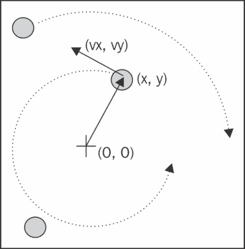
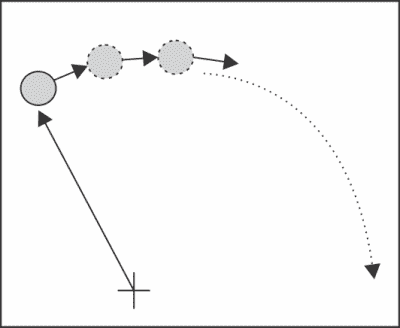
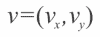
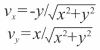
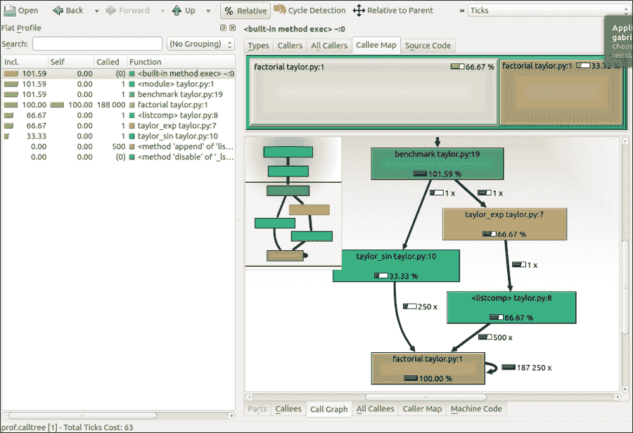

# 第一章：基准测试和分析

在加快代码速度时，识别程序中的慢速部分是最重要的任务。在大多数情况下，瓶颈只占程序的一小部分。通过专门解决这些关键点，你可以专注于需要改进的部分，而无需在微优化上浪费时间。

**分析**是允许我们定位瓶颈的技术。**分析器**是一个运行代码并观察每个函数运行所需时间的程序，检测程序中的慢速部分。Python 提供了几个工具来帮助我们找到这些瓶颈并导航性能指标。在本章中，我们将学习如何使用标准`cProfile`模块、`line_profiler`和`memory_profiler`。我们还将学习如何使用程序**KCachegrind**来解释分析结果。

你可能还想评估你程序的总体执行时间，看看你的更改是如何影响的。我们将学习如何编写基准测试以及如何准确计时你的程序。

# 设计你的应用程序

当你设计一个性能密集型程序时，第一步是编写代码时不要考虑优化；引用*唐纳德·克努特*的话：

> 过早的优化是万恶之源。

在早期开发阶段，程序的设计可能会迅速变化，需要你重写和重新组织大量代码。通过在不考虑优化的情况下测试不同的原型，你可以更多地了解你的程序，这将帮助你做出更好的设计决策。

在优化代码时你应该记住的咒语如下：

+   **让它运行**：我们必须让软件处于工作状态，并确保它产生正确的结果。这一阶段旨在探索我们试图解决的问题，并在早期阶段发现主要的设计问题。

+   **让它正确**：我们想确保程序的设计是稳固的。在尝试任何性能优化之前应该进行重构。这实际上有助于将应用程序分解成独立且一致的单元，这些单元更容易维护。

+   **让它变得更快**：一旦我们的程序运行良好并且有良好的设计，我们希望优化程序中不够快的部分。如果内存使用构成问题，我们可能还想优化内存使用。

在本节中，我们将分析一个测试应用程序——**粒子模拟器**。模拟器是一个程序，它根据我们将建立的一系列法则，随着时间的推移演变一些粒子。这些粒子可以是抽象实体，也可以对应于物理对象。例如，它们可以是桌子上移动的台球、气体中的分子、在空间中移动的恒星、烟雾粒子、室内的流体等等。

这些模拟在物理学、化学和天文学等领域非常有用，用于模拟物理系统的程序通常是性能密集型的。为了研究现实系统，通常需要模拟尽可能多的物体。

在我们的第一个例子中，我们将模拟一个包含粒子围绕中心点以不同速度不断旋转的系统，就像时钟的指针一样。

运行我们的模拟所需的信息将是粒子的起始位置、速度和旋转方向。从这些元素中，我们必须计算粒子在下一个时间瞬间的位置。



圆周运动的基本特征是粒子始终垂直于连接粒子和中心的连线方向移动，如前图所示。为了移动粒子，我们只需通过在运动方向上采取一系列非常小的步骤来改变其位置，如下图所示：



我们将首先以面向对象的方式设计应用程序。根据我们的要求，自然有一个通用的 `Particle` 类，它简单地存储粒子的位置 (*x*，*y*) 和其角速度：

```py
class Particle:
    def __init__(self, x, y, ang_speed):
        self.x = x
        self.y = y
        self.ang_speed = ang_speed
```

另一个类，称为 `ParticleSimulator`，将封装我们的运动定律，并负责随时间改变粒子的位置。`__init__` 方法将存储 `Particle` 实例的列表，而 `evolve` 方法将根据我们的定律改变粒子的位置。

我们希望粒子围绕点 (*x*，*y*) 旋转，在这里，它等于 (0, 0)，以恒定速度。粒子的方向始终垂直于从中心（参见图章的第一幅图）的方向。为了找到这个向量



（对应于 Python 变量 `v_x` 和 `v_y`）使用以下公式就足够了：



如果我们让其中一个粒子移动，经过一定的时间 *dt*，它将沿着圆形路径移动，到达另一个位置。为了让粒子沿着这条轨迹移动，我们必须将时间间隔 *dt* 分成非常小的时间步长，其中粒子沿着圆周切线方向移动。最终结果只是圆形运动的近似，实际上它类似于多边形。时间步长应该非常小，否则粒子的轨迹会迅速发散，如下图所示：

.jpg)

以更简化的方式，为了计算时间 *dt* 时的粒子位置，我们必须执行以下步骤：

1.  计算运动方向：`v_x`，`v_y`。

1.  计算位移 (`d_x`，`d_y`)，它是时间和速度的乘积，并遵循运动方向。

1.  重复步骤 1 和 2 足够长的时间步，以覆盖总时间*dt*。

以下代码显示了完整的`ParticleSimulator`实现：

```py
class ParticleSimulator:

    def __init__(self, particles):
        self.particles = particles

    def evolve(self, dt):
        timestep = 0.00001
        nsteps = int(dt/timestep)

        for i in range(nsteps):
            for p in self.particles:

 # 1\. calculate the direction
 norm = (p.x**2 + p.y**2)**0.5
 v_x = (-p.y)/norm
 v_y = p.x/norm

 # 2\. calculate the displacement
 d_x = timestep * p.ang_speed * v_x
 d_y = timestep * p.ang_speed * v_y

 p.x += d_x
 p.y += d_y
 # 3\. repeat for all the time steps

```

我们可以使用`matplotlib`库来可视化我们的粒子。这个库不包括在 Python 标准库中。要安装它，您可以按照官方文档中的说明进行操作：

[`matplotlib.org/users/installing.html`](http://matplotlib.org/users/installing.html)

### 注意

或者，您可以使用包含`matplotlib`和本书中使用的其他大多数第三方包的 Anaconda Python 发行版（[`store.continuum.io/cshop/anaconda/`](https://store.continuum.io/cshop/anaconda/))。Anaconda 是免费的，适用于 Linux、Windows 和 Mac。

`matplotlib`中的`plot`函数可以将我们的粒子显示在笛卡尔网格上的点，而`FuncAnimation`类可以动画化粒子随时间的变化。

`visualize`函数通过获取粒子模拟器并在动画图中显示轨迹来实现这一点。

`visualize`函数的结构如下：

+   设置坐标轴并使用绘图函数将粒子显示为点

+   编写一个初始化函数（`init`）和一个更新函数（`animate`），使用`line.set_data`方法改变数据点的*x*，*y*坐标

+   创建一个`FuncAnimation`实例，传递函数和一些参数

+   使用`plt.show()`运行动画

    可视化函数的完整实现如下：

    ```py
    from matplotlib import pyplot as plt
    from matplotlib import animation

    def visualize(simulator):

        X = [p.x for p in simulator.particles]
        Y = [p.y for p in simulator.particles]

        fig = plt.figure()
        ax = plt.subplot(111, aspect='equal')
        line, = ax.plot(X, Y, 'ro')

        # Axis limits
        plt.xlim(-1, 1)
        plt.ylim(-1, 1)

        # It will be run when the animation starts
        def init():
            line.set_data([], [])
            return line,

        def animate(i):
            # We let the particle evolve for 0.1 time units
            simulator.evolve(0.01)
            X = [p.x for p in simulator.particles]
            Y = [p.y for p in simulator.particles]

            line.set_data(X, Y)
            return line,

        # Call the animate function each 10 ms
        anim = animation.FuncAnimation(fig, animate, init_func=init, blit=True,# Efficient animation
                                       interval=10)
        plt.show()
    ```

最后，我们定义了一个小的测试函数——`test_visualize`——它动画化了一个由三个不同方向旋转的粒子组成的系统。注意，第三个粒子比其他粒子快三倍完成一圈：

```py
def test_visualize():
    particles = [Particle( 0.3,  0.5, +1),
                 Particle( 0.0, -0.5, -1),
                 Particle(-0.1, -0.4, +3)]

    simulator = ParticleSimulator(particles)
    visualize(simulator)

if __name__ == '__main__':
    test_visualize()
```

# 编写测试和基准

现在我们有一个工作的模拟器，我们可以开始测量我们的性能并调整我们的代码，以便我们的模拟器可以处理尽可能多的粒子。这个过程的第一步是编写一个测试和一个基准。

我们需要一个测试来检查模拟产生的结果是否正确。在优化过程中，我们将重写代码以尝试不同的解决方案；这样做可能会轻易引入错误。维护一个坚实的测试套件对于避免在损坏的代码上浪费时间至关重要。

我们的测试将使用三个粒子，并让系统演化 0.1 个时间单位。然后，我们将我们的结果与参考实现的结果进行比较，直到一定的精度：

```py
def test():
    particles = [Particle( 0.3,  0.5, +1),
                 Particle( 0.0, -0.5, -1),
                 Particle(-0.1, -0.4, +3)]

    simulator = ParticleSimulator(particles)

    simulator.evolve(0.1)

    p0, p1, p2 = particles

    def fequal(a, b):
        return abs(a - b) < 1e-5

    assert fequal(p0.x, 0.2102698450356825)
    assert fequal(p0.y, 0.5438635787296997)

    assert fequal(p1.x, -0.0993347660567358)
    assert fequal(p1.y, -0.4900342888538049)

    assert fequal(p2.x,  0.1913585038252641)
    assert fequal(p2.y, -0.3652272210744360)

if __name__ == '__main__':
    test()
```

我们还希望编写一个基准，可以测量我们应用程序的性能。这将提供有关我们相对于先前实现的改进程度的指示。

在我们的基准测试中，我们实例化了 100 个具有随机坐标和角速度的`Particle`对象，并将它们输入到`ParticleSimulator`类中。然后，我们让系统演化 0.1 个时间单位：

```py
from random import uniform

def benchmark():
    particles = [Particle(uniform(-1.0, 1.0),
                          uniform(-1.0, 1.0),
                          uniform(-1.0, 1.0))
                  for i in range(1000)]

    simulator = ParticleSimulator(particles)
    simulator.evolve(0.1)

if __name__ == '__main__':
    benchmark()
```

## 测试基准的时间

你可以通过使用 Unix 的 `time` 命令从命令行轻松测量任何进程的执行时间：

```py
$ time python simul.py
real    0m1.051s
user    0m1.022s
sys    0m0.028s

```

### 注意

`time` 命令在 Windows 上不可用，但可以在从官方网站 [`www.cygwin.com/`](http://www.cygwin.com/) 下载的 `cygwin` 命令行界面中找到。

默认情况下，`time` 命令显示三个指标：

+   `real`：从开始到结束运行进程的实际时间，就像用秒表测量的人一样

+   `user`：所有 CPU 在计算过程中累计花费的时间

+   `sys`：所有 CPU 在与系统相关的任务（如内存分配）中累计花费的时间

注意，有时 `user` + `sys` 可能会大于 `real`，因为多个处理器可能并行工作。

### 提示

`time` 还提供了几个格式化选项；要了解概述，你可以查看其手册（使用 `man time` 命令）。如果你想要所有可用指标的总览，可以使用 `-v` 选项。

Unix 的 `time` 命令是衡量你程序的好方法。为了获得更精确的测量，基准测试应该运行足够长的时间（以秒为单位），使得过程的设置和拆除与执行时间相比变得很小。`user` 指标适合作为 CPU 性能的监控器，因为 `real` 指标还包括在其他进程或等待 I/O 操作中花费的时间。

另一个用于计时 Python 脚本的有用程序是 `timeit` 模块。该模块将代码片段在循环中运行 *n* 次，并测量所花费的时间。然后，它重复此操作 *r* 次（默认情况下，*r* 的值为 3）并取最佳运行结果。由于此过程，`timeit` 适用于准确计时独立的小语句。

`timeit` 模块可以用作 Python 模块，从命令行或从 **IPython** 中使用。

IPython 是一个专为交互式使用设计的 Python 命令行界面。它增强了 tab 自动完成和许多时间、性能分析和调试代码的实用工具。我们将利用这个 shell 在整本书中尝试代码片段。IPython 命令行界面接受 **魔法命令**——以 `%` 符号开头的语句，这些语句增强了 shell 的特殊行为。以 `%%` 开头的命令称为 **单元魔法命令**，这些命令可以应用于多行代码片段（称为 **单元**）。

IPython 在大多数 Linux 发行版中可用，并包含在 Anaconda 中。你可以按照官方文档中的安装说明进行操作：

[`ipython.org/install.html`](http://ipython.org/install.html)

### 提示

你可以将 IPython 用作常规的 Python 命令行界面（`ipython`），但它也提供基于 Qt 的版本（`ipython qtconsole`）以及强大的基于浏览器的界面（`ipython notebook`）。

在 IPython 和命令行接口中，可以使用 `-n` 和 `-r` 选项指定循环或重复的次数，否则它们将自动确定。当从命令行调用 `timeit` 时，你也可以提供一个在循环执行语句之前运行的设置代码。

在以下代码中，我们展示了如何从 IPython、命令行以及作为 Python 模块使用 timeit：

```py
# IPython Interface
$ ipython
In [1]: from simul import benchmark
In [2]: %timeit benchmark()
1 loops, best of 3: 782 ms per loop

# Command Line Interface
$ python -m timeit -s 'from simul import benchmark' 'benchmark()'10 loops, best of 3: 826 msec per loop

# Python Interface
# put this function into the simul.py script

import timeit
result = timeit.timeit('benchmark()',
                                   setup='from __main__ import benchmark', number=10)
# result is the time (in seconds) to run the whole loop

result = timeit.repeat('benchmark()', setup='from __main__ import benchmark', number=10, repeat=3)
# result is a list containing the time of each repetition (repeat=3 in this case)
```

注意，虽然命令行和 IPython 接口会自动确定一个合理的 `n` 值，但 Python 接口需要你显式地将其作为 `number` 参数传递。

# 使用 cProfile 寻找瓶颈

在评估程序的执行时间后，我们准备识别需要性能调整的代码部分。这些部分通常与程序的大小相比相当小。

历史上，Python 的标准库中有三个不同的配置文件模块：

+   **profile** 模块：此模块是用纯 Python 编写的，并为程序执行添加了显著的开销。它在标准库中的存在主要是由于其可扩展性。

+   **hotshot** 模块：一个旨在最小化配置文件开销的 C 模块。Python 社区不建议使用它，并且在 Python 3 中不可用。

+   **cProfile** 模块：主要的配置文件模块，其接口类似于 `profile`。它具有较小的开销，适合作为通用配置文件。

我们将展示如何以两种不同的方式使用 cProfile 模块：

+   从命令行

+   从 IPython

为了使用 `cProfile`，不需要对代码进行任何更改，可以直接在现有的 Python 脚本或函数上执行。

你可以使用以下方式从命令行使用 `cProfile`：

```py
$ python -m cProfile simul.py

```

这将打印出包含多个配置文件指标的冗长输出。你可以使用 `-s` 选项按某个指标排序输出：

```py
$ python -m cProfile -s tottime simul.py

```

你可以通过传递 `-o` 选项将输出文件保存为 `stats` 模块和其他工具可读的格式：

```py
$ python -m cProfile -o prof.out simul.py

```

你还可以从 IPython 中交互式地配置文件。`%prun` 魔法命令允许你使用 `cProfile` 配置文件：

```py
In [1]: from simul import benchmark
In [2]: %prun benchmark()
         707 function calls in 0.793 seconds

   Ordered by: internal time

   ncalls  tottime  percall  cumtime  percall filename:lineno(function)
        1    0.792    0.792    0.792    0.792 simul.py:12(evolve)
        1    0.000    0.000    0.000    0.000 simul.py:100(<listcomp>)
      300    0.000    0.000    0.000    0.000 random.py:331(uniform)
      100    0.000    0.000    0.000    0.000 simul.py:2(__init__)
        1    0.000    0.000    0.793    0.793 {built-in method exec}
      300    0.000    0.000    0.000    0.000 {method 'random' of '_random.Random' objects}
        1    0.000    0.000    0.793    0.793 simul.py:99(benchmark)
        1    0.000    0.000    0.793    0.793 <string>:1(<module>)
        1    0.000    0.000    0.000    0.000 simul.py:9(__init__)
        1    0.000    0.000    0.000    0.000 {method 'disable' of '_lsprof.Profiler' objects}
```

`cProfile` 的输出分为五列：

+   `ncalls`：函数被调用的次数。

+   `tottime`：在函数中花费的总时间，不考虑对其他函数的调用。

+   `cumtime`：在函数中花费的时间，包括其他函数调用。

+   `percall`：函数单次调用的花费时间——可以通过将总时间或累积时间除以调用次数来获得。

+   `filename:lineno`：文件名和相应的行号。当调用 C 扩展模块时，此信息不存在。

最重要的指标是 `tottime`，即函数体中实际花费的时间，不包括子调用。在我们的案例中，大部分时间都花在了 `evolve` 函数上。我们可以想象，循环是代码中需要性能调整的部分。

对于具有大量调用和子调用的程序，以文本方式分析数据可能会令人望而却步。一些图形工具通过改进交互式界面来辅助任务。

KCachegrind 是一个 GUI（图形用户界面），用于分析不同程序的剖析输出。

### 注意

KCachegrind 可在 Ubuntu 13.10 官方仓库中找到。Qt 端口，QCacheGrind 可以从以下网页下载到 Windows：

[`sourceforge.net/projects/qcachegrindwin/`](http://sourceforge.net/projects/qcachegrindwin/)

Mac 用户可以通过 Mac Ports ([`www.macports.org/`](http://www.macports.org/))编译 QCacheGrind，按照此链接博客文章中的说明进行操作：

[`blogs.perl.org/users/rurban/2013/04/install-kachegrind-on-macosx-with-ports.html`](http://blogs.perl.org/users/rurban/2013/04/install-kachegrind-on-macosx-with-ports.html)

KCachegrind 不能直接读取由`cProfile`产生的输出文件。幸运的是，`pyprof2calltree`第三方 Python 模块能够将`cProfile`输出文件转换为 KCachegrind 可读的格式。

您可以从源代码安装`pyprof2calltree`([`pypi.python.org/pypi/pyprof2calltree/`](https://pypi.python.org/pypi/pyprof2calltree/))或从 Python 包索引([`pypi.python.org/`](https://pypi.python.org/))安装。

为了最好地展示 KCachegrind 的功能，我们将使用一个具有更多样化结构的另一个示例。我们定义一个递归函数`factorial`，以及两个使用`factorial`的其他函数，它们是`taylor_exp`和`taylor_sin`。它们代表`exp(x)`和`sin(x)`的泰勒近似的多项式系数：

```py
def factorial(n):
    if n == 0:
        return 1.0
    else:
        return float(n) * factorial(n-1)

def taylor_exp(n):
    return [1.0/factorial(i) for i in range(n)]

def taylor_sin(n):
    res = []
    for i in range(n):
        if i % 2 == 1:
           res.append((-1)**((i-1)/2)/float(factorial(i)))
        else:
           res.append(0.0)
    return res

def benchmark():
    taylor_exp(500)
    taylor_sin(500)

if __name__ == '__main__':
    benchmark()
```

我们需要首先生成`cProfile`输出文件：

```py
$ python -m cProfile -o prof.out taylor.py

```

然后，我们可以使用`pyprof2calltree`转换输出文件并启动 KCachegrind：

```py
$ pyprof2calltree -i prof.out -o prof.calltree
$ kcachegrind prof.calltree # or qcachegrind prof.calltree

```



上一张图片是 KCachegrind 用户界面的截图。在左侧，我们有一个与`cProfile`相当输出的结果。实际的列名略有不同：**Incl.**对应于`cProfile`模块的`cumtime`；**Self**对应于`tottime`。通过在菜单栏上点击**Relative**按钮，数值以百分比形式给出。通过点击列标题，您可以按相应属性排序。

在右上角，点击**Callee Map**标签包含函数成本的图表。在图表中，每个函数由一个矩形表示，函数花费的时间百分比与矩形的面积成正比。矩形可以包含表示对其他函数子调用的子矩形。在这种情况下，我们可以很容易地看到有两个矩形表示`factorial`函数。左侧的对应于`taylor_exp`的调用，右侧的对应于`taylor_sin`的调用。

在右下角，您可以通过点击**调用图**选项卡来显示另一个图表——调用**图**。调用图是函数之间调用关系的图形表示：每个方块代表一个函数，箭头表示调用关系。例如，`taylor_exp`调用<listcomp>（一个列表推导），它调用`factorial` 500 次；`taylor_sin`调用`factorial` 250 次。KCachegrind 还可以检测递归调用：`factorial`调用自身 187250 次。

您可以通过双击矩形导航到**调用图**或**调用者映射**选项卡；界面将相应更新，显示时间属性相对于所选函数。例如，双击`taylor_exp`将导致图表更改，仅显示`taylor_exp`对总成本的贡献。

### 注意

**Gprof2Dot** ([`code.google.com/p/jrfonseca/wiki/Gprof2Dot`](https://code.google.com/p/jrfonseca/wiki/Gprof2Dot)) 是另一个流行的工具，用于生成调用图。从支持的剖析器产生的输出文件开始，它将生成一个`.dot`图，表示调用图。

# 使用 line_profiler 逐行分析

现在我们知道了哪个函数需要优化，我们可以使用`line_profiler`模块，它以逐行的方式显示时间消耗。这在难以确定哪些语句成本高昂的情况下非常有用。`line_profiler`模块是一个第三方模块，可在 Python 包索引上找到，并可通过其网站上的说明进行安装：

[`pythonhosted.org/line_profiler/`](http://pythonhosted.org/line_profiler/)

为了使用`line_profiler`，我们需要将`@profile`装饰器应用到我们打算监控的函数上。请注意，您不需要从另一个模块导入`profile`函数，因为它在运行分析脚本`kernprof.py`时会被注入到全局命名空间中。为了生成程序的配置文件输出，我们需要将`@profile`装饰器添加到`evolve`函数上：

```py
@profile
def evolve:
    # code
```

脚本`kernprof.py`将生成一个输出文件，并将分析结果打印到标准输出。我们应该使用两个选项来运行脚本：

+   `-l` 选项用于使用`line_profiler`函数

+   `-v` 选项用于立即在屏幕上打印结果

    ```py
    $ kernprof.py -l -v simul.py

    ```

还可以在 IPython shell 中运行剖析器以进行交互式编辑。您应该首先加载`line_profiler`扩展，这将提供`lprun`魔法命令。通过使用该命令，您可以避免添加`@profile`装饰器。

```py
In [1]: %load_ext line_profiler
In [2]: from simul import benchmark, ParticleSimulator
In [3]: %lprun -f ParticleSimulator.evolve benchmark()

Timer unit: 1e-06 s

File: simul.py
Function: evolve at line 12
Total time: 5.31684 s

Line #      Hits         Time  Per Hit   % Time  Line Contents
==============================================================
    12                                               def evolve(self, dt):
    13         1            9      9.0      0.0          timestep = 0.00001
    14         1            4      4.0      0.0          nsteps = int(dt/timestep)
    15                                                   
    16     10001         5837      0.6      0.1          for i in range(nsteps):
    17   1010000       517504      0.5      9.7              for p 
in self.particles:
    18                                           
    19   1000000       963498      1.0     18.1                  norm = (p.x**2 + p.y**2)**0.5
    20   1000000       621063      0.6     11.7                  v_x = (-p.y)/norm
    21   1000000       577882      0.6     10.9                  v_y = p.x/norm
    22                                                           
    23   1000000       672811      0.7     12.7                  d_x = timestep * p.ang_speed * v_x
    24   1000000       685092      0.7     12.9                  d_y = timestep * p.ang_speed * v_y
    25                                           
    26   1000000       650802      0.7     12.2                  p.x += d_x
    27   1000000       622337      0.6     11.7                  p.y += d_y
```

输出非常直观，分为几列：

+   **行号**：运行的行号

+   **命中次数**：该行运行的次数

+   **时间**：该行的执行时间，以微秒为单位（时间）

+   **每次命中**：时间除以命中次数

+   **% 时间**：执行该行所花费的总时间的比例

+   **行内容**：相应行的源代码

通过查看百分比列，我们可以大致了解时间花费在哪里。在这种情况下，`for`循环体中有几个语句，每个语句的成本大约为 10-20%。

# 优化我们的代码

现在我们已经确切地知道了时间是如何花费的，我们可以修改代码并评估性能的变化。

有几种不同的方法可以调整我们的纯 Python 代码。通常产生最显著结果的方法是改变**算法**。在这种情况下，与其计算速度并添加小步骤，不如用半径`r`和角度`alpha`（而不是`x`和`y`）表示运动方程，然后使用以下方程计算圆上的点：

```py
x = r * cos(alpha)
y = r * sin(alpha)
```

另一种方法是通过最小化指令的数量。例如，我们可以预先计算因子`timestep * p.ang_speed`，这个因子不会随时间变化。我们可以交换循环顺序（首先迭代粒子，然后迭代时间步），并将因子的计算放在循环外的粒子中。

行内分析还显示，即使是简单的赋值操作也可能花费相当多的时间。例如，以下语句占用了超过 10%的总时间：

```py
 v_x = (-p.y)/norm
```

因此，优化循环的一种方法是通过减少赋值操作的数量。为了做到这一点，我们可以牺牲可读性，通过将表达式重写为单个稍微复杂一些的语句来避免中间变量（注意，右侧在赋值给变量之前被完全评估）：

```py
p.x, p.y = p.x - t_x_ang*p.y/norm, p.y + t_x_ang * p.x/norm
```

这导致以下代码：

```py
    def evolve_fast(self, dt):
        timestep = 0.00001
        nsteps = int(dt/timestep)

        # Loop order is changed
        for p in self.particles:
            t_x_ang = timestep * p.ang_speed
            for i in range(nsteps):
                norm = (p.x**2 + p.y**2)**0.5
                p.x, p.y = (p.x - t_x_ang *  p.y/norm,p.y + t_x_ang * p.x/norm)

```

应用更改后，我们应该通过运行我们的测试来确保结果仍然相同。然后我们可以使用我们的基准来比较执行时间：

```py
$ time python simul.py # Performance Tuned
real    0m0.756s
user    0m0.714s
sys    0m0.036s

$ time python simul.py # Original
real    0m0.863s
user    0m0.831s
sys    0m0.028s

```

通过对纯 Python 进行操作，我们只获得了速度的微小提升。

# `dis`模块

有时候，很难评估 Python 语句将执行多少操作。在本节中，我们将探索 Python 内部机制来估计 Python 语句的性能。Python 代码被转换为中间表示——称为**字节码**——由 Python 虚拟机执行。

为了帮助检查代码如何转换为字节码，我们可以使用 Python 模块`dis`（反汇编）。它的使用非常简单，只需在`ParticleSimulator.evolve`方法上调用函数`dis.dis`即可：

```py
import dis
from simul import ParticleSimulator
dis.dis(ParticleSimulator.evolve)

```

这将为每一行生成一个字节码指令列表。例如，语句`v_x = (-p.y)/norm`在以下指令集中展开：

```py
20         85 LOAD_FAST                5 (p)
             88 LOAD_ATTR                4 (y)
             91 UNARY_NEGATIVE       
             92 LOAD_FAST                6 (norm)
             95 BINARY_TRUE_DIVIDE   
             96 STORE_FAST               7 (v_x)
```

`LOAD_FAST`将变量`p`的引用加载到栈上，`LOAD_ATTR`加载栈顶元素的`y`属性。其他指令（`UNARY_NEGATIVE`和`BINARY_TRUE_DIVIDE`）在栈顶元素上执行算术运算。最后，结果存储在`v_x`中（`STORE_FAST`）。

通过分析完整的 `dis` 输出，我们可以看到循环的第一个版本产生了 51 条字节码指令，而第二个版本被转换成了 35 条指令。

`dis` 模块有助于发现语句是如何被转换的，并主要作为探索和学习 Python 字节码表示的工具。

为了进一步提高我们的性能，我们可以继续尝试找出其他方法来减少指令的数量。然而，很明显，这种方法有一些限制，可能不是完成这项工作的正确工具。在下一章中，我们将看到如何借助 NumPy 加快这类计算。

# 使用 `memory_profiler` 分析内存使用情况

在某些情况下，内存使用可能成为一个问题。例如，如果我们想要处理大量的粒子，由于创建了大量的 `Particle` 实例，我们将会有内存开销。

`memory_profiler` 模块以一种类似于 `line_profiler` 的方式总结进程的内存使用情况。

### 注意

`memory_profiler` 包也可在 Python 包索引中找到。你还应该安装 `psutil` 模块（[`code.google.com/p/psutil/`](https://code.google.com/p/psutil/)）作为可选依赖项，这将使 `memory_profiler` 运行得更快。

就像 `line_profiler` 一样，`memory_profiler` 也需要源代码的仪器化，通过在我们要监控的函数上放置 `@profile` 装饰器。在我们的例子中，我们想要分析 `benchmark` 函数。

我们可以稍微修改 `benchmark` 以实例化大量的 `Particle` 实例（100000 个）并减少模拟时间：

```py
def benchmark_memory():
    particles = [Particle(uniform(-1.0, 1.0),
                          uniform(-1.0, 1.0),
                          uniform(-1.0, 1.0))
                  for i in range(100000)]

    simulator = ParticleSimulator(particles)
    simulator.evolve(0.001)
```

我们可以通过 IPython 壳中的魔法命令 `%mprun` 使用 `memory_profiler`：

```py
In [1]: %load_ext memory_profiler
In [2]: from simul import benchmark_memory
In [3]: %mprun -f benchmark_memory benchmark_memory()

Line #    Mem usage    Increment   Line Contents
==============================================
   135     45.5 MiB      0.0 MiB   def benchmark_memory():
   136     45.5 MiB      0.0 MiB       particles = [Particle(uniform(-1.0, 1.0),
   137                                                       uniform(-1.0, 1.0),
   138                                                       uniform(-1.0, 1.0))
 139     71.2 MiB     25.7 MiB                     for i in range(100000)]
   140                                 
   141     71.2 MiB      0.0 MiB       simulator = ParticleSimulator(particles)
   142     71.3 MiB      0.1 MiB       simulator.evolve(0.001)
```

### 小贴士

在添加了 `@profile` 装饰器后，可以使用 `mprof run` 命令从壳中运行 `memory_profiler`。

从输出中我们可以看到，100000 个 `Particle` 对象占用了 25.7 **MiB** 的内存。

### 小贴士

1 MiB（梅比字节）相当于 1024² = 1,048,576 字节。它与 1 MB（兆字节）不同，1 MB 相当于 1000² = 1,000,000 字节。

我们可以在 `Particle` 类上使用 `__slots__` 来减少其内存占用。这个特性通过避免在内部字典中存储实例变量来节省一些内存。这种优化的缺点是：它阻止了添加 `__slots__` 中未指定的属性（要在 Python 2 中使用此功能，你应该确保你正在使用新式类）：

```py
class Particle: 
# class Particle(object):  # New-style class for Python 2

    __slots__ = ('x', 'y', 'ang_speed')

    def __init__(self, x, y, ang_speed):
        self.x = x
        self.y = y
        self.ang_speed = ang_speedWe can now re-run our benchmark:
In [1]: %load_ext memory_profiler
In [2]: from simul import benchmark_memory
In [3]: %mprun -f benchmark_memory benchmark_memory()

Line #    Mem usage    Increment   Line Contents
==============================================
   138     45.5 MiB      0.0 MiB   def benchmark_memory():
   139     45.5 MiB      0.0 MiB       particles = [Particle(uniform(-1.0, 1.0),
   140                                                       uniform(-1.0, 1.0),
   141                                                       uniform(-1.0, 1.0))
 142     60.2 MiB     14.7 MiB                     for i in range(100000)]
   143                                 
   144     60.2 MiB      0.0 MiB       simulator = ParticleSimulator(particles)
   145     60.3 MiB      0.1 MiB       simulator.evolve(0.001)
```

通过使用 `__slots__` 重新编写 `Particle` 类，我们可以节省 11 MiB 的内存。

# 纯 Python 代码的性能调优技巧

作为一条经验法则，在优化纯 Python 代码时，你应该查看标准库中可用的内容。标准库包含针对最常见的数据结构（如列表、字典和集合）的巧妙算法。此外，许多标准库模块是用 C 实现的，具有快速的执行时间。然而，始终计时不同的解决方案是很重要的——结果往往是不可预测的。

`collections`模块提供了额外的数据容器，可以高效地处理一些常见操作。例如，当你需要从开始处弹出项目并在末尾追加新项目时，你可以使用`deque`代替列表。`collections`模块还包括一个`Counter`类，可以用来计算可迭代对象中的重复元素。请注意，`Counter`可能比用标准循环在字典中编写的等效代码要慢：

```py
def counter_1():
    items = [random.randint(0, 10) for i in range(10000)]
    return Counter(items)

def counter_2():
    items = [random.randint(0, 10) for i in range(10000)]
    counter = {}
    for item in items:
        if item not in counter:
            counter[item] = 0
        else:
            counter[item] += 1
    return counter
```

你可以将代码放入一个名为`purepy.py`的文件中，并通过 IPython 进行计时：

```py
In [1]: import purepy
In [2]: %timeit purepy.counter_1()
100 loops, best of 3: 10.1 ms per loop
In [3]: %timeit purepy.counter_2()
100 loops, best of 3: 9.11 ms per loop

```

通常，应该优先使用列表推导和生成器，而不是显式循环。即使与标准循环相比速度提升不大，这也是一个好习惯，因为它提高了可读性。在以下示例中，我们可以看到，列表推导和生成器表达式与函数`sum`结合时比显式循环更快：

```py
def loop():
    res = []
    for i in range(100000):
        res.append(i * i)
    return sum(res)

def comprehension():
    return sum([i * i for i in range(100000)])

def generator():
    return sum(i * i for i in range(100000))
```

我们可以将这些函数添加到`purepy.py`中，并用 IPython 进行测试：

```py
In [1]: import purepy
In [2]: %timeit purepy.loop()
100 loops, best of 3: 8.26 ms per loop
In [3]: %timeit purepy.comprehension()
100 loops, best of 3: 5.39 ms per loop
In [4]: %timeit purepy.generator()
100 loops, best of 3: 5.07 ms per loop

```

`bisect`模块可以帮助快速插入和检索元素，同时保持列表排序。

纯 Python 代码的原始优化并不非常有效，除非有实质性的算法优势。加快你代码的第二种最佳方式是使用专门为此目的设计的库，如`numpy`，或者使用**Cython**在更接近底层语言（如 C）中编写扩展模块。

# 摘要

在本章中，我们介绍了优化的基本原理，并将这些原理应用于我们的测试应用。最重要的是在编辑代码之前识别应用中的瓶颈。我们看到了如何使用`time` Unix 命令和 Python 的`timeit`模块编写和计时基准测试。我们学习了如何使用`cProfile`、`line_profiler`和`memory_profiler`来分析我们的应用，以及如何使用 KCachegrind 图形化地导航分析数据。我们还概述了一些利用标准库中可用的工具来优化纯 Python 代码的策略。

在下一章中，我们将看到如何使用`numpy`以简单方便的方式显著加快计算速度。
