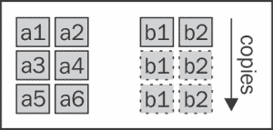
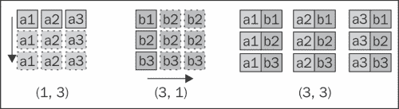
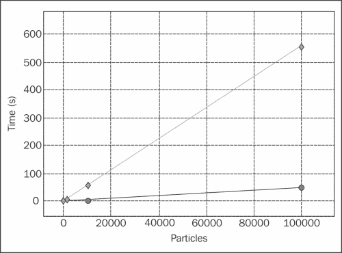

# 第二章. 使用 NumPy 进行快速数组操作

NumPy 是 Python 中科学计算的**事实标准**。它通过提供灵活的多维数组扩展了 Python，允许快速进行数学计算。

NumPy 作为一个框架，允许使用简洁的语法进行复杂操作。多维数组(`numpy.ndarray`)在内部基于 C 数组：这样，开发者可以轻松地将 NumPy 与现有的 C 和 FORTRAN 代码接口。NumPy 构成了 Python 和这些语言编写的遗留代码之间的桥梁。

在本章中，我们将学习如何创建和操作 NumPy 数组。我们还将探索 NumPy 广播功能，以高效简洁的方式重写复杂的数学表达式。

在过去几年中，开发了许多包以进一步提高 NumPy 的速度。我们将探索这些包中的一个，`numexpr`，它优化数组表达式并利用多核架构。

# 开始使用 NumPy

NumPy 围绕其多维数组对象`numpy.ndarray`建立。NumPy 数组是相同数据类型元素的集合；这种基本限制允许 NumPy 以高效的方式打包数据。通过这种方式存储数据，NumPy 可以以高速处理算术和数学运算。

## 创建数组

你可以使用`numpy.array`函数创建 NumPy 数组。它接受一个类似列表的对象（或另一个数组）作为输入，并可选地接受一个表示其数据类型的字符串。你可以使用 IPython shell 交互式测试数组创建，如下所示：

```py
In [1]: import numpy as np
In [2]: a = np.array([0, 1, 2])
```

每个 NumPy 数组都有一个数据类型，可以通过`dtype`属性访问，如下面的代码所示。在下面的代码示例中，`dtype`是一个 64 位整数：

```py
In [3]: a.dtype
Out[3]: dtype('int64')
```

如果我们想将这些数字视为`float`类型的变量，我们可以在`np.array`函数中传递`dtype`参数，或者使用`astype`方法将数组转换为另一种数据类型，如下面的代码所示：

```py
In [4]: a = np.array([1, 2, 3], dtype='float32')
In [5]: a.astype('float32')
Out[5]: array([ 0.,  1.,  2.], dtype=float32)
```

要创建一个二维数组（数组数组），我们可以使用嵌套序列初始化数组，如下所示：

```py
In [6]: a = np.array([[0, 1, 2], [3, 4, 5]])
In [7]: print(a)
Out[7]: [[0 1 2][3 4 5]]
```

以这种方式创建的数组有两个维度——在 NumPy 术语中称为**轴**。这样的数组就像一个包含两行三列的表格。我们可以使用`ndarray.shape`属性访问轴结构：

```py
In [7]: a.shape
Out[7]: (2, 3)
```

数组也可以被重塑，只要形状维度的乘积等于数组中元素的总数。例如，我们可以以下列方式重塑包含 16 个元素的数组：(2, 8)，(4, 4)，或(2, 2, 4)。要重塑数组，我们可以使用`ndarray.reshape`方法或直接更改`ndarray.shape`属性。以下代码展示了`ndarray.reshape`方法的使用：

```py
In [7]: a = np.array([0, 1, 2, 3, 4, 5, 6, 7, 8,9, 10, 11, 12, 13, 14, 15])
In [7]: a.shape
Out[7]: (16,)
In [8]: a.reshape(4, 4) # Equivalent: a.shape = (4, 4)
Out[8]:
array([[ 0,  1,  2,  3],[ 4,  5,  6,  7],[ 8,  9, 10, 11],[12, 13, 14, 15]])
```

由于这个特性，你也可以自由地添加大小为 1 的维度。你可以将包含 16 个元素的数组重塑为(16, 1)，(1, 16)，(16, 1, 1)等等。

NumPy 提供了便捷的函数，如下面的代码所示，用于创建填充零的数组、填充一的数组或没有初始化值（*empty*—它们的实际值没有意义，取决于内存状态）的数组。这些函数接受数组形状作为元组，并可选地接受其 `dtype`：

```py
In [8]: np.zeros((3, 3))
In [9]: np.empty((3, 3))
In [10]: np.ones((3, 3), dtype='float32')
```

在我们的例子中，我们将使用 `numpy.random` 模块在 (0, 1) 区间内生成随机浮点数。在下面的代码中，我们使用 `np.random.rand` 函数生成一个形状为 (3, 3) 的随机数数组：

```py
In [11]: np.random.rand(3, 3)
```

有时，初始化与其它数组形状相似的数组很方便。同样，NumPy 提供了一些方便的函数来实现这个目的，如 `zeros_like`，`empty_like` 和 `ones_like`。这些函数如下所示：

```py
In [12]: np.zeros_like(a)
In [13]: np.empty_like(a)
In [14]: np.ones_like(a)
```

## 访问数组

NumPy 数组接口在浅层上与 Python 列表相似。它们可以使用整数进行索引，也可以使用 `for` 循环进行迭代。以下代码展示了如何索引和迭代一个数组：

```py
In [15]: A = np.array([0, 1, 2, 3, 4, 5, 6, 7, 8])
In [16]: A[0]
Out[16]: 0
In [17]: [a for a in A]
Out[17]: [0, 1, 2, 3, 4, 5, 6, 7, 8]
```

也可以在多维中对数组进行索引。如果我们取一个 (3, 3) 的数组（包含 3 个三元组的数组）并索引第一个元素，我们将获得如下所示的第一个三元组：

```py
In [18]: A = np.array([[0, 1, 2], [3, 4, 5], [6, 7, 8]])
In [19]: A[0]
Out[19]: array([0, 1, 2])
```

我们可以通过添加另一个索引并用逗号分隔来再次索引三元组。要获取第一个三元组的第二个元素，我们可以使用 [0, 1] 进行索引，如下面的代码所示：

```py
In [20]: A[0, 1]
Out[20]: 1
```

NumPy 允许你在单维和多维中切片数组。如果我们对第一维进行索引，我们将得到如下所示的一组三元组：

```py
In [21]: A[0:2]
Out[21]: array([[0, 1, 2],
               [3, 4, 5]])
```

如果我们用 [0:2] 切片数组，对于每个选定的三元组，我们提取前两个元素，结果是一个 (2, 2) 的数组，如下面的代码所示：

```py
In [22]: A[0:2, 0:2]
Out[22]: array([[0, 1],
                [3, 4]])
```

直观地，你可以使用数值索引和切片来更新数组中的值。语法如下：

```py
In [23]: A[0, 1] = 8
In [24]: A[0:2, 0:2] = [[1, 1], [1, 1]]
```

### 小贴士

使用切片语法进行索引速度快，因为它不会复制数组。在 NumPy 术语中，它返回对相同内存区域的 *视图*。如果我们从原始数组中取一个切片并更改其值之一；原始数组也将被更新。以下代码演示了同样的例子：

```py
In [25]: a = np.array([1, 1, 1, 1])
In [26]: a_view = a[0:2]
In [27]: a_view[0] = 2
In [28]: print(a)
Out[28]: [2 1 1 1]
```

我们可以看看另一个例子，展示如何在现实场景中使用切片语法。我们定义一个数组 `r_i`，如下面的代码行所示，它包含一组 10 个坐标（x, y）；其形状将是 (10, 2)：

```py
In [29]: r_i = np.random.rand(10, 2)
```

一个典型的操作是提取每个坐标的 x 分量。换句话说，你想要提取项目 [0, 0]，[1, 0]，[2, 0]，依此类推，结果是一个形状为 (10,) 的数组。有助于思考的是，第一个索引是 *移动的*，而第二个索引是 *固定的*（在 0）。有了这个想法，我们将切片第一轴（移动的那个）上的每个索引，并在第二轴（固定的那个）上取第一个元素，如下面的代码行所示：

```py
In [30]: x_i = r_i[:, 0]
```

另一方面，以下代码表达式将第一个索引固定，第二个索引移动，给出第一个（x, y）坐标：

```py
In [31]: r_0 = r_i[0, :]
```

在最后一个轴上对索引进行切片是可选的；使用`r_i[0]`与`r_i[0, :]`具有相同的效果。

NumPy 允许使用另一个由整数或布尔值组成的 NumPy 数组来索引数组——这被称为*花式索引*。

如果您使用整数数组进行索引，NumPy 将解释这些整数为索引，并返回一个包含它们对应值的数组。如果我们用`[0, 2, 3]`索引包含 10 个元素的数组，我们将得到一个大小为 3 的数组，包含位置 0、2 和 3 的元素。以下代码展示了这一概念：

```py
In [32]: a = np.array([9, 8, 7, 6, 5, 4, 3, 2, 1, 0])
In [33]: idx = np.array([0, 2, 3])
In [34]: a[idx]
Out[34]: array([9, 7, 6])
```

您可以通过为每个维度传递一个数组来在多个维度上使用花式索引。如果我们想提取元素[0, 2]和[1, 3]，我们必须将作用于第一个轴的所有索引打包在一个数组中，将作用于第二个轴的索引打包在另一个数组中。这可以在以下代码中看到：

```py
In [35]: a = np.array([[0, 1, 2], [3, 4, 5],
                       [6, 7, 8], [9, 10, 11]])
In [36]: idx1 = np.array([0, 1])
In [37]: idx2 = np.array([2, 3])
In [38]: a[idx1, idx2]
```

### 提示

您还可以使用普通列表作为索引数组，但不能使用元组。例如，以下两个语句是等价的：

```py
>>> a[np.array([0, 1])] # is equivalent to
>>> a[[0, 1]]
```

然而，如果您使用一个元组，NumPy 将解释以下语句为在多个维度上的索引：

```py
>>> a[(0, 1)] # is equivalent to>>> a[0, 1]
```

索引数组不必是一维的；我们可以以任何形状从原始数组中提取元素。例如，我们可以从原始数组中选择元素以形成一个（2, 2）的数组，如下所示：

```py
In [39]: idx1 = [[0, 1], [3, 2]]
In [40]: idx2 = [[0, 2], [1, 1]]
In [41]: a[idx1, idx2]
Out[41]: array([[ 0,  5],[10,  7]])
```

可以组合数组切片和花式索引功能。例如，如果我们想在坐标数组中交换 x 和 y 列，这很有用。在下面的代码中，第一个索引将遍历所有元素（一个切片），然后对于这些元素，我们首先提取位置 1（y）的元素，然后是位置 0（x）的元素：

```py
In [42]: r_i = np.random(10, 2)
In [43]: r_i[:, [0, 1]] = r_i[:, [1, 0]]
```

当索引数组是布尔值时，有一些不同的规则。布尔数组将像*掩码*一样作用；每个对应于`True`的元素将被提取并放入输出数组中。这个过程如下所示：

```py
In [44]: a = np.array([0, 1, 2, 3, 4, 5])
In [45]: mask = np.array([True, False, True, False, False, False])
In [46]: a[mask]
Out[46]: array([0, 2])
```

在处理多个维度时，同样适用这些规则。此外，如果索引数组与原始数组具有相同的形状，则对应于`True`的元素将被选中并放入结果数组中。

NumPy 中的索引操作是一个相对快速的操作。无论如何，当速度至关重要时，您可以使用稍微快一点的`numpy.take`和`numpy.compress`函数来挤出更多速度。`numpy.take`的第一个参数是我们想要操作的数组，第二个参数是我们想要提取的索引列表。最后一个参数是`axis`；如果没有提供，索引将作用于展平后的数组，否则将沿着指定的轴进行。以下代码显示了`np.take`的使用及其与花式索引的执行时间比较：

```py
In [47]: r_i = np.random(100, 2)
In [48]: idx = np.arange(50) # integers 0 to 50
In [49]: %timeit np.take(r_i, idx, axis=0)
1000000 loops, best of 3: 962 ns per loop
In [50]: %timeit r_i[idx]
100000 loops, best of 3: 3.09 us per loop
```

使用布尔数组索引的类似但更快的方法是 `numpy.compress`，它的工作方式与 `numpy.take` 相同。以下是如何使用 `numpy.compress` 的示例：

```py
In [51]: idx = np.ones(100, dtype='bool') # all True values
In [52]: %timeit np.compress(idx, r_i, axis=0)
1000000 loops, best of 3: 1.65 us per loop
In [53]: %timeit r_i[idx]
100000 loops, best of 3: 5.47 us per loop
```

## 广播

NumPy 的真正力量在于其快速的数学运算。NumPy 使用的策略是通过在匹配的数组之间进行逐元素计算来避免进入 Python。

无论何时你在两个数组（如乘积）上进行算术运算，如果两个操作数具有相同的形状，该操作将以逐元素的方式应用。例如，在乘以两个 (2, 2) 的数组时，操作将在对应元素对之间进行，产生另一个 (2, 2) 的数组，如下面的代码所示：

```py
In [54]: A = np.array([[1, 2], [3, 4]])
In [55]: B = np.array([[5, 6], [7, 8]])
In [56]: A * B
Out[56]: array([[ 5, 12],[21, 32]])
```

如果操作数的形状不匹配，NumPy 将尝试使用某些规则来匹配它们——这被称为 *广播* 功能。如果一个操作数是一个单独的值，它将被应用到数组的每个元素上，如下面的代码所示：

```py
In [57]: A * 2
Out[58]: array([[2, 4],
                [6, 8]])
```

如果操作数是另一个数组，NumPy 将从最后一个轴开始尝试匹配形状。例如，如果我们想将一个形状为 (3, 2) 的数组与一个形状为 (2,) 的数组组合，第二个数组将被重复三次以生成一个 (3, 2) 的数组。数组被 *广播* 以匹配另一个操作数的形状，如下面的图所示：



如果形状不匹配，例如通过将一个形状为 (3, 2) 的数组与一个形状为 (2, 2) 的数组组合，NumPy 将抛出异常。

如果某个轴的大小是 1，数组将在这个轴上重复，直到形状匹配。为了说明这一点，如果我们有一个形状如下的数组：

```py
5, 10, 2
```

并且我们想将它与一个形状为 (5, 1, 2) 的数组广播，数组将在第二个轴上重复 10 次，如下所示：

```py
5, 10, 2
5,  1, 2 → repeated
- - - -
5, 10, 2
```

我们之前看到，我们可以自由地重塑数组以添加大小为 1 的轴。在索引时使用 `numpy.newaxis` 常量将引入一个额外的维度。例如，如果我们有一个 (5, 2) 的数组，并且我们想将它与一个形状为 (5, 10, 2) 的数组结合，我们可以在中间添加一个额外的轴，如下面的代码所示，以获得兼容的 (5, 1, 2) 数组：

```py
In [59]: A = np.random.rand(5, 10, 2)
In [60]: B = np.random.rand(5, 2)
In [61]: A * B[:, np.newaxis, :]
```

这个功能可以用来操作两个数组的所有可能的组合。其中一个应用是 *外积*。如果我们有以下两个数组：

```py
a = [a1, a2, a3]
b = [b1, b2, b3]
```

外积是一个矩阵，包含两个数组元素所有可能的组合（i, j）的乘积，如下面的代码所示：

```py
a x b = a1*b1, a1*b2, a1*b3
        a2*b1, a2*b2, a2*b3
        a3*b1, a3*b2, a3*b3
```

要使用 NumPy 计算这个，我们将在一个维度上重复元素 `[a1, a2, a3]`，在另一个维度上重复元素 `[b1, b2, b3]`，然后取它们的乘积，如下面的图所示：



我们的战略是将数组 `a` 从形状 (3,) 转换为形状 (3, 1)，将数组 `b` 从形状 (3,) 转换为形状 (1, 3)。两个数组在两个维度上广播，并使用以下代码相乘：

```py
AB = a[:, np.newaxis] * b[np.newaxis, :]
```

这个操作非常快且非常有效，因为它避免了 Python 循环并能处理大量元素。

## 数学运算

NumPy 默认包含了广播中最常见的数学运算，从简单的代数到三角学、舍入和逻辑。例如，为了取数组中每个元素的平方根，我们可以使用`numpy.sqrt`函数，如下所示：

```py
In [59]: np.sqrt(np.array([4, 9, 16]))
Out[59]: array([2., 3., 4.])
```

比较运算符在尝试根据条件过滤某些元素时非常有用。想象一下，我们有一个范围在[0, 1]内的随机数数组，我们想要提取大于 0.5 的数字。我们可以在数组上使用`>`运算符；结果将是一个布尔数组，如下所示：

```py
In [60]: a = np.random.rand(5, 3)
In [61]: a > 0.5
Out[61]: array([[ True, False,  True],[ True,  True,  True],[False,  True,  True],[ True,  True, False],[ True,  True, False]], dtype=bool)
```

结果布尔数组然后可以被用作索引来检索大于 0.5 的元素，如下所示：

```py
In [62]: a[a > 0.5]
In [63]: print(a[a>0.5])
[ 0.9755  0.5977  0.8287  0.6214  0.5669  0.9553  0.58940.7196  0.9200  0.5781  0.8281 ]
```

NumPy 还实现了`ndarray.sum`等方法，该方法在轴上对所有元素求和。如果我们有一个形状为(5, 3)的数组，我们可以使用`ndarray.sum`方法，如下所示，来在第一个轴、第二个轴或整个数组上的元素进行求和：

```py
In [64]: a = np.random.rand(5, 3)
In [65]: a.sum(axis=0)
Out[65]: array([ 2.7454,  2.5517,  2.0303])
In [66]: a.sum(axis=1)
Out[66]: array([ 1.7498,  1.2491,  1.8151,  1.9320,  0.5814])
In [67]: a.sum() # With no argument operates on flattened array
Out[67]: 7.3275
```

注意，通过在一个轴上求和元素，我们消除了该轴。从上一个例子中，轴 0 上的求和产生一个(3,)数组，而轴 1 上的求和产生一个(5,)数组。

## 计算范数

我们可以通过计算一组坐标的范数来回顾本节中阐述的基本概念。对于二维向量，范数被定义为：

```py
norm = sqrt(x² + y²)
```

给定一个包含 10 个坐标(x, y)的数组，我们想要找到每个坐标的范数。我们可以通过以下步骤来计算范数：

1.  对坐标进行平方：得到一个包含`(x**2, y**2)`元素的数组。

1.  使用`numpy.sum`在最后一个轴上对这些值进行求和。

1.  使用`numpy.sqrt`逐元素取平方根。

最终表达式可以压缩成一行：

```py
In [68]: r_i = np.random.rand(10, 2)
In [69]: norm = np.sqrt((r_i ** 2).sum(axis=1))
In [70]: print(norm)
[ 0.7314  0.9050  0.5063  0.2553  0.0778   0.91431.3245  0.9486  1.010   1.0212]
```

# 用 NumPy 重写粒子模拟器

在本节中，我们将通过用 NumPy 重写其部分来优化我们的粒子模拟器。从我们在第一章中进行的性能分析来看，我们程序中最慢的部分是包含在`ParticleSimulator.evolve`方法中的以下循环：

```py
for i in range(nsteps):
  for p in self.particles:

    norm = (p.x**2 + p.y**2)**0.5
    v_x = (-p.y)/norm
    v_y = p.x/norm

    d_x = timestep * p.ang_speed * v_x
    d_y = timestep * p.ang_speed * v_y

    p.x += d_x
    p.y += d_y
```

我们可能会注意到循环的主体仅作用于当前粒子。如果我们有一个包含粒子位置和角速度的数组，我们可以使用广播操作重写循环。相比之下，时间步长上的循环依赖于前一步，不能以并行方式处理。

因此，将所有数组坐标存储在一个形状为(nparticles, 2)的数组中，并将角速度存储在一个形状为(nparticles,)的数组中是很自然的。我们将这些数组称为`r_i`和`ang_speed_i`，并使用以下代码进行初始化：

```py
r_i = np.array([[p.x, p.y] for p in self.particles])
ang_speed_i = np.array([p.ang_speed for p in self.particles])
```

速度方向，垂直于向量（x, y），被定义为：

```py
v_x = -y / norm
v_y = x / norm
```

可以使用在“**NumPy 入门**”标题下的“*计算范数*”部分中说明的策略来计算范数。最终的表达式在以下代码行中显示：

```py
norm_i = ((r_i ** 2).sum(axis=1))**0.5
```

对于 (-y, x) 分量，我们首先需要在 `r_i` 中交换 x 和 y 列，然后将第一列乘以 -1，如下所示：

```py
v_i = r_i[:, [1, 0]] / norm_i
v_i[:, 0] *= -1
```

要计算位移，我们需要计算 `v_i`、`ang_speed_i` 和 `timestep` 的乘积。由于 `ang_speed_i` 的形状为 (nparticles,)，它需要一个新轴才能与形状为 (nparticles, 2) 的 `v_i` 操作。我们将使用 `numpy.newaxis` 常量来完成此操作，如下所示：

```py
d_i = timestep * ang_speed_i[:, np.newaxis] * v_i
r_i += d_i
```

循环外部，我们需要按照以下方式更新粒子实例的新坐标 x 和 y：

```py
for i, p in enumerate(self.particles):
  p.x, p.y = r_i[i]
```

总结来说，我们将实现一个名为 `ParticleSimulator.evolve_numpy` 的方法，并将其与重命名为 `ParticleSimulator.evolve_python` 的纯 Python 版本进行基准测试。完整的 `ParticleSimulator.evolve_numpy` 方法如下所示：

```py
def evolve_numpy(self, dt):
  timestep = 0.00001
  nsteps = int(dt/timestep)

  r_i = np.array([[p.x, p.y] for p in self.particles])
  ang_speed_i = np.array([p.ang_speed for p in self.particles])

  for i in range(nsteps):

    norm_i = np.sqrt((r_i ** 2).sum(axis=1))
    v_i = r_i[:, [1, 0]]
    v_i[:, 0] *= -1
    v_i /= norm_i[:, np.newaxis]
    d_i = timestep * ang_speed_i[:, np.newaxis] * v_i
    r_i += d_i

    for i, p in enumerate(self.particles):
      p.x, p.y = r_i[i]
```

我们还更新了基准测试，以便方便地更改粒子数量和模拟方法，如下所示：

```py
def benchmark(npart=100, method='python'):
  particles = [Particle(uniform(-1.0, 1.0),uniform(-1.0, 1.0),uniform(-1.0, 1.0))for i in range(npart)]

  simulator = ParticleSimulator(particles)

  if method=='python':
    simulator.evolve_python(0.1)

  elif method == 'numpy':
    simulator.evolve_numpy(0.1)
```

我们可以在 IPython 会话中运行更新后的基准测试，如下所示：

```py
In [1]: from simul import benchmark
In [2]: %timeit benchmark(100, 'python')
1 loops, best of 3: 614 ms per loop
In [3]: %timeit benchmark(100, 'numpy')
1 loops, best of 3: 415 ms per loop
```

我们有一些改进，但看起来速度提升并不大。NumPy 的强大之处在于处理大型数组。如果我们增加粒子数量，我们会注意到更明显的性能提升。我们可以使用以下代码重新运行具有更多粒子数量的基准测试：

```py
In [4]: %timeit benchmark(1000, 'python')
1 loops, best of 3: 6.13 s per loop
In [5]: %timeit benchmark(1000, 'numpy')
1 loops, best of 3: 852 ms per loop
```

下一个图中的图表是通过运行具有不同粒子数量的基准测试生成的：



图表显示，两种实现都与粒子大小成线性关系，但纯 Python 版本（用菱形表示）的运行时间比 NumPy 版本（用圆圈表示）增长得更快；在更大的尺寸上，NumPy 的优势更加明显。一般来说，当使用 NumPy 时，应尝试将事物打包到大型数组中，并使用广播功能按组进行计算。

# 使用 numexpr 达到最佳性能

当处理复杂表达式时，NumPy 会将中间结果存储在内存中。David M. Cooke 编写了一个名为 `numexpr` 的包，该包可以即时优化和编译数组表达式。它通过优化 CPU 缓存的使用并利用多处理器来实现。

其用法通常很简单，基于一个单一的功能——`numexpr.evaluate`。该函数将包含数组表达式的字符串作为其第一个参数。语法基本上与 NumPy 相同。例如，我们可以以下这种方式计算一个简单的 `a + b * c` 表达式：

```py
a = np.random.rand(10000)
b = np.random.rand(10000)
c = np.random.rand(10000)
d = ne.evaluate('a + b * c')
```

`numexpr` 包在几乎所有情况下都会提高性能，但要实现实质性的优势，你应该使用它来处理大型数组。一个涉及大型数组的应用是计算 *距离矩阵*。在粒子系统中，距离矩阵包含粒子之间所有可能距离。为了计算它，我们首先应该计算连接任意两个粒子（i，j）的所有向量，如下定义：

```py
x_ij = x_j - x_i
y_ij = y_i - y_j
```

然后，我们通过取其范数来计算这个向量的长度，如下面的代码所示：

```py
d_ij = sqrt(x_ij**2 + y_ij**2)
```

我们可以通过使用常规广播规则（操作类似于外积）来用 NumPy 实现这一点：

```py
r = np.random.rand(10000, 2)
r_i = r[:, np.newaxis]
r_j = r[np.newaxis, :]
r_ij = r_j – r_i
```

最后，我们使用以下代码行在最后一个轴上计算范数：

```py
d_ij = np.sqrt((r_ij ** 2).sum(axis=2))
```

使用 `numexpr` 语法重写相同的表达式非常简单。`numexpr` 包不支持数组表达式的切片，因此我们首先需要通过添加一个额外的维度来准备广播操作符，如下所示：

```py
r = np.random(10000, 2)
r_i = r[:, np.newaxis]
r_j = r[np.newaxis, :]
```

在这一点上，我们应该尝试在一个单独的表达式中尽可能多地组合操作，以允许进行显著的优化。

大多数 NumPy 数学函数也存在于 `numexpr` 中；然而，有一个限制。减少操作——比如求和——必须放在最后执行。因此，我们必须首先计算总和，然后退出 `numexpr`，并在另一个表达式中计算平方根。这些操作的 `numexpr` 代码如下：

```py
d_ij = ne.evaluate('sum((r_j – r_i)**2, 2)')
d_ij = ne.evaluate('sqrt(d_ij)')
```

`numexpr` 编译器将通过避免存储中间结果并利用多个处理器来优化内存使用。在 `distance_matrix.py` 文件中，你可以找到实现距离矩阵计算两种版本的函数：`distance_matrix_numpy` 和 `distance_matrix_numexpr`。我们可以这样导入和基准测试它们：

```py
from distance_matrix import (distance_matrix_numpy,
                             distance_matrix_numexpr)
%timeit distance_matrix_numpy(10000)
1 loops, best of 3: 3.56 s per loop
%timeit distance_matrix_numexpr(10000)
1 loops, best of 3: 858 ms per loop
```

通过简单地使用 `numexpr` 复制表达式，我们能够在实际场景中获得比标准 NumPy 高出 4.5 倍的性能提升。`numexpr` 包可以在你需要优化涉及大型数组和复杂操作的 NumPy 表达式时使用，并且你可以通过最小的代码更改来实现这一点。

# 摘要

在本章中，我们学习了如何操作 NumPy 数组以及如何使用数组广播编写快速数学表达式。这些知识将帮助你设计更好的程序，同时获得巨大的性能提升。我们还介绍了 `numexpr` 库，以最小的努力进一步加快我们的计算速度。

NumPy 在处理独立输入集时工作得非常好，但当表达式变得复杂且无法分割为逐元素操作时，它就不适用了。在这种情况下，我们可以通过使用 Cython 包将 Python 与 C 进行接口，利用 Python 作为粘合语言的能力。
