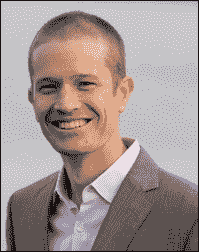

# 第二十章。杰克·范德普拉茨

杰克·范德普拉茨是一位数据科学家，也是《Python 数据科学手册》的作者。他是华盛顿大学 eScience 研究所开放软件的负责人，在那里他与来自各个学科的研究人员合作。他在华盛顿大学之前的职位包括物理科学研究员。杰克是 Python 科学栈的长期贡献者，曾参与过 SciPy、scikit-learn 和 Altair 等项目。他经常在美国的 Python 会议上发表演讲，并在 PyCon、PyData 和 SciPy 上发表过主题演讲。杰克是谷歌的访问研究员，并写了一个技术博客。

> **讨论主题：数据科学和天文学中的 Python。**
> 
> **在这里了解杰克·范德普拉茨：@jakevd**

**迈克·德里斯科尔**：你能简单介绍一下你的背景吗？

**杰克·范德普拉茨**：我在本科学习物理学，大学毕业后在户外工作了几年，担任环境教育者和登山向导。

在加利福尼亚的塞拉内华达山脉下星夜露营了几个月后，我爱上了天文学，并决定利用我的物理学背景去读研究生，学习更多知识。

直到研究生一年级，我仅仅做了一点编程。我在中学时玩过 HyperCard，在高中时上过 C++课程。在大学时，我还学了一些基本的 Mathematica。

**德里斯科尔**：你是如何开始使用 Python 编程语言的？

**范德普拉茨**：现在的天文学非常依赖计算，所以当我开始读研究生时，我需要重新学习如何编程。

> **杰克·范德普拉茨**：“现在的天文学非常依赖计算……”

那时候，我们系的大部分人都在使用 IDL，但我很幸运能和一个教授合作进行了一个为期一个季度的研究项目，他推荐我使用 Python。他告诉我 Python 是未来的趋势，事后看来他完全正确！

我在寒假期间通过编写数独求解器自学了 Python，然后将其转变为数独生成器。后来，我参加了 2017 年的 PyCon 会议，并解释了为什么 Python 受到这么多科学家的喜爱和使用。

**德里斯科尔**：你喜欢 Python 的哪些方面？

**范德普拉茨**：我最先喜欢 Python 是因为它是开源的，这比一些学术界青睐的其他工具（比如 Mathematica、IDL 和 MATLAB）具有巨大的优势。

当我开始使用 Python 时，我发现其语法和语义非常清晰和直观，这让我在编程中找到了乐趣，而这种乐趣是我第一次学习 C++时从未有过的。

> **杰克·范德普拉茨**：“我发现 Python 的语法和语义非常清晰和直观。”

此外，尽管我在开始时科学 Python 生态系统还相对初级，但它是一个巨大的福音。无论你想用 Python 在科学上做什么，都可能有某人已经为它创建了一个包。

Python 与许多其他语言的互操作性意味着它可以作为科学家需要一起使用的各种工具之间的粘合剂。然后，Python 的“内置电池”特性意味着几乎一切都有内置库，其他一切都有第三方库。

> **杰克·范德普拉茨**：“Python…可以成为科学家需要一起使用的各种工具之间的粘合剂。”

Python 的简单和动态特性使其非常适合日常科学数据探索，其中开发速度是首要的，而执行速度通常居次。

最后但同样重要的是，Python 的开放精神与科学非常契合，我们看到了越来越多的科学家在 GitHub 和类似的服务上托管他们的研究代码，以帮助实现可重复性。

**德里斯科尔**：Python 的开放精神是如何帮助科学社区的？

**范德普拉茨**：Python 的开放精神非常适合科学应该如何进行。我在 2017 年 PyCon 的主题演讲中指出，在过去五到十年中，科学家们真正吸收了许多来自开源社区的最好实践。

代码共享、版本控制、单元测试和代码文档对于确保现代科学可重复性至关重要。在科学社区中做得最好的计算工作的人已经从开源社区（尤其是 Python 开源社区）中采纳了许多这些实践。

**德里斯科尔**：Python 缺少了什么，这对科学家来说会很有帮助？

**范德普拉茨**：对于科学家来说，Python 的最大挑战是计算扩展需要用除 Python 之外的语言编写代码。

> **杰克·范德普拉茨**：“对于科学家来说，Python 的最大挑战是计算扩展需要用除 Python 之外的语言编写代码。”

类似于 Cython 和 Numba 的工具通过允许你将 Python 或类似 Python 的代码转换为快速编译代码来解决部分问题，但在何时何地切换到这些额外工具上存在认知开销。PyPy 有希望，但问题是它不支持 CPython 的 C-API，这是科学生态系统的主体所必需的。

这就是为什么社区中的一些人会被 Julia 吸引。它是一种专为科学计算而构建的语言，从底层开始就内置了基于 LLVM 的快速执行。尽管如此，我在某些方面觉得 Julia 有点笨拙，我希望我们能够找到一个折中的方案：Python 的语法加上 Julia 的性能。

**德里斯科尔**：Python 社区如何帮助科学社区学习 Python？你目前正在使用 Python 进行哪些项目？

**范德普拉茨**：我所有的日常工作都在 Python 中完成。目前我参与了华盛顿大学（UW）的几个研究项目。我在指导学生进行天文学和以交通为重点的数据科学工作。

我正在帮助开发 Altair 库，这是一个 Python 接口，用于可视化语法 Vega-Lite。我认为它将很好地填补 Python 科学空间中当前的一个空白，即探索性数据分析。

> **Jake Vanderplas: '我通常推荐 Python...而这些天，我很少需要大力推荐！'**

在华盛顿大学，我的工作部分是咨询大学内的研究人员，帮助他们研究的计算或统计方面。我通常在这些情况下推荐 Python，而这些天，我很少需要大力推荐！

**Driscoll**: 大多数天文学家是否都进行大量的计算机编程？

**Vanderplas**: 计算在现代天文学中绝对至关重要！该领域的大部分工作已经超越了浪漫的远征高峰，通过望远镜观察的日子。即使在现场观测时，观测数据也是通过连接到望远镜的 CCD 记录的。

此外，一般来说，所有*简单*的观测都已经完成。要真正推进我们对宇宙的理解，需要新颖的研究。这种新颖性可能意味着观察非常微弱的天体（在这种情况下，详细的噪声模型是必需的），或者观察许多天体以了解它们的统计特性（在这种情况下，可扩展的计算环境是必需的）。

在这个光谱的任一端，你最好知道如何编写代码来处理望远镜图像、建模有趣的特征并输出有用的结果。

**Driscoll**: 科学家需要编写代码的情况有多普遍？

**Vanderplas**: 就像在天文学一样，大多数领域的科学家都发现编程是必不可少的。

> **Jake Vanderplas: '大多数领域的科学家都发现编程是必不可少的。'**

在数据量方面，我们天文学家一直处于领先地位，但随着传感器、相机、卫星和其他设备变得更加便宜和丰富，*数据洪流*也开始成为大多数其他领域的特征。

**Driscoll**: 哪些科学领域最常使用编程？

**Vanderplas**: 很难说，但天文学正在产生大量数据。

例如，在射电天文学中，有一些项目以大约 5GB/s 的速率产生数据。在物理学中，LHC 以大约 25GB/s 的速率产生数据。然后在生物统计学中，一个人的基因测序数据通常是~100s GB。所有这些领域都在使用复杂的算法从数据中提取意义。

**Driscoll**: 在另一方面，你是否知道任何 Python 在科学领域较弱的地方？如果是这样，它们是什么？

**Vanderplas**: 一些领域有着深厚的工具链历史。例如，MATLAB 可能在许多工程和应用数学系中是标准的。

十年前，一种名为 IDL 的语言在天文学研究中占主导地位，但现在已经改变了，现在 Python 是同行评审出版物中提到的主导语言。

这种变化在天文学领域有两个方面。一方面，一些有远见卓识的人士在影响力较大的位置上积极推动 Python 的早期应用（例如，位于空间望远镜科学研究所的 Perry Greenfield）。另一方面，来自研究生和博士后的大量实际支持推动了这一趋势，他们努力互相培训（例如，软件木工工作坊和 SciCoder 项目）。

> **Jake Vanderplas: 'Python 的势头似乎已经主导了整个局面。'**

此外，整个社区也积极推动标准化天文学 Python 工具栈。结果是（惊人的）Astropy 项目。除此之外，Python 的势头似乎已经主导了整个局面。

**Driscoll**: 谢谢，Jake Vanderplas。
