# 第三章. 增强图像

> 在上一章中，我们学习了关于日常图像处理的大量知识。通过处理几个示例和小型项目，我们完成了通过基本图像处理来执行学习目标。在本章中，我们将进一步学习如何给图像添加特殊效果。添加到图像中的特殊效果具有多种用途。这不仅使图像看起来令人愉悦，还可能帮助你理解图像呈现的重要信息。

在本章中，我们将：

+   学习如何调整图像的亮度和对比度级别

+   添加代码以选择性地修改图像的颜色，并创建灰度图像和负片

+   使用 PIL 功能将两个图像合并在一起，并为图像添加透明效果

+   将各种图像增强过滤器应用于图像，以实现平滑、锐化、浮雕等效果

+   承接一个项目，开发一个工具，用于向图像添加水印、文本或日期戳

所以，让我们开始吧。

# 安装和下载先决条件

本章的安装先决条件与 第二章 中的相同，即 *处理图像*。有关更多详细信息，请参阅该章节。

重要的是要从 Packt 网站下载本章所需的所有图像，网址为 [`www.packtpub.com/`](http://www.packtpub.com/)。我们将在这章的图像处理代码中使用这些图像。此外，请从 Packt 网站下载 PDF 文件，`Chapter 3 Supplementary Material.pdf`。如果你阅读的是黑白印刷的纸质书，这一点非常重要。在即将到来的章节，如“调整颜色”中，我们将比较处理前后的图像。在黑白版中，你将无法看到比较图像之间的差异。例如，改变图像颜色、修改对比度等效果将不明显。PDF 文件包含所有这些图像比较。因此，在处理本章的示例时，请务必保留此文件！

# 调整亮度和对比度

经常需要调整图像的亮度和对比度级别。例如，你可能有一张用基本相机拍摄的照片，当时光线不足。你将如何通过数字方式纠正它？亮度调整有助于使图像变亮或变暗，而对比度调整则强调图像数据中颜色和亮度级别之间的差异。可以使用 PIL 中的 `ImageEnhance` 模块使图像变亮或变暗。该模块还提供了一个可以自动对比图像的类。

# 操作时间 - 调整亮度和对比度

让我们学习如何修改图像的亮度和对比度。首先，我们将编写代码来调整亮度。`ImageEnhance` 模块通过提供 `Brightness` 类使我们的工作变得简单。

1.  下载图像`0165_3_12_Before_BRIGHTENING.png`并将其重命名为`Before_BRIGHTENING.png`。

1.  使用以下代码：

    ```py
    1 import Image
    2 import ImageEnhance
    3
    4 brightness = 3.0
    5 peak = Image.open( "C:\\images\\Before_BRIGHTENING.png ")
    6 enhancer = ImageEnhance.Brightness(peak)
    7 bright = enhancer.enhance(brightness)
    8 bright.save( "C:\\images\\BRIGHTENED.png ")
    9 bright.show()

    ```

1.  在代码片段的第 6 行，我们创建了一个`Brightness`类的实例。它以`Image`实例作为参数。

1.  第 7 行通过使用指定的`brightness`值创建了一个新的图像`bright`。介于`0.0`和小于`1.0`之间的值会使图像变暗，而大于`1.0`的值会使它变亮。值为`1.0`保持图像的亮度不变。

1.  下一个插图显示了原始图像和结果图像。

    亮化前后的图像比较。

    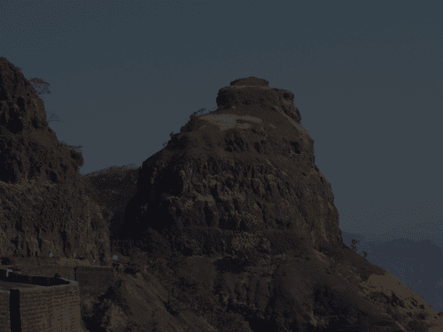

1.  让我们继续调整亮化图像的对比度。我们将向亮化图像的代码片段中添加以下行。

    ```py
    10 contrast = 1.3
    11 enhancer = ImageEnhance.Contrast(bright)
    12 con = enhancer.enhance(contrast)
    13 con.save( "C:\\images\\CONTRAST.png ")
    14 con.show()

    ```

1.  因此，与调整图像亮度类似，我们通过使用`ImageEnhance.Contrast`类调整了图像的对比度。对比度值为`0.0`创建一个黑色图像。值为`1.0`保持当前对比度。

1.  下面的插图显示了结果图像与原始图像的比较。

    ### 小贴士

    注意：如*安装和下载必备条件*部分所述，如果你阅读的是这本书的纸质版，那么在下图中比较的图像将看起来完全相同。请下载并参考补充 PDF 文件`Chapter 3 Supplementary Material.pdf`。在这里，提供了彩色图像，这将帮助你看到差异。

    +   显示增加对比度的原始图像和图像。

    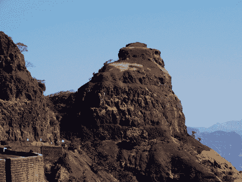

1.  在前面的代码片段中，我们需要指定一个对比度值。如果你更喜欢使用 PIL 来决定合适的对比度级别，有一种方法可以做到这一点。`ImageOps.autocontrast`功能设置一个合适的对比度级别。此功能使图像对比度归一化。现在让我们使用这个功能。

1.  使用以下代码：

    ```py
    import ImageOps
    bright = Image.open( "C:\\images\\BRIGHTENED.png ")
    con = ImageOps.autocontrast(bright, cutoff = 0)
    con.show()

    ```

1.  代码中高亮显示的行是自动设置对比度的位置。`autocontrast`函数计算输入图像的直方图。`cutoff`参数表示从该直方图中修剪最亮和最暗像素的百分比。然后图像被重新映射。

## 刚才发生了什么？

通过使用`ImageEnhance`模块中的类和功能，我们学习了如何增加或减少图像的亮度和对比度。我们还编写了代码，使用`ImageOps`模块提供的功能来自动对比度图像。在这里学到的知识将在本章后续部分中很有用。

# 调整颜色

在图像上执行的其他有用操作之一是调整图像内的颜色。图像可能包含一个或多个波段，包含图像数据。`image`模式包含有关图像像素数据深度和类型的信息。在本章中我们将使用最常用的模式是`RGB`（真彩色，3x8 位像素数据）、`RGBA`（带透明度蒙版的真彩色，4x8 位）和`L`（黑白，8 位）。

在 PIL 中，你可以轻松地获取图像内波段数据的信息。要获取波段名称和数量，可以使用`Image`类的`getbands()`方法。在这里，`img`是`Image`类的一个实例。

```py
>>> img.getbands()
('R', 'G', 'B', 'A')

```

# 动手时间 - 在图像内交换颜色！

为了理解一些基本概念，让我们编写代码来仅交换图像波段数据。

1.  下载图像`0165_3_15_COLOR_TWEAK.png`并将其重命名为`COLOR_TWEAK.png`。

1.  输入以下代码：

    ```py
    1 import Image
    2
    3 img = Image.open( "C:\\images\\COLOR_TWEAK.png ")
    4 img = img.convert('RGBA')
    5 r, g, b, alpha = img.split()
    6 img = Image.merge( "RGBA ", (g, r, b, alpha))
    7 img.show()

    ```

1.  让我们分析一下这段代码。在第 2 行，创建了一个`Image`实例，然后我们将图像的`mode`更改为`RGBA`。

    ### 小贴士

    在这里，我们应该检查图像是否已经具有该模式，或者这种转换是否可行。你可以将这个检查作为练习来添加！

1.  接下来，对`Image.split()`的调用创建了`Image`类的单独实例，每个实例包含单个波段数据。因此，我们有四个`Image`实例`r, g, b`和`alpha`，分别对应红色、绿色、蓝色波段和 alpha 通道。

1.  第 6 行的代码执行主要的图像处理。`Image.merge`函数的第一个参数是`mode`，第二个参数是一个包含波段信息的图像实例的元组。所有波段必须具有相同的大小。正如你所注意到的，我们在指定第二个参数时，在`Image`实例`r`和`g`中交换了波段数据的顺序。

1.  在下一幅插图中所获得的原始图像和结果图像进行了比较。现在花的颜色呈现绿色调，而花后面的草以红色调呈现。

    ### 小贴士

    如同在*安装和下载必备条件*部分所述，如果你阅读的是这本书的纸质版，那么在下一幅插图中所比较的图像将看起来完全相同。请下载并参考补充 PDF 文件`Chapter 3 Supplementary Material.pdf`。在这里，提供了彩色图像，这将帮助你看到差异。

    原图（左）和颜色交换图像（右）。

    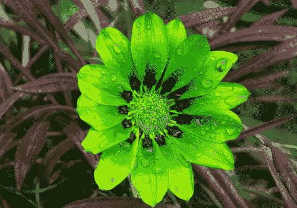

## 刚才发生了什么？

我们成功创建了一个波段数据交换的图像。我们学习了如何使用 PIL 的`Image.split()`和`Image.merge()`来实现这一点。然而，这个操作是在整个图像上执行的。在下一节中，我们将学习如何将颜色变化应用于特定的颜色区域。

## 修改单个图像波段

在上一节中，我们看到了如何改变整个波段表示的数据。由于这种波段交换，花朵的颜色变成了绿色调，草地颜色被渲染成红色调。如果我们只想改变花朵的颜色，而保持草地颜色不变呢？为了做到这一点，我们将利用 `Image.point` 功能以及上一章中深入讨论的 `Image.paste` 操作。

然而，请注意，我们需要小心指定需要更改的颜色区域。它也可能取决于图像。有时，它将选择一些其他与指定颜色范围匹配的区域，而我们不希望这样。

# 行动时间 - 改变花朵的颜色

我们将使用上一节中使用的相同花朵图像。如前所述，我们的任务是改变花朵的颜色，同时保持草地颜色不变。

1.  在 Python 源文件中添加此代码。

    ```py
    1 import Image
    2
    3 img = Image.open( "C:\\images\\COLOR_TWEAK.png ")
    4 img = img.convert('RGBA')
    5 r, g, b, alpha = img.split()
    6 selection = r.point(lambda i: i > 120 and 150)
    7 selection.save( "C:\\images\\COLOR_BAND_MASK.png ")
    8 r.paste(g, None, selection)
    9 img = Image.merge( "RGBA ", (r, g, b, alpha))
    10 img.save( "C:\\images\\COLOR_CHANGE_BAND.png ")
    11 img.show()

    ```

1.  1 到 5 行与之前看到的一样。在第 5 行，我们将原始图像分割，创建了四个 `Image` 实例，每个实例包含一个波段数据。

1.  在第 6 行创建了一个新的 `Image` 实例 'selection'。这是一个重要的操作，是选择性修改颜色的关键！让我们看看这一行代码做了什么。如果你观察原始图像，花朵区域（嗯，大部分）被渲染成红色调。因此，我们在 `Image` 实例 `r` 上调用了 `point(function)` 方法。`point` 方法接受一个函数和一个参数，通过这个函数映射图像。它返回一个新的 `Image` 实例。

1.  第 6 行上的这个 lambda 函数做了什么？内部，PIL 的 `point` 函数做的是这样的事情：

    ```py
    lst = map(function, range(256)) * no_of_bands

    ```

    +   在这个例子中，函数实际上是一个 lambda 函数。图像的 `no_of_bands` 为 1。因此，第 6 行用于选择红色值大于 120 的区域。lst 是一个列表，在这种情况下，前 120 个值是 False，其余值是 150。150 的值在我们执行粘贴操作时确定最终颜色起着作用。

1.  在应用 `point` 操作后创建的图像掩码如图所示。此图像中的白色区域代表我们刚刚通过 `point` 操作捕获的区域。在执行下一个 `paste` 操作时，只有白色区域将发生变化。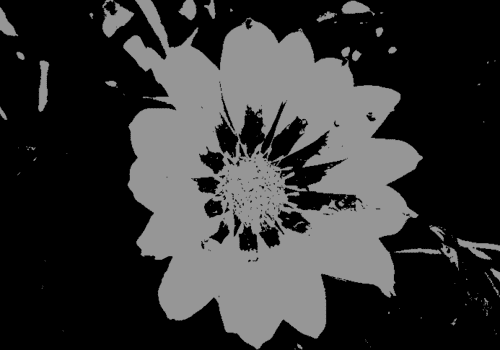

1.  在第 8 行，我们执行了上一章中讨论的 `paste` 操作。在这里，使用掩码 `selection` 将图像 `g` 粘贴到图像 `r` 上。结果，图像 `r` 的波段数据被修改。

1.  最后，通过使用包含新波段信息的单个 `r, g, b` 和 `alpha` 图像实例，使用 `merge` 操作创建了一个新的 `Image` 实例。

1.  在下一幅插图中的原始图像和最终处理后的图像进行了比较。新的花朵颜色看起来和原始颜色一样酷，不是吗？

    ### 小贴士

    如同在 *安装和下载必备条件* 部分所述，如果你在阅读这本书的纸质版，以下插图中的图像将看起来完全相同。请下载并参考补充的 PDF 文件 `Chapter 3 Supplementary Material.pdf`。其中提供了彩色图像，这将帮助你看到差异。

    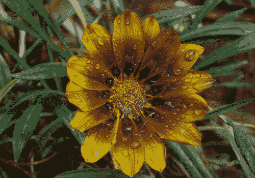

## 刚才发生了什么？

我们设计了一个示例，修改了选择性的颜色区域。通过处理单个图像波段数据来完成这项任务。借助 PIL 的 `Image` 模块中的 `point`、`paste` 和 `merge` 操作，我们成功改变了提供的图像中花朵的颜色。

## 灰度图像

如果你想给图像添加怀旧效果，你可以做的许多事情之一就是将其转换为灰度。在 PIL 中创建灰度图像有多种方法。当模式指定为 `L` 时，生成的图像是灰度的。将彩色图像转换为黑白的基本语法是：

```py
img = img.convert('L')

```

或者，我们可以使用 `ImageOps` 模块提供的功能。

```py
img = ImageOps.grayscale(img)

```

如果你从头开始创建图像，语法是：

```py
img = Image.new('L', size)

```

以下插图显示了使用这些技术之一创建的原始图像和转换后的灰度图像。

### 小贴士

请下载并参考补充的 PDF 文件 `Chapter 3 Supplementary Material.pdf`。其中提供了彩色图像，这将帮助你看到以下图像之间的差异。

桥梁的原始图像和灰度图像：

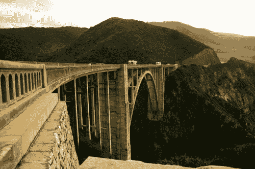

## 制作负片

创建图像的负片非常简单。我们只需要反转每个颜色像素。因此，如果你在像素处有一个颜色 `x`，那么负片在该像素处将会有 (255 `x`)。`ImageOps` 模块使得这个过程非常简单。以下代码行创建了一个图像的负片。

```py
img = ImageOps.invert(img)

```

这是此操作的结果：

原始图像（左）及其负片（右）。

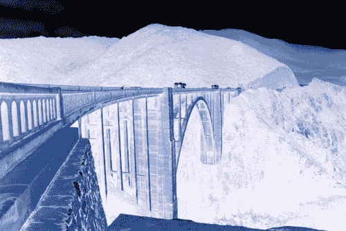

# 混合

你是否曾希望看到自己在家庭照片中的样子，而那时你并不在场？或者，如果你只是想看到自己在珠穆朗玛峰顶上的样子，至少在照片中是这样？嗯，使用 PIL 提供的功能，如混合、合成图像处理等，这是可能的。

在本节中，我们将学习如何混合图像。正如其名所示，混合意味着将两个兼容的图像混合以创建一个新的图像。PIL 中的`blend`功能使用两个具有相同`size`和`mode`的输入图像创建一个新的图像。内部，两个输入图像使用恒定的`alpha`值进行插值。

在 PIL 文档中，它被表述为：

```py
blended_image = in_image1 * (1.0 - alpha) + in_image2 * alpha

```

看这个公式，很明显`alpha = 1.0`将使混合图像与'n_image2'相同，而`alpha = 0.0`则返回`in_image1`作为混合图像。

# 行动时间 - 混合两个图像

有时，将两个图像混合在一起的综合效果与以不同的方式查看相同的图像相比，会产生很大的影响。现在，是时候通过混合两张图片来发挥你的想象力了。在这个例子中，我们的结果图像显示了密歇根州的大 Mackinac 桥上飞翔的鸟类。然而，它们是从哪里来的？鸟类在桥梁的原始图像中并不存在。

1.  从 Packt 网站下载以下文件：`0165_3_28_BRIDGE2.png`和`0165_3_29_BIRDS2.png`。分别将这些文件重命名为`BRIDGE2.png`和`BIRDS2.png`。

1.  在 Python 源文件中添加以下代码。

    ```py
    1 import Image
    2
    3 img1 = Image.open( "C:\\images\\BRIDGE2.png ")
    4 img1 = img1.convert('RGBA')
    5
    6 img2 = Image.open( "C:\\images\\BIRDS2.png ")
    7 img2 = img2.convert('RGBA')
    8
    9 img = Image.blend(img1, img2, 0.3)
    10 img.show()
    11 img.save( "C:\\images\\BLEND.png")

    ```

1.  下一个插图显示了混合前的两个图像，在代码中用`img1`和`img2`表示。

    混合前的桥梁和飞翔的鸟类的单独图像。

    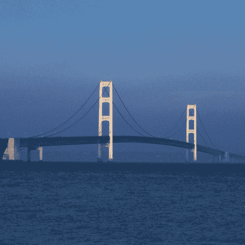

1.  第 3 到 7 行打开了要混合的两个输入图像。注意，我们已经将两个图像都转换为`RGBA`模式。这不必一定是`RGBA`模式。我们可以指定模式，如'RGB'或'L'。然而，要求两个图像具有相同的`size`和`mode`。

1.  图像在第 9 行使用 PIL 中的`Image.blend`方法进行混合。`blend`方法的前两个参数是两个表示要混合的图像的`Image`对象。第三个参数定义了透明度因子`alpha`。在这个例子中，桥梁的图像是我们想要关注的主体图像。因此，`alpha`因子被定义为在创建最终图像时对飞翔的鸟类的图像应用更多的透明度。`alpha`因子可以有一个介于`0.0`到`1.0`之间的值。请注意，在渲染输出图像时，第二个图像`img2`被乘以这个`alpha`值，而第一个图像被乘以`1 - alpha`。这可以用以下方程表示。

    ```py
    blended_img = img1 * (1 alpha) + img2* alpha

    ```

1.  因此，如果我们选择一个例如 0.8 的`alpha`因子，这意味着鸟类将比桥梁更不透明。尝试更改`alpha`因子以查看它如何改变结果图像。`alpha = 0.3`的结果图像如下：

    混合图像显示鸟类在桥梁上飞翔。

    

1.  由于在创建图像时应用了透明效果，图片看起来有点单调。如果你将输入图像转换为`mode L`，结果图像将看起来更好，但它将以灰度形式呈现。这将在下一幅插图中展示。

    当两个输入图像都具有模式 L 时，混合的灰度图像。

    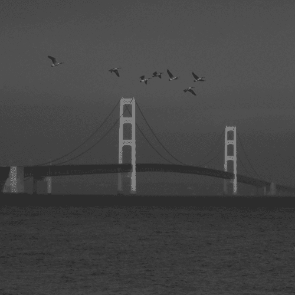

## 发生了什么？

混合是重要的图像增强功能。通过示例，我们完成了创建混合图像的任务。我们学习了使用`Image.blend`方法，并应用透明度因子`alpha`来完成这项任务。本章学到的技术在本章中将会非常有用。在下一节中，我们将应用混合技术来创建透明图像。

# 创建透明图像

在上一节中，我们学习了如何将两个图像混合在一起。在本节中，我们将更进一步，看看相同的`blend`功能如何用于创建透明图像！具有模式 RGBA 的图像定义了一个`alpha`通道。可以通过调整此通道数据来改变图像的透明度。`Image.putalpha()`方法允许为图像的`alpha`通道定义新数据。我们将看到如何执行点操作以实现相同的效果。

# 是时候动手创建透明效果了

让我们编写几行代码，为输入图像添加透明效果。

1.  我们将使用第二章中使用的其中一个图像。下载`0165_3_25_SMILEY.png`并将其重命名为`SMILEY.png`。

1.  使用以下代码：

    ```py
    1 import Image
    2
    3 def addTransparency(img, factor = 0.7 ):
    4 img = img.convert('RGBA')
    5 img_blender = Image.new('RGBA', img.size, (0,0,0,0))
    6 img = Image.blend(img_blender, img, factor)
    7 return img
    8
    9 img = Image.open( "C:\\images\\SMILEY.png ")
    10
    11 img = addTransparency(img, factor =0.7)

    ```

1.  在这个例子中，`addTransparency()`函数接受`img`实例作为输入，并返回一个具有所需透明度级别的新图像实例。

1.  现在我们来看看这个函数是如何工作的。在第 4 行，我们首先将图像模式转换为`RGBA`。如前所述，你可以在这里添加一个条件来检查图像是否已经处于`RGBA`模式。

1.  接下来，我们使用`Image.new`方法创建一个新的`Image`类实例，名为`image_blender`。它具有与输入图像相同的尺寸和模式。第三个参数代表颜色。在这里，我们指定透明度为`0`。

1.  在第 6 行，两个图像`img`（输入图像）和`img_blender`通过应用一个常量`alpha`值混合在一起。然后函数返回这个修改后的`Image`实例。

1.  比较了原始图像和具有透明效果图像。这些图像是 GIMP 编辑器中打开的图像的截图。这样做是为了让你清楚地了解透明效果。这些图像中的棋盘图案代表画布。注意画布如何在透明图像中显示。

1.  添加透明度到图像的另一种简单方法，使用`Image.point`功能！在 Python 源文件中输入以下代码并执行它。

    ```py
    1 import Image
    2 img = Image.open( "C:\\images\\SMILEY.png ")
    3 r, g, b, alpha = img.split()
    4 alpha = alpha.point(lambda i: i>0 and 178)
    5 img.putalpha(alpha)
    6 img.save( "C:\\images\\Transparent_SMILEY.png ")

    ```

1.  在这段新代码中，我们将原始图像分割成四个新的图像实例，每个实例包含一个图像通道数据（r, `g, b`, 或 `alpha`)。请注意，我们这里假设图像的模式是`RGBA`。如果不是，你需要将此图像转换为 RGBA！作为一个练习，你可以在代码中添加这个检查。

1.  接下来，在第 4 行，调用了`Image.point`方法。`lambda`函数作用于`alpha`通道数据。它将值设置为`178`。这大约等于我们之前设置的`alpha`因子 0.7。这里计算为`int(255*0.7) )`。在*修改单个图像通道*部分，我们详细讨论了点操作。

1.  在第 5 行，我们将新的`alpha`通道数据放回`img`中。使用`blend`和`point`功能的结果图像将在下一幅插图显示。

    添加透明度前后的图像。

    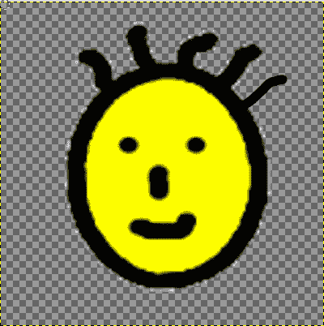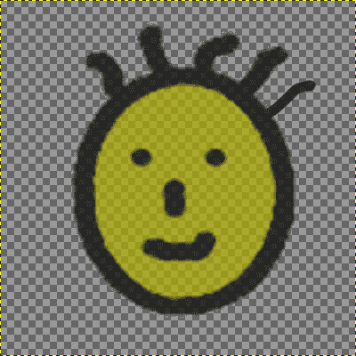

## 刚才发生了什么？

我们已经完成了向图像添加透明度效果。这是一种非常有用的图像增强，我们不时需要它。我们学习了如何使用两种不同的技术创建透明图像，即使用`Image.blend`功能和使用`Image.point`操作。在本节中获得的知识将在本章的后面应用。

# 使用图像蒙版制作复合材料

到目前为止，我们已经看到了如何将两张图像混合在一起。这是通过使用`Image.blend`操作完成的，其中两个输入图像通过使用一个常数`alpha`透明度因子进行混合。在本节中，我们将学习另一种将两张图像组合在一起的技术。在这里，我们使用一个定义透明度蒙版的图像实例作为第三个参数，而不是一个常数`alpha`因子。另一个区别是输入图像不需要有相同的`mode`。例如，第一张图像可以是`L`模式，第二张是`RGBA`模式。创建合成图像的语法是：

```py
outImage = Image.composite(img1, img2, mask)

```

这里，复合方法的参数是`Image`实例。蒙版指定为`alpha`。蒙版图像实例的模式可以是`1, L`或`RGBA`。

# 行动时间 - 使用图像蒙版制作复合材料

我们将混合在另一个部分中混合的相同两张图像。为了尝试一些不同的事情，在合成图像中，我们将聚焦于飞翔的鸟儿而不是桥梁。

1.  我们将使用与*混合*部分相同的输入图像集。

    ```py
    1 import Image
    2
    3 img1 = Image.open( "C:\\images\\BRIDGE2.png ")
    4 img1 = img1.convert('RGBA')
    5
    6 img2 = Image.open( "C:\\images\\BIRDS2.png ")
    7 img2 = img2.convert('RGBA')
    8
    9 r, g, b, alpha = img2.split()
    10 alpha = alpha.point(lambda i: i>0 and 204)
    11
    12 img = Image.composite(img2, img1, alpha)
    13 img.show()

    ```

1.  代码直到第 7 行与混合示例中展示的代码相同。请注意，两个输入图像不需要具有相同的`mode`。在第 10 行，调用了`Image.point`方法。`lambda`函数作用于`alpha`通道数据。第 9 行和第 10 行的代码与*创建透明图像*部分中展示的类似。请参考该部分以获取更多详细信息。唯一的区别是像素值被设置为`204`。这修改了图像实例`alpha`中的通道数据。如果图像要混合，这个`204`的值大约相当于`alpha`因子`0.7`。这意味着桥梁将会有渐变效果，飞翔的鸟儿将在合成图像中突出显示。

1.  你会注意到，我们并没有将修改后的`alpha`通道数据放回`img2`中。而是在第 12 行，使用蒙版作为`alpha`创建了合成图像。

1.  下一个插图显示了带有飞翔鸟类图像强调的合成图像。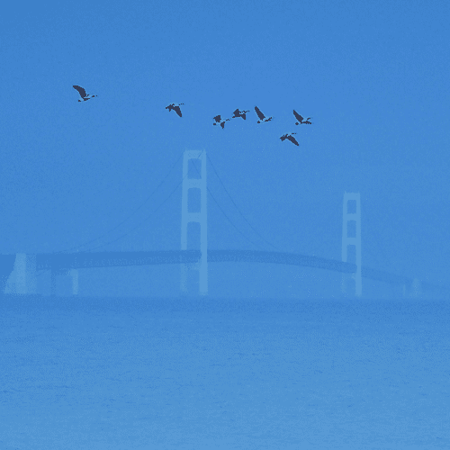

## 刚才发生了什么？

我们学习了如何使用`alpha`蒙版创建两个图像的组合图像。这是通过使用`Image.composite`功能实现的。

# 项目：水印制作工具

我们现在已经学到了足够多的图像增强技术，可以开始一个简单的项目来应用这些技术。让我们创建一个简单的命令行工具，一个“水印制作工具”。虽然我们称之为“水印制作工具”，但实际上它提供了一些更有用的功能。使用此工具，您可以将日期戳添加到图像中（使用此工具增强图像的日期）。它还允许在图像中嵌入自定义文本。该工具可以使用以下语法在命令行上运行：

```py
python WaterMarkMaker.py [options]

```

其中，`[options]`如下：

+   `--image1:` 提供画布的主要图像的文件路径。

+   `--waterMark:` 水印图像的文件路径（如果有）。

+   `--mark_pos:` 要嵌入的水印图像的左上角坐标。值应使用双引号指定，例如**100, 50**。

+   `--text:` 应出现在输出图像中的文本。

+   `--text_pos:` 要嵌入的文本的左上角坐标。值应使用双引号指定，例如**100, 50**。

+   `--transparency:` 水印的透明度因子（如果有）

+   `--dateStamp:` 标志（True 或`False`），用于确定是否在图像中插入日期戳。如果为`True`，则将插入处理此图像时的日期戳。

下面的示例展示了如何使用所有指定选项运行此工具。

```py
python WaterMarkMaker.py --image1= "C:\foo.png "
--watermark= "C:\watermark.png "
--mark_pos= "200, 200 "
--text= "My Text "
-text_pos= "10, 10 "
--transparency=0.4
--dateStamp=True

```

这将创建一个带有水印和文本的输出图像文件`WATERMARK.png`，文本位于图像指定的锚点位置内。

# 行动时间 - 水印制作工具

想想我们需要的所有方法来完成这个任务。首先想到的是处理前面提到的命令行参数的函数。接下来，我们需要编写能够将水印图像添加到主图像中的代码。让我们称这个函数为 `addWaterMark()`。按照类似的思路，我们还需要添加文本和日期戳到图像的方法。我们将分别称这些方法为 `addText()` 和 `addDateStamp()`。有了这些信息，我们将开发代码来实现这个功能。在这个项目中，我们将把这个功能封装在一个类中，但这不是必需的。我们这样做是为了使这个工具在未来使用时更具可扩展性。

1.  下载文件 `WaterMarkMaker.py`。这个文件包含在这个项目中需要的代码。只需保留它以供以后使用。本节将不会讨论一些方法。如果你在开发这些方法时遇到困难，你总是可以回过头来参考这个文件。

1.  打开一个新的 Python 源文件，声明以下类及其方法。现在只需创建空方法即可。随着我们继续前进，我们将扩展这些方法。

    ```py
    import Image, ImageDraw, ImageFont
    import os, sys
    import getopt
    from datetime import date
    class WaterMarkMaker:
    def __init__(self):
    pass
    def addText(self):
    pass
    def addDateStamp(self):
    pass
    def _addTextWorker(self, txt, dateStamp = False):
    pass
    def addWaterMark(self):
    pass
    def addTransparency(self, img):
    pass
    def createImageObjects(self):
    pass
    def _getMarkPosition(self, canvasImage, markImage):
    return
    def processArgs(self):
    pass
    def printUsage(self):
    pass

    ```

1.  接下来，我们将在这个类的构造函数中编写代码。

    ```py
    def __init__(self):
    # Image paths
    self.waterMarkPath = ''
    self.mainImgPath = ''
    # Text to be embedded
    self.text = ''
    # Transparency Factor
    self.t_factor = 0.5
    # Anchor point for embedded text
    self.text_pos = (0, 0)
    # Anchor point for watermark.
    self.mark_pos = None
    # Date stamp
    self.dateStamp = False
    # Image objects
    self.waterMark = None
    self.mainImage = None
    self.processArgs()
    self.createImageObjects()
    self.addText()
    self.addWaterMark()
    if self.dateStamp:
    self.addDateStamp()
    self.mainImage.save( "C:\\images\\WATERMARK.png ")
    self.mainImage.show()

    ```

1.  代码是自我解释的。首先，初始化所有必要的属性，然后调用相关方法来创建带有水印和/或嵌入文本的图像。让我们按照在构造函数中调用的顺序编写这些方法。

1.  `processArgs()` 方法处理命令行参数。你可以将此方法作为练习来编写。或者，你可以使用 Packt 网站上的 `WaterMarkMaker.py` 文件中的代码。处理参数的方法应采用以下表格中所示的任务。在参考文件中，使用 `getopt` 模块来处理这些参数。或者，你也可以使用 Python 的 `optparse` 模块中的 `OptionParser`。

    | 参数 | 值 | 参数 | 值 |
    | --- | --- | --- | --- |
    | `image1` | `self.mainImgPath` | `text_pos` | `self.text_pos` |
    | `waterMark` | `self.waterMarkPath` | `transparency` | `self.t_factor` |
    | `mark_pos` | `self.mark_pos` | `dateStamp` | `self.dateStamp` |
    | `text` | `self.text` |   |   |

1.  `printUsage()` 方法只是打印如何运行这个工具。你可以轻松地编写这个方法。

1.  现在我们来回顾一下 `addText()` 和 `_addTextWorker()` 方法。请注意，为了清晰起见，代码示例中删除了一些注释。你可以参考 `WaterMarkMaker.py` 中的代码以获取详细的注释。

    ```py
    def addText(self):
    if not self.text:
    return
    if self.mainImage is None:
    print "\n Main Image not defined.Returning. "
    return
    txt = self.text
    self._addTextWorker(txt)

    ```

1.  `addText()` 方法简单地通过提供从命令行接收到的 `self.text` 参数来调用 `_addTextWorker()`。

1.  `_addTextWorker()` 方法执行将文本嵌入图像中的主要处理。这个方法在以下代码中使用：

    ```py
    1 def _addTextWorker(self, txt, dateStamp = False):
    2 size = self.mainImage.size
    3 color = (0, 0, 0)
    4 textFont = ImageFont.truetype( "arial.ttf ", 50)
    5
    6 # Create an ImageDraw instance to draw the text.
    7 imgDrawer = ImageDraw.Draw(self.mainImage)
    8 textSize = imgDrawer.textsize(txt, textFont)
    9
    10 if dateStamp:
    11 pos_x = min(10, size[0])
    12 pos_y = size[1] - textSize[0]
    13 pos = (pos_x, pos_y)
    14 else:
    15 # We need to add text. Use self.text_pos
    16 pos = self.text_pos
    17 #finally add the text
    18 imgDrawer.text(pos, txt, font=textFont)
    19
    20 if ( textSize[0] > size[0]
    21 or textSize[1] > size[1] ):
    22 print ( "\n Warning, the specified text "
    23 "going out of bounds. " )

    ```

1.  在第二章中，我们创建了一个包含文本字符串的新图像。它读作 "Not really a fancy text "。你还记得吗？在这里，我们编写了类似的代码，并进行了一些改进。ImageDraw.Draw 函数将 self.mainImage（一个 Image 实例）作为参数传递以创建一个 Draw 实例，imgDrawer。

    在第 18 行，使用给定的字体将文本嵌入到指定的位置。Draw 实例的 text() 方法接受三个参数，即位置、文本和字体。在上一章中，我们已经使用了前两个参数。第三个参数字体是 PIL 中的 ImageFont 类的实例。

    在第 4 行，我们创建了这个实例，指定了字体类型（arial.ttf）和字体大小（=50）。现在给定的文本字符串被添加到主图像上！

1.  我们接下来要讨论的方法是 `addDateStamp()`。它最终调用了相同的方法 `_addTextWorker()`。然而，这个日期戳的位置固定在图像的左下角，当然我们通过使用 Python 的 `datetime` 模块来创建我们的日期字符串。下面的代码展示了这一过程，包括之前声明的导入语句。

    ```py
    from datetime import date
    def addDateStamp(self):
    today = date.today()
    time_tpl = today.timetuple()
    year, month, day = map(str, time_tpl)
    datestamp = "%s/%s/%s "%(year,month, day)
    self._addTextWorker(datestamp, dateStamp = True)

    ```

1.  在这个方法中的代码第一行创建了一个日期实例 `today`，提供了今天的日期作为 `3-tuple`。类似于这样的：`datetime.date(2010, 1, 20)`。接下来，我们调用 `date` 实例的 `timetuple` 方法。这个 `tuple` 中的前三个值分别是 `year`（年）、`month`（月）和 `day`（日）。

1.  代码的其余部分只是将日期戳作为文本字符串进行处理，然后调用前面讨论的主要工作方法。

1.  现在我们将回顾 `addWaterMark()` 方法中的代码。水印通常是一个半透明的图像，它出现在主图像上。有两种不同的方法来实现创建水印。下面的代码考虑了这两种方法。

    ```py
    1 def addWaterMark(self):
    2 # There are more than one way to achieve creating a
    3 # watermark. The following flag,if True, will use
    4 # Image.composite to create the watermark instead of a
    5 # simple Image.paste
    6 using_composite = False
    7
    8 if self.waterMark is None:
    9 return
    10 # Add Transparency
    11 self.waterMark = self.addTransparency(self.waterMark)
    12 # Get the anchor point
    13 pos_x, pos_y = self._getMarkPosition(self.mainImage,
    14 self.waterMark)
    15 # Create the watermark
    16 if not using_composite:
    17 # Paste the image using the transparent
    18 # watermark image as the mask.
    19 self.mainImage.paste(self.waterMark,
    20 (pos_x, pos_y),
    21 self.waterMark)
    22 else:
    23 # Alternate method to create water mark.
    24 # using Image.composite create a new canvas
    25 canvas = Image.new('RGBA',
    26 self.mainImage.size,
    27 (0,0,0,0))
    28 # Paste the watermark on the canvas
    29 canvas.paste(self.waterMark, (pos_x, pos_y))
    30 # Create a composite image
    31 self.mainImage = Image.composite(canvas,
    32 self.mainImage,
    33 canvas)

    ```

1.  要添加水印，首先我们需要将图像设置为透明。这是通过调用 `addTransparency()` 方法实现的。此方法还将图像的 `mode` 改为 `RGBA`。这个方法在这里展示。它与我们在早期部分开发的方法几乎相同，当时我们使用 PIL 的混合功能将图像设置为透明。

    ```py
    def addTransparency(self, img):
    img = img.convert('RGBA')
    img_blender = Image.new('RGBA',
    img.size,
    (0,0,0,0))
    img = Image.blend(img_blender,
    img,
    self.t_factor)
    return img

    ```

1.  接下来，在第 13 行，我们确定主图像上的锚点，水印的左上角将出现在这里。默认情况下，我们将水印的左下角与主图像的左下角对齐。你可以查看文件 WaterMarkMaker.py 中方法 _getMarkPosition() 的代码来了解这是如何实现的。向前推进，第 16-21 行之间的代码块使用粘贴功能创建水印。这是创建带水印图像的一种方法。Image.paste 函数提供的参数是待粘贴的图像、锚点以及遮罩。遮罩被选为水印图像本身，以便考虑透明度。否则，水印图像将是不透明的。以下插图比较了带有和不带有图像遮罩指定的结果图像。

    使用 Image.paste 操作创建的带有和没有蒙版的最终图像。

    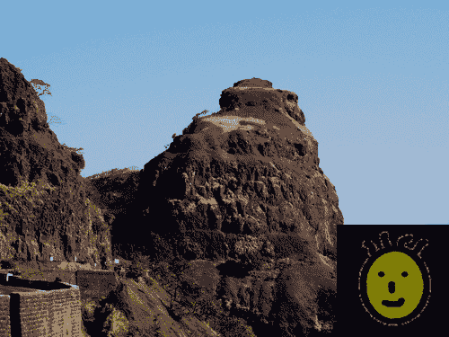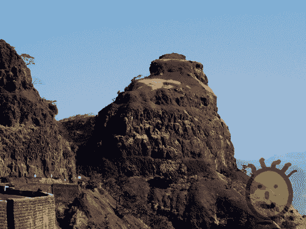

    +   接下来，在 else 条件块（第 22 至 33 行）中，我们使用 PIL 中的 Image.composite 功能嵌入水印。这里使用的示例水印图像的尺寸是 200x200 像素，而主图像的尺寸是 800x600 像素。要使用 composite()方法，我们需要将这些图像调整为相同的大小，同时确保将水印粘贴到指定的位置。如何实现这一点？首先要做的是创建一个画布图像来保存水印。画布图像与主图像大小相同。代码块 25-29 创建了画布并在适当的位置粘贴了水印。

        最后，在第 31 行，使用画布图像实例作为 alpha 蒙版创建了合成图像。

1.  现在让我们运行这个工具！你可以使用自己的图像文件作为主图像或水印。或者，你可以使用图像`0165_3_34_KokanPeak_for_WATERMARK.png`作为主图像，`0165_3_38_SMILEY_small.png`作为水印图像。这次运行的命令行参数是：

    ```py
    python WaterMarkMaker.py
    --image1= "C:\images\KokanPeak_for_WATERMARK.png "
    --text= "Peak "
    --text_pos= "10, 10 "
    --waterMark= "C:\\images\\SMILEY_small.png "
    --dateStamp=True

    ```

1.  带有文本、日期戳和水印的最终图像将在下一幅插图显示。

    最终处理后的图像带有文本、日期戳和水印。

    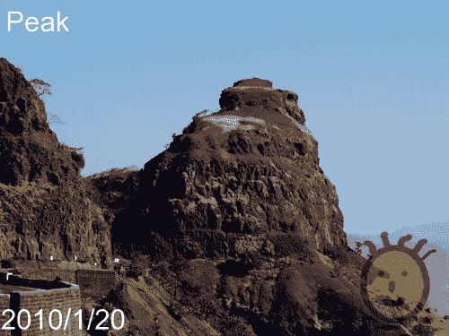

## 刚才发生了什么？

我们创建了一个非常有用的实用工具，可以将水印和/或文本字符串和/或日期戳添加到输入图像中。我们在此以及之前章节中学到的图像处理技术中也使用了这些技术。特别是，应用了图像增强功能，如混合、创建合成图像和添加透明度来完成这项任务。此外，我们还使用了常见的功能，如粘贴图像、在图像上绘制文本等。

## 尝试使用 Watermark Maker Tool 进行更多操作

我们的 Watermark Maker 工具需要升级。扩展此应用程序以便它支持以下功能：

1.  文本或日期戳的颜色目前是硬编码的。添加一个新的命令行参数，以便可以将文本颜色指定为可选参数。

1.  添加一些标准默认选项，用于指定文本、日期戳和水印图像的锚点位置。这些选项可以是`TOP_RIGHT, TOP_LEFT, BOTTOM_RIGHT`和`BOTTOM_LEFT`。

1.  命令行选项列表太长了。添加代码以便所有参数都可以从文本文件中读取。

1.  添加支持以便它可以批量处理图像以创建所需效果。

# 应用图像过滤器

在上一章中，执行图像缩放操作时使用了`filter`参数。这个`filter`决定了输出图像的质量。然而，只有四个`filter`选项可用，并且其范围仅限于缩放操作。在本节中，将介绍一些额外的图像增强滤波器。这些是预定义的滤波器，可以直接应用于任何输入图像。以下是应用滤波器的基本语法。

```py
img = Image.open('foo.jpg')
filtered_image = img.filter(FILTER)

```

在这里，我们通过过滤图像`img`创建了一个新的图像`filtered_image`。`FILTER`参数可以是 PIL 的`ImageFilter`模块中预定义的滤波器之一，用于过滤图像数据。PIL 提供了几个预定义的图像增强滤波器。这些可以大致分为以下几类。通过示例，我们将在接下来的章节中学习其中的一些。

+   模糊和锐化：`BLUR, SHARPEN, SMOOTH, SMOOTH_MORE`

+   边缘检测和增强：`EDGE_ENHANCE, EDGE_ENHANCE_MORE, FIND_EDGES, CONTOUR`

+   扭曲/特殊效果：`EMBOSS`

PIL 源代码中的`ImageFilter.py`文件定义了上述过滤器类。你可以通过调整这些过滤器类中的各种参数来创建自己的自定义过滤器。

```py
filterargs = size, scale, offset, kernel

```

其中，`kernel`是卷积核。在这里，'卷积'是一个数学运算，通过'kernel'矩阵对图像矩阵进行操作以产生结果矩阵。

矩阵的大小由大小参数指定。它以（宽度，高度）的形式指定。在当前 PIL 版本中，这可以是（3，3）或（5，5）的大小。每个像素的结果被`scale`参数除以。这是一个可选参数。如果指定了`offset`值，则将其值加到除以`scale`参数后的结果上。

在一些图像增强滤波器示例中，我们将创建自己的自定义过滤器。

## 平滑

**平滑**图像意味着减少图像数据中的噪声。为此，对图像数据应用某些数学近似以识别图像中的重要模式。`ImageFilter`模块定义了用于平滑图像的`class SMOOTH`。PIL 为图像平滑滤波器指定了以下默认过滤器参数。

```py
filterargs = (3, 3),
13,
0,
(1, 1, 1,
1, 5, 1,
1, 1, 1)

```

# 实践时间 - 平滑图像

让我们通过一个例子来演示如何对一个图像应用平滑滤波器。

1.  从 Packt 网站下载图像文件`0165_3_Before_SMOOTHING.png`并将其保存为`Before_SMOOTHING.png`。

1.  这是一张从冲洗好的照片扫描的低分辨率图像。正如你所见，图像中有很多盐和胡椒噪声。我们将应用平滑滤波器来减少图像数据中的一些噪声。

1.  在一个 Python 文件中添加以下代码。

    ```py
    import ImageFilter
    import Image
    img = Image.open( "C:\\images\\Before_SMOOTH.png ")
    img = img.filter(ImageFilter.SMOOTH)
    img.save( "C:\\images\\ch3\\After_SMOOTH.png")
    img.show()

    ```

1.  代码中高亮显示的行是平滑滤波器应用于图像的位置。结果将在下一幅插图显示。

    平滑前后的图片：

    

1.  为了进一步减少噪声，你可以使用`ImageFilter.SMOOTH_MORE`或尝试多次重新应用`ImageFilter.SMOOTH`直到你得到期望的效果。

    ```py
    import ImageFilter
    import Image
    img = Image.open( "C:\\images\\0165_3_2_Before_SMOOTH.png ")
    i = 0
    while i < 5:
    img = img.filter(ImageFilter.SMOOTH)
    i += 1
    img.save( "C:\\images\\0165_3_3_After_SMOOTH_5X.png")
    img.show()

    ```

1.  如插图所示，噪声进一步减少，但图像看起来有点模糊。因此，必须确定适当的平滑程度。

    将结果图像与单次和多次平滑滤镜的对比。

    

## 刚才发生了什么？

我们学习了如何使用`ImageFilter`模块中的平滑滤镜从图像数据中减少高级噪声。

## 锐化

在前面的章节中，我们学习了图像平滑技术。如果你想查看图像中的更细微的细节，可以在图像上应用锐化滤镜。与图像平滑滤镜类似，PIL 提供了用于锐化的预定义滤镜，称为`ImageFilter.SHARPEN`。锐化图像的基本语法如下：

```py
img = img.filter(ImageFilter.SHARPEN)

```

你可以在前面章节中平滑多次的图像上尝试这个滤镜。

## 模糊

通常，模糊会使图像失去焦点。在 PIL 中，用于此目的的预定义滤镜是`ImageFilter.BLUR`。这通常在你想淡化背景以突出前景中的某个对象时很有用。语法与其他滤镜使用的语法类似。

```py
img = img.filter(ImageFilter.BLUR)

```

以下插图显示了此滤镜的效果。

应用模糊滤镜前后的图像对比：

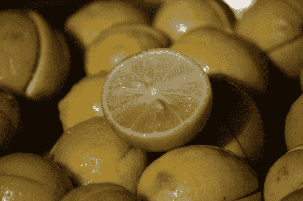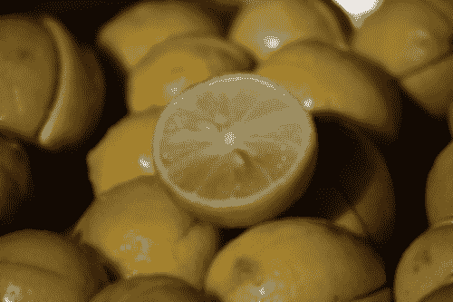

## 边缘检测和增强

在本节中，我们将学习一些通用的边缘检测和增强滤镜。边缘增强滤镜提高了边缘对比度。它增加了非常接近边缘区域的对比度。这使得边缘更加突出。边缘检测算法在图像的像素数据中寻找不连续性。例如，它寻找亮度中的急剧变化以识别边缘。

# 行动时间 - 检测和增强边缘

让我们看看边缘检测和增强滤镜如何修改图片的数据。我们将使用的照片是一片叶子的特写。原始照片在下一张插图显示。在这张图像上应用边缘检测滤镜会产生一种效果，其中只有边缘被突出显示，而图像的其余部分被渲染为黑色。

1.  从 Packt 网站下载图像`0165_3_6_Before_EDGE_ENHANCE.png`并将其保存为`Before_EDGE_ENHANCE.png`。

1.  在 Python 文件中添加以下代码。

    ```py
    1 import Image
    2 import ImageFilter
    3 import os
    4 paths = [ "C:\images\Before_EDGE_ENHANCE.png ",
    5 "C:\images\After_EDGE_ENHANCE.png ",
    6 "C:\images\EDGE_DETECTION_1.png ",
    7 "C:\images\EDGE_DETECTION_2.png "
    8 ]
    9 paths = map(os.path.normpath, paths)
    10
    11 ( imgPath ,outImgPath1,
    12 outImgPath2, outImgPath3) = paths
    13 img = Image.open(imgPath)
    14 img1 = img.filter(ImageFilter.FIND_EDGES)
    15 img1.save(outImgPath1)
    16
    17 img2 = img.filter(ImageFilter.EDGE_ENHANCE)
    18 img2.save(outImgPath2)
    19
    20 img3 = img2.filter(ImageFilter.FIND_EDGES)
    21 img3.save(outImgPath3)

    ```

1.  第 14 行使用`FIND_EDGES`滤镜修改图像数据，然后将结果图像保存。

1.  接下来，我们修改原始图像数据，以便使叶子中的更多叶脉变得可见。这是通过应用`ENHANCE_EDGES`滤镜（第 17 行）实现的。

1.  在第 20 行，将`FIND_EDGES`滤镜应用于边缘增强的图像。下一幅插图显示了比较后的结果图像。

    a) 第一行：应用边缘增强滤镜前后的图像 b) 第二行：由 ImageFilter.FIND_EDGES 滤镜检测到的边缘。

    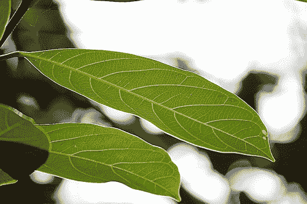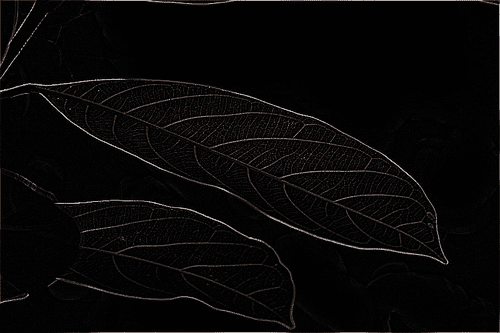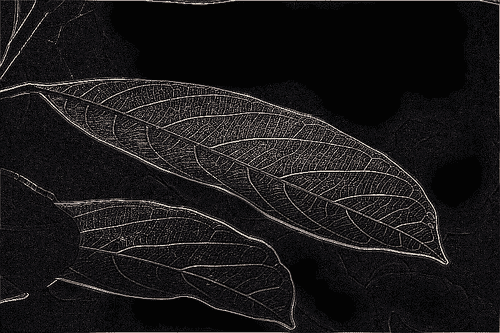

## 刚才发生了什么？

我们通过在`ImageFilter`模块中应用`EDGE_ENHANCE`滤镜来创建具有增强边缘的图像。我们还学习了如何使用边缘检测滤镜在图像中检测边缘。在下一节中，我们将应用一种特殊的边缘滤波器，该滤波器可以突出显示或变暗图像中检测到的边缘。它被称为浮雕滤镜。

## 浮雕

在图像处理中，浮雕是一种使图像具有 3D 外观的过程。图像中的边缘看起来像是凸起在图像表面之上。这种视觉错觉是通过突出显示或变暗图像中的边缘来实现的。以下插图显示了原始和浮雕图像。注意，浮雕图像中字符的边缘要么被突出显示，要么被变暗，以达到预期的效果。


`ImageFilter`模块提供了一个预定义的滤镜`ImageFilter.EMBOSS`，用于为图像实现浮雕效果。此滤镜的卷积核大小为(3, 3)，默认的滤镜参数为：

```py
filterargs = (3, 3), 1, 128, (
-1, 0, 0,
0, 1, 0,
0, 0, 0
)

```

# 行动时间 - 浮雕

1.  从 Packt 网站下载图像`0165_3_4_Bird_EMBOSS.png`并将其保存为`Bird_EMBOSS.png`。

1.  在 Python 文件中添加以下代码：

    ```py
    1 import os, sys
    2 import Image
    3 import ImageFilter
    4 imgPath = "C:\images\Bird_EMBOSS.png "
    5 outImgPath = "C:\images\Bird_EMBOSSED.png "
    6 imgPath = os.path.normpath(imgPath)
    6 outImgPath = os.path.normpath(outImgPath)
    7 bird = Image.open(imgPath)
    8 bird = bird.filter(ImageFilter.EMBOSS)
    9 bird.save(outImgPath)
    10 bird.show()

    ```

1.  在第 9 行，将浮雕滤镜`ImageFilter.EMBOSS`应用于图像对象`bird`。下一幅插图显示了鸟的浮雕图像。

    使用 ImageFilter.EMBOSS 创建的鸟的原始和浮雕图像。

    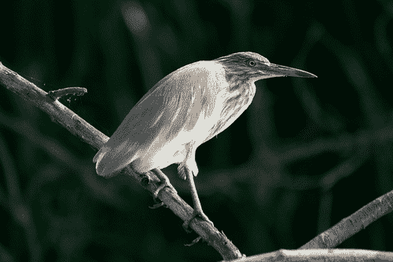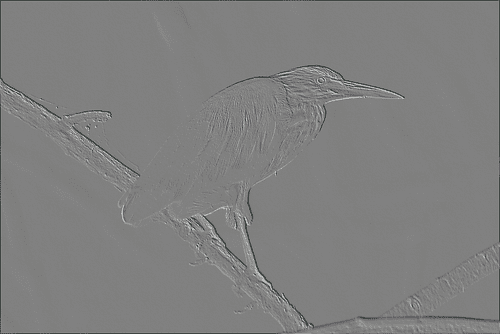

## 刚才发生了什么？

我们对一个图像应用了浮雕滤镜，创建了一个浮雕图像。如前文所述，该滤镜通过改变各种边缘的亮度使它们看起来被突出显示或变暗。这创造了一种视觉错觉，使图像看起来像是在表面之上凸起。

# 添加边框

你更喜欢怎样查看家庭照片？是作为裸露的图片还是装在漂亮的相框里？在`ImageOps`模块中，PIL 提供了在图片周围添加普通边框的初步功能。以下是实现此功能的语法：

```py
img = ImageOps.expand(img, border, fill)

```

此代码在图像周围创建了一个边框。内部，PIL 创建了一个具有相应尺寸的图像：

```py
new_width = ( right_border_thickness + image_width +
left_border_thickness )
new_height = ( top_border_thickness + image_height +
bottom_border_thickness )

```

然后，将原始图像粘贴到这个新图像上以创建边框效果。前述代码中的`border`参数表示边框厚度（以像素为单位）。在这个例子中它是均匀的，设置为左、右、上、下边框均为 20 像素。`fill`参数指定边框颜色。它可以是一个范围在`0`到`255`之间的数字，表示像素颜色，其中`0`表示黑色边框，`255`表示白色边框。或者，你可以指定一个表示颜色的字符串，例如`red`表示红色，等等。

# 执行动作 - 将图片封装在相框中

让我们开发代码，为图片添加边框。

1.  下载图像`0165_3_15_COLOR_TWEAK.png`并将其重命名为`FLOWER.png`。

1.  在 Python 源文件中添加以下代码。确保修改代码以适当地指定输入和输出路径。

    ```py
    1 import Image, ImageOps
    2 img = Image.open( "C:\\images\\FLOWER.png ")
    3 img = ImageOps.expand(img, border=20, fill='black')
    4 img = ImageOps.expand(img, border=40, fill='silver')
    5 img = ImageOps.expand(img, border=2, fill='black')
    6 img.save( "C:\\images\\PHOTOFRAME.png ")
    7 img.show()

    ```

1.  在此代码片段中，创建了三个堆叠的边框。最内层的边框层以黑色渲染。这是故意选择较暗的颜色。

1.  接下来，有一个中间层的边框，以较浅的颜色（在这个例子中是银色）渲染。这是通过第 4 行的代码实现的。它比最内层的边框更厚。

1.  最外层的边框是通过第 5 行的代码创建的。它是一个非常薄的黑色层。

1.  这三个边框层共同创造了一个相框的视觉错觉，使得边框看起来比原始图像突出。

1.  下面的图像显示了将此边框添加到指定输入图像的结果，显示了在“相框”中封装前后的图像。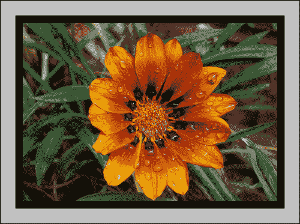

## 刚才发生了什么？

我们学习了如何为图像创建一个简单的边框。通过多次调用`ImageOps.expand`，我们创建了一个多层边框，每一层的厚度和颜色都不同。通过这种方式，我们实现了图片看起来被包含在一个简单相框中的视觉错觉。

# 概述

本章教授了我们几个重要的图像增强技术，具体包括：

+   在大量示例的帮助下，我们学习了如何调整图像的颜色、亮度和对比度。

+   我们学习了如何混合图像，使用图像蒙版创建合成图像，以及如何添加透明度。

+   我们将学到的混合、粘贴和其他技术应用到开发一个有趣的小工具中。我们在该工具中实现了插入水印、文本或日期戳到图像的功能。

+   讨论了许多图像增强过滤器。通过使用代码片段，我们学习了如何从图像中减少高级噪声，增强边缘，添加锐化或模糊效果，浮雕图像，等等。

+   我们学习了其他一些有用的图像增强技巧，例如创建负片和为图像添加边框效果。
