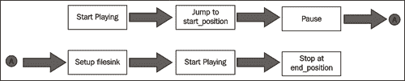
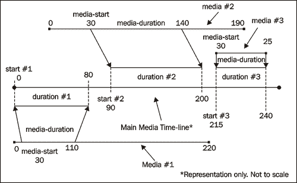
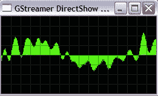
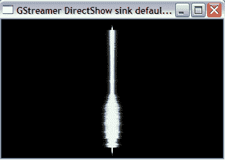
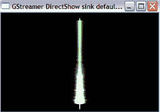

# 第六章。音频控制和效果

> 在上一章中，我们的重点是学习音频处理的基础知识。它向我们介绍了 GStreamer 多媒体框架。我们应用这些知识开发了一些常用的音频处理工具。在这一章中，我们将更进一步，开发添加音频效果、混音音频轨道、创建自定义音乐轨道等工具。

在这一章中，我们将：

+   学习如何控制流音频。

+   通过添加如淡入淡出、回声和全景等效果来增强音频。

+   在一个项目中工作，通过组合不同的音频片段创建自定义音乐轨道。

+   向流音频添加可视化效果。

+   将两个音频流混合成单个轨道。例如，将只包含*人声轨道*的音频与只包含*背景音乐轨道*的音频混合。

那么让我们开始吧。

# 控制播放

在音频播放器中，各种选项如播放、暂停、停止等，提供了一种控制流音频的方式。这些播放控制也在其他音频处理技术中得到应用。我们已经在第五章 *处理音频* 中使用了一些播放控制。在这一章中，我们将研究更多的控制选项。

## 播放

在上一章中，我们使用 GStreamer 开发了一个初步的命令行音频播放器。可以通过指示 GStreamer 管道开始音频数据的流动来启动音频流。这是通过以下代码实现的：

```py
self.pipeline.set_state(gst.STATE_PLAYING)

```

根据上述指令，音频将一直流出到流结束。参考第五章 *处理音频* 中 *播放音频* 部分的代码，看看周围的代码是什么样的。如果你为简单的音频播放器开发用户界面，可以将“播放”按钮连接到一个方法，该方法将设置管道状态为 `gst.STATE_PLAYING`。

## 暂停/恢复

可以通过将 GStreamer 管道状态设置为 `gst.STATE_PAUSED` 来暂时暂停流音频。在音频播放器中暂停音乐是另一个常见的操作。但这在执行一些特殊音频处理时也有用途。

# 行动时间 - 暂停和恢复播放音频流

我们现在将回顾一个非常简单的示例，演示各种播放控制技术。在接下来的几个部分中，将使用相同的示例。这个练习将在“使用播放控制提取音频”项目中进行时是一个理想的准备。那么，让我们开始吧！

1.  从 Packt 网站下载文件 `PlaybackControlExamples.py`。此文件包含展示各种播放控制的必要代码。以下是对整体类及其方法的参考说明。查看源文件以了解更多关于这些方法的信息。

    ```py
    class AudioPlayer:
    def __init__(self):
    pass
    def constructPipeline(self):
    pass
    def connectSignals(self):
    pass
    def decodebin_pad_added(self, decodebin, pad ):
    pass
    def play(self):
    pass
    def runExamples(self):
    pass
    def runPauseExample(self):
    pass
    def runStopExample(self):
    pass
    def runSeekExample(self):
    pass
    def okToRunExamples(self):
    pass
    def message_handler(self, bus, message):
    pass

    ```

1.  整体代码布局与第五章“与音频工作”部分中“播放音频”小节开发的代码非常相似。因此，我们只需回顾一些与该部分相关的新增方法。

1.  这是`self.play`方法的代码。

    ```py
    1 def play(self):
    2 self.is_playing = True
    3 self.player.set_state(gst.STATE_PLAYING)
    4 self.position = None
    5 while self.is_playing:
    6 time.sleep(0.5)
    7 try:
    9 self.position = (
    10 self.player.query_position(gst.FORMAT_TIME,
    11 None) [0] )
    16 except gst.QueryError:
    17 # The pipeline has probably reached
    18 # the end of the audio, (and thus has 'reset' itself.
    19 # So, it may be unable to query the current position.
    20 # In this case, do nothing except to reset
    21 # self.position to None.
    22 self.position = None
    23
    24 if not self.position is None:
    25 #Convert the duration into seconds.
    26 self.position = self.position/gst.SECOND
    27 print "\n Current playing time: ",
    28 self.position
    29
    30 self.runExamples()
    31 evt_loop.quit()

    ```

1.  在 while 循环中，第 9 行使用`query_position` 调用查询流式音频的当前位置。这是 GStreamer Pipeline 对象的 API 方法。当流接近结束时，在查询当前位置时可能会抛出错误。因此，我们在 try-except 块中捕获`gst.QueryError`异常。在进入 try-except 块之前，`time.sleep` 调用非常重要。它确保每 0.5 秒查询一次位置。如果你删除这个调用，下一行代码将在每个增量的小步骤上执行。从性能的角度来看，这是不必要的。因此获得的位置以纳秒表示，因此，如果时间是 0.1 秒，它将以 10 000 000 纳秒获得。为了将其转换为秒，它被除以 GStreamer 常量`gst.SECOND`。在第 30 行，调用运行各种音频控制示例的主方法。

1.  现在让我们看看`self.runExamples`方法中的代码。

    ```py
    1 def runExamples(self):
    2
    3 if not self.okToRunExamples():
    4 return
    5
    6 # The example will be roughly be run when the streaming
    7 # crosses 5 second mark.
    8 if self.position >= 5 and self.position < 8:
    9 if self.pause_example:
    10 self.runPauseExample()
    11 elif self.stop_example:
    12 self.runStopExample()
    13 elif self.seek_example:
    14 self.runSeekExample()
    15 # this flag ensures that an example is run
    16 # only once.
    17 self.ranExample = True

    ```

1.  `self.okToRunExamples`方法进行一些初步的错误检查，并确保总流式传输时间超过 20 秒。这里不会讨论这个方法。当当前轨道位置达到 5 秒时，将运行一个示例。运行哪个示例由相应的布尔标志确定。例如，如果`self.pause_example`标志设置为 True，它将运行将“暂停”音频流的代码。其他示例也是如此。这三个标志在`__init__`方法中初始化为 False。

1.  我们将要回顾的最后一个方法是`self.runPauseExample`。

    ```py
    1 def runPauseExample(self):
    2 print ("\n Pause example: Playback will be paused"
    3 " for 5 seconds and will then be resumed...")
    4 self.player.set_state(gst.STATE_PAUSED)
    5 time.sleep(5)
    6 print "\n .. OK now resuming the playback"
    7 self.player.set_state(gst.STATE_PLAYING)

    ```

1.  流式音频在第四行被调用暂停。`time.sleep` 调用将使音频暂停 5 秒钟，然后通过第七行的调用恢复音频播放。

1.  确保在`__init__`方法中将`self.pause_example`标志设置为 True，并为`self.inFileLocation`变量指定正确的音频文件路径。然后从命令提示符运行此示例：

    ```py
    $python PlaybackControlExamples.py

    ```

    +   音频将播放前 5 秒钟。然后暂停 5 秒钟，最后恢复播放。

## 刚才发生了什么？

通过一个简单的示例，我们学习了如何暂停流式音频。我们还看到了如何查询流式音频的当前位置。这些知识将在本章后面的项目中使用。

## 停止

将 GStreamer 管道的状态设置为`gst.STATE_NULL`将停止音频流。回想一下前一章“播放音频”部分中解释的`message_handler`方法。我们在将流结束消息放在`bus`上时使用了这个状态。在`PlaybackControlExamples.py`文件中，以下代码停止了音频的流式传输。

```py
def runStopExample(self):
print ("\n STOP example: Playback will be STOPPED"
" and then the application will be terminated.")
self.player.set_state(gst.STATE_NULL)
self.is_playing = False

```

在这个文件中，将标志`self.stop_example`设置为`True`，然后从命令行运行程序以查看这个示例。

## 快进/倒带

快进或倒带一个音轨简单来说就是将正在播放的音频轨道上的当前位置移动到另一个位置。这也被称为在音轨上定位位置。GStreamer 的`pipeline`元素定义了一个 API 方法`seek_simple`，它简化了在流式音频中跳转到音轨上指定位置的操作。在`PlabackControlExamples.py`文件中，这通过以下方法进行了说明。

```py
def runSeekExample(self):
print ("\n SEEK example: Now jumping to position at 15 seconds"
"the audio will continue to stream after this")
self.player.seek_simple(gst.FORMAT_TIME,
gst.SEEK_FLAG_FLUSH,
15*gst.SECOND)
self.player.set_state(gst.STATE_PAUSED)
print "\n starting playback in 2 seconds.."
time.sleep(2)
self.player.set_state(gst.STATE_PLAYING)

```

当调用此方法时，当前音频位置将移动到音频轨道上对应 15 秒持续时间的位置。代码中的高亮行是关键。`seek_simple`方法接受三个参数。第一个参数`gst.FORMAT_TIME`代表音轨上的时间。第二个参数`gst.SEEK_FLAG_FLUSH`是一个“定位标志”。它告诉管道清除当前正在播放的音频数据。换句话说，它指示清空管道。根据文档，这使得定位操作更快。还有其他几个定位标志。请参阅 GStreamer 文档以了解更多关于这些标志的信息。第三个参数指定了音轨上的时间，这将成为流式音频的新“当前位置”。这次我指定了纳秒，因此它乘以一个常数`gst.SECOND`。请注意，在调用`seek_simple`方法之前，管道应该处于播放状态。

## 项目：使用播放控制提取音频

在最后一章，我们学习了如何使用`gnonlin`插件提取音频片段。`Gnonlin`使我们的工作变得非常简单。在这个项目中，我们将看到另一种提取音频文件的方法，即通过使用 GStreamer 的基本音频处理技术。我们将使用刚刚学到的某些音频播放控制。这个项目将作为 GStreamer API 各种基本组件的复习。

# 行动时间 - 从基本原理开始的 MP3 裁剪

让我们创建一个从“基本原理”开始的 MP3 裁剪器。也就是说，我们不会使用`gnonlin`来完成这个任务。在这个项目中，我们将应用关于定位播放音轨、暂停管道以及基本音频处理操作的知识。

此实用程序可以从命令行运行：

```py
$python AudioCutter_Method2.py [options]

```

其中，`[options]`如下：

+   `--input_file:` 需要从其中裁剪音频片段的 MP3 格式的输入音频文件。

+   `--output_file:` 存储提取音频的输出文件路径。这需要是 MP3 格式。

+   `--start_time:` 在原始音轨上的秒数位置。这将是提取音频的起始位置。

+   `--end_time:` 在原始音轨上的秒数位置。这将是提取音频的结束位置。

+   `--verbose_mode:` 在提取音频时打印有用的信息，例如音轨的当前位置（以秒为单位）。默认情况下，此标志设置为`False`。

1.  从 Packt 网站下载文件 `AudioCutter_Method2.py`。在这里，我们只讨论最重要的方法。你可以参考这个文件中的源代码来开发其余的代码。

1.  我们将像往常一样开始，定义一个具有空方法的类。

    ```py
    import os, sys, time
    import thread
    import gobject
    from optparse import OptionParser
    import pygst
    pygst.require("0.10")
    import gst
    class AudioCutter:
    def __init__(self):
    pass
    def constructPipeline(self):
    pass
    def decodebin_pad_added(self, decodebin, pad):
    pass
    def connectSignals(self):
    pass
    def run(self):
    pass
    def extractAudio(self):
    pass
    def processArgs(self):
    pass
    def printUsage(self):
    pass
    def printFinalStatus(self):
    pass
    def message_handler(self, bus, message):
    pass
    audioCutter = AudioCutter()
    thread.start_new_thread(audioCutter.run, ())
    gobject.threads_init()
    evt_loop = gobject.MainLoop()
    evt_loop.run()

    ```

1.  如你所见，整体结构和方法名与前面章节中的 MP3 切割示例非常一致。我们不再有 `gnonlin_pad_added` 方法，而是有 `decodebin_pad_added`，这表明我们将捕获 `decodebin` 的 `pad_added` 信号。此外，还有新的方法 `run` 和 `extractAudio`。我们将详细讨论这些方法。

1.  现在我们来回顾一下类的构造函数。

    ```py
    1 def __init__(self):
    2 self.start_time = None
    3 self.end_time = None
    4 self.is_playing = False
    5 self.seek_done = False
    6 self.position = 0
    7 self.duration = None
    8 #Flag used for printing purpose only.
    9 self.error_msg = ''
    10 self.verbose_mode = False
    11
    12 self.processArgs()
    13 self.constructPipeline()
    14 self.connectSignals()

    ```

1.  `__init__` 方法调用方法处理用户输入，然后通过调用 `constructPipeline()` 方法构建 GStreamer 管道。这与我们在前面几个示例中看到的情况类似。

1.  想想这个问题。要提取音频，你需要哪些元素？我们需要在上一章开发的音频转换工具中使用的所有元素。请注意，在这个示例中，我们将输出保存为与输入相同的音频格式。让我们尝试构建一个初始管道。

    ```py
    1 def constructPipeline(self):
    2 self.pipeline = gst.Pipeline()
    3 self.fakesink = gst.element_factory_make("fakesink")
    4 filesrc = gst.element_factory_make("filesrc")
    5 filesrc.set_property("location", self.inFileLocation)
    6
    7 autoaudiosink = gst.element_factory_make(
    8 "autoaudiosink")
    9
    10 self.decodebin = gst.element_factory_make("decodebin")
    11
    12 self.audioconvert = gst.element_factory_make(
    13 "audioconvert")
    14
    15 self.encoder = gst.element_factory_make("lame",
    16 "mp3_encoder")
    17
    18 self.filesink = gst.element_factory_make("filesink")
    19 self.filesink.set_property("location",
    20 self.outFileLocation)
    21
    22 self.pipeline.add(filesrc, self.decodebin,
    23 self.audioconvert,
    24 self.encoder, self.fakesink)
    25
    26 gst.element_link_many(filesrc, self.decodebin)
    27 gst.element_link_many(self.audioconvert,
    28 self.encoder, self.fakesink)

    ```

1.  我们已经熟悉了包含在这个管道中的大多数元素。管道看起来与音频转换工具中的管道相同，只是 sink 元素不同。注意，在第 18 行创建了 `filesink` 元素。但是，它没有被添加到管道中！相反，我们添加了一个 `fakesink` 元素。你能猜到为什么吗？这是一个提取工具。我们只需要保存输入音频文件的一部分。提取部分的起始位置可能不是原始轨道的起始位置。因此，在这个时候，我们不会将 `filesink` 添加到管道中。

1.  接下来编写 `AudioCutter.run` 方法。

    ```py
    1 def run(self):
    2 self.is_playing = True
    3 print "\n Converting audio. Please be patient.."
    4 self.pipeline.set_state(gst.STATE_PLAYING)
    5 time.sleep(1)
    6 while self.is_playing:
    7 self.extractAudio()
    8 self.printFinalStatus()
    9 evt_loop.quit()

    ```

1.  在第 4 行，我们应用了一个播放控制命令来指示管道开始播放。输入音频的状态被设置为 `STATE_PLAYING`。如前所述，`self.is_playing` 标志在 `message_handler` 方法中被更改。在 `while` 循环中，调用工作马方法 `self.extractAudio()`。其余的代码是自解释的。

1.  现在我们将回顾执行切割输入音频片段工作的方法。让我们首先看看在 `extractAudio()` 方法中考虑的重要事项。然后，理解代码将会非常容易。下面的插图列出了这些重要事项。

    +   在 `AudioCutter.extractAudio()` 方法中考虑的重要步骤在前面的图像中显示。

1.  要从输入中提取一段音频，需要通过管道的数据流开始。然后，我们需要跳转到输入音频中对应于要提取的音频文件起始位置的点。一旦确定了起始位置，GStreamer 管道需要调整，以便有一个`filesink`元素。`filesink`将指定输出音频文件。设置好管道后，我们需要开始数据流。当达到用户指定的结束位置时，程序执行应停止。现在让我们编写代码。

    ```py
    1 def extractAudio(self):
    2 if not self.seek_done:
    3 time.sleep(0.1)
    4 self.duration = \
    5 self.pipeline.query_duration(gst.FORMAT_TIME,
    6 None) [0]
    7 self.duration = self.duration/gst.SECOND

    ```

    ```py
    8
    9 if self.start_time > self.duration:
    10 print "\n start time specified" \
    11 " is more than the total audio duration"\
    12 " resetting the start time to 0 sec"
    13 self.start_time = 0.0
    14
    15 self.pipeline.seek_simple(gst.FORMAT_TIME,
    16 gst.SEEK_FLAG_FLUSH,
    17 self.start_time*gst.SECOND)
    18
    19 self.pipeline.set_state(gst.STATE_PAUSED)
    20 self.seek_done = True
    21 self.pipeline.remove(self.fakesink)
    22
    23 self.pipeline.add(self.filesink)
    24 gst.element_link_many(self.encoder, self.filesink)
    25 self.pipeline.set_state(gst.STATE_PLAYING)
    26
    27 time.sleep(0.1)
    28 try:
    29 self.position = self.pipeline.query_position(
    30 gst.FORMAT_TIME, None)[0]
    31 self.position = self.position/gst.SECOND
    32 except gst.QueryError:
    33 # The pipeline has probably reached
    34 # the end of the audio, (and thus has 'reset' itself)
    35 if self.duration is None:
    36 self.error_msg = "\n Error cutting the audio
    37 file.Unable to determine the audio duration."
    38 self.pipeline.set_state(gst.STATE_NULL)
    39 self.is_playing = False
    40 if ( self.position <= self.duration and
    41 self.position > (self.duration - 10) ):
    42 # Position close to the end of file.
    43 # Do nothing to avoid a possible traceback.
    44 #The audio cutting should work
    45 pass
    46 else:
    47 self.error_msg =" Error cutting the audio file"
    48 self.pipeline.set_state(gst.STATE_NULL)
    49 self.is_playing = False
    50
    51 if not self.end_time is None:
    52 if self.position >= self.end_time:
    53 self.pipeline.set_state(gst.STATE_NULL)
    54 self.is_playing = False
    55
    56 if self.verbose_mode:
    57 print "\n Current play time: =", self.position

    ```

1.  代码块在第 3 到 25 行之间执行，仅在程序第一次进入此方法时执行。标志`self.seek_done`确保它只执行一次。这是上述插图中的矩形块表示的步骤 2 到 5 的重要代码片段。现在让我们详细回顾这段代码。

1.  在第 3 行，我们通过`time.sleep`调用让程序等待 0.1 秒。这是为了下一行代码查询播放总时长所必需的。API 方法`query duration`返回播放的总时长。参数`gst.FORMAT_TIME`确保返回值是以时间格式（纳秒）表示的。为了将其转换为秒，我们需要将其除以`gst.SECOND`。

1.  接下来，在第 15-17 行，我们跳转到输入音频轨道中与用户提供的参数`self.start_time`相对应的位置。请注意，方法`seek_simple`中的时间参数需要以纳秒为单位。因此，它乘以`gst.SECOND`。

1.  在第 19 行，`gst.STATE_PAUSED`调用暂停了管道中的数据流。通过`self.pipline.remove`调用从管道中移除`fakesink`元素。这也将其从管道中解链。然后，在第 23 和 24 行将`self.filesink`元素添加到管道中并连接。这样，我们就准备好再次播放音频文件了。从现在开始，音频数据将保存到由`filesink`元素指示的音频文件中。

1.  在第 27 行，查询正在播放的当前位置。请注意，这是在 try-except 块中完成的，以避免在音频接近文件末尾时查询位置时出现任何可能的错误。当`self.position`达到指定的`self.end_time`时，通过`gst.STATE_NULL`调用停止通过管道的数据流。

1.  编写其他方法，如`decodebin_pad_added`、`connectSignals`。源代码可以在文件`AudioCutter_Method2.py`中找到。

1.  现在我们已经准备好运行程序了。通过指定本节开头提到的适当参数，从命令行运行它。

## 刚才发生了什么？

通过应用基本的音频处理技术，我们开发了一个 MP3 切割工具。这是提取音频的另一种方式。我们通过利用前面章节中学到的各种播放控制完成了这项任务。

# 调整音量

我们执行的最常见的音频操作之一是调整正在播放的音频的音量级别。假设你在电脑上有一系列你最喜欢的歌曲。多年来，你从各种来源添加歌曲到这个收藏夹，并创建了一个 '播放列表'，以便你可以一首接一首地听。但有些歌曲的音量比其他歌曲大得多。当然，每次这样的歌曲开始播放时，你可以调整音量，但这不是你想要的，对吧？你想要解决这个问题，但怎么做呢？让我们来学习一下！

GStreamer 中的 `volume` 元素可以用来控制流音频的音量。它被归类为一种音频过滤器。运行 `gst-inspect-0.10` 命令来了解其属性的更多详细信息。

你将如何使用 GStreamer 命令行版本调整音量？以下是在 Windows XP 上完成此操作的命令。你应该使用正斜杠，因为反斜杠不能被 'location' 属性正确解析。

```py
$gstlaunch-0.10 filesrc location=/path/to/audio.mp3 ! decodebin ! Audioconvert ! volume volume=0.8 ! autoaudiosink

```

此管道与音频播放示例非常相似。我们只是添加了一个 `volume` 元素在 `audioconvert` 之后。

# 行动时间 - 调整音量

现在，让我们开发一个修改音频文件音量的 Python 示例。我们将编写一个实用程序，它可以接受一个输入音频文件，并以增加或减少默认音量级别的方式写入输出文件。该实用程序将支持写入 MP3 格式的音频文件。如果你需要其他格式，你可以扩展此应用程序。参考我们在上一章中做的 Audio Converter 项目。

1.  从 Packt 网站下载 `AudioEffects.py` 文件。它包含此示例以及 *淡入淡出效果* 的源代码。

1.  编写 `AudioEffects` 类的构造函数。

    ```py
    1 def __init__(self):
    2 self.is_playing = False
    3 # Flag used for printing purpose only.
    4 self.error_msg = ''
    5 self.fade_example = False
    6 self.inFileLocation = "C:/AudioFiles/audio1.mp3"
    7 self.outFileLocation = (
    8 "C:/AudioFiles/audio1_out.mp3" )
    9
    10 self.constructPipeline()
    11 self.connectSignals()

    ```

1.  在此示例中，`self.fade_example` 标志应设置为 `False`。现在你可以忽略它。它将在 *淡入淡出效果* 部分中使用。在 6 和 8 行指定适当的输入和输出音频文件路径。

1.  我们将接下来查看 `self.constructPipeline()` 方法。

    ```py
    1 def constructPipeline(self):
    2 self.pipeline = gst.Pipeline()
    3
    4 self.filesrc = gst.element_factory_make("filesrc")
    5 self.filesrc.set_property("location",
    6 self.inFileLocation)
    7
    8 self.decodebin = gst.element_factory_make("decodebin")
    9 self.audioconvert = gst.element_factory_make(
    10 "audioconvert")
    11 self.encoder = gst.element_factory_make("lame")
    12
    13 self.filesink = gst.element_factory_make("filesink")
    14 self.filesink.set_property("location",
    15 self.outFileLocation)
    16
    17 self.volume = gst.element_factory_make("volume")
    18 self.volumeLevel = 2.0
    19
    20 if self.fade_example:
    21 self.setupVolumeControl()
    22 else:
    23 self.volume.set_property("volume",
    24 self.volumeLevel)
    25
    26
    27 self.pipeline.add(self.filesrc,
    28 self.decodebin,
    29 self.audioconvert,
    30 self.volume,
    31 self.encoder,
    32 self.filesink)
    33
    34 gst.element_link_many( self.filesrc, self.decodebin)
    35 gst.element_link_many(self.audioconvert,
    36 self.volume,
    37 self.encoder,
    38 self.filesink)

    ```

1.  以通常的方式创建各种 GStreamer 元素。在第 17 行，创建了音量元素。

1.  `volume` 元素有一个 "volume" 属性。这决定了流音频的音量级别。默认情况下，此值为 1.0，表示音频的当前默认音量的 100%。0.0 的值表示没有音量。大于 1.0 的值将使音频比原始级别更响亮。让我们将此级别设置为 2.0，这意味着生成的音量将比原始音量更大。此方法中的其余代码在 GStreamer 管道中添加并链接元素。

1.  查看之前提到的文件中的其余代码。它很直观。

1.  在命令提示符下运行程序：

1.  播放生成的音频，并将其默认音量与原始音频进行比较。

    ```py
    $python AudioEffects.py

    ```

## 刚才发生了什么？

通过一个非常简单的示例，我们学习了如何更改音频文件的默认音量级别。如果您想在音频的某些点有不同的音量级别怎么办？我们将在 *淡入淡出效果* 部分很快讨论这个问题。

# 音频效果

就像人们为了改善食物的味道而添加香料一样，为了增强音乐或任何声音，我们添加音频效果。GStreamer 中有各种各样的音频效果插件。在接下来的章节中，我们将讨论一些常用的音频效果。

## 淡入淡出效果

淡入淡出是音频音量级别的逐渐增加或减少。淡出意味着随着音频接近结尾时逐渐降低音频文件的音量。通常，在结尾时，音量级别被设置为 0。类似地，淡入效果从音频的开始逐渐增加音量级别。在本章中，我们将学习如何向音频添加淡出效果。一旦我们学会了这一点，实现淡入效果就变得非常简单了。

# 动手时间 - 淡入淡出效果

让我们向输入音频添加淡出效果。我们将使用与 *调整音量* 部分中相同的源文件。

1.  如果您还没有下载，请下载包含此示例源代码的文件 `AudioEffects.py`。

1.  在这个类的 `__init__` 方法中，您需要做一个小改动。将标志 `self.fade_example` 设置为 `True`，这样它现在将运行添加淡出效果的代码。

1.  我们已经在 *调整音量* 部分中回顾了 `self.constructPipeline()` 方法。它调用了 `self.setupVolumeControl()` 方法。

    ```py
    1 def setupVolumeControl(self):
    2 self.volumeControl = gst.Controller(self.volume,
    3 "volume")
    4 self.volumeControl.set("volume", 0.0*gst.SECOND,
    5 self.volumeLevel)
    6 self.volumeControl.set_interpolation_mode("volume",
    7 gst.INTERPOLATE_LINEAR)

    ```

1.  GStreamer 的 `Controller` 对象在第 2 行创建。它是一个轻量级对象，提供了一种控制 GStreamer 对象各种属性的方式。在这种情况下，它将被用来调整 `self.volume` 的 'volume' 属性。`Controller` 的设置方法接受三个参数，即需要控制的属性（"volume"）、需要在音频轨道上更改属性的时间，以及该属性的新值（self.volumeLevel）。在这里，音频开始时的音量级别被设置为 `self.volumeLevel`。接下来，为 `volume` 属性设置由 `Controller` 对象调整的插值模式。在这里，我们要求 `self.volumeControl` 线性地从其早期值变化到新值，随着音频轨道的进行。例如，如果开始时的音量级别设置为 1.0，在 30 秒时设置为 0.5，那么在 0 到 30 秒之间的音量级别将在轨道上线性插值。在这种情况下，它将从 0 秒的 1.0 级别线性降低到 30 秒的 0.5 级别。

    ### 小贴士

    GStreamer 文档建议 `Controller.set_interpolation_mode` 已被弃用（但在本书使用的 0.10.5 版本中仍然向后兼容）。请参阅文件 `AudioEffects.py` 中的 'TODO' 注释。

1.  为了在音频末尾添加淡出效果，首先我们需要获取正在播放的音频的总时长。我们只能在音频被设置为播放后查询时长（例如，当它处于`gst.STATE_PLAYING`模式时）。这是在`self.play()`方法中完成的。

    ```py
    def play(self):
    self.is_playing = True
    self.pipeline.set_state(gst.STATE_PLAYING)
    if self.fade_example:
    self.addFadingEffect()
    while self.is_playing:
    time.sleep(1)
    self.printFinalStatus()
    evt_loop.quit()

    ```

1.  一旦将管道的状态设置为`gst.STATE_PLAYING`，就会调用`self.addFadingEffects()`方法，如代码中高亮显示的行所示。

1.  我们现在将回顾这个方法。

    ```py
    1 def addFadingEffect(self):
    2 # Fist make sure that we can add the fading effect!
    3 if not self.is_playing:
    4 print ("\n Error: unable to add fade effect"
    5 "addFadingEffect() called erroniously")
    6 return
    7
    8 time.sleep(0.1)
    9 try:
    10 duration = (
    11 self.pipeline.query_duration(gst.FORMAT_TIME,
    12 None) [0] )
    13 #Convert the duration into seconds.
    14 duration = duration/gst.SECOND
    15 except gst.QueryError:
    16 # The pipeline has probably reached
    17 # the end of the audio, (and thus has 'reset' itself)
    18 print ("\n Error: unable to determine duration."
    19 "Fading effect not added." )
    20 return
    21
    22 if duration < 4:
    23 print ("ERROR: unable to add fading effect."
    24 "\n duration too short.")
    25 return
    26
    27 fade_start = duration - 4
    28 fade_volume = self.volumeLevel
    29 fade_end = duration
    30
    31 self.volumeControl.set("volume",
    32 fade_start * gst.SECOND,
    33 fade_volume)
    34
    35 self.volumeControl.set("volume",
    36 fade_end * gst.SECOND,
    37 fade_volume*0.01)

    ```

1.  首先，我们确保正在播放的音频时长可以无错误地计算。这是通过代码块 2-24 完成的。接下来，定义了`fade_start`时间。在这个控制点，淡出效果将开始。淡出将在音频结束前 4 秒开始。音量将从`fade_start`时间线性减少到`fade_end`时间。`fade_volume`是淡出开始时的参考音量级别。在第 30 行和第 34 行，我们实际上为`self.volumeController`设置了这些淡出时间和音量参数，`self.volumeController`是调整音量的`Controller`对象。通过`gst.INTERPOLATE_LINEAR`（在早期步骤中讨论过）实现了音量级别的逐渐降低。

1.  使用参考文件`AudioEffects.py`开发或审查剩余的代码。确保为变量`self.inFileLocation`和`self.outFileLocation`分别指定适当的输入和输出音频路径。然后从命令行运行程序，如下所示：

1.  这应该创建一个输出音频文件，其中淡出效果在文件结束前 4 秒开始。

    ```py
    $python AudioEffects.py

    ```

## 刚才发生了什么？

我们学习了如何使用 GStreamer 多媒体框架向音频文件添加淡变效果。我们使用了与*调整音量*部分相同的 GStreamer 管道，但这次，音量级别是通过 GStreamer 中的`Controller`对象控制的。我们刚刚学到的技术将在本章后面的“组合音频片段”项目中派上用场。

## 尝试添加淡入效果

这将非常直接。我们之前添加了淡出效果。现在通过添加淡入效果到输入音频来扩展这个实用程序。使用总淡入时长为 4 秒。在这种情况下，`fade_start`时间将是 0 秒。尝试使用`gst.INTERPOLATE_CUBIC`作为插值模式。

## 嗡嗡嗡...

响应是原声在短时间内听到的声音的反射。在音频处理中，为了实现这种效果，输入音频信号被记录下来，然后在指定的'延迟时间'后以指定的强度播放。可以使用 GStreamer 中的`audioecho`插件添加回声效果。音频回声插件应默认包含在您的 GStreamer 安装中。可以通过运行以下命令来检查：

```py
$gst-inspect-0.10 audioecho

```

如果它不可用，您需要单独安装它。请参阅 GStreamer 网站以获取安装说明。

# 添加回声效果的行动时间

让我们编写代码将回声效果添加到输入音频。代码与在前面部分讨论的`AudioEffects.py`文件中的代码非常相似。为了简化问题，我们将使用`EchoEffect.py`文件中的代码，以便更容易理解。稍后，你可以轻松地将此代码与`AudioEffects.py`中的代码集成。

1.  下载包含添加音频回声效果的源代码的文件`EchoEffect.py`。该文件包含名为`AudioEffects`的类，其构造函数具有以下代码。

    ```py
    def __init__(self):
    self.is_playing = False
    # Flag used for printing purpose only.
    self.error_msg = ''
    #the flag that determines whether to use
    # a gst Controller object to adjust the
    # intensity of echo while playing the audio.
    self.use_echo_controller = False
    self.inFileLocation = "C:/AudioFiles/audio1.mp3"
    self.outFileLocation = "C:/AudioFiles/audio1_out.mp3"
    self.constructPipeline()
    self.connectSignals()

    ```

1.  它与在“衰减效果”部分讨论的`__init__`方法类似。这里的一个区别是标志`self.use_echo_controller`。如果它被设置为 True，GStreamer 控制器对象将在音频流传输时调整某些回声属性。我们首先将看到如何实现一个简单的回声效果，然后讨论回声控制细节。指定音频文件路径变量`self.inFileLocation`和`self.outFileLocation`的适当值。

1.  让我们构建 GStreamer 管道。

    ```py
    1 def constructPipeline(self):
    2 self.pipeline = gst.Pipeline()
    3
    4 self.filesrc = gst.element_factory_make("filesrc")
    5 self.filesrc.set_property("location",
    6 self.inFileLocation)
    7
    8 self.decodebin = gst.element_factory_make("decodebin")
    9
    10 self.audioconvert = gst.element_factory_make(
    11 "audioconvert")
    12 self.audioconvert2 = gst.element_factory_make(
    13 "audioconvert")
    14
    15 self.encoder = gst.element_factory_make("lame")
    16
    17 self.filesink = gst.element_factory_make("filesink")
    18 self.filesink.set_property("location",
    19 self.outFileLocation)
    20
    21 self.echo = gst.element_factory_make("audioecho")
    22 self.echo.set_property("delay", 1*gst.SECOND)
    23 self.echo.set_property("feedback", 0.3)
    24
    25 if self.use_echo_controller:
    26 self.setupEchoControl()
    27 else:
    28 self.echo.set_property("intensity", 0.5)
    29
    30 self.pipeline.add(self.filesrc,self.decodebin,
    31 self.audioconvert,
    32 self.echo,
    33 self.audioconvert2,
    34 self.encoder,
    35 self.filesink)
    36
    37 gst.element_link_many( self.filesrc, self.decodebin)
    38 gst.element_link_many(self.audioconvert,
    39 self.echo,
    40 self.audioconvert2,
    44 self.encoder,
    45 self.filesink)

    ```

1.  在第 21 行创建了`audioecho`元素。属性`delay`指定了回声声音播放的持续时间。我们将其指定为 1 秒，你可以进一步增加或减少这个值。回声反馈值设置为 0.3。在第 28 行，强度属性设置为 0.5。它可以在 0.0 到 1.0 的范围内设置，并决定了回声的声音强度。因此，如果你将其设置为 0.0，回声将不会被听到。

1.  注意有两个`audioconvert`元素。第一个`audioconvert`将解码的音频流转换为可播放的格式，作为`self.echo`元素的输入。同样，在回声元素的另一端，我们需要`audioconvert`元素来处理回声效果添加后的音频格式。然后，该音频以 MP3 格式编码并保存到由`self.filesink`指定的位置。

1.  从命令行运行程序如下：

    ```py
    $python EchoEffect.py

    ```

    +   如果你播放输出文件，回声声音将在整个播放期间可闻。

1.  现在我们将添加一个功能，允许我们只为音频轨道的一定持续时间添加回声效果。在`__init__`方法中，将标志`self.use_echo_controller`设置为`True`。

1.  我们现在将回顾在`self.constructPipeline()`中调用的方法`self.setupEchoControl()`。

    ```py
    def setupEchoControl(self):
    self.echoControl = gst.Controller(self.echo, "intensity")
    self.echoControl.set("intensity", 0*gst.SECOND, 0.5)
    self.echoControl.set("intensity", 4*gst.SECOND, 0.0)

    ```

1.  设置`gst.Controller`对象与在“衰减效果”部分开发的类似。在这里，我们要求`Controller`对象`self.echoControl`控制`audioecho`元素`self.echo`的属性`intensity`。在播放开始时（0 秒），我们将回声强度设置为`0.5`。在播放过程中 4 秒时，我们添加另一个控制点并将`intensity`级别设置为`0.0`。这实际上意味着我们不想在音频播放的前 4 秒后听到任何回声！

1.  再次从命令行运行程序如下：

    ```py
    $python EchoEffect.py

    ```

    +   注意，这里所做的唯一更改是将标志 self.use_echo_controller 的值设置为 True。播放输出文件；回声声音在播放过程中仅在最初的 4 秒内可听见。

## 刚才发生了什么？

我们学习了如何向音频剪辑添加回声。为了完成这个任务，我们在 GStreamer 管道中添加并链接了 `audioecho` 元素。我们还学习了如何使用 GStreamer `Controller` 对象有选择性地添加回声效果到音频中。

## 尝试添加混响效果，英雄们！

假设你在一个剧院里。当舞台中央的演员说话时，声波会在到达你的耳朵之前从剧院的表面反射。因此，你所听到的是一系列这些反射的声音。这被称为混响效果。根据 `audioecho` 插件文档，如果你将 `audioecho` 元素的 `delay` 属性设置为小于 0.2 秒的值，它会产生混响效果。尝试设置不同的 `delay` 值，小于 0.2 秒，看看它如何影响输出音频。注意，这个参数被视为整数。因此，请以纳秒为单位指定此值。例如，将 0.05 秒指定为 `50000000` 而不是 `0.05*gst.SECOND`。这在下文中进行了说明。

```py
self.echo.set_property("delay", 50000000)

```

## 播放/全景

可以通过使用 `audiopanorama` 插件（`audiofx` 插件的一部分）将立体声全景效果添加到声音中。这个插件应该默认包含在你的 GStreamer 安装中。使用 `gst-inspect-0.10` 来验证它是否存在，并了解更多关于其属性的信息。从 Packt 网站下载文件 `PanoramaEffect.py`。这个文件与 `AudioEffects.py` 或 `EchoEffect.py` 大致相同。以下是从文件 `PanoramaEffect.py` 中的 `self.constructPipeline` 方法的一个代码片段。

```py
1 # Stereo panorama effect
2 self.panorama = gst.element_factory_make("audiopanorama")
3 self.panorama.set_property("panorama", 1.0)
4
5
6 self.pipeline.add(self.filesrc,
7 self.decodebin,
8 self.audioconvert,
9 self.panorama,
10 self.encoder,
11 self.filesink)
12
13
14 gst.element_link_many( self.filesrc, self.decodebin)
15 gst.element_link_many(self.audioconvert,
16 self.panorama,
17 self.encoder,
18 self.filesink)

```

我们已经讨论过很多次了。让我们再次回顾一下代码，作为复习……以防你之前错过了。代码块 6-11 将所有元素添加到 GStreamer 管道中。请注意，我们调用了 `gst.element_link_many` 两次。你还记得为什么吗？第 14 行的第一次调用在 `self.filesrc` 和 `self.decodebin` 之间建立了一个连接。当我们第二次调用 `gst.element_link_many` 时，有一个重要点需要注意。请注意，我们没有将 `self.decodebin` 与 `self.audioconvert` 链接。这是因为 `self.decodebin` 实现了动态垫。因此，我们使用回调方法 `decodebin_pad_added` 在运行时将其连接。

您可以从此文件中查看其余的代码。`audiopanorama`元素在代码片段的第 2 行创建。`panorama`属性可以有一个在`-1.0`到`1.0`范围内的值。如果您连接了立体声扬声器，当指定值为`-1.0`时，声音将完全来自左扬声器。同样，`1.0`的值将使声音仅来自右扬声器。在上面的代码片段中，我们指示程序仅使用右扬声器进行音频流传输。如果值在这两个限制之间，则两个扬声器都会传输音频。每个扬声器的贡献将由实际值确定。

## 尝试控制全景效果和更多...

“移动”声音！向`self.panorama`元素的`panorama`属性添加一个 GStreamer `Controller`对象进行调整。这与我们在`EchoEffect.py`中做的是类似的。在音频流中添加一些控制点，就像之前做的那样，并为`panorama`属性指定不同的值。

将此功能与本章前面讨论的`AudioEffects.py`中的代码集成。

# 项目：组合音频片段

是时候进行一个项目了！在这个项目中，我们将创建一个单一的音频文件，该文件将依次附加自定义音频剪辑。在这里，我们将应用之前章节和上一章中学习到的几个东西。

创建一个新的音频文件，该文件是您选择的几个音频轨道的组合，涉及以下步骤：

+   首先我们需要的是需要包含的音频文件。根据我们的需求，我们可能只需要音频轨道的一小部分。因此，我们将开发一个通用应用程序，考虑到这种可能性。这在前面的时间线中得到了说明。

+   接下来，我们需要确保这些音频片段按指定的顺序播放。

+   在两个音频片段之间应该有一个“空白”或“静音”音频。

+   接下来，我们还将为轨道中的每个片段实现音频淡出效果。这将确保音频不会突然结束。

## 媒体“时间线”解释

在我们开始这个项目之前，理解时间线的概念非常重要。时间线可以看作是控制单个音频片段播放时间的路径的整体表示。

在这个项目中，由于我们正在保存结果音频，所以它与结果音频的总播放时间相同。在这个时间线中，我们可以指定音频需要播放的时间和需要播放多长时间。以下插图更好地解释了这一点。考虑一个总时长为 250 秒的时间线。这由中央粗线及其末端的圆圈表示。假设有三个音频剪辑，分别是`媒体#1、媒体#2`和`媒体#3`，如插图所示。我们希望在主时间线（要保存的音频文件）中包含这些音频剪辑的每个部分。在主媒体时间线中，从 0 秒到 80 秒的音频代表来自`媒体#1`的部分。它对应于`媒体#1`中从 30 秒到 110 秒的音频。同样，主媒体时间线上的 90 至 200 秒的音频代表来自`媒体#2`的部分，依此类推。因此，我们可以调整主媒体时间线中单个音频剪辑的优先级和位置，以创建所需的音频输出。



在前面的图像中，主媒体时间线由多个媒体轨道表示。

# 行动时间 - 通过组合剪辑创建自定义音频

让我们开发一个应用程序，我们将把多个音频剪辑组合成一个单独的音频文件。

1.  下载文件`CombiningAudio.py`。此文件包含运行此应用程序所需的所有代码。与之前一样，我们只讨论此类中最重要的方法。

1.  写下以下代码。

    ```py
    1 import os, sys, time
    2 import thread
    3 import gobject
    4 from optparse import OptionParser
    5
    6 import pygst
    7 pygst.require("0.10")
    8 import gst
    9
    10 class AudioMerger:
    11 def __init__(self):
    12 pass
    13 def constructPipeline(self):
    14 pass
    15 def addFadingEffect(self):
    16 pass
    17 def setupFadeBin(self):
    18 pass
    19 def addGnlFileSources(self):
    20 pass
    21 def gnonlin_pad_added(self, gnonlin_elem, pad):
    22 pass
    23 def run(self):
    24 pass
    25 def connectSignals(self):
    26 pass
    27 def printUsage(self):
    28 pass
    29 def printFinalStatus(self):
    30 pass
    31 def message_handler(self, bus, message):
    32 pass
    33 #Run the program
    34 audioMerger = AudioMerger()
    35 thread.start_new_thread(audioMerger.run, ())
    36 gobject.threads_init()
    37 evt_loop = gobject.MainLoop()
    38 evt_loop.run()

    ```

1.  代码的整体结构与本书中的其他几个示例相同。在接下来的步骤中，我们将扩展一些类方法，如 addFadingEffect、setupFadeBin。

1.  现在，让我们回顾一下`constructPipeline`方法。

    ```py
    1 def constructPipeline(self):
    2 self.pipeline = gst.Pipeline()
    3 self.composition = (
    4 gst.element_factory_make("gnlcomposition") )
    5
    6 # Add audio tracks to the gnl Composition
    7 self.addGnlFileSources()
    8
    9 self.encoder = gst.element_factory_make("lame",
    10 "mp3_encoder")
    11 self.filesink = gst.element_factory_make("filesink")
    12 self.filesink.set_property("location",
    13 self.outFileLocation)
    14
    15 # Fade out the individual audio pieces
    16 # when that audio piece is approaching end
    17 self.addFadingEffect()
    18
    19 self.pipeline.add(self.composition,
    20 self.fadeBin,
    21 self.encoder,
    22 self.filesink)
    23
    24 gst.element_link_many(self.fadeBin,
    25 self.encoder,
    26 self.filesink)

    ```

1.  在之前的部分实现音频淡入淡出效果时，我们使用了 gnlcomposition、gnlcontroller 等功能。这些模块也将在此项目中使用。在第 7 行，我们希望包含的所有音频剪辑都被添加到时间线或 gnlcomposition 中。我们将在稍后回顾此方法。请注意，gnlcomposition 使用动态垫。垫添加的信号连接在 self.connectSignals 中。在第 17 行，为音频剪辑设置了淡入淡出效果。这确保了时间线中单个音频剪辑的平滑终止。最后，第 19 至 26 行的代码块构建了管道并链接了管道中的各种 GStreamer 元素。让我们逐一回顾这个类中的其他重要方法。

1.  方法`self.addGnlFileSources`执行多项操作。它按所需顺序将音频剪辑添加到主时间线中。此方法还确保在任意两个音频剪辑之间有一些“呼吸空间”或短时间的空白音频。写下以下方法。

    ```py
    1 def addGnlFileSources(self):
    2 #Parameters for gnlfilesources
    3 start_time_1 = 0
    4 duration_1 = 20
    5 media_start_time_1 = 20
    6 media_duration_1 = 20
    7 inFileLocation_1 = "C:/AudioFiles/audio1.mp3"
    8
    9 start_time_2 = duration_1 + 3
    10 duration_2 = 30
    11 media_start_time_2 = 20
    12 media_duration_2 = 30
    13 inFileLocation_2 ="C:/AudioFiles/audio2.mp3"
    14
    15 #Parameters for blank audio between 2 tracks
    16 blank_start_time = 0
    17 blank_duration = start_time_2 + duration_2 + 3
    18
    19 # These timings will be used for adding fade effects
    20 # See method self.addFadingEffect()
    21 self.fade_start_1 = duration_1 - 3
    22 self.fade_start_2 = start_time_2 + duration_2 - 3
    23 self.fade_end_1 = start_time_1 + duration_1
    24 self.fade_end_2 = start_time_2 + duration_2
    25
    26 filesrc1 = gst.element_factory_make("gnlfilesource")
    27 filesrc1.set_property("uri",
    28 "file:///" + inFileLocation_1)
    29 filesrc1.set_property("start", start_time_1*gst.SECOND)
    30 filesrc1.set_property("duration",
    31 duration_1 * gst.SECOND )
    32 filesrc1.set_property("media-start",
    33 media_start_time_1*gst.SECOND)
    34 filesrc1.set_property("media-duration",
    35 media_duration_1*gst.SECOND)
    36 filesrc1.set_property("priority", 1)
    37
    38 # Setup a gnl source that will act like a blank audio
    39 # source.
    40 gnlBlankAudio= gst.element_factory_make("gnlsource")
    41 gnlBlankAudio.set_property("priority", 4294967295)
    42 gnlBlankAudio.set_property("start",blank_start_time)
    43 gnlBlankAudio.set_property("duration",
    44 blank_duration * gst.SECOND)
    45
    46 blankAudio = gst.element_factory_make("audiotestsrc")
    47 blankAudio.set_property("wave", 4)
    48 gnlBlankAudio.add(blankAudio)
    49
    50 filesrc2 = gst.element_factory_make("gnlfilesource")
    51 filesrc2.set_property("uri",
    52 "file:///" + inFileLocation_2)
    53 filesrc2.set_property("start",
    54 start_time_2 * gst.SECOND)
    55 filesrc2.set_property("duration",
    56 duration_2 * gst.SECOND )
    57 filesrc2.set_property("media-start",
    58 media_start_time_2*gst.SECOND)
    59 filesrc2.set_property("media-duration",
    60 media_duration_2*gst.SECOND)
    61 filesrc2.set_property("priority", 2)
    63
    63 self.composition.add(gnlBlankAudio)
    64 self.composition.add(filesrc1)
    65 self.composition.add(filesrc2)

    ```

1.  首先，我们声明将音频片段放入主时间线所需的各种参数。在这里，音频片段主要是`gnlfilesource`元素，而时间线是输出音频轨道的总长度。这个参数设置是通过第 3 到 13 行的代码完成的。在这个例子中，我们只结合了两个音频片段。将第 7 行和第 13 行的音频文件路径替换为你的机器上的适当文件路径。

    ### 小贴士

    重要提示：对于 Windows 用户，请确保按照代码片段第 13 行的示例使用正斜杠`/`指定文件路径。如果路径被指定为，例如`C:\AudioFiles\audio2.mp3`，GStreamer 会以不同的方式处理`\a`！一种解决方案是将路径标准化，或者始终在指定路径时使用正斜杠。在这种情况下`C:/AudioFiles/audio2.mp3`。

    +   第一个媒体文件将在主时间线上放置 20 秒。音频的总时长由参数`media_duration_1`指定。参数`media_start_1`指定第一个音频文件的实际时间，这将是主时间线上的`start_time_1`。时间线背后的基本概念在本节中已解释。尝试调整一些参数，以更好地理解时间线的工作原理。对于第二个音频，注意`start_time_2`是如何指定的。它等于`duration_1 + 3`。添加 3 秒的时间是为了在两个轨道之间有一个“无声的寂静”。你可以将其更改为你选择的任何静音时长。

1.  接下来，定义了空白音频所需的参数。一般来说，`gnlcomposition`会在没有其他音频播放时播放空白音频（这是基于已设置适当的`priority`）。我们定义这个静音轨道的总时长足够长，比所有音频片段的总时长都要长，这样在需要的时候这个轨道就可以“可供播放”。请注意，`gnlcomposition`不会播放整个静音轨道！这只是确保我们有一个足够长的轨道可以在不同的点播放。在这个项目中，我们只使用两个音频文件。因此，没有必要将空白时长参数设置为大于或等于总时间线时长。如果只有 3 秒也行。但想象一下，如果你有超过 2 个音频片段。静音音频将在第 1 和第 2 个轨道之间播放，但之后它将不再适用于第 2 和第 3 个轨道之间的轨道！如果我们有 3 个音频轨道，那么空白音频的时长可以按照以下代码片段所示设置，并且通过向`self.composition`添加另一个`gnlfilesource`来实现。你也可以通过指定`blank_duration = 3`来测试生成的音频文件。在这种情况下，音频片段 2 和 3 之间不会有静音轨道！

    ```py
    start_time_3 = start_time_2 + duration_2 + 3
    duration_3 = 30
    media_start_time_3 = 0
    media_duration_3 = 30
    inFileLocation_3 ="C:\AudioFiles\audio3.mp3"
    # Parameters for blank audio between 2 tracks
    blank_start_time = 0
    blank_duration = start_time_3 + duration_3 + 3

    ```

1.  第 19 行到第 24 行之间的代码设置了添加到`gnlcomposition`中单个音频片段淡出效果所需的实例变量。这些将在`self.addFadingEffect`方法中使用。

1.  代码块 26-36 和 50-61 定义了要添加到`self.composition`中的`gnlfilesource`元素及其属性。我们已经学习了`gnlfilesource`，因此这些代码块应该是自解释的。然而，请看第 36 行和第 61 行的代码？在这里，我们设置了主时间线中音频片段的优先级。这是一个重要的步骤。如果你没有定义优先级，默认情况下，每个`gnlsource`都将具有最高优先级，表示为值'0'。这有点棘手。最好通过调整某些值并实际播放输出音频来解释。现在让我们保持简单。请看下一个“尝试一下英雄”部分，它要求你尝试一些与`priority`相关的实验。

1.  让我们回顾一下代码块 40-44。在这里，第 40 行创建了一个`gnlsource`（而不是`gnlfilesource`）。我们称之为`gnlBlankAudio`。第 41 行非常重要。它告诉程序将此元素视为最后。也就是说，`gnlBlankAudio`被设置为添加到`gnlcomposition`中的元素中最低可能的优先级。这确保了空白音频片段仅在轨道之间播放，而不是作为一个单独的音频片段。每当`gnlcomposition`中下一个音频的起始点接近时，它将`gnlBlankAudio`推到次要位置，并开始播放这个新的音频片段。这是因为其他音频片段的`priority`设置高于`gnlBlankAudio`。你可能想知道`priority`的值`4294967295`代表什么。如果你在`gnlsource`上运行`gst-inspect-0.10`命令，你会注意到`priority`的范围是从`0`到 4294967295。因此，最低可能的优先级级别是`4294967295`。在这个例子中，我们可以通过适当地指定`blank_duration`参数来避免使用`3`的优先级级别。但是，假设你事先不知道`blank_duration`应该是多少，并将其设置为一个很大的数字。在这种情况下，如果你将`gnlBlankAudio`的优先级设置为`3`，在输出音频的末尾将播放`gnlBlankAudio`的剩余部分。因此，总轨道持续时间将不必要地增加。相反，如果你使用`4294967295`作为优先级，它将不会播放空白音频的剩余部分。如果你有多个音频轨道，并且它们的数量一开始就不知道，我们使用的最低优先级级别是空白音频片段最安全的值。如前所述，以下`gnlBlankAudio`的优先级也应该有效。

    ```py
    gnlBlankAudio.set_property("priority", 3)

    ```

1.  在第 46 行，创建了一个`audiotestsrc`元素。这个插件应该包含在你的 GStreamer 安装中。这个插件可以用来生成多种基本的音频信号，例如正弦波形、静音波形等。在`audiotestsrc`上运行`gst-inspect-0.10`来查看它可以生成哪些类型的音频信号。所需的音频信号类型可以通过`audiotestsrc`的`wave`属性来指定。`wave`属性的值为 4 对应于静音波形。值为 3 生成三角波形等。在第 48 行，将`audiotestsrc`元素添加到`gnlsource`元素（gnlBlankAudio）中。这仅仅意味着当我们开始播放`gnlcomposition`时，与`gnlsource`元素相关的静音音频将通过它内部的`audiotestsrc`元素生成。

1.  最后，第 63-65 行之间的代码将`gnlfilesource`和`gnlsource`元素添加到`self.composition`中。

1.  现在我们将快速回顾一下`self.addFadingEffect()`方法。

    ```py
    1 def addFadingEffect(self):
    2 self.setupFadeBin()
    3
    4 #Volume control element
    5 self.volumeControl = gst.Controller(self.volume,
    6 "volume")
    7 self.volumeControl.set_interpolation_mode("volume",
    8 gst.INTERPOLATE_LINEAR)
    9
    10 fade_time = 20
    11 fade_volume = 0.5
    12 fade_end_time = 30
    13
    14 reset_time = self.fade_end_1 + 1
    15
    16 self.volumeControl.set("volume",
    17 self.fade_start_1 * gst.SECOND,
    18 1.0)
    19 self.volumeControl.set("volume",
    20 self.fade_end_1 * gst.SECOND,
    21 fade_volume*0.2)
    22 self.volumeControl.set("volume",
    23 reset_time * gst.SECOND,
    24 1.0)
    25 self.volumeControl.set("volume",
    26 self.fade_start_2 * gst.SECOND,
    27 1.0)
    28 self.volumeControl.set("volume",
    29 self.fade_end_2 * gst.SECOND,
    30 fade_volume*0.2)

    ```

1.  在*渐变效果*部分，我们向音频文件添加了淡出效果。在那个部分，我们添加并链接了主管道中的单个元素，如音频转换和音量。在这里，我们将采取不同的方法，以便在 GStreamer 中学习更多。我们将创建一个 GStreamer `bin`元素，以向音频剪辑添加淡出效果。你可以选择使用旧方法，但创建`bin`提供了一定程度的抽象。`bin`元素是通过高亮显示的代码行创建的。我们将在下一个方法中回顾它。这个方法中的其余代码与之前开发的非常相似。`self.volumeControl`是一个 GStreamer `Controller`元素。我们在时间轴上指定适当的音量间隔来实现单个音频剪辑的淡出效果。在每次`fade_end`时间后调整音量级别回到原始值非常重要。这确保了下一个剪辑以适当的音量级别开始。这是通过第 22-24 行之间的代码实现的。

1.  现在我们来看看如何构建一个用于渐变效果的 GStreamer bin 元素。

    ```py
    1 def setupFadeBin(self):
    2 self.audioconvert = gst.element_factory_make(
    3 "audioconvert")
    4 self.volume = gst.element_factory_make("volume")
    5 self.audioconvert2 = gst.element_factory_make(
    6 "audioconvert")
    7
    8 self.fadeBin = gst.element_factory_make("bin",
    9 "fadeBin")
    10 self.fadeBin.add(self.audioconvert,
    11 self.volume,
    12 self.audioconvert2)
    13
    14 gst.element_link_many(self.audioconvert,
    15 self.volume,
    16 self.audioconvert2)
    17
    18 # Create Ghost pads for fadeBin
    19 sinkPad = self.audioconvert.get_pad("sink")
    20 self.fadeBinSink = gst.GhostPad("sink", sinkPad)
    21 self.fadeBinSrc = (
    22 gst.GhostPad("src", self.audioconvert2.get_pad("src")) )
    23
    24 self.fadeBin.add_pad(self.fadeBinSink)
    25 self.fadeBin.add_pad(self.fadeBinSrc)

    ```

1.  在第 2-6 行，我们定义了在 GStreamer 管道中改变音频音量的必要元素。这没有什么新奇的。在第 8 行，我们创建了`self.fadeBin`，一个 GStreamer bin 元素。`bin`是一个容器，用于管理添加到其中的元素对象。基本元素在第 10 行添加到这个 bin 中。然后，元素以与我们在 GStreamer 管道中链接元素相同的方式链接。bin 本身已经基本设置好了。但还有一件更重要的事情。我们需要确保这个 bin 可以与 GStreamer 管道中的其他元素链接。为此，我们需要创建幽灵垫。

1.  回想一下上一章中提到的“幽灵垫”（`ghost pad`）。一个`bin`元素是一个“抽象元素”。它没有自己的`pads`。但是为了像元素一样工作，它需要`pads`来连接管道内的其他元素。因此，`bin`使用其内部元素的`pad`，就像它是自己的`pad`一样。这被称为幽灵垫。因此，幽灵垫用于连接`bin`内的适当元素。这使得可以使用`bin`对象作为 GStreamer 管道中的抽象元素。我们创建了两个幽灵垫。一个作为`src pad`，另一个作为`sink pad`。这是通过第 19-22 行的代码完成的。注意，我们使用`self.audioconvert`的`sink pad`作为`bin`的`sink ghost pad`，以及`self.audioconvert2`的`src pad`作为`src ghost pad`。哪个`pad`用作 src 或 sink 取决于我们在`bin`内如何链接元素。查看第 14 到 17 行之间的代码将使问题变得清晰。最后，在第 24 和 25 行将幽灵垫添加到`self.fadeBin`。

1.  当`self.composition`发出`pad-added`信号时，会调用`self.gnonlin_pad_added()`方法。注意，在这个方法中，`compatible_pad`是从`self.fadeBin`获得的。

    ```py
    def gnonlin_pad_added(self, gnonlin_elem, pad):
    caps = pad.get_caps()
    compatible_pad = \
    self.fadeBin.get_compatible_pad(pad, caps)
    pad.link(compatible_pad)

    ```

1.  通过查看`CombiningAudio.py`文件中的代码来开发其余的方法。务必指定适当的输入和输出音频文件位置。一旦所有部分都到位，运行程序如下：

    ```py
    python CombiningAudio.py

    ```

    +   这应该会创建包含合并在一起的音频剪辑的输出音频文件！

## 刚才发生了什么？

在这个项目中，我们开发了一个可以将两个或更多音频剪辑合并成一个音频文件的应用程序。为了实现这一点，我们使用了在早期章节和上一章中学习的许多音频处理技术。我们使用了`gnonlin`插件中的各种元素，如`gnlcomposition`、`gnlfilesource`和`gnlsource`。我们学习了如何创建和链接 GStreamer `bin`容器，以在管道中表示淡出效果作为抽象元素。除此之外，我们还学习了如何在音频剪辑之间插入空白音频。

## 尝试更改`gnlfilesource`的各种属性

在早期的“行动时间”部分，我们为添加到`gnlcomposition`的`gnlfilesource`元素设置了优先级属性。调整两个`gnlfilesource`元素的`start`和`priority`属性，看看输出音频会发生什么。例如，交换两个`gnlfilesource`元素的优先级，并将`start_time_2`改为`duration_1`，看看会发生什么。注意它如何影响第一个音频剪辑的播放！

# 音频混音

假设你有一些乐器音乐文件在你的收藏中。你有一个成为播放歌手的隐藏愿望，并希望与背景音乐一起唱这些歌曲。你会怎么做？好吧，最简单的事情就是戴上耳机播放任何乐器音乐。然后跟着唱并录制你的声音。好的，下一步是什么？你需要将乐器音乐和你的声音混合在一起，以得到你想要的效果！

让我们看看如何混合两个音频轨道。`interleave` 是一个 GStreamer 插件，它简化了两个音频轨道的混合。它以非连续的方式将多个单声道输入音频合并成一个音频流。这个插件应该包含在你的默认 GStreamer 安装中。

# 行动时间 - 混合音频轨道

让我们编写一个可以混合两个音频流在一起的实用程序。

1.  下载包含此实用程序源代码的文件 `AudioMixer.py`。

1.  现在我们将回顾 `constructPipeline` 方法。在上一章中解释的 API 方法 `gst.parse_launch()` 将在这里使用。

    ```py
    1 def constructPipeline(self):
    2 audio1_str = (" filesrc location=%s ! "
    3 "decodebin ! audioconvert ! "
    4 % (self.inFileLocation_1) )
    5
    6 audio2_str = ( " filesrc location=%s "
    7 "! decodebin ! audioconvert ! "
    8 %(self.inFileLocation_2) )
    9
    10 interleave_str = ( "interleave name=mix ! "
    11 " audioconvert ! lame ! "
    12 " filesink location=%s"%self.outFileLocation )
    13
    14 queue_str = " ! queue ! mix."
    15
    16 myPipelineString = (
    17 interleave_str + audio1_str + queue_str +
    18 audio2_str + queue_str )
    19
    20 self.pipeline = gst.parse_launch(myPipelineString)

    ```

1.  `audio1_str` 和 `audio2_str` 是主管道字符串的部分。每个都包含 `filesrc`、`decodebin` 和 `audioconvert` 元素。`filesrc` 提供了相应输入音频文件的位置。到目前为止，我们非常清楚这个 GStreamer 管道部分的作用。

1.  在第 10-12 行，`interleave_str` 定义了主管道字符串的另一部分。从 `interleave` 元素输出的数据需要转换成编码器元素期望的格式。然后，编码器连接到 `filesink` 元素，输出音频将存储在那里。

1.  如前所述，`interleave` 将多个音频通道合并成一个单一的音频流。在这种情况下，`interleave` 元素通过队列元素从两个不同的音频流中读取数据。

    队列元素的 sink pad 与 audioconvert 元素相连。队列元素是一个缓冲区，音频 convert 的音频数据被写入其中。然后这些数据被 interleave 元素进一步读取。GStreamer 管道中的这种链接可以用以下字符串表示 "audioconvert ! queue ! mix."。注意，'mix' 后的点 '.' 是重要的。它是使用 `gst.parse_launch` 时的语法的一部分。

1.  总结一下，从管道的部分 `audio1_str` 和 `audio2_str` 流出的数据最终将通过 'queue' 元素被 `interleave` 读取，然后它将跟随由 `interleave_str` 表示的管道的其余部分。

    在第 20 行，管道字符串被输入到 `gst.parse_launch` 中以创建一个 GStreamer 管道实例。

1.  查看源文件 `AudioMixer.py` 的其余代码。更改由 `self.inFileLocation_1, self.inFileLocation_2` 和 `self.outFileLocation` 表示的输入和输出音频文件路径字符串，然后按照以下方式运行代码：

    ```py
    $python AudioMixer.py

    ```

    +   这应该会创建交错音频输出。如果您播放此音频文件，您将听到两个音频剪辑同时播放。尝试仅选择单个音频通道，例如“左”通道或“右”通道。在这种情况下，您会注意到每个音频剪辑都存储在单独的通道上。例如，如果您只播放左通道，则只会听到这些音频剪辑中的一个，其他通道也是如此。

## 刚才发生了什么？

使用`interleave`元素，我们将两个音频轨道合并以创建一个交错音频。这可以用作音频混音工具。我们学习了如何使用`queue`元素作为音频数据缓冲区，然后由交错元素读取。

# 可视化音频轨道

大多数流行的音频播放器都提供了一种将正在播放的音频进行“可视化”的功能。这种可视化效果通常是即时生成的，并与音频信号同步。通常，可视化器会响应音频频率和音量水平等属性的变化。这些变化通过动画图形来展示。GStreamer 提供了一些插件来可视化音轨。'monoscope'可视化插件通常包含在默认的 GStreamer 安装中。它显示流音频的高度稳定波形。请确保通过运行`gst-inspect-0.10`命令，GStreamer 安装中包含`monoscope`插件。还有一些其他流行的插件，如`goom`和`libvisual`。但在 Windows XP 上安装的 GStreamer 二进制文件中，这些插件默认不可用。您可以安装这些插件并尝试使用它们来添加可视化效果。

# 行动时间 - 音频可视化

可以使用不同的技术将可视化效果添加到流音频中。我们将使用所有方法中最简单的方法来开发一个音乐可视化工具。

在这里，我们将使用 GStreamer 的`playbin`插件。回想一下，`playbin`首次在“与音频一起工作”章节的“从网站播放音频”部分中使用。这个插件提供了一个高级的音频/视频播放器，并且应该包含在默认的 GStreamer 安装中。

1.  从 Packt 网站下载`MusicVisualizer.py`文件。这是一个小程序。下面展示了类方法。查看此文件中的代码以获取更多详细信息。

    ```py
    class AudioPlayer:
    def __init__(self):
    pass
    def connectSignals(self):
    pass
    def play(self):
    pass
    def message_handler(self, bus, message):
    pass

    ```

1.  大部分代码与上一章“从网站播放音频”部分中展示的代码相同。这里唯一的区别是类的构造函数，其中定义了 playbin 元素的各种属性。

    现在我们来回顾一下`AudioPlayer`类的构造函数。

    ```py
    1 def __init__(self):
    2 self.is_playing = False
    3 inFileLocation = "C:/AudioFiles/audio1.mp3"
    4
    5 #Create a playbin element
    6 self.player = gst.element_factory_make("playbin")
    7
    8 # Create the audio visualization element.
    9 self.monoscope = gst.element_factory_make("monoscope")
    10 self.player.set_property("uri",
    11 "file:///" + inFileLocation)
    12 self.player.set_property("vis-plugin", self.monoscope)
    13 self.connectSignals()

    ```

1.  将第 3 行的`inFileLocation`修改为匹配你电脑上的音频文件路径。在第 6 行和第 8 行，创建了`playbin`和`monoscope`元素。后者是一个插件，它能够实现音频可视化。在第 12 行，我们将属性`vis-plugin`的值设置为之前创建的`monoscope`元素。`vis-plugin`代表'可视化插件'，`playbin`元素应该使用它来可视化音乐。

1.  就这些！你可以从文件`MusicVisualizer.py`中查看其余的代码。现在从命令行运行程序，如下所示：

    ```py
    $python MusicVisualizer.py

    ```

    +   这应该开始播放输入音频文件，同时，它还应该弹出一个小窗口，你可以在其中'可视化'流式音频。

    ### 小贴士

    注意：此应用程序的整体性能可能取决于程序运行时正在运行的进程数量。它也可能取决于你电脑的规格，如处理器速度。

    +   在这里，随着音乐的播放，稳定的音频波形将显示出来。以下显示了在两个不同时间段的这个可视化窗口的快照。

    

    使用'monoscope'的音频可视化工具在某个随机时间段的快照如下所示。

## 刚才发生了什么？

我们使用了 GStreamer 插件`playbin`和`monoscope`开发了一个用于流式音频的音频可视化工具。`monoscope`元素提供了一种可视化高度稳定的音频波形的方法。

## 尝试使用其他可视化插件

为了说明音频的视觉效果，使用了`monoscope`插件。如果你在 GStreamer 安装中有其他可视化插件，可以使用它们来创建不同的视觉效果。以下是一些可用于此目的的插件：`goom, goom2k1, libvisual`和`synaesthesia`。下一张插图显示了由`synaesthesia`插件实现的音频可视化。



使用'通感'的音频可视化：这里展示了某些随机时间段的快照。

# 摘要

在本章中，我们关于各种音频增强和控制技术学到了很多。我们使用了 GStreamer 多媒体框架来完成这些工作。我们特别介绍了：

+   音频控制：如何控制音频数据的流。通过编码示例，我们学习了播放控制（如播放、暂停、搜索和停止）。然后，这些控制被用于一个项目中，从音频中提取了一部分。

+   添加效果：通过添加音频效果（如淡入、回声/混响等）来增强音频。

+   非线性音频编辑：如何将两个或多个音频流合并成一个单独的轨道。这是我们承担的一个项目中完成的。

+   音频混合技术，用于将多个单声道音频流合并成一个单声道交错音频。

此外，我们还学习了诸如可视化音频等技巧。这标志着我们使用 GStreamer 框架在 Python 中处理音频讨论的结束。

在下一章中，我们将学习如何使用 Python 处理视频。
