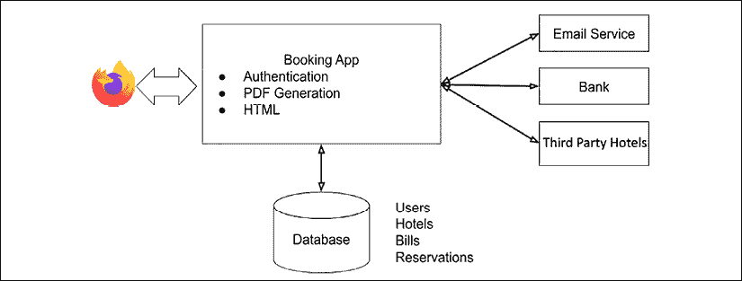
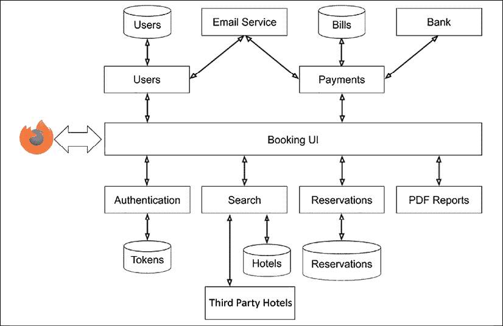

# 1

# 理解微服务

我们一直在努力改进我们创建软件的方式。计算机编程还不到 100 年，我们通过技术、设计和哲学的快速发展，来改进我们生产的工具和应用程序。

微服务通过提高服务的可读性和可伸缩性，彻底改变了软件产品，并使组织能够加快其发布周期，并更快速地响应用户的需求。每个人都希望尽可能快地将新产品和新功能推向客户。他们希望通过频繁迭代来变得*敏捷*，并希望不断地发货，发货，再发货。

当有数千名客户同时使用您的服务时，将实验性功能推送到生产环境并在必要时将其移除，而不是等待数月才能发布它以及许多其他功能，这被认为是良好的实践。

诸如 Netflix 这样的公司正在推广他们的持续交付技术，在生产环境中非常频繁地进行小改动，并在用户子集上进行测试。他们开发了诸如 **Spinnaker** ([`www.spinnaker.io/`](http://www.spinnaker.io/)) 这样的工具，尽可能自动化更新生产和将功能作为独立微服务部署到云中的步骤。

但如果你阅读 Hacker News 或 Reddit，可能会很难区分对你有用的信息和仅仅是符合流行语标准的新闻式信息。正如著名计算机科学家和著名最短路径路由算法的发现者*埃德加·迪杰斯特拉*所说：

> “写一篇承诺救赎的论文，让它成为一个结构化的东西，或者一个虚拟的东西，或者一个抽象的、分布式的、高阶的或应用性的东西，你几乎可以肯定你已经开启了一个新的教派。”
> 
> ——埃德加·W·迪杰斯特拉

本书将带您了解传统单体服务的创建，并提供如何识别作为微服务将更有效的组件的指导。我们将涵盖与其他服务集成、传递消息和调度任务的方法，以及如何在亚马逊网络服务中安全地部署我们的服务。

本章将帮助您了解微服务是什么，然后重点介绍您可以使用 Python 实现微服务的各种方法。它由以下部分组成：

+   面向服务架构的起源

+   构建应用程序的单体方法

+   构建应用程序的微服务方法

+   微服务的优势

+   微服务中的潜在陷阱

+   使用 Python 实现微服务

希望您在阅读完本章后，能够深入到本书的其余部分，并在对微服务及其不是什么有良好理解的情况下，使用 Python 构建微服务。

# 面向服务架构的起源

对于微服务，目前没有官方标准，因此查看该领域软件设计的历史是有帮助的。在讨论微服务时，**面向服务的架构**（**SOA**）通常被用作起点。SOA 是一种关于软件架构的思考方式，它鼓励可重用的软件组件，这些组件提供了定义良好的接口。这使得这些组件可以被重用，并应用于新的情况。

上述定义中的每个单元都是一个自包含的服务，它实现了一个商业方面的功能，并通过某种接口提供其功能。

虽然 SOA 明确表示服务应该是独立进程，但它并没有强制规定这些进程之间应该使用哪些协议进行交互，并且对于如何部署和组织应用程序相当模糊。

如果你阅读了首次于 2009 年左右在网络上发布的**SOA 宣言**（[`www.soa-manifesto.org`](http://www.soa-manifesto.org)），作者甚至没有提到服务是否通过网络进行交互，尽管对原则的理解大多涉及网络服务。

SOA 服务可以通过**进程间通信**（**IPC**）使用同一台机器上的套接字、通过共享内存、通过间接消息队列，甚至通过**远程过程调用**（**RPC**）进行通信。选项很多，SOA 是一套适用于各种情况的有用原则。

然而，人们通常会说微服务是 SOA 的一种专业化，因为它们允许我们专注于组织的需要、其安全性以及软件的扩展和分离。

如果我们要给出微服务的完整定义，最好的方式是在不同的软件架构的背景下理解它。我们将从一个单体开始，然后讨论微服务是如何不同的。

# 单体方法

在单体架构中，关于服务的所有内容都在一个地方——API、数据库以及所有相关工具都被视为一个代码库的一部分。让我们以一个非常简单的传统单体应用程序为例：一个酒店预订网站。

除了静态 HTML 内容外，该网站还有一个预订功能，允许其用户在世界上的任何城市预订酒店。用户可以搜索酒店，然后使用信用卡预订。

当用户在酒店网站上执行搜索时，应用程序会经过以下步骤：

1.  它在其酒店数据库上运行几个 SQL 查询。

1.  向合作伙伴的服务发送 HTTP 请求，以将更多酒店添加到列表中。

1.  结果被发送到嵌入网页中的 JavaScript，以渲染供观众查看的信息。

从那里，一旦用户找到了理想的酒店并选择了预订选项，应用程序会执行以下步骤：

1.  如果需要，会在数据库中创建客户，并需要进行身份验证。

1.  通过与银行的网络服务交互进行支付。

1.  应用出于法律原因将支付详情保存在数据库中

1.  使用 PDF 生成器生成收据

1.  使用电子邮件服务向用户发送总结电子邮件

1.  使用电子邮件服务将预订电子邮件转发给第三方酒店

1.  添加数据库条目以跟踪预订

这个过程是一个简化的模型，当然，但它描述了足够的内容，让我们从中学习。

应用与包含酒店信息、预订详情、计费、用户信息等的数据库进行交互。它还与外部服务交互，用于发送电子邮件、进行支付和从合作伙伴那里获取更多酒店。

在网络发展的早期，新的服务通常会使用**LAMP**（**Linux-Apache-MySQL-Perl/PHP/Python**）架构。这种方法中，每个进入的请求都会在数据库上生成一系列 SQL 查询，以及一些对外部服务的网络调用，然后服务器使用模板引擎生成 HTML 响应。

下面的图示说明了这种集中式架构：



图 1.1：一个示例单体服务架构

这个应用是一个典型的单体应用，它有很多好处。最大的好处是整个应用都在一个代码库中，当项目编码开始时，会使一切变得简单。构建良好的测试覆盖率很容易，你可以在代码库内部以干净和结构化的方式组织代码。将所有数据存储在单个数据库中也有助于简化应用的开发。你可以调整数据模型，以及代码如何查询它。

部署过程也很简单；我们可以构建一个包，安装它，并在某个地方运行它。为了扩展，我们可以运行多个预订应用的实例，并运行一些具有复制机制的数据库。

如果你的应用保持小型，这种模型工作得很好，并且对于单一团队来说很容易维护。但是项目通常会增长，并且变得比最初设想的大。整个应用在单个代码库中会带来一些棘手的问题。例如，如果你需要做出大规模的改动，比如更改你的银行服务或数据库层，这些改动会对整个应用产生风险。这些更改对项目有很大影响，在部署之前需要经过良好的测试，而这种测试通常无法彻底。这样的改变在项目生命周期中是会发生的。

小的改动也可能产生附带损害，因为系统的不同部分有不同的运行时间和稳定性要求。将计费和预订流程置于风险之中，因为创建 PDF 的功能导致服务器崩溃，这确实是个问题。

无控制的增长是另一个问题。应用程序必然会添加新功能，随着开发人员的加入和离开，代码可能会变得杂乱无章，测试可能会变慢，部署可能会变得脆弱。这种增长通常会导致难以维护的意大利面代码库，以及需要复杂迁移计划的复杂数据库。

使项目变得有趣的其他增长形式是容量管理。如果应用程序中的某个元素需要与其它元素非常不同的扩展，那么扩展应用程序就会变得非常困难；例如，如果酒店房间可用性开始被用来生成网站广告，以及服务于访问网站的访客。

大型软件项目通常需要几年时间才能成熟，然后它们会逐渐开始变成难以理解的混乱，难以维护。这并不是因为开发者做得不好。这是因为随着复杂性的增加，越来越少的人能够完全理解他们所做的每一个小更改的后果。

因此，他们试图与代码库的一部分独立工作，混乱只有在查看整个项目结构时才会变得明显。我们都有过这样的经历。

这并不有趣，从事此类项目的开发者梦想着从头开始使用最新的框架来构建应用程序。通过这样做，他们通常又会面临同样的问题——同样的故事再次上演。

总结来说，单体架构有一些好处：

+   以单体形式启动项目很容易，而且可能是最好的方法。

+   集中式数据库简化了数据的设计和组织。

+   部署一个应用程序很简单。

然而：

+   代码中的任何更改都可能影响无关的功能。当某个功能出现问题时，整个应用程序可能会崩溃。

+   扩展应用程序的解决方案有限：你可以部署多个实例，但如果应用程序中的某个特定功能消耗了所有资源，它会影响一切。

+   随着代码库的增长，很难保持其整洁和可控。

当然，有一些方法可以避免这里描述的一些问题。

显而易见的解决方案是将应用程序拆分成独立的组件，即使最终代码仍然会在单个进程中运行。开发者通过使用外部库和框架来构建他们的应用程序来实现这一点。这些工具可以是内部开发的，也可以来自**开源软件**（**OSS**）社区。

如果你使用像**Quart**或**Flask**这样的框架在 Python 中构建 Web 应用程序，你能够专注于业务逻辑，将一些代码外部化为框架扩展和小的 Python 包变得非常有吸引力。将代码拆分成小包通常是控制应用程序增长的好主意。

> “小即是美。”
> 
> —UNIX 哲学

例如，酒店预订应用程序中描述的 PDF 生成器可以是一个独立的 Python 包，该包使用**ReportLab**和一些模板来完成工作。这个包很可能在其他应用程序中重用，甚至可能发布到**Python 包索引**（**PyPI**）供社区使用。

但你仍然在构建一个单一的应用程序，一些问题仍然存在，比如无法不同比例地扩展部分，或者由有缺陷的依赖项引入的任何间接问题。

你甚至会面临新的挑战，因为你现在正在使用依赖项。你将面临的一个问题是**依赖地狱**。如果你的应用程序的两个部分使用相同的库，你可能会陷入这样的情况：一个部分的应用程序需要新版本的功能，但另一个组件不能使用更新的版本，因为其他东西已经改变，你现在处于**依赖地狱**。有很大可能性，你最终会在大型项目中找到一些丑陋的解决方案来解决这个问题，比如保留一个依赖项的副本，你现在需要单独维护以保持修复更新。

当然，本节中描述的所有问题在项目开始的第一天都不会出现，而是在一段时间内逐渐积累。

让我们现在看看，如果我们使用微服务来构建相同的应用程序，它将看起来如何。

# 微服务方法

如果我们使用微服务构建相同的应用程序，我们会将代码组织成几个独立的组件，这些组件在单独的进程中运行。我们已经讨论了 PDF 报告生成器，我们可以检查应用程序的其余部分，看看我们可以在哪里将其拆分为不同的微服务，如下面的图所示：



图 1.2：一个示例微服务架构

不要害怕图中显示的组件数量。单体应用程序的内部交互只是通过单独的部分变得可见。我们已经将一些复杂性转移，最终得到了这些七个独立的组件：

1.  **预订 UI**：一个前端服务，生成网页用户界面，并与所有其他微服务进行交互。

1.  **PDF 报告**：一个非常简单的服务，可以根据模板和一些数据创建收据或其他文档。也称为 PDF 报告服务。

1.  **搜索**：一个服务，当给定一个位置时，可以查询以获取酒店列表。此服务有自己的数据库。

1.  **支付**：一个与第三方银行服务交互并管理计费数据库的服务。它还在支付成功时发送电子邮件。

1.  **预订**：管理预订和预订更改。

1.  **用户**：存储用户信息，并通过电子邮件与用户交互。

1.  **认证**：一个基于 OAuth 2 的服务，返回认证令牌，每个微服务都可以在调用其他服务时使用这些令牌进行认证。

这些微服务，以及一些外部服务，如电子邮件服务，将提供类似于单体应用的功能集。在这个设计中，每个组件使用 HTTP 协议进行通信，功能通过 RESTful Web 服务提供。

没有集中式数据库，因为每个微服务内部处理自己的数据结构，进出数据使用一种语言无关的格式，如 JSON。只要它可以被任何语言产生和消费，并且通过 HTTP 请求和响应传输，它也可以使用 XML 或 YAML。

预订 UI 服务在这方面有点特别，因为它生成**用户界面**（**UI**）。根据用于构建 UI 的前端框架，预订 UI 输出可能是 HTML 和 JSON 的混合体，或者如果界面使用基于静态 JavaScript 的客户端工具直接在浏览器中生成界面，则可能是纯 JSON。

但除了这个特定的 UI 案例之外，一个使用微服务设计的 Web 应用程序是由几个微服务组成的，这些微服务可能通过 HTTP 相互交互，以提供整个系统。

在这个背景下，微服务是专注于非常特定任务的逻辑单元。以下是一个完整的定义尝试：

微服务是一个轻量级的应用程序，提供一系列具有良好定义契约的功能。它是一个具有单一责任、可以独立开发和部署的组件。

这个定义没有提到 HTTP 或 JSON，因为你可以考虑，例如，一个小型的基于 UDP 的服务，它作为微服务交换二进制数据，或者一个使用 gRPC 进行通信的服务。（gRPC 是一个递归缩写，代表 gRPC 远程过程调用，一个开源的远程过程调用系统。）

但在我们的案例中，以及在整个书中，我们所有的微服务都只是简单的 Web 应用程序，它们使用 HTTP 协议，并且在不是 UI 的情况下消费和产生 JSON。

# 微服务的好处

虽然微服务架构看起来比其单体对应物更复杂，但它提供了多个优点。它提供了以下优点：

+   关注点的分离

+   更小的项目要处理

+   更多的扩展和部署选项

我们将在接下来的章节中更详细地讨论它们。

## 关注点的分离

首先，每个微服务都可以由一个单独的团队独立开发。例如，构建一个预订服务可以是一个完整的项目。负责的团队可以使用他们选择的编程语言和数据库进行编码，只要它有一个良好的文档化的 HTTP API。

这也意味着应用程序的演变比单体应用更容易控制。例如，如果支付系统更改其与银行的底层交互，影响将局限于该服务内部，其余的应用程序保持稳定，可能不受影响。

这被称为松耦合，并且当我们应用类似*单一职责*原则的哲学在服务级别时，它提高了整体项目的速度。相比之下，紧密耦合的支付服务需要了解系统如何表示其数据或执行其任务的内部知识。

软件工程领域许多备受尊敬的书籍的作者罗伯特·马丁（Robert Martin）定义了单一职责原则，以解释一个类应该只有一个改变的理由；换句话说，每个类应该提供一个单一、定义良好的功能。应用于微服务，这意味着我们想要确保每个微服务专注于单一角色。

## 较小的项目

第二个好处是简化项目的复杂性。当您向应用程序添加一个功能，如 PDF 报告，即使您做得干净利落，也会使代码库变大、更复杂，有时甚至变慢。在单独的应用程序中构建该功能可以避免这个问题，并使其更容易使用您想要的任何工具来编写。您可以经常重构它，缩短发布周期，并保持对事物的控制。应用程序的增长仍然在您的控制之下。

处理较小的项目在改进应用程序时也能降低风险：如果一个团队想要尝试最新的编程语言或框架，他们可以快速迭代实现相同微服务 API 的原型，尝试使用它，并决定是否继续使用。

一个现实生活中的例子是 Firefox Sync 存储微服务。曾经有实验尝试从将数据存储在 MySQL 中，切换到将用户数据存储在独立的 SQLite 数据库中的实现。通过将存储功能隔离在一个具有良好定义的 HTTP API 的微服务中，降低了实验原型可能带来的风险。这最小化了与其他组件的意外交互，并允许一小部分用户尝试新版本的服务。

减少每个组件的大小也使得开发者更容易思考，尤其是对于新加入团队或对处理服务中断感到压力的开发者。开发者不必处理整个系统，可以专注于较小的区域，不必担心应用程序的其他功能。

## 扩展和部署

最后，将应用程序拆分为组件，根据您的限制更容易进行扩展。假设您的业务增长，每天都有更多的客户预订酒店，PDF 生成开始使用更多资源并变慢。为了解决这个问题，您可以在一些具有更大 CPU 或更多内存的服务器上部署那个特定的微服务。

另一个典型的例子是高内存使用微服务，例如与内存数据库（如**Redis**或**Memcached**）交互的微服务。因此，您可以通过使用具有较少 CPU 和更多 RAM 的服务器来调整您的部署。

因此，我们可以总结微服务的以下好处：

+   一个团队可以独立开发每个微服务，并使用任何有意义的科技栈。他们可以定义一个自定义发布周期。他们需要定义的只是一个语言无关的 HTTP API。

+   开发者将应用程序的复杂性拆分为逻辑组件。每个微服务专注于做好一件事。

+   由于微服务是独立的应用程序，对部署有更精细的控制，这使得扩展变得更容易。

微服务架构擅长解决应用程序开始增长后可能出现的许多问题。然而，我们需要意识到随之而来的某些新问题。

# 微服务的陷阱

如前所述，使用微服务构建应用程序有许多好处，但绝不是万能的。

当编码微服务时，你需要意识到以下主要问题：

+   不合理的拆分

+   更多的网络交互

+   数据存储和共享

+   兼容性问题

+   测试

这些问题将在以下章节中详细讨论。

## 不合理的拆分

微服务架构的第一个问题是其设计方式。团队不可能在一次尝试中就提出完美的微服务架构。一些微服务，如 PDF 生成器，是一个明显的用例。但是，一旦你处理业务逻辑，就有很大可能性在掌握如何将事物拆分为正确的微服务集合之前，你的代码就会移动。

设计需要通过一些尝试和失败周期来成熟。添加和删除微服务可能比重构单体应用程序更痛苦。你可以通过避免将应用程序拆分为微服务来减轻这个问题，如果拆分不明显的话。

如果有任何疑问，认为拆分是有意义的，那么将代码保留在同一个应用程序中是安全的赌注。总是更容易在以后将一些代码拆分到一个新的微服务中，而不是因为决策错误而将两个微服务合并回同一个代码库。

例如，如果你总是必须一起部署两个微服务，或者如果微服务中的一个更改影响了另一个微服务的数据模型，那么很可能你没有正确地拆分应用程序，这两个服务应该被重新组合。

## 更多的网络交互

第二个问题是构建相同应用时添加的网络交互数量。在单体版本中，即使代码变得混乱，所有操作都在同一个进程中完成，你可以在不调用太多后端服务构建实际响应的情况下发送回结果。

这需要特别注意如何调用每个后端服务，并引发许多问题，如下所示：

+   当预订用户界面因为网络分割或服务延迟无法访问 PDF 报告服务时会发生什么？

+   预订用户界面是同步调用其他服务还是异步调用？

+   这将如何影响响应时间？

我们需要有一个稳固的策略来回答所有这些问题，我们将在第六章*与其他服务交互*中解决这些问题。

## 数据存储和共享

另一个问题在于数据存储和共享。一个有效的微服务需要独立于其他微服务，理想情况下，不应共享数据库。这对我们的酒店预订应用意味着什么？

再次，这引发了许多问题，例如以下这些：

+   我们是否在所有数据库中使用相同的用户 ID，或者每个服务都有独立的 ID，并将其作为隐藏的实现细节？

+   一旦用户被添加到系统中，我们是否通过数据泵送等策略在其他服务的数据库中复制她的部分信息，或者这是否过于过度？

+   我们如何处理数据删除？

这些问题是很难回答的，而且有很多人不同的方式来解决这些问题，正如我们将在本书中学习的那样。

在尽可能避免数据重复的同时，保持微服务的隔离是设计基于微服务应用程序的最大挑战之一。

## 兼容性问题

另一个问题发生在功能变更影响多个微服务时。如果变更以向后不兼容的方式影响服务之间的数据传输，你将面临一些麻烦。

你能否部署你的新服务，并且它是否与旧版本的其他服务兼容？或者你是否需要一次性更改和部署多个服务？这意味着你是否偶然发现了一些应该合并回一起的服务？

良好的版本控制和 API 设计卫生有助于减轻这些问题，正如我们在本书的第二部分将了解到的那样，当我们构建我们的应用程序时。

## 测试

最后，当你想要进行一些端到端测试并部署整个应用程序时，你必须处理许多组件。你需要有一个强大且敏捷的部署流程才能高效。你在开发时需要能够玩转整个应用程序。你不能只通过一块拼图来完全测试事物，尽管拥有干净和定义良好的接口确实有帮助。

云编排工具的最新发展，如 Kubernetes、Terraform 和 CloudFormation，在部署由多个组件组成的应用程序时使生活变得更加容易。它们可以用来创建测试和预发布环境，以及面向客户的部署。这些工具的流行有助于微服务的成功和采用。

微服务风格的架构推动了部署工具的创新，而部署工具降低了微服务风格架构的审批门槛。

使用微服务的陷阱可以总结如下：

+   过早地将应用程序拆分为微服务可能导致架构问题。

+   微服务之间的网络交互增加了潜在的故障点和额外的开销。

+   测试和部署微服务可能很复杂。

+   最大的挑战——微服务之间的数据共享很困难。

你现在不必过于担心本节中描述的所有陷阱。它们可能看起来令人难以承受，传统的单体应用可能看起来更安全，但从长远来看，将你的项目拆分为微服务将使作为开发者或作为**运维人员**（**ops**）的许多任务更容易。这也可以使运行服务更便宜。要向单体应用添加更多容量，你需要更大的服务器，或者能够添加更多大型服务器的能力。如果架构是分布式的并且基于微服务，那么可以以更小的增量添加额外资源，更接近实际所需的数量。而且，正如我们将在*第九章：部署、运行和扩展*中发现的，可以更容易地设置云服务提供商以根据需求自动扩展。

# 使用 Python 实现微服务

Python 是一种非常灵活的语言。正如你可能已经知道的，Python 被用来构建许多不同种类的应用程序——从在服务器上执行任务的简单系统脚本到为数百万人运行服务的庞大面向对象应用程序。Python 也被用于机器学习和数据分析工具。

Python 在 TIOBE 指数中排名前五（[`www.tiobe.com/tiobe-index/`](http://www.tiobe.com/tiobe-index/）），甚至达到过第二的位置。在 Web 开发领域，它可能更为重要，因为像 C 这样的语言很少被用作构建 Web 应用程序的主语言。

本书假设你已经熟悉 Python 编程语言。如果你不是经验丰富的 Python 开发者，你可以阅读《Expert Python Programming》，《第三版》，在那里你将学习 Python 的高级编程技能。

然而，一些开发者批评 Python 速度慢，不适合构建高效的 Web 服务。Python 确实慢，这是不可否认的，尽管它对于大多数情况来说已经足够快。但它仍然是构建微服务的首选语言，许多大型公司都乐意使用它。

本节将为你提供一些背景信息，介绍你可以使用 Python 编写微服务的不同方式，提供一些关于异步编程与同步编程的见解，并以 Python 性能的细节作为总结。

## 网络服务的工作原理

如果我们想象一个简单的程序，该程序在网络上回答查询，其描述是直接的。一个新的连接被建立，并协商协议。一个请求被提出，并进行一些处理：可能查询了一个数据库。然后构建响应并发送，连接关闭。这通常是我们要思考应用程序逻辑的方式，因为它使开发者和任何其他负责程序运行的人都能保持事情简单。

然而，网络是一个庞大而复杂的地方。互联网的各个部分都会试图对它们发现的易受攻击的 Web 服务进行恶意操作。其他人只是表现不佳，因为他们没有设置好。即使事情运行良好，也有不同的 HTTP 协议版本、加密、负载均衡、访问控制和一系列其他需要考虑的事情。

而不是重新发明所有这些技术，有一些**接口**和**框架**让我们可以使用其他人构建的工具，并将更多时间花在我们自己的应用程序上。它们让我们可以使用 Web 服务器，如**Apache**和**nginx**，并让它们处理网络上的困难部分，如证书管理、负载均衡和处理多个网站身份。然后，我们的应用程序有一个更小、更易于管理的配置来控制其行为。

## WSGI 标准

对于从 Python 开始学习的多数网络开发者来说，最令人印象深刻的是构建一个 Web 应用程序是多么容易。

受较旧的**通用网关接口**（**CGI**）的启发，Python 网络社区创建了一个名为**Web 服务器网关接口**（**WSGI**）的标准。它简化了编写 Python 应用程序以服务 HTTP 请求的方式。当您的代码使用此标准时，您的项目可以通过标准 Web 服务器（如 Apache 或 nginx）以及使用 WSGI 扩展（如`uwsgi`或`mod_wsgi`）来执行。

您的应用程序只需处理传入的请求并发送 JSON 响应，Python 在它的标准库中包含了所有这些优点。

您可以使用少于 10 行的纯 Python 模块创建一个完全功能化的微服务，该服务返回服务器的本地时间：

```py
import json
import time 
def application(environ, start_response): 
    headers = [('Content-type', 'application/json')] 
    start_response('200 OK', headers) 
    return [bytes(json.dumps({'time': time.time()}), 'utf8')] 
```

自从其推出以来，WSGI 协议已成为一个基本标准，Python 网络社区已经广泛采用它。开发者编写了中间件，这些是可以在 WSGI 应用函数之前或之后挂载的函数，以在环境中执行某些操作。

一些网络框架，例如**Bottle**（[`bottlepy.org`](http://bottlepy.org)），是专门围绕该标准创建的，并且很快，每个框架都可以以某种方式通过 WSGI 使用。

然而，WSGI 最大的问题是其同步特性。最近，**异步服务器网关接口**（**ASGI**）作为 WSGI 的继任者出现，允许框架以前所未有的无缝行为异步运行。那么什么是同步和异步应用程序呢？我们现在就来探讨这个问题。

## 工作者、线程和同步性

回想一下我们处理请求的简单应用程序，我们的程序模型是同步的。这意味着它接受一项工作，完成这项工作，并返回结果，但在它完成所有这些工作的同时，程序不能做其他任何事情。当它正在处理某项工作时，任何其他到达的请求都必须等待。

有几种方法可以解决这个问题，从使用工作池到早期上下文切换环境，再到最近的全异步 Python。

### 工作池方法

接受一个新的请求通常非常快，而大部分时间都花在执行请求的工作上。读取一个请求告诉你“给我巴黎所有客户的列表”所花费的时间要比整理列表并发送它的时间少得多。

当应用程序收到大量请求时，一个有效的策略是确保所有重负载都由其他进程或线程来完成。启动一个新的线程可能很慢，启动一个新的进程甚至更慢，因此一个常见的做法是提前启动这些工作者，并保持它们处于就绪状态，以便在请求到达时分配新的工作。

这是一个古老的技术，非常有效，但它确实有限制。就每个工作者而言，它接收工作，直到完成工作之前不能做其他任何事情。这意味着如果你有八个工作进程，你只能处理八个并发请求。如果你的应用程序运行不足，它可以创建更多的工作者，但总会有瓶颈。

应用程序可以创建的进程和线程的数量也有实际限制，而且在这些进程和线程之间切换需要大量时间，而响应式应用程序并不总是能负担得起。

### 异步处理

一个重要的事情要认识到的是，计算机之间的交互是一个缓慢的过程。并不是从人类的角度来看，因为一条来自家庭成员的新消息可以在我们眼中一闪而过，而是从计算机自身的角度来看。

有几个图表可以说明“程序员应该知道的延迟数字”，最初由*Jeff Dean*和*Peter Norvig*编写。可以在[`colin-scott.github.io/personal_website/research/interactive_latency.html`](https://colin-scott.github.io/personal_website/research/interactive_latency.html)找到它的一个版本。

这些表格中有许多数字，但对我们来说，重要的是关于网络流量的数字。我们可以了解到从计算机内存中读取大约 1 MB 需要约 3,000 ns，但向同一建筑内的计算机发送数据包并获取响应可能需要约 500,000 ns。与另一个大陆上的计算机通信可能需要数百毫秒。

用人类的话来说：你可能需要几秒钟才能记住你需要问某人一个问题。发送问题并听到他们已经阅读了它，无论你是否得到了你需要的答案，可能需要两天。

你肯定不希望在那里无所事事地等待答案，但如果是同步的，进程通常会这样做。异步程序知道它被告知执行的一些任务可能需要很长时间，因此它可以在等待时继续进行其他工作，而不必一定使用其他进程或线程。

### Twisted, Tornado, Greenlets, and Gevent

很长一段时间里，非 WSGI 框架如**Twisted**和**Tornado**在 Python 中使用时是处理并发的流行选择，允许开发者为许多并发请求指定**回调**。在顺序程序中，你可能会调用一个函数并等待它返回一个值给你。回调是一种技术，其中调用程序的部分不等待，而是告诉函数如何处理它生成的结果。通常这将是另一个它应该调用的函数。

另一种流行的方法涉及 Greenlets 和 Gevent。**Greenlet**项目（[`github.com/python-greenlet/greenlet`](https://github.com/python-greenlet/greenlet)）是一个基于**Stackless**项目的包，这是一个特定的 CPython 实现，并提供**greenlets**。

Greenlets 是成本很低的**伪线程**，与真实线程不同，可以用来调用 Python 函数。在这些函数内部，你可以**切换**，并将控制权交回给另一个函数。切换是通过事件循环完成的，允许你使用类似线程的接口范式编写异步应用程序。

然而，从一个 greenlet 切换到另一个 greenlet 必须显式进行，并且由此产生的代码可能会很快变得混乱且难以理解。这就是 Gevent 变得非常有用的地方。**Gevent**项目（[`www.gevent.org/`](http://www.gevent.org/））建立在 Greenlet 之上，提供了一种隐式且自动地在 greenlet 之间切换的方法，以及其他许多功能。

基于所有这些选项的经验，Python 从 3.5 版本开始将`asyncio`作为语言的核心功能，这就是我们将在代码中使用的内容。

### 异步 Python

当 *Guido* *van Rossum* 开始在 Python 3 中添加异步功能时，社区的一部分人推动了一个类似于 Gevent 的解决方案，因为在同步、顺序的方式编写应用程序比在 Tornado 或 Twisted 中添加显式回调要合理得多。

但吉多选择了显式技术，并在一个名为 **Tulip** 的项目中进行了实验，该项目灵感来源于 Twisted。最终，`asyncio` 模块就是从这个辅助项目中诞生的，并被添加到 Python 中。

事后看来，在 Python 中实现显式的事件循环机制，而不是走 Gevent 的路，是非常有意义的。Python 核心开发者编写的 asyncio 方式，以及他们如何使用 `async` 和 `await` 关键字扩展语言以实现协程，使得使用纯 Python 3.5+ 代码构建的异步应用程序看起来非常优雅，接近同步编程。

Python 3 在 asyncio 包中引入了一套完整的特性和辅助工具，用于构建异步应用程序；请参阅 [https://docs.python.org/3/library/asyncio.html](https://docs.python.org/3/library/asyncio.html)。

**aiohttp** ([`aiohttp.readthedocs.io`](http://aiohttp.readthedocs.io)) 是最成熟的 asyncio 包之一，使用它构建早期的 "time" microservice 只需要这几行代码：

```py
from aiohttp import web  
import time 
async def handle(request): 
    return web.json_response({'time': time.time()}) 
if __name__ == '__main__': 
    app = web.Application() 
    app.router.add_get('/', handle) 
    web.run_app(app) 
```

在这个小型示例中，我们非常接近于如何实现一个同步应用程序。我们唯一使用的异步代码提示是 `async` 关键字，它将 `handle` 函数标记为协程。

这个概念将是未来在异步 Python 应用程序每个级别上都要使用的内容。以下是一个使用 `aiopg` 的例子，这是一个来自项目文档的 asyncio PostgreSQL 库：

```py
import asyncio 
import aiopg 
# Start an example postgres instance with:
# docker run -p5432:5432 --name some-postgres \
# -e POSTGRES_PASSWORD=mysecretpassword -d postgres
dsn = "dbname=postgres user=postgres password=mysecretpassword host=127.0.0.1"
async def go():
    pool = await aiopg.create_pool(dsn)
    async with pool.acquire() as conn:
        async with conn.cursor() as cur:
            await cur.execute("SELECT 1")
            ret = []
            async for row in cur:
                ret.append(row)
            assert ret == [(1,)]
    await pool.clear()
loop = asyncio.get_event_loop()
loop.run_until_complete(go()) 
```

几个带有 `async` 和 `await` 前缀的函数，执行 SQL 查询并返回结果的方式看起来非常像同步函数。我们将在后面的章节中详细解释这段代码。

如果你的代码需要使用非异步的库，要从异步代码中使用它，那么你需要做一些额外且具有挑战性的工作，以便让不同的库能够良好地协同工作。

使用 Python 构建 microservices 的优秀同步框架有很多，比如 **Bottle**、**Pyramid** 与 **Cornice** 或 **Flask**。我们将使用一个与 Flask 非常相似，但也是异步的框架：**Quart**。

请记住，无论你使用哪种 Python Web 框架，你都应能够转换这本书中的所有示例。这是因为构建 microservices 时涉及的编码大部分非常接近纯 Python，而框架主要是为了路由请求并提供一些辅助工具。

## 语言性能

在前面的章节中，我们介绍了编写 microservices 的两种不同方式：异步与同步，无论你使用哪种技术，Python 的速度都会直接影响你的 microservice 的性能。

当然，每个人都知道 Python 的执行速度比 Java 或 Go 慢，但执行速度并不总是首要考虑的因素。微服务通常是一层薄薄的代码，大部分时间都在等待来自其他服务的网络响应。它的核心速度通常不如你的 SQL 查询从 Postgres 服务器返回的速度重要，因为后者将代表构建响应的大部分时间。

还重要的是要记住，你花费在软件开发上的时间可能同样重要。如果你的服务正在快速变化，或者有新的开发者加入并需要理解代码，那么拥有易于理解、开发和部署的代码就很重要。

但希望应用程序尽可能快是合理的。

在 Python 社区中关于加快语言速度的一个有争议的话题是全局解释器锁（**GIL**）如何影响性能，因为多线程应用程序无法使用多个进程。

GIL 存在有其合理的原因。它保护了 CPython 解释器中非线程安全的部分，并在像 Ruby 这样的其他语言中存在。迄今为止，所有尝试移除它的尝试都未能产生更快的 CPython 实现。

对于微服务来说，除了防止在同一个进程中使用多个核心之外，由于互斥锁引入的系统调用开销，GIL 还会在高负载下略微降低性能。

然而，围绕 GIL 的所有审查都是有益的：过去已经做了工作来减少解释器中的 GIL 竞争，在某些领域，Python 的性能有了很大的提升。Python 3.8 中引入子解释器和多个锁的更改也帮助了一些领域。

请记住，即使核心团队消除了所有 GIL 性能问题，Python 仍然是一种解释和垃圾回收语言，并因这些特性而遭受性能损失。

如果你感兴趣，Python 提供了 `dis` 模块来查看解释器如何分解一个函数。在下面的例子中，解释器将分解一个简单的函数，该函数从序列中产生递增的值，至少需要 22 步：

```py
>>> def myfunc(data): 
...     for value in data: 
...         yield value + 1 
... 
>>> import dis 
>>> dis.dis(myfunc) 
  2           0 LOAD_FAST             0 (data)
              2 GET_ITER
        >>    4 FOR_ITER             14 (to 20)
              6 STORE_FAST            1 (value)
  3           8 LOAD_FAST             1 (value)
             10 LOAD_CONST            1 (1)
             12 BINARY_ADD
             14 YIELD_VALUE
             16 POP_TOP
             18 JUMP_ABSOLUTE         4
        >>   20 LOAD_CONST            0 (None)
             22 RETURN_VALUE 
```

用静态编译语言编写的类似功能将大大减少产生相同结果所需的操作数量。尽管如此，也有方法可以加快 Python 的执行速度。

一种方法是通过在 C、Rust 或其他编译语言中构建扩展，或者使用像 **Cython** ([`cython.org/`](http://cython.org/)) 这样的静态扩展语言来编写代码的一部分，但这会使你的代码更加复杂。

另一种解决方案是使用 **PyPy** 解释器 ([`pypy.org/`](http://pypy.org/)) 运行你的应用程序。这可以通过简单地替换 Python 解释器来带来明显的性能提升。

PyPy 实现了一个**即时编译器**（**JIT**）。这个编译器在运行时直接用机器代码替换 Python 代码的一部分，这些机器代码可以直接由 CPU 使用。JIT 编译器的整个技巧是在执行之前实时检测何时以及如何进行替换。

即使 PyPy 始终比 CPython 落后几个版本，但它已经达到了可以在生产中使用，并且其性能可以非常惊人的程度。在我们的 Mozilla 项目中，有一个需要快速执行的项目，PyPy 版本几乎与 Go 版本一样快，我们决定在那里使用 Python。

Pypy Speed Center 网站是一个很好的地方，可以查看 PyPy 与 CPython（[`speed.pypy.org/`](http://speed.pypy.org/)）的比较。

然而，如果你的程序使用 C 扩展或具有任何其他编译依赖项，你将需要为 PyPy 重新编译它们，并且必须权衡额外的工作与速度改进，尤其是如果你依赖于其他项目或其他开发人员维护你使用的扩展。

但是，如果你使用标准库集构建你的微服务，那么它很可能与 PyPy 解释器无缝工作，所以值得一试。在任何情况下，对于大多数项目来说，Python 及其生态系统的优势在很大程度上超过了本节中描述的性能问题，因为微服务中的开销很少是问题。如果性能是问题，微服务方法允许你重写和扩展性能关键组件，而不会影响系统的其他部分。

# 摘要

在本章中，我们比较了构建 Web 应用的单体和微服务方法，很明显，你不必在第一天就选择一个模型并坚持下去，这不是一个二选一的选择。

你应该将微服务视为一个从单体应用开始的生命周期中的应用程序的改进。随着项目的成熟，服务逻辑的一部分应该迁移到微服务中。正如我们在本章中学到的，这是一个有用的方法，但应该谨慎进行，以避免陷入一些常见的陷阱。

另一个重要的教训是，Python 被认为是最适合编写 Web 应用和微服务的语言之一。因此，它也是其他领域的选择语言，并且因为它提供了许多成熟的框架和包来完成工作。

Python 可能是一种慢速语言，在非常具体的情况下可能会成为问题。了解是什么让它变慢，以及避免这个问题的不同解决方案，通常足以解决任何麻烦。

我们快速地查看了几种框架，包括同步和异步的，在本书的其余部分，我们将使用 Quart。下一章将介绍这个**出色的框架**。
