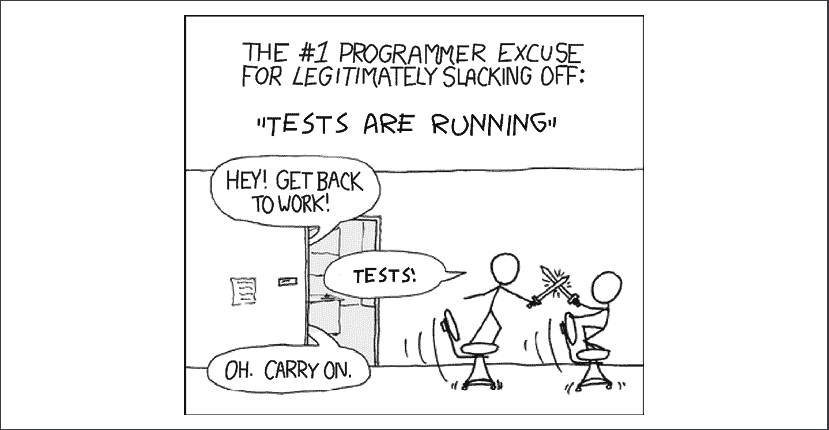
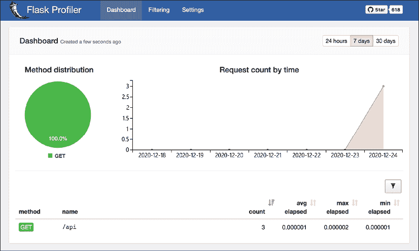
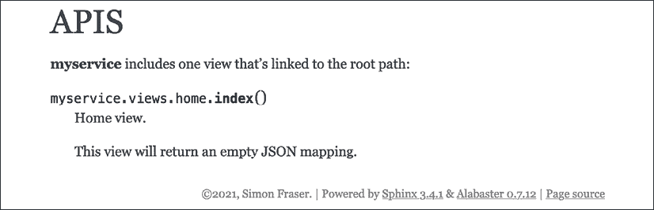
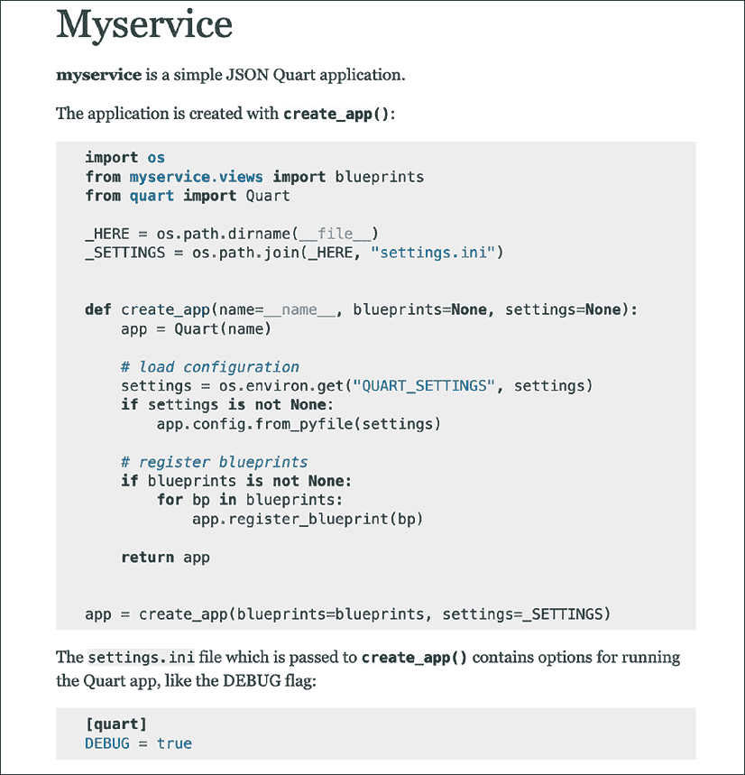
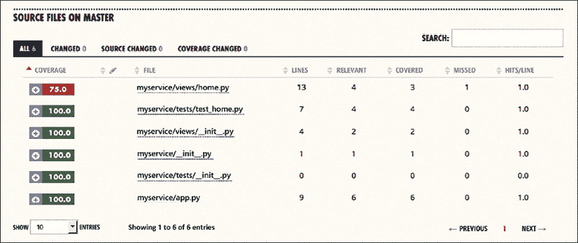

# 编码、测试和文档：良性循环

我们编写软件是因为我们希望它能做些有用的事情。但我们如何知道代码确实做了我们想要它做的事情呢？显而易见的答案是测试它。有时我们会运行刚刚编写的代码，看看它做了什么，以确定它是否在正确地执行。然而，代码通常很多，我们希望确保很多功能都在正常工作——并且在我们添加新功能时继续工作。

幸运的是，大多数语言都提供了一种自动化测试代码的方法，Python 也不例外。当我们与编写的代码一起创建测试时，会增加发现错误的概率。代码中的错误会耗费时间，也可能给公司造成损失。错误也不可能完全消除——我们能做的最好的事情就是采取合理的步骤来防止尽可能多的错误。

编写测试有助于更清晰地了解软件的预期功能。例如，一个旨在从列表中返回五个最高数字的函数：

```py
def filter(some_numbers):
    some_numbers.sort()
    return some_numbers[-5:] 
```

这是一个非常简单的函数，所以它可能确实做了我们想要它做的事情。或者呢？`.sort()`方法在原地工作而不是返回一个新值，所以我们改变了作为参数传递的变量的顺序；这可能在程序的其它区域产生意外的后果。该函数也没有检查它是否返回了数字，所以如果列表中有其他对象，应该怎么办？如果返回五个数字的数量不足，这是否可以接受，或者函数应该引发错误？

通过编写测试，我们不仅对函数想要做什么有一个清晰的认识，而且对它在不同情况下应该如何表现也有了解：我们继续朝着目标努力，但不是思考“如何赢”，而是思考“如何避免失败”。

**测试驱动开发**（**TDD**）是一种方法，你会在创建代码的同时编写测试，并使用这些测试来指导代码应该做什么——以及证明它按预期工作。它并不总是能提高项目的质量，但它会在错误造成损害之前捕捉到很多错误，帮助使团队更加敏捷。需要修复错误或重构应用程序一部分的开发者可以这样做，而不用担心他们破坏了什么，并且更容易向团队展示这项工作是合适的。

**行为驱动开发**（**BDD**）是另一种可以与 TDD 良好结合的方法。使用这种方法，测试从更高层次的角度描述软件的期望行为，并且通常使用更符合人类语言的表达方式。开发者可以编写代码来描述当测试使用诸如“用户搜索”和“显示结果”之类的短语时会发生什么，这样可以让编写测试的人专注于应该发生的事情；例如：

```py
Scenario: Basic DuckDuckGo Search
    When the user searches for "panda"
    Then results are shown for "panda" 
```

一些 BDD 测试的好例子可以在以下链接找到：[`github.com/AndyLPK247/behavior-driven-python`](https://github.com/AndyLPK247/behavior-driven-python)

编写测试最初可能会很耗时，但从长远来看，这通常是确保项目在规模和范围增长时保持稳定性的最佳方法。当然，总是有可能编写出糟糕的测试，最终得到不良的结果，或者创建一个难以维护且运行时间过长的测试套件。世界上最好的工具和流程也无法阻止一个粗心的开发者生产出糟糕的软件。



图 3.1：即使提供的是最好的工具，也无法阻止自满的开发者生产出糟糕的软件……归功于：[`xkcd.com/303/`](https://xkcd.com/303/)

一套好的测试应该证明软件确实做了我们想要它做的事情，并且它应该以可预测和可修复的方式失败。这意味着如果你给它无效的数据，或者它依赖的某个部分已经损坏，代码的行为是可预测的。

编写测试也是了解代码的一种好方法。你设计的 API 是否合理？事物是否搭配得当？当团队人数增加或重组时，测试是了解代码状态的良好信息来源，详细说明了代码的意图。软件满足的具体需求也可能会随时间而变化，这意味着可能需要进行重大的重构——不仅仅是重写，还包括改变架构。

文档是项目的一个关键部分，尽管它往往是第一个落后的领域。过了一段时间，除非有专人负责，否则很难看到项目的文档与代码状态完全同步。对于开发者来说，发现文档中的代码示例在重构后已经损坏，可能会非常沮丧。但有一些方法可以减轻这些问题；例如，文档中的代码摘录可以是测试套件的一部分，以确保它们可以正常工作。

在任何情况下，无论你投入多少精力在测试和文档上，有一条黄金法则：测试、编写文档和编码你的项目应该是持续进行的。换句话说，更新测试和文档是更新代码的过程的一部分。我们将看到，我们可以使这个过程更容易。

在提供了一些关于如何在 Python 中测试代码的一般性建议之后，本章重点介绍了在构建使用 Quart 的微服务时可以使用哪些测试和文档工具，以及如何与一些流行的在线服务设置持续集成。

本章分为五个部分：

+   不同的测试类型

+   使用 pytest 和 tox

+   开发者文档

+   版本控制

+   持续集成

# 不同的测试类型

测试有很多种，有时很难知道正在讨论的是什么。例如，当人们提到功能测试时，他们可能根据项目的性质而指代不同的测试。在微服务领域，我们可以将测试分为以下五个不同的目标：

+   **单元测试**：这些确保类或函数在隔离状态下按预期工作。

+   **功能测试**：验证微服务是否从消费者的角度来看做了它所说的，并且即使在接收到不良请求时也能正确行为。

+   **集成测试**：验证微服务如何与其所有网络依赖项集成。

+   **负载测试**：衡量微服务的性能。

+   **端到端测试**：验证整个系统是否正常工作——从初始请求到最终操作——通过其所有组件。

在接下来的几节中，我们将更深入地探讨细节。

## 单元测试

单元测试是添加到项目中 simplest 和最 self-contained 的测试。被测试的“单元”是代码的一个小组件；例如，一个单元测试可能检查一个函数，几个单元测试可能对该函数运行一系列测试，而整个测试套件可能对该函数所在的模块运行一系列测试。

Python 的标准库包含了编写单元测试所需的一切。在大多数项目中，都有可以独立测试的函数和类，基于 Quart 的项目也不例外。

在 Python 中进行隔离测试通常意味着您使用特定的参数实例化一个类或调用一个函数，并验证您是否得到预期的结果。如果您有一个函数接受一个大型数据结构并在其中搜索特定值，那么这可以很容易地单独测试，因为它已经得到了它所需的一切。然而，当类或函数调用不是由 Python 或其标准库构建的其他代码时，它就不再是隔离的了。

在某些情况下，模拟这些调用以实现隔离将是有用的。模拟意味着用假版本替换一段代码，该版本将返回测试所需的值，但模拟实际代码的行为。一个例子可能是一个查询数据库并在返回之前格式化数据的函数。在我们的单元测试套件中，我们可能不想运行真实的数据库，但我们可以模拟数据库查询，使其返回可预测的值，并确保我们的函数能够正确处理它所提供的内容。

模拟也伴随着其自身的风险，因为很容易在模拟中实现不同的行为，最终得到一些与测试兼容但与实际事物不兼容的代码。当您更新项目的依赖项或外部服务更改其发送的内容时，并且您的模拟没有更新以反映新的行为，这个问题通常会发生。

因此，将模拟的使用限制在以下三个用例中是一种良好的实践：

+   **I/O 操作**：当代码对第三方服务或资源（套接字、文件等）进行调用，并且你无法在测试中运行它们时。

+   **CPU 密集型操作**：当调用计算的内容会使测试套件运行得太慢时。

+   **具体要复现的行为**：当你想要编写一个测试来测试你的代码在特定行为下（例如，网络错误或通过模拟日期和时间模块来更改日期和时间）的表现时。

清洁代码技术可以通过尝试减少具有副作用的功能数量并将所有 I/O 操作聚集到最高级别，从而帮助使我们的单元测试更加直接。考虑以下场景，我们正在从 Mozilla 开发者网络关于 JSON 的文档中读取有关超级英雄的一些数据（[`developer.mozilla.org/en-US/docs/Learn/JavaScript/Objects/JSON`](https://developer.mozilla.org/en-US/docs/Learn/JavaScript/Objects/JSON)）：

```py
import requests
def query_url(url):
    response = requests.get(url)
    response.raise_for_status()
    return response.json()
def get_hero_names(filter=None):
    url = "https://mdn.github.io/learning-area/javascript/oojs/json/superheroes.json"
    json_body = query_url(url)
    for member in json_body.get("members", []):
        if filter(member):
            yield member["name"]
def format_heroes_over(age=0):
    hero_names = get_hero_names(filter=lambda hero: hero.get("age", 0) > age)
    formatted_text = ""
    for hero in hero_names:
        formatted_text += f"{hero} is over {age}\n"
    return formatted_text
if __name__ == "__main__":
    print(format_heroes_over(age=30)) 
```

为了测试构建字符串的功能或过滤名称的功能，我们需要创建一个到网络的假连接。这意味着我们的一些函数依赖于模拟连接。相反，我们可以编写：

```py
# requests_example2.py
import requests
def query_url(url):
    response = requests.get(url)
    response.raise_for_status()
    return response.json()
def get_hero_names(hero_data, hero_filter=None):
    for member in hero_data.get("members", []):
        if hero_filter is None or hero_filter(member):
            yield member
def render_hero_message(heroes, age):
    formatted_text = ""
    for hero in heroes:
        formatted_text += f"{hero['name']} is over {age}\n"
    return formatted_text
def render_heroes_over(age=0):
    url = "https://mdn.github.io/learning-area/javascript/oojs/json/superheroes.json"
    json_body = query_url(url)
    relevant_heroes = get_hero_names(
        json_body, hero_filter=lambda hero: hero.get("age", 0) > age
    )
    return render_hero_message(relevant_heroes, age)
if __name__ == "__main__":
    print(render_heroes_over(age=30)) 
```

通过这种方式重新排列我们的代码，网络连接查询是“更高层”——我们首先遇到它。我们可以编写测试来检查和过滤结果，而无需创建任何模拟连接，这意味着我们可以在代码中独立使用它们——也许我们从缓存而不是从网络中获取相同的数据，或者从已经拥有它的客户端接收它。我们的代码现在更加灵活，并且更容易测试。

当然，这是一个有些牵强的例子，但原则意味着我们正在安排我们的代码，以便有定义良好的输入和输出的函数，这使得测试更容易。这是从函数式编程语言的世界中吸取的一个重要教训，例如 Lisp 和 Haskell，在这些语言中，函数更接近数学函数。

测试可能看起来像什么？以下是一个使用`unittest`的类，它将执行一些基本检查，包括在名为`setUp`的方法中设置测试所需的所有先决条件，并在添加名为`tearDown`的方法后进行清理。如果这是一个真实的服务，我们可能还想要考虑其他情况，例如`get_hero_names`在没有过滤器的情况下会做什么，或者一个返回无结果或抛出错误的过滤器。以下示例使用`request_mock`，这是一个方便的库，用于模拟基于请求的网络调用（见[`requests-mock.readthedocs.io`](http://requests-mock.readthedocs.io)）：

```py
import unittest
from unittest import mock
import requests_mock
import requests_example2  # Our previous example code
class TestHeroCode(unittest.TestCase):
    def setUp(self):
        self.fake_heroes = {
            "members": [
                {"name": "Age 20 Hero", "age": 20},
                {"name": "Age 30 Hero", "age": 30},
                {"name": "Age 40 Hero", "age": 40},
            ]
        }
    def test_get_hero_names_age_filter(self):
        result = list(
            requests_example2.get_hero_names(
                self.fake_heroes, filter=lambda x: x.get("age", 0) > 30
            )
        )
        self.assertEqual(result, [{"name": "Age 40 Hero", "age": 40}])
    @requests_mock.mock()
    def test_display_heroes_over(self, mocker):
        mocker.get(requests_mock.ANY, json=self.fake_heroes)
        rendered_text = requests_example2.render_heroes_over(age=30)
        self.assertEqual(rendered_text, "Age 40 Hero is over 30\n")
if __name__ == "__main__":
    unittest.main() 
```

你应该密切关注所有模拟，随着项目的增长，确保它们不是覆盖特定功能的唯一测试类型。例如，如果 Bugzilla 项目为其 REST API 提出了一种新的结构，并且你项目使用的服务器进行了更新，你的测试将带着你损坏的代码高兴地通过，直到模拟反映了新的行为。

测试的数量和测试覆盖率的好坏将取决于您的应用程序用途。除非您的微服务对您的业务至关重要，否则没有必要在第一天就为所有可能出现的故障编写测试。在微服务项目中，单元测试不是优先事项，并且在单元测试中追求 100%的测试覆盖率（即您的代码的每一行都在测试中被调用）将为维护工作增加很多，而好处却很少。

最好专注于构建一个健壮的功能测试集。

## 功能测试

微服务项目的功能测试是指所有通过发送 HTTP 请求与发布的 API 交互，并断言 HTTP 响应是预期结果的测试。这些测试与单元测试不同，因为它们更多地关注微服务或更大服务中较小部分的行为。

这个定义足够广泛，可以包括任何可以调用应用程序的测试，从模糊测试（向您的应用程序发送乱码并查看会发生什么）到渗透测试（您尝试破坏应用程序的安全性），等等。功能测试的关键部分是调查软件的行为是否符合其要求。作为开发者，我们应该关注的最重要两种功能测试如下：

+   验证应用程序是否按预期工作的测试

+   确保已修复的异常行为不再发生的测试

测试类中这些场景的组织方式由开发者决定，但一般模式是在测试类中创建应用程序的实例，然后与之交互。

在这种情况下，网络层没有被使用，应用程序直接由测试调用；发生相同的请求-响应周期，因此足够真实。然而，我们仍然会模拟应用程序中发生的任何网络调用。

Quart 包含一个`QuartClient`类来构建请求，可以直接从`app`对象使用其`test_client()`方法创建。以下是对我们在*第二章*，*探索 Quart*中展示的`quart_basic`应用进行的测试示例，该测试在`/api/`上返回 JSON 体：

```py
import unittest
import json
from quart_basic import app as tested_app
class TestApp(unittest.IsolatedAsyncioTestCase):
    async def test_help(self):
        # creating a QuartClient instance to interact with the app
        app = tested_app.test_client()
        # calling /api/ endpoint
        hello = await app.get("/api")
        # asserting the body
        body = json.loads(str(await hello.get_data(), "utf8"))
        self.assertEqual(body["Hello"], "World!")
if __name__ == "__main__":
    unittest.main() 
```

`QuartClient`类针对每种 HTTP 方法都有一个方法，并返回可以用来断言结果的`Response`对象。在先前的示例中，我们使用了`.get()`，由于它是异步代码，我们必须等待调用和对`get_data()`的请求，以及告诉`unittest`模块我们正在运行异步测试。

`Quart`类中有一个测试标志，您可以使用它将异常传播到测试中，但有些人更喜欢默认不使用它，以便从应用程序中获取真实客户端会得到的内容——例如，确保`5xx`或`4xx`错误体的 JSON 转换，以保证 API 的一致性。

在以下示例中，`/api/`调用产生了一个异常，并且我们为内部服务器错误和缺失页面设置了错误处理器：

```py
# quart_error.py
from quart import Quart

app = Quart(__name__)

text_404 = (
    "The requested URL was not found on the server.  "
    "If you entered the URL manually please check your "
    "spelling and try again."
)

@app.errorhandler(500)
def error_handling_500(error):
    return {"Error": str(error)}, 500
@app.errorhandler(404)
def error_handling_404(error):
    return {"Error": str(error), "description": text_404}, 404

@app.route("/api")
def my_microservice():
    raise TypeError("This is a testing exception.")

if __name__ == "__main__":
    app.run() 
```

在我们的测试中，我们确保在`test_raise()`中客户端得到一个适当的`500`状态码，并带有结构化的 JSON 体。`test_proper_404()`测试方法在非存在路径上执行相同的测试，并使用`TestCase`类的异步版本及其设置和清理方法：

```py
# test_quart_error.py
import unittest
import json
from quart_error import app as tested_app, text_404
class TestApp(unittest.IsolatedAsyncioTestCase):
    async def asyncSetUp(self):
        # Create a client to interact with the app
        self.app = tested_app.test_client()
    async def test_raise(self):
        # This won't raise a Python exception but return a 500
        hello = await self.app.get("/api")
        self.assertEqual(hello.status_code, 500)
    async def test_proper_404(self):
        # Call a non-existing endpoint
        hello = await self.app.get("/dwdwqqwdwqd")
        # It's not there
        self.assertEqual(hello.status_code, 404)
        # but we still get a nice JSON body
        body = json.loads(str(await hello.get_data(), "utf8"))
        self.assertEqual(hello.status_code, 404)
        self.assertEqual(body["Error"], "404 Not Found: The requested URL was not found on the server. If you entered the URL manually please check your spelling and try again.")
        self.assertEqual(body["description"], text_404)
if __name__ == "__main__":
    unittest.main() 
```

`QuartClient`方法的替代方案是**WebTest** ([`docs.pylonsproject.org/projects/webtest/`](https://docs.pylonsproject.org/projects/webtest/))，它提供了一些开箱即用的额外功能。这将在本章后面进行讨论。有关更多详细信息，请参阅以下链接：([`webtest.pythonpaste.org`](http://webtest.pythonpaste.org))

## 集成测试

单元测试和功能测试专注于测试你的服务代码，而不调用其他网络资源，因此你的应用程序中的其他微服务或第三方服务，如数据库，不需要可用。为了速度、隔离和简单起见，网络调用被模拟。

集成测试是没有任何模拟的函数测试，应该能够在你的应用程序的实际部署上运行。例如，如果你的服务与 Redis 和 RabbitMQ 交互，当运行集成测试时，它们将像正常一样被你的服务调用。好处是它避免了在模拟网络交互时遇到的问题。

只有在你在一个完全集成、真实场景中尝试你的应用程序时，你才能确保你的应用程序在生产执行上下文中工作。

但要注意的是，针对实际部署运行测试使得设置测试数据或清理测试期间服务内部产生的任何数据变得更加困难。修补应用程序行为以重现服务的响应也是一个困难的任务。

良好的配置管理软件可以显著帮助集成测试，因为拥有 Ansible playbook 或 Puppet 配置意味着部署所有这些组件就像运行一个命令一样简单。我们将在第十章*部署在 AWS*中进一步讨论这个问题，当我们讨论部署时。

集成测试也可以在你的服务开发或预发布部署上运行。由于许多开发者正在推送更改，这可能会导致对这个有限资源的竞争，但模拟真实环境运行所有集成测试可能更简单——且成本更低。

你可以使用任何你想要的工具来编写你的集成测试。在某些微服务上，一个带有`curl`的 bash 脚本可能就足够了，而其他可能需要仔细的编排。

对于集成测试来说，最好用 Python 编写，并成为你项目测试集合的一部分。为此，一个使用 requests 调用你的微服务的 Python 脚本可以做到这一点。如果你为你的微服务提供了一个客户端库，这也是进行集成测试的好地方。

集成测试与功能测试的区别主要在于调用的是真实的服务。我们发现了与数据库、消息队列和其他服务所拥有的依赖项的真实交互的后果。如果我们能够编写可以在本地 Quart 应用程序或针对实际部署运行的功能测试会怎样？这可以通过 WebTest 实现，正如我们将在本章后面了解到的那样。

## 负载测试

负载测试的目标是了解你的服务在压力下的表现。了解它在高负载下开始失败的地方，将告诉你如何最好地规划未来的情况，以及分配应用程序当前的工作负载。你的服务的第一版可能已经足够快，以应对其所在的情况，但了解其局限性将帮助你确定你想要如何部署它，以及如果负载增加，其设计是否具有前瞻性。

负载测试的信息，连同从生产服务收集到的数据，将帮助你平衡服务的吞吐量与它能够合理同时响应的查询数量、响应所需的工作量、查询等待响应的时间以及服务的成本——这被称为容量管理。

一个好的负载测试还可以指出可以做出哪些改变以消除瓶颈，例如改变写入数据库的方式，这样它们就不再需要独占锁。

> 真正的问题在于程序员花费了太多时间在不恰当的地方和错误的时间担心效率；过早的优化是编程中所有邪恶（至少是大部分邪恶）的根源。
> 
> ——唐纳德·克努特，《计算机程序设计艺术》

在我们甚至不知道关键路径是什么以及什么是最需要改进之前，花大量时间让每个微服务尽可能快，这是一个常见的错误。在做出改变之前进行测量，可以让我们确切地看到每个改变的益处，并帮助我们优先考虑时间和精力。

编写负载测试可以帮助你回答以下问题：

1.  当我将服务部署到这台机器上时，一个实例可以服务多少用户？

1.  当有 10、100 或 1000 个并发请求时，平均响应时间是多少？我能处理这么多的并发量吗？

1.  当我的服务处于压力之下时，它是由于内存不足还是主要受 CPU 限制？它是在等待另一个服务吗？

1.  我能否添加同一服务的其他实例并实现水平扩展？

1.  如果我的微服务调用其他服务，我能使用连接器池，还是必须通过单个连接序列化所有交互？

1.  我的这项服务能否一次性运行多天而不会降低性能？

1.  在使用高峰之后，我的服务是否仍然运行正常？

根据你想要达到的负载类型，有许多工具可供选择，从简单的命令行工具到更重的分布式负载系统。对于执行不需要任何特定场景的简单负载测试，Salvo 是一个用 Python 编写的**Apache Bench**（**AB**）等效工具，可以用来对你的端点应用负载：[`github.com/tarekziade/salvo`](https://github.com/tarekziade/salvo)。

在以下示例中，Salvo 模拟了 10 个并发连接，每个连接对`/api/`端点的`Quart`网络服务器进行 100 个连续请求：

```py
$ salvo http://127.0.0.1:5000/api  --concurrency 10 –-requests 100
-------- Server info --------
Server Software: hypercorn-h11
-------- Running 100 queries - concurrency 10 --------
[================================================================>.] 99%
-------- Results --------
Successful calls   		 1000
Total time     			 13.3234 s
Average        			 0.0133 s
Fastest        			 0.0038 s
Slowest        			 0.0225 s
Amplitude      			 0.0187 s
Standard deviation 		 0.002573
Requests Per Second    		 75.06
Requests Per Minute    		 4503.35
-------- Status codes --------
Code 200     			 1000 times.
Want to build a more powerful load test ? Try Molotov !
Bye! 
```

这些数字没有太多意义，因为它们会根据部署方式和运行位置有很大的变化。例如，如果你的 Flask 应用程序在 nginx 后面运行，并有多个工作进程，那么负载将会分散，一些开销将由 nginx 处理，为了获得完整的视图，我们应该测试整个服务。

但仅此小测试就常常能早期捕捉到问题，尤其是在你的代码本身打开套接字连接时。如果微服务设计中存在问题，这些工具通过突出显示意外的响应或以开发者未预料到的方式使应用程序崩溃，可以更容易地检测到。

Salvo 基于**Molotov** ([`molotov.readthedocs.io/en/stable/`](https://molotov.readthedocs.io/en/stable/))，设置起来需要更多的工作，但具有更多功能，例如允许使用查询集和预期响应进行交互式场景。在以下示例中，每个函数都是一个 Molotov 可能选择的可能场景，以运行对服务器的测试：

```py
# molotov_example.py
# Run:
# molotov molotov_example.py --processes 10 --workers 200 --duration 60
import json
from molotov import scenario
@scenario(weight=40)
async def scenario_one(session):
    async with session.get("http://localhost:5000/api") as resp:
        res = await resp.json()
        assert res["Hello"] == "World!"
        assert resp.status == 200
@scenario(weight=60)
async def scenario_two(session):
    async with session.get("http://localhost:5000/api") as resp:
        assert resp.status == 200 
```

这两种工具都会提供一些指标，但由于它们启动的机器上的网络和客户端 CPU 差异，这些指标并不非常准确。负载测试会压力测试运行测试的机器的资源，这会影响指标。

在执行负载测试时，服务器端指标可以让你更深入地了解你的应用程序。在 Quart 级别，你可以使用 Flask 扩展**Flask Profiler** ([`github.com/muatik/flask-profiler`](https://github.com/muatik/flask-profiler))，它收集每个请求所需的时间，并提供一个仪表板，让你浏览收集的时间，如图*图 3.2*所示。



图 3.2：Flask Profiler 允许跟踪请求所需的时间，并以图形格式显示它们

对于生产服务，最好使用像**Prometheus** ([`prometheus.io/`](https://prometheus.io/))、**InfluxDB** ([`www.influxdata.com/`](https://www.influxdata.com/))这样的工具，或者使用你云托管提供商内置的工具，例如 AWS CloudWatch。

## 端到端测试

端到端测试将检查整个系统从最终用户的角度来看是否按预期工作。测试需要表现得像真实客户端一样，并通过相同的**用户界面**（**UI**）调用系统。

根据你创建的应用程序类型，一个简单的 HTTP 客户端可能不足以模拟真实用户。例如，如果用户交互的系统可见部分是一个在客户端渲染 HTML 页面的 Web 应用程序，你需要使用像**Selenium** ([`www.selenium.dev/`](https://www.selenium.dev/))这样的工具。它将自动化你的浏览器，以确保客户端请求每个 CSS 和 JavaScript 文件，然后相应地渲染每个页面。

现在 JavaScript 框架在客户端做了很多工作来生成页面。其中一些已经完全移除了模板的服务器端渲染，并通过浏览器 API 通过操作**文档对象模型**（**DOM**）从服务器获取数据来生成 HTML 页面。在这种情况下，对服务器的调用包括获取渲染给定 URL 所需的全部静态 JavaScript 文件，以及数据。

编写端到端测试超出了本书的范围，但你可以参考《Selenium 测试工具食谱》来了解更多关于这方面的内容。

以下要点总结了我们在本节中学到的内容：

+   功能测试是编写 Web 服务时最重要的测试，在 Quart 中通过在测试中实例化应用并与它交互，很容易执行。

+   单元测试是一个很好的补充，但应避免误用模拟。

+   集成测试类似于功能测试，但运行在真实的部署上。

+   负载测试有助于了解你的微服务瓶颈并规划下一步的开发。

+   端到端测试需要使用客户端通常会使用的相同 UI。

了解何时需要编写集成、负载或端到端测试取决于你的项目管理方式——但每次你更改内容时，都应该编写单元和功能测试。理想情况下，你代码中的每个更改都应该包括一个新的测试或修改现有的测试。由于标准库中包含优秀的`unittest`包，单元测试可以使用标准 Python 编写——我们稍后会看到**pytest** ([`docs.pytest.org`](http://docs.pytest.org))库如何在它之上添加额外的功能。

对于功能测试，我们将在下一节中探讨 pytest。

# 使用 pytest 和 tox

到目前为止，我们编写的所有测试都使用了`unittest`类和`unittest.main()`来运行。随着你的项目增长，你将拥有越来越多的测试模块。

为了自动发现和运行项目中的所有测试，`unittest`包在 Python 3.2 中引入了测试发现功能，它根据一些选项查找并运行测试。这个功能在像**Nose** ([`nose.readthedocs.io`](https://nose.readthedocs.io))和 pytest 这样的项目中已经存在了一段时间，这也是标准库中`unittest`包测试发现功能的灵感来源。

使用哪个运行器是一个口味问题，只要您坚持在 `TestCase` 类中编写测试，您的测试将与所有这些运行器兼容。

话虽如此，pytest 项目在 Python 社区中非常受欢迎，并且由于它提供了扩展，人们已经开始围绕它编写有用的工具。它的运行器也非常高效，因为它在后台发现测试的同时开始运行测试，这使得它比其他运行器稍微快一点。它的控制台输出也非常漂亮和明亮。要在您的项目中使用它，您只需使用 pip 安装 `pytest` 包，并使用提供的 pytest 命令行。在以下示例中，`pytest` 命令运行所有以 `test_` 开头的模块：

```py
$ pytest test_*
======================= test session starts ========================
platform darwin -- Python 3.8.5, pytest-6.2.1, py-1.10.0, pluggy-0.13.1
rootdir: /Users/simon/github/PythonMicroservices/CodeSamples/Chapter3
plugins: requests-mock-1.8.0
collected 9 items
test_quart_basic.py .                                         [ 11%]
test_quart_error.py ..                                        [ 33%]
test_requests_example2.py ..                                  [ 55%]
test_requests_example2_full.py ....                           [100%]
======================= 9 passed in 0.20s ========================== 
```

`pytest` 包附带了许多扩展，这些扩展在 [`plugincompat.herokuapp.com/`](http://plugincompat.herokuapp.com/) 上列出。

本书中的代码示例已使用 `Black` 格式化，它也作为 pytest 扩展提供。其他有用的扩展包括 `pytest-cov` (`https://github.com/pytest-dev/pytest-cov`) 和 `pytest-flake8` ([`github.com/tholo/pytest-flake8`](https://github.com/tholo/pytest-flake8))。

第一个扩展使用覆盖率工具 ([`coverage.readthedocs.io`](https://coverage.readthedocs.io)) 来显示您项目的测试覆盖率，第二个扩展运行 `Flake8` ([`gitlab.com/pycqa/flake8`](https://gitlab.com/pycqa/flake8)) 检查器以确保您的代码遵循 `PEP8` 风格，并避免各种其他问题。以下是一个包含一些故意风格问题的调用示例：

```py
$ pytest --flake8 --black
======================= test session starts =======================
platform darwin -- Python 3.8.5, pytest-6.2.1, py-1.10.0, pluggy-0.13.1
rootdir: /Users/simon/github/PythonMicroservices/CodeSamples/Chapter3
plugins: flake8-1.0.7, requests-mock-1.8.0, black-0.3.12, cov-2.10.1
collected 29 items
molotov_example1.py ss                                         [  6%]
quart_basic.py ss                                              [ 13%]
quart_error.py ss                                              [ 20%]
quart_profiled.py ss                                           [ 27%]
requests_example1.py ss                                        [ 34%]
requests_example2.py FF                                        [ 41%]
test_quart_basic.py ss.                                        [ 51%]
test_quart_error.py ss..                                       [ 65%]
test_requests_example2.py ss..                                 [ 79%]
test_requests_example2_full.py ss....                          [100%]
======================= FAILURES =======================
_____________________ Black format check ________________________
--- /Users/simon/github/PythonMicroservices/CodeSamples/Chapter3/requests_example2.py    2020-12-29 11:56:56.653870 +0000
+++ /Users/simon/github/PythonMicroservices/CodeSamples/Chapter3/requests_example2.py    2020-12-29 11:56:58.595337 +0000
@@ -24,11 +24,11 @@
 def render_heroes_over(age=0):
 	url = "https://mdn.github.io/learning-area/javascript/oojs/json/superheroes.json"
 	json_body = query_url(url)
 	relevant_heroes = get_hero_names(
-    	json_body, filter =lambda hero: hero.get("age", 0) > age
+    	json_body, filter=lambda hero: hero.get("age", 0) > age
 	)
 	return render_hero_message(relevant_heroes, age)
 if __name__ == "__main__":
__________________________ FLAKE8-check __________________________
/Users/simon/github/PythonMicroservices/CodeSamples/Chapter3/requests_example2.py:26:80: E501 line too long (85 > 79 characters)
/Users/simon/github/PythonMicroservices/CodeSamples/Chapter3/requests_example2.py:29:26: E251 unexpected spaces around keyword / parameter equals
----------------------- Captured log call --------------------------
WARNING  flake8.options.manager:manager.py:207 option --max-complexity: please update from optparse string `type=` to argparse callable `type=` -- this will be an error in the future
WARNING  flake8.checker:checker.py:119 The multiprocessing module is not available. Ignoring --jobs arguments.
===================== short test summary info =======================
FAILED requests_example2.py::BLACK
FAILED requests_example2.py::FLAKE8
============= 2 failed, 9 passed, 18 skipped in 0.51s =============== 
```

另一个可以与 pytest 一起使用的有用工具是 **tox** ([`tox.readthedocs.io`](http://tox.readthedocs.io))。如果您的项目需要在多个 Python 版本或多个不同的环境中运行，tox 可以自动化创建这些单独的环境来运行您的测试。

一旦您安装了 tox（使用 `pip install tox` 命令），它需要在您项目的根目录中一个名为 `tox.ini` 的配置文件。Tox 假设您的项目是一个 Python 包，因此在 `tox.ini` 文件旁边，根目录中还有一个 `setup.py` 文件，但这只是唯一的要求。`tox.ini` 文件包含了运行测试的命令行以及它应该针对的 Python 版本：

```py
 [tox] 
    envlist = py38,py39 

    [testenv] 
    deps = pytest 
       pytest-cov 
       pytest-flake8    

    commands =  pytest --cov=quart_basic --flake8 test_* 
```

当通过调用 `tox` 命令执行 tox 时，它将为每个 Python 版本创建一个单独的环境，在该环境中部署您的包及其依赖项，并使用 `pytest` 命令在其中运行测试。

您可以使用 `tox -e` 运行单个环境，这在您想使用自动化工具并行运行测试时非常方便。例如，`tox -e py38` 将仅在 Python 3.8 下运行 pytest。

即使你支持单个 Python 版本，使用 tox 也能确保你的项目可以在当前的 Python 环境中安装，并且你已经正确描述了所有依赖项。我们将在后续章节的工作示例中使用 tox。

# 开发者文档

到目前为止，我们已经探讨了微服务可能具有的不同类型的测试，并且提到文档应该随着代码的演变而发展。这里我们谈论的是开发者文档。这包括开发者应该了解你微服务项目的所有内容，最值得注意的是：

+   它是如何设计的。

+   如何安装它。

+   如何运行测试。

+   公开的 API 有哪些，以及什么数据进出？

人们会查阅文档来获取问题的答案。这些问题包括谁（Who）、什么（What）、哪里（Where）、何时（When）、为什么（Why）和如何（How），例如：

+   谁应该使用这款软件？

+   这款软件做什么？

+   它可以部署在哪里？

+   在什么情况下使用它是有帮助的？

+   为什么它会以这种方式工作？

+   我该如何安装和配置它？

良好的文档描述了为什么做出某些决策，以便人们——包括你自己——在返回代码时可以决定过去的决策是否值得遵循，或者情况是否已经发生变化，需要重新审视决策。阅读文档的开发者应该对“为什么”问题的答案有一个清晰的认识，以及关于更难回答的“如何”问题的信息。

很少有情况需要在一篇单独的文档中提及每一行代码或函数。相反，源代码中应该包含注释，帮助开发者导航和理解他们正在阅读的内容。函数应该有文档字符串注释来解释其目的、参数和返回值，除非它们确实非常简短且明显。当代码发生变化时，这些注释更容易保持更新，并且可以避免将文档和实现紧密耦合——这是一个既适用于设计软件本身也适用于这里的工程设计原则。

## 文档工具

**Sphinx**工具（[`www.sphinx-doc.org/`](http://www.sphinx-doc.org/）），由*Georg Brandl*开发用于记录 Python 本身，已成为 Python 社区的行业标准。Sphinx 通过将内容与布局分离来将文档视为源代码。使用 Sphinx 的常规方法是，在项目中有一个名为`docs`的目录，其中包含文档的未处理内容，然后使用 Sphinx 的命令行工具生成 HTML 文件。

使用 Sphinx 生成 HTML 输出可以创建一个出色的静态网站，可以发布到网络上；该工具添加索引页面、一个基于 JavaScript 的小型搜索引擎和导航功能。

文档的内容必须使用 **reStructuredText** (**reST**) 编写，这是 Python 社区中的标准标记语言。一个 reST 文件是一个简单的文本文件，具有非侵入性的语法来标记章节标题、链接、文本样式等。Sphinx 在此文档中添加了一些扩展，并总结了 reST 的用法：[`www.sphinx-doc.org/en/master/usage/restructuredtext/basics.html`](https://www.sphinx-doc.org/en/master/usage/restructuredtext/basics.html)

**Markdown** ([`daringfireball.net/projects/markdown/`](https://daringfireball.net/projects/markdown/)) 是另一种在开源社区中广泛使用的标记语言，如果你在 GitHub 上更新过 README 文件，你可能已经遇到过它。Markdown 和 reST 足够相似，以至于在两者之间切换应该是直截了当的。这非常有用，因为 Sphinx 对 Markdown 的支持有限。

当你使用 `sphinx-quickstart` 开始一个 Sphinx 项目时，它将生成一个包含 `index.rst` 文件的源树，这是你文档的着陆页。从那里，调用 `sphinx-build` 将创建你的文档。例如，如果你想生成 HTML 文档，你可以在 `tox.ini` 文件中添加一个 `docs` 环境，并让工具为你构建文档，如下所示：

```py
 [tox] 
    envlist = py39,docs 
    ... 

    [testenv:docs] 
    basepython=python 
    deps = 
        -rrequirements.txt 
        sphinx 
    commands= 
        sphinx-build -W -b html docs/source docs/build 
```

运行 `tox -e docs` 将生成你的文档。

在 Sphinx 中展示代码示例可以通过粘贴你的代码到一个以 `::` 标记或代码块指令为前缀的文本块中来实现。在 HTML 中，Sphinx 将使用 **Pygments** ([`pygments.org/`](http://pygments.org/)) 语法高亮器来渲染它：

```py
Quart Application 
============= 
```

下面是官方文档中 `**Quart**` 应用程序的第一个示例：

```py
 .. code-block:: python 

    from quart import Quart
    app = Quart(__name__) 

    @app.route("/") 
    async def hello(): 
        return "Hello World!" 

    if __name__ == "__main__": 
        app.run() 
```

这段代码是一个完全工作的应用！

```py
 extension: https://www.sphinx-doc.org/en/master/usage/extensions/autodoc.html
```

这将抓取文档字符串以将其注入到文档中，这也是 Python 记录其标准库的方式：[`docs.python.org/3/library/index.html`](https://docs.python.org/3/library/index.html)

在以下示例中，`autofunction` 指令将捕获位于 `myservice/views/home.py` 模块中的索引函数的文档字符串：

```py
APIS 
==== 

**myservice** includes one view that's linked to the root path: 

.. autofunction :: myservice.views.home.index 
```

当在 HTML 中渲染时，页面将显示如图 *图 3.3* 所示。



图 3.3：上述代码在 HTML 中的渲染效果

另一个选项是使用 `literalinclude` 指令，这将允许你直接包含源代码。当文件是一个 Python 模块时，它可以包含在测试套件中以确保其工作。以下是一个使用 Sphinx 的项目文档的完整示例：

```py
Myservice
=========

 **myservice** is a simple JSON Quart application.

The application is created with :func:`create_app`: 
.. literalinclude:: ../../myservice/app.py

The :file:`settings.ini` file which is passed to :func:`create_app`
contains options for running the Quart app, like the DEBUG flag: 
.. literalinclude:: ../../myservice/settings.ini
   :language: ini
Blueprint are imported from :mod:`myservice.views` and one 
Blueprint and view example was provided in :file:`myservice/views/home.py`: 

.. literalinclude:: ../../myservice/views/home.py 
   :name: home.py 
   :emphasize-lines: 13 
```

视图可以返回简单的数据结构，就像我们迄今为止在示例代码中所使用的那样。在这种情况下，它们将被转换为 JSON 响应。当在 HTML 中渲染时，页面将显示如图 *图 3.4* 所示。



图 3.4：使用 Sphinx 渲染的文档

当然，使用**Autodoc**和**literalinclude**并不能修复你的流程或设计文档——维护适当的文档是困难的，开发者通常将代码的更改优先于文档的更改。

这是一个容易理解的位置，因为代码满足了组织的需要，但如果它没有完成，将会有后果。任何可以自动化这部分文档工作的方法都是极好的。

在 *第四章*，*设计* *Jeeves* 中，我们将看到如何使用 Sphinx 通过 OpenAPI 和支持它的 Sphinx 扩展来记录微服务 HTTP API。

以下要点总结了本节内容：

+   Sphinx 是一个强大的工具，可以用来记录你的项目。

+   将你的文档视为源代码将有助于其维护。

+   Tox 可以在发生变化时重新构建文档。

+   如果你的文档指向你的代码，维护起来会更简单。

# 版本控制

我们中的许多人都在一些项目中工作过，我们想要保留一些东西的副本以备不时之需。这可能是学校的作业，工作项目文档，或者如果你特别有组织，可能是家里某事的规划笔记。通常，当我们做了很多修改后，我们会得到不同名称的文件副本，这些名称在当时可能是有意义的，但很快就会变得难以控制：

```py
myplan.txt
myplan.original.txt
myplan.before_feedback.txt
myplan.final.reviewed.final2.suggestions.txt 
```

当多个人在一个项目上工作时，这种情况会变得更加混乱。这正是版本控制真正发挥作用的地方。使用**版本控制系统**（**VCS**）意味着每个项目都作为一个包含所有文件的仓库来维护，你提交的每个更改都将永远保留，除非你非常努力地将其从仓库的历史中删除。不小心删除了一个重要的段落或一段有用的 Python 代码？它将在版本控制历史中，因此可以轻松恢复。有不止一个人在处理某事？这些工具使得跟踪、比较和合并更改变得容易。

现在有许多版本控制系统，如 `Git`、`Mercurial` 和 `Subversion`。本书中的示例都将与 Git 一起工作，因为我们正在利用 GitHub 上可用的功能，GitHub 是一个流行的版本控制托管服务——并且为了我们的需求，我们将使用免费层账户。如果你想尝试代码示例，注册一个 [`github.com/`](https://github.com/) 的账户是个好主意。

许多其他服务也存在，它们执行类似的功能，具有略微不同的功能集或工作流程。例如，**GitLab** ([`gitlab.com`](http://gitlab.com)) 和 **Bitbucket** ([`bitbucket.org/`](https://bitbucket.org/)) 都是托管 Git 仓库的优秀服务。其他版本控制软件，如上面提到的 Mercurial 和 Subversion，也是流行的选择，你将在世界各地的组织中看到它们（以及其他工具）的使用。

主机服务通常除了核心版本控制之外，还提供一系列功能，例如问题跟踪、项目管理，以及我们接下来要讨论的主题：CI/CD 系统。

# 持续集成和持续部署

Tox 可以为你的项目自动化许多测试步骤：在多种不同的 Python 版本上运行测试；验证覆盖率代码风格；构建文档等。这仍然是你需要手动运行的事情，并且还需要在多个 Python 版本之间维护——使用像**pyenv**（[`github.com/pyenv/pyenv`](https://github.com/pyenv/pyenv)）这样的工具可以使这项任务更容易，尽管仍然需要一些工作来保持组织。

**持续集成**（**CI**）系统通过监听版本控制系统的变化，在正确的时间运行你决定的命令，通常还会为你处理不同的环境。例如，如果你需要修改托管在 GitHub 上的开源项目，你将能够克隆该仓库。然后你会在自己的电脑上拥有它的完整副本，包括所有历史记录。然后你进行所需的更改，将其提交到自己的副本历史中，并在 GitHub 上发起一个**拉取请求**（**PR**），本质上是在请求拥有仓库原始副本的人拉取你的更改；允许随机人员无控制地访问并不是一个好主意！

你知道你编写的代码是好的，但项目所有者如何知道呢？他们可能每周或每天都会收到数十个这样的请求。如果他们连接一个 CI 系统，他们可以设置系统，以便每次有人提交 PR 或更改合并到他们的副本时，他们想要的测试都会自动执行。他们还可以通过让系统知道要运行哪些命令来自动构建和发布软件包、更新一些已发布的文档或将代码复制到运行的服务器上并设置软件的新版本。这被称为**持续部署**（**CD**）。

我们之前提到了集成测试，现在我们正在讨论 CI；重要的是要记住，CI/CD 系统会运行你告诉它们的任何命令。它们不一定是集成测试——根本不需要任何集成——但它们是测试你代码的非常有用的服务，无需担心忘记测试或测试许多不同的版本。

## GitHub Actions

许多 CI 系统与流行的版本控制服务集成，因此有许多选项可以运行测试，例如`CircleCI`和`Jenkins`。对于更复杂的需求，也有像**Taskcluster**([`taskcluster.net/`](https://taskcluster.net/))这样的选项，它用于构建 Firefox 网络浏览器，需要在半个平台上构建，并运行数万个测试。然而，GitHub 自带内置的服务，因此为了保持清晰，我们将在这本书的示例中使用 GitHub `Actions`。

大多数服务运行方式相似，因此了解其工作原理是值得的。一旦 CI 系统连接到你的项目，它将在你的仓库中查找一些配置。GitHub Actions 会在名为`github/workflows`的目录中查找文件，CircleCI 会查找名为`.circleci/config.yml`的文件，等等。让我们通过 GitHub Actions 的示例来了解一下：

```py
# .github/workflows/python.yml
---
name: Python package
on: [push]
jobs:
  build:
    runs-on: ubuntu-latest
    strategy:
      matrix:
        python: [3.7, 3.8, 3.9]
    steps:
      - uses: actions/checkout@v2
      - name: Setup Python ${{ matrix.python }}
        uses: actions/setup-python@v2
        with:
          python-version: ${{ matrix.python }}
      - name: Install Tox and any other packages
        run: pip install tox
      - name: Run Tox
        # Run tox using the version of Python in `PATH`
        run: tox -e py 
```

我们可以看到，由于`on:` `[push]`，这将每次仓库接收到新更改时运行——这包括拉取请求，因此我们可以看到是否有人想要给我们新代码时测试是否通过。

工作流程已被告知运行三次，使用策略中列出的 Python 版本，并且对于每个 Python 版本，它将运行显示的步骤：检出推送的副本；设置 Python；安装 tox；运行 tox。

可以在 CI/CD 管道中连接许多不同的命令或服务，以便我们检查代码质量、格式、检查过时的依赖项、构建软件包以及部署我们的服务。我们将以文档控制和代码测试覆盖率为例进行探讨。

## 文档

存档文档有许多优秀的选项。GitHub 甚至包含一个内置的文档服务，称为 GitHub `Pages`，尽管为了与其他 Python 项目保持一致，并提供使用外部服务的示例，我们将使用**ReadTheDocs**（**RTD**）([`docs.readthedocs.io`](https://docs.readthedocs.io) )作为我们的示例微服务。无论你选择哪种选项，都可以设置 GitHub action 或其他 CI 集成，以确保在每次更改时更新文档。

使用这种方法，你的文档将存储在 ReStructuredText（`.rst`）或 Markdown（`.md`）文件中，这些文件非常容易创建，并且是跨多个不同平台和不同可访问性需求的有用格式。Pages 和 RTD 将从这些文档创建适合在网络上显示的 HTML，你可以应用主题和模板，使生成的网页看起来符合你的要求。

RTD 自带对软件不同版本的简单支持，以便读者可以在版本 1 和 2 的文档之间切换视图。当你维护不同版本时，这非常有用，比如在新版本发布后不久，或者迁移需要一些用户花费很长时间。版本功能扫描 git 标签，并允许你按标签构建和发布文档，并决定哪个是默认的。

## Coveralls

一旦项目有了测试，一个自然的问题就是，“这段代码有多少被测试了？”这个问题的答案可以通过另一个流行的服务**Coveralls**([`coveralls.io/`](https://coveralls.io/))来提供。这个服务以友好的 Web UI 显示你的测试代码覆盖率，并且可以通过其 CI 配置连接到你的仓库。



图 3.5：关于测试覆盖率的 Coveralls 报告

每次你更改项目并且 GitHub Actions 触发构建时，它反过来会导致 Coveralls 显示关于覆盖率及其随时间演变的出色总结，类似于*图 3.5*中所示。

## 徽章

一旦你开始在项目中添加服务，在项目的 README 中使用徽章是一个好习惯，这样社区可以立即看到每个服务的状态，并通过链接访问服务。例如，在你的仓库中添加这个`README.rst`文件：

```py
microservice-skeleton 
=====================

This project is a template for building microservices with Quart. 

.. image:: https://coveralls.io/repos/github/PythonMicroservices/microservice-skeleton/badge.svg?branch=main
   :target: https://coveralls.io/github/PythonMicroservices/microservice-skeleton?branch=main

.. image:: https://github.com/PythonMicroservices/microservice-skeleton/workflows/Python%20Testing/badge.svg 
.. image:: https://readthedocs.org/projects/microservice/badge/?version=latest 
   :target: https://microservice.readthedocs.io 
```

前面的文件将显示在 GitHub 上你的项目首页的*图 3.6*中，展示了三个不同的状态徽章。


图 3.6：GitHub 项目状态徽章

# 摘要

在本章中，我们介绍了可以为你的项目编写的不同类型的测试。功能测试是你将更频繁编写的测试，`WebTest`是用于此目的的绝佳工具。要运行测试，pytest 结合 Tox 将使你的生活更加轻松。

我们还介绍了一些关于编写良好文档和确保测试以自动化方式运行的技巧。最后，但同样重要的是，如果你在 GitHub 上托管你的项目，你可以免费设置整个 CI 系统，这要归功于 GitHub Actions。从那里，你可以连接到许多免费服务来补充可用的工具，如`Coveralls`。你还可以自动在 ReadTheDocs 上构建和发布你的文档。

如果你想看看所有这些是如何结合在一起的，GitHub 上发布的微服务项目使用 GitHub `Actions`、`ReadTheDocs`和`coveralls.io`来实现这一点：[`github.com/PythonMicroservices/microservice-skeleton/`](https://github.com/PythonMicroservices/microservice-skeleton/)

现在我们已经介绍了如何持续开发、测试和记录 Quart 项目，我们可以看看如何设计一个基于微服务的完整项目。下一章将介绍此类应用程序的设计。
