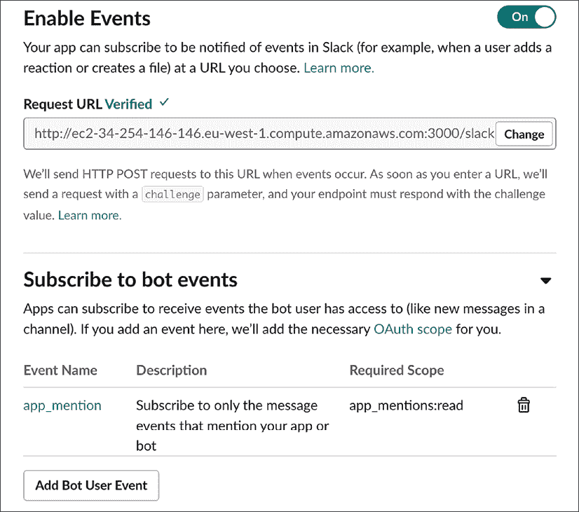
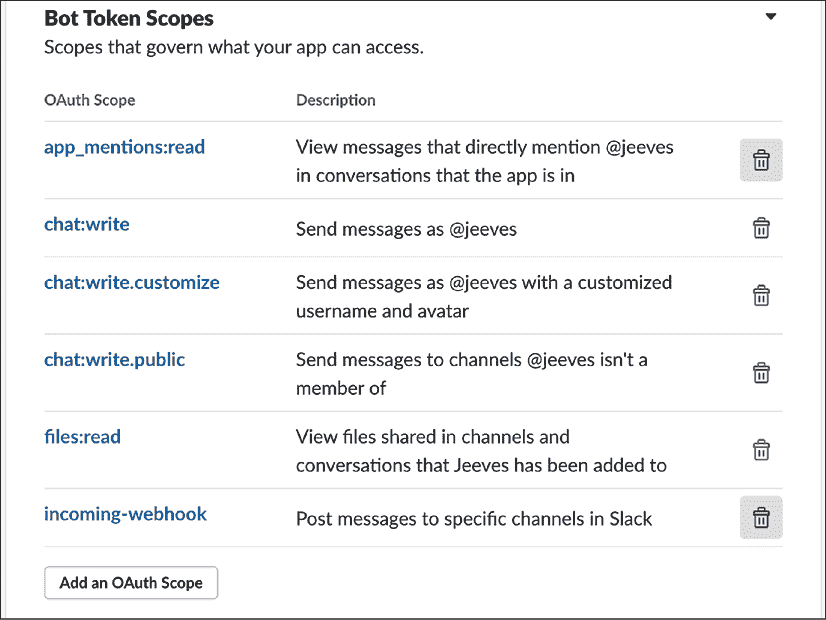
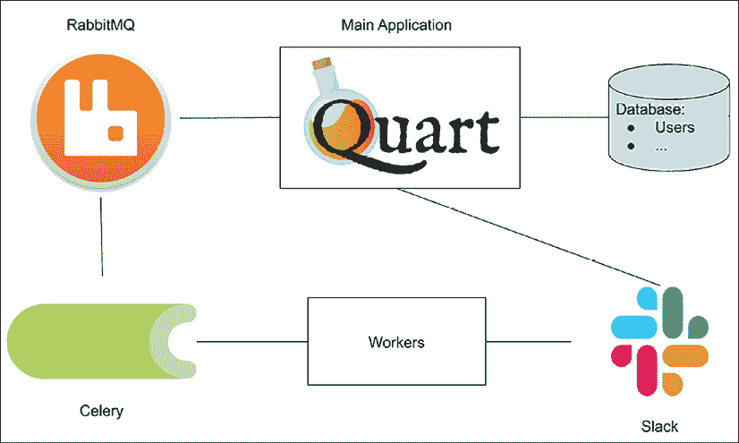

# 第四章：设计 Jeeves

在*第一章*，*理解微服务*中，我们提到构建基于微服务的应用的自然方式是从实现所有功能的单体版本开始，然后将其拆分为最有意义的微服务。当你设计软件时，你需要担心的事情很多，包括信息在系统中的流动、满足需求以及弄清楚所有部分如何配合。当设计遇到现实时，你开始对应该拥有哪些类型的组件有一个良好的认识，随着经验的积累，你将更容易在早期就发现潜在的微服务。

在本章中，我们将通过构建单体应用并实现所需功能来经历这个过程。我们将涵盖每个组件的工作原理以及为什么它存在，以及信息如何在系统中流动。

本章分为两个主要部分：

+   我们的应用及其用户故事的介绍

+   如何将 Jeeves 构建为一个单体应用

当然，在现实中，拆分过程是在单体应用设计经过一段时间成熟后逐渐发生的。但为了本书的目的，我们将假设应用的第一版已经使用了一段时间，并为我们提供了关于如何正确拆分的见解，这要归功于我们的时间机器。

# Jeeves 机器人

**Jeeves**是本书创建的一个示例应用。不要在苹果或谷歌应用商店中寻找它，因为它尚未发布或部署给真实用户。

然而，应用确实可以工作，你可以在 GitHub 的 PythonMicroservices 组织中研究其不同的组件：[`github.com/PythonMicroservices/`](https://github.com/PythonMicroservices/)。

我们将连接到 Slack，这是一个流行的通信平台，主要用于在频道中发送文本消息，类似于较老的 IRC 服务。Jeeves 将是我们的人工智能助手——这个名字来源于 P. G. Wodehouse 的故事——用于其他软件机器人以及至少一个搜索引擎。我们使用这个名字是因为它的熟悉度，而不是因为它与其他人的工作有任何联系。这里展示的 Jeeves 为 Slack 工作空间的用户提供了一种交互式服务，并且可以轻松地适应其他聊天环境。它还提供了一个网页视图来配置基本设置。

一旦 Jeeves 连接到 Slack 工作空间，用户就可以向机器人发送消息并接收回复。用户还可以访问网页并注册他们可能需要连接的任何第三方服务，这要归功于标准的 OAuth2 机制。更多信息请参阅[`oauth.net/2/`](https://oauth.net/2/)。

我们将以**Strava** ([`www.strava.com`](https://www.strava.com))作为一个第三方网站的例子，尽管这同样可以容易地是 GitHub、谷歌服务、Atlassian 的 JIRA 或其他一些有用的服务。

OAuth2 标准基于授权第三方应用程序使用具有用户服务唯一访问令牌调用服务的想法。令牌由服务生成，通常具有有限的调用范围。

让我们通过它们的使用故事深入了解功能。

# 用户故事

首先，我们的应用程序应该做什么？描述我们的目标的一个好方法是通过覆盖不同场景中期望的行为。如果你之前参与过敏捷开发，这将以“用户故事”的形式熟悉。用户故事是对用户可以与应用程序进行的所有交互的非常简单的描述，通常是项目开始时编写的第一份高级文档，因为一些故事出现在开始工作的理由或提案中。

试图一开始就填充大量细节也可能使生活变得更困难；从高级故事开始，并在回顾时添加细节。有时，如果某个用户故事不可行，它可能会被丢弃——这非常取决于工作的进展以及每个想法的可行性。用户故事还有助于检测何时值得将一个功能拆分为其微服务：一个独立存在的用户故事可能是一个很好的候选者。

对于 Jeeves，我们可以从以下这个小集合开始：

+   作为 Slack 工作空间用户，我可以向机器人发送消息并获取关于天气的更新，而无需离开 Slack

+   作为 Slack 工作空间用户，我期望机器人能记住我告诉它的关于我的事实，例如我的位置

+   作为 Slack 工作空间用户，我可以访问机器人的控制面板并验证第三方服务，例如 GitHub 和 Strava

+   作为机器人的管理员，我可以获取有关机器人使用情况的统计数据

+   作为机器人的管理员，我可以禁用或更改各种功能的配置

+   作为用户，我可以在机器人所知的第三方网站上创建账户，然后使用机器人执行那里的任务

从这个用户故事集合中已经出现了一些组件。不分先后，如下所示：

+   应用程序需要存储它接收到的某些类型消息的内容。这些内容可能针对特定的 Slack 身份进行存储。

+   用户应该能够导航到第三方网站认证的 Web 界面。

+   应用程序将使用密码或提供的令牌的 URL 对 Web 用户进行身份验证。

+   应用程序应该能够执行周期性的计划任务，如果条件为真，则提醒用户，例如恶劣天气。

这些描述足以让我们开始。下一节将描述应用程序的设计和编码方式。

# 单一架构

本节展示了 Jeeves 单体版本源代码的摘录。如果您想详细了解，整个应用程序可以在[`github.com/PacktPublishing/Python-Microservices-Development-2nd-Edition/tree/main/monolith`](https://github.com/PacktPublishing/Python-Microservices-Development-2nd-Edition/tree/main/monolith)找到。

首先要考虑的是从 Slack 中检索数据到我们的应用程序。为此将有一个单独的端点，因为 Slack 将所有事件发送到应用程序开发者配置的 URL。稍后，我们还可以添加其他端点来处理其他环境，例如 IRC、Microsoft Teams 或 Discord。

我们还需要一个小的界面，以便人们可以在 Slack 之外调整设置，因为使用网页控制第三方身份验证令牌和更新这些工具的权限要容易得多。我们还需要一个小型数据库来存储所有这些信息，以及我们希望我们的微服务拥有的其他设置。

最后，我们需要一些代码来实际执行我们的机器人代表发送消息的人应该执行的操作。

当构建应用程序时，经常提到的一个设计模式是 **模型-视图-控制器**（**MVC**）模式，它将代码分为三个部分：

+   **模型**：管理数据

+   **视图**：显示特定上下文（网页视图、PDF 视图等）的模型

+   **控制器**：通过操作模型来改变其状态

`SQLAlchemy` 是一个库，可以帮助我们处理模型部分，允许我们在 Python 源代码中指定表、关系以及读取和写入数据的包装器。在微服务中，视图和控制器的区别可能有些模糊，因为所谓的视图是一个接收请求并发送响应的函数——这个函数既可以显示也可以操作数据，使其既能作为视图也能作为控制器。

Django 项目使用 **模型-视图-模板**（**MVT**）来描述这种模式，其中视图是 Python 可调用函数，模板是模板引擎，或者负责以特定格式生成响应的任何东西。`Quart` 使用 Jinja2 进行各种有用的模板渲染——最常见的是生成 HTML，并使用 `render_template()` 函数从变量中获取值来填充内容。我们将使用这种方法来展示向人类展示数据的视图；对于返回 JSON 的 API 视图，我们将使用 `json.dumps()` 来生成响应。在任何情况下，设计我们应用程序的第一步是定义模型。

## 模型

在基于 SQLAlchemy 的 `Quart` 应用程序中，模型通过类来描述，这些类代表了数据库模式。对于 Jeeves，数据库表包括：

+   **用户**：包含有关每个用户的信息，包括他们的凭证

+   **服务**：这是一个列表，列出了机器人可以提供的服务以及它们是否处于活动状态

+   **日志**：机器人活动日志

使用**SQLAlchemy** ([`www.sqlalchemy.org/`](https://www.sqlalchemy.org/))库，每个表都作为模块提供的基类的子类创建，这使我们能够避免重复工作，并使我们的代码保持干净，专注于我们想要处理的数据。SQLAlchemy 具有异步接口，可以在访问数据库时保持异步应用程序的性能优势。要使用这些功能，我们必须安装`sqlalchemy`和`aiosqlite`。完整的示例可以在代码样本的 GitHub 存储库中找到，作为`sqlachemy-async.py`文件：

```py
 # sqlalchemy-async.py

    from sqlalchemy.ext.asyncio import create_async_engine, AsyncSession
    from sqlalchemy.orm import declarative_base, sessionmaker
    from sqlalchemy import Column, Integer, String, Boolean, JSON
    from sqlalchemy.orm import Session
    from sqlalchemy.future import select
    from sqlalchemy import update

    # Initialize SQLAlchemy with a test database
    DATABASE_URL = "sqlite+aiosqlite:///./test.db"
    engine = create_async_engine(DATABASE_URL, future=True, echo=True)
    async_session = sessionmaker(engine, expire_on_commit=False, class_=AsyncSession)
    Base = declarative_base()

    # Data Model
    class User(Base):
        __tablename__ = "user"
        id = Column(Integer, primary_key=True, autoincrement=True)
        name = Column(String)
        email = Column(String)
        slack_id = Column(String)
        password = Column(String)
        config = Column(JSON)
        is_active = Column(Boolean, default=True)
        is_admin = Column(Boolean, default=False)
        def json(self):
            return {"id": self.id, "email": self.email, "config": self.config} 
```

`User`表主要存储一些 Unicode 字符串，但值得注意的是两个`Boolean`值，它们保证了我们不需要解释另一个系统存储`True`和`False`的方式。还有一个 JSON 列用于存储整个数据结构——这是一个在越来越多的后端数据库中可用的功能，包括 PostgreSQL 和 SQLite。

当在`Quart`应用中使用时，SQLAlchemy 允许我们编写一个接口来避免直接编写 SQL；相反，我们可以调用查询和过滤数据的函数。我们可以更进一步，创建一个**数据访问层**（**DAL**），为我们处理所有的数据库会话管理。在下面的代码中，我们编写了一个可以作为上下文管理器使用的访问层，同时提供了创建和查找用户的方法。`create_user`方法只是简单地使用我们之前定义的模型来创建一个新的 Python 对象——不包含所有字段，以使示例更清晰——然后将它添加到数据库会话中，确保数据在返回数据库写入的值之前已经写入。

建立在这一点上，我们可以使用`get_all_users`方法返回使用`User`模型存储的所有记录，使用`select()`来检索它们，并使用`get_user`返回单个记录，同时使用`where`方法过滤结果，只显示与提供的参数匹配的记录：

```py
 class UserDAL:
      def __init__(self, db_session):
         self.db_session = db_session
      async def create_user(self, name, email, slack_id):
         new_user = User(name=name, email=email, slack_id=slack_id)
         self.db_session.add(new_user)
         await self.db_session.flush()
         return new_user.json()
      async def get_all_users(self):
         query_result = await self.db_session.execute(select(User).order_by(User.id))
         return {"users": [user.json() for user in query_result.scalars().all()]}
      async def get_user(self, user_id):
         query = select(User).where(User.id == user_id)
         query_result = await self.db_session.execute(query)
         user = query_result.one()
         return user[0].json() 
```

在设置了 DAL 之后，我们可以使用 Python 自带的`contextlib`提供的功能来创建一个异步上下文管理器：

```py
 @asynccontextmanager
    async def user_dal():
        async with async_session() as session:
            async with session.begin():
                yield UserDAL(session) 
```

所有这些设置起来可能很多，但一旦完成，它就允许我们仅通过上下文管理器来控制数据库会话，就可以访问`User`模型后面存储的任何数据。我们将在我们的视图中使用所有这些代码。

## 查看和模板

当接收到请求时，通过 URL 映射调用视图，我们可以使用上面创建的上下文管理器来查询和更新数据库。以下`Quart`视图将允许我们在查询`/users`端点时查看数据库中的所有用户：

```py
 @app.get("/users")
    async def get_all_users():
        async with user_dal() as ud:
            return await ud.get_all_users() 
```

当创建 `user_dal` 上下文时，我们可以访问其中的所有方法，因此我们可以轻松调用 `get_all_users` 方法并将值返回给客户端。让我们将上述所有内容组合成一个示例应用程序，并添加一些缺失的字段：

```py
 # sqlalchemy-async.py
    from contextlib import asynccontextmanager
    from quart import Quart
    from sqlalchemy.ext.asyncio import create_async_engine, AsyncSession
    from sqlalchemy.orm import declarative_base, sessionmaker
    from sqlalchemy import Column, Integer, String, Boolean, JSON
    from sqlalchemy.orm import Session
    from sqlalchemy.future import select
    from sqlalchemy import update
    # Initialize SQLAlchemy with a test database
    DATABASE_URL = "sqlite+aiosqlite:///./test.db"
    engine = create_async_engine(DATABASE_URL, future=True, echo=True)
    async_session = sessionmaker(engine, expire_on_commit=False, class_=AsyncSession)
    Base = declarative_base()
    # Data Model
    class User(Base):
        __tablename__ = "user"
        id = Column(Integer, primary_key=True, autoincrement=True)
        name = Column(String)
        email = Column(String)
        slack_id = Column(String)
        password = Column(String)
        config = Column(JSON)
        is_active = Column(Boolean, default=True)
        is_admin = Column(Boolean, default=False)
        def json(self):
            return {
                "id": self.id,
                "email": self.email,
                "slack_id": self.slack_id,
                "config": self.config,
                "is_active": self.is_active,
                "is_admin": self.is_admin,
            }
    # Data Access Layer
    class UserDAL:
        def __init__(self, db_session):
            self.db_session = db_session
        async def create_user(
            self,
            name,
            email,
            slack_id,
            password=None,
            config=None,
            is_active=True,
            is_admin=False,
        ):
            new_user = User(
                name=name,
                email=email,
                slack_id=slack_id,
                password=password,
                config=config,
                is_active=is_active,
                is_admin=is_admin,
            )
            self.db_session.add(new_user)
            await self.db_session.flush()
            return new_user.json()
        async def get_all_users(self):
            query_result = await self.db_session.execute(select(User).order_by(User.id))
            return [user.json() for user in query_result.scalars().all()]
        async def get_user(self, user_id):
            query = select(User).where(User.id == user_id)
            query_result = await self.db_session.execute(query)
            user = query_result.one()
            return user[0].json()
    app = Quart(__name__)
    @app.before_serving
    async def startup():
        # create db tables
        async with engine.begin() as conn:
            # This resets the database – remove for a real project!
            await conn.run_sync(Base.metadata.drop_all)
            await conn.run_sync(Base.metadata.create_all)
            async with user_dal() as bd:
                await bd.create_user("name", "email", "slack_id")
    @asynccontextmanager
    async def user_dal():
        async with async_session() as session:
            async with session.begin():
                yield UserDAL(session)
    @app.get("/users/<int:user_id>")
    async def get_user(user_id):
        async with user_dal() as ud:
            return await ud.get_user(user_id)
    @app.get("/users")
    async def get_all_users():
        async with user_dal() as ud:
            return await ud.get_all_users()
    if __name__ == "__main__":
        app.run() 
```

## 人类可读的视图

如果我们想要以易于阅读的格式呈现这些信息，我们可以使用 Jinja2 模板并将查询结果传递以填写详细信息：

```py
 @app.get("/users/page")
    async def get_all_users_templated():
        async with user_dal() as ud:
            users = await ud.get_all_users()
            return await render_template("users.html", users=users) 
```

如果没有配置来告诉它否则，Jinja 会在其 Python 应用程序的 `templates/` 子目录中查找模板，这对于小型应用程序来说通常足够了。

我们的 `users.html` 模板中包含了一些 HTML 代码，但也包含了一些由花括号包围的指令。有一个 `for` 循环允许我们遍历传递给模板的数据，我们可以看到发送给 Jinja 的指令被 `` 包围。模板中的另一个常见指令是 ``，它只会在条件为真时包含一段文本。在 `for` 循环中，我们看到了一些变量扩展在 `{{` 和 `}}` 内，这表明 Jinja 应该寻找具有该名称的变量。可以对变量应用过滤器，这在格式化日期时特别有用。以下是一个简单的模板，它遍历所有提供的用户并显示他们的电子邮件地址和 Slack ID：

```py
 <html>
      <body>
        <h1>User List</h1>
        <ul>
          
          <li>
          {{ user.email }} {{ user.slack_id }} 
          </li>
          
        </ul>
      </body>
    </html> 
```

通过网络编辑数据时，可以使用 WTForms 为每个模型生成表单。WTForms 是一个库，它使用 Python 定义生成 HTML 表单，负责从传入的请求中提取数据，并在更新模型之前对其进行验证。了解更多信息请访问 [`wtforms.readthedocs.io`](http://wtforms.readthedocs.io)。

Flask-WTF 项目为 `Quart` 包装了 WTForms，并添加了一些有用的集成，例如使用 **跨站请求伪造**（**CSRF**）令牌来保护表单。了解更多信息请访问 [`flask-wtf.readthedocs.io/`](https://flask-wtf.readthedocs.io/)。

CSRF 令牌将确保在您登录时，没有恶意的第三方网站可以向您的应用程序发送有效的表单。*第七章*，*保护您的服务*，将详细解释 CSRF 的工作原理以及为什么它对您的应用程序安全很重要。

以下模块实现了一个用于 `User` 表的表单，以 `FlaskForm` 为其基础：

```py
 import quart.flask_patch
    from flask_wtf import FlaskForm 
    import wtforms as f 
    from wtforms.validators import DataRequired 

    class UserForm(FlaskForm):
        email = f.StringField("email", validators=[DataRequired()])
        slack_id = f.StringField("Slack ID")
        password = f.PasswordField("password")

        display = ["email", slack_id, "password"] 
```

`display` 属性只是模板在渲染表单时迭代特定有序字段列表的一个辅助工具。其他所有内容都是使用 WTForms 的基本字段类为用户表创建表单。WTForm 的字段文档提供了完整的列表，请参阅 [`wtforms.readthedocs.io/en/2.3.x/fields/`](https://wtforms.readthedocs.io/en/2.3.x/fields/)。

一旦创建，`UserForm` 可以在具有两个目标的视图中使用。第一个目标是显示在 `GET` 调用中的表单，第二个目标是在用户提交表单时，在 `POST` 调用中更新数据库：

```py
 @app.route("/create_user", methods=["GET", "POST"])
    async def create_user():
        form = UserForm()
        if request.method == "POST" and form.validate():
            async with user_dal() as ud:
                await ud.create_user(form.name.data, form.email.data, form.slack_id.data)
            return redirect("/users")
        return await render_template("create_user.html", form=form) 
```

`UserForm` 类有一个方法来验证传入的 `POST` 数据，使用我们提供的验证器。当某些数据无效时，表单实例将保留错误列表在 `field.errors` 中，以防模板想要向用户显示它们。

`create_user.html` 模板会遍历表单字段列表，WTForm 负责渲染适当的 HTML 标签：

```py
 <html> 
     <body> 
      <form action="" method="POST"> 
        {{ form.hidden_tag() }} 
        <dl> 
          
         <dt>{{ form[field].label }}</dt> 
         <dd>{{ form[field]() }} 
            
             {{ e }}  
            
           </dd>
          
        </dl> 
        <p> 
        <input type=submit value="Publish"> 
      </form> 
     </body> 
    </html> 
```

`form.hidden_tag()` 方法将渲染所有隐藏字段，例如 CSRF 令牌。一旦这个表单开始工作，就很容易为应用程序中需要的每个表单重用相同的模式。

在开发过程中，表单通常会定期调整，并且由于必要性，它们与数据库的结构紧密耦合。因此，当我们考虑将 Jeeves 分解为微服务时，我们将考虑这些表单是否需要由数据库微服务提供，以避免在其他服务中出现模式依赖。

## Slack 工作区

Slack 允许人们将应用程序连接到工作区。如果您是 FunCorp Slack 实例的管理员，您可以访问以下链接并创建一个新的机器人用户：[`api.slack.com/apps?new_app=1`](https://api.slack.com/apps?new_app=1)。

具体的流程和网页布局可能会改变——正如网络服务经常发生的那样——但将有机会启用事件订阅并提供一个 Slack 消息应发送到的 URL。

将生成一个令牌，您应该将其复制并放置在应用程序的设置中，以便在发送消息时验证 Slack：



图 4.1：订阅 Slack 机器人事件

您提供给 Slack 的 `Request` URL 需要从 Slack 自身的服务器可访问，因此仅在您的笔记本电脑上运行可能不够。如果您遇到麻烦，那么在云服务提供商中运行虚拟服务器是一种快速简单的方法来开始。我们将在第十章 *Deploying on AWS* 中更详细地介绍这一点，其中我们讨论了在云中部署我们的应用程序。

一旦验证了机器人的端点，它将开始接收它已订阅的消息。这意味着如果您选择了 `app_mention` 事件，那么不提及机器人名称的消息将不会发送，但其他任何消息都会。您的机器人需要一些权限——称为作用域——以读取和发送消息：



图 4.2：示例 Slack 机器人权限以接收消息

发送事件时发送的 JSON 数据会附带所有分类好的数据。以下面的例子为例，当某人输入 `@jeeves hello` 时，API 端点将接收一个 JSON 对象，该对象标识了工作区、时间戳、事件的类型、输入的用户以及消息本身的组成部分——例如提及 (`@jeeves`) 和文本，*hello*。任何发送的用户 ID 对人类来说都是不可识别的，因为它们是用于表示用户和工作区的内部文本字符串。这也意味着，当我们把用户连接到我们的应用程序时，除非我们向 Slack 请求，否则我们永远不会真正了解他们在 Slack 中选择的用户名。

这里是我们请求 Slack 工作区中的天气时，我们的服务得到的 JSON 数据的简化副本。很容易看出用户和团队的价值不是人类友好的，但 JSON 也很有帮助，因为它已经将可能复杂的信息拆分成了我们不需要担心安全移除其他用户的提及、链接或其他特殊元素的段落：

```py
{
    "event": {
        "client_msg_id": "79cd47ec-4586-4677-a50d-4db58bdfcd4b",
        "type": "app_mention",
        "text": "<@U01HYK05BLM>\u00a0weather in London, UK",
        "user": "U136F44A0",
        "ts": "1611254457.003600",
        "team": "T136F4492",
        "blocks": [
            {
                "type": "rich_text",
                "block_id": "pqx",
                "elements": [
                    {
                        "type": "rich_text_section",
                        "elements": [
                            {
                                "type": "user",
                                "user_id": "U01HYK05BLM"
                            },
                            {
                                "type": "text",
                                "text": " weather in London, UK"
                            }
                        ]
                    }
                ]
            }
        ],
    … 
} 
```

## 执行动作

我们的机器人应该能够为发送消息的人做些有用的事情，我们应该尽可能将这些动作保持为自包含的。即使不使用基于微服务的设计，在组件之间创建明确的边界也远更安全。

我们如何知道采取哪种行动？在收到 Slack 的消息后，我们需要理解我们得到的数据，并寻找适当的关键词。当我们找到匹配的内容时，我们就可以检查应该调用哪个函数。

我们用来处理 Slack 消息的 `Quart` 视图应该尽可能简单，所以我们只做足够的处理来从我们提供的数据中提取信息，并将其传递给消息处理器。这个处理器负责检查机器人收到的文本，并决定采取的行动。这样安排代码也意味着，如果我们添加对其他聊天服务的支持，我们可以使用相同的消息处理器，并咨询相同的动作列表。

我们可能需要在以后需要更复杂或动态的动作配置，但现在，让我们从配置文件中的简单映射开始。字典键将是消息开头需要查找的一些文本，值是匹配时将被调用的函数的名称。这些函数中的每一个都将接受相同的参数，以使我们的生活更简单：

```py
 ACTION_MAP = {
        "help": show_help_text,
        "weather": fetch_weather,
        "config": user_config,
    }
    def process_message(message, metadata):
        """Decide on an action for a chat message.
        Arguments:
            message (str): The body of the chat message
            metadata (dict): Data about who sent the message,
                  the time and channel.
        """
        reply = None
        for test, action in ACTION_MAP.items():
            if message.startswith(test):
                reply = action(message.lstrip(test), metadata)
                break
        if reply:
            post_to_slack(reply, metadata) 
```

通过使用这种方法，向我们的机器人添加新动作不需要对 `process_message` 函数进行任何更改，因此对该函数的测试也没有任何更改；相反，我们只需更改文件顶部的字典。如果我们发现将 `ACTION_MAP` 移入数据库或配置文件会有所帮助，那么以后也将更容易这样做。

这些操作可能会很好地利用元数据，因此我们将这些信息传递下去。例如，查找天气时，可以利用我们被告知的任何存储位置。

## OAuth 令牌

**OAuth2** ([`oauth.net/2/`](https://oauth.net/2/))允许我们向其他人的网站发送经过身份验证的请求。我们可以请求对某人的 Google 日历的只读访问权限，允许向 GitHub 发布问题，或者能够读取健身应用程序中我们记录的锻炼信息的权限。我们可以在不要求用户为不同网站提供密码的情况下完成所有这些操作——这是任何人都永远不会做的事情！

在我们的示例中，我们将连接到 Slack，以便允许使用我们机器人的用户登录并更新他们自己的信息。我们还可以使用此功能获取有关他们的信息，例如他们的 Slack 个人资料详情——如果他们允许我们这样做的话。

我们将向访问网页的人展示一个按钮，他们可以使用该按钮通过 Slack 登录到网站，这将使网络浏览器跳转到 Slack 的页面以授权我们的应用程序。如果他们同意，那么我们的应用程序将获得一个代码，然后我们可以使用该代码请求访问令牌。这个访问令牌将允许我们联系 Slack 并验证令牌是否仍然有效，并允许我们请求我们被允许查看或更改的信息！对于这个示例，我们需要启用 HTTPS 并拥有一个有效的网站证书。最简单的方法是使用代理和“Let's Encrypt”证书。我们将在第七章“保护你的服务”中介绍如何设置这个代理和证书。现在，让我们看看我们如何登录用户：

```py
 # slack_oauth2.py
    import os
    from quart import Quart, request, render_template
    import aiohttp
    app = Quart(__name__)
    @app.route("/")
    async def welcome_page():
        client_id = os.environ["SLACK_CLIENT_ID"]
        return await render_template("welcome.html", client_id=client_id)
    @app.route("/slack/callback")
    async def oauth2_slack_callback():
        code = request.args["code"]
        client_id = os.environ["SLACK_CLIENT_ID"]
        client_secret = os.environ["SLACK_CLIENT_SECRET"]
        access_url = f"https://slack.com/api/oauth.v2.access?client_id={client_id}&client_secret={client_secret}&code={code}"
        async with aiohttp.ClientSession() as session:
            async with session.get(access_url) as resp:
                access_data = await resp.json()
                print(access_data)
        return await render_template("logged_in.html")
    if __name__ == "__main__":
        app.run() 
```

我们在这里介绍了**aiohttp** ([`docs.aiohttp.org/`](https://docs.aiohttp.org/))，这是一个用于发送网络请求的有用异步库。我们也没有处理我们的回调视图接收到的错误响应，或者将此有用的数据存储在数据库中以供以后使用。在那个视图中，`@login_required`和`current_user`是下一节中介绍的认证和授权过程的一部分。

## 认证和授权

我们的单体应用程序几乎准备好了，但它也需要一种处理认证和授权的方法。简单来说：

+   **认证**是证明你就是你声称的那个人

+   **授权**是确定你可以执行哪些操作

这是一个必须谨慎但至关重要的区分。在大多数服务中，有一个管理员，他必须提供认证——证明他们是他们所声称的人——才能获得执行配置更新的权限。服务的普通用户仍然必须证明他们是他们所声称的人，但他们可以做的事情将不包括与管理员相同的访问权限。

对于 Jeeves，我们需要将我们的 Slack 用户与我们的网络服务用户界面连接起来，以便人们可以使用外部服务进行身份验证。我们以这种方式设置第三方身份验证，这样我们就不需要对标准的 OAuth 流程进行任何复杂的更改。

由于 Slack 为大多数用户使用内部标识符，我们不会看到——也不需要看到——他们选择显示给其他人的友好名称。相反，我们将通过一个简短的九个字符的字符串来识别他们：你可以通过检查你的 Slack 个人资料来查看自己的，它将在 **更多** 菜单下可见。我们如何将其与网页界面连接起来？最快的方式是从机器人那里获取一个登录链接。如果用户向 Jeeves 发送消息要求登录，Jeeves 可以回复一个 URL。一旦访问，该 URL 将允许用户设置密码并使用所有网页功能。

对于我们的单体解决方案，我们刚刚看到我们可以让人们使用 Slack 登录，而无需我们处理密码。使用 `quart-auth` 库使得管理用户的会话信息变得简单，因为它提供了创建和存储会话 cookie 的有用辅助函数，这样我们就可以在访问之间被记住。

看看这些更改，我们的欢迎页面不再在其模板中显示登录按钮，而是现在有一个新的装饰器 `@login_required`，它将只允许在声明当前访客已成功认证的情况下加载视图：

```py
 @app.route("/")
    @login_required
    async def welcome_page():
        return await render_template("welcome.html") 
```

如果网站访客未进行身份验证，那么他们的访问将由我们设置的 `errorhandler` 处理，这里将他们重定向到登录页面。登录页面与我们的上一个欢迎页面做同样的工作，并显示用户需要按下的登录按钮：

```py
 @app.route("/slack_login")
    async def slack_login():
        client_id = os.environ["SLACK_CLIENT_ID"]
        return await render_template("login.html", client_id=client_id)
    @app.errorhandler(Unauthorized)
    async def redirect_to_login(_):
        return redirect(url_for("slack_login")) 
```

Slack OAuth2 的流程与之前一样继续进行，我们会在回调中收到一条消息。如果这条消息表明一切顺利，那么我们可以使用 `quart-auth` 的 `AuthUser` 调用和 `login_user` 调用来为该用户设置一个会话。让我们通过一个实际的工作示例将整个流程整合起来，利用 `secrets` 库生成一个安全但临时的密钥用于开发：

```py
 # logging_in.py
    import os
    from quart import Quart, request, render_template, redirect, url_for
    from quart_auth import (
        AuthManager,
        login_required,
        logout_user,
        login_user,
        AuthUser,
        Unauthorized,
    )
    import aiohttp
    import secrets
    app = Quart(__name__)
    AuthManager(app)
    app.secret_key = secrets.token_urlsafe(16)
    @app.route("/")
    @login_required
    async def welcome_page():
        return await render_template("welcome.html")
    @app.route("/slack_login")
    async def slack_login():
        client_id = os.environ["SLACK_CLIENT_ID"]
        return await render_template("login.html", client_id=client_id)
    @app.errorhandler(Unauthorized)
    async def redirect_to_login(_):
        return redirect(url_for("slack_login"))
    @app.route("/slack/callback")
    async def oauth2_slack_callback():
        code = request.args["code"]
        client_id = os.environ["SLACK_CLIENT_ID"]
        client_secret = os.environ["SLACK_CLIENT_SECRET"]
        access_url = f"https://slack.com/api/oauth.v2.access?client_id={client_id}&client_secret={client_secret}&code={code}"
        async with aiohttp.ClientSession() as session:
            async with session.get(access_url) as resp:
            access_data = await resp.json()
            if access_data["ok"] is True:
                authed_user = access_data["authed_user"]["id"]
                login_user(AuthUser(authed_user))
                return redirect(url_for("welcome_page")
        return redirect(url_for("slack_login")) 
```

如果你确实需要存储密码，最简单的保护形式是确保它们不会以明文形式存储在数据库中；相反，以无法转换回原始密码的散列形式存储。这将最大限度地减少如果服务器被入侵时密码泄露的风险。对于身份验证过程，这意味着当用户登录时，你需要将传入的密码散列并与存储的散列进行比较。始终检查有关散列算法的最新建议，因为发明自己的或使用过时的算法可能非常危险。

传输层通常不是应用程序安全中的弱点。多亏了在**传输层安全**（**TLS**）上工作的安全专业人士的辛勤工作，我们只需要关注请求接收后服务内部发生的事情。

同样，可以通过查看`quart_auth`在应用程序上下文中设置的`current_user`变量来执行更细粒度的权限验证。例如，您可以使用此功能允许用户更改他们的数据，但阻止他们更改任何其他用户的资料。

## 后台任务

到目前为止，我们的应用程序有几个功能，可以作为计划任务运行，无需用户交互：我们的天气动作可以检查用户所在地区的天气警报并向他们发送消息；日历动作可以在工作日开始时报告您的计划会议；可以生成并电子邮件发送到负责机器人的人员的关于已执行动作的月度报告。

这些是后台任务，它们需要在 HTTP 请求/响应周期之外独立运行。大多数操作系统都有某种形式的计划任务功能，例如 Unix 上的 cron 或 Windows 中的计划任务。这些功能可能不适合我们的应用程序，因为这意味着我们应该在平台无关的情况下连接到特定平台，并且能够运行在容器中，或者如果我们的需求发生变化，可以迁移到无服务器平台。

在 Python Web 应用程序中运行重复的后台任务的一种流行方式是使用**Celery**，这是一个分布式任务队列，可以在独立进程中执行一些工作：[`docs.celeryproject.org`](http://docs.celeryproject.org)。

运行这些工作片段时，一个称为消息代理的中间件负责在应用程序和 Celery 之间传递消息。例如，如果应用程序想让 Celery 运行某些任务，它将在代理中添加一条消息；Celery 会轮询该消息并执行任务。

消息代理可以是任何可以存储消息并提供检索它们方式的任何服务。Celery 项目与**高级消息队列协议**（**AMQP**）服务（如**RabbitMQ** ([`www.rabbitmq.com`](http://www.rabbitmq.com))）、**Redis** ([`redis.io`](http://redis.io))和**Amazon SQS** ([`aws.amazon.com/sqs/`](https://aws.amazon.com/sqs/))无缝工作。AMQP 提供了一套标准技术，用于以可靠的方式路由和传递消息。在我们下一章更详细地研究微服务设计时，我们将使用 RabbitMQ 作为示例，RabbitMQ 将负责确保消息到达目的地，而 Celery 负责对那些消息采取行动。

执行作业的组件被称为工作进程，Celery 提供了一个类来启动一个。要从`Quart`应用程序中使用 Celery，你可以创建一个`background.py`模块，该模块实例化一个 Celery 对象，并使用`@celery.task`装饰器标记你的后台任务。

在下面的示例中，我们使用 Celery 设置一个任务，该任务将为数据库中设置了位置和 Slack 用户名的每个用户获取天气报告。虽然在实际中，我们希望人们选择加入这个功能，但它允许我们展示如何构建一个任务。

我们将使用本章中创建的数据库，并假设我们已经向其中添加了一个位置字段。我们还应该添加一个函数，以便我们可以搜索设置了位置的用户账户：

```py
 class UserDAL:
        ...
        async def get_users_with_locations(self):
            query = select(User).where(User.location is not None)
            return await self.db_session.execute(query) 
```

现在我们可以设置一个工作进程来执行任务。唯一的困难是需要将我们调用的执行工作的函数包装起来。要使用异步数据库引擎，它必须是一个`async`函数，但 Celery 只能调用同步函数，所以我们使用`asgiref`库中找到的辅助函数来转换它：

```py
 # weather_worker.py
    import asyncio
    from asgiref.sync import async_to_sync
    from celery import Celery
    from database import user_dal
    celery_app = Celery("tasks", broker="amqp://localhost")
    async def fetch_weather(location):
        return "This is where we would call the weather service"
    async def post_to_slack(message, options):
        print(f"This is where we would post {message}")
    async def weather_alerts_async():
        async with user_dal() as ud:
            query_results = await ud.get_users_with_locations()
            for user in query_results:
                user = user[0] # the database returns a tuple
                weather_message = await fetch_weather(user.location)
                username = user.slack_id
                if not username.startswith("@"):
                    username = "@" + username
                await post_to_slack(weather_message, {"channel": username})
    @celery_app.task
    def do_weather_alerts():
        async_to_sync(weather_alerts_async)()
    @celery_app.on_after_configure.connect
    def setup_periodic_tasks(sender, **kwargs):
        sender.add_periodic_task(10.0, do_weather_alerts, name="fetch the weather", expires=30) 
```

Celery 需要 RabbitMQ 运行才能工作——RabbitMQ 网站上有一些教程，但以下我们假设你已经安装了 Docker 并且可以运行容器。如果你没有，那么不用担心；我们将在第十章*部署在 AWS*中更详细地讨论容器。我们运行 Celery 后台工作进程，它将等待接收要求它执行工作的消息，然后在另一个终端中启动调度器或 beat，它将使用我们设置的周期性任务：

```py
 docker run -d -p 5672:5672 rabbitmq 
    celery -A background worker  --loglevel=INFO
    celery -A background beat --loglevel=INFO 
```

这个 Celery 工作进程也使用 AMQP 连接到 RabbitMQ，以便可以通过发送消息通过代理来触发任务。如果我们不需要立即向调用者发送响应，而是期望一个运行时间较长的进程执行一些任务，这将特别有用。

继续我们的设置，我们可以看看调度器。每 10 秒对于这样的报告来说可能有点太频繁了。我们应该改用 Celery 的 crontab 功能，它允许我们指定一个计划，同时使用更熟悉的 Unix crontab 设置：

```py
 from celery.schedules import crontab
    @celery_app.on_after_configure.connect
    def setup_periodic_tasks(sender, **kwargs):
        sender.add_periodic_task(       
            crontab(hour=7, minute=30, day_of_week='monday'),
            do_weather_alerts, name="fetch the weather", expires=30
        ) 
```

当 Celery 服务通过`Quart`应用程序传递消息被调用时，它可以被认为是一个本身就是一个微服务。这也从部署的角度来看很有趣，因为 RabbitMQ 服务器和 Celery 应用程序都可以部署在另一台服务器上。然后我们的异步函数可以使用当前的应用程序上下文来访问数据库，运行查询，然后使用我们应用程序的功能来运行任务。

# 组合单体设计

这种单体设计是一个坚实的基础，应该是你第一次开发迭代中追求的结果。一切都应该与测试和文档一起创建，正如在第三章*编码、测试和文档：良性循环*中解释的那样。

这是一个在关系型数据库之上的简洁实现，可以使用 PostgreSQL、MySQL 或云服务提供商自带的 SQL 数据库进行部署。得益于 SQLAlchemy 抽象，本地版本可以使用 SQLite 3 运行，并便于你的日常开发和本地测试。为了构建这个应用程序，我们使用了以下扩展和库：

+   **aiohttp**：处理所有出站 HTTP 请求

+   **SQLAlchemy**：用于模型

+   **Flask-WTF**和**WTForms**：用于所有表单

+   **Celery 和 RabbitMQ**：这些用于后台进程和周期性任务

+   **quart-auth**：用于管理身份验证和授权

整体设计可以用图表表示，如图*图 4.3*所示：



图 4.3：我们第一个设计中的组件

典型的早期部署会将所有这些服务放在同一台服务器上。这样做当然更简单，而且通常给人一种直观的感觉，即给应用程序分配更强大的计算机——这被称为垂直扩展。无论是云服务提供商中的虚拟机还是你建筑中的物理服务器，单个计算机可用的资源数量是有限的，因此垂直扩展有一个实际的上限。

无论你的应用程序是因为内存不足、网络吞吐量、CPU 处理可用性，还是其他瓶颈而运行缓慢，最佳解决方案是更新架构，以便服务可以在多台不同的计算机上运行。这是水平扩展，也是使用微服务的一个好处。如果一个微服务需要比单台计算机能提供的更多 I/O 吞吐量来处理所有请求，那么如果它可以在几十或几百台计算机上运行，这就不成问题。

# 摘要

Jeeves 机器人是一个典型的 Web 应用程序，它与数据库和一些后端服务交互。唯一不寻常的特点是它的大部分工作量来自一个端点。使用单体架构构建这个应用程序使我们能够快速迭代几个选择，并得到一个在开发和低量使用期间表现良好的原型。

从我们关于动作的讨论中可以看出，有很好的候选者可以迁移到微服务。如果我们为几十或几百个 Slack 工作空间运行这个机器人，我们可能会发现有一个组件比其他组件使用得多，或者有难以在当前架构中解决的可靠性问题。应用程序应该如何扩展？当它依赖的外部服务遇到错误时会发生什么？如果我们的某个组件——我们的数据库或消息代理——崩溃了，会发生什么？

在下一章中，我们将探讨这些问题：如何改变 Jeeves 的架构以使其更具弹性，以及如何对服务进行谨慎、有度的更改。
