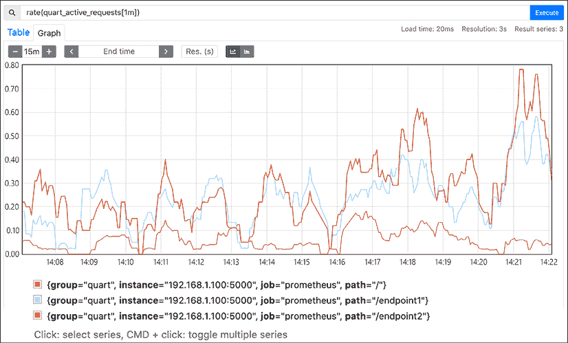
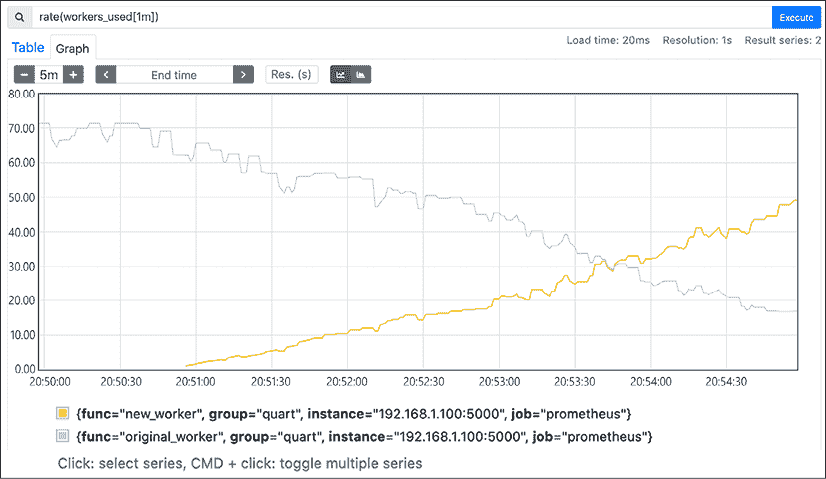
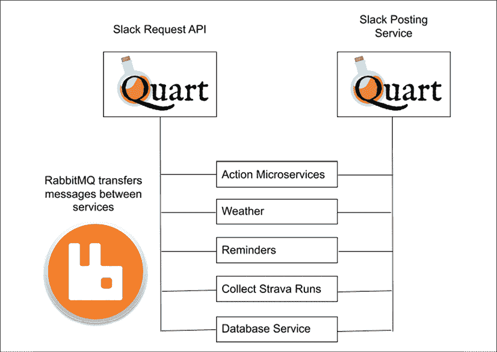
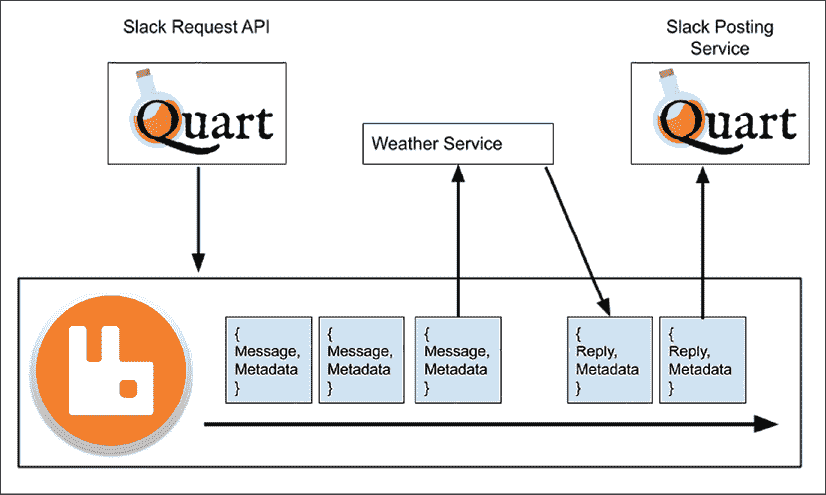

# 第五章：分割单体

在上一章中，我们创建了一个单体应用程序作为助手；我们这样做非常迅速，专注于添加功能而不是长期架构。这种做法没有错——毕竟，如果应用程序永远不需要扩展，那么工程努力就是浪费。

但让我们假设我们的服务非常受欢迎，接收到的请求数量正在增长。我们现在必须确保它在负载下表现良好，同时也确保它对不断增长的开发团队来说易于维护。我们应该如何继续？在本章中，我们将：

+   检查如何根据代码复杂度和我们收集的使用数据来确定迁移到新微服务的最佳组件

+   展示准备和执行迁移的技术，以及检查其成功情况

# 识别潜在的微服务

对于我们熟悉的应用程序，我们可能对哪些组件过载或不稳定有很多直觉。毕竟，要么我们编写了它，要么我们重写了它的大部分内容，并对其进行了测试，同时对其架构做出了决策。在数据库变得更大或注意到在测试期间某个特定函数运行时间过长时，做笔记也是自然的。

然而，我们的直觉可能会误导我们，因此让我们的决定受到我们收集的数据的指导是一个好主意。开发人员和运维人员将会有具体的问题需要回答，以便决定服务的未来方向。产品管理和其他面向业务的人员也会有需要回答的问题，这些问题通常不特定于技术。开发者可能提出的问题包括：

+   HTTP 请求的响应速度有多快？

+   对于不同的端点，HTTP 请求的成功率和错误率是多少？

+   在进行更改时，系统的哪些部分是麻烦的？

+   在峰值使用时，一个组件平均需要处理多少个活动连接？

一些需要考虑的非技术性业务问题包括：

+   慢速响应是否意味着用户将停止使用我们的 Slack 机器人检查，并开始使用其他工具？

+   在一个基于网络的商店中，转化率是多少——也就是说，有多少客户查看了商品，与有多少人购买了东西相比？

+   我们通过服务提供的信息有多准确和及时？

在我们的讨论中，我们将关注技术问题，但始终值得记住软件存在的目的以及如何最好地回答需要应用程序的人以及生产它的人提出的问题。为了做出关于分割我们的单体应用程序的决定，我们将牢记两个问题：

+   当运行时，哪些组件最慢，导致最多的延迟？

+   哪些组件与应用程序的其他部分紧密耦合，因此在更改时变得脆弱？

    经常听到的两个术语是**数据驱动**和**数据信息**。要成为数据驱动，意味着收集关于某个情况的数据，并始终基于该信息做出决策。成为数据信息也涉及收集数据，但将其与个人经验和更广泛情况的知识相结合使用。

软件及其功能有许多方面——网络连接、读取文件、查询数据库等等。认为收集所有信息并在数据中寻找模式将是监控应用程序的最佳方式是很诱人的。然而，通常有太多数据需要筛选，以及太多变量需要考虑。相反，我们应该从定性问题开始。

然而，问题不应该是“哪些应用程序的部分可以作为微服务运行？”；相反，我们应该考虑诸如“哪些应用程序的部分对性能影响最大？”和“哪些应用程序的部分难以更改？”等问题。答案可能是微服务——既然本书是关于这个选项的，我们将深入探讨它——但还可能存在其他性能问题，以及其他解决方案，例如优化数据库或缓存常见查询结果。

让我们看看一些方法，我们可以识别出应用程序中需要重构的部分，以及哪些部分适合作为微服务。

## 代码复杂度和维护

正如我们在**第一章**中讨论的，在理解微服务时，随着项目规模的增加，推理变得更加困难，尤其是对于新加入团队的人来说。保持系统不同逻辑部分的分离，并在它们之间保持清晰的接口，有助于我们更有效地思考所有不同组件之间的交互——使理解在哪里进行更改变得更容易——而无需担心意外破坏看似无关的代码。

在查看维护时做出的许多决策将基于经验：在阅读代码时，开发者会感觉到哪些区域他们理解得很好，哪些区域他们不熟悉，以及更改项目各个部分的风险程度。

我们还可以通过使用评估代码**循环复杂度**的工具来采取数据驱动的策略。循环复杂度是一个软件度量，于 20 世纪 70 年代开发，用于评估程序有多少代码执行分支和路径。理解数学原理超出了本书的范围，因此，为了我们的目的，我们应该理解分数越高表示代码越复杂，而得分为 1.0 的代码则完全没有决策。

**Radon** ([`pypi.org/project/radon/`](https://pypi.org/project/radon/)) 是一个用于快速评估代码复杂度的 Python 工具；它还将复杂度评分分组到不同的区间，类似于 A 到 F 的学术等级。由于我们之前的示例都很简单，让我们运行`Radon`对`Quart`本身进行评估。

在这里，我们告诉 Radon 计算循环复杂度，并且只报告那些复杂度评分为 C 或更差的区域：

```py
$ git clone https://gitlab.com/pgjones/quart
$ cd quart
$ radon  cc .  --average --min c
asgi.py
    M 205:4 ASGIWebsocketConnection.handle_websocket - C
blueprints.py
    M 510:4 Blueprint.register - D
cli.py
    F 278:0 routes_command - C
    M 48:4 ScriptInfo.load_app - C
app.py
    M 1178:4 Quart.run - C
helpers.py
    F 154:0 url_for - C
    F 347:0 send_file - C
testing/utils.py
    F 60:0 make_test_body_with_headers - C

8 blocks (classes, functions, methods) analyzed.
Average complexity: C (15.125) 
```

容易认为高复杂度的函数总是不好的，但情况并不一定如此。我们应该追求简单，但不要过度简化到失去软件中的实用性。我们应该将这些分数作为我们决策的指南。

现在，我们将探讨我们可以收集的其他关于我们代码的数据，以帮助我们做出明智的决策。

## 指标和监控

容易认为监控工具在提醒我们有问题时是有用的，但还有其他有价值的用途。**操作健康**监控依赖于一系列高分辨率指标，这些指标以低延迟到达，使我们能够注意到并修复系统中的问题。为了确定是否需要更改架构，我们可能会查看服务的操作健康，但我们还希望查看服务的质量：**质量保证**发现服务是否满足我们的标准。

这与操作健康有何不同？在一个复杂的系统中，可能会有不可靠或运行缓慢的组件，但系统的整体性能对于使用它的人来说是可以接受的。如果我们要求软件为我们发送电子邮件，并且它晚十秒钟到达，那么大多数人会认为这种服务质量是可以接受的，即使幕后有大量的失败节点、连接超时和重试操作。这样的服务正在运行，但需要维护，否则它将继续以更高的风险出现大规模故障或缺乏突发容量。

收集关于我们的应用程序正在做什么的数据，使我们更了解哪些组件需要关注，哪些运行缓慢，哪些响应良好。进行测量的意义是什么？从历史上看，确定一个良好的定义一直很棘手。然而，心理学家斯坦利·史密斯·史蒂文斯以有用的方式描述了它：

> 在最广泛的意义上，测量被定义为根据规则将数字分配给对象和事件。
> 
> ——《测量尺度理论》，S. S. Stevens（1946 年）

做一个好的测量是什么？对这个问题的明确回答也很困难，尽管为了我们的目的，我们可以收集三种主要类型的数据。第一种是仪表，它是在某个时间点的绝对度量。汽车中的燃油表会告诉你剩余多少燃料，而像 netstat 这样的工具会告诉你服务器有多少个打开的网络连接。在服务内部，一个测量值，如活动连接数，就是一个仪表。

计数器是持续增长和累积的测量值——你经常会看到关于网络流量或磁盘 I/O 的测量值作为计数器。无论何时你询问内核从网络接口传输了多少字节，你都会得到一个本身没有太多意义的数字，因为它将是自计数开始以来的总流量。但一秒后再问一次，从另一个数字中减去一个，现在你就有了一个每秒字节的值。Unix 工具如`iostat`和`vmstat`会为你做这件事，这就是为什么它们显示的第一组数字通常非常高，应该被忽略。

理解你的仪表和计数器正在收集什么信息很重要，因为它会改变它们的使用方式。取平均值——通常是平均值，但有时是中位数——通常给我们一个有意义的数字。如果我们记录在最后 1 秒内，我们的笔记本电脑的六个 CPU 核心使用了 0、0、0、1、1 和 1 秒的 CPU 时间，那么说我们的平均 CPU 使用率为 50%是有意义的。同样，如果我们测量笔记本电脑的温度，并且其三个传感器告诉我们 65、70 和 75°C 的值，那么平均值仍然是有用的，但说总温度是 210 度就没有意义了！

比率是我们关心的第三类数据。这些描述了其他测量值之间的关系。在讨论计数器时，我们已经看到了一个有用的比率，即“传输的字节数”除以“所需时间”给出了一个比率，同样“传输的字节数”除以 API 调用次数也给出了一个比率。

选择要收集哪些指标通常是一个困难的选择，因为可能性有很多。最好从具体问题开始，朝着解答它们的方向努力，而不是试图一次性收集所有内容。如果人们报告我们的应用程序运行缓慢，那么我们需要找出哪些部分响应缓慢，以及原因是什么。幸运的是，我们可以从在 Web 应用程序中监控的两种最容易的事情开始：

+   计数每个端点被访问的次数

+   每个端点完成请求处理所需的时间

一旦我们有了这两方面的信息，这可能会引导我们到一个特定的端点，该端点过载，或者处理请求太慢而落后。如果不起作用，那么我们需要开始调查系统其他组件的类似高级信息，例如数据库或网络吞吐量。为了以云无关的方式调查这个问题，我们将转向一个称为**Prometheus**（[`prometheus.io/`](https://prometheus.io/)）的通用操作监控工具。Prometheus 通过抓取端点来操作——我们通过一些查询 URL 来配置它，并且它期望在发送请求时返回一些指标。为了轻松地将指标集成到我们的应用程序中，我们可以使用`aioprometheus`库。其文档可以在[`aioprometheus.readthedocs.io/en/latest/`](https://aioprometheus.readthedocs.io/en/latest/)找到。

首先，我们需要设置我们想要收集的指标。目前，让我们假设我们感兴趣的是端点正在响应多少并发请求，以及每个请求需要多长时间。我们可以使用`aioprometheus`来设置一个`Registry`对象来存储这些信息，直到 Prometheus 服务器请求这些信息。活跃请求的数量是一个仪表，因为它是在某个时间点的当前状态的快照。每个请求的持续时间被记录为一个`Summary`对象，因为一旦数据进入 Prometheus，我们希望对其进行聚合，并可能查看值的分布。我们可以创建这两个注册表，然后将它们添加到我们的应用程序中：

```py
 app.registry = Registry()
    app.api_requests_gauge = Gauge(
        "quart_active_requests", "Number of active requests per endpoint"
    )
    app.request_timer = Summary(
        "request_processing_seconds", "Time spent processing request"
    )
    app.registry.register(app.api_requests_gauge)
    app.registry.register(app.request_timer) 
```

我们还需要添加一个端点，让 Prometheus 能够访问我们的应用程序并请求收集的指标。`aioprometheus`还提供了一个`render`函数来为我们生成这些数据，因此指标处理程序很短：

```py
@app.route("/metrics")
async def handle_metrics():
    return render(app.registry, request.headers.getlist("accept")) 
```

完成这些后，我们可以利用`aioprometheus`提供的辅助函数来记录函数的持续时间，以及自动增加和减少仪表。这里函数的内容只是为了提供一些需要花费一些时间的内容——我们将睡眠 1 到 1.5 秒来生成一组响应所需时间的值。让我们将所有这些整合到一个工作示例中：

```py
# quart_metrics.py
import asyncio
from random import randint
from aioprometheus import Gauge, Registry, Summary, inprogress, render, timer
from quart import Quart, request
app = Quart(__name__)
app.registry = Registry()
app.api_requests_gauge = Gauge(
    "quart_active_requests", "Number of active requests per endpoint"
)
app.request_timer = Summary(
    "request_processing_seconds", "Time spent processing request"
)
app.registry.register(app.api_requests_gauge)
app.registry.register(app.request_timer)
@app.route("/")
@timer(app.request_timer, labels={"path": "/"})
@inprogress(app.api_requests_gauge, labels={"path": "/"})
async def index_handler():
    await asyncio.sleep(1.0)
    return "index"
@app.route("/endpoint1")
@timer(app.request_timer, labels={"path": "/endpoint1"})
@inprogress(app.api_requests_gauge, labels={"path": "/endpoint1"})
async def endpoint1_handler():
    await asyncio.sleep(randint(1000, 1500) / 1000.0)
    return "endpoint1"
@app.route("/endpoint2")
@timer(app.request_timer, labels={"path": "/endpoint2"})
@inprogress(app.api_requests_gauge, labels={"path": "/endpoint2"})
async def endpoint2_handler():
    await asyncio.sleep(randint(2000, 2500) / 1000.0)
    return "endpoint2"
@app.route("/metrics")
async def handle_metrics():
    return render(app.registry, request.headers.getlist("accept"))
if __name__ == "__main__":
    app.run(host="0.0.0.0") 
```

对于生产服务，指标收集服务是另一个需要部署和管理的组件；然而，在我们开发自己的实验时，Prometheus 的本地副本就足够了，我们可以在容器中运行它。如果我们设置了一个基本的配置文件，我们需要确保目标匹配我们运行应用程序的计算机的 IP 地址——它不能是 localhost，因为 Prometheus 在其自己的容器内运行，因此流量永远不会离开该容器。以下是我们的配置，我们可以将其放置在一个名为`prometheus.yml`的文件中，然后将其包含在容器中：

```py
# prometheus.yml
---
global:
  scrape_interval: 15s
  external_labels:
    monitor: 'quart-monitor'
scrape_configs:
  - job_name: 'prometheus'
    scrape_interval: 5s
    static_configs:
      - targets: ['192.168.1.100:5000']  # Replace with your app's IP address
        labels:
          group: 'quart' 
```

现在我们运行 Prometheus 并访问 Web 界面，如果你在笔记本电脑上运行容器，它将在`http://localhost:9090/`：

```py
docker run \
    -p 9090:9090 \
    -v /path/to/prometheus.yml:/etc/prometheus/prometheus.yml \
    prom/prometheus 
```

*图 5.1*显示了我们对运行中的应用程序运行一系列查询后收集的数据，使用的是我们在*第三章*，“编码、测试和文档：良性循环”中讨论负载测试时介绍的**Boom** ([`github.com/tarekziade/boom`](https://github.com/tarekziade/boom))工具。由于我们在测试中随机化了调用的端点，我们可以看到图中的不同使用率。Prometheus 查询请求每分钟活动请求数量的速率，使用我们在`quart_metrics.py`中设置的仪表名称。

关于查询 Prometheus 的更多信息，请在此处查看：[`prometheus.io/docs/prometheus/latest/getting_started/`](https://prometheus.io/docs/prometheus/latest/getting_started/)。



图 5.1：Prometheus 显示每个端点正在服务的活动请求数量的示例

现在我们对 API 中每个端点被查询的次数以及这些请求所需的时间有了更清晰的了解。我们还可以添加额外的指标，例如 CPU 使用时间、内存消耗量或我们等待其他网络调用完成的时间。这样的数据有助于我们精确地找出应用程序中哪些部分消耗了最多的资源，哪些部分在扩展时遇到困难。

## 日志记录

数字可以告诉我们应用程序中发生了很多事情，但不是全部。我们还需要使用日志记录，这是产生将被记录的某些文本或数据的行为，但它不是软件基本操作的一部分。这并不意味着日志不重要——它很重要——但应用程序可以在没有任何消息输出的情况下正常运行。

一旦我们了解系统哪些部分运行缓慢，接下来的问题将是“它到底在做什么？”阅读代码只能给我们部分答案——通过记录所做的决策、发送的数据和遇到的错误，日志记录将给我们其余的答案。

记录所有内容将增加应用程序的 I/O 需求，无论是通过网络发送这些消息还是使用磁盘资源在本地写入文件。我们应该仔细考虑要写入的内容以及原因。当日志消息可能包含敏感信息，如关于个人或密码的详细信息时，这一点尤其正确。对于在生产中运行的服务，应尽可能对日志进行清理，移除可能泄露个人数据的任何内容。

Python 拥有强大的日志选项，可以自动为我们格式化消息，并根据消息的严重性进行过滤。日志消息的严重性按调试、信息、警告、错误和严重等级别划分，这使得我们可以通过一个设置轻松地更改应用程序产生的消息数量，而不是逐行更改产生消息的代码。

Quart 提供了一个接口，允许在应用程序中轻松使用 Python 的内置日志记录。让我们看看一个基本示例，其中我们使用`app.logger`在`hello_handler`被调用时产生日志消息：

```py
# quart_logging.py
import logging
from quart import Quart, request
app = Quart(__name__)
app.logger.setLevel(logging.INFO)
@app.route("/hello")
def hello_handler():
    app.logger.info("hello_handler called")
    app.logger.debug(f"The request was {request}")
    return {"Hello": "World!"}
if __name__ == "__main__":
    app.run() 
```

当我们运行应用程序，并且查询`/hello`端点时，`Quart`将在其运行的终端中显示一条额外的消息：

```py
 [2021-06-26 21:21:41,144] Running on http://127.0.0.1:5000 (CTRL + C to quit)
    [2021-06-26 21:21:42,743] INFO in quart_logging: hello_handler called
    [2021-06-26 21:21:42,747] 127.0.0.1:51270 GET /hello 1.1 200 18 4702 
```

为什么只有一个消息？第二次调用使用了“调试”严重性，而我们设置了日志级别为`INFO`，因此只有信息重要性和以上的消息会被产生。如果我们想让调试消息显示出来，我们可以将`app.logger.setLevel(logging.INFO)`改为`app.logger.setLevel(logging.DEBUG)`。

虽然我们的日志消息目前有一个特定的格式，但产生的仍然是一个单一的文本字符串。如果有一个程序想要检查日志条目中的重要错误或寻找事件中的模式，这可能会很尴尬。

对于应该由计算机读取的日志消息，结构化日志是最佳选择。结构化日志通常是以 JSON 格式生成的日志消息，这样日期、文本描述、消息来源以及任何其他元数据都作为 JSON 中的单独字段。Python 的`structlog`库能够正确地格式化输出，并且使得向日志消息中添加处理器以屏蔽名称、密码和其他类似私人信息变得容易：[`www.structlog.org/en/stable/index.html`](https://www.structlog.org/en/stable/index.html)。

在 Quart 中使用它需要设置`structlog`，并替换创建日志消息所用的函数：

```py
# quart_structlog.py
import logging
from quart import Quart, request
import structlog
from structlog import wrap_logger
from structlog.processors import JSONRenderer
app = Quart(__name__)
logger = wrap_logger(
app.logger,
    processors=[
        structlog.processors.add_log_level,
        structlog.processors.TimeStamper(),
        JSONRenderer(indent=4, sort_keys=True),
    ],
)
app.logger.setLevel(logging.DEBUG)
@app.route("/hello")
def hello_handler():
    logger.info("hello_handler called")
    logger.debug(f"The request was {request}")
    return {"Hello": "World!"}
if __name__ == "__main__":
    app.run() 
```

使用上面的代码，我们现在得到了结构化日志条目——仍然被人类可读的文本包围，但现在有了一些计算机可以轻松解析的条目：

```py
[2021-06-26 21:54:24,208] INFO in _base: {
    "event": "hello_handler called",
    "level": "info",
    "timestamp": 1624740864.2083042
}
[2021-06-26 21:54:24,211] DEBUG in _base: {
    "event": "The request was <Request 'http://localhost:5000/hello' [GET]>",
    "level": "debug",
    "timestamp": 1624740864.211336
} 
```

进一步配置`structlog`允许您将 JSON 直接发送到中央日志服务器，例如**Graylog** ([`www.graylog.org/`](https://www.graylog.org/))，这对于从运行在不同计算机上的多个不同副本的软件中收集日志非常有用。

在了解了关于代码复杂性和我们单体中每个组件的工作情况的所有这些信息后，我们应该对哪些区域需要最多的工作，以及哪些可以从自己的微服务中提取出来以获得最大的好处有一个很好的想法。一旦我们确定了这些组件，我们就可以开始这个过程。

# 拆分单体

现在我们知道了哪些组件消耗了最多的资源，并且花费了最多的时间，我们应该如何将它们拆分？

我们已经可以将我们服务中的几个组件移动到单独的服务器上。RabbitMQ、Celery 和数据库都通过网络进行通信，因此虽然设置新服务器和配置它们有很多步骤，但安装这些主机并更新我们的应用程序以使用新的 URL 是一个被充分理解的过程。这使得我们的 API 能够专注于处理网络连接，并将更大的任务移动到它们自己的工作者上。

开发者还必须考虑设置网络安全、账户、访问控制和与运行和保障服务相关的其他问题。

我们自己应用程序的部分更复杂：我们调用函数来调用我们自己的功能，我们将需要调用 REST API。这是否应该通过一次大规模部署和一次性完成所有更改来完成？我们应该运行旧版本和新版本一段时间并行运行吗？

谨慎、有节制的改变总是更安全。谨慎并不意味着你必须慢，但它确实涉及到规划。我们如何判断迁移是否成功？如果我们需要撤销更改，会发生什么？提出这些问题让我们在迁移发生之前发现困难的情况——尽管事情可能不会总是按计划进行。有句老话说计划永远无法在接触敌人时存活，但有一个重要的细微差别，归功于前美国总统德怀特·D·艾森豪威尔：

> 计划是没有价值的，但规划本身是一切。
> 
> ——德怀特·D·艾森豪威尔，1957 年

如果你制定的计划最终没有用，那没关系。制定这些计划的行为帮助你更好地理解一个情况，并让你拥有处理面前变化情况所需的工具。

任何方法的一个优秀的第一步是回到我们的面向服务的架构原则，并定义未来微服务与应用程序其余部分之间的清晰接口。让我们回顾一下我们的单体应用程序，看看哪个函数负责确定要执行的操作，以及如果用户想要查找天气，另一个被选中的函数。这段代码有很多问题，但我们将解决相关的问题：

```py
# Decide which action to take, and take it.
async def process_message(message, metadata):
    """Decide on an action for a chat message.
    Arguments:
        message (str): The body of the chat message
        metadata (dict): Data about who sent the message,
                         the time and channel.
    """
    reply = None
    for test, action in ACTION_MAP.items():
        if message.startswith(test):
            reply = await action(message[len(test):] metadata)
            break
    if reply:
        post_to_slack(reply, metadata)
# Process the weather action
async def weather_action(text, metadata):
    if text:
        location = text.strip()
    else:
        with user_dal() as ud:
            user = ud.get_user_by_slack_id(metadata[metadata["sender"])
            if user.location:
                location = user.location
            else:
                return "I don't know where you are."
    return await fetch_weather(location) 
```

我们看到，我们的`weather_action`函数从`process_message`中获取了它所需的所有信息，但它还需要理解如何解析作为消息一部分接收到的文本，以及如何解释关于回复的元数据。理想情况下，只有回复功能的函数需要理解这些元数据。如果我们想将天气功能转变为微服务，那么我们就需要有一种方式来理解来自不同来源的消息，这需要读取用户表来了解如果他们在查询期间没有告诉我们，那么某人现在在哪里。我们可以重构这段代码，使函数调用非常清晰，关于它需要哪些数据。

首先，测试从接收到的消息中提取位置的方式并不容易。两个新的专业函数应该有助于解决这个问题，并确保这些函数更容易测试——`extract_location`中的文本处理仅依赖于其输入，而`fetch_user_location`现在只是一个数据库查找，我们可以在测试中模拟：

```py
async def extract_location(text):
    """Extract location information from free-form text."""
    return re.sub(r'^weather (in )?', '', text)
async def fetch_user_location(slack_id):
    location = None
    with user_dal() as ud:
           user = ud.get_user_by_slack_id(metadata[metadata["sender"])
        location = user.location
    return location 
```

现在生成更复杂的文本分析以找到其中的位置也更容易了，因为这可以在不影响任何其他代码的情况下完成。应该调用这两个函数的是什么？答案是新的预处理器，它可以接受人类编写的自由格式文本消息，并尝试结构化其中的数据。我们还将调整我们的天气动作，使其现在非常简单，调用执行所需 Web 请求的函数，并将该文本传递给发送消息回 Slack 的组件：

```py
async def process_weather_action(text, metadata):
    potential_location = await extract_location(text)
    if not potential_location:
        potential_location = await fetch_user_location(metadata["sender"])
    if potential_location:
        await weather_action(potential_location, metadata)
    else:
        await send_response("I don't know where you are", metadata)
async def weather_action(location, metadata):
    reply = await fetch_weather(location)
    await send_response(reply, metadata) 
```

现在，当迁移到微服务的时候，我们有一个清晰的模型，知道微服务应该接受什么以及需要返回什么数据。因为函数调用可以被替换为执行基于 Web 查询的函数，并且使用相同结构化的数据，我们可以将此数据纳入我们的测试中，并更有信心新微服务将按预期运行。我们也在改变发送响应的方式，这样我们就不再依赖于调用`weather_action`的代码，而是可以将消息传递给一个专门的处理程序。一旦我们切换到微服务，调用代码就不再需要等待回复。

## 特性标志

更改大型代码库通常涉及多个大型补丁，在专业环境中，这些补丁在被接受和合并之前将经过同行审查。在大型更改中，当你必须确定确切哪些补丁集必须存在才能使新功能正常工作时，可能会感到困惑。更糟糕的是，如果出现问题并且需要撤销更改，这可能会在快速变化的环境中引起问题，其他人可能已经做出了新的更改，这些更改假设了已经存在的内容。

特性标志是一种仅用于开启或关闭特定功能的配置选项。它们以类似于正常配置选项的方式运作，让您选择软件的行为，但它们主要存在是为了帮助处理新特性、修复和迁移。而不是协调多个大型软件补丁，这些更改可以在最方便的时候到达生产环境，除非新的配置选项被开启，否则它们将不会被使用。

启用新功能只是一个调整配置文件的问题——无论是通过新版本发布、某些配置管理软件，还是更新服务发现工具，例如**etcd** ([`etcd.io/`](https://etcd.io/))，我们将在第十章“在 AWS 上部署”中讨论。尽管进行了所有细致的计划，但在某些情况下，你可能需要紧急关闭新行为。功能标志意味着这是一个简单的操作，任何需要审查和理解变更的人都能轻松理解。

功能标志不必是全有或全无的开关。在“调用本地函数”或“发起网络请求”路径之间进行选择时，可以指示将 99%的流量发送到第一条路径，1%发送到第二条路径，以便您检查这些查询的成功率。迁移可以缓慢进行，逐渐增加流向新代码的流量比例。您还可以选择复制调用并将真实流量发送到测试系统，以查看其在负载下的表现。

实现功能标志不应复杂——毕竟，代码只存在于迁移过程中。一个简单的开关标志和一个用于部分流量的路由器可以像以下示例一样简单。第一个示例将在配置值更改时完全切换到新工作者，第二个配置为将一定百分比的流量发送到新工作者，以允许新代码的受控发布：

```py
@app.route("/migrating_endpoint")
async def migration_example():
    if current_app.config.get("USE_NEW_WORKER"):
        return await new_worker()
    else:
        return await original_worker()
@app.route("/migrating_gradually")
async def migrating_gradually_example():
    percentage_split = current_app.config.get("NEW_WORKER_PERCENTAGE")
    if percentage_split and random.randint(1,100) <= percentage_split:
        return await new_worker()
    else:
        return await original_worker() 
```

使用 Prometheus，我们可以监控迁移过程。*图 5.2*是一个示例图表，展示了我们的应用程序在处理请求数量随时间变化时，`original_worker`和`new_worker`调用的速率如何变化，随着我们稳步增加应该使用新功能的调用百分比。



图 5.2：使用 Prometheus 跟踪渐进式功能迁移的进度

一旦新功能稳定，可以更改配置选项的默认状态——到目前为止，如果选项缺失，则功能关闭。现在应该可以安全地假设，如果选项缺失，则应该开启。这将捕获任何未正确使用配置的代码片段！这将让您移除功能标志，并允许您移除旧版本的功能以及任何检查标志的代码，完成迁移。

# 重构 Jeeves

检查 Jeeves 以查看哪些方面可以作为微服务进行改进，我们可能会发现一些外部查询正在减慢我们的响应速度或使用过多的资源。

然而，我们也发现架构有一个更根本的改变。响应收到的消息纯粹是为了 Slack 基础设施的利益，因为用户看不到那条消息。向 Slack 发送消息与接收消息是独立的，所以这两个元素可以是独立的服务。而不是一个单体应用，我们可以有一个简单的微服务，它只接受收到的消息，并将它们适当地路由到其他执行用户请求的操作的微服务。然后这些服务都可以联系一个专门向 Slack 发送消息的微服务。

其中一些服务将需要联系数据库，如果我们保持当前的数据库架构，那么每个新的微服务都需要数据库模型。这是一个紧密耦合的设计，意味着任何数据库模式的更改都需要在这些所有新的服务中重复，并且部署管理以确保旧版本和新版本不会同时运行。为了防止这种情况，我们可以将我们的数据库转换为其自己的微服务，并设置它来回答我们知道它会得到的问题。

没有其他服务需要知道数据的内部结构，因为它只需要知道在哪里询问，并且答案总是以相同的方式结构化——或者通过数据中的版本标记明显地表明应该以不同的方式读取。



图 5.3：我们新的微服务架构；为了简化，Celery 工作进程被省略了

这还有一个额外的优点：所有这些微服务都可以被任何其他工具使用。我们可以有一个接收电子邮件或通过 Signal 和 Telegram 接收消息的服务，或者读取一个 IRC 频道，每个这样的服务都可以解析和理解收到的消息，打包一些如何回复的指令，并将它们发送到正确的服务去执行操作。

使用微服务架构版本，我们可以快速响应组织的需要，开始控制服务，同时以一致的方式处理数据，并允许人们在如何进行自动化请求和接收结果通知方面有灵活性。

让我们更详细地看看工作流程。

## 工作流程

从 Slack 的角度来看，一切看起来都一样。当用户输入一条消息时，我们配置的 URL 会发送一些 JSON 格式的信息。这些数据被我们的 Slack 请求 API 接收，所有 Slack 消息处理都发生在这里，我们选择正确的微服务作为目的地。我们还构建了一个可以包含有关发送回复位置的信息的数据结构，这个回复将作为我们消息的封皮。动作处理服务不需要理解它，但向 Slack 发布回复的工具需要理解它——在未来，可以通过在元数据中添加自己的信息来添加其他回复方式。

如果我们的 Slack 请求服务随后向微服务发起网络请求，我们必须等待其响应，考虑到它需要等待所有调用的响应时间。这可能会使我们的 API 非常慢；其容错性也较差，因为如果组件出现问题，整个链条就会崩溃，信息就会丢失。



图 5.4：消息如何穿越新的微服务架构

幸运的是，我们有一个消息队列！我们不需要直接按顺序调用每个步骤，我们可以将消息传递给 RabbitMQ 并立即向 Slack 的基础设施返回适当的状态码。它将接受这些消息并确保它们被传递到可以执行我们需要的操作的工人那里。

如果我们的某个工人出现故障，消息将排队并保留在那里，直到我们恢复在线——除非我们告诉它们在一段时间后过期。

一旦创建了回复，我们就可以再次使用 RabbitMQ 并向 Slack 发布服务发送消息。我们使用消息队列获得的可靠性改进与我们对传入消息的改进相同，但现在它们在出现任何故障时更加具有弹性。

# 摘要

在本章中，我们讨论了如何检查单体服务并确定哪些组件应该转换为微服务，以及我们应该收集哪些指标以便我们能够对服务的运行健康和容量有一个良好的理解。

这个拆分过程应该是保守和迭代的，否则很容易最终得到一个系统，其中构建和维护微服务的开销超过了拆分应用程序的好处。

然而，我们已经从单一的应用程序转变为许多需要相互交互的应用程序。*图 5.4* 中的每个链接都可能成为你应用程序的弱点。例如，如果 RabbitMQ 崩溃，或者消息处理程序和 Slack 发布服务之间存在网络分割，会发生什么？我们还需要考虑我们的应用程序对外部请求的响应速度，这样如果调用者不需要等待响应，他们就不必等待。

对于我们架构中添加的每个新的网络链接，同样的问题也存在。当出现问题的时候，我们需要有弹性。我们需要知道当某个服务恢复在线时，我们身处何处以及应该做什么。

所有这些问题都在下一章中得到解决。
