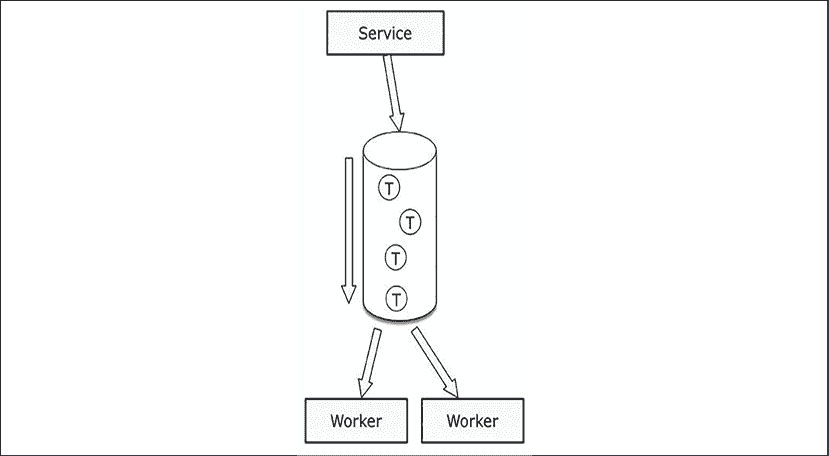
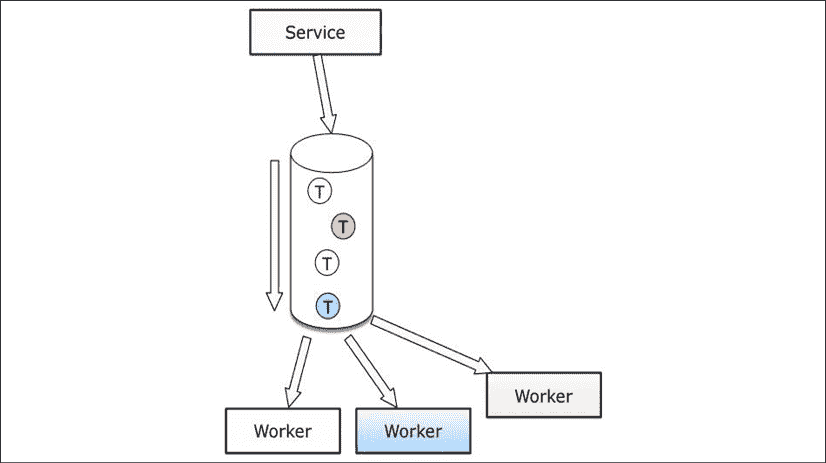

# 与其他服务交互

在上一章中，我们的单体应用被拆分为几个微服务，因此，不同部分之间的网络交互也相应增加。

与其他组件的更多交互可能导致其自身的复杂性，例如，大量消息或大数据量延迟响应，或者长时间运行的任务占用宝贵资源。由于我们许多有用的任务涉及与第三方服务的交互，因此管理这些变化的技术对我们应用程序内部和外部通信都很有用。能够使用一些异步消息松散耦合系统的不同部分，有助于防止阻塞和不受欢迎的依赖纠缠。

无论如何，底线是我们需要通过网络与其他服务进行交互，无论是同步还是异步。这些交互需要高效，当出现问题时，我们需要有一个计划。

通过增加更多的网络连接引入的另一个问题是**测试**：如何测试一个需要调用其他微服务才能正常工作的独立微服务？在本章中，我们将详细探讨这个问题：

+   如何使用同步和异步库调用另一个服务，以及如何使这些调用更加高效

+   服务如何使用消息进行异步调用，并通过事件与其他服务进行通信

+   我们还将看到一些测试具有网络依赖服务的技巧

# 调用其他网络资源

正如我们在前几章所看到的，微服务之间的同步交互可以通过使用 JSON 有效载荷的 HTTP API 来实现。这无疑是使用最频繁的模式，因为 HTTP 和 JSON 都是常见的标准。如果你的网络服务实现了接受 JSON 的 HTTP API，任何使用任何编程语言的开发者都将能够使用它。大多数这些接口也是 RESTful 的，这意味着它们遵循**表示状态转移**（**REST**）架构原则，即无状态——每个交互都包含所需的所有信息，而不是依赖于之前的交换——以及可缓存和具有良好定义的接口。

虽然遵循 RESTful 方案不是强制性的，但一些项目实现了**远程过程调用**（**RPC**）API，这些 API 专注于正在执行的操作，并从处理消息的代码中抽象出网络请求。在 REST 中，重点是资源，操作由 HTTP 方法定义。一些项目是两者的混合，并不严格遵循某个特定标准。最重要的是，你的服务行为应该是连贯且文档齐全的。本书倾向于使用 REST 而不是 RPC，但并不严格，并认识到不同情况有不同的解决方案。

发送和接收 JSON 有效负载是微服务与其他服务交互的最简单方式，只需要微服务知道入口点和通过 HTTP 请求传递的参数。

要做到这一点，你只需要使用一个 HTTP 客户端。Python 在 `http.client` 模块中提供了一个，在同步 Python 环境中，`Requests` 库非常受欢迎：[`docs.python-requests.org`](https://docs.python-requests.org)。

由于我们处于异步环境中，我们将使用 `aiohttp`，它有一个创建异步 Web 请求的清晰方式，并提供了内置功能，使得执行多个同时进行的异步请求变得更容易：[`docs.aiohttp.org/en/stable/`](https://docs.aiohttp.org/en/stable/)。

`aiohttp` 库中的 HTTP 请求是围绕会话的概念构建的，最佳的使用方式是调用 `CreateSession`，创建一个每次与任何服务交互时都可以重用的 `Session` 对象。

`Session` 对象可以保存认证信息和一些你可能想要为所有请求设置的默认头信息。它还可以控制默认的错误处理行为，存储 cookies，以及使用哪些超时。在下面的示例中，对 `ClientSession` 的调用将创建一个具有正确 `Content-Type` 头部的对象：

```py
# clientsession.py
import asyncio
import aiohttp

async def make_request(url):
    headers = {
        "Content-Type": "application/json",
    }
    async with aiohttp.ClientSession(headers=headers) as session:
        async with session.get(url) as response:
            print(await response.text())

url = "http://localhost:5000/api"
loop = asyncio.get_event_loop()
loop.run_until_complete(make_request(url)) 
```

如果我们应该限制对外部端点发出的并发请求数量，有两种主要方法。`aiohttp` 有一个连接器的概念，我们可以设置选项来控制一个 `session` 一次可以操作多少个出站 TCP 连接，以及限制单个目标的数量：

```py
conn = aiohttp.TCPConnector(limit=300, limit_per_host=10)
session = aiohttp.ClientSession(connector=conn) 
```

这可能已经足够满足我们的需求；然而，如果我们为了完成一个请求而建立多个出站连接，我们可能会陷入一种情况，即每完成一项工作后，由于达到限制，下一项工作会持续阻塞。理想情况下，我们希望一个独立的工作块能够持续进行，直到完成，为此我们可以使用信号量。信号量是一个简单的令牌，它允许代码执行任务。如果我们添加一个有三个槽位的信号量，那么前三个尝试访问信号量的任务将各自占用一个槽位并继续执行。任何其他请求信号量的任务都必须等待直到其中一个槽位空闲。

由于请求信号量最常见的方式是在 `with` 块内部，这意味着一旦 `with` 块的上下文结束，信号量就会被释放——在信号量对象的 `__exit__` 函数内部：

```py
# clientsession_list.py
import asyncio
import aiohttp
async def make_request(url, session, semaphore):
    async with semaphore, session.get(url) as response:
        print(f"Fetching {url}")
        await asyncio.sleep(1)  # Pretend there is real work happening
        return await response.text()
async def organise_requests(url_list):
    semaphore = asyncio.Semaphore(3)
    tasks = list()
    async with aiohttp.ClientSession() as session:
        for url in url_list:
            tasks.append(make_request(url, session, semaphore))
        await asyncio.gather(*tasks)

urls = [
    "https://www.google.com",
    "https://developer.mozilla.org/en-US/",
    "https://www.packtpub.com/",
    "https://aws.amazon.com/",
]
loop = asyncio.get_event_loop()
loop.run_until_complete(organise_requests(urls)) 
```

让我们看看我们如何在需要与其他服务交互的 Quart 应用程序中泛化这种模式。

这种简单的实现基于一切都会顺利进行的假设，但现实生活很少如此简单。我们可以在 `ClientSession` 中设置不同的错误处理选项，如重试和超时，我们只需要在那个地方设置即可。

# 寻找去往何方

当我们向一个服务发出 Web 请求时，我们需要知道要使用哪个**统一资源定位符**（**URL**）。本书中的大多数示例都使用硬编码的 URL——也就是说，它们被写入源代码。这对于示例来说很方便，易于阅读，但在维护软件时可能会出现问题。当服务获得新的 URI，其主机名或 IP 地址发生变化时会发生什么？它可能会因为故障而在 AWS 区域之间移动，或者从 Google Cloud Platform 迁移到 Microsoft Azure。即使主机名或 IP 地址没有更新，API 更新也可能使资源路径发生变化。

我们希望将有关要使用的 URL 作为配置的数据传递给我们的应用程序。有几种选项可以管理更多的配置选项，而无需直接将它们添加到代码中，例如环境变量和服务发现。

## 环境变量

基于容器的环境现在很常见，我们将在第十章“在 AWS 上部署”中更详细地讨论它们。将配置选项传递到容器中最常见的方法是向容器传递一些环境变量。这有一个优点，即简单直接，因为代码在处理其配置时只需要检查环境：

```py
import os
def create_app(name=__name__, blueprints=None, settings=None):
    app = Quart(name)
    app.config["REMOTE_URL"] = os.environ.get("OTHER_SERVICE_URL", "https://default.url/here") 
```

这种方法的缺点是，如果 URL 发生变化，那么我们需要重新启动应用程序，有时甚至需要使用新环境重新部署它。如果你不期望配置经常改变，由于它们的简单性，环境变量仍然是一个好主意，尽管我们必须小心不要在记录消息时记录任何包含在环境变量中的秘密。

## 服务发现

但如果我们部署服务时不需要告诉它所有选项怎么办？服务发现是一种涉及仅用少量信息配置应用程序的方法：在哪里请求配置以及如何识别正确的提问方式。

例如，`etcd`（[`etcd.io/`](https://etcd.io/)）等服务提供了一个可靠的关键值存储，用于保存这些配置数据。例如，让我们使用`etcd`来存储生产环境和开发环境 RabbitMQ 实例的 URL：

```py
$ etcdctl put myservice/production/rabbitmq/url https://my.rabbitmq.url/
OK
$ etcdctl get myservice/production/rabbitmq/url
myservice/production/rabbitmq/url
https://my.rabbitmq.url/ 
```

当应用程序启动时，它可以检查它是否在生产环境中运行或在本地开发环境中运行，并请求`etcd`的正确值——无论是`myservice/production/rabbitmq/url`还是`myservice/development/rabbitmq/url`。在部署中有一个单一选项，可以更改大量配置选项，使用不同的外部 URL，绑定到不同的端口，或你可能想到的任何其他配置。

还可以更新`etcd`中的值，当你的应用程序下次检查新值时，它将更新并使用该值。现在可以在旧版本旁边部署`RabbitMQ`的新版本，交换将是`etcd`中的值变化——或者如果出错，将是一个回退变化。

这种方法确实增加了复杂性，既作为额外服务运行，也涉及到在您的应用程序中更新这些值，但在更动态的环境中，这可以是一种有价值的方法。我们将在第十章*部署在 AWS*中更详细地讨论服务发现，当我们介绍在容器和云中部署应用程序时。

# 数据传输

JSON 是一种可读的数据格式。互联网上有着悠久的人可读数据传输历史——一个很好的例子是电子邮件，因为你可以很愉快地以人类作者的身份键入发送电子邮件所需的协议。这种可读性对于确定代码及其连接中正在发生的事情非常有用，尤其是因为 JSON 直接映射到 Python 数据结构。

这种可读性的缺点是数据的大小。长期来看，发送带有 JSON 有效负载的 HTTP 请求和响应可能会增加一些带宽开销，而且将 Python 对象序列化为 JSON 结构以及反序列化也会增加一些 CPU 开销。

然而，还有其他涉及缓存、压缩、二进制有效负载或 RPC 的数据传输方式。

## HTTP 缓存头部

在 HTTP 协议中，有一些缓存机制可以用来向客户端指示它试图获取的页面自上次访问以来没有变化。缓存是我们可以在我们的微服务中的所有只读 API 端点上执行的操作，例如`GETs`和`HEADs`。

实现它的最简单方法是在响应中返回结果的同时，返回一个 ETag 头部。`ETag`值是一个字符串，可以被认为是客户端试图获取的资源的一个版本。它可以是时间戳、增量版本或哈希。由服务器决定在其中放置什么，但理念是它应该对响应值是唯一的。

与网络浏览器类似，当客户端获取包含此类头部的响应时，它可以构建一个本地字典缓存，将响应体和`ETags`作为其值存储，将 URL 作为其键。

当发起一个新的请求时，客户端可以查看其本地缓存，并在`If-Modified-Since`头部中传递一个存储的`ETag`值。如果服务器返回`304`状态码，这意味着响应没有变化，客户端可以使用之前存储的那个。

这种机制可以大大减少服务器的响应时间，因为它可以在内容没有变化时立即返回一个空的`304`响应。如果内容已更改，客户端将以通常的方式收到完整消息。

当然，这意味着你调用的服务应该通过添加适当的`ETag`支持来实现这种缓存行为。由于缓存逻辑取决于你服务管理的数据的性质，因此不可能实现一个通用的解决方案。一般规则是，为每个资源进行版本控制，并在数据更改时更改该版本。在下面的示例中，Quart 应用使用当前服务器时间来创建与用户条目关联的`ETag`值。`ETag`值是自纪元以来的当前时间，以毫秒为单位，并存储在修改字段中。

`get_user()`方法从`_USERS`返回一个用户条目，并使用`response.set_etag`设置`ETag`值。当视图接收到一些调用时，它也会查找`If-None-Match`头，将其与用户的修改字段进行比较，如果匹配则返回`304`响应：

```py
# quart_etag.py
from datetime import datetime
from quart import Quart, Response, abort, jsonify, request
app = Quart(__name__)
def _time2etag():
    return datetime.now().isoformat()
_USERS = {"1": {"name": "Simon", "modified": _time2etag()}}
@app.route("/api/user/<user_id>")
async def get_user(user_id):
    if user_id not in _USERS:
        return abort(404)
    user = _USERS[user_id]
    # returning 304 if If-None-Match matches
    if user["modified"] in request.if_none_match:
        return Response("Not modified", status=304)
    resp = jsonify(user)
    # setting the ETag
    resp.set_etag(user["modified"])
    return resp
if __name__ == "__main__":
    app.run() 
```

`change_user()`视图在客户端修改用户时设置一个新的修改值。在以下客户端会话中，我们正在更改用户，同时确保在提供新的`ETag`值时获得`304`响应：

```py
$ curl -v http://127.0.0.1:5000/api/user/1
*   Trying 127.0.0.1...
...
< HTTP/1.1 200
< content-type: application/json
< content-length: 56
< etag: "2021-06-29T21:32:25.685907"
< date: Tue, 29 Jun 2021 20:32:30 GMT
< server: hypercorn-h11
<
* Connection #0 to host 127.0.0.1 left intact
{"modified":"2021-06-29T21:32:25.685907","name":"Simon"}
 $ curl -v -H 'If-None-Match: 2021-06-29T21:32:25.685907' http://127.0.0.1:5000/api/user/1
...
< HTTP/1.1 304
... 
```

这个演示是一个玩具实现，可能在生产环境中工作得不好；依赖于服务器时钟来存储`ETag`值意味着你确信时钟永远不会倒退，并且如果你有多个服务器，它们的时钟都通过一个服务（如 ntpdate）与该服务同步。

如果两个请求在相同毫秒内更改相同的条目，也存在竞争条件的问题。根据你的应用，这可能不是问题，但如果它是，那么它可能是一个大问题。一个更干净的选择是让数据库系统直接处理修改字段，并确保其更改是在序列化事务中完成的。使用`POST`请求发送`ETag`也是防止并发更新之间竞争的好预防措施——服务器可以使用`ETag`来验证客户端想要更新的数据版本，如果该版本不匹配，那么更新数据可能是不安全的，因为其他人可能已经先更改了它。

一些开发者使用哈希函数来计算他们的`ETag`值，因为在分布式架构中计算简单，而且不会引入时间戳可能带来的任何问题。但是计算哈希值需要 CPU 成本，这意味着你需要拉取整个条目来执行它——所以它可能和发送实际数据一样慢。话虽如此，如果你在数据库中有一个用于所有哈希值的专用表，你可能会想出一个解决方案，使得你的`304`响应在返回时更快。

正如我们之前所说的，没有通用的解决方案来实现高效的 HTTP 缓存逻辑——但如果你的客户端在你的服务上做了很多读取操作，那么实现一个缓存机制是值得的。当你别无选择，只能发送一些数据时，有几种方法可以使它尽可能高效，我们将在下一节中看到。

## GZIP 压缩

压缩是一个总称，指的是以这种方式减小数据的大小，以便可以恢复原始数据。有许多不同的压缩算法——其中一些是通用算法，可以在任何类型的数据上使用，而另一些则是针对特定数据格式进行优化的，由于它们对数据的结构做出了假设，因此可以实现非常好的结果。

在压缩数据的大小、压缩和解压缩的速度以及压缩算法的普及程度之间需要做出权衡。如果大部分时间数据被存储，那么花几分钟压缩一个大的数据文件可能是可以接受的，因为节省的空间超过了访问时间所付出的代价，但对于短暂存在或经常访问的数据，压缩和解压缩的开销则更为重要。就我们的目的而言，我们需要一个在不同环境中被广泛理解的压缩算法，即使它并不总是实现最小的最终结果。

GZIP 压缩几乎在所有系统中都可用，并且像 Apache 或 nginx 这样的 Web 服务器为通过它们的响应提供了原生支持，这比在 Python 级别实现自己的临时压缩要好得多。重要的是要记住，虽然这会节省网络带宽，但它会使用更多的 CPU，因此通过激活指标收集进行实验将让我们看到结果——并决定这个选项是否是一个好主意。

例如，这个 nginx 配置将启用端口`5000`上 Quart 应用程序产生的任何响应的 GZIP 压缩，内容类型为`application/json`：

```py
http { 
    gzip  on; 
    gzip_types application/json; 
    gzip_proxied      any; 
    gzip_vary on; 
    server { 
        listen       80; 
        server_name  localhost; 

        location / {  
            proxy_pass http://localhost:5000; 
        } 
    } 
```

从客户端来看，向`localhost:8080`上的 nginx 服务器发送 HTTP 请求，通过带有`Accept-Encoding: gzip`头的代理为`localhost:5000`上的应用程序触发压缩：

```py
$ curl http://localhost:8080/api -H "Accept-Encoding: gzip" 
<some binary output> 
```

在 Python 中，使用`aiohttp`和`requests`库发出的请求将自动解压缩 GZIP 编码的响应，因此当你的服务调用另一个服务时，你不必担心这一点。

解压缩数据会增加一些处理，但 Python 的 GZIP 模块依赖于`zlib`（`http://www.zlib.net/`），它非常快。为了接受压缩的 HTTP 查询响应，我们只需要添加一个头信息，表明我们可以处理 GZIP 编码的响应：

```py
import asyncio
import aiohttp
async def make_request():
    url = "http://127.0.0.1:5000/api"
    headers = {
        "Accept-Encoding": "gzip",
    }
    async with aiohttp.ClientSession(headers=headers) as session:
        async with session.get(url) as response:
            print(await response.text())
loop = asyncio.get_event_loop()
loop.run_until_complete(make_request()) 
```

要压缩发送到服务器的数据，你可以使用`gzip`模块并指定一个`Content-Encoding`头信息：

```py
import asyncio
import gzip
import json
import aiohttp
async def make_request():
    url = "http://127.0.0.1:8080/api_post"
    headers = {
        "Content-Encoding": "gzip",
    }
    data = {"Hello": "World!", "result": "OK"}
    data = bytes(json.dumps(data), "utf8")
    data = gzip.compress(data)
    async with aiohttp.ClientSession(headers=headers) as session:
        async with session.post(url, data=data) as response:
            print(await response.text())
loop = asyncio.get_event_loop()
loop.run_until_complete(make_request()) 
```

然而，在这种情况下，你将在 Quart 应用程序中获得压缩内容，你需要在 Python 代码中对其进行解压缩，或者如果你使用的是处理传入 Web 连接的 nginx 代理，nginx 可以为你解压缩请求。我们将在第十章“在 AWS 上部署”中更详细地讨论 nginx。总结来说，使用 nginx 为所有服务响应设置 GZIP 压缩是一个低成本的更改，你的 Python 客户端可以通过设置正确的头信息从中受益。然而，发送压缩数据要复杂一些，因为这项工作并不是为你完成的——但它可能对大量数据传输仍然有益。

如果你想要进一步减小 HTTP 请求/响应负载的大小，另一个选项是将从 JSON 切换到二进制负载。这样，你就不必处理压缩，处理数据可能更快，但消息大小的减少并不那么显著。

## 协议缓冲区

虽然通常情况下并不相关，但如果你的微服务处理大量数据，使用替代格式可以是一个吸引人的选项，以提高性能，并减少所需的网络带宽，而无需使用额外的处理能力和时间来压缩和解压缩数据。两种广泛使用的二进制格式是**协议缓冲区**（**protobuf**）([`developers.google.com/protocol-buffers`](https://developers.google.com/protocol-buffers))和**MessagePack**。

协议缓冲区要求你描述正在交换的数据，以便将其索引到某个将用于索引二进制内容的模式中。这些模式增加了一些工作量，因为所有传输的数据都需要在模式中描述，你将需要学习一种新的**领域特定语言**（**DSL**）。在像 Rust、C++或 Go 这样的类型语言中，定义这些结构已经是必须完成的任务，因此开销要小得多。

然而，其优势在于消息定义良好，在网络对话的任一端尝试使用信息之前，可以轻松验证。还可能为各种语言生成代码，包括 Python，让你以更适合所用语言的方式构造数据。以下示例取自 protobuf 文档：

```py
syntax = "proto2";
package tutorial; 
message Person { 
  required string name = 1; 
  required int32 id = 2; 
  optional string email = 3; 
  enum PhoneType { 
    MOBILE = 0; 
    HOME = 1; 
    WORK = 2; 
  } 
  message PhoneNumber { 
    required string number = 1; 
    optional PhoneType type = 2 [default = HOME]; 
  } 
  repeated PhoneNumber phones = 4; 
} 
message AddressBook { 
  repeated Person people = 1; 
} 
```

该模式并不非常符合 Python 风格，因为它旨在支持多种语言和环境。如果你与静态类型语言交互或希望有一个功能为你对数据进行基本语法检查，那么这样的定义可能很有帮助。

使用 gRPC 框架（[`grpc.io/`](https://grpc.io/))与协议缓冲区结合可以抽象出你的应用程序的网络交互，并为客户端提供一个 Python 中的函数调用，几乎不需要考虑它如何生成返回值。

## MessagePack

与 Protocol Buffers 不同，MessagePack ([`msgpack.org/`](http://msgpack.org/))是无模式的，只需调用一个函数就可以序列化你的数据。它是 JSON 的简单替代品，并在大多数语言中有实现。`msgpack` Python 库（使用`pip install` `msgpack-python`命令安装）提供了与 JSON 相同级别的集成：

```py
>>> import msgpack
>>> data = {"this": "is", "some": "data"}
>>> msgpack.packb(data, use_bin_type=True)
b'\x82\xa4this\xa2is\xa4some\xa4data'
>>> msgpack.unpackb(msgpack.packb(data, use_bin_type=True))
{'this': 'is', 'some': 'data'} 
```

与 protobuf 相比，使用 MessagePack 很简单，但哪个更快，提供最佳的压缩比率，很大程度上取决于你的数据。在少数情况下，纯 JSON 可能比二进制格式序列化得更快。

在压缩方面，你可以期望使用 MessagePack 有 10%到 20%的压缩率，但如果你的 JSON 包含大量字符串——这在微服务中很常见——GZIP 将表现得更好。

在以下示例中，一个包含大量字符串的 48 KB 的巨大 JSON 有效负载被使用 MessagePack 和 JSON 进行转换，然后在两种情况下都进行了 GZIP 压缩：

```py
>>> sys.getsizeof(json.dumps(data))
35602
>>> sys.getsizeof(msgpack.packb(data))
30777
>>> sys.getsizeof(gzip.compress(bytes(json.dumps(data), 'utf8')))
3138
>>> sys.getsizeof(gzip.compress(msgpack.packb(data)))
3174 
```

使用 MessagePack 可以将有效负载的大小减少大约 14%，但 GZIP 将 JSON 和 MessagePack 有效负载的大小减少到原来的 1/11！

很明显，无论你使用什么格式，最佳方式是使用 GZIP 来减少有效负载大小——如果你的 Web 服务器不处理解压缩，那么在 Python 中通过`gzip.uncompress()`进行解压缩是直接的。

消息序列化通常只支持基本数据类型，因为它们必须对源和目标环境中的环境保持无知。这意味着它们不能编码在 Python 中可能常用的数据，例如使用`datetime`对象表示时间。虽然其他语言有日期和时间表示，但它们的方式并不相同，因此像这样的数据和其他 Python 对象需要转换为其他平台可以理解的可序列化形式。对于日期和时间，常见的选项包括表示纪元时间的整数（自 1970 年 1 月 1 日起的秒数）或 ISO8601 格式的字符串，例如 2021-03-01T13:31:03+00:00。

在任何情况下，在一个以 JSON 为最接受标准的微服务世界中，处理日期只是坚持一个普遍采用的标准的小烦恼。

除非所有你的服务都在 Python 中并且具有明确的结构，并且你需要尽可能快地加快序列化步骤，否则坚持使用 JSON 可能更简单。

## 整合起来

在继续之前，我们将快速回顾一下到目前为止我们已经覆盖了什么：

+   实现 HTTP 缓存头是一个加快对数据重复请求的好方法。

+   GZIP 压缩是一种有效的方法来减少请求和响应的大小，并且很容易设置

+   二进制协议是纯 JSON 的有吸引力的替代品，但这取决于具体情况

下一节将重点介绍异步调用；你的微服务可以做的所有超出请求/响应模式的事情。

# 异步消息

在微服务架构中，当原本在一个单一应用程序中执行的过程现在涉及到多个微服务时，异步调用扮演着基本角色。我们在上一章中简要提到了这一点，通过我们对 Jeeves 应用程序的更改，现在它通过异步消息队列与其工作进程进行通信。为了充分利用这些工具，我们将更深入地研究这些工具。

异步调用可以像微服务应用程序中的一个单独的线程或进程那样简单，它接收一些要执行的工作，并在不干扰同时发生的 HTTP 请求/响应往返过程中执行它。

但直接从同一个 Python 进程中做所有事情并不是非常健壮。如果进程崩溃并重新启动会发生什么？如果它们是这样构建的，我们如何扩展后台任务？

发送一条被另一个程序接收的消息要可靠得多，让微服务专注于其核心目标，即向客户端提供服务。如果一个网络请求不需要立即回答，那么我们服务中的一个端点可以成为接受 HTTP 请求、处理它并将其传递出去的代码，而其对客户端的响应现在是我们的服务是否已成功接收请求，而不是请求是否已被处理。

在上一章中，我们探讨了如何使用 Celery 来构建一个从类似 RabbitMQ 的消息代理那里获取一些工作的微服务。在那个设计中，Celery 工作进程会阻塞——也就是说，它在等待新消息添加到 RabbitMQ 队列时会停止操作。

## 消息队列可靠性

与任何分布式系统一样，在可靠性和一致性方面都需要考虑。理想情况下，我们希望将一条消息添加到队列中，并确保它被准确无误地投递并执行——恰好一次。在实践中，在分布式系统中几乎不可能实现这一点，因为组件可能会失败，经历高延迟或数据包丢失，同时发生各种复杂的交互。

我们有两个实际的选择，这些选择编码在 RabbitMQ 的投递策略中：“最多一次”和“至少一次”。

一种最多一次投递消息的策略不会考虑消息投递系统中的任何不可靠性或工作进程中的失败。一旦工作进程接受了一条消息，那就结束了：消息队列会忘记它。如果工作进程随后发生故障并且没有完成分配给它的任务部分，这是整个系统需要应对的问题。

有一个承诺至少发送一次消息，在出现任何失败的情况下，交付将再次尝试，直到工作者接受消息并确认它已采取行动。这确保了不会丢失任何数据，但这确实意味着在某些情况下，消息可以发送给多个工作者，因此某种**全局唯一标识符**（**UUID**）是一个好主意，这样虽然一些工作可能会重复，但在写入任何数据库或存储时可以进行去重。关于分布式系统可靠性和像 PAXOS 这样的共识协议的更广泛讨论将需要一本自己的书。

## 基本队列

Celery 工作者使用的模式是推拉任务队列。一个服务将消息推入特定的队列，一些工作者从另一端取走它们并对其执行操作。每个任务都只去一个工作者。考虑以下图示，如*图 6.1*所示。



图 6.1：任务通过消息队列传递

没有双向通信——发送者只是在队列中存入一条消息然后离开。下一个可用的工作者获取下一条消息。当你想要执行一些异步并行任务时，这种盲目单向的消息传递是完美的，这使得它很容易进行扩展。

此外，一旦发送者确认消息已添加到代理，我们就可以让消息代理，如 RabbitMQ，提供一些消息持久化。换句话说，如果所有工作者都离线，我们不会丢失队列中的消息。

## 主题交换机和队列

主题是一种过滤和分类通过队列传输的消息的方式。当使用主题时，每条消息都会附带一个额外的标签，有助于识别其类型，我们的工作者可以订阅特定的主题或匹配多个主题的模式。

让我们设想一个场景，我们正在将移动应用到 Android Play 商店和 Apple App 商店发布。当我们的自动化任务完成 Android 应用的构建后，我们可以发送一个带有路由键`publish.playstore`的消息，这样 RabbitMQ 就可以将这条消息路由到正确的主题。路由键和主题之间有区别的原因是主题可以匹配模式。能够将文件发布到 Play Store 的工作者可以订阅`publish.playstore`主题，并从这些消息中获取其工作量，但我们也可以有一个匹配`publish.*`的消息队列和一个工作者，每当有内容即将上传到 Play Store、App Store 或其他可能发布软件的地方时，它会发送通知。

在我们的微服务中，这意味着我们可以拥有专门的工作者，它们都注册到同一个消息代理，并获取添加到其中的消息的子集。



图 6.2：不同类型的任务通过消息队列传递

这种行为在大多数消息队列服务中都有，形式略有不同。让我们看看如何在 RabbitMQ 中设置这个。

要安装**RabbitMQ**代理，你可以查看[`www.rabbitmq.com/download.html`](http://www.rabbitmq.com/download.html)的下载页面。

运行容器应该足以进行任何本地实验。RabbitMQ 实现了**高级消息队列协议**（**AMQP**）。该协议由一个合作工作的公司团体开发多年，描述在[`www.amqp.org/`](http://www.amqp.org/)。

AMQP 组织成三个概念：队列、交换机和绑定：

+   队列是一个持有消息并等待消费者取走的接收者

+   交换机是发布者向系统中添加新消息的入口点

+   绑定定义了消息如何从交换机路由到队列

对于我们的主题队列，我们需要设置一个交换机，这样 RabbitMQ 才能接受新消息，以及所有我们希望工作者从中选择消息的队列。在这两个端点之间，我们希望根据主题使用绑定将消息路由到不同的队列。

让我们看看我们如何设置之前提到的应用发布示例。我们将假设我们有两个工作者：一个发布 Android 应用，另一个发送通知，例如更新网站或发送电子邮件。使用与 RabbitMQ 一起安装的`rabbitmqadmin`命令行，我们可以创建所有必要的部分。如果管理命令没有安装，你可以在[`www.rabbitmq.com/management-cli.html`](https://www.rabbitmq.com/management-cli.html)找到安装说明：

```py
$ rabbitmqadmin declare exchange name=incoming type=topic 
exchange declared 

$ rabbitmqadmin declare queue name=playstore 
queue declared 

$ rabbitmqadmin declare queue name=notifications
queue declared 

$ rabbitmqadmin declare binding source="incoming" destination_type="queue" destination="playstore" routing_key="publish.playstore" 
binding declared 

$ rabbitmqadmin declare binding source="incoming" destination_type="queue" destination="notifications" routing_key="publish.*" 
binding declared 
```

在这个配置中，每当有消息发送到 RabbitMQ——如果主题以`publish`开头——它将被发送到通知队列；如果是`publish.playstore`，那么它将同时进入通知和 playstore 队列。任何其他主题都将导致消息被丢弃。

要在代码中与 RabbitMQ 交互，我们可以使用**Pika**。这是一个 Python RPC 客户端，它实现了 Rabbit 服务发布的所有 RPC 端点：[`pika.readthedocs.io`](https://pika.readthedocs.io)。

我们使用 Pika 做的所有事情都可以使用`rabbitmqadmin`在命令行上完成。你可以直接获取系统所有部分的状态，发送和接收消息，并检查队列中的内容。这是实验你的消息设置的一个极好方式。

以下脚本展示了如何在 RabbitMQ 的入站交换机中发布两条消息。一条是关于新应用发布的，另一条是关于通讯稿的：

```py
from pika import BlockingConnection, BasicProperties
# assuming there's a working local RabbitMQ server with a working # guest/guest account
def message(topic, message):
    connection = BlockingConnection()
    try:
        channel = connection.channel()
        props = BasicProperties(content_type="text/plain", delivery_mode=1)
        channel.basic_publish("incoming", topic, message, props)
    finally:
        connection.close()
message("publish.playstore", "We are publishing an Android App!")
message("publish.newsletter", "We are publishing a newsletter!") 
```

这些 RPC 调用将为每个入站主题交换机添加一条消息。对于第一条消息，交换机将为`playstore`队列添加一条消息，对于第二条，将添加两条消息——每条消息到一个队列。一个等待需要发布到 Play Store 的工作的工作者脚本可能看起来像这样：

```py
import pika
def on_message(channel, method_frame, header_frame, body):
    print(f"Now publishing to the play store: {body}!")
    channel.basic_ack(delivery_tag=method_frame.delivery_tag)
connection = pika.BlockingConnection()
channel = connection.channel()
channel.basic_consume("playstore", on_message)
try:
    channel.start_consuming()
except KeyboardInterrupt:
    channel.stop_consuming()
connection.close() 
```

注意，Pika 会将一个 ACK 发送回 RabbitMQ 关于该消息，因此一旦工人成功处理，就可以安全地从队列中移除。这是至少一次消息传递策略。`notifications`接收器除了它订阅的队列和它对消息体的处理外，可以相同：

```py
$ python ./playstore_receiver.py
Now publishing to the play store: b'We are publishing an Android App!'!
$ python ./publish_receiver.py
We have some news! b'We are publishing an Android App!'!
We have some news! b'We are publishing a newsletter!'! 
```

AMQP 提供了许多可以调查的消息交换模式。教程页面有许多示例，它们都是使用 Python 和 Pika 实现的：[`www.rabbitmq.com/getstarted.html`](http://www.rabbitmq.com/getstarted.html)。

要将以下示例集成到我们的微服务中，发布阶段是直接的。您的 Quart 应用程序可以使用`pika.BlockingConnection`创建到 RabbitMQ 的连接并通过它发送消息。例如，pika-pool ([`github.com/bninja/pika-pool`](https://github.com/bninja/pika-pool))实现了简单的连接池，这样您就可以在发送 RPC 时无需每次都连接/断开 RabbitMQ 通道。

另一方面，消费者更难集成到微服务中。Pika 可以嵌入到与 Quart 应用程序在同一进程中运行的事件循环中，并在接收到消息时触发一个函数。它将仅仅是进入相同代码的另一个入口点，如果需要，也可以与 RESTful API 并行运行。

## 发布/订阅

之前的模式有处理特定消息主题的工人，工人消费的消息将完全从队列中消失。我们甚至添加了代码来确认消息已被消费。

然而，当你想要将消息发布到多个工人时，必须使用**发布/订阅**（**pubsub**）模式。

这种模式是构建通用事件系统的基础，其实现方式与之前完全相同，其中有一个交换机和几个队列。区别在于交换部分具有扇出类型。

在这种设置中，每个绑定到扇出交换机的队列都将接收到相同的信息。如果有必要，通过 pubsub 可以广播消息到所有的微服务。

## 整合

在本节中，我们介绍了以下关于异步消息传递的内容：

+   每当微服务可以执行一些非阻塞工作的时候，都应该使用非阻塞调用。如果你所做的工作在响应中没有被利用，就没有理由阻塞请求。

+   服务到服务的通信并不总是限于任务队列。

+   通过消息队列发送事件是防止组件紧密耦合的好方法。

+   我们可以在一个代理（如 RabbitMQ）周围构建一个完整的事件系统，使我们的微服务通过消息相互交互。

+   可以使用 RabbitMQ 来协调所有消息传递，使用 Pika 发送消息。

# 测试

如我们在*第三章*中学习的，*编码、测试和文档：良性循环*，为调用其他服务的服务编写功能测试时最大的挑战是隔离所有网络调用。在本节中，我们将看到如何模拟使用`aiohttp`进行的异步调用。

测试`aiohttp`及其出站 Web 请求需要与传统同步测试不同的方法。`aioresponses`项目 ([`github.com/pnuckowski/aioresponses`](https://github.com/pnuckowski/aioresponses))允许您轻松创建使用`aiohttp` `ClientSession`进行的 Web 请求的模拟响应：

```py
# test_aiohttp_fixture.py
import asyncio
import aiohttp
import pytest
from aioresponses import aioresponses
@pytest.fixture
def mock_aioresponse():
    with aioresponses() as m:
        yield m
@pytest.mark.asyncio
async def test_ctx(mock_aioresponse):
    async with aiohttp.ClientSession() as session:
        mock_aioresponse.get("http://test.example.com", payload={"foo": "bar"})
        resp = await session.get("http://test.example.com")
        data = await resp.json()
    assert {"foo": "bar"} == data 
```

在这个例子中，我们告诉`aioresponses`，对`http://test.example.com`发出的任何 GET 请求都应该返回我们指定的数据。这样我们就可以轻松地为多个 URL 提供模拟响应，甚至可以通过多次调用`mocked.get`为同一端点创建多个响应。

如果您使用 Requests 执行所有调用——或者您使用的是基于 Requests 的库，并且没有对其进行太多定制——由于`requests-mock`项目 ([`requests-mock.readthedocs.io`](https://requests-mock.readthedocs.io))，这项隔离工作也变得容易进行，该项目以类似的方式实现了模拟调用，并可能启发了`aioresponses`。

话虽如此，模拟其他服务的响应仍然是一项相当多的工作，并且可能难以维护。这意味着需要关注其他服务随时间的发展，以确保您的测试不是基于不再反映真实 API 的模拟。

鼓励使用模拟来构建良好的功能测试覆盖率，但请确保您也在进行集成测试，在该测试中，服务在一个部署环境中被测试，它调用其他服务进行真实操作。

# 使用 OpenAPI

OpenAPI 规范 ([`www.openapis.org/`](https://www.openapis.org/))，之前被称为 Swagger，是描述一组 HTTP 端点、它们的使用方式以及发送和接收的数据结构的标准方式。通过使用 JSON 或 YAML 文件描述 API，它使得意图变得机器可读——这意味着有了 OpenAPI 规范，您可以使用代码生成器以您选择的语言生成客户端库，或者自动验证数据在进入或离开系统时的有效性。

OpenAPI 具有与 WSDL ([`www.w3.org/TR/2001/NOTE-wsdl-20010315`](https://www.w3.org/TR/2001/NOTE-wsdl-20010315))在 XML 网络服务时代相同的目标，但它更轻量级，更直接。

以下是一个最小的 OpenAPI 描述文件示例，它定义了一个单一的`/apis/users_ids`端点，并支持`GET`方法来检索用户 ID 列表：

```py
---
openapi: "3.0.0"
info:
  title: Data Service
  description: returns info about users
  license:
    name: APLv2
    url: https://www.apache.org/licenses/LICENSE-2.0.html
  version: 0.1.0
basePath: /api
paths:
  /user_ids:
    get:
      operationId: getUserIds
      description: Returns a list of ids
      produces:
        - application/json
      responses:
        '200':
          description: List of Ids
          schema:
            type: array
            items:
              type: integer 
```

完整的 OpenAPI 规范可以在 GitHub 上找到；它非常详细，并允许您描述有关 API、其端点和它使用的数据类型元数据：[`github.com/OAI/OpenAPI-Specification`](https://github.com/OAI/OpenAPI-Specification)。

模式部分中描述的数据类型遵循 JSON Schema 规范([`json-schema.org/latest/json-schema-core.html`](http://json-schema.org/latest/json-schema-core.html))。在这里，我们描述了 `/get_ids` 端点返回一个整数数组。

您可以在该规范中提供有关您的 API 的许多详细信息——例如，您的请求中应该包含哪些标题，或者某些响应的内容类型是什么，以及可以添加到其中的内容。

使用 OpenAPI 描述您的 HTTP 端点提供了许多优秀的机会：

+   有许多 OpenAPI 客户端可以消费您的描述并对其进行有用的操作，例如针对您的服务构建功能测试或验证发送给它的数据。

+   它为您的 API 提供了标准、语言无关的文档

+   服务器可以检查请求和响应是否符合规范

一些 Web 框架甚至使用规范来创建所有路由和 I/O 数据检查，用于您的微服务；例如，Connexion ([`github.com/zalando/connexion`](https://github.com/zalando/connexion)) 为 Flask 做了这件事。在撰写本文时，Quart 对此的支持有限，但情况总是在不断改善。因此，我们在这里的示例中不会大量使用 OpenAPI。

当人们使用 OpenAPI 构建 HTTP API 时，有两种不同的观点：

+   规范优先，即您首先创建 Swagger 规范文件，然后在它之上创建您的应用程序，使用该规范中提供的信息。这就是 Connexion 的原理。

+   规范提取，即您的代码生成 Swagger 规范文件。一些工具包会通过读取您的视图文档字符串来完成此操作，例如。

# 摘要

在本章中，我们探讨了服务如何通过使用请求会话同步地与其他服务交互，以及通过使用 Celery 工作进程或基于 RabbitMQ 的更高级的消息模式异步交互。

我们还研究了通过模拟其他服务来单独测试服务的一些方法，但不需要模拟消息代理本身。

单独测试每个服务是有用的，但当出现问题时，很难知道发生了什么，尤其是如果错误发生在一系列异步调用中。

在那种情况下，使用集中式日志系统跟踪发生的事情非常有帮助。下一章将解释我们如何配置我们的微服务以跟踪其活动。
