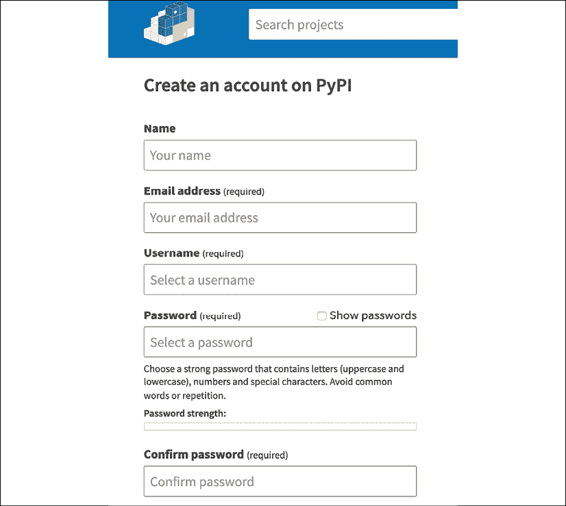

# 打包和运行 Python

当 Python 编程语言在 20 世纪 90 年代初首次发布时，Python 应用程序是通过将 Python 脚本指向解释器来运行的。与打包、发布和分发 Python 项目相关的所有事情都是手动完成的。当时没有真正的标准，每个项目都有一个长长的 README，说明了如何使用所有依赖项来安装它。

较大的项目使用系统打包工具发布他们的工作——无论是 Debian 包、为 Red Hat Linux 发行版提供的 RPM 包，还是 Windows 下的 MSI 包。最终，这些项目的 Python 模块都出现在 Python 安装的`site-packages`目录中，有时在编译阶段之后，如果它们有 C 扩展。

自那时起，Python 的打包生态系统已经发生了很大的变化。1998 年，`Distutils`被添加到标准库中，为 Python 项目提供创建可安装分发的必要支持。从那时起，社区涌现出许多新工具，以改进 Python 项目打包、发布和分发的方式。本章将解释如何使用最新的 Python 打包工具为您的微服务。

打包的另一个热门话题是如何与您日常的工作相结合。当构建基于微服务的软件时，您需要处理许多动态部分。当您在特定的微服务中工作时，您大多数时候可以使用我们在*第三章*中讨论的 TDD 和模拟方法，即*编码、测试和文档：良性循环*。

然而，如果您想进行一些实际的测试，并检查系统的所有部分，您需要整个堆栈在本地或测试云实例上运行。此外，在这种背景下开发可能会很繁琐，如果您需要不断重新安装微服务的新版本。这导致了一个特别的问题：*您如何在环境中正确安装整个堆栈并在其中开发？*

这也意味着如果您想玩转应用程序，您必须运行所有微服务。在 Jeeves 的情况下，每次需要运行应用程序时都要打开多个不同的 shell 来运行所有微服务，这不是开发者每次都需要做的事情。

在本章中，我们将探讨如何利用打包工具从同一环境中运行所有微服务，然后如何通过使用专门的进程管理器从单个**命令行界面**（**CLI**）运行它们。首先，然而，我们将探讨如何打包您的项目，以及应该使用哪些工具。

# 打包工具链

自从那些早期的打包方法以来，Python 已经走了很长的路。许多**Python 增强提案**（**PEPs**）被编写出来，以改进 Python 项目的安装、发布和分发方式。

`Distutils` 存在一些缺陷，使得发布软件变得有些繁琐。最大的痛点是其缺乏依赖关系管理和处理编译和二进制发布的方式。对于与编译相关的一切，90 年代有效的方法在十年后开始过时。核心团队没有人因为缺乏兴趣而没有使库发展，也因为 `Distutils` 足够编译 Python 和大多数项目。需要高级工具链的人使用了其他工具，如 `SCons` ([`scons.org/`](http://scons.org/))。

在任何情况下，由于基于 `Distutils` 的现有遗留系统，改进工具链都不是一项容易的任务。从头开始构建一个新的打包系统相当困难，因为 `Distutils` 是标准库的一部分，但引入向后兼容的更改也难以正确执行。改进是在其中进行的。像 `Setuptools` 和 `virtualenv` 这样的项目是在标准库之外创建的，并且一些更改是直接在 Python 中进行的。

到写作的时候，你仍然能找到这些变化的痕迹，而且仍然很难确切知道应该如何操作。例如，`pyvenv` 命令在 Python 3 的早期版本中被添加，然后在 Python 3.6 中被移除，尽管 Python 仍然附带其虚拟环境模块，尽管还有像 `virtualenv` 这样的工具来帮助使生活更轻松。

最好的选择是使用在标准库之外开发和维护的工具，因为它们的发布周期比 Python 短。换句话说，标准库中的更改需要数月才能发布，而第三方项目中的更改可以更快地提供。现在，所有被认为是事实标准打包工具链一部分的第三方项目都被归类在 **PyPA** ([`www.pypa.io`](https://www.pypa.io)) 旗下项目之下。

除了开发工具之外，`PyPA` 还致力于通过提出 Python 的 PEPs 和开发其早期规范来改进打包标准——请参阅 [`www.pypa.io/en/latest/roadmap/`](https://www.pypa.io/en/latest/roadmap/)。在打包和依赖关系管理方面，经常会有新的工具和实验，让我们无论它们是否流行都能学到新东西。对于本章，我们将坚持使用核心、众所周知的工具。

在我们开始查看应该使用的工具之前，我们需要通过几个定义来避免任何混淆。

## 几个定义

当我们谈论打包 Python 项目时，一些术语可能会让人感到困惑，因为它们的定义随着时间的推移而演变，同时也因为它们在 Python 世界之外可能意味着略有不同的事情。我们需要定义 Python 包、Python 项目、Python 库和 Python 应用程序。它们的定义如下：

+   **Python 包** 是一个包含 Python 模块的目录树。你可以导入它，它是模块命名空间的一部分。

+   **Python 项目** 可以包含多个包、模块和其他资源，是你发布的内容。你用 Flask 构建的每个微服务都是一个 Python 项目。

+   **Python 应用程序** 是一个可以直接通过用户界面使用的 Python 项目。用户界面可以是命令行脚本或网络服务器。

+   最后，**Python 库** 是一种特定的 Python 项目，它为其他 Python 项目提供功能，但没有直接面向最终用户的应用程序界面。

应用程序和库之间的区别可能相当模糊，因为有些库有时会提供一些命令行工具来使用它们的一些功能，即使最初的使用案例是为其他项目提供 Python 包。此外，有时一个曾是库的项目变成了应用程序。

为了简化流程，最佳选项是不要在应用程序和库之间做区分。唯一的区别是应用程序会附带更多的数据文件和控制台脚本。

现在我们已经定义了关于 Python 包、项目、应用程序和库的术语，让我们看看项目是如何打包的。

## 打包

当你打包你的 Python 项目时，你需要有三个标准文件与你的 Python 包一起使用：

+   `pyproject.toml`：项目构建系统的配置文件

+   `setup.py` 或 `setup.cfg`：一个特殊的模块，用于控制打包和项目的元数据

+   `requirements.txt`：一个列出依赖关系的文件

让我们逐一详细看看。

### setup.py 文件

当你想要与 Python 项目交互时，`setup.py` 文件控制着一切。当 `setup()` 函数执行时，它会生成一个遵循 `PEP 314` 格式的静态元数据文件。元数据文件包含项目的所有元数据，但你需要通过 `setup()` 调用来重新生成它，以便将其放入你正在使用的 Python 环境中。

你不能使用静态版本的原因是，一个项目的作者可能在 `setup.py` 中包含特定平台的代码，这会根据平台和 Python 版本生成不同的元数据文件。依赖于运行 Python 模块来提取关于项目的静态信息一直是一个问题。你需要确保模块中的代码可以在目标 Python 解释器中运行。如果你打算让你的微服务对社区可用，你需要记住这一点，因为安装会在许多不同的 Python 环境中发生。

在创建`setup.py`文件时，一个常见的错误是在有第三方依赖项时将其导入。如果像`pip`这样的工具尝试通过运行`setup.py`来读取元数据，它可能会在有机会列出所有要安装的依赖项之前引发导入错误。你可以在`setup.py`文件中直接导入的唯一依赖项是`Setuptools`，因为你可以假设尝试安装你的项目的任何人很可能已经在他们的环境中有了它。

另一个重要的考虑因素是你想要包含以描述你的项目的元数据。你的项目只需要一个名称、一个版本、一个 URL 和一个作者就可以工作，但显然这些信息不足以描述你的项目。元数据字段通过`setup()`参数设置。其中一些直接与元数据名称匹配，而另一些则不匹配。

以下是一组可用于你的微服务项目的有用参数：

+   `name`: 包的名称；应该是简短的小写

+   `version`: 项目的版本，如`PEP 440`中定义

+   `url`: 项目的 URL；可以是它的仓库或主页

+   `description`: 一句话来描述项目

+   `long_description`: 一个 reStructuredText 或 Markdown 文档

+   `author`和`author_email`: 作者的姓名和电子邮件地址——可以是组织

+   `license`: 项目使用的许可证（MIT、Apache2、GPL 等）

+   `classifiers`: 从固定列表中选择的分类器列表，如`PEP 301`中定义

+   `keywords`: 描述你的项目的标签——如果你将项目发布到**Python 包索引**（**PyPI**），这很有用

+   `packages`: 包含在项目中的包列表——`Setuptools`可以使用`find_packages()`方法自动填充该选项

+   `entry_points`: `Setuptools`钩子列表，如控制台脚本（这是一个`Setuptools`选项）

+   `include_package_data`: 一个简化非 Python 文件包含的标志

+   `zip_safe`: 一个标志，防止`Setuptools`将项目安装为 ZIP 文件，这是一个历史标准（可执行 egg）

如果你缺少任何关键选项，那么当你尝试使用`Setuptools`时，它将提供关于它需要的信息。以下是一个包含这些选项的`setup.py`文件的示例：

```py
 from setuptools import setup, find_packages

    with open("README.rst") as f:
        LONG_DESC = f.read()

    setup(
        name="MyProject",
        version="1.0.0",
        url="http://example.com",
        description="This is a cool microservice based on Quart.",
        long_description=LONG_DESC,
        long_description_content_type="text/x-rst",
        author="Simon",
        author_email="simon@example.com",
        license="MIT",
        classifiers=[
            "Development Status :: 3 - Alpha",
            "License :: OSI Approved :: MIT License",
            "Programming Language :: Python :: 3",
        ],
        keywords=["quart", "microservice"],
        packages=find_packages(),
        include_package_data=True,
        zip_safe=False,
        install_requires=["quart"],
    ) 
```

`long_description`选项通常从`README.rst`文件中提取，因此你不需要在函数中包含大段 reStructuredText 字符串。

`Twine`项目([`pypi.org/project/twine/`](https://pypi.org/project/twine/))——我们稍后将其用于上传包到 PyPI——有一个检查命令来确保长描述可以正确渲染。将此检查作为标准测试套件的一部分添加到**持续集成**(**CI**)是一个好主意，以确保 PyPI 上的文档可读。将描述分离出来的另一个好处是它会被大多数编辑器自动识别、解析和显示。例如，GitHub 将其用作您在仓库中的项目着陆页，同时提供一个内联的 reStructuredText 编辑器，可以直接从浏览器中更改它。PyPI 也这样做来显示项目的首页。

`license`字段是自由形式的，只要人们可以识别所使用的许可证即可。[`choosealicense.com/`](https://choosealicense.com/)提供了关于哪种开源软件许可证最适合您的公正建议，如果您计划发布源代码——您应该强烈考虑这一点，因为我们的这本书的进展和所使用的各种工具都是基于开源项目，为社区添加更多内容有助于所有相关人员。在任何情况下，您都应该在`setup.py`文件旁边添加一个包含该许可证官方文本的`LICENCE`文件。在开源项目中，现在通常还包括一个“行为准则”，例如`Contributor Covenant`：[`www.contributor-covenant.org/`](https://www.contributor-covenant.org/)。

这是因为与来自世界各地的人合作涉及许多不同的文化和期望，并且公开社区的性质是帮助每个人的另一个方面。

分类器选项可能是编写过程中最痛苦的一个。你需要使用来自[`pypi.python.org/pypi?%3Aaction=list_classifiers`](https://pypi.python.org/pypi?%3Aaction=list_classifiers)的字符串来对您的项目进行分类。开发者最常用的三个分类器是支持的 Python 版本列表、许可证（它与许可证选项重复并应匹配），以及开发状态，这是关于项目成熟度的提示。

`Trove`分类器是机器可解析的元数据，可以被与`PyPI`交互的工具使用。例如，`zc.buildout`工具寻找具有`Framework :: Buildout :: Recipe`分类器的包。有效的分类器列表可在[`pypi.org/classifiers/`](https://pypi.org/classifiers/)找到。

如果您将项目发布到 Python 包索引，关键词是一个使您的项目可见的好方法。例如，如果您正在创建一个`Quart`微服务，您应该使用“quart”和“microservice”作为关键词。

`entry_points`部分是一个类似于 INI 的字符串，它定义了通过可调用项与你的 Python 模块交互的方式——最常见的是控制台脚本。当你向该部分添加函数时，一个命令行脚本将与 Python 解释器一起安装，并通过入口点将其钩子连接。这是为你的项目创建 CLI 的好方法。在示例中，当项目安装时，`mycli`应该在 shell 中直接可达。最后，`install_requires`列出了所有依赖项。它是一个项目使用的 Python 项目列表，当发生安装时，`pip`等工具可以使用它。如果它们在 PyPI 上发布，工具将抓取它们并安装。还可能从我们将要讨论的下一个文件`requirements.txt`中读取依赖项，以及从单独的文本文件或 JSON 文件中读取版本，以便在需要时在多个地方轻松使用版本。由于 JSON 模块是标准库的一部分，因此导入它不会添加额外的依赖项。

一旦创建了`setup.py`文件，尝试它的一个好方法是创建一个本地虚拟环境。

假设你已经安装了`virtualenv`，并且你在包含`setup.py`文件的目录中运行这些命令，它将创建几个目录，包括一个包含本地 Python 解释器的`bin`目录，并将你放入本地 shell 中：

```py
$ python3 –m venv ./my-project-venv 
$ source ./my-project-venv/bin/activate 
(my-project-venv) $ 
```

有几个辅助工具可以使管理你的虚拟环境更容易，例如`virtualenvwrapper`([`virtualenvwrapper.readthedocs.io/en/latest/`](https://virtualenvwrapper.readthedocs.io/en/latest/))，但我们将通过我们的示例保持核心功能。

从这里，运行`pip install -e command`将以可编辑模式安装项目。此命令通过读取其设置文件来安装项目，但与`install`不同，安装是就地发生的。就地安装意味着你将能够直接在项目中的 Python 模块上工作，并且它们将通过其`site-packages`目录链接到本地 Python 安装。

使用常规的`install`调用会在本地的`site-packages`目录中创建文件的副本，而更改源代码对已安装版本没有任何影响。

pip 调用还会生成一个`MyProject.egg-info`目录，其中包含元数据。pip 在`PKG-INFO`名称下生成元数据规范的版本 1.1：

```py
$ more MyProject.egg-info/PKG-INFO
Metadata-Version: 2.1
Name: MyProject
Version: 1.0.0
Summary: This is a cool microservice based on Quart.
Home-page: http://example.com
Author: Simon
Author-email: simon@example.com
License: MIT
Description: long description!

Keywords: quart,microservice
Platform: UNKNOWN
Classifier: Development Status :: 3 - Alpha
Classifier: License :: OSI Approved :: MIT License
Classifier: Programming Language :: Python :: 3
Description-Content-Type: text/x-rst 
```

这个元数据文件是用来描述你的项目的，并且用于通过其他命令将其注册到 PyPI，正如我们在本章后面将要看到的。

pip 调用也会通过在 PyPI 上查找它们来拉取所有项目依赖项，并将它们安装在本地的`site-packages`中。运行此命令是确保一切按预期工作的好方法。

### `requirements.txt`文件

从 pip 社区中产生的一个标准是使用 `requirements.txt` 文件，该文件列出了所有项目依赖项，同时也提出了一种扩展语法来安装可编辑的依赖项。请参阅 [`pip.pypa.io/en/stable/cli/pip_install/#requirements-file-format`](https://pip.pypa.io/en/stable/cli/pip_install/#requirements-file-format)。

以下是一个此类文件的示例：

```py
arrow 
python-dateutil 
pytz 
requests 
six 
stravalib 
units 
```

由于它使得记录依赖项变得更加容易，因此使用此文件已被社区广泛采用。你可以在项目中创建任意数量的需求文件，并让用户调用 `pip install -r requirements.txt` 命令来安装其中描述的包。

例如，你可以有一个名为 `dev-requirements.txt` 的文件，其中包含开发所需的额外工具，以及一个名为 `prod-requirements.txt` 的文件，其中包含特定于生产的依赖项。这种格式允许继承，帮助你管理需求文件集合。

使用 `requirements` 文件会重复 `setup.py` 文件 `install_requires` 部分中的一些信息。如前所述，我们可以读取 `requirements.txt` 文件并将数据包含在 `setup.py` 中。一些开发者故意将这些来源分开，以区分应用程序和库，使库在依赖关系上具有更大的灵活性，以便与其他已安装的库协作。这确实意味着需要保持两个信息源更新，这通常是一个混淆的来源。

如我们在本章前面所述，我们不希望通过有两种不同的方式来描述 Python 项目依赖项而使我们的生活复杂化，因为应用程序和库之间的区别可能相当模糊。为了避免在两个地方重复信息，社区中的一些工具提供了一些在 `setup.py` 和需求文件之间的同步自动化功能。

`pip-tools` ([`github.com/jazzband/pip-tools`](https://github.com/jazzband/pip-tools)) 工具是这些实用工具之一，它通过 `pip-compile` CLI 生成 `requirements.txt` 文件（或任何其他文件名），如下所示：

```py
$ pip install pip-tools 
... 
$ pip-compile 
#
# This file is autogenerated by pip-compile
# To update, run:
#
#	pip-compile
#
aiofiles==0.6.0
	# via quart
blinker==1.4
	# via quart
click==7.1.2
	# via quart
h11==0.12.0
	# via
	#   hypercorn
	#   wsproto
… 
```

在没有其他参数的情况下，`pip-compile` 将检查 `setup.py` 文件。你也可以传递一个未固定的版本文件，例如 `requirements.in`，作为要使用的包列表。

注意，所有依赖项都已固定——我们想要的版本在文件中。在生产环境中，这始终是一个好主意，因为我们希望我们的应用程序是可重复的。如果我们没有指定要安装的版本，那么我们将得到最新的版本，这可能会破坏我们的应用程序。通过指定版本，我们知道我们运行的所有测试都将仍然有效，无论我们将来何时部署该版本的程序。

将依赖项的哈希值添加到`requirements.txt`文件中也是一个好主意，因为这可以避免有人上传未更新版本号的包，或者恶意行为者替换现有版本的包。这些哈希值将在安装时与下载的文件进行比较，并且只有在匹配时才会使用：

```py
$ pip-compile —generate-hashes
#
# This file is autogenerated by pip-compile
# To update, run:
#
#	pip-compile —generate-hashes
#
aiofiles==0.6.0 \
	—hash=sha256:bd3019af67f83b739f8e4053c6c0512a7f545b9a8d91aaeab55e6e0f9d123c27 \
	—hash=sha256:e0281b157d3d5d59d803e3f4557dcc9a3dff28a4dd4829a9ff478adae50ca092
	# via quart
blinker==1.4 \
	—hash=sha256:471aee25f3992bd325afa3772f1063dbdbbca947a041b8b89466dc00d606f8b6
	# via quart
click==7.1.2 \
	—hash=sha256:d2b5255c7c6349bc1bd1e59e08cd12acbbd63ce649f2588755783aa94dfb6b1a \
	—hash=sha256:dacca89f4bfadd5de3d7489b7c8a566eee0d3676333fbb50030263894c38c0dc
	# via quart 
```

如果你没有使用`pip-tools`，pip 有一个内置的命令叫做`freeze`，你可以使用它来生成一个列表，列出所有当前安装在你 Python 虚拟环境中的版本。在没有虚拟环境的情况下使用`pip freeze`可能会产生很多用于其他项目的包，而不仅仅是你的工作：

```py
$ pip freeze
aiofiles==0.6.0
blinker==1.4
click==7.1.2
h11==0.12.0
h2==4.0.0
hpack==4.0.0
…
... 
```

当你固定依赖项时，唯一的问题是当另一个项目有相同的依赖项，但使用其他版本固定时。pip 会抱怨并无法满足两个需求集，你将无法安装所有内容。如果你正在制作库，并期望其他人使用并添加到他们自己的依赖项列表中，指定你支持的版本范围是一个好主意，这样 pip 就可以尝试解决任何依赖项冲突。例如：

```py
quart>0.13.0,<0.15.0 
```

在`setup.py`文件中不固定依赖项，并在`requirements.txt`文件中固定依赖项也是一种常见的做法。这样，pip 可以为每个包安装最新版本，当你在特定阶段或生产环境中部署时，可以通过运行`pip install -r requirements.txt`命令来刷新版本。pip 将升级/降级所有依赖项以匹配版本，如果你需要的话，你可以在需求文件中调整它们。

总结来说，定义依赖项应该在每个项目的`setup.py`文件中完成，如果你有一个从`setup.py`文件生成它们的可重复过程，可以提供带有固定依赖项的需求文件，以避免重复。

你的项目可能还需要的一个有用文件是`MANIFEST.in`文件。

### `MANIFEST.in`文件

当创建源或二进制发布版本时，`Setuptools`会自动将所有包模块和数据文件、`setup.py`文件以及一些其他文件包含在包归档中。像`pip requirements`这样的文件将不会被包含。要添加它们到你的分发中，你需要添加一个`MANIFEST.in`文件，其中包含要包含的文件列表。

该文件遵循一个类似于 glob 的简单语法，如下所述，其中你引用一个文件或目录模式，并说明你是否想要包含或删除匹配项：[`docs.python.org/3/distutils/commandref.html#creating-a-source-distribution-the-sdist-command`](https://docs.python.org/3/distutils/commandref.html#creating-a-source-distribution-the-sdist-command)。

这里有一个来自 Jeeves 的例子：

```py
include requirements.txt 
include README.rst 
include LICENSE 
recursive-include myservice *.ini 
recursive-include docs *.rst *.png *.svg *.css *.html conf.py 
prune docs/build/* 
```

包含 Sphinx 文档的`docs/directory`将被集成到源分发中，但文档构建时在`docs/build/`本地生成的任何工件将被删除。

一旦你有了 `MANIFEST.in` 文件，当你的项目发布时，所有文件都应该添加到你的分布中。

如本书所述的典型微服务项目，将包含以下文件列表：

+   `setup.py`: 设置文件

+   `README.rst`: `long_description` 选项的内容

+   `MANIFEST.in`: 如果需要，这是 MANIFEST 模板

+   如果代码是开源项目，则有一份行为准则

+   `requirements.txt`: 从 `install_requires` 生成的 pip 需求文件

+   `docs/`: Sphinx 文档

+   包含微服务代码的目录，通常以微服务命名，或 `src/`

从那里开始，发布你的项目包括创建一个源分布，这基本上是这个结构的归档。如果你有一些 C 扩展，你也可以创建一个二进制分布。

在我们学习如何创建这些发布之前，让我们看看如何为你的微服务选择版本号。

## 版本控制

Python 打包工具不强制执行特定的版本控制模式，尽管版本字段应该是可以使用打包模块转换为有意义的版本的版本。让我们讨论一下什么是有意义的版本号。为了理解版本控制方案，安装程序需要知道如何排序和比较版本。安装程序需要能够解析字符串并知道一个版本是否比另一个版本旧。

一些软件使用基于发布日期的方案，例如如果你的软件在 2021 年 1 月 1 日发布，则使用 `20210101`。对于某些用例，这工作得非常好。如果你正在实践**持续部署**（**CD**），其中每个达到发布分支的变化都会推送到生产环境，那么可能会有如此多的变化，以至于固定的版本号难以处理。在这种情况下，基于日期的版本或版本控制哈希的版本可能工作得很好。

如果你进行了分支发布，基于日期或提交的版本控制可能不会很好用。例如，如果你的软件有大的行为变化，你需要支持旧版本一段时间，以便人们过渡，那么拥有版本 1 和 2 可以使事情变得清晰，但在这个情况下使用日期将使一些“版本 1”的发布看起来比一些“版本 2”的发布更近，这会让人困惑，不知道应该安装什么。一些软件因为这种原因结合了增量版本和日期，但很明显，使用日期并不是处理分支的最佳方式。

还存在发布 beta、alpha、候选发布和开发版本的问题。开发者希望有标记发布为预发布的能力。例如，当 Python 即将发布新版本时，它将使用 `rcX` 标记发布候选版本，以便社区可以在最终版本发布之前尝试它，例如，`3.10.0rc1` 或 `3.10.0rc2`。

对于你不会向社区发布的微服务，使用这样的标记通常是不必要的——但是当你开始有来自你组织外部的人使用你的软件时，它可能变得有用。

如果你即将发布一个向后不兼容的项目版本，发布候选版本可能很有用。在发布之前让用户试用总是一个好主意。然而，对于常规发布来说，使用候选版本可能有些过度，因为当发现问题时发布新版本的成本很低。

pip 在确定大多数模式方面做得相当不错，最终会退回到一些字母数字排序，但如果所有项目都使用相同的版本控制方案，世界会变得更好。`PEP 386`，然后是`440`，是为了尝试为 Python 社区制定一个版本控制方案而编写的。它源自标准的`MAJOR.MINOR[.PATCH]`方案，该方案在开发者中得到了广泛采用，并针对预发布和后发布版本有一些特定的规则。

**语义版本控制**（**SemVer**）([`semver.org/`](http://semver.org/))方案是社区中出现的另一个标准，它在 Python 之外的地方被广泛使用。如果你使用 SemVer，只要你不使用预发布标记，你将与`PEP 440`和 pip 安装程序兼容。例如，`3.6.0rc2`在 SemVer 中翻译为`3.6.0-rc2`。

与`PEP 440`不同，SemVer 要求你始终提供三个版本号。例如，`1.0`应该是`1.0.0`。`python-semver`库在比较不同版本时非常有帮助：[`github.com/python-semver/python-semver`](https://github.com/python-semver/python-semver):

```py
>>> import semver
>>> version1 = semver.parse_version_info('2.2.3-rc2')
>>> version2 = semver.parse_version_info('2.3.1')
>>> version1 < version2
    True 
```

对于你的微服务项目，或者任何 Python 项目，你应该从`0.1.0`版本开始，以清楚地表明它还不稳定，在早期开发期间可能会发生重大变化，并且不保证向后兼容性。从那里开始，你可以随意增加`MINOR`号，直到你觉得软件足够成熟。

一旦达到成熟阶段，一个常见的模式是发布`1.0.0`版本，然后开始遵循以下规则：

+   当你引入对现有 API 的向后不兼容更改时，`MAJOR`版本号会增加。

+   当你添加不破坏现有 API 的新功能时，`MINOR`版本号会增加。

+   只有在修复 bug 时，`PATCH`版本号才会增加。

当软件处于早期阶段时，对`0.x.x`系列严格遵循此方案并没有太多意义，因为你将进行大量的向后不兼容的更改，并且你的`MAJOR`版本号会迅速达到一个很高的数字。

对于开发者来说，`1.0.0`版本的发布常常充满情感色彩。他们希望这是第一个稳定版本，将向世界展示——这就是为什么在软件被认为稳定时，通常使用`0.x.x`版本并升级到`1.0.0`的原因。

对于一个库，我们所说的 API 是所有可能导入和使用的公共和文档化的函数和类。对于一个微服务，代码 API 和 HTTP API 之间有一个区别。你可以在微服务项目中完全更改整个实现，同时仍然实现完全相同的 HTTP API。你需要区分这两个版本。

重要的是要记住，版本号不是小数，或者实际上任何形式的计数数字，所以虽然看起来 `3.9` 之后的下一个版本应该是 `4.0`，但这并不一定——`3.10` 及以后的版本都是完全可以接受的。数字只是用来排序值并告诉哪个比另一个低或高。

现在我们知道了如何处理版本号，让我们来进行一些发布。

## 发布

要发布你的项目，我们必须构建一个包，这个包可以被上传到包仓库，如 PyPI，或者直接在任何需要的地方安装。Python 有一个构建工具，使得这个过程变得简单直接。

在以下示例中，我们安装了构建工具，然后在本章前面使用的示例项目中运行它。输出可能相当长，所以下面只包含了一部分：

```py
$ pip install --upgrade build 
...
$ python -m build
...
running bdist_wheel
running build
installing to build/bdist.macosx-10.15-x86_64/wheel
running install
running install_egg_info
running egg_info
writing MyProject.egg-info/PKG-INFO
writing dependency_links to MyProject.egg-info/dependency_links.txt
writing requirements to MyProject.egg-info/requires.txt
writing top-level names to MyProject.egg-info/top_level.txt
reading manifest file 'MyProject.egg-info/SOURCES.txt'
writing manifest file 'MyProject.egg-info/SOURCES.txt'
Copying MyProject.egg-info to build/bdist.macosx-10.15-x86_64/wheel/MyProject-1.0.0-py3.8.egg-info
running install_scripts
creating build/bdist.macosx-10.15-x86_64/wheel/MyProject-1.0.0.dist-info/WHEEL
creating '/Users/simon/github/PythonMicroservices/CodeSamples/Chapter9/pyproject-example/dist/tmpcqfu71ms/MyProject-1.0.0-py3-none-any.whl' and adding 'build/bdist.macosx-10.15-x86_64/wheel' to it
adding 'MyProject-1.0.0.dist-info/METADATA'
adding 'MyProject-1.0.0.dist-info/WHEEL'
adding 'MyProject-1.0.0.dist-info/top_level.txt'
adding 'MyProject-1.0.0.dist-info/RECORD'
removing build/bdist.macosx-10.15-x86_64/wheel 
```

`build` 命令从 `setup.py` 和 `MANIFEST.in` 中读取信息，收集所有文件，并将它们放入一个存档中。结果创建在 `dist` 目录下：

```py
 $ ls dist/
MyProject-1.0.0-py3-none-any.whl	MyProject-1.0.0.tar.gz 
```

注意，存档的名称由项目的名称和版本组成。存档以 `Wheel` 格式存在，该格式在 `PEP 427` 中定义，目前是分发 Python 包的最佳格式，尽管过去有过不同的方法，你可能在现有的项目中遇到。这个存档可以直接使用 pip 来安装项目，如下所示：

```py
$ pip install dist/MyProject-1.0.0-py3-none-any.whl
Processing ./dist/MyProject-1.0.0-py3-none-any.whl
Collecting quart
  Using cached Quart-0.15.1-py3-none-any.whl (89 kB)
Collecting hypercorn>=0.11.2
  Using cached Hypercorn-0.11.2-py3-none-any.whl (54 kB)
Collecting itsdangerous
  Using cached itsdangerous-2.0.1-py3-none-any.whl (18 kB) 
…
Installing collected packages: hyperframe, hpack, h11, wsproto, priority, MarkupSafe, h2, werkzeug, jinja2, itsdangerous, hypercorn, click, blinker, aiofiles, quart, MyProject
Successfully installed MarkupSafe-2.0.1 MyProject-1.0.0 aiofiles-0.7.0 blinker-1.4 click-8.0.1 h11-0.12.0 h2-4.0.0 hpack-4.0.0 hypercorn-0.11.2 hyperframe-6.0.1 itsdangerous-2.0.1 jinja2-3.0.1 priority-2.0.0 quart-0.15.1 werkzeug-2.0.1 wsproto-1.0.0 
```

一旦你的存档准备就绪，就是时候分发它了。

## 分发

如果你在一个开源项目中开发，将你的项目发布到 PyPI 是一种良好的实践，这样它就可以被广泛的人群使用。可以在以下地址找到：[`pypi.python.org/pypi`](https://pypi.python.org/pypi)。如果项目是私有的，或者在公司内部，那么你可能有一个类似 PyPI 的包仓库来管理你的工作，这个仓库只对你们自己的组织基础设施可见。

和大多数现代语言生态系统一样，PyPI 可以被寻找要下载的发布的安装程序浏览。当你调用 `pip install <project>` 命令时，pip 将浏览 PyPI 来查看该项目是否存在，以及是否有适合你平台的合适版本。

公共名称是在你的 `setup.py` 文件中使用的名称，你需要将其在 PyPI 上注册，以便能够发布版本。索引遵循先到先得的原则，所以如果你选择的名称已经被占用，那么你将不得不选择另一个名称。

当为应用程序或组织创建微服务时，你可以为所有项目的名称使用一个共同的名称前缀。对于不应该发布给更广泛世界的项目，也可以设置你自己的 PyPI 私有版本。然而，尽可能地为开源社区做出贡献是有帮助的。

在包级别，前缀有时也可以用来避免冲突。Python 有一个命名空间包特性，允许你创建一个顶级包名（如 `jeeves`），然后在单独的 Python 项目中拥有包，最终这些包将安装到顶级的 `jeeves` 包下。

结果是，当你导入它们时，每个包都会得到一个共同的 `jeeves` 命名空间，这是一种将代码分组在同一个旗帜下的相当优雅的方式。这个特性通过标准库中的 `pkgutil` 模块提供。

要做到这一点，你只需要在每个项目中创建相同的顶级目录，包含 `__init__.py` 文件，并将所有绝对导入前缀化以包含顶级名称：

```py
from pkgutil import extend_path 
__path__ = extend_path(__path__, __name__) 
```

例如，在 Jeeves 中，如果我们决定在同一个命名空间下发布所有内容，每个项目都可以有相同的顶级包名。在 `tokendealer` 中，它可以如下所示：

+   `jeeves`

    +   `__init__.py`: 包含 `extend_path` 调用

    +   `tokendealer/`

    +   ... 实际代码...

然后在 `dataservice` 目录中，如下所示：

+   `jeeves`

    +   __init__.py: 包含 `extend_path` 调用

    +   `dataservice/`

    +   ... 实际代码...

两者都将携带 `jeeves` 顶级命名空间，当 pip 安装它们时，`tokendealer` 和 `dataservice` 包最终都将安装并可在 `jeeves` 名称下使用：

```py
>>> from jeeves import tokendealer, dataservice 
```

这个特性在生产环境中并不那么有用，因为每个微服务都在单独的安装中部署，但这并不妨碍，如果你开始创建大量跨项目使用的库，它可能是有用的。目前，我们将假设每个项目都是独立的，每个名称在 PyPI 上都是可用的。

要在 PyPI 上发布版本，你首先需要使用 [`pypi.org/account/register/`](https://pypi.org/account/register/) 上的表单注册一个新用户，它看起来就像 *图 9.1* 中所示的那样。



图 9.1：在 PyPI 上创建账户

值得注意的是，在 PyPI 的测试版本上注册也是值得的，因为这将允许你尝试上传并测试所有命令，而无需将任何内容发布到真实索引。请使用 [`test.pypi.org/account/register/`](https://test.pypi.org/account/register/) 在测试服务上创建账户。

Python `Distutils` 有一个 `register` 和 `upload` 命令，可以在 PyPI 上注册新项目，但最好使用 `Twine` ([`github.com/pypa/twine`](https://github.com/pypa/twine))，它提供了一个更好的用户界面。一旦你安装了 `Twine`（使用 `pip install twine` 命令），下一步就是使用以下命令注册你的包：

```py
$ twine register dist/jeeves-dataservice-0.1.0.tar.gz 
```

完成后，你可以继续上传发布版本。首先让我们上传到 PyPI 的测试版本，以确保一切正常工作。上传后，我们给 pip 一些额外的参数，让它知道要使用 PyPI 的测试版本，然后回退到真正的包索引以解决其他依赖项：

```py
$ twine upload —repository testpypi dist/*
$ pip install —index-url https://test.pypi.org/simple/ —extra-index-url https://pypi.org/simple jeeves-dataservice 
```

一旦我们知道一切正常工作，我们就可以上传到真正的包索引：

```py
$ twine upload dist/* 
```

从那里，你的包应该出现在索引中，在 `https://pypi.python.org/pypi/<project>` 有一个 HTML 主页。`pip install <project>` 命令应该可以工作！

现在我们知道了如何打包每个微服务，让我们看看如何在开发目的下在同一台机器上运行它们。

# 运行所有微服务

到目前为止，我们使用内置的 Quart 包装器或使用 `run()` 函数来运行我们的 `Quart` 应用程序。这对于开发来说效果很好，因为应用程序可以检测其源代码的变化并自动重新加载，从而在修改时节省时间。然而，这种方法也有局限性，其中最明显的是，它是以开发模式运行服务器，开启了额外的诊断功能，这会减慢服务器的运行速度。

相反，我们应该使用 `Hypercorn` ([`pgjones.gitlab.io/hypercorn/`](https://pgjones.gitlab.io/hypercorn/)) 运行我们的应用程序，这是一个允许 `Quart` 充分运行的 ASGI Web 服务器，支持 `HTTP/2`、`HTTP/3` 以及 `WebSocket`。它已经与 Quart 一起安装，并且使用起来非常简单。对于我们的数据服务应用程序，我们将运行：

```py
$ hypercorn dataservice:app 
```

Hypercorn 是一系列旨在服务于 Web 应用的 WSGI 和 ASGI 服务器中的最新成员，如果你在查找扩展时查看 Flask 文档，可能会遇到对 `Gunicorn` 的提及（`https://gunicorn.org/`），因为它是 Hypercorn 的一个常见等效同步应用程序，使用工作池模型提供并发性，这是我们曾在 *第一章*，*理解微服务* 中讨论过的选项。然而，对于 `Quart` 来说，我们将坚持使用 `Hypercorn`。

最后一个难题是避免需要在单独的 Bash 窗口中运行每个控制台脚本。我们希望用一个脚本管理这些进程。让我们在下一节中看看如何使用进程管理器来实现这一点。

# 进程管理

Hypercorn 专注于运行 Web 应用程序。如果你想要部署一个包含其他几个进程的开发环境，你必须管理多个不同的 Python 微服务、一个 RabbitMQ 实例、一个数据库以及你使用的其他任何东西。为了使你的开发环境更简单，你需要使用另一个进程管理器。

一个好的选择是像`Circus`（[`circus.readthedocs.io`](http://circus.readthedocs.io)）这样的工具，它可以运行任何类型的进程，即使它们不是 ASGI 或 WSGI 应用程序。它还具有绑定套接字并使它们可用于管理进程的能力。换句话说，Circus 可以运行具有多个进程的`Quart`应用程序，并在需要时管理其他进程。

Circus 是一个 Python 应用程序，因此，要使用它，您只需运行命令`pip install circus`。一旦安装了 Circus，它就提供了一些命令——通过前面描述的`entry_points`方法。两个主要命令是`circusd`，它是进程管理器，以及`circusctl`，它允许您从命令行控制进程管理器。Circus 使用类似于 INI 的配置文件，您可以在专用部分中列出要运行的命令——并且对于每一个，您想要使用的进程数。

Circus 还可以绑定套接字，并允许通过它们的文件描述符使用它们。当您的系统上创建套接字时，它使用一个**文件描述符**（**FD**），这是一个程序可以用来访问文件或像套接字这样的 I/O 资源的系统句柄。从另一个进程派生的进程继承了所有其文件描述符。也就是说，通过这种机制，Circus 启动的所有进程都可以共享相同的套接字。

在以下示例中，正在运行两个命令。第一个命令将在`server.py`模块中的 Quart 应用程序上运行五个进程，使用`virtualenv`路径中提供的`virtualenv`，第二个命令将运行一个 Redis 服务器进程：

```py
[watcher:web]
cmd = hypercorn —bind fd://$(circus.sockets.web) server:app
use_sockets = True
numprocesses = 5
virtualenv = ./venvs/circus-virtualenv/
copy_env = True 
[watcher:redis] 
cmd = /usr/local/bin/redis-server 
use_sockets = False 
numprocesses = 1 

[socket:web] 
host = 0.0.0.0 
port = 8000 
```

`socket:web`部分描述了绑定 TCP 套接字时要使用的主机和端口，而`watcher:web`部分通过`$(circus.sockets.web)`变量使用它。当 Circus 运行时，它将替换该变量为套接字的 FD 值。要运行此脚本，您可以使用`circusd`命令行：

```py
$ circusd myconfig.ini 
```

对于我们的微服务，使用 Circus 意味着我们可以为每个服务简单地创建一个监视器和套接字部分，然后使用`circusd`命令启动它们。

Circus 还提供了将`stdout`和`stderr`流重定向到日志文件以方便调试和其他许多功能的选项，这些功能可以在[`circus.readthedocs.io/en/latest/for-ops/configuration/`](https://circus.readthedocs.io/en/latest/for-ops/configuration/)找到。

# 摘要

在本章中，我们探讨了如何打包、发布和分发每个微服务。Python 打包的当前技术水平仍然需要一些关于遗留工具的知识，并且这种情况将在 Python 和`PyPA`的所有正在进行的工作成为主流之前持续数年。但是，如果您有一个标准、可重复和文档化的方式来打包和安装您的微服务，那么您应该没问题。

当你开发单个应用程序时，拥有众多项目会增加很多复杂性，并且能够从同一个环境中运行所有组件非常重要。像 pip 的开发模式和 Circus 这样的工具对此很有用，因为它们允许你简化整个堆栈的运行方式——但它们仍然需要在你的系统上安装工具，即使是在`virtualenv`内部。

从本地计算机运行所有内容的其他问题是，你可能不会使用在生产环境中运行你的服务的操作系统，或者你可能安装了一些用于其他目的的库，这可能会产生干扰。

防止这种问题的最佳方式是在隔离环境中运行你的堆栈。这就是下一章将要介绍的内容：如何在容器内运行你的服务。
