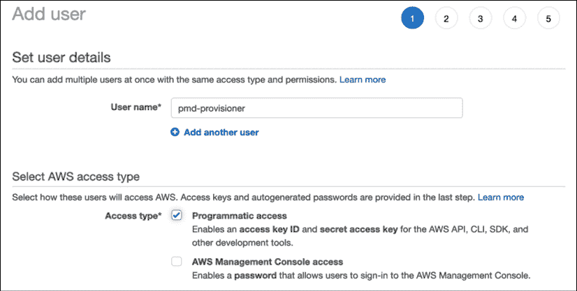
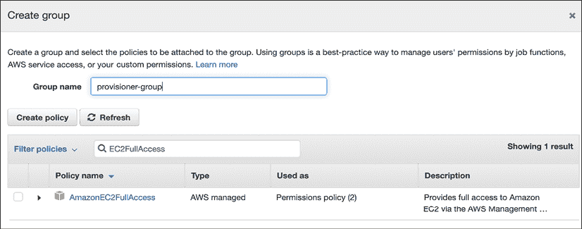

# 在 AWS 上部署

在前面的章节中，我们直接在宿主操作系统上运行了我们的不同微服务，因为这是开始时最快的方法之一，同时也是一种通用的有用方法——特别是在可以包含在虚拟环境中的较小安装或开发中。然而，如果应用程序需要数据库或编译扩展，那么事情开始与操作系统和版本紧密耦合。其他使用略有不同系统的开发者可能会开始遇到问题，并且开发环境与生产环境之间的差异越大，发布软件时遇到的问题就越多。

**虚拟机**（**VMs**）可以是一个很好的解决方案，因为它们提供了一个隔离的环境来运行你的代码。虚拟机本质上是一块软件，它假装成一台真正的计算机，其中在一个假计算机中运行着真实的操作系统。如果你曾经使用过亚马逊 EC2 实例或谷歌计算引擎实例，那么你已经使用过虚拟机了。你可以使用像 VMware 或 VirtualBox 这样的工具在本地运行它们。

然而，虚拟机是重量级的，正是因为它们模拟了完整的计算机。从头开始使用它们需要安装操作系统或使用像 HashiCorp 的 Packer（[`www.packer.io/`](https://www.packer.io/））这样的工具来构建磁盘镜像——这种东西在你选择 AWS 或 GCP 实例时是预先为你构建好的。

最大的革命来自于**Docker**，这是一个开源的虚拟化工具，于 2013 年首次发布。Docker 允许使用称为*容器*的隔离环境以非常便携的方式运行应用程序。

云计算提供商，如亚马逊网络服务（AWS）、谷歌云和微软 Azure，允许人们租用他们的计算机空间，并使创建虚拟机和容器变得更加容易。通过几个鼠标点击或输入终端中的几个命令，就可以配置这些云资源，包括附加的存储和数据库。它们也可以使用配置文件进行配置，以描述资源，使用基础设施即代码工具，例如 HashiCorp 的**Terraform**。

在本章中，我们介绍了 Docker，并解释了如何使用它运行基于 Quart 的微服务。然后，我们介绍了使用一些常见的编排工具部署基于容器的应用程序，例如 Docker Compose、Docker Swarm，以及简要介绍 Kubernetes。许多这些主题本身就可以填满整本书，因此本章将是一个概述，它依赖于工具本身提供的安装说明来开始。

大多数云计算提供商也将拥有这些工具的版本，经过修改以更好地与其他他们提供的服务集成。如果你已经在使用某个公司的服务，那么调查他们的工具是值得的。同时，了解云无关版本也是值得的，因为采取更独立的方法可以使从一个提供商迁移到另一个提供商变得更加容易。

注意，本章中的一些说明可能会导致 AWS 产生费用。虽然我们将尽量将成本降到最低，但了解可能产生的费用很重要，可以通过与 AWS 联系来确认，并在尝试过之后取消任何未使用的资源。

# Docker 是什么？

**Docker** ([https://www.docker.com/](https://www.docker.com/))项目是一个**容器**平台，它允许你在隔离环境中运行应用程序。使用 Linux 的`cgroups`功能([`en.wikipedia.org/wiki/Cgroups`](https://en.wikipedia.org/wiki/Cgroups))，Docker 创建了一个称为容器的隔离环境，在 Linux 上运行而不需要虚拟机。在 macOS 和 Windows 上，安装 Docker 会为你创建一个轻量级的虚拟机，以便在其中运行容器，尽管这是一个无缝的过程。这意味着 macOS、Windows 和 Linux 用户都可以开发基于容器的应用程序，而无需担心任何互操作性麻烦，并将它们部署到 Linux 服务器上，在那里它们将原生运行。

今天，Docker 几乎等同于容器，但还有其他容器运行时，例如**CRI-O** ([`cri-o.io/`](https://cri-o.io/))，以及历史项目如**rkt**和**CoreOS**，它们与 Docker 一起帮助塑造了我们今天所拥有的标准化生态系统。

由于容器在 Linux 上运行时不需要仿真，容器内运行代码与外部运行之间的性能差异很小。由于 macOS 和 Windows 上存在仿真层，虽然在这些平台上运行容器在生产环境中是可能的，但这样做的好处很小。可以将运行应用程序所需的所有内容打包到容器镜像中，并在任何可以运行容器的位置分发它。

作为 Docker 用户，你只需选择你想要运行的镜像，Docker 将通过与 Linux 内核交互来完成所有繁重的工作。在这个上下文中，镜像是指创建一组在 Linux 内核上运行的进程所需的所有指令的总和，以运行一个容器。镜像包括运行 Linux 发行版所需的所有资源。例如，你可以在 Docker 容器中运行任何版本的 Ubuntu，即使宿主操作系统是不同发行版。

由于容器在基于 Linux 的系统上运行最佳，本章的其余部分假设所有内容都是在 Linux 发行版（如 Ubuntu）下安装的。

我们在*第五章*，*拆分单体*中使用了 Docker，讨论了指标和监控，所以你可能已经安装了 Docker。对于一些较老的 Linux 发行版，你可能有一个非常旧的 Docker 版本可用。直接从 Docker 本身安装一个新版本是个好主意，以获取最新的功能和安全补丁。如果你有 Docker 安装，可以直接跳到本章的下一节，*Docker 简介*。如果没有，你可以访问[`www.docker.com/get-docker`](https://www.docker.com/get-docker)下载它并找到安装说明。社区版足以用于构建、运行和安装容器。在 Linux 上安装 Docker 很简单——你可能会找到适合你的 Linux 发行版的软件包。

对于 macOS，如果你已经安装了 Homebrew ([`brew.sh`](https://brew.sh))，那么你可以简单地使用`brew install docker`。否则，请遵循 Docker 网站上的说明。在 Windows 上，Docker 可以使用**Windows 子系统 Linux**（**WSL2**）或内置的 Hyper-V 来运行虚拟机。我们推荐使用 WSL，因为它是最容易工作的。

如果安装成功，你应该能在你的 shell 中运行`docker`命令。尝试运行`version`命令来验证你的安装，如下所示：

```py
$ docker version
Client:
 Cloud integration: 1.0.14
 Version:       	20.10.6
 API version:   	1.41
 Go version:    	go1.16.3
 Git commit:    	370c289
 Built:         	Fri Apr  9 22:46:57 2021
 OS/Arch:       	darwin/amd64
 Context:       	default
 Experimental:  	true
Server: Docker Engine - Community
 Engine:
  Version:      	20.10.6
  API version:  	1.41 (minimum version 1.12)
  Go version:   	go1.13.15
  Git commit:   	8728dd2
  Built:        	Fri Apr  9 22:44:56 2021
  OS/Arch:      	linux/amd64
  Experimental: 	false
 containerd:
  Version:      	1.4.4
  GitCommit:    	05f951a3781f4f2c1911b05e61c160e9c30eaa8e
 runc:
  Version:      	1.0.0-rc93
  GitCommit:    	12644e614e25b05da6fd08a38ffa0cfe1903fdec
 docker-init:
  Version:      	0.19.0
  GitCommit:    	de40ad0 
```

Docker 安装由 Docker Engine 组成，它控制运行中的容器和一个命令行界面。它还包括 Docker Compose，这是一种安排多个容器以便它们可以一起工作的方式，以及 Kubernetes，这是一个用于部署和管理基于容器的应用程序的编排工具。

引擎提供了一个 HTTP API，可以通过本地 UNIX 套接字（通常是`/var/run/docker.sock`）或通过网络访问。这意味着可以控制运行在不同计算机上的 Docker Engine，或者控制 Docker 客户端或编排工具。

现在 Docker 已经安装在你的系统上，让我们来探索它是如何工作的。

# Docker 简介

让我们用 Docker 容器进行实验。运行一个你可以输入命令的容器就像以下这样：

```py
docker run --interactive --tty ubuntu:20.04 bash 
```

使用这个命令，我们告诉 Docker 运行 Ubuntu 镜像，该镜像将从 Docker Hub 获取，Docker Hub 是一个公共镜像的中心注册库。我们在镜像名称后提供了一个`20.04`标签，以便我们下载代表 Ubuntu 20.04 操作系统的容器镜像。这不会包含常规 Ubuntu 安装的所有内容，但任何缺失的内容都是可以安装的。

我们还告诉 Docker 以交互式方式运行——使用`-i`参数——并使用`-t`参数分配一个`tty`，这样我们就可以在容器内输入命令。默认情况下，Docker 假设你想启动一个在后台运行、处理请求的容器。通过使用这两个选项并要求在容器内运行`bash`命令，我们可以得到一个可以像 Linux 外壳一样使用的 shell，而无需在容器外。

现有的每个 Linux 发行版都提供了一个基础镜像，不仅仅是 Ubuntu。还有针对运行 Python、Ruby 或其他环境的精简基础镜像，以及像 Alpine 这样的基础 Linux 镜像，目标是更小。镜像的大小很重要，因为每次你想更新它或在新的地方运行它时，都必须下载。Alpine 的大小略超过 5MB，而`ubuntu:20.04`镜像的大小接近 73MB。你可以使用以下命令比较大小并管理 Docker 引擎所知的镜像——第二个命令将删除任何本地的`ubuntu:20.04`镜像副本，所以如果你运行这个命令，你需要再次下载该镜像才能使用它：

```py
$ docker images
REPOSITORY        	TAG      	IMAGE ID   	CREATED    	SIZE
python            	3.9      	a6a0779c5fb2   2 days ago 	886MB
ubuntu            	20.04    	7e0aa2d69a15   3 weeks ago	72.7MB
alpine            	latest   	6dbb9cc54074   4 weeks ago	5.61MB
$ docker rmi ubuntu:20.04
Untagged: ubuntu:20.04
Untagged: ubuntu@sha256:cf31af331f38d1d7158470e095b132acd126a7180a54f263d386da88eb681d93
Deleted: sha256:7e0aa2d69a153215c790488ed1fcec162015e973e49962d438e18249d16fa9bd
Deleted: sha256:3dd8c8d4fd5b59d543c8f75a67cdfaab30aef5a6d99aea3fe74d8cc69d4e7bf2
Deleted: sha256:8d8dceacec7085abcab1f93ac1128765bc6cf0caac334c821e01546bd96eb741
Deleted: sha256:ccdbb80308cc5ef43b605ac28fac29c6a597f89f5a169bbedbb8dec29c987439 
```

你可能会认为大小意味着 Ubuntu 镜像总是比 Python 基础镜像更好，但 Ubuntu 镜像不包含 Python，因此为了使用它，我们必须构建一个包含我们所需一切内容的镜像，并在其上安装我们自己的软件。与其手动完成所有这些设置，我们可以使用**Dockerfile** ([`docs.docker.com/engine/reference/builder/`](https://docs.docker.com/engine/reference/builder/))。

这些 Docker 配置文件的规范名称是 Dockerfile，以下是一个基本示例：

```py
FROM ubuntu:20.04
RUN apt-get update && apt-get install -y python3
CMD ["bash"] 
```

Dockerfile 是一个包含一系列指令的文本文件。每一行都以大写指令开头，后跟其参数。在我们的例子中，有三个这样的指令：

+   `FROM`：指向要使用的基础镜像

+   `RUN`：在基础镜像安装后，在容器中运行命令

+   `CMD`：当 Docker 执行容器时运行的命令

现在我们应该构建我们的镜像，并给它一个有用的名字，这样我们以后就可以引用它。在这里，我们将运行`docker build`并使用`ubuntu-with-python`这个名字标记新的镜像，同时使用当前目录作为构建环境——默认情况下，这也是`docker build`查找 Dockerfile 的地方：

```py
$ docker build -t ubuntu-with-python .
[+] Building 7.9s (6/6) FINISHED
 => [internal] load build definition from Dockerfile              	0.0s
 => => transferring dockerfile: 125B                              	0.0s
 => [internal] load .dockerignore                                 	0.0s
 => => transferring context: 2B                                   	0.0s
 => [internal] load metadata for docker.io/library/ubuntu:20.04   	0.0s
 => [1/2] FROM docker.io/library/ubuntu:20.04                     	0.0s
 => [2/2] RUN apt-get update && apt-get install -y python3        	7.3s
 => exporting to image                                            	0.4s
 => => exporting layers                                           	0.4s
 => => writing image sha256:02602f606721f36e95fbda83af09baaa9f8256e83030197e5df69fd444e5c604                                             	0.0s
 => => naming to docker.io/library/ubuntu-with-python             	0.0s
Use 'docker scan' to run Snyk tests against images to find vulnerabilities and learn how to fix them 
```

现在我们可以以与之前运行 Ubuntu 镜像相同的方式运行我们的新镜像：

```py
$ docker run -it ubuntu-with-python bash
root@42b83b0933f4:/# python3
Python 3.8.5 (default, Jan 27 2021, 15:41:15)
[GCC 9.3.0] on linux
Type "help", "copyright", "credits" or "license" for more information.
>>> 
```

当 Docker 创建镜像时，它会创建一个包含 Dockerfile 中每个指令的缓存。如果你在不更改文件的情况下第二次运行`build`命令，它应该在几秒钟内完成。改变指令顺序或更改指令将重建镜像，从第一个更改开始。因此，在编写这些文件时，一个好的策略是将指令排序，使得最稳定的指令（你很少更改的指令）位于顶部。

另一条很好的建议是清理每条指令。例如，当我们运行`apt-get update`和`apt-get install`时，这会下载大量的软件包索引文件，以及一旦安装我们就不再需要的`.deb`软件包。

我们可以通过清理我们的操作来使我们的结果镜像更小，这必须在相同的`RUN`命令中完成，以确保我们正在删除的数据不会作为容器镜像的一部分被写入：

```py
$ cat Dockerfile
FROM ubuntu:20.04
RUN apt-get update && \
	apt-get install -y python3 && \
	apt-get clean && \
	rm -fr /var/lib/apt/lists
CMD ["bash"]
$ docker build -t cleaned-ubuntu-python .
$ docker images
REPOSITORY          	TAG     IMAGE ID   	  CREATED          SIZE
cleaned-ubuntu-python 	latest  6bbca8ae76fe   3 seconds ago    112MB
ubuntu-with-python  	latest  dd51cfc39b5a   34 minutes ago   140MB 
```

Docker 提供的一个很棒的功能是能够与其他开发者共享、发布和重用镜像。Docker Hub ([`hub.docker.com`](https://hub.docker.com))对 Docker 容器的作用就像 PyPI 对 Python 包的作用一样。

在前面的例子中，Docker 从 Hub 拉取了 Ubuntu 基础镜像，并且有大量的预存镜像可供使用。例如，如果你想启动一个针对 Python 进行了优化的 Linux 发行版，你可以查看官方 Docker Hub 网站上的 Python 页面，并选择一个（[`hub.docker.com/_/python/`](https://hub.docker.com/_/python/))。

`python:version`镜像基于 Debian，是任何 Python 项目的绝佳起点。

基于**Alpine Linux**的 Python 镜像也非常受欢迎，因为它们可以生成运行 Python 所需的最小镜像。它们的体积比其他镜像小十倍以上，这意味着它们下载和设置的速度要快得多，对于那些想在 Docker 中运行你的项目的人来说（参考[`gliderlabs.viewdocs.io/docker-alpine/`](http://gliderlabs.viewdocs.io/docker-alpine/))。

要从 Alpine 基础镜像使用 Python 3.9，你可以创建一个 Dockerfile，如下所示：

```py
FROM python:3.9-alpine
CMD ["python3.9"] 
```

构建和运行这个 Dockerfile 会将你置于一个 Python 3.9 shell 中。如果你运行的应用程序不需要大量的系统级依赖项或任何编译，Alpine 集合是非常好的。然而，需要注意的是，Alpine 有一组特定的编译工具，有时与某些项目不兼容。

对于基于 Quart 的微服务项目，稍微大一点的基于 Debian 的 Python 镜像可能是一个更简单的选择，因为它具有标准的编译环境和稳定性。此外，一旦下载了基础镜像，它就会被缓存并重用，因此你不需要再次下载所有内容。

注意，使用 Docker Hub 上可信赖的人和组织提供的镜像非常重要，因为任何人都可以上传镜像。除了运行恶意代码的风险之外，还有使用未更新到最新安全补丁的 Linux 镜像的问题。Docker 还支持对镜像进行数字签名，以帮助验证镜像是你期望的，且没有经过修改。

# 在 Docker 中运行 Quart

要在 Docker 中运行 Quart 应用程序，我们可以使用基础 Python 镜像。从那里，安装应用程序及其依赖项可以通过 pip 完成，pip 已经包含在 Python 镜像中。

假设您的项目有一个 `requirements.txt` 文件用于其固定依赖项，以及一个 `setup.py` 文件用于安装项目，可以通过指示 Docker 如何使用 `pip` 命令来为您的项目创建镜像。

在以下示例中，我们介绍了 `COPY` 命令，该命令将递归地从容器外部复制文件和目录到镜像中。我们还添加了 `EXPOSE` 指令，以告知任何运行容器的用户，该端口应公开给外部世界。当我们使用 `-p` 选项运行容器时，我们仍然需要连接到那个公开的端口。容器内的任何进程都可以监听它想要的任何端口，并使用 localhost 与自身通信，但除非该端口已公开，否则容器外部的任何东西都无法到达容器内部。也值得注意，容器内部的 localhost 仅指容器本身，而不是托管运行容器的计算机；因此，如果您需要与其他服务通信，您将需要使用其实际 IP 地址：

```py
FROM python:3.9
COPY . /app/
RUN pip install -r /app/requirements.txt
RUN pip install /app/
CMD ["hypercorn", "—bind", "0.0.0.0:5000", "myservice:app"] 
```

这里使用的 `3.9` 标签将获取上传到 Docker Hub 的最新 Python 3.9 镜像。现在我们可以运行我们的新容器，并公开它需要的端口：

```py
$ docker run -p 5000:5000 quart_basic
[2021-05-15 15:34:56 +0000] [1] [INFO] Running on http://0.0.0.0:5000 (CTRL + C to quit)
# In another terminal:
$ curl localhost:5000
{} 
```

按下 Ctrl + C 停止容器，或者从另一个终端窗口中找到容器并告诉它停止：

```py
$ docker ps
CONTAINER ID   IMAGE      	COMMAND             	CREATED     	STATUS                    	PORTS                                   	NAMES
040f7f01d90b   quart_basic   "hypercorn —bind 0.…"   2 seconds ago   Up Less than a second   0.0.0.0:5000->5000/tcp, :::5000->5000/tcp    stoic_bhabha
$ docker stop 040f7f01d90b
040f7f01d90b 
```

`COPY` 命令自动在容器中创建顶级 `app` 目录，并将 "`.`" 中的所有内容复制进去。关于 `COPY` 命令的一个重要细节是，对本地目录 ("`.`") 的任何更改都会使 Docker 缓存失效，并从该步骤开始构建。为了调整这个机制，您可以在 `.dockerignore` 文件中列出 Docker 应该忽略的文件和目录，例如存储所有版本控制历史和元数据的 `.git` 目录。

我们在容器内没有使用虚拟环境，因为我们已经在一个隔离的环境中。我们还使用 Hypercorn 运行我们的 Quart 应用程序，这是我们在第九章 *打包和运行 Python* 中讨论的生产使用的好做法。

正因如此，`CMD` 指令，它告诉容器启动时应该运行什么命令，使用了 **Hypercorn**。`CMD` 可以接受一个正常的 shell 命令作为参数，但这会被容器内部的 shell 解释，这意味着如果存在 shell 不同的符号解释，如 `*` 和 `?`，可能会出错。如果您曾经使用过 Python 的 subprocess 模块 ([`docs.python.org/3/library/subprocess.html`](https://docs.python.org/3/library/subprocess.html)) 或使用过 exec 系统调用，那么提供一个列表会更安全，格式可能与您熟悉。

我们接下来需要做的是编排不同的容器，以便它们可以协同工作。让我们在下一节中看看我们如何做到这一点。

# 基于 Docker 的部署

在大规模部署微服务时，可以通过运行分布在单个或多个实例上的多个容器来实现。当我们本地开发应用程序时，我们受限于我们的一台桌面或笔记本电脑所能提供的资源；但对于生产服务来说，它可能运行在数十或数百台服务器上，每台服务器运行一个容器，提供应用程序的不同部分。您在云中部署应用程序或扩展以满足您需求的每个选项都将涉及运行更多实例，以运行更多容器。

首先要检查的是 Docker Compose，它旨在针对较小规模的部署，通常包含在一个实例中，但运行多个容器。这对于开发环境、预发布环境或原型来说非常理想。我们将探讨的其他选项包括 Docker Swarm 和 Kubernetes，它们为部署应用程序的人提供了不同级别的复杂性，但也增加了灵活性和功能。这两种选项还需要有人运行云实例或裸机服务器来运行容器。

一旦创建了 Docker 镜像，每个运行 Docker 守护进程的主机都可以用来在物理资源限制内运行尽可能多的容器。我们将探讨几个不同的选项，以获得有关功能和复杂性的广泛概述。

没有必要使您的初始应用程序过于复杂。可能会诱使您选择一个大的 Kubernetes 集群，但如果您的应用程序不需要以这种方式扩展，那将是一种浪费。使用关于您应用程序的指标和即将到来的业务变化的知识来调整计划，以满足您的需求，而不是您可能想要的需求。

要在此书和[`github.com/PacktPublishing/Python-Microservices-Development-2nd-Edition/tree/main/CodeSamples`](https://github.com/PacktPublishing/Python-Microservices-Development-2nd-Edition/tree/main/CodeSample)上的**Terraform**、**Docker Swarm**和**Kubernetes**示例进行实验，您需要通过访问[`aws.amazon.com/`](https://aws.amazon.com/)在 AWS 上创建一个账户。

一旦您设置了账户，请访问**身份和访问管理**（**IAM**）页面以创建一个可以创建和更改资源的服务用户。您可以使用您的 root 或主要账户来完成所有工作，但最好为此目的创建服务账户，因为这意味着任何泄露的访问密钥或秘密都可以轻松撤销——并创建新的——而不会对访问账户造成重大麻烦。我们应该遵循最小权限原则，正如我们在*第七章*，*保护您的服务*中讨论的那样。

一旦进入 IAM 页面，点击**添加用户**并请求**程序访问**，以便您可以使用 API 密钥在程序中使用此账户。



图 10.1：AWS 中的 IAM 添加用户页面

创建一个组以更轻松地控制用户的权限。授予这个新组修改 EC2 实例的权限，因为它涵盖了我们将要更改的大部分内容。



图 10.2：命名组和设置权限

一旦创建了组，您将有机会下载新的**访问密钥 ID**和**秘密访问密钥**。这些将用于授权访问我们用来创建实例和其他云资源的任何程序。

这些工具中的大多数都是基础设施即代码。也就是说，您将有一个配置文件，或一组文件，描述您的运行服务将看起来是什么样子，以及它们需要哪些资源。此配置还应保留在版本控制中，以便任何更改都可以得到管理。它是否与您的代码存储在同一源代码控制仓库中将取决于您如何部署软件：如果您正在持续部署新版本，那么将配置与应用程序一起保留可能会有所帮助，但在许多情况下，将其分开会更清晰，特别是如果 CI 管道在部署和代码的测试与打包任务之间难以协调。

## Terraform

```py
https://github.com/PacktPublishing/Python-Microservices-Development-2nd-Edition:
```

```py
resource "aws_instance" "swarm_cluster" {
  count     	= 3
  ami       	= data.aws_ami.ubuntu_focal.id
  instance_type = "t3.micro" # Small for this demo.
  vpc_security_group_ids = [aws_security_group.swarm_security_group.id]
  key_name           	= "your ssh key name here"
  root_block_device {
	volume_type = "gp2"
	volume_size = "40" # GiB
	encrypted   = true
  }
} 
```

在这里，我们定义了一个名为`swarm_cluster`的资源，我们将使用`Ubuntu Focal`基础镜像创建三个新实例。我们将实例大小设置为`t3.micro`，因为我们正在尝试新事物，并希望最小化成本。

```py
https://github.com/PacktPublishing/Python-Microservices-Development-2nd-Edition/tree/main/CodeSamples.
```

使用 Terraform，我们可以在 CI/CD 管道中以类似测试和部署我们的应用程序代码的方式创建和销毁我们的云资源。以下有深入的教程和示例，并且有许多社区提供的模块来执行常见任务：[`learn.hashicorp.com/terraform`](https://learn.hashicorp.com/terraform)。

Terraform 的`plan`命令将在您运行`terraform apply`时显示对您的云基础设施所做的更改：

```py
$ terraform plan
...
  # module.docker-swarm.aws_instance.managers[2] will be created
  + resource "aws_instance" "managers" {
  	+ ami                              	= "ami-0440ba4c79a163c0e"
  	+ arn                              	= (known after apply)
  	+ associate_public_ip_address      	= (known after apply)
  	+ availability_zone                	= (known after apply)
…
$ terraform apply
[terraform plan output]
Do you want to perform these actions?
  Terraform will perform the actions described above.
  Only 'yes' will be accepted to approve.
  Enter a value: yes
aws_vpc.main: Creating...
module.docker-swarm.aws_iam_policy.swarm-access-role-policy: Creating...
module.docker-swarm.aws_sns_topic.alarms: Creating...
module.docker-swarm.aws_iam_role.ec2: Creating...
module.docker-swarm.aws_s3_bucket.terraform[0]: Creating...
module.docker-swarm.aws_sns_topic.alarms: Creation complete after 0s [id=arn:aws:sns:eu-central-1:944409847308:swarm-vpc-alarms]
module.docker-swarm.aws_iam_policy.swarm-access-role-policy: Creation complete after 1s [id=arn:aws:iam::944409847308:policy/swarm-vpc-swarm-ec2-policy]
... 
```

一旦完成任何实验，您可以通过运行`terraform destroy`来清除 Terraform 管理的任何资源——尽管这是一个对于生产服务来说非常危险的命令！

## 服务发现

虽然 Docker 试图提供处理容器集群的所有工具，但管理它们可能会变得相当复杂。当正确执行时，它需要在主机之间共享一些配置，并确保启动和停止容器部分自动化。

我们很快就会遇到使静态配置复杂化的场景。如果我们需要将微服务迁移到新的 AWS 区域，或者完全迁移到不同的云服务提供商，那么我们如何通知使用它的所有其他微服务呢？如果我们添加了一个由功能标志控制的新功能，我们如何快速地打开和关闭它？在更小的范围内，负载均衡器如何知道应该接收流量的所有容器？

服务发现是一种旨在解决这些问题的编排方法。例如 **Consul** ([`www.consul.io/`](https://www.consul.io/)) 和 **etcd** ([`etcd.io/`](https://etcd.io/)) 这样的工具允许在知名键后存储值并动态更新。

你不必完全了解所有可能连接到的 URL 来部署你的服务，你可以提供服务发现工具的地址以及它应该查找的每个元素的键列表。当微服务启动时，以及定期，它可以检查它应该发送流量到何处，或者是否应该开启某个功能。

我们将以 `etcd` 为例，使用基本的 Quart 服务，同时利用 `etcd3` Python 库。假设你按照他们网站上的说明在默认选项下运行了 `etcd`，我们可以在我们的服务中添加一些配置更新代码，并有一个返回我们如果应用程序更完整时会联系到的 URL 的端点：

```py
# etcd_basic.py
from quart import Quart, current_app
import etcd3
# Can read this map from a traditional config file
settings_map = {
    "dataservice_url": "/services/dataservice/url",
}
settings_reverse_map = {v: k for k, v in settings_map.items()}
etcd_client = etcd3.client()
def load_settings():
    config = dict()
    for setting, etcd_key in settings_map.items():
        config[setting] = etcd_client.get(etcd_key)[0].decode("utf-8")
    return config
def create_app(name=__name__):
    app = Quart(name)
    app.config.update(load_settings())
    return app
app = create_app()
def watch_callback(event):
    global app
    for update in event.events:
    # Determine which setting to update, and convert from bytes to str
        config_option = settings_reverse_map[update.key.decode("utf-8")]
        app.config[config_option] = update.value.decode("utf-8")
# Start to watch for dataservice url changes
# You can also watch entire areas with add_watch_prefix_callback
watch_id = etcd_client.add_watch_callback("/services/dataservice/url", watch_callback)
@app.route("/api")
def what_is_url():
    return {"url": app.config["dataservice_url"]}
app.run() 
```

在这个例子中，我们在应用程序启动时加载 `settings_map` 中的密钥，包括 `/services/dataservice/url`，然后我们可以对其进行验证和使用。任何在 `etcd` 中值变化时，`watch_callback` 函数将在其自己的线程中运行，并更新应用程序的配置：

```py
$ curl http://127.0.0.1:5000/api
{"url":"https://firsturl.example.com/api"}
$ etcdctl put "/services/dataservice/url" "https://secondurl.example.com/api"
OK
$ curl http://127.0.0.1:5000/api
{"url":"https://secondurl.example.com/api"} 
```

更新实时配置只是一个简单的命令！

如果你的应用程序有相互依赖的配置选项，例如访问令牌对，最好将它们编码在单个选项中，以便在单个操作中更新。如果出现问题并且只有一组相互依赖的配置设置中的一个被更新，你的应用程序将以不受欢迎和不期望的方式运行。

## Docker Compose

在同一主机上运行多个容器所需的命令可能会相当长，一旦你需要添加名称和网络以及绑定多个套接字。Docker Compose ([`docs.docker.com/compose/`](https://docs.docker.com/compose/)) 通过允许你在单个配置文件中定义多个容器的配置以及这些容器如何相互依赖，简化了这项任务。此实用程序与 Docker 一起安装在 macOS 和 Windows 上。对于 Linux 发行版，应该有一个系统包可供安装，或者你可以按照[`docs.docker.com/compose/install/`](https://docs.docker.com/compose/install/)中的说明获取安装脚本。

一旦脚本安装到你的系统上，创建一个包含你想要运行的服务和网络信息的 `yaml` 文件。默认文件名是 `docker-compose.yml`，因此我们将使用该名称作为我们的示例以简化命令。

Compose 配置文件有许多选项，允许你定义多个容器部署的各个方面。它就像一组容器的 Makefile。此 URL 列出了所有选项：[`docs.docker.com/compose/compose-file/`](https://docs.docker.com/compose/compose-file/)。

在以下示例中，`.yaml`文件位于我们的 Jeeves 微服务目录之上，并定义了三个服务：`dataservice`和`tokendealer`，它们是从各自的 Dockerfile 本地构建的；第三个是 RabbitMQ，我们使用 Docker Hub 上发布的镜像来运行它：

```py
version: '3'
networks:
  jeeves:
services:
  dataservice:
    networks:
     - jeeves
    build:
        context: dataservice/
    ports:
     - "8080:8080"
  tokendealer:
    networks:
     - jeeves
    build:
        context: tokendealer/
    ports:
     - "8090:8090"
  rabbitmq:
    image: "rabbitmq:latest"
    networks:
     - jeeves 
```

`Compose`文件也通过其`networks`部分创建网络，允许容器之间进行通信。它们将获得私有 DNS 条目，因此可以使用图像名称来引用它们，例如上面示例中的`dataservice`、`tokendealer`和`rabbitmq`。要构建和运行这三个容器，您可以使用以下`up`命令：

```py
$ docker compose up
[+] Building 9.2s (9/9) FINISHED
 ...
[+] Running 3/0
  Container pythonmicroservices_tokendealer_1  Created           	0.1s
  Container pythonmicroservices_dataservice_1  Created           	0.1s
  Container pythonmicroservices_rabbitmq_1  Created         	0.1s
Attaching to dataservice_1, rabbitmq_1, tokendealer_1 
```

第一次执行该命令时，将构建两个本地容器镜像。这些镜像可以是静态的，或者您可以分配卷给它们，将源代码挂载到上面并继续在上面开发。

当您想为微服务提供一个完整的运行堆栈时，使用 Docker Compose 是非常好的，这个堆栈包括运行它所需的每一件软件。例如，如果您正在使用 Postgres 数据库，您可以使用 Postgres 镜像（[`hub.docker.com/_/postgres/`](https://hub.docker.com/_/postgres/)）并将其链接到 Docker Compose 文件中的服务。

将所有内容，包括数据库，都进行容器化是一种展示您软件的绝佳方式，或者简单地说是开发目的的一个好选择。然而，正如我们之前所述，Docker 容器应被视为一个短暂的文件系统。因此，如果您为数据库使用容器，请确保数据写入的目录已挂载在主机文件系统上。然而，在大多数情况下，数据库服务通常是生产部署中其专用的服务器。使用容器并没有太多意义，只会增加一点开销。

## Docker Swarm

Docker 有一个内置的集群功能，称为**swarm**模式（[`docs.docker.com/engine/swarm/`](https://docs.docker.com/engine/swarm/））。这种模式具有令人印象深刻的特性列表，让您可以从单个实用程序管理所有容器集群。这使得它非常适合较小的部署或不需要灵活地扩展和缩减以满足不断变化的需求。

一旦部署了集群，您需要设置一个负载均衡器，以便集群的所有实例都能共享工作负载。负载均衡器通常是 nginx、OpenResty 或 HAProxy 等软件，它是集群中分发传入请求的入口点。

要设置一个 swarm，我们实际上只需要三个 EC2 实例，前提是我们可以通过端口`22`使用 SSH 访问来配置它们，以及端口`2377`用于 Docker 自身的通信。我们还应该允许我们的应用程序需要的任何端口，例如端口`443`用于 HTTPS 连接。

要创建一个 swarm，我们必须创建一个管理节点来组织其余部分。使用您刚刚创建的一个节点，使用 SSH 连接到它，并将其转换为 Docker Swarm 管理器：

```py
$ sudo docker swarm init —advertise-addr <Public IP Address>
Swarm initialized: current node (l6u7ljqhiaosbeecn4jjlm6vt) is now a manager. 
```

要向这个集群添加一个工作节点，请运行以下命令：

```py
docker swarm join —token <some long token> 52.212.189.167:2377 
```

要向这个集群添加一个管理节点，请运行 `docker swarm join-token manager` 并遵循指示。

复制提供的 `docker` `swarm` 命令，并将其粘贴到你在其他创建的实例上的 SSH 会话中。在命令生效之前，你可能需要运行 `sudo` 以获得 root 权限。在管理节点上，我们现在可以看到所有我们的工作节点：

```py
$ sudo docker node ls
ID                        	HOSTNAME       	STATUS	AVAILABILITY   MANAGER STATUS 	ENGINE VERSION
6u81yvbwbvb0fspe06yzlsi13 	ip-172-31-17-183 	Ready 	Active   	20.10.6
l6u7ljqhiaosbeecn4jjlm6vt *  	ip-172-31-26-31	Ready 	Active     	Leader       	20.10.6
873cp1742grhkzoo5xd2aiqls 	ip-172-31-28-17	Ready 	Active     	20.10.6 
```

现在我们需要做的就是创建我们的服务：

```py
$ sudo docker service create —replicas 1 —name dataservice jeeves/dataservice
sikcno6s3582tdr91dj1fvsse
overall progress: 1 out of 1 tasks
1/1: running   [==================================================>]
verify: Service converged
$ sudo docker service ls
ID         	    NAME          MODE         REPLICAS   IMAGE       	PORTS
sikcno6s3582   dataservice   replicated   1/1    	jeeves/dataservice:latest 
```

从这里，我们可以根据需要调整我们的服务规模。要创建我们数据服务的五个副本，我们需要发出一个缩放命令：

```py
$ sudo docker service scale dataservice=5 
```

只要我们的管理节点保持可用，并且一些工作节点处于运行状态，我们的容器服务就会保持活跃。我们可以终止一个云实例，并通过 `docker service ps` 观察事情如何重新平衡到剩余的实例。添加更多节点就像在 Terraform 配置中调整一个变量并重新运行 `terraform apply` 一样简单，然后再将它们加入集群。

照顾这一套云实例仍然是一项工作，但这个环境提供了一种提供弹性容器部署的整洁方式，尤其是在应用程序生命周期的早期。

## Kubernetes

原本由谷歌设计，但现在由一个独立基金会维护的**Kubernetes** ([`kubernetes.io/`](https://kubernetes.io/), 也称为 k8s) 提供了一种平台无关的方式来自动化容器化系统的操作，允许你用不同组件的术语来描述系统，并向控制器发出命令以调整设置。

与 Docker Swarm 一样，Kubernetes 也运行在一组服务器上。虽然你可以自己运行这个集群，但一些云提供商确实提供了一种服务，使得管理实例群组变得更加容易。一个很好的例子是 AWS 的 **eksctl** 工具 ([`eksctl.io/`](https://eksctl.io/))。虽然它不是由亚马逊创建的，但它是一个官方支持的客户端，用于在亚马逊的弹性 Kubernetes 服务中创建集群。

而不是自己创建所有 AWS 资源，或者创建 Terraform 配置来这样做，`eksctl` 会为你完成所有工作，并提供合理的默认值来实验 Kubernetes。要开始，最好使用我们为早期示例创建的 AWS 凭据，并安装 `eksctl` 和 `kubectl`——Kubernetes 命令行工具。AWS 凭据将由 `eksctl` 用于创建集群和其他必要资源，一旦完成，就可以使用 `kubectl` 来部署服务和软件。与 Docker Swarm 不同，kubectl 的管理命令旨在从你的计算机上运行：

```py
$ eksctl create cluster —name=jeeves-cluster-1 —nodes=4 —region=eu-west-1
2021-05-27 20:13:44 ![]  eksctl version 0.51.0
2021-05-27 20:13:44 ![]  using region eu-west-1
2021-05-27 20:13:44 ![]  setting availability zones to [eu-west-1a eu-west-1c eu-west-1b]
2021-05-27 20:13:44 ![]  subnets for eu-west-1a - public:192.168.0.0/19 private:192.168.96.0/19
2021-05-27 20:13:44 ![]  subnets for eu-west-1c - public:192.168.32.0/19 private:192.168.128.0/19
2021-05-27 20:13:44 ![]  subnets for eu-west-1b - public:192.168.64.0/19 private:192.168.160.0/19
2021-05-27 20:13:44 ![]  nodegroup "ng-4e138761" will use "ami-0736921a175c8cebf" [AmazonLinux2/1.19]
2021-05-27 20:13:45 ![]  using Kubernetes version 1.19
... 
```

创建集群可能需要几分钟，但一旦完成，它就会将 `kubectl` 需要的凭据写入正确的文件，因此不需要进一步的设置。我们告诉 `eksctl` 创建四个节点，这正是它所做的事情：

```py
$ kubectl get nodes
NAME                                       	STATUS   ROLES	AGE 	VERSION
ip-192-168-2-113.eu-west-1.compute.internal	Ready	<none>   8m56s   v1.19.6-eks-49a6c0
ip-192-168-37-156.eu-west-1.compute.internal   Ready	<none>   9m1s	v1.19.6-eks-49a6c0
ip-192-168-89-123.eu-west-1.compute.internal   Ready	<none>   9m1s	v1.19.6-eks-49a6c0
ip-192-168-90-188.eu-west-1.compute.internal   Ready	<none>   8m59s   v1.19.6-eks-49a6c0 
```

目前，我们在`k8s`集群上没有运行任何东西，所以我们将为它创建一些工作要做。`k8s`的基本工作单元是`pod`，它描述了集群上运行的一组容器。我们还没有创建自己的，但有一些在不同的命名空间中运行，以帮助 k8s 完成我们设定的其他任务的管理。这样的命名空间可以用于将任务集分组在一起，使在查看集群时更容易理解哪些是重要的：

```py
$ kubectl get pods
No resources found in default namespace…
$ kubectl get pods —namespace kube-system
NAME                   	READY   STATUS	RESTARTS      AGE
aws-node-6xnrt         	1/1     Running      0      	29m
aws-node-rhgmd         	1/1     Running      0      	28m
aws-node-v497d         	1/1     Running      0      	29m
aws-node-wcbh7         	1/1 	Running   0      	29m
coredns-7f85bf9964-n8jmj	1/1 	Running   0      	36m
coredns-7f85bf9964-pk7sq	1/1 	Running   0      	36m
kube-proxy-4r7fw       	1/1 	Running   0      	29m
kube-proxy-dw9sv       	1/1 	Running   0      	29m
kube-proxy-p7qqv       	1/1 	Running   0      	28m
kube-proxy-t7spn       	1/1 	Running   0      	29m 
```

Pod 是对集群中某些工作的低级描述，为了使生活更轻松，还有针对不同类型工作的更高级抽象，例如用于无状态应用（如 Web 界面或代理）的`Deployment`，当你的工作负载需要附加存储而不是将数据保存在不同的服务中时，使用`StatefulSet`，以及用于一次性任务和计划重复任务的`Jobs`和`CronJobs`。

Kubernetes 接受它应该应用的指令的清单。一个好的起点是设置 nginx，使用如下清单：

```py
# nginx.yml
apiVersion: apps/v1
kind: Deployment
metadata:
  name: nginx-deployment
  labels:
    app: nginx
spec:
  replicas: 3
  selector:
    matchLabels:
      app: nginx
  template:
    metadata:
      labels:
        app: nginx
    spec:
      containers:
        - name: nginx
          image: nginx:1.21.0
          ports:
          - containerPort: 80 
```

我们在请求的资源类型（`Deployment`）及其名称中包含一些元数据，然后深入到服务的规范中。在文件的底部，我们可以看到我们请求了一个基于`nginx:1.21.0 image`的容器，并且它应该打开端口`80`。再往上一层，我们把这个容器规范描述为一个模板，我们用它来创建三个不同的副本并在我们的集群上运行。

```py
$ kubectl apply -f nginx.yml
deployment.apps/nginx-deployment created
$ kubectl get pods
NAME                                READY     STATUS	   RESTARTS   AGE
nginx-deployment-6c4ccd94bc-8qftq   1/1 	Running   0      	21s
nginx-deployment-6c4ccd94bc-hqt8c   1/1 	Running   0      	21s
nginx-deployment-6c4ccd94bc-v7zpl   1/1 	Running   0      	21s 
```

使用 kubectl 的`describe`子命令，我们可以获取更多关于为我们创建的内容的信息：

```py
$ kubectl describe deployment nginx-deployment
Name:               	nginx-deployment
Namespace:          	default
CreationTimestamp:  	Thu, 27 May 2021 21:06:47 +0100
Labels:             	app=nginx
Annotations:        	deployment.kubernetes.io/revision: 1
Selector:           	app=nginx
Replicas:           	3 desired | 3 updated | 3 total | 3 available | 0 unavailable
StrategyType:       	RollingUpdate
MinReadySeconds:    	0
RollingUpdateStrategy:  25% max unavailable, 25% max surge
Pod Template:
  Labels:  app=nginx
  Containers:
   nginx:
	Image:    	nginx:1.21.0
	Port:     	80/TCP
	Host Port:	0/TCP
	Environment:  <none>
	Mounts:   	<none>
  Volumes:    	<none>
Conditions:
  Type       	Status  Reason
  ——       	———  ———
  Available  	True	MinimumReplicasAvailable
  Progressing	True	NewReplicaSetAvailable
OldReplicaSets:  <none>
NewReplicaSet:   nginx-deployment-6c4ccd94bc (3/3 replicas created)
Events:
  Type	Reason         	Age   From               	Message
  ——	———         	——  ——               	———-
  Normal  ScalingReplicaSet  14m   deployment-controller  Scaled up replica set nginx-deployment-6c4ccd94bc to 3 
```

如果我们决定需要更多的 nginx 容器，我们可以更新清单。将我们的`yaml`文件中的副本数量从三个更改为八个，并重新应用清单：

```py
$  kubectl get pods -l app=nginx
NAME                                READY   STATUS             RESTARTS   AGE
nginx-deployment-6c4ccd94bc-7g74n   0/1     ContainerCreating   0      	2s
nginx-deployment-6c4ccd94bc-8qftq   1/1     Running             0      	17m
nginx-deployment-6c4ccd94bc-crw2t   1/1     Running             0      	2s
nginx-deployment-6c4ccd94bc-fb7cf   0/1     ContainerCreating   0      	2s
nginx-deployment-6c4ccd94bc-hqt8c   1/1     Running             0      	17m
nginx-deployment-6c4ccd94bc-v7zpl   1/1     Running             0      	17m
nginx-deployment-6c4ccd94bc-zpd4v   1/1     Running             0      	2s
nginx-deployment-6c4ccd94bc-zwtcv   1/1     Running             0      	2s 
```

可以进行类似的更改来升级 nginx 的版本，Kubernetes 有几种策略来执行服务的更新，以便最终用户不太可能注意到它的发生。例如，可以创建一个全新的容器 Pod 并将其流量重定向到它，但也可以在 Pod 内部进行滚动更新，其中容器只有在它的替代品成功启动后才会被销毁。如何判断容器已成功启动？Kubernetes 允许你描述它应该查找的内容以检查容器是否可以执行其工作，以及它应该等待容器启动多长时间，使用其存活性和就绪性检查。

如果你一直在跟随示例，记得当你完成时删除云资源，因为它们会产生费用。要删除我们创建的 nginx-deployment，请使用`kubectl`。

```py
$ kubectl delete -f nginx.yml
deployment.apps "nginx-deployment" deleted 
```

但要销毁整个集群，请返回使用`eksctl`：

```py
$ eksctl delete cluster —name=jeeves-cluster-1 —region=eu-west-1
2021-05-27 21:33:22 ![]  eksctl version 0.51.0
2021-05-27 21:33:22 ![]  using region eu-west-1
2021-05-27 21:33:22 ![]  deleting EKS cluster "jeeves-cluster-1"
2021-05-27 21:33:23 ![]  deleted 0 Fargate profile(s)
2021-05-27 21:33:23 ![]  kubeconfig has been updated
2021-05-27 21:33:23 ![]  cleaning up AWS load balancers created by Kubernetes objects of Kind Service or Ingress
2021-05-27 21:33:25 ![]  2 sequential tasks: { delete nodegroup "ng-4e138761", delete cluster control plane "jeeves-cluster-1" [async] }
2021-05-27 21:33:26 ![]  will delete stack "eksctl-jeeves-cluster-1-nodegroup-ng-4e138761"
... 
```

这只是一个关于一个极其强大工具的简要概述，因为这个主题本身可能需要一本书来详细阐述。对于那些需要它的人来说，花时间学习 Kubernetes 是值得的，但正如以往一样，你必须评估你自己的应用需求，以及是否有一些更简单的方法可以完成任务。

# 摘要

在本章中，我们探讨了如何使用容器将微服务容器化，以及如何完全基于 Docker 镜像创建部署。容器是一种成熟的技术，广泛用于运行互联网服务。需要牢记的最重要的一点是，容器化应用是短暂的：它被设计成按需销毁和重建，并且任何未通过挂载点外部化的数据都会丢失。

对于服务配置和集群，没有通用的解决方案，因为使用的工具将取决于你的需求。从简单的 Docker Compose 设置到完整的 Kubernetes 集群，每个选项都提供了不同的复杂性和好处。最佳选择通常取决于你打算在哪里部署你的服务，你的团队如何工作，以及你的应用当前需要多大——为不可知的未来规划是没有意义的。

解决这个问题的最佳方式是先通过手动部署一切来迈出小步，然后在合理的地方进行自动化。自动化很棒，但如果使用你不完全理解的工具集，或者工具过于复杂，它很快就会变得困难。

作为指导，请考虑：

+   当需要在小型环境中部署多个容器，且不需要管理大型基础设施时，使用 Docker Compose。

+   当你需要灵活性来部署多少个容器以应对不断变化的情况，并且愿意管理更大的云基础设施时，使用 Docker Swarm。

+   当自动化和灵活性至关重要，且你有人员和时间来管理基础设施和处理复杂性时，使用 Kubernetes。

一旦你选择了某个编排工具，你不会局限于它，因为构建的容器可以在任何工具中使用，但根据你的配置复杂程度，迁移到不同的编排工具可能会是一项艰巨的工作。

在这个方向上，为了使他们的服务更容易使用和更具吸引力，云服务提供商内置了处理部署的功能。目前最大的三个云服务提供商是 AWS、Google Cloud 和 Microsoft Azure，尽管存在许多其他不错的选择。
