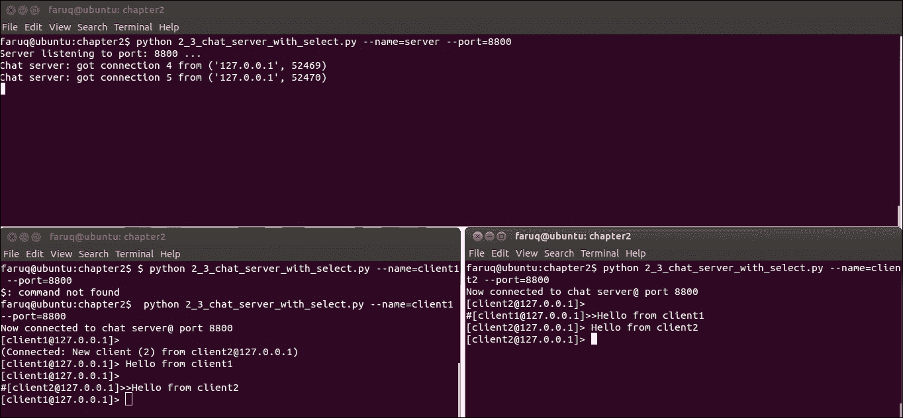
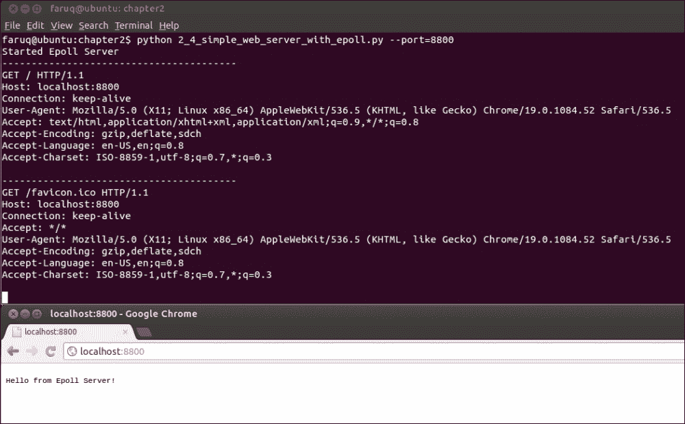
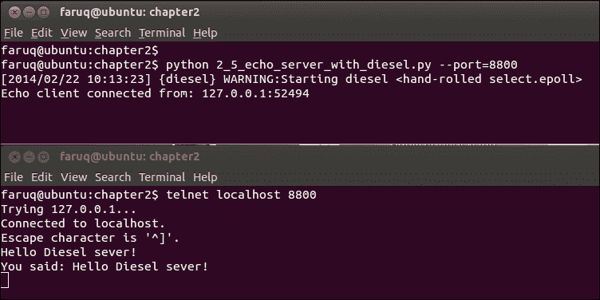

# 第二章. 为提高性能而进行多路复用套接字 I/O

在本章中，我们将介绍以下食谱：

+   在你的套接字服务器应用程序中使用 ForkingMixIn

+   在你的套接字服务器应用程序中使用 ThreadingMixIn

+   使用 select.select 编写聊天服务器

+   使用 select.epoll 多路复用 Web 服务器

+   使用 Diesel 并发库多路复用 echo 服务器

# 简介

本章重点介绍使用一些有用的技术来提高套接字服务器的性能。与上一章不同，这里我们考虑多个客户端将连接到服务器，并且通信可以是异步的。服务器不需要以阻塞方式处理来自客户端的请求，这可以独立完成。如果一个客户端接收或处理数据花费了更多时间，服务器不需要等待。它可以使用单独的线程或进程与其他客户端交谈。

在本章中，我们还将探讨`select`模块，该模块提供了特定平台的 I/O 监控功能。此模块建立在底层操作系统的内核的 select 系统调用之上。对于 Linux，手册页位于[`man7.org/linux/man-pages/man2/select.2.html`](http://man7.org/linux/man-pages/man2/select.2.html)，可以检查以查看此系统调用的可用功能。由于我们的套接字服务器希望与许多客户端交互，`select`可以非常有助于监控非阻塞套接字。还有一些第三方 Python 库也可以帮助我们同时处理多个客户端。我们包含了一个使用 Diesel 并发库的示例食谱。

尽管为了简洁起见，我们将使用两个或少数几个客户端，但读者可以自由扩展本章的食谱，并使用它们与成百上千的客户端一起使用。

# 在你的套接字服务器应用程序中使用 ForkingMixIn

你已经决定编写一个异步 Python 套接字服务器应用程序。服务器在处理客户端请求时不会阻塞。因此，服务器需要一个机制来独立处理每个客户端。

Python 2.7 版本的`SocketServer`类包含两个实用类：`ForkingMixIn`和`ThreadingMixIn`。`ForkingMixin`类将为每个客户端请求生成一个新的进程。本节将讨论此类。`ThreadingMixIn`类将在下一节中讨论。有关更多信息，您可以参考 Python 文档[`docs.python.org/2/library/socketserver.html`](http://docs.python.org/2/library/socketserver.html)。

## 如何做到...

让我们重写之前在 第一章 中描述的回显服务器，即 *套接字、IPv4 和简单的客户端/服务器编程*。我们可以利用 `SocketServer` 类家族的子类。它提供了现成的 TCP、UDP 和其他协议服务器。我们可以创建一个从 `TCPServer` 和 `ForkingMixin` 继承而来的 `ForkingServer` 类。前者父类将使我们的 `ForkingServer` 类能够执行我们之前手动执行的所有必要服务器操作，例如创建套接字、绑定到地址和监听传入的连接。我们的服务器还需要从 `ForkingMixin` 继承以异步处理客户端。

`ForkingServer` 类也需要设置一个请求处理器，以规定如何处理客户端请求。在这里，我们的服务器将回显从客户端接收到的文本字符串。我们的请求处理器类 `ForkingServerRequestHandler` 是从 `SocketServer` 库提供的 `BaseRequestHandler` 继承而来的。

我们可以用面向对象的方式编写我们的回显服务器客户端，`ForkingClient`。在 Python 中，类的构造函数方法被称为 `__init__()`。按照惯例，它接受一个 self 参数来附加该特定类的属性或属性。`ForkingClient` 回显服务器将在 `__init__()` 中初始化，并在 `run()` 方法中分别向服务器发送消息。

如果你根本不熟悉**面向对象编程**（**OOP**），在尝试掌握这个食谱的同时，回顾 OOP 的基本概念可能会有所帮助。

为了测试我们的 `ForkingServer` 类，我们可以启动多个回显客户端，并查看服务器如何响应客户端。

列表 2.1 展示了在套接字服务器应用程序中使用 `ForkingMixin` 的示例代码如下：

```py
#!/usr/bin/env python
# Python Network Programming Cookbook -- Chapter - 2
# This program is optimized for Python 2.7.
# It may run on any other version with/without modifications.
# See more: http://docs.python.org/2/library/socketserver.html

import os
import socket
import threading
import SocketServer

SERVER_HOST = 'localhost'
SERVER_PORT = 0 # tells the kernel to pick up a port dynamically
BUF_SIZE = 1024
ECHO_MSG = 'Hello echo server!'

class ForkedClient():
    """ A client to test forking server"""    
    def __init__(self, ip, port):
        # Create a socket
        self.sock = socket.socket(socket.AF_INET, socket.SOCK_STREAM)
        # Connect to the server
	     self.sock.connect((ip, port))

    def run(self):
        """ Client playing with the server"""
        # Send the data to server
        current_process_id = os.getpid()
        print 'PID %s Sending echo message to the server : "%s"' % (current_process_id, ECHO_MSG)
        sent_data_length = self.sock.send(ECHO_MSG)
        print "Sent: %d characters, so far..." %sent_data_length

        # Display server response
        response = self.sock.recv(BUF_SIZE)
        print "PID %s received: %s" % (current_process_id, response[5:])

    def shutdown(self):
        """ Cleanup the client socket """
        self.sock.close()

class ForkingServerRequestHandler(SocketServer.BaseRequestHandler):

    def handle(self):        
        # Send the echo back to the client
        data = self.request.recv(BUF_SIZE)
        current_process_id = os.getpid()
        response = '%s: %s' % (current_process_id, data)
        print "Server sending response [current_process_id: data] = [%s]" %response
        self.request.send(response)
        return

class ForkingServer(SocketServer.ForkingMixIn,
                    SocketServer.TCPServer,
                    ):
    """Nothing to add here, inherited everything necessary from parents"""
    pass

def main():
    # Launch the server
    server = ForkingServer((SERVER_HOST, SERVER_PORT), ForkingServerRequestHandler)
    ip, port = server.server_address # Retrieve the port number
    server_thread = threading.Thread(target=server.serve_forever)
    server_thread.setDaemon(True) # don't hang on exit
    server_thread.start()
    print 'Server loop running PID: %s' %os.getpid()

    # Launch the client(s)
    client1 =  ForkedClient(ip, port)
    client1.run()

    client2 =  ForkedClient(ip, port)
    client2.run()

    # Clean them up
    server.shutdown()
    client1.shutdown()
    client2.shutdown()
    server.socket.close()

if __name__ == '__main__':
    main()
```

## 它是如何工作的...

`ForkingServer` 的一个实例在主线程中启动，该线程已被设置为守护线程以在后台运行。现在，两个客户端已经开始与服务器交互。

如果你运行脚本，它将显示以下输出：

```py
$ python 2_1_forking_mixin_socket_server.py
Server loop running PID: 12608
PID 12608 Sending echo message to the server : "Hello echo server!"
Sent: 18 characters, so far...
Server sending response [current_process_id: data] = [12610: Hello echo server!]
PID 12608 received: : Hello echo server!
PID 12608 Sending echo message to the server : "Hello echo server!"
Sent: 18 characters, so far...
Server sending response [current_process_id: data] = [12611: Hello echo server!]
PID 12608 received: : Hello echo server!

```

服务器端口号可能因操作系统内核动态选择而不同。

# 在你的套接字服务器应用程序中使用 ThreadingMixIn

可能由于某些特定原因，例如，在多个线程之间共享该应用程序的状态，避免进程间通信的复杂性，或者其它原因，你更愿意编写一个基于线程的应用程序而不是基于进程的应用程序。在这种情况下，如果你喜欢使用 `SocketServer` 库编写异步网络服务器，你需要 `ThreadingMixin`。

## 准备工作

通过对我们之前的食谱进行一些小的修改，你可以得到一个使用 `ThreadingMixin` 的工作版本的网络服务器。

### 小贴士

**下载示例代码**

您可以从[`www.packtpub.com`](http://www.packtpub.com)上的账户下载您购买的所有 Packt 书籍的示例代码文件。如果您在其他地方购买了这本书，您可以访问[`www.packtpub.com/support`](http://www.packtpub.com/support)并注册，以便将文件直接通过电子邮件发送给您。

## 如何做...

如前所述，基于`ForkingMixIn`的 socket 服务器，`ThreadingMixIn`套接字服务器将遵循与回声服务器相同的编码模式，除了以下几点。首先，我们的`ThreadedTCPServer`将继承自`TCPServer`和`TheadingMixIn`。这个多线程版本将在客户端连接时启动一个新线程。更多详细信息可以在[`docs.python.org/2/library/socketserver.html`](http://docs.python.org/2/library/socketserver.html)找到。

我们套接字服务器的请求处理器类`ForkingServerRequestHandler`会将回声发送回客户端，从新的线程中。您可以在这里检查线程信息。为了简单起见，我们将客户端代码放在一个函数中而不是一个类中。客户端代码创建客户端套接字并向服务器发送消息。

列表 2.2 展示了使用`ThreadingMixIn`作为以下示例的回声套接字服务器示例代码：

```py
#!/usr/bin/env python
# Python Network Programming Cookbook -- Chapter - 2
# This program is optimized for Python 2.7
# It may run on any other version with/without modifications.
import os
import socket
import threading
import SocketServer
SERVER_HOST = 'localhost'
SERVER_PORT = 0 # tells the kernel to pick up a port dynamically
BUF_SIZE = 1024

def client(ip, port, message):
    """ A client to test threading mixin server"""    
    # Connect to the server
    sock = socket.socket(socket.AF_INET, socket.SOCK_STREAM)
    sock.connect((ip, port))
    try:
        sock.sendall(message)
        response = sock.recv(BUF_SIZE)
        print "Client received: %s" %response
    finally:
        sock.close()

class ThreadedTCPRequestHandler(SocketServer.BaseRequestHandler):
    """ An example of threaded TCP request handler """
    def handle(self):
        data = self.request.recv(1024)
        current_thread = threading.current_thread()
        response = "%s: %s" %(current_thread.name, data)
        self.request.sendall(response)

class ThreadedTCPServer(SocketServer.ThreadingMixIn, SocketServer.TCPServer):
    """Nothing to add here, inherited everything necessary from parents"""
    pass
if __name__ == "__main__":
    # Run server
    server = ThreadedTCPServer((SERVER_HOST, SERVER_PORT), ThreadedTCPRequestHandler)
    ip, port = server.server_address # retrieve ip address
    # Start a thread with the server -- one  thread per request
    server_thread = threading.Thread(target=server.serve_forever)
    # Exit the server thread when the main thread exits
    server_thread.daemon = True
    server_thread.start()
    print "Server loop running on thread: %s"  %server_thread.name
    # Run clients
    client(ip, port, "Hello from client 1")
    client(ip, port, "Hello from client 2")
    client(ip, port, "Hello from client 3")
    # Server cleanup
    server.shutdown()
```

## 它是如何工作的...

这个菜谱首先创建一个服务器线程，并在后台启动它。然后它启动三个测试客户端向服务器发送消息。作为回应，服务器将消息回显给客户端。在服务器的请求处理器的`handle()`方法中，您可以看到我们检索当前线程信息并打印它。这应该在每个客户端连接中都是不同的。

在这个客户端/服务器对话中，使用了`sendall()`方法来确保发送所有数据而不丢失：

```py
$ python 2_2_threading_mixin_socket_server.py
Server loop running on thread: Thread-1
Client received: Thread-2: Hello from client 1
Client received: Thread-3: Hello from client 2
Client received: Thread-4: Hello from client 3

```

# 使用 select.select 编写聊天服务器

在任何较大的网络服务器应用程序中，每个客户端都可能是数百或数千个并发连接到服务器，为每个客户端启动一个单独的线程或进程可能不可行。由于可用的内存和主机 CPU 功率有限，我们需要一种更好的技术来处理大量客户端。幸运的是，Python 提供了`select`模块来克服这个问题。

## 如何做...

我们需要编写一个高效的聊天服务器，能够处理数百或大量客户端连接。我们将使用`select()`方法，来自`select`模块，这将使我们的聊天服务器和客户端能够执行任何任务，而无需始终阻塞发送或接收调用。

让我们设计这个菜谱，使得一个单独的脚本可以通过额外的`--name`参数启动客户端和服务器。只有当从命令行传递`--name=server`时，脚本才会启动聊天服务器。传递给`--name`参数的任何其他值，例如`client1`、`client2`，将启动一个聊天客户端。我们可以使用`--port`参数从命令行指定我们的聊天服务器端口号。对于更大的应用程序，可能更倾向于为服务器和客户端编写独立的模块。

列表 2.3 显示了使用`select.select`作为以下示例的聊天应用程序：

```py
#!/usr/bin/env python
# Python Network Programming Cookbook -- Chapter - 2
# This program is optimized for Python 2.7
# It may run on any other version with/without modifications
import select
import socket
import sys
import signal
import cPickle
import struct
import argparse

SERVER_HOST = 'localhost'
CHAT_SERVER_NAME = 'server'

# Some utilities
def send(channel, *args):
    buffer = cPickle.dumps(args)
    value = socket.htonl(len(buffer))
    size = struct.pack("L",value)
    channel.send(size)
    channel.send(buffer)

def receive(channel):
    size = struct.calcsize("L")
    size = channel.recv(size)
    try:
        size = socket.ntohl(struct.unpack("L", size)[0])
    except struct.error, e:
        return ''
    buf = ""
    while len(buf) < size:
        buf = channel.recv(size - len(buf))
    return cPickle.loads(buf)[0]
```

`send()`方法接受一个名为`channel`的命名参数和一个位置参数`*args`。它使用`cPickle`模块的`dumps()`方法序列化数据。它使用`struct`模块确定数据的大小。同样，`receive()`方法接受一个名为`channel`的命名参数。

现在我们可以按照以下方式编写`ChatServer`类：

```py
class ChatServer(object):
    """ An example chat server using select """
 def __init__(self, port, backlog=5):
   self.clients = 0
   self.clientmap = {}
   self.outputs = [] # list output sockets
   self.server = socket.socket(socket.AF_INET, socket.SOCK_STREAM)
   # Enable re-using socket address
   self.server.setsockopt(socket.SOL_SOCKET, socket.SO_REUSEADDR, 1)
   self.server.bind((SERVER_HOST, port))
   print 'Server listening to port: %s ...' %port
   self.server.listen(backlog)
   # Catch keyboard interrupts
   signal.signal(signal.SIGINT, self.sighandler)

    def sighandler(self, signum, frame):
        """ Clean up client outputs"""
        # Close the server
        print 'Shutting down server...'
        # Close existing client sockets
        for output in self.outputs:
            output.close()            
        self.server.close()

    def get_client_name(self, client):
        """ Return the name of the client """
        info = self.clientmap[client]
        host, name = info[0][0], info[1]
        return '@'.join((name, host))
```

现在的`ChatServer`类的主要可执行方法应该如下所示：

```py
    def run(self):
        inputs = [self.server, sys.stdin]
        self.outputs = []
        running = True
        while running:
         try:
          readable, writeable, exceptional = \
          select.select(inputs, self.outputs, [])
            except select.error, e:
                break
            for sock in readable:
                if sock == self.server:
                    # handle the server socket
                    client, address = self.server.accept()
                    print "Chat server: got connection %d from %s" %\                     (client.fileno(), address)
                    # Read the login name
                    cname = receive(client).split('NAME: ')[1]
                    # Compute client name and send back
                    self.clients += 1
                    send(client, 'CLIENT: ' + str(address[0]))
                    inputs.append(client)
                    self.clientmap[client] = (address, cname)
                    # Send joining information to other clients
                    msg = "\n(Connected: New client (%d) from %s)" %\                   (self.clients, self.get_client_name(client))
                    for output in self.outputs:
                        send(output, msg)
                    self.outputs.append(client)
                elif sock == sys.stdin:
                    # handle standard input
                    junk = sys.stdin.readline()
                    running = False
                else:
                    # handle all other sockets
                    try:
                        data = receive(sock)
                        if data:
                            # Send as new client's message...
                            msg = '\n#[' + self.get_client_name(sock)\
                                   + ']>>' + data
                            # Send data to all except ourself
                            for output in self.outputs:
                                if output != sock:
                                    send(output, msg)
                        else:
                            print "Chat server: %d hung up" % \
                            sock.fileno()
                            self.clients -= 1
                            sock.close()
                            inputs.remove(sock)
                            self.outputs.remove(sock)
                            # Sending client leaving info to others
                            msg = "\n(Now hung up: Client from %s)" %\                             self.get_client_name(sock)
                            for output in self.outputs:
                                send(output, msg)
                    except socket.error, e:
                        # Remove
                        inputs.remove(sock)
                        self.outputs.remove(sock)
        self.server.close()
```

聊天服务器初始化时带有一些数据属性。它存储客户端的数量、每个客户端的映射和输出套接字。通常的服务器套接字创建也会设置重用地址的选项，这样就不会在相同的端口上再次启动服务器时出现问题。聊天服务器构造函数的可选`backlog`参数设置了服务器可以监听的最大排队连接数。

这个聊天服务器的一个有趣方面是使用`signal`模块捕获用户中断，通常是通过键盘。因此，注册了一个信号处理程序`sighandler`用于中断信号（`SIGINT`）。这个信号处理程序捕获键盘中断信号并关闭所有可能等待发送数据的输出套接字。

我们聊天服务器的主执行方法`run()`在一个`while`循环中执行其操作。该方法注册了一个选择接口，其中输入参数是聊天服务器套接字`stdin`。输出参数由服务器的输出套接字列表指定。作为回报，`select`提供了三个列表：可读、可写和异常套接字。聊天服务器只对可读套接字感兴趣，其中有一些数据准备好被读取。如果该套接字指向自身，那么这意味着已经建立了一个新的客户端连接。因此，服务器检索客户端的名称并将此信息广播给其他客户端。在另一种情况下，如果输入参数有任何内容，聊天服务器将退出。同样，聊天服务器处理其他客户端的套接字输入。它将接收到的任何客户端数据中继给其他客户端，并共享他们的加入/离开信息。

聊天客户端代码类应包含以下代码：

```py
class ChatClient(object):
    """ A command line chat client using select """

    def __init__(self, name, port, host=SERVER_HOST):
        self.name = name
        self.connected = False
        self.host = host
        self.port = port
        # Initial prompt
        self.prompt='[' + '@'.join((name, socket.gethostname().split('.')[0])) + ']> '
        # Connect to server at port
        try:
            self.sock = socket.socket(socket.AF_INET, socket.SOCK_STREAM)
            self.sock.connect((host, self.port))
            print "Now connected to chat server@ port %d" % self.port
            self.connected = True
            # Send my name...
            send(self.sock,'NAME: ' + self.name)
            data = receive(self.sock)
            # Contains client address, set it
            addr = data.split('CLIENT: ')[1]
            self.prompt = '[' + '@'.join((self.name, addr)) + ']> '
        except socket.error, e:
            print "Failed to connect to chat server @ port %d" % self.port
            sys.exit(1)

    def run(self):
        """ Chat client main loop """
        while self.connected:
            try:
                sys.stdout.write(self.prompt)
                sys.stdout.flush()
                # Wait for input from stdin and socket
                readable, writeable,exceptional = select.select([0, self.sock], [],[])
                for sock in readable:
                    if sock == 0:
                        data = sys.stdin.readline().strip()
                        if data: send(self.sock, data)
                    elif sock == self.sock:
                        data = receive(self.sock)
                        if not data:
                            print 'Client shutting down.'
                            self.connected = False
                            break
                        else:
                            sys.stdout.write(data + '\n')
                            sys.stdout.flush()

            except KeyboardInterrupt:
                print " Client interrupted. """
                self.sock.close()
                break
```

聊天客户端使用名称参数初始化，并在连接时将此名称发送到聊天服务器。它还设置了自定义提示`[ name@host ]>`。此客户端的执行方法`run()`只要与服务器保持连接就会继续其操作。类似于聊天服务器，聊天客户端也使用`select()`进行注册。如果任何可读套接字准备好，它将使客户端能够接收数据。如果 sock 值是`0`并且有可用数据，则可以发送数据。相同的信息也会显示在 stdout 中，或者在我们的情况下，是命令行控制台。现在，我们的主方法应该获取命令行参数，并按照以下方式调用服务器或客户端：

```py
if __name__ == "__main__":
    parser = argparse.ArgumentParser(description='Socket Server Example with Select')
    parser.add_argument('--name', action="store", dest="name", required=True)
    parser.add_argument('--port', action="store", dest="port", type=int, required=True)
    given_args = parser.parse_args()
    port = given_args.port
    name = given_args.name
    if name == CHAT_SERVER_NAME:
        server = ChatServer(port)
        server.run()
    else:
        client = ChatClient(name=name, port=port)
        client.run()
```

我们希望运行这个脚本三次：一次用于聊天服务器，两次用于两个聊天客户端。对于服务器，我们传递`–name=server`和`port=8800`。对于`client1`，我们更改名称参数`--name=client1`，对于`client2`，我们设置`--name=client2`。然后从`client1`的值提示中发送消息`"Hello from client 1"`，该消息将在`client2`的提示中打印出来。同样，我们从`client2`的提示中发送`"hello from client 2"`，该消息将在`client1`的提示中显示。

服务器输出如下：

```py
$ python 2_3_chat_server_with_select.py --name=server --port=8800
Server listening to port: 8800 ...
Chat server: got connection 4 from ('127.0.0.1', 56565)
Chat server: got connection 5 from ('127.0.0.1', 56566)

```

`client1`的输出如下：

```py
$ python 2_3_chat_server_with_select.py --name=client1 --port=8800
Now connected to chat server@ port 8800
[client1@127.0.0.1]>
(Connected: New client (2) from client2@127.0.0.1)
[client1@127.0.0.1]> Hello from client 1
[client1@127.0.0.1]>
#[client2@127.0.0.1]>>hello from client 2

```

`client2`的输出如下：

```py
$ python 2_3_chat_server_with_select.py --name=client2 --port=8800
Now connected to chat server@ port 8800
[client2@127.0.0.1]>
#[client1@127.0.0.1]>>Hello from client 1
[client2@127.0.0.1]> hello from client 2
[client2@127.0.0.1]

```

整个交互过程如下截图所示：



## 它是如何工作的...

在我们模块的顶部，我们定义了两个实用函数：`send()`和`receive()`。

聊天服务器和客户端使用这些实用函数，这些函数之前已经演示过。之前也讨论了聊天服务器和客户端方法的细节。

# 使用 select.epoll 多路复用 Web 服务器

Python 的`select`模块有几个平台特定的网络事件管理函数。在 Linux 机器上，`epoll`可用。这将利用操作系统内核来轮询网络事件，并让我们的脚本知道何时发生某些事情。这听起来比之前提到的`select.select`方法更高效。

## 如何操作...

让我们编写一个简单的 Web 服务器，它可以向任何连接的 Web 浏览器返回一行文本。

核心思想是在这个 Web 服务器初始化期间，我们应该调用`select.epoll()`并注册我们服务器的文件描述符以接收事件通知。在 Web 服务器的执行代码中，监视套接字事件如下：

```py
Listing 2.4 Simple web server using select.epoll
#!/usr/bin/env python
# Python Network Programming Cookbook -- Chapter - 2
# This program is optimized for Python 2.7
# It may run on any other version with/without modifications.
import socket
import select
import argparse
SERVER_HOST = 'localhost'
EOL1 = b'\n\n'
EOL2 = b'\n\r\n'
SERVER_RESPONSE  = b"""HTTP/1.1 200 OK\r\nDate: Mon, 1 Apr 2013 01:01:01 GMT\r\nContent-Type: text/plain\r\nContent-Length: 25\r\n\r\n
Hello from Epoll Server!"""

class EpollServer(object):
    """ A socket server using Epoll"""
    def __init__(self, host=SERVER_HOST, port=0):
      self.sock = socket.socket(socket.AF_INET, socket.SOCK_STREAM)
      self.sock.setsockopt(socket.SOL_SOCKET, socket.SO_REUSEADDR, 1)
      self.sock.bind((host, port))
      self.sock.listen(1)
      self.sock.setblocking(0)
      self.sock.setsockopt(socket.IPPROTO_TCP, socket.TCP_NODELAY, 1)
      print "Started Epoll Server"
      self.epoll = select.epoll()
      self.epoll.register(self.sock.fileno(), select.EPOLLIN)

 def run(self):
  """Executes epoll server operation"""
  try:
     connections = {}; requests = {}; responses = {}
     while True:
   events = self.epoll.poll(1)
   for fileno, event in events:
     if fileno == self.sock.fileno():
       connection, address = self.sock.accept()
       connection.setblocking(0)
       self.epoll.register(connection.fileno(), select.EPOLLIN)
       connections[connection.fileno()] = connection
       requests[connection.fileno()] = b''
       responses[connection.fileno()] = SERVER_RESPONSE
     elif event & select.EPOLLIN:
       requests[fileno] += connections[fileno].recv(1024)
       if EOL1 in requests[fileno] or EOL2 in requests[fileno]:
             self.epoll.modify(fileno, select.EPOLLOUT)
             print('-'*40 + '\n' + requests[fileno].decode()[:-2])
      elif event & select.EPOLLOUT:
         byteswritten = connections[fileno].send(responses[fileno])
         responses[fileno] = responses[fileno][byteswritten:]
         if len(responses[fileno]) == 0:
             self.epoll.modify(fileno, 0)
             connections[fileno].shutdown(socket.SHUT_RDWR)
         elif event & select.EPOLLHUP:
              self.epoll.unregister(fileno)
              connections[fileno].close()
              del connections[fileno]
 finally:
   self.epoll.unregister(self.sock.fileno())
   self.epoll.close()
   self.sock.close()

if __name__ == '__main__':
 parser = argparse.ArgumentParser(description='Socket Server Example with Epoll')
 parser.add_argument('--port', action="store", dest="port", type=int, required=True)
    given_args = parser.parse_args()
    port = given_args.port
    server = EpollServer(host=SERVER_HOST, port=port)
    server.run()
```

如果你运行此脚本并通过浏览器（如 Firefox 或 IE）访问 Web 服务器，通过输入`http://localhost:8800/`，控制台将显示以下输出：

```py
$ python 2_4_simple_web_server_with_epoll.py --port=8800
Started Epoll Server
----------------------------------------
GET / HTTP/1.1
Host: localhost:8800
Connection: keep-alive
Accept: text/html,application/xhtml+xml,application/xml;q=0.9,*/*;q=0.8
User-Agent: Mozilla/5.0 (X11; Linux i686) AppleWebKit/537.31 (KHTML, like Gecko) Chrome/26.0.1410.43 Safari/537.31
DNT: 1
Accept-Encoding: gzip,deflate,sdch
Accept-Language: en-GB,en-US;q=0.8,en;q=0.6
Accept-Charset: ISO-8859-1,utf-8;q=0.7,*;q=0.3
Cookie: MoodleSession=69149dqnvhett7br3qebsrcmh1; MOODLEID1_=%257F%25BA%2B%2540V

----------------------------------------
GET /favicon.ico HTTP/1.1
Host: localhost:8800
Connection: keep-alive
Accept: */*
DNT: 1
User-Agent: Mozilla/5.0 (X11; Linux i686) AppleWebKit/537.31 (KHTML, like Gecko) Chrome/26.0.1410.43 Safari/537.31
Accept-Encoding: gzip,deflate,sdch
Accept-Language: en-GB,en-US;q=0.8,en;q=0.6
Accept-Charset: ISO-8859-1,utf-8;q=0.7,*;q=0.3

```

你还将在你的浏览器中看到以下行：

```py
Hello from Epoll Server!

```

以下截图显示了该场景：



## 如何操作...

在我们的`EpollServer` Web 服务器的构造函数中，创建了一个套接字服务器并将其绑定到给定端口的 localhost。服务器的套接字设置为非阻塞模式（`setblocking(0)`）。还设置了`TCP_NODELAY`选项，以便我们的服务器可以不进行缓冲交换数据（如 SSH 连接的情况）。接下来，创建了`select.epoll()`实例，并将套接字的文件描述符传递给该实例以帮助监控。

在 Web 服务器的`run()`方法中，它开始接收套接字事件。这些事件如下表示：

+   `EPOLLIN`：此套接字读取事件

+   `EPOLLOUT`：此套接字写入事件

对于服务器套接字，它设置了响应`SERVER_RESPONSE`。当套接字有任何想要写入数据的连接时，它可以在`EPOLLOUT`事件案例中这样做。`EPOLLHUP`事件表示由于内部错误条件而意外关闭套接字。

# 使用 Diesel 并发库的多路复用回显服务器

有时您需要编写一个大型自定义网络应用程序，该应用程序希望避免重复的服务器初始化代码，该代码创建套接字、绑定到地址、监听和处理基本错误。有许多 Python 网络库可以帮助您删除样板代码。在这里，我们可以检查一个名为 Diesel 的库。

## 准备工作

Diesel 使用带有协程的非阻塞技术来高效地编写网络服务器。正如网站所述，*Diesel 的核心是一个紧密的事件循环，使用 epoll 提供接近平坦的性能，支持 10,000 个连接以及更多*。在这里，我们通过一个简单的回显服务器介绍 Diesel。您还需要 diesel 库 3.0 或更高版本。您可以使用 pip 命令完成此操作：`$ pip install diesel >= 3.0`。

## 如何做...

在 Python Diesel 框架中，应用程序使用`Application()`类的实例初始化，并使用此实例注册事件处理器。让我们看看编写回显服务器有多简单。

列表 2.5 显示了使用 Diesel 作为以下回显服务器示例的代码：

```py
#!/usr/bin/env python
# Python Network Programming Cookbook -- Chapter - 2
# This program is optimized for Python 2.7.
# It may run on any other version with/without modifications.
# You also need diesel library 3.0 or any later version

import diesel
import argparse

class EchoServer(object):
    """ An echo server using diesel"""

    def handler(self, remote_addr):
        """Runs the echo server"""
        host, port = remote_addr[0], remote_addr[1]
        print "Echo client connected from: %s:%d" %(host, port)

        while True:
            try:
                message = diesel.until_eol()
                your_message = ': '.join(['You said', message])
                diesel.send(your_message)
            except Exception, e:
                print "Exception:",e

def main(server_port):
    app = diesel.Application()
    server = EchoServer()    
    app.add_service(diesel.Service(server.handler, server_port))
    app.run()

if __name__ == '__main__':
    parser = argparse.ArgumentParser(description='Echo server example with Diesel')
    parser.add_argument('--port', action="store", dest="port", type=int, required=True)
    given_args = parser.parse_args()
    port = given_args.port
    main(port)
```

如果您运行此脚本，服务器将显示以下输出：

```py
$ python 2_5_echo_server_with_diesel.py --port=8800
[2013/04/08 11:48:32] {diesel} WARNING:Starting diesel <hand-rolled select.epoll>
Echo client connected from: 127.0.0.1:56603

```

在另一个控制台窗口中，可以启动另一个 Telnet 客户端，并按以下方式测试向我们的服务器发送的回显消息：

```py
$ telnet localhost 8800
Trying 127.0.0.1...
Connected to localhost.
Escape character is '^]'.
Hello Diesel server ?
You said: Hello Diesel server ?

```

以下截图说明了 Diesel 聊天服务器的交互：



## 它是如何工作的...

我们的脚本为`--port`参数取了一个命令行参数，并将其传递给初始化并运行我们的 Diesel 应用程序的`main()`函数。

Diesel 有一个服务概念，其中可以使用许多服务构建应用程序。`EchoServer`有一个`handler()`方法。这使得服务器能够处理单个客户端连接。`Service()`方法接受`handler`方法和端口号来运行该服务。

在`handler()`方法内部，我们确定服务器的行为。在这种情况下，服务器只是返回消息文本。

如果我们将这段代码与第一章中的*套接字、IPv4 和简单的客户端/服务器编程*部分，在*编写简单的回声客户端/服务器应用程序*配方（*列表 1.13a*）中进行比较，那么我们可以非常清楚地看到，我们不需要编写任何样板代码，因此可以很容易地专注于高级应用程序逻辑。
