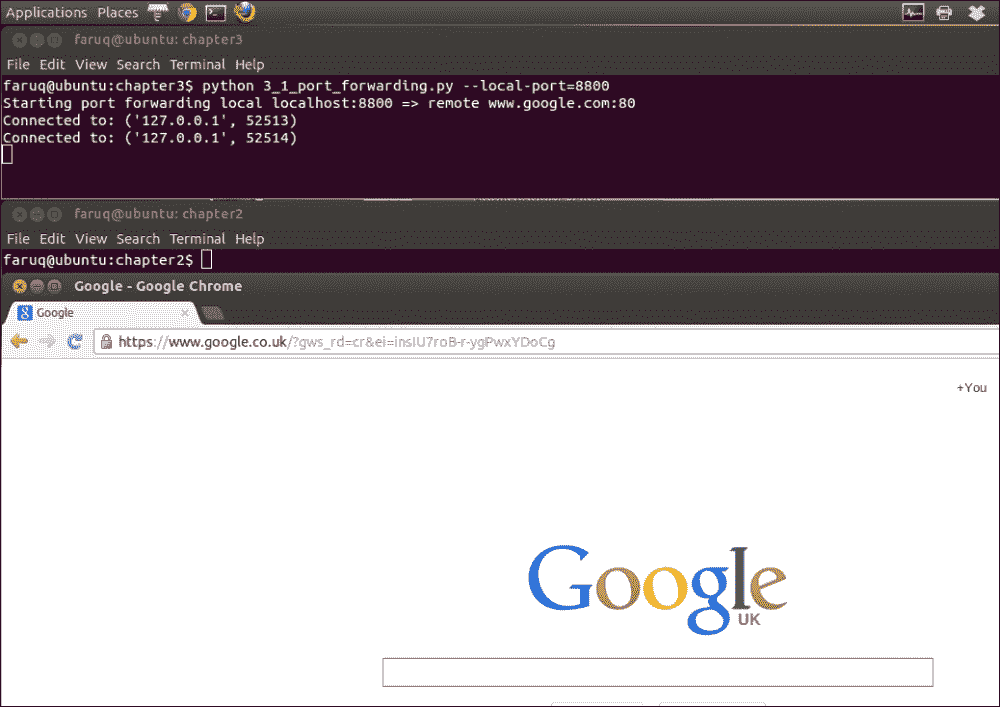
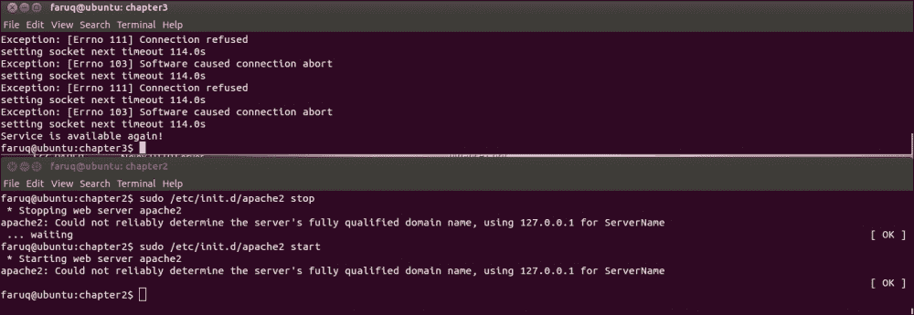
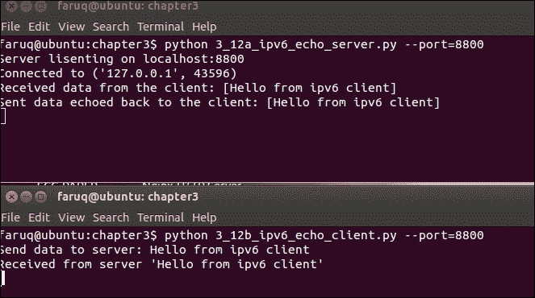

# 第三章：IPv6、Unix 域套接字和网络接口

在本章中，我们将涵盖以下主题：

+   将本地端口转发到远程主机

+   使用 ICMP ping 网络上的主机

+   等待远程网络服务

+   列出您的机器上的接口

+   查找您的机器上特定接口的 IP 地址

+   检查您的机器上的接口是否已启动

+   检测您的网络上的不活跃机器

+   使用连接套接字（socketpair）执行基本 IPC

+   使用 Unix 域套接字执行 IPC

+   查看您的 Python 是否支持 IPv6 套接字

+   从 IPv6 地址中提取 IPv6 前缀

+   编写 IPv6 echo 客户端/服务器

# 简介

本章扩展了 Python 的 socket 库的使用，结合了一些第三方库。它还讨论了一些高级技术，例如 Python 标准库中的异步 `ayncore` 模块。本章还涉及了各种协议，从 ICMP ping 到 IPv6 客户端/服务器。

在本章中，通过一些示例配方介绍了一些有用的 Python 第三方模块。例如，网络数据包捕获库 **Scapy** 在 Python 网络程序员中广为人知。

一些配方致力于探索 Python 中的 IPv6 实用工具，包括 IPv6 客户端/服务器。其他一些配方涵盖了 Unix 域套接字。

# 将本地端口转发到远程主机

有时，您可能需要创建一个本地端口转发器，将所有从本地端口到特定远程主机的流量重定向。这可能有助于允许代理用户浏览某些网站，同时防止他们浏览其他网站。

## 如何做到这一点...

让我们创建一个本地端口转发脚本，该脚本将所有接收到的端口 8800 上的流量重定向到谷歌首页 ([`www.google.com`](http://www.google.com))。我们可以将本地和远程主机以及端口号传递给此脚本。为了简化，让我们只指定本地端口号，因为我们知道 Web 服务器运行在端口 80 上。

列表 3.1 显示了端口转发示例，如下所示：

```py
#!/usr/bin/env python
# Python Network Programming Cookbook -- Chapter – 3
# This program is optimized for Python 2.7.
# It may run on any other version with/without modifications.

import argparse
LOCAL_SERVER_HOST = 'localhost'
REMOTE_SERVER_HOST = 'www.google.com'
BUFSIZE = 4096
import asyncore
import socket
```

首先，我们定义 `端口转发器` 类：

```py
class PortForwarder(asyncore.dispatcher):
    def __init__(self, ip, port, remoteip,remoteport,backlog=5):
        asyncore.dispatcher.__init__(self)
        self.remoteip=remoteip
        self.remoteport=remoteport
        self.create_socket(socket.AF_INET,socket.SOCK_STREAM)
        self.set_reuse_addr()
        self.bind((ip,port))
        self.listen(backlog)
    def handle_accept(self):
        conn, addr = self.accept()
        print "Connected to:",addr
        Sender(Receiver(conn),self.remoteip,self.remoteport)
```

现在，我们需要指定 `接收器` 和 `发送器` 类，如下所示：

```py
class Receiver(asyncore.dispatcher):
    def __init__(self,conn):
        asyncore.dispatcher.__init__(self,conn)
        self.from_remote_buffer=''
        self.to_remote_buffer=''
        self.sender=None
    def handle_connect(self):
        pass
    def handle_read(self):
        read = self.recv(BUFSIZE)
        self.from_remote_buffer += read
    def writable(self):
        return (len(self.to_remote_buffer) > 0)
    def handle_write(self):
        sent = self.send(self.to_remote_buffer)
        self.to_remote_buffer = self.to_remote_buffer[sent:]
    def handle_close(self):
        self.close()
        if self.sender:
            self.sender.close()
class Sender(asyncore.dispatcher):
    def __init__(self, receiver, remoteaddr,remoteport):
        asyncore.dispatcher.__init__(self)
        self.receiver=receiver
        receiver.sender=self
        self.create_socket(socket.AF_INET, socket.SOCK_STREAM)
        self.connect((remoteaddr, remoteport))
    def handle_connect(self):
        pass
    def handle_read(self):
        read = self.recv(BUFSIZE)
        self.receiver.to_remote_buffer += read
    def writable(self):
        return (len(self.receiver.from_remote_buffer) > 0)
    def handle_write(self):
        sent = self.send(self.receiver.from_remote_buffer)
        self.receiver.from_remote_buffer = self.receiver.from_remote_buffer[sent:]
    def handle_close(self):
        self.close()
        self.receiver.close()

if __name__ == "__main__":
    parser = argparse.ArgumentParser(description='Port forwarding example')
    parser.add_argument('--local-host', action="store", dest="local_host", default=LOCAL_SERVER_HOST)
    parser.add_argument('--local-port', action="store", dest="local_port", type=int, required=True)
    parser.add_argument('--remote-host', action="store", dest="remote_host",  default=REMOTE_SERVER_HOST)
    parser.add_argument('--remote-port', action="store", dest="remote_port", type=int, default=80)
    given_args = parser.parse_args() 
    local_host, remote_host = given_args.local_host, given_args.remote_host
    local_port, remote_port = given_args.local_port, given_args.remote_port
    print "Starting port forwarding local %s:%s => remote %s:%s" % (local_host, local_port, remote_host, remote_port)
    PortForwarder(local_host, local_port, remote_host, remote_port)
    asyncore.loop()
```

如果您运行此脚本，它将显示以下输出：

```py
$ python 3_1_port_forwarding.py --local-port=8800 
Starting port forwarding local localhost:8800 => remote www.google.com:80 

```

现在，打开您的浏览器并访问 `http://localhost:8800`。这将带您进入谷歌首页，脚本将打印类似以下命令的内容：

```py
Connected to: ('127.0.0.1', 38557)

```

以下截图显示了将本地端口转发到远程主机：



## 它是如何工作的...

我们创建了一个从 `asyncore.dispatcher` 继承的端口转发类 `PortForwarder subclassed`，它围绕套接字对象进行包装。当某些事件发生时，它提供了一些额外的有用功能，例如，当连接成功或客户端连接到服务器套接字时。您可以选择覆盖此类中定义的方法集。在我们的例子中，我们只覆盖了 `handle_accept()` 方法。

已从 `asyncore.dispatcher` 派生出两个其他类。`Receiver` 类处理传入的客户端请求，而 `Sender` 类接收此 `Receiver` 实例并处理发送到客户端的数据。如您所见，这两个类覆盖了 `handle_read()`、`handle_write()` 和 `writeable()` 方法，以促进远程主机和本地客户端之间的双向通信。

总结来说，`PortForwarder` 类在本地套接字中接收传入的客户端请求，并将其传递给 `Sender` 类实例，该实例随后使用 `Receiver` 类实例在指定的端口上与远程服务器建立双向通信。

# 使用 ICMP 对网络上的主机进行 ping 操作

ICMP ping 是您曾经遇到的最常见的网络扫描类型。在命令行提示符或终端中打开并输入 `ping www.google.com` 非常容易。在 Python 程序内部这样做有多难？这个配方为您展示了 Python ping 的示例。

## 准备工作

您需要在您的机器上具有超级用户或管理员权限才能运行此配方。

## 如何操作...

您可以懒洋洋地编写一个 Python 脚本，该脚本调用系统 ping 命令行工具，如下所示：

```py
import subprocess
import shlex

command_line = "ping -c 1 www.google.com"
args = shlex.split(command_line)
try:
      subprocess.check_call(args,stdout=subprocess.PIPE,\
stderr=subprocess.PIPE)
    print "Google web server is up!"
except subprocess.CalledProcessError:
    print "Failed to get ping."
```

然而，在许多情况下，系统的 ping 可执行文件可能不可用或不可访问。在这种情况下，我们需要一个纯 Python 脚本来执行 ping 操作。请注意，此脚本需要以超级用户或管理员身份运行。

列表 3.2 显示了如下 ICMP ping：

```py
#!/usr/bin/env python
# Python Network Programming Cookbook -- Chapter – 3
# This program is optimized for Python 2.7.
# It may run on any other version with/without modifications.

import os
import argparse
import socket
import struct
import select
import time

ICMP_ECHO_REQUEST = 8 # Platform specific
DEFAULT_TIMEOUT = 2
DEFAULT_COUNT = 4 

class Pinger(object):
    """ Pings to a host -- the Pythonic way"""
    def __init__(self, target_host, count=DEFAULT_COUNT, timeout=DEFAULT_TIMEOUT):
        self.target_host = target_host
        self.count = count
        self.timeout = timeout
    def do_checksum(self, source_string):
        """  Verify the packet integritity """
        sum = 0
        max_count = (len(source_string)/2)*2
        count = 0
        while count < max_count:
            val = ord(source_string[count + 1])*256 + ord(source_string[count])
            sum = sum + val
            sum = sum & 0xffffffff 
            count = count + 2
        if max_count<len(source_string):
            sum = sum + ord(source_string[len(source_string) - 1])
            sum = sum & 0xffffffff 
        sum = (sum >> 16)  +  (sum & 0xffff)
        sum = sum + (sum >> 16)
        answer = ~sum
        answer = answer & 0xffff
        answer = answer >> 8 | (answer << 8 & 0xff00)
        return answer

    def receive_pong(self, sock, ID, timeout):
        """
        Receive ping from the socket.
        """
        time_remaining = timeout
        while True:
            start_time = time.time()
            readable = select.select([sock], [], [], time_remaining)
            time_spent = (time.time() - start_time)
            if readable[0] == []: # Timeout
                return

            time_received = time.time()
            recv_packet, addr = sock.recvfrom(1024)
            icmp_header = recv_packet[20:28]
            type, code, checksum, packet_ID, sequence = struct.unpack(
                "bbHHh", icmp_header
            )
            if packet_ID == ID:
                bytes_In_double = struct.calcsize("d")
                time_sent = struct.unpack("d", recv_packet[28:28 + bytes_In_double])[0]
                return time_received - time_sent

            time_remaining = time_remaining - time_spent
            if time_remaining <= 0:
                return
```

我们需要一个 `send_ping()` 方法，它将 ping 请求的数据发送到目标主机。此外，这将调用 `do_checksum()` 方法来检查 ping 数据的完整性，如下所示：

```py
    def send_ping(self, sock,  ID):
        """
        Send ping to the target host
        """
        target_addr  =  socket.gethostbyname(self.target_host)
        my_checksum = 0
        # Create a dummy header with a 0 checksum.
        header = struct.pack("bbHHh", ICMP_ECHO_REQUEST, 0, my_checksum, ID, 1)
        bytes_In_double = struct.calcsize("d")
        data = (192 - bytes_In_double) * "Q"
        data = struct.pack("d", time.time()) + data
        # Get the checksum on the data and the dummy header.
        my_checksum = self.do_checksum(header + data)
        header = struct.pack(
            "bbHHh", ICMP_ECHO_REQUEST, 0, socket.htons(my_checksum), ID, 1
        )
        packet = header + data
        sock.sendto(packet, (target_addr, 1))
```

让我们定义另一个名为 `ping_once()` 的方法，它对目标主机进行单次 ping 调用。它通过将 ICMP 协议传递给 `socket()` 创建一个原始的 ICMP 套接字。异常处理代码负责处理脚本不是以超级用户身份运行或发生任何其他套接字错误的情况。让我们看一下以下代码：

```py
    def ping_once(self):
        """
        Returns the delay (in seconds) or none on timeout.
        """
        icmp = socket.getprotobyname("icmp")
        try:
            sock = socket.socket(socket.AF_INET, socket.SOCK_RAW, icmp)
        except socket.error, (errno, msg):
            if errno == 1:
                # Not superuser, so operation not permitted
                msg +=  "ICMP messages can only be sent from root user processes"
                raise socket.error(msg)
        except Exception, e:
            print "Exception: %s" %(e)
        my_ID = os.getpid() & 0xFFFF
        self.send_ping(sock, my_ID)
        delay = self.receive_pong(sock, my_ID, self.timeout)
        sock.close()
        return delay
```

此类的主体执行方法是 `ping()`。它在一个 `for` 循环内部调用 `ping_once()` 方法 count 次，并接收 ping 响应的延迟（以秒为单位）。如果没有返回延迟，则表示 ping 失败。让我们看一下以下代码：

```py
    def ping(self):
        """
        Run the ping process
        """
        for i in xrange(self.count):
            print "Ping to %s..." % self.target_host,
            try:
                delay  =  self.ping_once()
            except socket.gaierror, e:
                print "Ping failed. (socket error: '%s')" % e[1]
                break
            if delay  ==  None:
               print "Ping failed. (timeout within %ssec.)" % \  \
                      self.timeout
            else:
                delay  =  delay * 1000
                print "Get pong in %0.4fms" % delay

if __name__ == '__main__':
    parser = argparse.ArgumentParser(description='Python ping')
    parser.add_argument('--target-host', action="store", dest="target_host", required=True)
    given_args = parser.parse_args()  
    target_host = given_args.target_host
    pinger = Pinger(target_host=target_host)
    pinger.ping()
```

此脚本显示了以下输出。此脚本以超级用户权限运行：

```py
$ sudo python 3_2_ping_remote_host.py --target-host=www.google.com 
Ping to www.google.com... Get pong in 7.6921ms 
Ping to www.google.com... Get pong in 7.1061ms 
Ping to www.google.com... Get pong in 8.9211ms 
Ping to www.google.com... Get pong in 7.9899ms 

```

## 它是如何工作的...

已经构建了一个名为 `Pinger` 的类来定义一些有用的方法。该类使用一些用户定义的或默认的输入进行初始化，如下所示：

+   `target_host`：这是要 ping 的目标主机

+   `count`：这是进行 ping 的次数

+   `timeout`：这是确定何时结束未完成的 ping 操作的值

`send_ping()` 方法获取目标主机的 DNS 主机名并使用 `struct` 模块创建一个 `ICMP_ECHO_REQUEST` 数据包。使用 `do_checksum()` 方法检查方法的数据完整性是必要的。它接受源字符串并对其进行操作以产生正确的校验和。在接收端，`receive_pong()` 方法等待响应，直到超时或接收到响应。它捕获 ICMP 响应头，然后比较数据包 ID 并计算请求和响应周期中的延迟。

# 等待远程网络服务

在网络服务恢复期间，有时运行一个脚本来检查服务器何时再次上线可能很有用。

## 如何做...

我们可以编写一个客户端，使其永久等待或超时等待特定的网络服务。在这个例子中，默认情况下，我们希望检查本地主机上的 Web 服务器是否启动。如果您指定了其他远程主机或端口，则将使用该信息。

列表 3.3 显示了等待远程网络服务，如下所示：

```py
#!/usr/bin/env python
# Python Network Programming Cookbook -- Chapter – 3
# This program is optimized for Python 2.7.
# It may run on any other version with/without modifications.

import argparse
import socket
import errno
from time import time as now

DEFAULT_TIMEOUT = 120
DEFAULT_SERVER_HOST = 'localhost'
DEFAULT_SERVER_PORT = 80

class NetServiceChecker(object):
    """ Wait for a network service to come online"""
    def __init__(self, host, port, timeout=DEFAULT_TIMEOUT):
        self.host = host
        self.port = port
        self.timeout = timeout
        self.sock = socket.socket(socket.AF_INET, socket.SOCK_STREAM)

    def end_wait(self):
        self.sock.close()

    def check(self):
        """ Check the service """
        if self.timeout:
            end_time = now() + self.timeout

        while True:
            try:
                if self.timeout:
                    next_timeout = end_time - now()
                    if next_timeout < 0:
                        return False
                    else:
                        print "setting socket next timeout %ss"\
                       %round(next_timeout)
                        self.sock.settimeout(next_timeout)
                self.sock.connect((self.host, self.port))
            # handle exceptions
            except socket.timeout, err:
                if self.timeout:
                    return False
            except socket.error, err:
                print "Exception: %s" %err
            else: # if all goes well
                self.end_wait()
                return True

if __name__ == '__main__':
    parser = argparse.ArgumentParser(description='Wait for Network Service')
    parser.add_argument('--host', action="store", dest="host",  default=DEFAULT_SERVER_HOST)
    parser.add_argument('--port', action="store", dest="port", type=int, default=DEFAULT_SERVER_PORT)
    parser.add_argument('--timeout', action="store", dest="timeout", type=int, default=DEFAULT_TIMEOUT)
    given_args = parser.parse_args() 
    host, port, timeout = given_args.host, given_args.port, given_args.timeout
    service_checker = NetServiceChecker(host, port, timeout=timeout)
    print "Checking for network service %s:%s ..." %(host, port)
    if service_checker.check():
        print "Service is available again!"
```

如果您的机器上运行着像 Apache 这样的 Web 服务器，此脚本将显示以下输出：

```py
$ python 3_3_wait_for_remote_service.py 
Waiting for network service localhost:80 ... 
setting socket next timeout 120.0s 
Service is available again!

```

现在，停止 Apache 进程，运行此脚本，然后再次启动 Apache。输出模式将不同。在我的机器上，发现了以下输出模式：

```py
Exception: [Errno 103] Software caused connection abort 
setting socket next timeout 104.189137936 
Exception: [Errno 111] Connection refused 
setting socket next timeout 104.186291933 
Exception: [Errno 103] Software caused connection abort 
setting socket next timeout 104.186164856 
Service is available again!

```

以下截图显示了等待一个活动的 Apache Web 服务器进程：



## 它是如何工作的...

上述脚本使用 `argparse` 模块来获取用户输入并处理主机名、端口和超时，即我们的脚本将等待所需网络服务的时间。它启动 `NetServiceChecker` 类的一个实例并调用 `check()` 方法。此方法计算等待的最终结束时间，并使用套接字的 `settimeout()` 方法来控制每一轮的结束时间，即 `next_timeout`。然后它使用套接字的 `connect()` 方法来测试所需的网络服务是否可用，直到套接字超时。此方法还会捕获套接字超时错误，并将套接字超时与用户给出的超时值进行比较。

# 列举您的机器上的接口

如果您需要列出机器上存在的网络接口，在 Python 中这并不复杂。有几个第三方库可以在几行内完成这项工作。然而，让我们看看如何使用纯套接字调用完成这项工作。

## 准备中

您需要在 Linux 服务器上运行此脚本。要获取可用接口的列表，您可以执行以下命令：

```py
$ /sbin/ifconfig

```

## 如何做...

列表 3.4 展示了如何列出网络接口，如下所示：

```py
#!/usr/bin/env python
# Python Network Programming Cookbook -- Chapter – 3
# This program is optimized for Python 2.7.
# It may run on any other version with/without modifications.
import sys
import socket
import fcntl
import struct
import array

SIOCGIFCONF = 0x8912 #from C library sockios.h
STUCT_SIZE_32 = 32
STUCT_SIZE_64 = 40
PLATFORM_32_MAX_NUMBER =  2**32
DEFAULT_INTERFACES = 8

def list_interfaces():
    interfaces = []
    max_interfaces = DEFAULT_INTERFACES
    is_64bits = sys.maxsize > PLATFORM_32_MAX_NUMBER
    struct_size = STUCT_SIZE_64 if is_64bits else STUCT_SIZE_32
    sock = socket.socket(socket.AF_INET, socket.SOCK_DGRAM) 
    while True:
        bytes = max_interfaces * struct_size
        interface_names = array.array('B', '\0' * bytes)
        sock_info = fcntl.ioctl( 
            sock.fileno(),
            SIOCGIFCONF,
            struct.pack('iL', bytes,interface_names.buffer_info()[0])
        )
        outbytes = struct.unpack('iL', sock_info)[0]
        if outbytes == bytes:
            max_interfaces *= 2  
        else: 
            break
    namestr = interface_names.tostring()
    for i in range(0, outbytes, struct_size):
        interfaces.append((namestr[i:i+16].split('\0', 1)[0]))
    return interfaces

if __name__ == '__main__':
    interfaces = list_interfaces()
    print "This machine has %s network interfaces: %s." %(len(interfaces), interface)
```

前面的脚本将列出网络接口，如下所示输出：

```py
$ python 3_4_list_network_interfaces.py 
This machine has 2 network interfaces: ['lo', 'eth0'].

```

## 它是如何工作的...

此菜谱代码使用低级套接字功能来找出系统上存在的接口。单个`list_interfaces()`方法创建一个套接字对象，并通过操作此对象来查找网络接口信息。它是通过调用`fnctl`模块的`ioctl()`方法来做到这一点的。`fnctl`模块与一些 Unix 例程接口，例如`fnctl()`。此接口在底层文件描述符套接字上执行 I/O 控制操作，该套接字是通过调用套接字对象的`fileno()`方法获得的。

`ioctl()`方法的附加参数包括在 C 套接字库中定义的`SIOCGIFADDR`常量和由`struct`模块的`pack()`函数产生的数据结构。数据结构指定的内存地址在`ioctl()`调用后会修改。在这种情况下，`interface_names`变量包含这些信息。在解包`ioctl()`调用的`sock_info`返回值后，如果数据的大小表明需要，网络接口的数量会增加两次。这是通过`while`循环完成的，以发现所有接口，如果我们的初始接口计数假设不正确的话。

接口名称是从`interface_names`变量的字符串格式中提取出来的。它读取该变量的特定字段，并将接口列表中的值附加到这些字段上。在`list_interfaces()`函数的末尾，这些信息被返回。

# 在您的机器上查找特定接口的 IP 地址

在您的 Python 网络应用程序中，可能需要查找特定网络接口的 IP 地址。

## 准备工作

此菜谱专门为 Linux 服务器准备。有一些 Python 模块专门设计用于在 Windows 和 Mac 平台上实现类似的功能。例如，请参阅[`sourceforge.net/projects/pywin32/`](http://sourceforge.net/projects/pywin32/)以获取 Windows 特定的实现。

## 如何操作...

您可以使用`fnctl`模块查询您机器上的 IP 地址。

列表 3.5 展示了如何在您的机器上查找特定接口的 IP 地址，如下所示：

```py
#!/usr/bin/env python
# Python Network Programming Cookbook -- Chapter – 3
# This program is optimized for Python 2.7.
# It may run on any other version with/without modifications.

import argparse
import sys
import socket
import fcntl
import struct
import array

def get_ip_address(ifname):
    s = socket.socket(socket.AF_INET, socket.SOCK_DGRAM)
    return socket.inet_ntoa(fcntl.ioctl(
        s.fileno(),
        0x8915,  # SIOCGIFADDR
        struct.pack('256s', ifname[:15])
    )[20:24])

if __name__ == '__main__':
    #interfaces =  list_interfaces()
    parser = argparse.ArgumentParser(description='Python networking utils')
    parser.add_argument('--ifname', action="store", dest="ifname", required=True)
    given_args = parser.parse_args() 
    ifname = given_args.ifname    
    print "Interface [%s] --> IP: %s" %(ifname, get_ip_address(ifname)) 
```

此脚本的输出显示在一行中，如下所示：

```py
$ python 3_5_get_interface_ip_address.py --ifname=eth0 
Interface [eth0] --> IP: 10.0.2.15 

```

## 它是如何工作的...

此菜谱与上一个类似。前面的脚本接受一个命令行参数：要查找 IP 地址的网络接口的名称。`get_ip_address()`函数创建一个套接字对象，并调用`fnctl.ioctl()`函数来查询该对象的 IP 信息。请注意，`socket.inet_ntoa()`函数将二进制数据转换为人类可读的以点分隔的字符串，正如我们所熟悉的那样。

# 查找您的机器上某个接口是否已启动

如果你机器上有多个网络接口，在开始对特定接口进行任何操作之前，你可能会想知道该网络接口的状态，例如，接口是否实际上处于开启状态。这确保了你的命令被路由到活动接口。

## 准备工作

此食谱是为 Linux 机器编写的。因此，此脚本不会在 Windows 或 Mac 主机上运行。在此食谱中，我们使用`nmap`，一个著名的网络扫描工具。你可以从其网站[`nmap.org/`](http://nmap.org/)了解更多关于`nmap`的信息。

你还需要`python-nmap`模块来运行此食谱。这可以通过以下方式使用`pip`安装：

```py
$ pip install python-nmap

```

## 如何做到这一点...

我们可以创建一个套接字对象并获取该接口的 IP 地址。然后，我们可以使用任何扫描技术来探测接口状态。

列表 3.6 展示了检测网络接口状态，如下所示：

```py
#!/usr/bin/env python
# Python Network Programming Cookbook -- Chapter – 3
# This program is optimized for Python 2.7.
# It may run on any other version with/without modifications.

import argparse
import socket
import struct
import fcntl
import nmap
SAMPLE_PORTS = '21-23'

def get_interface_status(ifname):
    sock = socket.socket(socket.AF_INET, socket.SOCK_DGRAM)
    ip_address = socket.inet_ntoa(fcntl.ioctl(
        sock.fileno(),
        0x8915, #SIOCGIFADDR, C socket library sockios.h
        struct.pack('256s', ifname[:15])
    )[20:24])

    nm = nmap.PortScanner()         
    nm.scan(ip_address, SAMPLE_PORTS)      
    return nm[ip_address].state()          

if  __name__ == '__main__':
    parser = argparse.ArgumentParser(description='Python networking utils')
    parser.add_argument('--ifname', action="store", dest="ifname", required=True)
    given_args = parser.parse_args() 
    ifname = given_args.ifname    
    print "Interface [%s] is: %s" %(ifname, get_interface_status(ifname))      
```

如果你运行此脚本来查询`eth0`的状态，它将显示类似于以下输出：

```py
$ python 3_6_find_network_interface_status.py --ifname=eth0 
Interface [eth0] is: up

```

## 它是如何工作的...

该食谱从命令行获取接口名称，并将其传递给`get_interface_status()`函数。此函数通过操作 UDP 套接字对象来找到该接口的 IP 地址。

此食谱需要`nmap`第三方模块。我们可以使用`pip install`命令安装它。`nmap`扫描实例`nm`是通过调用`PortScanner()`创建的。对本地 IP 地址的初始扫描为我们提供了相关网络接口的状态。

# 检测网络上的不活跃机器

如果你被赋予了网络上几台机器的 IP 地址列表，并且要求你编写一个脚本来找出哪些主机定期不活跃，你将希望创建一个网络扫描程序，而不需要在目标主机计算机上安装任何东西。

## 准备工作

此食谱需要安装 Scapy 库（> 2.2），可以从[`www.secdev.org/projects/scapy/files/scapy-latest.zip`](http://www.secdev.org/projects/scapy/files/scapy-latest.zip)获取。

## 如何做到这一点...

我们可以使用 Scapy，一个成熟的第三方网络分析库，来启动 ICMP 扫描。由于我们希望定期进行，我们需要 Python 的`sched`模块来安排扫描任务。

列表 3.7 展示了如何检测不活跃机器，如下所示：

```py
#!/usr/bin/env python
# Python Network Programming Cookbook -- Chapter – 3
# This program is optimized for Python 2.7.
# It may run on any other version with/without modifications.
# This recipe requires scapy-2.2.0 or higher 

import argparse
import time
import sched
from scapy.all import sr, srp, IP, UDP, ICMP, TCP, ARP, Ether
RUN_FREQUENCY = 10
scheduler = sched.scheduler(time.time, time.sleep)

def detect_inactive_hosts(scan_hosts):
    """ 
    Scans the network to find scan_hosts are live or dead
    scan_hosts can be like 10.0.2.2-4 to cover range. 
    See Scapy docs for specifying targets.   
    """
    global scheduler
    scheduler.enter(RUN_FREQUENCY, 1, detect_inactive_hosts, (scan_hosts, ))
    inactive_hosts = []
    try:
        ans, unans = sr(IP(dst=scan_hosts)/ICMP(),retry=0, timeout=1)
        ans.summary(lambda(s,r) : r.sprintf("%IP.src% is alive"))
        for inactive in unans:
            print "%s is inactive" %inactive.dst
            inactive_hosts.append(inactive.dst)
        print "Total %d hosts are inactive" %(len(inactive_hosts))
    except KeyboardInterrupt:
        exit(0)
if __name__ == "__main__":
    parser = argparse.ArgumentParser(description='Python networking utils')
    parser.add_argument('--scan-hosts', action="store", dest="scan_hosts", required=True)
    given_args = parser.parse_args() 
    scan_hosts = given_args.scan_hosts    
    scheduler.enter(1, 1, detect_inactive_hosts, (scan_hosts, ))
    scheduler.run()
```

此脚本的输出将类似于以下命令：

```py
$ sudo python 3_7_detect_inactive_machines.py --scan-hosts=10.0.2.2-4
Begin emission:
.*...Finished to send 3 packets.
.
Received 6 packets, got 1 answers, remaining 2 packets
10.0.2.2 is alive
10.0.2.4 is inactive
10.0.2.3 is inactive
Total 2 hosts are inactive
Begin emission:
*.Finished to send 3 packets.
Received 3 packets, got 1 answers, remaining 2 packets
10.0.2.2 is alive
10.0.2.4 is inactive
10.0.2.3 is inactive
Total 2 hosts are inactive

```

## 它是如何工作的...

上述脚本首先从命令行获取网络主机列表`scan_hosts`。然后，它创建一个计划，在延迟一秒后启动`detect_inactive_hosts()`函数。目标函数接受`scan_hosts`参数并调用 Scapy 的`sr()`函数。

此函数通过再次调用`schedule.enter()`函数来安排自己在每 10 秒后重新运行。这样，我们就定期运行这个扫描任务。

Scapy 的 `sr()` 扫描函数接受一个 IP、协议和一些扫描控制信息。在这种情况下，`IP()` 方法将 `scan_hosts` 作为要扫描的目标主机传递，协议指定为 ICMP。这也可以是 TCP 或 UDP。我们没有指定重试和一秒超时以加快脚本运行速度。然而，你可以尝试适合你的选项。

扫描 `sr()` 函数返回响应和未响应的主机作为元组。我们检查未响应的主机，构建一个列表，并打印该信息。

# 使用连接套接字（socketpair）执行基本 IPC

有时，两个脚本需要通过两个进程相互之间传递一些信息。在 Unix/Linux 中，有一个连接套接字的概念，即 `socketpair`。我们在这里可以实验一下。

## 准备中

这个配方是为 Unix/Linux 主机设计的。Windows/Mac 不适合运行此配方。

## 如何实现...

我们使用一个 `test_socketpair()` 函数来包装一些测试套接字 `socketpair()` 函数的几行代码。

列表 3.8 展示了 `socketpair` 的一个示例，如下所示：

```py
#!/usr/bin/env python
# Python Network Programming Cookbook -- Chapter – 3
# This program is optimized for Python 2.7.
# It may run on any other version with/without modifications.

import socket
import os

BUFSIZE = 1024

def test_socketpair():
    """ Test Unix socketpair"""
    parent, child = socket.socketpair()

    pid = os.fork()
    try:
        if pid:
            print "@Parent, sending message..."
            child.close()
            parent.sendall("Hello from parent!")
            response = parent.recv(BUFSIZE)
            print "Response from child:", response
            parent.close()

        else:
            print "@Child, waiting for message from parent"
            parent.close()
            message = child.recv(BUFSIZE)
            print "Message from parent:", message
            child.sendall("Hello from child!!")
            child.close()
    except Exception, err:
        print "Error: %s" %err

if __name__ == '__main__':
    test_socketpair()
```

上一段脚本的输出如下：

```py
$ python 3_8_ipc_using_socketpairs.py
@Parent, sending message... 
@Child, waiting for message from parent 
Message from parent: Hello from parent! 
Response from child: Hello from child!! 

```

## 它是如何工作的...

`socket.socketpair()` 函数简单地返回两个连接的套接字对象。在我们的例子中，我们可以称其中一个为父进程，另一个为子进程。我们通过 `os.fork()` 调用创建另一个进程。这会返回父进程的进程 ID。在每个进程中，首先关闭另一个进程的套接字，然后通过进程套接字上的 `sendall()` 方法调用交换消息。try-except 块在发生任何类型的异常时打印错误。

# 使用 Unix 域套接字执行 IPC

**Unix 域套接字**（**UDS**）有时被用作在两个进程之间通信的便捷方式。在 Unix 中，一切概念上都是文件。如果你需要一个此类 IPC 行动的例子，这可能很有用。

## 如何实现...

我们启动一个 UDS 服务器，将其绑定到文件系统路径，UDS 客户端使用相同的路径与服务器通信。

列表 3.9a 展示了一个 Unix 域套接字服务器，如下所示：

```py
#!/usr/bin/env python
# Python Network Programming Cookbook -- Chapter – 3
# This program is optimized for Python 2.7.
# It may run on any other version with/without modifications.

import socket
import os
import time

SERVER_PATH = "/tmp/python_unix_socket_server"

def run_unix_domain_socket_server():
    if os.path.exists(SERVER_PATH):
        os.remove( SERVER_PATH )

    print "starting unix domain socket server."
    server = socket.socket( socket.AF_UNIX, socket.SOCK_DGRAM )
    server.bind(SERVER_PATH)

    print "Listening on path: %s" %SERVER_PATH
    while True:
        datagram = server.recv( 1024 )
        if not datagram:
            break
        else:
            print "-" * 20
            print datagram
        if "DONE" == datagram:
            break
    print "-" * 20
    print "Server is shutting down now..."
    server.close()
    os.remove(SERVER_PATH)
    print "Server shutdown and path removed."

if __name__ == '__main__':
    run_unix_domain_socket_server()
```

列表 3.9b 展示了一个 UDS 客户端，如下所示：

```py
#!/usr/bin/env python
# Python Network Programming Cookbook -- Chapter - 3
# This program is optimized for Python 2.7.
# It may run on any other version with/without modifications.

import socket
import sys

SERVER_PATH = "/tmp/python_unix_socket_server"

def run_unix_domain_socket_client():
    """ Run "a Unix domain socket client """
    sock = socket.socket(socket.AF_UNIX, socket.SOCK_DGRAM)

    # Connect the socket to the path where the server is listening
    server_address = SERVER_PATH 
    print "connecting to %s" % server_address
    try:
        sock.connect(server_address)
    except socket.error, msg:
        print >>sys.stderr, msg
        sys.exit(1)

    try:
        message = "This is the message.  This will be echoed back!"
        print  "Sending [%s]" %message
        sock.sendall(message)
        amount_received = 0
        amount_expected = len(message)

        while amount_received < amount_expected:
            data = sock.recv(16)
            amount_received += len(data)
            print >>sys.stderr, "Received [%s]" % data

    finally:
        print "Closing client"
        sock.close()

if __name__ == '__main__':
    run_unix_domain_socket_client()
```

服务器输出如下：

```py
$ python 3_9a_unix_domain_socket_server.py 
starting unix domain socket server. 
Listening on path: /tmp/python_unix_socket_server
-------------------- 
This is the message.  This will be echoed back!

```

客户端输出如下：

```py
$ python 3_9b_unix_domain_socket_client.py 
connecting to /tmp/python_unix_socket_server 
Sending [This is the message.  This will be echoed back!]

```

## 它是如何工作的...

为 UDS 客户端/服务器定义了一个常见的交互路径。客户端和服务器使用相同的路径进行连接和监听。

在服务器代码中，我们删除了之前运行此脚本时存在的路径。然后创建一个 Unix 数据报套接字并将其绑定到指定的路径。然后监听传入的连接。在数据处理循环中，它使用 `recv()` 方法从客户端获取数据，并在屏幕上打印该信息。

客户端代码简单地打开一个 Unix 数据报套接字，并连接到共享的服务器地址。它使用 `sendall()` 向服务器发送消息。然后它等待消息被回显给自己，并打印那条消息。

# 查找你的 Python 是否支持 IPv6 套接字

IP 版本 6 或 IPv6 正越来越被行业采用以构建新的应用程序。如果您想编写 IPv6 应用程序，您首先想知道的是您的机器是否支持 IPv6。这可以通过以下 Linux/Unix 命令行完成：

```py
$ cat /proc/net/if_inet6 
00000000000000000000000000000001 01 80 10 80       lo 
fe800000000000000a0027fffe950d1a 02 40 20 80     eth0 

```

从您的 Python 脚本中，您还可以检查您的机器上是否存在 IPv6 支持，以及 Python 是否安装了该支持。

## 准备工作

对于此配方，使用`pip`安装 Python 第三方库`netifaces`，如下所示：

```py
$ pip install   netifaces

```

## 如何操作...

我们可以使用第三方库`netifaces`来检查您的机器上是否有 IPv6 支持。我们可以从这个库中调用`interfaces()`函数来列出系统中存在的所有接口。

列表 3.10 显示了 Python IPv6 支持检查器，如下所示：

```py
#!/usr/bin/env python
# Python Network Programming Cookbook -- Chapter – 3
# This program is optimized for Python 2.7.
# It may run on any other version with/without modifications.
# This program depends on Python module netifaces => 0.8
import socket
import argparse
import netifaces as ni

def inspect_ipv6_support():
    """ Find the ipv6 address"""
    print "IPV6 support built into Python: %s" %socket.has_ipv6
    ipv6_addr = {}
    for interface in ni.interfaces():
        all_addresses = ni.ifaddresses(interface)
        print "Interface %s:" %interface
        for family,addrs in all_addresses.iteritems():
            fam_name = ni.address_families[family]
            print '  Address family: %s' % fam_name
            for addr in addrs:
                if fam_name == 'AF_INET6':
                    ipv6_addr[interface] = addr['addr']
                print     '    Address  : %s' % addr['addr']
                nmask = addr.get('netmask', None)
                if nmask:
                    print '    Netmask  : %s' % nmask
                bcast = addr.get('broadcast', None)
                if bcast:
                    print '    Broadcast: %s' % bcast
    if ipv6_addr:
        print "Found IPv6 address: %s" %ipv6_addr
    else:
        print "No IPv6 interface found!"  

if __name__ == '__main__':
    inspect_ipv6_support()
```

此脚本的输出将如下所示：

```py
$ python 3_10_check_ipv6_support.py 
IPV6 support built into Python: True 
Interface lo: 
 Address family: AF_PACKET 
 Address  : 00:00:00:00:00:00 
 Address family: AF_INET 
 Address  : 127.0.0.1 
 Netmask  : 255.0.0.0 
 Address family: AF_INET6 
 Address  : ::1 
 Netmask  : ffff:ffff:ffff:ffff:ffff:ffff:ffff:ffff 
Interface eth0: 
 Address family: AF_PACKET 
 Address  : 08:00:27:95:0d:1a 
 Broadcast: ff:ff:ff:ff:ff:ff 
 Address family: AF_INET 
 Address  : 10.0.2.15 
 Netmask  : 255.255.255.0 
 Broadcast: 10.0.2.255 
 Address family: AF_INET6 
 Address  : fe80::a00:27ff:fe95:d1a
 Netmask  : ffff:ffff:ffff:ffff:: 
Found IPv6 address: {'lo': '::1', 'eth0': 'fe80::a00:27ff:fe95:d1a'}

```

以下截图显示了 IPv6 客户端和服务器之间的交互：



## 它是如何工作的...

IPv6 支持检查器函数`inspect_ipv6_support()`首先检查 Python 是否使用`socket.has_ipv6`构建了 IPv6。接下来，我们调用`netifaces`模块中的`interfaces()`函数。这为我们提供了所有接口的列表。如果我们通过传递一个网络接口给`ifaddresses()`方法，我们可以获取该接口的所有 IP 地址。然后，我们提取各种 IP 相关信息，如协议族、地址、子网掩码和广播地址。然后，如果协议族匹配`AF_INET6`，则将网络接口的地址添加到`IPv6_address`字典中。

# 从 IPv6 地址中提取 IPv6 前缀

在您的 IPv6 应用程序中，您需要挖掘出 IPv6 地址以获取前缀信息。请注意，IPv6 地址的高 64 位由全局路由前缀加上子网 ID 表示，如 RFC 3513 中定义。一个通用前缀（例如，/48）包含一个基于短前缀的较长、更具体的前缀（例如，/64）。Python 脚本在生成前缀信息方面非常有帮助。

## 如何操作...

我们可以使用`netifaces`和`netaddr`第三方库来查找给定 IPv6 地址的 IPv6 前缀信息，如下所示：

```py
#!/usr/bin/env python
# Python Network Programming Cookbook -- Chapter – 3
# This program is optimized for Python 2.7.
# It may run on any other version with/without modifications.

import socket
import netifaces as ni
import netaddr as na

def extract_ipv6_info():
    """ Extracts IPv6 information"""
    print "IPV6 support built into Python: %s" %socket.has_ipv6
    for interface in ni.interfaces():
        all_addresses = ni.ifaddresses(interface)
        print "Interface %s:" %interface
        for family,addrs in all_addresses.iteritems():
            fam_name = ni.address_families[family]
            #print '  Address family: %s' % fam_name
            for addr in addrs:
                if fam_name == 'AF_INET6':
                    addr = addr['addr']
                    has_eth_string = addr.split("%eth")
                    if has_eth_string:
       addr = addr.split("%eth")[0]
       print "    IP Address: %s" %na.IPNetwork(addr)
       print "    IP Version: %s" %na.IPNetwork(addr).version
       print "    IP Prefix length: %s" %na.IPNetwork(addr).prefixlen
       print "    Network: %s" %na.IPNetwork(addr).network
       print "    Broadcast: %s" %na.IPNetwork(addr).broadcast
if __name__ == '__main__':
    extract_ipv6_info()
```

此脚本的输出如下所示：

```py
$ python 3_11_extract_ipv6_prefix.py 
IPV6 support built into Python: True 
Interface lo: 
 IP Address: ::1/128 
 IP Version: 6 
 IP Prefix length: 128 
 Network: ::1 
 Broadcast: ::1 
Interface eth0: 
 IP Address: fe80::a00:27ff:fe95:d1a/128 
 IP Version: 6 
 IP Prefix length: 128 
 Network: fe80::a00:27ff:fe95:d1a 
 Broadcast: fe80::a00:27ff:fe95:d1a 

```

## 它是如何工作的...

Python 的`netifaces`模块为我们提供了网络接口的 IPv6 地址。它使用`interfaces()`和`ifaddresses()`函数来完成此操作。`netaddr`模块特别有助于操作网络地址。它有一个`IPNetwork()`类，为我们提供了一个地址，IPv4 或 IPv6，并计算前缀、网络和广播地址。在这里，我们找到这个信息类实例的版本、前缀长度和网络和广播属性。

# 编写 IPv6 echo 客户端/服务器

您需要编写一个 IPv6 兼容的服务器或客户端，并想知道 IPv6 兼容服务器或客户端与其 IPv4 对应版本之间可能存在的差异。

## 如何实现...

我们使用与使用 IPv6 编写回显客户端/服务器相同的方法。唯一的重大区别是使用 IPv6 信息创建套接字的方式。

列表 12a 显示了 IPv6 回显服务器，如下所示：

```py
#!/usr/bin/env python
# Python Network Programming Cookbook -- Chapter - 3
# This program is optimized for Python 2.7.
# It may run on any other version with/without modifications.

import argparse 
import socket
import sys

HOST = 'localhost'

def echo_server(port, host=HOST):
    """Echo server using IPv6 """
    for res in socket.getaddrinfo(host, port, socket.AF_UNSPEC, 				socket.SOCK_STREAM, 0, socket.AI_PASSIVE):
        af, socktype, proto, canonname, sa = res
        try:
            sock = socket.socket(af, socktype, proto)
        except socket.error, err:
            print "Error: %s" %err

        try:
            sock.bind(sa)
            sock.listen(1)
            print "Server listening on %s:%s" %(host, port)
        except socket.error, msg:
            sock.close()
            continue
        break
        sys.exit(1)
    conn, addr = sock.accept()
    print 'Connected to', addr
    while True:
        data = conn.recv(1024)
        print "Received data from the client: [%s]" %data
        if not data: break
        conn.send(data)
        print "Sent data echoed back to the client: [%s]" %data
    conn.close()

if __name__ == '__main__':
    parser = argparse.ArgumentParser(description='IPv6 Socket Server Example')
    parser.add_argument('--port', action="store", dest="port", type=int, required=True)
    given_args = parser.parse_args() 
    port = given_args.port
    echo_server(port)
```

列表 12b 显示了 IPv6 回显客户端，如下所示：

```py
#!/usr/bin/env python
# Python Network Programming Cookbook -- Chapter - 3
# This program is optimized for Python 2.7.

# It may run on any other version with/without modifications.

import argparse
import socket
import sys

HOST = 'localhost'
BUFSIZE = 1024

def ipv6_echo_client(port, host=HOST):
    for res in socket.getaddrinfo(host, port, socket.AF_UNSPEC, socket.SOCK_STREAM):
        af, socktype, proto, canonname, sa = res
        try:
            sock = socket.socket(af, socktype, proto)
        except socket.error, err:
            print "Error:%s" %err
        try:
            sock.connect(sa)
        except socket.error, msg:
            sock.close()
            continue
    if sock is None:
        print 'Failed to open socket!'
        sys.exit(1)
    msg = "Hello from ipv6 client"
    print "Send data to server: %s" %msg
    sock.send(msg)
    while True:
        data = sock.recv(BUFSIZE)
        print 'Received from server', repr(data)
        if not data: 
            break
    sock.close()
if __name__ == '__main__': 
    parser = argparse.ArgumentParser(description='IPv6 socket client example')
    parser.add_argument('--port', action="store", dest="port", type=int, required=True)
    given_args = parser.parse_args() 
    port = given_args.port
    ipv6_echo_client(port)
```

服务器输出如下：

```py
$ python 3_12a_ipv6_echo_server.py --port=8800 
Server lisenting on localhost:8800 
Connected to ('127.0.0.1', 35034) 
Received data from the client: [Hello from ipv6 client] 
Sent data echoed back to the client: [Hello from ipv6 client] 

```

客户端输出如下：

```py
$ python 3_12b_ipv6_echo_client.py --port=8800 
Send data to server: Hello from ipv6 client 
Received from server 'Hello from ipv6 client' 

```

## 它是如何工作的...

IPv6 回显服务器首先通过调用`socket.getaddrinfo()`确定其 IPv6 信息。请注意，我们传递了`AF_UNSPEC`协议来创建 TCP 套接字。结果信息是一个包含五个值的元组。我们使用其中的三个值，地址族、套接字类型和协议，来创建服务器套接字。然后，这个套接字与之前元组中的套接字地址绑定。接下来，它监听传入的连接并接受它们。一旦建立连接，它从客户端接收数据并将其回显。

在客户端代码中，我们创建一个符合 IPv6 规范的客户端套接字实例，并使用该实例的`send()`方法发送数据。当数据被回显回来时，使用`recv()`方法来获取它。
