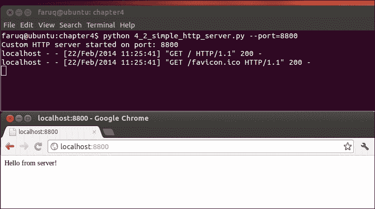
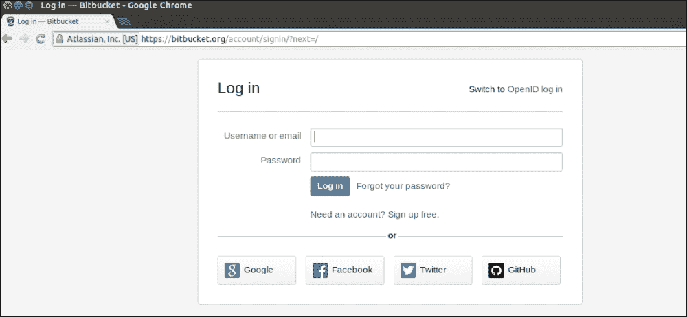
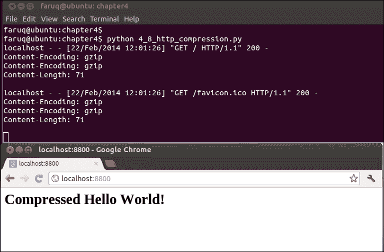

# 第四章：使用 HTTP 编程 Internet

在本章中，我们将涵盖以下主题：

+   从 HTTP 服务器下载数据

+   从你的机器上服务 HTTP 请求

+   访问网站后提取 cookie 信息

+   提交网页表单

+   通过代理服务器发送 Web 请求

+   使用 HEAD 请求检查网页是否存在

+   在客户端代码中伪造 Mozilla Firefox

+   使用 HTTP 压缩在 Web 请求中节省带宽

+   使用带有恢复和部分下载的 HTTP 失效客户端编写

+   使用 Python 和 OpenSSL 编写简单的 HTTPS 服务器代码

# 简介

本章解释了 Python HTTP 网络库函数和一些第三方库。例如，`requests` 库以一种更优雅、更简洁的方式处理 HTTP 请求。在其中一个菜谱中使用了 `OpenSSL` 库来创建一个启用 SSL 的 Web 服务器。

在几个菜谱中已经展示了许多常见的 HTTP 协议功能，例如，使用 `POST` 提交网页表单，操作头部信息，使用压缩等。

# 从 HTTP 服务器下载数据

你想要编写一个简单的 HTTP 客户端，从任何 Web 服务器使用本机 HTTP 协议获取一些数据。这可能是创建你自己的 HTTP 浏览器的第一步。

## 如何实现...

让我们使用 Python 的 `httplib` 创建的 Pythonic 最小浏览器访问 [www.python.org](http://www.python.org)。

列表 4.1 解释了以下简单 HTTP 客户端的代码：

```py
#!/usr/bin/env python
# Python Network Programming Cookbook -- Chapter - 4
# This program is optimized for Python 2.7.
# It may run on any other version with/without modifications.

import argparse
import httplib

REMOTE_SERVER_HOST = 'www.python.org'
REMOTE_SERVER_PATH = '/'

class HTTPClient:

  def __init__(self, host):
    self.host = host

  def fetch(self, path):
    http = httplib.HTTP(self.host)

    # Prepare header
    http.putrequest("GET", path)
    http.putheader("User-Agent", __file__)
    http.putheader("Host", self.host)
    http.putheader("Accept", "*/*")
    http.endheaders()

    try:
      errcode, errmsg, headers = http.getreply()

    except Exception, e:
      print "Client failed error code: %s message:%s headers:%s" 
%(errcode, errmsg, headers)
    else: 
      print "Got homepage from %s" %self.host 

    file = http.getfile()
    return file.read()

if __name__ == "__main__":
  parser = argparse.ArgumentParser(description='HTTP Client 
Example')
  parser.add_argument('--host', action="store", dest="host",  
default=REMOTE_SERVER_HOST)
  parser.add_argument('--path', action="store", dest="path",  
default=REMOTE_SERVER_PATH)
  given_args = parser.parse_args() 
  host, path = given_args.host, given_args.path
  client = HTTPClient(host)
  print client.fetch(path)
```

此菜谱默认会从 [www.python.org](http://www.python.org) 获取页面。你可以带或不带主机和路径参数运行此菜谱。如果运行此脚本，它将显示以下输出：

```py
$  python 4_1_download_data.py --host=www.python.org 
Got homepage from www.python.org
<!DOCTYPE html PUBLIC "-//W3C//DTD XHTML 1.0 Transitional//EN" "http://www.w3.org/TR/xhtml1/DTD/xhtml1-transitional.dtd">
<html  xml:lang="en" lang="en">

<head>
 <meta http-equiv="content-type" content="text/html; charset=utf-8" />
 <title>Python Programming Language &ndash; Official Website</title>
....

```

如果你使用无效的路径运行此菜谱，它将显示以下服务器响应：

```py
$ python 4_1_download_data.py --host='www.python.org' --path='/not-
exist'
Got homepage from www.python.org
<!DOCTYPE html PUBLIC "-//W3C//DTD XHTML 1.0 Transitional//EN" "http://www.w3.org/TR/xhtml1/DTD/xhtml1-transitional.dtd">
<html  xml:lang="en" lang="en">
<head>
 <meta http-equiv="content-type" content="text/html; charset=utf-8" />
 <title>Page Not Found</title>
 <meta name="keywords" content="Page Not Found" />
 <meta name="description" content="Page Not Found" />

```

## 它是如何工作的...

此菜谱定义了一个 `HTTPClient` 类，用于从远程主机获取数据。它是使用 Python 的本机 `httplib` 库构建的。在 `fetch()` 方法中，它使用 `HTTP()` 函数和其他辅助函数创建一个虚拟 HTTP 客户端，例如 `putrequest()` 或 `putheader()`。它首先放置 `GET/path` 字符串，然后设置用户代理，即当前脚本的名称 (`__file__`)。

主要请求 `getreply()` 方法被放置在一个 try-except 块中。响应从 `getfile()` 方法检索，并读取流的内容。

# 从你的机器上服务 HTTP 请求

你想要创建自己的 Web 服务器。你的 Web 服务器应该处理客户端请求并发送一个简单的 `hello` 消息。

## 如何实现...

Python 随带一个非常简单的 Web 服务器，可以从命令行启动，如下所示：

```py
$ python -m SimpleHTTPServer 8080

```

这将在端口 `8080` 上启动一个 HTTP 网络服务器。你可以通过在浏览器中输入 `http://localhost:8080` 来访问这个网络服务器。这将显示运行前面命令的当前目录的内容。如果该目录中包含任何网络服务器索引文件，例如 `index.html`，则你的浏览器将显示 `index.html` 的内容。然而，如果你想要完全控制你的网络服务器，你需要启动你的自定义 HTTP 服务器...

列表 4.2 给出了自定义 HTTP 服务器的以下代码：

```py
#!/usr/bin/env python
# Python Network Programming Cookbook -- Chapter - 4
# This program is optimized for Python 2.7.
# It may run on any other version with/without modifications.

import argparse
import sys
from BaseHTTPServer import BaseHTTPRequestHandler, HTTPServer

DEFAULT_HOST = '127.0.0.1'
DEFAULT_PORT = 8800

class RequestHandler(BaseHTTPRequestHandler):
  """ Custom request handler"""

  def do_GET(self):
    """ Handler for the GET requests """
    self.send_response(200)
    self.send_header('Content-type','text/html')
    self.end_headers()
    # Send the message to browser
    self.wfile.write("Hello from server!")

class CustomHTTPServer(HTTPServer):
  "A custom HTTP server"
  def __init__(self, host, port):
    server_address = (host, port)
    HTTPServer.__init__(self, server_address, RequestHandler)

def run_server(port):
  try:
    server= CustomHTTPServer(DEFAULT_HOST, port)
    print "Custom HTTP server started on port: %s" % port
    server.serve_forever()
  except Exception, err:
    print "Error:%s" %err
  except KeyboardInterrupt:
    print "Server interrupted and is shutting down..."
    server.socket.close()

if __name__ == "__main__":
  parser = argparse.ArgumentParser(description='Simple HTTP Server 
Example')
  parser.add_argument('--port', action="store", dest="port", 
type=int, default=DEFAULT_PORT)
  given_args = parser.parse_args() 
  port = given_args.port
  run_server(port)
```

下面的截图显示了一个简单的 HTTP 服务器：



如果你运行这个网络服务器并通过浏览器访问 URL，这将向浏览器发送一行文本 `Hello from server!`，如下所示：

```py
$ python 4_2_simple_http_server.py --port=8800
Custom HTTP server started on port: 8800
localhost - - [18/Apr/2013 13:39:33] "GET / HTTP/1.1" 200 -
localhost - - [18/Apr/2013 13:39:33] "GET /favicon.ico HTTP/1.1" 200 

```

## 它是如何工作的...

在这个菜谱中，我们创建了从 `HTTPServer` 类继承的 `CustomHTTPServer` 类。在构造方法中，`CustomHTTPServer` 类设置了从用户输入接收的服务器地址和端口。在构造方法中，我们的网络服务器的 `RequestHandler` 类已经设置。每当有客户端连接时，服务器都会根据这个类来处理请求。

`RequestHandler` 定义了处理客户端 `GET` 请求的动作。它使用 `write()` 方法发送一个带有成功消息 **Hello from server!** 的 HTTP 头（代码 200）。

# 访问网站后提取 cookie 信息

许多网站使用 cookie 在本地磁盘上存储它们的各种信息。你希望看到这些 cookie 信息，也许可以使用 cookie 自动登录到该网站。

## 如何操作...

让我们假装登录到一个流行的代码共享网站，[www.bitbucket.org](http://www.bitbucket.org)。我们希望在登录页面 [`bitbucket.org/account/signin/?next=/`](https://bitbucket.org/account/signin/?next=/) 上提交登录信息。下面的截图显示了登录页面：



因此，我们记录下表单元素的 ID，并决定应该提交哪些假值。我们第一次访问这个页面，然后下次访问主页以观察已经设置了哪些 cookie。

列表 4.3 如下解释了如何提取 cookie 信息：

```py
#!/usr/bin/env python
# Python Network Programming Cookbook -- Chapter - 4
# This program is optimized for Python 2.7.
# It may run on any other version with/without modifications.

import cookielib 
import urllib
import urllib2

ID_USERNAME = 'id_username'
ID_PASSWORD = 'id_password'
USERNAME = 'you@email.com'
PASSWORD = 'mypassword'
LOGIN_URL = 'https://bitbucket.org/account/signin/?next=/'
NORMAL_URL = 'https://bitbucket.org/'

def extract_cookie_info():
  """ Fake login to a site with cookie"""
  # setup cookie jar
  cj = cookielib.CookieJar()
  login_data = urllib.urlencode({ID_USERNAME : USERNAME, 
  ID_PASSWORD : PASSWORD})
  # create url opener
  opener = urllib2.build_opener(urllib2.HTTPCookieProcessor(cj))
  resp = opener.open(LOGIN_URL, login_data)

  # send login info 
  for cookie in cj:
    print "----First time cookie: %s --> %s" %(cookie.name, 
cookie.value)
    print "Headers: %s" %resp.headers

  # now access without any login info
  resp = opener.open(NORMAL_URL)
  for cookie in cj:
    print "++++Second time cookie: %s --> %s" %(cookie.name, 
cookie.value)

  print "Headers: %s" %resp.headers

if __name__ == '__main__':
  extract_cookie_info()
```

运行这个菜谱会产生以下输出：

```py
$ python 4_3_extract_cookie_information.py 
----First time cookie: bb_session --> aed58dde1228571bf60466581790566d
Headers: Server: nginx/1.2.4
Date: Sun, 05 May 2013 15:13:56 GMT
Content-Type: text/html; charset=utf-8
Content-Length: 21167
Connection: close
X-Served-By: bitbucket04
Content-Language: en
X-Static-Version: c67fb01467cf
Expires: Sun, 05 May 2013 15:13:56 GMT
Vary: Accept-Language, Cookie
Last-Modified: Sun, 05 May 2013 15:13:56 GMT
X-Version: 14f9c66ad9db
ETag: "3ba81d9eb350c295a453b5ab6e88935e"
X-Request-Count: 310
Cache-Control: max-age=0
Set-Cookie: bb_session=aed58dde1228571bf60466581790566d; expires=Sun, 19-May-2013 15:13:56 GMT; httponly; Max-Age=1209600; Path=/; secure

Strict-Transport-Security: max-age=2592000
X-Content-Type-Options: nosniff

++++Second time cookie: bb_session --> aed58dde1228571bf60466581790566d
Headers: Server: nginx/1.2.4
Date: Sun, 05 May 2013 15:13:57 GMT
Content-Type: text/html; charset=utf-8
Content-Length: 36787
Connection: close
X-Served-By: bitbucket02
Content-Language: en
X-Static-Version: c67fb01467cf
Vary: Accept-Language, Cookie
X-Version: 14f9c66ad9db
X-Request-Count: 97
Strict-Transport-Security: max-age=2592000
X-Content-Type-Options: nosniff

```

## 它是如何工作的...

我们使用了 Python 的`cookielib`并设置了一个 cookie 存储，`cj`。登录数据已经使用`urllib.urlencode`进行了编码。`urllib2`有一个`build_opener()`方法，它接受一个包含`HTTPCookieProcessor()`实例的预定义 cookie 存储，并返回一个 URL 打开器。我们调用这个打开器两次：一次用于登录页面，一次用于网站的首页。看起来只有`bb_session`一个 cookie 通过页面头部的 set-cookie 指令被设置。有关`cookielib`的更多信息可以在官方 Python 文档网站上找到，网址为[`docs.python.org/2/library/cookielib.html`](http://docs.python.org/2/library/cookielib.html)。

# 提交网络表单

在网络浏览过程中，我们每天会多次提交网络表单。现在，你希望通过 Python 代码来完成这项操作。

## 准备中

此方法使用名为`requests`的第三方 Python 模块。你可以通过遵循[`docs.python-requests.org/en/latest/user/install/`](http://docs.python-requests.org/en/latest/user/install/)中的说明来安装此模块的兼容版本。例如，你可以使用`pip`从命令行安装`requests`，如下所示：

```py
$ pip install requests

```

## 如何操作...

让我们提交一些假数据以在[www.twitter.com](http://www.twitter.com)注册。每个表单提交都有两种方法：`GET`和`POST`。不太敏感的数据，例如搜索查询，通常通过`GET`提交，而更敏感的数据则通过`POST`方法发送。让我们尝试使用这两种方法提交数据。

列表 4.4 如下解释了提交网络表单：

```py
#!/usr/bin/env python
# Python Network Programming Cookbook -- Chapter – 4
# This program is optimized for Python 2.7.
# It may run on any other version with/without modifications.

import requests
import urllib
import urllib2

ID_USERNAME = 'signup-user-name'
ID_EMAIL = 'signup-user-email'
ID_PASSWORD = 'signup-user-password'
USERNAME = 'username'
EMAIL = 'you@email.com'
PASSWORD = 'yourpassword'
SIGNUP_URL = 'https://twitter.com/account/create'

def submit_form():
    """Submit a form"""
    payload = {ID_USERNAME : USERNAME,
               ID_EMAIL    :  EMAIL,
               ID_PASSWORD : PASSWORD,}

    # make a get request
    resp = requests.get(SIGNUP_URL)
    print "Response to GET request: %s" %resp.content

    # send POST request
    resp = requests.post(SIGNUP_URL, payload)
    print "Headers from a POST request response: %s" %resp.headers
    #print "HTML Response: %s" %resp.read()

if __name__ == '__main__':
    submit_form()
```

如果你运行此脚本，你将看到以下输出：

```py
$ python 4_4_submit_web_form.py 
Response to GET request: <?xml version="1.0" encoding="UTF-8"?>
<hash>
 <error>This method requires a POST.</error>
 <request>/account/create</request>
</hash>

Headers from a POST request response: {'status': '200 OK', 'content-
length': '21064', 'set-cookie': '_twitter_sess=BAh7CD--
d2865d40d1365eeb2175559dc5e6b99f64ea39ff; domain=.twitter.com; 
path=/; HttpOnly', 'expires': 'Tue, 31 Mar 1981 05:00:00 GMT', 
'vary': 'Accept-Encoding', 'last-modified': 'Sun, 05 May 2013 
15:59:27 GMT', 'pragma': 'no-cache', 'date': 'Sun, 05 May 2013 
15:59:27 GMT', 'x-xss-protection': '1; mode=block', 'x-transaction': 
'a4b425eda23b5312', 'content-encoding': 'gzip', 'strict-transport-
security': 'max-age=631138519', 'server': 'tfe', 'x-mid': 
'f7cde9a3f3d111310427116adc90bf3e8c95e868', 'x-runtime': '0.09969', 
'etag': '"7af6f92a7f7b4d37a6454caa6094071d"', 'cache-control': 'no-
cache, no-store, must-revalidate, pre-check=0, post-check=0', 'x-
frame-options': 'SAMEORIGIN', 'content-type': 'text/html; 
charset=utf-8'}

```

## 它是如何工作的...

此方法使用第三方模块`requests`。它有方便的包装方法`get()`和`post()`，这些方法可以对数据进行 URL 编码并正确提交表单。

在这个方法中，我们创建了一个包含用户名、密码和电子邮件以创建 Twitter 账户的数据负载。当我们第一次使用`GET`方法提交表单时，Twitter 网站返回一个错误，表示该页面只支持`POST`。在提交数据后，页面会处理它。我们可以从头部数据中确认这一点。

# 通过代理服务器发送网络请求

你希望通过代理服务器浏览网页。如果你已经配置了浏览器使用代理服务器并且它工作正常，你可以尝试这个方法。否则，你可以使用互联网上可用的任何公共代理服务器。

## 准备中

你需要访问一个代理服务器。你可以在 Google 或任何其他搜索引擎上搜索以找到免费代理服务器。在这里，为了演示，我们使用了`165.24.10.8`。

## 如何操作...

让我们通过公共域名代理服务器发送我们的 HTTP 请求。

列表 4.5 如下解释了通过代理服务器代理网络请求：

```py
#!/usr/bin/env python
# Python Network Programming Cookbook -- Chapter - 4
# This program is optimized for Python 2.7.
# It may run on any other version with/without modifications.

import urllib

URL = 'https://www.github.com'
PROXY_ADDRESS = "165.24.10.8:8080" 

if __name__ == '__main__':
  resp = urllib.urlopen(URL, proxies = {"http" : PROXY_ADDRESS})
  print "Proxy server returns response headers: %s " 
%resp.headers
```

如果你运行此脚本，它将显示以下输出：

```py
$ python 4_5_proxy_web_request.py 
Proxy server returns response headers: Server: GitHub.com
Date: Sun, 05 May 2013 16:16:04 GMT
Content-Type: text/html; charset=utf-8
Connection: close
Status: 200 OK
Cache-Control: private, max-age=0, must-revalidate
Strict-Transport-Security: max-age=2592000
X-Frame-Options: deny
Set-Cookie: logged_in=no; domain=.github.com; path=/; expires=Thu, 05-May-2033 16:16:04 GMT; HttpOnly
Set-Cookie: _gh_sess=BAh7...; path=/; expires=Sun, 01-Jan-2023 00:00:00 GMT; secure; HttpOnly
X-Runtime: 8
ETag: "66fcc37865eb05c19b2d15fbb44cd7a9"
Content-Length: 10643
Vary: Accept-Encoding

```

## 它是如何工作的...

这是一个简短的食谱，我们在 Google 搜索中找到的公共代理服务器上，使用社交代码共享网站[www.github.com](http://www.github.com)进行访问。代理地址参数已传递给`urllib`的`urlopen()`方法。我们打印出响应的 HTTP 头信息，以显示代理设置在这里是有效的。

# 使用`HEAD`请求检查网页是否存在

你希望在不下载 HTML 内容的情况下检查网页的存在。这意味着我们需要使用浏览器客户端发送一个`get HEAD`请求。根据维基百科，`HEAD`请求请求的响应与`GET`请求对应的响应相同，但不包括响应体。这对于检索响应头中编写的元信息很有用，而无需传输整个内容。

## 如何做...

我们希望向[www.python.org](http://www.python.org)发送一个`HEAD`请求。这不会下载主页的内容，而是检查服务器是否返回了有效的响应之一，例如`OK`、`FOUND`、`MOVED PERMANENTLY`等。

列表 4.6 解释了如何使用`HEAD`请求检查网页，如下所示：

```py
#!/usr/bin/env python
# Python Network Programming Cookbook -- Chapter - 4
# This program is optimized for Python 2.7.
# It may run on any other version with/without modifications.
import argparse
import httplib
import urlparse
import re
import urllib

DEFAULT_URL = 'http://www.python.org'
HTTP_GOOD_CODES =  [httplib.OK, httplib.FOUND, httplib.MOVED_PERMANENTLY]

def get_server_status_code(url):
  """
  Download just the header of a URL and
  return the server's status code.
  """
  host, path = urlparse.urlparse(url)[1:3] 
  try:
    conn = httplib.HTTPConnection(host)
    conn.request('HEAD', path)
    return conn.getresponse().status
    except StandardError:
  return None

if __name__ == '__main__':
  parser = argparse.ArgumentParser(description='Example HEAD 
Request')
  parser.add_argument('--url', action="store", dest="url", 
default=DEFAULT_URL)
  given_args = parser.parse_args() 
  url = given_args.url
  if get_server_status_code(url) in HTTP_GOOD_CODES:
    print "Server: %s status is OK: " %url
  else:
    print "Server: %s status is NOT OK!" %url
```

运行此脚本将显示如果使用`HEAD`请求找到页面，则会显示成功或错误信息：

```py
$ python 4_6_checking_webpage_with_HEAD_request.py 
Server: http://www.python.org status is OK!
$ python 4_6_checking_webpage_with_HEAD_request.py --url=http://www.zytho.org
Server: http://www.zytho.org status is NOT OK!

```

## 它是如何工作的...

我们使用了`httplib`的`HTTPConnection()`方法，它可以向服务器发送`HEAD`请求。如果需要，我们可以指定路径。在这里，`HTTPConnection()`方法检查了[www.python.org](http://www.python.org)的主页或路径。然而，如果 URL 不正确，它无法在接受的返回代码列表中找到返回的响应。

# 在你的客户端代码中欺骗 Mozilla Firefox

从你的 Python 代码中，你希望让网络服务器认为你正在使用 Mozilla Firefox 进行浏览。

## 如何做...

你可以在 HTTP 请求头中发送自定义的用户代理值。

列表 4.7 解释了如何在客户端代码中欺骗 Mozilla Firefox，如下所示：

```py
#!/usr/bin/env python
# Python Network Programming Cookbook -- Chapter – 4
# This program is optimized for Python 2.7.
# It may run on any other version with/without modifications.

import urllib2

BROWSER = 'Mozilla/5.0 (Windows NT 5.1; rv:20.0) Gecko/20100101 
Firefox/20.0'
URL = 'http://www.python.org'

def spoof_firefox():
  opener = urllib2.build_opener()
  opener.addheaders = [('User-agent', BROWSER)]
  result = opener.open(URL)
  print "Response headers:"
  for header in  result.headers.headers:
    print "\t",header

if __name__ == '__main__':
  spoof_firefox()
```

如果你运行这个脚本，你将看到以下输出：

```py
$ python 4_7_spoof_mozilla_firefox_in_client_code.py 
Response headers:
 Date: Sun, 05 May 2013 16:56:36 GMT
 Server: Apache/2.2.16 (Debian)
 Last-Modified: Sun, 05 May 2013 00:51:40 GMT
 ETag: "105800d-5280-4dbedfcb07f00"
 Accept-Ranges: bytes
 Content-Length: 21120
 Vary: Accept-Encoding
 Connection: close
 Content-Type: text/html

```

## 它是如何工作的...

我们使用了`urllib2`的`build_opener()`方法来创建我们的自定义浏览器，其用户代理字符串已设置为`Mozilla/5.0 (Windows NT 5.1; rv:20.0) Gecko/20100101 Firefox/20.0`。

# 在 Web 请求中使用 HTTP 压缩来节省带宽

你希望为你的网络服务器用户在下载网页时提供更好的性能。通过压缩 HTTP 数据，你可以加快 Web 内容的提供速度。

## 如何做...

让我们创建一个网络服务器，它在将内容压缩为`gzip`格式后提供服务。

列表 4.8 解释了 HTTP 压缩，如下所示：

```py
#!/usr/bin/env python
# Python Network Programming Cookbook -- Chapter - 4
# This program is optimized for Python 2.7.
# It may run on any other version with/without modifications.
import argparse
import string
import os
import sys
import gzip
import cStringIO
from BaseHTTPServer import BaseHTTPRequestHandler, HTTPServer

DEFAULT_HOST = '127.0.0.1'
DEFAULT_PORT = 8800
HTML_CONTENT = """<html><body><h1>Compressed Hello  World!</h1></body></html>"""

class RequestHandler(BaseHTTPRequestHandler):
  """ Custom request handler"""

  def do_GET(self):
    """ Handler for the GET requests """
    self.send_response(200)
    self.send_header('Content-type','text/html')
    self.send_header('Content-Encoding','gzip')

    zbuf = self.compress_buffer(HTML_CONTENT)
    sys.stdout.write("Content-Encoding: gzip\r\n")
    self.send_header('Content-Length',len(zbuf))
    self.end_headers()

  # Send the message to browser
    zbuf = self.compress_buffer(HTML_CONTENT)
    sys.stdout.write("Content-Encoding: gzip\r\n")
    sys.stdout.write("Content-Length: %d\r\n" % (len(zbuf)))
    sys.stdout.write("\r\n")
    self.wfile.write(zbuf)
  return

  def compress_buffer(self, buf):
    zbuf = cStringIO.StringIO()
    zfile = gzip.GzipFile(mode = 'wb',  fileobj = zbuf, 
compresslevel = 6)
    zfile.write(buf)
    zfile.close()
    return zbuf.getvalue()

if __name__ == '__main__':
  parser = argparse.ArgumentParser(description='Simple HTTP Server 
Example')
  parser.add_argument('--port', action="store", dest="port", 
type=int, default=DEFAULT_PORT)
  given_args = parser.parse_args() 
  port = given_args.port
  server_address =  (DEFAULT_HOST, port)
  server = HTTPServer(server_address, RequestHandler)
  server.serve_forever()
```

你可以运行这个脚本，并在访问`http://localhost:8800`时在你的浏览器屏幕上看到`Compressed Hello World!`文本（这是 HTTP 压缩的结果）：

```py
$ python 4_8_http_compression.py 
localhost - - [22/Feb/2014 12:01:26] "GET / HTTP/1.1" 200 -
Content-Encoding: gzip
Content-Encoding: gzip
Content-Length: 71
localhost - - [22/Feb/2014 12:01:26] "GET /favicon.ico HTTP/1.1" 200 -
Content-Encoding: gzip
Content-Encoding: gzip
Content-Length: 71

```

以下截图展示了由网络服务器提供的压缩内容：



## 它是如何工作的...

我们通过从`BaseHTTPServer`模块实例化`HTTPServer`类来创建了一个网络服务器。我们向这个服务器实例附加了一个自定义请求处理器，该处理器使用`compress_buffer()`方法压缩每个客户端响应。已经向客户端提供了预定义的 HTML 内容。

# 使用 Python 和 OpenSSL 编写具有恢复和部分下载功能的 HTTP 故障转移客户端

你可能想创建一个故障转移客户端，如果第一次尝试下载失败，它将重新下载文件。

## 如何操作...

让我们从[www.python.org](http://www.python.org)下载 Python 2.7 代码。一个`resume_download()`文件将恢复该文件的任何未完成下载。

列表 4.9 解释了恢复下载如下：

```py
#!/usr/bin/env python
# Python Network Programming Cookbook -- Chapter - 4
# This program is optimized for Python 2.7.# It may run on any other version with/without modifications.

import urllib, os
TARGET_URL = 'http://python.org/ftp/python/2.7.4/'
TARGET_FILE = 'Python-2.7.4.tgz'

class CustomURLOpener(urllib.FancyURLopener):
  """Override FancyURLopener to skip error 206 (when a
    partial file is being sent)
  """
  def http_error_206(self, url, fp, errcode, errmsg, headers, 
data=None):
    pass

  def resume_download():
    file_exists = False
    CustomURLClass = CustomURLOpener()
  if os.path.exists(TARGET_FILE):
    out_file = open(TARGET_FILE,"ab")
    file_exists = os.path.getsize(TARGET_FILE)
    #If the file exists, then only download the unfinished part
    CustomURLClass.addheader("Download range","bytes=%s-" % 
(file_exists))
  else:
    out_file = open(TARGET_FILE,"wb")

  web_page = CustomURLClass.open(TARGET_URL + TARGET_FILE)

  #If the file exists, but we already have the whole thing, don't 
download again
  if int(web_page.headers['Content-Length']) == file_exists:
    loop = 0
    print "File already downloaded!"

  byte_count = 0
  while True:
    data = web_page.read(8192)
    if not data:
      break
    out_file.write(data)
    byte_count = byte_count + len(data)

  web_page.close()
  out_file.close()

  for k,v in web_page.headers.items():
    print k, "=",v
  print "File copied", byte_count, "bytes from", web_page.url

if __name__ == '__main__':
  resume_download()
```

运行此脚本将产生以下输出：

```py
$   python 4_9_http_fail_over_client.py
content-length = 14489063
content-encoding = x-gzip
accept-ranges = bytes
connection = close
server = Apache/2.2.16 (Debian)
last-modified = Sat, 06 Apr 2013 14:16:10 GMT
content-range = bytes 0-14489062/14489063
etag = "1748016-dd15e7-4d9b1d8685e80"
date = Tue, 07 May 2013 12:51:31 GMT
content-type = application/x-tar
File copied 14489063 bytes from http://python.org/ftp/python/2.7.4/Python-2.7.4.tgz

```

## 它是如何工作的...

在这个菜谱中，我们创建了一个继承自`urllib`模块的`FancyURLopener`方法的自定义 URL 打开器类，但覆盖了`http_error_206()`，以便下载部分内容。因此，我们的方法检查目标文件是否存在，如果不存在，它将尝试使用自定义 URL 打开器类下载。

# 使用 Python 和 OpenSSL 编写简单的 HTTPS 服务器代码

你需要一个用 Python 编写的安全网络服务器代码。你已经准备好了你的 SSL 密钥和证书文件。

## 准备工作

你需要安装第三方 Python 模块`pyOpenSSL`。这可以从 PyPI([`pypi.python.org/pypi/pyOpenSSL`](https://pypi.python.org/pypi/pyOpenSSL))获取。在 Windows 和 Linux 主机上，你可能需要安装一些额外的包，这些包在[`pythonhosted.org//pyOpenSSL/`](http://pythonhosted.org//pyOpenSSL/)上有文档说明。

## 如何操作...

在当前工作文件夹放置证书文件后，我们可以创建一个使用此证书为客户端提供加密内容的网络服务器。

列表 4.10 解释了以下安全 HTTP 服务器的代码：

```py
#!/usr/bin/env python
# Python Network Programming Cookbook -- Chapter - 4
# This program is optimized for Python 2.7.
# It may run on any other version with/without modifications.
# Requires pyOpenSSL and SSL packages installed

import socket, os
from SocketServer import BaseServer
from BaseHTTPServer import HTTPServer
from SimpleHTTPServer import SimpleHTTPRequestHandler
from OpenSSL import SSL

class SecureHTTPServer(HTTPServer):
  def __init__(self, server_address, HandlerClass):
    BaseServer.__init__(self, server_address, HandlerClass)
    ctx = SSL.Context(SSL.SSLv23_METHOD)
    fpem = 'server.pem' # location of the server private key and 
the server certificate
    ctx.use_privatekey_file (fpem)
    ctx.use_certificate_file(fpem)
    self.socket = SSL.Connection(ctx, 
socket.socket(self.address_family, self.socket_type))
    self.server_bind()
    self.server_activate()

class SecureHTTPRequestHandler(SimpleHTTPRequestHandler):
  def setup(self):
    self.connection = self.request
    self.rfile = socket._fileobject(self.request, "rb", 
self.rbufsize)
    self.wfile = socket._fileobject(self.request, "wb", 
self.wbufsize)

  def run_server(HandlerClass = SecureHTTPRequestHandler,
    ServerClass = SecureHTTPServer):
    server_address = ('', 4443) # port needs to be accessible by 
user
    server = ServerClass(server_address, HandlerClass)
    running_address = server.socket.getsockname()
    print "Serving HTTPS Server on %s:%s ..." 
%(running_address[0], running_address[1])
    server.serve_forever()

if __name__ == '__main__':
  run_server()
```

如果你运行此脚本，它将产生以下输出：

```py
$ python 4_10_https_server.py 
Serving HTTPS Server on 0.0.0.0:4443 ...

```

## 如何工作...

如果你注意到了创建网络服务器的先前菜谱，在基本程序方面没有太大区别。主要区别在于使用带有`SSLv23_METHOD`参数的 SSL `Context()`方法。我们已经使用 Python OpenSSL 第三方模块的`Connection()`类创建了 SSL 套接字。这个类接受这个上下文对象以及地址族和套接字类型。

服务器证书文件保存在当前目录中，并且已经通过上下文对象应用。最后，服务器通过`server_activate()`方法被激活。
