# 第一章：面向对象设计

在软件开发中，设计通常被认为是编程之前进行的步骤。这并不正确；实际上，分析、编程和设计往往相互重叠、结合和交织。在这本书中，我们将涵盖设计和编程的混合问题，而不会试图将它们解析成单独的类别。Python 语言的一个优点是能够清晰地表达设计。

在本章中，我们将简要讨论如何从好的想法过渡到编写软件。我们将创建一些设计工件——如图表——在开始编写代码之前帮助我们澄清思路。我们将涵盖以下主题：

+   面向对象的意义

+   面向对象设计与面向对象编程之间的区别

+   面向对象设计的基本原则

+   基本的**统一建模语言**（**UML**）及其不是邪恶的一面

我们还将介绍这本书的面向对象设计案例研究，使用“4+1”架构视图模型。在这里，我们将涉及以下主题：

+   经典机器学习应用概述，著名的鸢尾花分类问题

+   此分类器的一般处理上下文

+   绘制两个看起来足以解决问题的类层次结构视图

# 介绍面向对象

每个人都知道什么是对象：一个我们可以感知、触摸和操作的有形事物。我们最早与之互动的对象通常是婴儿玩具。木块、塑料形状和超大的拼图块是常见的第一种对象。婴儿很快就会学会某些对象会做某些事情：铃铛会响，按钮会被按下，杠杆会被拉动。

软件开发中对象的定义与实际物体并没有太大的区别。软件对象可能不是你可以拿起、感知或触摸的有形事物，但它们是某些可以执行特定操作和被施加特定操作的模型。正式来说，一个对象是一组**数据**和相关的**行为**的集合。

考虑到对象是什么，面向对象意味着什么？在词典中，“面向”意味着“指向”。面向对象编程意味着编写指向建模对象的代码。这是描述复杂系统行为所使用的技术之一。它通过描述一组通过其数据和行为的交互对象来定义。

如果你读过任何炒作内容，你可能已经遇到过诸如*面向对象分析*、*面向对象设计*、*面向对象分析与设计*和*面向对象编程*等术语。这些都是属于一般*面向对象*范畴下的相关概念。

事实上，分析、设计和编程都是软件开发的不同阶段。将它们称为面向对象只是简单地指明了正在追求的软件开发类型。

**面向对象分析**（**OOA**）是查看一个问题、系统或任务（某人希望将其转换成可工作的软件应用）并识别这些对象及其之间交互的过程。分析阶段完全是关于 *需要做什么*。

分析阶段的输出是对系统的描述，通常以 *需求* 的形式呈现。如果我们一次性完成分析阶段，我们将一个任务，例如 *作为一个植物学家，我需要一个网站来帮助用户分类植物，以便我能帮助进行正确的识别*，转换成一系列所需的功能。以下是一些可能需要网站访问者执行的要求。每一项都是一个与对象相关的动作；我们用 *斜体* 来突出动作，用 **粗体** 来突出对象：

+   *浏览* **之前的上传**

+   *上传新的* **已知示例**

+   *测试* **质量**

+   *浏览* **产品**

+   *查看* **推荐**

在某些方面，术语 *分析* 是一个误称。我们之前讨论的那个婴儿并不是分析积木和拼图块。相反，她探索她的环境，操作形状，并看看它们可能适合在哪里。更好的说法可能是 *面向对象探索*。在软件开发中，分析的初始阶段包括采访客户、研究他们的流程和排除可能性。

**面向对象设计**（**OOD**）是将此类需求转换成实现规范的过程。设计者必须命名对象、定义行为，并正式指定哪些对象可以激活其他对象上的特定行为。设计阶段完全是关于将 *应该做什么* 转换为 *应该如何做*。

设计阶段的输出是实现规范。如果我们一次性完成设计阶段，我们将面向对象分析期间定义的需求转换成一组可以在（理想情况下）任何面向对象编程语言中实现的面类和接口。

**面向对象编程**（**OOP**）是将设计转换成能够执行产品所有者最初请求的功能的工作程序的过程。

哎，对吧！如果世界符合这个理想，我们能够按部就班地遵循这些阶段，就像所有老教科书告诉我们的那样，那将是多么美好。但通常情况下，现实世界要复杂得多。无论我们多么努力地试图将这些阶段分开，我们总会发现设计过程中需要进一步分析的事情。当我们编程时，我们会发现设计中的某些功能需要澄清。

21 世纪的大多数开发都认识到这种阶段（或瀑布）的级联并不奏效。似乎更好的是一个**迭代**的开发模型。在迭代开发中，一小部分任务被建模、设计和编程，然后产品被审查和扩展，以改进每个特性并在一系列短暂的开发周期中包含新特性。

本书剩余部分将介绍面向对象编程，但本章我们将从设计角度介绍基本面向对象原则。这使我们能够在不与软件语法或 Python 跟踪回溯争论的情况下理解概念。

# 对象和类

**对象**是一组具有相关行为的数据集合。我们如何区分不同类型的对象？苹果和橙子都是对象，但有一个常见的谚语说它们不能比较。在计算机编程中，苹果和橙子模型化得并不常见，但让我们假设我们正在为一个水果农场开发一个库存应用程序。为了方便这个例子，我们可以假设苹果放在桶里，橙子放在篮子里。

我们迄今为止发现的问题域有四种类型的对象：苹果、橙子、篮子和桶。在面向对象建模中，用于表示“对象类型”的术语是**类**。因此，从技术角度讲，我们现在有四个对象类。

理解对象和类之间的区别很重要。类描述相关对象。它们是创建对象的蓝图。你面前桌子上可能有三只橙子。每只橙子都是一个独特的对象，但它们都具有与一个类相关联的属性和行为：橙子的一般类别。

我们库存系统中四个对象类之间的关系可以使用**统一建模语言**（通常简称为**UML**，因为三字母的首字母缩略词永远不会过时）类图来描述。这是我们第一个**类图**：

图 1.1：类图

此图显示**橙子**类（通常称为“橙子”）与某种方式关联着**篮子**，而**苹果**类（“苹果”）也与某种方式关联着**桶**。**关联**是两个类实例之间关系最基本的方式。

UML 图（统一建模语言）的语法通常很直观；你不需要阅读教程就能（大部分）理解你看到的内容。UML 也相当容易绘制，而且非常直观。毕竟，当描述类及其关系时，许多人会自然地画上带有线条的盒子。基于这些直观的图的标准使得程序员与设计师、经理和彼此之间的沟通变得容易。

注意，UML 图通常表示类定义，但我们描述的是对象的属性。该图显示了苹果类和桶类，告诉我们一个特定的苹果位于一个特定的桶中。虽然我们可以使用 UML 来表示单个对象，但这通常是不必要的。显示这些类足以让我们了解每个类成员对象的属性。

一些程序员贬低 UML 为浪费时间。引用迭代开发，他们会争辩说，用花哨的 UML 图做出来的正式规范在实施之前就会变得冗余，而且维护这些正式图只会浪费时间，对任何人都没有好处。

每个由多个人组成的编程团队都偶尔需要坐下来讨论正在构建的组件的细节。UML 对于确保快速、简单和一致的沟通非常有用。即使那些嘲笑正式类图的组织，在设计会议或团队讨论中也倾向于使用一些非正式版本的 UML。

此外，你将不得不与之沟通的最重要的人是你的未来的自己。我们都认为我们可以记住我们做出的设计决策，但总会有隐藏在我们未来的“我为什么这么做？”的时刻。如果我们保留我们在开始设计时进行初始绘图时所用的纸张碎片，我们最终会发现它们是有用的参考资料。

然而，本章的目的并不是要成为 UML 的教程。互联网上有许多这样的教程，以及关于该主题的许多书籍。UML 不仅涵盖类和对象图，还有用例、部署、状态变化和活动的语法。在本章讨论面向对象设计时，我们将处理一些常见的类图语法。你可以通过示例来掌握结构，然后你会在自己的团队或个人设计笔记中无意识地选择受 UML 启发的语法。

我们的初始图虽然正确，但没有提醒我们苹果放入桶中，或者一个苹果可以放入多少个桶中。它只告诉我们苹果以某种方式与桶相关联。类之间的关联通常是显而易见的，不需要进一步解释，但我们有选择添加进一步说明的选项。

UML 的美在于大多数事情都是可选的。我们只需要在图中指定当前情况下有意义的信息。在快速的白板会议中，我们可能只是简单地画一些盒子之间的线条。在正式的文档中，我们可能会更详细一些。

在苹果和桶的情况下，我们可以相当有信心地认为关联是**许多苹果放入一个桶中**，但为了确保没有人将其与**一个苹果毁了一个桶**混淆，我们可以增强该图，如图所示：

图 1.2：带有更多详细信息的类图

这个图表告诉我们橙子**放入**篮子里，有一个小箭头显示是什么放入什么。它还告诉我们该对象在关系两边的关联中可以使用的数量。一个**篮子**可以容纳许多（用****表示）**橙子**对象。任何一个**橙子**可以放入恰好一个**篮子**。这个数字被称为对象的**多重性**。你也可能听到它被描述为**基数**；将基数视为一个特定的数字或范围，而在这里我们使用的多重性是一个广义的“多于一个实例”。

我们有时可能会忘记关系线哪一端应该有哪个多重性数字。离类最近的多重性是该类对象可以与关系另一端的任何单个对象关联的对象数量。对于苹果进桶的关联，从左到右读取，许多**苹果**类的实例（即许多**苹果**对象）可以放入任何一个**桶**。从右到左读取，恰好一个**桶**可以与任何一个**苹果**关联。

我们已经看到了类的基本知识，以及它们如何指定对象之间的关系。现在，我们需要谈论定义对象状态的属性，以及可能涉及状态变化或与其他对象交互的对象行为。

# 指定属性和行为

我们现在已经掌握了某些基本的面向对象术语。对象是类的实例，它们可以相互关联。类实例是一个具有自己数据集和行为的具体对象；我们面前桌子上的一个特定橙子被称为橙子这一通用类的一个实例。

橙子有一个状态，例如，成熟或生；我们通过特定属性值来实现对象的状态。橙子也有行为。单独来看，橙子通常是被动无反应的。状态变化是强加给它们的。让我们深入探讨这两个词的含义，即*状态*和*行为*。

## 数据描述对象状态

让我们从数据开始。数据代表某个对象的个别特征；它的当前状态。一个类可以定义一组特定的特征，这些特征是那个类所有成员对象的一部分。任何特定对象都可以为给定的特征有不同的数据值。例如，我们桌子上的三个橙子（如果我们没有吃掉任何的话）可能每个的重量都不同。橙子类可以有一个重量属性来表示这个数据。橙子类的所有实例都有一个重量属性，但每个橙子这个属性的值都不同。属性不必是唯一的；任何两个橙子可能重量相同。

属性通常被称为**成员**或**属性**。一些作者建议这两个术语有不同的含义，通常认为属性是可设置的，而属性是只读的。Python 的属性可以被定义为只读的，但值将基于最终可写的属性值，这使得**只读**的概念变得相当没有意义；在这本书中，我们将看到这两个术语被交替使用。此外，正如我们将在*第五章*中讨论的，*何时使用面向对象编程*，Python 中的`property`关键字对于特定类型的属性有特殊的意义。

在 Python 中，我们也可以将属性称为**实例变量**。这有助于阐明属性的工作方式。它们是具有每个类实例唯一值的变量。Python 有其他类型的属性，但我们将专注于最常见的类型以开始。

在我们的水果库存应用程序中，水果农民可能想知道橙子来自哪个果园，什么时候采摘的，以及它的重量。他们还可能想要跟踪每个**篮子**的存放位置。苹果可能有颜色属性，而桶可能有不同的大小。

其中一些属性可能属于多个类（我们可能还想知道苹果何时采摘），但在这个第一个例子中，让我们只为我们的类图添加一些不同的属性：

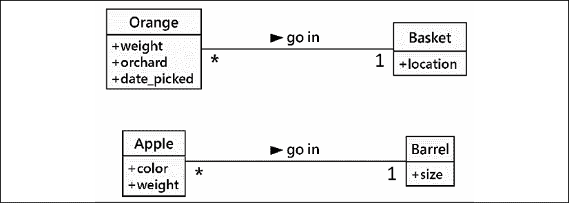

图 1.3：具有属性的类图

根据我们的设计需要有多详细，我们还可以指定每个属性值的类型。在 UML 中，属性类型通常是许多编程语言通用的通用名称，如整数、浮点数、字符串、字节或布尔值。然而，它们也可以表示通用集合，如列表、树或图，或者最值得注意的是，其他非通用、特定于应用程序的类。这是设计阶段可以与编程阶段重叠的一个领域。一种编程语言中可用的各种原语和内置集合可能与另一种语言中可用的不同。

这里有一个（主要）针对 Python 特定类型提示的版本：

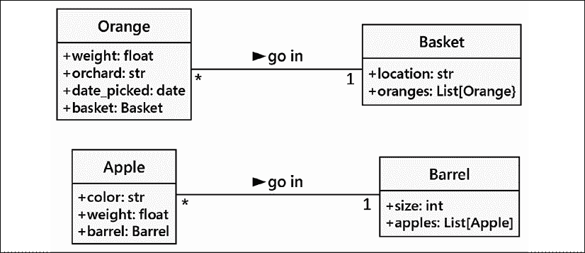

图 1.4：具有属性及其类型的类图

通常，在设计阶段，我们不需要过分关注数据类型，因为实现特定的细节是在编程阶段选择的。通用名称通常足以用于设计；这就是为什么我们包括了`date`作为 Python 类型`datetime.datetime`的占位符。如果我们的设计需要列表容器类型，Java 程序员可以选择在实现时使用`LinkedList`或`ArrayList`，而 Python 程序员（也就是我们！）可能会指定`List[Apple]`作为类型提示，并使用`list`类型进行实现。

在我们之前的果农例子中，我们的属性都是基本原语。然而，还有一些隐含的属性我们可以使其显式化——这些是关联。对于一个特定的橙子，我们有一个指向包含该橙子的篮子的属性，即`basket`属性，其类型提示为`Basket`。

## 行为是动作

现在我们知道了数据如何定义对象的状态，我们需要查看的最后一个未定义的术语是*行为*。行为是在对象上可以发生的行为。可以在特定对象类上执行的行为作为该类的**方法**来表示。在编程层面，方法类似于结构化编程中的函数，但它们可以访问属性——特别是与该对象关联的数据的实例变量。像函数一样，方法也可以接受**参数**并返回**值**。

方法参数作为需要传递到该方法中的对象集合提供给它。在特定调用期间传递到方法中的实际对象实例通常被称为**参数**。这些对象绑定到方法体内的**参数**变量上。它们被方法用来执行它打算做的任何行为或任务。返回值是该任务的结果。评估方法时的内部状态变化是另一种可能的影响。

我们已经将我们的“比较苹果和橙子”例子扩展成了一个基本的（如果有些牵强）库存应用程序。让我们再进一步扩展它，看看它是否会破裂。可以与橙子关联的一个动作是**pick**动作。如果你考虑实现，**pick**需要做两件事：

+   通过更新橙子的`**Basket**`属性，将橙子放入篮子中。

+   将橙子添加到给定的`Basket`上的`**Orange**`列表中。

因此，`**pick**`需要知道它正在处理哪个篮子。我们通过给`**pick**`方法提供一个`**Basket**`参数来实现这一点。由于我们的果农还卖果汁，我们可以在`**Orange**`类中添加一个`**squeeze**`方法。当被调用时，`**squeeze**`方法可能会返回提取的果汁量，同时也会将该`**Orange**`从它所在的`**Basket**`中移除。

类`**Basket**`可以有一个**sell**动作。当一个篮子被出售时，我们的库存系统可能会更新一些尚未指定的对象上的数据，用于会计和利润计算。或者，我们的橙子篮可能在我们可以出售之前就变质了，所以我们添加了一个**discard**方法。让我们将这些方法添加到我们的图中：

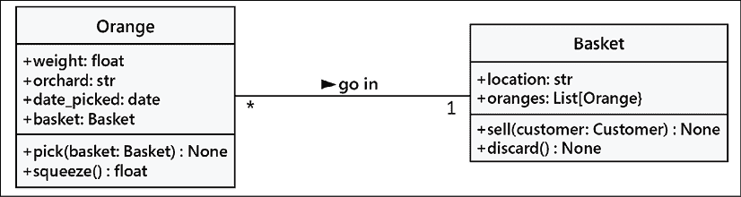

图 1.5：包含属性和方法的类图

向单个对象添加属性和方法允许我们创建一个**系统**，其中包含相互交互的对象。系统中的每个对象都是某个类的成员。这些类指定了对象可以持有哪些类型的数据以及可以对其调用的方法。每个对象中的数据可能与其他相同类的实例处于不同的状态；由于状态的不同，每个对象可能对方法调用的反应也不同。

面向对象分析和设计全部关于弄清楚那些对象是什么以及它们应该如何交互。每个类都有责任和协作。下一节将描述可以用来使这些交互尽可能简单直观的原则。

注意，出售一个篮子并不一定是**篮子**类的一个无条件特性。可能存在其他一些（未展示的）类关心各种篮子及其位置。我们在设计时常常会有边界。我们也会对分配给各个类的责任有所疑问。责任分配问题并不总是有一个整洁的技术解决方案，这迫使我们多次绘制（和重新绘制）我们的 UML 图来检查替代设计。

# 隐藏细节和创建公共接口

对象面向设计建模的关键目的是确定该对象的公共**接口**将是什么。接口是其他对象可以访问以与该对象交互的属性和方法集合。其他对象不需要，在某些语言中甚至不允许访问对象的内部工作原理。

一个常见的现实世界例子是电视。我们与电视的接口是遥控器。遥控器上的每个按钮都代表可以在电视对象上调用的一个方法。当我们作为调用对象访问这些方法时，我们不知道或关心电视是从有线电视连接、卫星天线还是互联网设备接收信号。我们不在乎调整音量的电子信号是什么，或者声音是针对扬声器还是耳机。如果我们打开电视以访问其内部工作原理，例如，将输出信号分割到外部扬声器和一套耳机，我们可能会使保修失效。

这个隐藏对象实现的过程通常被称为**信息隐藏**。它有时也被称为**封装**，但封装实际上是一个更广泛的概念。封装的数据不一定被隐藏。封装字面上是指在属性上创建一个胶囊（或包装器）。电视的外壳封装了电视的状态和行为。我们可以访问外部屏幕、扬声器和遥控器。我们无法直接访问电视外壳内部的放大器或接收器的线路。

当我们购买一个组件娱乐系统时，我们改变了封装级别，暴露了组件之间的更多接口。如果我们是物联网制造商，我们甚至可以进一步分解它，打开外壳并打破制造商试图隐藏的信息。

封装和信息隐藏之间的区别在很大程度上是不相关的，尤其是在设计层面。许多实用参考手册将这些术语互换使用。作为 Python 程序员，我们实际上没有或不需要通过完全私有、不可访问的变量来实现信息隐藏（我们将在第二章，*Python 中的对象*中讨论这一原因），因此封装的更广泛定义是合适的。

然而，公共接口非常重要。它需要精心设计，因为它在其他类依赖它时很难更改。更改接口可能会破坏任何依赖它的客户端对象。我们可以随意更改内部结构，例如，使其更高效，或者通过网络以及本地访问数据，客户端对象仍然可以通过公共接口与之通信，无需修改。另一方面，如果我们通过更改公开访问的属性名称或方法可以接受的参数的顺序或类型来更改接口，所有客户端类也必须进行修改。在设计公共接口时，请保持简单。始终根据使用难度来设计对象的接口，而不是编码难度（此建议也适用于用户界面）。因此，有时你会看到 Python 变量名以 _ 开头，作为这些不是公共接口的警告。

记住，程序对象可能代表真实对象，但这并不意味着它们是真实对象。它们是模型。建模的最大礼物之一就是能够忽略无关的细节。作者小时候制作的模型车在外观上看起来像 1956 年的雷鸟，但显然不能行驶。当他们太小无法驾驶时，这些细节过于复杂且无关紧要。这个模型是对真实概念的抽象。

**抽象**是另一个与封装和信息隐藏相关的面向对象术语。抽象意味着处理与给定任务最合适的细节级别。它是从内部细节中提取公共接口的过程。汽车的驾驶员需要与方向盘、油门和刹车交互。发动机、传动系统和制动子系统的运作对驾驶员来说并不重要。另一方面，机械师在另一个抽象级别上工作，调整发动机和放刹车的空气。以下是一个关于汽车的两种抽象层次的例子：

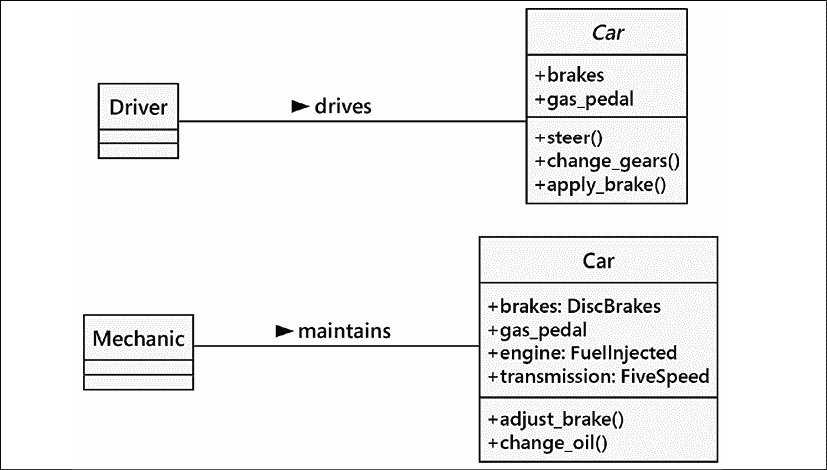图 1.6：汽车的抽象层次

现在，我们有几个新术语指的是类似的概念。让我们用几句话总结所有这些术语：抽象是将信息封装在独立的公共接口中的过程。任何私有元素都可以受到信息隐藏的影响。在 UML 图中，我们可能会使用一个前导破折号（-）而不是前导加号（+）来表示它不是公共接口的一部分。

从所有这些定义中吸取的重要教训是使我们的模型对必须与之交互的其他对象可理解。这意味着要仔细关注细节。

确保方法和属性有合理的名称。在分析系统时，对象通常代表原始问题中的名词，而方法通常是动词。属性可能表现为形容词或更多的名词。相应地命名你的类、属性和方法。

在设计界面时，想象你自己是对象；你希望对自己的责任有清晰的定义，并且你非常重视隐私来满足这些责任。除非你觉得自己有最好的利益让他们拥有这些信息，否则不要让其他对象访问关于你的数据。除非你确定这是你的责任去做，否则不要给他们一个界面来强迫你执行特定的任务。

# 组合

到目前为止，我们已经学会了将系统设计为一组相互作用的对象，其中每个交互都涉及在适当的抽象级别上查看对象。但我们还不知道如何创建这些抽象级别。有各种方法可以做到这一点；我们将在第十章、第十一章和第十二章中讨论一些高级设计模式。但即使大多数设计模式也依赖于两个基本面向对象的原则，即**组合**和**继承**。组合更简单，所以让我们从它开始。

组合是将几个对象收集在一起以创建一个新的对象的行为。当其中一个对象是另一个对象的一部分时，组合通常是一个好的选择。当我们谈论汽车时，我们已经看到了组合的第一个暗示。一个化石燃料汽车由发动机、变速箱、起动机、前灯和挡风玻璃等众多部件组成。反过来，发动机由活塞、曲轴和阀门组成。在这个例子中，组合是一种提供抽象级别的良好方式。**Car**对象可以提供司机所需的接口，同时也可以访问其组成部分，这提供了适合机械师更深层次的抽象。当然，如果机械师需要更多信息来诊断问题或调整发动机，这些组成部分可以进一步分解成细节。

汽车是组合的一个常见入门例子，但在设计计算机系统时并不特别有用。物理对象很容易分解成组件对象。人们至少从古希腊最初提出原子是物质的最小单位（他们当然没有粒子加速器）以来就在做这件事。由于计算机系统涉及许多**特殊概念**，识别组件对象并不像现实世界中的阀门和活塞那样自然发生。

面向对象系统中的对象有时代表物理对象，如人、书籍或电话。然而，更常见的是，它们代表概念。人们有名字，书籍有标题，电话用于打电话。通话、标题、账户、名字、约会和付款通常不被视为物理世界中的对象，但它们都是计算机系统中经常建模的组件。

让我们尝试模拟一个更面向计算机的例子，看看组合是如何发挥作用的。我们将研究一个计算机化棋盘游戏的设计。这在 80 年代和 90 年代是一个非常受欢迎的消遣活动。人们预测计算机有一天能够击败人类棋手。当 1997 年发生这种情况时（IBM 的 Deep Blue 击败了世界棋王加里·卡斯帕罗夫），对棋类问题的兴趣减弱了。如今，Deep Blue 的后代总是能赢。

一场**棋局**是在两个**玩家**之间进行的，使用一个包含 64 个**位置**的 8×8 网格的**棋盘**。棋盘可以有两套 16 个**棋子**，可以由两个玩家交替**移动**，以不同的方式。每个棋子可以**吃掉**其他棋子。在每一步之后，棋盘都需要在计算机**屏幕**上**绘制**自己。

我已经使用**斜体**标识了一些描述中可能的对象，并使用**粗体**标识了一些关键方法。这是将面向对象的分析转化为设计时的一个常见第一步。在这个阶段，为了强调组合，我们将专注于棋盘，而不太关心玩家或不同类型的棋子。

让我们从可能的最高的抽象层次开始。我们有两个玩家通过轮流移动棋子与**棋盘**进行交互：

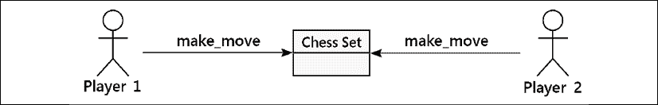

图 1.7：棋盘游戏的对象/实例图

这并不完全像我们之前的类图，这是好事，因为它不是！这是一个**对象图**，也称为**实例图**。它描述了系统在特定时间的状态，并描述了特定对象的具体实例，而不是类之间的交互。记住，两个玩家都是同一类的成员，所以类图看起来略有不同：

图 1.8：棋盘游戏的类图

此图显示恰好两名玩家可以与一个棋盘互动。这也表明任何一名玩家一次只能玩一个 **棋盘**。

然而，我们正在讨论组合，而不是 UML，所以让我们考虑一下 **棋盘** 由什么组成。我们现在不关心玩家由什么组成。我们可以假设玩家有一颗心和大脑，以及其他器官，但这些对我们模型来说是不相关的。实际上，没有任何阻止该玩家成为没有心脏和大脑的 Deep Blue 的理由。

因此，棋盘由一个棋盘和 32 个棋子组成。棋盘进一步由 64 个位置组成。你可以争论这些棋子不是棋盘的一部分，因为你可以用另一套棋子替换棋盘的棋子。虽然在计算机化的棋盘游戏中这不太可能或不可能，但它让我们了解了 **聚合**。

聚合几乎与组合完全相同。区别在于聚合对象可以独立存在。一个位置与不同的棋盘相关联是不可能的，所以我们说棋盘由位置组成。但是，棋子可能独立于棋盘存在，因此我们说棋子与该棋盘处于聚合关系。

区分聚合和组合的另一种方法是考虑对象的生命周期：

+   如果复合（外部）对象控制相关（内部）对象的创建和销毁时间，则组合是最合适的。

+   如果相关对象独立于复合对象创建，或者可以比该对象存活更久，则聚合关系更有意义。

此外，请记住，组合是聚合；聚合只是组合的一种更一般的形式。任何组合关系也是聚合关系，但反之则不然。

让我们描述我们当前的 **棋盘** 组合，并为对象添加一些属性以保持复合关系：

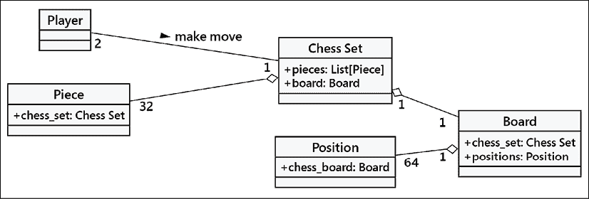

图 1.9：棋局类图

组合关系在 UML 中以实心菱形表示。空心菱形表示聚合关系。你会注意到棋盘和棋子作为棋盘的一部分存储，就像它们作为属性存储在棋盘上一样。这表明，在实践中，一旦过了设计阶段，聚合与组合的区别通常无关紧要。实现后，它们的行为几乎相同。

这种区别可以帮助你在团队讨论不同对象如何相互作用时区分两者。在谈论相关对象存在的时间长度时，你通常会需要区分它们。在许多情况下，删除一个复合对象（如棋盘）会删除所有位置。然而，聚合对象则不会自动删除。

# 继承

我们讨论了三种对象之间的关系：关联、组合和聚合。然而，我们尚未完全指定我们的棋盘，这些工具似乎并没有给我们提供所有需要的功能。我们讨论了玩家可能是一个人类或者可能是一块具有人工智能功能的软件的可能性。说玩家与人类**关联**，或者人工智能实现是玩家对象的**部分**，似乎并不合适。我们真正需要的是能够说**Deep Blue 是一个玩家**，或者**Gary Kasparov 是一个玩家**。

**继承**关系形成了**is a**关系。继承是面向对象编程中最著名、最知名且被过度使用的关联。继承有点像家谱。Dusty Phillips 是本书的作者之一。

他的祖父的姓氏是 Phillips，他的父亲继承了那个名字。Dusty 从他那里继承了它。在面向对象编程中，不是从一个人那里继承特性和行为，一个类可以继承另一个类的属性和方法。

例如，在我们的棋盘上共有 32 个棋子，但只有六种不同的棋子类型（兵、车、象、马、王和后），每种棋子在移动时表现都不同。所有这些棋子类别都有属性，例如颜色和它们所属的棋盘，但它们在棋盘上绘制时也有独特的形状，并且移动方式不同。让我们看看六种类型的棋子如何从**棋子**类中继承：

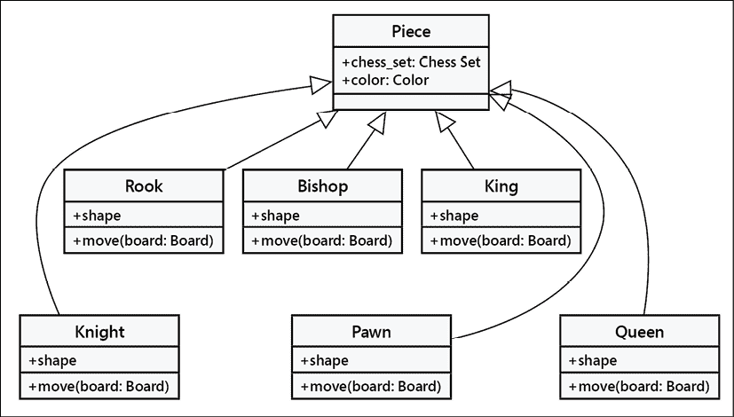

图 1.10：棋子如何从棋子类继承

空心箭头表示各个棋子类别从**棋子**类继承。所有子类自动从基类继承了一个**棋盘**和**颜色**属性。每个棋子提供不同的形状属性（在渲染棋盘时绘制），以及不同的**移动**方法，在每个回合将棋子移动到棋盘上的新位置。

实际上，我们知道所有**棋子**类的子类都需要有一个**移动**方法；否则，当棋盘尝试移动棋子时，它会感到困惑。我们可能想要创建一个新版本的棋类游戏，增加一个额外的棋子（法师）。我们当前的设计将允许我们不给它一个**移动**方法来设计这个棋子。然后，当棋盘要求棋子移动自己时，它就会卡住。

我们可以通过在**棋子**类上创建一个虚拟的移动方法来解决这个问题。子类可以随后用更具体的实现来**重写**这个方法。默认实现可能，例如，弹出一个错误消息，说**那个棋子不能移动**。

在子类中重写方法可以开发出非常强大的面向对象系统。例如，如果我们想实现一个具有人工智能的**Player**类，我们可能会提供一个**calculate_move**方法，该方法接受一个**Board**对象并决定将哪个棋子移动到哪个位置。一个非常基本的类可能会随机选择一个棋子和方向，并相应地移动它。然后我们可以在子类中重写这个方法，使用 Deep Blue 的实现。第一个类适合与初学者对弈；后者则可以挑战大师。重要的是，类中的其他方法，比如通知棋盘选择了哪个移动的方法，不需要改变；这种实现可以在两个类之间共享。

在棋子的例子中，提供移动方法的默认实现实际上并没有太多意义。我们只需要指定任何子类都需要实现移动方法。这可以通过将**Piece**类声明为**抽象类**并声明**move**方法为**抽象方法**来实现。抽象方法基本上是这样说的：

> “我们要求任何非抽象子类都必须实现这个方法，但我们不打算在这个类中指定实现方式。”

实际上，可以创建一个完全不实现任何方法的高度抽象。这样的类只会告诉我们这个类**应该**做什么，但不会提供任何关于如何做的建议。在某些语言中，这些纯粹抽象的类被称为**接口**。在 Python 中，可以定义一个只包含抽象方法占位符的类，但这非常罕见。

## 继承提供了抽象。

让我们探索面向对象术语中最长的单词。**多态性**是指根据实现的子类不同而以不同的方式处理类的能力。我们已经在我们描述的棋子系统中看到了它的实际应用。如果我们进一步扩展设计，我们可能会看到**Board**对象可以接受玩家的移动并调用棋子的**move**函数。棋盘不需要知道它正在处理的是什么类型的棋子。它只需要调用**move**方法，正确的子类就会负责将其移动为**骑士**或**兵**。

多态性非常酷，但在 Python 编程中这个词很少被使用。Python 允许一个对象的子类被当作父类来处理，但它在这一点上做得更多。在 Python 中实现的棋盘可以接受任何具有**move**方法的对象，无论是棋子、汽车还是鸭子。当调用**move**时，**主教**会在棋盘上斜着移动，汽车会驶向某个地方，鸭子会根据它的心情游泳或飞翔。

这种在 Python 中的多态通常被称为**鸭子类型**：**如果它像鸭子走路或游泳，我们就称它为鸭子**。我们不在乎它是否真的是一只鸭子（“是”是一个继承的核心），只在乎它是否能游泳或走路。鹅和天鹅可能很容易提供我们想要的类似鸭子的行为。这允许未来的设计者创建新的鸟类类型，而无需为所有可能的鸟类指定正式的继承层次结构。上面的棋类示例使用正式的继承来涵盖棋盘上的所有可能的棋子。鸭子类型还允许程序员扩展设计，创建原始设计者从未计划过的完全不同的即插即用行为。例如，未来的设计者可能能够制作一个既能行走又能游泳的企鹅，并且与相同的接口一起工作，而无需建议企鹅与鸭子有一个共同的超类。

## 多继承

当我们思考我们家族树中的继承时，我们可以看到我们不仅仅从父母一方继承了特征。当陌生人告诉一位自豪的母亲她的儿子有**他父亲的眼睛**时，她通常会这样回答，**是的，但他继承了了我的鼻子**。

面向对象的设计也可以有这种**多继承**，它允许子类从多个父类继承功能。在实践中，多继承可能是一个棘手的问题，一些编程语言（最著名的是 Java）严格禁止它。然而，多继承有其用途。最常见的是，它可以用来创建具有两个不同行为集的对象。例如，一个设计用来连接扫描仪以制作图像并发送扫描图像的传真对象可能通过从两个不同的`scanner`和`faxer`对象继承而创建。

只要两个类有明确的接口，子类从它们两个继承通常不会造成伤害。然而，如果我们从提供重叠接口的两个类继承，就会变得混乱。扫描仪和传真机没有任何重叠的功能，所以结合它们的功能是容易的。我们的反例是一个具有`move`方法的摩托车类，以及一个也具有`move`方法的船类。

如果我们想将它们合并成终极两栖车辆，当调用`move`时，结果类知道该做什么？在设计层面，这需要解释。（作为一个在船上生活的水手，一位作者真的想知道这是如何工作的。）

Python 有一个定义的**方法解析顺序**（**MRO**）来帮助我们理解哪些替代方法将被使用。虽然 MRO 规则很简单，但避免重叠甚至更简单。将多继承作为一种“混合”技术来组合不相关的方面可能是有帮助的。然而，在许多情况下，组合对象可能更容易设计。

继承是扩展行为和重用功能的有力工具。它也是面向对象设计相对于早期范式的最具市场潜力的进步之一。因此，它通常是面向对象程序员首先寻求的工具。然而，重要的是要认识到，拥有锤子并不意味着螺丝就会变成钉子。继承是解决明显“是”关系的完美方案。除此之外，它也可能被滥用。程序员经常使用继承在两种只有远亲关系的对象之间共享代码，而看不到任何“是”关系。虽然这不一定是一个坏的设计，但它是一个很好的机会去问为什么他们决定那样设计，以及是否另一种关系或设计模式可能更适合。

# 案例研究

我们的案例研究将涵盖这本书的许多章节。我们将从多个角度仔细研究一个问题。查看替代设计和设计模式非常重要；不止一次，我们会指出没有唯一的正确答案：有多个好的答案。我们的意图是提供一个涉及现实深度和复杂性的真实示例，并导致艰难的权衡决策。我们的目标是帮助读者应用面向对象编程和设计概念。这意味着在技术替代品中选择，以创建有用的东西。

案例研究的第一部分是对问题的概述以及我们为什么要解决这个问题。这部分背景将涵盖问题的多个方面，为后续章节中解决方案的设计和构建奠定基础。概述的一部分将包括一些 UML 图来捕捉需要解决的问题的元素。这些图将在后续章节中随着我们深入设计选择的影响和修改这些设计选择而演变。

与许多现实问题一样，作者们会带入个人的偏见和假设。关于这一点的后果，可以参考 Sara Wachter-Boettcher 所著的《Technically Wrong》一书。

我们的用户希望自动化一个常被称为**分类**的工作。这是产品推荐背后的基本理念：上次，顾客购买了产品 X，所以他们可能对类似的产品 Y 感兴趣。我们已经对他们的需求进行了分类，并可以定位到那个产品类中的其他项目。这个问题可能涉及复杂的数据组织问题。

从小而易于管理的事情开始是有帮助的。用户最终想要处理复杂的消费产品，但认识到解决一个难题并不是学习如何构建这类应用程序的好方法。最好是从小规模且复杂度可控的事情开始，然后逐步精炼和扩展，直到它满足他们的所有需求。因此，在本案例研究中，我们将构建一个用于鸢尾花物种的分类器。这是一个经典问题，关于如何对鸢尾花进行分类的方法有很多论述。

需要一个训练数据集，分类器将其用作正确分类的鸢尾花示例。我们将在下一节讨论训练数据的样子。

我们将使用**统一建模语言**（**UML**）创建一系列图表，以帮助描述和总结我们将要构建的软件。

我们将使用称为**4+1 视图**的技术来检查这个问题。这些视图包括：

+   **逻辑视图**展示了数据实体、它们的静态属性以及它们之间的关系。这是面向对象设计的核心。

+   **过程视图**描述了数据是如何被处理的。这可以采取多种形式，包括状态模型、活动图和序列图。

+   **开发视图**展示了将要构建的代码组件。这张图显示了软件组件之间的关系。这用于展示类定义是如何被收集到模块和包中的。

+   **物理视图**展示了将要集成和部署的应用程序。在应用程序遵循常见设计模式的情况下，一个复杂的图表并不是必需的。在其他情况下，图表是必不可少的，以展示组件集合是如何集成和部署的。

+   **上下文视图**为其他四个视图提供了一个统一的上下文。上下文视图通常描述使用（或与）将要构建的系统交互的参与者。这可能涉及人类参与者以及自动化接口：两者都在系统之外，系统必须对这些外部参与者做出响应。

通常从上下文视图开始，这样我们就有了一个关于其他视图描述的内容感。随着我们对用户和问题领域的理解不断演变，上下文也会随之演变。

认识到所有这些 4+1 视图是共同演化的非常重要。一个视图的变更通常会在其他视图中得到反映。一个常见的错误是认为一个视图在某种程度上是基础性的，而其他视图则在此基础上构建，形成一个设计步骤的级联，这些步骤总是导致软件的产生。

在我们开始尝试分析应用程序或设计软件之前，我们将对问题进行总结并提供一些背景信息。

## 引言和问题概述

如我们之前提到的，我们将从一个更简单的问题开始——分类花朵。我们希望实现一种流行的方法，称为**k**-**最近邻**，或简称**k**-**NN**。我们需要一个训练数据集，分类算法将使用它作为正确分类的鸢尾花示例。每个训练样本都有若干属性，这些属性被简化为数值分数，以及一个最终的、正确的分类（即鸢尾花种类）。在这个鸢尾花例子中，每个训练样本是一朵鸢尾花，其属性，如花瓣形状、大小等，被编码成一个数值向量，这是鸢尾花的整体表示，以及该鸢尾花的正确种类标签。

给定一个未知样本，一个我们想要知道种类的鸢尾花，我们可以在向量空间中测量未知样本与任何已知样本之间的距离。对于一些附近的邻居小群体，我们可以进行投票。未知样本可以被分类到由附近多数邻居选择的子群体中。

如果我们只有两个维度（或属性），我们可以这样绘制**k**-NN 分类图：

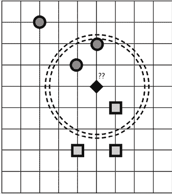

图 1.11：k-最近邻

我们未知样本是一个标记为"???"的菱形。它被已知样本的正方形和圆形种类所包围。当我们找到三个最近的邻居，如虚线圆内所示，我们可以进行投票并决定未知样本最像圆形种类。

一个基本概念是对于各种属性要有具体的数值测量。将文字、地址和其他非序数数据转换为序数测量可能具有挑战性。好消息是，我们将开始使用的数据已经具有适当的序数测量和明确的测量单位。

另一个支持概念是参与投票的邻居数量。这是**k**-最近邻中的**k**因子。在我们的概念图中，我们展示了**k**=3 个邻居；其中两个最近的邻居是圆形，第三个是正方形。如果我们把**k**值改为 5，这将改变池子的组成，并将投票倾向于正方形。哪个是正确的？这通过使用已知正确答案的测试数据来检查，以确认分类算法工作得相当好。在前面的图中，很明显，菱形被巧妙地选择在两个簇之间，有意地创造了一个困难的分类问题。

学习如何工作的流行数据集是鸢尾花分类数据集。有关此数据的背景信息，请参阅[`archive.ics.uci.edu/ml/datasets/iris`](https://archive.ics.uci.edu/ml/datasets/iris)。此数据也可在[`www.kaggle.com/uciml/iris`](https://www.kaggle.com/uciml/iris)和其他许多地方找到。

更有经验的读者可能会注意到，在我们进行面向对象的分析和设计工作时，存在一些差距和可能的矛盾。这是故意的。对任何范围的问题的初步分析将涉及学习和重做。随着我们了解更多，这个案例研究将不断发展。如果你发现了差距或矛盾，制定你自己的设计，看看它是否与后续章节中学到的经验相一致。

在查看了一些问题的方面之后，我们可以通过参与者和描述参与者如何与要构建的系统交互的用例或场景来提供更具体的上下文。我们将从上下文视图开始。

## 上下文视图

我们的应用程序对鸢尾花物种进行分类的上下文涉及以下两类参与者：

+   一个“植物学家”，他提供经过适当分类的训练数据和测试数据集。植物学家还运行测试用例以确定分类的正确参数。在简单的 k-NN 情况下，他们可以决定应该使用哪个 k 值。

+   一个“用户”，他需要对未知数据进行分类。用户已经进行了仔细的测量，并使用测量数据向这个分类器系统提出请求以获得分类。名字“用户”听起来有些模糊，但我们不确定什么更好。我们暂时保留它，并推迟到我们预见问题再进行更改。

这个 UML 上下文图说明了我们将探索的两个参与者和三个场景：

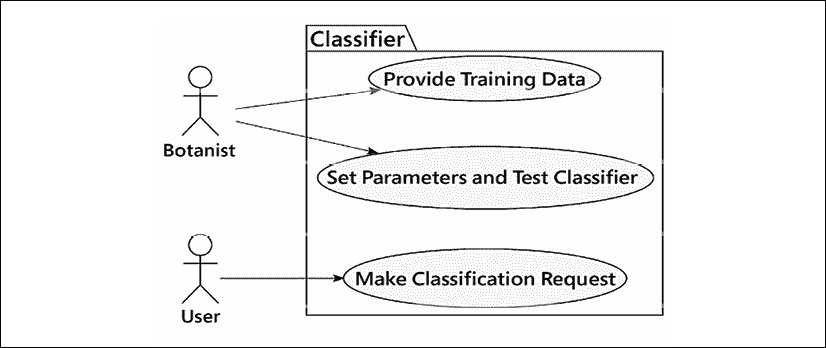

图 1.12：UML 上下文图

整个系统被描绘成一个矩形。它包围着椭圆形来表示用户故事。在 UML 中，特定的形状具有意义，我们保留矩形用于对象。椭圆形（和圆形）用于用户故事，它们是系统的接口。

为了进行任何有用的处理，我们需要经过适当分类的训练数据。每一组数据包含两个部分：一个训练集和一个测试集。我们将整个集合称为“训练数据”，而不是更长的（但更精确的）“训练和测试数据”。

调节参数由植物学家设置，他必须检查测试结果以确保分类器工作。这些是可以调节的两个参数：

+   要使用的距离计算方法

+   考虑投票的邻居数量

我们将在本章后面的“处理视图”部分详细讨论这些参数。我们还将随后在案例研究章节中回顾这些想法。距离计算是一个有趣的问题。

我们可以将一系列实验定义为一个网格，其中包含每个备选方案和方法，然后系统地用测试集的测量结果填充网格。提供最佳拟合的组合将是植物学家推荐的参数集。在我们的案例中，有两种选择，网格是一个二维表格，如下所示。对于更复杂的算法，“网格”可能是一个多维空间：

|  |  | 各种 k 因子 |
| --- | --- | --- |
|  |  | k=3 | k=5 | k=7 |
| 距离计算算法 | 欧几里得 | 测试结果… |  |  |
| 曼哈顿 |  |  |  |
| 切比雪夫 |  |  |  |
| 索伦森 |  |  |  |
| 其他？ |  |  |  |

测试完成后，用户可以提出请求。他们提供未知数据以从经过训练的分类器过程中接收分类结果。从长远来看，这个“用户”不会是一个人——他们将是来自某个网站的销售或目录引擎到我们聪明的基于分类器的推荐引擎的连接。

我们可以用**用例**或**用户故事**语句来总结这些场景：

+   作为一名植物学家，我想向这个系统提供正确分类的训练和测试数据，以便用户能够正确识别植物。

+   作为一名植物学家，我想检查分类器的测试结果，以确保新样本很可能被正确分类。

+   作为一名用户，我希望能够向分类器提供一些关键测量值，并使鸢尾花物种得到正确分类。

根据用户故事中的名词和动词，我们可以使用这些信息来创建应用程序将处理的数据的逻辑视图。

## 逻辑视图

观察上下文图，处理从训练数据和测试数据开始。这是用于测试我们分类算法的正确分类样本数据。以下图示展示了查看包含各种训练和测试数据集的类的一种方式：

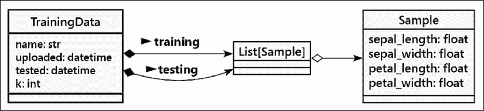

图 1.13：训练和测试的类图

这显示了具有每个实例属性的对象的`Training Data`类。`TrainingData`对象给我们的样本集合起了一个名字，以及上传和测试完成的一些日期。目前，似乎每个`TrainingData`对象都应该有一个用于*k*-NN 分类算法的单个调整参数`k`。实例还包括两个单独样本的列表：一个训练列表和一个测试列表。

每个对象类别都用一个矩形表示，其中包含多个单独的部分：

+   最顶部的部分为对象类提供了一个名称。在两种情况下，我们使用了类型提示`List[Sample]`；泛型类`list`的使用方式确保列表的内容只能是`Sample`对象。

+   类矩形的下一部分显示了每个对象的属性；这些属性也被称为此类实例的实例变量。

+   之后，我们将在类底部的部分添加“方法”用于类的实例。

`Sample`类的每个对象都有一些属性：四个浮点测量值和一个字符串值，这是植物学家为样本分配的分类。在这种情况下，我们使用了属性名`class`，因为在源数据中它就是这样称呼的。

UML 箭头显示了两种特定类型的关系，通过填充或空心的菱形突出显示。一个填充的菱形表示**组合**：一个`TrainingData`对象部分由两个集合组成。一个开放的菱形表示**聚合**：一个`List[Sample]`对象是`Sample`项的聚合。为了回顾我们之前学到的内容：

+   **组合**是一种存在关系：没有两个`List[Sample]`对象，我们无法拥有`TrainingData`。相反，一个`List[Sample]`对象在我们的应用程序中不被用作`TrainingData`对象的一部分。

+   另一方面，**聚合**是一种可以独立存在的关系。在这个图中，多个`Sample`对象可以是`List[Sample]`的一部分，也可以独立于列表存在。

显然，用开放的菱形来表示将`Sample`对象聚合到`List`对象中的聚合关系并不相关。这可能是一个无用的设计细节。在不确定的情况下，最好省略这些类型的细节，直到它们显然是必需的，以确保有一个满足用户期望的实现。

我们将`List[Sample]`显示为一个单独的对象类。这是 Python 的通用`List`，用特定的对象类`Sample`进行限定，这些对象将包含在列表中。通常避免这种级别的细节，并在以下类似的图中总结关系：

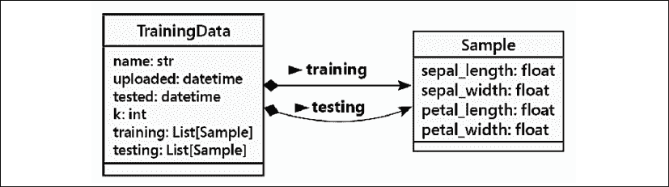

图 1.14：压缩后的类图

这种略微简化的形式有助于进行分析工作，其中底层的数据结构并不重要。对于设计工作来说，具体的 Python 类信息则更为重要。

给定一个初始草图，我们将把这个逻辑视图与上下文图中提到的三个场景之一进行比较，如前节中*图 1.12*所示。我们想要确保用户故事中的所有数据和处理都可以分配到图中分散在类、属性和方法中的责任。

在遍历用户故事时，我们发现了这两个问题：

+   测试和参数调整如何与这个图相匹配并不清楚。我们知道需要一个*k*因子，但没有相关的测试结果来显示替代*k*因子及其选择的结果。

+   用户请求根本未显示。对用户的响应也没有显示。没有类将这些项作为其责任的一部分。

第一点表明我们需要重新阅读用户故事，并再次尝试创建一个更好的逻辑视图。第二点是关于边界的问题。虽然缺少了网络请求和响应的细节，但首先描述基本的问题域——分类和*k*-NN——更为重要。处理用户请求的 Web 服务是（众多）解决方案技术之一，在开始时我们应该将其放在一边。

现在，我们将关注数据处理。我们遵循创建应用程序描述的有效顺序。数据必须首先描述；这是最持久的部分，也是每次处理细化过程中始终保留的东西。处理可以次要于数据，因为随着上下文的变化以及用户体验和偏好的变化，它会发生变化。

## 处理视图

有三个独立的故事。这并不一定迫使我们创建三个流程图。对于复杂的处理，流程图可能比用户故事多。在某些情况下，一个用户故事可能过于简单，不需要精心设计的图表。

对于我们的应用，似乎至少有三个独特的感兴趣的过程，具体如下：

+   上传包含一些`TrainingData`的初始`Samples`集。

+   使用给定的`k`值运行分类器的测试。

+   使用新的`Sample`对象进行分类请求。

我们将为这些用例绘制活动图。活动图总结了一系列状态变化。处理从开始节点开始，直到达到结束节点。在基于事务的应用程序中，如 Web 服务，通常省略显示整体 Web 服务器引擎。这使我们免于描述 HTTP 的常见特性，包括标准头、cookie 和安全问题。相反，我们通常专注于为每种不同类型的请求创建响应的独特处理。

活动以圆角矩形表示。当特定类别的对象或软件组件相关时，它们可以链接到相关活动。

更重要的是确保在处理视图工作时，逻辑视图随着新想法的出现而更新。完全独立完成任何一种视图都是困难的。当新的解决方案想法出现时，在每个视图中进行增量更改更为重要。在某些情况下，需要额外的用户输入，这也将导致这些视图的演变。

我们可以绘制一个图表来展示当植物学家提供初始数据时系统如何响应。以下是第一个例子：

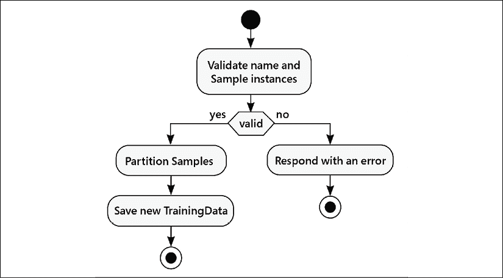

图 1.15：活动图

`KnownSample`值的集合将被划分为两个子集：一个训练子集和一个测试子集。在我们的问题摘要或用户故事中并没有规则来区分这一点；差距表明我们在原始用户故事中缺少细节。当用户故事中缺少细节时，逻辑视图也可能不完整。目前，我们可以假设大部分数据——比如说 75%——将用于训练，其余的 25%将用于测试。

为每个用户故事创建类似的图示通常很有帮助。这也有助于确保所有活动都有相关的类来实现步骤并表示由每个步骤引起的状态变化。

我们在这个图示中包含了一个动词`Partition`。这表明需要实现这个动词的方法。这可能会导致重新思考类模型，以确保可以实施处理。

我们将转向考虑需要构建的一些组件。由于这是一个初步分析，我们的想法将在我们进行更详细的设计并开始创建类定义时演变。

## 开发视图

在最终部署和要开发的组件之间往往有一个微妙的平衡。在罕见的情况下，部署约束很少，设计师可以自由地思考要开发的组件。物理视图将随着开发而演变。在更常见的情况下，必须使用特定的目标架构，物理视图的元素是固定的。

有几种方法可以将这个分类器作为更大应用程序的一部分进行部署。我们可能构建一个桌面应用程序、一个移动应用程序或一个网站。由于互联网计算机的普遍性，一种常见的方法是创建一个网站，并从桌面和移动应用程序连接到它。

例如，一个网络服务架构意味着可以向服务器发送请求；响应可以是用于在浏览器中展示的 HTML 页面，或者可以被移动应用程序显示的 JSON 文档。一些请求将提供全新的训练数据集。其他请求将试图对未知样本进行分类。我们将在下面的物理视图中详细说明架构。我们可能希望使用 Flask 框架来构建网络服务。有关 Flask 的更多信息，请参阅*精通 Flask Web 开发*，[`www.packtpub.com/product/mastering-flask-web-development-second-edition/9781788995405`](https://www.packtpub.com/product/mastering-flask-web-development-second-edition/9781788995405)，或*学习 Flask 框架*，[`www.packtpub.com/product/learning-flask-framework/9781783983360`](https://www.packtpub.com/product/learning-flask-framework/9781783983360)。

下面的图示显示了我们需要为基于 Flask 的应用程序构建的一些组件：

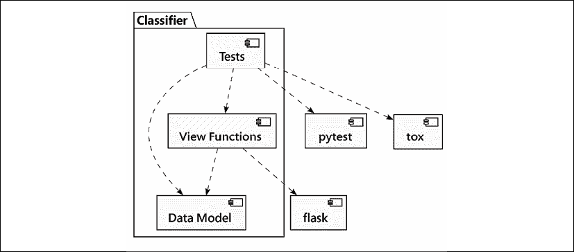

图 1.16：需要构建的组件

此图示显示了一个包含多个模块的 Python 包`Classifier`。三个顶级模块是：

+   **数据模型**：（由于这仍然是分析阶段，这里的命名并不完全符合 Python 风格；我们将在进入实现阶段时将其更改。）将定义问题域的类分离到模块中通常很有帮助。这使得我们能够在与使用这些类的任何特定应用程序隔离的情况下测试它们。我们将关注这部分，因为它构成了基础。

+   **视图函数**:（也是一个分析名称，而不是 Python 实现名称。）此模块将创建`Flask`类的实例，即我们的应用程序。它将定义通过创建可以由移动应用程序或浏览器显示的响应来处理请求的函数。这些函数公开了模型的功能，并不涉及模型本身的深度和复杂性；在案例研究中，我们不会关注这个组件。

+   **测试**: 这将为模型和视图函数提供单元测试。虽然测试对于确保软件可用性至关重要，但它们是第十三章的主题，即*面向对象程序的测试*。

我们已经包括了依赖关系箭头，使用虚线。这些可以用 Python 特定的“导入”标签来注释，以帮助阐明各种包和模块之间的关系。

随着我们进入后面的章节进行设计，我们将扩展这个初始视图。在思考了需要构建的内容之后，我们现在可以通过绘制应用程序的物理视图来考虑它的部署。如上所述，开发和部署之间存在微妙的平衡。这两个视图通常一起构建。

## 物理视图

物理视图显示了软件将如何安装到物理硬件中。对于网络服务，我们经常谈论**持续集成和持续部署**（**CI/CD**）管道。这意味着软件的更改作为单元进行测试，与现有应用程序集成，作为一个整体进行测试，然后部署给用户。

虽然通常假设是网站，但这也可以部署为命令行应用程序。它可能运行在本地计算机上。它也可能运行在云端的计算机上。另一个选择是围绕核心分类器构建一个网络应用程序。

下面的图显示了网络应用程序服务器的一个视图：

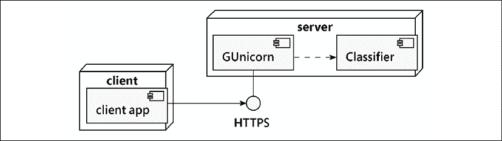

图 1.17：应用程序服务器图

此图显示了客户端和服务器节点作为安装了“组件”的三维“盒子”。我们已经确定了三个组件：

+   运行**客户端应用程序**的应用程序客户端。此应用程序连接到分类器网络服务并发出 RESTful 请求。它可能是一个用 JavaScript 编写的网站，也可能是一个用 Kotlin 或 Swift 编写的移动应用程序。所有这些前端都有一个通用的**HTTPS**连接到我们的网络服务器。这个安全连接需要一些证书和加密密钥对的配置。

+   **GUnicorn**网络服务器。此服务器可以处理网络服务请求的许多细节，包括重要的 HTTPS 协议。有关详细信息，请参阅[`docs.gunicorn.org/en/stable/index.html`](https://docs.gunicorn.org/en/stable/index.html)。

+   我们的**Classifier**应用程序。从这个视角来看，复杂性已经被省略，整个`Classifier`包被简化为更大 Web 服务框架中的一个小型组件。这可以使用 Flask 框架来实现。

在这些组件中，客户的**客户端应用**不是开发分类器所做工作的组成部分。我们包含这部分内容是为了说明上下文，但我们实际上并不打算去构建它。

我们使用虚线依赖箭头来表示我们的`Classifier`应用程序是来自 Web 服务器的依赖。**GUnicorn**将导入我们的 Web 服务器对象并使用它来响应请求。

现在我们已经概述了应用程序，我们可以考虑编写一些代码。在编写过程中，保持图表更新是有帮助的。有时，它们可以作为代码荒野中的便捷路线图。

## 结论

在这个案例研究中有几个关键概念：

1.  软件应用可能相当复杂。有五种视图来描述用户、数据、处理、要构建的组件以及目标物理实现。

1.  错误将会发生。这个概述中存在一些空白。向前推进部分解决方案是很重要的。Python 的一个优点是能够快速构建软件，这意味着我们并没有深入投资于坏主意。我们可以（并且应该）快速移除和替换代码。

1.  对扩展持开放态度。在我们实现这个之后，我们会看到设置*k*参数是一个繁琐的练习。一个重要的下一步是使用网格搜索调优算法来自动化调优。通常，先把这些事情放在一边，先实现一个能工作的东西，然后再扩展工作软件以添加这个有用的功能。

1.  尽量为每个类分配清晰的职责。这已经相当成功，但有些职责是模糊的或完全省略了。随着我们将这个初步分析扩展到实现细节，我们将重新审视这个问题。

在后面的章节中，我们将更深入地探讨这些各种主题。因为我们的意图是展示现实的工作，这将会涉及重做。一些设计决策可能会随着读者接触到越来越多的 Python 面向对象编程技术而进行修订。此外，解决方案的一些部分将随着我们对设计选择和问题的理解而发展。基于所学知识的重做是敏捷开发方法的一个结果。

# 回忆

本章的一些关键点：

+   在面向对象的环境中分析问题需求

+   如何绘制**统一建模语言**（**UML**）图来传达系统的工作方式

+   使用正确的术语和行话讨论面向对象系统

+   理解类、对象、属性和行为之间的区别

+   一些面向对象的设计技术比其他技术使用得更多。在我们的案例研究示例中，我们关注了以下几个：

    +   将特性封装到类中

    +   继承以扩展类的新功能

    +   从组件对象构建类的组合

# 练习

这是一本实用的书。因此，我们不会分配一大堆虚假的面向对象分析问题来为你创建要分析和设计的设计。相反，我们希望给你一些你可以应用到自己的项目中的想法。如果你有面向对象的经验，你不需要在这个章节上投入太多精力。然而，如果你已经使用 Python 一段时间，但从未真正关心过所有这些类的东西，它们仍然是有用的心理练习。

首先，思考一下你最近完成的一个编程项目。确定设计中最突出的对象。尽量想出这个对象尽可能多的属性。它有下面的属性吗：颜色？重量？大小？利润？成本？名称？ID 号码？价格？风格？

思考属性类型。它们是原始类型还是类？其中一些属性实际上是伪装成行为的行为？有时，看起来像是数据的东西实际上是从对象上的其他数据计算出来的，你可以使用一个方法来进行这些计算。对象还有哪些其他方法或行为？哪些对象调用了这些方法？它们与这个对象有什么样的关系？

现在，考虑一个即将到来的项目。项目是什么并不重要；它可能是一个有趣的空闲时间项目，或者是一个价值数百万美元的合同。它不必是一个完整的应用程序；它可能只是一个子系统。进行基本的面向对象分析。确定需求以及相互作用的对象。绘制一个展示该系统最高抽象级别的类图。确定主要相互作用的对象。确定次要支持对象。对一些最有趣的对象的属性和方法进行详细描述。将不同的对象带到不同的抽象级别。寻找可以使用继承或组合的地方。寻找应该避免继承的地方。

目标不是设计一个系统（尽管如果你有意愿并且有足够的时间，当然可以这样做）。目标是思考面向对象的设计。专注于你曾经工作过的项目，或者你未来打算工作的项目，这样可以使它变得真实。

最后，访问你最喜欢的搜索引擎，查找一些关于 UML 的教程。有很多，所以找到适合你学习偏好的一个。为之前识别出的对象绘制一些类图或序列图。不要过于纠结于记忆语法（毕竟，如果它很重要，你总是可以再次查找）；只需感受一下这种语言。一些东西会留在你的脑海中，如果你能快速绘制出你下一次面向对象讨论的图表，这可以使沟通变得容易一些。

# 摘要

在本章中，我们快速浏览了面向对象范式的术语，重点关注面向对象设计。我们可以将不同的对象分为不同类别的分类，并通过类接口描述这些对象的属性和行为。抽象、封装和信息隐藏是高度相关的概念。对象之间存在许多不同类型的关系，包括关联、组合和继承。UML 语法对于娱乐和沟通非常有用。

在下一章中，我们将探讨如何在 Python 中实现类和方法。
