# 当物体相似时

在编程领域，重复代码被视为邪恶。我们不应该在不同地方有相同或相似的代码的多个副本。当我们修复了一个副本中的错误，却未能修复另一个副本中的相同错误时，我们给自己带来了无穷无尽的麻烦。

合并具有相似功能的代码或对象有许多方法。在本章中，我们将介绍最著名的面向对象原则：继承。正如在*第一章*，*面向对象设计*中讨论的那样，继承使我们能够在两个或更多类之间创建“是”的关系，将共同逻辑抽象到超类中，并在每个子类中用特定细节扩展超类。特别是，我们将介绍以下 Python 语法和原则：

+   基本继承

+   从内置类型继承

+   多重继承

+   多态和鸭子类型

本章的案例研究将扩展上一章的内容。我们将利用继承和抽象的概念来寻找管理*k*最近邻计算中公共代码的方法。

我们将首先详细探讨继承的工作原理，以便提取共同特性，从而避免复制粘贴编程。

# 基本继承

技术上讲，我们创建的每个类都使用了继承。所有 Python 类都是名为 `object` 的特殊内置类的子类。这个类提供了一点点元数据和一些内置行为，以便 Python 可以一致地处理所有对象。

如果我们没有显式地从不同的类继承，我们的类将自动继承自`object`。然而，我们可以使用以下语法冗余地声明我们的类继承自`object`：

```py
class MySubClass(object): 
    pass 
```

这就是继承！从技术上讲，这个例子与我们*第二章*中非常第一个例子没有区别，即*Python 中的对象*。在 Python 3 中，如果我们没有明确提供不同的**超类**，所有类都会自动从`object`继承。在这个例子中，超类或*父类*是继承的类，即`object`。一个子类——在这个例子中是`MySubClass`——从超类继承。子类也被说成是*从其父类派生*，或者子类*扩展*了父类。

如您从示例中可能已经推断出来，继承相对于基本类定义只需要额外的少量语法。只需在类名和冒号之间用括号包含父类的名称即可。这就是我们要做的全部，以告诉 Python 新类应该从给定的超类派生。

我们如何在实践中应用继承？继承最简单和最明显的用途是为现有类添加功能。让我们从一个联系人管理器开始，它跟踪几个人的姓名和电子邮件地址。`Contact`类负责维护一个全局列表，其中包含一个类变量中曾经见过的所有联系人，并为单个联系人初始化姓名和地址：

```py
class Contact:
   all_contacts: List["Contact"] = []
   def __init__(self, name: str, email: str) -> None:
       self.name = name
       self.email = email
       Contact.all_contacts.append(self)
   def __repr__(self) -> str:
       return (
           f"{self.__class__.__name__}("
           f"{self.name!r}, {self.email!r}"
           f")"
      ) 
```

这个例子向我们介绍了**类变量**。`all_contacts`列表，因为它属于类定义的一部分，被这个类的所有实例共享。这意味着只有一个`Contact.all_contacts`列表。我们也可以从`Contact`类的任何实例的方法中通过`self.all_contacts`来访问它。如果一个字段在对象上（通过`self`）找不到，那么它将在类上找到，因此将引用同一个单个列表。

小心使用基于`self`的引用。它只能提供访问现有基于类的变量的权限。如果你试图使用`self.all_contacts`来**设置**变量，实际上你将会创建一个仅与该对象关联的**新**实例变量。类变量将保持不变，并且可以通过`Contact.all_contacts`进行访问。

我们可以通过以下示例了解该类如何跟踪数据：

```py
>>> c_1 = Contact("Dusty", "dusty@example.com")
>>> c_2 = Contact("Steve", "steve@itmaybeahack.com")
>>> Contact.all_contacts
[Contact('Dusty', 'dusty@example.com'), Contact('Steve', 'steve@itmaybeahack.com')] 
```

我们创建了两个`Contact`类的实例，并将它们分别赋值给变量`c_1`和`c_2`。当我们查看`Contact.all_contacts`类变量时，我们发现列表已经更新，以跟踪这两个对象。

这是一个简单的类，它允许我们跟踪每个联系人的几项数据。但如果我们的一些联系人也是我们需要从他们那里订购物资的供应商怎么办呢？我们可以在`Contact`类中添加一个`order`方法，但这样可能会让人们在无意中从客户或家人朋友那里订购东西。相反，让我们创建一个新的`Supplier`类，它类似于我们的`Contact`类，但有一个额外的`order`方法，该方法接受一个尚未定义的`Order`对象：

```py
class Supplier(Contact):
   def order(self, order: "Order") -> None:
       print(
           "If this were a real system we would send "
           f"'{order}' order to '{self.name}'"
       ) 
```

现在，如果我们在我们可靠的解释器中测试这个类，我们会看到所有联系，包括供应商，都在它们的`__init__()`方法中接受一个名称和电子邮件地址，但只有`Supplier`实例才有`order()`方法：

```py
>>> c = Contact("Some Body", "somebody@example.net")
>>> s = Supplier("Sup Plier", "supplier@example.net")
>>> print(c.name, c.email, s.name, s.email)
Some Body somebody@example.net Sup Plier supplier@example.net
>>> from pprint import pprint
>>> pprint(c.all_contacts)
[Contact('Dusty', 'dusty@example.com'),
 Contact('Steve', 'steve@itmaybeahack.com'),
 Contact('Some Body', 'somebody@example.net'),
 Supplier('Sup Plier', 'supplier@example.net')]
>>> c.order("I need pliers")
Traceback (most recent call last):
  File "<stdin>", line 1, in <module>
AttributeError: 'Contact' object has no attribute 'order'
>>> s.order("I need pliers")
If this were a real system we would send 'I need pliers' order to 'Sup Plier' 
```

我们的`Supplier`类可以做到一个联系人所能做的一切（包括将自己添加到`Contact.all_contacts`的列表中），以及作为供应商需要处理的特殊事务。这就是继承的美丽之处。

此外，请注意`Contact.all_contacts`已经收集了`Contact`类及其子类`Supplier`的每一个实例。如果我们使用`self.all_contacts`，那么这**不会**将所有对象收集到`Contact`类中，而是将`Supplier`实例放入`Supplier.all_contacts`中。

## 扩展内置功能

这种继承的一个有趣用途是向内置类添加功能。在前面看到的`Contact`类中，我们正在将联系人添加到所有联系人的列表中。如果我们还想按名称搜索这个列表怎么办？嗯，我们可以在`Contact`类上添加一个方法来搜索它，但感觉这个方法实际上属于列表本身。

以下示例展示了我们如何通过从内置类型继承来实现这一点。在这种情况下，我们使用的是`list`类型。我们将通过使用`list["Contact"]`来通知**mypy**我们的列表只包含`Contact`类的实例。为了使此语法在 Python 3.9 中工作，我们还需要从`__future__`包中导入`annotations`模块。定义看起来是这样的：

```py
from __future__ import annotations
class ContactList(list["Contact"]):
    def search(self, name: str) -> list["Contact"]:
        matching_contacts: list["Contact"] = []
        for contact in self:
            if name in contact.name:
                matching_contacts.append(contact)
        return matching_contacts
class Contact:
    all_contacts = ContactList()
    def __init__(self, name: str, email: str) -> None:
        self.name = name
        self.email = email
        Contact.all_contacts.append(self)
    def __repr__(self) -> str:
        return (
            f"{self.__class__.__name__}(" 
            f"{self.name!r}, {self.email!r}" f")"
        ) 
```

我们不是将一个通用列表作为我们的类变量，而是创建一个新的`ContactList`类，该类扩展了内置的`list`数据类型。然后，我们将这个子类实例化为我们自己的`all_contacts`列表。我们可以如下测试新的搜索功能：

```py
>>> c1 = Contact("John A", "johna@example.net")
>>> c2 = Contact("John B", "johnb@sloop.net")
>>> c3 = Contact("Jenna C", "cutty@sark.io")
>>> [c.name for c in Contact.all_contacts.search('John')]
['John A', 'John B'] 
```

我们有两种创建通用列表对象的方法。使用类型提示，我们有了另一种谈论列表的方式，这不同于创建实际的列表实例。

首先，使用`[]`创建列表实际上是一个使用`list()`创建列表的快捷方式；这两种语法的行为相同：

```py
>>> [] == list()
True 
```

`[]` 简短而甜美。我们可以称它为**语法糖**；它是对 `list()` 构造函数的调用，用两个字符代替了六个字符。`list` 名称指的是一种数据类型：它是一个我们可以扩展的类。

工具如 **mypy** 可以检查 `ContactList.search()` 方法的主体，以确保它确实会创建一个填充有 `Contact` 对象的 `list` 实例。请确保您已安装了 0.812 或更高版本的版本；**mypy** 的旧版本无法完全处理基于泛型的这些注解。

由于我们在`ContactList`类的定义之后提供了`Contact`类的定义，我们不得不将一个尚未定义的类的引用作为字符串提供，即`list["Contact"]`。通常情况下，先提供单个项目类的定义更为常见，然后集合可以无使用字符串通过名称引用已定义的类。

作为第二个例子，我们可以扩展`dict`类，它是一个键及其相关值的集合。我们可以使用`{}`语法糖来创建字典的实例。以下是一个扩展的字典，它跟踪它所看到的最大键长：

```py
class LongNameDict(dict[str, int]):
    def longest_key(self) -> Optional[str]:
        """In effect, max(self, key=len), but less obscure"""
        longest = None
        for key in self:
            if longest is None or len(key) > len(longest):
                longest = key
        return longest 
```

课程提示将通用的 `dict` 窄化为更具体的 `dict[str, int]`；键的类型为 `str`，值的类型为 `int`。这有助于 **mypy** 推理 `longest_key()` 方法。由于键应该是 `str` 类型的对象，因此 `for key in self:` 语句将遍历 `str` 对象。结果将是 `str` 类型，或者可能是 `None`。这就是为什么结果被描述为 `Optional[str]` 的原因。（`None` 是否合适？或许并不合适。或许抛出一个 `ValueError` 异常会更好；这将在 *第四章，意料之外* 中讨论。）

我们将处理字符串和整数值。也许这些字符串是用户名，而整数值是他们在一个网站上阅读的文章数量。除了核心的用户名和阅读历史之外，我们还需要知道最长的名字，以便我们可以格式化一个具有正确尺寸显示框的分数表。这可以在交互式解释器中轻松测试：

```py
>>> articles_read = LongNameDict()
>>> articles_read['lucy'] = 42
>>> articles_read['c_c_phillips'] = 6
>>> articles_read['steve'] = 7
>>> articles_read.longest_key()
'c_c_phillips'
>>> max(articles_read, key=len)
'c_c_phillips' 
```

如果我们想要一个更通用的字典？比如说，其值可以是字符串**或**整数？我们就需要一个稍微更广泛的类型提示。我们可能会使用`dict[str, Union[str, int]]`来描述一个将字符串映射到字符串或整数的并集的字典。

大多数内置类型都可以类似地扩展。这些内置类型分为几个有趣的家族，具有各自类型的提示：

+   通用集合：`set`、`list`、`dict`。这些使用类型提示如`set[something]`、`list[something]`和`dict[key, value]`来将提示从纯泛型缩小到应用实际使用的更具体类型。要使用通用类型作为注解，需要在代码的第一行使用`from __future__ import annotations`。

+   `typing.NamedTuple` 定义允许我们定义新的不可变元组类型，并为成员提供有用的名称。这将在 *第七章*，*Python 数据结构*，以及 *第八章*，*面向对象与函数式编程的交汇处* 中进行介绍。

+   Python 为文件相关的 I/O 对象提供了类型提示。一种新的文件可以使用 `typing.TextIO` 或 `typing.BinaryIO` 类型提示来描述内置的文件操作。

+   通过扩展 `typing.Text`，可以创建新的字符串类型。在大多数情况下，内置的 `str` 类就能满足我们的需求。

+   新的数值类型通常以`numbers`模块作为内置数值功能的来源。

我们将在整本书中大量使用通用集合。正如所注，我们将在后面的章节中探讨命名元组。对于内置类型的其他扩展，本书内容过于高级。在下一节中，我们将更深入地探讨继承的好处以及我们如何在子类中选择性利用超类特性。

## 覆盖和超类

因此，继承非常适合于向现有类中*添加*新的行为，但关于*改变*行为又如何呢？我们的`Contact`类只允许添加姓名和电子邮件地址。这可能对大多数联系人来说已经足够了，但如果我们想为我们的亲密朋友添加电话号码怎么办呢？

如同我们在*第二章*，*Python 中的对象*中看到的，我们可以在对象构建后通过设置一个`phone`属性来轻松实现这一点。但如果我们想在初始化时使这个第三个变量可用，我们必须重写`__init__()`方法。重写意味着用子类中具有相同名称的新方法（或替换）来更改或替换超类的方法。为此不需要特殊的语法；子类新创建的方法会自动被调用，而不是调用超类的方法，如下面的代码所示：

```py
class Friend(Contact):
    def __init__(self, name: str, email: str, phone: str) -> None:
        self.name = name
        self.email = email
        self.phone = phone 
```

任何方法都可以被覆盖，不仅仅是`__init__()`。然而，在我们继续之前，我们需要解决这个例子中的一些问题。我们的`Contact`和`Friend`类在设置`name`和`email`属性方面有重复的代码；这可能会使代码维护变得复杂，因为我们不得不在两个或更多的地方更新代码。更令人担忧的是，我们的`Friend`类正在忽视将自身添加到我们在`Contact`类上创建的`all_contacts`列表中。最后，展望未来，如果我们向`Contact`类添加一个功能，我们希望它也成为`Friend`类的一部分。

我们真正需要的是一种方法，在新的类内部执行`Contact`类的原始`__init__()`方法。这正是`super()`函数的作用；它返回一个对象，仿佛它实际上是父类的一个实例，这样我们就可以直接调用父类的方法：

```py
class Friend(Contact):
    def __init__(self, name: str, email: str, phone: str) -> None:
        super().__init__(name, email)
        self.phone = phone 
```

此示例首先使用`super()`将实例绑定到父类，并在该对象上调用`__init__()`方法，传入预期的参数。然后它执行自己的初始化，即设置`phone`属性，这是`Friend`类独有的。

`Contact` 类提供了一个定义，用于生成字符串表示形式的 `__repr__()` 方法。我们的类没有覆盖从超类继承来的 `__repr__()` 方法。以下是这种做法的后果：

```py
>>> f = Friend("Dusty", "Dusty@private.com", "555-1212")
>>> Contact.all_contacts
[Friend('Dusty', 'Dusty@private.com')] 
```

对于`Friend`实例显示的详细信息不包括新属性。在考虑类设计时，很容易忽略特殊方法定义。

在任何方法内部都可以调用`super()`。因此，所有方法都可以通过重写和调用`super()`来修改。`super()`的调用也可以在任何方法点进行；我们不必将调用作为第一行执行。例如，我们可能需要在将参数转发给超类之前对其进行操作或验证。

# 多重继承

多重继承是一个敏感的话题。在原则上，它是简单的：一个从多个父类继承的子类可以访问它们的功能。在实践中，它需要一些小心，以确保任何方法覆盖都被完全理解。

作为一条幽默的经验法则，如果你认为你需要多重继承，你可能错了，但如果你确实需要它，你可能是对的。

最简单且最有用的多重继承形式遵循一种名为**混入（mixin）**的设计模式。混入类定义并不是为了独立存在，而是意味着它将被其他类继承以提供额外的功能。例如，假设我们想要为我们的`Contact`类添加功能，使其能够向`self.email`发送电子邮件。

发送电子邮件是一项常见的任务，我们可能在许多其他课程中也会用到。因此，我们可以编写一个简单的混合类来帮我们完成电子邮件发送：

```py
class Emailable(Protocol):
    email: str
class MailSender(Emailable):
    def send_mail(self, message: str) -> None:
        print(f"Sending mail to {self.email=}")
        # Add e-mail logic here 
```

`MailSender` 类没有做任何特别的事情（实际上，它几乎不能作为一个独立的类使用，因为它假设了一个它没有设置的属性）。我们有两个类，因为我们描述了两件事情：混合类的主类方面以及混合类提供给主类的新方面。我们需要创建一个提示，`Emailable`，来描述我们的 `MailSender` 混合类期望与之一起工作的类类型。

这种类型提示被称为**协议**；协议通常有方法，也可以有带有类型提示的类级别属性名，但不能有完整的赋值语句。协议定义是一种不完整的类；可以将其想象为类特征的合同。协议告诉 **mypy** 任何 `Emailable` 对象的类（或子类）必须支持一个 `email` 属性，并且它必须是一个字符串。

注意，我们依赖于 Python 的名称解析规则。名称 `self.email` 可以解析为实例变量，或者类级别变量 `Emailable.email`，或者属性。**mypy** 工具将检查与 `MailSender` 混合的所有类中的实例或类级别定义。我们只需要在类级别提供属性的名称，并附上类型提示，以便向 **mypy** 表明混合类没有定义该属性——混合到其中的类将提供 `email` 属性。

由于 Python 的鸭子类型规则，我们可以将`MailSender`混入任何定义了`email`属性的类。与`MailSender`混入的类不必是`Emailable`的正式子类；它只需提供所需的属性即可。

为了简洁，我们没有在这里包含实际的电子邮件逻辑；如果您想了解它是如何实现的，请参阅 Python 标准库中的`smtplib`模块。

`MailSender` 类确实允许我们定义一个新的类，该类描述了`Contact`和`MailSender`，通过多重继承实现：

```py
class EmailableContact(Contact, MailSender):
    pass 
```

多重继承的语法看起来像类定义中的参数列表。我们不是在括号内包含一个基类，而是包含两个（或更多），用逗号分隔。当做得好的时候，结果类通常没有自己独特的特性。它是混入（mixins）的组合，类定义的主体通常只是`pass`占位符。

我们可以测试这个新的混合体，看看混合效果如何：

```py
>>> e = EmailableContact("John B", "johnb@sloop.net")
>>> Contact.all_contacts
[EmailableContact('John B', 'johnb@sloop.net')]
>>> e.send_mail("Hello, test e-mail here")
Sending mail to self.email='johnb@sloop.net' 
```

`Contact` 初始化器仍在将新的联系人添加到 `all_contacts` 列表中，并且混入（mixin）能够向 `self.email` 发送邮件，因此我们知道一切都在正常工作。

这并不那么困难，你可能想知道我们关于多重继承的严重警告是为了什么。我们稍后会深入探讨复杂性，但让我们考虑一下这个例子中我们有的其他选项，而不是使用混入（mixin）：

+   我们本可以使用单继承，并将`send_mail`函数添加到`Contact`的子类中。这里的缺点是，电子邮件功能必须为任何需要电子邮件功能但与之无关的类重复实现。例如，如果我们应用中的支付部分包含电子邮件信息，这些信息与这些联系人无关，而我们想要一个`send_mail()`方法，我们就必须重复代码。

+   我们可以创建一个独立的 Python 函数用于发送电子邮件，并在需要发送电子邮件时，只需调用该函数并传入正确的电子邮件地址作为参数（这是一个非常常见的做法）。因为这个函数不是类的一部分，所以更难确保使用了适当的封装。

+   我们可以探索一些使用组合而非继承的方法。例如，`EmailableContact` 可以将 `MailSender` 对象作为属性，而不是从它继承。这导致 `MailSender` 类变得更加复杂，因为它现在必须独立存在。这也导致 `EmailableContact` 类变得更加复杂，因为它必须将每个 `Contact` 实例与一个 `MailSender` 实例关联起来。

+   我们可以尝试对`Contact`类进行猴子补丁（我们将在*第十三章*，*面向对象程序的测试*中简要介绍猴子补丁），在类创建后添加一个`send_mail`方法。这是通过定义一个接受`self`参数的函数，并将其设置为现有类的属性来实现的。这对于创建单元测试用例是可行的，但对于应用程序本身来说却非常糟糕。

多重继承在我们混合不同类的方法时工作得很好，但当我们需要在超类上调用方法时可能会变得混乱。当存在多个超类时，我们如何知道应该调用哪个类的的方法？选择合适的超类方法的规则是什么？

让我们通过向我们的`Friend`类添加家庭地址来探讨这些问题。我们可以采取几种方法：

+   地址是一组表示联系人的街道、城市、国家和其他相关细节的字符串集合。我们可以将这些字符串中的每一个作为参数传递给`Friend`类的`__init__()`方法。我们还可以将这些字符串存储在一个通用的元组或字典中。当地址信息不需要新方法时，这些选项工作得很好。

+   另一个选择是创建我们自己的`Address`类来将这些字符串组合在一起，然后将其实例传递到我们的`Friend`类的`__init__()`方法中。这种解决方案的优势在于，我们可以在数据上添加行为（比如，提供方向或打印地图的方法），而不仅仅是静态地存储它。这是我们之前在*第一章*，*面向对象设计*中讨论的组合的一个例子。组合的“拥有”关系是解决这个问题的完美可行方案，并允许我们在其他实体（如建筑物、企业或组织）中重用`Address`类。（这是一个使用数据类的机会。我们将在*第七章*，*Python 数据结构*中讨论数据类。）

+   第三种行动方案是合作式多重继承设计。虽然这可以使其工作，但在**mypy**看来并不符合规范。原因，我们将看到，是一些难以用现有类型提示描述的潜在歧义。

此处的目标是添加一个新的类来存储地址。我们将把这个新类命名为`AddressHolder`而不是`Address`，因为继承定义了一个“是”的关系。说一个`Friend`类是一个`Address`类是不正确的，但是既然一个朋友可以有一个`Address`类，我们可以争论说一个`Friend`类是一个`AddressHolder`类。稍后，我们还可以创建其他也持有地址的实体（公司、建筑）。（复杂的命名和关于“是”的微妙问题可以作为我们应坚持组合而不是继承的合理指示。）

这里有一个简单的`AddressHolder`类。我们称之为简单，因为它在处理多重继承方面做得不好：

```py
class AddressHolder:
    def __init__(self, street: str, city: str, state: str, code: str) -> None:
        self.street = street
        self.city = city
        self.state = state
        self.code = code 
```

我们在初始化时将所有数据以及参数值抛入实例变量中。我们将探讨这种做法的后果，然后展示一个更好的设计。

## 钻石问题

我们可以使用多重继承来将这个新类作为我们现有`Friend`类的父类。棘手的部分在于我们现在有两个父类`__init__()`方法，它们都需要被调用。而且它们需要用不同的参数来调用。我们该如何做呢？好吧，我们也可以从对`Friend`类的天真方法开始：

```py
class Friend(Contact, AddressHolder):
    def __init__(
        self,
        name: str,
        email: str,
        phone: str,
        street: str,
        city: str,
        state: str,
        code: str,
    ) -> None:
        Contact.__init__(self, name, email)
        AddressHolder.__init__(self, street, city, state, code)
        self.phone = phone 
```

在这个例子中，我们直接在每个超类上调用`__init__()`函数，并显式传递`self`参数。这个例子在技术上是可以工作的；我们可以直接在类上访问不同的变量。但存在一些问题。

首先，如果忘记显式调用初始化器，一个超类可能保持未初始化状态。这不会破坏这个示例，但在常见场景中可能会导致难以调试的程序崩溃。我们会在那些显然有`__init__()`方法的类中遇到许多看起来奇怪的`AttributeError`异常。实际上并未使用`__init__()`方法这一点通常并不明显。

更为隐蔽的可能性是由于类层次结构的组织，一个超类被多次调用。看看这个继承图：

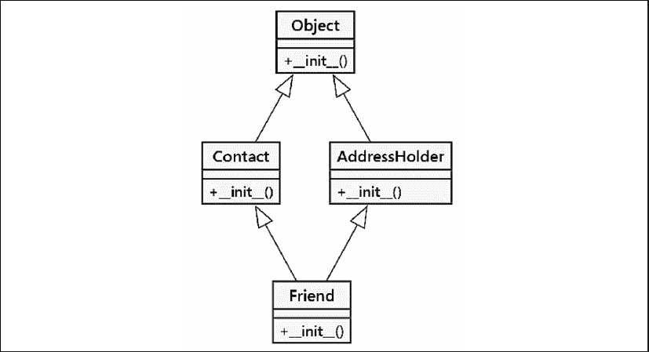

图 3.1：我们多重继承实现的继承图

`Friend` 类的 `__init__()` 方法首先调用 `Contact` 类的 `__init__()`，这隐式地初始化了 `object` 超类（记住，所有类都从 `object` 继承）。然后 `Friend` 类再次调用 `AddressHolder` 的 `__init__()`，这又隐式地初始化了 `object` 超类。这意味着父类被设置了两次。使用 `object` 类，这相对无害，但在某些情况下，可能会造成灾难。想象一下，每次请求都要尝试连接数据库两次！

基类应该只被调用一次。一次，是的，但何时调用呢？我们是先调用`Friend`，然后是`Contact`，接着是`Object`，最后是`AddressHolder`吗？还是先调用`Friend`，然后是`Contact`，接着是`AddressHolder`，最后是`Object`？

让我们构造一个例子来更清晰地说明这个问题。在这里，我们有一个基类`BaseClass`，它有一个名为`call_me()`的方法。两个子类`LeftSubclass`和`RightSubclass`扩展了`BaseClass`类，并且每个子类都使用不同的实现覆盖了`call_me()`方法。

然后，*另一个*子类通过多重继承同时扩展了这两个类，并使用第四个，独特的`call_me()`方法实现。这被称为**菱形继承**，因为类图呈现出菱形形状：

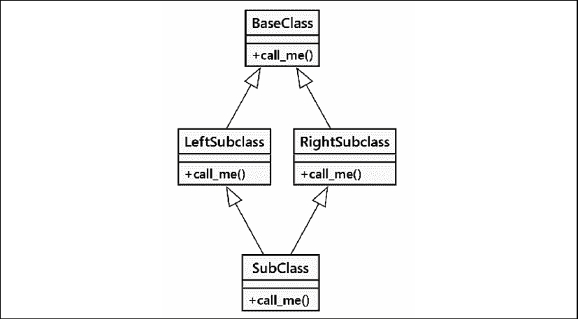

图 3.2：钻石继承

让我们将这个图表转换为代码。这个示例展示了方法被调用的时机：

```py
class BaseClass:
    num_base_calls = 0
    def call_me(self) -> None:
        print("Calling method on BaseClass")
        self.num_base_calls += 1
class LeftSubclass(BaseClass):
    num_left_calls = 0
    def call_me(self) -> None:
        BaseClass.call_me(self)
        print("Calling method on LeftSubclass")
        self.num_left_calls += 1
class RightSubclass(BaseClass):
    num_right_calls = 0
    def call_me(self) -> None:
        BaseClass.call_me(self)
        print("Calling method on RightSubclass")
        self.num_right_calls += 1
class Subclass(LeftSubclass, RightSubclass):
    num_sub_calls = 0
    def call_me(self) -> None:
        LeftSubclass.call_me(self)
        RightSubclass.call_me(self)
        print("Calling method on Subclass")
        self.num_sub_calls += 1 
```

此示例确保每个重写的`call_me()`方法都直接调用同名父方法。它通过将信息打印到屏幕上，让我们每次调用方法时都能得知。它还创建了一个独特的实例变量，以显示该方法被调用的次数。

`self.num_base_calls += 1` 这一行需要一点侧边栏的解释。

这实际上等同于 `self.num_base_calls = self.num_base_calls + 1`。当 Python 在等号右侧解析 `self.num_base_calls` 时，它首先会查找实例变量，然后查找类变量；我们提供了一个默认值为零的类变量。在执行 `+1` 计算之后，赋值语句将创建一个新的实例变量；它不会更新类级别的变量。

每次在第一次调用之后，实例变量将被找到。对于类来说，为实例变量提供默认值是非常酷的。

如果我们实例化一个`Subclass`对象，并对其调用一次`call_me()`方法，我们将得到以下输出：

```py
>>> s = Subclass()
>>> s.call_me()
Calling method on BaseClass
Calling method on LeftSubclass
Calling method on BaseClass
Calling method on RightSubclass
Calling method on Subclass
>>> print(
... s.num_sub_calls,
... s.num_left_calls,
... s.num_right_calls,
... s.num_base_calls)
1 1 1 2 
```

因此，我们可以看到基类的`call_me()`方法被调用了两次。如果该方法正在执行实际工作，例如向银行账户存钱，这可能会导致一些有害的 bug。

Python 的**方法解析顺序**（**MRO**）算法将菱形转换为平面的线性元组。我们可以在类的`__mro__`属性中看到这个结果。这个菱形的线性版本是序列`Subclass`，`LeftSubclass`，`RightSubClass`，`BaseClass`，`object`。这里重要的是`Subclass`在`LeftSubclass`之前列出`RightSubClass`，对菱形中的类施加了一个顺序。

在多重继承中需要注意的事情是，我们通常想要调用 MRO（Method Resolution Order，方法解析顺序）序列中的下一个方法，而不一定是父类的方法。`super()`函数在 MRO 序列中定位名称。实际上，`super()`函数最初是为了使复杂的多重继承形式成为可能而开发的。

这里是使用 `super()` 编写的相同代码。我们重命名了一些类，添加了 `_S` 以使其明确这是使用 `super()` 的版本：

```py
class BaseClass:
    num_base_calls = 0
    def call_me(self):
        print("Calling method on Base Class")
        self.num_base_calls += 1
class LeftSubclass_S(BaseClass):
    num_left_calls = 0
    def call_me(self) -> None:
        **super().call_me()**
        print("Calling method on LeftSubclass_S")
        self.num_left_calls += 1
class RightSubclass_S(BaseClass):
    num_right_calls = 0
    def call_me(self) -> None:
        **super().call_me()**
        print("Calling method on RightSubclass_S")
        self.num_right_calls += 1
class Subclass_S(LeftSubclass_S, RightSubclass_S):
    num_sub_calls = 0
    def call_me(self) -> None:
        **super().call_me()**
        print("Calling method on Subclass_S")
        self.num_sub_calls += 1 
```

变化相当微小；我们只是将原始的直接调用替换为对 `super()` 的调用。位于菱形底部的 `Subclass_S` 类只需调用一次 `super()`，而不是必须对左边的和右边的都进行调用。这个变化足够简单，但看看当我们执行它时的差异：

```py
>>> ss = Subclass_S()
>>> ss.call_me()
Calling method on BaseClass
Calling method on RightSubclass_S
Calling method on LeftSubclass_S
Calling method on Subclass_S
>>> print(
... ss.num_sub_calls,
... ss.num_left_calls,
... ss.num_right_calls,
... ss.num_base_calls)
1 1 1 1 
```

这个输出看起来不错：我们的基础方法只被调用了一次。我们可以通过查看类的`__mro__`属性来了解它是如何工作的：

```py
>>> from pprint import pprint
>>> pprint(Subclass_S.__mro__)
(<class 'commerce_naive.Subclass_S'>,
 <class 'commerce_naive.LeftSubclass_S'>,
 <class 'commerce_naive.RightSubclass_S'>,
 <class 'commerce_naive.BaseClass'>,
 <class 'object'>) 
```

类的顺序显示了`super()`将使用什么顺序。元组中的最后一个类通常是内置的`object`类。正如本章前面所提到的，它是所有类的隐式超类。

这显示了`super()`实际上在做什么。由于`print`语句是在`super`调用之后执行的，所以打印的输出顺序是每个方法实际执行的顺序。让我们从后往前查看输出，看看谁在调用什么：

1.  我们从`Subclass_S.call_me()`方法开始。这会评估`super().call_me()`。MRO（方法解析顺序）显示下一个是`LeftSubclass_S`。

1.  我们开始评估 `LeftSubclass_S.call_me()` 方法。这会评估 `super().call_me()`。MRO（方法解析顺序）将 `RightSubclass_S` 作为下一个。这并不是一个超类；它在类菱形中是相邻的。

1.  对`RightSubclass_S.call_me()`方法和`super().call_me()`方法的评估，这会导致`BaseClass`。

1.  `BaseClass.call_me()` 方法完成了其处理过程：打印一条消息并将实例变量 `self.num_base_calls` 设置为 `BaseClass.num_base_calls + 1`。

1.  然后，`RightSubclass_S.call_me()` 方法可以完成，打印一条消息并设置一个实例变量，`self.num_right_calls`。

1.  然后，`LeftSubclass_S.call_me()` 方法将通过打印一条消息并设置一个实例变量，`self.num_left_calls` 来结束。

1.  这是为了为`Subclass_S`完成其`call_me()`方法处理做好准备。它写了一条消息，设置了一个实例变量，然后休息，感到快乐且成功。

**特别留意这一点**：`super`调用并不是在`LeftSubclass_S`（其父类是`BaseClass`）的父类上调用方法。相反，它是在`RightSubclass_S`上调用，即使它不是`LeftSubclass_S`的直接父类！这是 MRO（方法解析顺序）中的下一个类，而不是父类方法。然后`RightSubclass_S`调用`BaseClass`，而`super()`调用确保了类层次结构中的每个方法只执行一次。

## 不同的参数集

这将使得事情变得复杂，因为我们回到了我们的`Friend`合作式多重继承示例。在`Friend`类的`__init__()`方法中，我们最初是将初始化委托给两个父类的`__init__()`方法，*使用不同的参数集*：

```py
Contact.__init__(self, name, email)
AddressHolder.__init__(self, street, city, state, code) 
```

当使用`super()`时，我们如何管理不同的参数集？我们实际上只能访问 MRO（方法解析顺序）序列中的下一个类。正因为如此，我们需要一种方法，通过构造函数传递**额外的**参数，以便后续从其他混入类中对`super()`的调用能够接收到正确的参数。

它的工作原理是这样的。第一次调用`super()`时，将`name`和`email`参数传递给 MRO（方法解析顺序）中的第一个类，即传递给`Contact.__init__()`。然后，当`Contact.__init__()`调用`super()`时，它需要能够将地址相关的参数传递给 MRO 中下一个类的`__init__()`方法，即`AddressHolder.__init__()`。

这个问题通常在我们想要调用具有相同名称但参数集不同的超类方法时出现。在特殊方法名称周围经常发生冲突。在这些例子中，最常见的情况是具有不同参数集的各种`__init__()`方法，正如我们在这里所做的那样。

Python 没有魔法般的功能来处理具有不同 `__init__()` 参数的类之间的协作。因此，这需要我们在设计类参数列表时格外小心。协作的多继承方法是为任何不是每个子类实现所必需的参数接受关键字参数。一个方法必须将其意外的参数传递给其 `super()` 调用，以防它们对于类 MRO（方法解析顺序）序列中后续方法来说是必要的。

虽然这方法效果很好，但用类型提示来描述它却很困难。相反，我们不得不在几个关键位置关闭**mypy**。

Python 的函数参数语法提供了一个我们可以用来做这件事的工具，但它使得整体代码看起来有些笨拙。看看 `Friend` 多重继承代码的一个版本：

```py
class Contact:
    all_contacts = ContactList()
    def __init__(self, /, name: str = "", email: str = "", **kwargs: Any) -> None:
        super().__init__(**kwargs)  # type: ignore [call-arg]
        self.name = name
        self.email = email
        self.all_contacts.append(self)
    def __repr__(self) -> str:
        return f"{self.__class__.__name__}(" f"{self.name!r}, {self.email!r}" f")"
class AddressHolder:
    def __init__(
        self,
        /,
        street: str = "",
        city: str = "",
        state: str = "",
        code: str = "",
        **kwargs: Any,
    ) -> None:
        super().__init__(**kwargs)  # type: ignore [call-arg]
        self.street = street
        self.city = city
        self.state = state
        self.code = code
class Friend(Contact, AddressHolder):
    def __init__(self, /, phone: str = "", **kwargs: Any) -> None:
        super().__init__(**kwargs)
        self.phone = phone 
```

我们添加了`**kwargs`参数，该参数将所有额外的关键字参数值收集到一个字典中。当使用`Contact(name="this", email="that", street="something")`调用时，`street`参数被放入`kwargs`字典中；这些额外的参数通过`super()`调用传递到下一个类。特殊参数`/`将可以通过位置在调用中提供的参数与需要通过关键字与参数值关联的参数分开。我们还为所有字符串参数提供了一个空字符串作为默认值。

如果你不太熟悉 `**kwargs` 语法，它基本上收集了传递给方法的所有关键字参数，这些参数在参数列表中并未明确列出。这些参数存储在一个名为 `kwargs` 的字典中（我们可以将变量命名为任何我们喜欢的名字，但惯例建议使用 `kw` 或 `kwargs`）。当我们调用一个方法时，例如，`super().__init__()`，并将 `**kwargs` 作为参数值，它会展开字典并将结果作为关键字参数传递给方法。我们将在 *第八章*，*面向对象与函数式编程的交汇处* 中更深入地探讨这一点。

我们引入了两个针对 **mypy**（以及任何审查代码的人）的注释。`# type: ignore` 注释在特定行提供了一个特定的错误代码 `call-arg`，以忽略该行。在这种情况下，我们需要忽略 `super().__init__(**kwargs)` 调用，因为对 **mypy** 来说，运行时实际的 MRO（方法解析顺序）并不明显。作为阅读代码的人，我们可以查看 `Friend` 类并看到顺序：`Contact` 和 `AddressHolder`。这个顺序意味着在 `Contact` 类内部，`super()` 函数将定位到下一个类，即 `AddressHolder`。

然而，**mypy** 工具并不会这样深入地检查；它依据 `class` 语句中显式列出的父类列表。由于没有指定父类名称，**mypy** 相信 `object` 类将通过 `super()` 方法找到。由于 `object.__init__()` 无法接受任何参数，因此 `Contact` 和 `AddressHolder` 中的 `super().__init__(**kwargs)` 在 **mypy** 看来是错误的。实际上，MRO（方法解析顺序）中的类链将消耗所有各种参数，并且将没有剩余参数留给 `AddressHolder` 类的 `__init__()` 方法。

关于合作多继承的类型提示注解的更多信息，请参阅[`github.com/python/mypy/issues/8769`](https://github.com/python/mypy/issues/8769)。该问题持续存在的时间表明解决方案可能有多么困难。

之前的例子做了它应该做的事情。但是回答以下问题非常困难：*我们需要传递哪些参数给* `Friend.__init__()`？这是任何计划使用该类的人首要的问题，因此应该在方法中添加一个文档字符串来解释所有父类中的参数列表。

在参数拼写错误或多余的参数情况下出现的错误信息也可能令人困惑。信息`TypeError: object.__init__() takes exactly one argument (the instance to initialize)`并没有提供太多关于如何将多余的参数提供给`object.__init__()`的信息。

我们已经讨论了在 Python 中涉及合作多继承的许多注意事项。当我们需要考虑所有可能的情况时，我们必须为此做出规划，我们的代码可能会变得混乱。

按照 mixin 模式实现的多个继承通常效果非常好。其思路是在 mixin 类中定义额外的方法，但将所有属性集中在一个宿主类层次结构中。这样可以避免合作初始化的复杂性。

使用组合进行设计通常也比复杂的多重继承效果更好。我们在第十一章“常见设计模式”和第十二章“高级设计模式”中将要讨论的许多设计模式都是基于组合的设计示例。

继承范式依赖于类之间清晰的“是一种”关系。多重继承会折叠其他不那么清晰的关系。例如，我们可以说“电子邮件是一种联系”，但似乎并不那么清晰地说“客户是电子邮件”。我们可能会说“客户有一个电子邮件地址”或“客户通过电子邮件被联系”，使用“有一个”或“被联系”来代替直接的“是一种”关系。

# 多态性

我们在*第一章*，*面向对象设计*中接触到了多态性。这是一个描述简单概念的华丽名称：根据使用的是哪个子类，会发生不同的行为，而无需明确知道子类实际上是什么。它有时也被称为 Liskov 替换原则，以纪念芭芭拉·利斯科夫对面向对象编程的贡献。我们应该能够用任何子类替换其超类。

例如，想象一个播放音频文件的程序。一个媒体播放器可能需要加载一个`AudioFile`对象然后播放它。我们可以在对象上放置一个`play()`方法，该方法负责解压缩或提取音频并将其路由到声卡和扬声器。播放一个`AudioFile`的行为可能实际上非常简单，就像这样：

```py
audio_file.play() 
```

然而，解压缩和提取音频文件的过程因文件类型的不同而大相径庭。当`.wav`文件以未压缩的形式存储时，`.mp3`、`.wma`和`.ogg`文件则全部采用了完全不同的压缩算法。

我们可以通过继承和多态来简化设计。每种类型的文件都可以由`AudioFile`的不同子类来表示，例如`WavFile`和`MP3File`。这些子类中的每一个都会有一个`play()`方法，该方法会针对每个文件以不同的方式实现，以确保遵循正确的提取程序。媒体播放器对象永远不需要知道它引用的是`AudioFile`的哪个子类；它只需调用`play()`，并通过多态让对象处理播放的实际细节。让我们快速看一下一个示例框架，展示这可能是如何工作的：

```py
from pathlib import Path
class AudioFile:
    ext: str
    def __init__(self, filepath: Path) -> None:
        if not filepath.suffix == self.ext:
            raise ValueError("Invalid file format")
        self.filepath = filepath
class MP3File(AudioFile):
    ext = ".mp3"
    def play(self) -> None:
        print(f"playing {self.filepath} as mp3")
class WavFile(AudioFile):
    ext = ".wav"
    def play(self) -> None:
        print(f"playing {self.filepath} as wav")
class OggFile(AudioFile):
    ext = ".ogg"
    def play(self) -> None:
        print(f"playing {self.filepath} as ogg") 
```

所有音频文件在初始化时都会检查是否给出了有效的扩展名。如果文件名不以正确的名称结尾，则会引发异常（异常将在*第四章*，*意料之外*中详细说明）。

但你是否注意到父类中的 `__init__()` 方法是如何能够从不同的子类中访问 `ext` 类变量的？这就是多态性的体现。`AudioFile` 父类仅仅有一个类型提示，向 **mypy** 解释将会有一个名为 `ext` 的属性。它实际上并没有存储对 `ext` 属性的引用。当子类使用继承的方法时，就会使用子类对 `ext` 属性的定义。类型提示可以帮助 **mypy** 发现缺少属性赋值的类。

此外，`AudioFile`的每个子类都以不同的方式实现`play()`方法（这个示例实际上并没有播放音乐；音频压缩算法真的值得有一本单独的书来介绍！）。这同样是多态性的体现。媒体播放器可以使用完全相同的代码来播放文件，无论其类型如何；它不关心它正在查看的`AudioFile`的子类是什么。音频文件的解压缩细节被*封装*起来。如果我们测试这个示例，它将如我们所期望的那样工作：

```py
>>> p_1 = MP3File(Path("Heart of the Sunrise.mp3"))
>>> p_1.play()
playing Heart of the Sunrise.mp3 as mp3
>>> p_2 = WavFile(Path("Roundabout.wav"))
>>> p_2.play()
playing Roundabout.wav as wav
>>> p_3 = OggFile(Path("Heart of the Sunrise.ogg"))
>>> p_3.play()
playing Heart of the Sunrise.ogg as ogg
>>> p_4 = MP3File(Path("The Fish.mov"))
Traceback (most recent call last):
...
ValueError: Invalid file format 
```

看看`AudioFile.__init__()`是如何在不实际知道它引用的是哪个子类的情况下检查文件类型的？

多态性实际上是面向对象编程中最酷的事情之一，它使得一些在早期范式下不可能的编程设计变得明显。然而，由于鸭子类型，Python 使得多态性看起来不那么酷。Python 中的鸭子类型允许我们使用任何提供所需行为的对象，而不必强制它成为子类。Python 的动态特性使得这一点变得微不足道。以下示例没有扩展 `AudioFile`，但在 Python 中可以使用完全相同的接口与之交互：

```py
class FlacFile:
    def __init__(self, filepath: Path) -> None:
        if not filepath.suffix == ".flac":
            raise ValueError("Not a .flac file")
        self.filepath = filepath
    def play(self) -> None:
        print(f"playing {self.filepath} as flac") 
```

我们的媒体播放器可以像播放扩展自`AudioFile`类的对象一样轻松地播放`FlacFile`类的对象。

多态性是许多面向对象场景中使用继承最重要的原因之一。因为任何提供正确接口的对象都可以在 Python 中互换使用，这减少了需要多态公共超类的情况。继承仍然可以用于共享代码，但如果共享的仅仅是公共接口，那么鸭子类型就足够了。

这种减少对继承的需求也减少了多重继承的需求；通常，当多重继承看起来是一个有效的解决方案时，我们只需使用鸭子类型来模拟其中一个多重超类。

在某些情况下，我们可以使用`typing.Protocol`提示来形式化这种鸭子类型。为了使**mypy**了解期望，我们通常会定义多个函数或属性（或它们的组合）作为一个正式的`Protocol`类型。这有助于阐明类之间的关系。例如，我们可能会有以下这种定义来定义`FlacFile`类和`AudioFile`类层次结构之间的共同特征：

```py
class Playable(Protocol):
    def play(self) -> None:
        ... 
```

当然，仅仅因为一个对象满足特定的协议（通过提供所需的方法或属性）并不意味着它在所有情况下都能简单地工作。它必须以一种在整体系统中有意义的方式实现该接口。仅仅因为一个对象提供了一个`play()`方法并不意味着它将自动与媒体播放器协同工作。这些方法除了具有相同的语法外，还必须具有相同的意义或语义。

鸭式类型的一个有用特性是，鸭式类型的对象只需提供那些实际被访问的方法和属性。例如，如果我们需要创建一个模拟文件对象来读取数据，我们可以创建一个新的对象，该对象具有`read()`方法；如果将要与模拟对象交互的代码不会调用它，我们就不必重写`write()`方法。更简洁地说，鸭式类型不需要提供对象可用的整个接口；它只需满足实际使用的协议。

# 案例研究

本节扩展了我们示例中的面向对象设计，即鸢尾花分类。我们已经在之前的章节中构建了这一部分，并在后续章节中将继续构建。在本章中，我们将回顾使用**统一建模语言**（**UML**）创建的图表，以帮助描述和总结我们将要构建的软件。我们将从上一章继续前进，为计算*k*最近邻算法中“最近”的多种方式添加功能。对此有几种变体，这展示了类层次结构是如何工作的。

随着设计的不断完善，我们将探讨几个设计原则。其中一套流行的原则是**SOLID**原则，具体如下：

+   **S**. 单一职责原则。一个类应该只有一个职责。这可以意味着当应用程序的需求发生变化时，只有一个理由去修改。

+   **O**. 开放/封闭原则。一个类应该对扩展开放，但对修改封闭。

+   **L**. Liskov 替换原则。（以 Barbara Liskov 命名，她是第一个面向对象编程语言 CLU 的创造者之一。）任何子类都可以替换其超类。这往往使类层次结构集中在具有非常相似接口的类上，导致对象之间的 *多态性*。这是继承的本质。

+   **I**. 接口隔离。一个类应该拥有尽可能小的接口。这可能是这些原则中最重要的一个。类应该相对较小且独立。

+   **D**. 依赖倒置。这个名字听起来很特别。我们需要了解什么是糟糕的依赖关系，这样我们才知道如何将其反转以形成良好的关系。从实用主义的角度来看，我们希望类是独立的，这样 Liskov 替换就不会涉及到大量的代码更改。在 Python 中，这通常意味着在类型提示中引用超类，以确保我们有灵活性来做出更改。在某些情况下，这也意味着提供参数，这样我们就可以在不修改任何代码的情况下进行全局类更改。

我们在本章中不会探讨所有这些原则。因为我们关注的是继承，我们的设计将倾向于遵循 Liskov 替换设计原则。其他章节将涉及其他设计原则。

## 逻辑视图

这里是上一章案例研究中展示的一些类别的概述。那些定义中的一个重要遗漏是`Hyperparameter`类的`classify`算法：

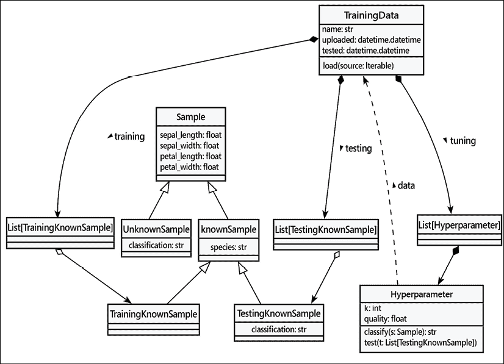

图 3.3：类概述

在上一章中，我们避免了深入探讨分类算法。这反映了一种常见的策略，有时被称为“*先难后易*”，也称为“*先做简单部分*”。这种策略鼓励尽可能遵循常见的模式设计，以隔离困难的部分。实际上，简单部分定义了一系列围栏，这些围栏包围并限制了新颖和未知的部分。

我们所进行的分类是基于**k**-最近邻算法，**k**-NN。给定一组已知样本和一个未知样本，我们希望找到靠近未知样本的邻居；大多数邻居告诉我们如何对新人进行分类。这意味着**k**通常是一个奇数，因此计算多数是容易的。我们一直在避免这个问题，“我们所说的‘最近’是什么意思？”

在传统的二维几何意义上，我们可以使用样本之间的“欧几里得”距离。给定一个位于 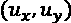 的未知样本和一个位于 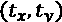 的训练样本，这两个样本之间的欧几里得距离， ，是：

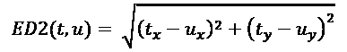

我们可以将其可视化如下：


图 3.4：欧几里得距离

我们将其称为 ED2，因为它只有二维。在我们的案例研究数据中，我们实际上有四个维度：花瓣长度、花瓣宽度、萼片长度和萼片宽度。这确实很难可视化，但数学并不太复杂。即使很难想象，我们仍然可以完整地写出来，如下所示：

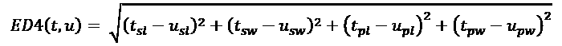

所有二维示例都扩展到四维，尽管想象起来很困难。在本节的图中，我们将坚持使用更容易可视化的*x-y*距离。但我们的真正意思是包括所有可用测量的完整四维计算。

我们可以将这个计算过程表示为一个类定义。`ED` 类的一个实例可以被 `Hyperparameter` 类使用：

```py
class ED(Distance):
    def distance(self, s1: Sample, s2: Sample) -> float:
        return hypot(
            s1.sepal_length - s2.sepal_length,
            s1.sepal_width - s2.sepal_width,
            s1.petal_length - s2.petal_length,
            s1.petal_width - s2.petal_width,
        ) 
```

我们已经利用了 `math.hypot()` 函数来完成距离计算的平方和开方部分。我们使用了一个尚未定义的超类 `Distance`。我们相当确信它将会被需要，但我们暂时先不定义它。

欧几里得距离是已知样本和未知样本之间许多替代距离定义之一。有两种相对简单的方法来计算距离，它们相似，并且通常能产生一致的良好结果，而不需要平方根的复杂性：

+   **曼哈顿距离**：这是你在具有方块状街区（类似于曼哈顿市的部分地区）的城市中行走的距离。

+   **切比雪夫距离**：这种距离计算将对角线步长计为 1。曼哈顿计算会将这个距离计为 2。欧几里得距离将如*图 3.4*所示，为 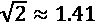。

在有多种选择的情况下，我们需要创建不同的子类。这意味着我们需要一个基类来定义距离的一般概念。查看现有的定义，似乎基类可以是以下这样：

```py
class Distance:
    """Definition of a distance computation"""
    def distance(self, s1: Sample, s2: Sample) -> float:
        pass 
```

这似乎捕捉到了我们所看到的距离计算的精髓。让我们再实现几个这个类的子类，以确保抽象确实有效。

曼哈顿距离是沿着*x*轴的总步数，加上沿着*y*轴的总步数。该公式使用距离的绝对值，表示为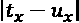，其形式如下：


这可能比直接欧几里得距离大 41%。然而，它仍然以一种可以产生良好的*k*-NN 结果的方式与直接距离平行，但计算速度更快，因为它避免了平方数字和计算平方根。

这里是曼哈顿距离的视图：

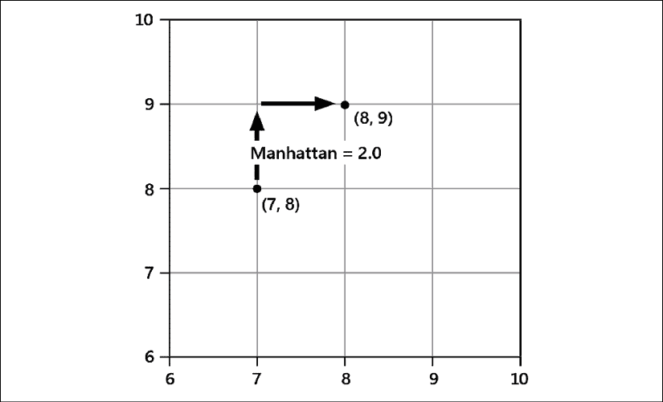

图 3.5：曼哈顿距离

这里是一个计算这种变化的`Distance`子类的示例：

```py
class MD(Distance):
    def distance(self, s1: Sample, s2: Sample) -> float:
        return sum(
            [
                abs(s1.sepal_length - s2.sepal_length),
                abs(s1.sepal_width - s2.sepal_width),
                abs(s1.petal_length - s2.petal_length),
                abs(s1.petal_width - s2.petal_width),
            ]
        ) 
```

切比雪夫距离是绝对 *x* 或 *y* 距离中最大的。这倾向于最小化多个维度的影响：


这里是切比雪夫距离的视图；它倾向于强调彼此更近的邻居：

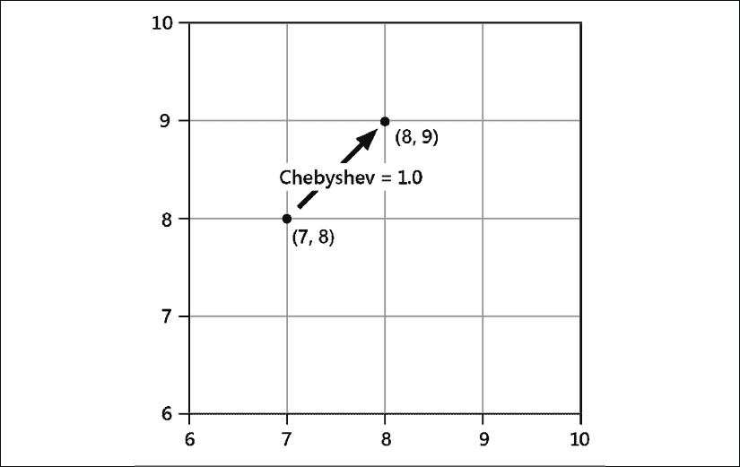

图 3.6：切比雪夫距离

这里是一个`Distance`子类的示例，它实现了距离计算的这种变体：

```py
class CD(Distance())
    def distance(self, s1: Sample, s2: Sample) -> float:
        return sum(
            [
                abs(s1.sepal_length - s2.sepal_length),
                abs(s1.sepal_width - s2.sepal_width),
                abs(s1.petal_length - s2.petal_length),
                abs(s1.petal_width - s2.petal_width),
            ]
        ) 
```

查阅 *距离度量选择对 KNN 分类器性能的影响 - 一篇综述* ([`arxiv.org/pdf/1708.04321.pdf`](https://arxiv.org/pdf/1708.04321.pdf))。该论文包含了 54 种不同的度量计算。我们所研究的例子被统称为“闵可夫斯基”度量，因为它们相似且对每个轴的度量相等。每种替代距离策略在给定一组训练数据的情况下，对模型分类未知样本的能力都会产生不同的结果。

这改变了`超参数`类的理念：我们现在有两个不同的超参数。一个是决定要检查多少个邻居的*k*值，另一个是距离计算，它告诉我们如何计算“最近”。这些都是算法的可变部分，我们需要测试各种组合，看看哪种最适合我们的数据。

我们如何能够拥有所有这些不同的距离计算方法呢？简短的回答是我们需要为公共距离类定义大量的子类。上述综述论文让我们将领域缩小到几个更有用的距离计算方法。为了确保我们有一个良好的设计，让我们再看看一种更多的距离计算方法。

## 另一种距离

只为了让你们更清楚地了解添加子类有多简单，我们将定义一个稍微复杂一些的距离度量。这就是 Sorensen 距离，也称为 Bray-Curtis。如果我们距离类能够处理这类更复杂的公式，我们就可以有信心它能够处理其他情况：

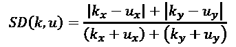

我们通过除以可能值的范围，有效地标准化了曼哈顿距离的每个组成部分。

这里有一个图表来展示索伦森距离是如何工作的：

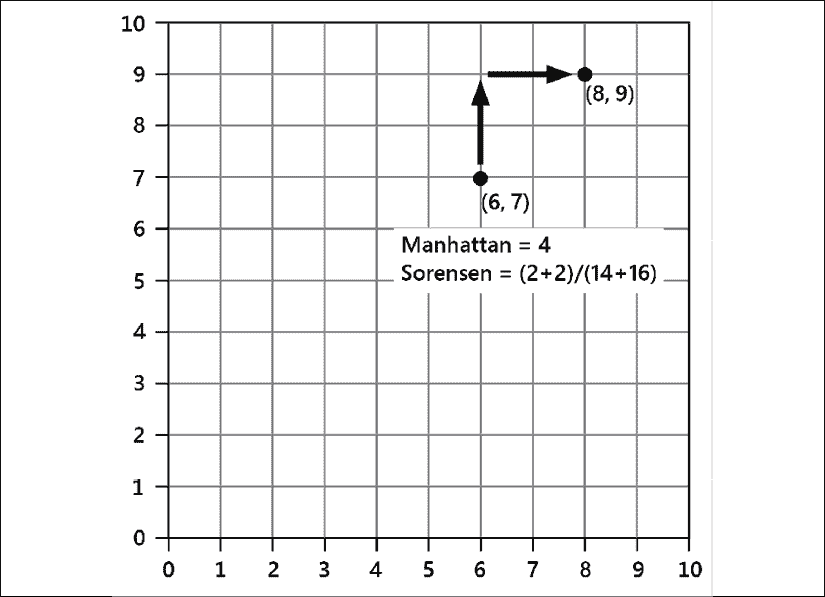

图 3.7：曼哈顿距离与索伦森距离

简单的曼哈顿距离无论我们离原点有多远都适用。Sorensen 距离降低了远离原点的度量值的重要性，这样它们就不会因为是大数值的异常值而主导*k*-NN。

我们可以通过添加一个新的`Distance`子类来将此概念引入我们的设计中。虽然这在某些方面与曼哈顿距离相似，但它通常被单独分类：

```py
class SD(Distance):
    def distance(self, s1: Sample, s2: Sample) -> float:
        return sum(
            [
                abs(s1.sepal_length - s2.sepal_length),
                abs(s1.sepal_width - s2.sepal_width),
                abs(s1.petal_length - s2.petal_length),
                abs(s1.petal_width - s2.petal_width),
            ]
        ) / sum(
            [
                s1.sepal_length + s2.sepal_length,
                s1.sepal_width + s2.sepal_width,
                s1.petal_length + s2.petal_length,
                s1.petal_width + s2.petal_width,
            ]
        ) 
```

这种设计方法使我们能够利用面向对象的继承来构建一个多态的距离计算函数族。我们可以在前几个函数的基础上创建一个广泛的函数族，并将这些函数用作超参数调整的一部分，以找到测量距离和执行所需分类的最佳方式。

我们需要将一个`Distance`对象集成到`Hyperparameter`类中。这意味着提供这些子类中的一个实例。因为它们都在实现相同的`distance()`方法，我们可以替换不同的替代距离计算方法，以找到在我们独特的数据和属性集合中表现最佳的方法。

目前，我们可以在我们的`Hyperparameter`类定义中参考一个特定的距离子类。在*第十一章*，*常见设计模式*中，我们将探讨如何从`Distance`类定义的层次结构中灵活地插入任何可能的距离计算方法。

# 回忆

本章的一些关键点：

+   面向对象设计的一个核心原则是继承：子类可以继承超类的一些特性，从而节省复制粘贴编程。子类可以扩展超类以添加功能或以其他方式对超类进行专门化。

+   多继承是 Python 的一个特性。最常见的形式是主类与混合类定义的组合。我们可以利用方法解析顺序来组合多个类，以处理初始化等常见功能。

+   多态性允许我们创建多个类，这些类提供满足合同的不同实现。由于 Python 的鸭子类型规则，任何具有正确方法的类都可以相互替代。

# 练习

环顾你的工作空间，看看你能否用继承层次结构来描述一些物理对象。人类已经用这种分类法来划分世界数百年了，所以这不应该很难。物体类别之间是否存在任何非显而易见的继承关系？如果你要在计算机应用程序中模拟这些对象，它们会共享哪些属性和方法？哪些需要被多态地覆盖？它们之间会有哪些完全不同的属性？

现在写一些代码。不，不是指物理层次结构；那很无聊。物理实体比方法有更多的属性。想想看，在过去一年里，你有没有想要尝试解决的项目，但一直没找到时间去实现。对于你想要解决的问题，试着想一些基本的继承关系，然后实现它们。确保你也注意到了那些实际上不需要使用继承的关系类型。有没有可能需要使用多重继承的地方？你确定吗？你能看到任何可能想要使用混入（mixin）的地方吗？试着快速搭建一个原型。它不必有用，甚至不必部分工作。你已经看到了如何使用`python -i`来测试代码；只需编写一些代码，并在交互式解释器中测试它。如果它工作正常，就继续写更多。如果它不工作，就修复它！

现在，让我们看看案例研究中的各种距离计算。我们需要能够处理测试数据以及用户提供的未知样本。这两种类型的样本有什么共同点？你能创建一个公共超类，并使用继承来处理这两个具有相似行为的类吗？（我们还没有仔细研究*k*-NN 分类，但你可以提供一个“模拟”分类器，它将提供虚假答案。）

当我们观察距离计算时，可以看到一个`超参数`是如何作为一个包含距离算法插件作为参数之一的组合。这是否是一个好的 mixin 候选者？为什么或为什么不？mixin 有哪些限制是插件所不具备的？

# 摘要

我们已经从简单的继承，这是面向对象程序员工具箱中最有用的工具之一，一路发展到多重继承——这是最复杂的一种。继承可以用来向现有类和内置泛型添加功能。将相似代码抽象到父类中可以帮助提高可维护性。父类上的方法可以使用`super`来调用，并且在使用多重继承时，参数列表必须格式化得安全，以确保这些调用能够正常工作。

在下一章，我们将探讨处理特殊情况的微妙艺术。
