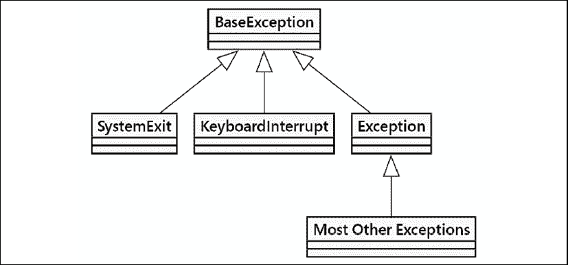
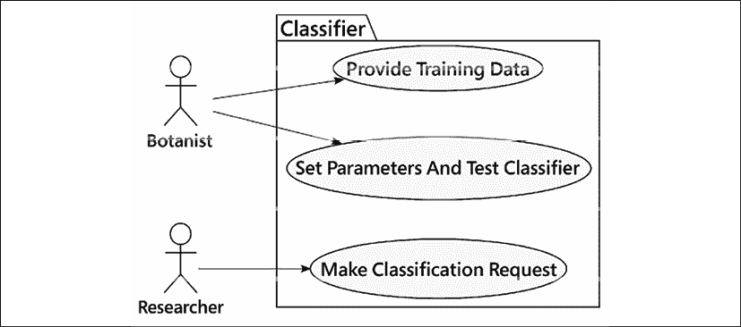
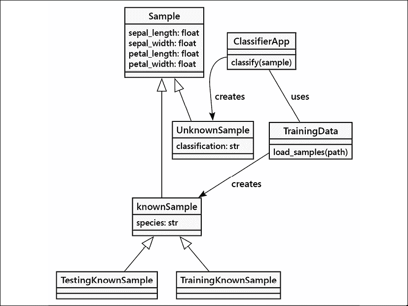

# 4

# 预期意外之事

使用软件构建的系统可能很脆弱。虽然软件本身具有高度的预测性，但运行时环境可能会提供意外的输入和情况。设备会故障，网络不可靠，纯粹的无政府状态被释放到我们的应用程序中。我们需要有一种方法来应对困扰计算机系统的各种故障范围。

处理意外情况有两种主要方法。一种方法是在函数中返回一个可识别的错误信号值。例如，可以使用`None`这样的值。应用程序可以使用其他库函数来检索错误条件的相关细节。对此主题的一种变体是将操作系统请求的返回值与成功或失败指示器配对。另一种方法是中断语句的正常、顺序执行，并转向处理异常的语句。第二种方法正是 Python 所采用的：它消除了检查返回值以确定错误的需求。

在本章中，我们将学习**异常**，这是在正常响应不可能时抛出的特殊错误对象。特别是，我们将涵盖以下内容：

+   如何引发异常发生

+   当异常发生时如何恢复

+   如何以不同的方式处理不同的异常类型

+   当发生异常时进行清理

+   创建新的异常类型

+   使用异常语法进行流程控制

本章的案例研究将探讨数据验证。我们将检查多种使用异常来确保我们的分类器输入有效的方法。

我们将首先探讨 Python 的 `异常` 概念，以及异常是如何被引发和处理的。

# 抛出异常

Python 的正常行为是按照它们被找到的顺序执行语句，无论是在文件中还是在`>>>`提示符的交互式模式下。一些语句，特别是`if`、`while`和`for`，会改变语句执行的简单自上而下的顺序。此外，异常可以打断执行流程。异常会被引发，这会中断语句的顺序执行。

在 Python 中，抛出的异常也是一个对象。有众多不同的异常类可供选择，我们也可以轻松地定义更多的自定义异常。它们共有的一个特点是都继承自一个内置类，称为`BaseException`。

当抛出异常时，原本应该发生的一切都被打断。取而代之的是，异常处理取代了正常处理。这说得通吗？别担心，它会的！

引发异常的最简单方式就是做一些愚蠢的事情。很可能你已经这样做过了，并且看到了异常输出。例如，每当 Python 遇到它无法理解的程序中的某一行时，它会通过`SyntaxError`退出，这是一种异常类型。下面是一个常见的例子：

```py
>>> print "hello world"
  File "<input>", line 1
    print "hello world"
          ^
SyntaxError: Missing parentheses in call to 'print'. Did you mean print("hello world")? 
```

`print()` 函数要求参数必须放在括号内。因此，如果我们把前面的命令输入到 Python 3 解释器中，就会引发一个 `SyntaxError` 异常。

除了`SyntaxError`，以下示例中展示了其他一些常见的异常：

```py
>>> x = 5 / 0
Traceback (most recent call last):
  File "<stdin>", line 1, in <module>
ZeroDivisionError: division by zero
>>> lst = [1,2,3]
>>> print(lst[3])
Traceback (most recent call last):
  File "<stdin>", line 1, in <module>
IndexError: list index out of range
>>> lst + 2
Traceback (most recent call last):
  File "<stdin>", line 1, in <module>
TypeError: can only concatenate list (not "int") to list
>>> lst.add
Traceback (most recent call last):
  File "<stdin>", line 1, in <module>
AttributeError: 'list' object has no attribute 'add'
>>> d = {'a': 'hello'}
>>> d['b']
Traceback (most recent call last):
  File "<stdin>", line 1, in <module>
KeyError: 'b'
>>> print(this_is_not_a_var)
Traceback (most recent call last):
  File "<stdin>", line 1, in <module>
NameError: name 'this_is_not_a_var' is not defined 
```

我们可以将这些异常情况大致分为四个类别。有些情况比较模糊，但有些边缘有一条清晰的界限：

+   有时，这些异常是我们程序中存在明显错误的指示。像`SyntaxError`和`NameError`这样的异常意味着我们需要找到指示的行号并修复问题。

+   有时，这些异常是 Python 运行时出现问题的指示。可能会引发一个 `RuntimeError` 异常。在许多情况下，这个问题可以通过下载并安装更新的 Python 版本来解决。（或者，如果你正在与“发布候选”版本搏斗，可以向维护者报告这个错误。）

+   一些异常是设计问题。我们可能未能正确处理边缘情况，有时甚至尝试计算空列表的平均值。这会导致`ZeroDivisionError`错误。当我们再次发现这些问题时，我们还得回到指示的行号。但一旦我们找到了产生的异常，我们就需要从那里回溯以找出导致异常的问题原因。某个地方将会有一个处于意外或非设计状态的对象。

+   大多数异常都出现在我们程序的接口附近。任何用户输入，或操作系统请求，包括文件操作，都可能遇到我们程序外部资源的问题，从而导致异常。我们可以将这些接口问题进一步细分为两个子组：

    +   在不寻常或未预料到的状态下出现的外部对象。这通常发生在由于路径拼写错误而找不到文件，或者由于我们的应用程序之前崩溃并重新启动而已经存在的目录。这些情况通常会导致某种`OSError`，其根本原因相对明确。当用户输入错误，甚至恶意尝试破坏应用程序时，这种情况也很常见。这些应该是特定于应用程序的异常，以防止愚蠢的错误或故意的滥用。

    +   此外，还有相对较小的简单混沌类别。最终分析，计算机系统是由许多相互连接的设备组成，任何一个组件都可能表现不佳。这些情况难以预测，制定恢复策略更是难上加难。当使用小型物联网计算机时，部件较少，但可能安装在具有挑战性的物理环境中。当与拥有数千个组件的企业服务器农场一起工作时，0.1%的故障率意味着总会有东西出问题。

你可能已经注意到 Python 的所有内置异常都以名称`Error`结尾。在 Python 中，`error`和`exception`这两个词几乎可以互换使用。有时人们认为错误（error）比异常（exception）更为严重，但它们处理的方式完全相同。确实，前面示例中的所有错误类都以`Exception`（它扩展了`BaseException`）作为它们的超类。

## 抛出异常

我们将在一分钟内了解如何处理此类异常，但首先，让我们探讨如果我们正在编写一个需要通知用户或调用函数输入无效的程序时，我们应该做什么。我们可以使用 Python 使用的完全相同的机制。以下是一个简单的类，它只将偶数整数的项添加到列表中：

```py
from typing import List
class EvenOnly(List[int]):
    def append(self, value: int) -> None:
        if not isinstance(value, int):
            raise TypeError("Only integers can be added")
        if value % 2 != 0:
            raise ValueError("Only even numbers can be added")
        super().append(value) 
```

这个类扩展了内置的列表，正如我们在*第二章*，*Python 中的对象*中讨论的那样。我们提供了一个类型提示，表明我们正在创建一个仅包含整数对象的列表。为此，我们重写了`append`方法来检查两个条件，确保项目是一个偶数整数。我们首先检查输入是否是`int`类型的实例，然后使用取模运算符来确保它能被 2 整除。如果这两个条件中的任何一个不满足，`raise`关键字将导致异常发生。

`raise` 关键字后面跟着要抛出的异常对象。在上一个例子中，从内置的 `TypeError` 和 `ValueError` 类中构造了两个对象。抛出的对象也可以是我们自己创建的新 `Exception` 类的实例（我们很快就会看到），或者是在其他地方定义的异常，甚至是之前已经抛出并被处理的 `Exception` 对象。

如果我们在 Python 解释器中测试这个类，我们可以看到当发生异常时，它正在输出有用的错误信息，就像之前一样：

```py
>>> e = EvenOnly()
>>> e.append("a string")
Traceback (most recent call last):
  File "<stdin>", line 1, in <module>
  File "even_integers.py", line 7, in add
    raise TypeError("Only integers can be added")
TypeError: Only integers can be added
>>> e.append(3)
Traceback (most recent call last):
  File "<stdin>", line 1, in <module>
  File "even_integers.py", line 9, in add
    raise ValueError("Only even numbers can be added")
ValueError: Only even numbers can be added
>>> e.append(2) 
```

虽然这个类在演示异常行为方面很有效，但它并不擅长自己的工作。仍然可以通过索引表示法或切片表示法将其他值放入列表中。可以通过覆盖其他适当的方法来避免这些额外的行为，其中一些是魔法双下划线方法。为了真正完整，我们需要覆盖像`extend()`、`insert()`、`__setitem__()`甚至`__init__()`这样的方法，以确保事情从正确开始。

## 异常的影响

当抛出异常时，它似乎会立即停止程序执行。在异常抛出后本应运行的任何代码行都不会被执行，除非异常被`except`子句处理，否则程序将带错误信息退出。我们将首先检查未处理的异常，然后详细探讨异常处理。

看看这个基本函数：

```py
from typing import NoReturn
def never_returns() -> NoReturn:
    print("I am about to raise an exception")
    raise Exception("This is always raised")
    print("This line will never execute")
    return "I won't be returned" 
```

我们为这个函数添加了`NoReturn`类型提示。这有助于减轻**mypy**的担忧，即这个函数没有返回字符串值的途径。类型提示正式地说明，这个函数预期不会返回任何值。

（请注意，**mypy**知道最终的`return`无法执行。它不会反对返回类型为`NoReturn`，即使有一个包含字符串字面量的`return`语句。很明显，这无法执行。）

如果我们执行这个函数，我们会看到第一个`print()`调用被执行，然后抛出异常。第二个`print()`函数调用永远不会被执行，同样，`return`语句也不会执行。下面是它的样子：

```py
>>> never_returns()
I am about to raise an exception
Traceback (most recent call last):
  File "<input>", line 1, in <module>
  File "<input>", line 6, in never_returns
Exception: This is always raised 
```

此外，如果我们有一个函数调用了另一个抛出异常的函数，那么在第二个函数抛出异常的点之后，第一个函数中就没有任何代码被执行。抛出异常会立即停止所有执行，直到异常被处理或者迫使解释器退出。为了演示，让我们添加一个调用`never_returns()`函数的第二个函数：

```py
def call_exceptor() -> None:
    print("call_exceptor starts here...")
    never_returns()
    print("an exception was raised...")
    print("...so these lines don't run") 
```

当我们调用这个函数时，我们会看到第一条`print`语句执行了，以及`never_returns()`函数中的第一条语句。但是一旦抛出异常，其他任何操作都不会执行：

```py
>>> call_exceptor()
call_exceptor starts here...
I am about to raise an exception
Traceback (most recent call last):
  File "<input>", line 1, in <module>
  File "<input>", line 3, in call_exceptor
  File "<input>", line 6, in never_returns
Exception: This is always raised 
```

注意到 **mypy** 没有识别出 `never_returns()` 在 `call_exceptor()` 中的处理方式。根据之前的示例，似乎 `call_exceptor()` 更适合被描述为一个 `NoReturn` 函数。当我们尝试这样做时，我们收到了 **mypy** 的警告。结果证明，**mypy** 的关注点相当狭窄；它相对独立地检查函数和方法定义；它没有意识到 `never_returns()` 会引发一个异常。

我们可以控制异常从初始`raise`语句的传播方式。我们可以在调用栈中的任意一个方法内对异常做出反应并处理。

查看上面未处理的异常的输出，这被称为**跟踪回溯**。这显示了调用栈。命令行（"`<module>`"是在没有输入文件时使用的名称）调用了`call_exceptor()`，而`call_exceptor()`又调用了`never_returns()`。在`never_returns()`内部，异常最初被抛出。

异常沿着调用栈向上传播。在`call_exceptor()`函数内部，那个讨厌的`never_returns()`函数被调用，异常被*冒泡*到调用方法。从那里，它又向上提升一级到达主解释器，主解释器不知道如何处理它，于是放弃并打印了跟踪对象。

## 处理异常

现在我们来看看异常硬币的背面。如果我们遇到异常情况，我们的代码应该如何反应或恢复？我们通过将可能抛出异常的任何代码（无论是异常代码本身，还是调用任何可能在其内部引发异常的函数或方法）包裹在`try...except`子句中来处理异常。最基础的语法看起来是这样的：

```py
def handler() -> None:
    try:
        never_returns()
        print("Never executed")
    except Exception as ex:
        print(f"I caught an exception: {ex!r}")
    print("Executed after the exception") 
```

如果我们使用现有的`never_returns()`函数运行这个简单的脚本——正如我们所非常清楚的那样，这个函数总是会抛出异常——我们会得到以下输出：

```py
I am about to raise an exception
I caught an exception: Exception('This is always raised')
Executed after the exception 
```

`never_returns()` 函数愉快地通知我们它即将抛出一个异常，并且确实抛出了异常。`handler()` 函数的 `except` 子句捕获了这个异常。一旦捕获到异常，我们就能够自行清理（在这个例子中，通过输出我们正在处理这种情况），然后继续前进。`never_returns()` 函数中剩余的代码保持未执行状态，但 `try:` 语句之后的 `handler()` 函数中的代码能够恢复并继续执行。

注意`try`和`except`周围的缩进。`try`子句包含可能抛出异常的任何代码。然后`except`子句回到与`try`行相同的缩进级别。处理异常的任何代码都缩进在`except`子句内部。然后正常代码在原始缩进级别上继续执行。

前面代码的问题在于它使用`Exception`类来匹配任何类型的异常。如果我们编写了一些可能引发`TypeError`或`ZeroDivisionError`的代码，会怎样呢？我们可能需要捕获`ZeroDivisionError`，因为它反映了已知的对象状态，但让其他任何异常传播到控制台，因为它们反映了我们需要捕获并解决的错误。你能猜到语法吗？

这里有一个相当愚蠢的功能，它就是做这件事：

```py
from typing import Union
def funny_division(divisor: float) -> Union[str, float]:
    try:
        return 100 / divisor
    except ZeroDivisionError:
        return "Zero is not a good idea!" 
```

此函数执行简单的计算。我们为`divisor`参数提供了`float`类型的类型提示。我们可以提供一个整数，普通的 Python 类型转换将起作用。**mypy**工具了解整数如何转换为浮点数的方式，从而避免了对参数类型的过度关注。

我们必须非常清楚关于返回类型。如果我们不抛出异常，我们将计算并返回一个浮点结果。如果我们抛出`ZeroDivisionError`异常，它将被处理，我们将返回一个字符串结果。还有其他异常吗？让我们试一试看看：

```py
>>> print(funny_division(0))
Zero is not a good idea!
>>> print(funny_division(50.0))
2.0
>>> print(funny_division("hello"))
Traceback (most recent call last):
...
TypeError: unsupported operand type(s) for /: 'int' and 'str' 
```

输出的第一行显示，如果我们输入`0`，我们会得到适当的模拟。如果我们使用一个有效的数字进行调用，它将正确运行。然而，如果我们输入一个字符串（你可能想知道如何得到一个`TypeError`，对吧？），它将因为未处理的异常而失败。如果我们没有指定匹配`ZeroDivisionError`异常类，我们的处理器也会看到`TypeError`，并指责我们在发送字符串时除以零，这根本不是一种合适的行为。

Python 还有一种“裸除”的异常处理语法。使用 `except:` 而不指定匹配的异常类通常是不被推荐的，因为这会阻止应用程序在应该崩溃时简单地崩溃。我们通常使用 `except Exception:` 来显式捕获一组合理的异常。

空的异常语法实际上与使用 `except BaseException:` 相同，它试图处理通常无法恢复的系统级异常。确实，这可以使应用程序在行为异常时无法崩溃。

我们甚至可以捕获两个或更多不同类型的异常，并使用相同的代码来处理它们。以下是一个引发三种不同类型异常的示例。它使用相同的异常处理程序来处理`TypeError`和`ZeroDivisionError`，但如果您提供数字`13`，它也可能引发一个`ValueError`错误：

```py
def funnier_division(divisor: int) -> Union[str, float]:
    try:
        if divisor == 13:
            raise ValueError("13 is an unlucky number")
        return 100 / divisor
    except (ZeroDivisionError, TypeError):
        return "Enter a number other than zero" 
```

我们在`except`子句中包含了多个异常类。这使得我们可以用一个通用的处理程序来处理各种条件。以下是我们可以如何使用一系列不同的值来测试这一点：

```py
>>> for val in (0, "hello", 50.0, 13):
...     print(f"Testing {val!r}:", end=" ")
...     print(funnier_division(val))
...     
Testing 0: Enter a number other than zero
Testing 'hello': Enter a number other than zero
Testing 50.0: 2.0
Testing 13: Traceback (most recent call last):
  File "<input>", line 3, in <module>
  File "<input>", line 4, in funnier_division
ValueError: 13 is an unlucky number 
```

`for`语句遍历多个测试输入并打印结果。如果你对`print`函数中的那个`end`参数感到好奇，它只是将默认的尾随换行符转换为一个空格，这样就可以与下一行的输出连接起来。

数字 0 和字符串都被`except`子句捕获，并打印出合适的错误信息。来自数字`13`的异常没有被捕获，因为它是一个`ValueError`，这并没有包含在正在处理的异常类型中。这一切都很好，但如果我们想捕获不同的异常并对它们做不同的事情呢？或者，我们可能想在处理异常之后让它继续向上冒泡到父函数，就像它从未被捕获一样？

我们不需要任何新的语法来处理这些情况。我们可以堆叠`except`子句，并且只有第一个匹配的将会被执行。对于第二个问题，使用不带参数的`raise`关键字，如果我们已经在一个异常处理程序内部，它将会重新抛出最后一个异常。观察以下代码：

```py
def funniest_division(divisor: int) -> Union[str, float]:
    try:
        if divider == 13:
            raise ValueError("13 is an unlucky number")
        return 100 / divider
    except ZeroDivisionError:
        return "Enter a number other than zero"
    except TypeError:
        return "Enter a numerical value"
    except ValueError:
        print("No, No, not 13!")
        raise 
```

最后一行再次引发`ValueError`错误，因此在输出`No, No, not 13!`之后，它将再次抛出异常；我们仍然会在控制台上得到原始的堆栈跟踪信息。

如果我们像前一个示例中那样堆叠异常子句，即使多个子句都匹配，也只会运行第一个匹配的子句。如何会有多个子句匹配呢？记住，异常是对象，因此可以被继承。正如我们将在下一节中看到的，大多数异常都扩展了`Exception`类（它本身是从`BaseException`派生出来的）。如果我们有一个匹配`Exception`的`except`子句在匹配`TypeError`之前，那么只有`Exception`处理程序会被执行，因为`TypeError`是通过继承成为`Exception`的。

在我们想要特别处理一些异常情况，然后以更通用的方式处理所有剩余异常的情况下，这会很有用。在捕获所有特定异常之后，我们可以在自己的子句中列出`Exception`，并在那里处理通用情况。

通常，当我们捕获异常时，我们需要引用到`Exception`对象本身。这种情况最常发生在我们使用自定义参数定义自己的异常时，但也可能与标准异常相关。大多数异常类在其构造函数中接受一组参数，我们可能希望在异常处理程序中访问这些属性。如果我们定义了自己的`Exception`类，那么在捕获它时甚至可以调用自定义方法。捕获异常作为变量的语法使用`as`关键字：

```py
>>> try: 
...     raise ValueError("This is an argument") 
... except ValueError as e: 
...     print(f"The exception arguments were {e.args}") 
...
The exception arguments were ('This is an argument',) 
ValueError upon initialization.
```

我们已经看到了处理异常的语法变体，但我们仍然不知道如何在发生异常与否的情况下执行代码。我们也不能指定仅在未发生异常时才应执行的代码。另外两个关键字 `finally` 和 `else` 提供了一些额外的执行路径。这两个关键字都不需要任何额外的参数。

我们将通过带有`finally`子句的示例来展示。大部分情况下，我们通常使用上下文管理器而不是异常块，作为一种更干净的方式来实现无论是否发生异常中断处理都会发生的最终化操作。其理念是将最终化责任封装在上下文管理器中。

以下示例遍历了多个异常类，为每个类抛出一个实例。然后运行了一些不太复杂的异常处理代码，展示了新引入的语法：

```py
some_exceptions = [ValueError, TypeError, IndexError, None]
for choice in some_exceptions:
    try:
        print(f"\nRaising {choice}")
        if choice:
            raise choice("An error")
        else:
            print("no exception raised")
    except ValueError:
        print("Caught a ValueError")
    except TypeError:
        print("Caught a TypeError")
    except Exception as e:
        print(f"Caught some other error: {e.__class__.__name__}")
    else:
        print("This code called if there is no exception")
    finally:
        print("This cleanup code is always called") 
```

如果我们运行这个示例——它几乎涵盖了所有可想象的异常处理场景——我们将看到以下输出：

```py
(CaseStudy39) % python ch_04/src/all_exceptions.py
Raising <class 'ValueError'>
Caught a ValueError
This cleanup code is always called
Raising <class 'TypeError'>
Caught a TypeError
This cleanup code is always called
Raising <class 'IndexError'>
Caught some other error: IndexError
This cleanup code is always called
Raising None
no exception raised
This code called if there is no exception
This cleanup code is always called 
```

注意到在`finally`子句中的`print`语句无论发生什么情况都会被执行。这是在我们代码运行完成后执行某些任务的一种方式（即使发生了异常）。以下是一些常见的例子：

+   清理一个打开的数据库连接

+   关闭一个打开的文件

+   在网络上发送关闭握手

所有这些通常都通过上下文管理器来处理，这是*第八章*，*面向对象与函数式编程的交汇*，的主题之一。

虽然晦涩，但`finally`子句会在`try`子句中的`return`语句之后执行。虽然这可以被用于`return`之后的处理，但对于阅读代码的人来说也可能造成困惑。

此外，注意在未抛出异常时的输出：`else` 和 `finally` 子句都会被执行。`else` 子句可能看起来是多余的，因为当没有抛出异常时应该执行的代码可以直接放在整个 `try...except` 块之后。区别在于，如果捕获并处理了异常，`else` 块将不会被执行。当我们后面讨论使用异常作为流程控制时，我们会看到更多关于这一点的内容。

在`try`块之后，可以省略任何`except`、`else`和`finally`子句（尽管单独的`else`是无效的）。如果你包含多个子句，`except`子句必须首先出现，然后是`else`子句，最后是`finally`子句。你必须确保`except`子句的顺序是从最具体的子类到最通用的超类。

## 异常层次结构

我们已经看到了几个最常见的内置异常，你可能在日常的 Python 开发过程中会遇到其余的。正如我们之前注意到的，大多数异常都是`Exception`类的子类。但并非所有异常都如此。实际上，`Exception`类扩展了一个名为`BaseException`的类。实际上，所有异常都必须扩展`BaseException`类或其子类之一。

有两个关键的内置异常类，`SystemExit` 和 `KeyboardInterrupt`，它们直接从 `BaseException` 类派生，而不是从 `Exception` 类派生。`SystemExit` 异常在程序自然退出时被抛出，通常是因为我们在代码的某个地方调用了 `sys.exit()` 函数（例如，当用户选择退出菜单项、点击窗口上的“关闭”按钮、输入命令关闭服务器，或者操作系统向应用程序发送信号以终止）。这个异常的设计目的是为了让我们在程序最终退出之前清理代码。

如果我们处理了`SystemExit`异常，我们通常会重新抛出异常，因为捕获它可能会阻止程序退出。想象一下一个存在 bug 的 web 服务，它正在锁定数据库，并且不重启服务器就无法停止。

我们不希望`SystemExit`异常被意外地捕获在通用的`except Exception:`子句中。这就是为什么它直接从`BaseException`派生出来的原因。

`KeyboardInterrupt` 异常在命令行程序中很常见。当用户使用操作系统依赖的键组合（通常是 Ctrl + C）显式中断程序执行时，会抛出此异常。对于 Linux 和 macOS 用户，`kill -2 <pid>` 命令也会生效。这是用户故意中断正在运行程序的标准方式，并且，像 `SystemExit` 异常一样，它几乎总是通过终止程序来响应。此外，像 `SystemExit` 一样，它可以在 `finally` 块内处理任何清理任务。

这里是一个完全展示层次的类图：



图 4.1：异常层次结构

当我们使用不带指定异常类型的 `except:` 子句时，它将捕获 `BaseException` 的所有子类；也就是说，它将捕获所有异常，包括两个特殊的异常。由于我们几乎总是希望对这些异常进行特殊处理，因此在不带参数的情况下使用 `except:` 语句是不明智的。如果你想要捕获所有异常（除了 `SystemExit` 和 `KeyboardInterrupt`），请始终显式捕获 `Exception`。大多数 Python 开发者认为不带类型的 `except:` 是一个错误，并在代码审查中将其标记出来。

## 定义我们自己的异常

有时，当我们想要抛出一个异常时，我们会发现内置的任何异常都不合适。区别通常集中在应用程序必须如何处理异常；当我们引入一个新的异常时，必须是因为在异常处理程序中会有不同的处理方式。

没有充分的理由去定义一个与`ValueError`处理方式完全相同的异常；我们可以直接使用`ValueError`。幸运的是，定义我们自己的新异常非常简单。类的名称通常被设计用来传达出了什么问题，我们可以在初始化器中提供任意的参数来包含额外的信息。

我们只需要从`Exception`类或其中一个语义上相似的现有异常类继承。我们甚至不需要向类中添加任何内容！当然，我们也可以直接扩展`BaseException`，但这意味着我们正在发明新的停止运行程序的方法，这是一个非常不寻常的事情去创造。

这里是一个我们可能在银行应用程序中使用的简单异常：

```py
>>> class InvalidWithdrawal(ValueError): 
...     pass 

>>> raise InvalidWithdrawal("You don't have $50 in your account")
Traceback (most recent call last):
  File "<input>", line 1, in <module>
InvalidWithdrawal: You don't have $50 in your account 
```

`raise`语句说明了如何引发新定义的异常。我们能够向异常传递任意数量的参数。通常使用字符串消息，但任何可能在后续异常处理中有用的对象都可以存储。`Exception.__init__()`方法被设计为接受任何参数并将它们存储为一个名为`args`的属性中的元组。这使得定义异常变得更加容易，而无需覆盖`__init__()`方法。

当然，如果我们确实想要自定义初始化器，我们完全可以这样做。以下是上述异常的修订版，其初始化器接受当前余额和用户想要取出的金额。此外，它还增加了一个方法来计算请求的超支程度：

```py
>>> from decimal import Decimal
>>> class InvalidWithdrawal(ValueError): 
...     def __init__(self, balance: Decimal, amount: Decimal) -> None: 
...         super().__init__(f"account doesn't have ${amount}") 
...         self.amount = amount 
...         self.balance = balance 
...     def overage(self) -> Decimal: 
...         return self.amount - self.balance 
```

由于我们处理的是货币，我们已经导入了数字的`Decimal`类。对于有固定小数位数和复杂四舍五入规则的货币，我们不能使用 Python 的默认`int`或`float`类型，因为这些类型假设了精确的小数运算。

（同时请注意，账号号码不属于例外范围。银行家们对在日志或跟踪消息中可能暴露账号号码的使用方式表示不满。）

这里是一个创建此异常实例的示例：

```py
>>> raise InvalidWithdrawal(Decimal('25.00'), Decimal('50.00'))
Traceback (most recent call last):
...
InvalidWithdrawal: account doesn't have $50.00 
```

如有`InvalidWithdrawal`异常抛出，我们将这样处理：

```py
>>> try: 
...     balance = Decimal('25.00')
...     raise InvalidWithdrawal(balance, Decimal('50.00')) 
... except InvalidWithdrawal as ex: 
...     print("I'm sorry, but your withdrawal is " 
...             "more than your balance by " 
...             f"${ex.overage()}") 
```

在这里，我们看到`as`关键字被有效用于将异常保存在局部变量`ex`中。按照惯例，大多数 Python 程序员会将异常赋值给变量如`ex`、`exc`或`exception`；尽管如此，通常情况下，你可以自由地将其命名为`the_exception_raised_above`，或者如果你愿意，可以叫它`aunt_sally`。

定义我们自己的异常有很多原因。通常情况下，向异常中添加信息或以某种方式记录它是很有用的。但是，当创建一个旨在供其他程序员访问的框架、库或 API 时，自定义异常的实用性才能真正显现出来。在这种情况下，务必确保你的代码抛出的异常对客户端程序员来说是合理的。以下是一些标准：

+   他们应该清楚地描述发生了什么。例如，`KeyError` 异常提供了找不到的键。

+   客户端程序员应该能够轻松地看到如何修复错误（如果它反映了他们代码中的错误）或处理异常（如果这是一个他们需要了解的情况）。

+   处理方式应与其他异常区分开来。如果处理方式与现有异常相同，则重用现有异常为最佳选择。

现在我们已经了解了如何抛出异常和定义新的异常，我们可以看看围绕异常数据和应对问题的一些设计考虑。存在许多不同的设计选择，我们将从这样一个观点开始，即在 Python 中，异常可以用于许多并非严格意义上的错误情况。

## 异常并不特殊

新手程序员往往认为异常情况仅适用于特殊情况。然而，特殊情况的定义可能模糊且具有主观性。考虑以下两个函数：

```py
def divide_with_exception(dividend: int, divisor: int) -> None:
    try:
        print(f"{dividend / divisor=}")
    except ZeroDivisionError:
        print("You can't divide by zero")
def divide_with_if(dividend: int, divisor: int) -> None:
    if divisor == 0:
        print("You can't divide by zero")
    else:
        print(f"{dividend / divisor=}") 
```

这两个函数的行为完全相同。如果`divisor`为零，则会打印错误信息；否则，会显示除法结果的打印信息。我们可以通过使用`if`语句来检查它，从而避免`ZeroDivisionError`异常被抛出。在这个例子中，对有效除法的检查看起来相对简单（`divisor == 0`）。在某些情况下，它可能相当复杂。在某些情况下，它可能涉及计算中间结果。在最坏的情况下，对“这会起作用吗？”的测试涉及到使用类中的多个其他方法——实际上——进行操作预演，以查看过程中是否会出现错误。

Python 程序员倾向于遵循一个被总结为“**求原谅比求许可更容易**”的模式，有时简称为 EAFP。其核心思想是先执行代码，然后处理可能出现的任何错误。另一种做法被描述为“**三思而后行**”，通常简称为 LBYL。这通常不太受欢迎。原因有几个，但最主要的原因是，在代码的正常执行路径中，通常没有必要浪费 CPU 周期去寻找那些不太可能发生的不寻常情况。

因此，在特殊情况下使用异常是明智的，即使这些情况只是稍微有些特殊。进一步来说，异常语法在流程控制中可以非常有效。就像一个`if`语句一样，异常可以被用来进行决策、分支和消息传递。

想象一下一家销售小工具和配件的公司库存应用。当顾客进行购买时，该商品可以是可用的，在这种情况下，商品将从库存中移除，并返回剩余商品的数量，或者它可能已经缺货。现在，在库存应用中缺货是完全正常的事情发生。这绝对不是一种异常情况。但如果缺货了，我们应该返回什么？一条说“缺货”的字符串？一个负数？在这两种情况下，调用方法都必须检查返回值是正整数还是其他东西，以确定是否缺货。这看起来有点混乱，尤其是如果我们忘记在代码的某个地方做这件事的话。

相反，我们可以抛出一个 `OutOfStock` 异常，并使用 `try` 语句来控制程序流程。这说得通吗？此外，我们还想确保不会将同一件商品卖给两个不同的客户，或者出售尚未到货的商品。实现这一目标的一种方法是将每种类型的商品锁定，以确保一次只能有一个人更新它。用户必须锁定商品，操作商品（购买、增加库存、计算剩余数量...），然后解锁商品。（这实际上是一个上下文管理器，是 *第八章* 的一个主题。）

这里是一个带有文档字符串的、不完整的`库存`示例，它描述了某些方法应该执行的操作：

```py
class OutOfStock(Exception):
    pass
class InvalidItemType(Exception):
    pass
class Inventory:
    def __init__(self, stock: list[ItemType]) -> None:
        pass
    def lock(self, item_type: ItemType) -> None:
        """Context Entry.
        Lock the item type so nobody else can manipulate the
        inventory while we're working."""
        pass
    def unlock(self, item_type: ItemType) -> None:
        """Context Exit.
        Unlock the item type."""
        pass
    def purchase(self, item_type: ItemType) -> int:
        """If the item is not locked, raise a
        ValueError because something went wrong.
        If the item_type does not exist,
          raise InvalidItemType.
        If the item is currently out of stock,
          raise OutOfStock.
        If the item is available,
          subtract one item; return the number of items left.
        """
        # Mocked results.
        if item_type.name == "Widget":
            raise OutOfStock(item_type)
        elif item_type.name == "Gadget":
            return 42
        else:
            raise InvalidItemType(item_type) 
```

我们可以将这个对象原型交给开发者，并让他们实现所需的方法，确保它们按照所说的那样执行，同时我们专注于编写完成购买所需的代码。我们将利用 Python 强大的异常处理功能来考虑不同的分支，这取决于购买的方式。我们甚至可以编写一个测试用例，以确保对这个类应该如何工作没有任何疑问。

这里是`ItemType`的定义，只是为了完善这个例子：

```py
class ItemType:
    def __init__(self, name: str) -> None:
        self.name = name
        self.on_hand = 0 
```

这里是一个使用这个`Inventory`类的交互会话：

```py
>>> widget = ItemType("Widget")
>>> gadget = ItemType("Gadget")
>>> inv = Inventory([widget, gadget])
>>> item_to_buy = widget
>>> inv.lock(item_to_buy)
>>> try:
...     num_left = inv.purchase(item_to_buy)
... except InvalidItemType:
...     print(f"Sorry, we don't sell {item_to_buy.name}")
... except OutOfStock:
...     print("Sorry, that item is out of stock.")
... else:
...     print(f"Purchase complete. There are {num_left} {item_to_buy.name}s left")
... finally:
...     inv.unlock(item_to_buy)
...
Sorry, that item is out of stock. 
```

所有可能的异常处理子句都被用来确保在正确的时间发生正确的操作。即使`OutOfStock`并不是一个特别异常的情况，我们仍然能够使用异常来适当地处理它。同样的代码也可以用`if...elif...else`结构来编写，但这样阅读和维护起来就不会那么容易。

作为一个插曲，其中一条异常信息“`There are {num_left} {item_to_buy.name}s left`”存在一个蹩脚的英语语法问题。当只剩下一个物品时，它需要经过重大修改为“`There is {num_left} {item_to_buy.name} left`”。为了支持合理的翻译方法，最好避免在 f-string 内部篡改语法细节。最好在`else:`子句中处理它，使用类似以下的方法来选择合适的语法信息：

```py
msg = (
    f"there is {num_left} {item_to_buy.name} left" 
    if num_left == 1 
    else f"there are {num_left} {item_to_buy.name}s left")
print(msg) 
```

我们还可以使用异常在方法之间传递消息。例如，如果我们想通知客户商品预计何时再次有库存，我们可以在构造`OutOfStock`对象时确保它需要一个`back_in_stock`参数。然后，当我们处理异常时，我们可以检查该值并向客户提供额外信息。附加到对象的信息可以轻松地在程序的两个不同部分之间传递。异常甚至可以提供一个方法，指示库存对象重新订购或补货商品。

使用异常进行流程控制可以设计出一些方便的程序。从这个讨论中，我们得到的重要一点是，异常并不是我们应该试图避免的坏事情。出现异常并不意味着你应该阻止这种特殊情况发生。相反，这只是在不同代码部分之间传递信息的一种强大方式，这些部分可能并没有直接相互调用。

# 案例研究

本章的案例研究将探讨一些我们可以找到并帮助用户修复数据或应用程序计算中潜在问题的方法。数据和处理都是异常行为可能的来源。然而，它们并不等价；我们可以如下比较这两个方面：

+   异常数据是问题最常见的原因。数据可能不遵循语法规则，或者具有无效的物理格式。其他更小的错误可能源于数据没有公认的逻辑组织，例如列名拼写错误。异常也可能反映用户试图执行未经授权的操作。我们需要提醒用户和管理员注意无效数据或无效操作。

+   异常处理通常被称为**错误**。应用程序不应该尝试从这些问题中恢复。虽然我们更喜欢在单元测试或集成测试中找到它们（参见*第十三章*，*面向对象程序的测试*），但有可能一个问题逃过了我们的审查，最终在生产环境中出现，并暴露给了我们软件的用户。我们需要告诉用户有些东西出了问题，并且尽可能优雅地停止处理，或者“崩溃”。在有错误的情况下继续运行是一种严重的信任破坏。

在我们的案例研究中，我们需要检查三种类型的输入，以寻找潜在的问题：

1.  由植物学家提供的已知`样本`实例，反映了专家判断。尽管这些数据在质量上应该是典范的，但无法保证没有人不小心重命名了一个文件，用无效数据或无法处理的数据替换了好的数据。

1.  由研究人员提供的未知`Sample`实例，这些可能存在各种数据质量问题。我们将查看其中的一些。

1.  研究员或植物学家采取的行动。我们将审查使用案例，以确定每个用户类别应允许采取哪些行动。在某些情况下，通过为每个用户类别提供他们可以采取的特定操作菜单，可以预防这些问题。

我们将首先回顾使用案例，以便确定这个应用程序所需的异常类型。

## 上下文视图

在第一章的上下文图中，“用户”这一角色的描述——目前来看——并不理想。作为对应用程序接口的初始描述，它是可以容忍的。随着我们逐步进行设计，我们可以看到，像“研究员”这样的更具体术语可能更适合描述那些研究样本并寻找分类的人。

这里是一个考虑了用户及其授权操作的新扩展上下文图：



图 4.2：应用上下文图

植物学家负责一种类型的数据，并且有两个有效的操作。研究人员负责另一种类型的数据，并且只有一个有效的操作。

数据和处理用例紧密相连。当植物学家提供新的训练数据或设置参数并测试分类器时，应用程序软件必须确保他们的输入是有效的。

同样地，当研究员试图对样本进行分类时，软件必须确认数据是有效的并且可以使用的。无效数据必须报告给研究员，以便他们可以修复输入并再次尝试。

我们可以将处理不良数据分解为两部分，每部分分别处理：

+   发现异常数据。正如我们在本章所看到的，当遇到无效数据时，这通过抛出一个异常来实现。

+   应对异常数据。这通过一个`try:`/`except:`块实现，该块提供了关于问题性质和可能采取的解决措施的有用信息。

我们首先从发现异常数据开始。正确地抛出异常是处理不良数据的基础。

## 处理视图

尽管在这个应用程序中有许多数据对象，但我们将把我们的焦点缩小到`KnownSample`和`UnknownSample`类。这两个类与一个共同的超类`Sample`类相关。它们是由另外两个类创建的。以下图表显示了`Sample`对象是如何被创建的：



图 4.3：对象创建

我们包含了两个类来创建这两种类型的样本。`TrainingData`类将加载已知样本。一个整体的`ClassifierApp`类将验证未知样本，并尝试对其进行分类。

一个`KnownSample`对象有五个属性，每个属性都有一个定义明确的有效值集合：

+   测量值`花瓣长度`、`花瓣宽度`、`花瓣长度`、`花瓣宽度`都是浮点数。这些值的下限为零。

+   专家提供的`species`值是一个字符串，有三个有效值。

一个`UnknownSample`对象只有四个测量值。使用公共超类定义的想法可以帮助我们确保这种验证处理被重用。

上列的有效值规则仅定义了在单独考虑每个属性时的有效值。在某些应用中，可能存在属性之间的复杂关系，或者定义样本之间关系的规则。对于我们的案例研究，我们将重点关注五个属性验证规则。

## 会出什么问题？

考虑到加载一个`Sample`对象时可能出现的错误，以及用户可以对此做些什么，这会有所帮助。我们的样本验证规则建议我们可能需要引发特殊的`ValueError`异常来描述那些测量值不是有效的浮点值或物种名称不是已知字符串的情况。

我们可以使用以下类来定义无法处理的不良数据条件：

```py
class InvalidSampleError(ValueError):
    """Source data file has invalid data representation""" 
```

这允许我们为这个应用程序无法处理的输入数据抛出一个`InvalidSampleError`异常。目的是提供一个包含需要修复详情的消息。

这可以帮助我们区分代码中的错误，这些错误可能会引发一个`ValueError`异常，以及存在不良数据时出现的正确行为，此时将引发`InvalidSampleError`异常。这意味着我们需要在`except:`块中具体指定，使用`InvalidSampleError`异常。

如果我们使用 `except ValueError:`，它将处理通用异常以及我们独特的异常。这意味着我们可能会将更严重的错误视为无效数据。技巧是要小心处理通用异常；我们可能是在绕过一个错误。

## 不良行为

之前我们建议用户可能会尝试执行一个无效的操作。例如，研究人员可能会尝试提供分类的`已知样本`对象。加载新的训练数据的行为保留给植物学家；这意味着研究人员的尝试应该引发某种类型的异常。

我们的应用程序在整体操作系统的环境中运行。对于命令行应用程序，我们可以将用户分为两组，并使用操作系统的文件所有权和访问权限来限制哪一组可以运行哪些应用程序。这是一个有效且全面的解决方案，且不需要任何 Python 代码。

对于基于 Web 的应用程序，然而，我们需要对每个用户进行 Web 应用程序的认证。所有 Python 的 Web 应用程序框架都提供了用户认证机制。许多框架都提供了方便的插件，用于系统如开放认证、OAuth。更多信息请参阅[`oauth.net/2/`](https://oauth.net/2/)。

对于 Web 应用，我们通常有两层处理级别：

+   **用户认证**。这是用户进行身份识别的地方。这可能涉及单一因素，如密码，或者多个因素，如物理钥匙或与手机的交互。

+   **授权**执行某些操作。我们通常会为用户定义角色，并根据用户的角色限制对各种资源的访问。这意味着当用户没有适当的角色来访问资源时，会引发一个异常。

许多 Web 框架会将异常用作一个内部信号，表示某些操作不被允许。然后，这个内部异常必须映射到外部的 HTTP 状态码，例如`401 授权所需`响应。

这是一个深入的话题，超出了本书的范围。例如，请参阅*使用 Flask 构建 Web 应用程序*([`www.packtpub.com/product/building-web-applications-with-flask/9781784396152`](https://www.packtpub.com/product/building-web-applications-with-flask/9781784396152))以了解 Web 应用程序的介绍。

## 从 CSV 文件创建样本

不同文件格式下读取样本的详细选项，我们需要参考*第九章*，*字符串、序列化和文件路径*，在那里我们详细讨论了序列化技术。目前，我们将跳过许多细节，并专注于一种非常适合 CSV 格式数据的处理方法。

**CSV** – **逗号分隔值** – 可以用来定义电子表格的行。在每一行中，单元格值以文本形式表示，并用逗号分隔。当这些数据被 Python 的 `csv` 模块解析时，每一行可以表示为一个字典，其中键是列名，值是特定行的单元格值。

例如，一行可能看起来像这样：

```py
>>> row = {"sepal_length": "5.1", "sepal_width": "3.5", 
... "petal_length": "1.4", "petal_width": "0.2", 
... "species": "Iris-setosa"} 
```

`csv`模块的`DictReader`类提供了一系列的`dict[str, str]`类型的行实例。我们需要将这些原始行转换为`Sample`的一个子类的实例，如果所有特征都有有效的字符串值。如果原始数据无效，那么我们需要抛出一个异常。

给定如上例所示的行，这里有一个方法可以将字典翻译成更有用的对象。这是`KnownSample`类的一部分：

```py
@classmethod
def from_dict(cls, row: dict[str, str]) -> "KnownSample":
    if row["species"] not in {
            "Iris-setosa", "Iris-versicolour", "Iris-virginica"}:
        raise InvalidSampleError(f"invalid species in {row!r}")
    try:
        return cls(
            species=row["species"],
            sepal_length=float(row["sepal_length"]),
            sepal_width=float(row["sepal_width"]),
            petal_length=float(row["petal_length"]),
            petal_width=float(row["petal_width"]),
        )
    except ValueError as ex:
        raise InvalidSampleError(f"invalid {row!r}") 
```

`from_dict()` 方法会检查物种值，如果无效则抛出异常。它尝试创建一行，应用 `float()` 函数将各种测量值从字符串值转换为浮点值。如果转换都成功，那么 `cls` 参数——要创建的类——将构建预期的对象。

如果`float()`函数的任何评估遇到问题并引发`ValueError`异常；这被用来创建我们应用程序的特定`InvalidSampleError`异常。

这种验证方式是**先观察再行动**（**LBYL**）和**求原谅比求许可更容易**（**EAFP**）两种风格的混合体。在 Python 中，最广泛使用的方法是 EAFP。然而，对于物种值的情况，没有类似于`float()`的转换函数来引发异常或处理错误数据。在这个例子中，我们选择使用 LBYL 来处理这个属性值。下面我们将探讨一个替代方案。

`from_dict()` 方法使用 `@classmethod` 装饰器定义。这意味着实际的类对象成为第一个参数，`cls`。当我们这样做时，意味着任何继承这个方法的子类都将拥有针对该子类定制的功能。我们可以创建一个新的子类，例如，`TrainingKnownSample`，使用如下代码：

```py
class TrainingKnownSample(KnownSample): 
    pass 
```

`TrainingKnownSample.from_dict()` 方法将接受 `TrainingKnownSample` 类作为 `cls` 参数的值；在不添加任何其他代码的情况下，这个类的 `from_dict()` 方法将构建 `TrainingKnownSample` 类的实例。

虽然这样做效果不错，但对**mypy**来说并不明确它是否有效。我们可以使用以下定义来提供显式的类型映射：

```py
class TrainingKnownSample(KnownSample):
    @classmethod
    def from_dict(cls, row: dict[str, str]) -> "TrainingKnownSample":
        return cast(TrainingKnownSample, super().from_dict(row)) 
```

另一种选择是使用更简单的类定义，并将`cast()`操作放在实际使用`from_dict()`的地方，例如，`cast(TrainingKnownSample, TrainingKnownSample.from_dict(data))`。由于这种方法在许多地方都没有使用，因此很难断言哪种变体更简单。

这里是来自上一章的`KnownSample`类的其余部分，重复如下：

```py
class KnownSample(Sample):
    def __init__(
        self,
        species: str,
        sepal_length: float,
        sepal_width: float,
        petal_length: float,
        petal_width: float,
    ) -> None:
        super().__init__(
            sepal_length=sepal_length,
            sepal_width=sepal_width,
            petal_length=petal_length,
            petal_width=petal_width,
        )
        self.species = species
    def __repr__(self) -> str:
        return (
            f"{self.__class__.__name__}("
            f"sepal_length={self.sepal_length}, "
            f"sepal_width={self.sepal_width}, "
            f"petal_length={self.petal_length}, "
            f"petal_width={self.petal_width}, "
            f"species={self.species!r}, "
            f")"
        ) 
```

让我们看看这在实际中是如何工作的。以下是一个加载一些有效数据的示例：

```py
>>> from model import TrainingKnownSample
>>> valid = {"sepal_length": "5.1", "sepal_width": "3.5",
...  "petal_length": "1.4", "petal_width": "0.2",
...  "species": "Iris-setosa"}
>>> rks = TrainingKnownSample.from_dict(valid)
>>> rks
TrainingKnownSample(sepal_length=5.1, sepal_width=3.5, petal_length=1.4, petal_width=0.2, species='Iris-setosa', ) 
```

我们创建了一个名为 `valid` 的字典，这是一个 `csv.DictReader` 从输入行创建的。然后，我们从该字典构建了一个 `TrainingKnownSample` 实例，命名为 `rks`。生成的对象具有适当的浮点数值，表明已按需执行了字符串到数值的转换。

这里展示了验证的行为。这是一个为不良数据引发的异常类型的示例：

```py
>>> from model import TestingKnownSample, InvalidSampleError
>>> invalid_species = {"sepal_length": "5.1", "sepal_width": "3.5",
...  "petal_length": "1.4", "petal_width": "0.2",
...  "species": "nothing known by this app"}
>>> eks = TestingKnownSample.from_dict(invalid_species)
Traceback (most recent call last):
...
model.InvalidSampleError: invalid species in {'sepal_length': '5.1', 'sepal_width': '3.5', 'petal_length': '1.4', 'petal_width': '0.2', 'species': 'nothing known by this app'} 
```

当我们尝试创建一个`TestingKnownSample`实例时，无效的物种值引发了一个异常。

我们是否已经发现了所有潜在的问题？`csv`模块处理物理格式问题，因此提供 PDF 文件等，将导致`csv`模块抛出异常。在`from_dict()`方法中会检查无效的物种名称和浮点值。

有些事情我们没有检查。以下是额外的验证：

+   缺少的键。如果一个键拼写错误，此代码将引发一个`KeyError`异常，它不会被重新表述为`InvalidSampleError`异常。这个变化留给读者作为练习。

+   额外键。如果出现意外的列，数据是否无效，或者我们应该忽略它们？可能的情况是，我们得到了包含额外列的电子表格数据，这些列应该被忽略。虽然灵活性是有帮助的，但同时也非常重要，要揭示输入中可能存在的问题。

+   超出范围的浮点值。测量范围很可能存在一些合理的上下限。下限为零是显然的；负数测量没有太多意义。然而，上限并不那么明确。有一些统计技术用于定位异常值，包括**中值绝对偏差**（**MAD**）技术。

    查阅[`www.itl.nist.gov/div898/handbook/eda/section3/eda35h.htm`](https://www.itl.nist.gov/div898/handbook/eda/section3/eda35h.htm)获取更多关于如何识别似乎不符合正态分布的数据的信息。

这些额外检查中的第一个可以添加到`from_dict()`方法中。第二个则是一个必须与用户达成一致的决策，然后可能添加到`from_dict()`方法中。

异常值检测更为复杂。我们需要在所有测试和训练样本加载完毕后执行此检查。因为异常值检查不适用于单行，它需要一个不同的异常处理。我们可能定义另一个异常，如下所示：

```py
class OutlierError(ValueError):
    """Value lies outside the expected range.""" 
```

这个异常可以使用简单的范围检查，或者更复杂的 MAD 方法来检测异常值。

## 验证枚举值

有效的物种列表并不十分明显。我们基本上将它隐藏在了`from_dict()`方法中，这可能会成为一个维护问题。当源数据发生变化时，我们还需要更新这个方法，这可能会很难记住，而且几乎和找到它一样困难。如果物种列表变得很长，代码行可能会变得难以阅读。

使用带有有效值列表的显式`enum`类是将此转换为纯 EAFP 处理的一种方法。考虑使用以下方式来验证物种。这样做意味着重新定义多个类：

```py
>>> from enum import Enum
>>> class Species(Enum):
...    Setosa = "Iris-setosa"
...    Versicolour = "Iris-versicolour"
...    Viginica = "Iris-virginica"
>>> Species("Iris-setosa")
<Species.Setosa: 'Iris-setosa'>
>>> Species("Iris-pinniped")
Traceback (most recent call last):
...
ValueError: 'Iris-pinniped' is not a valid Species 
```

当我们将`enum`类名称`Species`应用于枚举字面值之一时，它将引发一个`ValueError`异常来显示物种的字符串表示形式无效。这类似于`float()`和`int()`对于不是有效数字的字符串引发`ValueError`异常的方式。

将值切换为枚举值也将需要修改已知样本的类定义。类需要修改为使用枚举`Species`而不是`str`。对于这个案例研究，值列表很小，使用`Enum`似乎很实用。然而，对于其他问题域，值的枚举列表可能相当大，并且`Enum`类可能很长且信息量不足。

我们可能继续使用字符串对象而不是`Enum`类。我们可以将每个唯一的字符串值域定义为`Set[str]`类的扩展：

```py
>>> from typing import Set
>>> class Domain(Set[str]):
...     def validate(self, value: str) -> str:
...         if value in self:
...             return value
...         raise ValueError(f"invalid {value!r}")
>>> species = Domain({"Iris-setosa", "Iris-versicolour", "Iris-virginica"})
>>> species.validate("Iris-versicolour")
'Iris-versicolour'
>>> species.validate("odobenidae")
Traceback (most recent call last):
...
ValueError: invalid 'odobenidae' 
```

我们可以使用 `species.validate()` 函数，类似于我们使用 `float()` 函数的方式。这将验证字符串，而不会将其强制转换为不同的值。相反，它返回字符串。对于无效值，它将引发一个 `ValueError` 异常。

这使我们能够将`from_dict()`方法的主体重写如下：

```py
@classmethod
def from_dict(cls, row: dict[str, str]) -> "KnownSample":
    try:
        return cls(
            species=species.validate(row["species"]),
            sepal_length=float(row["sepal_length"]),
            sepal_width=float(row["sepal_width"]),
            petal_length=float(row["petal_length"]),
            petal_width=float(row["petal_width"]),
        )
    except ValueError as ex:
        raise InvalidSampleError(f"invalid {row!r}") 
```

这种变化依赖于全局的`species`是一个有效的物种集合。它还使用了一种令人愉悦的 EAFP 方法来构建所需的对象或引发异常。

如我们之前提到的，这个设计分为两部分。我们已经探讨了基础元素，即抛出一个合适的异常。现在我们可以看看我们使用这个`from_dict()`函数的上下文，以及错误是如何报告给用户的。

## 读取 CSV 文件

我们将提供一个通用的模板，用于从 CSV 源数据创建对象。其思路是利用各种类的`from_dict()`方法来创建应用程序所使用的对象：

```py
class TrainingData:
    def __init__(self, name: str) -> None:
        self.name = name
        self.uploaded: datetime.datetime
        self.tested: datetime.datetime
        self.training: list[TrainingKnownSample] = []
        self.testing: list[TestingKnownSample] = []
        self.tuning: list[Hyperparameter] = []
    def load(self, raw_data_iter: Iterable[dict[str, str]]) -> None:
        for n, row in enumerate(raw_data_iter):
            try:
                if n % 5 == 0:
                    test = TestingKnownSample.from_dict(row)
                    self.testing.append(test)
                else:
                    train = TrainingKnownSample.from_dict(row)
                    self.training.append(train)
            except InvalidSampleError as ex:
                print(f"Row {n+1}: {ex}")
                return
        self.uploaded = datetime.datetime.now(tz=datetime.timezone.utc) 
```

`load()`方法正在将样本划分为测试集和训练集。它期望一个可迭代的`dict[str, str]`对象源，这些对象由`csv.DictReader`对象生成。

这里实现的用户体验是报告第一次失败并返回。这可能会导致如下错误信息：

```py
text Row 2: invalid species in {'sepal_length': 7.9, 'sepal_width': 3.2, 'petal_length': 4.7, 'petal_width': 1.4, 'species': 'Buttercup'} 
```

这条消息包含了所有必要的信息，但可能不如期望的那样有帮助。例如，我们可能希望报告**所有**失败，而不仅仅是第一次失败。以下是我们可以如何重构`load()`方法的示例：

```py
def load(self, raw_data_iter: Iterable[dict[str, str]]) -> None:
    bad_count = 0
    for n, row in enumerate(raw_data_iter):
        try:
            if n % 5 == 0:
                test = TestingKnownSample.from_dict(row)
                self.testing.append(test)
            else:
                train = TrainingKnownSample.from_dict(row)
                self.training.append(train)
        except InvalidSampleError as ex:
            print(f"Row {n+1}: {ex}")
            bad_count += 1
    if bad_count != 0:
        print(f"{bad_count} invalid rows")
        return
    self.uploaded = datetime.datetime.now(tz=datetime.timezone.utc) 
```

这种变化会捕获每个`InvalidSampleError`错误，显示一条消息并计算问题数量。这些信息可能更有帮助，因为用户可以纠正所有无效的行。

在处理一个非常、非常大的数据集的情况下，这可能会导致无用细节达到一个很高的水平。如果我们不小心使用了一个包含几十万行手写数字图像的 CSV 文件，而不是鸢尾花数据，那么我们会收到几十万条消息，告诉我们每一行都是错误的。

在这个加载操作周围需要一些额外的用户体验设计，以便使其在各种情况下都非常有用。然而，其基础是当出现问题时引发的 Python 异常。在本案例研究中，我们利用了 `float()` 函数的 `ValueError` 并将其重写为我们的应用程序特有的 `InvalidSampleError` 异常。我们还创建了针对意外字符串的我们自己的 `ValueError` 异常。

## 不要重复自己

`TrainingData` 的 `load()` 方法将创建两个不同的 `KnownSample` 子类。我们将大部分处理工作放在了 `KnownSample` 超类中；这样做可以避免在每个子类中重复进行验证处理。

对于一个`UnknownSample`，然而，我们遇到了一个小问题：在`UnknownSample`中没有物种数据。理想的情况是提取四个测量的验证，并将它们与验证物种分开。如果我们这样做，我们就不能简单地通过一个简单的 EAFP 方法来同时构建一个`Sample`和进行验证，这个方法要么创建所需的对象，要么抛出一个无法构建的异常。

当子类引入新字段时，我们有两种选择：

+   放弃看似简单的 EAFP 验证。在这种情况下，我们需要将验证与对象构造分离。这将导致进行两次 `float()` 转换的成本：一次用于验证数据，另一次用于创建目标对象。多次 `float()` 转换意味着我们并没有真正遵循**不要重复自己**（**DRY**）的原则。

+   构建一个中间表示，该表示可以被子类使用。这意味着`Sample`的`KnownSample`子类将涉及三个步骤。首先，构建一个`Sample`对象，验证四个测量值。然后，验证物种。最后，使用从`Sample`对象中获取的有效字段和有效的物种值来构建`KnownSample`。这创建了一个临时对象，但避免了代码的重复。

我们将把实现细节留给读者作为练习。

一旦定义了异常，我们还需要以引导用户采取正确补救措施的形式向用户展示结果。这是基于底层异常构建的独立用户体验设计考虑因素。

# 回忆

本章的一些关键点：

+   抛出异常发生在出现错误时。我们以除以零为例进行了说明。也可以使用`raise`语句来抛出异常。

+   异常的效果是中断语句的正常顺序执行。它使我们免于编写大量的`if`语句来检查事情是否可能工作，或者检查是否真的失败了。

+   处理异常是通过`try:`语句完成的，该语句为每种我们想要处理的异常都有一个`except:`子句。

+   异常层次结构遵循面向对象设计模式来定义我们可以与之工作的`Exception`类的多个子类。一些额外的异常，如`SystemExit`和`KeyboardInterrupt`，并不是`Exception`类的子类；处理这些异常会引入风险，并且并不能解决很多问题，所以我们通常忽略它们。

+   定义我们自己的异常是扩展`Exception`类的问题。这使得我们可以定义具有非常特定语义的异常。

# 练习

如果你之前从未处理过异常，首先你需要查看你之前写的任何 Python 代码，注意是否有应该处理异常的地方。你会如何处理它们？你是否需要处理它们？有时，让异常传播到控制台是向用户传达信息的最有效方式，尤其是如果用户也是脚本的编写者。有时，你可以从错误中恢复，并允许程序继续运行。有时，你只能将错误重新格式化为用户可以理解的形式，并将其显示给他们。

一些常见的检查点包括文件输入输出（你的代码是否尝试读取一个不存在的文件？），数学表达式（你正在除的值是否为零？），列表索引（列表是否为空？），以及字典（键是否存在？）。

问问自己是否应该忽略这个问题，先检查值来处理它，还是通过异常来处理它。特别注意那些你可能使用了`finally`和`else`的地方，以确保在所有条件下都能执行正确的代码。

现在编写一些新的代码，将案例研究扩展到涵盖对输入数据的任何额外验证检查。例如，我们需要检查测量值以确保它们在合理的范围内。这可以是一个额外的`ValueError`子类。我们可以将这个概念应用到案例研究的其他部分。例如，我们可能想要验证`Sample`对象以确保所有值都是正数。

案例研究在`from_dict()`方法中没有进行任何范围检查。检查零的下界很容易，最好将其作为第一个练习添加。

为了对各种测量结果设定上限，了解数据非常重要。首先，对数据进行调查并找出实际的最小值、最大值、中位数以及与中位数的绝对偏差是有帮助的。有了这些汇总信息，就可以定义一个合理的范围，并添加范围检查。

我们尚未解决创建`UnknownSample`实例的问题，将`from_dict()`方法留作读者的练习。在上面的*不要重复自己*部分，我们描述了一个实现，其中在`from_dict()`处理中对四个测量值的验证被重构到 Sample 类中。这导致了两个设计变更：

+   在 `KnownSample` 中，使用 `Sample.from_dict()` 来验证测量结果、验证物种，并构建最终的 `KnownSample` 对象。

+   在 `UnknownSample` 中，使用 `Sample.from_dict()` 验证测量结果，然后构建最终的 `UnknownSample` 对象。

这些更改应导致一个相对灵活的数据验证，不需要复制和粘贴测量或物种的验证规则。

最后，尝试思考一下在你的代码中可以抛出异常的地方。这可能是在你编写或正在工作的代码中，或者你可以作为一个练习写一个新的项目。你可能最有可能成功设计一个旨在供他人使用的简单框架或 API；异常是你代码与他人的代码之间一个极好的沟通工具。记住，要将任何自抛出的异常的设计和文档作为 API 的一部分，否则他们可能不知道如何处理它们！

# 摘要

在本章中，我们深入探讨了异常的创建、处理、定义和操作等细节。异常是一种强大的方式，可以在不要求调用函数显式检查返回值的情况下，传达异常情况或错误条件。存在许多内置的异常，抛出它们非常简单。处理不同的异常事件有不同的语法。

在下一章中，我们将把迄今为止所学的所有内容结合起来，讨论如何在 Python 应用程序中最佳地应用面向对象编程的原则和结构。
